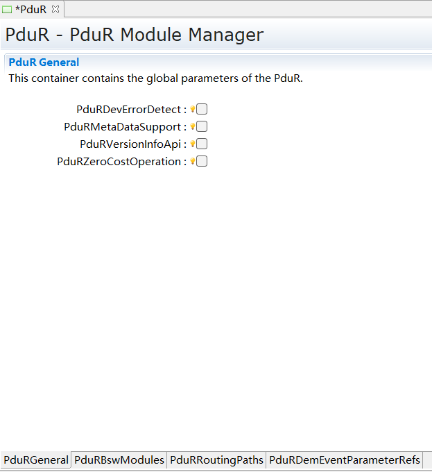

===================
PduR
===================
.. 标题标识符“===”的长度必须要大于其内容的长度，否则会报错，其他标题亦是如此

文档信息(Document Information)
=======================================

版本历史(Version History)
-----------------------------------

.. list-table::
   :widths: 10 10 10 10 20
   :header-rows: 1

   * - 日期(Date)
     - 作者(Author)
     - 版本(Version)
     - 状态(Status)
     - 说明(Description)
   * - 2024/11/28
     - 赵彤(Zhao Tong)
     - V0.1
     - 发布(Release)
     - 首次发布(First release)
   * - 2025/04/04
     - 赵彤(Zhao Tong)
     - V1.0
     - 发布(Release)
     - 正式发布(Official release)

参考文档(References)
----------------------------------

.. list-table::
   :widths: 10 10 30 10
   :header-rows: 1

   * - 编号(Number)
     - 分类(Classification)
     - 标题(Title)
     - 版本(Version)
   * - 1
     - Autosar
     - AUTOSAR_CP_SRS_Gateway
     - R23-11
   * - 2
     - Autosar
     - AUTOSAR_CP_SWS_PDURouter.pdf
     - R23-11

术语与简写(Terms and Abbreviations)
========================================

术语(Term)
----------------------
   .. :align: center   表格内容居中(Table contents are centered)

.. list-table::
   :widths: 10 40
   :header-rows: 1

   * - 术语(Term)
     - 解释(Explanation)

   * - on-the-fly gatewaying
     - 网关能力：在两个TP模块之间进行路由，在接收到所有数据之前(当达到指定阈值时)开始转发数据。(Gateway capability: Routes between two TP modules and starts forwarding data before all data is received (when the specified threshold is reached).)

   * - multicast operation
     - 多播路由，即1：N(Multicast routing, i.e., 1:N)

   * - data provision
     - 数据提供方式：direct data provision 和 trigger transmit data provision(Data provision methods: direct data provision and trigger transmit data provision)

   * - last-is-best buffering
     - Buffer策略：队列深度为1，后接收的数据会覆盖前面存储的数据(Buffer strategy: Queue depth is 1, and subsequently received data overwrites previously stored data)

   * - FIFO buffering
     - Buffer策略：队列深度大于1，采用First in first out(Buffer strategy: Queue depth greater than 1, using First In First Out)

简写(Abbreviations)
------------------------

.. list-table::
   :widths: 10 20 30
   :header-rows: 1

   * - 简写(Abbreviation)
     - 全称(Full name)
     - 解释(Explanation)

   * - <SrcLo>
     - Lower layer communication interface module acting as a source of the I-PDU
     - 下层IF模块关联的PDU作为PduR中的Source I-PDU(Lower layer IF module associated PDU serves as Source I-PDU in PduR)

   * - <DstLo>
     - Lower layer communication interface module acting as a destination of the I-PDU
     - 下层IF模块关联的PDU作为PduR中的Dest I-PDU(Lower layer IF module associated PDU serves as Destination I-PDU in PduR)

   * - <SrcLoTp>
     - Lower layer transport protocol module acting as a source of the I-PDU
     - 下层TP模块关联的PDU作为PduR中的Source I-PDU(Lower layer TP module associated PDU serves as Source I-PDU in PduR)

   * - <DstLoTp>
     - Lower layer transport protocol module acting as a destination of the I-PDU
     - 下层TP模块关联的PDU作为PduR中的Dest I-PDU(Lower layer TP module associated PDU serves as Destination I-PDU in PduR)

   * - I-PDU ID
     - PDU Identifier
     - PDU的ID号(PDU identifier)

   * - I-PDU
     - Interaction Layer PDU
     - 交互层PDU，涉及PDU的ID号，PDU长度，PDU数据(Interaction Layer PDU, involving PDU ID, PDU length, and PDU data)

   * - Upper Layer Modules (Up)
     - Modules above the PDU Router
     - 在AUTOSAR架构下，处于PduR上层的模块(Modules above PduR in AUTOSAR architecture)

   * - Lower Layer Modules (Lo)
     - Modules below the PDU Router
     - 在AUTOSAR架构下，处于PduR下层的模块(Modules below PduR in AUTOSAR architecture)

   * - FIFO
     - First In First Out
     - Buffer深度大于1，采用先入先出机制存储(Buffer depth greater than 1, using First In First Out storage mechanism)

   * - DET
     - Default Error Tracer
     - 错误检测模块(Error detection module)

简介(Introduction)
============================

PduR模块主要为通信接口模块(如CanIf)，传输协议模块(如CanTp)，诊断服务模块(如Dcm)，通信服务模块(如Com, LdCom)，以及IpduM，SecOc等模块提供基于PDU的路由服务。PduR模块主要实现基于PDU的接收路由(PDU从CanIf→PduR→Com)，发送路由(Com→PduR→CanIf)，网关路由功能(CanIf→PduR→CanIf)。

The PduR module provides PDU-based routing services for communication interface modules (e.g., CanIf), transport protocol modules (e.g., CanTp), diagnostic service modules (e.g., Dcm), communication service modules (e.g., Com, LdCom), as well as modules such as IpduM and SecOc. The PduR module implements PDU-based reception routing (PDU from CanIf→PduR→Com), transmission routing (Com→PduR→CanIf), and gateway routing (CanIf→PduR→CanIf).

.. figure:: ../../../_static/参考手册/PduR/简介.png
   :alt: PduR模块层次图
   :name: PduR_module_hierarchy
   :align: center

   PduR模块层次图(PduR Module Hierarchy Diagram)

与PduR模块存在交互的模块可分为三类：1.下层模块(如CanIf, CanTp)；2.上层模块(如Com, Dcm)；3.既是上层又是下层模块(IpduM, SecOC)。
PduR与所有交互模块间实现IF PDU和TP PDU的接收与发送功能。

Modules interacting with the PduR module fall into three categories: 1. Lower-layer modules (e.g., CanIf, CanTp); 2. Upper-layer modules (e.g., Com, Dcm); 3. Modules serving as both upper and lower layers (IpduM, SecOC).
The PduR module handles reception and transmission of IF PDUs and TP PDUs with all interacting modules.

功能描述(Functional Description)
==========================================

特性(Features)
--------------------------

发送路由功能(Transmit Routing Function)
~~~~~~~~~~~~~~~~~~~~~~~~~~~~~~~~~~~~~~~~~~~~~~~~
Tx PDU的发送分为两种方式(IF和TP)，在PduR模块实现TP PDU的1:1发送路由，IF PDU的1:N发送路由。通过PduR模块的路由配置可以为上层屏蔽网络细节，上层模块专注于Tx PDU报文数据的封装。

Tx PDU transmission operates in two modes (IF and TP). The PduR module implements 1:1 transmit routing for TP PDUs and 1:N transmit routing for IF PDUs. The PduR routing configuration shields upper layers from network details, allowing upper-layer modules to focus on Tx PDU message data encapsulation.

接收路由功能(Receive Routing Function)
~~~~~~~~~~~~~~~~~~~~~~~~~~~~~~~~~~~~~~~~~~~~
Rx PDU的接收分为两种方式(IF和TP)，在PduR模块实现TP PDU的1:N接收路由，IF PDU的1:N接收路由。当PDU从下层模块接收到，根据PduR配置的路由路径传递到上层模块。上层模块不必关注网络细节，专注于接收PDU的解析。

Rx PDU reception operates in two modes (IF and TP). The PduR module implements 1:N receive routing for TP PDUs and 1:N receive routing for IF PDUs. When a PDU is received from a lower-layer module, it is delivered to upper-layer modules according to the PduR-configured routing path. Upper-layer modules do not need to focus on network details and can concentrate on received PDU parsing.

网关路由功能(Gateway Routing Function)
~~~~~~~~~~~~~~~~~~~~~~~~~~~~~~~~~~~~~~~~~~~~~~~
PDU的网关同样分为IF/TP两种方式，IF网关支持1:N，TP网关也支持1:N，不涉及任何报文数据的变化，收发报文速率保持一致(如果目的端报文长度小于源端报文长度，会进行截断以确保网关功能正常)。
需注意PDU的网关不能IF、TP混用，即接收的IF PDU只能通过发送IF PDU进行转发，接收的TP PDU只能通过发送TP PDU进行转发。

PDU gateway operation is also divided into IF/TP modes. The IF gateway supports 1:N routing, and the TP gateway also supports 1:N routing. This process does not modify message data, and transmission/reception rates remain consistent (if the destination message length is shorter than the source message length, truncation occurs to ensure successful gateway operation).
Note that PDU gateways cannot mix IF and TP modes: received IF PDUs can only be forwarded via transmitted IF PDUs, and received TP PDUs can only be forwarded via transmitted TP PDUs.

路由控制功能(Routing Control Function)
~~~~~~~~~~~~~~~~~~~~~~~~~~~~~~~~~~~~~~~~~~~~~~
PduR的路由控制以RoutingPathGroup为单位进行启用/禁用控制，而PduRRoutingPath通过PduRRoutingPathGroupRef可以关联N个RoutingPathGroup，只要关联的至少一个RoutingPathGroup启用，则对应的PduRDestPdu使能。

PduR routing control enables/disables RoutingPathGroups as units. PduRRoutingPath can associate with N RoutingPathGroups via PduRRoutingPathGroupRef. The corresponding PduRDestPdu is enabled when at least one associated RoutingPathGroup is enabled.

.. only:: doc_pbs

支持变体功能(Variant Support Function)
~~~~~~~~~~~~~~~~~~~~~~~~~~~~~~~~~~~~~~~~
- 支持不同的转发路径

  Supports different forwarding paths

- 支持不同的数据提供方式

  Supports different data provision methods

- 支持不同的队列深度

  Supports different queue depths

- 支持不同的私有buffer

  Supports different private buffers

- 支持不同的路由组

  Supports different routing groups

- 支持不同的阈值on the fly gatewaying

  Supports different thresholds for on-the-fly gatewaying

偏差(Dviation)
--------------

None

扩展(Expansion)
----------------

None

集成(Integration)
==========================

文件列表(File List)
----------------------------

静态文件(Static Files)
~~~~~~~~~~~~~~~~~~~~~~~~~~~~~~~~~~~~~~

.. list-table::
   :widths: 10 30
   :header-rows: 1

   * - 文件(File)
     - 描述(Description)
   
   * - PduR.c
     - 作为PduR模块的核心文件，实现PduR模块全部对外接口，以及实现PduR模块功能所必须的local变量定义、local函数定义和声明。(Serves as the core file of the PduR module, implementing all external interfaces and necessary local variable definitions, local function definitions, and declarations for PduR module functionality.)

   * - PduR.h
     - 实现PduR模块全部外部接口的声明，以及配置文件中全局变量的声明，必要宏的定义。(Declares all external interfaces of the PduR module, global variables from configuration files, and necessary macro definitions.)

   * - PduR_Route.c
     - 实现PduR模块Route功能需要使用到的全部内部接口函数定义、local函数声明。(Implements all internal interface function definitions and local function declarations required for the PduR module's routing functionality.)

   * - PduR_Route.h
     - 实现PduR模块Route功能需要使用到的全部内部接口函数声明。(Declares all internal interface functions required for the PduR module's routing functionality.)

   * - PduR_Buffer.c
     - 实现PduR模块Buffer功能需要使用到的全部内部接口函数定义，以及实现Buffer功能所必须的local变量定义、local函数定义和声明。(Implements all internal interface function definitions, and necessary local variable definitions, local function definitions, and declarations for the PduR module's buffer functionality.)

   * - PduR_Buffer.h
     - 实现PduR模块Buffer功能需要使用到的全部内部接口函数声明。(Declares all internal interface functions required for the PduR module's buffer functionality.)

   * - PduR_Internal.c
     - 实现PduR模块内部全局变量的定义，内部接口的实现。(Defines internal global variables and implements internal interfaces for the PduR module.)

   * - PduR_Internal.h
     - 实现PduR模块内部宏的定义，全局变量的声明，内部inline接口的实现。(Defines internal macros, declares global variables, and implements internal inline interfaces for the PduR module.)

   * - PduR_Types.h
     - 实现外部/内部类型的定义，包括AUTOSAR标准定义的类型，以及PB/PC配置参数结构体类型，以及内部运行时结构体类型。(Defines external/internal types, including AUTOSAR standard types, PB/PC configuration parameter structure types, and internal runtime structure types.)

   * - PduR_MemMap.h
     - 实现PduR模块内存布局。(Implements the memory layout for the PduR module.)

动态文件(Dynamic Files)
~~~~~~~~~~~~~~~~~~~~~~~~~~~~

.. list-table::
   :widths: 10 30
   :header-rows: 1

   * - 文件(File)
     - 描述(Description)
   
   * - PduR_Cfg.h
     - 定义PduR模块PC配置的宏定义(Defines macros for PduR module post-build configuration)

   * - PduR_Cfg.c
     - 定义PduR模块PC配置的结构体参数(Defines structure parameters for PduR module post-build configuration)

   * - PduR_PBcfg.h
     - 定义PduR模块PB配置的宏定义(Defines macros for PduR module pre-compile configuration)

   * - PduR_PBcfg.c
     - 定义PduR模块PB配置的结构体参数(Defines structure parameters for PduR module pre-compile configuration)

   * - PduR_<Module>.h
     - 实现Module需要调用的PduR接口宏定义(Implements PduR interface macro definitions required by specific modules)

错误处理(Error Handling)
--------------------------------

开发错误(Development Errors)
~~~~~~~~~~~~~~~~~~~~~~~~~~~~~~~~~~
.. list-table:: 
   :widths: 20 10 30
   :header-rows: 1

   * - Error code
     - Value[hex]
     - Description

   * - PDUR_E_INIT_FAILED
     - 0x00
     - Invalid configuration pointer

   * - PDUR_E_UNINIT
     - 0x01
     - API service (except PduR_GetVersionInfo) used without module initialization or PduR_Init called in any state other than PDUR_UNINIT

   * - PDUR_E_PDU_ID_INVALID
     - 0x02
     - Invalid PDU identifier

   * - PDUR_E_ROUTING_PATH_GROUP_ID_INVALID
     - 0x08
     - If the routing table is invalid that is given to the PduR_EnableRouting or PduR_DisableRouting functions

产品错误(Product Errors)
~~~~~~~~~~~~~~~~~~~~~~~~~~~~~~~
无

运行时错误(Runtime Errors)
~~~~~~~~~~~~~~~~~~~~~~~~~~~~~~~~~~
.. list-table:: 
   :widths: 20 10 30
   :header-rows: 1

   * - Error code
     - Value[hex]
     - Description

   * - PDUR_E_TP_GW_TX_REQ_REJECTED
     - 0x03
     - TP module rejected a transmit request for a valid PDU identifier in case of gateway operation

   * - PDUR_E_PDU_INSTANCES_LOST
     - 0x0a
     - Loss of a PDU instance (buffer overrun in gateway operation)

.. 引用接口描述。来自于code->doxygen->latex->rst
.. include:: PduR_h_api.rst

配置(Configuration)
==========================

发送路由配置(Transmit Routing Configuration)
--------------------------------------------------------------
IF PDU的发送：

IF PDU Transmission:

  在PduR添加配置路由PduRRoutingPath，为每一个PduRDestPdu配置一个PduRRoutingPath(IF PDU 1:N路由场景就存在N个PduRRoutingPath，这N个PduRRoutingPath的PduRSrcPduRef相同)。
  其中PduRRouteType配置为IF，配置项PduRSrcPduRef关联一个PduRSrcPdu，该PduRSrcPdu通过PduRSrcPduRef关联的PDU(EcuC)与上层模块发送Tx PDU关联，
  配置项PduRDestPduRef关联一个PduRDestPdu，该PduRDestPdu通过PduRDestPduRef关联的PDU与下层IF模块关联。
  上层模块通过调用PduR_<Up>Transmit或者下层模块通过调用PduR_<Lo>TriggerTransmit(传递到上层)请求PDU的发送，
  发送成功后调用上层PduR_<LoTxConfirmation进行发送成功确认。

  Configure PduRRoutingPath in PduR, assigning one PduRRoutingPath per PduRDestPdu (IF PDU 1:N routing requires N PduRRoutingPaths sharing the same PduRSrcPduRef).
  Set PduRRouteType to IF, where PduRSrcPduRef associates with a PduRSrcPdu linked to the upper module's Tx PDU via PduRSrcPduRef-associated PDU (EcuC).
  PduRDestPduRef associates with a PduRDestPdu linked to the lower IF module via PduRDestPduRef-associated PDU.
  Upper modules call PduR_<Up>Transmit or lower modules call PduR_<Lo>TriggerTransmit (forwarded to upper layer) to request PDU transmission.
  Upon successful transmission, upper layer PduR_<LoTxConfirmation is called for transmission confirmation.

TP PDU的发送：

TP PDU Transmission:

  在PduR添加配置路由PduRRoutingPath，为每一个PduRDestPdu配置一个PduRRoutingPath。其中PduRRouteType配置为TP，配置项PduRSrcPduRef关联一个PduRSrcPdu，
  该PduRSrcPdu通过PduRSrcPduRef关联的PDU(EcuC)与上层模块发送Tx PDU关联，配置项PduRDestPduRef关联一个PduRDestPdu，该PduRDestPdu通过PduRDestPduRef关联的PDU与下层TP模块关联。
  上层模块通过调用PduR_<Up>Transmit请求PDU的发送，下层模块通过调用PduR_<LoTp>CopyTxData(传递到上层)来获取PDU发送数据段，
  下层模块通过调用PduR_<LoTp>TxConfirmation(传递到上层)通知上层发送结束(成功/失败)。

  Configure PduRRoutingPath in PduR, assigning one PduRRoutingPath per PduRDestPdu. Set PduRRouteType to TP, where PduRSrcPduRef associates with a PduRSrcPdu
  linked to the upper module's Tx PDU via PduRSrcPduRef-associated PDU (EcuC). PduRDestPduRef associates with a PduRDestPdu linked to the lower TP module via PduRDestPduRef-associated PDU.
  Upper modules call PduR_<Up>Transmit to request PDU transmission. Lower modules call PduR_<LoTp>CopyTxData (forwarded to upper layer) to obtain PDU transmission data segments,
  and call PduR_<LoTp>TxConfirmation (forwarded to upper layer) to notify the upper layer of transmission completion (success/failure).

接收路由配置(Receive Routing Configuration)
------------------------------------------------
IF PDU的接收：

IF PDU Reception:

  在PduR添加配置路由PduRRoutingPath，为每一个PduRDestPdu配置一个PduRRoutingPath(1:N路由场景就存在N个PduRRoutingPath，这N个PduRRoutingPath的PduRSrcPduRef相同)。
  其中PduRRouteType配置为IF，配置项PduRSrcPduRef关联一个PduRSrcPdu，该PduRSrcPdu通过PduRSrcPduRef关联的PDU(EcuC)与下层IF模块接收Rx PDU关联，
  配置项PduRDestPduRef关联一个PduRDestPdu，该PduRDestPdu通过PduRDestPduRef关联的PDU与上层模块关联。下层模块通过调用PduR_<Lo>RxIndication将接收报文传递给上层。

  Configure PduRRoutingPath in PduR, assigning one PduRRoutingPath per PduRDestPdu (1:N routing requires N PduRRoutingPaths sharing the same PduRSrcPduRef).
  Set PduRRouteType to IF, where PduRSrcPduRef associates with a PduRSrcPdu linked to the lower IF module's Rx PDU via PduRSrcPduRef-associated PDU (EcuC).
  PduRDestPduRef associates with a PduRDestPdu linked to the upper module via PduRDestPduRef-associated PDU. Lower modules call PduR_<Lo>RxIndication to forward received messages to the upper layer.

TP PDU的接收：

TP PDU Reception:

  在PduR添加配置路由PduRRoutingPath，为每一个PduRDestPdu配置一个PduRRoutingPath(1:N路由场景就存在N个PduRRoutingPath，这N个PduRRoutingPath的PduRSrcPduRef相同)。
  其中PduRRouteType配置为TP，配置项PduRSrcPduRef关联一个PduRSrcPdu，该PduRSrcPdu通过PduRSrcPduRef关联的PDU(EcuC)与下层TP模块接收Rx PDU关联，
  配置项PduRDestPduRef关联一个PduRDestPdu，该PduRDestPdu通过PduRDestPduRef关联的PDU与上层模块关联。调用PduR_<LoTp>StartOfReception，
  PduR_<LoTp>CopyRxData，PduR_<LoTp>RxIndication完成TP PDU接收流程。

  Configure PduRRoutingPath in PduR, assigning one PduRRoutingPath per PduRDestPdu (1:N routing requires N PduRRoutingPaths sharing the same PduRSrcPduRef).
  Set PduRRouteType to TP, where PduRSrcPduRef associates with a PduRSrcPdu linked to the lower TP module's Rx PDU via PduRSrcPduRef-associated PDU (EcuC).
  PduRDestPduRef associates with a PduRDestPdu linked to the upper module via PduRDestPduRef-associated PDU. Call PduR_<LoTp>StartOfReception,
  PduR_<LoTp>CopyRxData, and PduR_<LoTp>RxIndication to complete the TP PDU reception process.

网关路由配置(Gateway Routing Configuration)
----------------------------------------------
IF PDU的网关：

IF PDU Gateway:

  在PduR添加配置路由PduRRoutingPath，为每一个PduRDestPdu配置一个PduRRoutingPath(1:N路由场景就存在N个PduRRoutingPath，这N个PduRRoutingPath的PduRSrcPduRef相同)。其中PduRRouteType配置为IF，配置项PduRSrcPduRef关联一个PduRSrcPdu，该PduRSrcPdu通过PduRSrcPduRef关联的PDU(EcuC)与下层IF模块接收Rx PDU关联，配置项PduRDestPduRef关联一个PduRDestPdu，该PduRDestPdu通过PduRDestPduRef关联的PDU与下层IF模块发送Tx PDU关联，若PduRDestPduRef通过PduRDestPduRef关联的Tx PDU发送方式为TriggerTransmit, 则相应PduRDestPdu的PduRDestPduDataProvision需配置为PDUR_TRIGGERTRANSMIT，反之配置为PDUR_DIRECT。若配置为PDUR_TRIGGERTRANSMIT则必须为该PduRRoutingPath配置queue，以及配置PduRDefaultValueElement来设置PDU初始默认值。配置为PDUR_DIRECT时也可以选择配置queue，以降低丢帧概率。
  
  Configure PduRRoutingPath in PduR, assigning one PduRRoutingPath per PduRDestPdu (1:N routing requires N PduRRoutingPaths sharing the same PduRSrcPduRef). Set PduRRouteType to IF, where PduRSrcPduRef associates with a PduRSrcPdu linked to the lower IF module's Rx PDU via PduRSrcPduRef-associated PDU (EcuC). PduRDestPduRef associates with a PduRDestPdu linked to the lower IF module's Tx PDU via PduRDestPduRef-associated PDU. If the Tx PDU transmission mode is TriggerTransmit, configure PduRDestPduDataProvision as PDUR_TRIGGERTRANSMIT; otherwise, configure as PDUR_DIRECT. PDUR_TRIGGERTRANSMIT requires queue configuration for this PduRRoutingPath and PduRDefaultValueElement to set initial PDU default values. PDUR_DIRECT optionally supports queue configuration to reduce frame loss probability.

  注意：queue的配置，①需要在相应的PduRRoutingPath中配置非0的PduRQueueDepth值；②添加PduRTxBuffer配置，没有被任何PduRRoutingPath关联的PduRTxBuffer属于Global buffer，存在资源抢占。仅被某一个PduRRoutingPath关联的PduRTxBuffer属于该PduRRoutingPath的Dedicated buffer，该PduRTxBuffer仅可以被该PduRRoutingPath申请；③PduRDestTxBufferRef可以关联最多PduRQueueDepth个PduRTxBuffer，也可以不关联任何PduRTxBuffer。

  Note for queue configuration: ① Configure non-zero PduRQueueDepth in the corresponding PduRRoutingPath; ② Add PduRTxBuffer configuration. Unassociated PduRTxBuffers are Global buffers subject to resource contention. PduRTxBuffers associated with only one PduRRoutingPath are Dedicated buffers exclusively available to that path; ③ PduRDestTxBufferRef can associate with up to PduRQueueDepth PduRTxBuffers, or remain unassociated.

TP PDU的网关：

TP PDU Gateway:

  在PduR添加配置路由PduRRoutingPath，为每一个PduRDestPdu配置一个PduRRoutingPath(1:N路由场景就存在N个PduRRoutingPath，这N个PduRRoutingPath的PduRSrcPduRef相同)。其中PduRRouteType配置为TP，配置项PduRSrcPduRef关联一个PduRSrcPdu，该PduRSrcPdu通过PduRSrcPduRef关联的PDU(EcuC)与下层TP模块接收Rx PDU关联，配置项PduRDestPduRef关联一个PduRDestPdu，该PduRDestPdu通过PduRDestPduRef关联的PDU与下层TP模块发送Tx PDU关联。若不希望等到全部Rx PDU数据接收完成才开始执行转发，即希望通过"on-the-fly gatewaying"方式进行转发，可通过配置PduRTpThreshold(1:N时只允许最多一个相同PduRSrcPduRef的PduRRoutingPath配置阈值)来实现，当接收数据长度超过该阈值或者接收完成，则触发Tx PDU进行转发。
  
  Configure PduRRoutingPath in PduR, assigning one PduRRoutingPath per PduRDestPdu (1:N routing requires N PduRRoutingPaths sharing the same PduRSrcPduRef). Set PduRRouteType to TP, where PduRSrcPduRef associates with a PduRSrcPdu linked to the lower TP module's Rx PDU via PduRSrcPduRef-associated PDU (EcuC). PduRDestPduRef associates with a PduRDestPdu linked to the lower TP module's Tx PDU via PduRDestPduRef-associated PDU. For on-the-fly gatewaying (forwarding before complete reception), configure PduRTpThreshold (only one PduRRoutingPath per PduRSrcPduRef in 1:N routing). Tx PDU forwarding triggers when received data length exceeds this threshold or reception completes.

  注意：TP PDU的网关必须配置queue；IF PDU的网关(PduRDestPduDataProvision为PDUR_TRIGGERTRANSMIT的路由必须配置queue；PDUR_DIRECT的路由不需要配queue，如果配置的话可以在一定程度上减少丢帧)

  Note: TP PDU gateways require queue configuration; IF PDU gateways with PDUR_TRIGGERTRANSMIT require queues; PDUR_DIRECT routes don't require queues but can benefit from reduced frame loss if configured.

路由控制配置(Routing Control Configuration)
-------------------------------------------------
基于下面原则：(Based on the following principles:)
~~~~~~~~~~~~~~~~~~~~~~~~~~~~~~~~~~~~~~~~~~~~~~~~~~~~~~~~~
#. RoutingPathGroup通过配置项PduRIsEnabledAtInit决定初始化之后，该RoutingPathGroup的使能状态

   RoutingPathGroup determines its enable state after initialization through PduRIsEnabledAtInit configuration

#. 所有PduRRoutingPath通过PduRRoutingPathGroupRef会关联0..N个RoutingPathGroup

   All PduRRoutingPaths associate with 0..N RoutingPathGroups via PduRRoutingPathGroupRef

#. 如果该PduRRoutingPath未关联任何RoutingPathGroup 或者 关联的至少一个RoutingPathGroup处于使能状态，则该PduRRoutingPath对应的PduRDestPdu(唯一)为Enable，否则为Disable状态

   PduRDestPdu (unique) is enabled if its PduRRoutingPath is unassociated or associated with at least one enabled RoutingPathGroup; otherwise disabled

#. 运行时，通过调用PduR_EnableRouting/ PduR_DisableRouting来控制RoutingPathGroup的使能状态，从而间接控制PduRDestPdu使能状态

   During runtime, call PduR_EnableRouting/PduR_DisableRouting to control RoutingPathGroup enable states, indirectly controlling PduRDestPdu enable states

#. 未通过PduRRoutingPathGroupRef关联任何RoutingPathGroup的PduRDestPdu初始化之后其状态一直为Enable，不可改变

   PduRDestPdu unassociated with any RoutingPathGroup via PduRRoutingPathGroupRef remains permanently enabled after initialization

多分区控制配置 Multi-Partition(Control Configuration)
----------------------------------------------------------
如果在工程中EcucPartition存在大于1个的配置，则认为该工程支持多分区/多核。
PduR共有三个独占区保护类型：

Projects with more than one EcucPartition configuration support multi-partition/multi-core.
PduR provides three exclusive area protection types:

#. SchM_Enter_PduR_ExclusiveArea_Group是对于Group使能或者禁用的保护，因为一个group下的destpdu均属于一个分区，推荐使用禁中断方式ALL_INTERRUPT_BLOCKING

   SchM_Enter_PduR_ExclusiveArea_Group protects group enable/disable operations. Since destpdus within a group belong to one partition, use ALL_INTERRUPT_BLOCKING

#. SchM_Enter_PduR_ExclusiveArea_Route是对于PduRBuffer申请的保护，

   SchM_Enter_PduR_ExclusiveArea_Route protects PduRBuffer allocation:

   - (推荐)如果所有需要配置PduRBuffer的PduRRoutingPath，均配置了私有buffer，且不存在共用私有buffer，则推荐使用禁中断方式ALL_INTERRUPT_BLOCKING；

     (Recommended) Use ALL_INTERRUPT_BLOCKING if all PduRRoutingPaths requiring PduRBuffer have private buffers without sharing

   - 如果存在共用buffer且会同时申请buffer，则需要配置为OS_SPINLOCK；

     Use OS_SPINLOCK if shared buffers may be allocated concurrently

#. SchM_Enter_PduR_ExclusiveArea_Init是对于初始化时逻辑的保护，推荐使用禁中断方式ALL_INTERRUPT_BLOCKING

   SchM_Enter_PduR_ExclusiveArea_Init protects initialization logic; use ALL_INTERRUPT_BLOCKING

配置(Configuration)
==================================

PduRGeneral配置(PduRGeneral Configuration)
----------------------------------------------------

   PduR通用配置(PduR General Configuration)

常规参数配置列表(General Parameter Configuration List)
~~~~~~~~~~~~~~~~~~~~~~~~~~~~~~~~~~~~~~~~~~~~~~~~~~~~~~~~~~~~~~~~~~

.. list-table::
   :widths: 10 10 10 30 20
   :header-rows: 1

   * - 参数名称(Parameter Name)
     - 参数范围(Parameter Range)
     - 默认取值(Default Value)
     - 参数描述(Parameter Description)
     - 依赖关系(Dependencies)
	 
   * - PduRDevErrorDetect
     - TRUE/FALSE
     - FALSE
     - 是否使能DET开发错误检测(Enables DET development error detection)
     - 依赖于Det模块的支持(Requires Det module support)
	 
   * - PduRMetaDataSupport
     - TRUE/FALSE
     - FALSE
     - 是否使能MetaData机制(Enables metadata mechanism)
     - 路由表中源PDU和目标PDU的MetaData类型必须一致(Source and destination PDU metadata types must match in routing table)
	 
   * - PduRVersionInfoApi
     - TRUE/FALSE
     - FALSE
     - 是否使能获取模块软件版本(Enables module version information API)
     - 无(None)
	 
   * - PduRZeroCostOperation
     - TRUE/FALSE
     - FALSE
     - 是否使能PduR"透传模式"(Enables PduR transparent pass-through mode)
     - "透传模式"通常用于PduR上下层模块固定且一一对应，不涉及网关(Used when PduR upper/lower modules have fixed one-to-one mapping without gateway functionality)

PduRBswModules配置(PduRBswModules Configuration)
---------------------------------------------------------

.. figure:: ../../../_static/参考手册/PduR/PduRBswModules.png
   :alt: fig_模块配置图(fig_Module Configuration Diagram)
   :name: PduRBswModules
   :align: center

   PduR Bsw Moduele Configuration

常规参数配置列表(General Parameter Configuration List)
~~~~~~~~~~~~~~~~~~~~~~~~~~~~~~~~~~~~~~~~~~~~~~~~~~~~~~~~~~~~~~~~~~~~
Autosar架构下，各模块与PduR模块交互的API配置，工具已支持默认勾选(CDD模块除外)

In AUTOSAR architecture, API configurations for module interactions with PduR are pre-selected by default (except CDD modules)

.. list-table::
   :widths: 10 10 10 30 20
   :header-rows: 1

   * - 参数名称(Parameter Name)
     - 参数范围(Parameter Range)
     - 默认取值(Default Value)
     - 参数描述(Parameter Description)
     - 依赖关系(Dependencies)
	 
   * - PduRCancelReceive
     - TRUE/FALSE
     - TRUE
     - 模块是否支持接收取消(Whether the module supports reception cancellation)
     - PduRBswModuleRef关联TP模块时，该项才可配置(Configurable only when PduRBswModuleRef is associated with a TP module)
	 
   * - PduRCancelTransmit
     - TRUE/FALSE
     - TRUE
     - 模块是否支持发送取消(Whether the module supports transmission cancellation)
     - 无(None)
	 
   * - PduRCommunicationInterface
     - TRUE/FALSE
     - FALSE
     - 模块是否支持IF PDU传输(Whether the module supports IF Pdu transmission)
     - 根据PduRBswModuleRef关联的模块自动配置(Auto-configured based on PduRBswModuleRef association)
	 
   * - PduRCopyRxData
     - TRUE/FALSE
     - TRUE
     - 模块是否支持TP I-PDU数据段接收(Whether the module supports TP I-PDU data segment reception)
     - PduRBswModuleRef关联TP模块时，该项才可配置(Configurable only when PduRBswModuleRef is associated with a TP module)
	 
   * - PduRCopyTxData
     - TRUE/FALSE
     - TRUE
     - 模块是否支持TP I-PDU发送数据段拷贝(Whether the module supports TP I-PDU transmission data segment copying)
     - PduRBswModuleRef关联TP模块时，该项才可配置(Configurable only when PduRBswModuleRef is associated with a TP module)
	 
   * - PduRLowerModule
     - TRUE/FALSE
     - FALSE
     - 模块是否处于PduR下层(Whether the module is at the lower layer of PduR)
     - 根据PduRBswModuleRef关联的模块自动配置(Auto-configured based on PduRBswModuleRef association)
	 
   * - PduRRetransmission
     - TRUE/FALSE
     - TRUE
     - 模块是否支持TP PDU重传(Whether the module supports TP Pdu retransmission)
     - PduRBswModuleRef关联TP模块时，该项才可配置(Configurable only when PduRBswModuleRef is associated with a TP module)
	 
   * - PduRRxIndication
     - TRUE/FALSE
     - TRUE
     - 模块是否支持IF PDU接收(Whether the module supports IF Pdu reception)
     - PduRBswModuleRef关联IF模块时，该项才可配置(Configurable only when PduRBswModuleRef is associated with a IF module)
	 
   * - PduRStartOfReception
     - TRUE/FALSE
     - TRUE
     - 模块是否支持TP PDU接收(开始)(Whether the module supports TP Pdu reception (start))
     - PduRBswModuleRef关联TP模块时，该项才可配置(Configurable only when PduRBswModuleRef is associated with a TP module)
	 
   * - PduRTpRxIndication
     - TRUE/FALSE
     - TRUE
     - 模块是否支持TP接收指示(Whether the module supports TP reception indication)
     - PduRBswModuleRef关联TP模块时，该项才可配置(Configurable only when PduRBswModuleRef is associated with a TP module)
	 
   * - PduRTpTransmit
     - TRUE/FALSE
     - TRUE
     - 该模块是否支持TP PDU传输(Whether the module supports TP Pdu transmission)
     - PduRBswModuleRef关联TP模块时，该项才可配置(Configurable only when PduRBswModuleRef is associated with a TP module)
   * - PduRTpTxConfirmation
     - TRUE/FALSE
     - TRUE
     - 模块是否支持TP PDU发送确认(Whether the module supports TP Pdu transmission confirmation)
     - PduRBswModuleRef关联TP模块时，该项才可配置(Configurable only when PduRBswModuleRef is associated with a TP module)
	 
   * - PduRTransmit
     - TRUE/FALSE
     - TRUE
     - 模块是否支持IF PDU发送(Whether the module supports IF Pdu transmission)
     - PduRBswModuleRef关联IF模块时，该项才可配置(Configurable only when PduRBswModuleRef is associated with a IF module)
	 
   * - PduRTransportProtocol
     - TRUE/FALSE
     - FALSE
     - 模块是否支持TP传输(Whether the module supports TP transmission)
     - PduRBswModuleRef关联TP模块时，该项才可配置(Configurable only when PduRBswModuleRef is associated with a TP module)
	 
   * - PduRTriggertransmit
     - TRUE/FALSE
     - TRUE
     - 该模块是否支持IF PDU通过TriggerTransmit机制进行发送(Whether the module supports IF Pdu transmission through the TriggerTransmit mechanism)
     - PduRBswModuleRef关联IF模块时，该项才可配置(Configurable only when PduRBswModuleRef is associated with a IF module)
	 
   * - PduRTxConfirmation
     - TRUE/FALSE
     - TRUE
     - 该模块是否支持IF PDU发送确认(Whether the module supports IF Pdu transmission confirmation)
     - PduRBswModuleRef关联IF模块时，该项才可配置(Configurable only when PduRBswModuleRef is associated with a IF module)
   
   * - PduRUpperModule
     - TRUE/FALSE
     - FALSE
     - 模块是否处于PduR上层(Whether the module is at the upper layer of PduR)
     - 根据PduRBswModuleRef关联的模块自动配置(Auto-configured based on PduRBswModuleRef association)
   
   * - PduRBswModuleRef
     - 索引[Module](Index[Module])
     - 无(None)
     - 关联与PduR模块交互的上下层模块(Associates upper/lower modules interacting with PduR)
     - 根据配置工程中已添加的模块，才能索引(Indexable only based on pre-configured modules in project)

PduRRoutingPaths配置(PduRRoutingPaths Configuration)
-----------------------------------------------------------------

.. figure:: ../../../_static/参考手册/PduR/PduRRoutingPaths.png
   :alt: fig_模块配置图(fig_Module Configuration Diagram)
   :name: PduRRoutingPaths
   :align: center

   PduR RoutingPaths Configuration

常规参数配置列表(List of General Parameter Configurations)
~~~~~~~~~~~~~~~~~~~~~~~~~~~~~~~~~~~~~~~~~~~~~~~~~~~~~~~~~~~~~~~~~

.. list-table::
   :widths: 10 10 10 30 20
   :header-rows: 1

   * - 参数名称(Parameter Name)
     - 参数范围(Parameter Range)
     - 默认取值(Default Value)
     - 参数描述(Parameter Description)
     - 依赖关系(Dependencies)
	 
   * - PduRConfigurationId
     - 0..65535
     - 0
     - 模块PB配置Id号(Module post-build configuration ID)
     - 当前不支持配置(Configuration not currently supported)
	 
   * - PduRMaxRoutingPathCnt
     - 0..65535
     - 20
     - 模块PB配置支持的最大路由路径数(Maximum routing paths supported in post-build configuration)
     - 对配置的路由路径数目进行限制及校验(Limits and validates configured routing path count)
	 
   * - PduRMaxRoutingPathGroupCnt
     - 0..65535
     - 0
     - 模块PB配置支持的最大路由路径组数(Maximum routing path groups supported in post-build configuration)
     - 对配置的路径路径组数目进行限制及校验，该数值决定可以新建几个PduRRoutingPathGroup(Limits and validates routing path group count; determines PduRRoutingPathGroup creation limit)

PduRRoutingPathGroup配置(Configuration of PduRRoutingPathGroup)
-------------------------------------------------------------------

.. figure:: ../../../_static/参考手册/PduR/PduRRoutingPathGroup.png
   :alt: fig_模块配置图(fig_Module Configuration Diagram)
   :name: PduRRoutingPathGroup
   :align: center

   PduR RoutingPath Group Configuration

常规参数配置列表(List of General Parameter Configurations)
~~~~~~~~~~~~~~~~~~~~~~~~~~~~~~~~~~~~~~~~~~~~~~~~~~~~~~~~~~~~~~~~~

.. list-table::
   :widths: 10 10 10 30 20
   :header-rows: 1

   * - 参数名称(Parameter Name)
     - 参数范围(Parameter Range)
     - 默认取值(Default Value)
     - 参数描述(Parameter Description)
     - 依赖关系(Dependencies)
	 
   * - PduRIsEnabledAtInit
     - TRUE/FALSE
     - FALSE
     - 初始化之后该RoutingPathGroup是否使能(Whether the RoutingPathGroup is enabled after initialization)
	 
     - 无(None)
   * - PduRRoutingPathGroupId
     - 0..65535
     - 无(None)
     - 表示RoutingPathGroup的ID(RoutingPathGroup identifier)
     - 工具自动填充(从0开始，逐一递增)(Auto-assigned by tool (starts from 0, increments sequentially))

PduRRoutingPath配置(Configuration of PduRRoutingPath)
----------------------------------------------------------------

.. figure:: ../../../_static/参考手册/PduR/PduRRoutingPath.png
   :alt: fig_模块配置图(fig_Module Configuration Diagram)
   :name: PduRRoutingPath
   :align: center

   PduR RoutingPath Configuration

常规参数配置列表(List of General Parameter Configurations)
~~~~~~~~~~~~~~~~~~~~~~~~~~~~~~~~~~~~~~~~~~~~~~~~~~~~~~~~~~~~~~~~~

.. list-table::
   :widths: 10 10 10 30 20
   :header-rows: 1

   * - 参数名称(Parameter Name)
     - 参数范围(Parameter Range)
     - 默认取值(Default Value)
     - 参数描述(Parameter Description)
     - 依赖关系(Dependencies)
	 
   * - PduRQueueDepth
     - 1..255
     - 无(None)
     - 定义此路由路径的缓存的深度(Defines buffer depth for this routing path)
     - 取值不能大于定义的所有buffer数目之和；可能需要配置队列的场景：① IF Direct网关可配可不配；② IF TriggerTransmit网关必须配置；③ TP网关必须配置；④ TP PDU网关同时接收到上层，接收也需要配置PduRBuffer(Cannot exceed total defined buffer count; Queue configuration scenarios: ① IF Direct gateway optional; ② IF TriggerTransmit gateway required; ③ TP gateway required; ④ TP PDU gateway receiving from upper layer requires PduRBuffer)
	 
   * - PduRTpThreshold
     - 0..65535
     - 无(None)
     - TP PDU on-the-fly网关时，接收到该配置阈值长度的报文后开始执行转发(For TP PDU on-the-fly gateway, starts forwarding after receiving message length reaches this threshold)
     - 该配置项只针对TP网关(TP gateway only)
	 
   * - PduRRouteType
     - IF/TP
     - IF
     - I-PDU路由类型选择(I-PDU routing type selection)
     - 依赖于I-PDU关联的模块对于该路由类型的支持(Depends on I-PDU associated module's routing type support)
	 
   * - PduRDestBufferRef
     - 索引[PduRBuffer](Index[PduRBuffer])
     - 无(None)
     - 关联PduRBuffer，仅被该PduRRoutingPath关联的PduRBuffer属于该PduRRoutingPath的私有buffer，不会被其它Path申请占用(Associates PduRBuffer; exclusively associated buffers are private to this path)
     - 当前Path的PduRQueueDepth配置且大于0(Requires PduRQueueDepth > 0 for current path)
	 
   * - PduRDestPduRRef
     - 索引[PduRDestPdu](Index[PduRDestPdu])
     - 无(None)
     - 关联PduRDestPdu配置(Associates PduRDestPdu configuration)
     - 无(None)
	 
   * - PduRRoutingPathGroupRef
     - 索引[PduRRoutingPathGroup](Index[PduRRoutingPathGroup])
     - 无(None)
     - 关联PduRRoutingPathGroup(Associates PduRRoutingPathGroup)
     - 无(None)
	 
   * - PduRSrcPduRRef
     - 索引[PduRSrcPdu](Index[PduRSrcPdu])
     - 无(None)
     - 关联PduRSrcPdu配置(Associates PduRSrcPdu configuration)
     - 无(None)

PduRDefaultValueElement配置(Configuration of PduRDefaultValueElement)
------------------------------------------------------------------------------

.. figure:: ../../../_static/参考手册/PduR/PduRDefaultValueElement.png
   :alt: fig_模块配置图(fig_Module Configuration Diagram)
   :name: PduRDefaultValueElement
   :align: center

   PduR Default Value Element Configuration

常规参数配置列表(List of General Parameter Configurations)
~~~~~~~~~~~~~~~~~~~~~~~~~~~~~~~~~~~~~~~~~~~~~~~~~~~~~~~~~~~~~~~~~

.. list-table::
   :widths: 10 10 10 30 20
   :header-rows: 1

   * - 参数名称(Parameter Name)
     - 参数范围(Parameter Range)
     - 默认取值(Default Value)
     - 参数描述(Parameter Description)
     - 依赖关系(Dependencies)
	 
   * - PduRDefaultValueElement
     - 0..255
     - 无(None)
     - I-PDU对应字节的默认值(I-PDU byte default value)
     - IF PDU通过TriggerTransmit方式网关时才需要配置；若配置了PduRDefaultValue，其配置的PduRDefaultValueElement字节长度需与ECUC中PDU的PduLength相等(Required for IF PDU TriggerTransmit gatewaying; configured PduRDefaultValueElement byte length must match ECUC PDU PduLength)
	 
   * - PduRDefaultValueElementBytePosition
     - 0..4294967294
     - 无(None)
     - 表示I-PDU字节偏移(I-PDU byte offset)
     - IF PDU通过TriggerTransmit方式网关时才需要配置；根据添加PduRDefaultValueElement依次从0自动递增(Required for IF PDU TriggerTransmit gatewaying; auto-increments from 0 with each added PduRDefaultValueElement)

PduRSrcPdu配置(Configuration of PduRSrcPdu)
-----------------------------------------------------

.. figure:: ../../../_static/参考手册/PduR/PduRSrcPdu.png
   :alt: fig_模块配置图(fig_Module Configuration Diagram)
   :name: PduRSrcPdu
   :align: center

   PduR Src Pdu Configuration

常规参数配置列表(List of General Parameter Configurations)
~~~~~~~~~~~~~~~~~~~~~~~~~~~~~~~~~~~~~~~~~~~~~~~~~~~~~~~~~~~~~~~~~

.. list-table::
   :widths: 10 10 10 30 20
   :header-rows: 1

   * - 参数名称(Parameter Name)
     - 参数范围(Parameter Range)
     - 默认取值(Default Value)
     - 参数描述(Parameter Description)
     - 依赖关系(Dependencies)
	 
   * - PduRSourcePduBlockSize
     - 1..4294967295
     - 无(None)
     - 接收TP继续接收所需的最小缓存(Minimum buffer required for TP reception continuation)
     - 依赖于对应PduRRoutingPath中PduRRouteType为TP的传输，当前不支持(Requires TP routing type in corresponding PduRRoutingPath; not currently supported)
	 
   * - PduRSourcePduHandleId
     - 0..PduIdType
     - 无(None)
     - 表示PduR中SrcPdu handle id(SrcPdu handle identifier in PduR)
     - 工具自动填充(从0开始，逐一递增)(Auto-assigned by tool (starts from 0, increments sequentially))
	 
   * - PduRSrcPduUpTxConf
     - TRUE/FALSE
     - TRUE
     - 表示该SrcPdu支持IF发送确认(Enables IF transmission confirmation for this SrcPdu)
     - 依赖于该SrcPdu所关联模块对IF TxConfirmation的支持(Requires IF TxConfirmation support from associated module)
	 
   * - PduRSrcPduRef
     - 索引[Pdu](Index[Pdu])
     - 无(None)
     - 关联EcuC中配置的PDU(Associates PDU configured in EcuC)
     - 依赖于EcuC中PDU的配置；Source PDU关联的ECUC PDU需与PduRBswModules中的某一PDU关联；PDU关联的ECUC中PDU的配置项PduLength必须配置；IF路由PDU不能关联TP PDU，TP路由的PDU不能关联IF PDU(Requires EcuC PDU configuration; ECUC PDU must associate with PduRBswModules PDU; PduLength must be configured; IF routing cannot associate TP PDU, TP routing cannot associate IF PDU)

PduRDestPdu配置(Configuration of PduRDestPdu)
----------------------------------------------------

.. figure:: ../../../_static/参考手册/PduR/PduRDestPdu.png
   :alt: fig_模块配置图(fig_Module Configuration Diagram)
   :name: PduRDestPdu
   :align: center

   PduR Dest Pdu Configuration

常规参数配置列表(List of General Parameter Configurations)
~~~~~~~~~~~~~~~~~~~~~~~~~~~~~~~~~~~~~~~~~~~~~~~~~~~~~~~~~~~~~~~~~

.. list-table::
   :widths: 10 10 10 30 20
   :header-rows: 1

   * - 参数名称(Parameter Name)
     - 参数范围(Parameter Range)
     - 默认取值(Default Value)
     - 参数描述(Parameter Description)
     - 依赖关系(Dependencies)
	 
   * - PduRDestPduDataProvision
     - PDUR_DIRECT/PDUR_TRIGGERTRANSMIT
     - PDUR_DIRECT
     - IF PDU网关路由的数据传递方式选择(IF PDU gateway routing data provision method)
     - 若选择TriggerTransmit方式，对应的PduRRoutingPath必须配置PduRQueueDepth来对网关I-PDU进行队列缓存；PduRDestPduDataProvision配置为PDUR_DIRECT时，对应的PduRRoutingPath不能配置PduRDefaultValueElement(TriggerTransmit requires PduRQueueDepth for gateway I-PDU buffering; PDUR_DIRECT prohibits PduRDefaultValueElement configuration)
	 
   * - PduRDestPduHandleId
     - 0..PduIdType
     - 无(None)
     - 表示PduR中DestPdu handle id(DestPdu handle identifier in PduR)
     - 工具自动填充(从0开始，逐一递增)(Auto-assigned by tool (starts from 0, increments sequentially))
	 
   * - PduRTransmissionConfirmation
     - TRUE/FALSE
     - TRUE
     - 对于IF PDU发送/网关路由是否支持TxConfirmation(Enables TxConfirmation for IF PDU transmission/gateway routing)
     - 该配置项只针对IF发送/网关(IF transmission/gateway only)
	 
   * - PduRDestPduRef
     - 索引[Pdu](Index[Pdu])
     - 无(None)
     - 关联EcuC中配置的PDU(Associates PDU configured in EcuC)
     - 依赖于EcuC中PDU的配置；Dest PDU关联的ECUC PDU需与PduRBswModules中的某一PDU关联；PDU关联的ECUC中PDU的配置项PduLength必须配置；IF路由PDU不能关联TP PDU，TP路由的PDU不能关联IF PDU；TP路由中仅支持配置1个DestPdu(Requires EcuC PDU configuration; ECUC PDU must associate with PduRBswModules PDU; PduLength must be configured; IF routing cannot associate TP PDU, TP routing cannot associate IF PDU; TP routing supports only one DestPdu)

PduRBuffer配置(Configuration of PduRBuffer)
----------------------------------------------------

.. figure:: ../../../_static/参考手册/PduR/PduRBuffer.png
   :alt: fig_模块配置图(fig_Module Configuration Diagram)
   :name: PduRBuffer
   :align: center

   PduR Buffer Configuration

常规参数配置列表(List of General Parameter Configurations)
~~~~~~~~~~~~~~~~~~~~~~~~~~~~~~~~~~~~~~~~~~~~~~~~~~~~~~~~~~~~~~~~~

.. list-table::
   :widths: 10 10 10 30 20
   :header-rows: 1

   * - 参数名称(Parameter Name)
     - 参数范围(Parameter Range)
     - 默认取值(Default Value)
     - 参数描述(Parameter Description)
     - 依赖关系(Dependencies)
	 
   * - PduRPduMaxLength
     - 1..4294967295
     - 1
     - Buffer的长度(Buffer length)
     - 如果被Buffer被PduRDestBufferRef关联，则长度应配置为关联的DestPDU的最大长度(IF PDU的最大长度/TP PDU的最大单播长度)；否则根据具体配置中可能使用PduRBuffer的PduRRoutingPath关联的PDU length决定；(If buffer associated with PduRDestBufferRef, length equals associated DestPDU maximum length (IF PDU max length/TP PDU max unicast length); otherwise determined by PDU length of potentially associated PduRRoutingPath)
