=========================================
Rte
=========================================

文档信息（Document Information）
=======================================

版本历史（Version History）
-----------------------------------

.. list-table::
   :widths: 10 10 10 10 20
   :header-rows: 1

   * - 日期（Date）
     - 作者（Author）
     - 版本（Version）
     - 状态（Status）
     - 说明（Description）
   * - 2024/12/10
     - Haiyun.Lian、Enjing.Cui、Lianru.Hong、Chunhui.Wang
     - V0.1
     - 发布（Release）
     - 首次发布（First release）
   * - 2025/04/04
     - Haiyun.Lian、Enjing.Cui、Lianru.Hong、Chunhui.Wang
     - V1.0
     - 发布（Release）
     - 正式发布（Official release）

参考文档（Reference Document）
----------------------------------

.. list-table::
   :widths: 10 15 25 10
   :header-rows: 1

   * - 编号（Number）
     - 分类（Classification）
     - 标题（Title）
     - 版本（Version）
   * - 1
     - Autosar
     - AUTOSAR_CP_TPS_SystemTemplate.pdf
     - R23-11
   * - 2
     - Autosar
     - AUTOSAR_CP_TPS_SoftwareComponentTemplate.pdf
     - R23-11
   * - 3
     - Autosar
     - AUTOSAR_CP_SWS_RTE.pdf
     - R23-11
   * - 4
     - Autosar
     - AUTOSAR_CP_SRS_RTE.pdf
     - R23-11
   * - 5
     - Autosar
     - AUTOSAR_CP_EXP_LayeredSoftwareArchitecture.pdf
     - R23-11
   * - 6
     - Autosar
     - AUTOSAR_CP_SWS_OS.pdf
     - R23-11
   * - 7
     - Autosar
     - AUTOSAR_CP_TR_Methodology.pdf
     - R23-11
   * - 8
     - Autosar  
     - AUTOSAR_CP_EXP_VFB.pdf
     - R23-11
   * - 9
     - Autosar
     - AUTOSAR_CP_SWS_COM.pdf
     - R23-11
   * - 10
     - Autosar
     - AUTOSAR_CP_SWS_LargeDataCOM.pdf
     - R23-11

术语与简写（Terms and Abbreviations）
========================================

术语（Term）
----------------
.. list-table::
   :widths: 25 35
   :header-rows: 1

   * - 术语（Term）
     - 解释（Explanation）

   * - RunnableEntity
     - SWC运行实体
     
       A RunnableEntity represents the smallest code-fragment that is provided by an AtomicSwComponent Type and are executed under control of the RTE

   * - BswSchduleEntity
     - Bsw模块调度实体

       Specifies the smallest code fragment which can be described for a BSW module

   * - ExecutableEntity
     - 运行实体,RunnableEntity与BswSchduleEntity的统称

       RunnableEntity and BswSchduleEntity

   * - Client-server Communication
     - CS通信

       Client-server communication involves two entities, the client which is the requirer (or user) of a service and the server that provides the service

   * - Sender-receiver Communication
     - SR通信

       Sender-receiver communication involves the transmission and reception of signals consisting of atomic data elements that are sent by one component and received by one or more components
       
   * - Trigger Communication
     - 内外部触发

       External and Internal Trigger Communication.A software component is able to request the activation of RunnableEntities of connected software components

   * - Mode Switch Notification
     - 模式切换通知

       The communication of a mode switch from the mode manager to the mode user

   * - Inter-ECU communication
     - ECU间通信

       The communication between ECUs, typically using COM is called inter-ECU communication

   * - Inter-Partition communication
     - 分区间通信

       The communication within one ECU but between different partitions, represented by different OS applications

   * - Intra-ECU communication
     - ECU内通信

       The communication within one ECU 

   * - Intra-Partition communication
     - 分区内通信

       The communication within one partition of one ECU

   * - Implicit Read
     - 隐式读

       Implicit Read based Sender-Receiver Communication

   * - Implicit Write
     - 隐式写

       Implicit Write based Sender-Receiver Communication

   * - Explicit Read
     - 显式读

       Explicit Read based Sender-Receiver Communication

   * - Explicit Write
     - 显式写

       Explicit Write based Sender-Receiver Communication
 
   * - Unconnected Port
     - 端口未连接

       A RPortPrototype or PPortPrototype referenced by no AssemblySwConnectors and/or DelegationSwConnectors

   * - Initialization Task
     -  初始化Task，即自启动Task

        AutoStart OsTask

   * - iSoft Initialization Task
     - 由ORIENTAIS自动创建的初始化Task
     
       AutoStart OsTask with prefix "iSoft_Auto", created by RTE automatically

 

简写（Abbreviation）
--------------------------
.. list-table::
   :widths: 15 25 20
   :header-rows: 1

   * - 简写（Abbreviation）
     - 全称（Full name）
     - 解释（Explanation）
   * - RTE
     - Runtime Environment
     - 运行时环境
   * - SWC
     - Software Component
     - 软件组件
   * - BSW
     - Basic Software
     - 基础软件
   * - BSWMD
     - Basic Software Module Description
     - 基础软件模块描述
   * - COM
     - Communication
     - 通信
   * - ECU
     - Electronic Control Unit
     - 电子控制单元
   * - AUTOSAR
     - Automotive Open System Architecture
     - 汽车开放系统架构
   * - C/S
     - Client-server communication
     - 客户端服务器通信
   * - ECUC
     - AUTOSAR ECU Configuration
     - AUTOSAR ECU配置
   * - IOC
     - Inter-OsApplication Communication
     - 跨Os应用通信
   * - S/R
     - Sender-receiver communication
     - 发送方接收方通信
   * - VFB
     - Virtual Function Bus
     - 虚拟功能总线
   * - API
     - Application Programming Interface
     - 应用程序编程接口
   * - NVM
     - Non-volatile Memory Manager 
     - 非易失性存储管理
   * - SchM
     - Schedule Manager
     - 调度管理

简介（Introduction）
==============================
RTE 是 AUTOSAR 虚拟功能总线 (VFB) 基于特定 ECU
的实现，分解为针对Application的Rte和针对BSW的SchM功能。Rte 为整个AUTOSAR基础软件的接口层，为整个ECU提供了运行时环境：

RTE is the realization (for a particular ECU) of the interfaces of the AUTOSAR Virtual Function Bus (VFB), decomposed into Rte for Application and SchM for BSW. RTE providing a runtime environment for the entire ECU:

-  生成TASK函数，负责映射到Task的RunnableEntity的运行调度；

   Generates TASK functions, responsible for the operation scheduling of RunnableEntities mapped to Tasks;

-  为SWC实例与SWC实例间，SWC实例与BSW实例间提供基于S/R（包括NVM读写）、C/S的通信接口；
   
   Provides S/R(including NVM read/write) and C/S communication interfaces between SWC instances, and between SWC instances and BSW instances;

-  为SWC实例提供标定数据读取接口，模式切换接口，独占区接口，内外部触发接口；

   Provides interfaces of calibration , notification of mode switches, exclusive area, and internal/external triggering for SWC instances;

-  为SWC实例内部提供IRV通信接口；
   
   Provides IRV communication interfaces within SWC instances;

-  为每个SWC实例提供PIM接口；
   
   Supplies PIM interfaces for each SWC instance;

SchM
作为简化版“Rte”，实现BSW间C/S通信，实现BswEntity的运行调度，为BSW数据一致性保护提供独占区接口。

SchM
as a simplified version of "Rte", implements C/S communication between BSWs, realizes the scheduling of BswEntities, and provides exclusive area interfaces for BSW data consistency protection.

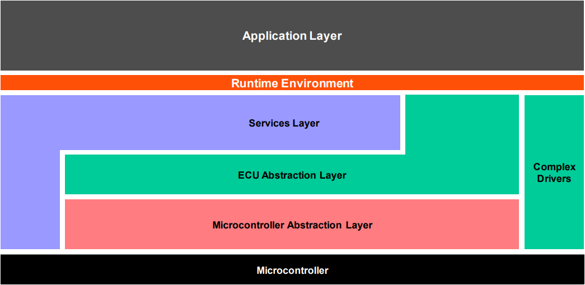

   图 1-1 AUTOSAR 体系结构

   Figure 1-1 AUTOSAR Architecture

功能描述（Functional Description）
==========================================

详细描述面向应用Application的Rte功能，SchM功能适配BSW实现需求进行简要描述。

Describe in detail the Rte functions for the application layer (Application), and briefly describe the SchM functions adapted to the requirements of BSW.

Rte特性（Rte Features）
---------------------------------------
Rte实现Application RunnableEntity的调度，SWC内部通信，SWC与SWC间基于Port的通信，SWC与BSW服务间基于Port的通信。
Rte功能描述分为通用功能和具体功能点(如SR通信、CS通信等)，具体功能点为面向Application直接使用的功能描述，通用功能为支撑具体功能点实现的基础功能。

Rte implements the scheduling of Application RunnableEntities, internal communication of SWCs, Port-based communication between SWCs, and Port-based communication between SWCs and BSW services.
The description of Rte functions is divided into general functions and specific function points (such as SR communication, CS communication, etc.). The specific function points are descriptions of functions directly used by the Application, while the general functions are the basic functions that support the implementation of specific function points.

通用功能（General Functions）
~~~~~~~~~~~~~~~~~~~~~~~~~~~~~~~~~~~~~~~~

-  数据类型：实现数据类型的定义；

   Data types:  Definition of ImplementationDataType;

-  TASK调度：调度所有映射到Task的Application RunnableEntity；

   TASK scheduling: Schedule all Application RunnableEntities mapped to Tasks;

-  CTS实例化：SwComponentType支持多实例化；

   CTS instantiation: SwComponentType supports multiple instantiations;

-  序列化：实现ECU间通信序列化SomeIpXf、ComXf、E2EXf；
   
   Serialization: Implement inter-ECU communication serialization such as SomeIpXf, ComXf, and E2EXf;

-  生命周期：实现Rte模块的Start和Stop；
   
   Lifecycle: Implement the Start and Stop of the Rte module;

数据类型（Data Types）
*******************************************

+-----------------+--------------------------------------------------------------------------------------------+
|                 |                                                                                            |
| 功能分类        | 功能点描述                                                                                 |
+-----------------+--------------------------------------------------------------------------------------------+
|                 |                                                                                            |
| 基础数据类型    | 支持基础数据类型:                                                                          |
|                 |                                                                                            |
|                 | boolean、float32、float64、sint8、sint16、sint32、sint64、uint8、uint16、uint32、uint64    |
+-----------------+--------------------------------------------------------------------------------------------+
|                 |                                                                                            |
| 实现数据类型    | VALUE：基于基础数据类型来定义实现数据类型                                                  |
|                 +--------------------------------------------------------------------------------------------+
|                 |                                                                                            |
|                 | TYPE_REFERENCE：基于另一个实现数据类型来定义当前实现数据类型                               |
|                 +--------------------------------------------------------------------------------------------+
|                 |                                                                                            |
|                 | DATA_REFERENCE：基于基础数据类型/实现数据类型定义的指针类型                                |
|                 +--------------------------------------------------------------------------------------------+
|                 |                                                                                            |
|                 | ARRAY：数组数据类型                                                                        |
|                 +--------------------------------------------------------------------------------------------+
|                 |                                                                                            |
|                 | STRUCTURE：结构体数据类型                                                                  |
|                 +--------------------------------------------------------------------------------------------+
|                 |                                                                                            |
|                 | UNION：联合体数据类型                                                                      |
+-----------------+--------------------------------------------------------------------------------------------+
|                 |                                                                                            |
| 动长数据类型    | 支持动长应用数据类型，映射的实现数据类型为结构体（数组+数据长度）                          |
+-----------------+--------------------------------------------------------------------------------------------+

+-------------------------+--------------------------------------------------------------------------------------------+
|                         |                                                                                            |
| Function Category       | Function Point Description                                                                 |
+-------------------------+--------------------------------------------------------------------------------------------+
|                         |                                                                                            |
| BaseType                | Supports BaseType:                                                                         |
|                         |                                                                                            |
|                         | boolean, float32, float64, sint8, sint16, sint32, sint64, uint8, uint16, uint32, uint64    |
+-------------------------+--------------------------------------------------------------------------------------------+
|                         |                                                                                            |
| ImplementationDataType  | VALUE: Defines the implementation data type based on BaseType                              |
|                         +--------------------------------------------------------------------------------------------+
|                         |                                                                                            |
|                         | TYPE_REFERENCE: Redefines another Implementation data type                                 |
|                         +--------------------------------------------------------------------------------------------+
|                         |                                                                                            |
|                         | DATA_REFERENCE: Pointer to a BaseType/Implementation data types                            |
|                         +--------------------------------------------------------------------------------------------+
|                         |                                                                                            |
|                         | ARRAY: Array data type                                                                     |
|                         +--------------------------------------------------------------------------------------------+
|                         |                                                                                            |
|                         | STRUCTURE: Structure data type                                                             |
|                         +--------------------------------------------------------------------------------------------+
|                         |                                                                                            |
|                         | UNION: Union data type                                                                     |
+-------------------------+--------------------------------------------------------------------------------------------+
|                         |                                                                                            |
| Variable-Size Data      | Supports variable-size application data types, and the mapped implementation data type     |
| Types                   | is a structure (size indicator + array(payload))                                           |
+-------------------------+--------------------------------------------------------------------------------------------+

TASK调度（TASK Scheduling）
***********************************

+-----------------------+-------------------------------------------------------------------------------------+
|                       |                                                                                     |
| 功能分类              | 功能点描述                                                                          |
+=======================+=====================================================================================+
|                       |                                                                                     |
| RunnableEntity调度    | 除了CS/Trigger直接调用、模式管理、初始化事件外，均由TASK进行RunnableEntity的调度    |
|                       +-------------------------------------------------------------------------------------+
|                       |                                                                                     |
|                       | 支持RunnableEntity在TASK里执行位置的配置                                            |
|                       +-------------------------------------------------------------------------------------+
|                       |                                                                                     |
|                       | 支持RunnableEntity整体运行在独占区内                                                |
+-----------------------+-------------------------------------------------------------------------------------+
|                       |                                                                                     |
| RteEvent              | TimingEvent                                                                         |
|                       +-------------------------------------------------------------------------------------+
|                       |                                                                                     |
|                       | BackgroundEvent                                                                     |
|                       +-------------------------------------------------------------------------------------+
|                       |                                                                                     |
|                       | AsynchronousServerCallReturnsEvent                                                  |
|                       +-------------------------------------------------------------------------------------+
|                       |                                                                                     |
|                       | DataReceiveErrorEvent                                                               |
|                       +-------------------------------------------------------------------------------------+
|                       |                                                                                     |
|                       | OperationInvokedEvent                                                               |
|                       +-------------------------------------------------------------------------------------+
|                       |                                                                                     |
|                       | DataReceivedEvent                                                                   |
|                       +-------------------------------------------------------------------------------------+
|                       |                                                                                     |
|                       | DataSendCompletedEvent                                                              |
|                       +-------------------------------------------------------------------------------------+
|                       |                                                                                     |
|                       | ExternalTriggerOccurredEvent                                                        |
|                       +-------------------------------------------------------------------------------------+
|                       |                                                                                     |
|                       | InternalTriggerOccurredEvent                                                        |
|                       +-------------------------------------------------------------------------------------+
|                       |                                                                                     |
|                       | DataWriteCompletedEvent                                                             |
|                       +-------------------------------------------------------------------------------------+
|                       |                                                                                     |
|                       | InitEvent                                                                           |
|                       +-------------------------------------------------------------------------------------+
|                       |                                                                                     |
|                       | SwcModeSwitchEvent                                                                  |
|                       +-------------------------------------------------------------------------------------+
|                       |                                                                                     |
|                       | ModeSwitchedAckEvent                                                                |
+-----------------------+-------------------------------------------------------------------------------------+

+-------------------------+-------------------------------------------------------------------------------------+
|                         |                                                                                     |
| Function Category       | Function Point Description                                                          |
+=========================+=====================================================================================+
|                         |                                                                                     |
|RunnableEntity Scheduling| All RunnableEntities are scheduled by TASK, except those directly called by         |
|                         | CS/Trigger, mode switch, and InitEvent                                              |
|                         +-------------------------------------------------------------------------------------+
|                         |                                                                                     |
|                         | Supports the definition of RunnableEntity execution order within the TASK           |
|                         +-------------------------------------------------------------------------------------+
|                         |                                                                                     |
|                         | Supports RunnableEntity running entirely within an exclusive area                   |
+-------------------------+-------------------------------------------------------------------------------------+
|                         |                                                                                     |
| RteEvent                | TimingEvent                                                                         |
|                         +-------------------------------------------------------------------------------------+
|                         |                                                                                     |
|                         | BackgroundEvent                                                                     |
|                         +-------------------------------------------------------------------------------------+
|                         |                                                                                     |
|                         | AsynchronousServerCallReturnsEvent                                                  |
|                         +-------------------------------------------------------------------------------------+
|                         |                                                                                     |
|                         | DataReceiveErrorEvent                                                               |
|                         +-------------------------------------------------------------------------------------+
|                         |                                                                                     |
|                         | OperationInvokedEvent                                                               |
|                         +-------------------------------------------------------------------------------------+
|                         |                                                                                     |
|                         | DataReceivedEvent                                                                   |
|                         +-------------------------------------------------------------------------------------+
|                         |                                                                                     |
|                         | DataSendCompletedEvent                                                              |
|                         +-------------------------------------------------------------------------------------+
|                         |                                                                                     |
|                         | ExternalTriggerOccurredEvent                                                        |
|                         +-------------------------------------------------------------------------------------+
|                         |                                                                                     |
|                         | InternalTriggerOccurredEvent                                                        |
|                         +-------------------------------------------------------------------------------------+
|                         |                                                                                     |
|                         | DataWriteCompletedEvent                                                             |
|                         +-------------------------------------------------------------------------------------+
|                         |                                                                                     |
|                         | InitEvent                                                                           |
|                         +-------------------------------------------------------------------------------------+
|                         |                                                                                     |
|                         | SwcModeSwitchEvent                                                                  |
|                         +-------------------------------------------------------------------------------------+
|                         |                                                                                     |
|                         | ModeSwitchedAckEvent                                                                |
+-------------------------+-------------------------------------------------------------------------------------+

CTS实例化（CTS Instantiation）
****************************************************

+------------------------+------------------------------+
|                        |                              |
| 功能分类               | 功能点描述                   |
+------------------------+------------------------------+
|                        |                              |
| ComponentType实例化    | 支持ComponentType单实例化    |
|                        +------------------------------+
|                        |                              |
|                        | 支持ComponentType多实例化    |
+------------------------+------------------------------+

+-----------------------------+---------------------------------------------------+
|                             |                                                   |
| Function Category           | Function Point Description                        |
+-----------------------------+---------------------------------------------------+
|                             |                                                   |
| ComponentType Instantiation | Supports single instantiation of ComponentType    |
|                             +---------------------------------------------------+
|                             |                                                   |
|                             | Supports multiple instantiations of ComponentType |
+-----------------------------+---------------------------------------------------+

序列化（Serialization）
*****************************************

序列化功能仅支持ECU间通信（CS和SR）。

The serialization function only supports inter-ECU communication (CS and SR).

+----------------------+---------------------------------------------------------------------------------------------------+
|                      |                                                                                                   |
| 功能分类             | 功能点描述                                                                                        |
+----------------------+---------------------------------------------------------------------------------------------------+
|                      |                                                                                                   |
| 数据类型             | 支持除Union外所有类型，包括动长数据类型                                                           |
+----------------------+---------------------------------------------------------------------------------------------------+
|                      |                                                                                                   |
| XfrmChain串联场景    | ComXf                                                                                             |
|                      +---------------------------------------------------------------------------------------------------+
|                      |                                                                                                   |
|                      | SomeIpXf                                                                                          |
|                      +---------------------------------------------------------------------------------------------------+
|                      |                                                                                                   |
|                      | ComXf+E2EXf                                                                                       |
|                      +---------------------------------------------------------------------------------------------------+
|                      |                                                                                                   |
|                      | SomeIpXf+E2EXf                                                                                    |
+----------------------+---------------------------------------------------------------------------------------------------+
|                      |                                                                                                   |
| E2E profile类型      | PROFILE_01、PROFILE_02、PROFILE_04、PROFILE_05、PROFILE_06、PROFILE_07、PROFILE_11、PROFILE_22    |
+----------------------+---------------------------------------------------------------------------------------------------+
|                      |                                                                                                   |
| placeType            | 支持inpalce和outOfPlace                                                                           |
+----------------------+---------------------------------------------------------------------------------------------------+
|                      |                                                                                                   |
| SomeIpXf消息类型     | 支持REQUEST和RESPONSE                                                                             |
+----------------------+---------------------------------------------------------------------------------------------------+

+-------------------------+---------------------------------------------------------------------------------------------------+
| Function Category       | Function Point Description                                                                        |
+-------------------------+---------------------------------------------------------------------------------------------------+
| Data Types              | Supports all types except Union, including variable-size data types                               |
+-------------------------+---------------------------------------------------------------------------------------------------+
| XfrmChain Chaining      | ComXf                                                                                             |
| Scenarios               +---------------------------------------------------------------------------------------------------+
|                         | SomeIpXf                                                                                          |
|                         +---------------------------------------------------------------------------------------------------+
|                         | ComXf+E2EXf                                                                                       |
|                         +---------------------------------------------------------------------------------------------------+
|                         | SomeIpXf+E2EXf                                                                                    |
+-------------------------+---------------------------------------------------------------------------------------------------+
| E2E profile Types       | PROFILE_01, PROFILE_02, PROFILE_04, PROFILE_05, PROFILE_06, PROFILE_07, PROFILE_11, PROFILE_22    |
+-------------------------+---------------------------------------------------------------------------------------------------+
| placeType               | Supports inplace and outOfPlace                                                                   |
+-------------------------+---------------------------------------------------------------------------------------------------+
| SomeIpXf Message Types  | Supports REQUEST and RESPONSE                                                                     |
+-------------------------+---------------------------------------------------------------------------------------------------+

生命周期（Lifecycle）
*************************************

+-----------------+---------------------------------------------------------------------------------------------------+
|                 |                                                                                                   |
| 功能分类        | 功能点描述                                                                                        |
+-----------------+---------------------------------------------------------------------------------------------------+
|                 |                                                                                                   |
| 支持多分区      | 支持对每个分区（可信/不可信）开启/关闭                                                            |
+-----------------+---------------------------------------------------------------------------------------------------+
|                 |                                                                                                   |
| 初始化          | 对每个分区变量进行初始化，更新分区状态，设置Alarm，激活Task，激活调度表，初始化RunnableEntity等   |
+-----------------+---------------------------------------------------------------------------------------------------+
|                 |                                                                                                   |
| 分区开启/关闭   | Rte_Start：分区开启，可信分区由BswM调度，不可信分区由默认初始化Task进行调度                       |
|                 +---------------------------------------------------------------------------------------------------+
|                 |                                                                                                   |
|                 | Rte_Stop：分区关闭                                                                                |
+-----------------+---------------------------------------------------------------------------------------------------+
|                 |                                                                                                   |
| 分区同步        | 保证每个分区初始化同步                                                                            |
+-----------------+---------------------------------------------------------------------------------------------------+

+---------------------------------+------------------------------------------------------------------------------------------------------------------------------------------------------------+
| Function Category               | Function Point Description                                                                                                                                 |
+---------------------------------+------------------------------------------------------------------------------------------------------------------------------------------------------------+
| Support for Multiple Partitions | Supports enable/disable each partition (including trusted/untrusted partition)                                                                             |
+---------------------------------+------------------------------------------------------------------------------------------------------------------------------------------------------------+
| Initialization                  | Initializes variables, updates partition status, sets OsAlarm, activates OsTask, activates OsScheduleTable, initializes RunnableEntity, etc.               |
+---------------------------------+------------------------------------------------------------------------------------------------------------------------------------------------------------+
| Partition Enable/Disable        | Rte_Start: Partition enable; scheduled by BswM in trusted partitions, and scheduled by the default initialization Task in untrusted partitions             |
|                                 +------------------------------------------------------------------------------------------------------------------------------------------------------------+
|                                 | Rte_Stop: Partition disable                                                                                                                                |
+---------------------------------+------------------------------------------------------------------------------------------------------------------------------------------------------------+
| Partition Synchronization       | Ensures initialization synchronization of each partition                                                                                                   |
+---------------------------------+------------------------------------------------------------------------------------------------------------------------------------------------------------+

SR通信（SR Communication）
~~~~~~~~~~~~~~~~~~~~~~~~~~~~~~~~~~

SR通信负责组件实例间基于Port进行数据传输。

SR communication is responsible for data transmission between component instances based on Port.

+----------------------+--------------------------------------------------------------------------------------------------------------------------------------------------------+
|                      |                                                                                                                                                        |
| 功能分类             | 功能点描述                                                                                                                                             |
+----------------------+--------------------------------------------------------------------------------------------------------------------------------------------------------+
|                      |                                                                                                                                                        |
| 收发通信组数目       | 支持1：N，N：1                                                                                                                                         |
+----------------------+--------------------------------------------------------------------------------------------------------------------------------------------------------+
|                      |                                                                                                                                                        |
| 通信域划分           | 分区内通信                                                                                                                                             |
|                      +--------------------------------------------------------------------------------------------------------------------------------------------------------+
|                      |                                                                                                                                                        |
|                      | 分区间通信（同核/不同核，可信/不可信）                                                                                                                 |
|                      +--------------------------------------------------------------------------------------------------------------------------------------------------------+
|                      |                                                                                                                                                        |
|                      | ECU间通信，组件实例与Signal/SignalGroup同分区                                                                                                          |
|                      +--------------------------------------------------------------------------------------------------------------------------------------------------------+
|                      |                                                                                                                                                        |
|                      | ECU间通信，组件实例与Signal/SignalGroup不同分区                                                                                                        |
+----------------------+--------------------------------------------------------------------------------------------------------------------------------------------------------+
|                      |                                                                                                                                                        |
| 序列化               | 支持ECU间ComXf,ComXf+E2EXf,SomeIpXf序列化，支持序列化错误检测                                                                                          |
+----------------------+--------------------------------------------------------------------------------------------------------------------------------------------------------+
|                      |                                                                                                                                                        |
| ECU间信号            | 支持关联Com模块的Signal/SignalGroup，支持关联LdCom模块的Signal，支持动长信号UINT8_DYN                                                                  |
+----------------------+--------------------------------------------------------------------------------------------------------------------------------------------------------+
|                      |                                                                                                                                                        |
| 计算方法（ECU间）    | 未配置或者IDENTICAL                                                                                                                                    |
|                      +--------------------------------------------------------------------------------------------------------------------------------------------------------+
|                      |                                                                                                                                                        |
|                      | BITFIELD_TEXTTABLE                                                                                                                                     |
|                      +--------------------------------------------------------------------------------------------------------------------------------------------------------+
|                      |                                                                                                                                                        |
|                      | TEXTTABLE                                                                                                                                              |
|                      +--------------------------------------------------------------------------------------------------------------------------------------------------------+
|                      |                                                                                                                                                        |
|                      | LINEAR                                                                                                                                                 |
|                      +--------------------------------------------------------------------------------------------------------------------------------------------------------+
|                      |                                                                                                                                                        |
|                      | SCALE_LINEAR_AND_TEXTTABLE                                                                                                                             |
|                      +--------------------------------------------------------------------------------------------------------------------------------------------------------+
|                      |                                                                                                                                                        |
|                      | SCALE_LINEAR                                                                                                                                           |
+----------------------+--------------------------------------------------------------------------------------------------------------------------------------------------------+
|                      |                                                                                                                                                        |
| 接收超时（ECU间）    | 接收超时机制（Signal/SignalGroup关联的所有RPorts接收超时机制需完全一致），超时操作支持NONE和REPLACE 、REPLACE_BY_TIMEOUT_SUBSTITUTION_VALUE三种模式    |
+----------------------+--------------------------------------------------------------------------------------------------------------------------------------------------------+
|                      |                                                                                                                                                        |
| 队列通信             | SR支持显式队列通信                                                                                                                                     |
+----------------------+--------------------------------------------------------------------------------------------------------------------------------------------------------+
|                      |                                                                                                                                                        |
| 隐式通信             | SR支持隐式非队列通信                                                                                                                                   |
|                      +--------------------------------------------------------------------------------------------------------------------------------------------------------+
|                      |                                                                                                                                                        |
|                      | 隐式接收数据状态：不带状态、带状态、带扩展状态                                                                                                         |
+----------------------+--------------------------------------------------------------------------------------------------------------------------------------------------------+
|                      |                                                                                                                                                        |
| 显式通信             | SR支持显式非队列通信                                                                                                                                   |
|                      +--------------------------------------------------------------------------------------------------------------------------------------------------------+
|                      |                                                                                                                                                        |
|                      | 接收方式支持dataReceivePointByValue和dataReceivePointByArgument两种方式                                                                                |
|                      +--------------------------------------------------------------------------------------------------------------------------------------------------------+
|                      |                                                                                                                                                        |
|                      | 支持接收Update机制                                                                                                                                     |
|                      +--------------------------------------------------------------------------------------------------------------------------------------------------------+
|                      |                                                                                                                                                        |
|                      | 支持handleNeverReceived机制                                                                                                                            |
+----------------------+--------------------------------------------------------------------------------------------------------------------------------------------------------+
|                      |                                                                                                                                                        |
| 无效值机制           | 无效值发送：支持隐式非队列无效值发送，显式非队列无效值发送                                                                                             |
|                      +--------------------------------------------------------------------------------------------------------------------------------------------------------+
|                      |                                                                                                                                                        |
|                      | 无效值接收：支持DONT-INVALIDATE、KEEP、REPLACE                                                                                                         |
+----------------------+--------------------------------------------------------------------------------------------------------------------------------------------------------+
|                      |                                                                                                                                                        |
| 接收过滤             | 无接收过滤/ALWAYS                                                                                                                                      |
|                      +--------------------------------------------------------------------------------------------------------------------------------------------------------+
|                      |                                                                                                                                                        |
|                      | NEVER                                                                                                                                                  |
|                      +--------------------------------------------------------------------------------------------------------------------------------------------------------+
|                      |                                                                                                                                                        |
|                      | MaskedNewEqualsX                                                                                                                                       |
|                      +--------------------------------------------------------------------------------------------------------------------------------------------------------+
|                      |                                                                                                                                                        |
|                      | MaskedNewDiffersX                                                                                                                                      |
|                      +--------------------------------------------------------------------------------------------------------------------------------------------------------+
|                      |                                                                                                                                                        |
|                      | MaskedNewDiffersMaskedOld                                                                                                                              |
|                      +--------------------------------------------------------------------------------------------------------------------------------------------------------+
|                      |                                                                                                                                                        |
|                      | NewIsWithin                                                                                                                                            |
|                      +--------------------------------------------------------------------------------------------------------------------------------------------------------+
|                      |                                                                                                                                                        |
|                      | NewIsOutside                                                                                                                                           |
|                      +--------------------------------------------------------------------------------------------------------------------------------------------------------+
|                      |                                                                                                                                                        |
|                      | OneEveryN                                                                                                                                              |
+----------------------+--------------------------------------------------------------------------------------------------------------------------------------------------------+
|                      |                                                                                                                                                        |
| 发送确认机制         | 支持发送超时机制，支持DataWriteCompletedEvent（隐式），DataSendCompletedEvent（显式队列/显式非队列）                                                   |
+----------------------+--------------------------------------------------------------------------------------------------------------------------------------------------------+
|                      |                                                                                                                                                        |
| WaitPoint机制        | DataReceivedEvent（队列接收）                                                                                                                          |
|                      +--------------------------------------------------------------------------------------------------------------------------------------------------------+
|                      |                                                                                                                                                        |
|                      | DataSendCompletedEvent（显式队列/显式非队列）                                                                                                          |
+----------------------+--------------------------------------------------------------------------------------------------------------------------------------------------------+
|                      |                                                                                                                                                        |
| Port连接             | 支持Port连接，也支持Port不连接                                                                                                                         |
+----------------------+--------------------------------------------------------------------------------------------------------------------------------------------------------+
|                      |                                                                                                                                                        |
| Port类型             | 支持PPort、RPort、PRPort                                                                                                                               |
+----------------------+--------------------------------------------------------------------------------------------------------------------------------------------------------+
|                      |                                                                                                                                                        |
| RteEvent             | DataReceiveErrorEvent                                                                                                                                  |
|                      +--------------------------------------------------------------------------------------------------------------------------------------------------------+
|                      |                                                                                                                                                        |
|                      | DataReceivedEvent                                                                                                                                      |
|                      +--------------------------------------------------------------------------------------------------------------------------------------------------------+
|                      |                                                                                                                                                        |
|                      | DataWriteCompletedEvent                                                                                                                                |
|                      +--------------------------------------------------------------------------------------------------------------------------------------------------------+
|                      |                                                                                                                                                        |
|                      | DataSendCompletedEvent                                                                                                                                 |
+----------------------+--------------------------------------------------------------------------------------------------------------------------------------------------------+

+-------------------------------------------------+-----------------------------------------------------------------------------------------------------------------------------------------------------------------------------------------------------------------------------------------------+
| Function Category                               | Function Point Description                                                                                                                                                                                                                    |
+-------------------------------------------------+-----------------------------------------------------------------------------------------------------------------------------------------------------------------------------------------------------------------------------------------------+
| Number of Transmit/Receive Communication Groups | Supports 1:N and N:1                                                                                                                                                                                                                          |
+-------------------------------------------------+-----------------------------------------------------------------------------------------------------------------------------------------------------------------------------------------------------------------------------------------------+
| Communication Domain Division                   | Intra-partition communication                                                                                                                                                                                                                 |
|                                                 +-----------------------------------------------------------------------------------------------------------------------------------------------------------------------------------------------------------------------------------------------+
|                                                 | Inter-partition communication (same core/different cores, trusted/untrusted)                                                                                                                                                                  |
|                                                 +-----------------------------------------------------------------------------------------------------------------------------------------------------------------------------------------------------------------------------------------------+
|                                                 | Inter-ECU communication, where component instances and Signal/SignalGroup are in the same partition                                                                                                                                           |
|                                                 +-----------------------------------------------------------------------------------------------------------------------------------------------------------------------------------------------------------------------------------------------+
|                                                 | Inter-ECU communication, where component instances and Signal/SignalGroup are in different partitions                                                                                                                                         |
+-------------------------------------------------+-----------------------------------------------------------------------------------------------------------------------------------------------------------------------------------------------------------------------------------------------+
| Serialization                                   | Supports serialization for inter-ECU ComXf, ComXf+E2EXf, and SomeIpXf, and supports serialization error detection                                                                                                                             |
+-------------------------------------------------+-----------------------------------------------------------------------------------------------------------------------------------------------------------------------------------------------------------------------------------------------+
| Inter-ECU Signals                               | Supports association with Com module's Signal/SignalGroup, LdCom module's Signal, and variable-size signal UINT8_DYN                                                                                                                          |
+-------------------------------------------------+-----------------------------------------------------------------------------------------------------------------------------------------------------------------------------------------------------------------------------------------------+
| Calculation Methods (Inter-ECU)                 | Unconfigured or IDENTICAL                                                                                                                                                                                                                     |
|                                                 +-----------------------------------------------------------------------------------------------------------------------------------------------------------------------------------------------------------------------------------------------+
|                                                 | BITFIELD_TEXTTABLE                                                                                                                                                                                                                            |
|                                                 +-----------------------------------------------------------------------------------------------------------------------------------------------------------------------------------------------------------------------------------------------+
|                                                 | TEXTTABLE                                                                                                                                                                                                                                     |
|                                                 +-----------------------------------------------------------------------------------------------------------------------------------------------------------------------------------------------------------------------------------------------+
|                                                 | LINEAR                                                                                                                                                                                                                                        |
|                                                 +-----------------------------------------------------------------------------------------------------------------------------------------------------------------------------------------------------------------------------------------------+
|                                                 | SCALE_LINEAR_AND_TEXTTABLE                                                                                                                                                                                                                    |
|                                                 +-----------------------------------------------------------------------------------------------------------------------------------------------------------------------------------------------------------------------------------------------+
|                                                 | SCALE_LINEAR                                                                                                                                                                                                                                  |
+-------------------------------------------------+-----------------------------------------------------------------------------------------------------------------------------------------------------------------------------------------------------------------------------------------------+
| Receive Timeout (Inter-ECU)                     | Receive timeout mechanism (the receive timeout mechanism for all RPorts associated with a Signal/SignalGroup must be completely consistent); timeout operations support three modes: NONE, REPLACE, and REPLACE_BY_TIMEOUT_SUBSTITUTION_VALUE |
+-------------------------------------------------+-----------------------------------------------------------------------------------------------------------------------------------------------------------------------------------------------------------------------------------------------+
| Queue Communication                             | SR supports explicit queue communication                                                                                                                                                                                                      |
+-------------------------------------------------+-----------------------------------------------------------------------------------------------------------------------------------------------------------------------------------------------------------------------------------------------+
| Implicit Communication                          | SR supports implicit non-queue communication                                                                                                                                                                                                  |
|                                                 +-----------------------------------------------------------------------------------------------------------------------------------------------------------------------------------------------------------------------------------------------+
|                                                 | Implicit received data status: without status, with status, with extended status                                                                                                                                                              |
+-------------------------------------------------+-----------------------------------------------------------------------------------------------------------------------------------------------------------------------------------------------------------------------------------------------+
| Explicit Communication                          | SR supports explicit non-queue communication                                                                                                                                                                                                  |
|                                                 +-----------------------------------------------------------------------------------------------------------------------------------------------------------------------------------------------------------------------------------------------+
|                                                 | Supports two receiving methods: dataReceivePointByValue and dataReceivePointByArgument                                                                                                                                                        |
|                                                 +-----------------------------------------------------------------------------------------------------------------------------------------------------------------------------------------------------------------------------------------------+
|                                                 | Supports receive Update mechanism                                                                                                                                                                                                             |
|                                                 +-----------------------------------------------------------------------------------------------------------------------------------------------------------------------------------------------------------------------------------------------+
|                                                 | Supports handleNeverReceived mechanism                                                                                                                                                                                                        |
+-------------------------------------------------+-----------------------------------------------------------------------------------------------------------------------------------------------------------------------------------------------------------------------------------------------+
| Invalid Value Mechanism                         | Invalid value transmission: supports implicit non-queue invalid value transmission and explicit non-queue invalid value transmission                                                                                                          |
|                                                 +-----------------------------------------------------------------------------------------------------------------------------------------------------------------------------------------------------------------------------------------------+
|                                                 | Invalid value reception: supports DONT-INVALIDATE, KEEP, REPLACE                                                                                                                                                                              |
+-------------------------------------------------+-----------------------------------------------------------------------------------------------------------------------------------------------------------------------------------------------------------------------------------------------+
| Receive Filtering                               | No receive filtering / ALWAYS                                                                                                                                                                                                                 |
|                                                 +-----------------------------------------------------------------------------------------------------------------------------------------------------------------------------------------------------------------------------------------------+
|                                                 | NEVER                                                                                                                                                                                                                                         |
|                                                 +-----------------------------------------------------------------------------------------------------------------------------------------------------------------------------------------------------------------------------------------------+
|                                                 | MaskedNewEqualsX                                                                                                                                                                                                                              |
|                                                 +-----------------------------------------------------------------------------------------------------------------------------------------------------------------------------------------------------------------------------------------------+
|                                                 | MaskedNewDiffersX                                                                                                                                                                                                                             |
|                                                 +-----------------------------------------------------------------------------------------------------------------------------------------------------------------------------------------------------------------------------------------------+
|                                                 | MaskedNewDiffersMaskedOld                                                                                                                                                                                                                     |
|                                                 +-----------------------------------------------------------------------------------------------------------------------------------------------------------------------------------------------------------------------------------------------+
|                                                 | NewIsWithin                                                                                                                                                                                                                                   |
|                                                 +-----------------------------------------------------------------------------------------------------------------------------------------------------------------------------------------------------------------------------------------------+
|                                                 | NewIsOutside                                                                                                                                                                                                                                  |
|                                                 +-----------------------------------------------------------------------------------------------------------------------------------------------------------------------------------------------------------------------------------------------+
|                                                 | OneEveryN                                                                                                                                                                                                                                     |
+-------------------------------------------------+-----------------------------------------------------------------------------------------------------------------------------------------------------------------------------------------------------------------------------------------------+
| Transmission Confirmation Mechanism             | Supports transmission timeout mechanism, and supports DataWriteCompletedEvent (implicit) and DataSendCompletedEvent (explicit queue/explicit non-queue)                                                                                       |
+-------------------------------------------------+-----------------------------------------------------------------------------------------------------------------------------------------------------------------------------------------------------------------------------------------------+
| WaitPoint Mechanism                             | DataReceivedEvent (queue reception)                                                                                                                                                                                                           |
|                                                 +-----------------------------------------------------------------------------------------------------------------------------------------------------------------------------------------------------------------------------------------------+
|                                                 | DataSendCompletedEvent (explicit queue/explicit non-queue)                                                                                                                                                                                    |
+-------------------------------------------------+-----------------------------------------------------------------------------------------------------------------------------------------------------------------------------------------------------------------------------------------------+
| Port Connection                                 | Supports connected Port and unconnected Port                                                                                                                                                                                                  |
+-------------------------------------------------+-----------------------------------------------------------------------------------------------------------------------------------------------------------------------------------------------------------------------------------------------+
| Port Types                                      | Supports PPort, RPort, PRPort                                                                                                                                                                                                                 |
+-------------------------------------------------+-----------------------------------------------------------------------------------------------------------------------------------------------------------------------------------------------------------------------------------------------+
| RteEvent                                        | DataReceiveErrorEvent                                                                                                                                                                                                                         |
|                                                 +-----------------------------------------------------------------------------------------------------------------------------------------------------------------------------------------------------------------------------------------------+
|                                                 | DataReceivedEvent                                                                                                                                                                                                                             |
|                                                 +-----------------------------------------------------------------------------------------------------------------------------------------------------------------------------------------------------------------------------------------------+
|                                                 | DataWriteCompletedEvent                                                                                                                                                                                                                       |
|                                                 +-----------------------------------------------------------------------------------------------------------------------------------------------------------------------------------------------------------------------------------------------+
|                                                 | DataSendCompletedEvent                                                                                                                                                                                                                        |
+-------------------------------------------------+-----------------------------------------------------------------------------------------------------------------------------------------------------------------------------------------------------------------------------------------------+

CS通信（CS Communication）
~~~~~~~~~~~~~~~~~~~~~~~~~~~~~~~~~~~~~~~

CS通信负责组件实例间基于Port进行函数调用。

CS communication is responsible for function calls between component instances based on Port.

+-----------------------------+---------------------------------------------------------------+
|                             |                                                               |
| 功能分类                    | 功能点描述                                                    |
+=============================+===============================================================+
|                             |                                                               |
| 收发通信组数目              | 支持N：1                                                      |
+-----------------------------+---------------------------------------------------------------+
|                             |                                                               |
| 通信域划分                  | 分区内通信                                                    |
|                             +---------------------------------------------------------------+
|                             |                                                               |
|                             | 分区间通信（同核/不同核，可信/不可信）                        |
|                             +---------------------------------------------------------------+
|                             |                                                               |
|                             | ECU间通信，组件实例与Signal同分区                             |
|                             +---------------------------------------------------------------+
|                             |                                                               |
|                             | ECU间通信，组件实例与Signal不同分区                           |
+-----------------------------+---------------------------------------------------------------+
|                             |                                                               |
| Port类型                    | 支持PPort、RPort、PRPort                                      |
+-----------------------------+---------------------------------------------------------------+
|                             |                                                               |
| RteEvent                    | OperationInvokedEvent                                         |
|                             +---------------------------------------------------------------+
|                             |                                                               |
|                             | AsynchronousServerCallReturnEvent                             |
+-----------------------------+---------------------------------------------------------------+
|                             |                                                               |
| Port连接                    | 支持Port连接，也支持Port不连接                                |
+-----------------------------+---------------------------------------------------------------+
|                             |                                                               |
| WaitPoint机制               | AsynchronousServerCallReturnsEvent                            |
+-----------------------------+---------------------------------------------------------------+
|                             |                                                               |
| 发送确认机制                | 支持CS同步/异步发送超时机制                                   |
+-----------------------------+---------------------------------------------------------------+
|                             |                                                               |
| 队列通信                    | CS支持同步队列通信，异步队列通信                              |
+-----------------------------+---------------------------------------------------------------+
|                             |                                                               |
| 非队列通信                  | CS支持同步非队列通信（Clients均满足直接调用Server时）         |
+-----------------------------+---------------------------------------------------------------+
|                             |                                                               |
| 序列化                      | 支持ECU间SomeIpXf,SomeIpXf+E2EXf序列化，支持序列化错误检测    |
+-----------------------------+---------------------------------------------------------------+
|                             |                                                               |
| PortDefinedArgumentValue    | 支持Operation定义之外的额外参数                               |
+-----------------------------+---------------------------------------------------------------+
|                             |                                                               |
| Operation                   | 支持返回值配置                                                |
|                             +---------------------------------------------------------------+
|                             |                                                               |
|                             | 支持IN、INOUT、OUT三种参数方向                                |
|                             +---------------------------------------------------------------+
|                             |                                                               |
|                             | 参数数据类型不限制（参见2.1.1.1章节）                         |
|                             +---------------------------------------------------------------+
|                             |                                                               |
|                             | 参数数目不限制                                                |
|                             +---------------------------------------------------------------+
|                             |                                                               |
|                             | 支持void参数                                                  |
+-----------------------------+---------------------------------------------------------------+

+-----------------------------+---------------------------------------------------------------+
| Function Category           | Function Point Description                                    |
+=============================+===============================================================+
| Number of Transmit/Receive  | Supports N:1                                                  |
| Communication Groups        |                                                               |
+-----------------------------+---------------------------------------------------------------+
| Communication Domain        | Intra-partition communication                                 |
| Division                    +---------------------------------------------------------------+
|                             | Inter-partition communication (same core/different cores,     |
|                             | trusted/untrusted)                                            |
|                             +---------------------------------------------------------------+
|                             | Inter-ECU communication, where component instances and        |
|                             | Signal are in the same partition                              |
|                             +---------------------------------------------------------------+
|                             | Inter-ECU communication, where component instances and        |
|                             | Signal are in different partitions                            |
+-----------------------------+---------------------------------------------------------------+
| Port Types                  | Supports PPort, RPort, PRPort                                 |
+-----------------------------+---------------------------------------------------------------+
| RteEvent                    | OperationInvokedEvent                                         |
|                             +---------------------------------------------------------------+
|                             | AsynchronousServerCallReturnEvent                             |
+-----------------------------+---------------------------------------------------------------+
| Port Connection             | Supports connected Port and unconnected Port                  |
+-----------------------------+---------------------------------------------------------------+
| WaitPoint Mechanism         | AsynchronousServerCallReturnsEvent                            |
+-----------------------------+---------------------------------------------------------------+
| Transmission Confirmation   | Supports synchronous/asynchronous CS communication timeout    |
| Mechanism                   | mechanism                                                     |
+-----------------------------+---------------------------------------------------------------+
| Queue Communication         | CS supports synchronous queue communication and asynchronous  |
|                             | queue communication                                           |
+-----------------------------+---------------------------------------------------------------+
| Non-queue Communication     | CS supports synchronous non-queue communication (when all     |
|                             | Clients can directly call the Server)                         |
+-----------------------------+---------------------------------------------------------------+
| Serialization               | Supports serialization for inter-ECU SomeIpXf and             |
|                             | SomeIpXf+E2EXf, and supports serialization error detection    |
+-----------------------------+---------------------------------------------------------------+
| PortDefinedArgumentValue    | Supports additional parameters beyond the Operation definition|
+-----------------------------+---------------------------------------------------------------+
| Operation                   | Supports return value configuration                           |
|                             +---------------------------------------------------------------+
|                             | Supports three parameter directions: IN, INOUT, OUT           |
|                             +---------------------------------------------------------------+
|                             | No restriction on parameter data types (see Section 2.1.1.1)  |
|                             +---------------------------------------------------------------+
|                             | No restriction on the number of parameters                    |
|                             +---------------------------------------------------------------+
|                             | Supports void parameters                                      |
+-----------------------------+---------------------------------------------------------------+

模式管理（Mode Management）
~~~~~~~~~~~~~~~~~~~~~~~~~~~~~~~~~~~~~

实现Mode Manager与Mode User基于Port的模式切换通信。

Implement notification of mode switches between Mode Manager and Mode User based on Port.

+------------------------------------+--------------------------------------------------------------------+
|                                    |                                                                    |
| 功能分类                           | 功能点描述                                                         |
+------------------------------------+--------------------------------------------------------------------+
|                                    |                                                                    |
| 收发通信组数目                     | 支持1：N（一个Mode Manager，多个Mode   User）                      |
+------------------------------------+--------------------------------------------------------------------+
|                                    |                                                                    |
| 通信域划分                         | 分区内通信                                                         |
|                                    +--------------------------------------------------------------------+
|                                    |                                                                    |
|                                    | 分区间通信（同核/不同核，可信/不可信）                             |
+------------------------------------+--------------------------------------------------------------------+
|                                    |                                                                    |
| 同步模式切换                       | on-exit   ExecutableEntity                                         |
|                                    +--------------------------------------------------------------------+
|                                    |                                                                    |
|                                    | on-transition   ExecutableEntity                                   |
|                                    +--------------------------------------------------------------------+
|                                    |                                                                    |
|                                    | on-entry   ExecutableEntity                                        |
|                                    +--------------------------------------------------------------------+
|                                    |                                                                    |
|                                    | ModeSwitchAck   ExecutableEntity                                   |
|                                    +--------------------------------------------------------------------+
|                                    |                                                                    |
|                                    | 支持队列通信，非队列通信                                           |
+------------------------------------+--------------------------------------------------------------------+
|                                    |                                                                    |
| 模式切换确认                       | 模式切换完成                                                       |
|                                    +--------------------------------------------------------------------+
|                                    |                                                                    |
|                                    | 模式切换超时                                                       |
|                                    +--------------------------------------------------------------------+
|                                    |                                                                    |
|                                    | 阻塞模式时，支持独占区检测                                         |
+------------------------------------+--------------------------------------------------------------------+
|                                    |                                                                    |
| WaitPoint机制                      | ModeSwitchedAckEvent                                               |
+------------------------------------+--------------------------------------------------------------------+
|                                    |                                                                    |
| 模式获取                           | Mode Manager、Mode User均支持模式获取                              |
|                                    +--------------------------------------------------------------------+
|                                    |                                                                    |
|                                    | 支持普通模式和增强模式                                             |
+------------------------------------+--------------------------------------------------------------------+
|                                    |                                                                    |
| 模式禁用                           | RunnableEntity支持模式禁用                                         |
+------------------------------------+--------------------------------------------------------------------+
|                                    |                                                                    |
| 初始化模式                         | 激活初始化模式的Mode disablings                                    |
|                                    +--------------------------------------------------------------------+
|                                    |                                                                    |
|                                    | 基于初始化模式的on-entry ExecutableEntity触发                      |
+------------------------------------+--------------------------------------------------------------------+
|                                    |                                                                    |
| Port连接                           | 支持Port连接，也支持Port不连接                                     |
+------------------------------------+--------------------------------------------------------------------+
|                                    |                                                                    |
| ModeDeclarationGroup定义类型       | ALPHABETIC_ORDER                                                   |
|                                    +--------------------------------------------------------------------+
|                                    |                                                                    |
|                                    | EXPLICIT_ORDER                                                     |
+------------------------------------+--------------------------------------------------------------------+

+------------------------------------+--------------------------------------------------------------------+
| Function Category                  | Function Point Description                                         |
+====================================+====================================================================+
| Number of Transmit/Receive         | Supports 1:N (one Mode Manager, multiple Mode Users)               |
| Communication Groups               |                                                                    |
+------------------------------------+--------------------------------------------------------------------+
| Communication Domain Division      | Intra-partition communication                                      |
|                                    +--------------------------------------------------------------------+
|                                    | Inter-partition communication (same core/different cores,          |
|                                    | trusted/untrusted)                                                 |
+------------------------------------+--------------------------------------------------------------------+
| Synchronous Mode Switch            | on-exit ExecutableEntity                                           |
|                                    +--------------------------------------------------------------------+
|                                    | on-transition ExecutableEntity                                     |
|                                    +--------------------------------------------------------------------+
|                                    | on-entry ExecutableEntity                                          |
|                                    +--------------------------------------------------------------------+
|                                    | ModeSwitchAck ExecutableEntity                                     |
|                                    +--------------------------------------------------------------------+
|                                    | Supports queue communication and non-queue communication           |
+------------------------------------+--------------------------------------------------------------------+
| Mode Switch Acknowledgement        | Mode switch completed                                              |
|                                    +--------------------------------------------------------------------+
|                                    | Mode switch timeout                                                |
|                                    +--------------------------------------------------------------------+
|                                    | In blocking mode, supports exclusive area detection                |
+------------------------------------+--------------------------------------------------------------------+
| WaitPoint Mechanism                | ModeSwitchedAckEvent                                               |
+------------------------------------+--------------------------------------------------------------------+
| Mode Acquisition                   | Both Mode Manager and Mode User support mode acquisition           |
|                                    +--------------------------------------------------------------------+
|                                    | Supports normal mode and enhanced mode                             |
+------------------------------------+--------------------------------------------------------------------+
| DisabledMode                       | RunnableEntity supports disabledMode                               |
+------------------------------------+--------------------------------------------------------------------+
| InitialMode                        | Activates Mode disablings of the InitialMode during Rte_Start      |
|                                    +--------------------------------------------------------------------+
|                                    | Triggered the on-entry RunnableEntity of the initialMode           |
|                                    | during Rte_Start                                                   |
+------------------------------------+--------------------------------------------------------------------+
| Port Connection                    | Supports connected Port and unconnected Port                       |
+------------------------------------+--------------------------------------------------------------------+
| ModeDeclarationGroup Definition    | ALPHABETIC_ORDER                                                   |
| Types                              +--------------------------------------------------------------------+
|                                    | EXPLICIT_ORDER                                                     |
+------------------------------------+--------------------------------------------------------------------+

存储NV（Storage of NV）
~~~~~~~~~~~~~~~~~~~~~~~~~~~~~~~~~~

Rte内部实现NvM Block数据的读写供应用通过SR接口进行读写。

The Rte internally implements the reading and writing of NvM Block data, which allows applications to read and write through the SR interface.

+---------------------------------+----------------------------------------+
|                                 |                                        |
| 功能分类                        | 功能点描述                             |
+---------------------------------+----------------------------------------+
|                                 |                                        |
| Writing Strategy                | storeImmediate:   DataReceivedEvent    |
|                                 +----------------------------------------+
|                                 |                                        |
|                                 | storeCyclic:   TimingEvent             |
|                                 +----------------------------------------+
|                                 |                                        |
|                                 | storeAtShutdown：DataReceivedEvent     |
+---------------------------------+----------------------------------------+
|                                 |                                        |
| SR非队列通信供应用读写NV数据    | Rte_Read                               |
|                                 +----------------------------------------+
|                                 |                                        |
|                                 | Rte_IRead                              |
|                                 +----------------------------------------+
|                                 |                                        |
|                                 | Rte_DRead                              |
|                                 +----------------------------------------+
|                                 |                                        |
|                                 | Rte_Write                              |
|                                 +----------------------------------------+
|                                 |                                        |
|                                 | Rte_IWrite                             |
|                                 +----------------------------------------+
|                                 |                                        |
|                                 | Rte_IWriteRef                          |
+---------------------------------+----------------------------------------+
|                                 |                                        |
| Port连接                        | 支持Port连接，也支持Port不连接         |
+---------------------------------+----------------------------------------+
|                                 |                                        |
| 通信域划分                      | 分区内通信                             |
+---------------------------------+----------------------------------------+
|                                 |                                        |
| 收发通信组数目                  | N：1（Nv数据的写操作）                 |
|                                 +----------------------------------------+
|                                 |                                        |
|                                 | 1：N（Nv数据的读操作)                  |
+---------------------------------+----------------------------------------+

+---------------------------------+--------------------------------------------------+
| Function Category               | Function Point Description                       |
+=================================+==================================================+
| Writing Strategy                | storeImmediate: DataReceivedEvent                |
|                                 +--------------------------------------------------+
|                                 | storeCyclic: TimingEvent                         |
|                                 +--------------------------------------------------+
|                                 | storeAtShutdown：DataReceivedEvent               |
+---------------------------------+--------------------------------------------------+
| SR Non-queue Communication for  | Rte_Read                                         |
| Application to Read/Write NV    +--------------------------------------------------+
| Data                            | Rte_IRead                                        |
|                                 +--------------------------------------------------+
|                                 | Rte_DRead                                        |
|                                 +--------------------------------------------------+
|                                 | Rte_Write                                        |
|                                 +--------------------------------------------------+
|                                 | Rte_IWrite                                       |
|                                 +--------------------------------------------------+
|                                 | Rte_IWriteRef                                    |
+---------------------------------+--------------------------------------------------+
| Port Connection                 | Supports connected Port and unconnected Port     |
+---------------------------------+--------------------------------------------------+
| Communication Domain Division   | Intra-partition communication                    |
+---------------------------------+--------------------------------------------------+
| Number of Transmit/Receive      | N:1 (write operation of Nv data)                 |
| Communication Groups            +--------------------------------------------------+
|                                 | 1:N (read operation of Nv data)                  |
+---------------------------------+--------------------------------------------------+

IRV通信（IRV Communication）
~~~~~~~~~~~~~~~~~~~~~~~~~~~~~~~~~~~~~

IRV实现同一组件实例内部RunnableEntity间的通信。

IRV implements communication between RunnableEntities within the same component instance.

+-------------------+---------------------------+
|                   |                           |
| 功能分类          | 功能点描述                |
+-------------------+---------------------------+
|                   |                           |
| 收发通信组数目    | 支持N：M                  |
+-------------------+---------------------------+
|                   |                           |
| 通信模式          | 支持显式通信和隐式通信    |
+-------------------+---------------------------+

+----------------------------+----------------------------------------------+
| Function Category          | Function Point Description                   |
+============================+==============================================+
| Number of Transmit/Receive | Supports N:M                                 |
| Communication Groups       |                                              |
+----------------------------+----------------------------------------------+
| Communication Modes        | Supports explicit and implicit communication |
+----------------------------+----------------------------------------------+

内外部Trigger（Internal and External Triggers）
~~~~~~~~~~~~~~~~~~~~~~~~~~~~~~~~~~~~~~~~~~~~~~~~~~~

实现组件实例内部/外部RunnableEntity的触发。

Implement the triggering of RunnableEntities inside/outside the component instance.

+-------------+-------------------------------------------------------+
|             |                                                       |
| 功能分类    | 功能点描述                                            |
+-------------+-------------------------------------------------------+
|             |                                                       |
| 触发域      | 内部触发（组件实例内）                                |
|             +-------------------------------------------------------+
|             |                                                       |
|             | 外部触发（组件实例间），支持分区内和分区间外部触发    |
+-------------+-------------------------------------------------------+
|             |                                                       |
| 队列        | 支持队列触发和非队列触发                              |
+-------------+-------------------------------------------------------+
|             |                                                       |
| RteEvent    | InternalTriggeredOccurredEvent                        |
|             +-------------------------------------------------------+
|             |                                                       |
|             | ExternalTriggeredOccurredEvent                        |
+-------------+-------------------------------------------------------+

+---------------+-------------------------------------------------------+
| Function      | Function Point Description                            |
| Category      |                                                       |
+===============+=======================================================+
| Trigger Domain| Internal trigger (within component instance)          |
|               +-------------------------------------------------------+
|               | External trigger (between component instances),       |
|               | supporting intra-partition and inter-partition        |
|               | external triggers                                     |
+---------------+-------------------------------------------------------+
| Queue         | Supports queue triggering and non-queue triggering    |
+---------------+-------------------------------------------------------+
| RteEvent      | InternalTriggeredOccurredEvent                        |
|               +-------------------------------------------------------+
|               | ExternalTriggeredOccurredEvent                        |
+---------------+-------------------------------------------------------+

测量标定（Calibration and Measurement）
~~~~~~~~~~~~~~~~~~~~~~~~~~~~~~~~~~~~~~~~~~

+----------------+-----------------------------------------------------+
|                |                                                     |
| 功能分类       | 功能点描述                                          |
+----------------+-----------------------------------------------------+
|                |                                                     |
| 数据类型       | VALUE                                               |
|                +-----------------------------------------------------+
|                |                                                     |
|                | ARRAY                                               |
|                +-----------------------------------------------------+
|                |                                                     |
|                | STRUCTURE                                           |
+----------------+-----------------------------------------------------+
|                |                                                     |
| A2L文件生成    | 支持测量、标定数据的A2L文件生成                     |
+----------------+-----------------------------------------------------+
|                |                                                     |
| Measurement    | 支持基于Port的测量值（SR和模式切换）                |
|                +-----------------------------------------------------+
|                |                                                     |
|                | 支持组件实例内测试量（IRV和PIM（AR））              |
+----------------+-----------------------------------------------------+
|                |                                                     |
| Calibration    | 支持基于ParameterSwC组件，通过Port读取标定值        |
|                +-----------------------------------------------------+
|                |                                                     |
|                | 支持基于组件实例内的标定数据（PerInst && Share）    |
|                +-----------------------------------------------------+
|                |                                                     |
|                | 支持两种标定实现机制：                              |
|                |                                                     |
|                | InitRam                                             |
|                |                                                     |
|                | None                                                |
+----------------+-----------------------------------------------------+

+----------------+-----------------------------------------------------+
| Function       | Function Point Description                          |
| Category       |                                                     |
+================+=====================================================+
| Data Types     | VALUE                                               |
|                +-----------------------------------------------------+
|                | ARRAY                                               |
|                +-----------------------------------------------------+
|                | STRUCTURE                                           |
+----------------+-----------------------------------------------------+
| A2L File       | Supports generation of A2L files for measurement    |
| Generation     | and calibration data                                |
+----------------+-----------------------------------------------------+
| Measurement    | Supports Port-based measurement values (SR and mode |
|                | switching)                                          |
|                +-----------------------------------------------------+
|                | Supports in-component-instance measurement values   |
|                | (IRV and PIM (AR))                                  |
+----------------+-----------------------------------------------------+
| Calibration    | Supports reading calibration values via Port based  |
|                | on ParameterSwC components                          |
|                +-----------------------------------------------------+
|                | Supports intra-component-instance calibration data  |
|                | (PerInst && Share)                                  |
|                +-----------------------------------------------------+
|                | Supports two calibration implementation mechanisms: |
|                |                                                     |
|                | InitRam                                             |
|                |                                                     |
|                | None                                                |
+----------------+-----------------------------------------------------+

独占区Rte API（Exclusive Area Rte API）
~~~~~~~~~~~~~~~~~~~~~~~~~~~~~~~~~~~~~~~~~~~

为Application RunnableEntity提供独占区保护接口。

Provide exclusive area protection interfaces for Application RunnableEntities.

+-------------------+------------------------------------------------+
|                   |                                                |
| 功能分类          | 功能点描述                                     |
+-------------------+------------------+-----------------------------+
|                   |                  |                             |
| 独占区调用方式    | COMMON           | NONE                        |
|                   +------------------+-----------------------------+
|                   |                  |                             |
|                   | PER-EXEUTABLE    | canEnterExclusiveAreas      |
|                   |                  +-----------------------------+
|                   |                  |                             |
|                   |                  | runsInsideExclusiveAreas    |
+-------------------+------------------+-----------------------------+
|                   |                                                |
| 独占区实现方式    | ALL_INTERRUPT_BLOCKING                         |
|                   +------------------------------------------------+
|                   |                                                |
|                   | OS_INTERRUPT_BLOCKING                          |
|                   +------------------------------------------------+
|                   |                                                |
|                   | OS_RESOURCE                                    |
|                   +------------------------------------------------+
|                   |                                                |
|                   | None                                           |
+-------------------+------------------------------------------------+

+-------------------+---------------------+-----------------------------+
| Function Category |                    | Function Point Description   |
+===================+=====================+=============================+
| Exclusive Area    | COMMON              | NONE                        |
| Calling Methods   +---------------------+-----------------------------+
|                   | PER-EXECUTABLE      | canEnterExclusiveAreas      |
|                   |                     +-----------------------------+
|                   |                     | runsInsideExclusiveAreas    |
+-------------------+---------------------+-----------------------------+
| Exclusive Area    |                     | ALL_INTERRUPT_BLOCKING      |
| Implementation    +---------------------+-----------------------------+
| Mechanism         |                     | OS_INTERRUPT_BLOCKING       |
|                   +---------------------+-----------------------------+
|                   |                     | OS_RESOURCE                 |
|                   +---------------------+-----------------------------+
|                   |                     | None                        |
+-------------------+---------------------+-----------------------------+

Indirect API
~~~~~~~~~~~~~~~~~~~~~

为Application RunnableEntity提供基于Port的Rte API函数指针。

Provide Port-based Rte API function pointers for Application RunnableEntities.

+--------------+------------------------------------------+
|              |                                          |
| 功能分类     | 功能点描述                               |
+--------------+------------------------------------------+
|              |                                          |
| 基于Port     | 支持基于单个Port的Rte API函数指针获取    |
+--------------+------------------------------------------+
|              |                                          |
| 基于Ports    | 支持获取首个Port的Rte API函数指针获取    |
|              +------------------------------------------+
|              |                                          |
|              | 支持获取Ports的数目                      |
+--------------+------------------------------------------+

+---------------------+---------------------------------------------------------------------+
| Function Category   | Function Point Description                                          |
+=====================+=====================================================================+
| Port-based          | Supports obtaining Rte API function pointers based on a single Port |
+---------------------+---------------------------------------------------------------------+
| Ports-based         | Supports obtaining Rte API function pointers of the first Port      |
|                     +---------------------------------------------------------------------+
|                     | Supports obtaining the number of Ports                              |
+---------------------+---------------------------------------------------------------------+

PIM
~~~~~~~~~~~~~~~~~~~~~

为Application RunnableEntity提供组件实例内部内存空间地址。

Provide the internal memory space address of the component instance for the Application RunnableEntity.

+----------------+-----------------------------+
|                |                             |
| 功能分类       | 功能点描述                  |
+----------------+-----------------------------+
|                |                             |
| PIM配置分类    | arTypedPerInstanceMemory    |
|                +-----------------------------+
|                |                             |
|                | PerInstanceMemory           |
+----------------+-----------------------------+

+-------------------+-----------------------------+
| Function          | Function Point Description  |
| Category          |                             |
+===================+=============================+
| PIM Configuration | arTypedPerInstanceMemory    |
| Categories        +-----------------------------+
|                   | PerInstanceMemory           |
+-------------------+-----------------------------+

SchM特性（SchM Features）
-------------------------------

SchM功能支撑BSW的实现，与应用无交互，工程配置、集成时客户无需额外关注。

The SchM supports the implementation of BSW, has no interaction with applications, and customers do not need to pay extra attention during engineering configuration and integration.

+-----------------------+---------------------------------------------------------------------------+
|                       |                                                                           |
| 功能分类              | 功能点描述                                                                |
+-----------------------+---------------------------------------------------------------------------+
|                       |                                                                           |
| 独占区功能            | 为BSW提供独占区接口，用于数据一致性保护                                   |
+-----------------------+---------------------------------------------------------------------------+
|                       |                                                                           |
| BswEntity调度         | BswTimingEvent：周期事件，激活BSW MainFunction函数                        |
|                       +---------------------------------------------------------------------------+
|                       |                                                                           |
|                       | BswBackgroundEvent：不定周期事件                                          |
+-----------------------+---------------------------------------------------------------------------+
|                       |                                                                           |
| CS通信                | 通信域：同分区，同核不同分区，不同核不同分区                              |
|                       +---------------------------------------------------------------------------+
|                       |                                                                           |
|                       | 支持CS同步/异步通信                                                       |
+-----------------------+---------------------------------------------------------------------------+
|                       |                                                                           |
| MainFunction的调度    | 支持周期TASK，按各BSW模块MainFunction的配置周期进行调度                   |
+-----------------------+---------------------------------------------------------------------------+

+-----------------------+---------------------------------------------------------------------------+
| Function Category     | Function Point Description                                                |
+=======================+===========================================================================+
| Exclusive Area        | Provides exclusive area interfaces for BSW to protect data consistency    |
| Functions             |                                                                           |
+-----------------------+---------------------------------------------------------------------------+
| BswEntity Scheduling  | BswTimingEvent: Periodic event that activates BSW MainFunction            |
|                       +---------------------------------------------------------------------------+
|                       | BswBackgroundEvent: Aperiodic event                                       |
+-----------------------+---------------------------------------------------------------------------+
| CS Communication      | Communication domains: same partition, different partitions on the same   |
|                       | core, different partitions on different cores                             |
|                       +---------------------------------------------------------------------------+
|                       | Supports synchronous/asynchronous CS communication                        |
+-----------------------+---------------------------------------------------------------------------+
| Scheduling of         | Supports periodic TASK, scheduled according to the period of              |
| MainFunction          | each BSW module's MainFunction                                            |
+-----------------------+---------------------------------------------------------------------------+

偏差（Deviation）
------------------------------
外部队列触发（External Queue Trigger）
~~~~~~~~~~~~~~~~~~~~~~~~~~~~~~~~~~~~~~~~~~~~~
外部队列触发时，同组Trigger sink需要在同一分区。

When an external queue is triggered, trigger sinks in the same group need to be in the same partition.

配置（configuration）
****************************
None。

接口（Interface） 
******************************
None。

SchM的实现对模型有所简化（The implementation of SchM simplifies the model）
~~~~~~~~~~~~~~~~~~~~~~~~~~~~~~~~~~~~~~~~~~~~~~~~~~~~~~~~~~~~~~~~~~~~~~~~~~~~~
SchM只需要适配BSW的实现需求，与应用无交互，因此对模型有所裁剪。

SchM only adapt to the implementation requirements of BSW and has no interaction with applications, so the model is partially trimmed.

配置（configuration）
***************************
None

接口（Interface）
***************************
None

扩展（Extension）
------------------------
None。

集成（Integration）
============================

文件列表（File List）
----------------------------------

静态文件（Static Files）
~~~~~~~~~~~~~~~~~~~~~~~~~~~~~~~~~~~~~~
无。

动态文件（Dynamic Files）
~~~~~~~~~~~~~~~~~~~~~~~~~~~~~~~~~~~~~

.. list-table::
   :widths: 10 30
   :header-rows: 1

   * - 文件（File）
     - 描述（Description）
   
   * - Rte.c
     - 包含如下内容：

       Contains the following contents:

       - 生命周期函数定义（Rte_Start、Rte_Stop、SchM_Init等）；

         Definition of lifecycle functions(Rte_Start, Rte_Stop, SchM_Init, etc.);

       - 定义多实例变量（Rte_Instance）、公用状态变量（类似Rte_State等）；

         Definition of multi-instance variables (Rte_Instance), common state variables (such as Rte_State, etc.);

       - 定义OsTask，填充其内容；

         Definition of OsTask and body of the OsTask;

       - 定义临界区访问函数；（Rte_Enter/Rte_Exit等）；

         Definition of exclusive area functions; (Rte_Enter/Rte_Exit, etc.);

       - 定义Com/LdCom通信的回调函数，如Rte_Cbkxxx等；

         Definition of callback functions for Com/LdCom communication, such as Rte_Cbkxxx, etc.;

       - 定义与关联SWC有关的接口，如Rte_Write/Rte_Read等；

         Definition of interfaces needed by SWCs, such as Rte_Write/Rte_Read, etc.;

   * - Rte_<Swc>.h
     - 包含如下内容：

       Contains the following contents:

       - SWC定义的RteEvent触发的Runnable函数声明；

         Declaration of Runnable functions triggered by RteEvent defined by SWC;

       - SWC的Runnable中要用到的Rte函数的声明，如Rte_Write等；

         Declaration of Rte functions to be used in the Runnable of SWC, such as Rte_Write, etc.;

       - 定义CDS结构(Rte_Instance)；

         Definition of CDS structure (Rte_Instance);

       - 定义S/R（或者NV）端口配置的初始值；

         Definition of initValue for S/R (or NV) port;

       - 定义PerInstanceMemory类型；

         Definition of PerInstanceMemory type;

       - 定义C/S通信的应用特定的错误返回类型值；

         Definition of ApplicationError for C/S communication;

   * - Rte_<Swc>_Type.h
     - 包含如下内容：

       Contains the following contents:

       - 定义Enumeration Data Types （5.5.4）；

         Definition of Enumeration Data Types (5.5.4);

       - 定义Range Data Types （5.5.5）；

         Definition of Range Data Types (5.5.5);

       - 重定义定义Implementation Data Type symbols；

         Redefinition of Implementation Data Type symbols;

   * - Rte_Cbk.h
     - 包含如下内容：

       Contains the following contents:

       - 回调函数头文件；

         Header file for callback functions;

   * - Rte_DataHandleType.h
     - 包含如下内容：

       Contains the following contents:

       - 定义CDS结构里面Data Handle Type结构体；

         Definition of Data Handle Type structure necessary for CDS structure;
         
       - data element without status ；
       - data element with status；
       - data element with extended status；

   * - Rte_Type.h
     - 包含如下内容：

       Contains the following contents:

       - 针对所有的AUTOSAR Data Types：type declarations、structure defintions以及union definitions；

         For all AUTOSAR Data Types: type declarations, structure definitions and union definitions;

       - 定义Inter-ECU C/S通信的数据结构Rte_Cs_TransactionHandleType ；

         Definition of data structure Rte_Cs_TransactionHandleType for Inter-ECU C/S communication;

       - 定义RTE Modes；

         Definition of RTE Modes;

   * - Rte_Main.h
     - 包含如下内容：

       Contains the following contents:

       - 声明生命周期函数；

         Declaration of lifecycle functions;
        

   * - Rte.h
     - 包含如下内容：

       Contains the following contents:

       - 定义版本号；

         Definition of version number;

       - 定义错误返回值；

         Definition of error return values;

   * - SchM.h
     - 包含如下内容：

       Contains the following contents:

       - SchM 外部函数的声明； 

         Declaration of SchM external functions;

   * - SchM.c
     - 包含如下内容：

       Contains the following contents:

       - SchM 生命周期函数定义；

         Definition of SchM lifecycle functions;

       - SchM 内部函数的实现； 
         
         Implementation of SchM internal functions;      

   * - SchM_Type.h
     - 包含如下内容：

       Contains the following contents:

       - SchM 内部数据类型/宏定义的实现；

         Implementation of SchM internal data types/macro definitions;

   * - SchM_Internal.h
     - 包含如下内容：

       Contains the following contents:
       
       - SchM 内部函数的声明； 

         Declaration of SchM internal functions;

   * - SchM_<Mip>.h
     - 包含如下内容：

       Contains the following contents:

       - SchM 接口声明； 

         SchM interface declarations;
       
       - BswSchduleEntity和BswCalledEntity原型声明；

         Declarations of BswSchduleEntity and BswCalledEntity prototypes;

   * - SchM_<Mip>_Type.h
     - 包含如下内容：

       Contains the following contents:

       - Bsw模块使用的数据类型定义；

         Definition of data types used by Bsw modules;

   * - SchM_<Mip>.c
     - 包含如下内容：

       Contains the following contents:

       - SchM接口实现；

         Implementation of SchM interfaces;

错误处理（Error handling）
--------------------------------

开发错误（Development errors）
~~~~~~~~~~~~~~~~~~~~~~~~~~~~~~~~~~
.. list-table:: 
   :widths: 20 10 30
   :header-rows: 1

   * - Error code
     - Value
     - Description

   * - RTE_E_INVALID
     - 1
     - Returned by AUTOSAR Services to indicate a generic application error.

   * - RTE_E_LIMIT
     - 130
     - An internal RTE limit has been exceeded

   * - RTE_E_NEVER_RECEIVED
     - 133
     - No data received for the corresponding unqueued data element since system start.

   * - RTE_E_NO_DATA
     - 131
     - An explicit read API call returned no data

   * - RTE_E_UNCONNECTED
     - 134
     - The port used for communication is not connected

   * - RTE_E_IN_EXCLUSIVE_AREA
     - 135
     - The error is returned by a blocking API and indicates that the runnable could not enter a wait state

   * - RTE_E_SEG_FAULT
     - 136
     - The parameters contain a direct or indirect reference to memory that is not accessible from the callers partition

   * - RTE_E_OUT_OF_RANGE
     - 137
     - The received data is out of range.

产品错误（Product error）
~~~~~~~~~~~~~~~~~~~~~~~~~~~~~~~~~~~~
None。

运行时错误（Runtime error）
~~~~~~~~~~~~~~~~~~~~~~~~~~~~~~~~~~
.. list-table:: 
   :widths: 20 10 30
   :header-rows: 1

   * - Error code
     - Value
     - Description

   * - RTE_E_COM_STOPPED
     - 128
     - An IPDU group was disabled while the application was waiting for the transmission acknowledgment.

   * - RTE_E_TIMEOUT
     - 129
     - A blocking API call returned due to expiry of a local timeout rather than the intended result.

   * - RTE_E_TRANSMIT_ACK
     - 132
     - Transmission acknowledgement received

   * - RTE_E_SERIALIZATION_ERROR    
     - 138
     - An error during transformation occured.

   * - RTE_E_TRANSFORMER_LIMIT
     - 139
     - Buffer for transformation operation could not be created

   * - RTE_E_SOFT_TRANSFORMER_ERROR
     - 140
     - An error during transformation occured which shall be notified to the SWC but still produces valid data as output (comparable to a warning)

   * - RTE_E_COM_BUSY
     - 141
     - The transmission/reception could not be performed due to another transmission/reception currently ongoing for the same signal.

   * - RTE_E_HARD_TRANSFORMER_ERROR
     - 138
     - An error during transformation occured.

   * - RTE_E_SERIALIZATION_LIMIT
     - 139
     - Buffer for transformation operation could not be created

   * - RTE_E_LOST_DATA
     - 64
     - An API call for reading received data with event semantics indicates that some incoming data has been lost due to an overflow of the receive queue.
 
   * - RTE_E_MAX_AGE_EXCEEDED
     - 64
     - An API call for reading received data with data semantics indicates that the available data has exceeded the aliveTimeout limit. A COM signal outdated callback will result in this error.
 

.. _develop_flow:

ORIENTAIS工具开发流程概述（Overview of ORIENTAIS Development Process）
-----------------------------------------------------------------------
- 导入ECU萃取arxml文件（包含完整的SWC组件，BSW服务，Port连接关系，信号映射等信息）；

  Import ECU extracted arxml files (including complete SWC components, BSW services, Port connection, signal mappings, etc.);

- 完成除OS和RTE之外的所有BSW模块配置；

  Complete the configuration of all BSW modules except OS and RTE;

- 补充必要的OS信息如OS核数；

  Supplement necessary OS information such as the number of OS cores;

- 更新全部BSW模块的模块描述文件(包括RTE本身的模块描述文件)；

  Update the Bswmd files of all BSW modules (including the bswmd file of RTE itself);

- 进行RTE、OS模块集成配置，主要可通过以下三种方式进行配置:

  Perform integration configuration of RTE and OS modules, which can be mainly done through the following three methods:

  #. 全自动配置集成：通过RTE-OS同步功能自动生成RTE、OS模块的推荐Demo配置，综合使用场景进行调整适配（如OsTask堆栈大小）；

     Fully automatic configuration integration: Automatically generate recommended Demo configurations for RTE and OS modules through "Synchronized RTE-OS ", and adapt them according to comprehensive usage scenarios (such as stack size of OsTask);
  #. 半自动配置集成：手动创建OsTask，通过RTE第二界面手动拖拽Runnable至目标OsTask；

     Semi-automatic configuration integration: Manually create OsTask, then manually drag and drop Runnable to the target OsTask through "Rte Editor";
  #. 全手动配置集成：RTE、OS模块完全手动配置；

     Fully manual configuration integration: Completely manual configuration of RTE and OS modules;
- 先生成RTE代码，后生成OS代码（全工程生成顺序为其它BSW→RTE→OS）；

  Generate RTE code first, then generate OS code (the generation order of the entire project is other BSW → RTE → OS);

导入ECU萃取arxml文件（Import ECU extracted arxml files）
-----------------------------------------------------------

.. figure:: ../../../_static/参考手册/Rte/RTE_4_13.png
   :name: RTE_4_13
   :align: center
 

   导入ECU萃取arxml文件 

   Import ECU extracted arxml files

RTE同步（RTE Synchronization）
---------------------------------

.. figure:: ../../../_static/参考手册/Rte/RTE_4_15.png
   :name: RTE_4_15
   :align: center

   打开RTE第二界面

   Open the Rte Editor
 
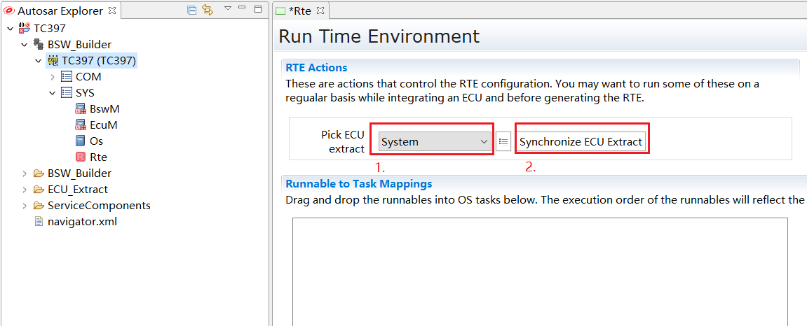
   

   进行ECU萃取导入

   Pick and Synchronize ECU extract
  
导入ECU萃取文件后，在RTE第二界面"Pick ECU extract"中选择萃取文件中的System，点击"Synchronize ECU Extract"，将萃取文件内容进行导入RTE。
导入后，RTE模块将增量为SWC实例创建RteSwcComponentInstance,并为每个RTEEvent创建RteEventToTaskMapping组件。

After importing the ECU extract file, select the System in the extract file in the "Pick ECU extract" section of the Rte Editor, and click "Synchronize ECU Extract" to import the contents of the extract file into RTE.
After import, the RTE module will incrementally create RteSwcComponentInstance for SWC instances and create RteEventToTaskMapping components for each RTEEvent.

Bswmd文件更新（Bswmd File Update）
---------------------------------------
基于BSW模块的设计，ORIENTAIS可更新全部或单个描述文件,用来描述BSW模块在接口层面、 BswEntity调度的需求 ，内存映射信息。

ORIENTAIS can update all or individual description files for module design to meet the requirements of BSW modules at the interface level, BswEntity scheduling, and memory mapping information.

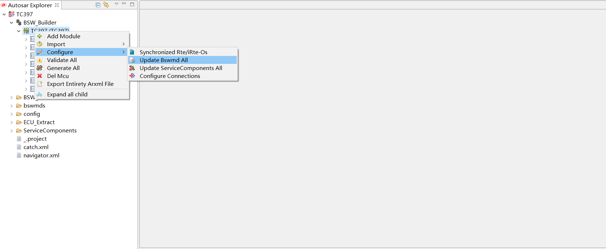
   

   更新全部Bswmd文件  

   Update all Bswmd files

.. figure:: ../../../_static/参考手册/Rte/RTE_4_4.png
   :name: RTE_4_4
   :align: center
   

   更新单个模块Bswmd文件  

   Update Bswmd file of a single module

RTE-OS集成配置（RTE-OS Integration Configuration）
-------------------------------------------------------
RTE、OS模块的集成配置，可以通过三种方式进行：

The integration configuration of RTE and OS modules can be performed through three methods:

- 全自动配置集成

  Fully automatic configuration integration

- 半自动配置集成

  Semi-automatic configuration integration

- 全手动配置集成

  Fully manual configuration integration
   
全自动配置集成（Fully Automatic Configuration Integration）
~~~~~~~~~~~~~~~~~~~~~~~~~~~~~~~~~~~~~~~~~~~~~~~~~~~~~~~~~~~~~~~~~
全自动配置集成主要通过RTE-OS自动同步功能，自动生成RTE、OS模块的推荐Demo配置。
集成人员可根据实际场景，对Demo的部分配置进行微调，比如OsTask的堆栈大小等。

Fully automatic configuration integration mainly generates recommended Demo configurations for RTE and OS modules automatically through "synchronized RTE-OS" function.
Integrators can fine-tune some configurations of the Demo according to actual scenarios, such as the stack size of OsTask.

RTE-OS自动同步（Synchronized RTE-OS）
**********************************************************
基于ECU萃取文件、BSW的模块描述文件，根据模型需求自动配置OS模块。

Automatically configure the OS module according to model requirements based on the ECU extract file and Bswmd files.

**自动配置的内容主要分为两类：**

**The automatically configured contents are mainly divided into two categories:**

- 与RTE实现相关，OS必须按实现需求进行配置且客户不能修改；

  Related to RTE implementation, the OS must be configured according to implementation requirements and cannot be modified by customers;

- 为客户提供配置Demo，简化客户手动配置工作量，客户根据应用场景在自动配置的基础上调整、适配。

  Provide configuration Demos for customers to simplify manual configuration workload, and customers can adjust and adapt based on automatic configurations according to application scenarios.

**自动配置主要实现的功能配置：**

**Main functions implemented by automatic configuration:**

- 周期运行实体的调度（提供OsAlarm或OsScheduleTable两种触发方式）

  Scheduling of periodic runnable entities (providing two triggering methods: OsAlarm or OsScheduleTable)

- 事件型运行实体的调度

  Scheduling of event-based runnable entities

- SchM独占区保护的配置

  Configuration of SchM exclusive area protection

- OsTask的部分配置，如内部各运行实体的调度顺序、优先级等。

  Partial configuration of OsTask, such as the scheduling order of runnable entities and priority .

.. figure:: ../../../_static/参考手册/Rte/RTE_4_1.png
   :name: RTE_4_1
   :align: center
  

   RTE-OS同步流程

   RTE-OS Synchronization Process

.. figure:: ../../../_static/参考手册/Rte/RTE_4_2.png
   :name: RTE_4_2
   :align: center
 

   RTE-OS自动同步配置

   Synchronized RTE-OS Configuration

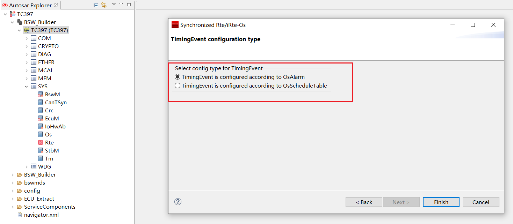
 

   RTE-OS自动同步选择周期运行实体的触发方式

   Synchronized RTE-OS: Selecting the Trigger Mode for Periodic Runnable Entities

RTE-OS自动同步为周期运行实体提供两种触发方式：

Synchronized RTE-OS provides two triggering methods for periodic runnable entities:

 - OsAlarm触发（OsAlarm triggering）
 - OsScheduleTable触发（OsScheduleTable triggering）

选择后，统一按照选择的方式自动配置周期触发。

After selection, the periodic triggering will be automatically configured uniformly according to the selected method.

半自动配置集成（Semi-Automatic Configuration Integration）
~~~~~~~~~~~~~~~~~~~~~~~~~~~~~~~~~~~~~~~~~~~~~~~~~~~~~~~~~~~~~~
半自动配置集成主要利用RTE第二界面拖拽功能，手动将执行实体拖拽至目标OsTask，拖拽后，ORIENTAIS将根据执行实体的属性，比如周期执行实体，自动生成剩余的所有配置参数。

Semi-automatic configuration integration mainly utilizes the drag-and-drop function of the Rte Editor. Manually drag the runnable entity to the target OsTask. After dragging, ORIENTAIS will automatically generate all remaining configuration parameters according to the attributes of the runnable entity, such as periodic runnable entities.

手动创建OsTask（Manually Creating OsTask）
************************************************
根据实际场景，手动创建Os的配置，比如创建OsTask。

Create Os configurations manually according to actual scenarios, such as creating OsTask.

.. figure:: ../../../_static/参考手册/Rte/RTE_4_12.png
   :name: RTE_4_12
   :align: center
 

   在OS模块配置界面手动创建OsTask

   Manually creating OsTask in the OS module configuration interface

RTE第二界面拖拽（Drag-and-Drop in the Rte Editor）
****************************************************************
ORIENTAIS支持将执行实体拖入目标OsTask中，同时根据执行实体周期属性，自动创建关联相关的OsAlarm/OsScheduleTable，以及RteOsInteraction等相关配置。

ORIENTAIS supports dragging runnable entities into the target OsTask. At the same time, according to the periodic attributes of the runnable entities, it automatically creates and associates related configurations such as OsAlarm/OsScheduleTable and RteOsInteraction.

.. figure:: ../../../_static/参考手册/Rte/RTE_4_6.png
   :name: RTE_4_6
   :align: center
   

   打开RTE第二界面

   Opening the Rte Editor

.. figure:: ../../../_static/参考手册/Rte/RTE_4_7.png
   :name: RTE_4_7
   :align: center
  

   执行实体信息显示

   Display of runnable entity information

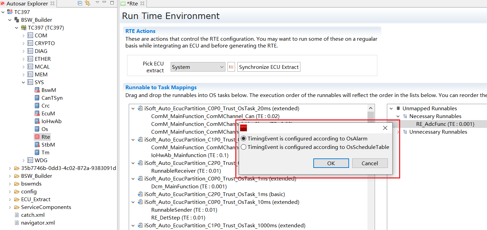
 

   拖动执行实体至相应分区的OsTask,如果是周期执行实体,弹出激活方式选择窗口

   Dragging the runnable entity to the OsTask of the corresponding partition; if it is a periodic runnable entity, a window for selecting the activation mode will pop up

.. figure:: ../../../_static/参考手册/Rte/RTE_4_9.png
   :name: RTE_4_9
   :align: center
  

   自动生成周期执行实体的相关Os配置

   Automatically generating relevant Os configurations for periodic runnable entities

.. figure:: ../../../_static/参考手册/Rte/RTE_4_10.png
   :name: RTE_4_10
   :align: center
   

   自动生成周期执行实体的RteOsInteraction配置

   Automatically generate RteOsInteraction configurations for periodic runnable entities

全手动配置集成（Fully Manual Configuration Integration）
~~~~~~~~~~~~~~~~~~~~~~~~~~~~~~~~~~~~~~~~~~~~~~~~~~~~~~~~~~~~
全手动配置集成表示RTE、OS模块完全手动配置，不借助ORIENTAIS的自动配置功能。

Fully manual configuration integration means that the RTE and OS modules are completely configured manually without relying on ORIENTAIS automatic configuration functions.

.. _app_stub:

Application RunnableEntity桩代码生成（Application RunnableEntity Stub Code Generation）
------------------------------------------------------------------------------------------
可选操作， 如果应用开发未完成，可使ORIENTAIS生成 Application RunnableEntity的桩代码。

Optional operation. If application development is not completed, ORIENTAIS can be used to generate stub code for Application RunnableEntity.

.. figure:: ../../../_static/参考手册/Rte/RTE_4_5.png
   :name: RTE_4_5
   :align: center
   

   应用桩代码生成 

   Application stub code generation 

RTE及Application RunnableEntity桩代码同时生成（Simultaneous Generation of RTE and Application RunnableEntity Stub Code）
----------------------------------------------------------------------------------------------------------------------------
可选操作， 可使ORIENTAIS同时生成RTE及 Application RunnableEntity的桩代码。

Optional operation.ORIENTAIS can be used to generate both RTE and Application RunnableEntity stub code at the same time.

.. figure:: ../../../_static/参考手册/Rte/RTE_4_16.png
   :name: RTE_4_16
   :align: center
  

   RTE及应用桩代码同时生成 

   Simultaneous generation of RTE and application stub code 

集成流程概述（Overview of Integration Process）
--------------------------------------------------
按照 :ref:`develop_flow` 完成工程的配置，生所有BSW（包括 OS 、RTE 、MCAL ）动态配置代码后， 基于芯片、编译器搭建代码工程，集成BSW静态代码以及ORIENTAIS生成的动态代码, 再加上Application RunnableEntity代码（若应用开发未完成，可使用 :ref:`app_stub` 生成应用桩代码），基于内存布局需求、以及BSW和Application RunnableEntity的MemMap进行编译、链接。

Complete the project configuration according to :ref:`develop_flow`, generate all dynamic configuration code of BSW(including OS, RTE, MCAL) , then build the code project with BSW static code, and Application RunnableEntity code (if application development is not completed, :ref:`app_stub` can be used to generate application stub code), and compile and link the MemMap based on memory layout requirements of BSW and Application RunnableEntity.

.. 引用接口描述。来自于code->doxygen->latex->rst
.. include:: Rte_api.rst

配置（configuration）
==========================

.. _rte_osinteraction:

RTE调度Os（Interaction of the RTE with the Os）
----------------------------------------------------
相关配置RteOsInteraction，主要涉及RTE对OsAlarm、OsTask、OsScheduleTable的启动配置。
常用场景：

The relevant configuration RteOsInteraction mainly involves the startup configuration of OsAlarm, OsTask, and OsScheduleTable by RTE.
Common scenarios:

- 激活扩展任务;

  Activate extended tasks;

- 激活周期事件对应的OsAlarm;

  Activate OsAlarm corresponding to periodic events;

- 激活周期事件对应的OsScheduleTable。

  Activate OsScheduleTable corresponding to periodic events.

RTE激活OsTask（RTE Activating OsTask）
~~~~~~~~~~~~~~~~~~~~~~~~~~~~~~~~~~~~~~~~~
.. figure:: ../../../_static/参考手册/Rte/RTE_5_1.png
   :name: RTE_5_1
   :align: center
   

   RTE激活OsTask配置示例

   Example of RTE activating OsTask configuration

RTE激活OsAlarm（RTE Activating OsAlarm）
~~~~~~~~~~~~~~~~~~~~~~~~~~~~~~~~~~~~~~~~~~~~
.. figure:: ../../../_static/参考手册/Rte/RTE_5_2.png
   :name: RTE_5_2
   :align: center
  

   RTE激活OsAlarm配置示例

   Example of RTE activating OsAlarm configuration

RTE激活OsScheduleTable（RTE Activating OsScheduleTable）
~~~~~~~~~~~~~~~~~~~~~~~~~~~~~~~~~~~~~~~~~~~~~~~~~~~~~~~~~~~~
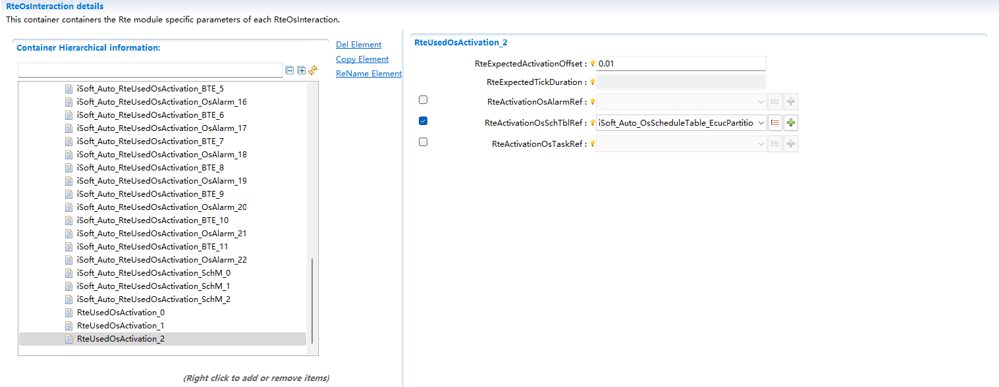
  

   RTE激活OsScheduleTable配置示例

   Example of RTE activating OsScheduleTable configuration

Swc在Ecu中的配置（Configuration of Swc in Ecu）
-------------------------------------------------
相关配置RteSwcComponentInstance,将Swc实例关联至RteSoftwareComponentInstanceRef中。

Relevant configuration RteSwcComponentInstance, associating the Swc instance to RteSoftwareComponentInstanceRef.

.. figure:: ../../../_static/参考手册/Rte/RTE_5_4.png
   :name: RTE_5_4
   :align: center
  

   RteSwcComponentInstance配置示例

   Example of RteSwcComponentInstance configuration

RunnableEntity映射（RunnableEntity Mapping）
~~~~~~~~~~~~~~~~~~~~~~~~~~~~~~~~~~~~~~~~~~~~~~
相关配置RteEventToTaskMapping。

Relevant configuration RteEventToTaskMapping.

将RteEvent映射至OsTask，定义Runnable在OsTask中的Position，使Task能够调度对应的RunnableEntity。

Map RteEvent to OsTask, define the Position of Runnable in OsTask, so that the Task can schedule the corresponding RunnableEntity.

映射至Basic Task（Mapping to Basic Task）
*********************************************
.. figure:: ../../../_static/参考手册/Rte/RTE_5_5.png
   :name: RTE_5_5
   :align: center
   

   RunnableEntity映射至Basic Task配置示例

   Example of RunnableEntity mapping to Basic Task configuration

.. attention::

   映射至Basic Task的RteEvent，均不能映射OsEvent。

   RteEvents mapped to Basic Task cannot be mapped to OsEvent.

映射至Extended Task（Mapping to Extended Task）
**************************************************
.. figure:: ../../../_static/参考手册/Rte/RTE_5_6.png
   :name: RTE_5_6
   :align: center
  

   RunnableEntity映射至Extended Task配置示例

   Example of RunnableEntity mapping to Extended Task configuration

.. attention::

   映射至Extended Task的RteEvent，均需要映射OsEvent。

   RteEvents mapped to Extended Task need to be mapped to OsEvent.

映射至Background Task（Mapping to Background Task）
********************************************************
Background Task即只映射了BackgroundEvent/BswBackgroundEvent事件，是不定周期Task，具体最低优先级（默认为1）且不能映射OsEvent。
Background Task由RTE激活后，在Task运行结尾使用ChainTask再次激活自己，实现不定周期特征。

Background Task is a task that only maps BackgroundEvent/BswBackgroundEvent events, it has no fixed time period and is typically activated only with lowest priority (default 1) and cannot map OsEvent.
After being activated by RTE, the Background Task reactivate itself after its termination by usaged of ChainTask to achieve the aperiodic characteristic.

初始化Runnable映射（Initialization Runnable Mapping）
**********************************************************
支持初始化Runnable(由InitEvent触发)映射至自定义初始化Task(Basic Task)。
如果初始化Runnable未映射至初始化Task，则由Rte_Start统一调用，由Rte_Start调用的初始化Runnable，支持在RteEventToTaskMapping中设置RtePositionInTask信息，作为在Rte_Start中调用顺序的依据，未设置位置信息的默认最后调用。

Supports mapping initialization Runnables (triggered by InitEvent) to a custom Initialization Task (Basic Task).
If the initialization Runnable is not mapped to the Initialization Task, it will be directly called by Rte_Start. RtePositionInTask in RteEventToTaskMapping can be set as the calling order in Rte_Start. Those without position information set will be called last by default.

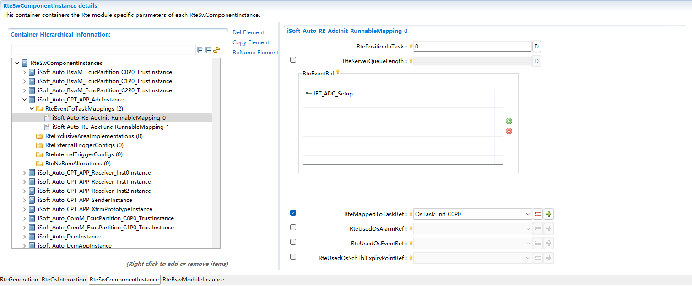
  

   初始化Runnable映射配置示例

   Example of initialization Runnable mapping configuration

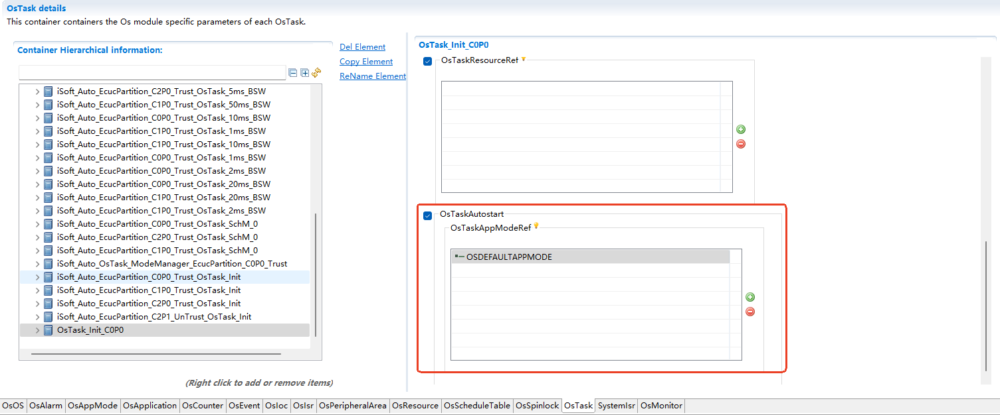
  

   初始化Task配置示例

   Example of initialization Task configuration

.. figure:: ../../../_static/参考手册/Rte/RTE_5_24.png
   :name: RTE_5_24
   :align: center
   

   只设置位置信息的初始化Runnable配置示例

   Example of initialization Runnable configuration with only position information set

.. attention::

   初始化Runnable只能映射至自定义的初始化Task中，即名称为非 **iSoft_Auto_** 前缀的初始化Task。

   Initialization Runnables can only be mapped to custom initialization Tasks, i.e., initialization Tasks whose names do not have the prefix **iSoft_Auto_**.

.. _swc_te:

周期RunnableEntity映射（Periodic RunnableEntity Mapping）
*************************************************************
支持OsAlarm、OsScheduleTable周期性触发OsTask或OsEvent，从而实现RunnableEntity的周期性调度。
配置的OsAlarm、OsScheduleTable以及扩展任务，需要同步在 :ref:`rte_osinteraction` 中激活。

Supports OsAlarm and OsScheduleTable to periodically trigger OsTask or OsEvent, thereby realizing periodic scheduling of RunnableEntity.
The OsAlarm, OsScheduleTable, and extended tasks need to be activated synchronously in :ref:`rte_osinteraction`.

OsAlarm触发Basic Task（OsAlarm Triggering Basic Task）
^^^^^^^^^^^^^^^^^^^^^^^^^^^^^^^^^^^^^^^^^^^^^^^^^^^^^^^^^^^^^
需要Basic Task映射同周期的RunnableEntity,同时设置OsAlarm的周期与RunnableEntity周期一致。

A Basic Task needs to be mapped by RunnableEntities with the same period, and the period of OsAlarm should be same with the period of the RunnableEntity.

.. figure:: ../../../_static/参考手册/Rte/RTE_5_9.png
   :name: RTE_5_9
   :align: center
   

   由OsAlarm触发Basic Task配置示例

   Example of Basic Task triggered by OsAlarm configuration

OsAlarm触发Extended Task(OsAlarm Triggering Extended Task)
^^^^^^^^^^^^^^^^^^^^^^^^^^^^^^^^^^^^^^^^^^^^^^^^^^^^^^^^^^^^^^^^^^^^^^^^^^
支持一个Task映射不同周期的RunnableEntity。

Supports a Task mapping RunnableEntities with different periods.

.. figure:: ../../../_static/参考手册/Rte/RTE_5_10.png
   :name: RTE_5_10
   :align: center
   

   由OsAlarm触发Extended Task配置示例

   Example of Extended Task triggered by OsAlarm configuration

OsScheduleTable触发周期RunnableEntity（OsScheduleTable Triggering Periodic RunnableEntity）
^^^^^^^^^^^^^^^^^^^^^^^^^^^^^^^^^^^^^^^^^^^^^^^^^^^^^^^^^^^^^^^^^^^^^^^^^^^^^^^^^^^^^^^^^^^^^^^^^
采用调度表可以通过调度点设置激活偏移，从而一定程度达到均衡负载的效果。

Using OsScheduleTableExpiryPoint to set activation offsets, to achieving load balancing to a certain extent.

.. figure:: ../../../_static/参考手册/Rte/RTE_5_11.png
   :name: RTE_5_11
   :align: center
   

   OsScheduleTable配置示例

   Example of OsScheduleTable configuration

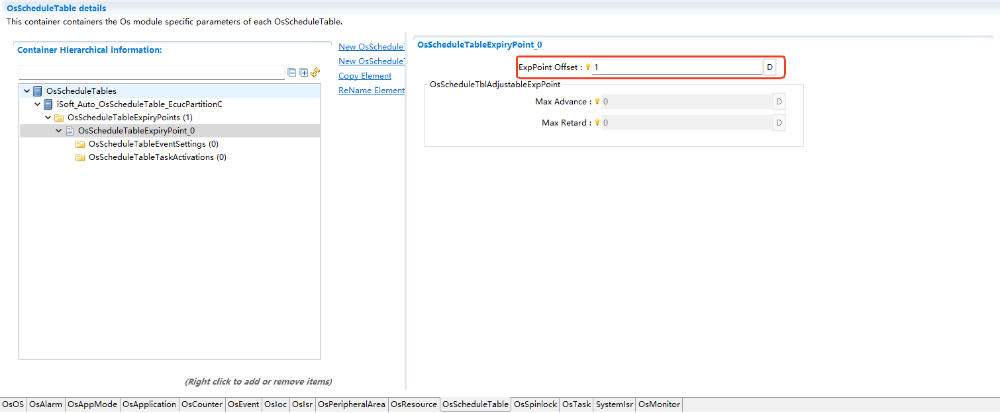

   OsScheduleTableExpiryPoint配置示例

   Example of OsScheduleTableExpiryPoint configuration

.. figure:: ../../../_static/参考手册/Rte/RTE_5_13.png
   :name: RTE_5_13
   :align: center
   

   OsScheduleTableExpiryPoint激活Basic Task配置示例

   Example of OsScheduleTableExpiryPoint activating Basic Task configuration

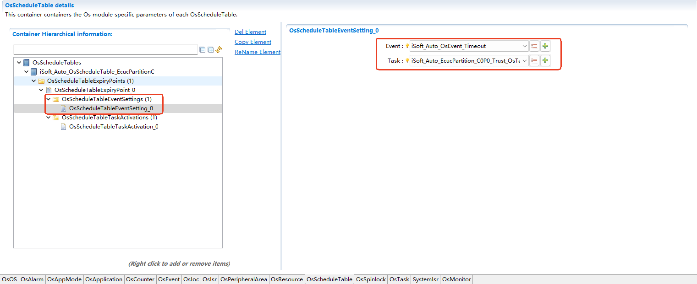
   

   OsScheduleTableExpiryPoint激活OsEvent配置示例

   Example of OsScheduleTableExpiryPoint activating OsEvent configuration

独占区配置（Exclusive Area Configuration）
**************************************************
相关配置RteExclusiveAreaImplementation。
RTE为Swc的独占区提供四个配置选择:

Relevant configuration RteExclusiveAreaImplementation.
RTE provides four configuration options for the exclusive area of Swc:

- ALL_INTERRUPT_BLOCKING
- OS_INTERRUPT_BLOCKING
- OS_RESOURCE
- NONE

.. figure:: ../../../_static/参考手册/Rte/RTE_5_22.png
   :name: RTE_5_22
   :align: center
   

   RteExclusiveAreaImplementation配置示例

   Example of RteExclusiveAreaImplementation configuration

Trigger队列配置（Trigger Queue Configuration）
*****************************************************
相关配置RteExternalTriggerConfig/RteInternalTriggerConfig。
RTE支持内外部队列触发，且队列长度（\>=1）的ECUC配置优先级高于SWC侧的配置，即即使SWC配置的Trigger的swImplPolicy为"QUEUED"，ECUC中未配置队列长度，当作非队列处理。
当前队列触发的trigger sink需要在同一分区，建议不设置内外部触发队列。

Relevant configuration RteExternalTriggerConfig/RteInternalTriggerConfig.
RTE supports internal and external queue triggering, and the ECUC configuration priority of the queue length (≥1) is higher than the configuration on the SWC side. That is, even if the swImplPolicy of the Trigger configured in SWC is "QUEUED", if the queue length is not configured in ECUC, it will be treated as "STANDARD".
Currently, trigger sinks for queuing of trigger need to be in the same partition. It is recommended not to set internal and external trigger queues.

.. figure:: ../../../_static/参考手册/Rte/RTE_5_25.png
   :name: RTE_5_25
   :align: center
   

   RteExternalTriggerConfig配置示例

   Example of RteExternalTriggerConfig configuration

.. figure:: ../../../_static/参考手册/Rte/RTE_5_26.png
   :name: RTE_5_26
   :align: center
  

   RteInternalTriggerConfig配置示例

   Example of RteInternalTriggerConfig configuration

NvM分配（NvM Allocation）
********************************

通过NvMSwC来进行相关的NvM分配（Perform relevant NvM allocation through NvMSwC）
^^^^^^^^^^^^^^^^^^^^^^^^^^^^^^^^^^^^^^^^^^^^^^^^^^^^^^^^^^^^^^^^^^^^^^^^^^^^^^^^^^^^^^^^^^^^^^^^^^^^^^^^^^^^^^^^^^
需要在NvMSwC的对应实例下的RteNvRamAllocation映射NvMSwC的RteSwNvBlockDescriptor和NvM模块的NvBlockDescriptor

It is necessary to map RteSwNvBlockDescriptor of NvMSwC and NvBlockDescriptor of NvM module in RteNvRamAllocation under the corresponding instance of NvMSwC.

.. figure:: ../../../_static/参考手册/Rte/RTE_5_27.png
   :name: RTE_5_27
   :align: center
  

   RteNvRamAllocation通过NvMSwC来映射NvM

Bsw模块在Ecu中的配置（Configuration of Bsw Module in Ecu）
--------------------------------------------------------------
Bsw模块在Ecu中的配置依赖各Bsw模块的模块描述文件作为输入。
相关配置RteBswModuleInstance,将BswImplementation(定义在模块描述文件中)关联至RteBswImplementationRef中。

The configuration of Bsw modules in Ecu depends on Bswmd files of each Bsw module.
Relevant configuration RteBswModuleInstance, associating BswImplementation (defined in Bswmd file) to RteBswImplementationRef.

.. figure:: ../../../_static/参考手册/Rte/RTE_5_19.png
   :name: RTE_5_19
   :align: center
   

   RteBswModuleInstance配置示例

   Example of RteBswModuleInstance configuration

BswSchduleEntity映射（BswSchduleEntity Mapping）
~~~~~~~~~~~~~~~~~~~~~~~~~~~~~~~~~~~~~~~~~~~~~~~~~~~~~~~
相关配置RteBswEventToTaskMapping。

Relevant configuration RteBswEventToTaskMapping.

将BswEvent映射至OsTask，从而使Task能够调度对应的BswSchduleEntity。

Map BswEvent to OsTask, so that the Task can schedule the corresponding BswSchduleEntity.

映射至Basic Task（Mapping to Basic Task）
********************************************

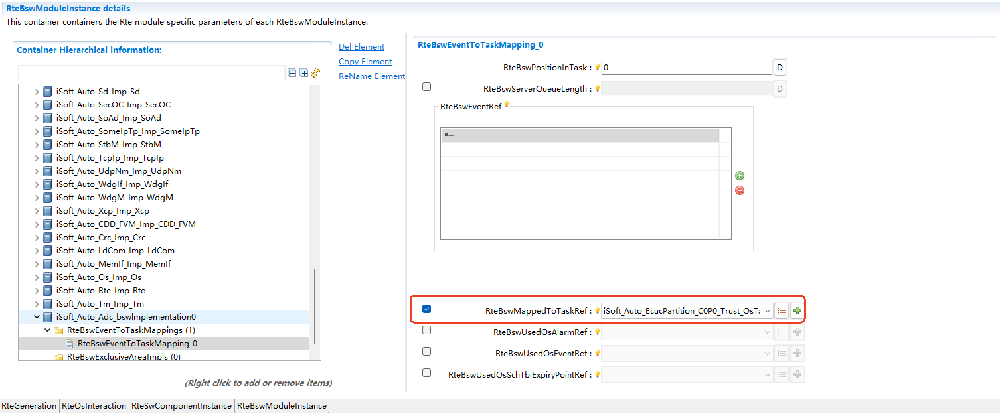
   

   BswSchduleEntity映射至Basic Task配置示例

   Example of BswSchduleEntity mapping to Basic Task configuration

.. attention::

   映射至Basic Task的BswEvent，均不能映射OsEvent。

   BswEvents mapped to Basic Task cannot be mapped to OsEvent.

映射至Extended Task（Mapping to Extended Task）
***************************************************

.. figure:: ../../../_static/参考手册/Rte/RTE_5_21.png
   :name: RTE_5_21
   :align: center
   

   BswSchduleEntity映射至Extended Task配置示例

   Example of BswSchduleEntity mapping to Extended Task configuration

.. attention::

   映射至Extended Task的BswEvent，均需要映射OsEvent。

   BswEvents mapped to Extended Task need to be mapped to OsEvent.

映射至Background Task（Mapping to Background Task）
****************************************************
Background Task即只映射了BackgroundEvent/BswBackgroundEvent事件，是不定周期Task，具体最低优先级（默认为1）且不能映射OsEvent。
Background Task由RTE激活后，在Task运行结尾使用ChainTask再次激活自己，实现不定周期特征。

Background Task is a task that only maps BackgroundEvent/BswBackgroundEvent events, is an aperiodic task, has the lowest priority (default 1) and no OsEvent referenced.
After being activated by RTE, the Background Task reactivate itself after its termination by usaged of ChainTask to achieve the aperiodic characteristic.

周期BswSchduleEntity映射（Periodic BswSchduleEntity Mapping）
****************************************************************
支持OsAlarm、OsScheduleTable周期性触发OsTask或OsEvent，从而实现ExecutableEntity的周期性调度。
参考 :ref:`swc_te`。

Supports OsAlarm and OsScheduleTable to periodically trigger OsTask or OsEvent, thereby realizing periodic scheduling of ExecutableEntity.
Refer to :ref:`swc_te`.

独占区配置（Exclusive Area Configuration）
*********************************************
相关配置RteBswExclusiveAreaImpl。
RTE为BswModule的独占区提供五个配置选择:

Relevant configuration RteBswExclusiveAreaImpl.
RTE provides five configuration options for the exclusive area of BswModule:

- ALL_INTERRUPT_BLOCKING
- OS_INTERRUPT_BLOCKING
- OS_RESOURCE
- OS_SPINLOCK
- NONE

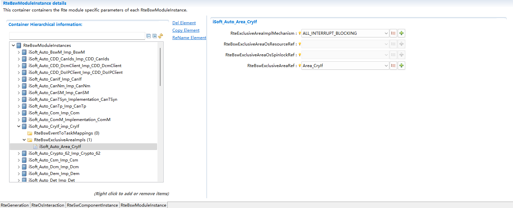

   RteBswExclusiveAreaImpl配置示例

   Example of RteBswExclusiveAreaImpl configuration

独占区保护开关（Exclusive Area Protection Switch）
------------------------------------------------------
RteInExclusiveAreaCheckEnabled勾选时开启独占区保护。

Exclusive area protection is enabled when RteInExclusiveAreaCheckEnabled is checked.

独占区保护（Exclusive area protection）：
    RTE的阻塞式API，不能运行在独占区中，造成中断时间过长，引发系统问题。打开独占区保护，如果在独占区中调用阻塞式API，API会直接返回RTE_E_IN_EXCLUSIVE_AREA。

    Blocking APIs of RTE cannot run in exclusive areas, as this will cause excessive interrupt time and trigger system problems. When enable RteInExclusiveAreaCheckEnabled , if a blocking API is called in an exclusive area, the API will directly return RTE_E_IN_EXCLUSIVE_AREA.

API示例（API examples）:
    Rte_Call,Rte_Result,Rte_Feedback,Rte_SwitchAck,Rte_Receive等

    Rte_Call, Rte_Result, Rte_Feedback, Rte_SwitchAck, Rte_Receive, etc.

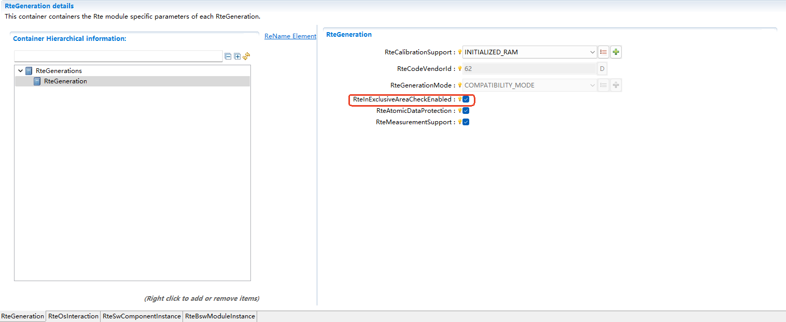
  

   RteInExclusiveAreaCheckEnabled配置示例

   Example of RteInExclusiveAreaCheckEnabled configuration

原子型数据一致性保护开关（Atomic Data Consistency Protection Switch）
---------------------------------------------------------------------
RteAtomicDataProtection勾选时开启原子型数据的数据一致性保护。

Atomic data consistency protection is enabled when RteAtomicDataProtection is checked.

数据一致性保护（Data consistency protection）：
    利用开关中断等手段保证数据的一致性，AUTOSAR规范要求Primitive数据同样需要进行数据一致性保护，但这样会给系统带来一定开销，可以通过开关控制是否开启对此类数据的数据一致性保护。

    Ensure data consistency by means such as enabling and disabling interrupts. AUTOSAR specifications require that Primitive data also needs data consistency protection, but this will bring a certain overhead to the system. The switch can be used to control whether to enable data consistency protection for such data.

原子数据示例（Examples of atomic data）：
    映射至VALUE实现数据类型的变量等。

    Variables mapped to Promitive Implementation Data Type, etc.

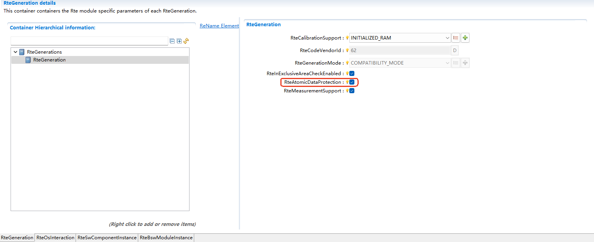
   

   RteAtomicDataProtection配置示例

   Example of RteAtomicDataProtection configuration

RTE的多核支持（Multi-Core Support of RTE）
---------------------------------------------

分区映射（Partition Mapping）
~~~~~~~~~~~~~~~~~~~~~~~~~~~~~~~~~~

Core Definition
********************

.. figure:: ../../../_static/参考手册/Rte/RTE_5_15.png
   :name: RTE_5_15
   :align: center

   EcucCoreDefinition配置示例

   Example of EcucCoreDefinition configuration

EcucPartition分区定义（EcucPartition Definition）
*****************************************************
EcucPartition需要映射至Core上，并且需要设置一个默认分区。
Swc与Bsw模块需要映射至EcucPartition，表示被划分在该分区。

EcucPartition needs to be mapped to a Core, and a default partition needs to be set up.
Swc and Bsw modules need to be mapped to EcucPartition, indicating that they are divided into that partition.

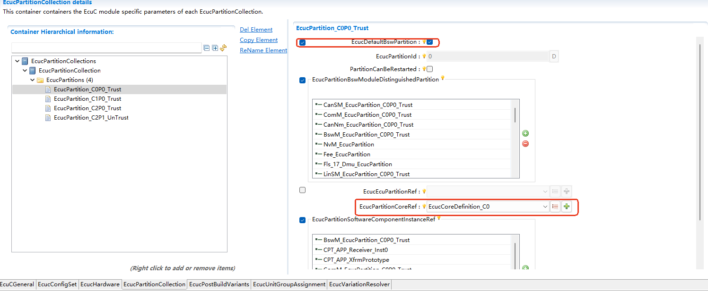
  

   EcucPartition配置示例

   Example of EcucPartition configuration

.. attention::

   Bsw模块只能映射至可信分区。

   Bsw modules can only be mapped to trusted partitions.

OsApplication与分区配置（OsApplication and Partition Configuration）
**************************************************************************
OsApplication是系统对象（如OsTask、OsAlarm、OsResource等）进行分组的逻辑模块，需要与EcucPartition 1:1对应创建，承载该分区的系统资源。
OsTask、OsAlarm、OsResource等系统对象需要映射至OsApplication，表示被划分在该分区。

OsApplication is a logical module for grouping system objects (such as OsTask, OsAlarm, OsResource, etc.) and needs to be created in a 1:1 correspondence with EcucPartition to carry the system resources of that partition.
System objects such as OsTask, OsAlarm, and OsResource need to be mapped to OsApplication, indicating that they are divided into that partition.

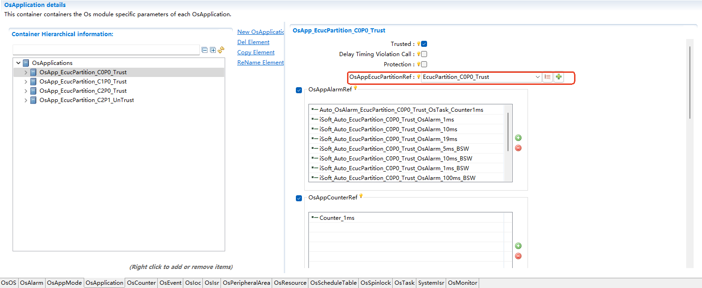
  

   OsApplication配置示例

   Example of OsApplication configuration

RTE启动（RTE Startup）
----------------------

Rte_Start
~~~~~~~~~~~~~~~~~~

可信分区/无分区系统（Trusted Partition / Non-Partitioned System）
**********************************************************************
可信分区/无分区系统由BswM调用Rte_Start，需要在BswM的配置中为可信分区添加“Rte_Start”的Action.

The trusted partition / non-partitioned system calls Rte_Start by BswM. It is necessary to add the "Rte_Start" Action for the trusted partition in the BswM configuration.

.. figure:: ../../../_static/参考手册/Rte/RTE_5_30.png
   :name: RTE_5_30
   :align: center
   

   BswMModeControl配置示例

   Example of BswMModeControl configuration

不可信分区（Untrusted Partition）
***********************************
不可信分区由该分区的初始化Task调用Rte_Start,RTE代码默认生成。

The untrusted partition calls Rte_Start by the initialization Task of that partition, which is generated by RTE by default.

EcuM_StartupTwo
~~~~~~~~~~~~~~~~~~

无分区系统（Non-Partitioned System）
*****************************************
RTE默认在名为“iSoft_Auto_DEFAULT_OsTask_Init”的初始化Task中调用EcuM_StartupTwo,继而启动SchM。

RTE calls EcuM_StartupTwo in the initialization Task named "iSoft_Auto_DEFAULT_OsTask_Init" by default, and then SchM will be startup.

多分区/多核系统（Multi-Partition / Multi-Core System）
**********************************************************
RTE识别EcuM配置中的分区，以该分区的初始化Task中启动EcuM_StartupTwo。
每个核选一个分区（可信）填入EcuMFlexConfiguration的配置中，即EcuM_StartupTwo的启动数与核数相同。

RTE identifies the partitions in the EcuM configuration and starts EcuM_StartupTwo in the initialization Task of that partition.
One partition (trusted) is selected for each core and filled into the configuration of EcuMFlexConfiguration, that is, the number of EcuM_StartupTwo startups is the same as the number of cores.

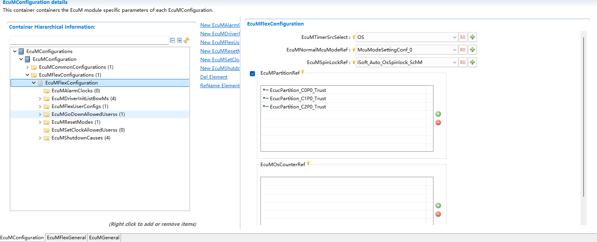
   

   EcuMFlexConfiguration配置示例

   Example of EcuMFlexConfiguration

RTE的PBS支持（PBS Support of RTE）
--------------------------------------
RTE不支持SWC的变体，可适配BSW模块的PBS变体，主要涉及Com及LdCom的部分变体。

RTE does not support variants of SWC, but can adapt to PBS variants of BSW modules, mainly involving some variants of Com and LdCom.

PBS支持约束（PBS Support Constraints）
~~~~~~~~~~~~~~~~~~~~~~~~~~~~~~~~~~~~~~~~~~

.. list-table::
   :widths: 10 20 
   :header-rows: 0

   * - 支持Com、LdCom变体，不支持属性变体
     - Supports Com and LdCom variants; does not support attribute variants
   * - 信号/信号组/LdComIPdu在所有变体下唯一
     - Signals/Signal groups/LdComIPdu are unique across all variants  
   * - 同一个信号/信号组在不同变体下分区需一致
     - The partition of the same signal/signal group must be consistent across different variants 
   * - ISignalToIPduMapping在不同变体下映射的Pdu分区需一致，PduLength需相同
     - For ISignalToIPduMapping, the partition mapped by Pdu must be consistent across different variants, and PduLength must be the same  
