===================
Sd产品参考手册
===================

**缩写词注解**

+------------+---------------------------+----------------------------+
| **缩写词** | **英文全称**              | **中文解释**               |
+------------+---------------------------+----------------------------+
| SD         | Service Discovery         | 服务发现                   |
+------------+---------------------------+----------------------------+
| Sd         | Service Discovery Module  | AUTOSAR服务发现模块        |
|            | in AUTOSAR                |                            |
+------------+---------------------------+----------------------------+
| SOME/IP    | Scalable service-Oriented | 基于                       |
|            | MiddlwarE over IP         | IP的可缩放的面向服务中间件 |
+------------+---------------------------+----------------------------+
| SOME/IP-SD | SOME/IP Service Discovery | SOMEIP服务发现             |
+------------+---------------------------+----------------------------+

简介
====

Service Discovery模块，即服务发现模块，主要用于：

i) 探测外部是否有可用的服务，定位服务位置。

ii) 向外部提供可用的服务。

iii) 实现发布/订阅机制，以控制Event报文的订阅和发布。

Sd模块位于SoAd和BswM模块之间，和上述两个模块协作完成服务发现的功能。

|image1|

图1-1 Sd模块位置

参考资料
--------

[1] AUTOSAR_SWS_ServiceDiscovery.pdf，R19-11

[2] AUTOSAR_PRS_SOMEIPServiceDiscoveryProtocol.pdf，R19-11

功能描述
========

OfferService功能
----------------

OfferService功能介绍
~~~~~~~~~~~~~~~~~~~~

OfferService功能用于向外部声明可以提供某种服务。当本地ECU作为服务器端提供某种服务时：

i）该服务就绪时，Sd模块会主动发送包含OfferService
Entry的报文向其他ECU表明当前有可用的某种服务。这种情况报文多播发送。

ii）当其它ECU发送FindService
Entry主动寻找某种服务时，本地ECU作为服务提供者，向寻找服务的客户端发送OfferService
Entry，表白可以提供某种服务。这种情况报文单播发送。

OfferService功能实现
~~~~~~~~~~~~~~~~~~~~

当服务可用或者不可用时，SWC需要调用BswM的接口通知BswM某个服务可用/不可用，BswM会调用Sd_ServerServiceSetState(SdServerServiceHandleId，ServerServiceState)接口，向Sd模块表明该服务的状态。其中SdServerServiceHandleId参数用于标识服务，ServerServiceState用于标识服务状态。

Sd模块会根据当前的状态向外发送OfferService或者StopOfferService报文。报文中会携带SdServerServiceHandleId代表的服务的信息（IP地址，端口号等）。其他节点可以利用这些信息定位到该服务，以使用这些服务。

Server可以提供的服务在配置工具SdInstance🡪SdServerService中配置。

FindService 功能
----------------

FindService功能介绍
~~~~~~~~~~~~~~~~~~~

FindService功能用于寻找外部是否有可用的某种服务。当ECU需要使用某种服务时，Sd模块会发送包含FindService
Entry的报文，用于寻找某种服务。

FindService功能实现
~~~~~~~~~~~~~~~~~~~

当SWC作为客户端需要使用某种服务时，SWC会需要调用BswM的接口通知BswM需要某个服务，BswM调用Sd_ClientServiceSetState(ClientServiceHandleId,
ClientServiceState)接口，向Sd模块表明需要某个服务。

Sd模块会向外发送FindService报文。报文中会携带SdServerServiceHandleId代表的服务的具体信息（Service
ID，版本号等）。其他节点理由这些信息判断自己是否可以提供这个服务，可以提供时会发送OfferService通知寻找服务的客户端。

Client需要的的服务（即需要寻找的服务）在配置工具SdInstance🡪SdClientService中配置。

Eventgroup订阅功能
------------------

Eventgroup订阅功能简介
~~~~~~~~~~~~~~~~~~~~~~

Eventgroup订阅功能用于订阅需要接收的Eventgroup。

Eventgroup订阅功能的实现
~~~~~~~~~~~~~~~~~~~~~~~~

当SWC（作为客户端）需要订阅某个Eventgroup时，SWC会调用BswM的接口通知BswM，BswM会调用Sd_ConsumedEventGroupSetState(SdConsumedEventGroupHandleId，ConsumedEventGroupState)接口通知Sd模块。当Sd模块收到提供该Eventgroup的对应服务发送的OfferService报文时，Sd模块会发送包含SubscribeEventgroup
Entry的报文订阅Eventgroup。

Client需要订阅的Eventgroup在配置工具SdInstance🡪SdClientService🡪SdConsumedEventGroup中配置。

Eventgroup管理功能
------------------

Eventgroup管理功能简介
~~~~~~~~~~~~~~~~~~~~~~

当Client向Server订阅Eventgroup时，Server需要管理订阅该Eventgroup的客户端。

Eventgroup管理功能的实现
~~~~~~~~~~~~~~~~~~~~~~~~

当收到Client的SubscribeEventgroup报文后，Server需要和将SubscribeEventgroup报文中的信息（Eventgroup
ID，版本号，Service
ID等）和配置中保存的信息作比较，如果一致的情况下，并且该Client之前不在订阅列表中，则将该Client添加到订阅列表中，向该Client应答SubscribeEventgroupAck报文。如果该Client之前已经在订阅列表中，则用SubscribeEventgroup
Entry中的TTL时间更新订阅列表中的TTL值。信息不一致的情况下，应答SubscribeEventgroupNAck报文。

当订阅时间到（SubscribeEventgroup中携带的TTL计时时间到）或者收到Client发送的StopSubscribeEventgroup
Entry，Server需要将该Client从订阅列表中删除。

Server提供的Eventgroup（需要管理的Eventgroup）在配置工具SdInstance🡪SdServerService🡪SdEventHandler中配置。

RoutingPath控制功能
-------------------

RoutingPath控制功能简介
~~~~~~~~~~~~~~~~~~~~~~~

Sd模块通过控制SoAd里面SoAdRoutingGroup的状态（Enable/Disable），从而达到控制Event的接收和发送的路径的通断，控制Event的接收和发送。其中对Event发送路径的控制叫Fan
out控制，对Event接收路径的控制叫Fan in控制。

RoutingPath控制功能的实现
~~~~~~~~~~~~~~~~~~~~~~~~~

 Fan out控制
^^^^^^^^^^^^

当Client订阅Eventgroup时，Server根据Client发送的SubscribeEventgroup
Entry中携带的信息在配置中找到与之匹配的SdEventHandler，根据SdEventHandler中的SdEventHandlerTcp/SdEventHandlerUdp找到对应的SoAdRoutingGroup（取得RoutingGroup
ID）。根据SubscribeEventgroup Entry中携带的Endpoint
option信息以及配置中的SdServerServiceUdpRef/SdServerServiceTcpRef参数推导出该Event发送对应的SocketConnection（取得SoConId），然后调用SoAd_EnableSpecificRouting()或SoAd_DisableSpecificRouting(RoutingGroupId，SoConId)，来控制对应的RoutingGroup。

 Fan in控制
^^^^^^^^^^^

当Client向Server发送SubscribeEventgroup
Entry向Server订阅某个Eventgroup时，Client通过配置中的SdConsumedEventGroupTcpActivationRef/SdConsumedEventGroupUdpActivationRef参数找到对应的SoAdRoutingGroup（取得RoutingGroup
ID）。根据OfferService Entry中携带的Endpoint
option信息以及配置中的SdClientServiceUdpRef/SdClientServiceTcpRef参数推导出该Event发送对应的SocketConnection（取得SoConId），然后调用SoAd_EnableSpecificRouting()或SoAd_DisableSpecificRouting(RoutingGroupId，SoConId)，来控制对应的RoutingGroup。

:mark:`注意：以上描述的所有功能能实现的前提是本端ECU的IP地址已指定，即Sd模块的Sd_LocalIpAddrAssignmentChg(SoConId，State)被调用过，并且State为TCPIP_IPADDR_STATE_ASSIGNED。`

源文件描述
==========

表3-1 Sd组件文件描述

+----------------+-----------------------------------------------------+
| **文件**       | **说明**                                            |
+----------------+-----------------------------------------------------+
| Sd_cfg.h       | 定义Sd模块预编译时用到的配置参数。                  |
+----------------+-----------------------------------------------------+
| Sd_cfg.h       | 定义Sd模块中连接时用到的配置参数。                  |
+----------------+-----------------------------------------------------+
| Sd.h           | Sd模块头文                                          |
|                | 件，包含了API函数的扩展声明并定义了端口的数据结构。 |
+----------------+-----------------------------------------------------+
| Sd .c          | Sd模块源文件，包含了API函数的实现。                 |
+----------------+-----------------------------------------------------+
| tlsf.c         | Sd模块使用的动态内存分配器的实现文件。              |
+----------------+-----------------------------------------------------+
| tlsf.h         | Sd模块使用的动态内存分配器的接口声明文件。          |
+----------------+-----------------------------------------------------+

|image2|

图3-1 Sd组件文件交互关系图

API接口
=======

类型定义
--------

Sd_ServerServiceSetStateType类型定义
~~~~~~~~~~~~~~~~~~~~~~~~~~~~~~~~~~~~

+-----------+---------------------------------------+-----------------+
| 名称      | Sd_ServerServiceSetStateType          |                 |
+-----------+---------------------------------------+-----------------+
| 类型      | Enumeration                           |                 |
+-----------+---------------------------------------+-----------------+
| 范围      | SD_SERVER_SERVICE_DOWN                | 0               |
+-----------+---------------------------------------+-----------------+
|           | SD_SERVER_SERVICE_AVAILABLE           | 1               |
+-----------+---------------------------------------+-----------------+
| 描述      | This type defines the Server states   |                 |
|           | that are reported to the SD using the |                 |
|           | expected API                          |                 |
|           | Sd_ServerServiceSetState.             |                 |
+-----------+---------------------------------------+-----------------+

Sd_ClientServiceSetStateType类型定义
~~~~~~~~~~~~~~~~~~~~~~~~~~~~~~~~~~~~

+-----------+---------------------------------------+-----------------+
| 名称      | Sd_ClientServiceSetStateType          |                 |
+-----------+---------------------------------------+-----------------+
| 类型      | Enumeration                           |                 |
+-----------+---------------------------------------+-----------------+
| 范围      | SD_CLIENT_SERVICE_RELEASED            | 0               |
+-----------+---------------------------------------+-----------------+
|           | SD_CLIENT_SERVICE_REQUESTED           | 1               |
+-----------+---------------------------------------+-----------------+
| 描述      | This type defines the Client states   |                 |
|           | that are reported to the BswM using   |                 |
|           | the expected API                      |                 |
|           | Sd_ClientServiceSetState.             |                 |
+-----------+---------------------------------------+-----------------+

Sd_ConsumedEventGroupSetStateType类型定义
~~~~~~~~~~~~~~~~~~~~~~~~~~~~~~~~~~~~~~~~~

+-----------+-------------------------------------------------+-------+
| 名称      | Sd_ConsumedEventGroupSetStateType               |       |
+-----------+-------------------------------------------------+-------+
| 类型      | Enumeration                                     |       |
+-----------+-------------------------------------------------+-------+
| 范围      | SD_CONSUMED_EVENTGROUP_RELEASED                 | 0     |
+-----------+-------------------------------------------------+-------+
|           | SD_CONSUMED_EVENTGROUP_REQUESTED                | 1     |
+-----------+-------------------------------------------------+-------+
| 描述      | This type defines the subscription policy by    |       |
|           | consumed EventGroup for the Client Service.     |       |
+-----------+-------------------------------------------------+-------+

Sd_ClientServiceCurrentStateType类型定义
~~~~~~~~~~~~~~~~~~~~~~~~~~~~~~~~~~~~~~~~

+-----------+-------------------------------------------------+-------+
| 名称      | Sd_ClientServiceCurrentStateType                |       |
+-----------+-------------------------------------------------+-------+
| 类型      | Enumeration                                     |       |
+-----------+-------------------------------------------------+-------+
| 范围      | SD_CLIENT_SERVICE_DOWN                          | 0     |
+-----------+-------------------------------------------------+-------+
|           | SD_CLIENT_SERVICE_AVAILABLE                     | 1     |
+-----------+-------------------------------------------------+-------+
| 描述      | This type defines the modes to indicate the     |       |
|           | current mode request of a Client Service.       |       |
+-----------+-------------------------------------------------+-------+

Sd_ConsumedEventGroupCurrentStateType类型定义
~~~~~~~~~~~~~~~~~~~~~~~~~~~~~~~~~~~~~~~~~~~~~

+-----------+-------------------------------------------------+-------+
| 名称      | Sd_ConsumedEventGroupCurrentStateType           |       |
+-----------+-------------------------------------------------+-------+
| 类型      | Enumeration                                     |       |
+-----------+-------------------------------------------------+-------+
| 范围      | SD_CONSUMED_EVENTGROUP_DOWN                     | 0     |
+-----------+-------------------------------------------------+-------+
|           | SD_CONSUMED_EVENTGROUP_AVAILABLE                | 1     |
+-----------+-------------------------------------------------+-------+
| 描述      | This type defines the subscription policy by    |       |
|           | consumed EventGroup for the Client Service.     |       |
+-----------+-------------------------------------------------+-------+

Sd_EventHandlerCurrentStateType类型定义
~~~~~~~~~~~~~~~~~~~~~~~~~~~~~~~~~~~~~~~

+-----------+-------------------------------------------------+-------+
| 名称      | Sd_EventHandlerCurrentStateType                 |       |
+-----------+-------------------------------------------------+-------+
| 类型      | Enumeration                                     |       |
+-----------+-------------------------------------------------+-------+
| 范围      | SD_EVENT_HANDLER_RELEASED                       | 0     |
+-----------+-------------------------------------------------+-------+
|           | SD_EVENT_HANDLER_REQUESTED                      | 1     |
+-----------+-------------------------------------------------+-------+
| 描述      | This type defines the subscription policy by    |       |
|           | EventHandler for the Server Service.            |       |
+-----------+-------------------------------------------------+-------+

输入函数描述
------------

+------------------------+---------------------------------------------+
| **输入模块**           | **API**                                     |
+------------------------+---------------------------------------------+
| Dem                    | Dem_ReportErrorStatus                       |
+------------------------+---------------------------------------------+
| Det                    | Det_ReportError                             |
+------------------------+---------------------------------------------+
| SoAd                   | SoAd_DisableSpecificRouting                 |
+------------------------+---------------------------------------------+
|                        | SoAd_EnableSpecificRouting                  |
+------------------------+---------------------------------------------+
|                        | SoAd_GetLocalAddr                           |
+------------------------+---------------------------------------------+
|                        | SoAd_GetPhysAddr                            |
+------------------------+---------------------------------------------+
|                        | SoAd_GetRemoteAddr                          |
+------------------------+---------------------------------------------+
|                        | SoAd_IfSpecificRoutingGroupTransmit         |
+------------------------+---------------------------------------------+
|                        | SoAd_IfTransmit                             |
+------------------------+---------------------------------------------+
|                        | SoAd_SetRemoteAddr                          |
+------------------------+---------------------------------------------+
|                        | SoAd_CloseSoCon                             |
+------------------------+---------------------------------------------+
|                        | SoAd_DisableRouting                         |
+------------------------+---------------------------------------------+
|                        | SoAd_EnableRouting                          |
+------------------------+---------------------------------------------+
|                        | SoAd_GetSoConId                             |
+------------------------+---------------------------------------------+
|                        | SoAd_IfRoutingGroupTransmit                 |
+------------------------+---------------------------------------------+
|                        | SoAd_OpenSoCon                              |
+------------------------+---------------------------------------------+
|                        | SoAd_ReleaseIpAddrAssignment                |
+------------------------+---------------------------------------------+
|                        | SoAd_RequestIpAddrAssignment                |
+------------------------+---------------------------------------------+
|                        | SoAd_SetUniqueRemoteAddr                    |
+------------------------+---------------------------------------------+
| BswM                   | BswM_Sd_ClientServiceCurrentState           |
+------------------------+---------------------------------------------+
|                        | BswM_Sd_ConsumedEventGroupCurrentState      |
+------------------------+---------------------------------------------+
|                        | BswM_Sd_EventHandlerCurrentState            |
+------------------------+---------------------------------------------+

静态接口函数定义
----------------

Sd_Init函数定义
~~~~~~~~~~~~~~~

+-------------+-------------------+---------+-------------------------+
| 函数名称：  | Sd_Init           |         |                         |
+-------------+-------------------+---------+-------------------------+
| 函数原型：  | void Sd_Init (    |         |                         |
|             | const             |         |                         |
|             | Sd_ConfigType\*   |         |                         |
|             | ConfigPtr )       |         |                         |
+-------------+-------------------+---------+-------------------------+
| 服务编号：  | 0x01              |         |                         |
+-------------+-------------------+---------+-------------------------+
| 同步/异步： | 同步              |         |                         |
+-------------+-------------------+---------+-------------------------+
| 是          | 不可重入          |         |                         |
| 否可重入：  |                   |         |                         |
+-------------+-------------------+---------+-------------------------+
| 输入参数：  | ConfigPtr         | 值域：  | 无                      |
+-------------+-------------------+---------+-------------------------+
| 输入        | 无                |         |                         |
| 输出参数：  |                   |         |                         |
+-------------+-------------------+---------+-------------------------+
| 输出参数：  | 无                |         |                         |
+-------------+-------------------+---------+-------------------------+
| 返回值：    | 无                |         |                         |
+-------------+-------------------+---------+-------------------------+
| 功能概述：  | 初始化SD模块。    |         |                         |
+-------------+-------------------+---------+-------------------------+

Sd_GetVersionInfo函数定义
~~~~~~~~~~~~~~~~~~~~~~~~~

+-------------+-------------------+---------+-------------------------+
| 函数名称：  | Sd_GetVersionInfo |         |                         |
+-------------+-------------------+---------+-------------------------+
| 函数原型：  | void              |         |                         |
|             | Sd_GetVersionInfo |         |                         |
|             | (                 |         |                         |
|             | Std_              |         |                         |
|             | VersionInfoType\* |         |                         |
|             | versioninfo )     |         |                         |
+-------------+-------------------+---------+-------------------------+
| 服务编号：  | 0x02              |         |                         |
+-------------+-------------------+---------+-------------------------+
| 同步/异步： | 同步              |         |                         |
+-------------+-------------------+---------+-------------------------+
| 是          | 可重入            |         |                         |
| 否可重入：  |                   |         |                         |
+-------------+-------------------+---------+-------------------------+
| 输入参数：  | 无                |         |                         |
+-------------+-------------------+---------+-------------------------+
| 输入        | 无                |         |                         |
| 输出参数：  |                   |         |                         |
+-------------+-------------------+---------+-------------------------+
| 输出参数：  | versioninfo       | 值域：  | 无                      |
+-------------+-------------------+---------+-------------------------+
| 返回值：    | 无                |         |                         |
+-------------+-------------------+---------+-------------------------+
| 功能概述：  | 返回S             |         |                         |
|             | D模块的版本信息。 |         |                         |
+-------------+-------------------+---------+-------------------------+

Sd_ServerServiceSetState函数定义
~~~~~~~~~~~~~~~~~~~~~~~~~~~~~~~~

+-------------+-------------------+---------+-------------------------+
| 函数名称：  | Sd_Serv           |         |                         |
|             | erServiceSetState |         |                         |
+-------------+-------------------+---------+-------------------------+
| 函数原型：  | Std_ReturnType    |         |                         |
|             | Sd_Serv           |         |                         |
|             | erServiceSetState |         |                         |
|             | (                 |         |                         |
|             |                   |         |                         |
|             | uint16            |         |                         |
|             | SdServe           |         |                         |
|             | rServiceHandleId, |         |                         |
|             |                   |         |                         |
|             | Sd_ServerSe       |         |                         |
|             | rviceSetStateType |         |                         |
|             | S                 |         |                         |
|             | erverServiceState |         |                         |
|             |                   |         |                         |
|             | )                 |         |                         |
+-------------+-------------------+---------+-------------------------+
| 服务编号：  | 0x07              |         |                         |
+-------------+-------------------+---------+-------------------------+
| 同步/异步： | 异步              |         |                         |
+-------------+-------------------+---------+-------------------------+
| 是          | 可重入            |         |                         |
| 否可重入：  |                   |         |                         |
+-------------+-------------------+---------+-------------------------+
| 输入参数：  | SdServ            | 值域：  | 0 .. 65535              |
|             | erServiceHandleId |         |                         |
+-------------+-------------------+---------+-------------------------+
|             | S                 | 值域：  | 无                      |
|             | erverServiceState |         |                         |
+-------------+-------------------+---------+-------------------------+
| 输入        | 无                |         |                         |
| 输出参数：  |                   |         |                         |
+-------------+-------------------+---------+-------------------------+
| 输出参数：  | 无                |         |                         |
+-------------+-------------------+---------+-------------------------+
| 返回值：    | Std_ReturnType    | E_OK:   |                         |
|             |                   | State   |                         |
|             |                   | a       |                         |
|             |                   | ccepted |                         |
|             |                   |         |                         |
|             |                   | E_      |                         |
|             |                   | NOT_OK: |                         |
|             |                   | State   |                         |
|             |                   | not     |                         |
|             |                   | a       |                         |
|             |                   | ccepted |                         |
+-------------+-------------------+---------+-------------------------+
| 功能概述：  | BswM模块调用      |         |                         |
|             | 该接口设置Server  |         |                         |
|             | Service的状态。   |         |                         |
+-------------+-------------------+---------+-------------------------+

Sd_ClientServiceSetState函数定义
~~~~~~~~~~~~~~~~~~~~~~~~~~~~~~~~

+-------------+-------------------+---------+-------------------------+
| 函数名称：  | Sd_Clie           |         |                         |
|             | ntServiceSetState |         |                         |
+-------------+-------------------+---------+-------------------------+
| 函数原型：  | Std_ReturnType    |         |                         |
|             | Sd_Clie           |         |                         |
|             | ntServiceSetState |         |                         |
|             | (                 |         |                         |
|             |                   |         |                         |
|             | uint16            |         |                         |
|             | Clien             |         |                         |
|             | tServiceHandleId, |         |                         |
|             |                   |         |                         |
|             | Sd_ClientSe       |         |                         |
|             | rviceSetStateType |         |                         |
|             | C                 |         |                         |
|             | lientServiceState |         |                         |
|             |                   |         |                         |
|             | )                 |         |                         |
+-------------+-------------------+---------+-------------------------+
| 服务编号：  | 0x08              |         |                         |
+-------------+-------------------+---------+-------------------------+
| 同步/异步： | 异步              |         |                         |
+-------------+-------------------+---------+-------------------------+
| 是          | 可重入            |         |                         |
| 否可重入：  |                   |         |                         |
+-------------+-------------------+---------+-------------------------+
| 输入参数：  | Clie              | 值域：  | 0 .. 65535              |
|             | ntServiceHandleId |         |                         |
+-------------+-------------------+---------+-------------------------+
|             | C                 | 值域：  | 无                      |
|             | lientServiceState |         |                         |
+-------------+-------------------+---------+-------------------------+
| 输入        | 无                |         |                         |
| 输出参数：  |                   |         |                         |
+-------------+-------------------+---------+-------------------------+
| 输出参数：  | 无                |         |                         |
+-------------+-------------------+---------+-------------------------+
| 返回值：    | Std_ReturnType    | E_OK:   |                         |
|             |                   | State   |                         |
|             |                   | a       |                         |
|             |                   | ccepted |                         |
|             |                   | E_      |                         |
|             |                   | NOT_OK: |                         |
|             |                   | State   |                         |
|             |                   | not     |                         |
|             |                   | a       |                         |
|             |                   | ccepted |                         |
+-------------+-------------------+---------+-------------------------+
| 功能概述：  | BswM调用          |         |                         |
|             | 该接口设置Client  |         |                         |
|             | Service的状态。   |         |                         |
+-------------+-------------------+---------+-------------------------+

Sd_ConsumedEventGroupSetState函数定义
~~~~~~~~~~~~~~~~~~~~~~~~~~~~~~~~~~~~~

+---------------+--------------------------+---+------+-------------------+
| 函数名称：    | Sd_Co                    |   |      |                   |
|               | nsumedEventGroupSetState |   |      |                   |
+---------------+--------------------------+---+------+-------------------+
| 函数原型：    | Std_ReturnType           |   |      |                   |
|               | Sd_Co                    |   |      |                   |
|               | nsumedEventGroupSetState |   |      |                   |
|               | (                        |   |      |                   |
|               |                          |   |      |                   |
|               |    uint16                |   |      |                   |
|               |    SdCon                 |   |      |                   |
|               | sumedEventGroupHandleId, |   |      |                   |
|               |    Sd_Consum             |   |      |                   |
|               | edEventGroupSetStateType |   |      |                   |
|               |                          |   |      |                   |
|               |  ConsumedEventGroupState |   |      |                   |
|               |                          |   |      |                   |
|               | )                        |   |      |                   |
+---------------+--------------------------+---+------+-------------------+
| 服务编号：    | 0x09                     |   |      |                   |
+---------------+--------------------------+---+------+-------------------+
| 同步/异步：   | 异步                     |   |      |                   |
+---------------+--------------------------+---+------+-------------------+
| 是否可重入：  | 可重入                   |   |      |                   |
+---------------+--------------------------+---+------+-------------------+
| 输入参数：    | SdCo                     | 值 |     | 0 .. 65535        |
|               | nsumedEventGroupHandleId | 域 |     |                   |
|               |                          | ： |     |                   |
+---------------+--------------------------+---+------+-------------------+
|               | ConsumedEventGroupState  | 值 |     | 无                |
|               |                          | 域 |     |                   |
|               |                          | ： |     |                   |
+---------------+--------------------------+---+------+-------------------+
| 输            | 无                       |   |      |                   |
| 入输出参数：  |                          |   |      |                   |
+---------------+--------------------------+---+------+-------------------+
| 输出参数：    | 无                       |   |      |                   |
+---------------+--------------------------+---+------+-------------------+
| 返回值：      | Std_ReturnType           |   | E    |                   |
|               |                          |   | _OK: |                   |
|               |                          |   | S    |                   |
|               |                          |   | tate |                   |
|               |                          |   | acce |                   |
|               |                          |   | pted |                   |
|               |                          |   | E    |                   |
|               |                          |   | _NOT |                   |
|               |                          |   | _OK: |                   |
|               |                          |   | S    |                   |
|               |                          |   | tate |                   |
|               |                          |   | not  |                   |
|               |                          |   | acce |                   |
|               |                          |   | pted |                   |
+---------------+--------------------------+---+------+-------------------+
| 功能概述：    | BswM模                   |   |      |                   |
|               | 块调用该接口设置Consumed |   |      |                   |
|               | Event Group的状态。      |   |      |                   |
+---------------+--------------------------+---+------+-------------------+

Sd_LocalIpAddrAssignmentChg函数定义
~~~~~~~~~~~~~~~~~~~~~~~~~~~~~~~~~~~

+-------------+-------------------+---------+-------------------------+
| 函数名称：  | Sd_LocalIp        |         |                         |
|             | AddrAssignmentChg |         |                         |
+-------------+-------------------+---------+-------------------------+
| 函数原型：  | void              |         |                         |
|             | Sd_LocalIp        |         |                         |
|             | AddrAssignmentChg |         |                         |
|             | (                 |         |                         |
|             |                   |         |                         |
|             | SoAd_SoConIdType  |         |                         |
|             | SoConId,          |         |                         |
|             |                   |         |                         |
|             | TcpI              |         |                         |
|             | p_IpAddrStateType |         |                         |
|             | State             |         |                         |
|             |                   |         |                         |
|             | )                 |         |                         |
+-------------+-------------------+---------+-------------------------+
| 服务编号：  | 0x05              |         |                         |
+-------------+-------------------+---------+-------------------------+
| 同步/异步： | 同步              |         |                         |
+-------------+-------------------+---------+-------------------------+
| 是          | 不                |         |                         |
| 否可重入：  | 同SoConIds可重入. |         |                         |
+-------------+-------------------+---------+-------------------------+
| 输入参数：  | SoConId           | 值域：  | 0 .. 65535              |
+-------------+-------------------+---------+-------------------------+
|             | State             | 值域：  | 无                      |
+-------------+-------------------+---------+-------------------------+
| 输入        | 无                |         |                         |
| 输出参数：  |                   |         |                         |
+-------------+-------------------+---------+-------------------------+
| 输出参数：  | 无                |         |                         |
+-------------+-------------------+---------+-------------------------+
| 返回值：    | 无                |         |                         |
+-------------+-------------------+---------+-------------------------+
| 功能概述：  | 当一个socket      |         |                         |
|             | connection关      |         |                         |
|             | 联的IP地址发生变  |         |                         |
|             | 化时，SoAd调用该  |         |                         |
|             | 接口通知Sd模块。  |         |                         |
+-------------+-------------------+---------+-------------------------+

Sd_SoConModeChg函数定义
~~~~~~~~~~~~~~~~~~~~~~~

+-------------+-------------------+---------+-------------------------+
| 函数名称：  | Sd_SoConModeChg   |         |                         |
+-------------+-------------------+---------+-------------------------+
| 函数原型：  | void              |         |                         |
|             | Sd_SoConModeChg ( |         |                         |
|             |                   |         |                         |
|             | SoAd_SoConIdType  |         |                         |
|             | SoConId,          |         |                         |
|             |                   |         |                         |
|             | S                 |         |                         |
|             | oAd_SoConModeType |         |                         |
|             | Mode              |         |                         |
|             |                   |         |                         |
|             | )                 |         |                         |
+-------------+-------------------+---------+-------------------------+
| 服务编号：  | 0x43              |         |                         |
+-------------+-------------------+---------+-------------------------+
| 同步/异步： | 同步              |         |                         |
+-------------+-------------------+---------+-------------------------+
| 是          | 不                |         |                         |
| 否可重入：  | 同SoConIds可重入  |         |                         |
+-------------+-------------------+---------+-------------------------+
| 输入参数：  | SoConId           | 值域：  | 0 .. 65535              |
+-------------+-------------------+---------+-------------------------+
|             | Mode              | 值域：  | 无                      |
+-------------+-------------------+---------+-------------------------+
| 输入        | 无                |         |                         |
| 输出参数：  |                   |         |                         |
+-------------+-------------------+---------+-------------------------+
| 输出参数：  | 无                |         |                         |
+-------------+-------------------+---------+-------------------------+
| 返回值：    | 无                |         |                         |
+-------------+-------------------+---------+-------------------------+
| 功能概述：  | 当Socket          |         |                         |
|             | Conne             |         |                         |
|             | ction的状态发生变 |         |                         |
|             | 化时，SoAd调用该  |         |                         |
|             | 接口通知Sd模块。  |         |                         |
+-------------+-------------------+---------+-------------------------+

Sd_RxIndication函数定义
~~~~~~~~~~~~~~~~~~~~~~~

+-------------+-------------------+---------+-------------------------+
| 函数名称：  | Sd_RxIndication   |         |                         |
+-------------+-------------------+---------+-------------------------+
| 函数原型：  | void              |         |                         |
|             | Sd_RxIndication ( |         |                         |
|             |                   |         |                         |
|             | PduIdType         |         |                         |
|             | RxPduId,          |         |                         |
|             |                   |         |                         |
|             | const             |         |                         |
|             | PduInfoType\*     |         |                         |
|             | PduInfoPtr        |         |                         |
|             |                   |         |                         |
|             | )                 |         |                         |
+-------------+-------------------+---------+-------------------------+
| 服务编号：  | 0x42              |         |                         |
+-------------+-------------------+---------+-------------------------+
| 同步/异步： | 同步              |         |                         |
+-------------+-------------------+---------+-------------------------+
| 是          | 不同PduIds可重入  |         |                         |
| 否可重入：  |                   |         |                         |
+-------------+-------------------+---------+-------------------------+
| 输入参数：  | RxPduId           | 值域：  | 0 .. 65535              |
+-------------+-------------------+---------+-------------------------+
|             | PduInfoPtr        | 值域：  | 无                      |
+-------------+-------------------+---------+-------------------------+
| 输入        | 无                |         |                         |
| 输出参数：  |                   |         |                         |
+-------------+-------------------+---------+-------------------------+
| 输出参数：  | 无                |         |                         |
+-------------+-------------------+---------+-------------------------+
| 返回值：    | 无                |         |                         |
+-------------+-------------------+---------+-------------------------+
| 功能概述：  | 下层模            |         |                         |
|             | 块调用该接口通知S |         |                         |
|             | d接收到一帧报文。 |         |                         |
+-------------+-------------------+---------+-------------------------+

Sd_MainFunction函数定义
~~~~~~~~~~~~~~~~~~~~~~~

+-------------+--------------------------------------------------------+
| 函数名称：  | Sd_MainFunction                                        |
+-------------+--------------------------------------------------------+
| 函数原型：  | void Sd_MainFunction ( void )                          |
+-------------+--------------------------------------------------------+
| 服务编号：  | 0x06                                                   |
+-------------+--------------------------------------------------------+
| 同步/异步： | 同步                                                   |
+-------------+--------------------------------------------------------+
| 是          | 不可重入                                               |
| 否可重入：  |                                                        |
+-------------+--------------------------------------------------------+
| 输入参数：  | 无                                                     |
+-------------+--------------------------------------------------------+
| 输入        | 无                                                     |
| 输出参数：  |                                                        |
+-------------+--------------------------------------------------------+
| 输出参数：  | 无                                                     |
+-------------+--------------------------------------------------------+
| 返回值：    | 无                                                     |
+-------------+--------------------------------------------------------+
| 功能概述：  | Sd模块的周期处理函数。                                 |
+-------------+--------------------------------------------------------+

可配置函数定义
--------------

无。

配置
====

SdGeneral
---------

|image3|

图5-1 SdGeneral容器配置图

表5‑1SdGeneral容器属性描述

+------------+----------+---------------------+----------+------------+
| **UI名称** | **描述** |                     |          |            |
+------------+----------+---------------------+----------+------------+
| SdDevE     | 取值范围 | STD_ON / STD_OFF    | 默认取值 | STD_OFF    |
| rrorDetect |          |                     |          |            |
+------------+----------+---------------------+----------+------------+
|            | 参数描述 | DET检测功           |          |            |
|            |          | 能是否启用的开关。  |          |            |
+------------+----------+---------------------+----------+------------+
|            | 依赖关系 | 无                  |          |            |
+------------+----------+---------------------+----------+------------+
| SdM        | 取值范围 | 1E-3 .. 1           | 默认取值 | 无         |
| ainFunctio |          |                     |          |            |
| nCycleTime |          |                     |          |            |
+------------+----------+---------------------+----------+------------+
|            | 参数描述 | 周期处              |          |            |
|            |          | 理函数的调度周期。  |          |            |
+------------+----------+---------------------+----------+------------+
|            | 依赖关系 | 无                  |          |            |
+------------+----------+---------------------+----------+------------+
| SdSetR     | 取值范围 | STD_ON / STD_OFF    | 默认取值 | 无         |
| emAddrOfCl |          |                     |          |            |
| ientRxMult |          |                     |          |            |
| icastSoCon |          |                     |          |            |
+------------+----------+---------------------+----------+------------+
|            | 参数描述 | 当该参数设置为TR    |          |            |
|            |          | UE时，Sd接收到Offer |          |            |
|            |          | Service时，根据接收 |          |            |
|            |          | 到的Endpoint选择一  |          |            |
|            |          | 个匹配的多播Socket  |          |            |
|            |          | Connectio           |          |            |
|            |          | n。如果对应的Socket |          |            |
|            |          | Connect             |          |            |
|            |          | ion不存在，则选择一 |          |            |
|            |          | 个未使用的远端地址  |          |            |
|            |          | 为wildcard的Socket  |          |            |
|            |          | Connection，        |          |            |
|            |          | 并更新其远端地址。  |          |            |
|            |          |                     |          |            |
|            |          | 如果改参数设        |          |            |
|            |          | 置为FALSE，Sd选择一 |          |            |
|            |          | 个未使用的远端地址  |          |            |
|            |          | 为wildcard的Socket  |          |            |
|            |          | Connection，但      |          |            |
|            |          | 不更新其远端地址。  |          |            |
+------------+----------+---------------------+----------+------------+
|            | 依赖关系 | 无                  |          |            |
+------------+----------+---------------------+----------+------------+
| Sd         | 取值范围 | STD_ON / STD_OFF    | 默认取值 | 无         |
| SubscribeE |          |                     |          |            |
| ventgroupR |          |                     |          |            |
| etryEnable |          |                     |          |            |
+------------+----------+---------------------+----------+------------+
|            | 参数描述 | 订阅服务端          |          |            |
|            |          | 的Eventgroups是否启 |          |            |
|            |          | 用Retry机制的开关。 |          |            |
+------------+----------+---------------------+----------+------------+
|            | 依赖关系 | SdSubscribeEventgro |          |            |
|            |          | upRetryEnable参数设 |          |            |
|            |          | 置为STD_OFF时，SdCl |          |            |
|            |          | ientTimer对象的SdSu |          |            |
|            |          | bscribeEventgroupRe |          |            |
|            |          | tryDelay参数和SdSub |          |            |
|            |          | scribeEventgroupRet |          |            |
|            |          | ryMax参数不可以配置 |          |            |
+------------+----------+---------------------+----------+------------+
| SdVers     | 取值范围 | STD_ON / STD_OFF    | 默认取值 | STD_OFF    |
| ionInfoApi |          |                     |          |            |
+------------+----------+---------------------+----------+------------+
|            | 参数描述 | 是否生成获取        |          |            |
|            |          | 版本信息API的开关。 |          |            |
+------------+----------+---------------------+----------+------------+
|            | 依赖关系 | 无                  |          |            |
+------------+----------+---------------------+----------+------------+
| SdRxMemo   | 取值范围 | 0-2147483647        | 默认取值 | 1024       |
| ryPoolSize |          |                     |          |            |
+------------+----------+---------------------+----------+------------+
|            | 参数描述 | 接收服              |          |            |
|            |          | 务的内存池的大小。  |          |            |
+------------+----------+---------------------+----------+------------+
|            | 依赖关系 | 无                  |          |            |
+------------+----------+---------------------+----------+------------+
| SdRxMemo   | 取值范围 | 0-2147483647        | 默认取值 | 1024       |
| ryPoolSize |          |                     |          |            |
+------------+----------+---------------------+----------+------------+
|            | 参数描述 | 发送服              |          |            |
|            |          | 务的内存池的大小。  |          |            |
+------------+----------+---------------------+----------+------------+
|            | 依赖关系 | 无                  |          |            |
+------------+----------+---------------------+----------+------------+
| SdMo       | 取值范围 | STD_ON / STD_OFF    | 默认取值 | 无         |
| duleEnable |          |                     |          |            |
+------------+----------+---------------------+----------+------------+
|            | 参数描述 | 表示Sd模块是否使能  |          |            |
+------------+----------+---------------------+----------+------------+
|            | 依赖关系 | 无                  |          |            |
+------------+----------+---------------------+----------+------------+

SdConfig
--------

|image4|

图5-2 SdConfig容器配置图

表5‑2 SdConfig容器属性描述

+------------+----------+---------------------+----------+------------+
| UI名称     | 描述     |                     |          |            |
+------------+----------+---------------------+----------+------------+
| SdInstance | 取值范围 | Container           | 默认取值 | 无         |
+------------+----------+---------------------+----------+------------+
|            | 参数描述 | 该容器              |          |            |
|            |          | 表示SD的一个实例。  |          |            |
+------------+----------+---------------------+----------+------------+
|            | 依赖关系 | 无                  |          |            |
+------------+----------+---------------------+----------+------------+

SdInstance
----------

|image5|

图5-3 SdInstance容器配置图

表5‑3 SdInstance容器属性描述

+------------+----------+---------------------+----------+------------+
| UI名称     | 描述     |                     |          |            |
+------------+----------+---------------------+----------+------------+
| SdInstan   | 取值范围 | 0 .. 65535          | 默认取值 | 无         |
| ceHandleId |          |                     |          |            |
+------------+----------+---------------------+----------+------------+
|            | 参数描述 | SdInstance的handle  |          |            |
|            |          | Id                  |          |            |
+------------+----------+---------------------+----------+------------+
|            | 依赖关系 | 无                  |          |            |
+------------+----------+---------------------+----------+------------+
| SdInstan   | 取值范围 | String              | 默认取值 | 无         |
| ceHostname |          |                     |          |            |
+------------+----------+---------------------+----------+------------+
|            | 参数描述 | 用于配置Hostname    |          |            |
+------------+----------+---------------------+----------+------------+
|            | 依赖关系 | 无                  |          |            |
+------------+----------+---------------------+----------+------------+
| Sd         | 取值范围 | 0 .. 128            | 默认取值 | 无         |
| InstanceLo |          |                     |          |            |
| calAdressC |          |                     |          |            |
| heckLength |          |                     |          |            |
+------------+----------+---------------------+----------+------------+
|            | 参数描述 | 该参数表示当确定某  |          |            |
|            |          | 个远端地址是否被接  |          |            |
|            |          | 收时，从IP地址中取  |          |            |
|            |          | 出多少bit用于比较。 |          |            |
+------------+----------+---------------------+----------+------------+
|            | 依赖关系 | 无                  |          |            |
+------------+----------+---------------------+----------+------------+
| Sd         | 取值范围 | TCPIP_AF_INET       | 默认取值 | TCP        |
| AddrFamily |          | TCPIP_AF_INET6      |          | IP_AF_INET |
+------------+----------+---------------------+----------+------------+
|            | 参数描述 | Domain类型          |          |            |
+------------+----------+---------------------+----------+------------+
|            | 依赖关系 | 无                  |          |            |
+------------+----------+---------------------+----------+------------+
| SdCli      | 取值范围 | Container           | 默认取值 | 无         |
| entService |          |                     |          |            |
+------------+----------+---------------------+----------+------------+
|            | 参数描述 | 该容器包含客户端服  |          |            |
|            |          | 务所用的所有参数。  |          |            |
+------------+----------+---------------------+----------+------------+
|            | 依赖关系 | 无                  |          |            |
+------------+----------+---------------------+----------+------------+
| SdC        | 取值范围 | Reference           | 默认取值 | 无         |
| lientTimer |          |                     |          |            |
+------------+----------+---------------------+----------+------------+
|            | 参数描述 | 该容                |          |            |
|            |          | 器表示客户端服务所  |          |            |
|            |          | 用的所有时间参数。  |          |            |
+------------+----------+---------------------+----------+------------+
|            | 依赖关系 | 无                  |          |            |
+------------+----------+---------------------+----------+------------+
| S          | 取值范围 | Container           | 默认取值 | 无         |
| dInstanceD |          |                     |          |            |
| emEventPar |          |                     |          |            |
| ameterRefs |          |                     |          |            |
+------------+----------+---------------------+----------+------------+
|            | 参数描述 | 该容器引用          |          |            |
|            |          | 到DemEventParamete  |          |            |
|            |          | r，用于出现错误时， |          |            |
|            |          | 调用Dem_ReportErro  |          |            |
|            |          | rStatus()函数时使用 |          |            |
|            |          | 。可从DemEventParam |          |            |
|            |          | eter中获取EventId。 |          |            |
+------------+----------+---------------------+----------+------------+
|            | 依赖关系 | 无                  |          |            |
+------------+----------+---------------------+----------+------------+
| SdIn       | 取值范围 | Reference           | 默认取值 | 无         |
| stanceMult |          |                     |          |            |
| icastRxPdu |          |                     |          |            |
+------------+----------+---------------------+----------+------------+
|            | 参数描述 | 表示                |          |            |
|            |          | 接收多播SD报文的PDU |          |            |
+------------+----------+---------------------+----------+------------+
|            | 依赖关系 | 无                  |          |            |
+------------+----------+---------------------+----------+------------+
| SdIns      | 取值范围 | Reference           | 默认取值 | 无         |
| tanceTxPdu |          |                     |          |            |
+------------+----------+---------------------+----------+------------+
|            | 参数描述 | 表示                |          |            |
|            |          | 发送的SD报文的PDU。 |          |            |
+------------+----------+---------------------+----------+------------+
|            | 依赖关系 | 无                  |          |            |
+------------+----------+---------------------+----------+------------+
| Sd         | 取值范围 | Reference           | 默认取值 | 无         |
| InstanceUn |          |                     |          |            |
| icastRxPdu |          |                     |          |            |
+------------+----------+---------------------+----------+------------+
|            | 参数描述 | 表示接              |          |            |
|            |          | 收单播SD报文的PDU。 |          |            |
+------------+----------+---------------------+----------+------------+
|            | 依赖关系 | 无                  |          |            |
+------------+----------+---------------------+----------+------------+
| SdSer      | 取值范围 | Container           | 默认取值 | 无         |
| verService |          |                     |          |            |
+------------+----------+---------------------+----------+------------+
|            | 参数描述 | 该容器包含服务端服  |          |            |
|            |          | 务所用的所有参数。  |          |            |
+------------+----------+---------------------+----------+------------+
|            | 依赖关系 | 无                  |          |            |
+------------+----------+---------------------+----------+------------+
| SdS        | 取值范围 | Reference           | 默认取值 | 无         |
| erverTimer |          |                     |          |            |
+------------+----------+---------------------+----------+------------+
|            | 参数描述 | 该容                |          |            |
|            |          | 器表示服务端服务所  |          |            |
|            |          | 用的所有时间参数。  |          |            |
+------------+----------+---------------------+----------+------------+
|            | 依赖关系 | 无                  |          |            |
+------------+----------+---------------------+----------+------------+

SdClientTimer
-------------

|image6|

图5-4 SdClientTimer容器配置图

表5‑4 SdClientTimer容器属性描述

+------------+----------+---------------------+----------+------------+
| UI名称     | 描述     |                     |          |            |
+------------+----------+---------------------+----------+------------+
| Sd         | 取值范围 | 0 .. INF            | 默认取值 | 无         |
| ClientTime |          |                     |          |            |
| rInitialFi |          |                     |          |            |
| ndDelayMax |          |                     |          |            |
+------------+----------+---------------------+----------+------------+
|            | 参数描述 | 当发送Fin           |          |            |
|            |          | d报文时，随机延时的 |          |            |
|            |          | 最大值，单位是秒。  |          |            |
+------------+----------+---------------------+----------+------------+
|            | 依赖关系 | 无                  |          |            |
+------------+----------+---------------------+----------+------------+
| Sd         | 取值范围 | 0 .. INF            | 默认取值 | 无         |
| ClientTime |          |                     |          |            |
| rInitialFi |          |                     |          |            |
| ndDelayMin |          |                     |          |            |
+------------+----------+---------------------+----------+------------+
|            | 参数描述 | 当发送Fin           |          |            |
|            |          | d报文时，随机延时的 |          |            |
|            |          | 最小值，单位是秒。  |          |            |
+------------+----------+---------------------+----------+------------+
|            | 依赖关系 | SdClientTimer       |          |            |
|            |          | InitialFindDelayMin |          |            |
|            |          | <=                  |          |            |
|            |          | SdClientTimer       |          |            |
|            |          | InitialFindDelayMax |          |            |
+------------+----------+---------------------+----------+------------+
| SdCl       | 取值范围 | 0 .. INF            | 默认取值 | 无         |
| ientTimerI |          |                     |          |            |
| nitialFind |          |                     |          |            |
| Repetition |          |                     |          |            |
| sBaseDelay |          |                     |          |            |
+------------+----------+---------------------+----------+------------+
|            | 参数描述 | 在Repetition阶段重  |          |            |
|            |          | 复发送Find报文的基  |          |            |
|            |          | 准时间，单位是秒。  |          |            |
+------------+----------+---------------------+----------+------------+
|            | 依赖关系 | 无                  |          |            |
+------------+----------+---------------------+----------+------------+
| SdClient   | 取值范围 | 0 .. 10             | 默认取值 | 无         |
| TimerIniti |          |                     |          |            |
| alFindRepe |          |                     |          |            |
| titionsMax |          |                     |          |            |
+------------+----------+---------------------+----------+------------+
|            | 参数描述 | 在Repe              |          |            |
|            |          | tition阶段重复发送F |          |            |
|            |          | ind报文的最大次数。 |          |            |
+------------+----------+---------------------+----------+------------+
|            | 依赖关系 | 无                  |          |            |
+------------+----------+---------------------+----------+------------+
| SdClie     | 取值范围 | 0 .. INF            | 默认取值 | 无         |
| ntTimerReq |          |                     |          |            |
| uestRespon |          |                     |          |            |
| seMaxDelay |          |                     |          |            |
+------------+----------+---------------------+----------+------------+
|            | 参数描述 | 当接收到多播发送    |          |            |
|            |          | 的请求时，应答时随  |          |            |
|            |          | 机延时的最大时间。  |          |            |
+------------+----------+---------------------+----------+------------+
|            | 依赖关系 | 无                  |          |            |
+------------+----------+---------------------+----------+------------+
| SdClie     | 取值范围 | 0 .. INF            | 默认取值 | 无         |
| ntTimerReq |          |                     |          |            |
| uestRespon |          |                     |          |            |
| seMinDelay |          |                     |          |            |
+------------+----------+---------------------+----------+------------+
|            | 参数描述 | 当接收到多播发送    |          |            |
|            |          | 的请求时，应答时随  |          |            |
|            |          | 机延时的最小时间。  |          |            |
+------------+----------+---------------------+----------+------------+
|            | 依赖关系 | SdClientTimerRequ   |          |            |
|            |          | estResponseMinDelay |          |            |
|            |          | <=                  |          |            |
|            |          | SdClientTimerRequ   |          |            |
|            |          | estResponseMaxDelay |          |            |
+------------+----------+---------------------+----------+------------+
| SdClie     | 取值范围 | 1 .. 16777215       | 默认取值 | 无         |
| ntTimerTTL |          |                     |          |            |
+------------+----------+---------------------+----------+------------+
|            | 参数描述 | find和subscri       |          |            |
|            |          | be报文中的TTL时间。 |          |            |
+------------+----------+---------------------+----------+------------+
|            | 依赖关系 | 无                  |          |            |
+------------+----------+---------------------+----------+------------+
| S          | 取值范围 | 0.001 .. 50         | 默认取值 | 0.01       |
| dSubscribe |          |                     |          |            |
| Eventgroup |          |                     |          |            |
| RetryDelay |          |                     |          |            |
+------------+----------+---------------------+----------+------------+
|            | 参数描述 | 当一个              |          |            |
|            |          | 订阅报文没有收到Sub |          |            |
|            |          | scribeEventGroupAck |          |            |
|            |          | 或者SubscribeEve    |          |            |
|            |          | ntGroupNack时，重复 |          |            |
|            |          | 订阅时的延时时间。  |          |            |
+------------+----------+---------------------+----------+------------+
|            | 依赖关系 | 该参数只有当        |          |            |
|            |          | SdSubscribeEv       |          |            |
|            |          | entgroupRetryEnable |          |            |
|            |          | 为                  |          |            |
|            |          | TRUE并且SdSubscrib  |          |            |
|            |          | eEventgroupRetryMax |          |            |
|            |          | > 0时可用。         |          |            |
+------------+----------+---------------------+----------+------------+
| SdSubscri  | 取值范围 | 0 .. 255            | 默认取值 | 0          |
| beEventgro |          |                     |          |            |
| upRetryMax |          |                     |          |            |
+------------+----------+---------------------+----------+------------+
|            | 参数描述 | 当一个              |          |            |
|            |          | 订阅报文没有收到Sub |          |            |
|            |          | scribeEventGroupAck |          |            |
|            |          | 或者SubscribeEve    |          |            |
|            |          | ntGroupNack时，可重 |          |            |
|            |          | 复订阅的最大次数。  |          |            |
|            |          |                     |          |            |
|            |          | 0x0=no retry,       |          |            |
|            |          | 0xFF=retry forever  |          |            |
+------------+----------+---------------------+----------+------------+
|            | 依赖关系 | 该参数只有当        |          |            |
|            |          | SdSubscribeEv       |          |            |
|            |          | entgroupRetryEnable |          |            |
|            |          | 为TRUE时可用        |          |            |
+------------+----------+---------------------+----------+------------+

SdServerTimer
-------------

|image7|

图5-5 SdServerTimer容器配置图

表5‑5 SdServerTimer容器属性描述

+------------+----------+---------------------+----------+------------+
| UI名称     | 描述     |                     |          |            |
+------------+----------+---------------------+----------+------------+
| SdS        | 取值范围 | 0 .. INF            | 默认取值 | 无         |
| erverTimer |          |                     |          |            |
| InitialOff |          |                     |          |            |
| erDelayMax |          |                     |          |            |
+------------+----------+---------------------+----------+------------+
|            | 参数描述 | 当发送第一次Offe    |          |            |
|            |          | r报文时，随机延时的 |          |            |
|            |          | 最大值，单位是秒。  |          |            |
+------------+----------+---------------------+----------+------------+
|            | 依赖关系 | 无                  |          |            |
+------------+----------+---------------------+----------+------------+
| SdS        | 取值范围 | 0 .. INF            | 默认取值 | 无         |
| erverTimer |          |                     |          |            |
| InitialOff |          |                     |          |            |
| erDelayMin |          |                     |          |            |
+------------+----------+---------------------+----------+------------+
|            | 参数描述 | 当发送第一次Offe    |          |            |
|            |          | r报文时，随机延时的 |          |            |
|            |          | 最小值，单位是秒。  |          |            |
+------------+----------+---------------------+----------+------------+
|            | 依赖关系 | SdServerTimerI      |          |            |
|            |          | nitialOfferDelayMin |          |            |
|            |          | <=                  |          |            |
|            |          | SdServerTimerI      |          |            |
|            |          | nitialOfferDelayMax |          |            |
+------------+----------+---------------------+----------+------------+
| SdSe       | 取值范围 | 0 .. INF            | 默认取值 | 无         |
| rverTimerI |          |                     |          |            |
| nitialOffe |          |                     |          |            |
| rRepetitio |          |                     |          |            |
| nBaseDelay |          |                     |          |            |
+------------+----------+---------------------+----------+------------+
|            | 参数描述 | 在Repetition阶段重  |          |            |
|            |          | 复发送Offer报文的基 |          |            |
|            |          | 准时间，单位是秒。  |          |            |
+------------+----------+---------------------+----------+------------+
|            | 依赖关系 | 无                  |          |            |
+------------+----------+---------------------+----------+------------+
| SdServerT  | 取值范围 | 0 .. 10             | 默认取值 | 无         |
| imerInitia |          |                     |          |            |
| lOfferRepe |          |                     |          |            |
| titionsMax |          |                     |          |            |
+------------+----------+---------------------+----------+------------+
|            | 参数描述 | 在Repet             |          |            |
|            |          | ition阶段重复发送Of |          |            |
|            |          | fer报文的最大次数。 |          |            |
+------------+----------+---------------------+----------+------------+
|            | 依赖关系 | 无                  |          |            |
+------------+----------+---------------------+----------+------------+
| SdServerT  | 取值范围 | 0 .. INF            | 默认取值 | 无         |
| imerOfferC |          |                     |          |            |
| yclicDelay |          |                     |          |            |
+------------+----------+---------------------+----------+------------+
|            | 参数描述 | 在M                 |          |            |
|            |          | ain阶段，重复发送Of |          |            |
|            |          | fer报文的周期时间。 |          |            |
+------------+----------+---------------------+----------+------------+
|            | 依赖关系 | 无                  |          |            |
+------------+----------+---------------------+----------+------------+
| SdServ     | 取值范围 | 0 .. INF            | 默认取值 | 无         |
| erTimerReq |          |                     |          |            |
| uestRespon |          |                     |          |            |
| seMaxDelay |          |                     |          |            |
+------------+----------+---------------------+----------+------------+
|            | 参数描述 | 当接收到多播发送    |          |            |
|            |          | 的请求时，应答时随  |          |            |
|            |          | 机延时的最大时间。  |          |            |
+------------+----------+---------------------+----------+------------+
|            | 依赖关系 | 无                  |          |            |
+------------+----------+---------------------+----------+------------+
| SdServ     | 取值范围 | 0 .. INF            | 默认取值 | 无         |
| erTimerReq |          |                     |          |            |
| uestRespon |          |                     |          |            |
| seMinDelay |          |                     |          |            |
+------------+----------+---------------------+----------+------------+
|            | 参数描述 | 当接收到多播发送    |          |            |
|            |          | 的请求时，应答时随  |          |            |
|            |          | 机延时的最小时间。  |          |            |
+------------+----------+---------------------+----------+------------+
|            | 依赖关系 | SdServerTimerRequ   |          |            |
|            |          | estResponseMinDelay |          |            |
|            |          | <=                  |          |            |
|            |          | SdServerTimerRequ   |          |            |
|            |          | estResponseMaxDelay |          |            |
+------------+----------+---------------------+----------+------------+
| SdServ     | 取值范围 | 1 .. 16777215       | 默认取值 | 无         |
| erTimerTTL |          |                     |          |            |
+------------+----------+---------------------+----------+------------+
|            | 参数描述 | Offer               |          |            |
|            |          | S                   |          |            |
|            |          | ervice中的TTL时间。 |          |            |
+------------+----------+---------------------+----------+------------+
|            | 依赖关系 | 无                  |          |            |
+------------+----------+---------------------+----------+------------+

SdServerService
---------------

|image8|

图5-6 SdServerService容器配置图

表5‑6 SdServerService容器属性描述

+------------+----------+---------------------+----------+------------+
| UI名称     | 描述     |                     |          |            |
+------------+----------+---------------------+----------+------------+
| SdServer   | 取值范围 | STD_ON / STD_OFF    | 默认取值 | STD_OFF    |
| ServiceAut |          |                     |          |            |
| oAvailable |          |                     |          |            |
+------------+----------+---------------------+----------+------------+
|            | 参数描述 | 设置为TRU           |          |            |
|            |          | E，则改服务在启动时 |          |            |
|            |          | 自动被设置为可用。  |          |            |
+------------+----------+---------------------+----------+------------+
|            | 依赖关系 | 无                  |          |            |
+------------+----------+---------------------+----------+------------+
| SdS        | 取值范围 | 0 .. 65535          | 默认取值 | 无         |
| erverServi |          |                     |          |            |
| ceHandleId |          |                     |          |            |
+------------+----------+---------------------+----------+------------+
|            | 参数描述 | BswM识别            |          |            |
|            |          | 该服务的HandleId。  |          |            |
+------------+----------+---------------------+----------+------------+
|            | 依赖关系 | 无                  |          |            |
+------------+----------+---------------------+----------+------------+
| SdServe    | 取值范围 | 1 .. 65534          | 默认取值 | 无         |
| rServiceId |          |                     |          |            |
+------------+----------+---------------------+----------+------------+
|            | 参数描述 | 识别该服务的ID，不  |          |            |
|            |          | 同的服务需要唯一。  |          |            |
+------------+----------+---------------------+----------+------------+
|            | 依赖关系 | 无                  |          |            |
+------------+----------+---------------------+----------+------------+
| SdSer      | 取值范围 | 0 .. 65534          | 默认取值 | 无         |
| verService |          |                     |          |            |
| InstanceId |          |                     |          |            |
+------------+----------+---------------------+----------+------------+
|            | 参数描述 | 服                  |          |            |
|            |          | 务端服务的实例ID。  |          |            |
+------------+----------+---------------------+----------+------------+
|            | 依赖关系 | 无                  |          |            |
+------------+----------+---------------------+----------+------------+
| SdServe    | 取值范围 | 0 .. 254            | 默认取值 | 无         |
| rServiceMa |          |                     |          |            |
| jorVersion |          |                     |          |            |
+------------+----------+---------------------+----------+------------+
|            | 参数描述 | 服务端服务的Major   |          |            |
|            |          | Version。           |          |            |
+------------+----------+---------------------+----------+------------+
|            | 依赖关系 | 无                  |          |            |
+------------+----------+---------------------+----------+------------+
| SdServe    | 取值范围 | 0 .. 4294967294     | 默认取值 | 无         |
| rServiceMi |          |                     |          |            |
| norVersion |          |                     |          |            |
+------------+----------+---------------------+----------+------------+
|            | 参数描述 | 服务端服务的Minor   |          |            |
|            |          | Version。           |          |            |
+------------+----------+---------------------+----------+------------+
|            | 依赖关系 | 无                  |          |            |
+------------+----------+---------------------+----------+------------+
| S          | 取值范围 | Reference           | 默认取值 | 无         |
| dServerSer |          |                     |          |            |
| viceTcpRef |          |                     |          |            |
+------------+----------+---------------------+----------+------------+
|            | 参数描述 | 引用到一个TCP       |          |            |
|            |          | S                   |          |            |
|            |          | oAdSocketConnection |          |            |
|            |          | Group，用于该服务。 |          |            |
+------------+----------+---------------------+----------+------------+
|            | 依赖关系 | 无                  |          |            |
+------------+----------+---------------------+----------+------------+
| SdS        | 取值范围 | Reference           | 默认取值 | 无         |
| erverServi |          |                     |          |            |
| ceTimerRef |          |                     |          |            |
+------------+----------+---------------------+----------+------------+
|            | 参数描述 | 引用到一个SdServ    |          |            |
|            |          | erTimer用于该服务。 |          |            |
+------------+----------+---------------------+----------+------------+
|            | 依赖关系 | 无                  |          |            |
+------------+----------+---------------------+----------+------------+
| S          | 取值范围 | Reference           | 默认取值 | 无         |
| dServerSer |          |                     |          |            |
| viceUdpRef |          |                     |          |            |
+------------+----------+---------------------+----------+------------+
|            | 参数描述 | 引用到一个UDP       |          |            |
|            |          | S                   |          |            |
|            |          | oAdSocketConnection |          |            |
|            |          | Group，用于该服务。 |          |            |
+------------+----------+---------------------+----------+------------+
|            | 依赖关系 | 无                  |          |            |
+------------+----------+---------------------+----------+------------+
| SdEv       | 取值范围 | Container           | 默认取值 | 无         |
| entHandler |          |                     |          |            |
+------------+----------+---------------------+----------+------------+
|            | 参数描述 | 该容器表示服        |          |            |
|            |          | 务中的EventGroup。  |          |            |
+------------+----------+---------------------+----------+------------+
|            | 依赖关系 | 无                  |          |            |
+------------+----------+---------------------+----------+------------+
| SdProvi    | 取值范围 | Container           | 默认取值 | 无         |
| dedMethods |          |                     |          |            |
+------------+----------+---------------------+----------+------------+
|            | 参数描述 | Container element   |          |            |
|            |          | for representing    |          |            |
|            |          | the needed elements |          |            |
|            |          | of the data path    |          |            |
|            |          | for the methods     |          |            |
|            |          | provided by the     |          |            |
|            |          | service             |          |            |
|            |          |                     |          |            |
|            |          | 该容器表示服务提供  |          |            |
|            |          | 的方法的数据路径。  |          |            |
+------------+----------+---------------------+----------+------------+
|            | 依赖关系 | 无                  |          |            |
+------------+----------+---------------------+----------+------------+
| SdSe       | 取值范围 | Container           | 默认取值 | 无         |
| rverCapabi |          |                     |          |            |
| lityRecord |          |                     |          |            |
+------------+----------+---------------------+----------+------------+
|            | 参数描述 | 表示用于存储name/va |          |            |
|            |          | lue属性的capability |          |            |
|            |          | records             |          |            |
+------------+----------+---------------------+----------+------------+
|            | 依赖关系 | 无                  |          |            |
+------------+----------+---------------------+----------+------------+

SdClientService
---------------

|image9|

图5-7 SdServerService容器配置图

表5‑7 SdServerService容器属性描述

+------------+----------+---------------------+----------+------------+
| UI名称     | 描述     |                     |          |            |
+------------+----------+---------------------+----------+------------+
| SdClie     | 取值范围 | STD_ON / STD_OFF    | 默认取值 | STD_OFF    |
| ntServiceA |          |                     |          |            |
| utoRequire |          |                     |          |            |
+------------+----------+---------------------+----------+------------+
|            | 参数描述 | 设置为              |          |            |
|            |          | TRUE，则服务在启动  |          |            |
|            |          | 时自动设置为“需要”  |          |            |
+------------+----------+---------------------+----------+------------+
|            | 依赖关系 | 无                  |          |            |
+------------+----------+---------------------+----------+------------+
| SdC        | 取值范围 | 0 .. 65535          | 默认取值 | 无         |
| lientServi |          |                     |          |            |
| ceHandleId |          |                     |          |            |
+------------+----------+---------------------+----------+------------+
|            | 参数描述 | BswM识别            |          |            |
|            |          | 该服务的HandleId。  |          |            |
+------------+----------+---------------------+----------+------------+
|            | 依赖关系 | 无                  |          |            |
+------------+----------+---------------------+----------+------------+
| SdClien    | 取值范围 | 1 .. 65534          | 默认取值 | 无         |
| tServiceId |          |                     |          |            |
+------------+----------+---------------------+----------+------------+
|            | 参数描述 | 识别该服务的ID，不  |          |            |
|            |          | 同的服务需要唯一。  |          |            |
+------------+----------+---------------------+----------+------------+
|            | 依赖关系 | 无                  |          |            |
+------------+----------+---------------------+----------+------------+
| SdCli      | 取值范围 | 0 .. 65534          | 默认取值 | 无         |
| entService |          |                     |          |            |
| InstanceId |          |                     |          |            |
+------------+----------+---------------------+----------+------------+
|            | 参数描述 | 该服务的实例Id      |          |            |
+------------+----------+---------------------+----------+------------+
|            | 依赖关系 | 无                  |          |            |
+------------+----------+---------------------+----------+------------+
| SdClien    | 取值范围 | 0 .. 254            | 默认取值 | 无         |
| tServiceMa |          |                     |          |            |
| jorVersion |          |                     |          |            |
+------------+----------+---------------------+----------+------------+
|            | 参数描述 | Major version       |          |            |
|            |          | number of the       |          |            |
|            |          | Service as used in  |          |            |
|            |          | the SD entries.     |          |            |
|            |          |                     |          |            |
|            |          | 客户端服务的Major   |          |            |
|            |          | version。           |          |            |
+------------+----------+---------------------+----------+------------+
|            | 依赖关系 | 无                  |          |            |
+------------+----------+---------------------+----------+------------+
| SdClien    | 取值范围 | 0 .. 4294967294     | 默认取值 | 无         |
| tServiceMi |          |                     |          |            |
| norVersion |          |                     |          |            |
+------------+----------+---------------------+----------+------------+
|            | 参数描述 | 客户端服务的Minor   |          |            |
|            |          | version。           |          |            |
+------------+----------+---------------------+----------+------------+
|            | 依赖关系 | 无                  |          |            |
+------------+----------+---------------------+----------+------------+
| S          | 取值范围 | Reference           | 默认取值 | 无         |
| dClientSer |          |                     |          |            |
| viceTcpRef |          |                     |          |            |
+------------+----------+---------------------+----------+------------+
|            | 参数描述 | 引用到一个TCP       |          |            |
|            |          | S                   |          |            |
|            |          | oAdSocketConnection |          |            |
|            |          | Group，用于该服务。 |          |            |
+------------+----------+---------------------+----------+------------+
|            | 依赖关系 | 无                  |          |            |
+------------+----------+---------------------+----------+------------+
| SdC        | 取值范围 | Reference           | 默认取值 | 无         |
| lientServi |          |                     |          |            |
| ceTimerRef |          |                     |          |            |
+------------+----------+---------------------+----------+------------+
|            | 参数描述 | 引用到一个SdClient  |          |            |
|            |          | Timer，用于该服务。 |          |            |
+------------+----------+---------------------+----------+------------+
|            | 依赖关系 | 无                  |          |            |
+------------+----------+---------------------+----------+------------+
| S          | 取值范围 | Reference           | 默认取值 | 无         |
| dClientSer |          |                     |          |            |
| viceUdpRef |          |                     |          |            |
+------------+----------+---------------------+----------+------------+
|            | 参数描述 | 引用到一个UDP       |          |            |
|            |          | S                   |          |            |
|            |          | oAdSocketConnection |          |            |
|            |          | Group，用于该服务。 |          |            |
+------------+----------+---------------------+----------+------------+
|            | 依赖关系 | 无                  |          |            |
+------------+----------+---------------------+----------+------------+
| SdCl       | 取值范围 | Container           | 默认取值 | 无         |
| ientCapabi |          |                     |          |            |
| lityRecord |          |                     |          |            |
+------------+----------+---------------------+----------+------------+
|            | 参数描述 | 表示用于存储name/va |          |            |
|            |          | lue属性的capability |          |            |
|            |          | records             |          |            |
+------------+----------+---------------------+----------+------------+
|            | 依赖关系 | 无                  |          |            |
+------------+----------+---------------------+----------+------------+
| SdConsumed | 取值范围 | Container           | 默认取值 | 无         |
| EventGroup |          |                     |          |            |
+------------+----------+---------------------+----------+------------+
|            | 参数描述 | 该容器表示consumed  |          |            |
|            |          | event               |          |            |
|            |          | gr                  |          |            |
|            |          | oup用到的所有参数。 |          |            |
+------------+----------+---------------------+----------+------------+
|            | 依赖关系 | 无                  |          |            |
+------------+----------+---------------------+----------+------------+
| SdConsu    | 取值范围 | Container           | 默认取值 | 无         |
| medMethods |          |                     |          |            |
+------------+----------+---------------------+----------+------------+
|            | 参数描述 | 该                  |          |            |
|            |          | 容器表示访问服务端  |          |            |
|            |          | 的方法的数据通道。  |          |            |
+------------+----------+---------------------+----------+------------+
|            | 依赖关系 | 无                  |          |            |
+------------+----------+---------------------+----------+------------+

SdCapabilityRecord
------------------

|image10|

图5-8 SdCapabilityRecord容器配置图

表5‑8 SdCapabilityRecord容器属性描述

+------------+----------+---------------------+----------+------------+
| UI名称     | 描述     |                     |          |            |
+------------+----------+---------------------+----------+------------+
| S          | 取值范围 | String              | 默认取值 | 无         |
| dCapabilit |          |                     |          |            |
| yRecordKey |          |                     |          |            |
+------------+----------+---------------------+----------+------------+
|            | 参数描述 | 定义一              |          |            |
|            |          | 个CapabilityRecord  |          |            |
|            |          | key.                |          |            |
+------------+----------+---------------------+----------+------------+
|            | 依赖关系 | 无                  |          |            |
+------------+----------+---------------------+----------+------------+
| SdC        | 取值范围 | String              | 默认取值 | 无         |
| apabilityR |          |                     |          |            |
| ecordValue |          |                     |          |            |
+------------+----------+---------------------+----------+------------+
|            | 参数描述 | 定义key对应的       |          |            |
|            |          | CapabilityRecord值. |          |            |
+------------+----------+---------------------+----------+------------+
|            | 依赖关系 | 无                  |          |            |
+------------+----------+---------------------+----------+------------+

SdConsumedEventGroup
--------------------

|image11|

图5-9 SdConsumedEventGroup容器配置图

表5‑9 SdConsumedEventGroup容器属性描述

+------------+----------+---------------------+----------+------------+
| UI名称     | 描述     |                     |          |            |
+------------+----------+---------------------+----------+------------+
| S          | 取值范围 | STD_ON / STD_OFF    | 默认取值 | STD_OFF    |
| dConsumedE |          |                     |          |            |
| ventGroupA |          |                     |          |            |
| utoRequire |          |                     |          |            |
+------------+----------+---------------------+----------+------------+
|            | 参数描述 | 设置为TRUE，则在    |          |            |
|            |          | 启动时，该EventGrou |          |            |
|            |          | p被自动设置为“需要” |          |            |
+------------+----------+---------------------+----------+------------+
|            | 依赖关系 | 无                  |          |            |
+------------+----------+---------------------+----------+------------+
| SdConsum   | 取值范围 | 0 .. 65535          | 默认取值 | 无         |
| edEventGro |          |                     |          |            |
| upHandleId |          |                     |          |            |
+------------+----------+---------------------+----------+------------+
|            | 参数描述 | BswM识              |          |            |
|            |          | 别该服务的HandleId  |          |            |
+------------+----------+---------------------+----------+------------+
|            | 依赖关系 | 无                  |          |            |
+------------+----------+---------------------+----------+------------+
| Sd         | 取值范围 | 0 .. 65534          | 默认取值 | 无         |
| ConsumedEv |          |                     |          |            |
| entGroupId |          |                     |          |            |
+------------+----------+---------------------+----------+------------+
|            | 参数描述 | Eventgroup Id       |          |            |
+------------+----------+---------------------+----------+------------+
|            | 依赖关系 | 无                  |          |            |
+------------+----------+---------------------+----------+------------+
| Sd         | 取值范围 | Reference           | 默认取值 | 无         |
| ConsumedEv |          |                     |          |            |
| entGroupMu |          |                     |          |            |
| lticastAct |          |                     |          |            |
| ivationRef |          |                     |          |            |
+------------+----------+---------------------+----------+------------+
|            | 参数描述 | 指向一个SoAd        |          |            |
|            |          | RoutingGroup对象，S |          |            |
|            |          | d通过该对象控制用于 |          |            |
|            |          | 接收多播Event的通道 |          |            |
+------------+----------+---------------------+----------+------------+
|            | 依赖关系 | 无                  |          |            |
+------------+----------+---------------------+----------+------------+
| SdConsu    | 取值范围 | Reference           | 默认取值 | 无         |
| medEventGr |          |                     |          |            |
| oupMultica |          |                     |          |            |
| stGroupRef |          |                     |          |            |
+------------+----------+---------------------+----------+------------+
|            | 参数描述 | 指                  |          |            |
|            |          | 向SoAdSocketConnec  |          |            |
|            |          | tionGroup对象，多播 |          |            |
|            |          | Event通过该通道接收 |          |            |
+------------+----------+---------------------+----------+------------+
|            | 依赖关系 | 无                  |          |            |
+------------+----------+---------------------+----------+------------+
| SdCons     | 取值范围 | Reference           | 默认取值 | 无         |
| umedEventG |          |                     |          |            |
| roupTcpAct |          |                     |          |            |
| ivationRef |          |                     |          |            |
+------------+----------+---------------------+----------+------------+
|            | 参数描述 | 关联一个配          |          |            |
|            |          | 置为TCP的SoAdSocket |          |            |
|            |          | ConnectionGroup，用 |          |            |
|            |          | 于控制TCP事件的接收 |          |            |
+------------+----------+---------------------+----------+------------+
|            | 依赖关系 | 无                  |          |            |
+------------+----------+---------------------+----------+------------+
| SdConsum   | 取值范围 | Reference           | 默认取值 | 无         |
| edEventGro |          |                     |          |            |
| upTimerRef |          |                     |          |            |
+------------+----------+---------------------+----------+------------+
|            | 参数描述 | 关联一个Sd          |          |            |
|            |          | ClientTimer，用于提 |          |            |
|            |          | 供和SdConsumedEvent |          |            |
|            |          | Group相关的时间参数 |          |            |
+------------+----------+---------------------+----------+------------+
|            | 依赖关系 | 无                  |          |            |
+------------+----------+---------------------+----------+------------+
| SdCons     | 取值范围 | Reference           | 默认取值 | 无         |
| umedEventG |          |                     |          |            |
| roupUdpAct |          |                     |          |            |
| ivationRef |          |                     |          |            |
+------------+----------+---------------------+----------+------------+
|            | 参数描述 | 关联一个配          |          |            |
|            |          | 置为UDP的SoAdSocket |          |            |
|            |          | ConnectionGroup，用 |          |            |
|            |          | 于控制UDP事件的接收 |          |            |
+------------+----------+---------------------+----------+------------+
|            | 依赖关系 | 无                  |          |            |
+------------+----------+---------------------+----------+------------+
| SdCl       | 取值范围 | Container           | 默认取值 | 无         |
| ientCapabi |          |                     |          |            |
| lityRecord |          |                     |          |            |
+------------+----------+---------------------+----------+------------+
|            | 参数描述 | 该容器              |          |            |
|            |          | 用于定义capability  |          |            |
|            |          | records             |          |            |
+------------+----------+---------------------+----------+------------+
|            | 依赖关系 | 无                  |          |            |
+------------+----------+---------------------+----------+------------+

SdConsumedMethods
-----------------

|image12|

图5-10 SdConsumedMethods容器配置图

表5‑10 SdConsumedMethods容器属性描述

+------------+----------+---------------------+----------+------------+
| UI名称     | 描述     |                     |          |            |
+------------+----------+---------------------+----------+------------+
| SdClient   | 取值范围 | Reference           | 默认取值 | 无         |
| ServiceAct |          |                     |          |            |
| ivationRef |          |                     |          |            |
+------------+----------+---------------------+----------+------------+
|            | 参数描述 | 引用一个S           |          |            |
|            |          | oAdRoutingGroup对象 |          |            |
|            |          | ，Sd通过该引用打开  |          |            |
|            |          | Client的Method通道  |          |            |
+------------+----------+---------------------+----------+------------+
|            | 依赖关系 | 无                  |          |            |
+------------+----------+---------------------+----------+------------+

SdEventHandler
--------------

|image13|

图5-11 SdEventHandler容器配置图

表5‑11 SdEventHandler容器属性描述

+------------+----------+---------------------+----------+------------+
| UI名称     | 描述     |                     |          |            |
+------------+----------+---------------------+----------+------------+
| SdEven     | 取值范围 | 0 .. 65534          | 默认取值 | 无         |
| tHandlerEv |          |                     |          |            |
| entGroupId |          |                     |          |            |
+------------+----------+---------------------+----------+------------+
|            | 参数描述 | 用于配置EventGroup  |          |            |
|            |          | Id                  |          |            |
+------------+----------+---------------------+----------+------------+
|            | 依赖关系 | 无                  |          |            |
+------------+----------+---------------------+----------+------------+
| Sd         | 取值范围 | 0 .. 65535          | 默认取值 | 无         |
| EventHandl |          |                     |          |            |
| erHandleId |          |                     |          |            |
+------------+----------+---------------------+----------+------------+
|            | 参数描述 | BswM通过该Han       |          |            |
|            |          | dleId识别EventGroup |          |            |
+------------+----------+---------------------+----------+------------+
|            | 依赖关系 | 无                  |          |            |
+------------+----------+---------------------+----------+------------+
| Sd         | 取值范围 | 0 .. 65535          | 默认取值 | 无         |
| EventHandl |          |                     |          |            |
| erMulticas |          |                     |          |            |
| tThreshold |          |                     |          |            |
+------------+----------+---------------------+----------+------------+
|            | 参数描述 | 用于                |          |            |
|            |          | 设置一个阈值，当订  |          |            |
|            |          | 阅列表中的Client大  |          |            |
|            |          | 于等于该值时，使用  |          |            |
|            |          | 多播进行Event的发送 |          |            |
+------------+----------+---------------------+----------+------------+
|            | 依赖关系 | 无                  |          |            |
+------------+----------+---------------------+----------+------------+
| Sd         | 取值范围 | Reference           | 默认取值 | 无         |
| EventHandl |          |                     |          |            |
| erTimerRef |          |                     |          |            |
+------------+----------+---------------------+----------+------------+
|            | 参数描述 | 关                  |          |            |
|            |          | 联一个SdServerTimer |          |            |
|            |          | ，用于提供和EventHa |          |            |
|            |          | ndler相关的时间参数 |          |            |
+------------+----------+---------------------+----------+------------+
|            | 依赖关系 | 无                  |          |            |
+------------+----------+---------------------+----------+------------+
| SdE        | 取值范围 | Container           | 默认取值 | 无         |
| ventHandle |          |                     |          |            |
| rMulticast |          |                     |          |            |
+------------+----------+---------------------+----------+------------+
|            | 参数描述 | 该容器包含用于      |          |            |
|            |          | 激活通过多播发送的  |          |            |
|            |          | Event的RoutingGroup |          |            |
+------------+----------+---------------------+----------+------------+
|            | 依赖关系 | 无                  |          |            |
+------------+----------+---------------------+----------+------------+
| SdEvent    | 取值范围 | Container           | 默认取值 | 无         |
| HandlerTcp |          |                     |          |            |
+------------+----------+---------------------+----------+------------+
|            | 参数描述 | 该容器包含用        |          |            |
|            |          | 于激活通过TCP发送的 |          |            |
|            |          | Event的RoutingGroup |          |            |
+------------+----------+---------------------+----------+------------+
|            | 依赖关系 | 无                  |          |            |
+------------+----------+---------------------+----------+------------+
| SdEvent    | 取值范围 | Container           | 默认取值 | 无         |
| HandlerUdp |          |                     |          |            |
+------------+----------+---------------------+----------+------------+
|            | 参数描述 | 该容器包含用        |          |            |
|            |          | 于激活通过UDP发送的 |          |            |
|            |          | Event的RoutingGroup |          |            |
+------------+----------+---------------------+----------+------------+
|            | 依赖关系 | 无                  |          |            |
+------------+----------+---------------------+----------+------------+
| SdSe       | 取值范围 | Container           | 默认取值 | 无         |
| rverCapabi |          |                     |          |            |
| lityRecord |          |                     |          |            |
+------------+----------+---------------------+----------+------------+
|            | 参数描述 | 在该容              |          |            |
|            |          | 器中定义Capability  |          |            |
|            |          | Record              |          |            |
+------------+----------+---------------------+----------+------------+
|            | 依赖关系 | 无                  |          |            |
+------------+----------+---------------------+----------+------------+

SdEventHandlerMulticast
-----------------------

|image14|

图5-12 SdEventHandlerMulticast容器配置图

表5‑12 SdEventHandlerMulticast容器属性描述

+------------+----------+---------------------+----------+------------+
| UI名称     | 描述     |                     |          |            |
+------------+----------+---------------------+----------+------------+
| SdEventAct | 取值范围 | Reference           | 默认取值 | 无         |
| ivationRef |          |                     |          |            |
+------------+----------+---------------------+----------+------------+
|            | 参数描述 | 引                  |          |            |
|            |          | 用一个SoAdRoutingGr |          |            |
|            |          | oup对象，Sd通过该引 |          |            |
|            |          | 用打开多播数据发送  |          |            |
|            |          | 通道，之后多播Even  |          |            |
|            |          | t便可以发送给Client |          |            |
+------------+----------+---------------------+----------+------------+
|            | 依赖关系 | 无                  |          |            |
+------------+----------+---------------------+----------+------------+
| SdMu       | 取值范围 | Reference           | 默认取值 | 无         |
| lticastEve |          |                     |          |            |
| ntSoConRef |          |                     |          |            |
+------------+----------+---------------------+----------+------------+
|            | 参数描述 | 引用一个SoA         |          |            |
|            |          | dSocketConnection对 |          |            |
|            |          | 象，用于多播发送。  |          |            |
+------------+----------+---------------------+----------+------------+
|            | 依赖关系 | 无                  |          |            |
+------------+----------+---------------------+----------+------------+

SdEventHandlerTcp
-----------------

|image15|

图5-13 SdEventHandlerTcp容器配置图

表5‑13 SdEventHandlerTcp容器属性描述

+------------+----------+---------------------+----------+------------+
| UI名称     | 描述     |                     |          |            |
+------------+----------+---------------------+----------+------------+
| SdEventAct | 取值范围 | Reference           | 默认取值 | 无         |
| ivationRef |          |                     |          |            |
+------------+----------+---------------------+----------+------------+
|            | 参数描述 | 引用一个SoAdRouting |          |            |
|            |          | Group对象，当有Clie |          |            |
|            |          | nt订阅该事件组时，S |          |            |
|            |          | d通过该引用打开数据 |          |            |
|            |          | 发送通道，之后Even  |          |            |
|            |          | t便可以发送给Client |          |            |
+------------+----------+---------------------+----------+------------+
|            | 依赖关系 | 无                  |          |            |
+------------+----------+---------------------+----------+------------+
| SdEventTri | 取值范围 | Reference           | 默认取值 | 无         |
| ggeringRef |          |                     |          |            |
+------------+----------+---------------------+----------+------------+
|            | 参数描述 | 引用                |          |            |
|            |          | 一个SoAdRoutingGro  |          |            |
|            |          | up对象，用于Trigger |          |            |
|            |          | Transmit。当配置的E |          |            |
|            |          | ventgroup中包含属于 |          |            |
|            |          | Field的Event时，配  |          |            |
|            |          | 置该对象，在SoAd中  |          |            |
|            |          | 配置属于Field的Even |          |            |
|            |          | t的SoAdPduRoute时， |          |            |
|            |          | SoAdTxRoutingGroup  |          |            |
|            |          | Ref中关联这里配置的 |          |            |
|            |          | SoAdRoutingGroup。  |          |            |
|            |          | 当第一次订阅Ev      |          |            |
|            |          | entgroup时，Eventgr |          |            |
|            |          | oup会主动发送一次。 |          |            |
+------------+----------+---------------------+----------+------------+
|            | 依赖关系 | 无                  |          |            |
+------------+----------+---------------------+----------+------------+

SdEventHandlerUdp
-----------------

|image16|

图5-14 SdEventHandlerUdp容器配置图

表5‑14 SdEventHandlerUdp容器属性描述

+------------+----------+---------------------+----------+------------+
| UI名称     | 描述     |                     |          |            |
+------------+----------+---------------------+----------+------------+
| SdEventAct | 取值范围 | Reference           | 默认取值 | 无         |
| ivationRef |          |                     |          |            |
+------------+----------+---------------------+----------+------------+
|            | 参数描述 | 引用一个SoAdRouting |          |            |
|            |          | Group对象，当有Clie |          |            |
|            |          | nt订阅该事件组时，S |          |            |
|            |          | d通过该引用打开数据 |          |            |
|            |          | 发送通道，之后Even  |          |            |
|            |          | t便可以发送给Client |          |            |
+------------+----------+---------------------+----------+------------+
|            | 依赖关系 | 无                  |          |            |
+------------+----------+---------------------+----------+------------+
| SdEventTri | 取值范围 | Reference           | 默认取值 | 无         |
| ggeringRef |          |                     |          |            |
+------------+----------+---------------------+----------+------------+
|            | 参数描述 | 引用                |          |            |
|            |          | 一个SoAdRoutingGro  |          |            |
|            |          | up对象，用于Trigger |          |            |
|            |          | Transmit。当配置的E |          |            |
|            |          | ventgroup中包含属于 |          |            |
|            |          | Field的Event时，配  |          |            |
|            |          | 置该对象，在SoAd中  |          |            |
|            |          | 配置属于Field的Even |          |            |
|            |          | t的SoAdPduRoute时， |          |            |
|            |          | SoAdTxRoutingGroup  |          |            |
|            |          | Ref中关联这里配置的 |          |            |
|            |          | SoAdRoutingGroup。  |          |            |
|            |          | 当第一次订阅Ev      |          |            |
|            |          | entgroup时，Eventgr |          |            |
|            |          | oup会主动发送一次。 |          |            |
+------------+----------+---------------------+----------+------------+
|            | 依赖关系 | 无                  |          |            |
+------------+----------+---------------------+----------+------------+

SdProvidedMethods
-----------------

|image17|

图5-15 SdProvidedMethods容器配置图

表5‑15 SdProvidedMethods容器属性描述

+------------+----------+---------------------+----------+------------+
| UI名称     | 描述     |                     |          |            |
+------------+----------+---------------------+----------+------------+
| SdServer   | 取值范围 | Reference           | 默认取值 | 无         |
| ServiceAct |          |                     |          |            |
| ivationRef |          |                     |          |            |
+------------+----------+---------------------+----------+------------+
|            | 参数描述 | 引用一个            |          |            |
|            |          | SoAdRoutingGroup对  |          |            |
|            |          | 象，Sd通过该引用打  |          |            |
|            |          | 开服务的Method通道  |          |            |
+------------+----------+---------------------+----------+------------+
|            | 依赖关系 | 无                  |          |            |
+------------+----------+---------------------+----------+------------+

SdInstanceDemEventParameterRefs
-------------------------------

|image18|

图5-16 SdInstanceDemEventParameterRefs容器配置图

表5‑16 SdInstanceDemEventParameterRefs容器属性描述

+------------+----------+---------------------+----------+------------+
| UI名称     | 描述     |                     |          |            |
+------------+----------+---------------------+----------+------------+
| SD_E_MAL   | 取值范围 | Reference           | 默认取值 | 无         |
| FORMED_MSG |          |                     |          |            |
+------------+----------+---------------------+----------+------------+
|            | 参数描述 | 引用到一个DemEvent  |          |            |
|            |          | Parameter，当Sd接收 |          |            |
|            |          | 到长度错误的报文时  |          |            |
|            |          | ，通过该参数通知Dem |          |            |
+------------+----------+---------------------+----------+------------+
|            | 依赖关系 | 无                  |          |            |
+------------+----------+---------------------+----------+------------+
| SD_E_      | 取值范围 | Reference           | 默认取值 | 无         |
| OUT_OF_RES |          |                     |          |            |
+------------+----------+---------------------+----------+------------+
|            | 参数描述 | 引用到一            |          |            |
|            |          | 个DemEventParamete  |          |            |
|            |          | r，当Sd资源不足无法 |          |            |
|            |          | 处理客户端的请求时  |          |            |
|            |          | ，通过该参数通知Dem |          |            |
+------------+----------+---------------------+----------+------------+
|            | 依赖关系 | 无                  |          |            |
+------------+----------+---------------------+----------+------------+
| S          | 取值范围 | Reference           | 默认取值 | 无         |
| D_E_SUBSCR |          |                     |          |            |
| _NACK_RECV |          |                     |          |            |
+------------+----------+---------------------+----------+------------+
|            | 参数描述 | 引                  |          |            |
|            |          | 用到一个DemEventPa  |          |            |
|            |          | rameter，收到Subscr |          |            |
|            |          | ibeEventgroupNack时 |          |            |
|            |          | ，通过该参数通知Dem |          |            |
+------------+----------+---------------------+----------+------------+
|            | 依赖关系 | 无                  |          |            |
+------------+----------+---------------------+----------+------------+

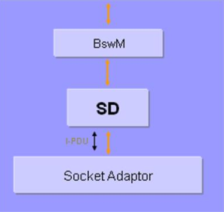
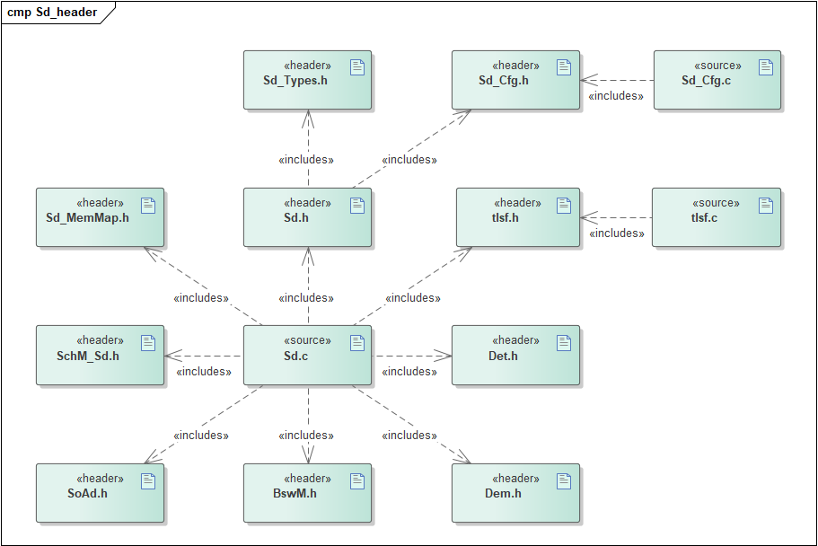
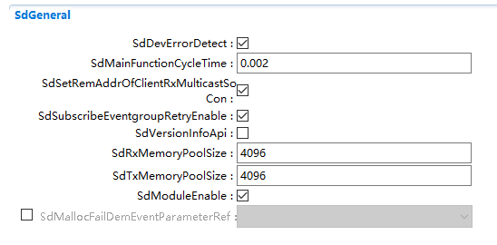
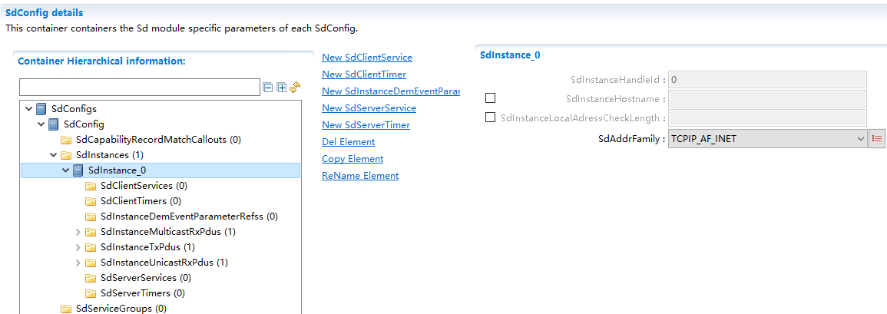
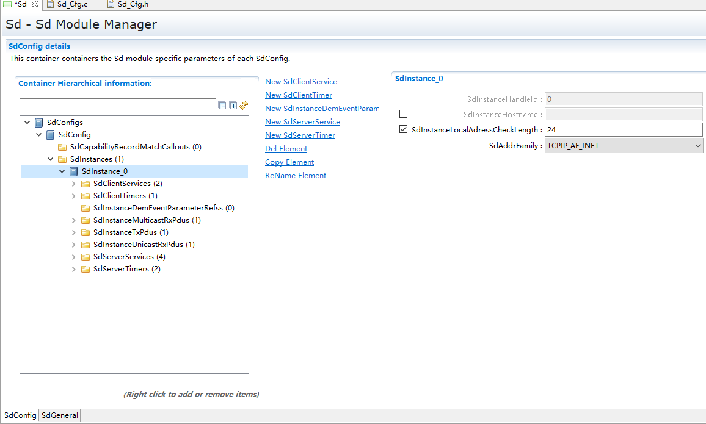
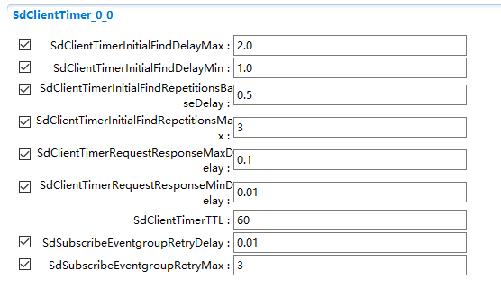
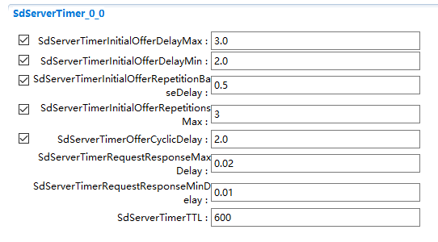
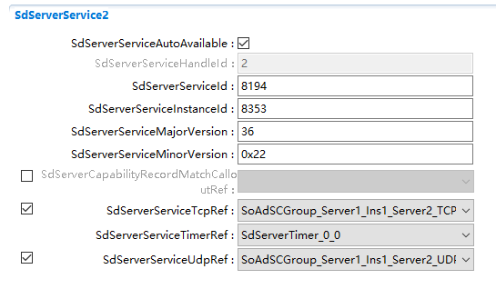
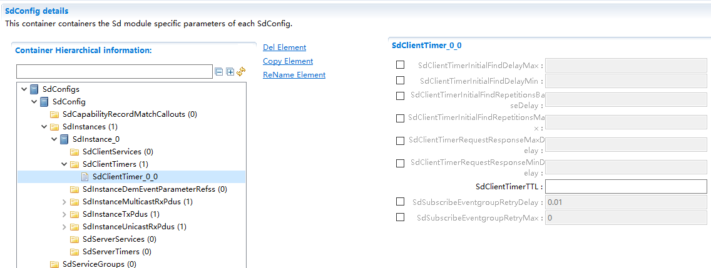
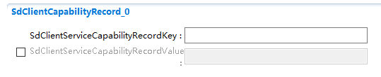
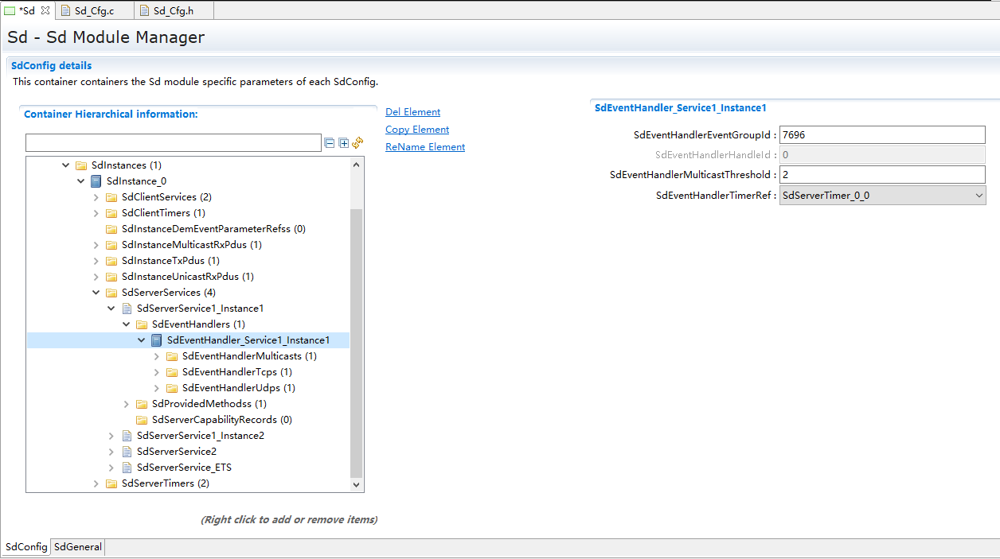

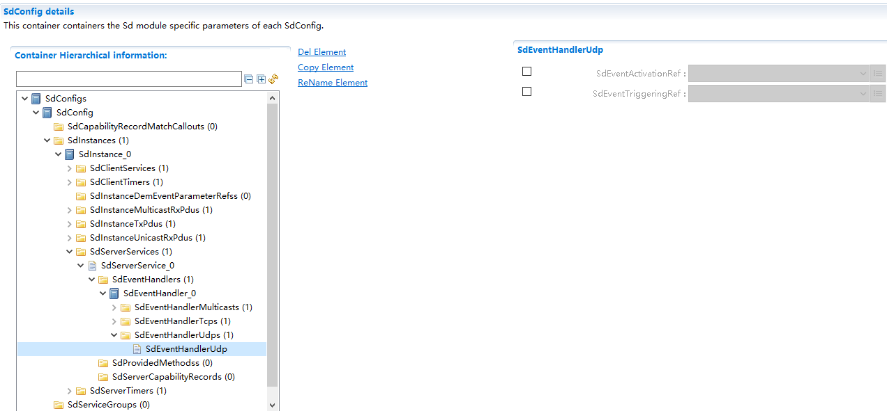

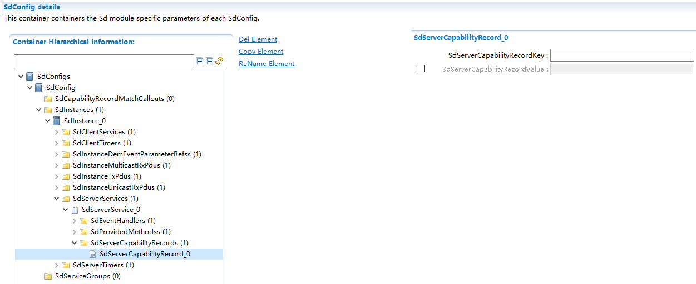
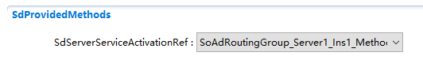
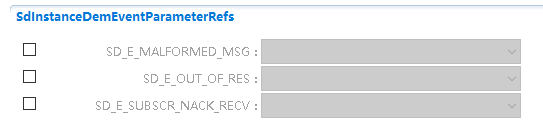
