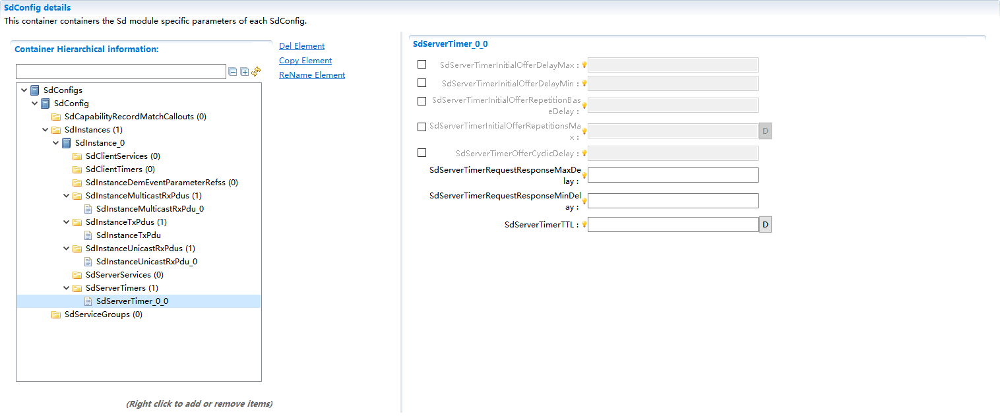

========================
Sd
========================

文档信息 Document Information
==============================

历史版本 Version History
---------------------------------------------------

.. list-table::
   :widths: 10 10 10 10 10
   :header-rows: 1

   * - 日期(Date)
     - 作者(Author)
     - 版本(Version)
     - 状态(Status)
     - 说明(Description)

   * - 2025/3/5
     - Zhijia.Zou
     - V0.1
     - 发布(Release)
     - 首次发布(First release)

   * - 2025/04/04
     - Zhijia.Zou
     - V1.0
     - 发布(Release)
     - 正式发布(Official release)

参考文档 References
---------------------------------------------------

.. list-table::
   :widths: 10 10 40 10
   :header-rows: 1

   * - 编号(Number)
     - 分类(Classification)
     - 标题(Title)
     - 版本(Version)

   * - 1
     - AutoSar
     - AUTOSAR_CP_SWS_ServiceDiscovery.pdf
     - R23-11

   * - 2
     - AutoSar
     - AUTOSAR_CP_SWS_SocketAdaptor.pdf
     - R23-11

   * - 3
     - AutoSar
     - AUTOSAR_PRS_SOMEIPServiceDiscoveryProtocol.pdf
     - R23-11
  
   * - 4
     - AutoSar
     - AUTOSAR_PRS_SOMEIPProtocol.pdf
     - R23-11

术语与简写 Terms and Abbreviations
==================================

简写 Abbreviations
------------------------------------------------

+------------------------+---------------------------------------------+---------------------------------+
| 缩写词（Abbreviation） | 英文全称（Full English name ）              | 中文解释（Chinese explanation） |
+------------------------+---------------------------------------------+---------------------------------+
| BswM                   | Basis software manager                      | 基础软件管理模块                |
+------------------------+---------------------------------------------+---------------------------------+
| ECU                    | Electronic Control Unit                     | 电子控制单元                    |
+------------------------+---------------------------------------------+---------------------------------+
| DEM                    | Diagnostic Event Manager                    | 诊断事件管理器                  |
+------------------------+---------------------------------------------+---------------------------------+
| DET                    | Default Error Tracer                        | 默认错误追踪器                  |
+------------------------+---------------------------------------------+---------------------------------+
| SD                     | Service Discovery                           | 服务发现                        |
+------------------------+---------------------------------------------+---------------------------------+
| Sd                     | Service Discovery Module in AUTOSARAUTOSAR  | 架构中的服务发现模块            |
+------------------------+---------------------------------------------+---------------------------------+
| SoAd                   | Socket Adaptor                              | 套接字适配器                    |
+------------------------+---------------------------------------------+---------------------------------+
| SOME/IP                | Scalable service-Oriented MiddlwarE over IP | 基于IP的可扩展服务导向中间件    |
+------------------------+---------------------------------------------+---------------------------------+
| SOME/IP-SD             | SOME/IP Service Discovery                   | SOME/IP 服务发现                |
+------------------------+---------------------------------------------+---------------------------------+

术语 Terms
---------------------------------------------------

.. list-table::
   :widths: 25 75
   :header-rows: 1

   * - 术语(Terms)
     - 描述(Description)

   * - Service
     - 提供接口的功能实体。(The functional entity that provides interfaces.)

   * - Service Instance
     - 服务的一个实例。(One service instance.)

   * - Offer
     - 提供服务实例的消息条目。(Message entries that provide service instances.)

   * - Stop Offer
     - 停止提供服务实例的消息。(Message of stopping providing service instances.)

   * - Find
     - 用于查找服务实例的消息条目。(Message entries used for searching service instances.)

   * - Event
     - 由实现服务实例的电子控制单元(ECU)发送给使用该服务实例的电子控制单元(ECU)的消息。(The message sent by the electronic control unit (ECU) for realizing the service instance to the electronic control unit (ECU) using the service instance.)

   * - Eventgroup
     - 一个逻辑组合，包含一个或多个事件。事件组是服务的一部分。(One logical combination that contains one or more events.) Eventgroup is part of the service.

   * - Server Service
     - 提供服务。(Provide services.)

   * - Client Service
     - 使用服务。(Services used.)

   * - Server
     - 提供服务器服务的电子控制单元(ECU)。(Electronic control unit (ECU) for providing server service.)

   * - Client
     - 提供客户端服务的电子控制单元(ECU)。(Electronic control unit (ECU) for providing client service.)

   * - Endpoint Option
     - 端点选项用于发布单播地址和端口号的组合。(For publishing the combinations of unicast addresses and port numbers.)

   * - Multicast Option
     - 多播选项用于发布多播地址和端口号的组合。(For publishing the combinations of multicast addresses and port numbers.)

   * - Unicast event
     - 由托管 SdServerService 的 ECU 发送到单播端点的事件。该单播端点由特定的 SdClientService 提供，该 SdClientService 已在引用的 Endpoint Option 中订阅了此 SdServerService(参见已使用事件组的单播端点)。(The event sent by the ECU hosting SdServerService to the unicast endpoint.) This unicast endpoint is provided by the specific SdClientService, which has been subscribed in the referenced Endpoint Option (see unicast endpoints of the used event groups for details).

   * - Multicast event
     - 由托管 SdServerService 的 ECU 发送到多播端点的事件。多播端点可以由 SdServerService(参见事件处理器多播端点)和 SdClientService(参见已使用事件组多播端点)提供。(The event sent by the ECU hosting SdServerService to the multicast endpoint.) The multicast endpoints can be provided by SdServerService (see Event Processor Multicast Endpoint for details) and SdClientService (see Used Event Group Multicast Endpoint for details).

   * - Eventhandler multicast endpoint
     - 用于描述为 SdServerService 的每个事件处理器预先配置的多播地址和端口的术语。如果已达到订阅客户端具有不同端点信息的阈值，则服务器会将相应的事件发送到此预先配置的多播地址和端口。事件处理器多播端点通过引用 SubscribeEventgroupAck 条目的多播选项进行发布。(The term describing the multicast addresses and ports pre-configured for each event handler of SdServerService.) After reaching the threshold with different endpoint information as subscribed at the client, the server will send the corresponding event to this pre-configured multicast address and port. The event handler multicast endpoint makes publication by referencing the multicast option of the SubscribeEventgroupAck entry.

   * - Consumed Eventgroup unicast endpoint
     - 用于描述为 SdClientService 的每个已消费事件组预先配置的单播地址和端口的术语。使用此单播地址和端口进行订阅的 SdClientService，指示 SdServer 将相应的事件发送到哪个端点。已消费事件组的单播端点通过引用 SubscribeEventgroup 或 StopSubscribeEventgroup 条目的端点选项进行发布。(The term describing the unicast address and port pre-configured for each consumed event group of SdClientService.) The SdClientService subscribed by using this unicast address and port instructs SdServer to send the corresponding events to the specific endpoint. The unicast endpoint of the consumed event group is published by referencing the endpoint options of the SubscribeEventgroup or StopSubscribeEventgroup entries.

   * - Consumed Eventgroup multicast endpoint
     - 用于描述为 SdClientService 的每个已消费事件组预先配置的多播地址和端口的术语。使用此多播地址和端口进行订阅的 SdClientService，指示 SdServer 将相应的事件发送到哪个端点。已消费事件组的多播端点通过引用 SubscribeEventgroup 或 StopSubscribeEventgroup 条目的多播选项进行发布。(The term describing the multicast address and port pre-configured for each consumed event group of SdClientService.) The SdClientService subscribed by using this multicast address and port instructs SdServer to send the corresponding events to the specific endpoint. The multicast endpoint of the consumed event group is published by referencing the multicast options of the SubscribeEventgroup or StopSubscribeEventgroup entries.

   * - Eventhandler multicast connection
     - 用于描述 SdServerService 通过配置的事件处理器多播端点提供多播事件时，已建立的套接字连接的使用情况的术语。(The term describing the use of established socket connection when SdServerService provides multicast events via configured event handler multicast endpoint.)

   * - Consumed Eventgroup unicast connection
     - 用于描述 SdClientService 通过已消费事件组的单播端点接收事件时，已建立的套接字连接的使用情况的术语。(The term describing the use of established socket connection when SdClientService receives events via unicast endpoint of a consumed event group.)

   * - Consumed Eventgroup multicast connection
     - 用于描述 SdClientService 通过已消费事件组的多播端点接收事件时，已建立的套接字连接的使用情况的术语。(The term describing the use of established socket connection when SdClientService receives events via multicast endpoint of a consumed event group.)

简介 Introduction
============================

Service Discovery 模块， 即服务发现模块， 主要用于：

The Service Discovery module is mainly used for:

(1)探测外部是否有可用的服务， 定位服务位置。

(1)Detecting whether services are available and locating the service position.

(2)向外部提供可用的服务。

(2)Providing available services both internally and externally.

(3)实现发布/订阅机制， 以控制 Event 报文的订阅和发布。

(3)Realizing publishing/subscription mechanism to control the subscription and publication of Event messages.

Sd 模块位于 SoAd 和 BswM 模块之间， 和上述两个模块协作完成服务发现的功能。

The Sd module is between the SoAd and BswM modules, and works together with the two modules to complete the function of service discovery.

.. figure:: ../../../_static/参考手册/Sd/外部依赖.jpg
   :alt: 外部依赖 (External dependence)
   :align: center

   外部依赖 (External dependence)

功能描述 Functional Description
======================================

OfferService 功能 OfferService Functions
---------------------------------------------------------

OfferService 功能用于向外部声明可以提供某种服务。当本地 ECU 作为服务器端提供某种服务时：

The OfferService function is used for declaring the specific service that can be provided externally.  When the local ECU provides certain services as the server-side:

(1)该服务就绪时， Sd 模块会主动发送包含 OfferService Entry 的报文向其他ECU 表明当前有可用的某种服务。这种情况报文多播发送。

(1)When the service is ready, the Sd module will actively send a message containing the OfferService Entry to other ECUs in order to declare that certain service is available at present. Multicast transmission of messages is required under such case.

(2)当其它 ECU 发送 FindService Entry 主动寻找某种服务时， 本地 ECU 作为服务提供者， 向寻找服务的客户端发送 OfferService Entry， 表白可以提供某种服务。这种情况报文单播发送。

(2)When other ECU sends FindService Entry to actively search for certain service, the local ECU will send OfferService Entry to the client searching for the service as the service provider, in order to declare that certain service is available. Unicast transmission of messages is required under such case.

OfferService 功能实现 Realization of OfferService Functions
~~~~~~~~~~~~~~~~~~~~~~~~~~~~~~~~~~~~~~~~~~~~~~~~~~~~~~~~~~~~~~~~~~~

当服务可用或者不可用时， SWC 需要调用 BswM 的接口通知 BswM 某个服务可用/不可用， BswM 会调用 Sd_ServerServiceSetState(SdServerServiceHandleId，ServerServiceState)接口， 向 Sd 模块表明该服务的状态。其中 SdServerServiceHandleId 参数用于标识服务， ServerServiceState 用于标识服务状态。

When any service is available or unavailable, SWC should notify BsWM that the service is available/unavailable by calling the interface of BsWM. BsWM will call Sd_ServerServiceSetState(SdServerServiceHandleId，ServerServiceState) interface to declare the status of the service to the Sd module. In particular, SdServerServiceHandleId parameter is used for marking services while ServerServiceState for marking the service status.

Sd 模块会根据当前的状态向外发送 OfferService 或者 StopOfferService 报文。报文中会携带 SdServerServiceHandleId 代表的服务的信息(IP 地址， 端口号等)。其他节点可以利用这些信息定位到该服务， 以使用这些服务。Server 可以提供的服务在配置工具 SdInstanceSdServerService 中配置。

The Sd module will send OfferService or StopOfferService messages externally based on the current status. The message will carry the information about the service represented by SdServerServiceHandleId (IP address, port number, etc.). The information can be used by other nodes to locate and use the services. The services that the Server can provide can be configured in the configuration tool SdInstanceSdServerService.

FindService 功能 FindService Functions
------------------------------------------------------------------------------------------------

FindService 功能实现 Realization of FindService Functions
~~~~~~~~~~~~~~~~~~~~~~~~~~~~~~~~~~~~~~~~~~~~~~~~~~~~~~~~~~~~~~~~~~

当 SWC 作为客户端需要使用某种服务时， SWC 会需要调用 BswM 的接口通知 BswM 需要某个服务， BswM 调用 Sd_ClientServiceSetState(ClientServiceHandleId, ClientServiceState)接口， 向 Sd 模块表明需要某个服务。

When SWC requires certain service as the client, it will notify BsWM of the specific service by calling the interface of BswM. BsWM will call the Sd_ClientServiceSetState(ClientServiceHandleId, ClientServiceState) interface to declare to the Sd module about the specific service required.

Sd 模块会向外发送 FindService 报文。报文中会携带 SdServerServiceHandleId 代表的服务的具体信息(Service ID， 版本号等) 。其他节点理由这些信息判断自己是否可以提供这个服务， 可以提供时会发送 OfferService 通知寻找服务的客户端。

Sd  module will send FindService message externally. The message will carry the specific information about the service represented by SdServerServiceHandleId (Service ID, version No., etc.). The information can also be used by other nodes to determine whether they can provide this service. If they can provide the service as well, these nodes will send an OfferService notification to the client looking for the service.

Client 需要的的服务(即需要寻找的服务) 在配置工具 SdInstance->SdClientService 中配置。

The services required by the Client (i.e. the service under search) are configured in the configuration tool SdInstance->SdClientService.

Eventgroup 功能 Eventgroup Functions
------------------------------------------------------------------------------------------------

Eventgroup 功能实现 Realization of Eventgroup Functions
~~~~~~~~~~~~~~~~~~~~~~~~~~~~~~~~~~~~~~~~~~~~~~~~~~~~~~~~

当 SWC(作为客户端) 需要订阅某个 Eventgroup 时， SWC 会调用 BswM 的接口通知 BswM， BswM 会调用 Sd_ConsumedEventGroupSetState(SdConsumedEventGroupHandleId， ConsumedEventGroupState)接口通知 Sd 模块。当 Sd 模块收到提供该 Eventgroup 的对应服务发送的 OfferService 报文时， Sd 模块会发送包含 SubscribeEventgroup Entry 的报文订阅 Eventgroup。

When SWC (as a client) needs to subscribe one Eventgroup, SWC will notify BsWM by calling the interface of BswM. BsWM will call Sd_ConsumedEventGroupSetState(SdConsumedEventGroupHandleId， ConsumedEventGroupState) Interface to notify Sd module. Upon receiving the OfferService message sent by the corresponding service providing such Eventgroup, Sd module will send a message containing the SubscribeEventgroup Entry to subscribe to the Eventgroup.

Client 需要订阅的 Eventgroup 在配置工具 SdInstance->SdClientService->SdConsumedEventGroup 中配置。

The Eventgroup that the Client needs to subscribe can be configured in the configuration tool SdInstance->SdClientService->SdConsumedEventGroup.

Eventgroup 管理功能 Eventgroup Management Functions
------------------------------------------------------------------------------------------------

Eventgroup 管理功能简介 Introduction to Eventgroup Management Functions
~~~~~~~~~~~~~~~~~~~~~~~~~~~~~~~~~~~~~~~~~~~~~~~~~~~~~~~~~~~~~~~~~~~~~~~~~~~~~~~~

当 Client 向 Server 订阅 Eventgroup 时， Server 需要管理订阅该 Eventgroup的客户端。

When Client subscribes Eventgroup from Server, the Server should manage the client that subscribes to that Eventgroup.

Eventgroup 管理功能的实现 Realization of Eventgroup Management Functions
~~~~~~~~~~~~~~~~~~~~~~~~~~~~~~~~~~~~~~~~~~~~~~~~~~~~~~~~~~~~~~~~~~~~~~~~~~~~~~~~

当 收 到 Client 的 SubscribeEventgroup 报 文 后 ， Server 需 要 和 将 SubscribeEventgroup 报文中的信息(Eventgroup ID， 版本号， Service ID 等) 和配置中保存的信息作比较， 如果一致的情况下， 并且该 Client 之前不在订阅列表中， 则将该 Client 添加到订阅列表中， 向该 Client 应答 SubscribeEventgroupAck 报文。如果该 Client 之前已经在订阅列表中， 则用 SubscribeEventgroup Entry 中的 TTL 时 间 更 新 订 阅 列 表 中 的 TTL 值 。信 息 不 一 致 的 情 况 下 ， 应 答SubscribeEventgroupNAck 报文。

Upon receiving the SubscribeEventgroup message from the Client, the Server should compare the information in the SubscribeEventgroup message (Eventgroup ID, version No., Service ID, etc.) with that saved in the configuration. If the information of the above is consistent and the Client was not included in the subscription list, the Server will add the Client to the list and respond to the SubscribeEventgroupAck message to the Client. If the client has already been included in the subscription list, update the TTL value in the subscription list with the TTL time in the SubscribeEventgroup Entry. If however the information is inconsistent, respond to the SubscribeEventgroupNAck message.

当订阅时间到(SubscribeEventgroup 中携带的 TTL 计时时间到) 或者收到 Client 发送的 StopSubscribeEventgroup Entry， Server 需要将该 Client 从订阅列表中删除。

If the subscription time (TTL timing in the SubscribeEventgroup) expires or StopSubscribeEventgroup Entry is received from the client, the Server should remove the Client from the subscription list.

Server 提 供 的 Eventgroup ( 需 要 管 理 的 Eventgroup ) 在 配 置 工 具SdInstance->SdServerService->SdEventHandler 中配置。

The Eventgroup provided by the Server (i.e., the Eventgroup that needs managing) is configured in the configuration tool SdInstance->SdServerService->SdEventHandler.

RoutingPath 控制功能 RoutingPath Control Functions
------------------------------------------------------------------------------------------------

RoutingPath 控制功能简介 Introduction to RoutingPath Control Functions
~~~~~~~~~~~~~~~~~~~~~~~~~~~~~~~~~~~~~~~~~~~~~~~~~~~~~~~~~~~~~~~~~~~~~~~~~~~~~~~~

Sd 模块通过控制 SoAd 里面 SoAdRoutingGroup 的状态(Enable/Disable) ，从而达到控制 Event 的接收和发送的路径的通断， 控制 Event 的接收和发送。其中对 Event 发送路径的控制叫 Fan out 控制， 对 Event 接收路径的控制叫 Fan in控制。

The Sd module controls the on/off of the path for receiving and sending Events, as well as the receiving and sending of Event by controlling the status (Enable/Disable) of the SoAdRoutingGroup in SoAd. In particular, the control over the Event sending path is called Fan out control, and that over the Event receiving path is called Fan in control.

RoutingPath 控制功能的实现 Realization of RoutingPath Control Functions
~~~~~~~~~~~~~~~~~~~~~~~~~~~~~~~~~~~~~~~~~~~~~~~~~~~~~~~~~~~~~~~~~~~~~~~~~~~~~~~~

Fan out 控制 Fan out Control
------------------------------------------------

当 Client 订阅 Eventgroup 时， Server 根据 Client 发送的 SubscribeEventgroupEntry 中携带的信息在配置中找到与之匹配的 SdEventHandler， 根据 SdEventHandler 中的 SdEventHandlerTcp/SdEventHandlerUdp 找到对应的 SoAdRoutingGroup(取得 RoutingGroup ID) 。根据 SubscribeEventgroup Entry 中携带的 Endpointoption 信息以及配置中的 SdServerServiceUdpRef/SdServerServiceTcpRef 参数推导出该 Event 发送对应的 SocketConnection(取得 SoConId) ， 然后调用 SoAd_EnableSpecificRouting()或 SoAd_DisableSpecificRouting(RoutingGroupId， SoConId)， 来控制对应的 RoutingGroup。

When the Client subscribes Eventgroup, the Server will find the matching SdEventHandler in the configuration based on the information carried in the SubscribeEventgroupEntry sent by the Client, and further the corresponding SoAdRoutingGroup (obtains the RoutingGroup ID) based on the SdEventHandlerTcp/SdEventHandlerUdp in the SdEventHandler. According to the Endpointoption information in the SubscribeEventgroup Entry and the SdServerServiceUdpRef/SdServerServiceTcpRef  parameter in the configuration, deduce the corresponding SocketConnection (obtains the SoConId) sent by the Event, and then call SoAd_EnableSpecificRouting() or SoAd_DisableSpecificRouting(RoutingGroupId， SoConId) to control the corresponding RoutingGroup.

Fan in 控制 Fan in Control
------------------------------------------------

当 Client 向 Server 发送 SubscribeEventgroup Entry 向 Server 订阅某个 Eventgroup 时， Client 通过配置中的 SdConsumedEventGroupTcpActivationRef/SdConsumedEventGroupUdpActivationRef 参数找到对应的 SoAdRoutingGroup(取得 RoutingGroup ID) 。根据 OfferService Entry 中携带的 Endpoint option 信息以及配置中的 SdClientServiceUdpRef/SdClientServiceTcpRef 参数推导出该 Event 发送对应的 SocketConnection(取得 SoConId) ， 然后调用 SoAd_EnableSpecificRouting()或 SoAd_DisableSpecificRouting(RoutingGroupId， SoConId)， 来控制对应的 RoutingGroup。

When SubscribeEventgroup Entry sent from Client to Server subscribes one Eventgroup from Server, the Client finds the corresponding SoAdRoutingGroup (obtains the RoutingGroup ID) through the SdConsumedEventGroupTcpActivationRef/SdConsumedEventGroupUdpActivationRef parameters in the configuration. According to the Endpointoption information in the OfferService Entry and the SdClientServiceUdpRef/SdClientServiceTcpRef  parameter in the configuration, deduce the corresponding SocketConnection (obtains the SoConId) sent by the Event, and then call SoAd_EnableSpecificRouting() or SoAd_DisableSpecificRouting(RoutingGroupId， SoConId) to control the corresponding RoutingGroup.

注意： 以上描述的所有功能能实现的前提是本端 ECU 的 IP 地址已指定， 即 Sd 模块的 Sd_LocalIpAddrAssignmentChg(SoConId， State)被调用过， 并且 State 为 TCPIP_IPADDR_STATE_ASSIGNED。

Note: The premise for realizing all the functions described above is that the IP address of the local ECU has been specified, that is, the Sd_LocalIpAddrAssignmentChg(SoConId, State) of the Sd module has been called, and the State is TCPIP_IPADDR_STATE_ASSIGNED.

偏差 Deviation
------------------------------------------------

None

扩展 Extension
------------------------------------------------

None

集成 Integration
============================

文件列表 File List
------------------------------------------------

文件结构图 File Structure Diagram
~~~~~~~~~~~~~~~~~~~~~~~~~~~~~~~~~~~~~~~

.. figure:: ../../../_static/参考手册/Sd/文件结构图.jpg
   :alt: 文件结构图 (File structure diagram)
   :align: center

   文件结构图 (File Structure Diagram)

静态文件 Static Files
~~~~~~~~~~~~~~~~~~~~~~~~~~~~

+---------------+--------------------------------------------------------------------------------------------------------+
| 文件（File）  | 说明（Description）                                                                                    |
+---------------+--------------------------------------------------------------------------------------------------------+
| Sd_Internal.h | 订阅 Sd 模块使用的宏定义和数据类型（Macro definitions and data types used for subscribing Sd modules） |
+---------------+--------------------------------------------------------------------------------------------------------+
| Sd_Types.h    | 定义Sd 模块的数据类型（Define the data type of Sd module）                                             |
+---------------+--------------------------------------------------------------------------------------------------------+
| Sd.h          | 声明 Sd 模块外部函数（Declare the external function of Sd module）                                     |
+---------------+--------------------------------------------------------------------------------------------------------+
| Sd.c          | 实现 Sd 模块功能（Realize the function of Sd module）                                                  |
+---------------+--------------------------------------------------------------------------------------------------------+

动态文件 Dynamic Files
~~~~~~~~~~~~~~~~~~~~~~~~~~~~

+--------------+-------------------------------------------------------------------------------------------------------------------------------------------------------+
| 文件（File） | 说明（Description）                                                                                                                                   |
+--------------+-------------------------------------------------------------------------------------------------------------------------------------------------------+
| Sd_Cfg.h     | 定义 Sd 模块不支持变体的宏定义（Define the macro definition of variant not supported by Sd module）                                                   |
+--------------+-------------------------------------------------------------------------------------------------------------------------------------------------------+
| Sd_PbCfg.h   | 定义 Sd 模块支持变体的宏定义和声明运行时变量（Define the macro definition of variant supported by Sd module and declare the variable during running） |
+--------------+-------------------------------------------------------------------------------------------------------------------------------------------------------+
| Sd_PbCfg.c   | 定义 Sd 模块支持变体的配置（Define the configuration of variant supported by Sd module）                                                              |
+--------------+-------------------------------------------------------------------------------------------------------------------------------------------------------+

错误处理 Error Handling
------------------------------------------------

开发错误 Development Errors
~~~~~~~~~~~~~~~~~~~~~~~~~~~~

+-------------------------------------+---------------+-----------------------------------------------------+
| Error code                          | Value[hex]    | Description                                         |
+=====================================+===============+=====================================================+
| SD_E_UNINIT                         | 0x01          | SD has not been initialized                         |
+-------------------------------------+---------------+-----------------------------------------------------+
| SD_E_PARAM_POINTER                  | 0x02          | Null pointer has been passed as an argument         |
+-------------------------------------+---------------+-----------------------------------------------------+
| SD_E_INV_MODE                       | 0x03          | Invalid mode request                                |
+-------------------------------------+---------------+-----------------------------------------------------+
| SD_E_INV_ID                         | 0x04          | Invalid ID                                          |
+-------------------------------------+---------------+-----------------------------------------------------+
| SD_E_INIT_FAILED                    | 0x05          | Initialization failed                               |
+-------------------------------------+---------------+-----------------------------------------------------+

运行时错误 Runtime Errors
~~~~~~~~~~~~~~~~~~~~~~~~~~~~

+-------------------------------------------+---------------+-----------------------------------------------------+
| Error code                                | Value[hex]    | Description                                         |
+===========================================+===============+=====================================================+
| SD_E_COUNT_OF_RETRY_SUBSCRIPTION_EXCEEDED | 0x06          | Retry was not successful                            |
+-------------------------------------------+---------------+-----------------------------------------------------+

接口描述 Interface Description
========================================================

.. include:: Sd_h_api.rst

功能集成 Function Integration
------------------------------------------------

创建SdInstance Create SdInstance
~~~~~~~~~~~~~~~~~~~~~~~~~~~~~~~~~~~~

.. figure:: ../../../_static/参考手册/Sd/SdInstance.png
   :alt: SdInstance
   :align: center

   SdInstance

子容器SdInstanceMulticastRxPdu、SdInstanceTxPdu、SdInstanceUnicastRxPdu在创建SdInstance时会默认生成且不可删除。以下为具体功能：

The subcontainers SdInstanceMulticastRxPdu, SdInstanceTxPdu and SdInstanceUnicastRxPdu are generated by default when creating SdInstances and cannot be deleted. Their functions are as below:

(1)SdInstanceMulticastRxPdu：用于接收多播消息。

(1)SdInstanceMulticastRxPdu: Receives multicast messages.

(2)SdInstanceTxPdu：用于发送消息。

(2)SdInstanceTxPdu: Sends messages.

(3)SdInstanceUnicastRxPdu：用于接收单播消息。

(3)SdInstanceUnicastRxPdu: Receives unicast message.

SdInstance容器具有以下属性：

SdInstance container has the following attributes:

(4)SdInstanceHandleId：Sd实例的ID，该属性不可更改，在SdInstance容器创建时自动生成。

(4)SdInstanceHandleId: The ID of the Sd instance; the attribute is not changed and is automatically generated when the SdInstance container is created.

(5)SdInstanceHostName：Sd实例的HostName，该属性属性为可选属性，用于在服务发现过程中匹配能力集。该属性支持变体，即在不同变体中SdInstanceHostName可设置不同的字符串。

(5)SdInstanceHostName: The HostName of the Sd instance; the attribute is optional and used for matching capability sets during service discovery. This attribute supports variant, which means different strings can be set for SdInstanceHostName in different variants.

(6)SdInstanceLocalAdressCheckLength：用于描述应比较地址的多少位，以确定远程地址是否可接受使用。该属性支持变体，即在不同变体中SdInstanceLocalAdressCheckLength属性可设置不同的值。

(6)SdInstanceLocalAdressCheckLength: Describes the specific bits of the address that shall be compared, in order to determine if a remote address is acceptable and usable. This attribute supports variants, which means that the attribute value can be different in SdInstanceLocalAdressCheckLength of different variants.

(7)SdAddrFamily：描述远程地址的协议族，即IPv4或IPv6。

(7)SdAddrFamily: Describes the protocol family for remote addresses, i.e., IPv4 or IPv6.

SdInstance容器无容器多重性，在多变体工程中，不同变体应具有相同数量的SdInstance容器。

SdInstance container does not support container multiplicity. In multi-variant projects, the number of SdInstance containers for different variants should be the same.

对于使用不同 Socket 的 Sd 服务，应为其创建不同的Instance容器。应遵循以下步骤：

Different instance containers should be created for the Sd services using different sockets. The specific steps:

(8)设置SdAddrFamily属性。

(8)Set the attribute of SdAddrFamily.

(9)设置SdInstanceMulticastRxPdu、SdInstanceTxPdu、SdInstanceUnicastRxPdu子容器引用的Pdu。

(9)Set the Pdu referenced by the SdInstanceMulticastRxPdu, SdInstanceTxPdu and SdInstanceUnicastRxPdu sub-containers.

(10)设置SdInstanceHostname和SdInstanceLocalAdressCheckLength属性。(可选)

(10)Set the attribute of SdInstanceHostname and SdInstanceLocalAdressCheckLength. (Optional)

创建SdServerTimer Create SdServerTimer
~~~~~~~~~~~~~~~~~~~~~~~~~~~~~~~~~~~~~~~~~~~~~~~~~~~~~~~~

   SdInstance

SdServerTimer容器具有以下属性：

SdServerTimer container has the following attributes:

(1)SdServerTimerInitialOfferDelayMax：表示服务器实例初始化阶段最长的持续时间和服务器实例自启动后最长的延迟时间。

(1)SdServerTimerInitialOfferDelayMax: The longest duration of the server instance initialization phase and the longest delay time after the server instance self-start.

(2)SdServerTimerInitialOfferDelayMin：表示服务器实例初始化阶段最短的持续时间和服务器实例自启动后最短的延迟时间。

(2)SdServerTimerInitialOfferDelayMin: The shortest duration of the server instance initialization phase and the shortest delay time after the server instance self-start.

(3)SdServerTimerInitialOfferRepetitionBaseDelay：表示用于计算服务器实例重复阶段周期的时间基。

(3)SdServerTimerInitialOfferRepetitionBaseDelay: Time base used for calculating the repetition period of server instance.

(4)SdServerTimerInitialOfferRepetitionsMax：用于描述服务器实例重复阶段的最大循环次数。

(4)SdServerTimerInitialOfferRepetitionsMax: : Describes the maximum number of iterations of server instance in repetition period.

(5)SdServerTimerOfferCyclicDelay：用于计算服务器实例进入主节点后发送OfferService的时间间隔。

(5)SdServerTimerOfferCyclicDelay: Calculates the time interval for sending OfferService after the server instance enters the master node.

(6)SdServerTimerRequestResponseMaxDelay：通过多播接收的条目的最大允许响应延迟(以秒为单位)。

(6)SdServerTimerRequestResponseMaxDelay: The maximum allowable response delay for entries received through multicast (in second).

(7)SdServerTimerRequestResponseMinDelay：通过多播接收的条目的最小允许响应延迟(以秒为单位)。

(7)SdServerTimerRequestResponseMinDelay：The minimum allowable response delay for entries received through multicast (in second).

(8)SdServerTimerTTL：描述服务器实例提供服务和事件的生存时间(以秒为单位)。

(8)SdServerTimerTTL: Describes the lifetime of services and events provided by the server instance (by second).

SdServerTimer容器中数据均具有变体，即在不同变体下可配置不同的值。

The data in the SdServerTimer container has variants, which means that different values can be configured under different variants.

SdServerTimer容器不具有容器多重性，在多变体工程中，不同变体应具有相同数量的SdServerTimer容器。

The SdServerTimer container does not support container multiplicity. In a multi-variant project, the number of SdServerTimer containers should be the same in different variants.

SdServerTimer容器的配置参考以下步骤：

Refer to the following steps for the configuration of SdServerTimer container:

(1)设置SdServerTimerInitialOfferDelayMax和SdServerTimerInitialOfferDelayMin属性。不设置该属性或设置为0时认为服务器实例启动后直接进入重复阶段并立即发送第一条OfferService。

(1)Set the attribute of SdServerTimerInitialOfferDelayMax and SdServerTimerInitialOfferDelayMin. When this attribute is not set or is set to 0, the server instance will enter the repetition period directly after startup and send the first OfferService immediately.

(2)设置SdServerTimerInitialOfferRepetitionBaseDelay和SdServerTimerInitialOfferRepetitionsMax属性。不设置该属性或设置为0时服务器在进入重复阶段后立即进入主阶段。

(2)Set the attribute of SdServerTimerInitialOfferRepetitionBaseDelay and SdServerTimerInitialOfferRepetitionsMax. When this attribute is not set or is set to 0, the server will enter the main phase soon after entering the repetition period.

(3)设置SdServerTimerOfferCyclicDelay属性。不设置该属性或设置为0时，服务器在进入主阶段后不会周期发送OfferService。

(3)Set the attribute of SdServerTimerOfferCyclicDelay. When this attribute is not set or is set to 0, the server will not send OfferService periodically after entering the main stage.

(4)设置SdServerTimerRequestResponseMaxDelay和SdServerTimerRequestResponseMinDelay。设置为0时，在接收到需服务器实例应答的多播条目后，会立即发送应答报文。

(4)Set the attribute of SdServerTimerRequestResponseMaxDelay and SdServerTimerRequestResponseMinDelay. When the attribute is set to 0, the response message will be immediately sent upon receiving a multicast entry that requires response from the server instance.

(5)设置SdServerTimerTTL。该参数需大于0，设置为0xffffffff时，表示服务器实例的服务和事件生存时间无限制。

(5)Set SdServerTimerTTL. This parameter should be greater than 0. When it is set to 0xffffff, it means that the service and event lifetime of the server instance are unlimited.

创建SdClientTimer Create SdClientTimer
~~~~~~~~~~~~~~~~~~~~~~~~~~~~~~~~~~~~~~~~~~~~~~~~~~~~~~~~

.. figure:: ../../../_static/参考手册/Sd/SdClientTimer.png
   :alt: SdClientTimer
   :align: center

   SdClientTimer

SdClientTimer容器具有以下属性：

SdClientTimer container has the following attributes:

(1)SdClientTimerInitialFindDelayMax：表示客户端实例初始化阶段最长的持续时间和客户端实例启动后发送第一帧FindService最长的延迟时间。

(1)SdClientTimerInitialFindDelayMax: The longest duration of the client instance initialization phase and the longest delay time for sending the first frame of FindService after starting the client instance.

(2)SdClientTimerInitialFindDelayMin：表示客户端实例初始化阶段最端的持续时间和客户端实例启动后发送第一帧FindService最长的延迟时间。

(2)SdClientTimerInitialFindDelayMin: The shortest duration of the client instance initialization phase and the longest delay time for sending the first frame of FindService after starting the client instance.

(3)SdClientTimerInitialFindRepetitionsBaseDelay：表示用于计算服务器实例重复阶段周期的时间基。

(3)SdClientTimerInitialFindRepetitionsBaseDelay: The time base used for calculating the repetition period of server instances.

(4)SdClientTimerInitialFindRepetitionsMax：表示客户端重复阶段最大的循环次数。

(4)SdClientTimerInitialFindRepetitionsMax: The maximum number of iterations for the client's repetition period.

(5)SdClientTimerRequestResponseMaxDelay：通过多播接收的条目的最大允许响应延迟。

(5)SdClientTimerRequestResponseMaxDelay: The maximum allowable response delay for entries received through multicast.

(6)SdClientTimerRequestResponseMinDelay：通过多播接收的条目的最短允许响应延迟

(6)SdClientTimerRequestResponseMinDelay: The minimum allowable response delay for entries received through multicast.

(7)SdClientTimerTTL：Find和Subscribe的生存时间。

(7)SdClientTimerTTL: The lifetime of Find and Subscribe.

(8)SdSubscribeEventgroupRetryDelay：如果未收到 SubscribeEventGroupAck 或 SubscribeEventGroupNack，则重新触发对事件组的订阅的时间(以秒为单位)

(8)SdSubscribeEventgroupRetryDelay: If neither SubscribeEventGroupAck nor SubscribeEventGroupNack is received, the subscription time of event group will be triggered again (by second)

(9)SdSubscribeEventgroupRetryMax：重新触发对事件组的订阅的最大次数。

(9)SdSubscribeEventgroupRetryMax: The maximum times of re-triggering the subscriptions to event groups.

SdClientTimer容器中数据均具有变体，即在不同变体下可配置不同的值。

The data in the SdClientTimer container has variants, which means that different values can be configured under different variants.

SdClientTimer容器不具有容器多重性，在多变体工程中，不同变体应具有相同数量的SdClientTimer容器。

The SdClientTimer container does not support container multiplicity. In a multi-variant project, the number of SdClientTimer containers should be the same in different variants.

SdClientTimer容器的配置参考以下步骤：

Refer to the following steps for the configuration of SdClientTimer container:

(1)设置SdClientTimerInitialFindDelayMax和SdClientTimerInitialFindDelayMin属性。不设置该属性或设置为0时认为客户端实例启动后直接进入重复阶段并立即发送第一帧FindService。

(1)Set the attribute of SdClientTimerInitialFindDelayMax and SdClientTimerInitialFindDelayMin. When this attribute is not set or is set to 0, the client will enter the repetition period directly after startup and send the first frame of FindService immediately.

(2)设置SdClientTimerInitialFindRepetitionsBaseDelay和SdClientTimerInitialFindRepetitionsMax属性。不设置该属性或设置为0时客户端在进入重复阶段后立即进入主阶段。

(2)Set the attribute of SdClientTimerInitialFindRepetitionsBaseDelay and SdClientTimerInitialFindRepetitionsMax. When this attribute is not set or is set to 0, the client will enter the main phase soon after entering the repetition period.

(3)设置SdClientTimerRequestResponseMaxDelay和SdClientTimerRequestResponseMinDelay。设置为0时，在接收到需客户端应答的多播条目后，会立即发送应答报文。

(3)Set SdClientTimerRequestResponseMaxDelay and SdClientTimerRequestResponseMinDelay. When the attribute is set to 0, the response message will be immediately sent upon receiving a multicast entry that requires response from the client.

(4)设置SdClientTimerTTL。该参数需大于0，设置为0xffffffff时，表示客户端的生存时间无限制。

(4)Set SdClientTimerTTL. This parameter should be greater than 0. When it is set to 0xffffff, it means that the client lifetime is unlimited.

(5)设置SdSubscribeEventgroupRetryDelay和SdSubscribeEventgroupRetryMax。不设置或设置为0时，如果未收到 SubscribeEventGroupAck 或 SubscribeEventGroupNack，则不重新触发对事件组的订阅。若设置了SdSubscribeEventgroupRetryDelay参数，SdSubscribeEventgroupRetryMax参数也必须设置。

(5)Set SdSubscribeEventgroupRetryDelay and SdSubscribeEventgroupRetryMax. When the attribute is not set or is set to 0, if neither SubscribeEventGroupAck nor SubscribeEventGroupNack is received, the subscription to the event group will not be triggered again. If SdSubscribeEventgroupRetryDelay parameter is set, SdSubscribeEventgroupRetryMax parameter must be set as well.

创建SdServerService Create SdServerService
~~~~~~~~~~~~~~~~~~~~~~~~~~~~~~~~~~~~~~~~~~~~~~~~~~~~~~~~

.. figure:: ../../../_static/参考手册/Sd/SdServerService.png
   :alt: SdServerService
   :align: center

   SdServerService

SdServerService容器具有以下属性：

SdServerService container has the following attributes:

(1)SdServerServiceAutoAvailable：是否自动启动ServerService。该属性支持多重性。SdServiceGroup管理至少一个ServiceGroup时该属性应使能。

(1)SdServerServiceAutoAvailable: Whether to start ServerService automatically. The attribute supports multiplicity. The attribute should be enabled when SdServiceGroup manages at least one ServiceGroup.

(2)SdServerServiceHandleId：ServerService的句柄ID。该属性由工具自动生成，用户无法手动修改。该属性不支持多变体。

(2)SdServerServiceHandleId: Handle ID of ServerService. The attribute is generated automatically by tool and cannot be modified by user manually. The attribute does not support multi-variant.

(3)SdServerServiceId 和 SdServerServiceInstanceId：Offer报文中的ServiceId和InstanceId字段。在一个SdInstance中不同ServerService的SericeId和InstanceId不能完全相同。该属性支持多变体。

(3)SdServerServiceId and SdServerServiceInstanceId: The ServiceId and InstanceId fields in the Offer message. The SericeId and InstanceId of different ServerServices in an SdInstance cannot be totally the same. The attribute supports multi-variant.

(4)SdServerServiceLoadBalancingPriority 和 SdServerServiceLoadBalancingWeight：负载均衡的优先级和权重，可不配置。该属性支持多变体。

(4)SdServerServiceLoadBalancingPriority and SdServerServiceLoadBalancingWeight: The priority and weight of load balancing, which are optional. The attribute supports multi-variant.

(5)SdServerServiceMajorVersion 和 SdServerServiceMinorVersion：Service的主版本号和次版本号。该属性支持多变体。

(5)SdServerServiceMajorVersion and SdServerServiceMinorVersion: Main and second version numbers of Service. The attribute supports multi-variant.

(6)SdServerCapabilityRecordMatchCalloutRef：接收到Find报文和Subscribe如果引用的选项中包含能力集选项，将调用该回调函数检查能力集是否匹配，可不配置。该属性支持多变体。

(6)SdServerCapabilityRecordMatchCalloutRef: If the referenced options include capability set options after receiving Find message and Subscribe, this callback function will be called to check if the capability set matches. It is optional. The attribute supports multi-variant.

(7)SdServerServiceUdpRef 和 SdServerServiceTcpRef：OfferService报文中引用的udp和tcp选项。该属性支持多变体。

(7)SdServerServiceUdpRef and SdServerServiceTcpRef: The udp and tcp options referenced in the OfferService message. The attribute supports multi-variant.

(8)SdServerServiceTimerRef：ServerService使用的定时器。该属性支持多变体。

(8)SdServerServiceTimerRef: Timer for ServerService. The attribute supports multi-variant.

(9)SdServiceGroupRef：ServerService关联的服务组。该属性支持多变体和属性多重性。

(9)SdServiceGroupRef: Service group linked with ServerService. The attribute supports multi-variant and attribute multiplicity.

SdServerService容器不支持容器多重性，在多变体工程中，不同变体应具有相同数量的SdServerService容器。

SdServerService container does not support container multiplicity. In multi-variant projects, the number of SdServerService containers should be the same in different variants.

服务实例如需向客户端提供Event或Method则应配置SdEventHandler和SdProvidedMethods容器。

If the service instance needs to provide Event or Method for the client, it should configure the SdEventHandler and SdProvidedMethods containers.

创建SdClientService Create SdClientService
~~~~~~~~~~~~~~~~~~~~~~~~~~~~~~~~~~~~~~~~~~~~~~~~~~~~~~~~

.. figure:: ../../../_static/参考手册/Sd/SdClientService.png
   :alt: SdClientService
   :align: center

   SdClientService

(1)SdClientServiceAutoRequire：是否自动启动ClientService。该属性支持多重性。SdServiceGroup管理至少一个ServiceGroup时该属性应使能。

(1)SdClientServiceAutoRequire: Start ClientService automatically or not. The attribute supports multiplicity. The attribute should be enabled when SdServiceGroup manages at least one ServiceGroup.

(2)SdClientServiceHandleId：ClientService的句柄ID。该属性由工具自动生成，用户无法手动修改。该属性不支持多变体。

(2)SdClientServiceHandleId: Handle ID of ClientService. The attribute is generated automatically by tool and cannot be modified by user manually. The attribute does not support multi-variant.

(3)SdClientServiceId 和 SdClientServiceInstanceId：Find报文和Subscribe报文中的ServiceId和InstanceId字段。用于匹配ServerService在一个SdInstance中不同ClientService的SericeId和InstanceId不能完全相同。该属性支持多变体。

(3)SdClientServiceId and SSdClientServiceInstanceId: The ServiceId and InstanceId fields in the Find and Subscribe messages. The SericeId and InstanceId used for matching ServerService for different Client Services in an SdInstance cannot be totally the same. The attribute supports multi-variant.

(4)SdVersionDrivenFindBehavior：是否使用版本驱动的服务发现行为。该属性支持多变体。

(4)SdVersionDrivenFindBehavior: Whether to use version driven service discovery behavior. The attribute supports multi-variant.

(5)SdClientCapabilityRecordMatchCalloutRef：接收到Offer报文如果引用的选项中包含能力集选项，将调用该回调函数检查能力集是否匹配，可不配置。该属性支持多变体。

(5)SdClientCapabilityRecordMatchCalloutRef: If the referenced options include capability set options after receiving Offer message, this callback function will be called to check if the capability set matches. It is optional. The attribute supports multi-variant.

(6)SdClientServiceMulticastRef、SdClientServiceUdpRef：订阅报文中引用的multicast和udp选项，这两个选项为互斥选项。该属性支持多变体。

(6)SdClientServiceMulticastRef、SdClientServiceUdpRef: The multicast and udp options referenced in the subscription message are mutually exclusive. The attribute supports multi-variant.

(7)SdClientServiceTcpRef：订阅报文中引用的tcp选项。该属性支持多变体。

(7)SdClientServiceTcpRef: The tcp option referenced in the subscription message. The attribute supports multi-variant.

(8)SdClientServiceTimerRef：ClientService使用的定时器。该属性支持多变体。

(8)SdServerServiceTimerRef: Timer for ServerService. The attribute supports multi-variant.

(9)SdServiceGroupRef：ClientService关联的服务组。该属性支持多变体和属性多重性。

(9)SdServiceGroupRef: Service group linked with ClientService. The attribute supports multi-variant and attribute multiplicity.

SdClientService容器不支持容器多重性，在多变体工程中，不同变体应具有相同数量的SdClientService容器。

The SdClientService container does not support container multiplicity. In a multi-variant project, the number of SdClientService containers should be the same in different variants.

如需订阅服务器的Event或使用服务器提供的Method，则应配置SdConsumedEventGroup和SdConsumedMethods容器。

To subscribe to server Event or use Method provided by the server, configure SdConsumedEventGroup and SdConsumedMethods containers.