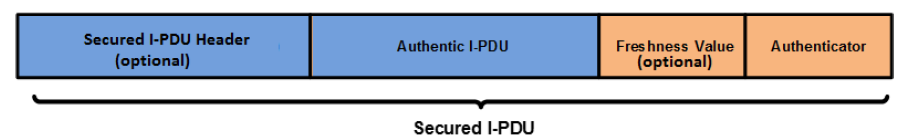
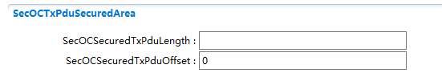
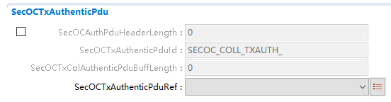

==============
SecOC
==============

**缩写词注解**

+------------+---------------------------+----------------------------+
| **缩写词** | **英文全称**              | **中文解释**               |
+------------+---------------------------+----------------------------+
| CSM        | The AUTOSAR Crypto        | AUTOSAR加密服务管理        |
|            | Service Manager           |                            |
+------------+---------------------------+----------------------------+
| SecOC      | Secure Onboard            | 车载安全通信               |
|            | Communication             |                            |
+------------+---------------------------+----------------------------+
| MAC        | Message Authentication    | 消息认证码                 |
|            | Code                      |                            |
+------------+---------------------------+----------------------------+
| FV         | Freshness Value           | 新鲜度值                   |
+------------+---------------------------+----------------------------+
| FVM        | Freshness Value Manager   | 新鲜度值管理器             |
+------------+---------------------------+----------------------------+
| Authentic  | An Authentic I-PDU is an  | 用于进行安全认证的原始报文 |
| I-PDU      | arbitrary AUTOSAR I-PDU   |                            |
|            | the content of which is   |                            |
|            | secured during network    |                            |
|            | transmission by means of  |                            |
|            | the Secured I-PDU.        |                            |
+------------+---------------------------+----------------------------+
| Secured    | A Secured I-PDU is an     | 追加了认证信息的原始报文   |
| I-PDU      | AUTOSAR I-PDU that        |                            |
|            | contains Payload of an    |                            |
|            | Authentic I-PDU           |                            |
|            | supplemented by           |                            |
|            | additional Authentication |                            |
|            | Information.              |                            |
+------------+---------------------------+----------------------------+

简介
====

SecOC模块对车载通信中的敏感数据进行身份验证和完整性保护。确保接收到的数据来自正确的ECU并且数据内容是正确的。

SecOC模块的目标是在PDU级别上实现资源效率高、可行的敏感数据认证机制。通常SecOC使用基于对称加密算法的MAC，同时SecOC的处理机制也可兼容非对称加密算法的使用。

|image1|

图 SecOC模块示意图

参考资料
--------

[1] AUTOSAR_SWS_SecureOnboardCommunication.pdf，R19-11

[2] AUTOSAR_SWS_PduRouter.pdf，R19-11

[3] AUTOSAR_SWS_CryptoServiceManager.pdf，R19-11

功能描述
========

基本概念
--------

Authentic I-PDU
~~~~~~~~~~~~~~~

Authentic I-PDU指需要进行保护以应对非法篡改和重放攻击的I-PDU。

Secured I-PDU
~~~~~~~~~~~~~

Secured I-PDU由Authentic I-PDU和Authenticator (eg: MAC
)组成。同时Secured IPDU中可以附加Secured I-PDU
Header和FreshnessValue信息。Secured I-PDU Header指示Authentic
I-PDU的长度，当没有Secured I-PDU Header时，Authentic
I-PDU长度由配置获取。Freshness
Value是在生成Authenticator时使用的新鲜度值。Authenticator为生成的认证信息。

|image2|

图 Secured I-PDU组成部分示意图

在创建Secured
I-PDU时，SecOC支持截取部分FreshnessValue和Authenticator。截取的长度依据配置决定。

|image3|

图 截取FreshnessValue和Authentor组成Secured I-PDU示意图

DataToAuthenticator
~~~~~~~~~~~~~~~~~~~

DataToAuthenticator指要传递给CSM模块，按照配置的加密算法进行MAC生成或者校验的数据。按照下列格式生成：

|image4|

图 DataToAuthenticator数据格式

Freshness Values
~~~~~~~~~~~~~~~~

使用Freshness Values能保证生成Secured
I-PDU的新鲜度。通常FreshnessValue由新鲜度管理器（FVM）管理，SecOC使用FreshnessValueId从FVM获取相应的新鲜度值。此外，新鲜度值可以从Authentic
I-PDU中截取一部分作为新鲜度值，截取开始的位置和长度由配置确定。

根据配置Secured I-PDU中可以不包含，包含完整或者部分的新鲜度值。

PduCollection
~~~~~~~~~~~~~

PduCollection指Secured I-PDU由Authentic I-PDU和Cryptographic
I-PDU两帧独立的报文组成。发送端将Authenticator放在Cryptographic
I-PDU发送出去。接收端在接收到Authentic I-PDU和Cryptographic
I-PDU后组合成一帧Secured I-PDU。

|image5|

图 Cryptographic I-PDU组成

MessageLinker
^^^^^^^^^^^^^

在构造Cryptographic I-PDU时，可以将Authentic
I-PDU的部分报文截取出来附加在最后，这段信息称为MessageLinker。接收时，SecOC需要首先校验接收到的Authentic
I-PDU和Cryptographic I-PDU中的Message
Linker是否匹配，校验通过后才进行下一步处理。MessageLinker的起始位置和长度由配置决定。

MessageLinker是可选的。

SecOC和PduR的关系
-----------------

SecOC需要和PduR进行交互，用于获取和发送数据。

发送数据时，SecOC先作为PduR的下层模块，从PduR获取Authentic
I-PDU，将Authentic I-PDU转换为Secured
I-PDU之后，SecOC又作为PduR的上层模块，发送数据。

接收数据时，SecOC先作为PduR的上层模块，从PduR接收Secured
I-PDU。SecOC从Secured I-PDU中解析出Authentic
I-PDU并通过校验之后，SecOC又作为PduR的下层模块，通过PduR将数据传递给上层。

|image6|

图 SecOC和PduR关系示意图

认证I-PDU（发送）功能
---------------------

认证I-PDU过程即将Authentic I-PDU转化为Secured
I-PDU的过程，主要有以下几个个步骤：

1. 从上层获取Secured I-PDU

2. 创建DataToAuthenticator

3. 生成Authenticator

4. 构造Secured I-PDU

5. 发送Secured I-PDU

认证I-PDU功能实现
~~~~~~~~~~~~~~~~~

上层调用SecOC_IfTransmit()或者SecOC_TpTransmit()发起Secured
I-PDU的发送过程。

对于直接发送，SecOC从SecOC_IfTransmit()函数的PduInfo中获取Authentic
I-PDU。对于TP发送，SecOC需要分多次调用PduR_SecOCTpCopyTxData()获取Authentic
I-PDU。

获取到Authentic
I-PDU之后，SecOC根据配置的FreshnessValue相关属性，取得FreshnessValue，再根据DataToAuthenticator的生成规则，构建DataToAuthenticator。

SecOC调用CSM模块的接口，将DataToAuthenticator传递给CSM。CSM模块根据输入的DataToAuthenticator等参数，计算生成Authenticator。

生成Authenticator后，SecOC根据配置生成Secured
I-PDU。之后SecOC调用PduR的发送接口将Secured
I-PDU一次（If）或者多次（TP）发送出去。

校验I-PDU（接收）功能
---------------------

校验Secured I-PDU的过程主要包含以下几个步骤：

1. 从Secured I-PDU中解析出Authentic I-PDU，FreshnessValue以
   及Authenticator

2. 从新鲜度值管理器（FVM）获取FreshnessValue

3. 创建DataToAuthenticator

4. 校验认证信息（Authentication Information）

5. 向FVM发送确认信息

6. 将Authentic I-PDU传递给上层

校验I-PDU功能实现
~~~~~~~~~~~~~~~~~

PduR收到需要校验的I-PDU时，调用SecOC_RxIndication()或者SecOC_StartOfReception()通知SecOC。SecOC将Secured
I-PDU缓存到本地后开始校验I-PDU处理流程。

在MainFunction中，SecOC从Secured I-PDU中解析出Authentic
I-PDU，FreshnessValue以及Authenticator。从新鲜度值管理器（FVM）中获取FreshnessValue，然后和Authentic
I-PDU以及DataId组成DataToAuthenticator。

SecOC将DataToAuthenticator以及从接收报文中解析出来的Authenticator传递给CSM。CSM校验后将是否从成功的结果反馈给SecOC。

如果校验成功，SecOC 向FVM发送确认信息，FVM根据该信息维护FV。

SecOC调用PduR接口将Authentic I-PDU分一次（IF）或多次（TP）传递给上层。

Override功能
------------

Override功能是一种特殊的可以干扰SecOC正常接收处理流程的机制。根据设置的Override策略，SecOC可能会不执行校验机制，或者在校验失败时也会将Authentic
I-PDU传递给上层模块。

Override功能实现
~~~~~~~~~~~~~~~~

SecOC会在进行校验前判断Override功能设置的策略，决定是否需要调用CSM的接口进行数据校验。并且在校验结束后，根据Override功能设置的策略决定是否将需要将Authentic
I-PDU传递给上层模块。

Override策略见下表：

表 Override策略一览表

+-------------------+--------------------------------------------------+
| **策略**          | **说明**                                         |
+-------------------+--------------------------------------------------+
| SECOC_OVERRIDE    | 在设置新的Override策                             |
| _DROP_UNTIL_NOTICE| 略之前，SecOC不对接收报文进行校验，并且丢弃接收  |
|                   | 报文，将校验结果状态设置为SECOC_NO_VERIFICATION  |
+-------------------+--------------------------------------------------+
| SECOC_OVERRIDE    | 在设置的NumberOfM                                |
| _DROP_UNTIL_LIMIT | essagesToOverride个数的报文之内，SecOC不对接收报 |
|                   | 文进行校验，并且丢弃接收报文，将校验结果状态设置 |
|                   | 为SECOC_NO_VERIFICATION，之后恢复正常的接收流程  |
+-------------------+--------------------------------------------------+
| SECO              | 取消Override                                     |
| C_OVERRIDE_CANCEL |                                                  |
+-------------------+--------------------------------------------------+
| SECOC_OVERRIDE    | 在                                               |
| _PASS_UNTIL_NOTICE| 设置新的Override策略之前，SecOC要对所有的Secured |
|                   | I-PDU进行校验，无论校验结果如何都要将Authentic   |
|                   | I                                                |
|                   | -PDU传递给上层模块。当校验结果失败时，将校验结果 |
|                   | 状态设置为SECOC_VERIFICATIONFAILURE_OVERWRITTEN  |
+-------------------+--------------------------------------------------+
| SECOC_OVERRIDE    | 在设置的NumberOfMessages                         |
| _SKIP_UNTIL_LIMIT | ToOverride个数的报文之内，SecOC不对接收的Secured |
|                   | I-PDU进行校验，将Authentic                       |
|                   | I                                                |
|                   | -PDU直接传递给上层模块。将校验结果状态设置为SECO |
|                   | C_NO_VERIFICATION。如果SecOCRxSecuredPduCollecti |
|                   | on启用，则直接处理SecOCRxAuthenticPdu，不用等待S |
|                   | ecOCRxCryptographicPdu。之后恢复正常的接收流程。 |
+-------------------+--------------------------------------------------+
| SECOC_OVERRIDE    | 在设置的NumberOfMessages                         |
| _PASS_UNTIL_LIMIT | ToOverride个数的报文之内，SecOC要对所有的Secured |
|                   | I-PDU进行校验，无论校验结果如何都要将Authentic   |
|                   | I-PDU传递给上层模块。当校验                      |
|                   | 结果失败时，将校验结果状态设置为SECOC_VERIFICAT  |
|                   | IONFAILURE_OVERWRITTEN。之后恢复正常的接收流程。 |
+-------------------+--------------------------------------------------+
| SECOC_OVERRIDE    | 在                                               |
| _SKIP_UNTIL_NOTICE| 设置新的Override策略之前，SecOC不对接收的Secured |
|                   | I-PDU进行校验，将Authentic                       |
|                   | I-PDU直接传递给上层模块。                        |
|                   | 将校验结果状态设置为SECOC_NO_VERIFICATION。如果S |
|                   | ecOCRxSecuredPduCollection启用，则直接处理SecOCR |
|                   | xAuthenticPdu，不用等待SecOCRxCryptographicPdu。 |
+-------------------+--------------------------------------------------+

源文件描述
==========

表 SecOC组件文件描述

+----------------+-----------------------------------------------------+
| **文件**       | **说明**                                            |
+----------------+-----------------------------------------------------+
| SecOC_Cfg.h    | 定义SecOC模块预编译时用到的配置参数。               |
+----------------+-----------------------------------------------------+
| SecOC_cfg.c    | 定义SecOC模块中连接时用到的配置参数。               |
+----------------+-----------------------------------------------------+
| SecOC.h        | SecOC模块头文                                       |
|                | 件，包含了API函数的扩展声明并定义了端口的数据结构。 |
+----------------+-----------------------------------------------------+
| SecOC .c       | SecOC模块源文件，包含了API函数的实现。              |
+----------------+-----------------------------------------------------+
| S              | SecOC定义的Callout函数头文件                        |
| ecOC_Callout.h |                                                     |
+----------------+-----------------------------------------------------+
| S              | SecOC定义的Callout函数源文件                        |
| ecOC_Callout.c |                                                     |
+----------------+-----------------------------------------------------+
| Se             | SecOC内部需要使用的数据类型，宏定义等               |
| cOC_Internal.h |                                                     |
+----------------+-----------------------------------------------------+
| SecOC_MemMap.h | SecOC变量和函数存储位置定义文件。                   |
+----------------+-----------------------------------------------------+
| SecOC_Types.h  | SecOC数据类型定义。                                 |
+----------------+-----------------------------------------------------+

|image7|

图 SecOC组件文件交互关系图

API接口
=======

类型定义
--------

SecOC_ConfigType类型定义
~~~~~~~~~~~~~~~~~~~~~~~~

+-----------+----------------------------------------------------------+
| 名称      | SecOC_ConfigType                                         |
+-----------+----------------------------------------------------------+
| 类型      | 结构体                                                   |
+-----------+----------------------------------------------------------+
| 范围      | 无                                                       |
+-----------+----------------------------------------------------------+
| 描述      | SecOC模块配置信息                                        |
+-----------+----------------------------------------------------------+

SecOC_StateType类型定义
~~~~~~~~~~~~~~~~~~~~~~~

+-----------+----------------------------------------------------------+
| 名称      | SecOC_StateType                                          |
+-----------+----------------------------------------------------------+
| 类型      | 枚举                                                     |
+-----------+----------------------------------------------------------+
| 范围      | SECOC_UNINIT                                             |
|           |                                                          |
|           | SECOC_INIT                                               |
+-----------+----------------------------------------------------------+
| 描述      | SecOC模块初始化状态                                      |
+-----------+----------------------------------------------------------+

SecOC_FreshnessArrayType类型定义
~~~~~~~~~~~~~~~~~~~~~~~~~~~~~~~~

+-----------+----------------------------------------------------------+
| 名称      | SecOC_FreshnessArrayType                                 |
+-----------+----------------------------------------------------------+
| 类型      | 数组                                                     |
+-----------+----------------------------------------------------------+
| 范围      | 无                                                       |
+-----------+----------------------------------------------------------+
| 描述      | 用于从FVM获取FreshnessValue                              |
+-----------+----------------------------------------------------------+

SecOC_VerificationResultType类型定义
~~~~~~~~~~~~~~~~~~~~~~~~~~~~~~~~~~~~

+-----------+----------------------------------------------------------+
| 名称      | SecOC_VerificationResultType                             |
+-----------+----------------------------------------------------------+
| 类型      | 枚举                                                     |
+-----------+----------------------------------------------------------+
| 范围      | SECOC_VERIFICATIONSUCCESS                                |
|           |                                                          |
|           | SECOC_VERIFICATIONFAILURE                                |
|           |                                                          |
|           | SECOC_FRESHNESSFAILURE                                   |
|           |                                                          |
|           | SECOC_AUTHENTICATIONBUILDFAILURE                         |
|           |                                                          |
|           | SECOC_NO_VERIFICATION                                    |
|           |                                                          |
|           | SECOC_VERIFICATIONFAILURE_OVERWRITTEN                    |
+-----------+----------------------------------------------------------+
| 描述      | SecOC模块初始化状态                                      |
+-----------+----------------------------------------------------------+

SecOC_VerificationStatusType类型定义
~~~~~~~~~~~~~~~~~~~~~~~~~~~~~~~~~~~~

+-----------+----------------------------------------------------------+
| 名称      | SecOC_VerificationStatusType                             |
+-----------+----------------------------------------------------------+
| 类型      | 结构体                                                   |
+-----------+----------------------------------------------------------+
| 范围      | 无                                                       |
+-----------+----------------------------------------------------------+
| 描述      | 表示特定FreshnessValueId和DataId的校验尝试结果           |
+-----------+----------------------------------------------------------+

SecOC_OverrideStatusType类型定义
~~~~~~~~~~~~~~~~~~~~~~~~~~~~~~~~

+-----------+----------------------------------------------------------+
| 名称      | SecOC_OverrideStatusType                                 |
+-----------+----------------------------------------------------------+
| 类型      | 枚举                                                     |
+-----------+----------------------------------------------------------+
| 范围      | SECOC_OVERRIDE_DROP_UNTIL_NOTICE                         |
|           |                                                          |
|           | SECOC_OVERRIDE_DROP_UNTIL_LIMIT                          |
|           |                                                          |
|           | SECOC_OVERRIDE_CANCEL                                    |
|           |                                                          |
|           | SECOC_OVERRIDE_PASS_UNTIL_NOTICE                         |
|           |                                                          |
|           | SECOC_OVERRIDE_SKIP_UNTIL_LIMIT                          |
|           |                                                          |
|           | SECOC_OVERRIDE_PASS_UNTIL_LIMIT                          |
|           |                                                          |
|           | SECOC_OVERRIDE_SKIP_UNTIL_NOTICE                         |
+-----------+----------------------------------------------------------+
| 描述      | Override策略定义                                         |
+-----------+----------------------------------------------------------+

输入函数描述
------------

+----------------------------------+-----------------------------------+
| **输入模块**                     | **API**                           |
+----------------------------------+-----------------------------------+
| Det                              | Det_ReportRuntimeError            |
+----------------------------------+-----------------------------------+
|                                  | Det_ReportError                   |
+----------------------------------+-----------------------------------+
| PduR                             | PduR_SecOCCancelTransmit          |
+----------------------------------+-----------------------------------+
|                                  | PduR_SecOCIfRxIndication          |
+----------------------------------+-----------------------------------+
|                                  | PduR_SecOCIfTxConfirmation        |
+----------------------------------+-----------------------------------+
|                                  | PduR_SecOCTransmit                |
+----------------------------------+-----------------------------------+
|                                  | PduR_SecOCCancelReceive           |
+----------------------------------+-----------------------------------+
|                                  | PduR_SecOCTpCopyRxData            |
+----------------------------------+-----------------------------------+
|                                  | PduR_SecOCTpCopyTxData            |
+----------------------------------+-----------------------------------+
|                                  | PduR_SecOCTpRxIndication          |
+----------------------------------+-----------------------------------+
|                                  | PduR_SecOCTpStartOfReception      |
+----------------------------------+-----------------------------------+
|                                  | PduR_SecOCTpTxConfirmation        |
+----------------------------------+-----------------------------------+
| Csm                              | Csm_MacGenerate                   |
+----------------------------------+-----------------------------------+
|                                  | Csm_MacVerify                     |
+----------------------------------+-----------------------------------+
|                                  | Csm_SignatureGenerate             |
+----------------------------------+-----------------------------------+
|                                  | Csm_SignatureVerify               |
+----------------------------------+-----------------------------------+

静态接口函数定义
----------------

SecOC_Init函数定义
~~~~~~~~~~~~~~~~~~

+-------------+-------------------+---------+-------------------------+
| 函数名称：  | SecOC_Init        |         |                         |
+-------------+-------------------+---------+-------------------------+
| 函数原型：  | void SecOC_Init ( |         |                         |
|             | const             |         |                         |
|             | S                 |         |                         |
|             | ecOC_ConfigType\* |         |                         |
|             | config )          |         |                         |
+-------------+-------------------+---------+-------------------------+
| 服务编号：  | 0x01              |         |                         |
+-------------+-------------------+---------+-------------------------+
| 同步/异步： | 同步              |         |                         |
+-------------+-------------------+---------+-------------------------+
| 是          | 不可重入          |         |                         |
| 否可重入：  |                   |         |                         |
+-------------+-------------------+---------+-------------------------+
| 输入参数：  | config            | 值域：  | 无                      |
+-------------+-------------------+---------+-------------------------+
| 输入        | 无                |         |                         |
| 输出参数：  |                   |         |                         |
+-------------+-------------------+---------+-------------------------+
| 输出参数：  | 无                |         |                         |
+-------------+-------------------+---------+-------------------------+
| 返回值：    | 无                |         |                         |
+-------------+-------------------+---------+-------------------------+
| 功能概述：  | 初始化SecOC模块   |         |                         |
+-------------+-------------------+---------+-------------------------+

SecOC_DeInit函数定义
~~~~~~~~~~~~~~~~~~~~

+-------------+-------------------+---------+-------------------------+
| 函数名称：  | SecOC_DeInit      |         |                         |
+-------------+-------------------+---------+-------------------------+
| 函数原型：  | void SecOC_DeInit |         |                         |
|             | ( void )          |         |                         |
+-------------+-------------------+---------+-------------------------+
| 服务编号：  | 0x05              |         |                         |
+-------------+-------------------+---------+-------------------------+
| 同步/异步： | 同步              |         |                         |
+-------------+-------------------+---------+-------------------------+
| 是          | 不可重入          |         |                         |
| 否可重入：  |                   |         |                         |
+-------------+-------------------+---------+-------------------------+
| 输入参数：  | 无                | 值域：  | 无                      |
+-------------+-------------------+---------+-------------------------+
| 输入        | 无                |         |                         |
| 输出参数：  |                   |         |                         |
+-------------+-------------------+---------+-------------------------+
| 输出参数：  | 无                |         |                         |
+-------------+-------------------+---------+-------------------------+
| 返回值：    | 无                |         |                         |
+-------------+-------------------+---------+-------------------------+
| 功能概述：  | 反初始化SecOC模块 |         |                         |
+-------------+-------------------+---------+-------------------------+

SecOC_GetVersionInfo函数定义
~~~~~~~~~~~~~~~~~~~~~~~~~~~~

+-------------+-------------------+---------+-------------------------+
| 函数名称：  | Sec               |         |                         |
|             | OC_GetVersionInfo |         |                         |
+-------------+-------------------+---------+-------------------------+
| 函数原型：  | void              |         |                         |
|             | Sec               |         |                         |
|             | OC_GetVersionInfo |         |                         |
|             | (                 |         |                         |
|             | Std               |         |                         |
|             | _VersionInfoType\*|         |                         |
|             | versioninfo )     |         |                         |
+-------------+-------------------+---------+-------------------------+
| 服务编号：  | 0x02              |         |                         |
+-------------+-------------------+---------+-------------------------+
| 同步/异步： | 同步              |         |                         |
+-------------+-------------------+---------+-------------------------+
| 是          | 可重入            |         |                         |
| 否可重入：  |                   |         |                         |
+-------------+-------------------+---------+-------------------------+
| 输入参数：  | 无                | 值域：  | 无                      |
+-------------+-------------------+---------+-------------------------+
| 输入        | 无                |         |                         |
| 输出参数：  |                   |         |                         |
+-------------+-------------------+---------+-------------------------+
| 输出参数：  | versioninfo       |         |                         |
+-------------+-------------------+---------+-------------------------+
| 返回值：    | 无                |         |                         |
+-------------+-------------------+---------+-------------------------+
| 功能概述：  | 返回Se            |         |                         |
|             | cOC模块的版本信息 |         |                         |
+-------------+-------------------+---------+-------------------------+

SecOC_IfTransmit函数定义
~~~~~~~~~~~~~~~~~~~~~~~~

+-------------+-------------------+---------+-------------------------+
| 函数名称：  | SecOC_IfTransmit  |         |                         |
+-------------+-------------------+---------+-------------------------+
| 函数原型：  | Std_ReturnType    |         |                         |
|             | SecOC_IfTransmit  |         |                         |
|             | (                 |         |                         |
|             |                   |         |                         |
|             | PduIdType         |         |                         |
|             | TxPduId,          |         |                         |
|             |                   |         |                         |
|             | const             |         |                         |
|             | PduInfoType\*     |         |                         |
|             | PduInfoPtr        |         |                         |
|             |                   |         |                         |
|             | )                 |         |                         |
+-------------+-------------------+---------+-------------------------+
| 服务编号：  | 0x49              |         |                         |
+-------------+-------------------+---------+-------------------------+
| 同步/异步： | 同步              |         |                         |
+-------------+-------------------+---------+-------------------------+
| 是          | 不同TxPduId可重入 |         |                         |
| 否可重入：  |                   |         |                         |
+-------------+-------------------+---------+-------------------------+
| 输入参数：  | TxPduId           | 值域：  | 0 .. 65535              |
+-------------+-------------------+---------+-------------------------+
|             | PduInfoPtr        |         | 无                      |
+-------------+-------------------+---------+-------------------------+
| 输入        | 无                |         |                         |
| 输出参数：  |                   |         |                         |
+-------------+-------------------+---------+-------------------------+
| 输出参数：  | 无                |         |                         |
+-------------+-------------------+---------+-------------------------+
| 返回值：    | E_OK:             |         |                         |
|             | 发送请求被接受    |         |                         |
|             |                   |         |                         |
|             | E_OK:             |         |                         |
|             | 发送请求被拒绝    |         |                         |
+-------------+-------------------+---------+-------------------------+
| 功能概述：  | 请求发送一个If    |         |                         |
|             | PDU               |         |                         |
+-------------+-------------------+---------+-------------------------+

SecOC_TpTransmit函数定义
~~~~~~~~~~~~~~~~~~~~~~~~

+-------------+-------------------+---------+-------------------------+
| 函数名称：  | SecOC_TpTransmit  |         |                         |
+-------------+-------------------+---------+-------------------------+
| 函数原型：  | Std_ReturnType    |         |                         |
|             | SecOC_TpTransmit  |         |                         |
|             | (                 |         |                         |
|             |                   |         |                         |
|             | PduIdType         |         |                         |
|             | TxPduId,          |         |                         |
|             |                   |         |                         |
|             | const             |         |                         |
|             | PduInfoType\*     |         |                         |
|             | PduInfoPtr        |         |                         |
|             |                   |         |                         |
|             | )                 |         |                         |
+-------------+-------------------+---------+-------------------------+
| 服务编号：  | 0x49              |         |                         |
+-------------+-------------------+---------+-------------------------+
| 同步/异步： | 同步              |         |                         |
+-------------+-------------------+---------+-------------------------+
| 是          | 不同TxPduId可重入 |         |                         |
| 否可重入：  |                   |         |                         |
+-------------+-------------------+---------+-------------------------+
| 输入参数：  | TxPduId           | 值域：  | 0 .. 65535              |
+-------------+-------------------+---------+-------------------------+
|             | PduInfoPtr        |         | 无                      |
+-------------+-------------------+---------+-------------------------+
| 输入        | 无                |         |                         |
| 输出参数：  |                   |         |                         |
+-------------+-------------------+---------+-------------------------+
| 输出参数：  | 无                |         |                         |
+-------------+-------------------+---------+-------------------------+
| 返回值：    | E_OK:             |         |                         |
|             | 发送请求被接受    |         |                         |
|             |                   |         |                         |
|             | E_OK:             |         |                         |
|             | 发送请求被拒绝    |         |                         |
+-------------+-------------------+---------+-------------------------+
| 功能概述：  | 请求发送一个TP    |         |                         |
|             | PDU               |         |                         |
+-------------+-------------------+---------+-------------------------+

SecOC_IfCancelTransmit函数定义
~~~~~~~~~~~~~~~~~~~~~~~~~~~~~~

+-------------+-------------------+---------+-------------------------+
| 函数名称：  | SecOC             |         |                         |
|             | _IfCancelTransmit |         |                         |
+-------------+-------------------+---------+-------------------------+
| 函数原型：  | Std_ReturnType    |         |                         |
|             | SecOC             |         |                         |
|             | _IfCancelTransmit |         |                         |
|             | ( PduIdType       |         |                         |
|             | TxPduId )         |         |                         |
+-------------+-------------------+---------+-------------------------+
| 服务编号：  | 0x4a              |         |                         |
+-------------+-------------------+---------+-------------------------+
| 同步/异步： | 同步              |         |                         |
+-------------+-------------------+---------+-------------------------+
| 是          | 不同TxPduId可重入 |         |                         |
| 否可重入：  |                   |         |                         |
+-------------+-------------------+---------+-------------------------+
| 输入参数：  | TxPduId           | 值域：  | 0 .. 65535              |
+-------------+-------------------+---------+-------------------------+
| 输入        | 无                |         |                         |
| 输出参数：  |                   |         |                         |
+-------------+-------------------+---------+-------------------------+
| 输出参数：  | 无                |         |                         |
+-------------+-------------------+---------+-------------------------+
| 返回值：    | E_OK:             |         |                         |
|             | 取                |         |                         |
|             | 消发送请求被接受  |         |                         |
|             |                   |         |                         |
|             | E_OK:             |         |                         |
|             | 取                |         |                         |
|             | 消发送请求被拒绝  |         |                         |
+-------------+-------------------+---------+-------------------------+
| 功能概述：  | 请                |         |                         |
|             | 求取消发送一个If  |         |                         |
|             | PDU               |         |                         |
+-------------+-------------------+---------+-------------------------+

SecOC_TpCancelTransmit函数定义
~~~~~~~~~~~~~~~~~~~~~~~~~~~~~~

+-------------+-------------------+---------+-------------------------+
| 函数名称：  | SecOC             |         |                         |
|             | _TpCancelTransmit |         |                         |
+-------------+-------------------+---------+-------------------------+
| 函数原型：  | Std_ReturnType    |         |                         |
|             | SecOC             |         |                         |
|             | _TpCancelTransmit |         |                         |
|             | ( PduIdType       |         |                         |
|             | TxPduId )         |         |                         |
+-------------+-------------------+---------+-------------------------+
| 服务编号：  | 0x4a              |         |                         |
+-------------+-------------------+---------+-------------------------+
| 同步/异步： | 同步              |         |                         |
+-------------+-------------------+---------+-------------------------+
| 是          | 不同TxPduId可重入 |         |                         |
| 否可重入：  |                   |         |                         |
+-------------+-------------------+---------+-------------------------+
| 输入参数：  | TxPduId           | 值域：  | 0 .. 65535              |
+-------------+-------------------+---------+-------------------------+
| 输入        | 无                |         |                         |
| 输出参数：  |                   |         |                         |
+-------------+-------------------+---------+-------------------------+
| 输出参数：  | 无                |         |                         |
+-------------+-------------------+---------+-------------------------+
| 返回值：    | E_OK:             |         |                         |
|             | 取                |         |                         |
|             | 消发送请求被接受  |         |                         |
|             |                   |         |                         |
|             | E_OK:             |         |                         |
|             | 取                |         |                         |
|             | 消发送请求被拒绝  |         |                         |
+-------------+-------------------+---------+-------------------------+
| 功能概述：  | 请                |         |                         |
|             | 求取消发送一个TP  |         |                         |
|             | PDU               |         |                         |
+-------------+-------------------+---------+-------------------------+

SecOC_TpCancelReceive函数定义
~~~~~~~~~~~~~~~~~~~~~~~~~~~~~

+-------------+-------------------+---------+-------------------------+
| 函数名称：  | SecO              |         |                         |
|             | C_TpCancelReceive |         |                         |
+-------------+-------------------+---------+-------------------------+
| 函数原型：  | Std_ReturnType    |         |                         |
|             | SecO              |         |                         |
|             | C_TpCancelReceive |         |                         |
|             | ( PduIdType       |         |                         |
|             | RxPduId )         |         |                         |
+-------------+-------------------+---------+-------------------------+
| 服务编号：  | 0x4c              |         |                         |
+-------------+-------------------+---------+-------------------------+
| 同步/异步： | 同步              |         |                         |
+-------------+-------------------+---------+-------------------------+
| 是          | 不可重入          |         |                         |
| 否可重入：  |                   |         |                         |
+-------------+-------------------+---------+-------------------------+
| 输入参数：  | RxPduId           | 值域：  | 0 .. 65535              |
+-------------+-------------------+---------+-------------------------+
| 输入        | 无                |         |                         |
| 输出参数：  |                   |         |                         |
+-------------+-------------------+---------+-------------------------+
| 输出参数：  | 无                |         |                         |
+-------------+-------------------+---------+-------------------------+
| 返回值：    | E_OK:             |         |                         |
|             | 取                |         |                         |
|             | 消接收请求被接受  |         |                         |
|             |                   |         |                         |
|             | E_OK:             |         |                         |
|             | 取                |         |                         |
|             | 消接收请求被拒绝  |         |                         |
+-------------+-------------------+---------+-------------------------+
| 功能概述：  | 请                |         |                         |
|             | 求取消接收一个PDU |         |                         |
+-------------+-------------------+---------+-------------------------+

SecOC_VerifyStatusOverride函数定义
~~~~~~~~~~~~~~~~~~~~~~~~~~~~~~~~~~

+-------------+-----------------------+---------+--------------------+
| 函数名称：  | SecOC                 |         |                    |
|             | _VerifyStatusOverride |         |                    |
+-------------+-----------------------+---------+--------------------+
| 函数原型：  | Std_ReturnType        |         |                    |
|             | SecOC                 |         |                    |
|             | _VerifyStatusOverride |         |                    |
|             | (                     |         |                    |
|             |                       |         |                    |
|             | uint16 ValueID,       |         |                    |
|             |                       |         |                    |
|             | Sec                   |         |                    |
|             | OC_OverrideStatusType |         |                    |
|             | overrideStatus,       |         |                    |
|             |                       |         |                    |
|             | uint8                 |         |                    |
|             | numbe                 |         |                    |
|             | rOfMessagesToOverride |         |                    |
|             |                       |         |                    |
|             | )                     |         |                    |
+-------------+-----------------------+---------+--------------------+
| 服务编号：  | 0x0b                  |         |                    |
+-------------+-----------------------+---------+--------------------+
| 同步/异步： | 同步                  |         |                    |
+-------------+-----------------------+---------+--------------------+
| 是          | 不同F                 |         |                    |
| 否可重入：  | reshnessValueID可重入 |         |                    |
+-------------+-----------------------+---------+--------------------+
| 输入参数：  | ValueID               | 值域：  | 0 .. 65535         |
+-------------+-----------------------+---------+--------------------+
|             | overrideStatus        | 值域：  | 无                 |
+-------------+-----------------------+---------+--------------------+
|             | numbe                 | 值域：  | 0 .. 255           |
|             | rOfMessagesToOverride |         |                    |
+-------------+-----------------------+---------+--------------------+
| 输入        | 无                    |         |                    |
| 输出参数：  |                       |         |                    |
+-------------+-----------------------+---------+--------------------+
| 输出参数：  | 无                    |         |                    |
+-------------+-----------------------+---------+--------------------+
| 返回值：    | E_OK: 请求成功        |         |                    |
|             |                       |         |                    |
|             | E_OK: 请求失败        |         |                    |
+-------------+-----------------------+---------+--------------------+
| 功能概述：  | 调用该函数设置        |         |                    |
|             | Override策略，设置为  |         |                    |
|             |                       |         |                    |
|             | SECOC_OVERRI          |         |                    |
|             | DE_PASS_UNTIL_NOTICE, |         |                    |
|             | SECOC_OVERR           |         |                    |
|             | IDE_SKIP_UNTIL_LIMIT, |         |                    |
|             | SECOC_OVERRI          |         |                    |
|             | DE_PASS_UNTIL_LIMIT或 |         |                    |
|             | SECOC_OVERRIDE_SKIP   |         |                    |
|             | _UNTIL_NOTICE时，SecOC|         |                    |
|             | EnableForcedPassOverr |         |                    |
|             | ide参数必须设置为TRUE |         |                    |
+-------------+-----------------------+---------+--------------------+

SecOC_SendDefaultAuthenticationInformation函数定义
~~~~~~~~~~~~~~~~~~~~~~~~~~~~~~~~~~~~~~~~~~~~~~~~~~

+-------------+-----------------------------+---------+---------------+
| 函数名称：  | SecOC_SendDefau             |         |               |
|             | ltAuthenticationInformation |         |               |
+-------------+-----------------------------+---------+---------------+
| 函数原型：  | Std_ReturnType              |         |               |
|             | SecOC_SendDefau             |         |               |
|             | ltAuthenticationInformation |         |               |
|             | (                           |         |               |
|             |                             |         |               |
|             | uint16 FreshnessValueID,    |         |               |
|             |                             |         |               |
|             | boolean                     |         |               |
|             | sendDefau                   |         |               |
|             | ltAuthenticationInformation |         |               |
|             |                             |         |               |
|             | )                           |         |               |
+-------------+-----------------------------+---------+---------------+
| 服务编号：  | 0x04                        |         |               |
+-------------+-----------------------------+---------+---------------+
| 同步/异步： | 同步                        |         |               |
+-------------+-----------------------------+---------+---------------+
| 是          | 不可重入                    |         |               |
| 否可重入：  |                             |         |               |
+-------------+-----------------------------+---------+---------------+
| 输入参数：  | FreshnessValueID            | 值域：  | 0 .. 65535    |
+-------------+-----------------------------+---------+---------------+
|             | sendDefau                   | 值域：  | TRUE / FALSE  |
|             | ltAuthenticationInformation |         |               |
+-------------+-----------------------------+---------+---------------+
| 输入        | 无                          |         |               |
| 输出参数：  |                             |         |               |
+-------------+-----------------------------+---------+---------------+
| 输出参数：  | 无                          |         |               |
+-------------+-----------------------------+---------+---------------+
| 返回值：    | E_OK: 请求被接受            |         |               |
|             |                             |         |               |
|             | E_OK: 请求被拒绝            |         |               |
+-------------+-----------------------------+---------+---------------+
| 功能概述：  | 当Freshnes                  |         |               |
|             | sValueID的sendDefaultAuthen |         |               |
|             | ticationInformation参数被设 |         |               |
|             | 置为TRUE时，当认证Authentic |         |               |
|             | I-PD                        |         |               |
|             | U失败时，SecOC可以用Default |         |               |
|             | AuthenticationInformation作 |         |               |
|             | 为Authenticator构建Secured  |         |               |
|             | I-PDU，继续进行发送。       |         |               |
+-------------+-----------------------------+---------+---------------+

SecOC_RxIndication函数定义
~~~~~~~~~~~~~~~~~~~~~~~~~~

+-------------+-------------------+---------+-------------------------+
| 函数名称：  | S                 |         |                         |
|             | ecOC_RxIndication |         |                         |
+-------------+-------------------+---------+-------------------------+
| 函数原型：  | void              |         |                         |
|             | S                 |         |                         |
|             | ecOC_RxIndication |         |                         |
|             | (                 |         |                         |
|             |                   |         |                         |
|             | PduIdType         |         |                         |
|             | RxPduId,          |         |                         |
|             |                   |         |                         |
|             | const             |         |                         |
|             | PduInfoType\*     |         |                         |
|             | PduInfoPtr        |         |                         |
|             |                   |         |                         |
|             | )                 |         |                         |
+-------------+-------------------+---------+-------------------------+
| 服务编号：  | 0x42              |         |                         |
+-------------+-------------------+---------+-------------------------+
| 同步/异步： | 同步              |         |                         |
+-------------+-------------------+---------+-------------------------+
| 是          | 不同RxPduId可重入 |         |                         |
| 否可重入：  |                   |         |                         |
+-------------+-------------------+---------+-------------------------+
| 输入参数：  | RxPduId           | 值域：  | 0 .. 65535              |
+-------------+-------------------+---------+-------------------------+
|             | PduInfoPtr        | 值域：  | 无                      |
+-------------+-------------------+---------+-------------------------+
| 输入        | 无                |         |                         |
| 输出参数：  |                   |         |                         |
+-------------+-------------------+---------+-------------------------+
| 输出参数：  | 无                |         |                         |
+-------------+-------------------+---------+-------------------------+
| 返回值：    | 无                |         |                         |
+-------------+-------------------+---------+-------------------------+
| 功能概述：  | 低层模块          |         |                         |
|             | 调用该函数通知Se  |         |                         |
|             | cOC接收到一帧报文 |         |                         |
+-------------+-------------------+---------+-------------------------+

SecOC_TpRxIndication函数定义
~~~~~~~~~~~~~~~~~~~~~~~~~~~~

+-------------+-------------------+---------+-------------------------+
| 函数名称：  | Sec               |         |                         |
|             | OC_TpRxIndication |         |                         |
+-------------+-------------------+---------+-------------------------+
| 函数原型：  | void              |         |                         |
|             | Sec               |         |                         |
|             | OC_TpRxIndication |         |                         |
|             | ( PduIdType id,   |         |                         |
|             | Std_ReturnType    |         |                         |
|             | result )          |         |                         |
+-------------+-------------------+---------+-------------------------+
| 服务编号：  | 0x45              |         |                         |
+-------------+-------------------+---------+-------------------------+
| 同步/异步： | 同步              |         |                         |
+-------------+-------------------+---------+-------------------------+
| 是          | 可重入            |         |                         |
| 否可重入：  |                   |         |                         |
+-------------+-------------------+---------+-------------------------+
| 输入参数：  | id                | 值域：  | 0 .. 65535              |
+-------------+-------------------+---------+-------------------------+
|             | result            | 值域：  | E_OK / E_NOT_OK         |
+-------------+-------------------+---------+-------------------------+
| 输入        | 无                |         |                         |
| 输出参数：  |                   |         |                         |
+-------------+-------------------+---------+-------------------------+
| 输出参数：  | 无                |         |                         |
+-------------+-------------------+---------+-------------------------+
| 返回值：    | 无                |         |                         |
+-------------+-------------------+---------+-------------------------+
| 功能概述：  | 低层模块调        |         |                         |
|             | 用该函数通知SecO  |         |                         |
|             | C一帧TP报文接收完 |         |                         |
|             | 成。result参数表  |         |                         |
|             | 示接收是否成功。  |         |                         |
+-------------+-------------------+---------+-------------------------+

SecOC_TxConfirmation函数定义
~~~~~~~~~~~~~~~~~~~~~~~~~~~~

+-------------+-------------------+---------+-------------------------+
| 函数名称：  | Sec               |         |                         |
|             | OC_TxConfirmation |         |                         |
+-------------+-------------------+---------+-------------------------+
| 函数原型：  | void              |         |                         |
|             | Sec               |         |                         |
|             | OC_TxConfirmation |         |                         |
|             | (                 |         |                         |
|             |                   |         |                         |
|             | PduIdType         |         |                         |
|             | TxPduId,          |         |                         |
|             |                   |         |                         |
|             | Std_ReturnType    |         |                         |
|             | result            |         |                         |
|             |                   |         |                         |
|             | )                 |         |                         |
+-------------+-------------------+---------+-------------------------+
| 服务编号：  | 0x40              |         |                         |
+-------------+-------------------+---------+-------------------------+
| 同步/异步： | 同步              |         |                         |
+-------------+-------------------+---------+-------------------------+
| 是          | 不同TxPduId可重入 |         |                         |
| 否可重入：  |                   |         |                         |
+-------------+-------------------+---------+-------------------------+
| 输入参数：  | TxPduId           | 值域：  | 0 .. 65535              |
+-------------+-------------------+---------+-------------------------+
|             | result            | 值域：  | E_OK / E_NOT_OK         |
+-------------+-------------------+---------+-------------------------+
| 输入        | 无                |         |                         |
| 输出参数：  |                   |         |                         |
+-------------+-------------------+---------+-------------------------+
| 输出参数：  | 无                |         |                         |
+-------------+-------------------+---------+-------------------------+
| 返回值：    | 无                |         |                         |
+-------------+-------------------+---------+-------------------------+
| 功能概述：  | 低层              |         |                         |
|             | 模块调用该函数通  |         |                         |
|             | 知SecOC报文发送结 |         |                         |
|             | 果。result参数表  |         |                         |
|             | 示发送是否成功。  |         |                         |
+-------------+-------------------+---------+-------------------------+

SecOC_TpTxConfirmation函数定义
~~~~~~~~~~~~~~~~~~~~~~~~~~~~~~

+-------------+-------------------+---------+-------------------------+
| 函数名称：  | SecOC             |         |                         |
|             | _TpTxConfirmation |         |                         |
+-------------+-------------------+---------+-------------------------+
| 函数原型：  | void              |         |                         |
|             | SecOC             |         |                         |
|             | _TpTxConfirmation |         |                         |
|             | ( PduIdType id,   |         |                         |
|             | Std_ReturnType    |         |                         |
|             | result )          |         |                         |
+-------------+-------------------+---------+-------------------------+
| 服务编号：  | 0x48              |         |                         |
+-------------+-------------------+---------+-------------------------+
| 同步/异步： | 同步              |         |                         |
+-------------+-------------------+---------+-------------------------+
| 是          | 可重入            |         |                         |
| 否可重入：  |                   |         |                         |
+-------------+-------------------+---------+-------------------------+
| 输入参数：  | id                | 值域：  | 0 .. 65535              |
+-------------+-------------------+---------+-------------------------+
|             | result            | 值域：  | E_OK / E_NOT_OK         |
+-------------+-------------------+---------+-------------------------+
| 输入        | 无                |         |                         |
| 输出参数：  |                   |         |                         |
+-------------+-------------------+---------+-------------------------+
| 输出参数：  | 无                |         |                         |
+-------------+-------------------+---------+-------------------------+
| 返回值：    | 无                |         |                         |
+-------------+-------------------+---------+-------------------------+
| 功能概述：  | 低层模块调        |         |                         |
|             | 用该函数通知SecOC |         |                         |
|             | TP报文发送结      |         |                         |
|             | 束。result参数表  |         |                         |
|             | 示发送是否成功。  |         |                         |
+-------------+-------------------+---------+-------------------------+

SecOC_TriggerTransmit函数定义
~~~~~~~~~~~~~~~~~~~~~~~~~~~~~

+-------------+-------------------+---------+-------------------------+
| 函数名称：  | SecO              |         |                         |
|             | C_TriggerTransmit |         |                         |
+-------------+-------------------+---------+-------------------------+
| 函数原型：  | Std_ReturnType    |         |                         |
|             | SecO              |         |                         |
|             | C_TriggerTransmit |         |                         |
|             | (                 |         |                         |
|             |                   |         |                         |
|             | PduIdType         |         |                         |
|             | TxPduId,          |         |                         |
|             |                   |         |                         |
|             | PduInfoType\*     |         |                         |
|             | PduInfoPtr        |         |                         |
|             |                   |         |                         |
|             | )                 |         |                         |
+-------------+-------------------+---------+-------------------------+
| 服务编号：  | 0x41              |         |                         |
+-------------+-------------------+---------+-------------------------+
| 同步/异步： | 同步              |         |                         |
+-------------+-------------------+---------+-------------------------+
| 是          | 不同TxPduId可重入 |         |                         |
| 否可重入：  |                   |         |                         |
+-------------+-------------------+---------+-------------------------+
| 输入参数：  | TxPduId           | 值域：  | 0 .. 65535              |
+-------------+-------------------+---------+-------------------------+
|             | PduInfoPtr        | 值域：  | 无                      |
+-------------+-------------------+---------+-------------------------+
| 输入        | 无                |         |                         |
| 输出参数：  |                   |         |                         |
+-------------+-------------------+---------+-------------------------+
| 输出参数：  | 无                |         |                         |
+-------------+-------------------+---------+-------------------------+
| 返回值：    | E_OK:             |         |                         |
|             | SDU被复           |         |                         |
|             | 制，SduLength表示 |         |                         |
|             | 复制的字节长度。  |         |                         |
|             |                   |         |                         |
|             | E_NOT_OK:         |         |                         |
|             | 没有SDU被复制。   |         |                         |
+-------------+-------------------+---------+-------------------------+
| 功能概述：  | 低层              |         |                         |
|             | 模块调用该函数获  |         |                         |
|             | 取要发送的数据。  |         |                         |
+-------------+-------------------+---------+-------------------------+

SecOC_CopyRxData函数定义
~~~~~~~~~~~~~~~~~~~~~~~~

+-------------+-------------------+---------+-------------------------+
| 函数名称：  | SecOC_CopyRxData  |         |                         |
+-------------+-------------------+---------+-------------------------+
| 函数原型：  | BufReq_ReturnType |         |                         |
|             | SecOC_CopyRxData  |         |                         |
|             | (                 |         |                         |
|             |                   |         |                         |
|             | PduIdType id,     |         |                         |
|             |                   |         |                         |
|             | const             |         |                         |
|             | PduInfoType\*     |         |                         |
|             | info,             |         |                         |
|             |                   |         |                         |
|             | PduLengthType\*   |         |                         |
|             | bufferSizePtr     |         |                         |
|             |                   |         |                         |
|             | )                 |         |                         |
+-------------+-------------------+---------+-------------------------+
| 服务编号：  | 0x44              |         |                         |
+-------------+-------------------+---------+-------------------------+
| 同步/异步： | 同步              |         |                         |
+-------------+-------------------+---------+-------------------------+
| 是          | 可重入            |         |                         |
| 否可重入：  |                   |         |                         |
+-------------+-------------------+---------+-------------------------+
| 输入参数：  | id                | 值域：  | 0 .. 65535              |
+-------------+-------------------+---------+-------------------------+
|             | info              | 值域：  | 无                      |
+-------------+-------------------+---------+-------------------------+
| 输入        | 无                |         |                         |
| 输出参数：  |                   |         |                         |
+-------------+-------------------+---------+-------------------------+
| 输出参数：  | bufferSizePtr     |         |                         |
+-------------+-------------------+---------+-------------------------+
| 返回值：    | BUFREQ_OK:        |         |                         |
|             | 数据复制成功      |         |                         |
|             |                   |         |                         |
|             | BUFREQ_E_NOT_OK:  |         |                         |
|             | 出现错误          |         |                         |
|             | ，数据未成功复制  |         |                         |
+-------------+-------------------+---------+-------------------------+
| 功能概述：  | 低层模块调        |         |                         |
|             | 用该函数将接收的  |         |                         |
|             | TP报文分段传输给  |         |                         |
|             | SecOC。同时SecOC  |         |                         |
|             | 将自己可用的buffe |         |                         |
|             | r通过bufferSizePt |         |                         |
|             | r传递给下层模块。 |         |                         |
+-------------+-------------------+---------+-------------------------+

SecOC_CopyTxData函数定义
~~~~~~~~~~~~~~~~~~~~~~~~

+-------------+-------------------+---------+-------------------------+
| 函数名称：  | SecOC_CopyTxData  |         |                         |
+-------------+-------------------+---------+-------------------------+
| 函数原型：  | BufReq_ReturnType |         |                         |
|             | SecOC_CopyTxData  |         |                         |
|             | (                 |         |                         |
|             |                   |         |                         |
|             | PduIdType id,     |         |                         |
|             |                   |         |                         |
|             | const             |         |                         |
|             | PduInfoType\*     |         |                         |
|             | info,             |         |                         |
|             |                   |         |                         |
|             | const             |         |                         |
|             | RetryInfoType\*   |         |                         |
|             | retry,            |         |                         |
|             |                   |         |                         |
|             | PduLengthType\*   |         |                         |
|             | availableDataPtr  |         |                         |
|             |                   |         |                         |
|             | )                 |         |                         |
+-------------+-------------------+---------+-------------------------+
| 服务编号：  | 0x43              |         |                         |
+-------------+-------------------+---------+-------------------------+
| 同步/异步： | 同步              |         |                         |
+-------------+-------------------+---------+-------------------------+
| 是          | 可重入            |         |                         |
| 否可重入：  |                   |         |                         |
+-------------+-------------------+---------+-------------------------+
| 输入参数：  | id                | 值域：  | 0 .. 65535              |
+-------------+-------------------+---------+-------------------------+
|             | info              | 值域：  | 无                      |
+-------------+-------------------+---------+-------------------------+
|             | retry             | 值域：  | 无                      |
+-------------+-------------------+---------+-------------------------+
| 输入        | 无                |         |                         |
| 输出参数：  |                   |         |                         |
+-------------+-------------------+---------+-------------------------+
| 输出参数：  | availableDataPtr  |         |                         |
+-------------+-------------------+---------+-------------------------+
| 返回值：    | BUFREQ_OK:        |         |                         |
|             | 请                |         |                         |
|             | 求的数据成功复制  |         |                         |
|             | 到提供的buffer中  |         |                         |
|             |                   |         |                         |
|             | BUFREQ_E_BUSY:    |         |                         |
|             | 请求的数据不可用  |         |                         |
|             | ，数据未成功复制  |         |                         |
|             |                   |         |                         |
|             | BUFREQ_E_NOT_OK:  |         |                         |
|             | 出现错误          |         |                         |
|             | ，数据未成功复制  |         |                         |
+-------------+-------------------+---------+-------------------------+
| 功能概述：  | 低                |         |                         |
|             | 层模块调用该函数  |         |                         |
|             | 获取要发送的TP报  |         |                         |
|             | 文分段数据。每次  |         |                         |
|             | 调用SecOC都将下个 |         |                         |
|             | 分段传输给低层模  |         |                         |
|             | 块，除非retry->Tp |         |                         |
|             | DataState被设置为 |         |                         |
|             | TP_DATARETRY，此  |         |                         |
|             | 时SecOC从retry->  |         |                         |
|             | TxTpDataCnt指示的 |         |                         |
|             | 偏移位置开始复制  |         |                         |
|             | 数据。SecOC将当前 |         |                         |
|             | 可用的数据长度通  |         |                         |
|             | 过availableDataPt |         |                         |
|             | r传递给低层模块。 |         |                         |
+-------------+-------------------+---------+-------------------------+

SecOC_StartOfReception函数定义
~~~~~~~~~~~~~~~~~~~~~~~~~~~~~~

+-------------+-------------------+---------+-------------------------+
| 函数名称：  | SecOC             |         |                         |
|             | _StartOfReception |         |                         |
+-------------+-------------------+---------+-------------------------+
| 函数原型：  | BufReq_ReturnType |         |                         |
|             | SecOC             |         |                         |
|             | _StartOfReception |         |                         |
|             | (                 |         |                         |
|             |                   |         |                         |
|             | PduIdType id,     |         |                         |
|             |                   |         |                         |
|             | const             |         |                         |
|             | PduInfoType\*     |         |                         |
|             | info,             |         |                         |
|             |                   |         |                         |
|             | PduLengthType     |         |                         |
|             | TpSduLength,      |         |                         |
|             |                   |         |                         |
|             | PduLengthType\*   |         |                         |
|             | bufferSizePtr     |         |                         |
|             |                   |         |                         |
|             | )                 |         |                         |
+-------------+-------------------+---------+-------------------------+
| 服务编号：  | 0x46              |         |                         |
+-------------+-------------------+---------+-------------------------+
| 同步/异步： | 同步              |         |                         |
+-------------+-------------------+---------+-------------------------+
| 是          | 可重入            |         |                         |
| 否可重入：  |                   |         |                         |
+-------------+-------------------+---------+-------------------------+
| 输入参数：  | id                | 值域：  | 0 .. 65535              |
+-------------+-------------------+---------+-------------------------+
|             | info              | 值域：  | 无                      |
+-------------+-------------------+---------+-------------------------+
|             | TpSduLength       | 值域：  | 0 .. 65535              |
+-------------+-------------------+---------+-------------------------+
| 输入        | 无                |         |                         |
| 输出参数：  |                   |         |                         |
+-------------+-------------------+---------+-------------------------+
| 输出参数：  | bufferSizePtr     |         |                         |
+-------------+-------------------+---------+-------------------------+
| 返回值：    | BUFREQ_OK:        |         |                         |
|             | T                 |         |                         |
|             | P接收被接受，buff |         |                         |
|             | erSizePtr表明可用 |         |                         |
|             | 的buffer。bufferS |         |                         |
|             | izePtr为0，表示没 |         |                         |
|             | 有可用的buffer。  |         |                         |
|             |                   |         |                         |
|             | BUFREQ_E_NOT_OK:  |         |                         |
|             | TP接收被拒绝，    |         |                         |
|             | 接收需要被放弃。  |         |                         |
|             |                   |         |                         |
|             | BUFREQ_E_OVFL:    |         |                         |
|             | 无法提供要        |         |                         |
|             | 求长度的buffer，  |         |                         |
|             | 接收需要被放弃。  |         |                         |
+-------------+-------------------+---------+-------------------------+
| 功能概述：  | 低层开始接收      |         |                         |
|             | N-SDU时，调用该函 |         |                         |
|             | 数。该N-SDU可能是 |         |                         |
|             | FF也可能是SF。当  |         |                         |
|             | TpSduLength，SecO |         |                         |
|             | C提供当前可用的接 |         |                         |
|             | 收buffer的长度。  |         |                         |
+-------------+-------------------+---------+-------------------------+

SecOC_GetRxFreshness函数定义
~~~~~~~~~~~~~~~~~~~~~~~~~~~~

+----------+-----------------------------+------+---------------------+
| 函       | SecOC_GetRxFreshness        |      |                     |
| 数名称： |                             |      |                     |
+----------+-----------------------------+------+---------------------+
| 函       | Std_ReturnType              |      |                     |
| 数原型： | SecOC_GetRxFreshness (      |      |                     |
|          |                             |      |                     |
|          | uint16                      |      |                     |
|          | SecOCFreshnessValueID,      |      |                     |
|          |                             |      |                     |
|          | const uint8\*               |      |                     |
|          | Se                          |      |                     |
|          | cOCTruncatedFreshnessValue, |      |                     |
|          |                             |      |                     |
|          | uint32                      |      |                     |
|          | SecOCTru                    |      |                     |
|          | ncatedFreshnessValueLength, |      |                     |
|          |                             |      |                     |
|          | uint16                      |      |                     |
|          | SecOCAuthVerifyAttempts,    |      |                     |
|          |                             |      |                     |
|          | uint8\*                     |      |                     |
|          | SecOCFreshnessValue,        |      |                     |
|          |                             |      |                     |
|          | uint32\*                    |      |                     |
|          | SecOCFreshnessValueLength   |      |                     |
|          |                             |      |                     |
|          | )                           |      |                     |
+----------+-----------------------------+------+---------------------+
| 服       | 0x4f                        |      |                     |
| 务编号： |                             |      |                     |
+----------+-----------------------------+------+---------------------+
| 同步     | 同步                        |      |                     |
| /异步：  |                             |      |                     |
+----------+-----------------------------+------+---------------------+
| 是否     | 可重入                      |      |                     |
| 可重入： |                             |      |                     |
+----------+-----------------------------+------+---------------------+
| 输       | SecOCFreshnessValueID       | 值   | 0 .. 65535          |
| 入参数： |                             | 域： |                     |
+----------+-----------------------------+------+---------------------+
|          | S                           | 值   | 无                  |
|          | ecOCTruncatedFreshnessValue | 域： |                     |
+----------+-----------------------------+------+---------------------+
|          | SecOCTr                     | 值   | 0 .. 4294967295     |
|          | uncatedFreshnessValueLength | 域： |                     |
+----------+-----------------------------+------+---------------------+
|          | SecOCAuthVerifyAttempts     | 值   | 0 .. 65535          |
|          |                             | 域： |                     |
+----------+-----------------------------+------+---------------------+
| 输入输   | SecOCFreshnessValueLength   |      |                     |
| 出参数： |                             |      |                     |
+----------+-----------------------------+------+---------------------+
| 输       | SecOCFreshnessValue         |      |                     |
| 出参数： |                             |      |                     |
+----------+-----------------------------+------+---------------------+
| 返回值： | E_OK: 请求成功              |      |                     |
|          |                             |      |                     |
|          | E_NOT_OK:                   |      |                     |
|          | 请求失                      |      |                     |
|          | 败，无法提供FreshnessValue  |      |                     |
|          |                             |      |                     |
|          | E_BUSY:                     |      |                     |
|          | 暂时无法提供FreshnessValue  |      |                     |
+----------+-----------------------------+------+---------------------+
| 功       | SecOC调用                   |      |                     |
| 能概述： | 该函数获取FreshnessValue。  |      |                     |
+----------+-----------------------------+------+---------------------+

SecOC_GetRxFreshnessAuthData函数定义
~~~~~~~~~~~~~~~~~~~~~~~~~~~~~~~~~~~~

+----------+-----------------------------+------+---------------------+
| 函       | S                           |      |                     |
| 数名称： | ecOC_GetRxFreshnessAuthData |      |                     |
+----------+-----------------------------+------+---------------------+
| 函       | Std_ReturnType              |      |                     |
| 数原型： | S                           |      |                     |
|          | ecOC_GetRxFreshnessAuthData |      |                     |
|          | (                           |      |                     |
|          |                             |      |                     |
|          | uint16                      |      |                     |
|          | SecOCFreshnessValueID,      |      |                     |
|          |                             |      |                     |
|          | const uint8\*               |      |                     |
|          | Se                          |      |                     |
|          | cOCTruncatedFreshnessValue, |      |                     |
|          |                             |      |                     |
|          | uint32                      |      |                     |
|          | SecOCTru                    |      |                     |
|          | ncatedFreshnessValueLength, |      |                     |
|          |                             |      |                     |
|          | const uint8\*               |      |                     |
|          | S                           |      |                     |
|          | ecOCAuthDataFreshnessValue, |      |                     |
|          |                             |      |                     |
|          | uint16                      |      |                     |
|          | SecOCAu                     |      |                     |
|          | thDataFreshnessValueLength, |      |                     |
|          |                             |      |                     |
|          | uint16                      |      |                     |
|          | SecOCAuthVerifyAttempts,    |      |                     |
|          |                             |      |                     |
|          | uint8\*                     |      |                     |
|          | SecOCFreshnessValue,        |      |                     |
|          |                             |      |                     |
|          | uint32\*                    |      |                     |
|          | SecOCFreshnessValueLength   |      |                     |
|          |                             |      |                     |
|          | )                           |      |                     |
+----------+-----------------------------+------+---------------------+
| 服       | 0x4e                        |      |                     |
| 务编号： |                             |      |                     |
+----------+-----------------------------+------+---------------------+
| 同步     | 同步                        |      |                     |
| /异步：  |                             |      |                     |
+----------+-----------------------------+------+---------------------+
| 是否     | 可重入                      |      |                     |
| 可重入： |                             |      |                     |
+----------+-----------------------------+------+---------------------+
| 输       | SecOCFreshnessValueID       | 值   | 0 .. 65535          |
| 入参数： |                             | 域： |                     |
+----------+-----------------------------+------+---------------------+
|          | S                           | 值   | 无                  |
|          | ecOCTruncatedFreshnessValue | 域： |                     |
+----------+-----------------------------+------+---------------------+
|          | SecOCTr                     | 值   | 0 .. 4294967295     |
|          | uncatedFreshnessValueLength | 域： |                     |
+----------+-----------------------------+------+---------------------+
|          | SecOCAuthDataFreshnessValue | 值   | 无                  |
|          |                             | 域： |                     |
+----------+-----------------------------+------+---------------------+
|          | SecOCA                      | 值   | 0 .. 65535          |
|          | uthDataFreshnessValueLength | 域： |                     |
+----------+-----------------------------+------+---------------------+
|          | SecOCAuthVerifyAttempts     | 值   | 0 .. 65535          |
|          |                             | 域： |                     |
+----------+-----------------------------+------+---------------------+
| 输入输   | SecOCFreshnessValueLength   |      |                     |
| 出参数： |                             |      |                     |
+----------+-----------------------------+------+---------------------+
| 输       | SecOCFreshnessValue         |      |                     |
| 出参数： |                             |      |                     |
+----------+-----------------------------+------+---------------------+
| 返回值： | E_OK: 请求成功              |      |                     |
|          |                             |      |                     |
|          | E_NOT_OK:                   |      |                     |
|          | 请求失                      |      |                     |
|          | 败，无法提供FreshnessValue  |      |                     |
|          |                             |      |                     |
|          | E_BUSY:                     |      |                     |
|          | 暂时无法提供FreshnessValue  |      |                     |
+----------+-----------------------------+------+---------------------+
| 功       | SecOC调用                   |      |                     |
| 能概述： | 该函数获取FreshnessValue。  |      |                     |
+----------+-----------------------------+------+---------------------+

SecOC_GetTxFreshness函数定义
~~~~~~~~~~~~~~~~~~~~~~~~~~~~

+-------------+-------------------+---------+-------------------------+
| 函数名称：  | Sec               |         |                         |
|             | OC_GetTxFreshness |         |                         |
+-------------+-------------------+---------+-------------------------+
| 函数原型：  | Std_ReturnType    |         |                         |
|             | Sec               |         |                         |
|             | OC_GetTxFreshness |         |                         |
|             | (                 |         |                         |
|             |                   |         |                         |
|             | uint16            |         |                         |
|             | SecOC             |         |                         |
|             | FreshnessValueID, |         |                         |
|             |                   |         |                         |
|             | uint8\*           |         |                         |
|             | Sec               |         |                         |
|             | OCFreshnessValue, |         |                         |
|             |                   |         |                         |
|             | uint32\*          |         |                         |
|             | SecOCFre          |         |                         |
|             | shnessValueLength |         |                         |
|             |                   |         |                         |
|             | )                 |         |                         |
+-------------+-------------------+---------+-------------------------+
| 服务编号：  | 0x52              |         |                         |
+-------------+-------------------+---------+-------------------------+
| 同步/异步： | 同步              |         |                         |
+-------------+-------------------+---------+-------------------------+
| 是          | 可重入            |         |                         |
| 否可重入：  |                   |         |                         |
+-------------+-------------------+---------+-------------------------+
| 输入参数：  | SecO              | 值域：  | 0 .. 65535              |
|             | CFreshnessValueID |         |                         |
+-------------+-------------------+---------+-------------------------+
| 输入        | SecOCFre          |         |                         |
| 输出参数：  | shnessValueLength |         |                         |
+-------------+-------------------+---------+-------------------------+
| 输出参数：  | Se                |         |                         |
|             | cOCFreshnessValue |         |                         |
+-------------+-------------------+---------+-------------------------+
| 返回值：    | E_OK: 请求成功    |         |                         |
|             |                   |         |                         |
|             | E_NOT_OK:         |         |                         |
|             | 请求失败，无法提  |         |                         |
|             | 供FreshnessValue  |         |                         |
|             |                   |         |                         |
|             | E_BUSY:           |         |                         |
|             | 暂时无法提        |         |                         |
|             | 供FreshnessValue  |         |                         |
+-------------+-------------------+---------+-------------------------+
| 功能概述：  | 该函数从          |         |                         |
|             | MSB截取长度为SecO |         |                         |
|             | CFreshnessValueLe |         |                         |
|             | ngth位的Freshness |         |                         |
|             | Value。大端方式。 |         |                         |
+-------------+-------------------+---------+-------------------------+

SecOC_GetTxFreshnessTruncData函数定义
~~~~~~~~~~~~~~~~~~~~~~~~~~~~~~~~~~~~~

+-------------+-------------------+---------+-------------------------+
| 函数名称：  | Sec               |         |                         |
|             | OC_GetTxFreshness |         |                         |
+-------------+-------------------+---------+-------------------------+
| 函数原型：  | Std_ReturnType    |         |                         |
|             | SecOC_GetTxF      |         |                         |
|             | reshnessTruncData |         |                         |
|             | (                 |         |                         |
|             |                   |         |                         |
|             | uint16            |         |                         |
|             | SecOC             |         |                         |
|             | FreshnessValueID, |         |                         |
|             |                   |         |                         |
|             | uint8\*           |         |                         |
|             | Sec               |         |                         |
|             | OCFreshnessValue, |         |                         |
|             |                   |         |                         |
|             | uint32\*          |         |                         |
|             | SecOCFres         |         |                         |
|             | hnessValueLength, |         |                         |
|             |                   |         |                         |
|             | uint8\*           |         |                         |
|             | SecOCTruncat      |         |                         |
|             | edFreshnessValue, |         |                         |
|             |                   |         |                         |
|             | uint32\*          |         |                         |
|             | SecOCTruncatedFre |         |                         |
|             | shnessValueLength |         |                         |
|             |                   |         |                         |
|             | )                 |         |                         |
+-------------+-------------------+---------+-------------------------+
| 服务编号：  | 0x51              |         |                         |
+-------------+-------------------+---------+-------------------------+
| 同步/异步： | 同步              |         |                         |
+-------------+-------------------+---------+-------------------------+
| 是          | 可重入            |         |                         |
| 否可重入：  |                   |         |                         |
+-------------+-------------------+---------+-------------------------+
| 输入参数：  | SecO              | 值域：  | 0 .. 65535              |
|             | CFreshnessValueID |         |                         |
+-------------+-------------------+---------+-------------------------+
| 输入        | SecOCFre          |         |                         |
| 输出参数：  | shnessValueLength |         |                         |
+-------------+-------------------+---------+-------------------------+
|             | SecOCTruncatedFre |         |                         |
|             | shnessValueLength |         |                         |
+-------------+-------------------+---------+-------------------------+
| 输出参数：  | Se                |         |                         |
|             | cOCFreshnessValue |         |                         |
+-------------+-------------------+---------+-------------------------+
|             | SecOCTrunca       |         |                         |
|             | tedFreshnessValue |         |                         |
+-------------+-------------------+---------+-------------------------+
| 返回值：    | E_OK: 请求成功    |         |                         |
|             |                   |         |                         |
|             | E_NOT_OK:         |         |                         |
|             | 请求失败，无法提  |         |                         |
|             | 供FreshnessValue  |         |                         |
|             |                   |         |                         |
|             | E_BUSY:           |         |                         |
|             | 暂时无法提        |         |                         |
|             | 供FreshnessValue  |         |                         |
+-------------+-------------------+---------+-------------------------+
| 功能概述：  | 该                |         |                         |
|             | 函数从获取当前的  |         |                         |
|             | FreshnessValue。  |         |                         |
|             | 同时返回截取后的  |         |                         |
|             | FreshnessValue。  |         |                         |
+-------------+-------------------+---------+-------------------------+

SecOC_SPduTxConfirmation函数定义
~~~~~~~~~~~~~~~~~~~~~~~~~~~~~~~~

+-------------+-------------------+---------+-------------------------+
| 函数名称：  | SecOC_S           |         |                         |
|             | PduTxConfirmation |         |                         |
+-------------+-------------------+---------+-------------------------+
| 函数原型：  | void              |         |                         |
|             | SecOC_S           |         |                         |
|             | PduTxConfirmation |         |                         |
|             | ( uint16          |         |                         |
|             | SecO              |         |                         |
|             | CFreshnessValueID |         |                         |
|             | )                 |         |                         |
+-------------+-------------------+---------+-------------------------+
| 服务编号：  | 0x4d              |         |                         |
+-------------+-------------------+---------+-------------------------+
| 同步/异步： | 同步              |         |                         |
+-------------+-------------------+---------+-------------------------+
| 是          | 可重入            |         |                         |
| 否可重入：  |                   |         |                         |
+-------------+-------------------+---------+-------------------------+
| 输入参数：  | SecO              | 值域：  | 0 .. 65535              |
|             | CFreshnessValueID |         |                         |
+-------------+-------------------+---------+-------------------------+
| 输入        | 无                |         |                         |
| 输出参数：  |                   |         |                         |
+-------------+-------------------+---------+-------------------------+
| 输出参数：  | 无                |         |                         |
+-------------+-------------------+---------+-------------------------+
| 返回值：    | 无                |         |                         |
+-------------+-------------------+---------+-------------------------+
| 功能概述：  | SecOC调用该函数   |         |                         |
|             | 向FVM表明Secured  |         |                         |
|             | I-PDU的           |         |                         |
|             | 发送已成功发起。  |         |                         |
+-------------+-------------------+---------+-------------------------+

SecOC_MainFunctionRx函数定义
~~~~~~~~~~~~~~~~~~~~~~~~~~~~

+-------------+-------------------+---------+-------------------------+
| 函数名称：  | Sec               |         |                         |
|             | OC_MainFunctionRx |         |                         |
+-------------+-------------------+---------+-------------------------+
| 函数原型：  | void              |         |                         |
|             | Sec               |         |                         |
|             | OC_MainFunctionRx |         |                         |
|             | ( void )          |         |                         |
+-------------+-------------------+---------+-------------------------+
| 服务编号：  | 0x06              |         |                         |
+-------------+-------------------+---------+-------------------------+
| 同步/异步： | 同步              |         |                         |
+-------------+-------------------+---------+-------------------------+
| 是          | 不可重入          |         |                         |
| 否可重入：  |                   |         |                         |
+-------------+-------------------+---------+-------------------------+
| 输入参数：  | 无                | 值域：  | 无                      |
+-------------+-------------------+---------+-------------------------+
| 输入        | 无                |         |                         |
| 输出参数：  |                   |         |                         |
+-------------+-------------------+---------+-------------------------+
| 输出参数：  | 无                |         |                         |
+-------------+-------------------+---------+-------------------------+
| 返回值：    | 无                |         |                         |
+-------------+-------------------+---------+-------------------------+
| 功能概述：  | SecOC模块发       |         |                         |
|             | 送周期处理函数。  |         |                         |
+-------------+-------------------+---------+-------------------------+

SecOC_MainFunctionTx函数定义
~~~~~~~~~~~~~~~~~~~~~~~~~~~~

+-------------+-------------------+---------+-------------------------+
| 函数名称：  | Sec               |         |                         |
|             | OC_MainFunctionTx |         |                         |
+-------------+-------------------+---------+-------------------------+
| 函数原型：  | void              |         |                         |
|             | Sec               |         |                         |
|             | OC_MainFunctionTx |         |                         |
|             | ( void )          |         |                         |
+-------------+-------------------+---------+-------------------------+
| 服务编号：  | 0x03              |         |                         |
+-------------+-------------------+---------+-------------------------+
| 同步/异步： | 同步              |         |                         |
+-------------+-------------------+---------+-------------------------+
| 是          | 不可重入          |         |                         |
| 否可重入：  |                   |         |                         |
+-------------+-------------------+---------+-------------------------+
| 输入参数：  | 无                | 值域：  | 无                      |
+-------------+-------------------+---------+-------------------------+
| 输入        | 无                |         |                         |
| 输出参数：  |                   |         |                         |
+-------------+-------------------+---------+-------------------------+
| 输出参数：  | 无                |         |                         |
+-------------+-------------------+---------+-------------------------+
| 返回值：    | 无                |         |                         |
+-------------+-------------------+---------+-------------------------+
| 功能概述：  | SecOC模块接       |         |                         |
|             | 收周期处理函数。  |         |                         |
+-------------+-------------------+---------+-------------------------+

可配置函数定义
--------------

SecOC_VerificationStatusCallout函数定义
~~~~~~~~~~~~~~~~~~~~~~~~~~~~~~~~~~~~~~~

+-------------+-------------------+---------+-------------------------+
| 函数名称：  | SecOC_Verifica    |         |                         |
|             | tionStatusCallout |         |                         |
+-------------+-------------------+---------+-------------------------+
| 函数原型：  | void              |         |                         |
|             | SecOC_Verifica    |         |                         |
|             | tionStatusCallout |         |                         |
|             | (                 |         |                         |
|             |                   |         |                         |
|             | SecOC_Verif       |         |                         |
|             | icationStatusType |         |                         |
|             | v                 |         |                         |
|             | erificationStatus |         |                         |
|             |                   |         |                         |
|             | )                 |         |                         |
+-------------+-------------------+---------+-------------------------+
| 服务编号：  | 0x50              |         |                         |
+-------------+-------------------+---------+-------------------------+
| 同步/异步： | 同步              |         |                         |
+-------------+-------------------+---------+-------------------------+
| 是          | 不同Fresh         |         |                         |
| 否可重入：  | nessValueID可重入 |         |                         |
+-------------+-------------------+---------+-------------------------+
| 输入参数：  | v                 | 值域：  | 无                      |
|             | erificationStatus |         |                         |
+-------------+-------------------+---------+-------------------------+
| 输入        | 无                |         |                         |
| 输出参数：  |                   |         |                         |
+-------------+-------------------+---------+-------------------------+
| 输出参数：  | 无                |         |                         |
+-------------+-------------------+---------+-------------------------+
| 返回值：    | 无                |         |                         |
+-------------+-------------------+---------+-------------------------+
| 功能概述：  | SecOC调用该Ca     |         |                         |
|             | llout函数通知其他 |         |                         |
|             | 模块校验的结果。  |         |                         |
+-------------+-------------------+---------+-------------------------+

配置
====

SecOCGeneral
------------

|image8|

图 SecOCGeneral容器配置图

表 SecOCGeneral属性描述

+--------+-----------+-----------------------+-----------+------------+
| **UI   | **描述**  |                       |           |            |
| 名称** |           |                       |           |            |
+--------+-----------+-----------------------+-----------+------------+
| Se     | 取值范围  | 0 .. 255              | 默认取值  | 无         |
| cOCDef |           |                       |           |            |
| aultAu |           |                       |           |            |
| thenti |           |                       |           |            |
| cation |           |                       |           |            |
| Inform |           |                       |           |            |
| ationP |           |                       |           |            |
| attern |           |                       |           |            |
+--------+-----------+-----------------------+-----------+------------+
|        | 参数描述  | 当SecOC创建           |           |            |
|        |           | Authenticator失败时， |           |            |
|        |           | 如果该参数配置，则不  |           |            |
|        |           | 放弃发送，SecOC使用该 |           |            |
|        |           | 参数作为默认值构造Au  |           |            |
|        |           | thenticator。如果该值 |           |            |
|        |           | 未配置，则放弃发送。  |           |            |
+--------+-----------+-----------------------+-----------+------------+
|        | 依赖关系  | 无                    |           |            |
+--------+-----------+-----------------------+-----------+------------+
| S      | 取值范围  | STD_ON / STD_OFF      | 默认取值  | STD_OFF    |
| ecOCDe |           |                       |           |            |
| vError |           |                       |           |            |
| Detect |           |                       |           |            |
+--------+-----------+-----------------------+-----------+------------+
|        | 参数描述  | DET检测功能的开关     |           |            |
+--------+-----------+-----------------------+-----------+------------+
|        | 依赖关系  | 无                    |           |            |
+--------+-----------+-----------------------+-----------+------------+
| SecOC  | 取值范围  | STD_ON / STD_OFF      | 默认取值  | STD_OFF    |
| Enable |           |                       |           |            |
| Forced |           |                       |           |            |
| PassOv |           |                       |           |            |
| erride |           |                       |           |            |
+--------+-----------+-----------------------+-----------+------------+
|        | 参数描述  | 当该参数设置为TRUE时  |           |            |
|        |           | ，可通过SecOC_VerifyS |           |            |
|        |           | tatusOverride接口设置 |           |            |
|        |           | Override策略，在校验  |           |            |
|        |           | 失败时，可将Authentic |           |            |
|        |           | I-PDU传到上层模块     |           |            |
+--------+-----------+-----------------------+-----------+------------+
|        | 依赖关系  | 无                    |           |            |
+--------+-----------+-----------------------+-----------+------------+
| SecOC  | 取值范围  | STD_ON / STD_OFF      | 默认取值  | STD_OFF    |
| Ignore |           |                       |           |            |
| Verifi |           |                       |           |            |
| cation |           |                       |           |            |
| Result |           |                       |           |            |
+--------+-----------+-----------------------+-----------+------------+
|        | 参数描述  | 如果该参数设置为      |           |            |
|        |           | TRUE，当校验失败时，  |           |            |
|        |           | SecOC仍然将Authentic  |           |            |
|        |           | I-PDU传递给上层模块   |           |            |
+--------+-----------+-----------------------+-----------+------------+
|        | 依赖关系  | 无                    |           |            |
+--------+-----------+-----------------------+-----------+------------+
| S      | 取值范围  | 0 .. INF              | 默认取值  | 无         |
| ecOCMa |           |                       |           |            |
| inFunc |           |                       |           |            |
| tionPe |           |                       |           |            |
| riodRx |           |                       |           |            |
+--------+-----------+-----------------------+-----------+------------+
|        | 参数描述  | SecOC接收处理周期     |           |            |
+--------+-----------+-----------------------+-----------+------------+
|        | 依赖关系  | 无                    |           |            |
+--------+-----------+-----------------------+-----------+------------+
| S      | 取值范围  | 0 .. INF              | 默认取值  | 无         |
| ecOCMa |           |                       |           |            |
| inFunc |           |                       |           |            |
| tionPe |           |                       |           |            |
| riodTx |           |                       |           |            |
+--------+-----------+-----------------------+-----------+------------+
|        | 参数描述  | SecOC发送处理周期     |           |            |
+--------+-----------+-----------------------+-----------+------------+
|        | 依赖关系  | 无                    |           |            |
+--------+-----------+-----------------------+-----------+------------+
| SecOC  | 取值范围  | STD_ON / STD_OFF      | 默认取值  | STD_OFF    |
| Overri |           |                       |           |            |
| deStat |           |                       |           |            |
| usWith |           |                       |           |            |
| DataId |           |                       |           |            |
+--------+-----------+-----------------------+-----------+------------+
|        | 参数描述  | TRUE：SecOC_VerifyS   |           |            |
|        |           | tatusOverride()函数接 |           |            |
|        |           | 受SecOCDataId作为参数 |           |            |
|        |           |                       |           |            |
|        |           | FALSE：Se             |           |            |
|        |           | cOC_VerifyStatusOverr |           |            |
|        |           | ide()函数接受SecOCFre |           |            |
|        |           | shnessValueId作为参数 |           |            |
+--------+-----------+-----------------------+-----------+------------+
|        | 依赖关系  | 无                    |           |            |
+--------+-----------+-----------------------+-----------+------------+
| SecOCQ | 取值范围  | CFUNC / RTE           | 默认取值  | CFUNC      |
| ueryFr |           |                       |           |            |
| eshnes |           |                       |           |            |
| sValue |           |                       |           |            |
+--------+-----------+-----------------------+-----------+------------+
|        | 参数描述  | 设置获                |           |            |
|        |           | 取FreshnessValue时通  |           |            |
|        |           | 过C函数还是RTE的接口  |           |            |
+--------+-----------+-----------------------+-----------+------------+
|        | 依赖关系  | 无                    |           |            |
+--------+-----------+-----------------------+-----------+------------+
| SecOCV | 取值范围  | 函数                  | 默认取值  | 无         |
| erific |           |                       |           |            |
| ationS |           |                       |           |            |
| tatusC |           |                       |           |            |
| allout |           |                       |           |            |
+--------+-----------+-----------------------+-----------+------------+
|        | 参数描述  | 设                    |           |            |
|        |           | 置SecOCVerificationSt |           |            |
|        |           | atusCallout类型的函数 |           |            |
+--------+-----------+-----------------------+-----------+------------+
|        | 依赖关系  | 无                    |           |            |
+--------+-----------+-----------------------+-----------+------------+
| S      | 取值范围  | STD_ON / STD_OFF      | 默认取值  | STD_OFF    |
| ecOCVe |           |                       |           |            |
| rsionI |           |                       |           |            |
| nfoApi |           |                       |           |            |
+--------+-----------+-----------------------+-----------+------------+
|        | 参数描述  | 获取版本信            |           |            |
|        |           | 息的API是否可用的开关 |           |            |
+--------+-----------+-----------------------+-----------+------------+
|        | 依赖关系  | 无                    |           |            |
+--------+-----------+-----------------------+-----------+------------+
| Sec    | 取值范围  | 无                    | 默认取值  | 无         |
| OCEcuc |           |                       |           |            |
| Partit |           |                       |           |            |
| ionRef |           |                       |           |            |
+--------+-----------+-----------------------+-----------+------------+
|        | 参数描述  | 引用到Ecu             |           |            |
|        |           | cPartition，指示SecOC |           |            |
|        |           | 属于哪个EcucPartition |           |            |
+--------+-----------+-----------------------+-----------+------------+
|        | 依赖关系  | 无                    |           |            |
+--------+-----------+-----------------------+-----------+------------+

SecOCRxPduProcessing
--------------------

|image9|

图 SecOCRxPduProcessing容器配置图

表 SecOCRxPduProcessing属性描述

+--------+-----------+-----------------------+-----------+------------+
| **UI   | **描述**  |                       |           |            |
| 名称** |           |                       |           |            |
+--------+-----------+-----------------------+-----------+------------+
| S      | 取值范围  | 0 .. 65535            | 默认取值  | 无         |
| ecOCAu |           |                       |           |            |
| thData |           |                       |           |            |
| Freshn |           |                       |           |            |
| essLen |           |                       |           |            |
+--------+-----------+-----------------------+-----------+------------+
|        | 参数描述  | 从Authentic           |           |            |
|        |           | I-PDU中截取           |           |            |
|        |           | 作为FreshnessValue的  |           |            |
|        |           | 数据的长度，单位为bit |           |            |
+--------+-----------+-----------------------+-----------+------------+
|        | 依赖关系  | SecOCAut              |           |            |
|        |           | hDataFreshnessLen参数 |           |            |
|        |           | 被配置时，SecOCAuthD  |           |            |
|        |           | ataFreshnessStartPosi |           |            |
|        |           | tion参数必须被配置，S |           |            |
|        |           | ecOCUseAuthDataFreshn |           |            |
|        |           | ess参数必须设置为TRUE |           |            |
+--------+-----------+-----------------------+-----------+------------+
| SecOC  | 取值范围  | 0 .. 65535            | 默认取值  | STD_OFF    |
| AuthDa |           |                       |           |            |
| taFres |           |                       |           |            |
| hnessS |           |                       |           |            |
| tartPo |           |                       |           |            |
| sition |           |                       |           |            |
+--------+-----------+-----------------------+-----------+------------+
|        | 参数描述  | 从Authentic           |           |            |
|        |           | I-PDU中截取作         |           |            |
|        |           | 为FreshnessValue的数  |           |            |
|        |           | 据的起始位置，单位为  |           |            |
|        |           | bit。计算位置从PDU的  |           |            |
|        |           | 第一个字节的MSB开始。 |           |            |
+--------+-----------+-----------------------+-----------+------------+
|        | 依赖关系  | SecOCAu               |           |            |
|        |           | thDataFreshnessStartP |           |            |
|        |           | osition参数被配置时， |           |            |
|        |           | SecOCAuthDataFreshnes |           |            |
|        |           | sLen参数必须被配置，S |           |            |
|        |           | ecOCUseAuthDataFreshn |           |            |
|        |           | ess参数必须设置为TRUE |           |            |
+--------+-----------+-----------------------+-----------+------------+
| Se     | 取值范围  | 0 .. 65535            | 默认取值  | 无         |
| cOCAut |           |                       |           |            |
| hentic |           |                       |           |            |
| ationB |           |                       |           |            |
| uildAt |           |                       |           |            |
| tempts |           |                       |           |            |
+--------+-----------+-----------------------+-----------+------------+
|        | 参数描述  | 该参数表示            |           |            |
|        |           | authentication创建失  |           |            |
|        |           | 败时可以重试的次数。  |           |            |
+--------+-----------+-----------------------+-----------+------------+
|        | 依赖关系  | 无                    |           |            |
+--------+-----------+-----------------------+-----------+------------+
| Sec    | 取值范围  | 0 .. 65535            | 默认取值  | 无         |
| OCAuth |           |                       |           |            |
| entica |           |                       |           |            |
| tionVe |           |                       |           |            |
| rifyAt |           |                       |           |            |
| tempts |           |                       |           |            |
+--------+-----------+-----------------------+-----------+------------+
|        | 参数描述  | 该参数表示校验Secured |           |            |
|        |           | I-PDU中的Authen       |           |            |
|        |           | ticator失败时，可以再 |           |            |
|        |           | 次尝试的次数。设置为  |           |            |
|        |           | 0，则校验只进行一次。 |           |            |
+--------+-----------+-----------------------+-----------+------------+
|        | 依赖关系  | 无                    |           |            |
+--------+-----------+-----------------------+-----------+------------+
| SecOCA | 取值范围  | 0 .. 65535            | 默认取值  | 无         |
| uthInf |           |                       |           |            |
| oTrunc |           |                       |           |            |
| Length |           |                       |           |            |
+--------+-----------+-----------------------+-----------+------------+
|        | 参数描述  | 表示需要追加到Secured |           |            |
|        |           | I-PDU中的Authenticat  |           |            |
|        |           | or截取长度，单位为bit |           |            |
+--------+-----------+-----------------------+-----------+------------+
|        | 依赖关系  | 无                    |           |            |
+--------+-----------+-----------------------+-----------+------------+
| SecOC  | 取值范围  | 0 .. 65535            | 默认取值  | 无         |
| DataId |           |                       |           |            |
+--------+-----------+-----------------------+-----------+------------+
|        | 参数描述  | DataId，              |           |            |
|        |           | 用于唯一的表示Secured |           |            |
|        |           | I-PDU                 |           |            |
+--------+-----------+-----------------------+-----------+------------+
|        | 依赖关系  | 无                    |           |            |
+--------+-----------+-----------------------+-----------+------------+
| Sec    | 取值范围  | 0 .. 65535            | 默认取值  | 无         |
| OCFres |           |                       |           |            |
| hnessV |           |                       |           |            |
| alueId |           |                       |           |            |
+--------+-----------+-----------------------+-----------+------------+
|        | 参数描述  | SecOCFreshnessValue   |           |            |
|        |           | Id。                  |           |            |
|        |           |                       |           |            |
|        |           | 可能是个计数器        |           |            |
|        |           | ，也可能是时间值等。  |           |            |
+--------+-----------+-----------------------+-----------+------------+
|        | 依赖关系  | 无                    |           |            |
+--------+-----------+-----------------------+-----------+------------+
| S      | 取值范围  | 0 .. 64               | 默认取值  | 无         |
| ecOCFr |           |                       |           |            |
| eshnes |           |                       |           |            |
| sValue |           |                       |           |            |
| Length |           |                       |           |            |
+--------+-----------+-----------------------+-----------+------------+
|        | 参数描述  | 表示完整的            |           |            |
|        |           | FreshnessValue的长度  |           |            |
+--------+-----------+-----------------------+-----------+------------+
|        | 依赖关系  | 无                    |           |            |
+--------+-----------+-----------------------+-----------+------------+
| SecOCF | 取值范围  | 0 .. 64               | 默认取值  | 无         |
| reshne |           |                       |           |            |
| ssValu |           |                       |           |            |
| eTrunc |           |                       |           |            |
| Length |           |                       |           |            |
+--------+-----------+-----------------------+-----------+------------+
|        | 参数描述  | 表示需要追加到Secured |           |            |
|        |           | I-PDU中的F            |           |            |
|        |           | reshnessValue截取长度 |           |            |
|        |           | 。从LSB开始截取，设置 |           |            |
|        |           | 为0表示不需要把Freshn |           |            |
|        |           | essValue追加到Secured |           |            |
|        |           | I-PDU中。             |           |            |
+--------+-----------+-----------------------+-----------+------------+
|        | 依赖关系  | SecOCFre              |           |            |
|        |           | shnessCounterTxLength |           |            |
|        |           | 小于等于              |           |            |
|        |           | SecOCF                |           |            |
|        |           | reshnessCounterLength |           |            |
+--------+-----------+-----------------------+-----------+------------+
| SecOCR | 取值范围  | QUEUE                 | 默认取值  | 无         |
| ecepti |           |                       |           |            |
| onOver |           | REJECT                |           |            |
| flowSt |           |                       |           |            |
| rategy |           | REPLACE               |           |            |
+--------+-----------+-----------------------+-----------+------------+
|        | 参数描述  | 该参数表示            |           |            |
|        |           | 接收报文溢出时的策略  |           |            |
+--------+-----------+-----------------------+-----------+------------+
|        | 依赖关系  | 无                    |           |            |
+--------+-----------+-----------------------+-----------+------------+
| SecOC  | 取值范围  | 1 .. 65535            | 默认取值  | 无         |
| Recept |           |                       |           |            |
| ionQue |           |                       |           |            |
| ueSize |           |                       |           |            |
+--------+-----------+-----------------------+-----------+------------+
|        | 参数描述  | 当                    |           |            |
|        |           | 接收溢出策略设置为QU  |           |            |
|        |           | EUE时，接收队列的长度 |           |            |
+--------+-----------+-----------------------+-----------+------------+
|        | 依赖关系  | SecOCRece             |           |            |
|        |           | ptionOverflowStrategy |           |            |
|        |           | = QUEUE               |           |            |
+--------+-----------+-----------------------+-----------+------------+
| S      | 取值范围  | STD_ON / STD_OFF      | 默认取值  | 无         |
| ecOCUs |           |                       |           |            |
| eAuthD |           |                       |           |            |
| ataFre |           |                       |           |            |
| shness |           |                       |           |            |
+--------+-----------+-----------------------+-----------+------------+
|        | 参数描述  | 表示是否使用Authentic |           |            |
|        |           | I-PDU中的一部         |           |            |
|        |           | 分作为FreshnessValue  |           |            |
+--------+-----------+-----------------------+-----------+------------+
|        | 依赖关系  | SecOCUseAuthDa        |           |            |
|        |           | taFreshness参数设置为 |           |            |
|        |           | TRUE时，SecOCAuthData |           |            |
|        |           | FreshnessLen和SecOCAu |           |            |
|        |           | thDataFreshnessStartP |           |            |
|        |           | osition参数必须被配置 |           |            |
+--------+-----------+-----------------------+-----------+------------+
| Se     | 取值范围  | BOTH                  | 默认取值  | 无         |
| cOCVer |           |                       |           |            |
| ificat |           | FAILURE_ONLY          |           |            |
| ionSta |           |                       |           |            |
| tusPro |           | NONE                  |           |            |
| pagati |           |                       |           |            |
| onMode |           |                       |           |            |
+--------+-----------+-----------------------+-----------+------------+
|        | 参数描述  | SecOC将校验的结果传递 |           |            |
|        |           | 给SWC时需要采用的策略 |           |            |
+--------+-----------+-----------------------+-----------+------------+
|        | 依赖关系  | 无                    |           |            |
+--------+-----------+-----------------------+-----------+------------+
| Sec    | 取值范围  | 0 .. 65535            | 默认取值  | 无         |
| OCAuth |           |                       |           |            |
| enticP |           |                       |           |            |
| duBuff |           |                       |           |            |
| Length |           |                       |           |            |
+--------+-----------+-----------------------+-----------+------------+
|        | 参数描述  | 存储Authentic         |           |            |
|        |           | I-PDU的buffer长度     |           |            |
+--------+-----------+-----------------------+-----------+------------+
|        | 依赖关系  | 该                    |           |            |
|        |           | 参数值不可配置，根据  |           |            |
|        |           | SecOCRxPduProcessing  |           |            |
|        |           | ->SecOCRxAuthenticPdu |           |            |
|        |           | Layer.SecOCRxAuthenti |           |            |
|        |           | cLayerPduRef关联的PDU |           |            |
|        |           | ，从EcuC中获取该PDU的 |           |            |
|        |           | PduLength参数进行填充 |           |            |
+--------+-----------+-----------------------+-----------+------------+
| Sec    | 取值范围  | 无                    | 默认取值  | 无         |
| OCRxAu |           |                       |           |            |
| thServ |           |                       |           |            |
| iceCon |           |                       |           |            |
| figRef |           |                       |           |            |
+--------+-----------+-----------------------+-----------+------------+
|        | 参数描述  | 引用到一个            |           |            |
|        |           | CsmJob对象，表示进行  |           |            |
|        |           | 校验时使用的加密算法  |           |            |
+--------+-----------+-----------------------+-----------+------------+
|        | 依赖关系  | 无                    |           |            |
+--------+-----------+-----------------------+-----------+------------+
| Sec    | 取值范围  | 无                    | 默认取值  | 无         |
| OCSame |           |                       |           |            |
| Buffer |           |                       |           |            |
| PduRef |           |                       |           |            |
+--------+-----------+-----------------------+-----------+------------+
|        | 参数描述  | 引用到一              |           |            |
|        |           | 个SecOCSameBufferPduC |           |            |
|        |           | ollection对象，指接收 |           |            |
|        |           | 处理使用相同的buffer  |           |            |
+--------+-----------+-----------------------+-----------+------------+
|        | 依赖关系  | 无                    |           |            |
+--------+-----------+-----------------------+-----------+------------+

SecOCRxAuthenticPduLayer
~~~~~~~~~~~~~~~~~~~~~~~~

|image10|

图 SecOCRxAuthenticPduLayer容器配置图

表 SecOCRxAuthenticPduLayer属性描述

+--------+-----------+-----------------------+-----------+------------+
| **UI   | **描述**  |                       |           |            |
| 名称** |           |                       |           |            |
+--------+-----------+-----------------------+-----------+------------+
| SecOCP | 取值范围  | SECOC_IFPDU           | 默认取值  | 无         |
| duType |           |                       |           |            |
|        |           | SECOC_TPPDU           |           |            |
+--------+-----------+-----------------------+-----------+------------+
|        | 参数描述  | 表示Authentic         |           |            |
|        |           | I-PDU的类型           |           |            |
+--------+-----------+-----------------------+-----------+------------+
|        | 依赖关系  | 无                    |           |            |
+--------+-----------+-----------------------+-----------+------------+
| Se     | 取值范围  | 0 .. 65535            | 默认取值  | 无         |
| cOCRxA |           |                       |           |            |
| uthent |           |                       |           |            |
| icLaye |           |                       |           |            |
| rPduId |           |                       |           |            |
+--------+-----------+-----------------------+-----------+------------+
|        | 参数描述  | 表示SecOCRxAuthen     |           |            |
|        |           | ticLayerPduRef引用的P |           |            |
|        |           | DU在SecOC中分配的序号 |           |            |
+--------+-----------+-----------------------+-----------+------------+
|        | 依赖关系  | 无                    |           |            |
+--------+-----------+-----------------------+-----------+------------+
| Sec    | 取值范围  | EcuC中定义的PDU       | 默认取值  | 无         |
| OCRxAu |           |                       |           |            |
| thenti |           |                       |           |            |
| cLayer |           |                       |           |            |
| PduRef |           |                       |           |            |
+--------+-----------+-----------------------+-----------+------------+
|        | 参数描述  | 指向一个P             |           |            |
|        |           | DU，该PDU表示从接收报 |           |            |
|        |           | 文中解析出的Authentic |           |            |
|        |           | I-PDU                 |           |            |
+--------+-----------+-----------------------+-----------+------------+
|        | 依赖关系  | 无                    |           |            |
+--------+-----------+-----------------------+-----------+------------+

SecOCRxPduSecuredArea
~~~~~~~~~~~~~~~~~~~~~

|image11|

图 SecOCRxPduSecuredArea容器配置图

表 SecOCRxPduSecuredArea属性描述

+--------+-----------+-----------------------+-----------+------------+
| **UI   | **描述**  |                       |           |            |
| 名称** |           |                       |           |            |
+--------+-----------+-----------------------+-----------+------------+
| SecOC  | 取值范围  | 0 .. 4294967295       | 默认取值  | 无         |
| Secure |           |                       |           |            |
| dRxPdu |           |                       |           |            |
| Length |           |                       |           |            |
+--------+-----------+-----------------------+-----------+------------+
|        | 参数描述  | 表示要传入Authenticat |           |            |
|        |           | or验证算法的Authentic |           |            |
|        |           | I-                    |           |            |
|        |           | PDU的长度，单位为Byte |           |            |
+--------+-----------+-----------------------+-----------+------------+
|        | 依赖关系  | SecOCS                |           |            |
|        |           | ecuredRxPduLength参数 |           |            |
|        |           | <=                    |           |            |
|        |           | 通过SecOCRxPduProcess |           |            |
|        |           | ing->SecOCRxAuthentic |           |            |
|        |           | PduLayer.SecOCRxAuthe |           |            |
|        |           | nticLayerPduRef关联的 |           |            |
|        |           | PDU，从EcuC中获取该P  |           |            |
|        |           | DU的PduLength参数的值 |           |            |
|        |           | -                     |           |            |
|        |           | Se                    |           |            |
|        |           | cOCSecuredRxPduOffset |           |            |
+--------+-----------+-----------------------+-----------+------------+
| SecOC  | 取值范围  | 0 .. 4294967295       | 默认取值  | 无         |
| Secure |           |                       |           |            |
| dRxPdu |           |                       |           |            |
| Offset |           |                       |           |            |
+--------+-----------+-----------------------+-----------+------------+
|        | 参数描述  | 该参数表示要传        |           |            |
|        |           | 入验证算法的Authentic |           |            |
|        |           | I-PDU的               |           |            |
|        |           | 开始位置，单位为Byte  |           |            |
+--------+-----------+-----------------------+-----------+------------+
|        | 依赖关系  | SecOCSecuredRx        |           |            |
|        |           | PduOffset参数必须小于 |           |            |
|        |           | 通过SecOCRxPduProcess |           |            |
|        |           | ing->SecOCRxAuthentic |           |            |
|        |           | PduLayer.SecOCRxAuthe |           |            |
|        |           | nticLayerPduRef关联的 |           |            |
|        |           | PDU，从EcuC中获取该P  |           |            |
|        |           | DU的PduLength参数的值 |           |            |
+--------+-----------+-----------------------+-----------+------------+

SecOCRxSecuredPduLayer
~~~~~~~~~~~~~~~~~~~~~~

SecOCRxSecuredPdu
^^^^^^^^^^^^^^^^^

|image12|

图 SecOCRxSecuredPdu容器配置图

表 SecOCRxSecuredPdu属性描述

+--------+-----------+-----------------------+-----------+------------+
| **UI   | **描述**  |                       |           |            |
| 名称** |           |                       |           |            |
+--------+-----------+-----------------------+-----------+------------+
| SecOCA | 取值范围  | 0 .. 4                | 默认取值  | 0          |
| uthPdu |           |                       |           |            |
| Header |           |                       |           |            |
| Length |           |                       |           |            |
+--------+-----------+-----------------------+-----------+------------+
|        | 参数描述  | 表示Secured           |           |            |
|        |           | I-PDU中的Hea          |           |            |
|        |           | der的长度，单位为Byte |           |            |
+--------+-----------+-----------------------+-----------+------------+
|        | 依赖关系  | 无                    |           |            |
+--------+-----------+-----------------------+-----------+------------+
| SecOCR | 取值范围  | 0 .. 65535            | 默认取值  | 无         |
| xSecur |           |                       |           |            |
| edLaye |           |                       |           |            |
| rPduId |           |                       |           |            |
+--------+-----------+-----------------------+-----------+------------+
|        | 参数描述  | SecOC分配的Pdu        |           |            |
|        |           | Id。PduR调用          |           |            |
|        |           | SecOC\_[If|Tp]RxIndic |           |            |
|        |           | ation函数时使用该Id。 |           |            |
+--------+-----------+-----------------------+-----------+------------+
|        | 依赖关系  | 无                    |           |            |
+--------+-----------+-----------------------+-----------+------------+
| SecOC  | 取值范围  | TRUE / FALSE          | 默认取值  | TRUE       |
| Secure |           |                       |           |            |
| dRxPdu |           |                       |           |            |
| Verifi |           |                       |           |            |
| cation |           |                       |           |            |
+--------+-----------+-----------------------+-----------+------------+
|        | 参数描述  | 该参数表示是          |           |            |
|        |           | 否要对接收到的Secured |           |            |
|        |           | I-                    |           |            |
|        |           | PDU进行校验。如果设置 |           |            |
|        |           | 为FALSE，则从Secured  |           |            |
|        |           | I                     |           |            |
|        |           | -PDU中解析出Authentic |           |            |
|        |           | I-PDU直接传递给       |           |            |
|        |           | 上层，而不进行校验。  |           |            |
+--------+-----------+-----------------------+-----------+------------+
|        | 依赖关系  | 无                    |           |            |
+--------+-----------+-----------------------+-----------+------------+
| Sec    | 取值范围  | 0 .. 65535            | 默认取值  | 无         |
| OCRxSe |           |                       |           |            |
| curedP |           |                       |           |            |
| duBuff |           |                       |           |            |
| Length |           |                       |           |            |
+--------+-----------+-----------------------+-----------+------------+
|        | 参数描述  | 用于存放Secured       |           |            |
|        |           | I-PDU的buffer的长度。 |           |            |
+--------+-----------+-----------------------+-----------+------------+
|        | 依赖关系  | 该参数值不可          |           |            |
|        |           | 配置，根据SecOCRxSec  |           |            |
|        |           | uredPdu.SecOCRxSecure |           |            |
|        |           | dLayerPduRef关联的PDU |           |            |
|        |           | ，从EcuC中获取该PDU的 |           |            |
|        |           | PduLength参数进行填充 |           |            |
+--------+-----------+-----------------------+-----------+------------+
| S      | 取值范围  | EcuC中定义的PDU       | 默认取值  | 无         |
| ecOCRx |           |                       |           |            |
| Secure |           |                       |           |            |
| dLayer |           |                       |           |            |
| PduRef |           |                       |           |            |
+--------+-----------+-----------------------+-----------+------------+
|        | 参数描述  | 引用到一个            |           |            |
|        |           | EcuC中定义的PDU，该P  |           |            |
|        |           | DU表示接收到的Secured |           |            |
|        |           | I-PDU。               |           |            |
+--------+-----------+-----------------------+-----------+------------+
|        | 依赖关系  | 无                    |           |            |
+--------+-----------+-----------------------+-----------+------------+

SecOCRxSecuredPduCollection
^^^^^^^^^^^^^^^^^^^^^^^^^^^

|image13|

图 SecOCRxSecuredPduCollection容器配置图

表 SecOCRxSecuredPduCollection属性描述

+--------+-----------+-----------------------+-----------+------------+
| **UI   | **描述**  |                       |           |            |
| 名称** |           |                       |           |            |
+--------+-----------+-----------------------+-----------+------------+
| SecOC  | 取值范围  | TRUE / FALSE          | 默认取值  | TRUE       |
| Secure |           |                       |           |            |
| dRxPdu |           |                       |           |            |
| Verifi |           |                       |           |            |
| cation |           |                       |           |            |
+--------+-----------+-----------------------+-----------+------------+
|        | 参数描述  | 该参数表示是          |           |            |
|        |           | 否要对接收到的Secured |           |            |
|        |           | I-                    |           |            |
|        |           | PDU进行校验。如果设置 |           |            |
|        |           | 为FALSE，则从Secured  |           |            |
|        |           | I                     |           |            |
|        |           | -PDU中解析出Authentic |           |            |
|        |           | I-PDU直接传递给       |           |            |
|        |           | 上层，而不进行校验。  |           |            |
+--------+-----------+-----------------------+-----------+------------+
|        | 依赖关系  | 无                    |           |            |
+--------+-----------+-----------------------+-----------+------------+

SecOCRxAuthenticPdu
'''''''''''''''''''

|image14|

图 SecOCRxAuthenticPdu容器配置图

表 SecOCRxAuthenticPdu属性描述

+--------+-----------+-----------------------+-----------+------------+
| **UI   | **描述**  |                       |           |            |
| 名称** |           |                       |           |            |
+--------+-----------+-----------------------+-----------+------------+
| SecOCA | 取值范围  | 0 .. 4                | 默认取值  | 0          |
| uthPdu |           |                       |           |            |
| Header |           |                       |           |            |
| Length |           |                       |           |            |
+--------+-----------+-----------------------+-----------+------------+
|        | 参数描述  | 表示使用PDUColl       |           |            |
|        |           | ection功能的Authentic |           |            |
|        |           | I-PDU中的Hea          |           |            |
|        |           | der的长度，单位为Byte |           |            |
+--------+-----------+-----------------------+-----------+------------+
|        | 依赖关系  | 无                    |           |            |
+--------+-----------+-----------------------+-----------+------------+
| Sec    | 取值范围  | 0 .. 65535            | 默认取值  | 无         |
| OCRxAu |           |                       |           |            |
| thenti |           |                       |           |            |
| cPduId |           |                       |           |            |
+--------+-----------+-----------------------+-----------+------------+
|        | 参数描述  | SecOC分配的Pdu        |           |            |
|        |           | Id。Pd                |           |            |
|        |           | uR调用SecOC_IfRxIndic |           |            |
|        |           | ation函数时使用该Id。 |           |            |
+--------+-----------+-----------------------+-----------+------------+
|        | 依赖关系  | 无                    |           |            |
+--------+-----------+-----------------------+-----------+------------+
| Se     | 取值范围  | 0 .. 65535            | 默认取值  | 无         |
| cOCRxC |           |                       |           |            |
| olAuth |           |                       |           |            |
| enticP |           |                       |           |            |
| duBuff |           |                       |           |            |
| Length |           |                       |           |            |
+--------+-----------+-----------------------+-----------+------------+
|        | 参数描述  | 用于存放Authentic     |           |            |
|        |           | I-PDU的buffer的长度。 |           |            |
+--------+-----------+-----------------------+-----------+------------+
|        | 依赖关系  | 该参数不可            |           |            |
|        |           | 配置，值根据SecOCRxAu |           |            |
|        |           | thenticPdu.SecOCRxAut |           |            |
|        |           | henticPduRef关联的PDU |           |            |
|        |           | ，从EcuC中获取该PDU的 |           |            |
|        |           | PduLength参数进行填充 |           |            |
+--------+-----------+-----------------------+-----------+------------+
| SecO   | 取值范围  | EcuC中定义的PDU       | 默认取值  | 无         |
| CRxAut |           |                       |           |            |
| hentic |           |                       |           |            |
| PduRef |           |                       |           |            |
+--------+-----------+-----------------------+-----------+------------+
|        | 参数描述  | 引用到一个E           |           |            |
|        |           | cuC中定义的PDU，该PDU |           |            |
|        |           | 表示接收到的Authentic |           |            |
|        |           | I-PDU。               |           |            |
+--------+-----------+-----------------------+-----------+------------+
|        | 依赖关系  | 无                    |           |            |
+--------+-----------+-----------------------+-----------+------------+

SecOCRxCryptographicPdu
'''''''''''''''''''''''

|image15|

图 SecOCRxCryptographicPdu容器配置图

表 SecOCRxCryptographicPdu属性描述

+--------+-----------+-----------------------+-----------+------------+
| **UI   | **描述**  |                       |           |            |
| 名称** |           |                       |           |            |
+--------+-----------+-----------------------+-----------+------------+
| S      | 取值范围  | 0 .. 65535            | 默认取值  | 0          |
| ecOCRx |           |                       |           |            |
| Crypto |           |                       |           |            |
| graphi |           |                       |           |            |
| cPduId |           |                       |           |            |
+--------+-----------+-----------------------+-----------+------------+
|        | 参数描述  | SecOC为 Cryptographic |           |            |
|        |           | I-PDU分配的Id，Pd     |           |            |
|        |           | uR调用SecOC_IfRxIndic |           |            |
|        |           | ation函数时使用该Id。 |           |            |
+--------+-----------+-----------------------+-----------+------------+
|        | 依赖关系  | 无                    |           |            |
+--------+-----------+-----------------------+-----------+------------+
| Sec    | 取值范围  | 0 .. 65535            | 默认取值  | 无         |
| OCRxCr |           |                       |           |            |
| yptogr |           |                       |           |            |
| aphicP |           |                       |           |            |
| duBuff |           |                       |           |            |
| Length |           |                       |           |            |
+--------+-----------+-----------------------+-----------+------------+
|        | 参数描述  | 存放Cryptographic     |           |            |
|        |           | I-PDU的buffer的长度。 |           |            |
+--------+-----------+-----------------------+-----------+------------+
|        | 依赖关系  | 该参数不可配置，值    |           |            |
|        |           | 根据SecOCRxCryptograp |           |            |
|        |           | hicPdu.SecOCRxCryptog |           |            |
|        |           | raphicPduRef关联的PDU |           |            |
|        |           | ，从EcuC中获取该PDU的 |           |            |
|        |           | PduLength参数进行填充 |           |            |
+--------+-----------+-----------------------+-----------+------------+
| Se     | 取值范围  | EcuC中定义的PDU       | 默认取值  | 无         |
| cOCRxC |           |                       |           |            |
| ryptog |           |                       |           |            |
| raphic |           |                       |           |            |
| PduRef |           |                       |           |            |
+--------+-----------+-----------------------+-----------+------------+
|        | 参数描述  | 指向一个PDU，该       |           |            |
|        |           | PDU表示Cryptographic  |           |            |
|        |           | I-PDU。               |           |            |
+--------+-----------+-----------------------+-----------+------------+
|        | 依赖关系  | 无                    |           |            |
+--------+-----------+-----------------------+-----------+------------+

SecOCUseMessageLink
'''''''''''''''''''

|image16|

图 SecOCUseMessageLink容器配置图

表 SecOCUseMessageLink属性描述

+--------+-----------+-----------------------+-----------+------------+
| **UI   | **描述**  |                       |           |            |
| 名称** |           |                       |           |            |
+--------+-----------+-----------------------+-----------+------------+
| S      | 取值范围  | 0 .. 65535            | 默认取值  | 0          |
| ecOCMe |           |                       |           |            |
| ssageL |           |                       |           |            |
| inkLen |           |                       |           |            |
+--------+-----------+-----------------------+-----------+------------+
|        | 参数描述  | Message               |           |            |
|        |           | Li                    |           |            |
|        |           | nker的长度，单位为bit |           |            |
+--------+-----------+-----------------------+-----------+------------+
|        | 依赖关系  | Se                    |           |            |
|        |           | cOCMessageLinkLen参数 |           |            |
|        |           | <=                    |           |            |
|        |           | 通                    |           |            |
|        |           | 过SecOCRxPduProcessi  |           |            |
|        |           | ng->SecOCRxAuthenticP |           |            |
|        |           | duLayer.SecOCRxAuthen |           |            |
|        |           | ticLayerPduRef关联的P |           |            |
|        |           | DU，从EcuC中获取该PDU |           |            |
|        |           | 的PduLength参数的值*8 |           |            |
|        |           | -                     |           |            |
|        |           | SecOCUseMessageLin    |           |            |
|        |           | k.SecOCMessageLinkPos |           |            |
+--------+-----------+-----------------------+-----------+------------+
| S      | 取值范围  | 0 .. 65535            | 默认取值  | 无         |
| ecOCMe |           |                       |           |            |
| ssageL |           |                       |           |            |
| inkPos |           |                       |           |            |
+--------+-----------+-----------------------+-----------+------------+
|        | 参数描述  | Message               |           |            |
|        |           | Linker                |           |            |
|        |           | 的开始位置，单位为bit |           |            |
+--------+-----------+-----------------------+-----------+------------+
|        | 依赖关系  | SecOCMessage          |           |            |
|        |           | LinkPos参数必须小于通 |           |            |
|        |           | 过SecOCRxPduProcessi  |           |            |
|        |           | ng->SecOCRxAuthenticP |           |            |
|        |           | duLayer.SecOCRxAuthen |           |            |
|        |           | ticLayerPduRef关联的P |           |            |
|        |           | DU，从EcuC中获取该PDU |           |            |
|        |           | 的PduLength参数的值*8 |           |            |
+--------+-----------+-----------------------+-----------+------------+

SecOCSameBufferPduCollection
----------------------------

|image17|

图 SecOCSameBufferPduCollection容器配置图

表 SecOCSameBufferPduCollection属性描述

+--------+-----------+-----------------------+-----------+------------+
| **UI   | **描述**  |                       |           |            |
| 名称** |           |                       |           |            |
+--------+-----------+-----------------------+-----------+------------+
| SecOC  | 取值范围  | 0 .. 4294967295       | 默认取值  | 0          |
| Buffer |           |                       |           |            |
| Length |           |                       |           |            |
+--------+-----------+-----------------------+-----------+------------+
|        | 参数描述  | 该S                   |           |            |
|        |           | ameBuffer对象的总长度 |           |            |
+--------+-----------+-----------------------+-----------+------------+
|        | 依赖关系  | 该参数值不            |           |            |
|        |           | 可配置，其值为SecOCA  |           |            |
|        |           | uthenticPduBuffLength |           |            |
|        |           | +                     |           |            |
|        |           | SecO                  |           |            |
|        |           | CSecuredPduBuffLength |           |            |
|        |           | +                     |           |            |
|        |           | SecOCColA             |           |            |
|        |           | uthenticPduBuffLength |           |            |
|        |           | +                     |           |            |
|        |           | SecOCCrypt            |           |            |
|        |           | ographicPduBuffLength |           |            |
+--------+-----------+-----------------------+-----------+------------+
| Sec    | 取值范围  | 0 .. 4294967295       | 默认取值  | 0          |
| OCAuth |           |                       |           |            |
| enticP |           |                       |           |            |
| duBuff |           |                       |           |            |
| Length |           |                       |           |            |
+--------+-----------+-----------------------+-----------+------------+
|        | 参数描述  | 存放Authentic         |           |            |
|        |           | I-PDU的buffer的长度。 |           |            |
+--------+-----------+-----------------------+-----------+------------+
|        | 依赖关系  | 无                    |           |            |
+--------+-----------+-----------------------+-----------+------------+
| S      | 取值范围  | 0 .. 4294967295       | 默认取值  | 0          |
| ecOCSe |           |                       |           |            |
| curedP |           |                       |           |            |
| duBuff |           |                       |           |            |
| Length |           |                       |           |            |
+--------+-----------+-----------------------+-----------+------------+
|        | 参数描述  | 存放Secured           |           |            |
|        |           | I-PDU的buffer的长度。 |           |            |
+--------+-----------+-----------------------+-----------+------------+
|        | 依赖关系  | 无                    |           |            |
+--------+-----------+-----------------------+-----------+------------+
| SecOCC | 取值范围  | 0 .. 4294967295       | 默认取值  | 0          |
| olAuth |           |                       |           |            |
| enticP |           |                       |           |            |
| duBuff |           |                       |           |            |
| Length |           |                       |           |            |
+--------+-----------+-----------------------+-----------+------------+
|        | 参数描述  | 存放PduCo             |           |            |
|        |           | llection中的Authentic |           |            |
|        |           | I-PDU的buffer的长度。 |           |            |
+--------+-----------+-----------------------+-----------+------------+
|        | 依赖关系  | 无                    |           |            |
+--------+-----------+-----------------------+-----------+------------+
| S      | 取值范围  | 0 .. 4294967295       | 默认取值  | 0          |
| ecOCCr |           |                       |           |            |
| yptogr |           |                       |           |            |
| aphicP |           |                       |           |            |
| duBuff |           |                       |           |            |
| Length |           |                       |           |            |
+--------+-----------+-----------------------+-----------+------------+
|        | 参数描述  | 存放PduCollec         |           |            |
|        |           | tion中的Cryptographic |           |            |
|        |           | I-PDU的buffer的长度。 |           |            |
+--------+-----------+-----------------------+-----------+------------+
|        | 依赖关系  | 无                    |           |            |
+--------+-----------+-----------------------+-----------+------------+

SecOCTxPduProcessing
--------------------

|image18|

图 SecOCTxPduProcessing容器配置图

表 SecOCTxPduProcessing属性描述

+--------+-----------+-----------------------+-----------+------------+
| **UI   | **描述**  |                       |           |            |
| 名称** |           |                       |           |            |
+--------+-----------+-----------------------+-----------+------------+
| S      | 取值范围  | 0 .. 65535            | 默认取值  | 无         |
| ecOCAu |           |                       |           |            |
| thData |           |                       |           |            |
| Freshn |           |                       |           |            |
| essLen |           |                       |           |            |
+--------+-----------+-----------------------+-----------+------------+
|        | 参数描述  | authenticatio         |           |            |
|        |           | n创建时可以尝试的次数 |           |            |
+--------+-----------+-----------------------+-----------+------------+
|        | 依赖关系  | 无                    |           |            |
+--------+-----------+-----------------------+-----------+------------+
| SecOCA | 取值范围  | 0 .. 65535            | 默认取值  | 无         |
| uthInf |           |                       |           |            |
| oTrunc |           |                       |           |            |
| Length |           |                       |           |            |
+--------+-----------+-----------------------+-----------+------------+
|        | 参数描述  | 表示需要追加到Secured |           |            |
|        |           | I-PDU中的Authenticat  |           |            |
|        |           | or截取长度，单位为bit |           |            |
+--------+-----------+-----------------------+-----------+------------+
|        | 依赖关系  | 无                    |           |            |
+--------+-----------+-----------------------+-----------+------------+
| SecOC  | 取值范围  | 0 .. 65535            | 默认取值  | 无         |
| DataId |           |                       |           |            |
+--------+-----------+-----------------------+-----------+------------+
|        | 参数描述  | DataId，              |           |            |
|        |           | 用于唯一的表示Secured |           |            |
|        |           | I-PDU                 |           |            |
+--------+-----------+-----------------------+-----------+------------+
|        | 依赖关系  | 无                    |           |            |
+--------+-----------+-----------------------+-----------+------------+
| Sec    | 取值范围  | 0 .. 65535            | 默认取值  | 无         |
| OCFres |           |                       |           |            |
| hnessV |           |                       |           |            |
| alueId |           |                       |           |            |
+--------+-----------+-----------------------+-----------+------------+
|        | 参数描述  | SecOCFreshnessValue   |           |            |
|        |           | Id。                  |           |            |
|        |           |                       |           |            |
|        |           | 可能是个计数器        |           |            |
|        |           | ，也可能是时间值等。  |           |            |
+--------+-----------+-----------------------+-----------+------------+
|        | 依赖关系  | 无                    |           |            |
+--------+-----------+-----------------------+-----------+------------+
| S      | 取值范围  | 0 .. 64               | 默认取值  | 无         |
| ecOCFr |           |                       |           |            |
| eshnes |           |                       |           |            |
| sValue |           |                       |           |            |
| Length |           |                       |           |            |
+--------+-----------+-----------------------+-----------+------------+
|        | 参数描述  | 表示完整的            |           |            |
|        |           | FreshnessValue的长度  |           |            |
+--------+-----------+-----------------------+-----------+------------+
|        | 依赖关系  | 无                    |           |            |
+--------+-----------+-----------------------+-----------+------------+
| SecOCF | 取值范围  | 0 .. 64               | 默认取值  | 无         |
| reshne |           |                       |           |            |
| ssValu |           |                       |           |            |
| eTrunc |           |                       |           |            |
| Length |           |                       |           |            |
+--------+-----------+-----------------------+-----------+------------+
|        | 参数描述  | 表示需要追加到Secured |           |            |
|        |           | I-PDU中的F            |           |            |
|        |           | reshnessValue截取长度 |           |            |
|        |           | 。从LSB开始截取，设置 |           |            |
|        |           | 为0表示不需要把Freshn |           |            |
|        |           | essValue追加到Secured |           |            |
|        |           | I-PDU中。             |           |            |
+--------+-----------+-----------------------+-----------+------------+
|        | 依赖关系  | SecOCFreshnessValueTr |           |            |
|        |           | uncLength参数的值必须 |           |            |
|        |           | 小于等于SecOCFreshne  |           |            |
|        |           | ssValueLength参数的值 |           |            |
+--------+-----------+-----------------------+-----------+------------+
| S      | 取值范围  | STD_ON / STD_OFF      | 默认取值  | 无         |
| ecOCPr |           |                       |           |            |
| ovideT |           |                       |           |            |
| xTrunc |           |                       |           |            |
| atedFr |           |                       |           |            |
| eshnes |           |                       |           |            |
| sValue |           |                       |           |            |
+--------+-----------+-----------------------+-----------+------------+
|        | 参数描述  | 表示是否可以从FV      |           |            |
|        |           | M的接口获取到截取后的 |           |            |
|        |           | FreshnessValue，如果  |           |            |
|        |           | 设置为TRUE，则不需要  |           |            |
|        |           | 自己截取，SecOC直接将 |           |            |
|        |           | 该信息追加到Authentic |           |            |
|        |           | I-PDU后。             |           |            |
+--------+-----------+-----------------------+-----------+------------+
|        | 依赖关系  | 无                    |           |            |
+--------+-----------+-----------------------+-----------+------------+
| SecO   | 取值范围  | STD_ON / STD_OFF      | 默认取值  | 无         |
| CUseTx |           |                       |           |            |
| Confir |           |                       |           |            |
| mation |           |                       |           |            |
+--------+-----------+-----------------------+-----------+------------+
|        | 参数描述  | 表示                  |           |            |
|        |           | SecOC_SpduTxConfirmat |           |            |
|        |           | ion函数是否会被调用。 |           |            |
+--------+-----------+-----------------------+-----------+------------+
|        | 依赖关系  | 无                    |           |            |
+--------+-----------+-----------------------+-----------+------------+
| Sec    | 取值范围  | 0 .. 65535            | 默认取值  | 无         |
| OCAuth |           |                       |           |            |
| enticP |           |                       |           |            |
| duBuff |           |                       |           |            |
| Length |           |                       |           |            |
+--------+-----------+-----------------------+-----------+------------+
|        | 参数描述  | 存储Authentic         |           |            |
|        |           | I-PDU的buffer长度     |           |            |
+--------+-----------+-----------------------+-----------+------------+
|        | 依赖关系  | 该                    |           |            |
|        |           | 参数不可配置，值根据  |           |            |
|        |           | SecOCTxPduProcessing  |           |            |
|        |           | ->SecOCTxAuthenticPdu |           |            |
|        |           | Layer.SecOCTxAuthenti |           |            |
|        |           | cLayerPduRef关联的PDU |           |            |
|        |           | ，从EcuC中获取该PDU的 |           |            |
|        |           | PduLength参数进行填充 |           |            |
+--------+-----------+-----------------------+-----------+------------+
| Sec    | 取值范围  | 无                    | 默认取值  | 无         |
| OCSame |           |                       |           |            |
| Buffer |           |                       |           |            |
| PduRef |           |                       |           |            |
+--------+-----------+-----------------------+-----------+------------+
|        | 参数描述  | 引用到一              |           |            |
|        |           | 个SecOCSameBufferPduC |           |            |
|        |           | ollection对象，几个发 |           |            |
|        |           | 送PDU使用相同的buffer |           |            |
+--------+-----------+-----------------------+-----------+------------+
|        | 依赖关系  | 无                    |           |            |
+--------+-----------+-----------------------+-----------+------------+
| Sec    | 取值范围  | 无                    | 默认取值  | 无         |
| OCTxAu |           |                       |           |            |
| thServ |           |                       |           |            |
| iceCon |           |                       |           |            |
| figRef |           |                       |           |            |
+--------+-----------+-----------------------+-----------+------------+
|        | 参数描述  | 引用到                |           |            |
|        |           | CsmJob对象，表示认证  |           |            |
|        |           | 过程使用的加密算法。  |           |            |
+--------+-----------+-----------------------+-----------+------------+
|        | 依赖关系  | 无                    |           |            |
+--------+-----------+-----------------------+-----------+------------+

SecOCTxAuthenticPduLayer
~~~~~~~~~~~~~~~~~~~~~~~~

|image19|

图 SecOCTxAuthenticPduLayer容器配置图

表 SecOCTxAuthenticPduLayer属性描述

+--------+-----------+-----------------------+-----------+------------+
| **UI   | **描述**  |                       |           |            |
| 名称** |           |                       |           |            |
+--------+-----------+-----------------------+-----------+------------+
| SecOCP | 取值范围  | SECOC_IFPDU           | 默认取值  | 无         |
| duType |           |                       |           |            |
|        |           | SECOC_TPPDU           |           |            |
+--------+-----------+-----------------------+-----------+------------+
|        | 参数描述  | 表示Authentic         |           |            |
|        |           | I-PDU的类型           |           |            |
+--------+-----------+-----------------------+-----------+------------+
|        | 依赖关系  | 无                    |           |            |
+--------+-----------+-----------------------+-----------+------------+
| Se     | 取值范围  | 0 .. 65535            | 默认取值  | 无         |
| cOCTxA |           |                       |           |            |
| uthent |           |                       |           |            |
| icLaye |           |                       |           |            |
| rPduId |           |                       |           |            |
+--------+-----------+-----------------------+-----------+------------+
|        | 参数描述  | 表示SecOCTxAuthen     |           |            |
|        |           | ticLayerPduRef引用的P |           |            |
|        |           | DU在SecOC中分配的序号 |           |            |
+--------+-----------+-----------------------+-----------+------------+
|        | 依赖关系  | 无                    |           |            |
+--------+-----------+-----------------------+-----------+------------+
| Sec    | 取值范围  | EcuC中定义的PDU       | 默认取值  | 无         |
| OCTxAu |           |                       |           |            |
| thenti |           |                       |           |            |
| cLayer |           |                       |           |            |
| PduRef |           |                       |           |            |
+--------+-----------+-----------------------+-----------+------------+
|        | 参数描述  | 指向一个PDU，该PDU    |           |            |
|        |           | 表示要发送的Authentic |           |            |
|        |           | I-PDU                 |           |            |
+--------+-----------+-----------------------+-----------+------------+
|        | 依赖关系  | 无                    |           |            |
+--------+-----------+-----------------------+-----------+------------+

SecOCTxPduSecuredArea
~~~~~~~~~~~~~~~~~~~~~

|image20|

图 SecOCTxPduSecuredArea容器配置图

表 SecOCTxPduSecuredArea属性描述

+--------+-----------+-----------------------+-----------+------------+
| **UI   | **描述**  |                       |           |            |
| 名称** |           |                       |           |            |
+--------+-----------+-----------------------+-----------+------------+
| SecOC  | 取值范围  | 0 .. 4294967295       | 默认取值  | 无         |
| Secure |           |                       |           |            |
| dTxPdu |           |                       |           |            |
| Length |           |                       |           |            |
+--------+-----------+-----------------------+-----------+------------+
|        | 参数描述  | 表示要传入Authenticat |           |            |
|        |           | or验证算法的Authentic |           |            |
|        |           | I-                    |           |            |
|        |           | PDU的长度，单位为Byte |           |            |
+--------+-----------+-----------------------+-----------+------------+
|        | 依赖关系  | SecOCS                |           |            |
|        |           | ecuredTxPduLength参数 |           |            |
|        |           | <=                    |           |            |
|        |           | 通过SecOCTxPduProcess |           |            |
|        |           | ing->SecOCTxAuthentic |           |            |
|        |           | PduLayer.SecOCTxAuthe |           |            |
|        |           | nticLayerPduRef关联的 |           |            |
|        |           | PDU，从EcuC中获取该PD |           |            |
|        |           | U的PduLength参数的值- |           |            |
|        |           | Sec                   |           |            |
|        |           | OCTxPduSecuredArea.Se |           |            |
|        |           | cOCSecuredTxPduOffset |           |            |
+--------+-----------+-----------------------+-----------+------------+
| SecOC  | 取值范围  | 0 .. 4294967295       | 默认取值  | 无         |
| Secure |           |                       |           |            |
| dTxPdu |           |                       |           |            |
| Offset |           |                       |           |            |
+--------+-----------+-----------------------+-----------+------------+
|        | 参数描述  | 该参数表示要传        |           |            |
|        |           | 入验证算法的Authentic |           |            |
|        |           | I-PDU的               |           |            |
|        |           | 开始位置，单位为Byte  |           |            |
+--------+-----------+-----------------------+-----------+------------+
|        | 依赖关系  | SecOCSecuredTx        |           |            |
|        |           | PduOffset参数必须小于 |           |            |
|        |           | 通过SecOCTxPduProcess |           |            |
|        |           | ing->SecOCTxAuthentic |           |            |
|        |           | PduLayer.SecOCTxAuthe |           |            |
|        |           | nticLayerPduRef关联的 |           |            |
|        |           | PDU，从EcuC中获取该P  |           |            |
|        |           | DU的PduLength参数的值 |           |            |
+--------+-----------+-----------------------+-----------+------------+

SecOCTxSecuredPduLayer
~~~~~~~~~~~~~~~~~~~~~~

SecOCTxSecuredPdu
^^^^^^^^^^^^^^^^^

|image21|

图 SecOCTxSecuredPdu容器配置图

表 SecOCTxSecuredPdu属性描述

+--------+-----------+-----------------------+-----------+------------+
| **UI   | **描述**  |                       |           |            |
| 名称** |           |                       |           |            |
+--------+-----------+-----------------------+-----------+------------+
| SecOCA | 取值范围  | 0 .. 4                | 默认取值  | 0          |
| uthPdu |           |                       |           |            |
| Header |           |                       |           |            |
| Length |           |                       |           |            |
+--------+-----------+-----------------------+-----------+------------+
|        | 参数描述  | 表示Secured           |           |            |
|        |           | I-PDU中的Hea          |           |            |
|        |           | der的长度，单位为Byte |           |            |
+--------+-----------+-----------------------+-----------+------------+
|        | 依赖关系  | 无                    |           |            |
+--------+-----------+-----------------------+-----------+------------+
| SecOCT | 取值范围  | 0 .. 65535            | 默认取值  | 无         |
| xSecur |           |                       |           |            |
| edLaye |           |                       |           |            |
| rPduId |           |                       |           |            |
+--------+-----------+-----------------------+-----------+------------+
|        | 参数描述  | SecOC分配的Pdu        |           |            |
|        |           | Id。PduR调用Se        |           |            |
|        |           | cOC\_[If|Tp]TxConfirm |           |            |
|        |           | ation函数和TriggerTra |           |            |
|        |           | nsmit函数时使用该Id。 |           |            |
+--------+-----------+-----------------------+-----------+------------+
|        | 依赖关系  | 无                    |           |            |
+--------+-----------+-----------------------+-----------+------------+
| Sec    | 取值范围  | 0 .. 65535            | 默认取值  | 无         |
| OCTxSe |           |                       |           |            |
| curedP |           |                       |           |            |
| duBuff |           |                       |           |            |
| Length |           |                       |           |            |
+--------+-----------+-----------------------+-----------+------------+
|        | 参数描述  | 用于存放Secured       |           |            |
|        |           | I-PDU的buffer的长度。 |           |            |
+--------+-----------+-----------------------+-----------+------------+
|        | 依赖关系  | S                     |           |            |
|        |           | ecOCTxSecuredPduBuffL |           |            |
|        |           | ength参数设置为不可配 |           |            |
|        |           | 置，值根据SecOCTxSec  |           |            |
|        |           | uredPdu.SecOCTxSecure |           |            |
|        |           | dLayerPduRef关联的PDU |           |            |
|        |           | ，从EcuC中获取该PDU的 |           |            |
|        |           | PduLength参数进行填充 |           |            |
+--------+-----------+-----------------------+-----------+------------+
| S      | 取值范围  | EcuC中定义的PDU       | 默认取值  | 无         |
| ecOCTx |           |                       |           |            |
| Secure |           |                       |           |            |
| dLayer |           |                       |           |            |
| PduRef |           |                       |           |            |
+--------+-----------+-----------------------+-----------+------------+
|        | 参数描述  | 引用到一个            |           |            |
|        |           | EcuC中定义的PDU，该P  |           |            |
|        |           | DU表示要发送的Secured |           |            |
|        |           | I-PDU。               |           |            |
+--------+-----------+-----------------------+-----------+------------+
|        | 依赖关系  | 无                    |           |            |
+--------+-----------+-----------------------+-----------+------------+

SecOCTxSecuredPduCollection
^^^^^^^^^^^^^^^^^^^^^^^^^^^

SecOCTxAuthenticPdu
'''''''''''''''''''

|image22|

图 SecOCTxAuthenticPdu容器配置图

表 SecOCTxAuthenticPdu属性描述

+--------+-----------+-----------------------+-----------+------------+
| **UI   | **描述**  |                       |           |            |
| 名称** |           |                       |           |            |
+--------+-----------+-----------------------+-----------+------------+
| SecOCA | 取值范围  | 0 .. 4                | 默认取值  | 0          |
| uthPdu |           |                       |           |            |
| Header |           |                       |           |            |
| Length |           |                       |           |            |
+--------+-----------+-----------------------+-----------+------------+
|        | 参数描述  | 表示使用PDUColl       |           |            |
|        |           | ection功能的Authentic |           |            |
|        |           | I-PDU中的Hea          |           |            |
|        |           | der的长度，单位为Byte |           |            |
+--------+-----------+-----------------------+-----------+------------+
|        | 依赖关系  | 无                    |           |            |
+--------+-----------+-----------------------+-----------+------------+
| Sec    | 取值范围  | 0 .. 65535            | 默认取值  | 无         |
| OCTxAu |           |                       |           |            |
| thenti |           |                       |           |            |
| cPduId |           |                       |           |            |
+--------+-----------+-----------------------+-----------+------------+
|        | 参数描述  | SecOC分配的Pdu        |           |            |
|        |           | Id。PduR              |           |            |
|        |           | 调用SecOC_IfTxConfirm |           |            |
|        |           | ation函数和TriggerTra |           |            |
|        |           | nsmit函数时使用该Id。 |           |            |
+--------+-----------+-----------------------+-----------+------------+
|        | 依赖关系  | 无                    |           |            |
+--------+-----------+-----------------------+-----------+------------+
| Se     | 取值范围  | 0 .. 65535            | 默认取值  | 无         |
| cOCTxC |           |                       |           |            |
| olAuth |           |                       |           |            |
| enticP |           |                       |           |            |
| duBuff |           |                       |           |            |
| Length |           |                       |           |            |
+--------+-----------+-----------------------+-----------+------------+
|        | 参数描述  | 用于存放Authentic     |           |            |
|        |           | I-PDU的buffer的长度。 |           |            |
+--------+-----------+-----------------------+-----------+------------+
|        | 依赖关系  | SecOCTxColAuthentic   |           |            |
|        |           | PduBuffLength参数不可 |           |            |
|        |           | 配置，值根据SecOCTxAu |           |            |
|        |           | thenticPdu.SecOCTxAut |           |            |
|        |           | henticPduRef关联的PDU |           |            |
|        |           | ，从EcuC中获取该PDU的 |           |            |
|        |           | PduLength参数进行填充 |           |            |
+--------+-----------+-----------------------+-----------+------------+
| SecO   | 取值范围  | EcuC中定义的PDU       | 默认取值  | 无         |
| CTxAut |           |                       |           |            |
| hentic |           |                       |           |            |
| PduRef |           |                       |           |            |
+--------+-----------+-----------------------+-----------+------------+
|        | 参数描述  | 引用到一个E           |           |            |
|        |           | cuC中定义的PDU，该PDU |           |            |
|        |           | 表示要发送的Authentic |           |            |
|        |           | I-PDU。               |           |            |
+--------+-----------+-----------------------+-----------+------------+
|        | 依赖关系  | 无                    |           |            |
+--------+-----------+-----------------------+-----------+------------+

SecOCTxCryptographicPdu
'''''''''''''''''''''''

|image23|

图 SecOCTxCryptographicPdu容器配置图

表 SecOCTxCryptographicPdu属性描述

+--------+-----------+-----------------------+-----------+------------+
| **UI   | **描述**  |                       |           |            |
| 名称** |           |                       |           |            |
+--------+-----------+-----------------------+-----------+------------+
| S      | 取值范围  | 0 .. 65535            | 默认取值  | 0          |
| ecOCTx |           |                       |           |            |
| Crypto |           |                       |           |            |
| graphi |           |                       |           |            |
| cPduId |           |                       |           |            |
+--------+-----------+-----------------------+-----------+------------+
|        | 参数描述  | SecOC为 Cryptographic |           |            |
|        |           | I-PDU分配的Id，PduR   |           |            |
|        |           | 调用SecOC_IfTxConfirm |           |            |
|        |           | ation函数和TriggerTra |           |            |
|        |           | nsmit函数时使用该Id。 |           |            |
+--------+-----------+-----------------------+-----------+------------+
|        | 依赖关系  | 无                    |           |            |
+--------+-----------+-----------------------+-----------+------------+
| Sec    | 取值范围  | 0 .. 65535            | 默认取值  | 无         |
| OCTxCr |           |                       |           |            |
| yptogr |           |                       |           |            |
| aphicP |           |                       |           |            |
| duBuff |           |                       |           |            |
| Length |           |                       |           |            |
+--------+-----------+-----------------------+-----------+------------+
|        | 参数描述  | 存放Cryptographic     |           |            |
|        |           | I-PDU的buffer的长度。 |           |            |
+--------+-----------+-----------------------+-----------+------------+
|        | 依赖关系  | SecOCTx               |           |            |
|        |           | CryptographicPduBuffL |           |            |
|        |           | ength参数不可配置，值 |           |            |
|        |           | 根据SecOCTxCryptograp |           |            |
|        |           | hicPdu.SecOCTxCryptog |           |            |
|        |           | raphicPduRef关联的PDU |           |            |
|        |           | ，从EcuC中获取该PDU的 |           |            |
|        |           | PduLength参数进行填充 |           |            |
+--------+-----------+-----------------------+-----------+------------+
| Se     | 取值范围  | EcuC中定义的PDU       | 默认取值  | 无         |
| cOCTxC |           |                       |           |            |
| ryptog |           |                       |           |            |
| raphic |           |                       |           |            |
| PduRef |           |                       |           |            |
+--------+-----------+-----------------------+-----------+------------+
|        | 参数描述  | 指                    |           |            |
|        |           | 向一个PDU，该PDU表示  |           |            |
|        |           | 要发送的Cryptographic |           |            |
|        |           | I-PDU。               |           |            |
+--------+-----------+-----------------------+-----------+------------+
|        | 依赖关系  | 无                    |           |            |
+--------+-----------+-----------------------+-----------+------------+

.. _secocusemessagelink-1:

SecOCUseMessageLink
'''''''''''''''''''

|image24|

图 SecOCUseMessageLink容器配置图

表 SecOCUseMessageLink属性描述

+--------+-----------+-----------------------+-----------+------------+
| **UI   | **描述**  |                       |           |            |
| 名称** |           |                       |           |            |
+--------+-----------+-----------------------+-----------+------------+
| S      | 取值范围  | 0 .. 65535            | 默认取值  | 0          |
| ecOCMe |           |                       |           |            |
| ssageL |           |                       |           |            |
| inkLen |           |                       |           |            |
+--------+-----------+-----------------------+-----------+------------+
|        | 参数描述  | Message               |           |            |
|        |           | Li                    |           |            |
|        |           | nker的长度，单位为bit |           |            |
+--------+-----------+-----------------------+-----------+------------+
|        | 依赖关系  | Se                    |           |            |
|        |           | cOCMessageLinkLen参数 |           |            |
|        |           | <=                    |           |            |
|        |           | 通                    |           |            |
|        |           | 过SecOCTxPduProcessi  |           |            |
|        |           | ng->SecOCTxAuthenticP |           |            |
|        |           | duLayer.SecOCTxAuthen |           |            |
|        |           | ticLayerPduRef关联的P |           |            |
|        |           | DU，从EcuC中获取该PDU |           |            |
|        |           | 的PduLength参数的值*8 |           |            |
|        |           | -                     |           |            |
|        |           | SecOCUseMessageLin    |           |            |
|        |           | k.SecOCMessageLinkPos |           |            |
+--------+-----------+-----------------------+-----------+------------+
| S      | 取值范围  | 0 .. 65535            | 默认取值  | 无         |
| ecOCMe |           |                       |           |            |
| ssageL |           |                       |           |            |
| inkPos |           |                       |           |            |
+--------+-----------+-----------------------+-----------+------------+
|        | 参数描述  | Message               |           |            |
|        |           | Linker                |           |            |
|        |           | 的开始位置，单位为bit |           |            |
+--------+-----------+-----------------------+-----------+------------+
|        | 依赖关系  | SecOCMessage          |           |            |
|        |           | LinkPos参数必须小于通 |           |            |
|        |           | 过SecOCTxPduProcessi  |           |            |
|        |           | ng->SecOCTxAuthenticP |           |            |
|        |           | duLayer.SecOCTxAuthen |           |            |
|        |           | ticLayerPduRef关联的P |           |            |
|        |           | DU，从EcuC中获取该PDU |           |            |
|        |           | 的PduLength参数的值*8 |           |            |
+--------+-----------+-----------------------+-----------+------------+

.. |image1| image:: ../../_static/参考手册/SecOC/image1.png
   :width: 5.76736in
   :height: 3.3in

.. |image3| image:: ../../_static/参考手册/SecOC/image3.png
   :width: 5.76736in
   :height: 2.81667in

.. |image5| image:: ../../_static/参考手册/SecOC/image5.png
   :width: 5.76736in
   :height: 0.2in

.. |image7| image:: ../../_static/参考手册/SecOC/image7.png
   :width: 5.84167in
   :height: 2.50833in

.. |image9| image:: ../../_static/参考手册/SecOC/image9.png
   :width: 5.76736in
   :height: 4.87014in
.. |image10| image:: ../../_static/参考手册/SecOC/image10.png
   :width: 5.58264in
   :height: 1.36441in
.. |image11| image:: ../../_static/参考手册/SecOC/image11.png
   :width: 5.53056in
   :height: 1.10403in

.. |image17| image:: ../../_static/参考手册/SecOC/image17.png
   :width: 5.4889in
   :height: 1.79144in

.. |image23| image:: ../../_static/参考手册/SecOC/image23.png
   :width: 5.63471in
   :height: 1.39566in

