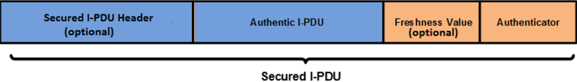
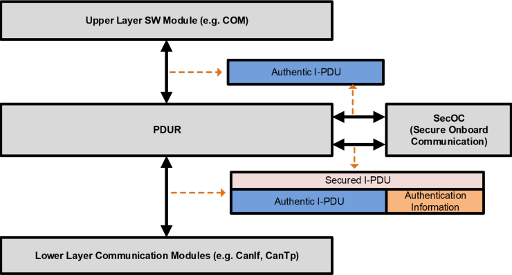
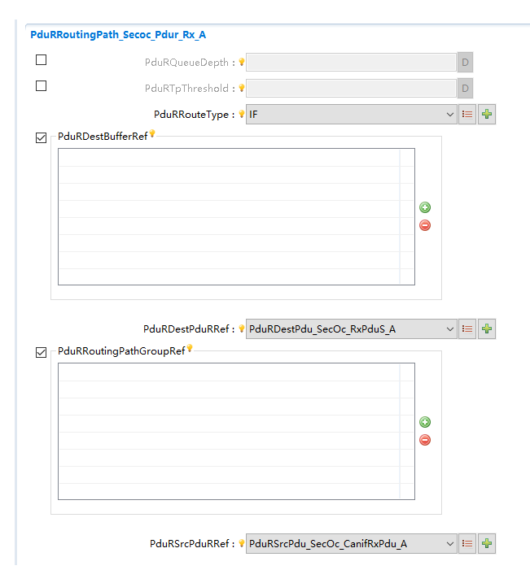
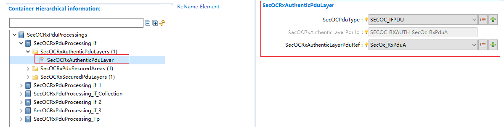
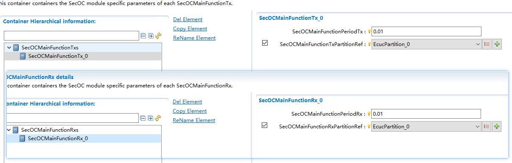
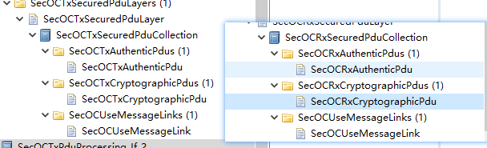

====================
SecOC
====================

文档信息 Document Information
============================================================

版本历史 Version History
--------------------------------------------------------------------------------------------------------

.. list-table::
   :widths: 10 10 10 10 20
   :header-rows: 1

   * - 日期(Date)
     - 作者(Author)
     - 版本(Version)
     - 状态(Status)
     - 说明(Description)

   * - 2025/01/20
     - Jian.Jiang
     - V0.1
     - 发布(Release)
     - 首次发布(First release)

   * - 2025/04/04
     - Jian.Jiang
     - V1.0
     - 发布(Release)
     - 正式发布(Official release)

参考文档 References
--------------------------------------------------------------------------------------------------------

.. list-table::
   :widths: 10 10 30 10
   :header-rows: 1

   * - 编号(Number)
     - 分类(Classification)
     - 标题(Title)
     - 版本(Version)
   * - 1
     - Autosar
     - AUTOSAR_CP_SRS_SecureOnboardCommunication.pdf
     - R23-11
   * - 2
     - Autosar
     - AUTOSAR_CP_EXP_LayeredSoftwareArchitecture.pdf
     - R23-11 
   * - 3
     - Autosar
     - AUTOSAR_CP_SWS_SecureOnboardCommunication.pdf
     - R23-11
   * - 4
     - Autosar
     - AUTOSAR_CP_SWS_CryptoServiceManager.pdf
     - R23-11  

术语与简写 Terms and Abbreviations
====================================================================

术语 Terms
--------------------------------------------------------------------------------------------------------
.. :align: center   表格内容居中(Table contents are centered)

.. list-table::
   :widths: 10 40
   :header-rows: 1

   * - 术语(Terms)
     - 解释(Explanation)

   * - Authentic I-PDU
     - 真实 I-PDU 是任意的 AUTOSAR I-PDU，其内容在网络传输过程中通过安全 I-PDU 进行保护。安全内容包括完整的 I-PDU 或 I-PDU 的一部分。(A Real I-PDU is an arbitrary AUTOSAR I-PDU whose content is protected by a secure I-PDU during network transmission.) The security content includes all or part of I-PDU.

   * - Authentication
     - 认证是与身份识别相关的服务。此功能既适用于实体，也适用于信息本身。进行通信的双方应相互识别。(Authentication refers to the service related to identity recognition.) This function applies to both entities and information. Both parties in communication should identify each other.
     
   * - Authentication Information
     - 认证信息由新鲜度值（或其一部分）和认证器（或其一部分）组成。认证信息是 SecOC 为实现安全 I-PDU 添加的附加信息。(The authentication information consists of a freshness value (or a part thereof) and an authenticator (or a part thereof).) Authentication information is the additional information added by SecOC to ensure secure I-PDU.
     
   * - Authenticator
     - 认证器是用于提供消息认证的数据。一般来说，术语“消息认证码 (MAC)”用于对称方法，而术语“签名”或“数字签名”则指具有不同属性和约束的非对称方法。(Authenticator is the data used for message authentication.) In general, the term "Message Authentication Code (MAC)" is used for symmetric methods while the term "signature" or "digital signature" refer to the asymmetric methods with different attributes and constraints.

   * - Secured I-PDU
     - 安全 I-PDU 是一种 AUTOSAR I-PDU，它包含真实 I-PDU 的有效负载并辅以额外的身份验证信息。(Secure I-PDU is a kind of AUTOSAR I-PDU that contains the payload of real I-PDU and comes with additional authentication information.)

简写 Abbreviations
--------------------------------------------------------------------------------------------------------

.. list-table::
   :widths: 10 20 30
   :header-rows: 1

   * - 简写(Abbreviation)
     - 全称(Full name)
     - 解释(Explanation)

   * - CSM
     - The AUTOSAR Crypto Service Manager
     - AUTOSAR 加密服务管理器

   * - SecOC
     - Secure Onboard Communication
     - 安全机载通信
  
   * - MAC
     - Message Authentication Code
     - 信息认证码

   * - FV
     - Freshness Value
     - 新鲜度值

简介 Introduction
==================================

SecOC 模块旨在为 PDU 级别的关键数据提供资源高效且实用的身份验证机制。主要使用带有消息认证码 (MAC) 的对称认证方法。

The SecOC module provides a mechanism featuring efficient and practical resources for critical data at the PDU level. Symmetric authentication method with message authentication codes (MAC) is mainly used.

它们使用比非对称方法小得多的密钥实现相同的安全级别，并且可以在软件和硬件中紧凑高效地实现。也可以使用对称方法和非对称认证方法。

They use the keys that are much smaller than asymmetric methods to achieve the security of the same level compactly and efficiently in software and hardware. Both symmetric and asymmetric authentication methods can also be used.

.. figure:: ../../../_static/参考手册/SecOC/SecOC架构图.png
   :alt: SecOC模块层次图 (SecOC Module Layer Diagram)
   :name: SecOC_fig_arch
   :align: center

   SecOC模块层次图. (SecOC Module Layer Diagram.)

如图 :ref:`SecOC_fig_arch` 所示，SecoC模块处于AUTOSAR架构中的通信服务层，其上下层模块都为PduR模块。

As shown in the figure :ref:`SecOC_fig_arch` , the SecoC module is in the communication service layer of the AUTOSAR architecture. Its upper and lower layer modules are all PduR modules.

功能描述 Functional Description
==========================================================

特性 Features
----------------------------------------------------------------------------------------------------

Authentic I-PDU
~~~~~~~~~~~~~~~~~~~~~~~~~~~~~~~~~~~~~~

Authentic I-PDU指需要进行保护以应对非法篡改和重放攻击的I-PDU。

Authentic I-PDU refers to the I-PDU that should be well protected from illegal tampering and replay attacks.

Secured I-PDU
~~~~~~~~~~~~~~~~~~~~~~~~~~~~~~~~~~~~~~

Secured I-PDU由Authentic I-PDU和Authenticator (eg: MAC )组成。同时Secured IPDU中可以附加Secured I-PDU Header和FreshnessValue信息。

Secured I-PDU consists of Authentic I-PDU and Authenticator (e.g.: MAC ). Furthermore, Secured IPDU can come with Secured I-PDU Header and FreshnessValue information.

Secured I-PDU Header指示Authentic I-PDU的长度，当没有Secured I-PDU Header时，Authentic I-PDU长度由配置获取。Freshness Value是在生成Authenticator时使用的新鲜度值。Authenticator为生成的认证信息。

Secured I-PDU Header indicates the length of Authentic I-PDU. If there is no Secured I-PDU Header, the length of Authentic I-PDU is gotten by configuration. Freshness Value is the value used for generating Authenticator. Authenticator is the generated authentication information.

   Secured I-PDU.

Secured I-PDU 中的原始 I-PDU 的长度、新鲜度值和认证器可能因一个唯一不可定义的Secured I-PDU 而异。

The length, freshness value, and authenticator of the original I-PDU in a Secured I-PDU may vary due to a unique undefined Secured I-PDU.

Secured I-PDU 中包含的身份验证器长度（参数 SecOCAuthInfoTruncLength）特定于唯一可识别的Secured I-PDU。通过为每个Secured I-PDU 提供 MAC 截断长度的细粒度配置，这允许在整个系统中提供灵活性（即两个独立的唯一Secured I-PDU 可能具有包含在Secured I-PDU 有效负载中的不同身份验证器长度）。

The length of the authenticator (parameter SecOCAuthInfoTruncLength) contained in the Secured I-PDU is specific to the unique identifiable Secured I-PDU. By providing fine-grained configuration of MAC truncation length for each Secured I-PDU, the flexibility in the entire system can be ensured (i.e., two independent unique Secured I-PDUs may have different lengths of authenticators included in the Secured I-PDU payload).

.. figure:: ../../../_static/参考手册/SecOC/TruncatedFVMAC.png
   :alt: 带有截断新鲜度计数器和截断认证器的Secured I-PDU 内容示例(Instance of Secured I-PDU content with truncated freshness counter and truncated authenticator)
   :name: SecOC_fig_arch_02
   :align: center

   带有截断新鲜度计数器和截断认证器的Secured I-PDU 内容示例. (Instance of Secured I-PDU content with truncated freshness counter and truncated authenticator.)

Authenticator 涵盖的数据 Data Covered by Authenticator
~~~~~~~~~~~~~~~~~~~~~~~~~~~~~~~~~~~~~~~~~~~~~~~~~~~~~~~~~~~~~~~~~~~~~~~~~~~~~~~~~~~~~~~~~~~~~~~~~~~~~~~~~~~~

计算认证器所依据的数据包括安全 I-PDU 的数据标识符（参数 SecOCDataId）、真实 I-PDU 数据和完整新鲜度值。这些分别连接在一起，组成位数组，传递给认证算法以生成/验证认证器。

The data used by the computational authenticator includes the data identifier (parameter SecOCDataId) of the secure I-PDU, real I-PDU data, and complete freshness value. These are connected respectively to form a bit group, which is transmitted to the authentication algorithm to generate/verify the authenticator.

**DataToAuthenticator** = Data Identifier | secured part of the Authentic I-PDU | Complete Freshness Value

Freshness Value
~~~~~~~~~~~~~~~~~~~~~~~~~~~~~~~~~~~~~~

使用Freshness Values能保证生成Secured I-PDU的新鲜度。通常FreshnessValue由新鲜度管理器（FVM）管理，SecOC使用FreshnessValueId从FVM获取相应的新鲜度值。此外，新鲜度值可以从Authentic I-PDU中截取一部分作为新鲜度值，截取开始的位置和长度由配置确定。

Freshness Values can ensure the freshness of the generated Secured I-PDU. In general, FreshnessValue is managed by the Freshness Value Manager (FVM), and SecOC obtains the corresponding freshness value from FVM by using FreshnessValueId. In addition, a portion of the freshness value can be extracted from the Authentic I-PDU as the freshness value. The starting position and length of the extraction are determined by configuration.

根据配置Secured I-PDU中可以不包含，包含完整或者部分的新鲜度值。

Secured I-PDU may contain no, complete or part of the freshness value based on the specific configuration.

SecOC和PduR的关系 Relationship Between SecOC and PduR
-------------------------------------------------------------------------------------------------------------------------------------

SecOC需要和PduR进行交互，用于获取和发送数据。

SecOC needs to interact with PduR to get and send data.

发送数据时，SecOC先作为PduR的下层模块，从PduR获取Authentic I-PDU，将Authentic I-PDU转换为Secured I-PDU之后，SecOC又作为PduR的上层模块，发送数据。

To send data, SecOC serves as a lower layer module of PduR to get Authentic I-PDU from PduR, and convert Authentic I-PDU to Secured I-PDU. Then SecOC serves as an upper layer module of PduR to send data.

接收数据时，SecOC先作为PduR的上层模块，从PduR接收Secured I-PDU。SecOC从Secured I-PDU中解析出Authentic I-PDU并通过校验之后，SecOC又作为PduR的下层模块，通过PduR将数据传递给上层。

To receive data, SecOC serves as the upper layer module of PduR to receive Secured I-PDU from PduR. After parsing the Authentic I-PDU from the Secured I-PDU and passing the verification, SecOC acts as a lower layer module of PduR to transmit the data to the upper layer through PduR.

   SecOC和PduR的关系. (Relationship Between SecOC and PduR.)

认证I-PDU（发送）功能 Certificate I-PDU (Sending) Function
------------------------------------------------------------------------------------------------------------------------------------------------------------------------------------------------------------

通过向原始 I-PDU 添加认证信息来创建安全 I-PDU。

A secure I-PDU is created by adding authentication information to the original I-PDU.

创建安全 I-PDU 以及对原始 I-PDU 的认证包括以下六个步骤：

Creating a secure I-PDU and authenticating the original I-PDU requires the following six steps:

1.准备安全的 I-PDU；

1.Prepare a secure I-PDU;

2.为验证器构建数据；

2.Build data for validator;

3.生成验证器；

3.Generate validator;

4.构建安全的 I-Pdu；

4.Build a secure I-Pdu;

5.增加新鲜度计数器；

5.Prepare more freshness value counter;

6.通过PduR发送安全I-PDU。

6.Send I-PDU via PduR.

上层调用SecOC_IfTransmit()或者SecOC_TpTransmit()发起Secured I-PDU的发送过程。

The upper layer calls SecOC_ifTransmit() or SecOC_TpTTransmit() to initiate the sending of Secured I-PDU sending.

对于直接发送，SecOC从SecOC_IfTransmit()函数的PduInfo中获取Authentic I-PDU。对于TP发送，SecOC需要分多次调用PduR_SecOCTpCopyTxData()获取Authentic I-PDU。

For direct sending, SecOC gets the Authentic I-PDU from PduInfo in the SecOC_IfTransmit() function. For sending via TP, SecOC has to finish sending by several times.Call PduR_SecOCTpCopyTxData() to get Authentic I-PDU.

获取到Authentic I-PDU之后，SecOC根据配置的FreshnessValue相关属性，取得FreshnessValue，再根据DataToAuthenticator的生成规则，构建DataToAuthenticator。

After obtaining the Authentic I-PDU, SecOC will obtain the FreshnessValue based on the configured FreshnessValue related attributes and then construct the DataToAAuthenticator according to the generation rules of the DataToAAuthenticator.

SecOC调用CSM模块的接口，将DataToAuthenticator传递给CSM。CSM模块根据输入的DataToAuthenticator等参数，计算生成Authenticator。

SecOC transmits the DataToAuthenticator to CSM by calling the interface of CSM module. The CSM module calculates and generates an Authenticator based on input parameters such as DataToAuthenticator.

生成Authenticator后，SecOC根据配置生成Secured I-PDU。之后SecOC调用PduR的发送接口将Secured I-PDU一次（If）或者多次（TP）发送出去。

After generating the Authenticator, SecOC will generate Secured I-PDU based on the configuration. Afterwards, SecOC calls the sending interface of PduR to send the Secured I-PDU (If) once or (TP) several times.

验证I-PDU（接收）功能 Verify I-PDU (Receiving) Function
----------------------------------------------------------------------------------------------------------------------------------------------------------------------------------------------------------

将安全 I-PDU 中包含的认证信息与基于本地数据标识符、本地新鲜度值和安全 I-PDU 中包含的原始 I-PDU 计算出的认证信息进行比较的过程。

It refers to the process of comparing the authentication information contained in the secure I-PDU with the authentication information calculated based on the local data identifier, local freshness value and the original I-PDU contained in the secure I-PDU.

安全 I-PDU 的验证包括以下六个步骤：

The verification of secure I-PDU includes the following six steps:

1.解析原始的 I-PDU、新鲜度值和身份验证器；

1.Analyze the original I-PDU, freshness value, and authenticator;

2.从新鲜度管理器获取新鲜度值；

2.Get freshness values from the freshness manager;

3.构建数据进行身份验证；

3.Build data for authentication;

4.验证身份验证信息；

4.Verify identity verification information;

5.向新鲜度经理发送确认信息；

5.Send confirmation message to the freshness manager;

6.将原始的I-PDU传递给上层。

6.Transmit the original I-PDU to the upper layer.

PduR收到需要校验的I-PDU时，调用SecOC_RxIndication()或者SecOC_StartOfReception()通知SecOC。SecOC将Secured I-PDU缓存到本地后开始校验I-PDU处理流程。

Upon receiving I-PDU that needs verifying, PduR will call SecOC_RxIndication() or SecOC_StartOfReception() to notify SecOC. SecOC caches the Secured I-PDU locally first and then starts verifying the I-PDU processing flow.

在MainFunction中，SecOC从Secured I-PDU中解析出Authentic I-PDU，FreshnessValue以及Authenticator。从新鲜度值管理器（FVM）中获取FreshnessValue，然后和Authentic I-PDU以及DataId组成DataToAuthenticator。

In MainFunction, SecOC parses Authentic I-PDU, FreshnessValue and Authenticator from Secured I-PDU. Get FreshnessValue from the Freshness Value Manager (FVM), and then combine it with Authentic I-PDU and DataId to form a DataToAuthenticator.

SecOC将DataToAuthenticator以及从接收报文中解析出来的Authenticator传递给CSM。CSM校验后将是否从成功的结果反馈给SecOC。

SecOC transmits the DataToAuthenticator and the Authenticator parsed from the received message to CSM. After verification, CSM will feed back the results to SecOC.

如果校验成功，SecOC 向FVM发送确认信息，FVM根据该信息维护FV。

If verification is successful, SecOC will send confirmation message to FVM, which will maintain FV based on the information.

SecOC调用PduR接口将Authentic I-PDU分一次（IF）或多次（TP）传递给上层。

SecOC transmits the Authentic I-PDU to the upper layer (IF) once or (TP) several times by calling the PduR interface.

Override功能 Function of Override
------------------------------------------------------------------------------------------------------------------------------------------------------

Override功能是一种特殊的可以干扰SecOC正常接收处理流程的机制。根据设置的Override策略，SecOC可能会不执行校验机制，或者在校验失败时也会将Authentic I-PDU传递给上层模块。

The Override function is a special mechanism that can interfere with the normal receiving and processing flow of SecOC. According to the set Override strategy, SecOC may not execute the verification mechanism, or transmit the Authentic I-PDU to the upper layer module when verification fails.

SecOC会在进行校验前判断Override功能设置的策略，决定是否需要调用CSM的接口进行数据校验。并且在校验结束后，根据Override功能设置的策略决定是否将需要将Authentic I-PDU传递给上层模块。

SecOC will decide whether to call CSM's interface for data verification based on the strategies set for the Override function before verification. After verification ends, it will decide whether to transmit the Authentic I-PDU to the upper layer module based on the strategy of Override function setting.

Override策略如下表所示：

Override strategy is shown in the table below:

.. list-table::
   :widths: 10 30
   :header-rows: 1

   * - 策略(Strategy)
     - 说明(Description)

   * - SECOC_OVERRIDE_DROP_UNTIL_NOTICE
     - 直至另行通知，不执行验证器验证（无 CSM 呼叫）I-PDU 被丢弃，验证结果设置为 SECOC_NO_VERIFICATION。(Unless otherwise notified, validator verification will not be performed (no CSM call) and I-PDU will be discarded. The verification result will be set to SECOC_NO_VERIFICATION.)

   * - SECOC_OVERRIDE_DROP_UNTIL_LIMIT
     - 直到达到 NumberOfMessagesTo Override，才执行验证器验证（无 CSM 呼叫）I-PDU 被丢弃，验证结果设置为 SECOC_NO_VERIFICATION。(Validator verification will not be performed (no CSM call) and the I-PDU will be discarded until the NumberOfMessages To Override is reached. The verification result will be set to SECOC_NO_VERIFICATION.)

   * - SECOC_OVERRIDE_CANCEL
     - 取消覆盖 VerifyStatus。(Cancel the coverage of VerifyStatus.)

   * - SECOC_OVERRIDE_PASS_UNTIL_NOTICE
     - 除非另行通知，否则执行验证器验证，无论验证结果如何，I-PDU 都会发送到上层，如果验证失败，则将验证结果设置为 SECOC_VERIFICATIONFAILURE_OVERWRITTEN。(Unless otherwise notified, validator verification will be performed. Whatever the verification result, I-PDU will transmit it to the upper layer. If verification fails, the verification result will be set to SECOC_VERIFICATIONFAILURE_OVERWRITTEN.)

   * - SECOC_OVERRIDE_SKIP_UNTIL_LIMIT
     - 直到达到 NumberOfMessagesTo Override 时，才进行认证器验证，将 I-PDU 发送到上层，验证结果设置为 SECOC_NO_VERIFICATION。如果配置了 SecOCRxSecuredPduCollection，SecOc 应处理 SecOCRxAuthentic Pdu，而无需等待 SecOCRx CryptographicPdu。(The authenticator verification will not be performed and the I-PDU will not be transmitted to the upper layer until the NumberOfMessages To Override is reached. The verification result will be set to SECOC_NO_VERIFICATION.) If SecOCRxSecuredPduCollection is configured, SecOc should process SecOCRxAuthentic Pdu without waiting for SecOCRx CryptographicPdu.

   * - SECOC_OVERRIDE_PASS_UNTIL_LIMIT
     - 直到达到 NumberOfMessagesTo Override 为止，执行验证器验证，无论验证结果如何，I-PDU 都会发送到上层，如果验证失败，则将验证结果设置为 SECOC_VERIFICATIONFAILURE_OVERWRITTEN。(The validator verification will not be performed until NumberOfMessagesTo Override is reached. Whatever the verification results, I-PDU will transmit it to the upper layer. If verification fails, the verification result will be set to SECOC_VERIFICATIONFAILURE_OVERWRITTEN.)

   * - SECOC_OVERRIDE_SKIP_UNTIL_NOTICE
     - 除非另行通知，否则不执行认证器验证，I-PDU 被发送到上层，验证结果设置为 SECOC_NO_VERIFICATION。如果配置了 SecOCRxSecuredPduCollection，SecOc 应处理 SecOCRxAuthentic Pdu，而无需等待 SecOCRx CryptographicPdu。(Unless otherwise notified, authentication verification will not be performed and I-PDU will be transmitted to the upper layer. The verification result will be set to SECOC_NO_VERIFICATION.) If SecOCRxSecuredPduCollection is configured, SecOc should process SecOCRxAuthentic Pdu without waiting for SecOCRx CryptographicPdu.

多核分布 Multi-core Distribution
-----------------------------------------------------------------------------------------------------------------------------------------

为了在不同分区之间提供负载分配，Crypto-Stack 的不同部分应分配给不同的分区。因此，应支持这种分区基于加密实例进行，即加密驱动程序实例应可定位到不同的不同分区上。

To provide load distribution between different partitions, different parts of Crypto Stack should be allocated to different partitions. Therefore, this partition should be supported based on encrypted instances; in other words, the encrypted driver instances can be located on different partitions.

SecOC 模块中的主执行线程（即相应的 MainFunctions）可以拆分为不同的 MainFunctions（每个分区至少一个）。

The main executing threads (i.e. corresponding MainFunctions) in the SecOC module can be split into different MainFunctions (at least one for each partition).

SecOC 和 PduR 之间的分区间通信由 PduR 管理。

The communication between SecOC and PduR is managed by PduR.

.. only:: doc_pbs

  变体 Variant
  ~~~~~~~~~~~~~~~~~~~~~~~~~~~~~~

  1.支持保护和校验I-PDU

  1.Support the protection and verification of I-PDU

  2.支持配置使用不同的新鲜度管理器

  2.Support the configuration and use of different freshness managers
  
偏差 Deviation
----------------------------------------------------------------------------------------------------
   None

扩展 Extension
----------------------------------------------------------------------------------------------------
   None

集成 Integration
==========================================================

文件列表 File List
----------------------------------------------------------------------------------------------------

静态文件 Static Files
~~~~~~~~~~~~~~~~~~~~~~~~~~~~~~~~~~~~~~~~~~~~~~~~~~~~~~~~~~

.. list-table::
   :widths: 10 30
   :header-rows: 1

   * - 文件(File)
     - 描述(Description)
   
   * - SecOC.h
     - SecOC模块头文件，包含了API函数的扩展声明并定义了端口的数据结构(The SecOC module header file contains extension declarations for API functions and defines the data structure of port.)

   * - SecOC_Cbk.h
     - SecOC模块对外提供的回调函数声明(Declares the callback functions provided by SecOC module externally)

   * - SecOC_Externals.h
     - SecOC模块对外提供的API函数声明(Declares the API function provided by SecOC externally)

   * - SecOC_Internal.h
     - SecOC内部需要使用的数据类型，宏定义等(-Data type, macro definition, etc. required for use within SecOC)

   * - SecOC_MemMap.h
     - SecOC变量和函数存储位置定义文件(Files for defining the storage location of SecOC variable and function)

   * - SecOC_Types.h
     - SecOC数据类型定义(Defines the data type of SecOC)

   * - SecOC.c
     - SecOC模块源文件，包含了API函数的实现。(The SecOC module source file, which contains the realization of API functions.)

动态文件 Dynamic Files
~~~~~~~~~~~~~~~~~~~~~~~~~~~~~~~~~~~~~~~~~~~~~~~~~~~~~~~~~~

.. list-table::
   :widths: 10 30
   :header-rows: 1

   * - 文件(File)
     - 描述(Description)

   * - SecOC_Callout.c
     - SecOC定义的Callout函数源文件(Source file of Callout function defined by SecOC)

   * - SecOC_Callout.h
     - SecOC定义的Callout函数头文件(Callout function header file defined by SecOC)

   * - SecOC_Cfg.c
     - 定义SecOC模块中PC配置参数(Defines PC configuration parameters in SecOC module)

   * - SecOC_Cfg.h
     - 定义SecOC模块预编译时用到的配置参数(Defines the configuration parameters used for pre-compiling SecOC modules)

   * - SecOC_Lcfg.c
     - 定义SecOC模块中连接时用到的配置参数(Defines the configuration parameters used for connections in SecOC module)

   * - SecOC_Lcfg.h
     - SecOC模块连接时用到的配置参数(Configuration parameters used for connecting SecOC module)

   * - SecOC_PBcfg.c
     - 定义SecOC模块中PB配置参数(Defines PB configuration parameters in SecOC module)

   * - SecOC_PBcfg.h
     - SecOC模块PB配置参数(PB configuration parameters in SecOC module)

错误处理 Error Handling
----------------------------------------------------------------------------------------------------

开发错误 Development Errors
~~~~~~~~~~~~~~~~~~~~~~~~~~~~~~~~~~~~~~~~~~~~~~~~~~~~~~~~~~
.. list-table:: 
   :widths: 20 10 30
   :header-rows: 1

   * - Error code
     - Value[hex]
     - Description

   * - SECOC_E_PARAM_POINTER
     - 0x01
     - An API service was called with a NULL pointer

   * - SECOC_E_UNINIT
     - 0x02
     - API service used without module initialization

   * - SECOC_E_INVALID_PDU_SDU_ID
     - 0x03
     - Invalid I-PDU identifier

   * - SECOC_E_CRYPTO_FAILURE
     - 0x04
     - Crypto service failed

   * - SECOC_E_INIT_FAILED
     - 0x07
     - initialization of SecOC failed

产品错误 Product Errors
~~~~~~~~~~~~~~~~~~~~~~~~~~~~~~~~~~~~~~~~~~~~~~~~~~~~~~~~~~

None

运行时错误 Runtime Errors
~~~~~~~~~~~~~~~~~~~~~~~~~~~~~~~~~~~~~~~~~~~~~~~~~~~~~~~~~~

.. list-table:: 
   :widths: 20 10 30
   :header-rows: 1

   * - Error code
     - Value[hex]
     - Description

   * - SECOC_E_FRESHNESS_FAILURE
     - 0x08
     - NO freshness value available from the Freshness Manager

接口描述 Interface Description
==============================================================

.. include:: SecOC_api.rst

依赖的服务 Applicable Services
----------------------------------------------------------------------------------------------------

强制接口 Compulsory interface
~~~~~~~~~~~~~~~~~~~~~~~~~~~~~~~~~~~~~~~~~~~~~~~~~~~~~~~~~~

.. list-table::
   :widths: 10 5 30
   :header-rows: 1

   * - API Function
     - Header File
     - Description

   * - Det_ReportRuntimeError 
     - Det.h
     - Service to report runtime errors. If a callout has been configured then this callout shall be called.

   * - PduR_SecOCCancelTransmit
     - PduR_SecOC.h
     - Requests cancellation of an ongoing transmission of a PDU in a lower layer communication module.

   * - PduR_SecOCIfRxIndication
     - PduR_SecOC.h
     - Indication of a received PDU from a lower layer communication interface module.

   * - PduR_SecOCIfTxConfirmation
     - PduR_SecOC.h
     - The lower layer communication interface module confirms the transmission of a PDU, or the failure to transmit a PDU.

   * - PduR_SecOCTransmit
     - PduR_SecOC.h
     - Requests transmission of a PDU.

可选接口 Optional Interface
~~~~~~~~~~~~~~~~~~~~~~~~~~~~~~~~~~~~~~~~~~~~~~~~~~~~~~~~~~

.. list-table::
   :widths: 10 5 30
   :header-rows: 1

   * - API Function
     - Header File
     - Description

   * - Csm_MacGenerate 
     - Csm.h
     - Uses the given data to perform a MAC generation and stores the MAC in the memory location pointed to by the MAC pointer.

   * - Csm_MacVerify 
     - Csm.h
     - Verifies the given MAC by comparing if the MAC is generated with the given data.

   * - Csm_SignatureGenerate 
     - Csm.h
     - Uses the given data to perform the signature calculation and stores the signature in the memory location pointed by the result pointer.

   * - Csm_SignatureVerify 
     - Csm.h
     - Verifies the given signature by checking if it was generated with the given data.

   * - Det_ReportError 
     - Det.h
     - Service to report development errors.

   * - IdsM_SetSecurityEvent 
     - IdsM.h
     - This API is the application interface to report security events to the IdsM.

   * - IdsM_SetSecurityEventWithContextData 
     - IdsM.h
     - This API is the application interface to report security events with context data to the IdsM.

   * - PduR_SecOCCancelReceive 
     - PduR_SecOC.h
     - Requests cancellation of an ongoing reception of a PDU in a lower layer transport protocol module.

   * - PduR_SecOCTpCopyRxData 
     - PduR_SecOC.h
     - This function is called to provide the received data of an I-PDU segment (N-PDU) to the upper layer. Each call to this function provides the next part of the I-PDU data. The size of the remaining buffer is written to the position indicated by bufferSizePtr.

   * - PduR_SecOCTpCopyTxData 
     - PduR_SecOC.h
     - This function is called to acquire the transmit data of an I-PDU segment (N-PDU). Each call to this function provides the next part of the I-PDU data unless retry->TpDataState is TP_DATARETRY. In this case the function restarts to copy the data beginning at the offset from the current position indicated by retry->TxTpDataCnt. The size of the remaining data is written to the position indicated by availableDataPtr.

   * - PduR_SecOCTpRxIndication 
     - PduR_SecOC.h
     - Called after an I-PDU has been received via the TP API, the result indicates whether the transmission was successful or not.

   * - PduR_SecOCTpStartOfReception 
     - PduR_SecOC.h
     - This function is called at the start of receiving an N-SDU. The N-SDU might be fragmented into multiple N-PDUs (FF with one or more following CFs) or might consist of a single N-PDU (SF). The service shall provide the currently available maximum buffer size when invoked with TpSdu Length equal to 0.

   * - PduR_SecOCTpTxConfirmation 
     - PduR_SecOC.h
     - This function is called after the I-PDU has been transmitted on its network, the result indicates whether the transmission was successful or not.

配置接口 Configuration Interfaces
~~~~~~~~~~~~~~~~~~~~~~~~~~~~~~~~~~~~~~~~~~~~~~~~~~~~~~~~~~

.. list-table::
   :widths: 10 5 30
   :header-rows: 1

   * - API Function
     - Header File
     - Description

   * - SecOC_VerifyStatus 
     - SecOC_Externals.h
     - This service provides the ability to inform the application about the result of the verification attempt of a received PDU by the SecOC module.

   * - SecOC_VerificationStatusCallout 
     - SecOC_Externals.h
     - Service is used to propagate the status of each verification attempt from the SecOC module to other modules.

配置 Configuration
======================================================

认证I-PDU配置 Certificate I-PDU Configuration
----------------------------------------------------------------------------------------------------

1.认证I-PDU配置主要在SecOCTxPduProcessing中进行，用户需要确认好需要保护的报文和使用的加密方式以及新鲜度管理器， 明确从哪里（上层）发送到哪里（通信栈）。

1.The authentication of I-PDU configuration is mainly carried out in SecOCTxPduProcessing. Users should confirm the messages that need protecting, the encryption method used and the freshness manager, and clarify the sending path (from upper layer to communication stack).

2.首先确认需要保护的I-PDU是否已经配置到SecOC模块中, 然后将相关报文的PduID在PduR中关联起来。

2.First, confirm whether the I-PDU that needs protecting has been configured in the SecOC module, and then link the PduID of the relevant message in PduR.

.. figure:: ../../../_static/参考手册/SecOC/ComTxPduR.png
   :alt: 发送时将SecOC与PduR串起来 (String SecOC and PduR together during sending)
   :name: SecOC_fig_arch_04
   :align: center

   发送时将SecOC与PduR串起来 (String SecOC and PduR together during sending)

3.配置Authentic I-PDU的相关属性，包括DataId，SecOCFreshnessValueId, SecOCRxAuthServiceConfigRef等。

3.Configure relevant attributes of Authentic I-PDU, including DataId, SecOCFreshnessValueId, SecOCRxAuthServiceConfigRef, etc.

.. figure:: ../../../_static/参考手册/SecOC/SecOCTxConfig.png
   :alt: 配置SecOC发送安全I-PDU (Configure SecOC to send secure I-PDU)
   :name: SecOC_fig_arch_05
   :align: center

   配置SecOC发送安全I-PDU (Configure SecOC to send secure I-PDU)

4.配置关联原始I-PDU ID

4.Configure and link original I-PDU ID

.. figure:: ../../../_static/参考手册/SecOC/SecOCTxAuthenticPdu.png
   :alt: Config TxAuthentic
   :name: SecOC_fig_arch_06
   :align: center

   Config TxAuthentic

5.配置Secured I-PDU,将安全I-pdu与下层关联起来

5.Configure Secured I-PDU and link it with the lower layer

.. figure:: ../../../_static/参考手册/SecOC/SecOCTxSecuredPdu.png
   :alt: Config TxSecured
   :name: SecOC_fig_arch_07
   :align: center

   Config TxSecured.

校验I-PDU配置 Verify I-PDU Configuration
----------------------------------------------------------------------------------------------------

1.校验I-PDU配置主要在SecOCRxPduProcessing中进行，用户需要确认好需要校验的报文和使用的加密方式以及新鲜度管理器， 明确从哪里（通信栈）接收然后传到到哪里（上层）。

1.The verification of I-PDU configuration is mainly carried out in SecOCRxPduProcessing. Users should confirm the messages that need verifying, the encryption method used, and the freshness manager, and clarify the receiving path (from communication stack to upper layer). 

2.首先确认需要校验的I-PDU是否已经配置到SecOC模块中, 然后将相关报文的PduID在PduR中关联起来。

2.First, confirm whether the I-PDU that needs verifying has been configured in the SecOC module, and then link the PduID of the relevant message in PduR.

   接收时将SecOC与PduR串起来.  (String SecOC and PduR together during receiving.)

3.配置Secured I-PDU的相关属性，包括DataId，SecOCFreshnessValueId, SecOCRxAuthServiceConfigRef等。

3.Configure relevant attributes of Secured I-PDU, including DataId, SecOCFreshnessValueId, SecOCRxAuthServiceConfigRef etc.

.. figure:: ../../../_static/参考手册/SecOC/SecOCRxConfig.png
   :alt: 配置接收时PduR与SecOC上层模块关联 (Link PduR and SecOC upper layer modules when receiving configuration)
   :name: SecOC_fig_arch_09
   :align: center

   配置接收时PduR与SecOC上层模块关联. (Link PduR and SecOC upper layer modules when receiving configuration.)

4.配置关联Secured I-PDU ID

4.Configure the linked Secured I-PDU ID

.. figure:: ../../../_static/参考手册/SecOC/SecOCRxSecuredPdu.png
   :alt: Config RxSecured
   :name: SecOC_fig_arch_10
   :align: center

   Config RxSecured.

5.配置Authentic I-PDU,将Authentic I-PDU与上层关联起来

5.Configure Authentic I-PDU and link it with the upper layer

   Config RxAuthentic.

多分区配置 Multi-partition Configuration
----------------------------------------------------------------------------------------------------

1.在 SecOCMainFunctionRx 或者 SecOCMainFunctionTx 中，SecOC模块需要根据配置的分区信息，将不同的任务分配到不同的分区中。

1.In SecOCMainFunctionRx or SecOCMainFunctionTx, the SecOC module should allocate different tasks to different partitions based on the configured partition information.

   SecOCPartition.

2.在SecOCRxPduProcessing中的SecOCRxPduMainFunctionRef 或者 SecOCTxPduProcessing中的SecOCTxPduMainFunctionRef中选择相应的分区。

2.Select the corresponding partition from SecOCRxPduMainFunctionalRef in SecOCRxPduProcessing or SecOCTxPduMainFunctionalRef in SecOCTxPduProcessing.

Override配置 Configuration of Override
----------------------------------------------------------------------------------------------------

1.通过配置SecOCIgnoreVerificationResult来使能忽略验证结果。

1.Enable the ignoring of verification results by configuring SecOCIgnoreVerifyResult.

2.通过调用函数SecOC_VerifyStatusOverride来覆写验证结果，或者执行过程。

2.Overwrite the verification result or execute the process by calling the function SecOC_VerifyStatusOverride.

Collection配置 Configuration of Collection

1.在SecOCRxPduProcessing或者SecOCTxPduProcessing下的SecOCRxSecuredPduLayer或SecOCTxSecuredPduLayer中配置SecOCRxSecuredPduCollection或SecOCTxSecuredPduCollection,

1.Configure SecOCRxSecuredAnduCollection or SecOCTxSecuredAnduCollection in SecOCRxSecuredAnduLayer or SecOCTxSecuredAnduLayer of SecOCRxPduProcessing or SecOCTxPduProcessing,

2.将安全分为两帧发送出去，分别为AuthenticPdu和CryptographicPdu。

2.Divide the security into two frames and send them out, i.e., AuthenticPdu and CryptographicPdu.

   SecOCCollection.
