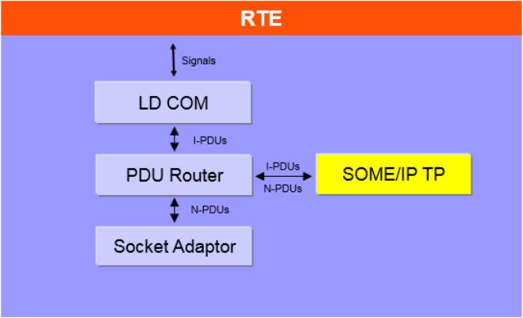
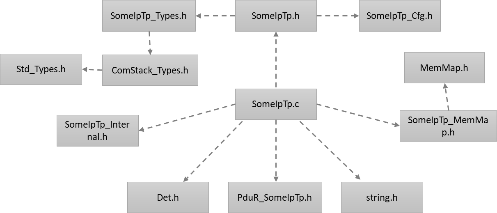
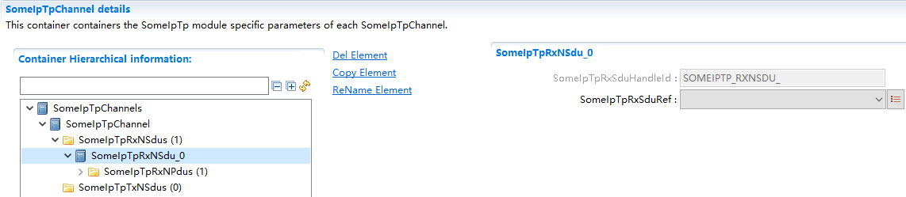
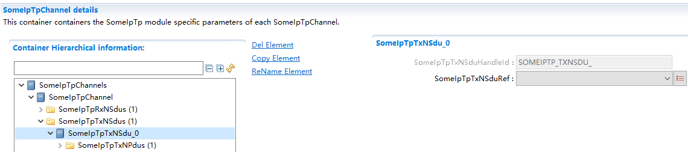
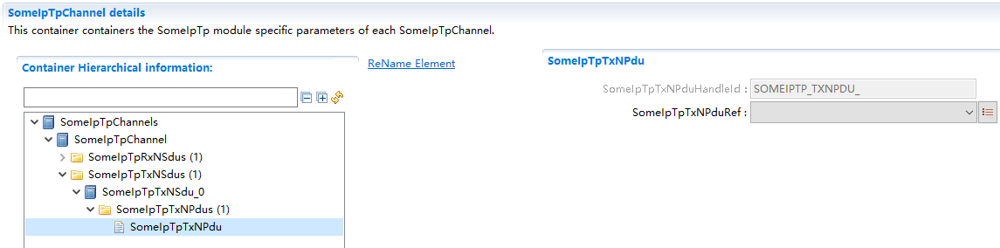

===================
SomeIpTp产品参考手册
===================

**缩写词注解**

+------------+---------------------------+----------------------------+
| **缩写词** | **英文全称**              | **中文解释**               |
+------------+---------------------------+----------------------------+
| SOME/IP    | Scalable service-Oriented | 基于IP                     |
|            | MiddlewarE over IP        | 的可缩放的面向服务的中间件 |
+------------+---------------------------+----------------------------+
| SOME/IP TP | SOME/IP Transport Layer   | SOME/IP传输层              |
+------------+---------------------------+----------------------------+
| UDP        | User Datagram Protocol    | 用户数据报协议             |
+------------+---------------------------+----------------------------+

简介
====

SOME/IP
TP为使用UDP发送长度大于1400字节的SOME/IP报文提供了可能。在发送端，SOME/IP
TP将原始数据进行分段，插入TP报头后分段发送出去。在接收端，SOME/IP
TP利用TP报头将接收的分段进行重组，传递给上层用户。

SomeIpTp模块通过和PduR模块进行交互，进行数据的接收和发送。

|image1|

图1-1 SOME/IP-TP模块概要图

参考资料
--------

[1] AUTOSAR_SWS_SOMEIPTransportProtocol.pdf，R19-11

功能描述
========

SOME/IP
TP为使用UDP发送长度大于1400字节的SOME/IP报文提供了可能。在发送端，SOME/IP
TP将原始数据进行分段，插入TP报头后分段发送出去。在接收端，SOME/IP
TP利用TP报头将接收的分段进行重组，传递给上层用户。

|image2|

图2-1 SomeIpTp模块原理示意图

SOMEIP-TP协议在原有的SOMEIP协议中改造了MessageType区域的构造（增加了TP-Flag位），并扩展了4个字节（分为Offset，Res，M区域）用于控制传输TP报文。SomeIpTp模块完成TP相关位的填充和解析，以支持大数据传输。

|image3|

图2-2 SomeIpTp报文格式示意图

源文件描述
==========

表3-1 SomeIpTp组件文件描述

+-----------------+----------------------------------------------------+
| **文件**        | **说明**                                           |
+-----------------+----------------------------------------------------+
| SomeIpTp_Cfg.h  | 用于定义SomeIpTp模块预编译时用到的宏。             |
+-----------------+----------------------------------------------------+
| SomeIpTp        | 配置参数源文件，包含各个配置项的定义。             |
| \_Cfg.c         |                                                    |
+-----------------+----------------------------------------------------+
| S               | SomeIpTp模块类型定义头文件。                       |
| omeIpTp_Types.h |                                                    |
+-----------------+----------------------------------------------------+
| Some            | So                                                 |
| IpTp_Internal.h | meIpTp模块内部使用的宏，运行时变量类型定义头文件。 |
+-----------------+----------------------------------------------------+
| So              | SomeIpTp模块函数和变量存储位置定义文件。           |
| meIpTp_MemMap.h |                                                    |
+-----------------+----------------------------------------------------+
| SomeIpTp.h      | SomeIpTp模块头文件                                 |
|                 | ，通过加载该头文件访问SomeIpTp公开的函数和数据类型 |
+-----------------+----------------------------------------------------+
| SomeIpTp.c      | SomeIpTp模块实现源文件，各API实现在该文件中        |
+-----------------+----------------------------------------------------+

|image4|

图3-1 SomeIpTp组件文件交互关系图

API接口
=======

类型定义
--------

SomeIpTp_ConfigType类型定义
~~~~~~~~~~~~~~~~~~~~~~~~~~~

+-----------+----------------------------------------------------------+
| 名称      | SomeIpTp_ConfigType                                      |
+-----------+----------------------------------------------------------+
| 类型      | Structure                                                |
+-----------+----------------------------------------------------------+
| 范围      | 无                                                       |
+-----------+----------------------------------------------------------+
| 描述      | SomeIpTp配置参数。                                       |
+-----------+----------------------------------------------------------+

输入函数描述
------------

+----------------------------------+-----------------------------------+
| **输入模块**                     | **API**                           |
+----------------------------------+-----------------------------------+
| Det                              | Det_ReportError                   |
+----------------------------------+-----------------------------------+
|                                  | Det_Report-RuntimeError           |
+----------------------------------+-----------------------------------+
| PduR                             | PduR_SomeIpTpCopyRxData           |
+----------------------------------+-----------------------------------+
|                                  | PduR_SomeIpTpCopyTxData           |
+----------------------------------+-----------------------------------+
|                                  | PduR_SomeIpTpRxIndication         |
+----------------------------------+-----------------------------------+
|                                  | PduR_SomeIpTpStartOfReception     |
+----------------------------------+-----------------------------------+
|                                  | PduR_SomeIpTpTransmit             |
+----------------------------------+-----------------------------------+
|                                  | PduR_SomeIpTpTxConfirmation       |
+----------------------------------+-----------------------------------+

静态接口函数定义
----------------

SomeIpTp_GetVersionInfo函数定义
~~~~~~~~~~~~~~~~~~~~~~~~~~~~~~~

+-------------+--------------------------------------------------------+
| 函数名称：  | SomeIpTp_GetVersionInfo                                |
+-------------+--------------------------------------------------------+
| 函数原型：  | void SomeIpTp_GetVersionInfo (                         |
|             |                                                        |
|             | Std_VersionInfoType\* VersionInfo                      |
|             |                                                        |
|             | )                                                      |
+-------------+--------------------------------------------------------+
| 服务编号：  | 0x01                                                   |
+-------------+--------------------------------------------------------+
| 同步/异步： | 同步                                                   |
+-------------+--------------------------------------------------------+
| 是          | 可重入                                                 |
| 否可重入：  |                                                        |
+-------------+--------------------------------------------------------+
| 输入参数：  | 无                                                     |
+-------------+--------------------------------------------------------+
| 输入        | 无                                                     |
| 输出参数：  |                                                        |
+-------------+--------------------------------------------------------+
| 输出参数：  | versioninfo：版本信息存储变量指针                      |
+-------------+--------------------------------------------------------+
| 返回值：    | 无                                                     |
+-------------+--------------------------------------------------------+
| 功能概述：  | 获取SomeIpTp模块版本信息                               |
+-------------+--------------------------------------------------------+

SomeIpTp_Init函数定义
~~~~~~~~~~~~~~~~~~~~~

+-------------+-------------------+------------------------------------+
| 函数名称：  | SomeIpTp_Init     |                                    |
+-------------+-------------------+------------------------------------+
| 函数原型：  | void              |                                    |
|             | SomeIpTp_Init (   |                                    |
|             |                   |                                    |
|             | const             |                                    |
|             | Some              |                                    |
|             | IpTp_ConfigType\* |                                    |
|             | config            |                                    |
|             |                   |                                    |
|             | )                 |                                    |
+-------------+-------------------+------------------------------------+
| 服务编号：  | 0x02              |                                    |
+-------------+-------------------+------------------------------------+
| 同步/异步： | 同步              |                                    |
+-------------+-------------------+------------------------------------+
| 是          | 不可重入          |                                    |
| 否可重入：  |                   |                                    |
+-------------+-------------------+------------------------------------+
| 输入参数：  | config            | 指向配置数据的指针                 |
+-------------+-------------------+------------------------------------+
| 输入        | 无                |                                    |
| 输出参数：  |                   |                                    |
+-------------+-------------------+------------------------------------+
| 输出参数：  | 无                |                                    |
+-------------+-------------------+------------------------------------+
| 返回值：    | 无                |                                    |
+-------------+-------------------+------------------------------------+
| 功能概述：  | SomeI             |                                    |
|             | pTp模式初始化函数 |                                    |
+-------------+-------------------+------------------------------------+

SomeIpTp_Transmit函数定义
~~~~~~~~~~~~~~~~~~~~~~~~~

+-------------+--------------+----------------------------------------+
| 函数名称：  | SomeI        |                                        |
|             | pTp_Transmit |                                        |
+-------------+--------------+----------------------------------------+
| 函数原型：  | St           |                                        |
|             | d_ReturnType |                                        |
|             | SomeI        |                                        |
|             | pTp_Transmit |                                        |
|             | (            |                                        |
|             |              |                                        |
|             | PduIdType    |                                        |
|             | TxPduId,     |                                        |
|             |              |                                        |
|             | const        |                                        |
|             | P            |                                        |
|             | duInfoType\* |                                        |
|             | PduInfoPtr   |                                        |
|             |              |                                        |
|             | )            |                                        |
+-------------+--------------+----------------------------------------+
| 服务编号：  | 0x49         |                                        |
+-------------+--------------+----------------------------------------+
| 同步/异步： | 非同步       |                                        |
+-------------+--------------+----------------------------------------+
| 是          | 不同         |                                        |
| 否可重入：  | TxPdu可重入  |                                        |
+-------------+--------------+----------------------------------------+
| 输入参数：  | TxPduId      | 将要被发送的Pdu的Id                    |
+-------------+--------------+----------------------------------------+
|             | PduInfoPtr   | 用于指示Pdu长度                        |
+-------------+--------------+----------------------------------------+
| 输入        | 无           |                                        |
| 输出参数：  |              |                                        |
+-------------+--------------+----------------------------------------+
| 输出参数：  | 无           |                                        |
+-------------+--------------+----------------------------------------+
| 返回值：    | E_OK:        |                                        |
|             | 请求被接受   |                                        |
|             |              |                                        |
|             | E_NOT_OK:    |                                        |
|             | 请求被拒绝   |                                        |
+-------------+--------------+----------------------------------------+
| 功能概述：  | 请求         |                                        |
|             | 发送一个Pdu  |                                        |
+-------------+--------------+----------------------------------------+

SomeIpTp_TriggerTransmit函数定义
~~~~~~~~~~~~~~~~~~~~~~~~~~~~~~~~

+-------------+--------------+----------------------------------------+
| 函数名称：  | SomeIpTp_Tri |                                        |
|             | ggerTransmit |                                        |
+-------------+--------------+----------------------------------------+
| 函数原型：  | St           |                                        |
|             | d_ReturnType |                                        |
|             | SomeIpTp_Tri |                                        |
|             | ggerTransmit |                                        |
|             | (            |                                        |
|             |              |                                        |
|             | PduIdType    |                                        |
|             | TxPduId,     |                                        |
|             |              |                                        |
|             | P            |                                        |
|             | duInfoType\* |                                        |
|             | PduInfoPtr   |                                        |
|             |              |                                        |
|             | )            |                                        |
+-------------+--------------+----------------------------------------+
| 服务编号：  | 0x41         |                                        |
+-------------+--------------+----------------------------------------+
| 同步/异步： | 同步         |                                        |
+-------------+--------------+----------------------------------------+
| 是          | 不同         |                                        |
| 否可重入：  | PduId可重入  |                                        |
+-------------+--------------+----------------------------------------+
| 输入参数：  | TxPduId      | 请求发送的SDU Id                       |
+-------------+--------------+----------------------------------------+
| 输入        | PduInfoPtr   | 包含一个指向存储SDU的buffer的地址，以  |
| 输出参数：  |              | 及指示该buffer大小的成员SduLengh。返回 |
|             |              | 时SduLengh中存储实际复制的SDU的长度。  |
+-------------+--------------+----------------------------------------+
| 输出参数：  | 无           |                                        |
+-------------+--------------+----------------------------------------+
| 返回值：    | E_OK:        |                                        |
|             | SDU被复      |                                        |
|             | 制到buffer中 |                                        |
|             | ，长度存储在 |                                        |
|             | SduLength中  |                                        |
|             |              |                                        |
|             | E_NOT_OK:    |                                        |
|             | 没有         |                                        |
|             | 成功将SDU复  |                                        |
|             | 制到buffer中 |                                        |
+-------------+--------------+----------------------------------------+
| 功能概述：  | 下层模块调用 |                                        |
|             | 该接口获取将 |                                        |
|             | 要发送的数据 |                                        |
+-------------+--------------+----------------------------------------+

SomeIpTp_RxIndication函数定义
~~~~~~~~~~~~~~~~~~~~~~~~~~~~~

+-------------+-----------+-------------------------------------------+
| 函数名称：  | Som       |                                           |
|             | eIpTp_RxI |                                           |
|             | ndication |                                           |
+-------------+-----------+-------------------------------------------+
| 函数原型：  | void      |                                           |
|             | Som       |                                           |
|             | eIpTp_RxI |                                           |
|             | ndication |                                           |
|             | (         |                                           |
|             |           |                                           |
|             | PduIdType |                                           |
|             | RxPduId,  |                                           |
|             |           |                                           |
|             | const     |                                           |
|             | PduI      |                                           |
|             | nfoType\* |                                           |
|             | P         |                                           |
|             | duInfoPtr |                                           |
|             |           |                                           |
|             | )         |                                           |
+-------------+-----------+-------------------------------------------+
| 服务编号：  | 0x42      |                                           |
+-------------+-----------+-------------------------------------------+
| 同步/异步： | 同步      |                                           |
+-------------+-----------+-------------------------------------------+
| 是          | 不同      |                                           |
| 否可重入：  | Pdu可重入 |                                           |
+-------------+-----------+-------------------------------------------+
| 输入参数：  | RxPduId   | 接收Pdu Id                                |
+-------------+-----------+-------------------------------------------+
|             | P         | 包含接收Pdu的长度（PduL                   |
|             | duInfoPtr | ength）和指向接收数据的指针（SduDataPtr） |
+-------------+-----------+-------------------------------------------+
| 输入        | 无        |                                           |
| 输出参数：  |           |                                           |
+-------------+-----------+-------------------------------------------+
| 输出参数：  | 无        |                                           |
+-------------+-----------+-------------------------------------------+
| 返回值：    | 无        |                                           |
+-------------+-----------+-------------------------------------------+
| 功能概述：  | 下层模    |                                           |
|             | 块接收到  |                                           |
|             | 报文时通  |                                           |
|             | 过该接口  |                                           |
|             | 通知SomeI |                                           |
|             | pTp模块。 |                                           |
+-------------+-----------+-------------------------------------------+

SomeIpTp_TxConfirmation函数定义
~~~~~~~~~~~~~~~~~~~~~~~~~~~~~~~

+-------------+------------+------------------------------------------+
| 函数名称：  | Som        |                                          |
|             | eIpTp_TxCo |                                          |
|             | nfirmation |                                          |
+-------------+------------+------------------------------------------+
| 函数原型：  | void       |                                          |
|             | Som        |                                          |
|             | eIpTp_TxCo |                                          |
|             | nfirmation |                                          |
|             | (          |                                          |
|             |            |                                          |
|             | PduIdType  |                                          |
|             | TxPduId,   |                                          |
|             |            |                                          |
|             | Std_       |                                          |
|             | ReturnType |                                          |
|             | result     |                                          |
|             |            |                                          |
|             | )          |                                          |
+-------------+------------+------------------------------------------+
| 服务编号：  | 0x40       |                                          |
+-------------+------------+------------------------------------------+
| 同步/异步： | 同步       |                                          |
+-------------+------------+------------------------------------------+
| 是          | 不同       |                                          |
| 否可重入：  | Pdu可重入  |                                          |
+-------------+------------+------------------------------------------+
| 输入参数：  | TxPduId    | 被发送的Pdu Id                           |
+-------------+------------+------------------------------------------+
|             | result     | 被发送的Pdu的发送结果                    |
+-------------+------------+------------------------------------------+
| 输入        | 无         |                                          |
| 输出参数：  |            |                                          |
+-------------+------------+------------------------------------------+
| 输出参数：  | 无         |                                          |
+-------------+------------+------------------------------------------+
| 返回值：    | 无         |                                          |
+-------------+------------+------------------------------------------+
| 功能概述：  | 下层模块   |                                          |
|             | 调用该函数 |                                          |
|             | 通知SomeI  |                                          |
|             | pTp某个Pdu |                                          |
|             | 的发送结果 |                                          |
+-------------+------------+------------------------------------------+

SomeIpTp_MainFunctionTx函数定义
~~~~~~~~~~~~~~~~~~~~~~~~~~~~~~~

+-------------+--------------------------------------------------------+
| 函数名称：  | SomeIpTp_MainFunctionTx                                |
+-------------+--------------------------------------------------------+
| 函数原型：  | void SomeIpTp_MainFunctionTx (                         |
|             |                                                        |
|             | void                                                   |
|             |                                                        |
|             | )                                                      |
+-------------+--------------------------------------------------------+
| 服务编号：  | 0x03                                                   |
+-------------+--------------------------------------------------------+
| 同步/异步： | 同步                                                   |
+-------------+--------------------------------------------------------+
| 是          | 不可重入                                               |
| 否可重入：  |                                                        |
+-------------+--------------------------------------------------------+
| 输入参数：  | 无                                                     |
+-------------+--------------------------------------------------------+
| 输入        | 无                                                     |
| 输出参数：  |                                                        |
+-------------+--------------------------------------------------------+
| 输出参数：  | 无                                                     |
+-------------+--------------------------------------------------------+
| 返回值：    | 无                                                     |
+-------------+--------------------------------------------------------+
| 功能概述：  | 发送周期处理函数                                       |
+-------------+--------------------------------------------------------+

SomeIpTp_MainFunctionRx函数定义
~~~~~~~~~~~~~~~~~~~~~~~~~~~~~~~

+-------------+--------------------------------------------------------+
| 函数名称：  | SomeIpTp_MainFunctionRx                                |
+-------------+--------------------------------------------------------+
| 函数原型：  | void SomeIpTp_MainFunctionRx (                         |
|             |                                                        |
|             | void                                                   |
|             |                                                        |
|             | )                                                      |
+-------------+--------------------------------------------------------+
| 服务编号：  | 0x04                                                   |
+-------------+--------------------------------------------------------+
| 同步/异步： | 同步                                                   |
+-------------+--------------------------------------------------------+
| 是          | 不可重入                                               |
| 否可重入：  |                                                        |
+-------------+--------------------------------------------------------+
| 输入参数：  | 无                                                     |
+-------------+--------------------------------------------------------+
| 输入        | 无                                                     |
| 输出参数：  |                                                        |
+-------------+--------------------------------------------------------+
| 输出参数：  | 无                                                     |
+-------------+--------------------------------------------------------+
| 返回值：    | 无                                                     |
+-------------+--------------------------------------------------------+
| 功能概述：  | 接收周期处理函数                                       |
+-------------+--------------------------------------------------------+

可配置函数定义
--------------

无。

配置
====

SomeIpTpGeneral
---------------

|image5|

图5-1 SomeIpTpGeneral容器配置图

表5‑1 SomeIpTpGeneral容器属性描述

+---------+---------+-----------------------+-----------+------------+
| **U     | *       |                       |           |            |
| I名称** | *描述** |                       |           |            |
+---------+---------+-----------------------+-----------+------------+
| S       | 取      | STD_ON                | 默认取值  | STD_OFF    |
| omeIpTp | 值范围  |                       |           |            |
| DevErro |         | STD_OFF               |           |            |
| rDetect |         |                       |           |            |
+---------+---------+-----------------------+-----------+------------+
|         | 参      | 是否开启DET检查       |           |            |
|         | 数描述  |                       |           |            |
+---------+---------+-----------------------+-----------+------------+
|         | 依      | 无                    |           |            |
|         | 赖关系  |                       |           |            |
+---------+---------+-----------------------+-----------+------------+
| SomeIpT | 取      | 0 .. INF              | 默认取值  | 无         |
| pRxMain | 值范围  |                       |           |            |
| Functio |         |                       |           |            |
| nPeriod |         |                       |           |            |
+---------+---------+-----------------------+-----------+------------+
|         | 参      | Some                  |           |            |
|         | 数描述  | IpTp_MainFunctionRx函 |           |            |
|         |         | 数的调用周期。单位为s |           |            |
+---------+---------+-----------------------+-----------+------------+
|         | 依      | 无                    |           |            |
|         | 赖关系  |                       |           |            |
+---------+---------+-----------------------+-----------+------------+
| SomeIpT | 取      | 0 .. INF              | 默认取值  | 无         |
| pTxMain | 值范围  |                       |           |            |
| Functio |         |                       |           |            |
| nPeriod |         |                       |           |            |
+---------+---------+-----------------------+-----------+------------+
|         | 参      | Some                  |           |            |
|         | 数描述  | IpTp_MainFunctionTx函 |           |            |
|         |         | 数的调用周期。单位为s |           |            |
+---------+---------+-----------------------+-----------+------------+
|         | 依      | 无                    |           |            |
|         | 赖关系  |                       |           |            |
+---------+---------+-----------------------+-----------+------------+
| S       | 取      | STD_ON                | 默认取值  | STD_OFF    |
| omeIpTp | 值范围  |                       |           |            |
| Version |         | STD_OFF               |           |            |
| InfoApi |         |                       |           |            |
+---------+---------+-----------------------+-----------+------------+
|         | 参      | 是否使能版本获取接口  |           |            |
|         | 数描述  |                       |           |            |
+---------+---------+-----------------------+-----------+------------+
|         | 依      | 无                    |           |            |
|         | 赖关系  |                       |           |            |
+---------+---------+-----------------------+-----------+------------+

SomeIpTpChannel
---------------

|image6|

图5-2 SomeIpTpChannel容器配置图

表5‑2 SomeIpTpChannel容器属性描述

+--------+-----------+---------------------------+-----------+-------+
| **UI   | **描述**  |                           |           |       |
| 名称** |           |                           |           |       |
+--------+-----------+---------------------------+-----------+-------+
| S      | 取值范围  | 0 .. INF                  | 默认取值  | 无    |
| omeIpT |           |                           |           |       |
| pNPduS |           |                           |           |       |
| eparat |           |                           |           |       |
| ionTim |           |                           |           |       |
+--------+-----------+---------------------------+-----------+-------+
|        | 参数描述  | SomeIpTp模块以相同PduId调 |           |       |
|        |           | 用PduR_SomeIpTpTransmit() |           |       |
|        |           | 函数                      |           |       |
|        |           | 最小间隔时间(以秒为单位)  |           |       |
+--------+-----------+---------------------------+-----------+-------+
|        | 依赖关系  | 无                        |           |       |
+--------+-----------+---------------------------+-----------+-------+
| Som    | 取值范围  | 0 .. INF                  | 默认取值  | 无    |
| eIpTpR |           |                           |           |       |
| xTimeo |           |                           |           |       |
| utTime |           |                           |           |       |
+--------+-----------+---------------------------+-----------+-------+
|        | 参数描述  | 用于监控                  |           |       |
|        |           | NPdu报文是否正确接收。该  |           |       |
|        |           | 参数等于SomeIpTpNPduSepa  |           |       |
|        |           | rationTim+补偿值，单位为s |           |       |
|        |           |                           |           |       |
|        |           | 接收到第一帧NPdu时启动；  |           |       |
|        |           |                           |           |       |
|        |           | 接收到其他NPdu时重启；    |           |       |
|        |           |                           |           |       |
|        |           | 接                        |           |       |
|        |           | 收到最后一帧NPdu时停止；  |           |       |
+--------+-----------+---------------------------+-----------+-------+
|        | 依赖关系  | 无                        |           |       |
+--------+-----------+---------------------------+-----------+-------+
| Som    | 取值范围  | 0 .. INF                  | 默认取值  | 无    |
| eIpTpT |           |                           |           |       |
| xTimeo |           |                           |           |       |
| utTime |           |                           |           |       |
+--------+-----------+---------------------------+-----------+-------+
|        | 参数描述  | 发送超时时间，单位为s     |           |       |
+--------+-----------+---------------------------+-----------+-------+
|        | 依赖关系  | 无                        |           |       |
+--------+-----------+---------------------------+-----------+-------+

SomeIpTpRxNSdu
--------------

|image7|

图5-3 SomeIpTpRxNSdu容器配置图

表5‑3 SomeIpTpRxNSdu容器属性描述

+---------+-----------+---------------------------+-----------+-------+
| **U     | **描述**  |                           |           |       |
| I名称** |           |                           |           |       |
+---------+-----------+---------------------------+-----------+-------+
| SomeIpT | 取值范围  | 无                        | 默认取值  | 无    |
| pRxSduH |           |                           |           |       |
| andleId |           |                           |           |       |
+---------+-----------+---------------------------+-----------+-------+
|         | 参数描述  | 接                        |           |       |
|         |           | 收PDU在SomeIpTp中分配的ID |           |       |
+---------+-----------+---------------------------+-----------+-------+
|         | 依赖关系  | 无                        |           |       |
+---------+-----------+---------------------------+-----------+-------+
| So      | 取值范围  | 无                        | 默认取值  | 无    |
| meIpTpR |           |                           |           |       |
| xSduRef |           |                           |           |       |
+---------+-----------+---------------------------+-----------+-------+
|         | 参数描述  | 指向一个P                 |           |       |
|         |           | DU，该PDU代表组合后的报文 |           |       |
+---------+-----------+---------------------------+-----------+-------+
|         | 依赖关系  | 无                        |           |       |
+---------+-----------+---------------------------+-----------+-------+
| SomeIpT | 取值范围  | 容器                      | 默认取值  | 无    |
| pRxNPdu |           |                           |           |       |
+---------+-----------+---------------------------+-----------+-------+
|         | 参数描述  | 该容器用于配置            |           |       |
|         |           | 从底层接收的PDU的相关参数 |           |       |
+---------+-----------+---------------------------+-----------+-------+
|         | 依赖关系  | 无                        |           |       |
+---------+-----------+---------------------------+-----------+-------+

SomeIpTpRxNPdu
--------------

|image8|

图5-4 SomeIpTpRxNPdu容器配置图

表5‑4 SomeIpTpRxNPdu容器属性描述

+---------+-----------+---------------------------+-----------+-------+
| **U     | **描述**  |                           |           |       |
| I名称** |           |                           |           |       |
+---------+-----------+---------------------------+-----------+-------+
| S       | 取值范围  | 无                        | 默认取值  | 无    |
| omeIpTp |           |                           |           |       |
| RxNPduH |           |                           |           |       |
| andleId |           |                           |           |       |
+---------+-----------+---------------------------+-----------+-------+
|         | 参数描述  | 从底层接                  |           |       |
|         |           | 收PDU在SOMEIPTP中分配的ID |           |       |
+---------+-----------+---------------------------+-----------+-------+
|         | 依赖关系  | 无                        |           |       |
+---------+-----------+---------------------------+-----------+-------+
| Som     | 取值范围  | 无                        | 默认取值  | 无    |
| eIpTpRx |           |                           |           |       |
| NPduRef |           |                           |           |       |
+---------+-----------+---------------------------+-----------+-------+
|         | 参数描述  | 指向一个PDU，该PDU表示从  |           |       |
|         |           | 底层接收的分包之后的报文  |           |       |
+---------+-----------+---------------------------+-----------+-------+
|         | 依赖关系  | 无                        |           |       |
+---------+-----------+---------------------------+-----------+-------+

SomeIpTpTxNSdu
--------------

|image9|

图5-5 SomeIpTpTxNSdu容器配置图

表5‑5 SomeIpTpTxNSdu容器属性描述

+--------+-----------+---------------------------+-----------+-------+
| **UI   | **描述**  |                           |           |       |
| 名称** |           |                           |           |       |
+--------+-----------+---------------------------+-----------+-------+
| Some   | 取值范围  | 无                        | 默认取值  | 无    |
| IpTpTx |           |                           |           |       |
| NSduHa |           |                           |           |       |
| ndleId |           |                           |           |       |
+--------+-----------+---------------------------+-----------+-------+
|        | 参数描述  | 待发送的                  |           |       |
|        |           | 原始PDU在SOMEIP中分配的ID |           |       |
+--------+-----------+---------------------------+-----------+-------+
|        | 依赖关系  | 无                        |           |       |
+--------+-----------+---------------------------+-----------+-------+
| SomeI  | 取值范围  | 无                        | 默认取值  | 无    |
| pTpTxN |           |                           |           |       |
| SduRef |           |                           |           |       |
+--------+-----------+---------------------------+-----------+-------+
|        | 参数描述  | 指向一个PDU，该           |           |       |
|        |           | PDU表示要发送的原始的PDU  |           |       |
+--------+-----------+---------------------------+-----------+-------+
|        | 依赖关系  | 无                        |           |       |
+--------+-----------+---------------------------+-----------+-------+
| So     | 取值范围  | 容器                      | 默认取值  | 无    |
| meIpTp |           |                           |           |       |
| TxNPdu |           |                           |           |       |
+--------+-----------+---------------------------+-----------+-------+
|        | 参数描述  | 该容器用于定以            |           |       |
|        |           | 发送分包后的PDU相关的参数 |           |       |
+--------+-----------+---------------------------+-----------+-------+
|        | 依赖关系  | 无                        |           |       |
+--------+-----------+---------------------------+-----------+-------+

SomeIpTpTxNPdu
--------------

|image10|

图5-6 SomeIpTpTxNPdu容器配置图

表5‑6 SomeIpTpTxNPdu容器属性描述

+---+-------+---+-----------+---------------------------+-----------+------+
| * |       | * |           |                           |           |      |
| * |       | * |           |                           |           |      |
| U |       | 描 |          |                           |           |      |
| I |       | 述 |          |                           |           |      |
| 名 |      | * |           |                           |           |      |
| 称 |      | * |           |                           |           |      |
| * |       |   |           |                           |           |      |
| * |       |   |           |                           |           |      |
+---+-------+---+-----------+---------------------------+-----------+------+
| S |       | 取 | 无       | 默认取值                  | 无        |      |
| o |       | 值 |          |                           |           |      |
| m |       | 范 |          |                           |           |      |
| e |       | 围 |          |                           |           |      |
| I |       |   |           |                           |           |      |
| p |       |   |           |                           |           |      |
| T |       |   |           |                           |           |      |
| p |       |   |           |                           |           |      |
| T |       |   |           |                           |           |      |
| x |       |   |           |                           |           |      |
| N |       |   |           |                           |           |      |
| P |       |   |           |                           |           |      |
| d |       |   |           |                           |           |      |
| u |       |   |           |                           |           |      |
| H |       |   |           |                           |           |      |
| a |       |   |           |                           |           |      |
| n |       |   |           |                           |           |      |
| d |       |   |           |                           |           |      |
| l |       |   |           |                           |           |      |
| e |       |   |           |                           |           |      |
| I |       |   |           |                           |           |      |
| d |       |   |           |                           |           |      |
+---+-------+---+-----------+---------------------------+-----------+------+
|   |       | 参 | 分包后的 |                           |           |      |
|   |       | 数 | 发送PDU在 |                          |           |      |
|   |       | 描 | SOMEIP中 |                           |           |      |
|   |       | 述 | 分配的ID |                           |           |      |
+---+-------+---+-----------+---------------------------+-----------+------+
|   |       | 依 | 无       |                           |           |      |
|   |       | 赖 |          |                           |           |      |
|   |       | 关 |          |                           |           |      |
|   |       | 系 |          |                           |           |      |
+---+-------+---+-----------+---------------------------+-----------+------+
| S |       | 取 | 无       | 默认取值                  | 无        |      |
| o |       | 值 |          |                           |           |      |
| m |       | 范 |          |                           |           |      |
| e |       | 围 |          |                           |           |      |
| I |       |   |           |                           |           |      |
| p |       |   |           |                           |           |      |
| T |       |   |           |                           |           |      |
| p |       |   |           |                           |           |      |
| T |       |   |           |                           |           |      |
| x |       |   |           |                           |           |      |
| N |       |   |           |                           |           |      |
| P |       |   |           |                           |           |      |
| d |       |   |           |                           |           |      |
| u |       |   |           |                           |           |      |
| R |       |   |           |                           |           |      |
| e |       |   |           |                           |           |      |
| f |       |   |           |                           |           |      |
+---+-------+---+-----------+---------------------------+-----------+------+
|   |       | 参 | 指向一个 |                           |           |      |
|   |       | 数 | PDU，该PD |                          |           |      |
|   |       | 描 | U表示分包 |                          |           |      |
|   |       | 述 | 后的报文 |                           |           |      |
+---+-------+---+-----------+---------------------------+-----------+------+
|   |       | 依 | 无       |                           |           |      |
|   |       | 赖 |          |                           |           |      |
|   |       | 关 |          |                           |           |      |
|   |       | 系 |          |                           |           |      |
+---+-------+---+-----------+---------------------------+-----------+------+

.. |image2| image:: ../../_static/参考手册/SomeIpTp/image2.png
   :width: 4.6875in
   :height: 2.375in
.. |image3| image:: ../../_static/参考手册/SomeIpTp/image3.png
   :width: 5.60417in
   :height: 2.7375in

.. |image5| image:: ../../_static/参考手册/SomeIpTp/image5.png
   :width: 5.54097in
   :height: 1.47898in
.. |image6| image:: ../../_static/参考手册/SomeIpTp/image6.png
   :width: 5.46807in
   :height: 1.36441in

.. |image8| image:: ../../_static/参考手册/SomeIpTp/image8.png
   :width: 5.45765in
   :height: 1.10403in

