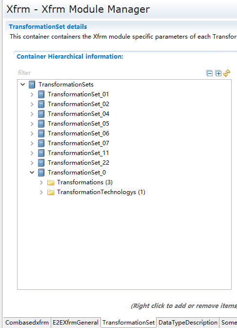
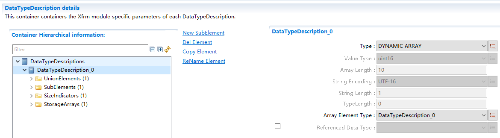
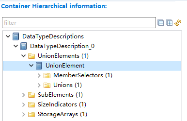
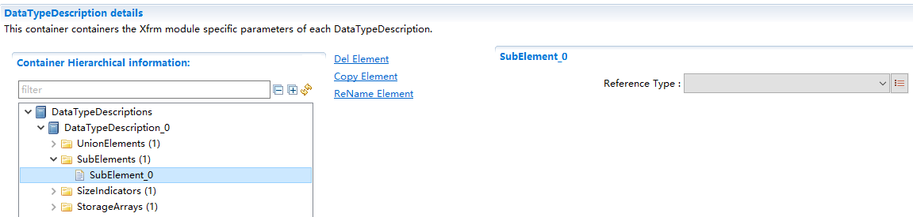
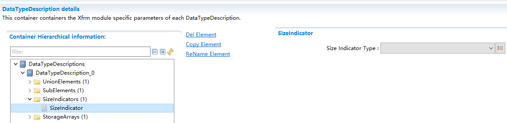
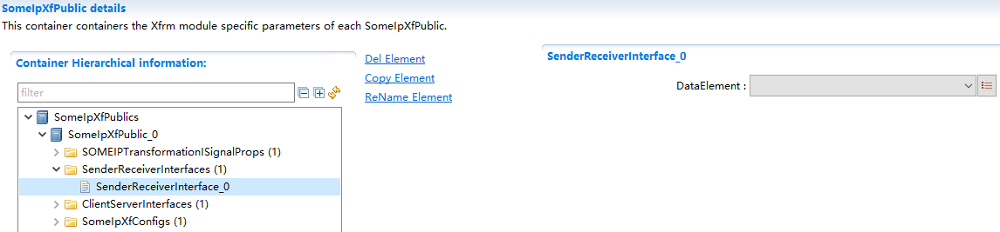
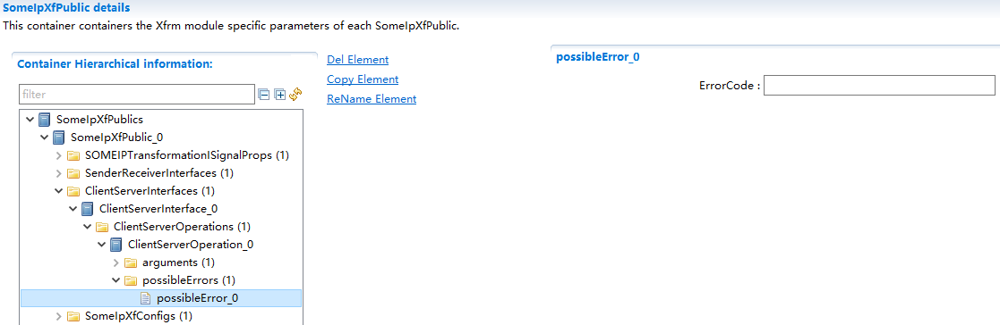

==============
SomeIpXf
==============

**缩写词注解**

+------------+---------------------------+----------------------------+
| **缩写词** | **英文全称**              | **中文解释**               |
+------------+---------------------------+----------------------------+
| SOME/IP    | Scalable service-Oriented | 基于IP                     |
|            | MiddlewarE over IP        | 的可缩放的面向服务的中间件 |
+------------+---------------------------+----------------------------+
| Service    | a logical combination of  | 由零个或多个               |
|            | zero or more methods,     | 方法，零个或多个事件，零个 |
|            | zero or more              | 或多个Field组成的逻辑组合  |
|            |                           |                            |
|            | events, and zero or more  |                            |
|            | fields (empty service is  |                            |
|            | allowed, e.g.             |                            |
|            |                           |                            |
|            | for announcing            |                            |
|            | non-SOME/IP services in   |                            |
|            | SOME/IP-SD)               |                            |
+------------+---------------------------+----------------------------+
| Request    | a message of the client   | 一条由客户端发出           |
|            | to the server invoking a  | 的用于调用服务端方法的消息 |
|            | method                    |                            |
+------------+---------------------------+----------------------------+
| Response   | a message of the server   | 一条由服                   |
|            | to the client             | 务端发送给客户端的消息，用 |
|            | transporting results of a | 于传输客户端调用方法的结果 |
|            |                           |                            |
|            | method invocation         |                            |
+------------+---------------------------+----------------------------+
| Method     | a method, procedure,      | 方法或者函数。             |
|            | function, or subroutine   |                            |
|            | that is called/invoked    |                            |
+------------+---------------------------+----------------------------+

简介
====

在发送端SOME/IP
Transformer模块对数据进行线性化处理，将数据转换为符合SOME/IP格式要求的数据。

在接收端，SOME/IP
Transformer模块将接收到的线性化的数据进行反序列化处理，将数据还原后提供给上层模块。\ |image1|

图 SOME/IP Transformer模块概要图

参考资料
--------

[1] AUTOSAR_SWS_SOMEIPTransformer.pdf，R19-11

[2] AUTOSAR_ASWS_TransformerGeneral.pdf，R19-11

功能描述
========

数据序列化功能
--------------

数据序列化功能介绍
~~~~~~~~~~~~~~~~~~

对原始数据进行序列化。

数据序列化功能实现
~~~~~~~~~~~~~~~~~~

根据配置工具中对接口（SenderReceiverInterface/
ClientServerInterface容器）和数据的描述（配置在DateTypeDescription页面中），SOME/IP
Transformer模块会生成对应的序列化函数（根据SomeIpXfConfig配置项的配置生成），用户调用该序列化函数，提供对应的参数，该序列化函数输出序列化后的数据。

数据反序列化功能
----------------

数据反序列化功能介绍
~~~~~~~~~~~~~~~~~~~~

对原始数据进行反序列化。

数据反序列化功能实现
~~~~~~~~~~~~~~~~~~~~

根据配置工具中对接口（SenderReceiverInterface/
ClientServerInterface容器）和数据的描述（配置在DateTypeDescription页面中），SOME/IP
Transformer模块会生成对应的反序列化函数（根据SomeIpXfConfig配置项的配置生成），用户调用该反序列化函数，提供对应的参数，该反序列化函数输出反序列化后的原始数据。

源文件描述
==========

表 SomeIpXf组件文件描述

+-----------------+----------------------------------------------------+
| **文件**        | **说明**                                           |
+-----------------+----------------------------------------------------+
| SomeIpXf_Cfg.h  | 定义SomeIpXf模块预编译时用到的配置参数。           |
+-----------------+----------------------------------------------------+
| SomeIpXf.c      | SomeIpXf模块源文件，包含了API函数的实现。          |
+-----------------+----------------------------------------------------+
| SomeIpXf.h      | SomeIpXf模块头                                     |
|                 | 文件，包含了API函数的声明并定义了使用的数据结构。  |
+-----------------+----------------------------------------------------+
| So              | SomeIpXf模块函数和变量存储位置定义文件。           |
| meIpXf_MemMap.h |                                                    |
+-----------------+----------------------------------------------------+

|image2|

图 SomeIpXf组件文件交互关系图

API接口
=======

类型定义
--------

SomeIpXf_ConfigType类型定义
~~~~~~~~~~~~~~~~~~~~~~~~~~~

+-----------+----------------------------------------------------------+
| 名称      | SomeIpXf_ConfigType                                      |
+-----------+----------------------------------------------------------+
| 类型      | Structure                                                |
+-----------+----------------------------------------------------------+
| 范围      | 无                                                       |
+-----------+----------------------------------------------------------+
| 描述      | SomeIpXf初始化需要用到的数据，当前实现为空。             |
+-----------+----------------------------------------------------------+

输入函数描述
------------

+----------------------------------+-----------------------------------+
| **输入模块**                     | **API**                           |
+----------------------------------+-----------------------------------+
| Det                              | Det_ReportError                   |
+----------------------------------+-----------------------------------+

静态接口函数定义
----------------

SomeIpXf\_<transformerId>函数定义(Sender/Receiver)
~~~~~~~~~~~~~~~~~~~~~~~~~~~~~~~~~~~~~~~~~~~~~~~~~~

+-------------+-------------------+---------+-------------------------+
| 函数名称：  | SomeIpXf          |         |                         |
|             | \_<transformerId> |         |                         |
+-------------+-------------------+---------+-------------------------+
| 函数原型：  | uint8             |         |                         |
|             | SomeIpXf\         |         |                         |
|             | _<transformerId>( |         |                         |
|             |                   |         |                         |
|             | uint8\* buffer,   |         |                         |
|             |                   |         |                         |
|             | uint16\*          |         |                         |
|             | bufferLength,     |         |                         |
|             |                   |         |                         |
|             | const <type>\*    |         |                         |
|             | dataElement       |         |                         |
|             |                   |         |                         |
|             | )                 |         |                         |
+-------------+-------------------+---------+-------------------------+
| 服务编号：  | 0x03              |         |                         |
+-------------+-------------------+---------+-------------------------+
| 同步/异步： | 同步              |         |                         |
+-------------+-------------------+---------+-------------------------+
| 是          | 可重入            |         |                         |
| 否可重入：  |                   |         |                         |
+-------------+-------------------+---------+-------------------------+
| 输入参数：  | dataElement       | 值域：  | 无                      |
+-------------+-------------------+---------+-------------------------+
| 输入        | 无                |         |                         |
| 输出参数：  |                   |         |                         |
+-------------+-------------------+---------+-------------------------+
| 输出参数：  | buffer            | 值域：  | 无                      |
+-------------+-------------------+---------+-------------------------+
|             | bufferLength      | 值域：  | 无                      |
+-------------+-------------------+---------+-------------------------+
| 返回值：    | uint8             | 0x00    |                         |
|             |                   | (E_OK): |                         |
|             |                   | 序列    |                         |
|             |                   | 化成功  |                         |
|             |                   |         |                         |
|             |                   | 0x81    |                         |
|             |                   | (       |                         |
|             |                   | E_SER_G |                         |
|             |                   | ENERIC  |                         |
|             |                   | _ERROR):|                         |
|             |                   | 出      |                         |
|             |                   | 现错误  |                         |
+-------------+-------------------+---------+-------------------------+
| 功能概述：  | 该函数为Sender/R  |         |                         |
|             | eceiver类型的序列 |         |                         |
|             | 化函数，它将data  |         |                         |
|             | element作为       |         |                         |
|             | 输入，输出一个ui  |         |                         |
|             | nt8类型的数组其中 |         |                         |
|             | 包含序列化后的数  |         |                         |
|             | 据。序列化后的数  |         |                         |
|             | 据长度由序列化函  |         |                         |
|             | 数计算，并输出在b |         |                         |
|             | ufferLength参数中 |         |                         |
|             | 。该值可能比输出  |         |                         |
|             | buffer的长度小。  |         |                         |
+-------------+-------------------+---------+-------------------------+

SomeIpXf\_<transformerId>函数定义(Client/Server)
~~~~~~~~~~~~~~~~~~~~~~~~~~~~~~~~~~~~~~~~~~~~~~~~

+-------------+-------------------+---------+-------------------------+
| 函数名称：  | SomeIpXf          |         |                         |
|             | \_<transformerId> |         |                         |
+-------------+-------------------+---------+-------------------------+
| 函数原型：  | uint8             |         |                         |
|             | SomeIpXf\         |         |                         |
|             | _<transformerId>( |         |                         |
|             |                   |         |                         |
|             | const             |         |                         |
|             | Rte_Cs_Transa     |         |                         |
|             | ctionHandleType\* |         |                         |
|             | T                 |         |                         |
|             | ransactionHandle, |         |                         |
|             |                   |         |                         |
|             | uint8\* buffer,   |         |                         |
|             |                   |         |                         |
|             | uint16\*          |         |                         |
|             | bufferLength,     |         |                         |
|             |                   |         |                         |
|             | [Std_ReturnType   |         |                         |
|             | returnValue,]     |         |                         |
|             |                   |         |                         |
|             | <type> data_1,    |         |                         |
|             | ...               |         |                         |
|             |                   |         |                         |
|             | <type> data_n     |         |                         |
|             |                   |         |                         |
|             | )                 |         |                         |
+-------------+-------------------+---------+-------------------------+
| 服务编号：  | 0x03              |         |                         |
+-------------+-------------------+---------+-------------------------+
| 同步/异步： | 同步              |         |                         |
+-------------+-------------------+---------+-------------------------+
| 是          | 可重入            |         |                         |
| 否可重入：  |                   |         |                         |
+-------------+-------------------+---------+-------------------------+
| 输入参数：  | TransactionHandle | 值域：  | 无                      |
+-------------+-------------------+---------+-------------------------+
|             | returnValue       | 值域：  | STD_ON / STD_OFF        |
+-------------+-------------------+---------+-------------------------+
|             | data_1            | 值域：  | 无                      |
+-------------+-------------------+---------+-------------------------+
|             | data_n            | 值域：  | 无                      |
+-------------+-------------------+---------+-------------------------+
| 输入        | NONE              |         |                         |
| 输出参数：  |                   |         |                         |
+-------------+-------------------+---------+-------------------------+
| 输出参数：  | buffer            | 值域：  | 无                      |
+-------------+-------------------+---------+-------------------------+
|             | bufferLength      | 值域：  | 无                      |
+-------------+-------------------+---------+-------------------------+
| 返回值：    | uint8             | 0x00    |                         |
|             |                   | (E_OK): |                         |
|             |                   | 序列    |                         |
|             |                   | 化成功  |                         |
|             |                   |         |                         |
|             |                   | 0x81    |                         |
|             |                   | (       |                         |
|             |                   | E_SER_G |                         |
|             |                   | ENERIC  |                         |
|             |                   | _ERROR):|                         |
|             |                   | 出      |                         |
|             |                   | 现错误  |                         |
+-------------+-------------------+---------+-------------------------+
| 功能概述：  | 该函数为Client    |         |                         |
|             | /Server类型的序列 |         |                         |
|             | 化函数，它将data  |         |                         |
|             | element作为       |         |                         |
|             | 输入，输出一个ui  |         |                         |
|             | nt8类型的数组其中 |         |                         |
|             | 包含序列化后的数  |         |                         |
|             | 据。序列化后的数  |         |                         |
|             | 据长度由序列化函  |         |                         |
|             | 数计算，并输出在b |         |                         |
|             | ufferLength参数中 |         |                         |
|             | 。该值可能比输出  |         |                         |
|             | buffer的长度小。  |         |                         |
+-------------+-------------------+---------+-------------------------+

SomeIpXf\_<transformerId>函数定义(trigger event)
~~~~~~~~~~~~~~~~~~~~~~~~~~~~~~~~~~~~~~~~~~~~~~~~

+-------------+-------------------+---------+-------------------------+
| 函数名称：  | SomeIpXf          |         |                         |
|             | \_<transformerId> |         |                         |
+-------------+-------------------+---------+-------------------------+
| 函数原型：  | uint8             |         |                         |
|             | SomeIpXf\         |         |                         |
|             | _<transformerId>( |         |                         |
|             |                   |         |                         |
|             | uint8\* buffer,   |         |                         |
|             |                   |         |                         |
|             | uint16\*          |         |                         |
|             | bufferLength      |         |                         |
|             |                   |         |                         |
|             | )                 |         |                         |
+-------------+-------------------+---------+-------------------------+
| 服务编号：  | 0x03              |         |                         |
+-------------+-------------------+---------+-------------------------+
| 同步/异步： | 同步              |         |                         |
+-------------+-------------------+---------+-------------------------+
| 是          | 可重入            |         |                         |
| 否可重入：  |                   |         |                         |
+-------------+-------------------+---------+-------------------------+
| 输入参数：  | 无                |         |                         |
+-------------+-------------------+---------+-------------------------+
| 输入        | 无                |         |                         |
| 输出参数：  |                   |         |                         |
+-------------+-------------------+---------+-------------------------+
| 输出参数：  | buffer            | 值域：  | 无                      |
+-------------+-------------------+---------+-------------------------+
|             | bufferLength      | 值域：  | 无                      |
+-------------+-------------------+---------+-------------------------+
| 返回值：    | uint8             | 0x00    |                         |
|             |                   | (E_OK): |                         |
|             |                   | 序列    |                         |
|             |                   | 化成功  |                         |
|             |                   |         |                         |
|             |                   | 0x81    |                         |
|             |                   | (       |                         |
|             |                   | E_SER_G |                         |
|             |                   | ENERIC  |                         |
|             |                   | _ERROR):|                         |
|             |                   | 出      |                         |
|             |                   | 现错误  |                         |
+-------------+-------------------+---------+-------------------------+
| 功能概述：  | 该函数为trigger   |         |                         |
|             | even              |         |                         |
|             | t类型的序列化函数 |         |                         |
|             | ，它将trigger作为 |         |                         |
|             | 输入，输出一个ui  |         |                         |
|             | nt8类型的数组其中 |         |                         |
|             | 包含序列化后的数  |         |                         |
|             | 据。序列化后的数  |         |                         |
|             | 据长度由序列化函  |         |                         |
|             | 数计算，并输出在b |         |                         |
|             | ufferLength参数中 |         |                         |
|             | 。该值可能比输出  |         |                         |
|             | buffer的长度小。  |         |                         |
+-------------+-------------------+---------+-------------------------+

SomeIpXf_Inv\_<transformerId>函数定义 (Sender/Receiver)
~~~~~~~~~~~~~~~~~~~~~~~~~~~~~~~~~~~~~~~~~~~~~~~~~~~~~~~

+-------------+------------+----------------+-------------------------+
| 函数名称：  | SomeIpXf_  |                |                         |
|             | Inv\_<tran |                |                         |
|             | sformerId> |                |                         |
+-------------+------------+----------------+-------------------------+
| 函数原型：  | uint8      |                |                         |
|             | SomeIpXf_I |                |                         |
|             | nv\_<trans |                |                         |
|             | formerId>( |                |                         |
|             |            |                |                         |
|             | const      |                |                         |
|             | uint8\*    |                |                         |
|             | buffer,    |                |                         |
|             |            |                |                         |
|             | uint16     |                |                         |
|             | buf        |                |                         |
|             | ferLength, |                |                         |
|             |            |                |                         |
|             | <type>\*   |                |                         |
|             | d          |                |                         |
|             | ataElement |                |                         |
|             |            |                |                         |
|             | )          |                |                         |
+-------------+------------+----------------+-------------------------+
| 服务编号：  | 0x04       |                |                         |
+-------------+------------+----------------+-------------------------+
| 同步/异步： | 同步       |                |                         |
+-------------+------------+----------------+-------------------------+
| 是          | 可重入     |                |                         |
| 否可重入：  |            |                |                         |
+-------------+------------+----------------+-------------------------+
| 输入参数：  | buffer     | 值域：         | 无                      |
+-------------+------------+----------------+-------------------------+
|             | bu         | 值域：         | 0 .. 65535              |
|             | fferLength |                |                         |
+-------------+------------+----------------+-------------------------+
| 输入        | 无         |                |                         |
| 输出参数：  |            |                |                         |
+-------------+------------+----------------+-------------------------+
| 输出参数：  | d          | 值域：         | 无                      |
|             | ataElement |                |                         |
+-------------+------------+----------------+-------------------------+
| 返回值：    | uint8      | 0x00 (E_OK):   |                         |
|             |            | 反序列化成功   |                         |
|             |            |                |                         |
|             |            | 0x81           |                         |
|             |            | (E_SER_G       |                         |
|             |            | ENERIC_ERROR): |                         |
|             |            | 出现一个错误   |                         |
|             |            |                |                         |
|             |            | 0x87           |                         |
|             |            | (E             |                         |
|             |            | _SER_WRONG_PROT|                         |
|             |            | OCOL_VERSION): |                         |
|             |            |                |                         |
|             |            | 接收端的版本号 |                         |
|             |            | 和发送端不匹配 |                         |
|             |            |                |                         |
|             |            | 0x88           |                         |
|             |            | (E_S           |                         |
|             |            | ER_WRONG_INTER |                         |
|             |            | FACE_VERSION): |                         |
|             |            |                |                         |
|             |            | 接口版本不支持 |                         |
|             |            |                |                         |
|             |            | 0x89           |                         |
|             |            | (E_SER_MALFO   |                         |
|             |            | RMED_MESSAGE): |                         |
|             |            |                |                         |
|             |            | 接收到         |                         |
|             |            | 的消息长度不正 |                         |
|             |            | 确，Xf无法处理 |                         |
|             |            |                |                         |
|             |            | 0x8a           |                         |
|             |            | (E_SER_WRONG   |                         |
|             |            | _MESSAGE_TYPE):|                         |
|             |            | 接收到的       |                         |
|             |            | 报文类型不正确 |                         |
+-------------+------------+----------------+-------------------------+
| 功能概述：  | Sen        |                |                         |
|             | der/Receiv |                |                         |
|             | er通信的反 |                |                         |
|             | 序列化函数 |                |                         |
|             | ，用于反序 |                |                         |
|             | 列化SOME/  |                |                         |
|             | IP。该函数 |                |                         |
|             | 接受一个包 |                |                         |
|             | 含序列化数 |                |                         |
|             | 据的uint8  |                |                         |
|             | 类型的数组 |                |                         |
|             | 作为输入， |                |                         |
|             | 输出原始数 |                |                         |
|             | 据到RTE。  |                |                         |
+-------------+------------+----------------+-------------------------+

SomeIpXf_Inv\_<transformerId>函数定义 (Client/Server)
~~~~~~~~~~~~~~~~~~~~~~~~~~~~~~~~~~~~~~~~~~~~~~~~~~~~~

+-------------+--------------+----------------+-----------------------+
| 函数名称：  | SomeI        |                |                       |
|             | pXf_Inv\_<tr |                |                       |
|             | ansformerId> |                |                       |
+-------------+--------------+----------------+-----------------------+
| 函数原型：  | uint8        |                |                       |
|             | SomeIp       |                |                       |
|             | Xf_Inv\_<tra |                |                       |
|             | nsformerId>( |                |                       |
|             |              |                |                       |
|             | Rte_Cs       |                |                       |
|             | _Transaction |                |                       |
|             | HandleType\* |                |                       |
|             | Transa       |                |                       |
|             | ctionHandle, |                |                       |
|             |              |                |                       |
|             | const        |                |                       |
|             | uint8\*      |                |                       |
|             | buffer,      |                |                       |
|             |              |                |                       |
|             | uint16       |                |                       |
|             | b            |                |                       |
|             | ufferLength, |                |                       |
|             |              |                |                       |
|             | [Std         |                |                       |
|             | _ReturnType\*|                |                       |
|             | r            |                |                       |
|             | eturnValue,] |                |                       |
|             |              |                |                       |
|             | [<type>\*    |                |                       |
|             | data_1,] ... |                |                       |
|             |              |                |                       |
|             | [<type>\*    |                |                       |
|             | data_n]      |                |                       |
|             |              |                |                       |
|             | )            |                |                       |
+-------------+--------------+----------------+-----------------------+
| 服务编号：  | 0x04         |                |                       |
+-------------+--------------+----------------+-----------------------+
| 同步/异步： | 同步         |                |                       |
+-------------+--------------+----------------+-----------------------+
| 是          | 可重入       |                |                       |
| 否可重入：  |              |                |                       |
+-------------+--------------+----------------+-----------------------+
| 输入参数：  | buffer       | 值域：         | 无                    |
+-------------+--------------+----------------+-----------------------+
|             | bufferLength | 值域：         | 0 .. 65535            |
+-------------+--------------+----------------+-----------------------+
| 输入        | 无           |                |                       |
| 输出参数：  |              |                |                       |
+-------------+--------------+----------------+-----------------------+
| 输出参数：  | Trans        | 值域：         | 无                    |
|             | actionHandle |                |                       |
+-------------+--------------+----------------+-----------------------+
|             | returnValue  | 值域：         | 无                    |
+-------------+--------------+----------------+-----------------------+
|             | data_1       | 值域：         | 无                    |
+-------------+--------------+----------------+-----------------------+
|             | data_n       | 值域：         | 无                    |
+-------------+--------------+----------------+-----------------------+
| 返回值：    | uint8        | 0x00 (E_OK):   |                       |
|             |              | 反序列化成功   |                       |
|             |              |                |                       |
|             |              | 0x81           |                       |
|             |              | (E_SER_G       |                       |
|             |              | ENERIC_ERROR): |                       |
|             |              | 出现一个错误   |                       |
|             |              |                |                       |
|             |              | 0x87           |                       |
|             |              | (E             |                       |
|             |              | _SER_WRONG_PROT|                       |
|             |              | OCOL_VERSION): |                       |
|             |              |                |                       |
|             |              | 接收端的版本号 |                       |
|             |              | 和发送端不匹配 |                       |
|             |              |                |                       |
|             |              | 0x88           |                       |
|             |              | (E_S           |                       |
|             |              | ER_WRONG_INTER |                       |
|             |              | FACE_VERSION): |                       |
|             |              |                |                       |
|             |              | 接口版本不支持 |                       |
|             |              |                |                       |
|             |              | 0x89           |                       |
|             |              | (E_SER_MALFO   |                       |
|             |              | RMED_MESSAGE): |                       |
|             |              |                |                       |
|             |              | 接收到         |                       |
|             |              | 的消息长度不正 |                       |
|             |              | 确，Xf无法处理 |                       |
|             |              |                |                       |
|             |              | 0x8a           |                       |
|             |              | (E_SER_WRONG   |                       |
|             |              | _MESSAGE_TYPE):|                       |
|             |              | 接收到的       |                       |
|             |              | 报文类型不正确 |                       |
+-------------+--------------+----------------+-----------------------+
| 功能概述：  | Client/Serv  |                |                       |
|             | er通信的反序 |                |                       |
|             | 列化函数，用 |                |                       |
|             | 于反序列化S  |                |                       |
|             | OME/IP。该函 |                |                       |
|             | 数接受一个包 |                |                       |
|             | 含序列化数据 |                |                       |
|             | 的uint8类型  |                |                       |
|             | 的数组作为输 |                |                       |
|             | 入，输出原始 |                |                       |
|             | 数据到RTE。  |                |                       |
+-------------+--------------+----------------+-----------------------+

SomeIpXf_Inv\_<transformerId>函数定义 (trigger event)
~~~~~~~~~~~~~~~~~~~~~~~~~~~~~~~~~~~~~~~~~~~~~~~~~~~~~

+-------------+--------------+----------------+-----------------------+
| 函数名称：  | SomeI        |                |                       |
|             | pXf_Inv\_<tr |                |                       |
|             | ansformerId> |                |                       |
+-------------+--------------+----------------+-----------------------+
| 函数原型：  | uint8        |                |                       |
|             | SomeIp       |                |                       |
|             | Xf_Inv\_<tra |                |                       |
|             | nsformerId>( |                |                       |
|             |              |                |                       |
|             | const        |                |                       |
|             | uint8\*      |                |                       |
|             | buffer,      |                |                       |
|             |              |                |                       |
|             | uint16       |                |                       |
|             | bufferLength |                |                       |
|             |              |                |                       |
|             | )            |                |                       |
+-------------+--------------+----------------+-----------------------+
| 服务编号：  | 0x04         |                |                       |
+-------------+--------------+----------------+-----------------------+
| 同步/异步： | 同步         |                |                       |
+-------------+--------------+----------------+-----------------------+
| 是          | 可重入       |                |                       |
| 否可重入：  |              |                |                       |
+-------------+--------------+----------------+-----------------------+
| 输入参数：  | buffer       | 值域：         | 无                    |
+-------------+--------------+----------------+-----------------------+
|             | bufferLength | 值域：         | 0 .. 65535            |
+-------------+--------------+----------------+-----------------------+
| 输入        | 无           |                |                       |
| 输出参数：  |              |                |                       |
+-------------+--------------+----------------+-----------------------+
| 输出参数：  | 无           |                |                       |
+-------------+--------------+----------------+-----------------------+
| 返回值：    | uint8        | 0x00 (E_OK):   |                       |
|             |              | 反序列化成功   |                       |
|             |              |                |                       |
|             |              | 0x81           |                       |
|             |              | (E_SER_G       |                       |
|             |              | ENERIC_ERROR): |                       |
|             |              | 出现一个错误   |                       |
|             |              |                |                       |
|             |              | 0x87           |                       |
|             |              | (E             |                       |
|             |              | _SER_WRONG_PROT|                       |
|             |              | OCOL_VERSION): |                       |
|             |              |                |                       |
|             |              | 接收端的版本号 |                       |
|             |              | 和发送端不匹配 |                       |
|             |              |                |                       |
|             |              | 0x88           |                       |
|             |              | (E_S           |                       |
|             |              | ER_WRONG_INTER |                       |
|             |              | FACE_VERSION): |                       |
|             |              |                |                       |
|             |              | 接口版本不支持 |                       |
|             |              |                |                       |
|             |              | 0x89           |                       |
|             |              | (E_SER_MALFO   |                       |
|             |              | RMED_MESSAGE): |                       |
|             |              |                |                       |
|             |              | 接收到         |                       |
|             |              | 的消息长度不正 |                       |
|             |              | 确，Xf无法处理 |                       |
|             |              |                |                       |
|             |              | 0x8a           |                       |
|             |              | (E_SER_WRONG   |                       |
|             |              | _MESSAGE_TYPE):|                       |
|             |              | 接收到的       |                       |
|             |              | 报文类型不正确 |                       |
+-------------+--------------+----------------+-----------------------+
| 功能概述：  | Trigger      |                |                       |
|             | Eve          |                |                       |
|             | nt通信的反序 |                |                       |
|             | 列化函数，用 |                |                       |
|             | 于反序列化S  |                |                       |
|             | OME/IP。该函 |                |                       |
|             | 数接受一个包 |                |                       |
|             | 含序列化数据 |                |                       |
|             | 的uint8类型  |                |                       |
|             | 的数组作为输 |                |                       |
|             | 入，输出原始 |                |                       |
|             | 数据到RTE。  |                |                       |
+-------------+--------------+----------------+-----------------------+

SomeIpXf_Init函数定义
~~~~~~~~~~~~~~~~~~~~~

+-------------+--------------+----------------+-----------------------+
| 函数名称：  | S            |                |                       |
|             | omeIpXf_Init |                |                       |
+-------------+--------------+----------------+-----------------------+
| 函数原型：  | void         |                |                       |
|             | So           |                |                       |
|             | meIpXf_Init( |                |                       |
|             |              |                |                       |
|             | const        |                |                       |
|             | SomeIpXf_    |                |                       |
|             | ConfigType\* |                |                       |
|             | config       |                |                       |
|             |              |                |                       |
|             | )            |                |                       |
+-------------+--------------+----------------+-----------------------+
| 服务编号：  | 0x01         |                |                       |
+-------------+--------------+----------------+-----------------------+
| 同步/异步： | 同步         |                |                       |
+-------------+--------------+----------------+-----------------------+
| 是          | 不可重入     |                |                       |
| 否可重入：  |              |                |                       |
+-------------+--------------+----------------+-----------------------+
| 输入参数：  | config       | 值域：         | 无                    |
+-------------+--------------+----------------+-----------------------+
| 输入        | 无           |                |                       |
| 输出参数：  |              |                |                       |
+-------------+--------------+----------------+-----------------------+
| 输出参数：  | 无           |                |                       |
+-------------+--------------+----------------+-----------------------+
| 返回值：    | 无           |                |                       |
+-------------+--------------+----------------+-----------------------+
| 功能概述：  | 初始化So     |                |                       |
|             | meIpXf模块。 |                |                       |
+-------------+--------------+----------------+-----------------------+

SomeIpXf_DeInit函数定义
~~~~~~~~~~~~~~~~~~~~~~~

+-------------+--------------------------------------------------------+
| 函数名称：  | SomeIpXf_DeInit                                        |
+-------------+--------------------------------------------------------+
| 函数原型：  | void SomeIpXf_DeInit(                                  |
|             |                                                        |
|             | void                                                   |
|             |                                                        |
|             | )                                                      |
+-------------+--------------------------------------------------------+
| 服务编号：  | 0x02                                                   |
+-------------+--------------------------------------------------------+
| 同步/异步： | 同步                                                   |
+-------------+--------------------------------------------------------+
| 是          | 不可重入                                               |
| 否可重入：  |                                                        |
+-------------+--------------------------------------------------------+
| 输入参数：  | 无                                                     |
+-------------+--------------------------------------------------------+
| 输入        | 无                                                     |
| 输出参数：  |                                                        |
+-------------+--------------------------------------------------------+
| 输出参数：  | 无                                                     |
+-------------+--------------------------------------------------------+
| 返回值：    | 无                                                     |
+-------------+--------------------------------------------------------+
| 功能概述：  | 反初始化SomeIpXf模块。                                 |
+-------------+--------------------------------------------------------+

SomeIpXf_GetVersionInfo函数定义
~~~~~~~~~~~~~~~~~~~~~~~~~~~~~~~

+-------------+------------------+---------+--------------------------+
| 函数名称：  | SomeIpX          |         |                          |
|             | f_GetVersionInfo |         |                          |
+-------------+------------------+---------+--------------------------+
| 函数原型：  | void             |         |                          |
|             | SomeIpXf         |         |                          |
|             | _GetVersionInfo( |         |                          |
|             |                  |         |                          |
|             | Std_V            |         |                          |
|             | ersionInfoType\* |         |                          |
|             | VersionInfo      |         |                          |
|             |                  |         |                          |
|             | )                |         |                          |
+-------------+------------------+---------+--------------------------+
| 服务编号：  | 0x00             |         |                          |
+-------------+------------------+---------+--------------------------+
| 同步/异步： | 同步             |         |                          |
+-------------+------------------+---------+--------------------------+
| 是          | 可重入           |         |                          |
| 否可重入：  |                  |         |                          |
+-------------+------------------+---------+--------------------------+
| 输入参数：  | 无               |         |                          |
+-------------+------------------+---------+--------------------------+
| 输入        | 无               |         |                          |
| 输出参数：  |                  |         |                          |
+-------------+------------------+---------+--------------------------+
| 输出参数：  | VersionInfo      | 值域：  | 无                       |
+-------------+------------------+---------+--------------------------+
| 返回值：    | 无               |         |                          |
+-------------+------------------+---------+--------------------------+
| 功能概述：  | 获取Some         |         |                          |
|             | IpXf模块的版本号 |         |                          |
+-------------+------------------+---------+--------------------------+

可配置函数定义
--------------

无。

配置
====

TransformationSet
-----------------

|image3|

图 TransformationSet容器配置图

表 TransformationSet容器属性描述

+--------+-----------+-----------------------+-----------+------------+
| UI名称 | 描述      |                       |           |            |
+--------+-----------+-----------------------+-----------+------------+
| Tra    | 取值范围  | 无                    | 默认取值  | 无         |
| nsform |           |                       |           |            |
| ations |           |                       |           |            |
+--------+-----------+-----------------------+-----------+------------+
|        | 参数描述  | 该容器用              |           |            |
|        |           | 于定义Transformer对象 |           |            |
+--------+-----------+-----------------------+-----------+------------+
|        | 依赖关系  | 无                    |           |            |
+--------+-----------+-----------------------+-----------+------------+
| T      | 取值范围  | 无                    | 默认取值  | 无         |
| ransfo |           |                       |           |            |
| rmatio |           |                       |           |            |
| nTechn |           |                       |           |            |
| ologys |           |                       |           |            |
+--------+-----------+-----------------------+-----------+------------+
|        | 参数描述  | 该容器用于定义Transfo |           |            |
|        |           | rmationTechnology对象 |           |            |
+--------+-----------+-----------------------+-----------+------------+
|        | 依赖关系  | 无                    |           |            |
+--------+-----------+-----------------------+-----------+------------+

Transformation
--------------

|image4|

图 Transformation对象配置图

表 Transformation对象属性描述

+--------+-----------+-----------------------+-----------+------------+
| UI名称 | 描述      |                       |           |            |
+--------+-----------+-----------------------+-----------+------------+
| T      | 取值范围  | 合法字符串            | 默认取值  | 无         |
| ransfo |           |                       |           |            |
| rmerId |           |                       |           |            |
+--------+-----------+-----------------------+-----------+------------+
|        | 参数描述  | Transf                |           |            |
|        |           | ormerId，用做序列化函 |           |            |
|        |           | 数或者反序列化函数名  |           |            |
+--------+-----------+-----------------------+-----------+------------+
|        | 依赖关系  | 无                    |           |            |
+--------+-----------+-----------------------+-----------+------------+
| T      | 取值范围  | 引用到ComXfTran       | 默认取值  | 无         |
| ransfo |           | sformer/E2Etransforme |           |            |
| rmatio |           | r/SomeIpXfTransformer |           |            |
| nChain |           |                       |           |            |
+--------+-----------+-----------------------+-----------+------------+
|        | 参数描述  | 引用到ComXfTransf     |           |            |
|        |           | ormer/E2Etransformer/ |           |            |
|        |           | SomeIpXfTransformer用 |           |            |
|        |           | 于生成TransfomerChain |           |            |
|        |           |                       |           |            |
|        |           | （单独                |           |            |
|        |           | 生成一个SomeIpXf的序  |           |            |
|        |           | 列化或者反序列化函数  |           |            |
|        |           | 也需要配置一个Transf  |           |            |
|        |           | ormerChain，在Transfo |           |            |
|        |           | rmerChain中引用到Some |           |            |
|        |           | IpXfTransformer，否则 |           |            |
|        |           | 无法生成序列化函数）  |           |            |
+--------+-----------+-----------------------+-----------+------------+
|        | 依赖关系  | 无                    |           |            |
+--------+-----------+-----------------------+-----------+------------+

TransformationTechnology
------------------------

|image5|

图 TransformationTechnology容器配置图

表 TransformationTechnology容器属性描述

+--------+-----------+-----------------------+-----------+------------+
| UI名称 | 描述      |                       |           |            |
+--------+-----------+-----------------------+-----------+------------+
| Needs  | 取值范围  | ON / OFF              | 默认取值  | OFF        |
| Origin |           |                       |           |            |
| alData |           |                       |           |            |
+--------+-----------+-----------------------+-----------+------------+
|        | 参数描述  | 表示transformer是否需 |           |            |
|        |           | 要访问SWC的原始数据。 |           |            |
+--------+-----------+-----------------------+-----------+------------+
|        | 依赖关系  | 无                    |           |            |
+--------+-----------+-----------------------+-----------+------------+
| Pr     | 取值范围  | 合法字符串            | 默认取值  | E2E        |
| otocol |           |                       |           |            |
+--------+-----------+-----------------------+-----------+------------+
|        | 参数描述  | 表示该                |           |            |
|        |           | transformer实现的协议 |           |            |
+--------+-----------+-----------------------+-----------+------------+
|        | 依赖关系  | 无                    |           |            |
+--------+-----------+-----------------------+-----------+------------+
| Tran   | 取值范围  | CUSTOM /              | 默认取值  | SAFETY     |
| sforme |           |                       |           |            |
| rClass |           | SAFETY /              |           |            |
|        |           |                       |           |            |
|        |           | SECURITY /            |           |            |
|        |           |                       |           |            |
|        |           | SERIALIZER            |           |            |
+--------+-----------+-----------------------+-----------+------------+
|        | 参数描述  | 表                    |           |            |
|        |           | 示该transformer的类型 |           |            |
+--------+-----------+-----------------------+-----------+------------+
|        | 依赖关系  | 无                    |           |            |
+--------+-----------+-----------------------+-----------+------------+
| V      | 取值范围  | Int                   | 默认取值  | 1          |
| ersion |           |                       |           |            |
+--------+-----------+-----------------------+-----------+------------+
|        | 参数描述  | 实现的协议版本号      |           |            |
+--------+-----------+-----------------------+-----------+------------+
|        | 依赖关系  | 无                    |           |            |
+--------+-----------+-----------------------+-----------+------------+
| S      | 取值范围  | 无                    | 默认取值  | 无         |
| OMEIPT |           |                       |           |            |
| ransfo |           |                       |           |            |
| rmatio |           |                       |           |            |
| nDescr |           |                       |           |            |
| iption |           |                       |           |            |
+--------+-----------+-----------------------+-----------+------------+
|        | 参数描述  | 该容器定义和          |           |            |
|        |           | transformer相关的属性 |           |            |
+--------+-----------+-----------------------+-----------+------------+
|        | 依赖关系  | 无                    |           |            |
+--------+-----------+-----------------------+-----------+------------+

SOMEIPTransformationDescription
-------------------------------

|image6|

图 SOMEIPTransformationDescription容器配置图

表 SOMEIPTransformationDescription容器属性描述

+--------+-----------+-----------------------+-----------+------------+
| UI名称 | 描述      |                       |           |            |
+--------+-----------+-----------------------+-----------+------------+
| ali    | 取值范围  | 1 .. 65535            | 默认取值  | 无         |
| gnment |           |                       |           |            |
+--------+-----------+-----------------------+-----------+------------+
|        | 参数描述  | 表示动态长            |           |            |
|        |           | 度的数据的对其字节数  |           |            |
+--------+-----------+-----------------------+-----------+------------+
|        | 依赖关系  | 无                    |           |            |
+--------+-----------+-----------------------+-----------+------------+
| byt    | 取值范围  | mos                   | 默认取值  | most       |
| eOrder |           | tSignificantByteFirst |           | Significan |
|        |           | /                     |           | tByteFirst |
|        |           | mo                    |           |            |
|        |           | stSignificantByteLast |           |            |
|        |           |                       |           |            |
|        |           | /opaque               |           |            |
+--------+-----------+-----------------------+-----------+------------+
|        | 参数描述  | 表                    |           |            |
|        |           | 示transformer的字节序 |           |            |
+--------+-----------+-----------------------+-----------+------------+
|        | 依赖关系  | 无                    |           |            |
+--------+-----------+-----------------------+-----------+------------+
| inte   | 取值范围  | 1 .. 65535            | 默认取值  | 无         |
| rfaceV |           |                       |           |            |
| ersion |           |                       |           |            |
+--------+-----------+-----------------------+-----------+------------+
|        | 参数描述  | 版本号                |           |            |
+--------+-----------+-----------------------+-----------+------------+
|        | 依赖关系  | 无                    |           |            |
+--------+-----------+-----------------------+-----------+------------+

DataTypeDescription
-------------------

|image7|

图 DataTypeDescription容器配置图

表 DataTypeDescription容器属性描述

+--------+-----------+-----------------------+-----------+------------+
| UI名称 | 描述      |                       |           |            |
+--------+-----------+-----------------------+-----------+------------+
| Type   | 取值范围  | VALUE（基本类型）     | 默认取值  | 无         |
|        |           |                       |           |            |
|        |           | ARRAY （定长数组）    |           |            |
|        |           |                       |           |            |
|        |           | DYNAMIC ARRAY         |           |            |
|        |           | （动态长度数组）      |           |            |
|        |           |                       |           |            |
|        |           | STRING （定长字符串） |           |            |
|        |           |                       |           |            |
|        |           | DYNAMIC STRING        |           |            |
|        |           | （动态长度字符串）    |           |            |
|        |           |                       |           |            |
|        |           | STRUCT （结构体）     |           |            |
|        |           |                       |           |            |
|        |           | UNION （联合体）      |           |            |
+--------+-----------+-----------------------+-----------+------------+
|        | 参数描述  | 定                    |           |            |
|        |           | 义所描述的数据的类型  |           |            |
+--------+-----------+-----------------------+-----------+------------+
|        | 依赖关系  | 1.                    |           |            |
|        |           | Type参数设置为DYNAMIC |           |            |
|        |           | STRING和DYNAMIC       |           |            |
|        |           | ARRAY时，St           |           |            |
|        |           | orageArrays容器中必须 |           |            |
|        |           | 配置StorageArray对象  |           |            |
|        |           |                       |           |            |
|        |           | 2. Type               |           |            |
|        |           | 参数设置为UNION时，Un |           |            |
|        |           | ionElements容器中必须 |           |            |
|        |           | 配置UnionElement对象  |           |            |
|        |           |                       |           |            |
|        |           | 3. T                  |           |            |
|        |           | ype参数设置为STRUCT时 |           |            |
|        |           | ，SubElements容器中必 |           |            |
|        |           | 须配置SubElement对象  |           |            |
+--------+-----------+-----------------------+-----------+------------+
| Val    | 取值范围  | boolean               | 默认取值  | 无         |
| ueType |           |                       |           |            |
|        |           | uint8                 |           |            |
|        |           |                       |           |            |
|        |           | uint16                |           |            |
|        |           |                       |           |            |
|        |           | uint32                |           |            |
|        |           |                       |           |            |
|        |           | uint64                |           |            |
|        |           |                       |           |            |
|        |           | sint8                 |           |            |
|        |           |                       |           |            |
|        |           | sint16                |           |            |
|        |           |                       |           |            |
|        |           | sint32                |           |            |
|        |           |                       |           |            |
|        |           | sint64                |           |            |
|        |           |                       |           |            |
|        |           | float32               |           |            |
+--------+-----------+-----------------------+-----------+------------+
|        | 参数描述  | 表示所定义            |           |            |
|        |           | 的基本数据类型的类型  |           |            |
+--------+-----------+-----------------------+-----------+------------+
|        | 依赖关系  | 仅在                  |           |            |
|        |           | Type=Value时可以配置  |           |            |
+--------+-----------+-----------------------+-----------+------------+
| Array  | 取值范围  | 1 .. 65535            | 默认取值  | 无         |
| Length |           |                       |           |            |
+--------+-----------+-----------------------+-----------+------------+
|        | 参数描述  | 表示数组的长度        |           |            |
+--------+-----------+-----------------------+-----------+------------+
|        | 依赖关系  | 仅在                  |           |            |
|        |           | Type=Array时可以配置  |           |            |
+--------+-----------+-----------------------+-----------+------------+
| St     | 取值范围  | UTF-8 / UTF-16        | 默认取值  | UTF-8      |
| ringEn |           |                       |           |            |
| coding |           |                       |           |            |
+--------+-----------+-----------------------+-----------+------------+
|        | 参数描述  | 表示字符串的编码方式  |           |            |
+--------+-----------+-----------------------+-----------+------------+
|        | 依赖关系  | 仅在Type=STRING /     |           |            |
|        |           | DYNAMIC               |           |            |
|        |           | ARRAY时可以配置       |           |            |
+--------+-----------+-----------------------+-----------+------------+
| String | 取值范围  | 1 .. 65535            | 默认取值  | 无         |
| Length |           |                       |           |            |
+--------+-----------+-----------------------+-----------+------------+
|        | 参数描述  | 表示字符串的长度      |           |            |
+--------+-----------+-----------------------+-----------+------------+
|        | 依赖关系  | 仅在                  |           |            |
|        |           | Type=STRING时可以配置 |           |            |
+--------+-----------+-----------------------+-----------+------------+
| Type   | 取值范围  | 0 .. 8                | 默认取值  | 0          |
| Length |           |                       |           |            |
+--------+-----------+-----------------------+-----------+------------+
|        | 参数描述  | 静态类型的数          |           |            |
|        |           | 据类型长度，自动计算  |           |            |
+--------+-----------+-----------------------+-----------+------------+
|        | 依赖关系  | 当                    |           |            |
|        |           | Type=VALUE，根据Value |           |            |
|        |           | Type的值会计算；      |           |            |
|        |           |                       |           |            |
|        |           | 当Type=STRING，根据   |           |            |
|        |           | StringEncoding值计算  |           |            |
+--------+-----------+-----------------------+-----------+------------+
| Arra   | 取值范围  | 引用                  | 默认取值  | 无         |
| yEleme |           | 到DataTypeDescription |           |            |
| ntType |           |                       |           |            |
+--------+-----------+-----------------------+-----------+------------+
|        | 参数描述  | 表示数组成员的类型    |           |            |
+--------+-----------+-----------------------+-----------+------------+
|        | 依赖关系  | 仅在                  |           |            |
|        |           | Type=Array时可以配置  |           |            |
+--------+-----------+-----------------------+-----------+------------+
| Refere | 取值范围  | 引用                  | 默认取值  | 无         |
| ncedDa |           | 到DataTypeDescription |           |            |
| taType |           |                       |           |            |
+--------+-----------+-----------------------+-----------+------------+
|        | 参数描述  | 表示是哪种类型的指针  |           |            |
+--------+-----------+-----------------------+-----------+------------+
|        | 依赖关系  | 仅在Type=DATA         |           |            |
|        |           | REFERENCE时可以配置   |           |            |
+--------+-----------+-----------------------+-----------+------------+
| SubEl  | 取值范围  | 无                    | 默认取值  | 无         |
| ements |           |                       |           |            |
+--------+-----------+-----------------------+-----------+------------+
|        | 参数描述  | 表示结构体的子成员    |           |            |
+--------+-----------+-----------------------+-----------+------------+
|        | 依赖关系  | 仅在                  |           |            |
|        |           | Type=STRUCT时可以配置 |           |            |
+--------+-----------+-----------------------+-----------+------------+
| Si     | 取值范围  | 无                    | 默认取值  | 无         |
| zeIndi |           |                       |           |            |
| cators |           |                       |           |            |
+--------+-----------+-----------------------+-----------+------------+
|        | 参数描述  | 动                    |           |            |
|        |           | 态长度数组或动态长度  |           |            |
|        |           | 字符串表示长度的变量  |           |            |
+--------+-----------+-----------------------+-----------+------------+
|        | 依赖关系  | 仅在Type=DYNAMIC      |           |            |
|        |           | ARRAY / DYNAMIC       |           |            |
|        |           | STRING时可以配置      |           |            |
+--------+-----------+-----------------------+-----------+------------+
| S      | 取值范围  | 无                    | 默认取值  | 无         |
| torage |           |                       |           |            |
| Arrays |           |                       |           |            |
+--------+-----------+-----------------------+-----------+------------+
|        | 参数描述  | 动                    |           |            |
|        |           | 态长度数组或动态长度  |           |            |
|        |           | 字符串存储数据的数组  |           |            |
+--------+-----------+-----------------------+-----------+------------+
|        | 依赖关系  | 仅在Type=DYNAMIC      |           |            |
|        |           | ARRAY / DYNAMIC       |           |            |
|        |           | STRING时可以配置      |           |            |
+--------+-----------+-----------------------+-----------+------------+

UnionElement
------------

|image8|

图 UnionElement容器配置图

表 UnionElement容器属性描述

+--------+-----------+-----------------------+-----------+------------+
| UI名称 | 描述      |                       |           |            |
+--------+-----------+-----------------------+-----------+------------+
| UnionE | 取值范围  | 无                    | 默认取值  | 无         |
| lement |           |                       |           |            |
+--------+-----------+-----------------------+-----------+------------+
|        | 参数描述  | 表示联合体            |           |            |
+--------+-----------+-----------------------+-----------+------------+
|        | 依赖关系  | 无                    |           |            |
+--------+-----------+-----------------------+-----------+------------+

MemberSelector
--------------

|image9|

图 MemberSelector容器配置图

表 MemberSelector容器属性描述

+--------+-----------+-----------------------+-----------+------------+
| UI名称 | 描述      |                       |           |            |
+--------+-----------+-----------------------+-----------+------------+
| Member | 取值范围  | uint8/uint16/uint32   | 默认取值  | 无         |
| Select |           |                       |           |            |
| orType |           |                       |           |            |
+--------+-----------+-----------------------+-----------+------------+
|        | 参数描述  | 表示共用体的Mem       |           |            |
|        |           | berSelector的数据类型 |           |            |
+--------+-----------+-----------------------+-----------+------------+
|        | 依赖关系  | 无                    |           |            |
+--------+-----------+-----------------------+-----------+------------+

UnionMember
-----------

|image10|

图 UnionMember容器配置图

表 UnionMember容器属性描述

+--------+-----------+-----------------------+-----------+------------+
| UI名称 | 描述      |                       |           |            |
+--------+-----------+-----------------------+-----------+------------+
| Union  | 取值范围  | DataTypeDe            | 默认取值  | 无         |
| Member |           | scription中定义的类型 |           |            |
+--------+-----------+-----------------------+-----------+------------+
|        | 参数描述  | 表示联合体中的各成员  |           |            |
+--------+-----------+-----------------------+-----------+------------+
|        | 依赖关系  | 无                    |           |            |
+--------+-----------+-----------------------+-----------+------------+

SubElement
----------

|image11|

图 SubElement容器配置图

表 SubElement容器属性描述

+--------+-----------+-----------------------+-----------+------------+
| UI名称 | 描述      |                       |           |            |
+--------+-----------+-----------------------+-----------+------------+
| R      | 取值范围  | 引用                  | 默认取值  | 无         |
| eferen |           | 到DataTypeDescription |           |            |
| ceType |           |                       |           |            |
+--------+-----------+-----------------------+-----------+------------+
|        | 参数描述  | 表示结构体成员的类型  |           |            |
+--------+-----------+-----------------------+-----------+------------+
|        | 依赖关系  | 无                    |           |            |
+--------+-----------+-----------------------+-----------+------------+

SizeIndicator
-------------

|image12|

图 SizeIndicator容器配置图

表 SizeIndicator容器属性描述

+--------+-----------+-----------------------+-----------+------------+
| UI名称 | 描述      |                       |           |            |
+--------+-----------+-----------------------+-----------+------------+
| R      | 取值范围  | uint8 / uint16 /      | 默认取值  | uint8      |
| eferen |           | uint32                |           |            |
| ceType |           |                       |           |            |
+--------+-----------+-----------------------+-----------+------------+
|        | 参数描述  | 表示存储动态长        |           |            |
|        |           | 度数组或动态长度字符  |           |            |
|        |           | 串的长度的变量的类型  |           |            |
+--------+-----------+-----------------------+-----------+------------+
|        | 依赖关系  | 无                    |           |            |
+--------+-----------+-----------------------+-----------+------------+

StorageArray
------------

|image13|

图 StorageArray容器配置图

表 StorageArray容器属性描述

+--------+-----------+-----------------------+-----------+------------+
| UI名称 | 描述      |                       |           |            |
+--------+-----------+-----------------------+-----------+------------+
| Ar     | 取值范围  | 1 .. 65535            | 默认取值  | 无         |
| rayMax |           |                       |           |            |
| Length |           |                       |           |            |
+--------+-----------+-----------------------+-----------+------------+
|        | 参数描述  | 表示存储动态          |           |            |
|        |           | 长度数组或动态长度字  |           |            |
|        |           | 符串的数组的最大长度  |           |            |
+--------+-----------+-----------------------+-----------+------------+
|        | 依赖关系  | 无                    |           |            |
+--------+-----------+-----------------------+-----------+------------+

SOMEIPTransformationISignalProps
--------------------------------

|image14|

图 SOMEIPTransformationISignalProp容器配置图

表 SOMEIPTransformationISignalProp容器属性描述

+--------+-----------+-----------------------+-----------+------------+
| UI名称 | 描述      |                       |           |            |
+--------+-----------+-----------------------+-----------+------------+
| Inte   | 取值范围  | 0 .. 65535            | 默认取值  | 无         |
| rfaceV |           |                       |           |            |
| ersion |           |                       |           |            |
+--------+-----------+-----------------------+-----------+------------+
|        | 参数描述  | 方法的版本号          |           |            |
+--------+-----------+-----------------------+-----------+------------+
|        | 依赖关系  | 无                    |           |            |
+--------+-----------+-----------------------+-----------+------------+
| Messa  | 取值范围  | Error / Notification  | 默认取值  | 无         |
| geType |           | / Request /           |           |            |
|        |           | RequestNoReturn /     |           |            |
|        |           | Response              |           |            |
+--------+-----------+-----------------------+-----------+------------+
|        | 参数描述  | 表                    |           |            |
|        |           | 示Header中的消息类型  |           |            |
+--------+-----------+-----------------------+-----------+------------+
|        | 依赖关系  | 无                    |           |            |
+--------+-----------+-----------------------+-----------+------------+
| Sessi  | 取值范围  | SessionHandlingActive | 默认取值  | 无         |
| onHand |           | /                     |           |            |
| lingSR |           | Se                    |           |            |
|        |           | ssionHandlingInactive |           |            |
+--------+-----------+-----------------------+-----------+------------+
|        | 参数描述  | 表示Sender/Receiver通 |           |            |
|        |           | 信中的session控制方式 |           |            |
+--------+-----------+-----------------------+-----------+------------+
|        | 依赖关系  | 无                    |           |            |
+--------+-----------+-----------------------+-----------+------------+
| SizeO  | 取值范围  | 0 .. 65535            | 默认取值  | 无         |
| fArray |           |                       |           |            |
| Length |           |                       |           |            |
| Fields |           |                       |           |            |
+--------+-----------+-----------------------+-----------+------------+
|        | 参数描述  | 固定长度数组的Le      |           |            |
|        |           | ngthField占用的字节数 |           |            |
+--------+-----------+-----------------------+-----------+------------+
|        | 依赖关系  | 无                    |           |            |
+--------+-----------+-----------------------+-----------+------------+
| SizeOf | 取值范围  | 0 .. 65535            | 默认取值  | 无         |
| Struct |           |                       |           |            |
| Length |           |                       |           |            |
| Fields |           |                       |           |            |
+--------+-----------+-----------------------+-----------+------------+
|        | 参数描述  | 结构体的Le            |           |            |
|        |           | ngthField占用的字节数 |           |            |
+--------+-----------+-----------------------+-----------+------------+
|        | 依赖关系  | 无                    |           |            |
+--------+-----------+-----------------------+-----------+------------+
| SizeO  | 取值范围  | 0 .. 65535            | 默认取值  | 无         |
| fUnion |           |                       |           |            |
| Length |           |                       |           |            |
| Fields |           |                       |           |            |
+--------+-----------+-----------------------+-----------+------------+
|        | 参数描述  | 共用体的Le            |           |            |
|        |           | ngthField占用的字节数 |           |            |
+--------+-----------+-----------------------+-----------+------------+
|        | 依赖关系  | 无                    |           |            |
+--------+-----------+-----------------------+-----------+------------+

SenderReceiverInterface
-----------------------

|image15|

图 SenderReceiverInterface容器配置图

表 SenderReceiverInterface容器属性描述

+--------+-----------+-----------------------+-----------+------------+
| UI名称 | 描述      |                       |           |            |
+--------+-----------+-----------------------+-----------+------------+
| DataE  | 取值范围  | Reference             | 默认取值  | 无         |
| lement |           | DataTypeDescription   |           |            |
+--------+-----------+-----------------------+-----------+------------+
|        | 参数描述  | Se                    |           |            |
|        |           | nderReceiverInterface |           |            |
|        |           | 中的dataElement的类型 |           |            |
+--------+-----------+-----------------------+-----------+------------+
|        | 依赖关系  | 无                    |           |            |
+--------+-----------+-----------------------+-----------+------------+

ClientServerInterface
---------------------

|image16|

图 SenderReceiverInterface容器配置图

表 SenderReceiverInterface容器属性描述

+--------+-----------+-----------------------+-----------+------------+
| UI名称 | 描述      |                       |           |            |
+--------+-----------+-----------------------+-----------+------------+
| Cli    | 取值范围  | 无                    | 默认取值  | 无         |
| entSer |           |                       |           |            |
| verOpe |           |                       |           |            |
| ration |           |                       |           |            |
+--------+-----------+-----------------------+-----------+------------+
|        | 参数描述  | 表示一个ClientServerI |           |            |
|        |           | nterface中的Operation |           |            |
+--------+-----------+-----------------------+-----------+------------+
|        | 依赖关系  | 无                    |           |            |
+--------+-----------+-----------------------+-----------+------------+

ClientServerOperation
---------------------

|image17|

图 ClientServerOperation容器配置图

表 ClientServerOperation容器属性描述

+--------+-----------+-----------------------+-----------+------------+
| UI名称 | 描述      |                       |           |            |
+--------+-----------+-----------------------+-----------+------------+
| arg    | 取值范围  | 无                    | 默认取值  | 无         |
| uments |           |                       |           |            |
+--------+-----------+-----------------------+-----------+------------+
|        | 参数描述  | ClientSe              |           |            |
|        |           | rverOperation中的参数 |           |            |
+--------+-----------+-----------------------+-----------+------------+
|        | 依赖关系  | 无                    |           |            |
+--------+-----------+-----------------------+-----------+------------+
| po     | 取值范围  | 无                    | 默认取值  | 无         |
| ssible |           |                       |           |            |
| Errors |           |                       |           |            |
+--------+-----------+-----------------------+-----------+------------+
|        | 参数描述  | ClientServer          |           |            |
|        |           | Operation中可能的错误 |           |            |
+--------+-----------+-----------------------+-----------+------------+
|        | 依赖关系  | 无                    |           |            |
+--------+-----------+-----------------------+-----------+------------+

Arguments
---------

|image18|

图 ClientServerOperation容器配置图

表 ClientServerOperation容器属性描述

+--------+-----------+-----------------------+-----------+------------+
| UI名称 | 描述      |                       |           |            |
+--------+-----------+-----------------------+-----------+------------+
| Dir    | 取值范围  | IN / INOUT / OUT      | 默认取值  | 无         |
| ection |           |                       |           |            |
+--------+-----------+-----------------------+-----------+------------+
|        | 参数描述  | 定                    |           |            |
|        |           | 义参数的输入输出方向  |           |            |
+--------+-----------+-----------------------+-----------+------------+
|        | 依赖关系  | 无                    |           |            |
+--------+-----------+-----------------------+-----------+------------+
| Type   | 取值范围  | Reference             | 默认取值  | 无         |
|        |           | DataTypeDescription   |           |            |
+--------+-----------+-----------------------+-----------+------------+
|        | 参数描述  | 定义参数的类型.       |           |            |
+--------+-----------+-----------------------+-----------+------------+
|        | 依赖关系  | 无                    |           |            |
+--------+-----------+-----------------------+-----------+------------+

PossibleErrors
--------------

|image19|

图 possibleError容器配置图

表 possibleError容器属性描述

+--------+-----------+-----------------------+-----------+------------+
| UI名称 | 描述      |                       |           |            |
+--------+-----------+-----------------------+-----------+------------+
| Err    | 取值范围  | 0 .. 65535            | 默认取值  | 无         |
| orCode |           |                       |           |            |
+--------+-----------+-----------------------+-----------+------------+
|        | 参数描述  | 定义可能出现的错误。  |           |            |
+--------+-----------+-----------------------+-----------+------------+
|        | 依赖关系  | 无                    |           |            |
+--------+-----------+-----------------------+-----------+------------+

SomeIpXfConfig
--------------

|Dingtalk_20240808172129|

图 SomeIpXfConfig容器配置图

表 SomeIpXfConfig容器属性描述

+--------+-----------+-----------------------+-----------+------------+
| UI名称 | 描述      |                       |           |            |
+--------+-----------+-----------------------+-----------+------------+
| S      | 取值范围  | Client / Server       | 默认取值  | 无         |
| ervice |           |                       |           |            |
| Type   |           |                       |           |            |
+--------+-----------+-----------------------+-----------+------------+
|        | 参数描述  | 表示SOMEIP            |           |            |
|        |           | Tr                    |           |            |
|        |           | ansformer需要处理的对 |           |            |
|        |           | 象是Client还是Server  |           |            |
+--------+-----------+-----------------------+-----------+------------+
|        | 依赖关系  | 无                    |           |            |
+--------+-----------+-----------------------+-----------+------------+
| C      | 取值范围  | Client-Server /       | 默认取值  | 无         |
| ommuni |           | Sender-Receiver /     |           |            |
| cation |           | Trigger               |           |            |
| Type   |           |                       |           |            |
+--------+-----------+-----------------------+-----------+------------+
|        | 参数描述  | 表示SOMEIP            |           |            |
|        |           | Transformer需要       |           |            |
|        |           | 处理的对象的通信方式  |           |            |
+--------+-----------+-----------------------+-----------+------------+
|        | 依赖关系  | 无                    |           |            |
+--------+-----------+-----------------------+-----------+------------+
| Dir    | 取值范围  | RECEIVE / SEND        | 默认取值  | 无         |
| ection |           |                       |           |            |
+--------+-----------+-----------------------+-----------+------------+
|        | 参数描述  | 指示发送方向          |           |            |
+--------+-----------+-----------------------+-----------+------------+
|        | 依赖关系  | 无                    |           |            |
+--------+-----------+-----------------------+-----------+------------+
| csE    | 取值范围  | autonomous /          | 默认取值  | 无         |
| rrorRe |           | applicationOnly       |           |            |
| action |           |                       |           |            |
+--------+-----------+-----------------------+-----------+------------+
|        | 参数描述  | 指示错误处理方式      |           |            |
+--------+-----------+-----------------------+-----------+------------+
|        | 依赖关系  | 无                    |           |            |
+--------+-----------+-----------------------+-----------+------------+
| SOMEI  | 取值范围  | 引用到本              | 默认取值  | 无         |
| PTrans |           | 模块定义的SOMEIPTran  |           |            |
| format |           | sformationISignalProp |           |            |
| ionISi |           |                       |           |            |
| gnalPr |           |                       |           |            |
| opsRef |           |                       |           |            |
+--------+-----------+-----------------------+-----------+------------+
|        | 参数描述  | 引用到SOMEIPTran      |           |            |
|        |           | sformationISignalProp |           |            |
+--------+-----------+-----------------------+-----------+------------+
|        | 依赖关系  | 无                    |           |            |
+--------+-----------+-----------------------+-----------+------------+
| Client | 取值范围  | 引用到本模块定义的    | 默认取值  | 无         |
| Server |           | ClientServerInterface |           |            |
| Interf |           |                       |           |            |
| aceRef |           |                       |           |            |
+--------+-----------+-----------------------+-----------+------------+
|        | 参数描述  | 引用到                |           |            |
|        |           | ClientServerInterface |           |            |
+--------+-----------+-----------------------+-----------+------------+
|        | 依赖关系  | Communication Type =  |           |            |
|        |           | Client-Server时可配置 |           |            |
+--------+-----------+-----------------------+-----------+------------+
| Se     | 取值范围  | 引用到本模块定义的Se  | 默认取值  | 无         |
| nderRe |           | nderReceiverInterface |           |            |
| ceiver |           |                       |           |            |
| Interf |           |                       |           |            |
| aceRef |           |                       |           |            |
+--------+-----------+-----------------------+-----------+------------+
|        | 参数描述  | 引用到Se              |           |            |
|        |           | nderReceiverInterface |           |            |
+--------+-----------+-----------------------+-----------+------------+
|        | 依赖关系  | Communication Type =  |           |            |
|        |           | Se                    |           |            |
|        |           | nder-Receiver时可配置 |           |            |
+--------+-----------+-----------------------+-----------+------------+
| X      | 取值范围  | 引用                  | 默认取值  | 无         |
| frmTra |           | 到Xfrm模块中定义的Tra |           |            |
| nsform |           | nsformationTechnology |           |            |
| ationT |           |                       |           |            |
| echnol |           |                       |           |            |
| ogyRef |           |                       |           |            |
+--------+-----------+-----------------------+-----------+------------+
|        | 参数描述  | 引用到Tra             |           |            |
|        |           | nsformationTechnology |           |            |
+--------+-----------+-----------------------+-----------+------------+
|        | 依赖关系  | TransformationTech    |           |            |
|        |           | nology->Protocol为SOM |           |            |
|        |           | EIP时可在下拉框中选择 |           |            |
+--------+-----------+-----------------------+-----------+------------+

.. |image2| image:: ../../_static/参考手册/SomeIpXf/image2.png
   :width: 5.625in
   :height: 3.10208in

.. |image4| image:: ../../_static/参考手册/SomeIpXf/image4.png
   :width: 5.64513in
   :height: 2.83298in
.. |image5| image:: ../../_static/参考手册/SomeIpXf/image5.png
   :width: 5.57222in
   :height: 1.51023in
.. |image6| image:: ../../_static/参考手册/SomeIpXf/image6.png
   :width: 5.76736in
   :height: 1.55278in

.. |image9| image:: ../../_static/参考手册/SomeIpXf/image9.png
   :width: 5.76736in
   :height: 1.61875in

.. |image14| image:: ../../_static/参考手册/SomeIpXf/image14.png
   :width: 5.76736in
   :height: 1.39583in

.. |image16| image:: ../../_static/参考手册/SomeIpXf/image16.png
   :width: 5.42641in
   :height: 2.47886in
.. |image17| image:: ../../_static/参考手册/SomeIpXf/image17.png
   :width: 5.40557in
   :height: 3.65579in
.. |image18| image:: ../../_static/参考手册/SomeIpXf/image18.png
   :width: 5.76736in
   :height: 1.83194in

.. |Dingtalk_20240808172129| image:: ../../_static/参考手册/SomeIpXf/image20.jpeg
   :width: 5.75417in
   :height: 1.90139in
