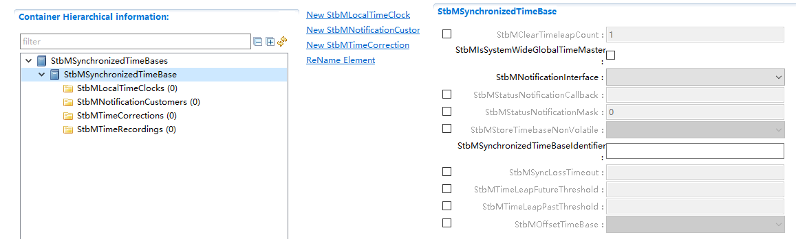
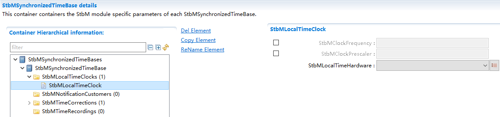
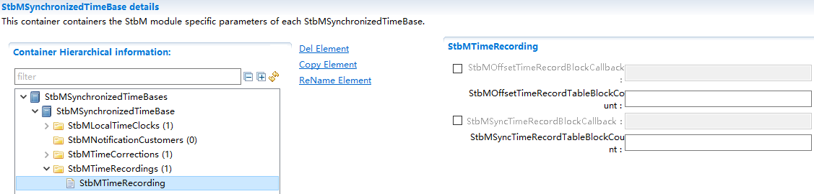
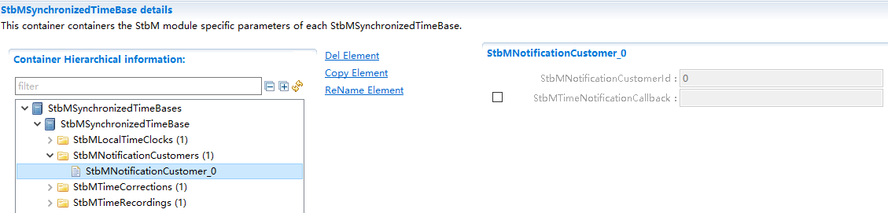

==============
StbM
==============

**缩写词注解**

+------------+----------------------------+---------------------------+
| **缩略语** | **英文全名**               | **中文解释**              |
+============+============================+===========================+
| StbM       | S                          | 同步时基管理              |
|            | ynchronizedTimeBaseManager |                           |
+------------+----------------------------+---------------------------+
| <Bus>TSyn  | A bus specific Time        | 总线特                    |
|            | Synchronization Provider   | 定的时间同步提供程序模块  |
|            | module                     |                           |
+------------+----------------------------+---------------------------+
| CAN        | Controller Area Network    | 控制器区域网络            |
+------------+----------------------------+---------------------------+
| ETH        | Ethernet                   | 以太网                    |
+------------+----------------------------+---------------------------+
| CanTSyn    | Time Synchronization       | CAN提供的时间同步程序模块 |
|            | Provider module for CAN    |                           |
+------------+----------------------------+---------------------------+
| EthTSyn    | Time Synchronization       | Eth提供的时间同步程序模块 |
|            | Provider module for        |                           |
|            | Ethernet                   |                           |
+------------+----------------------------+---------------------------+

简介
====

StbM在AutoSAR中软件层级架构如下图，其属于时间同步栈。

|image1|

图 StbM在Autosar中软件架构图

本文中描述StbM，StbM负责管理时基，给CanTSyn,
EthTSyn提供接口用来更新同步时间，给其他用户提供接口用来获取/通知同步时间。

参考资料
--------

[1] AUTOSAR_SWS_TimeSyncOverCAN.pdf，R19-11

[2] AUTOSAR_SWS_SynchronizedTimeBaseManager.pdf，R19-11

[3] AUTOSAR_EXP_LayeredSoftwareArchitecture.pdf，R19-11

[4] AUTOSAR_SWS_TimeSyncOverEthernet.pdf，R19-11

功能描述
========

StbM功能
--------

StbM功能介绍
~~~~~~~~~~~~

StbM的主要功能包括两个方面，一是使上层应用间的时间可以同步，二是提供绝对时间值。

由于不同的硬件时钟，速率可能会有偏差，这将会导致使用不同硬件时钟的应用，各自的时间会有偏差，为了消除这种偏差，StbM会将一个主节点的时间基作为全局的时间基，并将所有其他节点的时间同步到这一节点，以达成时间同步的目的。

另外，StbM还包括定时器功能和时间记录功能，定时器功能可以在时间到达用户配置的时间值或时间值来通知用户，时间记录为记录每一次时间的更新，供用户获取。

StbM功能实现
~~~~~~~~~~~~

StbM管理一个主时间组，这个主时基组用来作为其他从节点时间同步的基准，主时间组由TG和TV组成，TG是全局时间，TV是虚拟本地时间，TG的来源为总线同步模块设置的时间和当前的TV通过时间校正计算而得出的时间，TV的来源是本地的硬件时钟，包括GPT,OS和EthTSyn三种。

时间校正计算包括偏移校正和速率校正，偏移校正包括跳跃校正和速率适应。

速率校正，在单位时间不停计算时间差，以得出不同时钟间的速率偏差。

偏移校正是根据本地的时间，速率的偏差以及接受到的时间计算得出的时间来覆盖主时间组。表示成公式为TL
= TGSync + (TV - TVSync) \* r。

其中的跳跃校正为当StbM接收到时间值时，主时间组的值直接更新为接收到的时间。即速率适应的偏移校正，则是在一段时间内逐渐校正调整偏移值。

绝对时间值即为同步时基的时间加上偏移时基的时间即为绝对时间值。

源文件描述
==========

表 StbM组件文件描述

+---------------------+------------------------------------------------+
| **文件**            | **说明**                                       |
+---------------------+------------------------------------------------+
| StbM.c              | StbM模块源文件，包含了API函数的实现。          |
+---------------------+------------------------------------------------+
| StbM.h              | StbM模块头文件，包含了API函数的声明。          |
+---------------------+------------------------------------------------+
| StbM_Types.h        | StbM模块头文件，包含了内部数据类型定义。       |
+---------------------+------------------------------------------------+
| StbM_MemMap.h       | StbM模块头文件，包含了内存布局的实现。         |
+---------------------+------------------------------------------------+
| StbM_Cfg.h          | 定义StbM模块预编译时用到的配置参数。           |
+---------------------+------------------------------------------------+
| StbM_Cfg.c          | StbM模块配置生成文件。                         |
+---------------------+------------------------------------------------+
| SchM_StbM.h         | StbM模块头文件，包含了Main函数的声明。         |
+---------------------+------------------------------------------------+
| Rte_StbM_Type.h     | 时间同步模块的头文件。                         |
+---------------------+------------------------------------------------+

|image2|

图 StbM组件文件交互关系图

API接口
=======

类型定义
--------

StbM_ConfigType类型定义
~~~~~~~~~~~~~~~~~~~~~~~

+-----------+----------------------------------------------------------+
| 名称      | StbM_ConfigType                                          |
+-----------+----------------------------------------------------------+
| 类型      | Structure                                                |
+-----------+----------------------------------------------------------+
| 范围      | --                                                       |
+-----------+----------------------------------------------------------+
| 描述      | 模块配置类型                                             |
+-----------+----------------------------------------------------------+

StbM_SynchronizedTimeBaseType类型定义
~~~~~~~~~~~~~~~~~~~~~~~~~~~~~~~~~~~~~

+-----------+----------------------------------------------------------+
| 名称      | StbM_SynchronizedTimeBaseType                            |
+-----------+----------------------------------------------------------+
| 类型      | uint16                                                   |
+-----------+----------------------------------------------------------+
| 范围      | 0-15 为同步时基，16-31为偏移时基，32-127为纯本地时基     |
+-----------+----------------------------------------------------------+
| 描述      | 表示时基的Id号                                           |
+-----------+----------------------------------------------------------+

StbM_TimeBaseStatusType类型定义
~~~~~~~~~~~~~~~~~~~~~~~~~~~~~~~

+-----------+----------------------------------------------------------+
| 名称      | StbM_TimeBaseStatusType                                  |
+-----------+----------------------------------------------------------+
| 类型      | uint8                                                    |
+-----------+----------------------------------------------------------+
| 范围      | TIMEOUT 0x01                                             |
|           |                                                          |
|           | SYNC_TO_GATEWAY 0x04                                     |
|           |                                                          |
|           | GLOBAL_TIME_BASE 0x08                                    |
|           |                                                          |
|           | TIMELEAP_FUTURE 0x10                                     |
|           |                                                          |
|           | TIMELEAP_PAST 0x20                                       |
+-----------+----------------------------------------------------------+
| 描述      | 表示时基状态                                             |
+-----------+----------------------------------------------------------+

StbM_TimeStampType类型定义
~~~~~~~~~~~~~~~~~~~~~~~~~~

+-----------+------------------------------------+--------------------+
| 名称      | StbM_TimeStampType                 |                    |
+-----------+------------------------------------+--------------------+
| 类型      | Structure                          |                    |
+-----------+------------------------------------+--------------------+
| 成员      | StbM_TimeBaseStatusType::          | 时间基状态         |
|           | timeBaseStatus                     |                    |
+-----------+------------------------------------+--------------------+
|           | uint32::nanoseconds                | 纳秒部分           |
+-----------+------------------------------------+--------------------+
|           | uint32::seconds                    | 秒部分低32bit部分  |
+-----------+------------------------------------+--------------------+
|           | uint16::secondsHi                  | 秒部分高16bit部分  |
+-----------+------------------------------------+--------------------+
| 描述      | 时间基时间戳数据结构               |                    |
+-----------+------------------------------------+--------------------+

StbM_TimeDiffType类型定义
~~~~~~~~~~~~~~~~~~~~~~~~~

+-----------+----------------------------------------------------------+
| 名称      | StbM_TimeDiffType                                        |
+-----------+----------------------------------------------------------+
| 类型      | sint32                                                   |
+-----------+----------------------------------------------------------+
| 范围      | -2147483647..2147483647                                  |
+-----------+----------------------------------------------------------+
| 描述      | 时间差值                                                 |
+-----------+----------------------------------------------------------+

StbM_RateDeviationType类型定义
~~~~~~~~~~~~~~~~~~~~~~~~~~~~~~

+-----------+----------------------------------------------------------+
| 名称      | StbM_RateDeviationType                                   |
+-----------+----------------------------------------------------------+
| 类型      | sint16                                                   |
+-----------+----------------------------------------------------------+
| 范围      | -32000..32000                                            |
+-----------+----------------------------------------------------------+
| 描述      | 时间比例差异（单位ppm）                                  |
+-----------+----------------------------------------------------------+

StbM_UserDataType类型定义
~~~~~~~~~~~~~~~~~~~~~~~~~

+-----------+----------------------------+----------------------------+
| 名称      | StbM_UserDataType          |                            |
+-----------+----------------------------+----------------------------+
| 类型      | Structure                  |                            |
+-----------+----------------------------+----------------------------+
| 成员      | uint8::userDataLength      | 用户数据长度，范围 0..3    |
+-----------+----------------------------+----------------------------+
|           | uint8::userByte0           | 用户数据 byte 0            |
+-----------+----------------------------+----------------------------+
|           | uint8::userByte1           | 用户数据 byte 1            |
+-----------+----------------------------+----------------------------+
|           | uint8::userByte2           | 用户数据 byte 2            |
+-----------+----------------------------+----------------------------+
| 描述      | 时基对应的用户数据         |                            |
+-----------+----------------------------+----------------------------+

StbM_CustomerIdType类型定义
~~~~~~~~~~~~~~~~~~~~~~~~~~~

+-----------+----------------------------------------------------------+
| 名称      | StbM_CustomerIdType                                      |
+-----------+----------------------------------------------------------+
| 类型      | uint16                                                   |
+-----------+----------------------------------------------------------+
| 范围      | 0-65535                                                  |
+-----------+----------------------------------------------------------+
| 描述      | 需要通知的用户ID                                         |
+-----------+----------------------------------------------------------+

StbM_TimeBaseNotificationType类型定义
~~~~~~~~~~~~~~~~~~~~~~~~~~~~~~~~~~~~~

+-----------+----------------------------------------------------------+
| 名称      | StbM_TimeBaseNotificationType                            |
+-----------+----------------------------------------------------------+
| 类型      | uint16                                                   |
+-----------+----------------------------------------------------------+
| 范围      | EV_GLOBAL_TIME 0x01                                      |
|           |                                                          |
|           | EV_TIMEOUT_OCCURRED 0x02                                 |
|           |                                                          |
|           | EV_TIMEOUT_REMOVED 0x04                                  |
|           |                                                          |
|           | EV_TIMELEAP_FUTURE 0x08                                  |
|           |                                                          |
|           | EV_TIMELEAP_FUTURE_REMOVED 0x10                          |
|           |                                                          |
|           | EV_TIMELEAP_PAST 0x20                                    |
|           |                                                          |
|           | EV_TIMELEAP_PAST_REMOVED 0x40                            |
|           |                                                          |
|           | EV_SYNC_TO_SUBDOMAIN 0x80                                |
|           |                                                          |
|           | EV_SYNC_TO_GLOBAL_MASTER 0x100                           |
|           |                                                          |
|           | EV_RESYNC 0x0200                                         |
|           |                                                          |
|           | EV_RATECORRECTION 0x0400                                 |
+-----------+----------------------------------------------------------+
| 描述      | 表示需要通知用户的状态变化                               |
+-----------+----------------------------------------------------------+

StbM_SyncRecordTableHeadType类型定义
~~~~~~~~~~~~~~~~~~~~~~~~~~~~~~~~~~~~

+-----------+----------------------------+----------------------------+
| 名称      | St                         |                            |
|           | bM_SyncRecordTableHeadType |                            |
+-----------+----------------------------+----------------------------+
| 类型      | Structure                  |                            |
+-----------+----------------------------+----------------------------+
| 成员      | uin                        | 时间域 0..15               |
|           | t8::SynchronizedTimeDomain |                            |
+-----------+----------------------------+----------------------------+
|           | uint32::HWfrequency        | 硬件频率（Hz）             |
+-----------+----------------------------+----------------------------+
|           | uint32::HWprescaler        | 预分频值                   |
+-----------+----------------------------+----------------------------+
| 描述      | 同步时间记录的表头         |                            |
+-----------+----------------------------+----------------------------+

StbM_SyncRecordTableBlockType类型定义
~~~~~~~~~~~~~~~~~~~~~~~~~~~~~~~~~~~~~

+----+----------------------------------+-----------------------------+
| 名 | StbM_SyncRecordTableBlockType    |                             |
| 称 |                                  |                             |
+----+----------------------------------+-----------------------------+
| 类 | Structure                        |                             |
| 型 |                                  |                             |
+----+----------------------------------+-----------------------------+
| 成 | uint32::GlbSeconds               | 与全局                      |
| 员 |                                  | 时间基同步后的本地时间基秒  |
+----+----------------------------------+-----------------------------+
|    | uint32::GlbNanoSeconds           | 与全局时间基同步            |
|    |                                  | 后直接生成本地时间基的纳秒  |
+----+----------------------------------+-----------------------------+
|    | StbM_Ti                          | 与全局时间基同步后          |
|    | meBaseStatusType::TimeBaseStatus | 的本地时间基的时间基础状态  |
+----+----------------------------------+-----------------------------+
|    | uint32::VirtualLocalTimeLow      | 与全局时间基同步后，最      |
|    |                                  | 不显著的虚拟本地时间的32位  |
+----+----------------------------------+-----------------------------+
|    | StbM                             | 速率                        |
|    | _RateDeviationType::RateDeviation| 偏差测量后直接计算速率偏差  |
+----+----------------------------------+-----------------------------+
|    | uint32::LocSeconds               | 在与全局时                  |
|    |                                  | 间基同步之前的本地时间基秒  |
+----+----------------------------------+-----------------------------+
|    | uint32::LocNanoSeconds           | 在与全局时间基              |
|    |                                  | 同步之前，本地时间基的纳秒  |
+----+----------------------------------+-----------------------------+
|    | uint32::PathDelay                | 当前传播延迟，单位为纳秒    |
+----+----------------------------------+-----------------------------+
| 描 | 同步时间记录的块结构             |                             |
| 述 |                                  |                             |
+----+----------------------------------+-----------------------------+

StbM_OffsetRecordTableHeadType类型定义
~~~~~~~~~~~~~~~~~~~~~~~~~~~~~~~~~~~~~~

+-----------+----------------------------+----------------------------+
| 名称      | StbM                       |                            |
|           | _OffsetRecordTableHeadType |                            |
+-----------+----------------------------+----------------------------+
| 类型      | Structure                  |                            |
+-----------+----------------------------+----------------------------+
| 成员      | uint8::OffsetTimeDomain    | 时间域16..31               |
+-----------+----------------------------+----------------------------+
| 描述      | 偏移时间记录的表头         |                            |
+-----------+----------------------------+----------------------------+

StbM_OffsetRecordTableBlockType类型定义
~~~~~~~~~~~~~~~~~~~~~~~~~~~~~~~~~~~~~~~

+-----------+--------------------------+------------------------------+
| 名称      | StbM_Of                  |                              |
|           | fsetRecordTableBlockType |                              |
+-----------+--------------------------+------------------------------+
| 类型      | Structure                |                              |
+-----------+--------------------------+------------------------------+
| 成员      | uint32 GlbSeconds        | 偏移时间基数的秒数           |
+-----------+--------------------------+------------------------------+
|           | uint32 GlbNanoSeconds    | 偏移时间基的纳秒             |
+-----------+--------------------------+------------------------------+
|           | StbM_TimeBaseStatusType  | 与全局时间基同步             |
|           | TimeBaseStatus           | 后的本地时间基的时间基础状态 |
+-----------+--------------------------+------------------------------+
| 描述      | 偏移时间记录的块结构     |                              |
+-----------+--------------------------+------------------------------+

StbM_MasterConfigType类型定义
~~~~~~~~~~~~~~~~~~~~~~~~~~~~~

+-----------+----------------------------------------------------------+
| 名称      | StbM_MasterConfigType                                    |
+-----------+----------------------------------------------------------+
| 类型      | uint8                                                    |
+-----------+----------------------------------------------------------+
| 范围      | STBM_SYSTEM_WIDE_MASTER_DISABLED 0x00                    |
|           |                                                          |
|           | STBM_SYSTEM_WIDE_MASTER_ENABLED 0x01                     |
+-----------+----------------------------------------------------------+
| 描述      | 是否配置为系统主                                         |
+-----------+----------------------------------------------------------+

输入函数描述
------------

+----------------------------------+-----------------------------------+
| **输入模块**                     | **API**                           |
+----------------------------------+-----------------------------------+
| EthIf                            | EthIf_GetCurrentTime              |
+----------------------------------+-----------------------------------+
| OS                               | GetScheduleTableStatus            |
+----------------------------------+-----------------------------------+
|                                  | SyncScheduleTable                 |
+----------------------------------+-----------------------------------+
|                                  | GetCounterValue                   |
+----------------------------------+-----------------------------------+
| Det                              | Det_ReportError                   |
+----------------------------------+-----------------------------------+
| Gpt                              | Gpt_StartTimer                    |
+----------------------------------+-----------------------------------+
|                                  | Gpt_GetTimeElapsed                |
+----------------------------------+-----------------------------------+

静态接口函数定义
----------------

StbM_Init函数定义
~~~~~~~~~~~~~~~~~

+-------------+-------------------+---------+-------------------------+
| 函数名称：  | StbM_Init         |         |                         |
+-------------+-------------------+---------+-------------------------+
| 函数原型：  | FUNC(void,        |         |                         |
|             | STBM_CODE)        |         |                         |
|             |                   |         |                         |
|             | StbM_Init(P2CONST |         |                         |
|             | (StbM_ConfigType, |         |                         |
|             | AUTOMATIC,        |         |                         |
|             | STBM_APP          |         |                         |
|             | L_DATA)ConfigPtr) |         |                         |
+-------------+-------------------+---------+-------------------------+
| 服务编号：  | 0x0               |         |                         |
+-------------+-------------------+---------+-------------------------+
| 同步/异步： | 同步              |         |                         |
+-------------+-------------------+---------+-------------------------+
| 是          | 否                |         |                         |
| 否可重入：  |                   |         |                         |
+-------------+-------------------+---------+-------------------------+
| 输入参数：  | ConfigPtr         | 值域：  | 指向选定配置集的指针    |
+-------------+-------------------+---------+-------------------------+
| 输入        | 无                |         |                         |
| 输出参数：  |                   |         |                         |
+-------------+-------------------+---------+-------------------------+
| 输出参数：  | 无                |         |                         |
+-------------+-------------------+---------+-------------------------+
| 返回值：    | void              |         |                         |
+-------------+-------------------+---------+-------------------------+
| 功能概述：  | 初始化此模块      |         |                         |
+-------------+-------------------+---------+-------------------------+

StbM_GetVersionInfo函数定义
~~~~~~~~~~~~~~~~~~~~~~~~~~~

+-------------+--------------+----------------------------------------+
| 函数名称：  | StbM_Ge      |                                        |
|             | tVersionInfo |                                        |
+-------------+--------------+----------------------------------------+
| 函数原型：  | FUNC(void,   |                                        |
|             | STBM_CODE)   |                                        |
|             |              |                                        |
|             | StbM_GetVe   |                                        |
|             | rsionInfo(P2 |                                        |
|             | VAR(Std_Vers |                                        |
|             | ionInfoType, |                                        |
|             | AUTOMATIC,   |                                        |
|             | STB          |                                        |
|             | M_APPL_DATA) |                                        |
|             | versioninfo) |                                        |
+-------------+--------------+----------------------------------------+
| 服务编号：  | 0x05         |                                        |
+-------------+--------------+----------------------------------------+
| 同步/异步： | 同步         |                                        |
+-------------+--------------+----------------------------------------+
| 是          | 是           |                                        |
| 否可重入：  |              |                                        |
+-------------+--------------+----------------------------------------+
| 输入参数：  | 无           |                                        |
+-------------+--------------+----------------------------------------+
| 输入        | 无           |                                        |
| 输出参数：  |              |                                        |
+-------------+--------------+----------------------------------------+
| 输出参数：  | versioninfo  | 指向                                   |
|             |              | 保存该模块的版本信息的内存位置的指针。 |
+-------------+--------------+----------------------------------------+
| 返回值：    | void         |                                        |
+-------------+--------------+----------------------------------------+
| 功能概述：  | 获取版本号   |                                        |
+-------------+--------------+----------------------------------------+

StbM_GetCurrentTime函数定义
~~~~~~~~~~~~~~~~~~~~~~~~~~~

+------------+--------------------+---+-----------------------------------+
| 函数名称： | S                  |   |                                   |
|            | tbM_GetCurrentTime |   |                                   |
+------------+--------------------+---+-----------------------------------+
| 函数原型： | FU                 |   |                                   |
|            | NC(Std_ReturnType, |   |                                   |
|            | STBM_CODE)         |   |                                   |
|            |                    |   |                                   |
|            | St                 |   |                                   |
|            | bM_GetCurrentTime( |   |                                   |
|            |                    |   |                                   |
|            | StbM_Synchr        |   |                                   |
|            | onizedTimeBaseType |   |                                   |
|            | timeBaseId,        |   |                                   |
|            |                    |   |                                   |
|            | P2VAR(S            |   |                                   |
|            | tbM_TimeStampType, |   |                                   |
|            | AUTOMATIC,         |   |                                   |
|            | STBM_APPL_DATA)    |   |                                   |
|            | timeStamp,         |   |                                   |
|            |                    |   |                                   |
|            | P2VAR(             |   |                                   |
|            | StbM_UserDataType, |   |                                   |
|            | AUTOMATIC,         |   |                                   |
|            | STBM_APPL_DATA)    |   |                                   |
|            | userData           |   |                                   |
|            |                    |   |                                   |
|            | )                  |   |                                   |
+------------+--------------------+---+-----------------------------------+
| 服务编号： | 0x07               |   |                                   |
+------------+--------------------+---+-----------------------------------+
| 同         | 同步               |   |                                   |
| 步/异步：  |                    |   |                                   |
+------------+--------------------+---+-----------------------------------+
| 是         | 否                 |   |                                   |
| 否可重入： |                    |   |                                   |
+------------+--------------------+---+-----------------------------------+
| 输入参数： | timeBaseId         |   | 参考的时间基ID                    |
+------------+--------------------+---+-----------------------------------+
| 输入       | 无                 |   |                                   |
| 输出参数： |                    |   |                                   |
+------------+--------------------+---+-----------------------------------+
| 输出参数： | timeStamp          | 当 |                                  |
|            |                    | 前 |                                  |
|            |                    | 有 |                                  |
|            |                    | 效 |                                  |
|            |                    | 的 |                                  |
|            |                    | 时 |                                  |
|            |                    | 间 |                                  |
|            |                    | 戳 |                                  |
+------------+--------------------+---+-----------------------------------+
|            | userData           | 时 |                                  |
|            |                    | 间 |                                  |
|            |                    | 基 |                                  |
|            |                    | 的 |                                  |
|            |                    | 用 |                                  |
|            |                    | 户 |                                  |
|            |                    | 数 |                                  |
|            |                    | 据 |                                  |
+------------+--------------------+---+-----------------------------------+
| 返回值：   | Std_ReturnType     |   |                                   |
+------------+--------------------+---+-----------------------------------+
| 功能概述： | 以                 |   |                                   |
|            | 标准格式返回时间值 |   |                                   |
|            |                    |   |                                   |
|            | 注：此接口         |   |                                   |
|            | 需在独占区域/中断  |   |                                   |
|            | 保护环境下执行，以 |   |                                   |
|            | 免获取的时间过期。 |   |                                   |
+------------+--------------------+---+-----------------------------------+

StbM_GetCurrentVirtualLocalTime函数定义
~~~~~~~~~~~~~~~~~~~~~~~~~~~~~~~~~~~~~~~

+-------------+---------------------------+---------------------------+
| 函数名称：  | StbM_G                    |                           |
|             | etCurrentVirtualLocalTime |                           |
+-------------+---------------------------+---------------------------+
| 函数原型：  | FUNC(Std_ReturnType,      |                           |
|             | STBM_CODE)                |                           |
|             |                           |                           |
|             | StbM_Ge                   |                           |
|             | tCurrentVirtualLocalTime( |                           |
|             |                           |                           |
|             | StbM                      |                           |
|             | _SynchronizedTimeBaseType |                           |
|             | timeBaseId,               |                           |
|             |                           |                           |
|             | P2VAR(S                   |                           |
|             | tbM_VirtualLocalTimeType, |                           |
|             | AUTOMATIC,                |                           |
|             | STBM_APPL_DATA)           |                           |
|             | localTimePtr              |                           |
|             |                           |                           |
|             | )                         |                           |
+-------------+---------------------------+---------------------------+
| 服务编号：  | 0x1E                      |                           |
+-------------+---------------------------+---------------------------+
| 同步/异步： | 同步                      |                           |
+-------------+---------------------------+---------------------------+
| 是          | 否                        |                           |
| 否可重入：  |                           |                           |
+-------------+---------------------------+---------------------------+
| 输入参数：  | timeBaseId                | 参考的时间基              |
+-------------+---------------------------+---------------------------+
| 输入        | 无                        |                           |
| 输出参数：  |                           |                           |
+-------------+---------------------------+---------------------------+
| 输出参数：  | localTimePtr              | 当前虚拟本地时间值        |
+-------------+---------------------------+---------------------------+
| 返回值：    | E_OK 成功                 |                           |
|             |                           |                           |
|             | E_NOT_OK 失败             |                           |
+-------------+---------------------------+---------------------------+
| 功能概述：  | 返回虚拟本地时间          |                           |
+-------------+---------------------------+---------------------------+

StbM_SetGlobalTime函数定义
~~~~~~~~~~~~~~~~~~~~~~~~~~

+-------------+-------------------+---------+-------------------------+
| 函数名称：  | S                 |         |                         |
|             | tbM_SetGlobalTime |         |                         |
+-------------+-------------------+---------+-------------------------+
| 函数原型：  | FUN               |         |                         |
|             | C(Std_ReturnType, |         |                         |
|             | STBM_CODE)        |         |                         |
|             |                   |         |                         |
|             | St                |         |                         |
|             | bM_SetGlobalTime( |         |                         |
|             |                   |         |                         |
|             | StbM_Synchro      |         |                         |
|             | nizedTimeBaseType |         |                         |
|             | timeBaseId,       |         |                         |
|             |                   |         |                         |
|             | P2CONST(St        |         |                         |
|             | bM_TimeStampType, |         |                         |
|             | AUTOMATIC,        |         |                         |
|             | STBM_APPL_DATA)   |         |                         |
|             | timeStamp,        |         |                         |
|             |                   |         |                         |
|             | P2CONST(S         |         |                         |
|             | tbM_UserDataType, |         |                         |
|             | AUTOMATIC,        |         |                         |
|             | STBM_APPL_DATA)   |         |                         |
|             | userData          |         |                         |
|             |                   |         |                         |
|             | )                 |         |                         |
+-------------+-------------------+---------+-------------------------+
| 服务编号：  | 0x0B              |         |                         |
+-------------+-------------------+---------+-------------------------+
| 同步/异步： | 同步              |         |                         |
+-------------+-------------------+---------+-------------------------+
| 是          | 否                |         |                         |
| 否可重入：  |                   |         |                         |
+-------------+-------------------+---------+-------------------------+
| 输入参数：  | timeBaseId        | 值域：  | 参考的时间基            |
+-------------+-------------------+---------+-------------------------+
|             | timeStamp         |         | 新的时间戳              |
+-------------+-------------------+---------+-------------------------+
|             | userData          |         | 新                      |
|             |                   |         | 的用户数据（如果非空）  |
+-------------+-------------------+---------+-------------------------+
| 输入        | 无                |         |                         |
| 输出参数：  |                   |         |                         |
+-------------+-------------------+---------+-------------------------+
| 输出参数：  | 无                |         |                         |
+-------------+-------------------+---------+-------------------------+
| 返回值：    | E_OK 成功         |         |                         |
|             |                   |         |                         |
|             | E_NOT_OK 失败     |         |                         |
+-------------+-------------------+---------+-------------------------+
| 功能概述：  | 客户设置新的全    |         |                         |
|             | 局时间总线需更新  |         |                         |
+-------------+-------------------+---------+-------------------------+

StbM_UpdateGlobalTime函数定义
~~~~~~~~~~~~~~~~~~~~~~~~~~~~~

+-------------+-------------------+---------+-------------------------+
| 函数名称：  | StbM              |         |                         |
|             | _UpdateGlobalTime |         |                         |
+-------------+-------------------+---------+-------------------------+
| 函数原型：  | FUN               |         |                         |
|             | C(Std_ReturnType, |         |                         |
|             | STBM_CODE)        |         |                         |
|             |                   |         |                         |
|             | StbM              |         |                         |
|             | _UpdateGlobalTime(|         |                         |
|             |                   |         |                         |
|             | StbM_Synchro      |         |                         |
|             | nizedTimeBaseType |         |                         |
|             | timeBaseId,       |         |                         |
|             |                   |         |                         |
|             | P2CONST(St        |         |                         |
|             | bM_TimeStampType, |         |                         |
|             | AUTOMATIC,        |         |                         |
|             | STBM_APPL_DATA)   |         |                         |
|             | timeStamp,        |         |                         |
|             |                   |         |                         |
|             | P2CONST(S         |         |                         |
|             | tbM_UserDataType, |         |                         |
|             | AUTOMATIC,        |         |                         |
|             | STBM_APPL_DATA)   |         |                         |
|             | userData          |         |                         |
|             |                   |         |                         |
|             | )                 |         |                         |
+-------------+-------------------+---------+-------------------------+
| 服务编号：  | 0x10              |         |                         |
+-------------+-------------------+---------+-------------------------+
| 同步/异步： | 同步              |         |                         |
+-------------+-------------------+---------+-------------------------+
| 是          | 否                |         |                         |
| 否可重入：  |                   |         |                         |
+-------------+-------------------+---------+-------------------------+
| 输入参数：  | timeBaseId        | 值域：  | 参考的时间基            |
+-------------+-------------------+---------+-------------------------+
|             | timeStamp         |         | 新的时间戳              |
+-------------+-------------------+---------+-------------------------+
|             | userData          |         | 新                      |
|             |                   |         | 的用户数据（如果非空）  |
+-------------+-------------------+---------+-------------------------+
| 输入        | 无                |         |                         |
| 输出参数：  |                   |         |                         |
+-------------+-------------------+---------+-------------------------+
| 输出参数：  | 无                |         |                         |
+-------------+-------------------+---------+-------------------------+
| 返回值：    | E_OK 成功         |         |                         |
|             |                   |         |                         |
|             | E_NOT_OK 失败     |         |                         |
+-------------+-------------------+---------+-------------------------+
| 功能概述：  | 客户              |         |                         |
|             | 设置新的全局时间  |         |                         |
+-------------+-------------------+---------+-------------------------+

StbM_SetUserData函数定义
~~~~~~~~~~~~~~~~~~~~~~~~

+-------------+-------------------+---------+-------------------------+
| 函数名称：  | StbM_SetUserData  |         |                         |
+-------------+-------------------+---------+-------------------------+
| 函数原型：  | FUN               |         |                         |
|             | C(Std_ReturnType, |         |                         |
|             | STBM_CODE)        |         |                         |
|             |                   |         |                         |
|             | StbM_SetUserData( |         |                         |
|             |                   |         |                         |
|             | StbM_Synchro      |         |                         |
|             | nizedTimeBaseType |         |                         |
|             | timeBaseId,       |         |                         |
|             |                   |         |                         |
|             | P2CONST(S         |         |                         |
|             | tbM_UserDataType, |         |                         |
|             | AUTOMATIC,        |         |                         |
|             | STBM_APPL_DATA)   |         |                         |
|             | userData          |         |                         |
|             |                   |         |                         |
|             | )                 |         |                         |
+-------------+-------------------+---------+-------------------------+
| 服务编号：  | 0x0C              |         |                         |
+-------------+-------------------+---------+-------------------------+
| 同步/异步： | 同步              |         |                         |
+-------------+-------------------+---------+-------------------------+
| 是          | 否                |         |                         |
| 否可重入：  |                   |         |                         |
+-------------+-------------------+---------+-------------------------+
| 输入参数：  | timeBaseId        | 值域：  | 参考的时间基            |
+-------------+-------------------+---------+-------------------------+
|             | userData          |         | 新的用户数据            |
+-------------+-------------------+---------+-------------------------+
| 输入        | 无                |         |                         |
| 输出参数：  |                   |         |                         |
+-------------+-------------------+---------+-------------------------+
| 输出参数：  | 无                |         |                         |
+-------------+-------------------+---------+-------------------------+
| 返回值：    | E_OK 成功         |         |                         |
|             |                   |         |                         |
|             | E_NOT_OK 失败     |         |                         |
+-------------+-------------------+---------+-------------------------+
| 功能概述：  | 设置用户数据      |         |                         |
+-------------+-------------------+---------+-------------------------+

StbM_SetOffset函数定义
~~~~~~~~~~~~~~~~~~~~~~

+-------------+-------------------+---------+-------------------------+
| 函数名称：  | StbM_SetOffset    |         |                         |
+-------------+-------------------+---------+-------------------------+
| 函数原型：  | StbM_SetOffset(   |         |                         |
|             |                   |         |                         |
|             | StbM_Synchro      |         |                         |
|             | nizedTimeBaseType |         |                         |
|             | timeBaseId,       |         |                         |
|             |                   |         |                         |
|             | P2CONST(St        |         |                         |
|             | bM_TimeStampType, |         |                         |
|             | AUTOMATIC,        |         |                         |
|             | STBM_APPL_DATA)   |         |                         |
|             | timeStamp,        |         |                         |
|             |                   |         |                         |
|             | P2CONST(S         |         |                         |
|             | tbM_UserDataType, |         |                         |
|             | AUTOMATIC,        |         |                         |
|             | STBM_APPL_DATA)   |         |                         |
|             | userData          |         |                         |
|             |                   |         |                         |
|             | )                 |         |                         |
+-------------+-------------------+---------+-------------------------+
| 服务编号：  | 0x0D              |         |                         |
+-------------+-------------------+---------+-------------------------+
| 同步/异步： | 同步              |         |                         |
+-------------+-------------------+---------+-------------------------+
| 是          | 否                |         |                         |
| 否可重入：  |                   |         |                         |
+-------------+-------------------+---------+-------------------------+
| 输入参数：  | timeBaseId        | 值域：  | 参考的时间基            |
+-------------+-------------------+---------+-------------------------+
|             | timeStamp         |         | 新的时间戳              |
+-------------+-------------------+---------+-------------------------+
|             | userData          |         | 新                      |
|             |                   |         | 的用户数据（如果非空）  |
+-------------+-------------------+---------+-------------------------+
| 输入        | 无                |         |                         |
| 输出参数：  |                   |         |                         |
+-------------+-------------------+---------+-------------------------+
| 输出参数：  | 无                |         |                         |
+-------------+-------------------+---------+-------------------------+
| 返回值：    | E_OK 成功         |         |                         |
|             |                   |         |                         |
|             | E_NOT_OK 失败     |         |                         |
+-------------+-------------------+---------+-------------------------+
| 功能概述：  | 设置偏移时间      |         |                         |
+-------------+-------------------+---------+-------------------------+

StbM_GetOffset函数定义
~~~~~~~~~~~~~~~~~~~~~~

+-------------+---------------------------+---------------------------+
| 函数名称：  | StbM_GetOffset            |                           |
+-------------+---------------------------+---------------------------+
| 函数原型：  | FUNC(Std_ReturnType,      |                           |
|             | STBM_CODE)                |                           |
|             |                           |                           |
|             | StbM_GetOffset(           |                           |
|             |                           |                           |
|             | StbM                      |                           |
|             | _SynchronizedTimeBaseType |                           |
|             | timeBaseId,               |                           |
|             |                           |                           |
|             | P2VAR(StbM_TimeStampType, |                           |
|             | AUTOMATIC,                |                           |
|             | STBM_APPL_DATA)           |                           |
|             | timeStamp,                |                           |
|             |                           |                           |
|             | P2VAR(StbM_UserDataType,  |                           |
|             | AUTOMATIC,                |                           |
|             | STBM_APPL_DATA) userData  |                           |
|             |                           |                           |
|             | )                         |                           |
+-------------+---------------------------+---------------------------+
| 服务编号：  | 0x0E                      |                           |
+-------------+---------------------------+---------------------------+
| 同步/异步： | 同步                      |                           |
+-------------+---------------------------+---------------------------+
| 是          | 否                        |                           |
| 否可重入：  |                           |                           |
+-------------+---------------------------+---------------------------+
| 输入参数：  | timeBaseId                | 参考的时间基              |
+-------------+---------------------------+---------------------------+
| 输入        | 无                        |                           |
| 输出参数：  |                           |                           |
+-------------+---------------------------+---------------------------+
| 输出参数：  | timeStamp                 | 当前偏移的时间值          |
+-------------+---------------------------+---------------------------+
|             | userData                  | 当前用户数据              |
+-------------+---------------------------+---------------------------+
| 返回值：    | E_OK 成功                 |                           |
|             |                           |                           |
|             | E_NOT_OK 失败             |                           |
+-------------+---------------------------+---------------------------+
| 功能概述：  | 获得当前偏移时间          |                           |
+-------------+---------------------------+---------------------------+

StbM_BusGetCurrentTime函数定义
~~~~~~~~~~~~~~~~~~~~~~~~~~~~~~

+-------------+---------------------------+---------------------------+
| 函数名称：  | StbM_BusGetCurrentTime    |                           |
+-------------+---------------------------+---------------------------+
| 函数原型：  | FUNC(Std_ReturnType,      |                           |
|             | STBM_CODE)                |                           |
|             |                           |                           |
|             | StbM_BusGetCurrentTime(   |                           |
|             |                           |                           |
|             | StbM                      |                           |
|             | _SynchronizedTimeBaseType |                           |
|             | timeBaseId,               |                           |
|             |                           |                           |
|             | P2VAR(StbM_TimeStampType, |                           |
|             | AUTOMATIC,                |                           |
|             | STBM_APPL_DATA)           |                           |
|             | globalTimePtr,            |                           |
|             |                           |                           |
|             | P2VAR(S                   |                           |
|             | tbM_VirtualLocalTimeType, |                           |
|             | AUTOMATIC,                |                           |
|             | STBM_APPL_DATA)           |                           |
|             | localTimePtr,             |                           |
|             |                           |                           |
|             | P2VAR(StbM_UserDataType,  |                           |
|             | AUTOMATIC,                |                           |
|             | STBM_APPL_DATA)           |                           |
|             | userDataPtr               |                           |
|             |                           |                           |
|             | )                         |                           |
+-------------+---------------------------+---------------------------+
| 服务编号：  | 0x1F                      |                           |
+-------------+---------------------------+---------------------------+
| 同步/异步： | 同步                      |                           |
+-------------+---------------------------+---------------------------+
| 是          | 否                        |                           |
| 否可重入：  |                           |                           |
+-------------+---------------------------+---------------------------+
| 输入参数：  | timeBaseId                | 参考的时间基              |
+-------------+---------------------------+---------------------------+
| 输入        | 无                        |                           |
| 输出参数：  |                           |                           |
+-------------+---------------------------+---------------------------+
| 输出参数：  | globalTimePtr             | 全局时间的本地实例的值    |
+-------------+---------------------------+---------------------------+
|             | localTimePtr              | 虚拟本地时间的值          |
+-------------+---------------------------+---------------------------+
|             | userDataPtr               | 时间基的用户数据          |
+-------------+---------------------------+---------------------------+
| 返回值：    | E_OK 成功                 |                           |
|             |                           |                           |
|             | E_NOT_OK 失败             |                           |
+-------------+---------------------------+---------------------------+
| 功能概述：  | 返回当前时基的时间元组    |                           |
+-------------+---------------------------+---------------------------+

StbM_BusSetGlobalTime函数定义
~~~~~~~~~~~~~~~~~~~~~~~~~~~~~

+-------------+------------+------+-----------------------------------+
| 函数名称：  | S          |      |                                   |
|             | tbM_BusSet |      |                                   |
|             | GlobalTime |      |                                   |
+-------------+------------+------+-----------------------------------+
| 函数原型：  | FUNC(Std_R |      |                                   |
|             | eturnType, |      |                                   |
|             | STBM_CODE) |      |                                   |
|             |            |      |                                   |
|             | St         |      |                                   |
|             | bM_BusSetG |      |                                   |
|             | lobalTime( |      |                                   |
|             |            |      |                                   |
|             | StbM_Sync  |      |                                   |
|             | hronizedTi |      |                                   |
|             | meBaseType |      |                                   |
|             | t          |      |                                   |
|             | imeBaseId, |      |                                   |
|             |            |      |                                   |
|             | P2CONST    |      |                                   |
|             | (StbM_Time |      |                                   |
|             | StampType, |      |                                   |
|             | AUTOMATIC, |      |                                   |
|             | STBM       |      |                                   |
|             | _APPL_DATA)|      |                                   |
|             | glob       |      |                                   |
|             | alTimePtr, |      |                                   |
|             |            |      |                                   |
|             | P2CONS     |      |                                   |
|             | T(StbM_Use |      |                                   |
|             | rDataType, |      |                                   |
|             | AUTOMATIC, |      |                                   |
|             | STBM       |      |                                   |
|             | _APPL_DATA)|      |                                   |
|             | us         |      |                                   |
|             | erDataPtr, |      |                                   |
|             |            |      |                                   |
|             | P2CONST(S  |      |                                   |
|             | tbM_Measur |      |                                   |
|             | ementType, |      |                                   |
|             | AUTOMATIC, |      |                                   |
|             | STBM       |      |                                   |
|             | _APPL_DATA)|      |                                   |
|             | measu      |      |                                   |
|             | reDataPtr, |      |                                   |
|             |            |      |                                   |
|             | P2CO       |      |                                   |
|             | NST(StbM_V |      |                                   |
|             | irtualLoca |      |                                   |
|             | lTimeType, |      |                                   |
|             | AUTOMATIC, |      |                                   |
|             | STBM       |      |                                   |
|             | _APPL_DATA)|      |                                   |
|             | lo         |      |                                   |
|             | calTimePtr |      |                                   |
|             |            |      |                                   |
|             | )          |      |                                   |
+-------------+------------+------+-----------------------------------+
| 服务编号：  | 0x0F       |      |                                   |
+-------------+------------+------+-----------------------------------+
| 同步/异步： | 同步       |      |                                   |
+-------------+------------+------+-----------------------------------+
| 是          | 否         |      |                                   |
| 否可重入：  |            |      |                                   |
+-------------+------------+------+-----------------------------------+
| 输入参数：  | timeBaseId | 值   | 参考的时间基                      |
|             |            | 域： |                                   |
+-------------+------------+------+-----------------------------------+
|             | glo        |      | 新的全局时间值                    |
|             | balTimePtr |      |                                   |
+-------------+------------+------+-----------------------------------+
|             | u          |      | 新的用户数据（如果非空）          |
|             | serDataPtr |      |                                   |
+-------------+------------+------+-----------------------------------+
|             | meas       |      | 新的测量数据                      |
|             | ureDataPtr |      |                                   |
+-------------+------------+------+-----------------------------------+
|             | lo         |      | 与新                              |
|             | calTimePtr |      | 的全局时间相关联的本地虚拟时间值  |
+-------------+------------+------+-----------------------------------+
| 输入        | 无         |      |                                   |
| 输出参数：  |            |      |                                   |
+-------------+------------+------+-----------------------------------+
| 输出参数：  | 无         |      |                                   |
+-------------+------------+------+-----------------------------------+
| 返回值：    | E_OK 成功  |      |                                   |
|             |            |      |                                   |
|             | E_NOT_OK   |      |                                   |
|             | 失败       |      |                                   |
+-------------+------------+------+-----------------------------------+
| 功能概述：  | 接收时间组 |      |                                   |
+-------------+------------+------+-----------------------------------+

StbM_GetRateDeviation函数定义
~~~~~~~~~~~~~~~~~~~~~~~~~~~~~

+-------------+---------------------------+---------------------------+
| 函数名称：  | StbM_GetRateDeviation     |                           |
+-------------+---------------------------+---------------------------+
| 函数原型：  | FUNC(Std_ReturnType,      |                           |
|             | STBM_CO                   |                           |
|             | DE)StbM_GetRateDeviation( |                           |
|             |                           |                           |
|             | StbM                      |                           |
|             | _SynchronizedTimeBaseType |                           |
|             | timeBaseId,               |                           |
|             |                           |                           |
|             | P2VA                      |                           |
|             | R(StbM_RateDeviationType, |                           |
|             | AUTOMATIC,                |                           |
|             | STBM_APPL_DATA)           |                           |
|             | rateDeviation)            |                           |
+-------------+---------------------------+---------------------------+
| 服务编号：  | 0x11                      |                           |
+-------------+---------------------------+---------------------------+
| 同步/异步： | 同步                      |                           |
+-------------+---------------------------+---------------------------+
| 是          | 是                        |                           |
| 否可重入：  |                           |                           |
+-------------+---------------------------+---------------------------+
| 输入参数：  | timeBaseId                | 参考的时间基              |
+-------------+---------------------------+---------------------------+
| 输入        | 无                        |                           |
| 输出参数：  |                           |                           |
+-------------+---------------------------+---------------------------+
| 输出参数：  | rateDeviation             | 时间基准的当前速率偏差值  |
+-------------+---------------------------+---------------------------+
| 返回值：    | E_OK 成功                 |                           |
|             |                           |                           |
|             | E_NOT_OK 失败             |                           |
+-------------+---------------------------+---------------------------+
| 功能概述：  | 返回一                    |                           |
|             | 个时基的当前速率偏差的值  |                           |
+-------------+---------------------------+---------------------------+

StbM_SetRateCorrection函数定义
~~~~~~~~~~~~~~~~~~~~~~~~~~~~~~

+-------------+-------------------+---------+-------------------------+
| 函数名称：  | StbM              |         |                         |
|             | _SetRateCorrection|         |                         |
+-------------+-------------------+---------+-------------------------+
| 函数原型：  | FUN               |         |                         |
|             | C(Std_ReturnType, |         |                         |
|             | STBM_CODE)StbM_S  |         |                         |
|             | etRateCorrection( |         |                         |
|             |                   |         |                         |
|             | StbM_Synchro      |         |                         |
|             | nizedTimeBaseType |         |                         |
|             | timeBaseId,       |         |                         |
|             |                   |         |                         |
|             | StbM              |         |                         |
|             | _RateDeviationType|         |                         |
|             | rateDeviation)    |         |                         |
+-------------+-------------------+---------+-------------------------+
| 服务编号：  | 0x12              |         |                         |
+-------------+-------------------+---------+-------------------------+
| 同步/异步： | 同步              |         |                         |
+-------------+-------------------+---------+-------------------------+
| 是          | 否                |         |                         |
| 否可重入：  |                   |         |                         |
+-------------+-------------------+---------+-------------------------+
| 输入参数：  | timeBaseId        | 值域：  | 无                      |
+-------------+-------------------+---------+-------------------------+
|             | rateDeviation     |         | 无                      |
+-------------+-------------------+---------+-------------------------+
| 输入        | 无                |         |                         |
| 输出参数：  |                   |         |                         |
+-------------+-------------------+---------+-------------------------+
| 输出参数：  | 无                |         |                         |
+-------------+-------------------+---------+-------------------------+
| 返回值：    | E_OK 成功         |         |                         |
|             |                   |         |                         |
|             | E_NOT_OK 失败     |         |                         |
+-------------+-------------------+---------+-------------------------+
| 功能概述：  | 设                |         |                         |
|             | 置同步时基的速率  |         |                         |
+-------------+-------------------+---------+-------------------------+

StbM_GetTimeLeap函数定义
~~~~~~~~~~~~~~~~~~~~~~~~

+-------------+---------------------------+---------------------------+
| 函数名称：  | StbM_GetTimeLeap          |                           |
+-------------+---------------------------+---------------------------+
| 函数原型：  | FUNC(Std_ReturnType,      |                           |
|             | ST                        |                           |
|             | BM_CODE)StbM_GetTimeLeap( |                           |
|             |                           |                           |
|             | StbM                      |                           |
|             | _SynchronizedTimeBaseType |                           |
|             | timeBaseId,               |                           |
|             |                           |                           |
|             | P2VAR(StbM_TimeDiffType,  |                           |
|             | AUTOMATIC,                |                           |
|             | STBM_APPL_DATA) timeJump) |                           |
+-------------+---------------------------+---------------------------+
| 服务编号：  | 0x13                      |                           |
+-------------+---------------------------+---------------------------+
| 同步/异步： | 同步                      |                           |
+-------------+---------------------------+---------------------------+
| 是          | 是                        |                           |
| 否可重入：  |                           |                           |
+-------------+---------------------------+---------------------------+
| 输入参数：  | timeBaseId                | 参考的时间基              |
+-------------+---------------------------+---------------------------+
| 输入        | 无                        |                           |
| 输出参数：  |                           |                           |
+-------------+---------------------------+---------------------------+
| 输出参数：  | timeJump                  | 时间跳跃值                |
+-------------+---------------------------+---------------------------+
| 返回值：    | E_OK 成功                 |                           |
|             |                           |                           |
|             | E_NOT_OK 失败             |                           |
+-------------+---------------------------+---------------------------+
| 功能概述：  | 返回时间跳跃值            |                           |
+-------------+---------------------------+---------------------------+

StbM_GetTimeBaseStatus函数定义
~~~~~~~~~~~~~~~~~~~~~~~~~~~~~~

+-------------+----------------------+--------------------------------+
| 函数名称：  | St                   |                                |
|             | bM_GetTimeBaseStatus |                                |
+-------------+----------------------+--------------------------------+
| 函数原型：  | FUNC(Std_ReturnType, |                                |
|             | STBM_CODE)Stb        |                                |
|             | M_GetTimeBaseStatus( |                                |
|             |                      |                                |
|             | StbM_Sync            |                                |
|             | hronizedTimeBaseType |                                |
|             | timeBaseId,          |                                |
|             |                      |                                |
|             | P2VAR(StbM           |                                |
|             | _TimeBaseStatusType, |                                |
|             | AUTOMATIC,           |                                |
|             | STBM_APPL_DATA)      |                                |
|             | syncTimeBaseStatus,  |                                |
|             |                      |                                |
|             | P2VAR(StbM           |                                |
|             | _TimeBaseStatusType, |                                |
|             | AUTOMATIC,           |                                |
|             | STBM_APPL_DATA)      |                                |
|             | o                    |                                |
|             | ffsetTimeBaseStatus) |                                |
+-------------+----------------------+--------------------------------+
| 服务编号：  | 0x14                 |                                |
+-------------+----------------------+--------------------------------+
| 同步/异步： | 同步                 |                                |
+-------------+----------------------+--------------------------------+
| 是          | 是                   |                                |
| 否可重入：  |                      |                                |
+-------------+----------------------+--------------------------------+
| 输入参数：  | timeBaseId           | 参考的时间基                   |
+-------------+----------------------+--------------------------------+
| 输入        | 无                   |                                |
| 输出参数：  |                      |                                |
+-------------+----------------------+--------------------------------+
| 输出参数：  | syncTimeBaseStatus   | 已                             |
|             |                      | 同步（或纯本地）时间基准的状态 |
+-------------+----------------------+--------------------------------+
|             | offsetTimeBaseStatus | 偏移时间基的状态               |
+-------------+----------------------+--------------------------------+
| 返回值：    | E_OK 成功            |                                |
|             |                      |                                |
|             | E_NOT_OK 失败        |                                |
+-------------+----------------------+--------------------------------+
| 功能概述：  | 获取时基状态         |                                |
+-------------+----------------------+--------------------------------+

StbM_StartTimer函数定义
~~~~~~~~~~~~~~~~~~~~~~~

+-------------+----------+----+---------------------------------------+
| 函数名称：  | StbM_St  |    |                                       |
|             | artTimer |    |                                       |
+-------------+----------+----+---------------------------------------+
| 函数原型：  | FUNC     |    |                                       |
|             | (Std_Ret |    |                                       |
|             | urnType, |    |                                       |
|             | ST       |    |                                       |
|             | BM_CODE) |    |                                       |
|             | StbM_Sta |    |                                       |
|             | rtTimer( |    |                                       |
|             |          |    |                                       |
|             | StbM     |    |                                       |
|             | _Synchron|    |                                       |
|             | izedTime |    |                                       |
|             | BaseType |    |                                       |
|             | tim      |    |                                       |
|             | eBaseId, |    |                                       |
|             |          |    |                                       |
|             | Stb      |    |                                       |
|             | M_Custom |    |                                       |
|             | erIdType |    |                                       |
|             | cus      |    |                                       |
|             | tomerId, |    |                                       |
|             |          |    |                                       |
|             | P2C      |    |                                       |
|             | ONST(Stb |    |                                       |
|             | M_TimeSt |    |                                       |
|             | ampType, |    |                                       |
|             | AU       |    |                                       |
|             | TOMATIC, |    |                                       |
|             | STBM_AP  |    |                                       |
|             | PL_DATA) |    |                                       |
|             | exp      |    |                                       |
|             | ireTime) |    |                                       |
+-------------+----------+----+---------------------------------------+
| 服务编号：  | 0x15     |    |                                       |
+-------------+----------+----+---------------------------------------+
| 同步/异步： | 同步     |    |                                       |
+-------------+----------+----+---------------------------------------+
| 是          | 否       |    |                                       |
| 否可重入：  |          |    |                                       |
+-------------+----------+----+---------------------------------------+
| 输入参数：  | ti       | 值 | 参考的时间基                          |
|             | meBaseId | 域 |                                       |
|             |          | ： |                                       |
+-------------+----------+----+---------------------------------------+
|             | cu       |    | 已同步的时间基的状态                  |
|             | stomerId |    |                                       |
+-------------+----------+----+---------------------------------------+
|             | ex       |    | 当计时器到期时，                      |
|             | pireTime |    | 相对于通知客户的当前时间基值的时间值  |
+-------------+----------+----+---------------------------------------+
| 输入        | 无       |    |                                       |
| 输出参数：  |          |    |                                       |
+-------------+----------+----+---------------------------------------+
| 输出参数：  | 无       |    |                                       |
+-------------+----------+----+---------------------------------------+
| 返回值：    | E_OK     |    |                                       |
|             | 成功     |    |                                       |
|             |          |    |                                       |
|             | E_NOT_OK |    |                                       |
|             | 失败     |    |                                       |
+-------------+----------+----+---------------------------------------+
| 功能概述：  | 设置一   |    |                                       |
|             | 个时间段 |    |                                       |
+-------------+----------+----+---------------------------------------+

StbM_GetSyncTimeRecordHead函数定义
~~~~~~~~~~~~~~~~~~~~~~~~~~~~~~~~~~

+-------------+---------------------------+---------------------------+
| 函数名称：  | S                         |                           |
|             | tbM_GetSyncTimeRecordHead |                           |
+-------------+---------------------------+---------------------------+
| 函数原型：  | FUNC(Std_ReturnType,      |                           |
|             | STBM_CODE)St              |                           |
|             | bM_GetSyncTimeRecordHead( |                           |
|             |                           |                           |
|             | StbM                      |                           |
|             | _SynchronizedTimeBaseType |                           |
|             | timeBaseId,               |                           |
|             |                           |                           |
|             | P2VAR(StbM                |                           |
|             | _SyncRecordTableHeadType, |                           |
|             | AUTOMATIC,                |                           |
|             | STBM_APPL_DATA)           |                           |
|             | syncRecordTableHead)      |                           |
+-------------+---------------------------+---------------------------+
| 服务编号：  | 0x16                      |                           |
+-------------+---------------------------+---------------------------+
| 同步/异步： | 同步                      |                           |
+-------------+---------------------------+---------------------------+
| 是          | 否                        |                           |
| 否可重入：  |                           |                           |
+-------------+---------------------------+---------------------------+
| 输入参数：  | timeBaseId                | 参考的时间基              |
+-------------+---------------------------+---------------------------+
| 输入        | 无                        |                           |
| 输出参数：  |                           |                           |
+-------------+---------------------------+---------------------------+
| 输出参数：  | syncRecordTableHead       | 表头                      |
+-------------+---------------------------+---------------------------+
| 返回值：    | E_OK 成功                 |                           |
|             |                           |                           |
|             | E_NOT_OK 失败             |                           |
+-------------+---------------------------+---------------------------+
| 功能概述：  | 返回同步时基记录表的表头  |                           |
+-------------+---------------------------+---------------------------+

StbM_GetOffsetTimeRecordHead函数定义
~~~~~~~~~~~~~~~~~~~~~~~~~~~~~~~~~~~~

+-------------+---------------------------+---------------------------+
| 函数名称：  | Stb                       |                           |
|             | M_GetOffsetTimeRecordHead |                           |
+-------------+---------------------------+---------------------------+
| 函数原型：  | FUNC(Std_ReturnType,      |                           |
|             | STBM_CODE)StbM            |                           |
|             | _GetOffsetTimeRecordHead( |                           |
|             |                           |                           |
|             | StbM                      |                           |
|             | _SynchronizedTimeBaseType |                           |
|             | timeBaseId,               |                           |
|             |                           |                           |
|             | P2VAR(StbM_O              |                           |
|             | ffsetRecordTableHeadType, |                           |
|             | AUTOMATIC,                |                           |
|             | STBM_APPL_DATA)           |                           |
|             | offsetRecordTableHead)    |                           |
+-------------+---------------------------+---------------------------+
| 服务编号：  | 0x17                      |                           |
+-------------+---------------------------+---------------------------+
| 同步/异步： | 同步                      |                           |
+-------------+---------------------------+---------------------------+
| 是          | 否                        |                           |
| 否可重入：  |                           |                           |
+-------------+---------------------------+---------------------------+
| 输入参数：  | timeBaseId                | 参考的时间基              |
+-------------+---------------------------+---------------------------+
| 输入        | 无                        |                           |
| 输出参数：  |                           |                           |
+-------------+---------------------------+---------------------------+
| 输出参数：  | offsetRecordTableHead     | 表头                      |
+-------------+---------------------------+---------------------------+
| 返回值：    | E_OK 成功                 |                           |
|             |                           |                           |
|             | E_NOT_OK 失败             |                           |
+-------------+---------------------------+---------------------------+
| 功能概述：  | 返回偏移时基记录表的表头  |                           |
+-------------+---------------------------+---------------------------+

StbM_TriggerTimeTransmission函数定义
~~~~~~~~~~~~~~~~~~~~~~~~~~~~~~~~~~~~

+-------------+-------------------+---------+-------------------------+
| 函数名称：  | StbM_Trigge       |         |                         |
|             | rTimeTransmission |         |                         |
+-------------+-------------------+---------+-------------------------+
| 函数原型：  | FUN               |         |                         |
|             | C(Std_ReturnType, |         |                         |
|             | STBM              |         |                         |
|             | _CODE)StbM_Trigger|         |                         |
|             | TimeTransmission( |         |                         |
|             |                   |         |                         |
|             | StbM_Synchro      |         |                         |
|             | nizedTimeBaseType |         |                         |
|             | timeBaseId)       |         |                         |
+-------------+-------------------+---------+-------------------------+
| 服务编号：  | 0x1C              |         |                         |
+-------------+-------------------+---------+-------------------------+
| 同步/异步： | 同步              |         |                         |
+-------------+-------------------+---------+-------------------------+
| 是          | 否                |         |                         |
| 否可重入：  |                   |         |                         |
+-------------+-------------------+---------+-------------------------+
| 输入参数：  | timeBaseId        | 值域：  | 参考的时间基            |
+-------------+-------------------+---------+-------------------------+
| 输入        | 无                |         |                         |
| 输出参数：  |                   |         |                         |
+-------------+-------------------+---------+-------------------------+
| 输出参数：  | 无                |         |                         |
+-------------+-------------------+---------+-------------------------+
| 返回值：    | E_OK 操作成功     |         |                         |
|             |                   |         |                         |
|             | E_NOT_OK 操作失败 |         |                         |
+-------------+-------------------+---------+-------------------------+
| 功能概述：  | 使timeBa          |         |                         |
|             | seUpdateCounter+1 |         |                         |
+-------------+-------------------+---------+-------------------------+

StbM_GetTimeBaseUpdateCounter函数定义
~~~~~~~~~~~~~~~~~~~~~~~~~~~~~~~~~~~~~

+-------------+-------------------+---------+-------------------------+
| 函数名称：  | StbM_GetTime      |         |                         |
|             | BaseUpdateCounter |         |                         |
+-------------+-------------------+---------+-------------------------+
| 函数原型：  | FUNC(uint8,       |         |                         |
|             | STBM_C            |         |                         |
|             | ODE)StbM_GetTimeB |         |                         |
|             | aseUpdateCounter( |         |                         |
|             |                   |         |                         |
|             | StbM_Synchro      |         |                         |
|             | nizedTimeBaseType |         |                         |
|             | timeBaseId)       |         |                         |
+-------------+-------------------+---------+-------------------------+
| 服务编号：  | 0x1B              |         |                         |
+-------------+-------------------+---------+-------------------------+
| 同步/异步： | 同步              |         |                         |
+-------------+-------------------+---------+-------------------------+
| 是          | 是                |         |                         |
| 否可重入：  |                   |         |                         |
+-------------+-------------------+---------+-------------------------+
| 输入参数：  | timeBaseId        | 值域：  | 参考的时间基            |
+-------------+-------------------+---------+-------------------------+
| 输入        | 无                |         |                         |
| 输出参数：  |                   |         |                         |
+-------------+-------------------+---------+-------------------------+
| 输出参数：  | 无                |         |                         |
+-------------+-------------------+---------+-------------------------+
| 返回值：    | 属于              |         |                         |
|             | 时间基的计数器值  |         |                         |
|             | ，表示对时间同步  |         |                         |
|             | 模块的时间基更新  |         |                         |
+-------------+-------------------+---------+-------------------------+
| 功能概述：  | 允许Tim           |         |                         |
|             | esync模块获取time |         |                         |
|             | BaseUpdateCounter |         |                         |
+-------------+-------------------+---------+-------------------------+

StbM_GetMasterConfig函数定义
~~~~~~~~~~~~~~~~~~~~~~~~~~~~

+-------------+-----------------------+-------------------------------+
| 函数名称：  | StbM_GetMasterConfig  |                               |
+-------------+-----------------------+-------------------------------+
| 函数原型：  | FUNC(Std_ReturnType,  |                               |
|             | STBM_CODE)            |                               |
|             | StbM_GetMasterConfig( |                               |
|             |                       |                               |
|             | StbM_Syn              |                               |
|             | chronizedTimeBaseType |                               |
|             | timeBaseId,           |                               |
|             |                       |                               |
|             | P2VAR(S               |                               |
|             | tbM_MasterConfigType, |                               |
|             | AUTOMATIC,            |                               |
|             | STBM_APPL_DATA)       |                               |
|             | masterConfig)         |                               |
+-------------+-----------------------+-------------------------------+
| 服务编号：  | 0x1D                  |                               |
+-------------+-----------------------+-------------------------------+
| 同步/异步： | 同步                  |                               |
+-------------+-----------------------+-------------------------------+
| 是          | 是                    |                               |
| 否可重入：  |                       |                               |
+-------------+-----------------------+-------------------------------+
| 输入参数：  | timeBaseId            | 参考的时间基                  |
+-------------+-----------------------+-------------------------------+
| 输入        | 无                    |                               |
| 输出参数：  |                       |                               |
+-------------+-----------------------+-------------------------------+
| 输出参数：  | masterConfig          | 指                            |
|             |                       | 示是否支持系统范围内的主功能  |
+-------------+-----------------------+-------------------------------+
| 返回值：    | E_OK 成功             |                               |
|             |                       |                               |
|             | E_NOT_OK 失败         |                               |
+-------------+-----------------------+-------------------------------+
| 功能概述：  | 获取是否可用为主节点  |                               |
+-------------+-----------------------+-------------------------------+

StbM_MainFunction函数定义
~~~~~~~~~~~~~~~~~~~~~~~~~

+-------------+--------------------------------------------------------+
| 函数名称：  | StbM_MainFunction                                      |
+-------------+--------------------------------------------------------+
| 函数原型：  | FUNC(void, STBM_CODE)StbM_MainFunction(void)           |
+-------------+--------------------------------------------------------+
| 服务编号：  | 0x04                                                   |
+-------------+--------------------------------------------------------+
| 功能概述：  | 循环调用函数                                           |
+-------------+--------------------------------------------------------+

StbM_TimerCallback函数定义
~~~~~~~~~~~~~~~~~~~~~~~~~~

+-------------+--------------------------------------------------------+
| 函数名称：  | StbM_TimerCallback                                     |
+-------------+--------------------------------------------------------+
| 函数原型：  | FUNC(void, STBM_CODE)StbM\_ TimerCallback(void)        |
+-------------+--------------------------------------------------------+
| 服务编号：  | 0xE0                                                   |
+-------------+--------------------------------------------------------+
| 同步/异步： | 同步                                                   |
+-------------+--------------------------------------------------------+

可配置函数定义
--------------

StatusNotificationCallback函数定义
~~~~~~~~~~~~~~~~~~~~~~~~~~~~~~~~~~

+-------------+------------------+-------------------------------------+
| 函数名称：  | Stat             |                                     |
|             | usNotificationCa |                                     |
|             | llback<TimeBase> |                                     |
+-------------+------------------+-------------------------------------+
| 函数原型：  | Std_ReturnType   |                                     |
|             | Stat             |                                     |
|             | usNotificationCa |                                     |
|             | llback<TimeBase> |                                     |
|             |                  |                                     |
|             | (                |                                     |
|             | StbM_TimeBase    |                                     |
|             | NotificationType |                                     |
|             | e                |                                     |
|             | ventNotification |                                     |
|             | )                |                                     |
+-------------+------------------+-------------------------------------+
| 同步/异步： | 同步             |                                     |
+-------------+------------------+-------------------------------------+
| 是          | 否               |                                     |
| 否可重入：  |                  |                                     |
+-------------+------------------+-------------------------------------+
| 输入参数：  | e                | 保存                                |
|             | ventNotification | 与不同的时间基础相关的事件的通知位  |
+-------------+------------------+-------------------------------------+
| 输入        | 无               |                                     |
| 输出参数：  |                  |                                     |
+-------------+------------------+-------------------------------------+
| 输出参数：  | 无               |                                     |
+-------------+------------------+-------------------------------------+
| 返回值：    | E_OK 成功        |                                     |
|             |                  |                                     |
|             | E_NOT_OK 失败    |                                     |
+-------------+------------------+-------------------------------------+
| 功能概述：  | 基于时间基的事   |                                     |
|             | 件发生时通知用户 |                                     |
+-------------+------------------+-------------------------------------+

<Customer>_TimeNotificationCallback函数定义
~~~~~~~~~~~~~~~~~~~~~~~~~~~~~~~~~~~~~~~~~~~

+-------------+-------------------+---------+-------------------------+
| 函数名称：  | <Customer>_       |         |                         |
|             | TimeNotificationC |         |                         |
|             | allback<TimeBase> |         |                         |
+-------------+-------------------+---------+-------------------------+
| 函数原型：  | Std_ReturnType    |         |                         |
|             | <Customer>_       |         |                         |
|             | TimeNotificationC |         |                         |
|             | allback<TimeBase> |         |                         |
|             | (                 |         |                         |
|             | StbM_TimeDiffType |         |                         |
|             | deviationTime )   |         |                         |
+-------------+-------------------+---------+-------------------------+
| 同步/异步： | 同步              |         |                         |
+-------------+-------------------+---------+-------------------------+
| 是          | 否                |         |                         |
| 否可重入：  |                   |         |                         |
+-------------+-------------------+---------+-------------------------+
| 输入参数：  | deviationTime     | 值域：  | -2147483647..2147483647 |
+-------------+-------------------+---------+-------------------------+
| 输入        | 无                |         |                         |
| 输出参数：  |                   |         |                         |
+-------------+-------------------+---------+-------------------------+
| 输出参数：  | 无                |         |                         |
+-------------+-------------------+---------+-------------------------+
| 返回值：    | E_OK 成功         |         |                         |
|             |                   |         |                         |
|             | E_NOT_OK 失败     |         |                         |
+-------------+-------------------+---------+-------------------------+
| 功能概述：  | 计                |         |                         |
|             | 时结束时通知用户  |         |                         |
+-------------+-------------------+---------+-------------------------+

OffsetTimeRecordBlockCallback函数定义
~~~~~~~~~~~~~~~~~~~~~~~~~~~~~~~~~~~~~

+-------------+-------------------+------+----------------------------+
| 函数名称：  | Offse             |      |                            |
|             | tTimeRecordBlockC |      |                            |
|             | allback<TimeBase> |      |                            |
+-------------+-------------------+------+----------------------------+
| 函数原型：  | Std_ReturnType    |      |                            |
|             | Offse             |      |                            |
|             | tTimeRecordBlockC |      |                            |
|             | allback<TimeBase> |      |                            |
|             | ( const           |      |                            |
|             | StbM_OffsetRecor  |      |                            |
|             | dTableBlockType\* |      |                            |
|             | offse             |      |                            |
|             | tRecordTableBlock |      |                            |
|             | )                 |      |                            |
+-------------+-------------------+------+----------------------------+
| 同步/异步： | 同步              |      |                            |
+-------------+-------------------+------+----------------------------+
| 是          | 否                |      |                            |
| 否可重入：  |                   |      |                            |
+-------------+-------------------+------+----------------------------+
| 输入参数：  | offse             | 值   | 表中的块ID                 |
|             | tRecordTableBlock | 域： |                            |
+-------------+-------------------+------+----------------------------+
| 输入        | 无                |      |                            |
| 输出参数：  |                   |      |                            |
+-------------+-------------------+------+----------------------------+
| 输出参数：  | 无                |      |                            |
+-------------+-------------------+------+----------------------------+
| 返回值：    | E_OK表访问成功    |      |                            |
|             |                   |      |                            |
|             | E_NOT_OK          |      |                            |
|             | 表中不包含任何数  |      |                            |
|             | 据或访问权限无效  |      |                            |
+-------------+-------------------+------+----------------------------+
| 功能概述：  | 提供偏移          |      |                            |
|             | 时基记录的测量数  |      |                            |
|             | 据表的快照数据头  |      |                            |
+-------------+-------------------+------+----------------------------+

SyncTimeRecordBlockCallback函数定义
~~~~~~~~~~~~~~~~~~~~~~~~~~~~~~~~~~~

+-------------+-------------------+------+----------------------------+
| 函数名称：  | Syn               |      |                            |
|             | cTimeRecordBlockC |      |                            |
|             | allback<TimeBase> |      |                            |
+-------------+-------------------+------+----------------------------+
| 函数原型：  | Std_ReturnType    |      |                            |
|             | Syn               |      |                            |
|             | cTimeRecordBlockC |      |                            |
|             | allback<TimeBase> |      |                            |
|             | ( const           |      |                            |
|             | StbM_SyncRecor    |      |                            |
|             | dTableBlockType\* |      |                            |
|             | syn               |      |                            |
|             | cRecordTableBlock |      |                            |
|             | )                 |      |                            |
+-------------+-------------------+------+----------------------------+
| 同步/异步： | 同步              |      |                            |
+-------------+-------------------+------+----------------------------+
| 是          | 否                |      |                            |
| 否可重入：  |                   |      |                            |
+-------------+-------------------+------+----------------------------+
| 输入参数：  | syn               | 值   | 表中的块ID                 |
|             | cRecordTableBlock | 域： |                            |
+-------------+-------------------+------+----------------------------+
| 输入        | 无                |      |                            |
| 输出参数：  |                   |      |                            |
+-------------+-------------------+------+----------------------------+
| 输出参数：  | 无                |      |                            |
+-------------+-------------------+------+----------------------------+
| 返回值：    | E_OK表访问成功    |      |                            |
|             |                   |      |                            |
|             | E_NOT_OK          |      |                            |
|             | 表中不包含任何数  |      |                            |
|             | 据或访问权限无效  |      |                            |
+-------------+-------------------+------+----------------------------+
| 功能概述：  | 提供同步          |      |                            |
|             | 时基记录的测量数  |      |                            |
|             | 据表的快照数据头  |      |                            |
+-------------+-------------------+------+----------------------------+

SWC服务组件封装
---------------

以下类型和接口可以封装至SWC生成完整的服务组件，可以与应用通过端口连接，没有列出的部分StbM底层暂时不支持。

CS接口封装
~~~~~~~~~~

注：下面提到的<UserModule>和<UserPort>分别为用户SWC的名字和对应端口名，在与StbM服务组件端口连接后适用。

Rte_Call\_<UserModule>\_<UserPort>_GetMasterConfig
^^^^^^^^^^^^^^^^^^^^^^^^^^^^^^^^^^^^^^^^^^^^^^^^^^

+----------------+-----------------------------------------------------+
| 函数名称：     | Rte                                                 |
|                | _Call\_<UserModule>\_<UserPortName>_GetMasterConfig |
+----------------+-----------------------------------------------------+
| 运行           | 详见4.3.21                                          |
| 实体函数定义： |                                                     |
+----------------+-----------------------------------------------------+
| 变体：         | Name=StbMSynchronizedTimeBase.SHORT-NAME            |
+----------------+-----------------------------------------------------+
| 生成条件：     | 1. StbMSy                                           |
|                | nchronizedTimeBase/StbMIsSystemWideGlobalTimeMaster |
|                | == TRUE                                             |
|                |                                                     |
|                | And                                                 |
|                |                                                     |
|                | 2. StbMSynchronizedTimeBaseIdentifier < 128         |
+----------------+-----------------------------------------------------+
| 端口类型：     | Provided Port                                       |
+----------------+-----------------------------------------------------+
| 从属端口：     | GlobalTime_Master\_{Name}                           |
+----------------+-----------------------------------------------------+

Rte_Call\_<UserModule>\_<UserPort>_SetGlobalTime
^^^^^^^^^^^^^^^^^^^^^^^^^^^^^^^^^^^^^^^^^^^^^^^^

+----------------+-----------------------------------------------------+
| 函数名称：     | R                                                   |
|                | te_Call\_<UserModule>\_<UserPortName>_SetGlobalTime |
+----------------+-----------------------------------------------------+
| 运行           | 详见4.3.5                                           |
| 实体函数定义： |                                                     |
+----------------+-----------------------------------------------------+
| 变体：         | Name=StbMSynchronizedTimeBase.SHORT-NAME            |
+----------------+-----------------------------------------------------+
| 生成条件：     | 1.                                                  |
|                | StbMSynchronizedTimeBase/StbMIsSystemWideGlobalTime |
|                |                                                     |
|                | Master == TRUE                                      |
|                |                                                     |
|                | And                                                 |
|                |                                                     |
|                | 2. StbMSynchronizedTimeBaseIdentifier < 128         |
+----------------+-----------------------------------------------------+
| 端口类型：     | Provided Port                                       |
+----------------+-----------------------------------------------------+
| 从属端口：     | GlobalTime_Master\_{Name}                           |
+----------------+-----------------------------------------------------+

Rte_Call\_<UserModule>\_<UserPort>_SetOffset
^^^^^^^^^^^^^^^^^^^^^^^^^^^^^^^^^^^^^^^^^^^^

+----------------+-----------------------------------------------------+
| 函数名称：     | Rte_Call\_<UserModule>\_<UserPortName>_SetOffset    |
+----------------+-----------------------------------------------------+
| 运行           | 详见4.3.8                                           |
| 实体函数定义： |                                                     |
+----------------+-----------------------------------------------------+
| 变体：         | Name=StbMSynchronizedTimeBase.SHORT-NAME            |
+----------------+-----------------------------------------------------+
| 生成条件：     | 1.                                                  |
|                | StbMSynchronizedTimeBase/StbMIsSystemWideGlobalTime |
|                |                                                     |
|                | Master == TRUE                                      |
|                |                                                     |
|                | And                                                 |
|                |                                                     |
|                | 2. 15 < StbMSynchronizedTimeBaseIdentifier < 32     |
+----------------+-----------------------------------------------------+
| 端口类型：     | Provided Port                                       |
+----------------+-----------------------------------------------------+
| 从属端口：     | GlobalTime_Master\_{Name}                           |
+----------------+-----------------------------------------------------+

Rte_Call\_<UserModule>\_<UserPort>_SetRateCorrection
^^^^^^^^^^^^^^^^^^^^^^^^^^^^^^^^^^^^^^^^^^^^^^^^^^^^

+----------------+-----------------------------------------------------+
| 函数名称：     | Rte_C                                               |
|                | all\_<UserModule>\_<UserPortName>_SetRateCorrection |
+----------------+-----------------------------------------------------+
| 运行           | 详见4.3.13                                          |
| 实体函数定义： |                                                     |
+----------------+-----------------------------------------------------+
| 变体：         | Name=StbMSynchronizedTimeBase.SHORT-NAME            |
+----------------+-----------------------------------------------------+
| 生成条件：     | 1.                                                  |
|                | StbMSynchronizedTimeBase/StbMIsSystemWideGlobalTime |
|                |                                                     |
|                | Master == TRUE                                      |
|                |                                                     |
|                | And                                                 |
|                |                                                     |
|                | 2. StbMSynchronizedTimeBaseIdentifier < 128         |
+----------------+-----------------------------------------------------+
| 端口类型：     | Provided Port                                       |
+----------------+-----------------------------------------------------+
| 从属端口：     | GlobalTime_Master\_{Name}                           |
+----------------+-----------------------------------------------------+

Rte_Call\_<UserModule>\_<UserPort>_SetUserData
^^^^^^^^^^^^^^^^^^^^^^^^^^^^^^^^^^^^^^^^^^^^^^

+----------------+-----------------------------------------------------+
| 函数名称：     | Rte_Call\_<UserModule>\_<UserPortName>_SetUserData  |
+----------------+-----------------------------------------------------+
| 运行           | 详见4.3.7                                           |
| 实体函数定义： |                                                     |
+----------------+-----------------------------------------------------+
| 变体：         | Name=StbMSynchronizedTimeBase.SHORT-NAME            |
+----------------+-----------------------------------------------------+
| 生成条件：     | 1.                                                  |
|                | StbMSynchronizedTimeBase/StbMIsSystemWideGlobalTime |
|                |                                                     |
|                | Master == TRUE                                      |
|                |                                                     |
|                | And                                                 |
|                |                                                     |
|                | 2. StbMSynchronizedTimeBaseIdentifier < 128         |
+----------------+-----------------------------------------------------+
| 端口类型：     | Provided Port                                       |
+----------------+-----------------------------------------------------+
| 从属端口：     | GlobalTime_Master\_{Name}                           |
+----------------+-----------------------------------------------------+

Rte_Call\_<UserModule>\_<UserPort>_TriggerTimeTransmission
^^^^^^^^^^^^^^^^^^^^^^^^^^^^^^^^^^^^^^^^^^^^^^^^^^^^^^^^^^

+----------------+-----------------------------------------------------+
| 函数名称：     | Rte_Call\_<                                         |
|                | UserModule>\_<UserPortName>_TriggerTimeTransmission |
+----------------+-----------------------------------------------------+
| 运行           | 详见4.3.19                                          |
| 实体函数定义： |                                                     |
+----------------+-----------------------------------------------------+
| 变体：         | Name=StbMSynchronizedTimeBase.SHORT-NAME            |
+----------------+-----------------------------------------------------+
| 生成条件：     | 1.                                                  |
|                | StbMSynchronizedTimeBase/StbMIsSystemWideGlobalTime |
|                |                                                     |
|                | Master == TRUE                                      |
|                |                                                     |
|                | And                                                 |
|                |                                                     |
|                | 2. StbMSynchronizedTimeBaseIdentifier < 32          |
+----------------+-----------------------------------------------------+
| 端口类型：     | Provided Port                                       |
+----------------+-----------------------------------------------------+
| 从属端口：     | GlobalTime_Master\_{Name}                           |
+----------------+-----------------------------------------------------+

Rte_Call\_<UserModule>\_<UserPort>_UpdateGlobalTime
^^^^^^^^^^^^^^^^^^^^^^^^^^^^^^^^^^^^^^^^^^^^^^^^^^^

+----------------+-----------------------------------------------------+
| 函数名称：     | Rte                                                 |
|                | _Call\_<UserModule>\_<UserPortName>_UpdateGlobalTime|
+----------------+-----------------------------------------------------+
| 运行           | 详见4.3.6                                           |
| 实体函数定义： |                                                     |
+----------------+-----------------------------------------------------+
| 变体：         | Name=StbMSynchronizedTimeBase.SHORT-NAME            |
+----------------+-----------------------------------------------------+
| 生成条件：     | 1.                                                  |
|                | StbMSynchronizedTimeBase/StbMIsSystemWideGlobalTime |
|                |                                                     |
|                | Master == TRUE                                      |
|                |                                                     |
|                | And                                                 |
|                |                                                     |
|                | StbMSynchronizedTimeBaseIdentifier < 128            |
+----------------+-----------------------------------------------------+
| 端口类型：     | Provided Port                                       |
+----------------+-----------------------------------------------------+
| 从属端口：     | GlobalTime_Master\_{Name}                           |
+----------------+-----------------------------------------------------+

Rte_Call\_<UserModule>\_<UserPort>_GetCurrentTime
^^^^^^^^^^^^^^^^^^^^^^^^^^^^^^^^^^^^^^^^^^^^^^^^^

+----------------+-----------------------------------------------------+
| 函数名称：     | Rt                                                  |
|                | e_Call\_<UserModule>\_<UserPortName>_GetCurrentTime |
+----------------+-----------------------------------------------------+
| 运行           | 详见4.3.3                                           |
| 实体函数定义： |                                                     |
+----------------+-----------------------------------------------------+
| 变体：         | Name=StbMSynchronizedTimeBase.SHORT-NAME            |
+----------------+-----------------------------------------------------+
| 生成条件：     | StbMSynchronizedTimeBaseIdentifier < 128            |
+----------------+-----------------------------------------------------+
| 端口类型：     | Provided Port                                       |
+----------------+-----------------------------------------------------+
| 从属端口：     | GlobalTime_Slave\_{Name}                            |
+----------------+-----------------------------------------------------+

Rte_Call\_<UserModule>\_<UserPort>_GetOffsetTimeRecordHead
^^^^^^^^^^^^^^^^^^^^^^^^^^^^^^^^^^^^^^^^^^^^^^^^^^^^^^^^^^

+----------------+-----------------------------------------------------+
| 函数名称：     | Rte_Call\_<                                         |
|                | UserModule>\_<UserPortName>_GetOffsetTimeRecordHead |
+----------------+-----------------------------------------------------+
| 运行           | 详见4.3.18                                          |
| 实体函数定义： |                                                     |
+----------------+-----------------------------------------------------+
| 变体：         | Name=StbMSynchronizedTimeBase.SHORT-NAME            |
+----------------+-----------------------------------------------------+
| 生成条件：     | 1. 15 <StbMSynchronizedTimeBaseIdentifier < 32      |
|                |                                                     |
|                | And                                                 |
|                |                                                     |
|                | 2. StbMSy                                           |
|                | nchronizedTimeBase/StbMIsSystemWideGlobalTimeMaster |
|                | == FALSE                                            |
|                |                                                     |
|                | And                                                 |
|                |                                                     |
|                | 3. StbMGeneral/StbMTimeRecordingSupport == True     |
+----------------+-----------------------------------------------------+
| 端口类型：     | Provided Port                                       |
+----------------+-----------------------------------------------------+
| 从属端口：     | GlobalTime_Slave\_{Name}                            |
+----------------+-----------------------------------------------------+

Rte_Call\_<UserModule>\_<UserPort>_GetRateDeviation
^^^^^^^^^^^^^^^^^^^^^^^^^^^^^^^^^^^^^^^^^^^^^^^^^^^

+----------------+-----------------------------------------------------+
| 函数名称：     | Rte                                                 |
|                | _Call\_<UserModule>\_<UserPortName>_GetRateDeviation|
+----------------+-----------------------------------------------------+
| 运行           | 详见4.3.12                                          |
| 实体函数定义： |                                                     |
+----------------+-----------------------------------------------------+
| 变体：         | Name=StbMSynchronizedTimeBase.SHORT-NAME            |
+----------------+-----------------------------------------------------+
| 生成条件：     | StbMSynchronizedTimeBaseIdentifier < 128            |
+----------------+-----------------------------------------------------+
| 端口类型：     | Provided Port                                       |
+----------------+-----------------------------------------------------+
| 从属端口：     | GlobalTime_Slave\_{Name}                            |
+----------------+-----------------------------------------------------+

Rte_Call\_<UserModule>\_<UserPort>_GetSyncTimeRecordHead
^^^^^^^^^^^^^^^^^^^^^^^^^^^^^^^^^^^^^^^^^^^^^^^^^^^^^^^^

+----------------+-----------------------------------------------------+
| 函数名称：     | Rte_Call\                                           |
|                | _<UserModule>\_<UserPortName>_GetSyncTimeRecordHead |
+----------------+-----------------------------------------------------+
| 运行           | 详见4.3.17                                          |
| 实体函数定义： |                                                     |
+----------------+-----------------------------------------------------+
| 变体：         | Name=StbMSynchronizedTimeBase.SHORT-NAME            |
+----------------+-----------------------------------------------------+
| 生成条件：     | 1. StbMSynchronizedTimeBaseIdentifier < 16          |
|                |                                                     |
|                | And                                                 |
|                |                                                     |
|                | 2. StbMSy                                           |
|                | nchronizedTimeBase/StbMIsSystemWideGlobalTimeMaster |
|                | == FALSE                                            |
|                |                                                     |
|                | And                                                 |
|                |                                                     |
|                | 3. StbMGeneral/StbMTimeRecordingSupport == True     |
+----------------+-----------------------------------------------------+
| 端口类型：     | Provided Port                                       |
+----------------+-----------------------------------------------------+
| 从属端口：     | GlobalTime_Slave\_{Name}                            |
+----------------+-----------------------------------------------------+

Rte_Call\_<UserModule>\_<UserPort>_GetTimeBaseStatus
^^^^^^^^^^^^^^^^^^^^^^^^^^^^^^^^^^^^^^^^^^^^^^^^^^^^

+----------------+-----------------------------------------------------+
| 函数名称：     | Rte_C                                               |
|                | all\_<UserModule>\_<UserPortName>_GetTimeBaseStatus |
+----------------+-----------------------------------------------------+
| 运行           | 详见4.3.15                                          |
| 实体函数定义： |                                                     |
+----------------+-----------------------------------------------------+
| 变体：         | Name=StbMSynchronizedTimeBase.SHORT-NAME            |
+----------------+-----------------------------------------------------+
| 生成条件：     | StbMSynchronizedTimeBaseIdentifier < 128            |
+----------------+-----------------------------------------------------+
| 端口类型：     | Provided Port                                       |
+----------------+-----------------------------------------------------+
| 从属端口：     | GlobalTime_Slave\_{Name}                            |
+----------------+-----------------------------------------------------+

Rte_Call\_<UserModule>\_<UserPort>_GetTimeLeap
^^^^^^^^^^^^^^^^^^^^^^^^^^^^^^^^^^^^^^^^^^^^^^

+----------------+-----------------------------------------------------+
| 函数名称：     | Rte_Call\_<UserModule>\_<UserPortName>_GetTimeLeap  |
+----------------+-----------------------------------------------------+
| 运行           | 详见4.3.14                                          |
| 实体函数定义： |                                                     |
+----------------+-----------------------------------------------------+
| 变体：         | Name=StbMSynchronizedTimeBase.SHORT-NAME            |
+----------------+-----------------------------------------------------+
| 生成条件：     | StbMSynchronizedTimeBaseIdentifier < 32             |
+----------------+-----------------------------------------------------+
| 端口类型：     | Provided Port                                       |
+----------------+-----------------------------------------------------+
| 从属端口：     | GlobalTime_Slave\_{Name}                            |
+----------------+-----------------------------------------------------+

Rte_Call\_<UserModule>\_<UserPort>_StartTimer
^^^^^^^^^^^^^^^^^^^^^^^^^^^^^^^^^^^^^^^^^^^^^

+----------------+-----------------------------------------------------+
| 函数名称：     | Rte_Call\_<UserModule>\_<UserPortName>_StartTimer   |
+----------------+-----------------------------------------------------+
| 运行           | 详见4.3.16                                          |
| 实体函数定义： |                                                     |
+----------------+-----------------------------------------------------+
| 变体：         | TimeBase = StbMSynchronizedTimeBase.SHORT-NAME      |
|                |                                                     |
|                | Customer =                                          |
|                |                                                     |
|                | StbMSynch                                           |
|                | ronizedTimeBase/StbMNotificationCustomer.SHORT-NAME |
+----------------+-----------------------------------------------------+
| 生成条件：     | StbMSynchronizedTimeBaseIdentifier < 128            |
+----------------+-----------------------------------------------------+
| 端口类型：     | Provided Port                                       |
+----------------+-----------------------------------------------------+
| 从属端口：     | StartTimer\_{TimeBase}\_{Customer}                  |
+----------------+-----------------------------------------------------+

配置
====

配置列表
--------

表 属性描述

+------------+---------------------------------------------------------+
| UI名称     | 该配置项在配置工具界面显示的名称                        |
+------------+---------------------------------------------------------+
| 取值范围   | 该配置项允许的取值区间                                  |
+------------+---------------------------------------------------------+
| 默认取值   | 该配置项默认的配置值                                    |
+------------+---------------------------------------------------------+
| 参数描述   | 该配置项在标准的AUTOSAR_EcucParamDef.arxml文件中的描述  |
+------------+---------------------------------------------------------+
| 依赖关系   | 该配置项与其他模块或配置项的关系                        |
+------------+---------------------------------------------------------+

StbMGeneral
-----------

|image3|

图 StbMGeneral工具配置

表 StbMGeneral配置描述

+---------------------+-----------+-------------+--------------+------+
| **UI名称**          | **描述**  |             |              |      |
+---------------------+-----------+-------------+--------------+------+
| StbMDevErrorDetect  | 取值范围  | True、False |     默认     | F    |
|                     |           |             |     取值     | alse |
+---------------------+-----------+-------------+--------------+------+
|                     | 参数描述  | 开关开      |              |      |
|                     |           | 发错误的检  |              |      |
|                     |           | 测和通知。  |              |      |
+---------------------+-----------+-------------+--------------+------+
|                     | 依赖关系  | 无          |              |      |
+---------------------+-----------+-------------+--------------+------+
| Stb                 | 取值范围  | 0-INF       |     默认     | 无   |
| MMainFunctionPeriod |           |             |     取值     |      |
+---------------------+-----------+-------------+--------------+------+
|                     | 参数描述  | S           |              |      |
|                     |           | tbM_MainFun |              |      |
|                     |           | ction主函数 |              |      |
|                     |           | 调用周期。  |              |      |
|                     |           | 单位：秒。  |              |      |
+---------------------+-----------+-------------+--------------+------+
|                     | 依赖关系  | 无          |              |      |
+---------------------+-----------+-------------+--------------+------+
| StbMT               | 取值范围  | True、False |     默认     | F    |
| imeRecordingSupport |           |             |     取值     | alse |
+---------------------+-----------+-------------+--------------+------+
|                     | 参数描述  | 开关时间    |              |      |
|                     |           | 记录功能，  |              |      |
|                     |           | 用于Global  |              |      |
|                     |           | Time        |              |      |
|                     |           | precision   |              |      |
|                     |           | me          |              |      |
|                     |           | asurement。 |              |      |
+---------------------+-----------+-------------+--------------+------+
|                     | 依赖关系  | 无          |              |      |
+---------------------+-----------+-------------+--------------+------+
| StbM                | 取值范围  | 0-INF       |     默认     | 无   |
| TimerStartThreshold |           |             |     取值     |      |
+---------------------+-----------+-------------+--------------+------+
|                     | 参数描述  | 给通知用户  |              |      |
|                     |           | 使用，在截  |              |      |
|                     |           | 止时间到达  |              |      |
|                     |           | 之前多久开  |              |      |
|                     |           | 启GPT计时。 |              |      |
|                     |           | 单位：秒。  |              |      |
+---------------------+-----------+-------------+--------------+------+
|                     | 依赖关系  | 无          |              |      |
+---------------------+-----------+-------------+--------------+------+
| StbMVersionInfoApi  | 取值范围  | True、False |     默认     | F    |
|                     |           |             |     取值     | alse |
+---------------------+-----------+-------------+--------------+------+
|                     | 参数描述  | 开关        |              |      |
|                     |           | 获取版本信  |              |      |
|                     |           | 息的接口。  |              |      |
+---------------------+-----------+-------------+--------------+------+
|                     | 依赖关系  | 无          |              |      |
+---------------------+-----------+-------------+--------------+------+
| St                  | 取值范围  | 0.          |     默认     | 无   |
| bMGptTimerFrequency |           | .4294967295 |     取值     |      |
+---------------------+-----------+-------------+--------------+------+
|                     | 参数描述  | 表示StbMGp  |              |      |
|                     |           | tTimerRef指 |              |      |
|                     |           | 向的GPT硬件 |              |      |
|                     |           | 时钟频率。  |              |      |
+---------------------+-----------+-------------+--------------+------+
|                     | 依赖关系  | 如果        |              |      |
|                     |           | StbMGptTim  |              |      |
|                     |           | erRef配置了 |              |      |
|                     |           | ，其可配且  |              |      |
|                     |           | 必须配置。  |              |      |
+---------------------+-----------+-------------+--------------+------+
| St                  | 取值范围  | 0.          |     默认     | 无   |
| bMGptTimerPrescaler |           | .4294967295 |     取值     |      |
+---------------------+-----------+-------------+--------------+------+
|                     | 参数描述  | 表示S       |              |      |
|                     |           | tbMGptTimer |              |      |
|                     |           | Ref指向的GP |              |      |
|                     |           | T硬件时钟的 |              |      |
|                     |           | 分频系数。  |              |      |
+---------------------+-----------+-------------+--------------+------+
|                     | 依赖关系  | 如果        |              |      |
|                     |           | StbMGptTim  |              |      |
|                     |           | erRef配置了 |              |      |
|                     |           | ，其可配且  |              |      |
|                     |           | 必须配置。  |              |      |
+---------------------+-----------+-------------+--------------+------+
| StbMGptTimerRef     | 取值范围  | 无          |     默认     | 无   |
|                     |           |             |     取值     |      |
+---------------------+-----------+-------------+--------------+------+
|                     | 参数描述  | 用于通      |              |      |
|                     |           | 知用户的Gp  |              |      |
|                     |           | t通道引用。 |              |      |
+---------------------+-----------+-------------+--------------+------+
|                     | 依赖关系  | 如果任意一  |              |      |
|                     |           | 个StbMSynch |              |      |
|                     |           | ronizedTime |              |      |
|                     |           | Base配置了S |              |      |
|                     |           | tbMNotifica |              |      |
|                     |           | tionCustome |              |      |
|                     |           | r，其可配且 |              |      |
|                     |           | 必须配置。  |              |      |
+---------------------+-----------+-------------+--------------+------+
| S                   | 取值范围  | 无          |     默认     | 无   |
| tbMEcucPartitionRef |           |             |     取值     |      |
+---------------------+-----------+-------------+--------------+------+
|                     | 参数描述  | 用于        |              |      |
|                     |           | 多核stbm_bs |              |      |
|                     |           | wmd.arxml文 |              |      |
|                     |           | 件中BswDist |              |      |
|                     |           | inguishedPa |              |      |
|                     |           | rtition元素 |              |      |
+---------------------+-----------+-------------+--------------+------+
|                     | 依赖关系  | 无          |              |      |
+---------------------+-----------+-------------+--------------+------+

StbMSynchronizedTimeBase
------------------------

|image4|

图 StbMSynchronizedTimeBase工具配置

表 StbMSynchronizedTimeBase配置描述

+--------------------+-----------+-------------------+----------+-----+
| **UI名称**         | **描述**  |                   |          |     |
+--------------------+-----------+-------------------+----------+-----+
| StbM               | 取值范围  | 1 .. 65535        | 默认取值 | 1   |
| ClearTimeleapCount |           |                   |          |     |
+--------------------+-----------+-------------------+----------+-----+
|                    | 参数描述  | 在TIMELEA         |          |     |
|                    |           | P_PAST/TIMELEAP_F |          |     |
|                    |           | UTURE状态位置位之 |          |     |
|                    |           | 后，需要多少次时  |          |     |
|                    |           | 基的更新（且时间  |          |     |
|                    |           | 差不能高于界限值  |          |     |
|                    |           | ）才能清除置位。  |          |     |
+--------------------+-----------+-------------------+----------+-----+
|                    | 依赖关系  | 无                |          |     |
+--------------------+-----------+-------------------+----------+-----+
| StbMIsSystemWi     | 取值范围  | True、False       | 默认取值 | 无  |
| deGlobalTimeMaster |           |                   |          |     |
+--------------------+-----------+-------------------+----------+-----+
|                    | 参数描述  | 是否为系统        |          |     |
|                    |           | 范围内的全局时间  |          |     |
|                    |           | 来源。有可能有多  |          |     |
|                    |           | 个ECU勾选此项，作 |          |     |
|                    |           | 为全局时间主控，  |          |     |
|                    |           | 这是因为一个ECU可 |          |     |
|                    |           | 能拥有几个在不同  |          |     |
|                    |           | 总线上的时间域。  |          |     |
+--------------------+-----------+-------------------+----------+-----+
|                    | 依赖关系  | 无                |          |     |
+--------------------+-----------+-------------------+----------+-----+
| StbMNot            | 取值范围  | CALLBACK/         | 默认取值 | 无  |
| ificationInterface |           |                   |          |     |
|                    |           | CALLBACK          |          |     |
|                    |           | _AND_SR_INTERFACE/|          |     |
|                    |           |                   |          |     |
|                    |           | NO_NOTIFICATION/  |          |     |
|                    |           |                   |          |     |
|                    |           | SR_INTERFACE      |          |     |
+--------------------+-----------+-------------------+----------+-----+
|                    | 参数描述  | 状态位变化        |          |     |
|                    |           | 事件的通知形式。  |          |     |
+--------------------+-----------+-------------------+----------+-----+
|                    | 依赖关系  | 无                |          |     |
+--------------------+-----------+-------------------+----------+-----+
| StbMStatusNo       | 取值范围  | Function          | 默认取值 | 无  |
| tificationCallback |           |                   |          |     |
+--------------------+-----------+-------------------+----------+-----+
|                    | 参数描述  | 未被掩码的状态    |          |     |
|                    |           | 切换事件触发时，  |          |     |
|                    |           | 通知用户所调用的  |          |     |
|                    |           | 回调函数接口名。  |          |     |
+--------------------+-----------+-------------------+----------+-----+
|                    | 依赖关系  | 仅当StbMNotificat |          |     |
|                    |           | ionInterface为CAL |          |     |
|                    |           | LBACK或CALLBACK_A |          |     |
|                    |           | ND_SR_INTERFACE时 |          |     |
|                    |           | 可配且必须配置。  |          |     |
+--------------------+-----------+-------------------+----------+-----+
| StbMStat           | 取值范围  | 0 .. 4294967295   | 默认取值 | 无  |
| usNotificationMask |           |                   |          |     |
+--------------------+-----------+-------------------+----------+-----+
|                    | 参数描述  | 通知掩码          |          |     |
|                    |           | （NotificationMas |          |     |
|                    |           | k）的初始值，定义 |          |     |
|                    |           | 什么样的事件会触  |          |     |
|                    |           | 发通知回调函数。  |          |     |
+--------------------+-----------+-------------------+----------+-----+
|                    | 依赖关系  | 无                |          |     |
+--------------------+-----------+-------------------+----------+-----+
| StbMStoreT         | 取值范围  | Enum              | 默认取值 | 无  |
| imebaseNonVolatile |           |                   |          |     |
+--------------------+-----------+-------------------+----------+-----+
|                    | 参数描述  | 是否存储时基信息  |          |     |
|                    |           | 在非易失性存储。  |          |     |
+--------------------+-----------+-------------------+----------+-----+
|                    | 依赖关系  | 无                |          |     |
+--------------------+-----------+-------------------+----------+-----+
| StbMSynchronized   | 取值范围  | 0 .. 65535        | 默认取值 | 无  |
| TimeBaseIdentifier |           |                   |          |     |
+--------------------+-----------+-------------------+----------+-----+
|                    | 参数描述  | 时间基ID。        |          |     |
+--------------------+-----------+-------------------+----------+-----+
|                    | 依赖关系  | 无                |          |     |
+--------------------+-----------+-------------------+----------+-----+
| S                  | 取值范围  | 0 .. INF          | 默认取值 | 无  |
| tbMSyncLossTimeout |           |                   |          |     |
+--------------------+-----------+-------------------+----------+-----+
|                    | 参数描述  | 时间同步          |          |     |
|                    |           | 超时时间，表示多  |          |     |
|                    |           | 久未收到来自总线  |          |     |
|                    |           | /上层的时间更新。 |          |     |
+--------------------+-----------+-------------------+----------+-----+
|                    | 依赖关系  | 无                |          |     |
+--------------------+-----------+-------------------+----------+-----+
| StbMTimeL          | 取值范围  | 0 .. INF          | 默认取值 | 无  |
| eapFutureThreshold |           |                   |          |     |
+--------------------+-----------+-------------------+----------+-----+
|                    | 参数描述  | 两次时            |          |     |
|                    |           | 间更新的最大正间  |          |     |
|                    |           | 隔（后一次时间大  |          |     |
|                    |           | 于前一次时间）。  |          |     |
+--------------------+-----------+-------------------+----------+-----+
|                    | 依赖关系  | 无                |          |     |
+--------------------+-----------+-------------------+----------+-----+
| StbMTim            | 取值范围  | 0 .. INF          | 默认取值 | 无  |
| eLeapPastThreshold |           |                   |          |     |
+--------------------+-----------+-------------------+----------+-----+
|                    | 参数描述  | 两次时            |          |     |
|                    |           | 间更新的最大负间  |          |     |
|                    |           | 隔（后一次时间小  |          |     |
|                    |           | 于前一次时间）。  |          |     |
+--------------------+-----------+-------------------+----------+-----+
|                    | 依赖关系  | 无                |          |     |
+--------------------+-----------+-------------------+----------+-----+
| StbMOffsetTimeBase | 取值范围  | Reference         | 默认取值 | 无  |
+--------------------+-----------+-------------------+----------+-----+
|                    | 参数描述  | 偏移时间基所基    |          |     |
|                    |           | 于的同步时间基。  |          |     |
|                    |           | 如果引用，则该St  |          |     |
|                    |           | bMSynchronizedTim |          |     |
|                    |           | eBase为偏移时基。 |          |     |
+--------------------+-----------+-------------------+----------+-----+
|                    | 依赖关系  | StbMSyn           |          |     |
|                    |           | chronizedTimeBase |          |     |
+--------------------+-----------+-------------------+----------+-----+

StbMTimeCorrection
~~~~~~~~~~~~~~~~~~

\*注：如果打开TimeCorrection相关功能，则需要硬件支持double/float的数据类型，因为相关计算会使用。

|image5|

图 StbMTimeCorrection工具配置

表 StbMTimeCorrection配置描述

+--------------------+-----------+------------------+----------+----+
| **UI名称**         | **描述**  |                  |          |    |
+--------------------+-----------+------------------+----------+----+
| StbMAllowMa        | 取值范围  | True、False      | 默认取值 | 无 |
| sterRateCorrection |           |                  |          |    |
+--------------------+-----------+------------------+----------+----+
|                    | 参数描述  | 作为时           |          |    |
|                    |           | 间主控时，是否支 |          |    |
|                    |           | 持通过调用StbM_S |          |    |
|                    |           | etRateCorrection |          |    |
|                    |           | ()设置速率矫正。 |          |    |
+--------------------+-----------+------------------+----------+----+
|                    | 依赖关系  | 无               |          |    |
+--------------------+-----------+------------------+----------+----+
| StbMMast           | 取值范围  | 0 .. 32000       | 默认取值 | 0  |
| erRateDeviationMax |           |                  |          |    |
+--------------------+-----------+------------------+----------+----+
|                    | 参数描述  | 调用StbM_Set     |          |    |
|                    |           | RateCorrection() |          |    |
|                    |           | 时允             |          |    |
|                    |           | 许设置的最大值。 |          |    |
+--------------------+-----------+------------------+----------+----+
|                    | 依赖关系  | 无               |          |    |
+--------------------+-----------+------------------+----------+----+
| StbMOffsetCorrecti | 取值范围  | 0 .. INF         | 默认取值 | 无 |
| onAdaptionInterval |           |                  |          |    |
+--------------------+-----------+------------------+----------+----+
|                    | 参数描述  | 在此             |          |    |
|                    |           | 时间区间内，适应 |          |    |
|                    |           | 性的速率矫正足以 |          |    |
|                    |           | 消除速率和时间偏 |          |    |
|                    |           | 差值。单位：秒。 |          |    |
+--------------------+-----------+------------------+----------+----+
|                    | 依赖关系  | 无               |          |    |
+--------------------+-----------+------------------+----------+----+
| StbMOffsetCorre    | 取值范围  | 0 .. INF         | 默认取值 | 无 |
| ctionJumpThreshold |           |                  |          |    |
+--------------------+-----------+------------------+----------+----+
|                    | 参数描述  | 用于决定         |          |    |
|                    |           | 使用什么样的矫正 |          |    |
|                    |           | 方式。偏差值若小 |          |    |
|                    |           | 于此值，则在定义 |          |    |
|                    |           | 的时间周期内使用 |          |    |
|                    |           | 线性缩减（linear |          |    |
|                    |           | reduc            |          |    |
|                    |           | tion）矫正。若大 |          |    |
|                    |           | 于此值，则以跳跃 |          |    |
|                    |           | 的方式立即设置正 |          |    |
|                    |           | 确的时间和速率。 |          |    |
+--------------------+-----------+------------------+----------+----+
|                    | 依赖关系  | 无               |          |    |
+--------------------+-----------+------------------+----------+----+
| S                  | 取值范围  | 0 .. INF         | 默认取值 | 无 |
| tbMRateCorrectionM |           |                  |          |    |
| easurementDuration |           |                  |          |    |
+--------------------+-----------+------------------+----------+----+
|                    | 参数描述  | 定义用于计算速   |          |    |
|                    |           | 率差的时间区间。 |          |    |
+--------------------+-----------+------------------+----------+----+
|                    | 依赖关系  | 无               |          |    |
+--------------------+-----------+------------------+----------+----+
| StbMR              | 取值范围  | 1 .. 65535       | 默认取值 | 1  |
| ateCorrectionsPerM |           |                  |          |    |
| easurementDuration |           |                  |          |    |
+--------------------+-----------+------------------+----------+----+
|                    | 参数描述  | 同时             |          |    |
|                    |           | 发起的速率测量。 |          |    |
+--------------------+-----------+------------------+----------+----+
|                    | 依赖关系  | 无               |          |    |
+--------------------+-----------+------------------+----------+----+

StbMLocalTimeClock
~~~~~~~~~~~~~~~~~~

|image6|

图 StbMLocalTimeClock工具配置

表 StbMLocalTimeClock配置描述

+-------------------+-----------+------------------+----------------+-----+
| **UI名称**        | **描述**  |                  |                |     |
+-------------------+-----------+------------------+----------------+-----+
| S                 | 取值范围  | 0 .. 4294967295  |    默认取值    | 无  |
| tbMClockFrequency |           |                  |                |     |
|                   |           |                  |                |     |
|                   |           |                  |                |     |
+-------------------+-----------+------------------+----------------+-----+
|                   | 参数描述  | StbM使用的       |                |     |
|                   |           | 硬件时钟的频率。 |                |     |
+-------------------+-----------+------------------+----------------+-----+
|                   | 依赖关系  | 无               |                |     |
+-------------------+-----------+------------------+----------------+-----+
| S                 | 取值范围  | 0 .. 4294967295  |    默认取值    | 无  |
| tbMClockPrescaler |           |                  |                |     |
+-------------------+-----------+------------------+----------------+-----+
|                   | 参数描述  | StbM使用的       |                |     |
|                   |           | 硬件时钟的分频。 |                |     |
+-------------------+-----------+------------------+----------------+-----+
|                   | 依赖关系  | 无               |                |     |
+-------------------+-----------+------------------+----------------+-----+
| StbM              | 取值范围  | Reference        |    默认取值    | 无  |
| LocalTimeHardware |           |                  |                |     |
+-------------------+-----------+------------------+----------------+-----+
|                   | 参数描述  | 对               |                |     |
|                   |           | 硬件时钟的引用。 |                |     |
+-------------------+-----------+------------------+----------------+-----+
|                   | 依赖关系  | EthTSyn          |                |     |
|                   |           | GlobalTimeDomain |                |     |
|                   |           | ,                |                |     |
|                   |           |                  |                |     |
|                   |           | GptChan          |                |     |
|                   |           | nelConfiguration |                |     |
|                   |           | , OsCounter      |                |     |
+-------------------+-----------+------------------+----------------+-----+

StbMTimeRecording
~~~~~~~~~~~~~~~~~

|image7|

图 StbMTimeRecording工具配置

表 StbMTimeRecording配置描述

+-------------------+-----------+------------------+----------------+-----+
| **UI名称**        | **描述**  |                  |                |     |
+-------------------+-----------+------------------+----------------+-----+
| StbMOffsetTimeRe  | 取值范围  | Function         |    默认取值    | 无  |
| cordBlockCallback |           |                  |                |     |
+-------------------+-----------+------------------+----------------+-----+
|                   | 参数描述  | 偏移时基         |                |     |
|                   |           | 测量数据可用时的 |                |     |
|                   |           | 回调函数接口名。 |                |     |
+-------------------+-----------+------------------+----------------+-----+
|                   | 依赖关系  | 无               |                |     |
+-------------------+-----------+------------------+----------------+-----+
| S                 | 取值范围  | 0 .. 65535       |    默认取值    | 1   |
| tbMOffsetTimeReco |           |                  |                |     |
| rdTableBlockCount |           |                  |                |     |
+-------------------+-----------+------------------+----------------+-----+
|                   | 参数描述  | 偏移时基记录     |                |     |
|                   |           | 表的列队的时间测 |                |     |
|                   |           | 量事件的块数量。 |                |     |
+-------------------+-----------+------------------+----------------+-----+
|                   | 依赖关系  | 无               |                |     |
+-------------------+-----------+------------------+----------------+-----+
| StbMSyncTimeRe    | 取值范围  | Function         |    默认取值    | 无  |
| cordBlockCallback |           |                  |                |     |
|                   |           |                  |                |     |
|                   |           |                  |                |     |
+-------------------+-----------+------------------+----------------+-----+
|                   | 参数描述  | 同步时基         |                |     |
|                   |           | 测量数据可用时的 |                |     |
|                   |           | 回调函数接口名。 |                |     |
+-------------------+-----------+------------------+----------------+-----+
|                   | 依赖关系  | 无               |                |     |
+-------------------+-----------+------------------+----------------+-----+
| StbMSyncTimeReco  | 取值范围  | 0 .. 65535       |    默认取值    | 无  |
| rdTableBlockCount |           |                  |                |     |
+-------------------+-----------+------------------+----------------+-----+
|                   | 参数描述  | 同步时基记录     |                |     |
|                   |           | 表的列队的时间测 |                |     |
|                   |           | 量事件的块数量。 |                |     |
+-------------------+-----------+------------------+----------------+-----+
|                   | 依赖关系  | 无               |                |     |
+-------------------+-----------+------------------+----------------+-----+

StbMNotificationCustomer
~~~~~~~~~~~~~~~~~~~~~~~~

|image8|

图 StbMNotificationCustomer工具配置

表 StbMNotificationCustomer配置描述

+-------------------+-----------+------------------+----------------+-----+
| **UI名称**        | **描述**  |                  |                |     |
+-------------------+-----------+------------------+----------------+-----+
| StbMNotif         | 取值范围  | 0 .. 65535       |    默认取值    | 无  |
| icationCustomerId |           |                  |                |     |
|                   |           |                  |                |     |
|                   |           |                  |                |     |
+-------------------+-----------+------------------+----------------+-----+
|                   | 参数描述  | 时间通知用户ID。 |                |     |
+-------------------+-----------+------------------+----------------+-----+
|                   | 依赖关系  | 无               |                |     |
+-------------------+-----------+------------------+----------------+-----+
| StbMTimeNot       | 取值范围  | Function         |    默认取值    | 无  |
| ificationCallback |           |                  |                |     |
+-------------------+-----------+------------------+----------------+-----+
|                   | 参数描述  | 指定通知用户的   |                |     |
|                   |           | 回调函数接口名。 |                |     |
+-------------------+-----------+------------------+----------------+-----+
|                   | 依赖关系  | 无               |                |     |
+-------------------+-----------+------------------+----------------+-----+

StbMTriggeredCustomer
----------------------

|image9|

图 StbMTriggeredCustomer工具配置

表 StbMTriggeredCustomer配置描述

+--------------------+----------+------------------+----------------+-----+
| **UI名称**         | **描述** |                  |                |     |
+--------------------+----------+------------------+----------------+-----+
| StbMTrigg          | 取值范围 | 0 .. 4294967295  |    默认取值    | 无  |
| eredCustomerPeriod |          |                  |                |     |
|                    |          |                  |                |     |
|                    |          |                  |                |     |
+--------------------+----------+------------------+----------------+-----+
|                    | 参数描述 | 触发用户的触发   |                |     |
|                    |          | 周期，以主函数调 |                |     |
|                    |          | 用。单位：微秒。 |                |     |
+--------------------+----------+------------------+----------------+-----+
|                    | 依赖关系 | 无               |                |     |
+--------------------+----------+------------------+----------------+-----+
| StbM               | 取值范围 | Reference        |    默认取值    | 无  |
| OSScheduleTableRef |          |                  |                |     |
+--------------------+----------+------------------+----------------+-----+
|                    | 参数描述 | 必要的对同步的   |                |     |
|                    |          | OS调度表的引用。 |                |     |
+--------------------+----------+------------------+----------------+-----+
|                    | 依赖关系 | OsScheduleTable  |                |     |
+--------------------+----------+------------------+----------------+-----+
| StbMSynch          | 取值范围 | Reference        |    默认取值    | 无  |
| ronizedTimeBaseRef |          |                  |                |     |
+--------------------+----------+------------------+----------------+-----+
|                    | 参数描述 | 必要的           |                |     |
|                    |          | 对时间基的引用。 |                |     |
+--------------------+----------+------------------+----------------+-----+
|                    | 依赖关系 | StbMSync         |                |     |
|                    |          | hronizedTimeBase |                |     |
+--------------------+----------+------------------+----------------+-----+

.. |image1| image:: ../../_static/参考手册/StbM/image1.png
   :width: 5.76736in
   :height: 3.68472in
.. |image2| image:: ../../_static/参考手册/StbM/image2.png
   :width: 5.76736in
   :height: 4.29028in

.. |image9| image:: ../../_static/参考手册/StbM/image9.png
   :width: 5.76736in
   :height: 1.0875in
