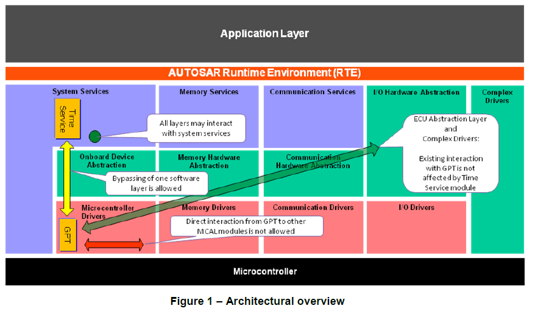
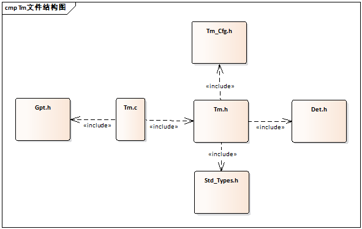
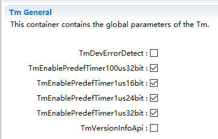

==============
Tm
==============

**缩写词注解**

+------------+---------------------------+----------------------------+
| **缩写词** | **英文全称**              | **中文解释**               |
+------------+---------------------------+----------------------------+
| nop        | No Operation              | 无操作                     |
+------------+---------------------------+----------------------------+

简介
====

Tm在AutoSAR软件层级架构如下图：

|image1|

图 Tm在AutoSAR软件层级架构图

如图所示Tm模块位于系统服务，所有层都可以使用系统服务。Tm模块可以越过一个软件层来访问GPT，而GPT不能与其他MCAL模块直接产生交互。复杂驱动和ECU抽象层与GPT存在交互，但不受Tm模块影响。

参考资料
--------

[1] AUTOSAR_EXP_LayeredSoftwareArchitecture.pdf，R19-11

[2] AUTOSAR_SWS_TimeService.PDF，R19-11

功能描述
========

Tm功能
------

Tm功能介绍
~~~~~~~~~~

Tm模块通过直接访问GPT硬件，经过一定转换后给其他BSW模块提供接口从而可以初始化一个时钟，随时获取其经过时间，或者可以主动忙碌等待一段时间。并可以对时钟进行偏移等操作。

Tm功能实现
~~~~~~~~~~

不同种类的时钟，也称为“Tm预定义时钟”，在硬件的和配置支持下存在。每一个预定义时钟都有一个预定义的tick
duration（最小单位记录时长）和一个预定义的字节数（物理范围）。这些预定义时钟是基于GPT预定义时钟的，这是GPT驱动提供的自由运行的硬件时钟。

共有以下四种预定义时钟：Tm_PredefTimer1us16bitType，

Tm_PredefTimer1us24bitType，Tm_PredefTimer1us32bitType，

Tm_PredefTimer100us32bitType。（前一项为tick
duration，后一项为字节大小）。那么，Tm提供的服务也都支持这四种时钟。相关服务有：Tm_ResetTimer…,
Tm_GetTimeSpan…, Tm_ShiftTimer…, Tm_SyncTimer…,
Tm_BusyWait…。注意100us不支持BusyWait。

源文件描述
==========

表 Tm组件文件描述

+---------------------+------------------------------------------------+
| **文件**            | **说明**                                       |
+---------------------+------------------------------------------------+
| Tm.c                | 包含需                                         |
|                     | 要使用的宏定义，内部变量，内部函数，全局函数。 |
+---------------------+------------------------------------------------+
| Tm.h                | 包含需要使用的宏                               |
|                     | 定义，类型定义，配置结构体声明，外部函数声明。 |
+---------------------+------------------------------------------------+
| Tm_Cfg.h            | 包含配置宏定义。                               |
+---------------------+------------------------------------------------+

|image2|\ 图 Tm组件文件交互关系图

API接口
=======

类型定义
--------

Tm_PredefTimer1us16bitType类型定义
~~~~~~~~~~~~~~~~~~~~~~~~~~~~~~~~~~

+-----------+----------------------------------------------------------+
| 名称      | Tm_PredefTimer1us16bitType                               |
+-----------+----------------------------------------------------------+
| 类型      | Structure                                                |
+-----------+----------------------------------------------------------+
| 范围      | 无                                                       |
+-----------+----------------------------------------------------------+
| 描述      | Tm模块预定义1us16bit时钟的数据结构体，存放参考时间。     |
+-----------+----------------------------------------------------------+

Tm_PredefTimer1us24bitType类型定义
~~~~~~~~~~~~~~~~~~~~~~~~~~~~~~~~~~

+-----------+----------------------------------------------------------+
| 名称      | Tm_PredefTimer1us24bitType                               |
+-----------+----------------------------------------------------------+
| 类型      | Structure                                                |
+-----------+----------------------------------------------------------+
| 范围      | 无                                                       |
+-----------+----------------------------------------------------------+
| 描述      | Tm模块预定义1us24bit时钟的数据结构体，存放参考时间。     |
+-----------+----------------------------------------------------------+

Tm_PredefTimer1us32bitType类型定义
~~~~~~~~~~~~~~~~~~~~~~~~~~~~~~~~~~

+-----------+----------------------------------------------------------+
| 名称      | Tm_PredefTimer1us32bitType                               |
+-----------+----------------------------------------------------------+
| 类型      | Structure                                                |
+-----------+----------------------------------------------------------+
| 范围      | 无                                                       |
+-----------+----------------------------------------------------------+
| 描述      | Tm模块预定义1us32bit时钟的数据结构体，存放参考时间。     |
+-----------+----------------------------------------------------------+

Tm_PredefTimer100us32bitType类型定义
~~~~~~~~~~~~~~~~~~~~~~~~~~~~~~~~~~~~

+-----------+----------------------------------------------------------+
| 名称      | Tm_PredefTimer100us32bitType                             |
+-----------+----------------------------------------------------------+
| 类型      | Structure                                                |
+-----------+----------------------------------------------------------+
| 范围      | 无                                                       |
+-----------+----------------------------------------------------------+
| 描述      | Tm模块预定义100us32bit时钟的数据结构体，存放参考时间。   |
+-----------+----------------------------------------------------------+

输入函数描述
------------

+----------------------------------+-----------------------------------+
| **输入模块**                     | **API**                           |
+----------------------------------+-----------------------------------+
| Gpt                              | Gpt_GetPredefTimerValue           |
+----------------------------------+-----------------------------------+
| Det                              | Det_ReportError                   |
+----------------------------------+-----------------------------------+
|                                  | Det_ReportRuntimeError            |
+----------------------------------+-----------------------------------+

静态接口函数定义
----------------

Tm_GetVersionInfo函数定义
~~~~~~~~~~~~~~~~~~~~~~~~~

+-------------+-------------------+---------+-------------------------+
| 函数名称:   | Tm_GetVersionInfo |         |                         |
+-------------+-------------------+---------+-------------------------+
| 函数原型:   | FUNC(void,        |         |                         |
|             | Tm_CODE)          |         |                         |
|             |                   |         |                         |
|             | Tm_GetVersionInfo |         |                         |
|             | (                 |         |                         |
|             | Std               |         |                         |
|             | _VersionInfoType\*|         |                         |
|             | VersionInfoPtr )  |         |                         |
+-------------+-------------------+---------+-------------------------+
| 服务编号:   | 0x1               |         |                         |
+-------------+-------------------+---------+-------------------------+
| 同步/异步： | 同步              |         |                         |
+-------------+-------------------+---------+-------------------------+
| 是          | 是                |         |                         |
| 否可重入：  |                   |         |                         |
+-------------+-------------------+---------+-------------------------+
| 输入参数：  | 无                | 值域：  | 无                      |
+-------------+-------------------+---------+-------------------------+
| 输          | 无                |         |                         |
| 入输出参数: |                   |         |                         |
+-------------+-------------------+---------+-------------------------+
| 输出参数：  | Version           |         |                         |
|             | InfoPtr：版本信息 |         |                         |
+-------------+-------------------+---------+-------------------------+
| 返回值：    | 无                |         |                         |
+-------------+-------------------+---------+-------------------------+
| 功能概述：  | 获                |         |                         |
|             | 取Tm模块版本信息  |         |                         |
+-------------+-------------------+---------+-------------------------+

Tm_ResetTimer1us16bit函数定义
~~~~~~~~~~~~~~~~~~~~~~~~~~~~~

+-------------+-------------------+---------+-------------------------+
| 函数名称:   | Tm_R              |         |                         |
|             | esetTimer1us16bit |         |                         |
+-------------+-------------------+---------+-------------------------+
| 函数原型:   | FUN               |         |                         |
|             | C(Std_ReturnType, |         |                         |
|             | Tm_CODE)          |         |                         |
|             |                   |         |                         |
|             | Tm_R              |         |                         |
|             | esetTimer1us16bit |         |                         |
|             | (                 |         |                         |
|             | Tm_PredefTi       |         |                         |
|             | mer1us16bitType\* |         |                         |
|             | TimerPtr )        |         |                         |
+-------------+-------------------+---------+-------------------------+
| 服务编号:   | 0x2               |         |                         |
+-------------+-------------------+---------+-------------------------+
| 同步/异步： | 同步              |         |                         |
+-------------+-------------------+---------+-------------------------+
| 是          | 仅在不同          |         |                         |
| 否可重入：  | 时钟实例下可重入  |         |                         |
+-------------+-------------------+---------+-------------------------+
| 输入参数：  | 无                | 值域：  | 无                      |
+-------------+-------------------+---------+-------------------------+
| 输          | 无                |         |                         |
| 入输出参数: |                   |         |                         |
+-------------+-------------------+---------+-------------------------+
| 输出参数：  | T                 |         |                         |
|             | imerPtr：时钟实例 |         |                         |
+-------------+-------------------+---------+-------------------------+
| 返回值：    | Std_ReturnType：  |         |                         |
|             | E_OK:             |         |                         |
|             | GPT驱动成         |         |                         |
|             | 功，无开发错误。  |         |                         |
|             |                   |         |                         |
|             | E_NOT_OK:         |         |                         |
|             | GPT驱动失败       |         |                         |
|             | ，或有开发错误。  |         |                         |
+-------------+-------------------+---------+-------------------------+
| 功能概述：  | 重置时钟。        |         |                         |
+-------------+-------------------+---------+-------------------------+

Tm_GetTimeSpan1us16bit函数定义
~~~~~~~~~~~~~~~~~~~~~~~~~~~~~~

+-------------+-------------------+---------+-------------------------+
| 函数名称:   | Tm_Ge             |         |                         |
|             | tTimeSpan1us16bit |         |                         |
+-------------+-------------------+---------+-------------------------+
| 函数原型:   | FUN               |         |                         |
|             | C(Std_ReturnType, |         |                         |
|             | Tm_CODE)          |         |                         |
|             |                   |         |                         |
|             | Tm_Ge             |         |                         |
|             | tTimeSpan1us16bit |         |                         |
|             | ( const           |         |                         |
|             | Tm_PredefTi       |         |                         |
|             | mer1us16bitType\* |         |                         |
|             | TimerPtr,         |         |                         |
|             | uint16\*          |         |                         |
|             | TimeSpanPtr )     |         |                         |
+-------------+-------------------+---------+-------------------------+
| 服务编号:   | 0x3               |         |                         |
+-------------+-------------------+---------+-------------------------+
| 同步/异步： | 同步              |         |                         |
+-------------+-------------------+---------+-------------------------+
| 是          | 是                |         |                         |
| 否可重入：  |                   |         |                         |
+-------------+-------------------+---------+-------------------------+
| 输入参数：  | T                 | 值域：  | 无                      |
|             | imerPtr：时钟实例 |         |                         |
+-------------+-------------------+---------+-------------------------+
| 输          | 无                |         |                         |
| 入输出参数: |                   |         |                         |
+-------------+-------------------+---------+-------------------------+
| 输出参数：  | TimeSpanPtr：时段 |         |                         |
+-------------+-------------------+---------+-------------------------+
| 返回值：    | Std_ReturnType：  |         |                         |
|             | E_OK:             |         |                         |
|             | GPT驱动成         |         |                         |
|             | 功，无开发错误。  |         |                         |
|             |                   |         |                         |
|             | E_NOT_OK:         |         |                         |
|             | GPT驱动失败       |         |                         |
|             | ，或有开发错误。  |         |                         |
+-------------+-------------------+---------+-------------------------+
| 功能概述：  | 获取时段。        |         |                         |
+-------------+-------------------+---------+-------------------------+

Tm_ShiftTimer1us16bit函数定义
~~~~~~~~~~~~~~~~~~~~~~~~~~~~~

+-------------+-------------------+---------+-------------------------+
| 函数名称:   | Tm_S              |         |                         |
|             | hiftTimer1us16bit |         |                         |
+-------------+-------------------+---------+-------------------------+
| 函数原型:   | FUNC(void,        |         |                         |
|             | Tm_CODE)          |         |                         |
|             |                   |         |                         |
|             | Tm_S              |         |                         |
|             | hiftTimer1us16bit |         |                         |
|             | (                 |         |                         |
|             | Tm_PredefTi       |         |                         |
|             | mer1us16bitType\* |         |                         |
|             | TimerPtr, uint16  |         |                         |
|             | TimeValue )       |         |                         |
+-------------+-------------------+---------+-------------------------+
| 服务编号:   | 0x4               |         |                         |
+-------------+-------------------+---------+-------------------------+
| 同步/异步： | 同步              |         |                         |
+-------------+-------------------+---------+-------------------------+
| 是          | 仅在              |         |                         |
| 否可重入：  | 不同时钟实例时是  |         |                         |
+-------------+-------------------+---------+-------------------------+
| 输入参数：  | TimerValue：      | 值域：  | 0-0xFFFF                |
|             | 要平移的参考时间  |         |                         |
+-------------+-------------------+---------+-------------------------+
| 输          | T                 |         |                         |
| 入输出参数: | imerPtr：时钟实例 |         |                         |
+-------------+-------------------+---------+-------------------------+
| 输出参数：  | 无                |         |                         |
+-------------+-------------------+---------+-------------------------+
| 返回值：    | 无                |         |                         |
+-------------+-------------------+---------+-------------------------+
| 功能概述：  | 平移时间。        |         |                         |
+-------------+-------------------+---------+-------------------------+

Tm_SyncTimer1us16bit函数定义
~~~~~~~~~~~~~~~~~~~~~~~~~~~~

+-------------+-------------------+---------+-------------------------+
| 函数名称:   | Tm_               |         |                         |
|             | SyncTimer1us16bit |         |                         |
+-------------+-------------------+---------+-------------------------+
| 函数原型:   | FUNC(void,        |         |                         |
|             | Tm_CODE)          |         |                         |
|             |                   |         |                         |
|             | Tm_               |         |                         |
|             | SyncTimer1us16bit |         |                         |
|             | (                 |         |                         |
|             | Tm_PredefTi       |         |                         |
|             | mer1us16bitType\* |         |                         |
|             | TimerDstPtr,      |         |                         |
|             | const             |         |                         |
|             | Tm_PredefTi       |         |                         |
|             | mer1us16bitType\* |         |                         |
|             | TimerSrcPtr )     |         |                         |
+-------------+-------------------+---------+-------------------------+
| 服务编号:   | 0x5               |         |                         |
+-------------+-------------------+---------+-------------------------+
| 同步/异步： | 同步              |         |                         |
+-------------+-------------------+---------+-------------------------+
| 是          | 仅在不同          |         |                         |
| 否可重入：  | 目标时钟实例时是  |         |                         |
+-------------+-------------------+---------+-------------------------+
| 输入参数：  | Ti                | 值域：  | 无                      |
|             | merSrcPtr：原时钟 |         |                         |
+-------------+-------------------+---------+-------------------------+
| 输          | 无                |         |                         |
| 入输出参数: |                   |         |                         |
+-------------+-------------------+---------+-------------------------+
| 输出参数：  | TimerDstPtr       |         |                         |
|             | ：目标时钟        |         |                         |
+-------------+-------------------+---------+-------------------------+
| 返回值：    | 无                |         |                         |
+-------------+-------------------+---------+-------------------------+
| 功能概述：  | 同步时间。        |         |                         |
+-------------+-------------------+---------+-------------------------+

Tm_BusyWait1us16bit函数定义
~~~~~~~~~~~~~~~~~~~~~~~~~~~

+-------------+-------------------+---------+-------------------------+
| 函数名称:   | Tm                |         |                         |
|             | _BusyWait1us16bit |         |                         |
+-------------+-------------------+---------+-------------------------+
| 函数原型:   | FUN               |         |                         |
|             | C(Std_ReturnType, |         |                         |
|             | Tm_CODE)          |         |                         |
|             |                   |         |                         |
|             | Std_ReturnType    |         |                         |
|             | Tm                |         |                         |
|             | _BusyWait1us16bit |         |                         |
|             | ( uint8           |         |                         |
|             | WaitingTimeMin )  |         |                         |
+-------------+-------------------+---------+-------------------------+
| 服务编号:   | 0x6               |         |                         |
+-------------+-------------------+---------+-------------------------+
| 同步/异步： | 同步              |         |                         |
+-------------+-------------------+---------+-------------------------+
| 是          | 是                |         |                         |
| 否可重入：  |                   |         |                         |
+-------------+-------------------+---------+-------------------------+
| 输入参数：  | WaitingTi         | 值域：  | 0-256                   |
|             | meMin：最少等待时 |         |                         |
|             | 间（单位为微秒）  |         |                         |
+-------------+-------------------+---------+-------------------------+
| 输          | 无                |         |                         |
| 入输出参数: |                   |         |                         |
+-------------+-------------------+---------+-------------------------+
| 输出参数：  | 无                |         |                         |
+-------------+-------------------+---------+-------------------------+
| 返回值：    | Std_ReturnType：  |         |                         |
|             | E_OK:             |         |                         |
|             | GPT驱动成         |         |                         |
|             | 功，无开发错误。  |         |                         |
|             |                   |         |                         |
|             | E_NOT_OK:         |         |                         |
|             | GPT驱动失败       |         |                         |
|             | ，或有开发错误。  |         |                         |
+-------------+-------------------+---------+-------------------------+
| 功能概述：  | 轮询忙碌等待，保  |         |                         |
|             | 证最小等待时间。  |         |                         |
+-------------+-------------------+---------+-------------------------+

Tm_ResetTimer1us24bit函数定义
~~~~~~~~~~~~~~~~~~~~~~~~~~~~~

+-------------+-------------------+---------+-------------------------+
| 函数名称:   | Tm_R              |         |                         |
|             | esetTimer1us24bit |         |                         |
+-------------+-------------------+---------+-------------------------+
| 函数原型:   | FUN               |         |                         |
|             | C(Std_ReturnType, |         |                         |
|             | Tm_CODE)          |         |                         |
|             |                   |         |                         |
|             | Tm_R              |         |                         |
|             | esetTimer1us24bit |         |                         |
|             | (                 |         |                         |
|             | Tm_PredefTi       |         |                         |
|             | mer1us24bitType\* |         |                         |
|             | TimerPtr )        |         |                         |
+-------------+-------------------+---------+-------------------------+
| 服务编号:   | 0x7               |         |                         |
+-------------+-------------------+---------+-------------------------+
| 同步/异步： | 同步              |         |                         |
+-------------+-------------------+---------+-------------------------+
| 是          | 仅在不同          |         |                         |
| 否可重入：  | 时钟实例下可重入  |         |                         |
+-------------+-------------------+---------+-------------------------+
| 输入参数：  | 无                | 值域：  | 无                      |
+-------------+-------------------+---------+-------------------------+
| 输          | 无                |         |                         |
| 入输出参数: |                   |         |                         |
+-------------+-------------------+---------+-------------------------+
| 输出参数：  | T                 |         |                         |
|             | imerPtr：时钟实例 |         |                         |
+-------------+-------------------+---------+-------------------------+
| 返回值：    | Std_ReturnType：  |         |                         |
|             | E_OK:             |         |                         |
|             | GPT驱动成         |         |                         |
|             | 功，无开发错误。  |         |                         |
|             |                   |         |                         |
|             | E_NOT_OK:         |         |                         |
|             | GPT驱动失败       |         |                         |
|             | ，或有开发错误。  |         |                         |
+-------------+-------------------+---------+-------------------------+
| 功能概述：  | 重置时钟。        |         |                         |
+-------------+-------------------+---------+-------------------------+

Tm_GetTimeSpan1us24bit函数定义
~~~~~~~~~~~~~~~~~~~~~~~~~~~~~~

+-------------+-------------------+---------+-------------------------+
| 函数名称:   | Tm\_              |         |                         |
|             | Ge                |         |                         |
|             | tTimeSpan1us24bit |         |                         |
+-------------+-------------------+---------+-------------------------+
| 函数原型:   | FUN               |         |                         |
|             | C(Std_ReturnType, |         |                         |
|             | Tm_CODE)          |         |                         |
|             |                   |         |                         |
|             | Tm_Ge             |         |                         |
|             | tTimeSpan1us24bit |         |                         |
|             | ( const           |         |                         |
|             | Tm_PredefTi       |         |                         |
|             | mer1us24bitType\* |         |                         |
|             | TimerPtr,         |         |                         |
|             | uint32\*          |         |                         |
|             | TimeSpanPtr )     |         |                         |
+-------------+-------------------+---------+-------------------------+
| 服务编号:   | 0x8               |         |                         |
+-------------+-------------------+---------+-------------------------+
| 同步/异步： | 同步              |         |                         |
+-------------+-------------------+---------+-------------------------+
| 是          | 是                |         |                         |
| 否可重入：  |                   |         |                         |
+-------------+-------------------+---------+-------------------------+
| 输入参数：  | T                 | 值域：  | 无                      |
|             | imerPtr：时钟实例 |         |                         |
+-------------+-------------------+---------+-------------------------+
| 输          | 无                |         |                         |
| 入输出参数: |                   |         |                         |
+-------------+-------------------+---------+-------------------------+
| 输出参数：  | TimeSpanPtr：时段 |         |                         |
+-------------+-------------------+---------+-------------------------+
| 返回值：    | Std_ReturnType：  |         |                         |
|             | E_OK:             |         |                         |
|             | GPT驱动成         |         |                         |
|             | 功，无开发错误。  |         |                         |
|             |                   |         |                         |
|             | E_NOT_OK:         |         |                         |
|             | GPT驱动失败       |         |                         |
|             | ，或有开发错误。  |         |                         |
+-------------+-------------------+---------+-------------------------+
| 功能概述：  | 获取时段。        |         |                         |
+-------------+-------------------+---------+-------------------------+

Tm_ShiftTimer1us24bit函数定义
~~~~~~~~~~~~~~~~~~~~~~~~~~~~~

+-------------+-------------------+---------+-------------------------+
| 函数名称:   | Tm_S              |         |                         |
|             | hiftTimer1us24bit |         |                         |
+-------------+-------------------+---------+-------------------------+
| 函数原型:   | FUNC(void,        |         |                         |
|             | Tm_CODE)          |         |                         |
|             |                   |         |                         |
|             | Tm_S              |         |                         |
|             | hiftTimer1us24bit |         |                         |
|             | (                 |         |                         |
|             | Tm_PredefTi       |         |                         |
|             | mer1us24bitType\* |         |                         |
|             | TimerPtr, uint32  |         |                         |
|             | TimeValue )       |         |                         |
+-------------+-------------------+---------+-------------------------+
| 服务编号:   | 0x9               |         |                         |
+-------------+-------------------+---------+-------------------------+
| 同步/异步： | 同步              |         |                         |
+-------------+-------------------+---------+-------------------------+
| 是          | 仅在              |         |                         |
| 否可重入：  | 不同时钟实例时是  |         |                         |
+-------------+-------------------+---------+-------------------------+
| 输入参数：  | TimerValue：      | 值域：  | 0-0xFFFFFF              |
|             | 要平移的参考时间  |         |                         |
+-------------+-------------------+---------+-------------------------+
| 输          | T                 |         |                         |
| 入输出参数: | imerPtr：时钟实例 |         |                         |
+-------------+-------------------+---------+-------------------------+
| 输出参数：  | 无                |         |                         |
+-------------+-------------------+---------+-------------------------+
| 返回值：    | 无                |         |                         |
+-------------+-------------------+---------+-------------------------+
| 功能概述：  | 平移时间。        |         |                         |
+-------------+-------------------+---------+-------------------------+

Tm_SyncTimer1us24bit函数定义
~~~~~~~~~~~~~~~~~~~~~~~~~~~~

+-------------+-------------------+---------+-------------------------+
| 函数名称:   | Tm_               |         |                         |
|             | SyncTimer1us24bit |         |                         |
+-------------+-------------------+---------+-------------------------+
| 函数原型:   | FUNC(void,        |         |                         |
|             | Tm_CODE)          |         |                         |
|             |                   |         |                         |
|             | Tm_               |         |                         |
|             | SyncTimer1us24bit |         |                         |
|             | (                 |         |                         |
|             | Tm_PredefTi       |         |                         |
|             | mer1us24bitType\* |         |                         |
|             | TimerDstPtr,      |         |                         |
|             | const             |         |                         |
|             | Tm_PredefTi       |         |                         |
|             | mer1us24bitType\* |         |                         |
|             | TimerSrcPtr )     |         |                         |
+-------------+-------------------+---------+-------------------------+
| 服务编号:   | 0xa               |         |                         |
+-------------+-------------------+---------+-------------------------+
| 同步/异步： | 同步              |         |                         |
+-------------+-------------------+---------+-------------------------+
| 是          | 仅在不同          |         |                         |
| 否可重入：  | 目标时钟实例时是  |         |                         |
+-------------+-------------------+---------+-------------------------+
| 输入参数：  | Ti                | 值域：  | 无                      |
|             | merSrcPtr：原时钟 |         |                         |
+-------------+-------------------+---------+-------------------------+
| 输          | 无                |         |                         |
| 入输出参数: |                   |         |                         |
+-------------+-------------------+---------+-------------------------+
| 输出参数：  | TimerDstPtr       |         |                         |
|             | ：目标时钟        |         |                         |
+-------------+-------------------+---------+-------------------------+
| 返回值：    | 无                |         |                         |
+-------------+-------------------+---------+-------------------------+
| 功能概述：  | 同步时间。        |         |                         |
+-------------+-------------------+---------+-------------------------+

Tm_BusyWait1us24bit函数定义
~~~~~~~~~~~~~~~~~~~~~~~~~~~

+-------------+-------------------+---------+-------------------------+
| 函数名称:   | Tm                |         |                         |
|             | _BusyWait1us24bit |         |                         |
+-------------+-------------------+---------+-------------------------+
| 函数原型:   | FUN               |         |                         |
|             | C(Std_ReturnType, |         |                         |
|             | Tm_CODE)          |         |                         |
|             |                   |         |                         |
|             | Std_ReturnType    |         |                         |
|             | Tm                |         |                         |
|             | _BusyWait1us24bit |         |                         |
|             | ( uint8           |         |                         |
|             | WaitingTimeMin )  |         |                         |
+-------------+-------------------+---------+-------------------------+
| 服务编号:   | 0xb               |         |                         |
+-------------+-------------------+---------+-------------------------+
| 同步/异步： | 同步              |         |                         |
+-------------+-------------------+---------+-------------------------+
| 是          | 是                |         |                         |
| 否可重入：  |                   |         |                         |
+-------------+-------------------+---------+-------------------------+
| 输入参数：  | WaitingTi         | 值域：  | 0-256                   |
|             | meMin：最少等待时 |         |                         |
|             | 间（单位为微秒）  |         |                         |
+-------------+-------------------+---------+-------------------------+
| 输          | 无                |         |                         |
| 入输出参数: |                   |         |                         |
+-------------+-------------------+---------+-------------------------+
| 输出参数：  | 无                |         |                         |
+-------------+-------------------+---------+-------------------------+
| 返回值：    | Std_ReturnType：  |         |                         |
|             | E_OK:             |         |                         |
|             | GPT驱动成         |         |                         |
|             | 功，无开发错误。  |         |                         |
|             |                   |         |                         |
|             | E_NOT_OK:         |         |                         |
|             | GPT驱动失败       |         |                         |
|             | ，或有开发错误。  |         |                         |
+-------------+-------------------+---------+-------------------------+
| 功能概述：  | 轮询忙碌等待，保  |         |                         |
|             | 证最小等待时间。  |         |                         |
+-------------+-------------------+---------+-------------------------+

Tm_ResetTimer1us32bit函数定义
~~~~~~~~~~~~~~~~~~~~~~~~~~~~~

+-------------+-------------------+---------+-------------------------+
| 函数名称:   | Tm_R              |         |                         |
|             | esetTimer1us32bit |         |                         |
+-------------+-------------------+---------+-------------------------+
| 函数原型:   | FUN               |         |                         |
|             | C(Std_ReturnType, |         |                         |
|             | Tm_CODE)          |         |                         |
|             |                   |         |                         |
|             | Tm_R              |         |                         |
|             | esetTimer1us32bit |         |                         |
|             | (                 |         |                         |
|             | Tm_PredefTi       |         |                         |
|             | mer1us32bitType\* |         |                         |
|             | TimerPtr )        |         |                         |
+-------------+-------------------+---------+-------------------------+
| 服务编号:   | 0xc               |         |                         |
+-------------+-------------------+---------+-------------------------+
| 同步/异步： | 同步              |         |                         |
+-------------+-------------------+---------+-------------------------+
| 是          | 仅在不同          |         |                         |
| 否可重入：  | 时钟实例下可重入  |         |                         |
+-------------+-------------------+---------+-------------------------+
| 输入参数：  | 无                | 值域：  | 无                      |
+-------------+-------------------+---------+-------------------------+
| 输          | 无                |         |                         |
| 入输出参数: |                   |         |                         |
+-------------+-------------------+---------+-------------------------+
| 输出参数：  | T                 |         |                         |
|             | imerPtr：时钟实例 |         |                         |
+-------------+-------------------+---------+-------------------------+
| 返回值：    | Std_ReturnType：  |         |                         |
|             | E_OK:             |         |                         |
|             | GPT驱动成         |         |                         |
|             | 功，无开发错误。  |         |                         |
|             |                   |         |                         |
|             | E_NOT_OK:         |         |                         |
|             | GPT驱动失败       |         |                         |
|             | ，或有开发错误。  |         |                         |
+-------------+-------------------+---------+-------------------------+
| 功能概述：  | 重置时钟。        |         |                         |
+-------------+-------------------+---------+-------------------------+

Tm_GetTimeSpan1us32bit函数定义
~~~~~~~~~~~~~~~~~~~~~~~~~~~~~~

+-------------+-------------------+---------+-------------------------+
| 函数名称:   | Tm\_              |         |                         |
|             | Ge                |         |                         |
|             | tTimeSpan1us32bit |         |                         |
+-------------+-------------------+---------+-------------------------+
| 函数原型:   | FUN               |         |                         |
|             | C(Std_ReturnType, |         |                         |
|             | Tm_CODE)          |         |                         |
|             |                   |         |                         |
|             | Tm_Ge             |         |                         |
|             | tTimeSpan1us32bit |         |                         |
|             | ( const           |         |                         |
|             | Tm_PredefTi       |         |                         |
|             | mer1us32bitType\* |         |                         |
|             | TimerPtr,         |         |                         |
|             | uint32\*          |         |                         |
|             | TimeSpanPtr )     |         |                         |
+-------------+-------------------+---------+-------------------------+
| 服务编号:   | 0xd               |         |                         |
+-------------+-------------------+---------+-------------------------+
| 同步/异步： | 同步              |         |                         |
+-------------+-------------------+---------+-------------------------+
| 是          | 是                |         |                         |
| 否可重入：  |                   |         |                         |
+-------------+-------------------+---------+-------------------------+
| 输入参数：  | T                 | 值域：  | 无                      |
|             | imerPtr：时钟实例 |         |                         |
+-------------+-------------------+---------+-------------------------+
| 输          | 无                |         |                         |
| 入输出参数: |                   |         |                         |
+-------------+-------------------+---------+-------------------------+
| 输出参数：  | TimeSpanPtr：时段 |         |                         |
+-------------+-------------------+---------+-------------------------+
| 返回值：    | Std_ReturnType：  |         |                         |
|             | E_OK:             |         |                         |
|             | GPT驱动成         |         |                         |
|             | 功，无开发错误。  |         |                         |
|             |                   |         |                         |
|             | E_NOT_OK:         |         |                         |
|             | GPT驱动失败       |         |                         |
|             | ，或有开发错误。  |         |                         |
+-------------+-------------------+---------+-------------------------+
| 功能概述：  | 获取时段。        |         |                         |
+-------------+-------------------+---------+-------------------------+

Tm_ShiftTimer1us32bit函数定义
~~~~~~~~~~~~~~~~~~~~~~~~~~~~~

+-------------+-------------------+---------+-------------------------+
| 函数名称:   | Tm_S              |         |                         |
|             | hiftTimer1us32bit |         |                         |
+-------------+-------------------+---------+-------------------------+
| 函数原型:   | FUNC(void,        |         |                         |
|             | Tm_CODE)          |         |                         |
|             |                   |         |                         |
|             | Tm_S              |         |                         |
|             | hiftTimer1us32bit |         |                         |
|             | (                 |         |                         |
|             | Tm_PredefTi       |         |                         |
|             | mer1us32bitType\* |         |                         |
|             | TimerPtr, uint32  |         |                         |
|             | TimeValue )       |         |                         |
+-------------+-------------------+---------+-------------------------+
| 服务编号:   | 0xe               |         |                         |
+-------------+-------------------+---------+-------------------------+
| 同步/异步： | 同步              |         |                         |
+-------------+-------------------+---------+-------------------------+
| 是          | 仅在              |         |                         |
| 否可重入：  | 不同时钟实例时是  |         |                         |
+-------------+-------------------+---------+-------------------------+
| 输入参数：  | TimerValue：      | 值域：  | 0-0xFFFFFFFF            |
|             | 要平移的参考时间  |         |                         |
+-------------+-------------------+---------+-------------------------+
| 输          | T                 |         |                         |
| 入输出参数: | imerPtr：时钟实例 |         |                         |
+-------------+-------------------+---------+-------------------------+
| 输出参数：  | 无                |         |                         |
+-------------+-------------------+---------+-------------------------+
| 返回值：    | 无                |         |                         |
+-------------+-------------------+---------+-------------------------+
| 功能概述：  | 平移时间。        |         |                         |
+-------------+-------------------+---------+-------------------------+

Tm_SyncTimer1us32bit函数定义
~~~~~~~~~~~~~~~~~~~~~~~~~~~~

+-------------+-------------------+---------+-------------------------+
| 函数名称:   | Tm_               |         |                         |
|             | SyncTimer1us32bit |         |                         |
+-------------+-------------------+---------+-------------------------+
| 函数原型:   | FUNC(void,        |         |                         |
|             | Tm_CODE)          |         |                         |
|             |                   |         |                         |
|             | Tm_               |         |                         |
|             | SyncTimer1us32bit |         |                         |
|             | (                 |         |                         |
|             | Tm_PredefTi       |         |                         |
|             | mer1us32bitType\* |         |                         |
|             | TimerDstPtr,      |         |                         |
|             | const             |         |                         |
|             | Tm_PredefTi       |         |                         |
|             | mer1us32bitType\* |         |                         |
|             | TimerSrcPtr )     |         |                         |
+-------------+-------------------+---------+-------------------------+
| 服务编号:   | 0xf               |         |                         |
+-------------+-------------------+---------+-------------------------+
| 同步/异步： | 同步              |         |                         |
+-------------+-------------------+---------+-------------------------+
| 是          | 仅在不同          |         |                         |
| 否可重入：  | 目标时钟实例时是  |         |                         |
+-------------+-------------------+---------+-------------------------+
| 输入参数：  | Ti                | 值域：  | 无                      |
|             | merSrcPtr：原时钟 |         |                         |
+-------------+-------------------+---------+-------------------------+
| 输          | 无                |         |                         |
| 入输出参数: |                   |         |                         |
+-------------+-------------------+---------+-------------------------+
| 输出参数：  | TimerDstPtr       |         |                         |
|             | ：目标时钟        |         |                         |
+-------------+-------------------+---------+-------------------------+
| 返回值：    | 无                |         |                         |
+-------------+-------------------+---------+-------------------------+
| 功能概述：  | 同步时间。        |         |                         |
+-------------+-------------------+---------+-------------------------+

Tm_BusyWait1us32bit函数定义
~~~~~~~~~~~~~~~~~~~~~~~~~~~

+-------------+-------------------+---------+-------------------------+
| 函数名称:   | Tm                |         |                         |
|             | _BusyWait1us32bit |         |                         |
+-------------+-------------------+---------+-------------------------+
| 函数原型:   | FUN               |         |                         |
|             | C(Std_ReturnType, |         |                         |
|             | Tm_CODE)          |         |                         |
|             |                   |         |                         |
|             | Std_ReturnType    |         |                         |
|             | Tm                |         |                         |
|             | _BusyWait1us32bit |         |                         |
|             | ( uint8           |         |                         |
|             | WaitingTimeMin )  |         |                         |
+-------------+-------------------+---------+-------------------------+
| 服务编号:   | 0x10              |         |                         |
+-------------+-------------------+---------+-------------------------+
| 同步/异步： | 同步              |         |                         |
+-------------+-------------------+---------+-------------------------+
| 是          | 是                |         |                         |
| 否可重入：  |                   |         |                         |
+-------------+-------------------+---------+-------------------------+
| 输入参数：  | WaitingTi         | 值域：  | 0-256                   |
|             | meMin：最少等待时 |         |                         |
|             | 间（单位为微秒）  |         |                         |
+-------------+-------------------+---------+-------------------------+
| 输          | 无                |         |                         |
| 入输出参数: |                   |         |                         |
+-------------+-------------------+---------+-------------------------+
| 输出参数：  | 无                |         |                         |
+-------------+-------------------+---------+-------------------------+
| 返回值：    | Std_ReturnType：  |         |                         |
|             | E_OK:             |         |                         |
|             | GPT驱动成         |         |                         |
|             | 功，无开发错误。  |         |                         |
|             |                   |         |                         |
|             | E_NOT_OK:         |         |                         |
|             | GPT驱动失败       |         |                         |
|             | ，或有开发错误。  |         |                         |
+-------------+-------------------+---------+-------------------------+
| 功能概述：  | 轮询忙碌等待，保  |         |                         |
|             | 证最小等待时间。  |         |                         |
+-------------+-------------------+---------+-------------------------+

Tm_ResetTimer100us32bit函数定义
~~~~~~~~~~~~~~~~~~~~~~~~~~~~~~~

+-------------+-------------------+---------+-------------------------+
| 函数名称:   | Tm_Res            |         |                         |
|             | etTimer100us32bit |         |                         |
+-------------+-------------------+---------+-------------------------+
| 函数原型:   | FUN               |         |                         |
|             | C(Std_ReturnType, |         |                         |
|             | Tm_CODE)          |         |                         |
|             |                   |         |                         |
|             | Tm_Res            |         |                         |
|             | etTimer100us32bit |         |                         |
|             | (                 |         |                         |
|             | Tm_PredefTime     |         |                         |
|             | r100us32bitType\* |         |                         |
|             | TimerPtr )        |         |                         |
+-------------+-------------------+---------+-------------------------+
| 服务编号:   | 0x11              |         |                         |
+-------------+-------------------+---------+-------------------------+
| 同步/异步： | 同步              |         |                         |
+-------------+-------------------+---------+-------------------------+
| 是          | 仅在不同          |         |                         |
| 否可重入：  | 时钟实例下可重入  |         |                         |
+-------------+-------------------+---------+-------------------------+
| 输入参数：  | 无                | 值域：  | 无                      |
+-------------+-------------------+---------+-------------------------+
| 输          | 无                |         |                         |
| 入输出参数: |                   |         |                         |
+-------------+-------------------+---------+-------------------------+
| 输出参数：  | T                 |         |                         |
|             | imerPtr：时钟实例 |         |                         |
+-------------+-------------------+---------+-------------------------+
| 返回值：    | Std_ReturnType：  |         |                         |
|             | E_OK:             |         |                         |
|             | GPT驱动成         |         |                         |
|             | 功，无开发错误。  |         |                         |
|             |                   |         |                         |
|             | E_NOT_OK:         |         |                         |
|             | GPT驱动失败       |         |                         |
|             | ，或有开发错误。  |         |                         |
+-------------+-------------------+---------+-------------------------+
| 功能概述：  | 重置时钟。        |         |                         |
+-------------+-------------------+---------+-------------------------+

Tm_GetTimeSpan100us32bit函数定义
~~~~~~~~~~~~~~~~~~~~~~~~~~~~~~~~

+-------------+-------------------+---------+-------------------------+
| 函数名称:   | Tm\_              |         |                         |
|             | GetT              |         |                         |
|             | imeSpan100us32bit |         |                         |
+-------------+-------------------+---------+-------------------------+
| 函数原型:   | FUN               |         |                         |
|             | C(Std_ReturnType, |         |                         |
|             | Tm_CODE)          |         |                         |
|             |                   |         |                         |
|             | Tm_GetT           |         |                         |
|             | imeSpan100us32bit |         |                         |
|             | ( const           |         |                         |
|             | Tm_PredefTime     |         |                         |
|             | r100us32bitType\* |         |                         |
|             | TimerPtr,         |         |                         |
|             | uint32\*          |         |                         |
|             | TimeSpanPtr )     |         |                         |
+-------------+-------------------+---------+-------------------------+
| 服务编号:   | 0x12              |         |                         |
+-------------+-------------------+---------+-------------------------+
| 同步/异步： | 同步              |         |                         |
+-------------+-------------------+---------+-------------------------+
| 是          | 是                |         |                         |
| 否可重入：  |                   |         |                         |
+-------------+-------------------+---------+-------------------------+
| 输入参数：  | T                 | 值域：  | 无                      |
|             | imerPtr：时钟实例 |         |                         |
+-------------+-------------------+---------+-------------------------+
| 输          | 无                |         |                         |
| 入输出参数: |                   |         |                         |
+-------------+-------------------+---------+-------------------------+
| 输出参数：  | TimeSpanPtr：时段 |         |                         |
+-------------+-------------------+---------+-------------------------+
| 返回值：    | Std_ReturnType：  |         |                         |
|             | E_OK:             |         |                         |
|             | GPT驱动成         |         |                         |
|             | 功，无开发错误。  |         |                         |
|             |                   |         |                         |
|             | E_NOT_OK:         |         |                         |
|             | GPT驱动失败       |         |                         |
|             | ，或有开发错误。  |         |                         |
+-------------+-------------------+---------+-------------------------+
| 功能概述：  | 获取时段。        |         |                         |
+-------------+-------------------+---------+-------------------------+

Tm_ShiftTimer100us32bit函数定义
~~~~~~~~~~~~~~~~~~~~~~~~~~~~~~~

+-------------+-------------------+---------+-------------------------+
| 函数名称:   | Tm_Shi            |         |                         |
|             | ftTimer100us32bit |         |                         |
+-------------+-------------------+---------+-------------------------+
| 函数原型:   | FUNC(void,        |         |                         |
|             | Tm_CODE)          |         |                         |
|             |                   |         |                         |
|             | Tm_Shi            |         |                         |
|             | ftTimer100us32bit |         |                         |
|             | (                 |         |                         |
|             | Tm_PredefTime     |         |                         |
|             | r100us32bitType\* |         |                         |
|             | TimerPtr, uint32  |         |                         |
|             | TimeValue )       |         |                         |
+-------------+-------------------+---------+-------------------------+
| 服务编号:   | 0x13              |         |                         |
+-------------+-------------------+---------+-------------------------+
| 同步/异步： | 同步              |         |                         |
+-------------+-------------------+---------+-------------------------+
| 是          | 仅在              |         |                         |
| 否可重入：  | 不同时钟实例时是  |         |                         |
+-------------+-------------------+---------+-------------------------+
| 输入参数：  | TimerValue：      | 值域：  | 0-0xFFFFFFFF            |
|             | 要平移的参考时间  |         |                         |
+-------------+-------------------+---------+-------------------------+
| 输          | T                 |         |                         |
| 入输出参数: | imerPtr：时钟实例 |         |                         |
+-------------+-------------------+---------+-------------------------+
| 输出参数：  | 无                |         |                         |
+-------------+-------------------+---------+-------------------------+
| 返回值：    | 无                |         |                         |
+-------------+-------------------+---------+-------------------------+
| 功能概述：  | 平移时间。        |         |                         |
+-------------+-------------------+---------+-------------------------+

Tm_SyncTimer100us32bit函数定义
~~~~~~~~~~~~~~~~~~~~~~~~~~~~~~

+-------------+-------------------+---------+-------------------------+
| 函数名称:   | Tm_Sy             |         |                         |
|             | ncTimer100us32bit |         |                         |
+-------------+-------------------+---------+-------------------------+
| 函数原型:   | FUNC(void,        |         |                         |
|             | Tm_CODE)          |         |                         |
|             |                   |         |                         |
|             | Tm_Sy             |         |                         |
|             | ncTimer100us32bit |         |                         |
|             | (                 |         |                         |
|             | Tm_PredefTime     |         |                         |
|             | r100us32bitType\* |         |                         |
|             | TimerDstPtr,      |         |                         |
|             | const             |         |                         |
|             | Tm_PredefTime     |         |                         |
|             | r100us32bitType\* |         |                         |
|             | TimerSrcPtr )     |         |                         |
+-------------+-------------------+---------+-------------------------+
| 服务编号:   | 0x14              |         |                         |
+-------------+-------------------+---------+-------------------------+
| 同步/异步： | 同步              |         |                         |
+-------------+-------------------+---------+-------------------------+
| 是          | 仅在不同          |         |                         |
| 否可重入：  | 目标时钟实例时是  |         |                         |
+-------------+-------------------+---------+-------------------------+
| 输入参数：  | Ti                | 值域：  | 无                      |
|             | merSrcPtr：原时钟 |         |                         |
+-------------+-------------------+---------+-------------------------+
| 输          | 无                |         |                         |
| 入输出参数: |                   |         |                         |
+-------------+-------------------+---------+-------------------------+
| 输出参数：  | TimerDstPtr       |         |                         |
|             | ：目标时钟        |         |                         |
+-------------+-------------------+---------+-------------------------+
| 返回值：    | 无                |         |                         |
+-------------+-------------------+---------+-------------------------+
| 功能概述：  | 同步时间。        |         |                         |
+-------------+-------------------+---------+-------------------------+

Tm_GetTimeSpan1ms32bit函数定义
~~~~~~~~~~~~~~~~~~~~~~~~~~~~~~

+-------------+-------------------+---------+-------------------------+
| 函数名称:   | Tm\_              |         |                         |
|             | Ge                |         |                         |
|             | tTimeSpan1ms32bit |         |                         |
+-------------+-------------------+---------+-------------------------+
| 函数原型:   | FUN               |         |                         |
|             | C(Std_ReturnType, |         |                         |
|             | Tm_CODE)          |         |                         |
|             |                   |         |                         |
|             | Tm_Ge             |         |                         |
|             | tTimeSpan1ms32bit |         |                         |
|             | ( const           |         |                         |
|             | Tm_PredefTime     |         |                         |
|             | r100us32bitType\* |         |                         |
|             | TimerPtr,         |         |                         |
|             | uint32\*          |         |                         |
|             | TimeSpanPtr )     |         |                         |
+-------------+-------------------+---------+-------------------------+
| 服务编号:   | 0x12              |         |                         |
+-------------+-------------------+---------+-------------------------+
| 同步/异步： | 同步              |         |                         |
+-------------+-------------------+---------+-------------------------+
| 是          | 是                |         |                         |
| 否可重入：  |                   |         |                         |
+-------------+-------------------+---------+-------------------------+
| 输入参数：  | T                 | 值域：  | 无                      |
|             | imerPtr：时钟实例 |         |                         |
+-------------+-------------------+---------+-------------------------+
| 输          | 无                |         |                         |
| 入输出参数: |                   |         |                         |
+-------------+-------------------+---------+-------------------------+
| 输出参数：  | TimeSpanPtr：时段 |         |                         |
+-------------+-------------------+---------+-------------------------+
| 返回值：    | Std_ReturnType：  |         |                         |
|             | E_OK:             |         |                         |
|             | GPT驱动成         |         |                         |
|             | 功，无开发错误。  |         |                         |
|             |                   |         |                         |
|             | E_NOT_OK:         |         |                         |
|             | GPT驱动失败       |         |                         |
|             | ，或有开发错误。  |         |                         |
+-------------+-------------------+---------+-------------------------+
| 功能概述：  | 获取时段。        |         |                         |
+-------------+-------------------+---------+-------------------------+

可配置函数定义
--------------

无。

配置
====

配置列表
--------

表 属性描述

+------------+---------------------------------------------------------+
| UI名称     | 该配置项在配置工具界面显示的名称                        |
+------------+---------------------------------------------------------+
| 取值范围   | 该配置项允许的取值区间                                  |
+------------+---------------------------------------------------------+
| 默认取值   | 该配置项默认的配置值                                    |
+------------+---------------------------------------------------------+
| 参数描述   | 该配置项在标准的AUTOSAR_EcucParamDef.arxml文件中的描述  |
+------------+---------------------------------------------------------+
| 依赖关系   | 该配置项与其他模块或配置项的关系                        |
+------------+---------------------------------------------------------+

TmGeneral
---------

|image3|

图 TmGeneral工具配置

表 TmGeneral配置描述

+--------------------+-----------+------------------+---------+------+
| **UI名称**         | **描述**  |                  |         |      |
+--------------------+-----------+------------------+---------+------+
| TmDevErrorDetect   | 取值范围  | True/False       | 默      | F    |
|                    |           |                  | 认取值  | alse |
+--------------------+-----------+------------------+---------+------+
|                    | 参数描述  | 开关开发         |         |      |
|                    |           | 错误检测和报告。 |         |      |
+--------------------+-----------+------------------+---------+------+
|                    | 依赖关系  | 无               |         |      |
+--------------------+-----------+------------------+---------+------+
| TmEnablePre        | 取值范围  | True/False       | 默      | F    |
| defTimer100us32bit |           |                  | 认取值  | alse |
+--------------------+-----------+------------------+---------+------+
|                    | 参数描述  | 开关100us32b     |         |      |
|                    |           | it时钟相关功能。 |         |      |
+--------------------+-----------+------------------+---------+------+
|                    | 依赖关系  | 无               |         |      |
+--------------------+-----------+------------------+---------+------+
| TmEnableP          | 取值范围  | True/False       | 默      | F    |
| redefTimer1us16bit |           |                  | 认取值  | alse |
+--------------------+-----------+------------------+---------+------+
|                    | 参数描述  | 开关1us16b       |         |      |
|                    |           | it时钟相关功能。 |         |      |
+--------------------+-----------+------------------+---------+------+
|                    | 依赖关系  | 无               |         |      |
+--------------------+-----------+------------------+---------+------+
| TmEnableP          | 取值范围  | True/False       | 默      | F    |
| redefTimer1us24bit |           |                  | 认取值  | alse |
+--------------------+-----------+------------------+---------+------+
|                    | 参数描述  | 开关1us24b       |         |      |
|                    |           | it时钟相关功能。 |         |      |
+--------------------+-----------+------------------+---------+------+
|                    | 依赖关系  | 无               |         |      |
+--------------------+-----------+------------------+---------+------+
| TmEnableP          | 取值范围  | True/False       | 默      | F    |
| redefTimer1us32bit |           |                  | 认取值  | alse |
+--------------------+-----------+------------------+---------+------+
|                    | 参数描述  | 开关1us32b       |         |      |
|                    |           | it时钟相关功能。 |         |      |
+--------------------+-----------+------------------+---------+------+
|                    | 依赖关系  | 无               |         |      |
+--------------------+-----------+------------------+---------+------+
| TmVersionInfoApi   | 取值范围  | True/False       | 默      | F    |
|                    |           |                  | 认取值  | alse |
+--------------------+-----------+------------------+---------+------+
|                    | 参数描述  | 开关获           |         |      |
|                    |           | 取版本信息接口。 |         |      |
+--------------------+-----------+------------------+---------+------+
|                    | 依赖关系  | 无               |         |      |
+--------------------+-----------+------------------+---------+------+

