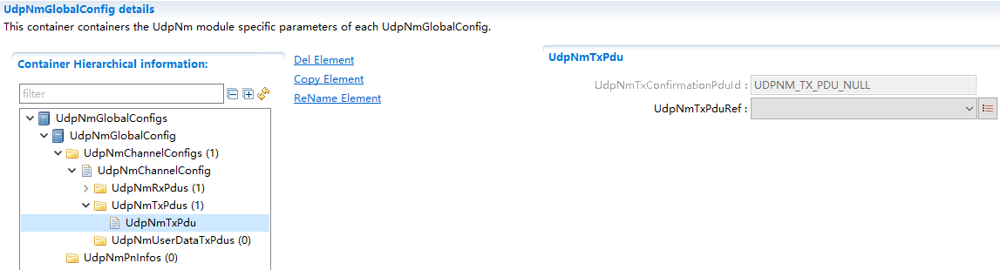
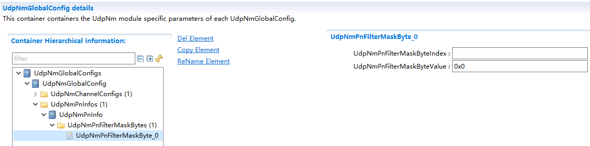

==============
UdpNm
==============

**缩写词注解**

+------------+---------------------------+----------------------------+
| **         | **英文全称**              | **中文解释**               |
| 缩写词**   |                           |                            |
+------------+---------------------------+----------------------------+
| API        | Application Programming   | 应用程序接口               |
|            | Interface                 |                            |
+------------+---------------------------+----------------------------+
| BSW        | Basic Software            | 基础软件模式管理           |
+------------+---------------------------+----------------------------+
| EthIf      | Ethernet Interface        | 以太网接口模块             |
+------------+---------------------------+----------------------------+
| DEM        | Diagnostic Event Manager  | 诊断事件管理模块           |
+------------+---------------------------+----------------------------+
| DET        | Default Error Tracer      | 默认错误检测模块           |
+------------+---------------------------+----------------------------+
| NM         | Network Management        | 网络管理                   |
+------------+---------------------------+----------------------------+
| PDU        | Protocol Data Unit        | 协议数据单元               |
+------------+---------------------------+----------------------------+
| SDU        | Service Data Unit         | 服务数据单元               |
+------------+---------------------------+----------------------------+
| PNI        | Partial Network           | 部分网络信息               |
|            | Information               |                            |
+------------+---------------------------+----------------------------+
| PN         | Partial Network           | 部分网络                   |
+------------+---------------------------+----------------------------+
| PNC        | Partial Network Cluster   | 部分网络集群               |
+------------+---------------------------+----------------------------+
| ERA        | External Request Array    | 外部请求集合               |
+------------+---------------------------+----------------------------+
| EIRA       | External and Internal     | 外部和内部请求集合         |
|            | Request Array             |                            |
+------------+---------------------------+----------------------------+
| UdpNm      | Udp Network Management    | Udp网络管理                |
+------------+---------------------------+----------------------------+
| CBV        | Control Bit Vector        | 控制位向量                 |
+------------+---------------------------+----------------------------+
| CWU        | Car Wakeup                | 车辆唤醒                   |
+------------+---------------------------+----------------------------+
| TCP/IP     | A family of communication | 计算机                     |
|            | protocols used in         | 网络中使用的一系列通信协议 |
|            | computer networks         |                            |
+------------+---------------------------+----------------------------+
| UDP        | User Datagram Protocol    | 用户数据报协议             |
+------------+---------------------------+----------------------------+
| SoAd       | Socket Adapter            | Socket适配层               |
+------------+---------------------------+----------------------------+

简介
====

UdpNm模块的核心功能是协调网络正常运行和总线睡眠模式之间的转换，除此之外，还提供了可选功能，例如检测当前节点或检测其他所有节点是否准备休眠等。

UdpNm提供网络管理接口（Nm）和TCP/IP协议栈之间的适配。UdpNm通过调用SoAd模块的发送API来传输数据，并提供接收API给SoAd用于接收下层网络管理报文。Nm模块调用UdpNm模块API来更改UdpNm的当前状态机状态，UdpNm的状态机模式切换需要通知给Nm模块。

|image1|

图 UdpNm模块位置示意图

UdpNm模块的主要功能为：

1、协调网络正常运行和总线睡眠模式之间的转换

2、可选功能

1) 检测远程睡眠指令功能

2) 用户数据功能

3) 被动模式功能

   4) NM PDU Rx指示功能

   5) 状态变化通知功能

   6) 通讯控制功能

   7) NM协调器同步支持功能

3、局部联网（PN）功能

4、车辆唤醒功能

参考资料
--------

[1] AUTOSAR_SWS_SocketAdaptor.pdf，R19-11

[2] AUTOSAR_SWS_UDPNetworkManagement.pdf，R19-11

[3] AUTOSAR_SWS_NetworkManagementInterface.pdf，R19-11

[4] AUTOSAR_SWS_COMManager.pdf，R19-11

功能描述
========

AUTOSAR
UdpNm基于分散的直接网络管理策略，这意味着每个网络节点仅根据在通信系统内接收和/或发送报文，执行自给自足的活动。

AUTOSAR
UdpNm协调算法基于周期性的NM数据包，集群中的所有节点都通过广播传输接收这些数据包。
接收到NM数据包表明发送节点要保持NM集群处于唤醒状态。
如果任何节点准备好进入总线睡眠模式，它将停止发送NM数据包，但是只要接收到来自其他节点的NM数据包，它就会推迟过渡到总线睡眠模式。如果在专用计时器超时前都未接收到NM数据包，则每个节点都会启动到总线休眠模式的转换。UdpNm通过状态机切换和各状态定时器管理来完成协调算法。

状态机切换
----------

模式介绍
~~~~~~~~

AUTOSAR UdpNm协调算法的三种操作模式：

- Network Mode 网络模式

- Prepare Bus-Sleep Mode 准备总线睡眠模式

- Bus-Sleep Mode 总线睡眠模式

当本节点的操作模式发生变化的时候，需要通知上层Nm。

|image2|

图 UdpNm状态机

Network Mode
~~~~~~~~~~~~

Network Mode下包括三种内部状态：

- Repeat Message State 重复消息状态

- Normal Operation State 正常运行状态

- Ready Sleep State 就绪睡眠状态

下面对这三种状态分别说明：

1. **Repeat Message State**

当节点配置为Passive
Mode的节点，意味着该节点只能接受报文而不能传输任何报文，关于Passive
Mode具体的将在下面章节中进行说明。

对于非Passive Mode的节点，Repeat Message State可确保从Bus-Sleep或Prepare
Bus-Sleep到Network
Mode的任何过渡对于网络上的其他节点都是可见的。此外，它确保所有节点在UdpNmRepeatMessageTime（配置参数）内保持活动状态。当UdpNmRepeatMessageTime配置为0，表示未配置Repeat
Message State。这意味着Repeat Message
State是瞬态的，在进入后立即离开，因此无法保证启动稳定性，并且无法执行节点检测过程。当UdpNmRepeatMessageTime超时后，节点将离开Repeat
Message State而切至其他状态。若当前网络状态为请求，切换到Normal
Operation State，若当前网络状态为释放，切换到Ready Sleep State。

当非Passive Mode的节点从Bus-Sleep Mode, Prepare-Bus-Sleep Mode，Normal
Operation State或Ready Sleep State进入Repeat Message
State时，传输功能应该被重启，为了防止总线数据爆发，降低负载，每次进入Repeat
Message
State时，都要延迟UdpNmMsgCycleOffset（配置参数）段时间后，再开始传输数据，若配置UdpNmImmediateNmTransmissions并且网络被请求则不需要延迟UdpNmMsgCycleOffset时间。

（2）\ **Normal Operation State**

Normal Operation
State可确保只要需要网络功能，任何节点都可以使NM集群保持唤醒状态。当处于Normal
Operation
State，节点按照UdpNmMsgCycleTime周期发送报文，当网络释放后，UdpNm进入Ready
Sleep state。

**（3）Ready Sleep State**

Ready Sleep State可确保NM群集中的任何节点都在等待过渡到Prepare Bus-Sleep
Mode。

当进入Ready Sleep
State，本节点就不再传输数据。当节点接收到其他节点传输的报文时，会将NM-Timeout定时器重置，当NM-Timeout定时器超时且处于Ready
Sleep State时，网络管理进入Prepare Bus-Sleep
Mode。其中NM-Timeout定时器的时间是由UdpNmTimeoutTime（配置参数）决定的。

Prepare Bus Sleep Mode
~~~~~~~~~~~~~~~~~~~~~~

Prepare Bus Sleep
state目的是确保所有节点都有时间在进入总线休眠状态之前停止其网络活动，使总线活动平静下来，最后在“准备总线睡眠模式”下总线上没有任何活动。

当本节点进入Prepare Bus-Sleep
Mode，UdpNmWaitBusSleepTime（配置参数）定时器被启动，当UdpNmWaitBusSleepTime定时器超时，当前状态将由Prepare
Bus-Sleep Mode切换至Bus-Sleep Mode。

如果在Prepare Bus-Sleep
Mode接收到其他节点传输的网络管理报文时，当前UdpNm状态将由Prepare
Bus-Sleep Mode切换至Network Mode， 默认情况下，将进入Repeat Message
State。

如果在Prepare Bus-Sleep Mode接收到网络请求时，当前状态将由Prepare
Bus-Sleep Mode切换至Network Mode， 默认情况下，将进入Repeat Message
State。如果UdpNmImmediateRestartEnabled（配置参数）被设置为TRUE，那么在这种情况下会立刻触发一次传输，这样做的理由是：集群中的其他节点仍处于Prepare
Bus-Sleep Mode，在这种特殊情况下，应避免过渡到Bus-Sleep
Mode，并应尽快恢复总线通信。由于UdpNm中网络管理PDU的传输偏移导致，处于Repeat
Message State的第一个网络管理PDU的传输可能会大大延迟。
为了避免延迟重新启动网络可以立即请求发送网络管理PDU。

Bus-Sleep Mode
~~~~~~~~~~~~~~

Bus-Sleep
state的目的是在不交换任何消息时降低节点的功耗。将通信控制器切换到睡眠模式，激活相应的唤醒机制，最后将功耗降低到总线睡眠模式下的适当水平。

当UdpNm处于Bus-Sleep
Mode接收到网络管理报文时，此时UdpNm不会切换至Network
Mode，而是通知Nm模块，由上层模块做决策。

当UdpNm处于Bus-Sleep
Mode接收到被动请求或网络请求时，当前状态将由Bus-Sleep Mode切换至Network
Mode， 默认情况下，将进入Repeat Message State。

PDU格式
-------

网络管理的报文有特定的格式要求，报文数据段格式如图：

|image3|

图 NM PDU默认格式

其中CBV （Control Bit Vector）字节对应的bit位标识如下

|image4|

图 CBV格式

对于CBV中的bit说明如下：

Bit 0 重复消息请求

0：未请求进入Repeat Message State

1：请求进入Repeat Message State

Bit
1,2：保留位，当配置项UdpNmCoordinatorEnabled使能时，该位等于配置的UdpNmCoordinatorId的值

| Bit 3 NM协调器休眠位
| 0：主协调器不要求启动同步休眠
| 1：主协调员请求启动同步休眠

| Bit 4主动唤醒位
| 0：节点尚未唤醒网络
| 1：节点唤醒了网络

Bit 6局部网络信息位（PNI）

| 0：NM消息不包含局部网络请求信息
| 1：NM消息包含局部网络请求信息,该位由配置决定，运行阶段不改变

Bit5 Bit7为保留位

Nm Pdu中的User
Data可以通过UdpNm的配置引用EcuC中的Pdu。未使用的情况下默认全0xFF，通过Nm的接口去抓取当前接收与发送的User
Data。

可选功能
--------

UdpNm可以通过使能配置参数来使能以下可选功能。

检测远程睡眠指令功能
~~~~~~~~~~~~~~~~~~~~

远程睡眠指示应用于一种情况，当处于Normal Operation
State的节点发现集群中的所有其他节点都准备睡眠，但处于Normal Operation
State状态的节点仍将保持总线苏醒。为了避免这种情况，可以使能远程睡眠指示功能。

如果当前UdpNm状态为Normal Operation
State，并且在UdpNmRemoteSleepIndTime（配置参数）定时器内未收到其他节点发送的网络管理报文，则通知上层Nm模块集群内的其他节点均已准备睡眠。

如果UdpNm已通知上层Nm模块，而在Normal Operation State或Ready Sleep
State下又收到了网络管理报文，或者UdpNm从Normal Operation
State切换至Repeat Message
State，UdpNm需要通知上层Nm模块集群中的某些节点不再准备睡眠。

用户数据功能
~~~~~~~~~~~~

使用UdpNmUserDataEnabled开关（配置参数）对NM用户数据的支持进行静态配置。

当用户数据功能使能，可以调用UdpNm_SetUserData，该函数可以设置总线上接下来发送的NM数据包的NM用户数据。也可以调用UdpNm_GetUserDat，该函数可以提供包含在最近接收到的NM
PDU的有效载荷中的NM用户数据。

如果UdpNmComUserDataSupport（配置参数）配置为使能，UdpNm将在每次请求发送相应的NM消息之前从引用的NM
I-PDU收集NM用户数据，并将用户数据与其他NM字节合并。此时就不能再通过UdpNm_SetUserData函数设置用户数据。

被动模式功能
~~~~~~~~~~~~

在被动模式下，节点仅接收NM消息，但不发送任何NM消息。被动模式应使用UdpNmPassiveModeEnabled开关（配置参数）进行静态配置。

NM PDU Rx指示功能
~~~~~~~~~~~~~~~~~

若UdpNmPduRxIndicationEnabled（配置参数）使能，在成功接收NM
PDU时，UdpNm应通过调用Nm_PduRxIndication通知上层。

状态变化通知功能
~~~~~~~~~~~~~~~~

如果UdpNmStateChangeIndEnabled（配置参数）使能，则UdpNm需要将UdpNm状态的所有更改通知上层Nm。

通讯控制功能
~~~~~~~~~~~~

使用UdpNmComControlEnabled开关（配置参数），可以静态配置通信控制。当UdpNm_DisableCommunication函数被调用，UdpNm模块NM报文的传输能力将被停止，直到调用UdpNm_EnableCommunication，UdpNm的nm报文传输能力被恢复。

当UdpNm_DisableCommunication函数被调用，UdpNm的NM-Timeout定时器将被停止，调用函数UdpNm_EnableCommunication，NM-Timeout定时器将被恢复。若一直未调用UdpNm_EnableCommunication，UdpNm会一直处在Ready
Sleep
State中无法进入休眠状态，在这种情况下，AutoSar规定，当网络被释放后，UdpNm将从Ready
Sleep State切换至Prepare Bus-Sleep Mode。

NM协调器同步支持功能
~~~~~~~~~~~~~~~~~~~~

当有多个协调器连接到同一条总线时，在CBV中，NmCoordinatorSleepReady位用于指示主协调器请求启动关闭，有关CBV的概念见1.2.4章。

当UdpNm处于网络模式，接收网络管理报文的CBV中NmCoordinatorSleepReady=1，则UdpNm通知上层协调睡眠功能被请求。

当UdpNm已通知上层协调睡眠功能被请求，接收网络管理报文的CBV中NmCoordinatorSleepReady=0，则UdpNm通知上层协调睡眠功能请求被取消。

PN功能 
~~~~~~~

Autosar4.x版本开始支持PN功能，Pn功能的目的是基于功能划分网络，形成局域网；这种功能的划分由整车设计完成，对于各节点只需要关心自身存在的网段。只有在UdpNmGlobalPnSupport(配置参数)和各通道下的UdpNmPnEnabled(配置参数)使能的情况下，Pn功能才能正常工作。

如果UdpNmPnEnabled(配置参数)为FALSE，则UdpNm将执行正常的Rx指示处理，并且应禁用Pn功能。如果UdpNmPnEnabled为TRUE，接收到的NM-PDU
CBV中的PNI位为0，则UdpNm模块应执行常规的Rx指示处理，从而省去了Pn功能的扩展。如果UdpNmPnEnabled为TRUE并且接收到的NM-PDU
CBV中的PNI位为1，则UdpNm模块处理NM-PDU的Pn信息。

如果UdpNmPnEnabled为TRUE，则UdpNm模块应将CBV中发送的PNI位的值设置为1，要使用Pn，则必须使用CBV。

如果UdpNmPnEnabled为FALSE，则UdpNm模块应将CBV中已发送的PNI位的值始终设置为0。

Pn信息的位置位于网络管理报文的用户数据部分中，具体的位置通过UdpNmPnInfoOffset和UdpNmPnInfoLength来确定。

例如当UdpNmPnInfoOffset = 3，UdpNmPnInfoLength =
2，代表NM消息只有字节3和字节4包含PN请求信息。

PN过滤
^^^^^^

PNC是Partial Network
Cluster的缩写，它是指为了在车辆网络中支持一个或多个车辆功能而由多个ECU构成的集群。PNC的编号我们称为PNC
ID，范围8~63，整车网络统一编号，关于PNC id与UdpNm Pdu 映射关系说明：PNC
ID对应UdpNm Pdu中的一个bit，例如PNC ID=8，对应UdpNm Pdu Byte
1的bit0；PNC ID=63，对应Byte 7的bit7；PNC
ID对应的bit数值为1，则表示当前PN网络被请求，为0则表示网络释放。

通过配置参数UdpNmPnFilterMaskByte，UdpNm可以检测到哪个PN与ECU相关，而哪个与PN不相关。

UdpNmPnFilterMaskByte的每个位具有以下含义：

0 PN请求与本ECU无关。 如果接收的NM
PDU中将该位置设置为1，也无法使ECU的通讯栈处于唤醒状态，因为该位的请求与本ECU是无关的。

1 PN请求与本ECU有关。
如果已在接收的NM-PDU中将该位置设置为1，则ECU的通信堆栈将保持唤醒状态。

如果至少有一位与本ECU相关的PN请求，那么这条Nm
PDU对于UdpNm来说就是有用的，需要进行处理，如果没有一位与本ECU相关的PN请求，那么这条NM
PDU将被忽略。

ERA与EIRA
^^^^^^^^^

ERA是指ECU外部的PN请求的聚合，当UdpNmPnEraCalcEnabled使能(配置参数)，表示支持ERA功能。而EIRA是指ECU内部和外部Pn请求的聚合，当UdpNmPnEiraCalcEnabled使能(配置参数)，表示支持EIRA功能。

ERA是在网关节点才使用，此时没有内部的请求，只有不同的Channel对Pn的外部请求，ERA会为每个channel的每个PN位都设置一个监测的定时器，当UdpNmPnResetTime(配置参数)时间内未请求PN，则将该PN的请求状态设置为未请求，每次请求状态有变化的时候都会通知上层PduR，由PduR模块进行转发。

EIRA体现了当前节点与网络上其他节点对某一个PNC的请求与释放情况；EIRA不区分物理Channel，只针对不同的PN。EIRA会为每个PN位都设置一个监测的定时器，当UdpNmPnResetTime(配置参数)时间内未请求PN，则将该PN的请求状态设置为未请求，每次请求状态有变化的时候都会通知上层PduR，由PduR模块进行转发。

自发传输
^^^^^^^^

如果网络被请求并且UdpNmPnHandleMultipleNetworkRequest（配置参数）设置为TRUE，无论UdpNm处于Ready
Sleep State，Normal Operation State或Repeat Message
State，UdpNm应更改为或重新启动为Repeat Message
State。并且，UdpNm会传输UdpNmImmediateNmTransmissions（配置参数）数量的报文，其中第一条报文立即传输，其他报文按UdpNmImmediateNmCycleTime传输（配置参数）。

车辆唤醒功能
~~~~~~~~~~~~

当UdpNmCarWakeUpRxEnabled（配置参数）使能时，车辆唤醒功能被启用，目前暂时没有使用场景。如果任何接收到的NM-PDU中的Car
Wakeup位为1，都会通知上层Nm。

当UdpNmCarWakeUpRxEnabled（配置参数）使能，UdpNmCarWakeUpFilterEnabled（配置参数）也使能时，只有收到NodeId等于UdpNmCarWakeUpFilterNodeId的报文时，才会通知上层。

源文件描述
==========

表 UdpNm组件文件描述

+------------------+---------------------------------------------------+
| **文件**         | **说明**                                          |
+------------------+---------------------------------------------------+
| UdpNm_Cfg.h      | 用于定义UdpNm模块预编译时用到的宏。               |
+------------------+---------------------------------------------------+
| UdpNm_Cfg.c      | 配置参数源文件，包含各个配置项的定义。            |
+------------------+---------------------------------------------------+
| UdpNm_Internal.h | UdpNm模块运行时类型定义，内部宏定义头文件。       |
+------------------+---------------------------------------------------+
| UdpNm_SchM.h     | 提供给SchM的头文件，用于公开周期调度函数          |
+------------------+---------------------------------------------------+
| UdpNm_MemMap.h   | UdpNm模块函数和变量存储位置定义文件。             |
+------------------+---------------------------------------------------+
| UdpNm.h          | UdpNm模块头文                                     |
|                  | 件，通过加载该头文件访问UdpNm公开的函数和数据类型 |
+------------------+---------------------------------------------------+
| UdpNm.c          | UdpNM模块实现源文件，各API实现在该文件中          |
+------------------+---------------------------------------------------+

|image5|

图 UdpNm组件文件交互关系图

API接口
=======

类型定义
--------

UdpNm_ConfigType类型定义
~~~~~~~~~~~~~~~~~~~~~~~~

+-----------+----------------------------------------------------------+
| 名称      | UdpNm_ConfigType                                         |
+-----------+----------------------------------------------------------+
| 类型      | Structure                                                |
+-----------+----------------------------------------------------------+
| 范围      | void                                                     |
+-----------+----------------------------------------------------------+
| 描述      | 此类型应包含容器UdpNm_GlobalConfig及其子容器的参数。     |
+-----------+----------------------------------------------------------+

输入函数描述
------------

+----------------------------------+-----------------------------------+
| **输入模块**                     | **API**                           |
+----------------------------------+-----------------------------------+
| Det                              | Det_ReportError                   |
+----------------------------------+-----------------------------------+
| Nm                               | Nm_CarWakeUpIndication            |
+----------------------------------+-----------------------------------+
|                                  | Nm_CoordReadyToSleepCancellation  |
+----------------------------------+-----------------------------------+
|                                  | Nm_CoordReadyToSleepIndication    |
+----------------------------------+-----------------------------------+
|                                  | Nm_PduRxIndication                |
+----------------------------------+-----------------------------------+
|                                  | Nm_RemoteSleepCancellation        |
+----------------------------------+-----------------------------------+
|                                  | Nm_RemoteSleepIndication          |
+----------------------------------+-----------------------------------+
|                                  | Nm_StateChangeNotification        |
+----------------------------------+-----------------------------------+
|                                  | Nm_TxTimeoutException             |
+----------------------------------+-----------------------------------+
|                                  | Nm_RepeatMessageIndication        |
+----------------------------------+-----------------------------------+
|                                  | Nm_BusSleepMode                   |
+----------------------------------+-----------------------------------+
|                                  | Nm_NetworkMode                    |
+----------------------------------+-----------------------------------+
|                                  | Nm_NetworkStartIndication         |
+----------------------------------+-----------------------------------+
|                                  | Nm_PrepareBusSleepMode            |
+----------------------------------+-----------------------------------+
| PduR                             | PduR_UdpNmRxIndication            |
+----------------------------------+-----------------------------------+
|                                  | PduR_UdpNmTriggerTransmit         |
+----------------------------------+-----------------------------------+
|                                  | PduR_UdpNmTxConfirmation          |
+----------------------------------+-----------------------------------+
| CanIf                            | CanIf_Transmit                    |
+----------------------------------+-----------------------------------+
| SoAd                             | SoAd_IfTransmit                   |
+----------------------------------+-----------------------------------+

静态接口函数定义
----------------

UdpNm_Init函数定义
~~~~~~~~~~~~~~~~~~

+-------------+-------------------+---------+-------------------------+
| 函数名称：  | UdpNm_Init        |         |                         |
+-------------+-------------------+---------+-------------------------+
| 函数原型：  | void UdpNm_Init(  |         |                         |
|             |                   |         |                         |
|             | U                 |         |                         |
|             | dpNm_ConfigType\* |         |                         |
|             | UdpNmConfigPtr    |         |                         |
|             |                   |         |                         |
|             | )                 |         |                         |
+-------------+-------------------+---------+-------------------------+
| 服务编号：  | 0x01              |         |                         |
+-------------+-------------------+---------+-------------------------+
| 同步/异步： | 同步              |         |                         |
+-------------+-------------------+---------+-------------------------+
| 是          | 不可重入          |         |                         |
| 否可重入：  |                   |         |                         |
+-------------+-------------------+---------+-------------------------+
| 输入参数：  | UdpNmConfigPtr    | 值域：  | 指向初始化结构体的指针  |
+-------------+-------------------+---------+-------------------------+
| 输          | 无                |         |                         |
| 入输出参数: |                   |         |                         |
+-------------+-------------------+---------+-------------------------+
| 输出参数：  | 无                |         |                         |
+-------------+-------------------+---------+-------------------------+
| 返回值：    | 无                |         |                         |
+-------------+-------------------+---------+-------------------------+
| 功能概述：  | 初始化UdpNm模块。 |         |                         |
+-------------+-------------------+---------+-------------------------+

UdpNm_PassiveStartUp函数定义
~~~~~~~~~~~~~~~~~~~~~~~~~~~~

+-------------+-------------------+---------+-------------------------+
| 函数名称：  | Udp               |         |                         |
|             | Nm_PassiveStartUp |         |                         |
+-------------+-------------------+---------+-------------------------+
| 函数原型：  | Std_ReturnType    |         |                         |
|             | UdpN              |         |                         |
|             | m_PassiveStartUp( |         |                         |
|             |                   |         |                         |
|             | NetworkHandleType |         |                         |
|             | nmChannelHandle   |         |                         |
|             |                   |         |                         |
|             | )                 |         |                         |
+-------------+-------------------+---------+-------------------------+
| 服务编号：  | 0x0e              |         |                         |
+-------------+-------------------+---------+-------------------------+
| 同步/异步： | 非同步            |         |                         |
+-------------+-------------------+---------+-------------------------+
| 是          | 可重入（同        |         |                         |
| 否可重入：  | 一通道不可重入）  |         |                         |
+-------------+-------------------+---------+-------------------------+
| 输入参数：  | nmChannelHandle   | 值域：  | NM通道Id                |
+-------------+-------------------+---------+-------------------------+
| 输          | 无                |         |                         |
| 入输出参数: |                   |         |                         |
+-------------+-------------------+---------+-------------------------+
| 输出参数：  | 无                |         |                         |
+-------------+-------------------+---------+-------------------------+
| 返回值：    | E_OK:             |         |                         |
|             | 被动启动          |         |                         |
|             | UdpNm网络管理成功 |         |                         |
|             |                   |         |                         |
|             | E_NOT_OK:         |         |                         |
|             | 被动启动          |         |                         |
|             | UdpNm网络管理失败 |         |                         |
+-------------+-------------------+---------+-------------------------+
| 功能概述：  | 被动启动UdpNm模块 |         |                         |
+-------------+-------------------+---------+-------------------------+

UdpNm_NetworkRequest函数定义
~~~~~~~~~~~~~~~~~~~~~~~~~~~~

+-------------+-------------------+---------+-------------------------+
| 函数名称：  | Udp               |         |                         |
|             | Nm_NetworkRequest |         |                         |
+-------------+-------------------+---------+-------------------------+
| 函数原型：  | Std_ReturnType    |         |                         |
|             | UdpN              |         |                         |
|             | m_NetworkRequest( |         |                         |
|             |                   |         |                         |
|             | NetworkHandleType |         |                         |
|             | nmChannelHandle   |         |                         |
|             |                   |         |                         |
|             | )                 |         |                         |
+-------------+-------------------+---------+-------------------------+
| 服务编号：  | 0x02              |         |                         |
+-------------+-------------------+---------+-------------------------+
| 同步/异步： | 非同步            |         |                         |
+-------------+-------------------+---------+-------------------------+
| 是          | 可重入（同        |         |                         |
| 否可重入：  | 一通道不可重入）  |         |                         |
+-------------+-------------------+---------+-------------------------+
| 输入参数：  | nmChannelHandle   | 值域：  | NM通道Id                |
+-------------+-------------------+---------+-------------------------+
| 输          | 无                |         |                         |
| 入输出参数: |                   |         |                         |
+-------------+-------------------+---------+-------------------------+
| 输出参数：  | 无                |         |                         |
+-------------+-------------------+---------+-------------------------+
| 返回值：    | E_OK: 请求被接受  |         |                         |
|             |                   |         |                         |
|             | E_NOT_OK:         |         |                         |
|             | 请求被拒绝        |         |                         |
+-------------+-------------------+---------+-------------------------+
| 功能概述：  | 请求使用网络      |         |                         |
+-------------+-------------------+---------+-------------------------+

UdpNm_NetworkRelease函数定义
~~~~~~~~~~~~~~~~~~~~~~~~~~~~

+-------------+-------------------+---------+-------------------------+
| 函数名称：  | Udp               |         |                         |
|             | Nm_NetworkRelease |         |                         |
+-------------+-------------------+---------+-------------------------+
| 函数原型：  | Std_ReturnType    |         |                         |
|             | UdpN              |         |                         |
|             | m_NetworkRelease( |         |                         |
|             |                   |         |                         |
|             | NetworkHandleType |         |                         |
|             | nmChannelHandle   |         |                         |
|             |                   |         |                         |
|             | )                 |         |                         |
+-------------+-------------------+---------+-------------------------+
| 服务编号：  | 0x03              |         |                         |
+-------------+-------------------+---------+-------------------------+
| 同步/异步： | 非同步            |         |                         |
+-------------+-------------------+---------+-------------------------+
| 是          | 可重入（同        |         |                         |
| 否可重入：  | 一通道不可重入）  |         |                         |
+-------------+-------------------+---------+-------------------------+
| 输入参数：  | nmChannelHandle   | 值域：  | NM通道Id                |
+-------------+-------------------+---------+-------------------------+
| 输          | 无                |         |                         |
| 入输出参数: |                   |         |                         |
+-------------+-------------------+---------+-------------------------+
| 输出参数：  | 无                |         |                         |
+-------------+-------------------+---------+-------------------------+
| 返回值：    | E_OK: 请求被接受  |         |                         |
|             |                   |         |                         |
|             | E_NOT_OK:         |         |                         |
|             | 请求被拒绝        |         |                         |
+-------------+-------------------+---------+-------------------------+
| 功能概述：  | 请求释放网络      |         |                         |
+-------------+-------------------+---------+-------------------------+

UdpNm_DisableCommunication函数定义
~~~~~~~~~~~~~~~~~~~~~~~~~~~~~~~~~~

+-------------+-------------------+---------+-------------------------+
| 函数名称：  | UdpNm_Dis         |         |                         |
|             | ableCommunication |         |                         |
+-------------+-------------------+---------+-------------------------+
| 函数原型：  | Std_ReturnType    |         |                         |
|             | UdpNm_Disa        |         |                         |
|             | bleCommunication( |         |                         |
|             |                   |         |                         |
|             | NetworkHandleType |         |                         |
|             | nmChannelHandle   |         |                         |
|             |                   |         |                         |
|             | )                 |         |                         |
+-------------+-------------------+---------+-------------------------+
| 服务编号：  | 0x0c              |         |                         |
+-------------+-------------------+---------+-------------------------+
| 同步/异步： | 非同步            |         |                         |
+-------------+-------------------+---------+-------------------------+
| 是          | 可重              |         |                         |
| 否可重入：  | 入(仅限不同通道)  |         |                         |
+-------------+-------------------+---------+-------------------------+
| 输入参数：  | nmChannelHandle   | 值域：  | NM通道Id                |
+-------------+-------------------+---------+-------------------------+
| 输          | 无                |         |                         |
| 入输出参数: |                   |         |                         |
+-------------+-------------------+---------+-------------------------+
| 输出参数：  | 无                |         |                         |
+-------------+-------------------+---------+-------------------------+
| 返回值：    | E_OK: 请求成功    |         |                         |
|             |                   |         |                         |
|             | E_NOT_OK:         |         |                         |
|             | 请求关闭通信失败  |         |                         |
+-------------+-------------------+---------+-------------------------+
| 功能概述：  | 用于ISO14229的    |         |                         |
|             | 28服务，关闭通信  |         |                         |
+-------------+-------------------+---------+-------------------------+

UdpNm_EnableCommunication函数定义
~~~~~~~~~~~~~~~~~~~~~~~~~~~~~~~~~

+-----------+---------------------+---------+-------------------------+
| 函        | UdpNm               |         |                         |
| 数名称：  | _EnableCommunication|         |                         |
+-----------+---------------------+---------+-------------------------+
| 函        | Std_ReturnType      |         |                         |
| 数原型：  | UdpNm_E             |         |                         |
|           | nableCommunication( |         |                         |
|           |                     |         |                         |
|           | NetworkHandleType   |         |                         |
|           | nmChannelHandle     |         |                         |
|           |                     |         |                         |
|           | )                   |         |                         |
+-----------+---------------------+---------+-------------------------+
| 服        | 0x0d                |         |                         |
| 务编号：  |                     |         |                         |
+-----------+---------------------+---------+-------------------------+
| 同        | 非同步              |         |                         |
| 步/异步： |                     |         |                         |
+-----------+---------------------+---------+-------------------------+
| 是否      | 可重入（            |         |                         |
| 可重入：  | 同一通道不可重入）  |         |                         |
+-----------+---------------------+---------+-------------------------+
| 输        | nmChannelHandle     | 值域：  | NM通道Id                |
| 入参数：  |                     |         |                         |
+-----------+---------------------+---------+-------------------------+
| 输入      | 无                  |         |                         |
| 输出参数: |                     |         |                         |
+-----------+---------------------+---------+-------------------------+
| 输        | 无                  |         |                         |
| 出参数：  |                     |         |                         |
+-----------+---------------------+---------+-------------------------+
| 返回值：  | E_OK: 请求成功      |         |                         |
|           |                     |         |                         |
|           | E_NOT_OK:           |         |                         |
|           | 请求使能通信失败    |         |                         |
+-----------+---------------------+---------+-------------------------+
| 功        | 用于ISO1422         |         |                         |
| 能概述：  | 9的28服务，使能通信 |         |                         |
+-----------+---------------------+---------+-------------------------+

UdpNm_SetUserData函数定义
~~~~~~~~~~~~~~~~~~~~~~~~~

+-----------+---------------------+---------+-------------------------+
| 函        | UdpNm_SetUserData   |         |                         |
| 数名称：  |                     |         |                         |
+-----------+---------------------+---------+-------------------------+
| 函        | Std_ReturnType      |         |                         |
| 数原型：  | UdpNm_SetUserData(  |         |                         |
|           |                     |         |                         |
|           | NetworkHandleType   |         |                         |
|           | nmChannelHandle,    |         |                         |
|           |                     |         |                         |
|           | const uint8\*       |         |                         |
|           | nmUserDataPtr       |         |                         |
|           |                     |         |                         |
|           | )                   |         |                         |
+-----------+---------------------+---------+-------------------------+
| 服        | 0x04                |         |                         |
| 务编号：  |                     |         |                         |
+-----------+---------------------+---------+-------------------------+
| 同        | 同步                |         |                         |
| 步/异步： |                     |         |                         |
+-----------+---------------------+---------+-------------------------+
| 是否      | 不可重入            |         |                         |
| 可重入：  |                     |         |                         |
+-----------+---------------------+---------+-------------------------+
| 输        | nmChannelHandle     | 值域：  | NM通道Id                |
| 入参数：  |                     |         |                         |
+-----------+---------------------+---------+-------------------------+
|           | nmUserDataPtr       | 值域：  | 指向                    |
|           |                     |         | 要设置的用户数据的指针  |
+-----------+---------------------+---------+-------------------------+
| 输入      | 无                  |         |                         |
| 输出参数: |                     |         |                         |
+-----------+---------------------+---------+-------------------------+
| 输        | 无                  |         |                         |
| 出参数：  |                     |         |                         |
+-----------+---------------------+---------+-------------------------+
| 返回值：  | E_OK:               |         |                         |
|           | 设置用户数据成功    |         |                         |
|           |                     |         |                         |
|           | E_NOT_O             |         |                         |
|           | K：设置用户数据失败 |         |                         |
+-----------+---------------------+---------+-------------------------+
| 功        | 设置用户数据        |         |                         |
| 能概述：  |                     |         |                         |
+-----------+---------------------+---------+-------------------------+

UdpNm_GetUserData函数定义
~~~~~~~~~~~~~~~~~~~~~~~~~

+-------------+-------------------+---------+-------------------------+
| 函数名称：  | UdpNm_GetUserData |         |                         |
+-------------+-------------------+---------+-------------------------+
| 函数原型：  | Std_ReturnType    |         |                         |
|             | U                 |         |                         |
|             | dpNm_GetUserData( |         |                         |
|             |                   |         |                         |
|             | NetworkHandleType |         |                         |
|             | nmChannelHandle,  |         |                         |
|             |                   |         |                         |
|             | uint8\*           |         |                         |
|             | nmUserDataPtr     |         |                         |
|             |                   |         |                         |
|             | )                 |         |                         |
+-------------+-------------------+---------+-------------------------+
| 服务编号：  | 0x05              |         |                         |
+-------------+-------------------+---------+-------------------------+
| 同步/异步： | 同步              |         |                         |
+-------------+-------------------+---------+-------------------------+
| 是          | 不可重入          |         |                         |
| 否可重入：  |                   |         |                         |
+-------------+-------------------+---------+-------------------------+
| 输入参数：  | nmChannelHandle   | 值域：  | 请求获取用户数据的通道  |
+-------------+-------------------+---------+-------------------------+
| 输          | 无                |         |                         |
| 入输出参数: |                   |         |                         |
+-------------+-------------------+---------+-------------------------+
| 输出参数:   | nmUserDataPtr     | 值域：  | 指向用于输              |
|             |                   |         | 出用户数据的内存的指针  |
+-------------+-------------------+---------+-------------------------+
| 返回值：    | E_OK:             |         |                         |
|             | 请求用户数据成功  |         |                         |
|             |                   |         |                         |
|             | E_NOT_OK:         |         |                         |
|             | 请求用户数据失败  |         |                         |
+-------------+-------------------+---------+-------------------------+
| 功能概述：  | 请求获取用户数据  |         |                         |
+-------------+-------------------+---------+-------------------------+

UdpNm_GetNodeIdentifier函数定义
~~~~~~~~~~~~~~~~~~~~~~~~~~~~~~~

+-------------+-------------------+---------+-------------------------+
| 函数名称：  | UdpNm             |         |                         |
|             | _GetNodeIdentifier|         |                         |
+-------------+-------------------+---------+-------------------------+
| 函数原型：  | Std_ReturnType    |         |                         |
|             | UdpNm_G           |         |                         |
|             | etNodeIdentifier( |         |                         |
|             |                   |         |                         |
|             | NetworkHandleType |         |                         |
|             | nmChannelHandle,  |         |                         |
|             |                   |         |                         |
|             | uint8\*           |         |                         |
|             | nmNodeIdPtr       |         |                         |
|             |                   |         |                         |
|             | )                 |         |                         |
+-------------+-------------------+---------+-------------------------+
| 服务编号：  | 0x06              |         |                         |
+-------------+-------------------+---------+-------------------------+
| 同步/异步： | 同步              |         |                         |
+-------------+-------------------+---------+-------------------------+
| 是          | 可重入            |         |                         |
| 否可重入：  |                   |         |                         |
+-------------+-------------------+---------+-------------------------+
| 输入参数：  | nmChannelHandle   | 值域：  | 获取NodeId的通道号      |
+-------------+-------------------+---------+-------------------------+
| 输          | 无                |         |                         |
| 入输出参数: |                   |         |                         |
+-------------+-------------------+---------+-------------------------+
| 输出参数：  | nmNodeIdPtr       | 值域：  | 指向                    |
|             |                   |         | 存储NodeId的变量的指针  |
+-------------+-------------------+---------+-------------------------+
| 返回值：    | E_OK: 获取成功    |         |                         |
|             |                   |         |                         |
|             | E_NOT_OK:         |         |                         |
|             | 获取失败          |         |                         |
+-------------+-------------------+---------+-------------------------+
| 功能概述：  | 获取最近接收到的  |         |                         |
|             | NM报文中的NodeID  |         |                         |
+-------------+-------------------+---------+-------------------------+

UdpNm_GetLocalNodeIdentifier函数定义
~~~~~~~~~~~~~~~~~~~~~~~~~~~~~~~~~~~~

+-------------+-------------------+---------+-------------------------+
| 函数名称：  | UdpNm_GetLo       |         |                         |
|             | calNodeIdentifier |         |                         |
+-------------+-------------------+---------+-------------------------+
| 函数原型：  | Std_ReturnType    |         |                         |
|             | UdpNm_GetLoc      |         |                         |
|             | alNodeIdentifier( |         |                         |
|             |                   |         |                         |
|             | NetworkHandleType |         |                         |
|             | nmChannelHandle,  |         |                         |
|             |                   |         |                         |
|             | uint8\*           |         |                         |
|             | nmNodeIdPtr       |         |                         |
|             |                   |         |                         |
|             | )                 |         |                         |
+-------------+-------------------+---------+-------------------------+
| 服务编号：  | 0x07              |         |                         |
+-------------+-------------------+---------+-------------------------+
| 同步/异步： | 同步              |         |                         |
+-------------+-------------------+---------+-------------------------+
| 是          | 可重入            |         |                         |
| 否可重入：  |                   |         |                         |
+-------------+-------------------+---------+-------------------------+
| 输入参数：  | nmChannelHandle   | 值域：  | 获取NodeId的通道号      |
+-------------+-------------------+---------+-------------------------+
| 输          | 无                |         |                         |
| 入输出参数: |                   |         |                         |
+-------------+-------------------+---------+-------------------------+
| 输出参数：  | nmNodeIdPtr       | 值域：  | 指向                    |
|             |                   |         | 存储NodeId的变量的指针  |
+-------------+-------------------+---------+-------------------------+
| 返回值：    | E_OK: 获取成功    |         |                         |
|             |                   |         |                         |
|             | E_NOT_OK:         |         |                         |
|             | 获取失败          |         |                         |
+-------------+-------------------+---------+-------------------------+
| 功能概述：  | 获取配置          |         |                         |
|             | 的该通道的NodeID  |         |                         |
+-------------+-------------------+---------+-------------------------+

UdpNm_RepeatMessageRequest函数定义
~~~~~~~~~~~~~~~~~~~~~~~~~~~~~~~~~~

+-------------+-------------------+---------+-------------------------+
| 函数名称：  | UdpNm_Rep         |         |                         |
|             | eatMessageRequest |         |                         |
+-------------+-------------------+---------+-------------------------+
| 函数原型：  | Std_ReturnType    |         |                         |
|             | UdpNm_Repe        |         |                         |
|             | atMessageRequest( |         |                         |
|             |                   |         |                         |
|             | NetworkHandleType |         |                         |
|             | nmChannelHandle   |         |                         |
|             |                   |         |                         |
|             | )                 |         |                         |
+-------------+-------------------+---------+-------------------------+
| 服务编号：  | 0x08              |         |                         |
+-------------+-------------------+---------+-------------------------+
| 同步/异步： | 非同步            |         |                         |
+-------------+-------------------+---------+-------------------------+
| 是          | 可重入（同        |         |                         |
| 否可重入：  | 一通道不可重入）  |         |                         |
+-------------+-------------------+---------+-------------------------+
| 输入参数：  | nmChannelHandle   | 值域：  | 需要置位Repeat Message  |
|             |                   |         | Request Bit的通道       |
+-------------+-------------------+---------+-------------------------+
| 输          | 无                |         |                         |
| 入输出参数: |                   |         |                         |
+-------------+-------------------+---------+-------------------------+
| 输出参数：  | 无                |         |                         |
+-------------+-------------------+---------+-------------------------+
| 返回值：    | E_OK: 设置成功    |         |                         |
|             |                   |         |                         |
|             | E_NOT_OK:         |         |                         |
|             | 设置失败          |         |                         |
+-------------+-------------------+---------+-------------------------+
| 功能概述：  | 置位Repeat        |         |                         |
|             | Message Request   |         |                         |
|             | Bit               |         |                         |
+-------------+-------------------+---------+-------------------------+

UdpNm_GetPduData函数定义
~~~~~~~~~~~~~~~~~~~~~~~~

+-------------+-------------------+---------+-------------------------+
| 函数名称：  | UdpNm_GetPduData  |         |                         |
+-------------+-------------------+---------+-------------------------+
| 函数原型：  | Std_ReturnType    |         |                         |
|             | UdpNm_GetPduData( |         |                         |
|             |                   |         |                         |
|             | NetworkHandleType |         |                         |
|             | nmChannelHandle,  |         |                         |
|             |                   |         |                         |
|             | uint8\*           |         |                         |
|             | nmPduDataPtr      |         |                         |
|             |                   |         |                         |
|             | )                 |         |                         |
+-------------+-------------------+---------+-------------------------+
| 服务编号：  | 0x0a              |         |                         |
+-------------+-------------------+---------+-------------------------+
| 同步/异步： | 同步              |         |                         |
+-------------+-------------------+---------+-------------------------+
| 是          | 可重入            |         |                         |
| 否可重入：  |                   |         |                         |
+-------------+-------------------+---------+-------------------------+
| 输入参数：  | nmChannelHandle   | 值域：  | NM通道Id                |
+-------------+-------------------+---------+-------------------------+
| 输          | 无                |         |                         |
| 入输出参数: |                   |         |                         |
+-------------+-------------------+---------+-------------------------+
| 输出参数：  | nmNodeIdPtr       | 值域：  | 获取到的NM              |
|             |                   |         | Pdu数据要被存放的地址   |
+-------------+-------------------+---------+-------------------------+
| 返回值：    | E_OK: 获取成功    |         |                         |
|             |                   |         |                         |
|             | E_NOT_OK:         |         |                         |
|             | 获取失败          |         |                         |
+-------------+-------------------+---------+-------------------------+
| 功能概述：  | 获取最近接收的NM  |         |                         |
|             | Pdu               |         |                         |
+-------------+-------------------+---------+-------------------------+

UdpNm_GetState函数定义
~~~~~~~~~~~~~~~~~~~~~~

+-------------+-------------------+---------+-------------------------+
| 函数名称：  | UdpNm_GetState    |         |                         |
+-------------+-------------------+---------+-------------------------+
| 函数原型：  | Std_ReturnType    |         |                         |
|             | UdpNm_GetState(   |         |                         |
|             |                   |         |                         |
|             | NetworkHandleType |         |                         |
|             | nmChannelHandle,  |         |                         |
|             |                   |         |                         |
|             | Nm_StateType\*    |         |                         |
|             | nmStatePtr,       |         |                         |
|             |                   |         |                         |
|             | Nm_ModeType\*     |         |                         |
|             | nmModePtr         |         |                         |
|             |                   |         |                         |
|             | )                 |         |                         |
+-------------+-------------------+---------+-------------------------+
| 服务编号：  | 0x0b              |         |                         |
+-------------+-------------------+---------+-------------------------+
| 同步/异步： | 同步              |         |                         |
+-------------+-------------------+---------+-------------------------+
| 是          | 可重入            |         |                         |
| 否可重入：  |                   |         |                         |
+-------------+-------------------+---------+-------------------------+
| 输入参数：  | nmChannelHandle   | 值域：  | NM通道Id                |
+-------------+-------------------+---------+-------------------------+
| 输          | 无                |         |                         |
| 入输出参数: |                   |         |                         |
+-------------+-------------------+---------+-------------------------+
| 输出参数：  | nmStatePtr        | 值域：  | 存放UdpNm状态的地址     |
+-------------+-------------------+---------+-------------------------+
|             | nmModePtr         | 值域：  | 存放UdpNm模式的地址     |
+-------------+-------------------+---------+-------------------------+
| 返回值：    | E_OK: 获取成功    |         |                         |
|             |                   |         |                         |
|             | E_NOT_OK:         |         |                         |
|             | 获取失败          |         |                         |
+-------------+-------------------+---------+-------------------------+
| 功能概述：  | 获取UdpN          |         |                         |
|             | m当前的状态和模式 |         |                         |
+-------------+-------------------+---------+-------------------------+

UdpNm_GetVersionInfo函数定义
~~~~~~~~~~~~~~~~~~~~~~~~~~~~

+-------------+-------------------+---------+-------------------------+
| 函数名称：  | Udp               |         |                         |
|             | Nm_GetVersionInfo |         |                         |
+-------------+-------------------+---------+-------------------------+
| 函数原型：  | void              |         |                         |
|             | UdpN              |         |                         |
|             | m_GetVersionInfo( |         |                         |
|             |                   |         |                         |
|             | Std               |         |                         |
|             | _VersionInfoType\*|         |                         |
|             | versioninfo       |         |                         |
|             |                   |         |                         |
|             | )                 |         |                         |
+-------------+-------------------+---------+-------------------------+
| 服务编号：  | 0x09              |         |                         |
+-------------+-------------------+---------+-------------------------+
| 同步/异步： | 同步              |         |                         |
+-------------+-------------------+---------+-------------------------+
| 是          | 可重入            |         |                         |
| 否可重入：  |                   |         |                         |
+-------------+-------------------+---------+-------------------------+
| 输入参数：  | 无                |         |                         |
+-------------+-------------------+---------+-------------------------+
| 输          | 无                |         |                         |
| 入输出参数: |                   |         |                         |
+-------------+-------------------+---------+-------------------------+
| 输出参数：  | versioninfo       | 值域：  | 指向存储                |
|             |                   |         | 版本信息的buffer的地址  |
+-------------+-------------------+---------+-------------------------+
| 返回值：    | 无                |         |                         |
+-------------+-------------------+---------+-------------------------+
| 功能概述：  | 获取版本信息      |         |                         |
+-------------+-------------------+---------+-------------------------+

UdpNm_RequestBusSynchronization函数定义
~~~~~~~~~~~~~~~~~~~~~~~~~~~~~~~~~~~~~~~

+-------------+-------------------+---------+-------------------------+
| 函数名称：  | UdpNm_RequestB    |         |                         |
|             | usSynchronization |         |                         |
+-------------+-------------------+---------+-------------------------+
| 函数原型：  | Std_ReturnType    |         |                         |
|             | UdpNm_RequestBu   |         |                         |
|             | sSynchronization( |         |                         |
|             |                   |         |                         |
|             | NetworkHandleType |         |                         |
|             | nmChannelHandle   |         |                         |
|             |                   |         |                         |
|             | )                 |         |                         |
+-------------+-------------------+---------+-------------------------+
| 服务编号：  | 0x14              |         |                         |
+-------------+-------------------+---------+-------------------------+
| 同步/异步： | 非同步            |         |                         |
+-------------+-------------------+---------+-------------------------+
| 是          | 不可重入          |         |                         |
| 否可重入：  |                   |         |                         |
+-------------+-------------------+---------+-------------------------+
| 输入参数：  | nmChannelHandle   | 值域：  | NM通道Id                |
+-------------+-------------------+---------+-------------------------+
| 输          | 无                |         |                         |
| 入输出参数: |                   |         |                         |
+-------------+-------------------+---------+-------------------------+
| 输出参数：  | 无                |         |                         |
+-------------+-------------------+---------+-------------------------+
| 返回值：    | E_OK: 请求成功    |         |                         |
|             |                   |         |                         |
|             | E_NOT_OK:         |         |                         |
|             | 请求失败          |         |                         |
+-------------+-------------------+---------+-------------------------+
| 功能概述：  | 请求总线同步      |         |                         |
+-------------+-------------------+---------+-------------------------+

UdpNm_CheckRemoteSleepIndication函数定义
~~~~~~~~~~~~~~~~~~~~~~~~~~~~~~~~~~~~~~~~

+-------------+-------------------+---------+-------------------------+
| 函数名称：  | UdpNm_CheckRemo   |         |                         |
|             | teSleepIndication |         |                         |
+-------------+-------------------+---------+-------------------------+
| 函数原型：  | Std_ReturnType    |         |                         |
|             | UdpNm_CheckRemot  |         |                         |
|             | eSleepIndication( |         |                         |
|             |                   |         |                         |
|             | NetworkHandleType |         |                         |
|             | nmChannelHandle,  |         |                         |
|             |                   |         |                         |
|             | boolean\*         |         |                         |
|             | nm                |         |                         |
|             | RemoteSleepIndPtr |         |                         |
|             |                   |         |                         |
|             | )                 |         |                         |
+-------------+-------------------+---------+-------------------------+
| 服务编号：  | 0x11              |         |                         |
+-------------+-------------------+---------+-------------------------+
| 同步/异步： | 同步              |         |                         |
+-------------+-------------------+---------+-------------------------+
| 是          | 可重入            |         |                         |
| 否可重入：  |                   |         |                         |
+-------------+-------------------+---------+-------------------------+
| 输入参数：  | nmChannelHandle   | 值域：  | NM通道Id                |
+-------------+-------------------+---------+-------------------------+
| 输          | 无                |         |                         |
| 入输出参数: |                   |         |                         |
+-------------+-------------------+---------+-------------------------+
| 输出参数：  | nm                | 值域：  | 检测是否发生远          |
|             | RemoteSleepIndPtr |         | 程睡眠通知结果存储地址  |
+-------------+-------------------+---------+-------------------------+
| 返回值：    | E_OK: 检查成功    |         |                         |
|             |                   |         |                         |
|             | E_NOT_OK:         |         |                         |
|             | 检查失败          |         |                         |
+-------------+-------------------+---------+-------------------------+
| 功能概述：  | 检查是否          |         |                         |
|             | 发生远程睡眠通知  |         |                         |
+-------------+-------------------+---------+-------------------------+

UdpNm_SetCoordBits函数定义
~~~~~~~~~~~~~~~~~~~~~~~~~~

+-------------+-------------------+---------+-------------------------+
| 函数名称：  | U                 |         |                         |
|             | dpNm_SetCoordBits |         |                         |
+-------------+-------------------+---------+-------------------------+
| 函数原型：  | Std_ReturnType    |         |                         |
|             | Ud                |         |                         |
|             | pNm_SetCoordBits( |         |                         |
|             |                   |         |                         |
|             | NetworkHandleType |         |                         |
|             | nmChannelHandle,  |         |                         |
|             |                   |         |                         |
|             | uint8 nmCoordBits |         |                         |
|             |                   |         |                         |
|             | )                 |         |                         |
+-------------+-------------------+---------+-------------------------+
| 服务编号：  | 0x12              |         |                         |
+-------------+-------------------+---------+-------------------------+
| 同步/异步： | 同步              |         |                         |
+-------------+-------------------+---------+-------------------------+
| 是          | 可重入（同        |         |                         |
| 否可重入：  | 一通道不可重入）  |         |                         |
+-------------+-------------------+---------+-------------------------+
| 输入参数：  | nmChannelHandle   | 值域：  | NM通道Id                |
+-------------+-------------------+---------+-------------------------+
|             | nmCoordBits       | 值域：  | 低2个bit用来设置NM      |
|             |                   |         | coordinator ID          |
+-------------+-------------------+---------+-------------------------+
| 输          | 无                |         |                         |
| 入输出参数: |                   |         |                         |
+-------------+-------------------+---------+-------------------------+
| 输出参数：  | 无                |         |                         |
+-------------+-------------------+---------+-------------------------+
| 返回值：    | E_OK: 设置成功    |         |                         |
|             |                   |         |                         |
|             | E_NOT_OK:         |         |                         |
|             | 设置失败          |         |                         |
+-------------+-------------------+---------+-------------------------+
| 功能概述：  | 设置NM            |         |                         |
|             | coordinator ID    |         |                         |
+-------------+-------------------+---------+-------------------------+

UdpNm_SetSleepReadyBit函数定义 
~~~~~~~~~~~~~~~~~~~~~~~~~~~~~~~

+-------------+-------------------+---------+-------------------------+
| 函数名称：  | UdpNm             |         |                         |
|             | _SetSleepReadyBit |         |                         |
+-------------+-------------------+---------+-------------------------+
| 函数原型：  | Std_ReturnType    |         |                         |
|             | UdpNm             |         |                         |
|             | _SetSleepReadyBit(|         |                         |
|             |                   |         |                         |
|             | NetworkHandleType |         |                         |
|             | nmChannelHandle,  |         |                         |
|             |                   |         |                         |
|             | boolean           |         |                         |
|             | nmSleepReadyBit   |         |                         |
|             |                   |         |                         |
|             | )                 |         |                         |
+-------------+-------------------+---------+-------------------------+
| 服务编号：  | 0x16              |         |                         |
+-------------+-------------------+---------+-------------------------+
| 同步/异步： | 同步              |         |                         |
+-------------+-------------------+---------+-------------------------+
| 是          | 不可重入          |         |                         |
| 否可重入：  |                   |         |                         |
+-------------+-------------------+---------+-------------------------+
| 输入参数：  | nmChannelHandle   | 值域：  | NM通道Id                |
+-------------+-------------------+---------+-------------------------+
|             | nmSleepReadyBit   | 值域：  | ReadySleep              |
|             |                   |         | Bit要设置的的值         |
+-------------+-------------------+---------+-------------------------+
| 输          | 无                |         |                         |
| 入输出参数: |                   |         |                         |
+-------------+-------------------+---------+-------------------------+
| 输出参数：  | 无                |         |                         |
+-------------+-------------------+---------+-------------------------+
| 返回值：    | E_OK: 设置成功    |         |                         |
|             |                   |         |                         |
|             | E_NOT_OK:         |         |                         |
|             | 设置失败          |         |                         |
+-------------+-------------------+---------+-------------------------+
| 功能概述：  | 设置              |         |                         |
|             | CBV中的ReadySleep |         |                         |
|             | Bit               |         |                         |
+-------------+-------------------+---------+-------------------------+

UdpNm_Transmit函数定义
~~~~~~~~~~~~~~~~~~~~~~

+-------------+-------------------+---------+-------------------------+
| 函数名称：  | UdpNm_Transmit    |         |                         |
+-------------+-------------------+---------+-------------------------+
| 函数原型：  | FUN               |         |                         |
|             | C(Std_ReturnType, |         |                         |
|             | UDPNM_CODE)       |         |                         |
|             | UdpNm_Transmit(   |         |                         |
|             |                   |         |                         |
|             | PduIdType         |         |                         |
|             | TxPduId,          |         |                         |
|             |                   |         |                         |
|             | const             |         |                         |
|             | PduInfoType\*     |         |                         |
|             | PduInfoPtr        |         |                         |
|             |                   |         |                         |
|             | )                 |         |                         |
+-------------+-------------------+---------+-------------------------+
| 服务编号：  | 0x49              |         |                         |
+-------------+-------------------+---------+-------------------------+
| 同步/异步： | 同步              |         |                         |
+-------------+-------------------+---------+-------------------------+
| 是          | 对不              |         |                         |
| 否可重入：  | 同的TxPduId可重入 |         |                         |
+-------------+-------------------+---------+-------------------------+
| 输入参数：  | TxPduId           | 值域：  | 要发送的Pdu的Id         |
+-------------+-------------------+---------+-------------------------+
|             | PduInfoPtr        | 值域：  | 要发                    |
|             |                   |         | 送的数据长度和数据指针  |
+-------------+-------------------+---------+-------------------------+
| 输          | 无                |         |                         |
| 入输出参数: |                   |         |                         |
+-------------+-------------------+---------+-------------------------+
| 输出参数：  | 无                |         |                         |
+-------------+-------------------+---------+-------------------------+
| 返回值：    | E_OK: 发送成功    |         |                         |
|             |                   |         |                         |
|             | E_NOT_OK:         |         |                         |
|             | 发送失败          |         |                         |
+-------------+-------------------+---------+-------------------------+
| 功能概述：  | 请                |         |                         |
|             | 求发送一帧NM报文  |         |                         |
+-------------+-------------------+---------+-------------------------+

UdpNm_SoAdIfTxConfirmation函数定义
~~~~~~~~~~~~~~~~~~~~~~~~~~~~~~~~~~

+-------------+-------------------+---------+-------------------------+
| 函数名称：  | UdpNm_SoA         |         |                         |
|             | dIfTxConfirmation |         |                         |
+-------------+-------------------+---------+-------------------------+
| 函数原型：  | void              |         |                         |
|             | UdpNm_SoAd        |         |                         |
|             | IfTxConfirmation( |         |                         |
|             |                   |         |                         |
|             | PduIdType TxPduId |         |                         |
|             |                   |         |                         |
|             | )                 |         |                         |
+-------------+-------------------+---------+-------------------------+
| 服务编号：  | 0x40              |         |                         |
+-------------+-------------------+---------+-------------------------+
| 同步/异步： | 同步              |         |                         |
+-------------+-------------------+---------+-------------------------+
| 是          | 不同PduId可重入   |         |                         |
| 否可重入：  |                   |         |                         |
+-------------+-------------------+---------+-------------------------+
| 输入参数：  | TxPduId           | 值域：  | 发送成功的Pdu Id        |
+-------------+-------------------+---------+-------------------------+
| 输          | 无                |         |                         |
| 入输出参数: |                   |         |                         |
+-------------+-------------------+---------+-------------------------+
| 输出参数：  | 无                |         |                         |
+-------------+-------------------+---------+-------------------------+
| 返回值：    | 无                |         |                         |
+-------------+-------------------+---------+-------------------------+
| 功能概述：  | 底层通信模块      |         |                         |
|             | 确认成功发送报文  |         |                         |
+-------------+-------------------+---------+-------------------------+

UdpNm_SoAdIfRxIndication函数定义
~~~~~~~~~~~~~~~~~~~~~~~~~~~~~~~~

+-------------+-------------------+---------+-------------------------+
| 函数名称：  | UdpNm_S           |         |                         |
|             | oAdIfRxIndication |         |                         |
+-------------+-------------------+---------+-------------------------+
| 函数原型：  | void              |         |                         |
|             | UdpNm_So          |         |                         |
|             | AdIfRxIndication( |         |                         |
|             |                   |         |                         |
|             | PduIdType         |         |                         |
|             | RxPduId,          |         |                         |
|             |                   |         |                         |
|             | const             |         |                         |
|             | PduInfoType\*     |         |                         |
|             | PduInfoPtr        |         |                         |
|             |                   |         |                         |
|             | )                 |         |                         |
+-------------+-------------------+---------+-------------------------+
| 服务编号：  | 0x42              |         |                         |
+-------------+-------------------+---------+-------------------------+
| 同步/异步： | 同步              |         |                         |
+-------------+-------------------+---------+-------------------------+
| 是          | 不同PduId可重入   |         |                         |
| 否可重入：  |                   |         |                         |
+-------------+-------------------+---------+-------------------------+
| 输入参数：  | RxPduId           | 值域：  | 接收报文的PduId         |
+-------------+-------------------+---------+-------------------------+
|             | PduInfoPtr        | 值域：  | 接收报文                |
|             |                   |         | 的长度和指向报文的指针  |
+-------------+-------------------+---------+-------------------------+
| 输          | 无                |         |                         |
| 入输出参数: |                   |         |                         |
+-------------+-------------------+---------+-------------------------+
| 输出参数：  | 无                |         |                         |
+-------------+-------------------+---------+-------------------------+
| 返回值：    | 无                |         |                         |
+-------------+-------------------+---------+-------------------------+
| 功能概述：  | 底层通信模        |         |                         |
|             | 块调用该函数通知  |         |                         |
|             | UdpNm接收到NM报文 |         |                         |
+-------------+-------------------+---------+-------------------------+

UdpNm_SoAdIfTriggerTransmit函数定义
~~~~~~~~~~~~~~~~~~~~~~~~~~~~~~~~~~~

+-------------+-------------------+---------+-------------------------+
| 函数名称：  | UdpNm_SoAd        |         |                         |
|             | IfTriggerTransmit |         |                         |
+-------------+-------------------+---------+-------------------------+
| 函数原型：  | Std_ReturnType    |         |                         |
|             | UdpNm_SoAd        |         |                         |
|             | IfTriggerTransmit |         |                         |
|             | (                 |         |                         |
|             |                   |         |                         |
|             | PduIdType         |         |                         |
|             | TxPduId,          |         |                         |
|             |                   |         |                         |
|             | PduInfoType\*     |         |                         |
|             | PduInfoPtr        |         |                         |
|             |                   |         |                         |
|             | )                 |         |                         |
+-------------+-------------------+---------+-------------------------+
| 服务编号：  | 0x41              |         |                         |
+-------------+-------------------+---------+-------------------------+
| 同步/异步： | 同步              |         |                         |
+-------------+-------------------+---------+-------------------------+
| 是          | 不同PduId可重入   |         |                         |
| 否可重入：  |                   |         |                         |
+-------------+-------------------+---------+-------------------------+
| 输入参数：  | TxPduId           | 值域：  | 发送PduId               |
+-------------+-------------------+---------+-------------------------+
| 输          | PduInfoPtr        | 值域：  | 下层模块提              |
| 入输出参数: |                   |         | 供的用于存储发送数据的  |
|             |                   |         | buffer地址和buffer大小  |
|             |                   |         | 。返回时将实际拷贝的数  |
|             |                   |         | 据长度赋值给sduLength。 |
+-------------+-------------------+---------+-------------------------+
| 输出参数：  | 无                |         |                         |
+-------------+-------------------+---------+-------------------------+
| 返回值：    | E_OK:             |         |                         |
|             | 从                |         |                         |
|             | UdpNm获取数据成功 |         |                         |
|             |                   |         |                         |
|             | E_NOT_OK:         |         |                         |
|             | 从                |         |                         |
|             | UdpNm获取数据失败 |         |                         |
+-------------+-------------------+---------+-------------------------+
| 功能概述：  | 下层              |         |                         |
|             | 模块在发送数据时  |         |                         |
|             | 调用该函数从UdpN  |         |                         |
|             | m获取要发送的数据 |         |                         |
+-------------+-------------------+---------+-------------------------+

UdpNm_MainFunction函数定义
~~~~~~~~~~~~~~~~~~~~~~~~~~

+-------------+-------------------+---------+-------------------------+
| 函数名称：  | U                 |         |                         |
|             | dpNm_MainFunction |         |                         |
+-------------+-------------------+---------+-------------------------+
| 函数原型：  | void              |         |                         |
|             | Ud                |         |                         |
|             | pNm_MainFunction( |         |                         |
|             |                   |         |                         |
|             | NetworkHandleType |         |                         |
|             | channel           |         |                         |
|             |                   |         |                         |
|             | )                 |         |                         |
+-------------+-------------------+---------+-------------------------+
| 服务编号：  | 0x13              |         |                         |
+-------------+-------------------+---------+-------------------------+
| 同步/异步： | 同步              |         |                         |
+-------------+-------------------+---------+-------------------------+
| 是          | 不可重入          |         |                         |
| 否可重入：  |                   |         |                         |
+-------------+-------------------+---------+-------------------------+
| 输入参数：  | channel           | 值域：  | 通道号                  |
+-------------+-------------------+---------+-------------------------+
| 输          | 无                |         |                         |
| 入输出参数: |                   |         |                         |
+-------------+-------------------+---------+-------------------------+
| 输出参数：  | 无                |         |                         |
+-------------+-------------------+---------+-------------------------+
| 返回值：    | 无                |         |                         |
+-------------+-------------------+---------+-------------------------+
| 功能概述：  | UdpN              |         |                         |
|             | m模块周期调度函数 |         |                         |
+-------------+-------------------+---------+-------------------------+

可配置函数定义
--------------

无。

配置
====

UdpNmGlobalConfig
-----------------

|image6|

图 UdpNmGlobalConfig容器配置图

表 UdpNmGlobalConfig属性描述

+------------+----------+---------------------+----------+------------+
| **UI名称** | **描述** |                     |          |            |
+------------+----------+---------------------+----------+------------+
| UdpNmBusSy | 取值范围 | STD_ON,STD_OFF      | 默认取值 | 无         |
| nchronizat |          |                     |          |            |
| ionEnabled |          |                     |          |            |
+------------+----------+---------------------+----------+------------+
|            | 参数描述 | 预处理器开关，用于  |          |            |
|            |          | 启用总线同步支持，  |          |            |
|            |          | 此功                |          |            |
|            |          | 能仅适用于网关节点  |          |            |
+------------+----------+---------------------+----------+------------+
|            | 依赖关系 | 如果（UdpN          |          |            |
|            |          | mPassiveModeEnabled |          |            |
|            |          | ==                  |          |            |
|            |          | False），           |          |            |
|            |          | 那么等于（NmBusSyn  |          |            |
|            |          | chronizationEnabled |          |            |
|            |          | ）否则等于（False） |          |            |
+------------+----------+---------------------+----------+------------+
|            |          |                     |          |            |
+------------+----------+---------------------+----------+------------+
| Ud         | 取值范围 | STD_ON,STD_OFF      | 默认取值 | 无         |
| pNmComCont |          |                     |          |            |
| rolEnabled |          |                     |          |            |
+------------+----------+---------------------+----------+------------+
|            | 参数描述 | 预处理器开关，用    |          |            |
|            |          | 于启用通信控制支持  |          |            |
+------------+----------+---------------------+----------+------------+
|            | 依赖关系 | 如果（UdpN          |          |            |
|            |          | mPassiveModeEnabled |          |            |
|            |          | ==                  |          |            |
|            |          | False），那么等于（ |          |            |
|            |          | NmComControlEnabled |          |            |
|            |          | =                   |          |            |
|            |          | True                |          |            |
|            |          | ）否则等于（False） |          |            |
+------------+----------+---------------------+----------+------------+
| Udp        | 取值范围 | STD_ON,STD_OFF      | 默认取值 | 无         |
| NmComUserD |          |                     |          |            |
| ataSupport |          |                     |          |            |
+------------+----------+---------------------+----------+------------+
|            | 参数描述 | 用于启用Com用户     |          |            |
|            |          | 数据的预处理器开关  |          |            |
+------------+----------+---------------------+----------+------------+
|            | 依赖关系 | 如果UdpN            |          |            |
|            |          | mPassiveModeEnabled |          |            |
|            |          | == True则           |          |            |
|            |          | UdpN                |          |            |
|            |          | mComUserDataSupport |          |            |
|            |          | = False             |          |            |
+------------+----------+---------------------+----------+------------+
| UdpNmCo    | 取值范围 | STD_ON,STD_OFF      | 默认取值 | 无         |
| ordinatorS |          |                     |          |            |
| yncSupport |          |                     |          |            |
+------------+----------+---------------------+----------+------------+
|            | 参数描述 | 启用/禁             |          |            |
|            |          | 用协调器同步支持。  |          |            |
+------------+----------+---------------------+----------+------------+
|            | 依赖关系 | 如果将UdpNmPas      |          |            |
|            |          | siveModeEnabled设置 |          |            |
|            |          | 为TRUE，则必须将Ud  |          |            |
|            |          | pNmCoordinatorSyncS |          |            |
|            |          | upport设置为FALSE。 |          |            |
+------------+----------+---------------------+----------+------------+
| UdpNmDevE  | 取值范围 | true, false         | 默认取值 | false      |
| rrorDetect |          |                     |          |            |
+------------+----------+---------------------+----------+------------+
|            | 参数描述 | 打开                |          |            |
|            |          | 或关闭开发错误检测  |          |            |
+------------+----------+---------------------+----------+------------+
|            | 依赖关系 | 无                  |          |            |
+------------+----------+---------------------+----------+------------+
| UdpNmImm   | 取值范围 | STD_ON,STD_OFF      | 默认取值 | 无         |
| ediateRest |          |                     |          |            |
| artEnabled |          |                     |          |            |
+------------+----------+---------------------+----------+------------+
|            | 参数描述 | 预处理              |          |            |
|            |          | 器开关，用于在准备  |          |            |
|            |          | 总线休眠模式下根据  |          |            |
|            |          | 总线通信请求启用NM  |          |            |
|            |          | PDU立即传输         |          |            |
+------------+----------+---------------------+----------+------------+
|            | 依赖关系 | 如果定义了          |          |            |
|            |          | UdpNmPassiveModeEn  |          |            |
|            |          | abled，则不能定义它 |          |            |
+------------+----------+---------------------+----------+------------+
| U          | 取值范围 | 1 .. 255            | 默认取值 | 无         |
| dpNmNumber |          |                     |          |            |
| OfChannels |          |                     |          |            |
+------------+----------+---------------------+----------+------------+
|            | 参数描述 | 一个E               |          |            |
|            |          | CU中允许的UdpNm通道 |          |            |
+------------+----------+---------------------+----------+------------+
|            | 依赖关系 | 无                  |          |            |
+------------+----------+---------------------+----------+------------+
| Udp        | 取值范围 | STD_ON,STD_OFF      | 默认取值 | 无         |
| NmPassiveM |          |                     |          |            |
| odeEnabled |          |                     |          |            |
+------------+----------+---------------------+----------+------------+
|            | 参数描述 | 预处理器开关        |          |            |
|            |          | ，用于支持被动模式  |          |            |
+------------+----------+---------------------+----------+------------+
|            | 依赖关系 | 依赖于NmIf模块的N   |          |            |
|            |          | mPassiveModeEnabled |          |            |
+------------+----------+---------------------+----------+------------+
| UdpNmPd    | 取值范围 | STD_ON,STD_OFF      | 默认取值 | 无         |
| uRxIndicat |          |                     |          |            |
| ionEnabled |          |                     |          |            |
+------------+----------+---------------------+----------+------------+
|            | 参数描述 | 用于启用PDU         |          |            |
|            |          | R                   |          |            |
|            |          | x指示的预处理器开关 |          |            |
+------------+----------+---------------------+----------+------------+
|            | 依赖关系 | 依                  |          |            |
|            |          | 赖于NmIf模块的NmPdu |          |            |
|            |          | RxIndicationEnabled |          |            |
+------------+----------+---------------------+----------+------------+
| Ud         | 取值范围 | STD_ON,STD_OFF      | 默认取值 | FALSE      |
| pNmPnEiraC |          |                     |          |            |
| alcEnabled |          |                     |          |            |
+------------+----------+---------------------+----------+------------+
|            | 参数描述 | 指定UdpNm是否       |          |            |
|            |          | 计算内部外部请求的  |          |            |
|            |          | PN请求信息（EIRA）  |          |            |
+------------+----------+---------------------+----------+------------+
|            | 依赖关系 | 仅当U               |          |            |
|            |          | dpNmGlobalPnSupport |          |            |
|            |          | == true时可配置     |          |            |
+------------+----------+---------------------+----------+------------+
| UdpNmP     | 取值范围 | 0.001~65.535        | 默认取值 | 无         |
| nResetTime |          |                     |          |            |
+------------+----------+---------------------+----------+------------+
|            | 参数描述 | 以秒为单位指定重置  |          |            |
|            |          | 定时器的运行时间。  |          |            |
|            |          | 该复                |          |            |
|            |          | 位时间对EIRA和ERA中 |          |            |
|            |          | 的PN请求复位有效。  |          |            |
|            |          | 每个                |          |            |
|            |          | 通道的值应该相同。  |          |            |
|            |          | 因此它              |          |            |
|            |          | 是一个全局配置参数  |          |            |
+------------+----------+---------------------+----------+------------+
|            | 依赖关系 | 仅当U               |          |            |
|            |          | dpNmGlobalPnSupport |          |            |
|            |          | == true时可配置     |          |            |
|            |          |                     |          |            |
|            |          | UdpNmPnResetTime>   |          |            |
|            |          | UdpNmMsgCycleTime   |          |            |
|            |          |                     |          |            |
|            |          | UdpNmPnResetTime    |          |            |
|            |          | <UdpNmTimeoutTime   |          |            |
+------------+----------+---------------------+----------+------------+
| UdpNmR     | 取值范围 | STD_ON,STD_OFF      | 默认取值 | 无         |
| emoteSleep |          |                     |          |            |
| IndEnabled |          |                     |          |            |
+------------+----------+---------------------+----------+------------+
|            | 参数描述 | 预处理器开关，支持  |          |            |
|            |          | 远程睡眠指示，此功  |          |            |
|            |          | 能仅适用于网关节点  |          |            |
+------------+----------+---------------------+----------+------------+
|            | 依赖关系 | 如果（UdpN          |          |            |
|            |          | mPassiveModeEnabled |          |            |
|            |          | ==                  |          |            |
|            |          | False），那么等于（ |          |            |
|            |          | NmComControlEnabled |          |            |
|            |          | ）否则等于（False） |          |            |
+------------+----------+---------------------+----------+------------+
| UdpNmS     | 取值范围 | STD_ON,STD_OFF      | 默认取值 | 无         |
| tateChange |          |                     |          |            |
| IndEnabled |          |                     |          |            |
+------------+----------+---------------------+----------+------------+
|            | 参数描述 | 用                  |          |            |
|            |          | 于启用UdpNm状态更改 |          |            |
|            |          | 通知的预处理器开关  |          |            |
+------------+----------+---------------------+----------+------------+
|            | 依赖关系 | 依赖于NmS           |          |            |
|            |          | tateChangeIdEnabled |          |            |
+------------+----------+---------------------+----------+------------+
| UdpNmUserD | 取值范围 | STD_ON,STD_OFF      | 默认取值 | 无         |
| ataEnabled |          |                     |          |            |
+------------+----------+---------------------+----------+------------+
|            | 参数描述 | 预处理器开关        |          |            |
|            |          | ，用于支持用户数据  |          |            |
+------------+----------+---------------------+----------+------------+
|            | 依赖关系 | 依赖                |          |            |
|            |          | 于NmUserDataEnabled |          |            |
+------------+----------+---------------------+----------+------------+
| UdpNmVers  | 取值范围 | STD_ON,STD_OFF      | 默认取值 | 无         |
| ionInfoApi |          |                     |          |            |
+------------+----------+---------------------+----------+------------+
|            | 参数描述 | 启用                |          |            |
|            |          | 或者禁用版本获取API |          |            |
+------------+----------+---------------------+----------+------------+
|            | 依赖关系 | 无                  |          |            |
+------------+----------+---------------------+----------+------------+
| UdpNmPnEir | 取值范围 | Reference to [ Pdu  | 默认取值 | 无         |
| aRxNSduRef |          | ]                   |          |            |
+------------+----------+---------------------+----------+------------+
|            | 参数描述 | 引                  |          |            |
|            |          | 用COM-Stack中Pdu。  |          |            |
|            |          | U                   |          |            |
|            |          | dpNm只需要一个SduRe |          |            |
|            |          | f，因为EIRA是所有以 |          |            |
|            |          | 太网通道上的聚合。  |          |            |
+------------+----------+---------------------+----------+------------+
|            | 依赖关系 | 仅当Udp             |          |            |
|            |          | NmPnEiraCalcEnabled |          |            |
|            |          | ==                  |          |            |
|            |          | t                   |          |            |
|            |          | rue时可配，且关联的 |          |            |
|            |          | PDU应该在PDUR中引用 |          |            |
+------------+----------+---------------------+----------+------------+

UdpNmChannelConfig
~~~~~~~~~~~~~~~~~~

|image7|

图 UdpNmChannelConfig容器配置图

表 UdpNmChannelConfig属性描述

+------------+----------+---------------------+----------+------------+
| **UI名称** | **描述** |                     |          |            |
+------------+----------+---------------------+----------+------------+
| UdpNmAc    | 取值范围 | STD_ON,STD_OFF      | 默认取值 | FALSE      |
| tiveWakeup |          |                     |          |            |
| BitEnabled |          |                     |          |            |
+------------+----------+---------------------+----------+------------+
|            | 参数描述 | 在UdpNm模块中       |          |            |
|            |          | 启用/禁用处理Active |          |            |
|            |          | Wakeup Bit          |          |            |
+------------+----------+---------------------+----------+------------+
|            | 依赖关系 | 此参数仅在          |          |            |
|            |          | UdpNmPassiveModeEna |          |            |
|            |          | bled为False时可配置 |          |            |
+------------+----------+---------------------+----------+------------+
| UdpNmAl    | 取值范围 | STD_ON,STD_OFF      | 默认取值 | FALSE      |
| lNmMessage |          |                     |          |            |
| sKeepAwake |          |                     |          |            |
+------------+----------+---------------------+----------+------------+
|            | 参数描述 | 指定 UdpNm          |          |            |
|            |          | 是否丢弃不相关的 NM |          |            |
|            |          | PDU。               |          |            |
+------------+----------+---------------------+----------+------------+
|            | 依赖关系 | 仅当                |          |            |
|            |          | Udp                 |          |            |
|            |          | NmPnEiraCalcEnabled |          |            |
|            |          | == true 或          |          |            |
|            |          |                     |          |            |
|            |          | Ud                  |          |            |
|            |          | pNmPnEraCalcEnabled |          |            |
|            |          | == true时有效       |          |            |
+------------+----------+---------------------+----------+------------+
| UdpNm      | 取值范围 | 0 .. 7              | 默认取值 | 无         |
| CarWakeUpB |          |                     |          |            |
| itPosition |          |                     |          |            |
+------------+----------+---------------------+----------+------------+
|            | 参数描述 | 指定CWU在NM         |          |            |
|            |          | PDU中的Bit位置。    |          |            |
+------------+----------+---------------------+----------+------------+
|            | 依赖关系 | 仅当                |          |            |
|            |          | UdpN                |          |            |
|            |          | mCarWakeUpRxEnabled |          |            |
|            |          | == TRUE 时可用      |          |            |
+------------+----------+---------------------+----------+------------+
| UdpNmC     | 取值范围 | 0 .. 7              | 默认取值 | 无         |
| arWakeUpBy |          |                     |          |            |
| tePosition |          |                     |          |            |
+------------+----------+---------------------+----------+------------+
|            | 参数描述 | 指定CWU在NM         |          |            |
|            |          | PDU中的Byte位置。   |          |            |
+------------+----------+---------------------+----------+------------+
|            | 依赖关系 | 仅当                |          |            |
|            |          | UdpN                |          |            |
|            |          | mCarWakeUpRxEnabled |          |            |
|            |          | == TRUE             |          |            |
|            |          | 时可用，UdpNmCa     |          |            |
|            |          | rWakeupBytePosition |          |            |
|            |          | ≥ 启用的系统字节数  |          |            |
|            |          | (CBV,NI             |          |            |
|            |          | D)，同时应小于RxPdu |          |            |
|            |          | length              |          |            |
+------------+----------+---------------------+----------+------------+
| UdpNmCa    | 取值范围 | STD_ON,STD_OFF      | 默认取值 | 无         |
| rWakeUpFil |          |                     |          |            |
| terEnabled |          |                     |          |            |
+------------+----------+---------------------+----------+------------+
|            | 参数描述 | 表示是否支          |          |            |
|            |          | 持CarWakeup过滤功能 |          |            |
+------------+----------+---------------------+----------+------------+
|            | 依赖关系 | UdpNmCar            |          |            |
|            |          | WakeUpFilterEnabled |          |            |
|            |          | = STD_ON            |          |            |
+------------+----------+---------------------+----------+------------+
| UdpNmC     | 取值范围 | 0 .. 255            | 默认取值 | 无         |
| arWakeUpFi |          |                     |          |            |
| lterNodeId |          |                     |          |            |
+------------+----------+---------------------+----------+------------+
|            | 参数描述 | CarWakeup过滤器Node |          |            |
|            |          | Id                  |          |            |
+------------+----------+---------------------+----------+------------+
|            | 依赖关系 | UdpNmCar            |          |            |
|            |          | WakeUpFilterEnabled |          |            |
|            |          | = STD_ON            |          |            |
+------------+----------+---------------------+----------+------------+
| Udp        | 取值范围 | STD_ON,STD_OFF      | 默认取值 | 无         |
| NmCarWakeU |          |                     |          |            |
| pRxEnabled |          |                     |          |            |
+------------+----------+---------------------+----------+------------+
|            | 参数描述 | 表示是否支          |          |            |
|            |          | 持CarWakeup过滤功能 |          |            |
+------------+----------+---------------------+----------+------------+
|            | 依赖关系 | 无                  |          |            |
+------------+----------+---------------------+----------+------------+
| UdpNm      | 取值范围 | 0.001 .. 65.535     | 默认取值 | 无         |
| ImmediateN |          |                     |          |            |
| mCycleTime |          |                     |          |            |
+------------+----------+---------------------+----------+------------+
|            | 参数描述 | 定义用于UdpNmImmed  |          |            |
|            |          | iateNmTransmissions |          |            |
|            |          | NM PDU              |          |            |
|            |          | 立即传输的循环      |          |            |
|            |          | 时间，以秒为单位。  |          |            |
+------------+----------+---------------------+----------+------------+
|            | 依赖关系 | 此参数              |          |            |
|            |          | 仅在以下情况下有效  |          |            |
|            |          |                     |          |            |
|            |          | UdpNmImmediate      |          |            |
|            |          | NmTransmissions>1。 |          |            |
+------------+----------+---------------------+----------+------------+
| UdpNmImme  | 取值范围 | 0 .. 255            | 默认取值 | 无         |
| diateNmTra |          |                     |          |            |
| nsmissions |          |                     |          |            |
+------------+----------+---------------------+----------+------------+
|            | 参数描述 | 定义应立即传输的NM  |          |            |
|            |          | PD                  |          |            |
|            |          | U的数量。如果该值为 |          |            |
|            |          | 零，则不会立即发送  |          |            |
|            |          | NM PDU。立即传输 NM |          |            |
|            |          | PDU 的循环时间由    |          |            |
|            |          | UdpNmI              |          |            |
|            |          | mmediateNmCycleTime |          |            |
|            |          | 定义。              |          |            |
+------------+----------+---------------------+----------+------------+
|            | 依赖关系 | 如果                |          |            |
|            |          | UdpNmImme           |          |            |
|            |          | diateRestartEnabled |          |            |
|            |          | = true 那么         |          |            |
|            |          |                     |          |            |
|            |          | UdpNmImmed          |          |            |
|            |          | iateNmTransmissions |          |            |
|            |          | = 0                 |          |            |
|            |          |                     |          |            |
|            |          | 如果                |          |            |
|            |          | UdpNmPnHandleMult   |          |            |
|            |          | ipleNetworkRequests |          |            |
|            |          | == True" 那么       |          |            |
|            |          |                     |          |            |
|            |          | "UdpNmImmed         |          |            |
|            |          | iateNmTransmissions |          |            |
|            |          | > 0                 |          |            |
+------------+----------+---------------------+----------+------------+
| Udp        | 取值范围 | 0 .. INF            | 默认取值 | 无         |
| NmMainFunc |          |                     |          |            |
| tionPeriod |          |                     |          |            |
+------------+----------+---------------------+----------+------------+
|            | 参数描述 | 该通道              |          |            |
|            |          | 周期处理函数调用周  |          |            |
|            |          | 期。以秒为单位指定  |          |            |
+------------+----------+---------------------+----------+------------+
|            | 依赖关系 | 无                  |          |            |
+------------+----------+---------------------+----------+------------+
| UdpNmMsgC  | 取值范围 | 0~65.535            | 默认取值 | 无         |
| ycleOffset |          |                     |          |            |
+------------+----------+---------------------+----------+------------+
|            | 参数描述 | 周期性传输          |          |            |
|            |          | 节点中的时间偏移。  |          |            |
|            |          | 它                  |          |            |
|            |          | 决定了传输的启动延  |          |            |
|            |          | 迟。以秒为单位指定  |          |            |
+------------+----------+---------------------+----------+------------+
|            | 依赖关系 | 参数值<CanM         |          |            |
|            |          | sgCycleTime此参数仅 |          |            |
|            |          | 在UdpNmPassiveModeE |          |            |
|            |          | nabled为False时有效 |          |            |
+------------+----------+---------------------+----------+------------+
| UdpNmMs    | 取值范围 | 0.001~65.535        | 默认取值 | 无         |
| gCycleTime |          |                     |          |            |
+------------+----------+---------------------+----------+------------+
|            | 参数描述 | NM                  |          |            |
|            |          | PDU的周             |          |            |
|            |          | 期以秒为单位。它确  |          |            |
|            |          | 定周期性速率，并且  |          |            |
|            |          | 是传输调度的基础。  |          |            |
+------------+----------+---------------------+----------+------------+
|            | 依赖关系 | 当“UdpNmPassiveM    |          |            |
|            |          | odeEnabled”为“False |          |            |
|            |          | ”时，此参数才有效。 |          |            |
+------------+----------+---------------------+----------+------------+
| UdpNmMsgT  | 取值范围 | 0.001~65.535        | 默认取值 | 无         |
| imeoutTime |          |                     |          |            |
+------------+----------+---------------------+----------+------------+
|            | 参数描述 | 当使用部分网络并    |          |            |
|            |          | 定义此超时时，UdpNm |          |            |
|            |          | 会监控 NM-PDU       |          |            |
|            |          | 在此传输超          |          |            |
|            |          | 时时间内成功传输，  |          |            |
|            |          | 否则提供错误通知。  |          |            |
+------------+----------+---------------------+----------+------------+
|            | 依赖关系 | UdpNmMsgTimeoutTime |          |            |
|            |          | < UdpNmMsgCycleTime |          |            |
|            |          |                     |          |            |
|            |          | 此参数仅在          |          |            |
|            |          | UdpN                |          |            |
|            |          | mPassiveModeEnabled |          |            |
|            |          | 和                  |          |            |
|            |          | UdpNmImm            |          |            |
|            |          | ediateTxConfEnabled |          |            |
|            |          | 设置为 FALSE 且     |          |            |
|            |          | UdpNmPnEnabled      |          |            |
|            |          | 设置为 TRUE         |          |            |
|            |          | 时有效。            |          |            |
+------------+----------+---------------------+----------+------------+
| UdpNm      | 取值范围 | STD_ON,STD_OFF      | 默认取值 | 无         |
| NodeDetect |          |                     |          |            |
| ionEnabled |          |                     |          |            |
+------------+----------+---------------------+----------+------------+
|            | 参数描述 | 预编译时间切换      |          |            |
|            |          | 以启用节点检测功能  |          |            |
+------------+----------+---------------------+----------+------------+
|            | 依赖关系 | 仅当                |          |            |
|            |          | UdpNmNodeIdEnabled  |          |            |
|            |          | 设置为 TRUE 时有效  |          |            |
|            |          |                     |          |            |
|            |          | 如果                |          |            |
|            |          | UdpN                |          |            |
|            |          | mPassiveModeEnabled |          |            |
|            |          | == True 那么        |          |            |
|            |          | UdpNmNodeDetection  |          |            |
|            |          | = False             |          |            |
+------------+----------+---------------------+----------+------------+
| U          | 取值范围 | 0~255               | 默认取值 | 无         |
| dpNmNodeId |          |                     |          |            |
+------------+----------+---------------------+----------+------------+
|            | 参数描述 | 本地节点标志符      |          |            |
+------------+----------+---------------------+----------+------------+
|            | 依赖关系 | 此参数仅在          |          |            |
|            |          | UdpNmNodeIdEnabled  |          |            |
|            |          | == True 时有效      |          |            |
+------------+----------+---------------------+----------+------------+
| UdpNmNod   | 取值范围 | STD_ON,STD_OFF      | 默认取值 | 无         |
| eIdEnabled |          |                     |          |            |
+------------+----------+---------------------+----------+------------+
|            | 参数描述 | 用于启用源节点      |          |            |
|            |          | 标识的预处理器开关  |          |            |
+------------+----------+---------------------+----------+------------+
|            | 依赖关系 | 依赖于NmIf模        |          |            |
|            |          | 块的NmNodeIdEnabled |          |            |
+------------+----------+---------------------+----------+------------+
| UdpNmPduC  | 取值范围 | UDPNM_PDU_BYTE_0    | 默认取值 | 无         |
| bvPosition |          |                     |          |            |
|            |          | UDPNM_PDU_BYTE_1    |          |            |
|            |          |                     |          |            |
|            |          | UDPNM_PDU_OFF       |          |            |
+------------+----------+---------------------+----------+------------+
|            | 参数描述 | 定义NM              |          |            |
|            |          | PDU内               |          |            |
|            |          | 控制位向量的位置。  |          |            |
|            |          | 参数的值表示NM      |          |            |
|            |          | PDU中控制位         |          |            |
|            |          | 向量的位置（UdpNmPd |          |            |
|            |          | uByte0表示字节0，Ud |          |            |
|            |          | pNmPduByte1表示字节 |          |            |
|            |          | 1，UdpNmPduOff表示  |          |            |
|            |          | 源节点标识符不是NM  |          |            |
|            |          | PDU的一部分）       |          |            |
+------------+----------+---------------------+----------+------------+
|            | 依赖关系 | 如果UdpNmNod        |          |            |
|            |          | eDetectionEnabled== |          |            |
|            |          | true，那么Udp       |          |            |
|            |          | NmPduCbvPosition！= |          |            |
|            |          | UDPNM_PDU_OFF       |          |            |
|            |          |                     |          |            |
|            |          | 如果（UDPNM         |          |            |
|            |          | _PDU_CBV_POSITION！=|          |            |
|            |          | UD                  |          |            |
|            |          | PNM_PDU_OFF&&UDPNM  |          |            |
|            |          | _PDU_NID_POSITION！=|          |            |
|            |          | UDPN                |          |            |
|            |          | M_PDU_OFF）则UDPNM  |          |            |
|            |          | _PDU_CBV_POSITION！=|          |            |
|            |          | UDP                 |          |            |
|            |          | NM_PDU_NID_POSITION |          |            |
|            |          |                     |          |            |
|            |          | 如果（UDPNM         |          |            |
|            |          | _PDU_CBV_POSITION！=|          |            |
|            |          | UDPNM_PDU_OFF&&UDP  |          |            |
|            |          | NM_PDU_NID_POSITION |          |            |
|            |          | ==UDPNM_PDU_OFF）则 |          |            |
|            |          | UDPNM_PDU_CBV_POSIT |          |            |
|            |          | ION=UDPNM_PDU_BYTE0 |          |            |
+------------+----------+---------------------+----------+------------+
| UdpN       | 取值范围 | 0~255               | 默认取值 | 无         |
| mPduLength |          |                     |          |            |
+------------+----------+---------------------+----------+------------+
|            | 参数描述 | NM Pdu的长度        |          |            |
+------------+----------+---------------------+----------+------------+
|            | 依赖关系 | 无                  |          |            |
+------------+----------+---------------------+----------+------------+
| UdpNmPduN  | 取值范围 | UDPNM_PDU_BYTE_0    | 默认取值 | 无         |
| idPosition |          |                     |          |            |
|            |          | UDPNM_PDU_BYTE_1    |          |            |
|            |          |                     |          |            |
|            |          | UDPNM_PDU_OFF       |          |            |
+------------+----------+---------------------+----------+------------+
|            | 参数描述 | 定义NM              |          |            |
|            |          | PDU中               |          |            |
|            |          | 源节点标识的位置。  |          |            |
|            |          | 该参数的值表示NM    |          |            |
|            |          | PD                  |          |            |
|            |          | U中源节点标识的位置 |          |            |
+------------+----------+---------------------+----------+------------+
|            | 依赖关系 | 如果                |          |            |
|            |          | UdpNmNodeIdEnabled  |          |            |
|            |          | ==                  |          |            |
|            |          | true，那么          |          |            |
|            |          | UdpNmPduNidPosition |          |            |
|            |          | != UDPNM_PDU_OFF    |          |            |
|            |          |                     |          |            |
|            |          | 如果（UDP           |          |            |
|            |          | NM_PDU_NID_POSITION |          |            |
|            |          | !=                  |          |            |
|            |          | UDPNM_PDU_OFF&&UDP  |          |            |
|            |          | NM_PDU_CBV_POSITION |          |            |
|            |          | !=                  |          |            |
|            |          | U                   |          |            |
|            |          | DPNM_PDU_OFF）则UDP |          |            |
|            |          | NM_PDU_NID_POSITION |          |            |
|            |          | !=                  |          |            |
|            |          | UDP                 |          |            |
|            |          | NM_PDU_CBV_POSITION |          |            |
|            |          |                     |          |            |
|            |          | 如果（UDPNM         |          |            |
|            |          | _PDU_NID_POSITION！=|          |            |
|            |          | UDPNM_PDU_OFF&&     |          |            |
|            |          | UDPNM               |          |            |
|            |          | _PDU_CBV_POSITION== |          |            |
|            |          | UD                  |          |            |
|            |          | PNM_PDU_OFF）则UDPN |          |            |
|            |          | M_PDU_NID_POSITION= |          |            |
|            |          | UDPNM_PDU_BYTE0     |          |            |
+------------+----------+---------------------+----------+------------+
| UdpN       | 取值范围 | STD_ON,STD_OFF      | 默认取值 | 无         |
| mPnEnabled |          |                     |          |            |
+------------+----------+---------------------+----------+------------+
|            | 参数描述 | 使能或者禁用PN      |          |            |
+------------+----------+---------------------+----------+------------+
|            | 依赖关系 | 仅当                |          |            |
|            |          | U                   |          |            |
|            |          | dpNmGlobalPnSupport |          |            |
|            |          | == true 时有效      |          |            |
+------------+----------+---------------------+----------+------------+
| U          | 取值范围 | STD_ON,STD_OFF      | 默认取值 | FALSE      |
| dpNmPnEraC |          |                     |          |            |
| alcEnabled |          |                     |          |            |
+------------+----------+---------------------+----------+------------+
|            | 参数描述 | 指定UdpNm是否计算外 |          |            |
|            |          | 部请求的PN请求信息  |          |            |
+------------+----------+---------------------+----------+------------+
|            | 依赖关系 | 仅当                |          |            |
|            |          | U                   |          |            |
|            |          | dpNmGlobalPnSupport |          |            |
|            |          | == true 时有效      |          |            |
+------------+----------+---------------------+----------+------------+
| UdpNmP     | 取值范围 | STD_ON,STD_OFF      | 默认取值 | FALSE      |
| nHandleMul |          |                     |          |            |
| tipleNetwo |          |                     |          |            |
| rkRequests |          |                     |          |            |
+------------+----------+---------------------+----------+------------+
|            | 参数描述 | 指定UdpNm是否执行   |          |            |
|            |          | 从网络模式到重复消  |          |            |
|            |          | 息状态（true）或不  |          |            |
|            |          | （false）的附加转换 |          |            |
+------------+----------+---------------------+----------+------------+
|            | 依赖关系 | 仅当                |          |            |
|            |          | U                   |          |            |
|            |          | dpNmGlobalPnSupport |          |            |
|            |          | == true 时有效      |          |            |
+------------+----------+---------------------+----------+------------+
| Udp        | 取值范围 | 0.001~65.535        | 默认取值 | 无         |
| NmRemoteSl |          |                     |          |            |
| eepIndTime |          |                     |          |            |
+------------+----------+---------------------+----------+------------+
|            | 参数描述 | 远程睡眠指示超时。  |          |            |
|            |          | 它定义              |          |            |
|            |          | 了需要多长时间才能  |          |            |
|            |          | 识别所有其他节点已  |          |            |
|            |          | 准备好进入睡眠状态  |          |            |
+------------+----------+---------------------+----------+------------+
|            | 依赖关系 | UdpNm               |          |            |
|            |          | RemoteSleepIndTime≥ |          |            |
|            |          | UdpNmMsgCycleTi     |          |            |
|            |          | me且UdpNmRemoteSlee |          |            |
|            |          | pIndTime仅在UdpNmRe |          |            |
|            |          | moteSleepIndEnabled |          |            |
|            |          | = true时是必需的    |          |            |
+------------+----------+---------------------+----------+------------+
| Ud         | 取值范围 | 0~65.535            | 默认取值 | 无         |
| pNmRepeatM |          |                     |          |            |
| essageTime |          |                     |          |            |
+------------+----------+---------------------+----------+------------+
|            | 参数描述 | 重复消息状态超时。  |          |            |
|            |          | 它以秒为单位        |          |            |
|            |          | 定义了NM应该停留在  |          |            |
|            |          | 重复消息状态的时间  |          |            |
+------------+----------+---------------------+----------+------------+
|            | 依赖关系 | UdpNm               |          |            |
|            |          | RepeatMessageTime=n |          |            |
|            |          | \*UdpNmMsgCycleTime;|          |            |
|            |          | UdpNmRepeatMes      |          |            |
|            |          | sageTime>UdpNmImmed |          |            |
|            |          | iateNmTransmissions |          |            |
|            |          | \*UdpNmI            |          |            |
|            |          | mmediateNmCycleTime |          |            |
+------------+----------+---------------------+----------+------------+
| UdpN       | 取值范围 | STD_ON,STD_OFF      | 默认取值 | 无         |
| mRepeatMsg |          |                     |          |            |
| IndEnabled |          |                     |          |            |
+------------+----------+---------------------+----------+------------+
|            | 参数描述 | 启用/               |          |            |
|            |          | 禁用已收到RepeatMes |          |            |
|            |          | sageRequest位的通知 |          |            |
+------------+----------+---------------------+----------+------------+
|            | 依赖关系 | 如果UdpN            |          |            |
|            |          | mPassiveModeEnabled |          |            |
|            |          | ==                  |          |            |
|            |          | False则等于         |          |            |
|            |          | NmRepeatMsgIndEna   |          |            |
|            |          | bled，否则等于False |          |            |
+------------+----------+---------------------+----------+------------+
| UdpNmRetr  | 取值范围 | STD_ON,STD_OFF      | 默认取值 | 无         |
| yFirstMess |          |                     |          |            |
| ageRequest |          |                     |          |            |
+------------+----------+---------------------+----------+------------+
|            | 参数描述 | 指定 UdpNm          |          |            |
|            |          | 中的第一个消息      |          |            |
|            |          | 请求是否重复直到被  |          |            |
|            |          | CanIf 接受。        |          |            |
+------------+----------+---------------------+----------+------------+
|            | 依赖关系 | 如果UdpNmPassive    |          |            |
|            |          | ModeEnabled=true,则 |          |            |
|            |          |                     |          |            |
|            |          | UdpNmRetryFirstM    |          |            |
|            |          | essageRequest=false |          |            |
+------------+----------+---------------------+----------+------------+
| U          | 取值范围 | STD_ON,STD_OFF      | 默认取值 | 无         |
| dpNmStayIn |          |                     |          |            |
| PbsEnabled |          |                     |          |            |
+------------+----------+---------------------+----------+------------+
|            | 参数描述 | 如                  |          |            |
|            |          | 果禁用此参数，则在  |          |            |
|            |          | Ud                  |          |            |
|            |          | pNmWaitBusSleepTime |          |            |
|            |          | 后离开Prepare       |          |            |
|            |          | Bus-Sleep 模式。    |          |            |
|            |          | 如果启              |          |            |
|            |          | 用此参数，则只有在  |          |            |
|            |          | ECU                 |          |            |
|            |          | 断电或任何重新启动  |          |            |
|            |          | 原因适用时才能离开  |          |            |
|            |          | Prepare BusSleep    |          |            |
|            |          | 模式。              |          |            |
+------------+----------+---------------------+----------+------------+
|            | 依赖关系 | 无                  |          |            |
+------------+----------+---------------------+----------+------------+
| UdpNmT     | 取值范围 | 0.002~65.535        | 默认取值 | 无         |
| imeoutTime |          |                     |          |            |
+------------+----------+---------------------+----------+------------+
|            | 参数描述 | NM PDU的网络超时。  |          |            |
|            |          | 它表示在转换到      |          |            |
|            |          |                     |          |            |
|            |          | Prepare Bus-Sleep   |          |            |
|            |          | 模式启动            |          |            |
|            |          | 之前，NM需要停留在  |          |            |
|            |          |                     |          |            |
|            |          | Ready               |          |            |
|            |          | Sleep状态的时间     |          |            |
+------------+----------+---------------------+----------+------------+
|            | 依赖关系 | UdpNmTimeoutTime >  |          |            |
|            |          | UdpNmMsgCycleTime   |          |            |
+------------+----------+---------------------+----------+------------+
| U          | 取值范围 | 0.001~65.535        | 默认取值 | 无         |
| dpNmWaitBu |          |                     |          |            |
| sSleepTime |          |                     |          |            |
+------------+----------+---------------------+----------+------------+
|            | 参数描述 | 表                  |          |            |
|            |          | 示在转换到总线休眠  |          |            |
|            |          | 模式之前，NM应停留  |          |            |
|            |          | 在准备总线休眠模式  |          |            |
|            |          | 的时间，以秒为单位  |          |            |
+------------+----------+---------------------+----------+------------+
|            | 依赖关系 | 它应该对群集中的所  |          |            |
|            |          | 有节点都是相等的。  |          |            |
|            |          | 它                  |          |            |
|            |          | 应该足够长，使所有T |          |            |
|            |          | x缓冲区都为空，如果 |          |            |
|            |          | Ud                  |          |            |
|            |          | pNmStayInPbsEnabled |          |            |
|            |          | 被禁用，这个参      |          |            |
|            |          | 数应该是强制性的。  |          |            |
+------------+----------+---------------------+----------+------------+
| UdpNm      | 取值范围 | Reference to [      | 默认取值 | 无         |
| ComMNetwor |          | ComMChannel ]       |          |            |
| kHandleRef |          |                     |          |            |
+------------+----------+---------------------+----------+------------+
|            | 参数描述 | 此引用指            |          |            |
|            |          | 向由ComMChannel定义 |          |            |
|            |          | 的唯一通道，并提供  |          |            |
|            |          | 对ComMChannelId中唯 |          |            |
|            |          | 一通道索引值的访问  |          |            |
+------------+----------+---------------------+----------+------------+
|            | 依赖关系 | 无                  |          |            |
+------------+----------+---------------------+----------+------------+
| UdpNmPnEr  | 取值范围 | Reference to [ Pdu  | 默认取值 | 无         |
| aRxNSduRef |          | ]                   |          |            |
+------------+----------+---------------------+----------+------------+
|            | 参数描述 | 参                  |          |            |
|            |          | 考COM堆栈中的Pdu。  |          |            |
|            |          | 每个UdpNm通道都需   |          |            |
|            |          | 要SduRef，因为每个  |          |            |
|            |          | channel都会报告ERA  |          |            |
+------------+----------+---------------------+----------+------------+
|            | 依赖关系 | 仅当                |          |            |
|            |          | Ud                  |          |            |
|            |          | pNmPnEraCalcEnabled |          |            |
|            |          | == true             |          |            |
|            |          | 时有效，且关联      |          |            |
|            |          | 的PDU在PDUR中有引用 |          |            |
+------------+----------+---------------------+----------+------------+

UdpNmRxPdu
^^^^^^^^^^

|image8|

图 UdpNmRxPdu容器配置图

表 UdpNmRxPdu属性描述

+------------+----------+---------------------+----------+------------+
| **UI名称** | **描述** |                     |          |            |
+------------+----------+---------------------+----------+------------+
| Ud         | 取值范围 | 0 .. 65535          | 默认取值 | 无         |
| pNmRxPduId |          |                     |          |            |
+------------+----------+---------------------+----------+------------+
|            | 参数描述 | UdpNmRxPduRef参数引 |          |            |
|            |          | 用的Pdu在UdpNm中分  |          |            |
|            |          | 配的序号。自动生成  |          |            |
|            |          | ，用户不需要配置。  |          |            |
+------------+----------+---------------------+----------+------------+
|            | 依赖关系 | 无                  |          |            |
+------------+----------+---------------------+----------+------------+
| Udp        | 取值范围 | Reference to [ Pdu  | 默认取值 | 无         |
| NmRxPduRef |          | ]                   |          |            |
+------------+----------+---------------------+----------+------------+
|            | 参数描述 | 引用                |          |            |
|            |          | 一个PDU，表示接收NM |          |            |
|            |          | PDU                 |          |            |
+------------+----------+---------------------+----------+------------+
|            | 依赖关系 | 依赖                |          |            |
|            |          | 于ECUC里面配置的PDU |          |            |
+------------+----------+---------------------+----------+------------+

UdpNmTxPdu 
^^^^^^^^^^^

   仅当 UdpNmPassiveModeEnabled 为 false 时，此容器的配置有效。

|image9|

图 UdpNmTxPdu容器配置图

表 UdpNmTxPdu属性描述

+------------+----------+--------------------+-----------+------------+
| **UI名称** | **描述** |                    |           |            |
+------------+----------+--------------------+-----------+------------+
| UdpN       | 取值范围 | 0 .. 65535         | 默认取值  | 无         |
| mTxConfirm |          |                    |           |            |
| ationPduId |          |                    |           |            |
+------------+----------+--------------------+-----------+------------+
|            | 参数描述 | U                  |           |            |
|            |          | dpNmTxPduRef参数引 |           |            |
|            |          | 用的Pdu在UdpNm中分 |           |            |
|            |          | 配的序号。自动生成 |           |            |
|            |          | ，用户不需要配置。 |           |            |
+------------+----------+--------------------+-----------+------------+
|            | 依赖关系 | 配置的PDU顺序      |           |            |
+------------+----------+--------------------+-----------+------------+
| Udp        | 取值范围 | Reference to [ Pdu | 默认取值  | 无         |
| NmTxPduRef |          | ]                  |           |            |
+------------+----------+--------------------+-----------+------------+
|            | 参数描述 | 引用一             |           |            |
|            |          | 个PDU，表示发送NM  |           |            |
|            |          | PDU                |           |            |
+------------+----------+--------------------+-----------+------------+
|            | 依赖关系 | 依赖于             |           |            |
|            |          | ECUC里面配置的PDU  |           |            |
+------------+----------+--------------------+-----------+------------+

UdpNmUserDataTxPdu
^^^^^^^^^^^^^^^^^^

|image10|

图 UdpNmUserDataTxPdu容器配置图

表 UdpNmUserDataTxPdu属性描述

+------------+----------+--------------------+-----------+------------+
| **UI名称** | **描述** |                    |           |            |
+------------+----------+--------------------+-----------+------------+
| UdpNmTxUse | 取值范围 | 0 .. 65535         | 默认取值  | 无         |
| rDataPduId |          |                    |           |            |
+------------+----------+--------------------+-----------+------------+
|            | 参数描述 | UdpNm              |           |            |
|            |          | TxUserDataPduRef引 |           |            |
|            |          | 用的Pdu在UdpNm中分 |           |            |
|            |          | 配的序号。自动生成 |           |            |
|            |          | ，用户不需要配置。 |           |            |
+------------+----------+--------------------+-----------+------------+
|            | 依赖关系 | 配置的PDU顺序      |           |            |
+------------+----------+--------------------+-----------+------------+
| U          | 取值范围 | Reference to [ Pdu | 默认取值  | 无         |
| dpNmTxUser |          | ]                  |           |            |
| DataPduRef |          |                    |           |            |
+------------+----------+--------------------+-----------+------------+
|            | 参数描述 | 引用一个           |           |            |
|            |          | Pdu，表示发送User  |           |            |
|            |          | data Pdu。         |           |            |
+------------+----------+--------------------+-----------+------------+
|            | 依赖关系 | 依赖于EC           |           |            |
|            |          | UC里面配置的PDU,且 |           |            |
|            |          | 长度配置应该大于0  |           |            |
+------------+----------+--------------------+-----------+------------+

UdpNmPnInfo
~~~~~~~~~~~

|image11|

图 UdpNmPnInfo容器配置图

表 UdpNmPnInfo属性描述

+------------+----------+--------------------+-----------+------------+
| **UI名称** | **描述** |                    |           |            |
+------------+----------+--------------------+-----------+------------+
| UdpNmPn    | 取值范围 | 1 .. 7             | 默认取值  | 无         |
| InfoLength |          |                    |           |            |
+------------+----------+--------------------+-----------+------------+
|            | 参数描述 | NM报               |           |            |
|            |          | 文中PN信息的长度。 |           |            |
+------------+----------+--------------------+-----------+------------+
|            | 依赖关系 | 仅当               |           |            |
|            |          | Ud                 |           |            |
|            |          | pNmGlobalPnSupport |           |            |
|            |          | == true 时有效     |           |            |
+------------+----------+--------------------+-----------+------------+
| UdpNmPn    | 取值范围 | 1 .. 7             | 默认取值  | 无         |
| InfoOffset |          |                    |           |            |
+------------+----------+--------------------+-----------+------------+
|            | 参数描述 | NM报文中PN信息的   |           |            |
|            |          | 开始位置相对NM报文 |           |            |
|            |          | 起始位置的偏移量。 |           |            |
+------------+----------+--------------------+-----------+------------+
|            | 依赖关系 | 仅当               |           |            |
|            |          | Ud                 |           |            |
|            |          | pNmGlobalPnSupport |           |            |
|            |          | == true 时有效     |           |            |
+------------+----------+--------------------+-----------+------------+

UdpNmPnFilterMaskByte
^^^^^^^^^^^^^^^^^^^^^

|image12|

图 UdpNmPnFilterMaskByte容器配置图

表 UdpNmPnFilterMaskByte属性描述

+----------+-----------+----------------------+------------+----------+
| **       | **描述**  |                      |            |          |
| UI名称** |           |                      |            |          |
+----------+-----------+----------------------+------------+----------+
| Ud       | 取值范围  | 0 .. 6               | 默认取值   | 无       |
| pNmPnFil |           |                      |            |          |
| terMaskB |           |                      |            |          |
| yteIndex |           |                      |            |          |
+----------+-----------+----------------------+------------+----------+
|          | 参数描述  | 过滤掩码字节的索引。 |            |          |
|          |           | 指定过滤             |            |          |
|          |           | 掩码字节数组中的位置 |            |          |
+----------+-----------+----------------------+------------+----------+
|          | 依赖关系  | 仅当                 |            |          |
|          |           | UdpNmGlobalPnSupport |            |          |
|          |           | == true              |            |          |
|          |           | 时有效UdpNmPn        |            |          |
|          |           | FilterMaskByteIndex< |            |          |
|          |           | UdpNmPnInfoLength    |            |          |
+----------+-----------+----------------------+------------+----------+
| Ud       | 取值范围  | 0 .. 255             | 默认取值   | 无       |
| pNmPnFil |           |                      |            |          |
| terMaskB |           |                      |            |          |
| yteValue |           |                      |            |          |
+----------+-----------+----------------------+------------+----------+
|          | 参数描述  | 用于配置             |            |          |
|          |           | 过滤掩码字节的参数。 |            |          |
+----------+-----------+----------------------+------------+----------+
|          | 依赖关系  | 仅当                 |            |          |
|          |           | UdpNmGlobalPnSupport |            |          |
|          |           | == true 时有效       |            |          |
+----------+-----------+----------------------+------------+----------+

.. |image1| image:: ../../_static/参考手册/UdpNm/image1.png
   :width: 5.76736in
   :height: 2.90556in

.. |image3| image:: ../../_static/参考手册/UdpNm/image3.png
   :width: 5.76736in
   :height: 1.40833in
.. |image4| image:: ../../_static/参考手册/UdpNm/image4.png
   :width: 5.76736in
   :height: 0.75347in
.. |image5| image:: ../../_static/参考手册/UdpNm/image5.png
   :width: 5.76736in
   :height: 2.875in
.. |image6| image:: ../../_static/参考手册/UdpNm/image6.png
   :width: 5.76736in
   :height: 2.1625in
.. |image7| image:: ../../_static/参考手册/UdpNm/image7.png
   :width: 5.76736in
   :height: 4.27431in
.. |image8| image:: ../../_static/参考手册/UdpNm/image8.png
   :width: 5.76736in
   :height: 1.54375in

.. |image11| image:: ../../_static/参考手册/UdpNm/image11.png
   :width: 5.76736in
   :height: 1.23819in

