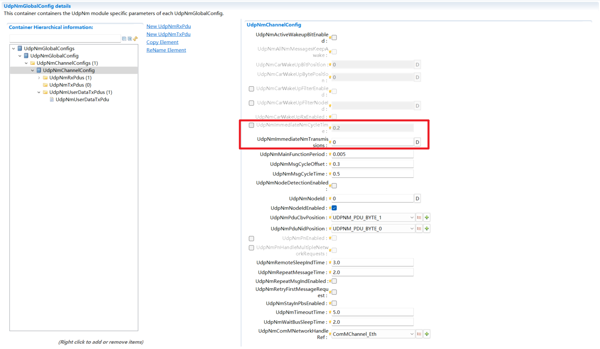

配置 Configuration
======================================================

基础配置 Basic Configuration
------------------------------------------------------------------------------------------------------------------------------

- UdpNmChannelConfig中为该通道配置基础的运行参数，包括通道的主函数运行周期、报文发送周期、自动流转状态的持续时间、引用ComM的Channel配置。
   In UdpNmChannelConfig, configure the basic running parameters for the channel, including the channel's main function cycle, message transmission cycle, duration for automatic state transitions, and a reference to the ComM Channel configuration.

.. figure:: ../../../_static/参考手册/UdpNm/UdpNmChannelConfig基础配置.png
   :align: center

   UdpNmChannelConfig基础配置 (Basic Configuration of UdpNmChannelConfig)

- 每个UdpNmChannelConfig需要创建UdpNmRxPdu和UdpNmTxPdu。UdpNmRxPdu可以创建多个，UdpNmTxPdu仅一个。UdpNmRxPdu和UdpNmTxPdu容器中引用的Pdu需要配置在SoAd模块的SoAdPduRoute和SoAdSocketRoute，详细操作参考SoAd手册。
   Each UdpNmChannelConfig needs to create UdpNmTxPdu and UdpNmRxPdu. Multiple UdpNmRxPdu can be created, but only one UdpNmTxPdu can be created. The PDUs referenced within the UdpNmRxPdu and UdpNmTxPdu containers must be configured in the SoAdPduRoute and SoAdSocketRoute of the SoAd module. For detailed instructions, refer to the SoAd Manual.

.. figure:: ../../../_static/参考手册/UdpNm/UdpNmPdu基础配置.png
   :align: center

   UdpNmPdu基础配置 (Basic Configuration of UdpNmPdu)

UserData
--------------------------------------------------------

1.启动UdpNm的UserData功能需要在Nm模块勾选NmGlobalFeatre/NmUserDataEnabled，将默认勾选所有<Bus>NmUserDataEnabled

1.To enable the UserData feature of UdpNm, check NmGlobalFeature/NmUserDataEnabled in the Nm module. By default, all <Bus>NmUserDataEnabled options are checked.

.. figure:: ../../../_static/参考手册/UdpNm/NmUserDataEnabled.png
   :align: center

   NmUserDataEnabled

2.此时UdpNmComUserDataSupport未勾选则启动API方式通过Nm模块透传设置网络管理报文UserData字段

2.If UdpNmComUserDataSupport is not checked at this point, the API mode is enabled, allowing the UserData field of the network management message to be set via pass-through from the Nm module.

.. figure:: ../../../_static/参考手册/UdpNm/UdpNmUserData.png
   :align: center

   UdpNmUserData

3.若UdpNmComUserDataSupport勾选，则屏蔽掉API，使能ComSignal形式设置网络管理报文UserData字段。此时需要配置UdpNmUserDataTxPdu，该容器每个通道仅可配置一个。需要在PduR配置PduRRoutingPath将该Pdu配置到PduRDestPdu，并配置ComSignal以及相应的Pdu到PduRSrcPdu

3.If UdpNmComUserDataSupport is checked, the API is disabled, and the ComSignal method is enabled for setting the UserData field of the network management message. In this case, a UdpNmUserDataTxPdu must be configured. Only one such container can be configured per channel. You need to configure PduRRoutingPath in the PduR to configure this Pdu to PduRDestPdu, and configure ComSignal and corresponding Pdu to PduRSrcPdu.

.. figure:: ../../../_static/参考手册/UdpNm/UdpNmUserDataTxPdu.png
   :align: center

   UdpNmUserDataTxPdu

快速发送 Immediate Transmission
----------------------------------------------------------------------------------------------------------------

快速发送机制需要先配置UdpNmImmediateNmTransmission决定快速发送的次数，当UdpNmImmediateNmTransmission > 0时才可配置UdpNmImmediateNmCycleTime报文的快速发送周期

The immediate transmission mechanism requires first configuring UdpNmImmediateNmTransmission to determine the number of immediate transmissions. Only when UdpNmImmediateNmTransmission is greater than 0 can the immediate transmission cycle UdpNmImmediateNmCycleTime be configured.

   UdpNmImmediateNmTransmission

车辆唤醒 Car Wake-up
----------------------------------------------------------------------------------------------------------------

车辆唤醒功能是通过在接收到的网络管理报文中检测UserData字段中指定bit触发。

The car wake-up function is triggered by detecting a specific bit within the UserData field of a received network management message.

首先需要勾选UdpNmChannelConfig/UdpNmCarWakeUpRxEnabled，在配置UdpNmCarWakeUpBitPosition和UdpNmCarWakeUpBytePosition。

First, check UdpNmChannelConfig/UdpNmCarWakeUpRxEnabled, and then configure UdpNmCarWakeUpBitPosition and UdpNmCarWakeUpBytePosition.

若要启动过滤功能则勾选UdpNmChannelConfig/UdpNmCarWakeUpFilterNodeId，并填写指定的NodeId到UdpNmCarWakeUpFilterNodeId

To enable the filtering function, check UdpNmChannelConfig/UdpNmCarWakeUpFilterEnabled, and enter the specified Node ID into UdpNmCarWakeUpFilterNodeId.

.. figure:: ../../../_static/参考手册/UdpNm/UdpNmCarWakeUp.png
   :align: center

   UdpNmCarWakeUp