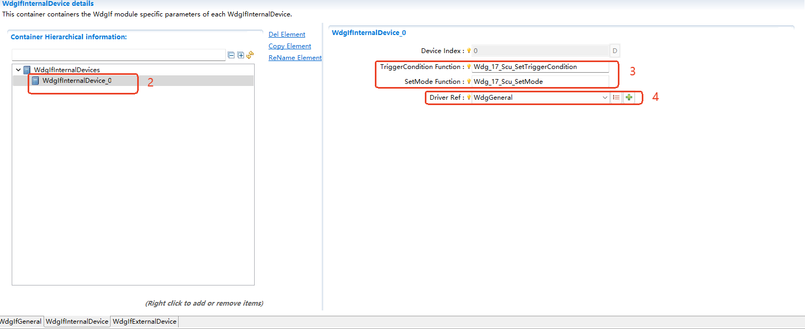
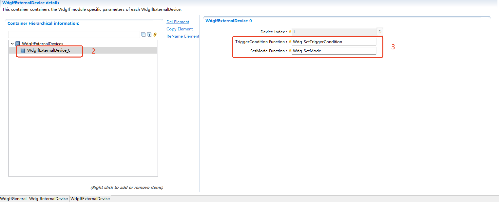
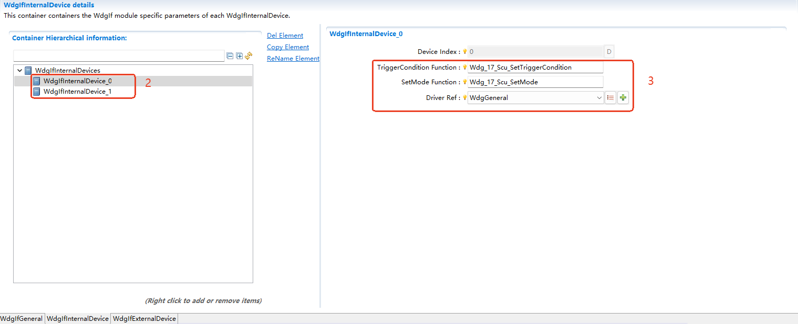

===================
WdgIf
===================

文档信息 Document Information
============================================================

版本历史 Version History
--------------------------------------------------------------------------------------------------------

.. list-table::
   :widths: 10 10 10 10 20
   :header-rows: 1

   * - 日期(Date)
     - 作者(Author)
     - 版本(Version)
     - 状态(Status)
     - 说明(Description)

   * - 2024/11/29
     - xudong.guan
     - V0.1
     - 发布(Release)
     - 首次发布(First release)

   * - 2025/04/04
     - xudong.guan
     - V1.0
     - 发布(Release)
     - 正式发布(Official release)

参考文档 References
--------------------------------------------------------------------------------------------------------

.. list-table::
   :widths: 10 10 30 10
   :header-rows: 1

   * - 编号(Number)
     - 分类(Classification)
     - 标题(Title)
     - 版本(Version)
   * - 1
     - Autosar
     - AUTOSAR_CP_SRS_ModeManagement.pdf
     - R23-11
   * - 2
     - Autosar
     - AUTOSAR_CP_SWS_WatchdogManager.pdf
     - R23-11 
   * - 3
     - Autosar
     - AUTOSAR_CP_SWS_WatchdogInterface.pdf
     - R23-11 
   * - 4
     - Autosar
     - AUTOSAR_CP_SWS_WatchdogDriver.pdf
     - R23-11 

术语与简写 Terms and Abbreviations
====================================================================

术语 Terms
--------------------------------------------------------------------------------------------------------
.. :align: center   表格内容居中(Table contents are centered)

.. list-table::
   :widths: 15 40
   :header-rows: 1

   * - 术语(Terms)
     - 解释(Explanation)

   * - Trigger Condition
     - 触发条件，该值将作为超时时间传递给Wdg Driver。如果该值为0，则停止喂狗；否则将延迟该值对应的时间后停止喂狗。(Trigger condition, this value will be passed to the Wdg Driver as the timeout period. If this value is 0, stop feeding the watchdog; otherwise, stop feeding the watchdog after a delay of the corresponding time value.)

简写 Abbreviations
--------------------------------------------------------------------------------------------------------

.. list-table::
   :widths: 10 20 30
   :header-rows: 1

   * - 简写(Abbreviation)
     - 全称(Full name)
     - 解释(Explanation)

   * - API
     - Application Programming Interface
     - 应用编程接口

   * - WDG
     - Watchdog
     - 看门狗

   * - WdgM
     - Watchdog Manager
     - 看门狗管理器

   * - SE
     - Supervision Entity
     - 监督实体

   * - CP
     - CheckPoint
     - 监控点

   * - DET
     - Default Error Tracer
     - 默认错误追踪器

简介 Introduction
==================================

WdgIf是AUTOSAR的一个基础软件模块， WdgIf模块为WdgM访问Watchdog Driver提供统一的服务，包括看门狗启动、模式切换以及设置超时时间等。

WdgIf is a basic software module of AUTOSAR. The WdgIf module provides unified services for WdgM to access the Watchdog Driver, including watchdog startup, mode switching, and setting the timeout period. 

ORIENTAIS WDG的架构如下图所示，其中WdgIf的架构如下图所示。

The architecture of the ORIENTAIS WDG is shown in the figure below, which also shows the architecture of WdgIf.

.. figure:: ../../../_static/参考手册/WdgIf/WdgIf_ArchitectureFigure.png
   :alt: WdgIf架构层次图 (WdgIf Architecture Hierarchy Diagram)
   :name: WdgIf_arch
   :align: center

   WdgIf架构层次图 (WdgIf Architecture Hierarchy Diagram)

如 :ref:`WdgIf_arch` 所示，WdgIf模块处于AUTOSAR架构中的设备抽象层，其下层模块为Wdg driver模块，上层模块为WdgM。

As shown in :ref:`WdgIf_arch`, the WdgIf module is located in the device abstraction layer in the AUTOSAR architecture. Its lower layer module is the Wdg driver module, and the upper layer module is WdgM.

功能描述 Functional Description
==========================================================

特性 Features
----------------------------------------------------------------

WdgIf功能介绍 Introduction to WdgIf Functions
~~~~~~~~~~~~~~~~~~~~~~~~~~~~~~~~~~~~~~~~~~~~~~~~~~~~~~~~~~~~~~~~~~~~~~~~~~~~~~~~~~

WdgIf模块为 Watchdog看门狗协议栈的中间层， 提供了对底层看门狗驱动程序的服务统一访问，如模式切换和设置触发条件 。

The WdgIf module serves as the intermediate layer of the Watchdog protocol stack, providing unified service access to the underlying watchdog drivers, such as for mode switching and setting the trigger condition.

WdgIf实现WdgM对多Watchdog Driver的管理，将WdgM的指令下发到对应的Watchdog Driver。

WdgIf enables WdgM to manage multiple Watchdog Drivers by dispatching commands from WdgM to the corresponding Watchdog Driver.

WdgIf接口不能为Wdg Driver增加功能。除此之外，WdgIf不会从看门狗属性中抽象出来，比如看门狗模式切换或者设置窗口模式以及超时时间等，其不隐藏底层看门狗驱动程序和看门狗硬件的任何功能。

The WdgIf interface cannot add functions to the Wdg Driver. Furthermore, WdgIf does not abstract away the properties of the watchdog, such as mode switching or the setting of window mode and timeout periods. It does not hide any functions of the underlying watchdog driver or the watchdog hardware.

偏差 Deviation
--------------------------------------------------------------------
   None

扩展 Extension
--------------------------------------------------------------------
   None

集成 Integration
========================================

文件列表 File List
--------------------------------------------------------------------

静态文件 Static Files
~~~~~~~~~~~~~~~~~~~~~~~~~~~~~~~~~~~~~~~~

.. list-table::
   :widths: 10 30
   :header-rows: 1

   * - 文件(File)
     - 描述(Description)
   
   * - WdgIf.c
     - WdgM源文件，存放WdgM的实现代码。(WdgM source file, which is used for storing the implementation code of WdgM.)

   * - WdgIf.h
     - WdgM头文件，存放WdgM的变量和接口声明。(WdgM header file, which is used for storing variables and interface declarations of WdgM.)

   * - WdgIf_Types.h
     - WdgIf类型定义头文件，存放WdgIf的数据类型定义。(WdgIf type definition header file, which is used for storing the data type definitions of WdgIf.)

   * - WdgIf_MemMep.h
     - WdgIf的内存映射定义文件。(WdgIf memory mapping definition file.)

动态文件 Dynamic Files
~~~~~~~~~~~~~~~~~~~~~~~~~~~~~~~~~~~~~~~~
.. list-table::
   :widths: 10 30
   :header-rows: 1

   * - WdgIf_Cfg.h
     - WdgIf配置头文件，存放WdgIf的配置生成宏定义和数据声明。(WdgIf configuration header file, which is used for storing macro definitions and data declarations generated by WdgIf configuration.)

   * - WdgIf_Cfg.c
     - WdgIf配置源码文件，存放WdgIf的配置生成代码。(WdgIf configuration source file, which is used for storing the code generated by WdgIf configuration.)

错误处理 Error Handling
------------------------------------------------------------------------------------------

开发错误 Development Errors
~~~~~~~~~~~~~~~~~~~~~~~~~~~~~~~~~~~~~~~~~~~~~~~~~~~~
.. list-table:: 
   :widths: 20 10 30
   :header-rows: 1

   * - Error code
     - Value[hex]
     - Description

   * - WDGIF_E_PARAM_DEVICE
     - 0x01
     - 调用API服务的时候传入了错误的设备号参数(An incorrect device ID parameter was passed when calling an API service)

   * - WDGIF_E_PARAM_POINTER
     - 0x03
     - 调用API服务的时候传入了空指针(A null pointer was passed when calling API service)

产品错误 Product Errors
~~~~~~~~~~~~~~~~~~~~~~~~~~~~~~~~~~~~~~~~~~~~~~~~~~

None

运行时错误 Runtime Errors
~~~~~~~~~~~~~~~~~~~~~~~~~~~~~~~~~~~~~~~~~~~~~~~~~~

None

接口描述 Interface Description
==============================================================

.. include:: WdgIf_h_api.rst

类型定义 Type Definitions
----------------------------------------------------------------------------------

.. list-table:: 
   :widths: 15 5 20 20
   :header-rows: 1

   * - Type Name
     - Type
     - Description
     - Range
     
   * - WdgIf_ModeType
     - Enumeration
     - WdgIf模块的模式类型(The mode type of the WdgIf module)
     - WDGIF_OFF_MODE
       WDGIF_SLOW_MODE
       WDGIF_FAST_MODE

依赖的服务 Applicable Services
---------------------------------------------------------------------------------------------------------------------------------

强制接口 Compulsory interface
~~~~~~~~~~~~~~~~~~~~~~~~~~~~~~~~~~~~~~~~~~~~~~~~~~~~~~~~~~~~~~~~~~

.. list-table::
   :widths: 10 5 30
   :header-rows: 1

   * - API Function
     - Header File
     - Description

   * - Wdg_SetMode
     - Wdg.h
     - Switches the watchdog into the mode Mode

   * - Wdg_SetTriggerCondition
     - Wdg.h
     - Sets the timeout value for the trigger counter

可选接口 Optional Interface
~~~~~~~~~~~~~~~~~~~~~~~~~~~~~~~~~~~~~~~~~~~~~~~~~~~~

.. list-table::
   :widths: 10 5 30
   :header-rows: 1

   * - API Function
     - Header File
     - Description

   * - Det_ReportError
     - Det.h
     - Service to report development errors

服务封装 Service Encapsulation
-----------------------------------------------------------------------------------------------------------
WdgIf为WdgM提供服务，作为中间层，无服务封装接口。

WdgIf provides services to WdgM. As an intermediate layer, it has no service encapsulation interface.

配置 Configuration
====================================

基础配置说明 Description of Basic Configurations
------------------------------------------------------------------------------------------------------------------------------------------------------
通常Mcu内部存在两种类型的看门狗：内部看门狗和外部看门狗。其中内部看门狗一般依赖于MCU内部时钟，而外部看门狗一般依赖于外部时钟。

Usually, there are two types of watchdogs within an MCU: internal watchdogs and external watchdogs. Internal watchdogs generally depend on the MCU's internal clock, while external watchdogs typically rely on an external clock. 

WdgIf模块同时支持内部看门狗和外部看门狗的配置，也支持多看门狗的配置。

The WdgIf module supports the configuration of both internal and external watchdogs, as well as the configuration of multiple watchdogs.

内部看门狗配置 Internal Watchdog Configuration
~~~~~~~~~~~~~~~~~~~~~~~~~~~~~~~~~~~~~~~~~~~~~~~~~~~~~~~~~~~~~~~~~~~~~~~~~~~~~~~~~~~~~~~~~~~~

如果要使用内部看门狗，首先要确保正确配置了Mcal中的看门狗驱动模块(Wdg)。在WdgIf模块中配置内部看门狗需要以下步骤：

To use the internal watchdog, first ensure that the watchdog driver module (Wdg) in the MCAL is correctly configured. Configuring the internal watchdog in the WdgIf module requires the following steps:

1.配置添加看门狗驱动头文件。

1.Configure and add the watchdog driver header file.

2.创建内部看门狗设备抽象容器，配置TriggerCondition和SetMode函数对应驱动接口。

2.Create an internal watchdog device abstraction container, and configure the TriggerCondition and SetMode functions to map to the corresponding driver interfaces.

3.函数接口映射

3.Map the function interfaces.

4.引用看门狗驱动设备。

4.Reference the watchdog driver device.

.. figure:: ../../../_static/参考手册/WdgIf/WdgIf_Int.png
   :alt: WdgIf内部看门狗配置图-1(WdgIf Internal Watchdog Configuration Diagram - 1)
   :name: WdgIf_Int
   :align: center

   WdgIf内部看门狗配置图-1 (WdgIf Internal Watchdog Configuration Diagram - 1)

   WdgIf内部看门狗配置图-2 (WdgIf Internal Watchdog Configuration Diagram - 2)

外部看门狗配置 External Watchdog Configuration
~~~~~~~~~~~~~~~~~~~~~~~~~~~~~~~~~~~~~~~~~~~~~~~~~~~~~~~~~~~~~~~~~~~~~~~~~~~~~~~~~~~~~~~~~~~~~~

在WdgIf模块中配置外部看门狗需要以下步骤：

Configuring the external watchdog in the WdgIf module requires the following steps:

1.配置添加看门狗驱动头文件。

1.Configure and add the watchdog driver header file.

2.创建外部看门狗设备抽象容器。

2.Create an external watchdog device abstraction container.

3.配置TriggerCondition和SetMode函数对应驱动接口。

3.Configure the TriggerCondition and SetMode functions to map to the corresponding driver interfaces.

.. figure:: ../../../_static/参考手册/WdgIf/WdgIf_Ext.png
   :alt: WdgIf外部看门狗配置图-1(WdgIf External Watchdog Configuration Diagram - 1)
   :name: WdgIf_Ext
   :align: center

   WdgIf外部看门狗配置图-1 (WdgIf External Watchdog Configuration Diagram - 1)

   WdgIf外部看门狗配置图-2 (WdgIf External Watchdog Configuration Diagram - 2)

多实例看门狗配置 Multi-Instance Watchdog Configuration
~~~~~~~~~~~~~~~~~~~~~~~~~~~~~~~~~~~~~~~~~~~~~~~~~~~~~~~~~~~~~~~~~~~~~~~~~~~~~~~~~~~~~~~~~~~~~~~~~

由于系统中可能同时存在多个看门狗设备驱动（包含内部看门狗和外部看门狗），所以WdgIf模块也支持多看门狗的配置。

Since multiple watchdog device drivers (including both internal and external watchdogs) may exist in the system simultaneously, the WdgIf module also supports the configuration of multiple watchdogs. 

在WdgIf模块中配置多个看门狗需要以下步骤：

Configuring multiple watchdogs in the WdgIf module requires the following steps:

1.配置添加看门狗驱动头文件。

1.Configure and add the watchdog driver header file.

2.创建多个看门狗设备抽象容器。

2.Create multiple watchdog device abstraction containers.

3.配置TriggerCondition和SetMode函数对应驱动接口。

3.Configure the TriggerCondition and SetMode functions to map to the corresponding driver interfaces.

.. figure:: ../../../_static/参考手册/WdgIf/WdgIf_Multiple.png
   :alt: WdgIf多看门狗配置图-1(WdgIf Multi-Watchdog Configuration Diagram - 1)
   :name: WdgIf_Multiple
   :align: center

   WdgIf多看门狗实例配置图-1 (WdgIf Multi-Watchdog Instance Configuration Diagram - 1)

   WdgIf多看门狗实例配置图-2 (WdgIf Multi-Watchdog Instance Configuration Diagram - 2)

.. figure:: ../../../_static/参考手册/WdgIf/WdgIf_Multiple3.png
   :alt: WdgIf多看门狗配置图-3(WdgIf Multi-Watchdog Configuration Diagram - 3)
   :name: WdgIf_Multiple3
   :align: center

   WdgIf多看门狗实例配置图-3 (WdgIf Multi-Watchdog Instance Configuration Diagram - 3)

