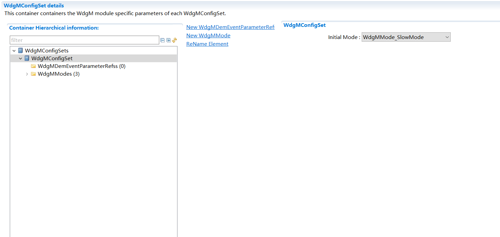
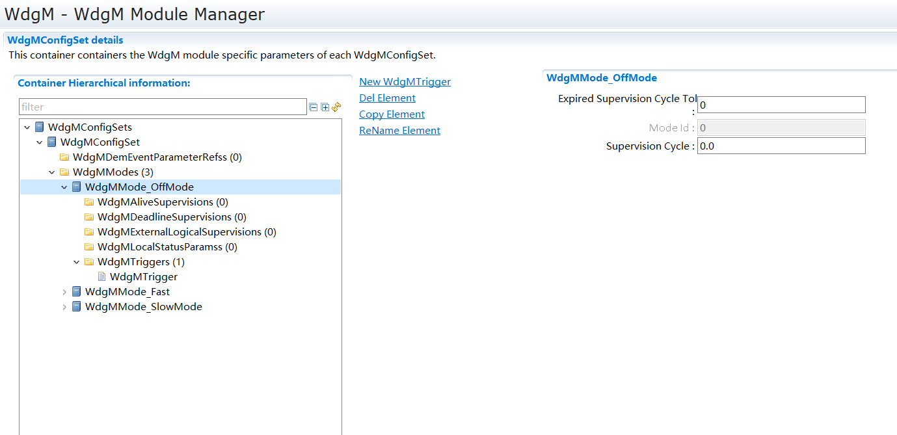

===================
WdgM产品参考手册
===================

**缩写词注解**

+------------+-------------------------------+------------------------+
| **缩写词** | **英文全称**                  | **中文解释**           |
+------------+-------------------------------+------------------------+
| API        | Application Programming       | 应用编程接口           |
|            | Interface                     |                        |
+------------+-------------------------------+------------------------+
| HW         | Hardware                      | 硬件                   |
+------------+-------------------------------+------------------------+
| SW         | Software                      | 软件                   |
+------------+-------------------------------+------------------------+
| WDG        | Watchdog                      | 看门狗                 |
+------------+-------------------------------+------------------------+
| WdgM       | Watchdog Manager              | 看                     |
|            |                               | 门狗管理器看门狗管理器 |
+------------+-------------------------------+------------------------+
| WdgIf      | Watchdog Interface            | 看门狗接口             |
+------------+-------------------------------+------------------------+
| SE         | Supervision Entity            | 监督实体               |
+------------+-------------------------------+------------------------+
| CP         | CheckPoint                    | 监控点                 |
+------------+-------------------------------+------------------------+
| DEM        | Diagnostic Event Manager      | 诊断事件管理器         |
+------------+-------------------------------+------------------------+
| DET        | Default Error Tracer          | 开发错误跟踪器         |
|            |                               |                        |
|            |                               | 默认错误跟踪器         |
+------------+-------------------------------+------------------------+
| OS         | Operating System              | 操作系统               |
+------------+-------------------------------+------------------------+
| BSW        | Basic Software                | 基础软件               |
+------------+-------------------------------+------------------------+
| MCU        | Microcontroller Unit          | 微控制器               |
+------------+-------------------------------+------------------------+
| MPU        | Memory Protection Unit        | 内存保护单元           |
+------------+-------------------------------+------------------------+
| STM        | System Timer                  | 系统定时器             |
+------------+-------------------------------+------------------------+
| GTM        | Generic Timer Module          | 通用定时器模块         |
+------------+-------------------------------+------------------------+
| MCAL       | Microcontroller Abstraction   | 微控制器抽象层         |
|            | Layer                         |                        |
+------------+-------------------------------+------------------------+
| MISRA      | The Motor Industry Software   | 电机工业软件可靠性协会 |
|            |                               |                        |
|            | Reliability Association       |                        |
+------------+-------------------------------+------------------------+
| TCL        | Tool Confidence Level         | 工具置信度等级         |
+------------+-------------------------------+------------------------+
| SEooC      | Safety Element out of Context | 无运用场景的安全组件   |
+------------+-------------------------------+------------------------+

简介
====

看门狗硬件实际上是一个特殊的定时器，当定时周期到达时，会发出溢出脉冲，从而引起整个板子的复位。在程序中使用时需要适当的插入一些看门狗定时器复位指令，从而保证程序正常运行时看门狗不溢出。当程序运行出现异常情况时，看门狗会因为长时间未运行复位指令引起定时器超时，从而产生溢出脉冲，通过
RESET 引脚对硬件进行复位。

WDG协议栈是 AUTOSAR 标准里的基本基础软件之一。其原理是 WDG
运行期间如果不定时喂狗，WDG
就会使系统复位，这就保证整个系统良好运行，不会出现死循环、死锁或者某个程序一直占用资源不释放的情况。WDG
可提供给用户自己设置的在不喂狗的情况下最大的不复位时间，可设置多种模式，如果硬件支持，可设置进入睡眠模式。

WdgM是AUTOSAR的一个基础软件模块，WdgM能够监督程序的执行并触发硬件看门狗。ORIENTAIS
WDG使用静态配置和动态管理将其功能集成到相关对象中。对象之间的相互调用是通过相关接口实现的。ORIENTAIS
WDG设计目标是为了设计一个安全的看门狗管理和实体监督协议栈，遵循ISO26262:2018功能安全所约束条件，目前ORIENTAIS
WDG现已通过 TÜV Rheinland的ISO 26262 ASIL D的产品认证。ORIENTAIS
WDG的架构如下图所示，其中WdgM位于系统服务层。

|C:\\Users\\f\\AppData\\Local\\Temp\\ksohtml10148\\wps1.png|\ 图1‑1
ORIENTAIS WDG架构框图

参考资料
--------

[1] AUTOSAR_SWS_WatchdogManager.pdf, R19-11

[2] AUTOSAR_SWS_WatchdogInterface.pdf, R19-11

[3] AUTOSAR_SWS_WatchdogDriver.pdf, R19-11

[4] AUTOSAR_SWS_DiagnosticEventManager.pdf, R19-11

[5] AUTOSAR_SWS_DefaultErrorTracer.pdf, R19-11

功能描述
========

WdgM功能
--------

WdgM功能介绍
~~~~~~~~~~~~

WdgM模块为Watchdog看门狗协议栈的顶层，为用户提供API应用的接口。WdgM通过WdgIf来改变看门狗的模式，并用于向Wdg
Driver报告触发硬件看门狗的条件。Watchdog结构层次如下图所示。

|C:\\Users\\f\\AppData\\Local\\Temp\\ksohtml10148\\wps2.png|\ 图2‑1
Watchdog层次结构图

表2-1 Watchdog层次结构说明

+---------+------------------------------------------------------------+
| *       | **作用**                                                   |
| *层次** |                                                            |
+---------+------------------------------------------------------------+
| WdgM    | WdgM模块为Watchdog的顶层，为用户提供API应用的接口          |
+---------+------------------------------------------------------------+
| WdgIf   | WdgM管理多个Watchdog Driver的中间抽象层。                  |
+---------+------------------------------------------------------------+
| Wdg     | Watchdog的底层硬件驱动                                     |
+---------+------------------------------------------------------------+

WdgM可配置多种运行Mode模式，每个Mode包含数个Supervision Entity
(SE)，每个SE包含多个Checkpoint
(CP)。根据对CP之间的时间差、CP执行顺序的关注，分为Alive
Supervision，Deadline Supervision，Logical Supervision。 Logical
Supervision 可以再细分为Internal Logical Supervision和External Logical
Supervision。Internal Logical
Supervision即所有涉及的CP，均在同SE；External Logical
Supervision，即所有CP至少存在于两个不同的SE。WdgM引入Local
Status和Global Status两种状态，其中Local
Status和所属SE的各种监督结果相关，而Global
Status则和当前模式下所有活动的Local
Status相关。WdgM通过监督算法对状态计算决定是否要触发硬件看门狗。

监督算法
~~~~~~~~

监督模块实现了看门狗WDG的监控功能，也是WDG的主要功能。

|C:\\Users\\f\\AppData\\Local\\Temp\\ksohtml8760\\wps1.png|

图2-2 看门狗监督示意图

看门狗WDG在用户选择的特定模式下工作，每种模式有多个监督实体组成，相应的全局监督状态也是由每个监督实体的局部监督状态计算出来的。每一个监督实体都包括几个活动监督（Alive
Supervision）、期限监督（Deadline Supervision）和逻辑监督（Logical
Supervision）。该监督实体的相应局部监督状态也从相应的活动监督、期限监督和逻辑监督的所有结果中计算出来。

用户可以通过ORIENTAIS配置工具设置不同的模式，其中包含不同的监督机制和检查点，以适应不同的环境。这个模块用于在不同模式之间切换。

|image1|

图2-3 基本原则和算法示意图

模式切换改变被监督实体的监督参数。当模式发生变化时，被监督实体的监督参数的变化遵循以下规则：

-  如果当前的全局监督状态是WDGM_GLOBAL_STATUS_OK或WDGM_GLOBAL_STATUS_FAILED，那么每个监督实体激活新模式（作为参数传递给函数WdgM_SetMode），函数WdgM_ChangeSEStatus应当保留SE的当前状态，以及该监督实体（SE）中活动监督、期限监督和内部逻辑监督的状态。

-  如果当前的全局监督状态是WDGM_GLOBAL_STATUS_OK或WDGM_GLOBAL_STATUS_FAILED，则对于在新模式下停用的每个监督实体（传递给函数WdgM_SetMode作为参数），函数WdgM_SetMode将监督实体的状态更改为WDGM_GLOBAL_STATUS_DEACTIVATED；确定活动监督、期限监督和逻辑监督的结果予以纠正；还应将其失败的引用循环计数器清除为0；将其所有的活动监督、期限监督和逻辑监督的状态设置为默认值。

-  如果当前的全局监督状态不是WDGM_GLOBAL_STATUS_OK或WDGM_GLOBAL_STATUS_FAILED，则WdgM_SetMode函数将返回而不做任何操作。

模式切换也会改变看门狗触发的参数。当模式改变时，看门狗触发参数的变化遵循以下规则：

-  如果调用函数WdgM_SetMode，看门狗管理器模块将通过调用WdgIf_SetMode服务将配置的看门狗模式（mode）参数应用到每一个看门狗设备。

-  对于每个看门狗实例，看门狗模式应该静态配置并由参数WdgMWatchdogMode表示。

源文件描述
==========

表3-1 WdgM组件文件描述

+-----------------+----------------------------------------------------+
| **文件**        | **说明**                                           |
+-----------------+----------------------------------------------------+
| WdgM.c          | WdgM源文件                                         |
+-----------------+----------------------------------------------------+
| WdgM.h          | WdgM头文件                                         |
+-----------------+----------------------------------------------------+
| WdgM_CfgType.h  | WdgM配置类型头文件                                 |
+-----------------+----------------------------------------------------+
| WdgM.MemMep.h   | WdgM的内存映射定义                                 |
+-----------------+----------------------------------------------------+
| WdgM_Type.h     | WdgM的数据类型定义                                 |
+-----------------+----------------------------------------------------+

|image2|\ 图3-1 WdgM组件文件交互关系图

API接口
=======

类型定义
--------

WdgM_LocalStatusType类型定义
~~~~~~~~~~~~~~~~~~~~~~~~~~~~

+-----------+----------------------------------------------------------+
| 名称      | WdgM_LocalStatusType                                     |
+-----------+----------------------------------------------------------+
| 类型      | Enumeration                                              |
+-----------+----------------------------------------------------------+
| 范围      | WDGM_LOCAL_STATUS_OK = 0                                 |
|           |                                                          |
|           | WDGM_LOCAL_STATUS_FAILED = 1                             |
|           |                                                          |
|           | WDGM_LOCAL_STATUS_EXPIRED = 2                            |
|           |                                                          |
|           | WDGM_LOCAL_STATUS_DEACTIVATED = 3                        |
+-----------+----------------------------------------------------------+
| 描述      | 用于描述WdgM模块内部局部状态的数据类型                   |
+-----------+----------------------------------------------------------+

WdgM_GlobalStatusType类型定义
~~~~~~~~~~~~~~~~~~~~~~~~~~~~~

+-----------+----------------------------------------------------------+
| 名称      | WdgM_GlobalStatusType                                    |
+-----------+----------------------------------------------------------+
| 类型      | Enumeration                                              |
+-----------+----------------------------------------------------------+
| 范围      | WDGM_GLOBAL_STATUS_OK = 0                                |
|           |                                                          |
|           | WDGM_GLOBAL_STATUS_FAILED = 1                            |
|           |                                                          |
|           | WDGM_GLOBAL_STATUS_EXPIRED = 2                           |
|           |                                                          |
|           | WDGM_GLOBAL_STATUS_STOPPED = 2                           |
|           |                                                          |
|           | WDGM_GLOBAL_STATUS_DEACTIVATED = 3                       |
+-----------+----------------------------------------------------------+
| 描述      | 用于描述WdgM模块全局状态的数据类型                       |
+-----------+----------------------------------------------------------+

输入函数描述
------------

+----------------------------------+-----------------------------------+
| **输入模块**                     | **API**                           |
+----------------------------------+-----------------------------------+
| Det                              | Det_ReportRuntimeError            |
+----------------------------------+-----------------------------------+
| Det                              | Det_ReportError                   |
+----------------------------------+-----------------------------------+
| OS                               | GetElapsedValue                   |
+----------------------------------+-----------------------------------+
| WdgIf                            | WdgIf_SetMode                     |
+----------------------------------+-----------------------------------+
| WdgIf                            | WdgIf_SetTriggerCondition         |
+----------------------------------+-----------------------------------+
| BswM                             | BswM_WdgM_RequestPartitionReset   |
+----------------------------------+-----------------------------------+
| Dem                              | Dem_SetEventStatus                |
+----------------------------------+-----------------------------------+
| Mcu                              | Mcu_PerformReset                  |
+----------------------------------+-----------------------------------+

静态接口函数定义
----------------

WdgM_Init函数定义
~~~~~~~~~~~~~~~~~

+-------------+------------------------------------------+------+-----+
| 函数名称：  | WdgM_Init                                |      |     |
+-------------+------------------------------------------+------+-----+
| 函数原型：  | void WdgM_Init(const WdgM_ConfigType     |      |     |
|             | \*ConfigPtr);                            |      |     |
+-------------+------------------------------------------+------+-----+
| 服务编号：  | 0x00                                     |      |     |
+-------------+------------------------------------------+------+-----+
| 同步/异步： | 同步                                     |      |     |
+-------------+------------------------------------------+------+-----+
| 是          | 不可重入                                 |      |     |
| 否可重入：  |                                          |      |     |
+-------------+------------------------------------------+------+-----+
| 输入参数：  | ConfigPtr：传入配置生成的WdgM_Config指针 | 值   | 无  |
|             |                                          | 域： |     |
+-------------+------------------------------------------+------+-----+
| 输入        | 无                                       |      |     |
| 输出参数：  |                                          |      |     |
+-------------+------------------------------------------+------+-----+
| 输出参数：  | 无                                       |      |     |
+-------------+------------------------------------------+------+-----+
| 返回值：    | 无                                       |      |     |
+-------------+------------------------------------------+------+-----+
| 功能概述：  | 完成对WdgM模块的初始化处理               |      |     |
+-------------+------------------------------------------+------+-----+

WdgM_DeInit函数定义
~~~~~~~~~~~~~~~~~~~

+-------------+--------------------------------------------------------+
| 函数名称：  | WdgM_DeInit                                            |
+-------------+--------------------------------------------------------+
| 函数原型：  | void WdgM_DeInit(void);                                |
+-------------+--------------------------------------------------------+
| 服务编号：  | 0x01                                                   |
+-------------+--------------------------------------------------------+
| 同步/异步： | 同步                                                   |
+-------------+--------------------------------------------------------+
| 是          | 不可重入                                               |
| 否可重入：  |                                                        |
+-------------+--------------------------------------------------------+
| 输入参数：  | 无                                                     |
+-------------+--------------------------------------------------------+
| 输入        | 无                                                     |
| 输出参数：  |                                                        |
+-------------+--------------------------------------------------------+
| 输出参数：  | 无                                                     |
+-------------+--------------------------------------------------------+
| 返回值：    | 无                                                     |
+-------------+--------------------------------------------------------+
| 功能概述：  | 完成对WdgM模块的反初始化处理                           |
+-------------+--------------------------------------------------------+

WdgM_GetVersionInfo函数定义
~~~~~~~~~~~~~~~~~~~~~~~~~~~

+-------------+---------------------------------------+------+--------+
| 函数名称：  | WdgM_GetVersionInfo                   |      |        |
+-------------+---------------------------------------+------+--------+
| 函数原型：  | void                                  |      |        |
|             | Wd                                    |      |        |
|             | gM_GetVersionInfo(Std_VersionInfoType |      |        |
|             | \*versioninfo);                       |      |        |
+-------------+---------------------------------------+------+--------+
| 服务编号：  | 0x02                                  |      |        |
+-------------+---------------------------------------+------+--------+
| 同步/异步： | 同步                                  |      |        |
+-------------+---------------------------------------+------+--------+
| 是          | 不可重入                              |      |        |
| 否可重入：  |                                       |      |        |
+-------------+---------------------------------------+------+--------+
| 输入参数：  | 无                                    |      |        |
+-------------+---------------------------------------+------+--------+
| 输入        | 无                                    |      |        |
| 输出参数：  |                                       |      |        |
+-------------+---------------------------------------+------+--------+
| 输出参数：  | Versioninfo：保存版本信息的结构体地址 | 值   | 无     |
|             |                                       | 域： |        |
+-------------+---------------------------------------+------+--------+
| 返回值：    | 无                                    |      |        |
+-------------+---------------------------------------+------+--------+
| 功能概述：  | 获取WdgM模块版本信息。需宏开启该功能  |      |        |
+-------------+---------------------------------------+------+--------+

WdgM_SetMode函数定义
~~~~~~~~~~~~~~~~~~~~

+-------------+---------------------------------------+------+--------+
| 函数名称：  | WdgM_SetMode                          |      |        |
+-------------+---------------------------------------+------+--------+
| 函数原型：  | Std_ReturnType                        |      |        |
|             | WdgM_SetMode(WdgM_ModeType Mode);     |      |        |
+-------------+---------------------------------------+------+--------+
| 服务编号：  | 0x03                                  |      |        |
+-------------+---------------------------------------+------+--------+
| 同步/异步： | 同步                                  |      |        |
+-------------+---------------------------------------+------+--------+
| 是          | 不可重入                              |      |        |
| 否可重入：  |                                       |      |        |
+-------------+---------------------------------------+------+--------+
| 输入参数：  | Mode：运行模式                        | 值   | 0-255  |
|             |                                       | 域： |        |
+-------------+---------------------------------------+------+--------+
| 输入        | 无                                    |      |        |
| 输出参数：  |                                       |      |        |
+-------------+---------------------------------------+------+--------+
| 输出参数：  | 无                                    |      |        |
+-------------+---------------------------------------+------+--------+
| 返回值：    | E_OK：API接口请求被接受               |      |        |
|             |                                       |      |        |
|             | E_NOT_OK：API接口请求被拒绝           |      |        |
+-------------+---------------------------------------+------+--------+
| 功能概述：  | 切换Watchdog的工作模式                |      |        |
+-------------+---------------------------------------+------+--------+

WdgM_GetMode函数定义
~~~~~~~~~~~~~~~~~~~~

+-------------+---------------------------------------+------+--------+
| 函数名称：  | WdgM_GetMode                          |      |        |
+-------------+---------------------------------------+------+--------+
| 函数原型：  | Std_ReturnType                        |      |        |
|             | WdgM_GetMode(WdgM_ModeType \*Mode);   |      |        |
+-------------+---------------------------------------+------+--------+
| 服务编号：  | 0x0B                                  |      |        |
+-------------+---------------------------------------+------+--------+
| 同步/异步： | 同步                                  |      |        |
+-------------+---------------------------------------+------+--------+
| 是          | 不可重入                              |      |        |
| 否可重入：  |                                       |      |        |
+-------------+---------------------------------------+------+--------+
| 输入参数：  | 无                                    |      |        |
+-------------+---------------------------------------+------+--------+
| 输入        | 无                                    |      |        |
| 输出参数：  |                                       |      |        |
+-------------+---------------------------------------+------+--------+
| 输出参数：  | Mode：指向当前Mode编号的指针          | 值   | 无     |
|             |                                       | 域： |        |
+-------------+---------------------------------------+------+--------+
| 返回值：    | E_OK：返回当前Mode编号成功            |      |        |
|             |                                       |      |        |
|             | E_NOT_OK：返回当前Mode编号失败        |      |        |
+-------------+---------------------------------------+------+--------+
| 功能概述：  | 获取当前被激活的Mode编号              |      |        |
+-------------+---------------------------------------+------+--------+

WdgM_CheckpointReached函数定义
~~~~~~~~~~~~~~~~~~~~~~~~~~~~~~

+-------------+---------------------------------------+------+--------+
| 函数名称：  | WdgM_CheckpointReached                |      |        |
+-------------+---------------------------------------+------+--------+
| 函数原型：  | Std_ReturnType WdgM_CheckpointReached |      |        |
|             |                                       |      |        |
|             | (                                     |      |        |
|             |                                       |      |        |
|             | WdgM_SupervisedEntityIdType SEID,     |      |        |
|             |                                       |      |        |
|             | WdgM_CheckpointIdType CheckpointID    |      |        |
|             |                                       |      |        |
|             | );                                    |      |        |
+-------------+---------------------------------------+------+--------+
| 服务编号：  | 0x0E                                  |      |        |
+-------------+---------------------------------------+------+--------+
| 同步/异步： | 同步                                  |      |        |
+-------------+---------------------------------------+------+--------+
| 是          | 不可重入                              |      |        |
| 否可重入：  |                                       |      |        |
+-------------+---------------------------------------+------+--------+
| 输入参数：  | SEID：当前程序运行到的SE编号          | 值   | 0      |
|             |                                       | 域： | -65535 |
+-------------+---------------------------------------+------+--------+
|             | Che                                   | 值   | 0      |
|             | ckpointID：当前程序运行到某SE的CP编号 | 域： | -65535 |
+-------------+---------------------------------------+------+--------+
| 输入        | 无                                    |      |        |
| 输出参数：  |                                       |      |        |
+-------------+---------------------------------------+------+--------+
| 输出参数：  | 无                                    |      |        |
+-------------+---------------------------------------+------+--------+
| 返回值：    | E_OK：API接口请求被接受               |      |        |
|             |                                       |      |        |
|             | E_NOT_OK：API接口请求被拒绝           |      |        |
+-------------+---------------------------------------+------+--------+
| 功能概述：  | 程序运行到某SE对应的Checkpoint        |      |        |
+-------------+---------------------------------------+------+--------+

WdgM_GetLocalStatus函数定义
~~~~~~~~~~~~~~~~~~~~~~~~~~~

+-------------+---------------------------------------+------+--------+
| 函数名称：  | WdgM_GetLocalStatus                   |      |        |
+-------------+---------------------------------------+------+--------+
| 函数原型：  | Std_ReturnType WdgM_GetLocalStatus    |      |        |
|             |                                       |      |        |
|             | (                                     |      |        |
|             |                                       |      |        |
|             | WdgM_SupervisedEntityIdType SEID,     |      |        |
|             |                                       |      |        |
|             | WdgM_LocalStatusType \*Status         |      |        |
|             |                                       |      |        |
|             | );                                    |      |        |
+-------------+---------------------------------------+------+--------+
| 服务编号：  | 0x0C                                  |      |        |
+-------------+---------------------------------------+------+--------+
| 同步/异步： | 同步                                  |      |        |
+-------------+---------------------------------------+------+--------+
| 是          | 不可重入                              |      |        |
| 否可重入：  |                                       |      |        |
+-------------+---------------------------------------+------+--------+
| 输入参数：  | SEID：监督实体的标识符ID              | 值   | 0      |
|             |                                       | 域： | -65535 |
+-------------+---------------------------------------+------+--------+
| 输入        | 无                                    |      |        |
| 输出参数：  |                                       |      |        |
+-------------+---------------------------------------+------+--------+
| 输出参数：  | Status：指向SE的LocalStatus的指针     | 值   | 无     |
|             |                                       | 域： |        |
+-------------+---------------------------------------+------+--------+
| 返回值：    | E_OK：API接口请求被接受               |      |        |
|             |                                       |      |        |
|             | E_NOT_OK：API接口请求被拒绝           |      |        |
+-------------+---------------------------------------+------+--------+
| 功能概述：  | 获取某SEID对应的局部状态（Local       |      |        |
|             | Status）                              |      |        |
+-------------+---------------------------------------+------+--------+

WdgM_GetGlobalStatus函数定义
~~~~~~~~~~~~~~~~~~~~~~~~~~~~

+-------------+---------------------------------------+------+--------+
| 函数名称：  | WdgM_GetGlobalStatus                  |      |        |
+-------------+---------------------------------------+------+--------+
| 函数原型：  | Std_ReturnType WdgM_GetGlobalStatus   |      |        |
|             |                                       |      |        |
|             | (                                     |      |        |
|             |                                       |      |        |
|             | WdgM_GlobalStatusType \*Status        |      |        |
|             |                                       |      |        |
|             | );                                    |      |        |
+-------------+---------------------------------------+------+--------+
| 服务编号：  | 0x0D                                  |      |        |
+-------------+---------------------------------------+------+--------+
| 同步/异步： | 同步                                  |      |        |
+-------------+---------------------------------------+------+--------+
| 是          | 不可重入                              |      |        |
| 否可重入：  |                                       |      |        |
+-------------+---------------------------------------+------+--------+
| 输入参数：  | 无                                    |      |        |
+-------------+---------------------------------------+------+--------+
| 输入        | 无                                    |      |        |
| 输出参数：  |                                       |      |        |
+-------------+---------------------------------------+------+--------+
| 输出参数：  | Status：指向SE的LocalStatus的指针     | 值   | 无     |
|             |                                       | 域： |        |
+-------------+---------------------------------------+------+--------+
| 返回值：    | E_OK：API接口请求被接受               |      |        |
|             |                                       |      |        |
|             | E_NOT_OK：API接口请求被拒绝           |      |        |
+-------------+---------------------------------------+------+--------+
| 功能概述：  | 获取全局状态（Global Status）         |      |        |
+-------------+---------------------------------------+------+--------+

WdgM_PerformReset函数定义
~~~~~~~~~~~~~~~~~~~~~~~~~

+-------------+--------------------------------------------------------+
| 函数名称：  | WdgM_PerformReset                                      |
+-------------+--------------------------------------------------------+
| 函数原型：  | void WdgM_PerformReset(void);                          |
+-------------+--------------------------------------------------------+
| 服务编号：  | 0x0F                                                   |
+-------------+--------------------------------------------------------+
| 同步/异步： | 同步                                                   |
+-------------+--------------------------------------------------------+
| 是          | 不可重入                                               |
| 否可重入：  |                                                        |
+-------------+--------------------------------------------------------+
| 输入参数：  | 无                                                     |
+-------------+--------------------------------------------------------+
| 输入        | 无                                                     |
| 输出参数：  |                                                        |
+-------------+--------------------------------------------------------+
| 输出参数：  | 无                                                     |
+-------------+--------------------------------------------------------+
| 返回值：    | 无                                                     |
+-------------+--------------------------------------------------------+
| 功能概述：  | 执行Watchdog复位操作                                   |
+-------------+--------------------------------------------------------+

WdgM_GetFirstExpiredSEID函数定义
~~~~~~~~~~~~~~~~~~~~~~~~~~~~~~~~

+-------------+-------------------------------------------+------+----+
| 函数名称：  | WdgM_GetFirstExpiredSEID                  |      |    |
+-------------+-------------------------------------------+------+----+
| 函数原型：  | Std_ReturnType WdgM_GetFirstExpiredSEID   |      |    |
|             |                                           |      |    |
|             | (                                         |      |    |
|             |                                           |      |    |
|             | WdgM_SupervisedEntityIdType \*SEID        |      |    |
|             |                                           |      |    |
|             | );                                        |      |    |
+-------------+-------------------------------------------+------+----+
| 服务编号：  | 0x10                                      |      |    |
+-------------+-------------------------------------------+------+----+
| 同步/异步： | 同步                                      |      |    |
+-------------+-------------------------------------------+------+----+
| 是          | 不可重入                                  |      |    |
| 否可重入：  |                                           |      |    |
+-------------+-------------------------------------------+------+----+
| 输入参数：  | 无                                        |      |    |
+-------------+-------------------------------------------+------+----+
| 输入        | 无                                        |      |    |
| 输出参数：  |                                           |      |    |
+-------------+-------------------------------------------+------+----+
| 输出参数：  | SEID：指向SEID的指针                      | 值   | 无 |
|             |                                           | 域： |    |
+-------------+-------------------------------------------+------+----+
| 返回值：    | E_OK：返回SEID成功                        |      |    |
|             |                                           |      |    |
|             | E_NOT_OK：返回SEID失败                    |      |    |
+-------------+-------------------------------------------+------+----+
| 功能概述：  | 获                                        |      |    |
|             | 取第一次出现Local_Status_Expired的SE编号  |      |    |
+-------------+-------------------------------------------+------+----+

WdgM_MainFunction函数定义
~~~~~~~~~~~~~~~~~~~~~~~~~

+-------------+--------------------------------------------------------+
| 函数名称：  | WdgM_MainFunction                                      |
+-------------+--------------------------------------------------------+
| 函数原型：  | void WdgM_MainFunction(void);                          |
+-------------+--------------------------------------------------------+
| 服务编号：  | 0x08                                                   |
+-------------+--------------------------------------------------------+
| 同步/异步： | 同步                                                   |
+-------------+--------------------------------------------------------+
| 是          | 不可重入                                               |
| 否可重入：  |                                                        |
+-------------+--------------------------------------------------------+
| 输入参数：  | 无                                                     |
+-------------+--------------------------------------------------------+
| 输入        | 无                                                     |
| 输出参数：  |                                                        |
+-------------+--------------------------------------------------------+
| 输出参数：  | 无                                                     |
+-------------+--------------------------------------------------------+
| 返回值：    | 无                                                     |
+-------------+--------------------------------------------------------+
| 功能概述：  | WdgM主函数，主函数依次判断得到Local status和Global     |
|             | Status，并据此给出相应的故障处理                       |
+-------------+--------------------------------------------------------+

可配置函数定义
--------------

无。

SWC服务组件封装
---------------

以下类型和接口可以封装至SWC生成完整的服务组件，可以与应用通过端口连接，没有列出的部分WdgM底层暂时不支持。

实现数据类型封装
~~~~~~~~~~~~~~~~

+-----------------------------------------+----------------------------+
| 类型名及定义引用                        | 生成条件                   |
+-----------------------------------------+----------------------------+
| WdgM_SupervisedEntityIdType             | 无                         |
+-----------------------------------------+----------------------------+
| WdgM_CheckpointIdType                   | 无                         |
+-----------------------------------------+----------------------------+
| WdgM_Mode                               | 无                         |
+-----------------------------------------+----------------------------+
| WdgM_LocalStatusType                    | 无                         |
+-----------------------------------------+----------------------------+
| WdgM_GlobalStatusType                   | 无                         |
+-----------------------------------------+----------------------------+
| WdgM_ModeType                           | 无                         |
+-----------------------------------------+----------------------------+

.. _实现数据类型封装-1:

实现数据类型封装
~~~~~~~~~~~~~~~~

注：下面提到的<UserModule>和<UserPortName>分别为用户SWC的名字和对应端口名，在与WdgM服务组件端口连接后适用。

Rte_Call_WdgM_LocalSupervision\_{SupervisedEntityCheckpointName}_CheckpointReached
^^^^^^^^^^^^^^^^^^^^^^^^^^^^^^^^^^^^^^^^^^^^^^^^^^^^^^^^^^^^^^^^^^^^^^^^^^^^^^^^^^

+-------------+--------------------------------------+-----+----------+
| 函数名称：  | Rte_Call_W                           |     |          |
|             | dgM_LocalSupervision\_{SupervisedEnt |     |          |
|             | ityCheckpointName}_CheckpointReached |     |          |
+-------------+--------------------------------------+-----+----------+
| 函数定义：  | Std_ReturnType                       |     |          |
|             | Rt                                   |     |          |
|             | e_Call_WdgM_LocalSupervision\_{Super |     |          |
|             | visedEntityCheckpointName}_Checkpoin |     |          |
|             | tReached(WdgM_SupervisedEntityIdType |     |          |
|             | SEID,                                |     |          |
|             |                                      |     |          |
|             | WdgM_CheckpointIdType CheckpointID); |     |          |
+-------------+--------------------------------------+-----+----------+
| 服务编号：  | N/A                                  |     |          |
+-------------+--------------------------------------+-----+----------+
| 同步/异步： | N/A                                  |     |          |
+-------------+--------------------------------------+-----+----------+
| 是          | N/A                                  |     |          |
| 否可重入：  |                                      |     |          |
+-------------+--------------------------------------+-----+----------+
| 输入参数：  | SEID：被监管实体的标识描述符         | 值  | 0 -      |
|             |                                      | 域  | 65535    |
|             |                                      | ：  |          |
+-------------+--------------------------------------+-----+----------+
| 输入        | 无                                   |     |          |
| 输出参数：  |                                      |     |          |
+-------------+--------------------------------------+-----+----------+
| 输出参数：  | Status：给定被监督实体的监督状态     | 值  | 0 -      |
|             |                                      | 域  | 65535    |
|             |                                      | ：  |          |
+-------------+--------------------------------------+-----+----------+
| 返回值：    | Std_ReturnType：                     |     |          |
|             |                                      |     |          |
|             | E_OK： 成功                          |     |          |
|             |                                      |     |          |
|             | E_NOT_OK： 失败                      |     |          |
+-------------+--------------------------------------+-----+----------+
| 功能概述：  | 指示看门                             |     |          |
|             | 狗管理器已到达被监督实体内的检查点； |     |          |
|             |                                      |     |          |
|             | 该端口为S                            |     |          |
|             | WC提供一个监督实体检查点的监督接口； |     |          |
+-------------+--------------------------------------+-----+----------+
| 变体：      | SupervisedEntityCheckpointName =     |     |          |
|             |                                      |     |          |
|             | {ecuc(WdgM/WdgMGeneral/              |     |          |
|             | WdgMSupervisedEntity.SHORT-NAME)}\_{ |     |          |
|             |                                      |     |          |
|             | ecuc(WdgM/WdgMGeneral/               |     |          |
|             | WdgMSupervisedEntity/WdgMCheckpoint. |     |          |
|             |                                      |     |          |
|             | SHORT-NAME)}                         |     |          |
+-------------+--------------------------------------+-----+----------+
| 生成条件：  | {e                                   |     |          |
|             | cuc(WdgM/WdgMGeneral/WdgMSupervisedE |     |          |
|             | ntity/WdgMSupervisedEntityId.value)} |     |          |
|             |                                      |     |          |
|             | ecuc{WdgM/                           |     |          |
|             | WdgMGeneral/WdgMSupervisedEntity/Wdg |     |          |
|             |                                      |     |          |
|             | MCheckpoint/WdgMCheckpointId}        |     |          |
+-------------+--------------------------------------+-----+----------+
| 端口类型：  | Require Port                         |     |          |
+-------------+--------------------------------------+-----+----------+
| 从属端口：  | localSupervisi                       |     |          |
|             | on\_{SupervisedEntityCheckpointName} |     |          |
+-------------+--------------------------------------+-----+----------+

Rte_Call_WdgM_LocalSupervisonStatus\_{SupervisedEntityName}_GetLocalStatus
^^^^^^^^^^^^^^^^^^^^^^^^^^^^^^^^^^^^^^^^^^^^^^^^^^^^^^^^^^^^^^^^^^^^^^^^^^

+-------------+--------------------------------------+-----+----------+
| 函数名称：  | Rt                                   |     |          |
|             | e_Call_WdgM_LocalSupervisonStatus\_{ |     |          |
|             | SupervisedEntityName}_GetLocalStatus |     |          |
+-------------+--------------------------------------+-----+----------+
| 函数定义：  | Std_ReturnType                       |     |          |
|             | Rte_Call_WdgM_LocalSupervisonS       |     |          |
|             | tatus\_{SupervisedEntityName}_GetLoc |     |          |
|             | alStatus(WdgM_SupervisedEntityIdType |     |          |
|             | SEID,                                |     |          |
|             |                                      |     |          |
|             | WdgM_LocalStatusType \*Status);      |     |          |
+-------------+--------------------------------------+-----+----------+
| 服务编号：  | N/A                                  |     |          |
+-------------+--------------------------------------+-----+----------+
| 同步/异步： | N/A                                  |     |          |
+-------------+--------------------------------------+-----+----------+
| 是          | N/A                                  |     |          |
| 否可重入：  |                                      |     |          |
+-------------+--------------------------------------+-----+----------+
| 输入参数：  | SEID：被监管实体的标识描述符         | 值  | 0 -      |
|             |                                      | 域  | 65535    |
|             |                                      | ：  |          |
+-------------+--------------------------------------+-----+----------+
| 输入        | 无                                   |     |          |
| 输出参数：  |                                      |     |          |
+-------------+--------------------------------------+-----+----------+
| 输出参数：  | Status：给定被监督实体的监督状态     | 值  | 0 -      |
|             |                                      | 域  | 65535    |
|             |                                      | ：  |          |
+-------------+--------------------------------------+-----+----------+
| 返回值：    | Std_ReturnType：                     |     |          |
|             |                                      |     |          |
|             | E_OK： 成功                          |     |          |
|             |                                      |     |          |
|             | E_NOT_OK： 失败                      |     |          |
+-------------+--------------------------------------+-----+----------+
| 功能概述：  | 返回单个被监督实体的监督状态；       |     |          |
|             |                                      |     |          |
|             | 该端口为S                            |     |          |
|             | WC提供一个被监督实体的监督状态接口； |     |          |
+-------------+--------------------------------------+-----+----------+
| 变体：      | SupervisedEntityName =               |     |          |
|             |                                      |     |          |
|             | {ecuc(WdgM/WdgMGener                 |     |          |
|             | al/WdgMSupervisedEntity.SHORT-NAME)} |     |          |
+-------------+--------------------------------------+-----+----------+
| 生成条件：  | {e                                   |     |          |
|             | cuc(WdgM/WdgMGeneral/WdgMSupervisedE |     |          |
|             | ntity/WdgMSupervisedEntityId.value)} |     |          |
+-------------+--------------------------------------+-----+----------+
| 端口类型：  | Require Port                         |     |          |
+-------------+--------------------------------------+-----+----------+
| 从属端口：  | LocalSupe                            |     |          |
|             | rvisonStatus\_{SupervisedEntityName} |     |          |
+-------------+--------------------------------------+-----+----------+

Rte_Call_WdgM_GlobalSupervision_GetFirstExpiredSEID
^^^^^^^^^^^^^^^^^^^^^^^^^^^^^^^^^^^^^^^^^^^^^^^^^^^

+-------------+--------------------------------------+-----+----------+
| 函数名称：  | Rte_Call_WdgM_G                      |     |          |
|             | lobalSupervision_GetFirstExpiredSEID |     |          |
+-------------+--------------------------------------+-----+----------+
| 函数定义：  | Std_ReturnType                       |     |          |
|             | Rte_Call_WdgM_G                      |     |          |
|             | lobalSupervision_GetFirstExpiredSEID |     |          |
|             |                                      |     |          |
|             | (WdgM_SupervisedEntityIdType         |     |          |
|             | \*SEID);                             |     |          |
+-------------+--------------------------------------+-----+----------+
| 服务编号：  | N/A                                  |     |          |
+-------------+--------------------------------------+-----+----------+
| 同步/异步： | N/A                                  |     |          |
+-------------+--------------------------------------+-----+----------+
| 是          | N/A                                  |     |          |
| 否可重入：  |                                      |     |          |
+-------------+--------------------------------------+-----+----------+
| 输入参数：  | 无                                   |     |          |
+-------------+--------------------------------------+-----+----------+
| 输入        | 无                                   |     |          |
| 输出参数：  |                                      |     |          |
+-------------+--------------------------------------+-----+----------+
| 输出参数：  | SEID：被监管实体的标识描述符         | 值  | 0 -      |
|             |                                      | 域  | 65535    |
|             |                                      | ：  |          |
+-------------+--------------------------------------+-----+----------+
| 返回值：    | Std_ReturnType：                     |     |          |
|             |                                      |     |          |
|             | E_OK： 成功                          |     |          |
|             |                                      |     |          |
|             | E_NOT_OK： 失败                      |     |          |
+-------------+--------------------------------------+-----+----------+
| 功能概述：  | 返回第一个到达状                     |     |          |
|             | 态WDGM_LOCAL_STATUS_EXPIRED的SEID；  |     |          |
|             |                                      |     |          |
|             | 该端口提供WdgM的全局监督接口；       |     |          |
+-------------+--------------------------------------+-----+----------+
| 变体：      | 无                                   |     |          |
+-------------+--------------------------------------+-----+----------+
| 生成条件：  | 无                                   |     |          |
+-------------+--------------------------------------+-----+----------+
| 端口类型：  | Require Port                         |     |          |
+-------------+--------------------------------------+-----+----------+
| 从属端口：  | GlobalSupervision                    |     |          |
+-------------+--------------------------------------+-----+----------+

Rte_Call_WdgM_GlobalSupervision_GetMode
^^^^^^^^^^^^^^^^^^^^^^^^^^^^^^^^^^^^^^^

+-------------+--------------------------------------+-----+----------+
| 函数名称：  | Rte_Call_WdgM_G                      |     |          |
|             | lobalSupervision_GetFirstExpiredSEID |     |          |
+-------------+--------------------------------------+-----+----------+
| 函数定义：  | Std_ReturnType                       |     |          |
|             | Rte                                  |     |          |
|             | _Call_WdgM_GlobalSupervision_GetMode |     |          |
|             |                                      |     |          |
|             | (WdgM_ModeType \*Mode);              |     |          |
+-------------+--------------------------------------+-----+----------+
| 服务编号：  | N/A                                  |     |          |
+-------------+--------------------------------------+-----+----------+
| 同步/异步： | N/A                                  |     |          |
+-------------+--------------------------------------+-----+----------+
| 是          | N/A                                  |     |          |
| 否可重入：  |                                      |     |          |
+-------------+--------------------------------------+-----+----------+
| 输入参数：  | 无                                   |     |          |
+-------------+--------------------------------------+-----+----------+
| 输入        | 无                                   |     |          |
| 输出参数：  |                                      |     |          |
+-------------+--------------------------------------+-----+----------+
| 输出参数：  | Mode：看门狗管理器的当前工作模式     | 值  | 0 - 255  |
|             |                                      | 域  |          |
|             |                                      | ：  |          |
+-------------+--------------------------------------+-----+----------+
| 返回值：    | Std_ReturnType：                     |     |          |
|             |                                      |     |          |
|             | E_OK： 成功                          |     |          |
|             |                                      |     |          |
|             | E_NOT_OK： 失败                      |     |          |
+-------------+--------------------------------------+-----+----------+
| 功能概述：  | 返回看门狗管理器当前工作模式；       |     |          |
|             |                                      |     |          |
|             | 该端口提供WdgM的全局监督接口；       |     |          |
+-------------+--------------------------------------+-----+----------+
| 变体：      | 无                                   |     |          |
+-------------+--------------------------------------+-----+----------+
| 生成条件：  | 无                                   |     |          |
+-------------+--------------------------------------+-----+----------+
| 端口类型：  | Require Port                         |     |          |
+-------------+--------------------------------------+-----+----------+
| 从属端口：  | GlobalSupervision                    |     |          |
+-------------+--------------------------------------+-----+----------+

Rte_Call_WdgM_GlobalSupervision_PerformReset
^^^^^^^^^^^^^^^^^^^^^^^^^^^^^^^^^^^^^^^^^^^^

+-------------+--------------------------------------+-----+----------+
| 函数名称：  | Rte_Call                             |     |          |
|             | _WdgM_GlobalSupervision_PerformReset |     |          |
+-------------+--------------------------------------+-----+----------+
| 函数定义：  | Std_ReturnType                       |     |          |
|             | Rte_Call                             |     |          |
|             | _WdgM_GlobalSupervision_PerformReset |     |          |
|             |                                      |     |          |
|             | (WdgM_ModeType \*Mode);              |     |          |
+-------------+--------------------------------------+-----+----------+
| 服务编号：  | N/A                                  |     |          |
+-------------+--------------------------------------+-----+----------+
| 同步/异步： | N/A                                  |     |          |
+-------------+--------------------------------------+-----+----------+
| 是          | N/A                                  |     |          |
| 否可重入：  |                                      |     |          |
+-------------+--------------------------------------+-----+----------+
| 输入参数：  | 无                                   |     |          |
+-------------+--------------------------------------+-----+----------+
| 输入        | 无                                   |     |          |
| 输出参数：  |                                      |     |          |
+-------------+--------------------------------------+-----+----------+
| 输出参数：  | Mode：看门狗管理器的当前工作模式     | 值  | 0 - 255  |
|             |                                      | 域  |          |
|             |                                      | ：  |          |
+-------------+--------------------------------------+-----+----------+
| 返回值：    | Std_ReturnType：                     |     |          |
|             |                                      |     |          |
|             | E_OK： 成功                          |     |          |
|             |                                      |     |          |
|             | E_NOT_OK： 失败                      |     |          |
+-------------+--------------------------------------+-----+----------+
| 功能概述：  | 返回看门狗管理器当前工作模式；       |     |          |
|             |                                      |     |          |
|             | 通知Watchdog Manager复位看门狗；     |     |          |
|             |                                      |     |          |
|             | 该端口提供WdgM的全局监督接口；       |     |          |
+-------------+--------------------------------------+-----+----------+
| 变体：      | 无                                   |     |          |
+-------------+--------------------------------------+-----+----------+
| 生成条件：  | 无                                   |     |          |
+-------------+--------------------------------------+-----+----------+
| 端口类型：  | Require Port                         |     |          |
+-------------+--------------------------------------+-----+----------+
| 从属端口：  | GlobalSupervision                    |     |          |
+-------------+--------------------------------------+-----+----------+

Rte_Call_WdgM_GlobalSupervision_GetGlobalStatus
^^^^^^^^^^^^^^^^^^^^^^^^^^^^^^^^^^^^^^^^^^^^^^^

+-------------+--------------------------------------+-----+----------+
| 函数名称：  | Rte_Call_Wd                          |     |          |
|             | gM_GlobalSupervision_GetGlobalStatus |     |          |
+-------------+--------------------------------------+-----+----------+
| 函数定义：  | Std_ReturnType                       |     |          |
|             | Rte_Call_Wd                          |     |          |
|             | gM_GlobalSupervision_GetGlobalStatus |     |          |
|             |                                      |     |          |
|             | (WdgM_GlobalStatusType \*Status);    |     |          |
+-------------+--------------------------------------+-----+----------+
| 服务编号：  | N/A                                  |     |          |
+-------------+--------------------------------------+-----+----------+
| 同步/异步： | N/A                                  |     |          |
+-------------+--------------------------------------+-----+----------+
| 是          | N/A                                  |     |          |
| 否可重入：  |                                      |     |          |
+-------------+--------------------------------------+-----+----------+
| 输入参数：  | 无                                   |     |          |
+-------------+--------------------------------------+-----+----------+
| 输入        | 无                                   |     |          |
| 输出参数：  |                                      |     |          |
+-------------+--------------------------------------+-----+----------+
| 输出参数：  | Status：Watchdog Manager全局监控状态 | 值  | 0 -      |
|             |                                      | 域  | 65535    |
|             |                                      | ：  |          |
+-------------+--------------------------------------+-----+----------+
| 返回值：    | Std_ReturnType：                     |     |          |
|             |                                      |     |          |
|             | E_OK： 成功                          |     |          |
|             |                                      |     |          |
|             | E_NOT_OK： 失败                      |     |          |
+-------------+--------------------------------------+-----+----------+
| 功能概述：  | 返回看门狗管理器的全局监控状态；     |     |          |
|             |                                      |     |          |
|             | 该端口提供WdgM的全局监督接口；       |     |          |
+-------------+--------------------------------------+-----+----------+
| 变体：      | 无                                   |     |          |
+-------------+--------------------------------------+-----+----------+
| 生成条件：  | 无                                   |     |          |
+-------------+--------------------------------------+-----+----------+
| 端口类型：  | Require Port                         |     |          |
+-------------+--------------------------------------+-----+----------+
| 从属端口：  | GlobalSupervision                    |     |          |
+-------------+--------------------------------------+-----+----------+

Rte_Call_WdgM_GlobalSupervision_SetMode
^^^^^^^^^^^^^^^^^^^^^^^^^^^^^^^^^^^^^^^

+-------------+--------------------------------------+-----+----------+
| 函数名称：  | Rte                                  |     |          |
|             | _Call_WdgM_GlobalSupervision_SetMode |     |          |
+-------------+--------------------------------------+-----+----------+
| 函数定义：  | Std_ReturnType                       |     |          |
|             | Rte                                  |     |          |
|             | _Call_WdgM_GlobalSupervision_SetMode |     |          |
|             |                                      |     |          |
|             | (WdgM_ModeType Mode);                |     |          |
+-------------+--------------------------------------+-----+----------+
| 服务编号：  | N/A                                  |     |          |
+-------------+--------------------------------------+-----+----------+
| 同步/异步： | N/A                                  |     |          |
+-------------+--------------------------------------+-----+----------+
| 是          | N/A                                  |     |          |
| 否可重入：  |                                      |     |          |
+-------------+--------------------------------------+-----+----------+
| 输入参数：  | Mode：已配置的看门狗管理模式之一     | 值  | 0 - 255  |
|             |                                      | 域  |          |
|             |                                      | ：  |          |
+-------------+--------------------------------------+-----+----------+
| 输入        | 无                                   |     |          |
| 输出参数：  |                                      |     |          |
+-------------+--------------------------------------+-----+----------+
| 输出参数：  | Status：Watchdog Manager全局监控状态 | 值  | 0 -      |
|             |                                      | 域  | 65535    |
|             |                                      | ：  |          |
+-------------+--------------------------------------+-----+----------+
| 返回值：    | Std_ReturnType：                     |     |          |
|             |                                      |     |          |
|             | E_OK： 成功                          |     |          |
|             |                                      |     |          |
|             | E_NOT_OK： 失败                      |     |          |
+-------------+--------------------------------------+-----+----------+
| 功能概述：  | 设置看门狗的当前工作模式；           |     |          |
|             |                                      |     |          |
|             | 该端口提供WdgM的全局监督接口；       |     |          |
+-------------+--------------------------------------+-----+----------+
| 变体：      | 无                                   |     |          |
+-------------+--------------------------------------+-----+----------+
| 生成条件：  | 无                                   |     |          |
+-------------+--------------------------------------+-----+----------+
| 端口类型：  | Require Port                         |     |          |
+-------------+--------------------------------------+-----+----------+
| 从属端口：  | GlobalSupervision                    |     |          |
+-------------+--------------------------------------+-----+----------+

模式转换接口封装
~~~~~~~~~~~~~~~~

WdgM_LocalMode\_{SupervisedEntityName} 
^^^^^^^^^^^^^^^^^^^^^^^^^^^^^^^^^^^^^^^

+-----------------+----------------------------------------------------+
| 接口名称：      | WdgM_LocalMode\_{SupervisedEntityName}             |
+-----------------+----------------------------------------------------+
| 变体：          | SupervisedEntityName =                             |
|                 | {ecuc(WdgM/WdgMGeneral/WdgMSu                      |
|                 | pervisedEntity/WdgMSupervisedEntityId.SHORT-NAME)} |
+-----------------+----------------------------------------------------+
| 生成条件：      | 无                                                 |
+-----------------+----------------------------------------------------+
| 模式组：        | SupervisedEntityName                               |
+-----------------+----------------------------------------------------+
| 端口类型：      | Provided Port                                      |
+-----------------+----------------------------------------------------+
| 从属端口：      | mo                                                 |
|                 | deSwitchPort_WdgMLocalMode\_{SupervisedEntityName} |
+-----------------+----------------------------------------------------+

WdgM_GlobalMode
^^^^^^^^^^^^^^^

+-----------------+----------------------------------------------------+
| 接口名称：      | WdgM_GlobalMode                                    |
+-----------------+----------------------------------------------------+
| 变体：          | 无                                                 |
+-----------------+----------------------------------------------------+
| 生成条件：      | 无                                                 |
+-----------------+----------------------------------------------------+
| 模式组：        | 无                                                 |
+-----------------+----------------------------------------------------+
| 端口类型：      | Provided Port                                      |
+-----------------+----------------------------------------------------+
| 从属端口：      | modeSwitchPort_WdgMGlobalMode                      |
+-----------------+----------------------------------------------------+

配置
====

主要介绍WdgM模块的配置参数，列举配置项在配置界面显示的名称，对应的标准、可能的取值、默认的取值、参数描述及依赖关系，旨在指导用户如何使用配置工具进行WdgM模块参数的配置。

表5‑1 属性描述

+------------+---------------------------------------------------------+
| UI名称     | 该配置项在配置工具界面显示的名称                        |
+------------+---------------------------------------------------------+
| 取值范围   | 该配置项允许的取值区间                                  |
+------------+---------------------------------------------------------+
| 默认取值   | 该配置项默认的配置值                                    |
+------------+---------------------------------------------------------+
| 参数描述   | 该配置项在标准的AUTOSAR_EcucParamDef.arxml文件中的描述  |
+------------+---------------------------------------------------------+
| 依赖关系   | 该配置项与其他模块或配置项的关系                        |
+------------+---------------------------------------------------------+

WdgMGeneral配置
---------------

|image3|

图5-1 WdgM模块的General容器配置图

表5-2 WdgM模块的General配置属性描述

+--------+-----------+-----------------------+---+-----------+---+-----------+
| **UI   | **描述**  |                       |   |           |   |           |
| 名称** |           |                       |   |           |   |           |
+--------+-----------+-----------------------+---+-----------+---+-----------+
| WdgMDe | 取值范围  | STD_ON,STD_OFF        | 默 |          | S |           |
| vError |           |                       | 认 |          | T |           |
| Detect |           |                       | 取 |          | D |           |
|        |           |                       | 值 |          | _ |           |
|        |           |                       |   |           | O |           |
|        |           |                       |   |           | F |           |
|        |           |                       |   |           | F |           |
+--------+-----------+-----------------------+---+-----------+---+-----------+
|        | 参数描述  | 是                    |   |           |   |           |
|        |           | 否开启配置出错检测。  |   |           |   |           |
|        |           | 若开启，一旦检测到配  |   |           |   |           |
|        |           | 置出错，则代码停留在  |   |           |   |           |
|        |           | 故障出错位置。量产用  |   |           |   |           |
|        |           | 代码，需关闭该配置。  |   |           |   |           |
+--------+-----------+-----------------------+---+-----------+---+-----------+
|        | 依赖关系  | 依赖于DET模块的配置   |   |           |   |           |
+--------+-----------+-----------------------+---+-----------+---+-----------+
| WdgMIm | 取值范围  | STD_ON,STD_OFF        |   | 默认取值  |   | STD_OFF   |
| mediat |           |                       |   |           |   |           |
| eReset |           |                       |   |           |   |           |
+--------+-----------+-----------------------+---+-----------+---+-----------+
|        | 参数描述  | Global status         |   |           |   |           |
|        |           | Stopped状态时，       |   |           |   |           |
|        |           | 是否调用Mcu_PerformRe |   |           |   |           |
|        |           | set执行立即复位操作。 |   |           |   |           |
+--------+-----------+-----------------------+---+-----------+---+-----------+
|        | 依赖关系  | 依赖于复位机制        |   |           |   |           |
+--------+-----------+-----------------------+---+-----------+---+-----------+
| WdgMOf | 取值范围  | STD_ON,STD_OFF        |   | 默认取值  |   | STD_OFF   |
| fModeE |           |                       |   |           |   |           |
| nabled |           |                       |   |           |   |           |
+--------+-----------+-----------------------+---+-----------+---+-----------+
|        | 参数描述  | 是否允许Watchdog      |   |           |   |           |
|        |           | Driver配置为Off       |   |           |   |           |
|        |           | Mode模式。            |   |           |   |           |
+--------+-----------+-----------------------+---+-----------+---+-----------+
|        | 依赖关系  | 依赖                  |   |           |   |           |
|        |           | 于Wdg底层设备驱动程序 |   |           |   |           |
+--------+-----------+-----------------------+---+-----------+---+-----------+
| WdgMVe | 取值范围  | STD_ON,STD_OFF        |   | 默认取值  |   | STD_OFF   |
| rsionI |           |                       |   |           |   |           |
| nfoApi |           |                       |   |           |   |           |
+--------+-----------+-----------------------+---+-----------+---+-----------+
|        | 参数描述  | 是否在编译时          |   |           |   |           |
|        |           | ，查看配置文件，源文  |   |           |   |           |
|        |           | 件的版本信息是否一致  |   |           |   |           |
+--------+-----------+-----------------------+---+-----------+---+-----------+
|        | 依赖关系  | 无                    |   |           |   |           |
+--------+-----------+-----------------------+---+-----------+---+-----------+
| FIRST_ | 取值范围  | 0...4294967295        |   | 默认取值  |   | 0         |
| EXPIRE |           |                       |   |           |   |           |
| D_SEID |           |                       |   |           |   |           |
+--------+-----------+-----------------------+---+-----------+---+-----------+
|        | 参数描述  | 保存在此区域的        |   |           |   |           |
|        |           | 数据在热复位后不得擦  |   |           |   |           |
|        |           | 除或复位。热复位是指  |   |           |   |           |
|        |           | 复位操作时电源正常。  |   |           |   |           |
|        |           | 监管实体ID占用2字节。 |   |           |   |           |
+--------+-----------+-----------------------+---+-----------+---+-----------+
|        | 依赖关系  | 依赖于内存保护        |   |           |   |           |
+--------+-----------+-----------------------+---+-----------+---+-----------+
| FI     | 取值范围  | 0...4294967295        |   | 默认取值  |   | 0         |
| RST_EX |           |                       |   |           |   |           |
| PIRED_ |           |                       |   |           |   |           |
| INVERS |           |                       |   |           |   |           |
| E_SEID |           |                       |   |           |   |           |
+--------+-----------+-----------------------+---+-----------+---+-----------+
|        | 参数描述  | 保存在此区域的        |   |           |   |           |
|        |           | 数据在热复位后不得擦  |   |           |   |           |
|        |           | 除或复位。热复位是指  |   |           |   |           |
|        |           | 复位操作时电源正常。  |   |           |   |           |
|        |           | 监管实体ID占用2字节。 |   |           |   |           |
+--------+-----------+-----------------------+---+-----------+---+-----------+
|        | 依赖关系  | 依赖于内存保护        |   |           |   |           |
+--------+-----------+-----------------------+---+-----------+---+-----------+

WdgMSupervisedEntity配置
~~~~~~~~~~~~~~~~~~~~~~~~

|image4|

图5-2 WdgM监督实体配置

表5-3 WdgM模块的监督实体配置属性描述

+--------+-----------+-----------------------+---+---+----------+---+---+-----------+
| **UI   | **描述**  |                       |   |   |          |   |   |           |
| 名称** |           |                       |   |   |          |   |   |           |
+--------+-----------+-----------------------+---+---+----------+---+---+-----------+
| WdgM   | 取值范围  | ...65535              | 默 |  |          | 1 |   |           |
| Superv |           |                       | 认 |  |          |   |   |           |
| isedEn |           |                       | 取 |  |          |   |   |           |
| tityId |           |                       | 值 |  |          |   |   |           |
+--------+-----------+-----------------------+---+---+----------+---+---+-----------+
|        | 参数描述  | 该参数应包含被监      |   |   |          |   |   |           |
|        |           | 督实体的唯一标识符。  |   |   |          |   |   |           |
|        |           |                       |   |   |          |   |   |           |
|        |           | 备注：                |   |   |          |   |   |           |
|        |           |                       |   |   |          |   |   |           |
|        |           | 不同                  |   |   |          |   |   |           |
|        |           | 的WdgM监督实体不能有  |   |   |          |   |   |           |
|        |           | 相同的WdgM监督实体ID  |   |   |          |   |   |           |
+--------+-----------+-----------------------+---+---+----------+---+---+-----------+
|        | 依赖关系  | 无                    |   |   |          |   |   |           |
+--------+-----------+-----------------------+---+---+----------+---+---+-----------+
| WdgMIn | 取值范围  | 0...65535             |   | 默 |         |   | 0 |           |
| ternal |           |                       |   | 认 |         |   |   |           |
| Transi |           |                       |   | 取 |         |   |   |           |
| tionId |           |                       |   | 值 |         |   |   |           |
+--------+-----------+-----------------------+---+---+----------+---+---+-----------+
|        | 参数描述  | 用                    |   |   |          |   |   |           |
|        |           | 于描述外部逻辑监督ID  |   |   |          |   |   |           |
+--------+-----------+-----------------------+---+---+----------+---+---+-----------+
|        | 依赖关系  | 无                    |   |   |          |   |   |           |
+--------+-----------+-----------------------+---+---+----------+---+---+-----------+
| Wd     | 取值范围  | 引用或下拉选项        |   | 默 |         |   | 无 |          |
| gMOsAp |           |                       |   | 认 |         |   |   |           |
| plicat |           |                       |   | 取 |         |   |   |           |
| ionRef |           |                       |   | 值 |         |   |   |           |
+--------+-----------+-----------------------+---+---+----------+---+---+-----------+
|        | 参数描述  | 对操作系统            |   |   |          |   |   |           |
|        |           | 应用程序的可选引用。  |   |   |          |   |   |           |
|        |           |                       |   |   |          |   |   |           |
|        |           | 注意，当              |   |   |          |   |   |           |
|        |           | 相应的受监督实体到达  |   |   |          |   |   |           |
|        |           |                       |   |   |          |   |   |           |
|        |           | WD                    |   |   |          |   |   |           |
|        |           | GM_LOCAL_STATUS_FAILE |   |   |          |   |   |           |
|        |           | D时，看门狗管理器模块 |   |   |          |   |   |           |
|        |           | 将触发该操作系统应用  |   |   |          |   |   |           |
|        |           | 程序的分区重新启动。  |   |   |          |   |   |           |
+--------+-----------+-----------------------+---+---+----------+---+---+-----------+
|        | 依赖关系  | 依赖于操作系统        |   |   |          |   |   |           |
+--------+-----------+-----------------------+---+---+----------+---+---+-----------+
| Wd     | 取值范围  | 引用或下拉选项        |   | 默 |         |   | 无 |          |
| gMInte |           |                       |   | 认 |         |   |   |           |
| rnalCh |           |                       |   | 取 |         |   |   |           |
| eckpoi |           |                       |   | 值 |         |   |   |           |
| ntInit |           |                       |   |   |          |   |   |           |
| ialRef |           |                       |   |   |          |   |   |           |
+--------+-----------+-----------------------+---+---+----------+---+---+-----------+
|        | 参数描述  | 用于实现对这个监督实  |   |   |          |   |   |           |
|        |           | 体的初始检查点的引用  |   |   |          |   |   |           |
+--------+-----------+-----------------------+---+---+----------+---+---+-----------+
|        | 依赖关系  | 依赖于监控点的配置    |   |   |          |   |   |           |
+--------+-----------+-----------------------+---+---+----------+---+---+-----------+
| W      | 取值范围  | 引用或下拉选项        |   | 默 |         |   | 无 |          |
| dgMInt |           |                       |   | 认 |         |   |   |           |
| ernall |           |                       |   | 取 |         |   |   |           |
| Checkp |           |                       |   | 值 |         |   |   |           |
| ointFi |           |                       |   |   |          |   |   |           |
| nalRef |           |                       |   |   |          |   |   |           |
+--------+-----------+-----------------------+---+---+----------+---+---+-----------+
|        | 参数描述  | 用于实现对这个监督实  |   |   |          |   |   |           |
|        |           | 体的最终检查点的引用  |   |   |          |   |   |           |
+--------+-----------+-----------------------+---+---+----------+---+---+-----------+
|        | 依赖关系  | 无                    |   |   |          |   |   |           |
+--------+-----------+-----------------------+---+---+----------+---+---+-----------+
| Wd     | 取值范围  | True或False           |   |   | 默认取值 |   |   | False     |
| gMPart |           |                       |   |   |          |   |   |           |
| itionR |           |                       |   |   |          |   |   |           |
| esetCa |           |                       |   |   |          |   |   |           |
| llBack |           |                       |   |   |          |   |   |           |
+--------+-----------+-----------------------+---+---+----------+---+---+-----------+
|        | 参数描述  | 用户为WdgM多分区重    |   |   |          |   |   |           |
|        |           | 置定义的回调接口开关  |   |   |          |   |   |           |
+--------+-----------+-----------------------+---+---+----------+---+---+-----------+
|        | 依赖关系  | WdgMEcucPartitionRef  |   |   |          |   |   |           |
+--------+-----------+-----------------------+---+---+----------+---+---+-----------+
| Wd     | 取值范围  | 引用或下拉选项        |   |   | 默认取值 |   |   | 无        |
| gMEcuc |           |                       |   |   |          |   |   |           |
| Partit |           |                       |   |   |          |   |   |           |
| ionRef |           |                       |   |   |          |   |   |           |
+--------+-----------+-----------------------+---+---+----------+---+---+-----------+
|        | 参数描述  | 表示被监督实体在该    |   |   |          |   |   |           |
|        |           | “EcucPartition”中执行 |   |   |          |   |   |           |
+--------+-----------+-----------------------+---+---+----------+---+---+-----------+
|        | 依赖关系  | BswMPartitionRef      |   |   |          |   |   |           |
+--------+-----------+-----------------------+---+---+----------+---+---+-----------+
| W      | 取值范围  | 引用或下拉选项        |   |   | 默认取值 |   |   | 无        |
| dgMOSC |           |                       |   |   |          |   |   |           |
| ounter |           |                       |   |   |          |   |   |           |
+--------+-----------+-----------------------+---+---+----------+---+---+-----------+
|        | 参数描述  | Wd                    |   |   |          |   |   |           |
|        |           | gM用于对SE执行Deadlin |   |   |          |   |   |           |
|        |           | e监督的操作系统计数器 |   |   |          |   |   |           |
+--------+-----------+-----------------------+---+---+----------+---+---+-----------+
|        | 依赖关系  | OsCounter             |   |   |          |   |   |           |
+--------+-----------+-----------------------+---+---+----------+---+---+-----------+

WdgMCheckpoints配置
~~~~~~~~~~~~~~~~~~~

|image5|

图5-3 WdgM监督实体配置

表5-4 WdgM模块的监控点配置属性描述

+--------+-----------+-----------------------+-----------+------------+
| **UI   | **描述**  |                       |           |            |
| 名称** |           |                       |           |            |
+--------+-----------+-----------------------+-----------+------------+
| WdgM   | 取值范围  | 0...65535             | 默认取值  | 0          |
| Checkp |           |                       |           |            |
| ointId |           |                       |           |            |
+--------+-----------+-----------------------+-----------+------------+
|        | 参数描述  | 参数用于实现应包      |           |            |
|        |           | 含检查点的唯一标识符  |           |            |
+--------+-----------+-----------------------+-----------+------------+
|        | 依赖关系  | 无                    |           |            |
+--------+-----------+-----------------------+-----------+------------+

WdgMInternalTransition配置
~~~~~~~~~~~~~~~~~~~~~~~~~~

|image6|

图5-4 WdgM模块的内部转换配置

表5-5 WdgM模块的内部转换配置属性描述

+--------+-----------+-----------------------+---+-----------+---+-----------+
| **UI   | **描述**  |                       |   |           |   |           |
| 名称** |           |                       |   |           |   |           |
+--------+-----------+-----------------------+---+-----------+---+-----------+
| W      | 取值范围  | 引用或下拉选项        | 默 |          | 无 |          |
| dgMInt |           |                       | 认 |          |   |           |
| ernalT |           |                       | 取 |          |   |           |
| ransit |           |                       | 值 |          |   |           |
| ionSou |           |                       |   |           |   |           |
| rceRef |           |                       |   |           |   |           |
+--------+-----------+-----------------------+---+-----------+---+-----------+
|        | 参数描述  | 参数用                |   |           |   |           |
|        |           | 于对给定监督实体内部  |   |           |   |           |
|        |           | 转换的源检查点的引用  |   |           |   |           |
+--------+-----------+-----------------------+---+-----------+---+-----------+
|        | 依赖关系  | 依赖于监控点的配置    |   |           |   |           |
+--------+-----------+-----------------------+---+-----------+---+-----------+
| WdgMI  | 取值范围  | 引用或下拉选项        |   | 默认取值  |   | 无        |
| nterna |           |                       |   |           |   |           |
| lTrans |           |                       |   |           |   |           |
| itionD |           |                       |   |           |   |           |
| estRef |           |                       |   |           |   |           |
+--------+-----------+-----------------------+---+-----------+---+-----------+
|        | 参数描述  | 参数用于              |   |           |   |           |
|        |           | 对给定监督实体内部转  |   |           |   |           |
|        |           | 换的目标检查点的引用  |   |           |   |           |
+--------+-----------+-----------------------+---+-----------+---+-----------+
|        | 依赖关系  | 依赖于监控点的配置    |   |           |   |           |
+--------+-----------+-----------------------+---+-----------+---+-----------+

WdgMWatchdog配置
~~~~~~~~~~~~~~~~

|image7|

图5-5 WdgM驱动接口挂接配置

表5-6 WdgM模块的驱动接口挂接配置属性描述

+--------+-----------+-----------------------+---+-----------+---+-----------+
| **UI   | **描述**  |                       |   |           |   |           |
| 名称** |           |                       |   |           |   |           |
+--------+-----------+-----------------------+---+-----------+---+-----------+
| WdgM   | 取值范围  | 字符串：uint8 []      | 默 |          | N |           |
| Watchd |           |                       | 认 |          | U |           |
| ogName |           |                       | 取 |          | L |           |
|        |           |                       | 值 |          | L |           |
|        |           |                       |   |           | _ |           |
|        |           |                       |   |           | P |           |
|        |           |                       |   |           | T |           |
|        |           |                       |   |           | R |           |
+--------+-----------+-----------------------+---+-----------+---+-----------+
|        | 参数描述  | 参数必须包含看门      |   |           |   |           |
|        |           | 狗实例索引的符号名称  |   |           |   |           |
+--------+-----------+-----------------------+---+-----------+---+-----------+
|        | 依赖关系  | 无                    |   |           |   |           |
+--------+-----------+-----------------------+---+-----------+---+-----------+
| Wdg    | 取值范围  | 引用或下拉选项        |   | 默认取值  |   | 无        |
| MWatch |           |                       |   |           |   |           |
| dogDev |           |                       |   |           |   |           |
| iceRef |           |                       |   |           |   |           |
+--------+-----------+-----------------------+---+-----------+---+-----------+
|        | 参数描述  | 对Watchdog接          |   |           |   |           |
|        |           | 口的一个设备容器的引  |   |           |   |           |
|        |           | 用。在被引用的容器Wdg |   |           |   |           |
|        |           | IfDevice中，参数WdgIf |   |           |   |           |
|        |           | DeviceIndex包含了Inde |   |           |   |           |
|        |           | x参数，WdgM必须使用这 |   |           |   |           |
|        |           | 个参数来调用WdgIf_Se  |   |           |   |           |
|        |           | tTriggerCondition来调 |   |           |   |           |
|        |           | 用这个Watchdog实例。  |   |           |   |           |
+--------+-----------+-----------------------+---+-----------+---+-----------+
|        | 依赖关系  | 依赖于WdgIf的配置     |   |           |   |           |
+--------+-----------+-----------------------+---+-----------+---+-----------+

WdgMConfigSet配置
-----------------

|image8|

图5-6 WdgM配置集的设置

表5-7 WdgM模块的ConfigSet配置属性描述

+--------+-----------+-----------------------+-----------+------------+
| **UI   | **描述**  |                       |           |            |
| 名称** |           |                       |           |            |
+--------+-----------+-----------------------+-----------+------------+
| Wdg    | 取值范围  | 引用或下拉选项        | 默认取值  | 无         |
| MIniti |           |                       |           |            |
| alMode |           |                       |           |            |
+--------+-----------+-----------------------+-----------+------------+
|        | 参数描述  | 软件看门狗管          |           |            |
|        |           | 理模块初始化后的状态  |           |            |
+--------+-----------+-----------------------+-----------+------------+
|        | 依赖关系  | 无                    |           |            |
+--------+-----------+-----------------------+-----------+------------+

WdgMDemEventParameterRefs配置
~~~~~~~~~~~~~~~~~~~~~~~~~~~~~

容器用于引用DemEventParameter元素，该元素应使用API Dem_ReportErrorStatus
API调用，以防发生相应的错误。EventId取自引用的DemEventParameter的DemEventId值。标准化错误在容器中提供，可以通过供应商特定的错误引用进行扩展。

|image9|

图5-7 WdgM模块的DEM事件参数配置

表5-8 WdgM模块的Dem配置属性描述

+--------+-----------+-----------------------+---+-----------+---+-----------+
| **UI   | **描述**  |                       |   |           |   |           |
| 名称** |           |                       |   |           |   |           |
+--------+-----------+-----------------------+---+-----------+---+-----------+
| WDGM_E | 取值范围  | 0...65535             | 默 |          | 0 |           |
| _SET_M |           |                       | 认 |          |   |           |
| ODEWDG |           |                       | 取 |          |   |           |
| M_E_SE |           |                       | 值 |          |   |           |
| T_MODE |           |                       |   |           |   |           |
+--------+-----------+-----------------------+---+-----------+---+-----------+
|        | 参数描述  | 参考DemEventParam     |   |           |   |           |
|        |           | eter，当错误“看门狗驱 |   |           |   |           |
|        |           | 动程序的模式切换到失  |   |           |   |           |
|        |           | 败”已经发生时应发出。 |   |           |   |           |
+--------+-----------+-----------------------+---+-----------+---+-----------+
|        | 依赖关系  | 无                    |   |           |   |           |
+--------+-----------+-----------------------+---+-----------+---+-----------+
| WDGM_E | 取值范围  | 0...65535             |   | 默认取值  |   | 0         |
| _SUPER |           |                       |   |           |   |           |
| VISION |           |                       |   |           |   |           |
+--------+-----------+-----------------------+---+-----------+---+-----------+
|        | 参数描述  | 当                    |   |           |   |           |
|        |           | 错误“监督失败，看门狗 |   |           |   |           |
|        |           | 复位将发生”时，将发出 |   |           |   |           |
|        |           |                       |   |           |   |           |
|        |           | DemEventPa            |   |           |   |           |
|        |           | rameter引用已经发生。 |   |           |   |           |
|        |           |                       |   |           |   |           |
|        |           | 备注                  |   |           |   |           |
|        |           | ：全局监管状态已达到  |   |           |   |           |
|        |           |                       |   |           |   |           |
|        |           | WDGM_                 |   |           |   |           |
|        |           | GLOBAL_STATUS_STOPPED |   |           |   |           |
+--------+-----------+-----------------------+---+-----------+---+-----------+
|        | 依赖关系  | 依赖于WdgIf的配置     |   |           |   |           |
+--------+-----------+-----------------------+---+-----------+---+-----------+

WdgMMode-OffMode配置
~~~~~~~~~~~~~~~~~~~~

|image10|

图5-8 WdgM关闭模式OffMode的配置

表5-9 WdgM模块的OffsetMode配置属性描述

+--------+-----------+-----------------------+---+-----------+---+-----------+
| **UI   | **描述**  |                       |   |           |   |           |
| 名称** |           |                       |   |           |   |           |
+--------+-----------+-----------------------+---+-----------+---+-----------+
| WdgMEx | 取值范围  | 0...65535             | 默 |          | 0 |           |
| piredS |           |                       | 认 |          |   |           |
| upervi |           |                       | 取 |          |   |           |
| sionCy |           |                       | 值 |          |   |           |
| cleTol |           |                       |   |           |   |           |
+--------+-----------+-----------------------+---+-----------+---+-----------+
|        | 参数描述  | 这个参数应使用定义了  |   |           |   |           |
|        |           | 一个值，用来固定在全  |   |           |   |           |
|        |           | 局监控状态达到过期状  |   |           |   |           |
|        |           | 态后，延迟阻塞看门狗  |   |           |   |           |
|        |           | 触发的监控周期数量。  |   |           |   |           |
+--------+-----------+-----------------------+---+-----------+---+-----------+
|        | 依赖关系  | 无                    |   |           |   |           |
+--------+-----------+-----------------------+---+-----------+---+-----------+
| WdgM   | 取值范围  | 0...65535             |   | 默认取值  |   | 0         |
| ModeId |           |                       |   |           |   |           |
+--------+-----------+-----------------------+---+-----------+---+-----------+
|        | 参数描述  | 此参数固定模          |   |           |   |           |
|        |           | 式的标识符。例如，这  |   |           |   |           |
|        |           | 个标识符作为参数传递  |   |           |   |           |
|        |           | 给WdgM_SetMode服务。  |   |           |   |           |
+--------+-----------+-----------------------+---+-----------+---+-----------+
|        | 依赖关系  | 无                    |   |           |   |           |
+--------+-----------+-----------------------+---+-----------+---+-----------+
| Wd     | 取值范围  | 0...65535             |   | 默认取值  |   | 0         |
| gMSupe |           |                       |   |           |   |           |
| rvisio |           |                       |   |           |   |           |
| nCycle |           |                       |   |           |   |           |
+--------+-----------+-----------------------+---+-----------+---+-----------+
|        | 参数描述  | 该参数                |   |           |   |           |
|        |           | 定义了主函数WdgM_Mai  |   |           |   |           |
|        |           | nFunction的调度周期。 |   |           |   |           |
+--------+-----------+-----------------------+---+-----------+---+-----------+
|        | 依赖关系  | 无                    |   |           |   |           |
+--------+-----------+-----------------------+---+-----------+---+-----------+

WdgMMode-OffMode-Trigger配置
^^^^^^^^^^^^^^^^^^^^^^^^^^^^

|image11|

图5-9 WdgM触发硬件看门狗的配置

表5-10 WdgM模块的OffsetMode-Trigger配置属性描述

+--------+-----------+-----------------------+---+-----------+---+-----------+
| **UI   | **描述**  |                       |   |           |   |           |
| 名称** |           |                       |   |           |   |           |
+--------+-----------+-----------------------+---+-----------+---+-----------+
| W      | 取值范围  | 0...65535             | 默 |          | 0 |           |
| dgMTri |           |                       | 认 |          |   |           |
| ggerCo |           |                       | 取 |          |   |           |
| nditio |           |                       | 值 |          |   |           |
| nValue |           |                       |   |           |   |           |
+--------+-----------+-----------------------+---+-----------+---+-----------+
|        | 参数描述  | 这个参数应该          |   |           |   |           |
|        |           | 包含这个看门狗传递给  |   |           |   |           |
|        |           |                       |   |           |   |           |
|        |           | WdgIf_SetT            |   |           |   |           |
|        |           | riggerCondition的值。 |   |           |   |           |
+--------+-----------+-----------------------+---+-----------+---+-----------+
|        | 依赖关系  | 无                    |   |           |   |           |
+--------+-----------+-----------------------+---+-----------+---+-----------+
| WdgM   | 取值范围  | 引用或下拉选项        |   | 默认取值  |   | WDGIF     |
| Watchd |           |                       |   |           |   | _OFF_MODE |
| ogMode |           |                       |   |           |   |           |
+--------+-----------+-----------------------+---+-----------+---+-----------+
|        | 参数描述  | 该参数                |   |           |   |           |
|        |           | 包含看门狗模式，应使  |   |           |   |           |
|        |           | 用代表在此看门狗管理  |   |           |   |           |
|        |           | 模式下引用的看门狗。  |   |           |   |           |
+--------+-----------+-----------------------+---+-----------+---+-----------+
|        | 依赖关系  | 依                    |   |           |   |           |
|        |           | 赖于WdgIf和Wdg的配置  |   |           |   |           |
+--------+-----------+-----------------------+---+-----------+---+-----------+
| WdgM   | 取值范围  | 0...65535             |   | 默认取值  |   | 0         |
| Trigge |           |                       |   |           |   |           |
| rWatch |           |                       |   |           |   |           |
| dogRef |           |                       |   |           |   |           |
+--------+-----------+-----------------------+---+-----------+---+-----------+
|        | 参数描述  | 该参数                |   |           |   |           |
|        |           | 是对配置看门狗的引用  |   |           |   |           |
+--------+-----------+-----------------------+---+-----------+---+-----------+
|        | 依赖关系  | 无                    |   |           |   |           |
+--------+-----------+-----------------------+---+-----------+---+-----------+

WdgMMode-FastMode配置
~~~~~~~~~~~~~~~~~~~~~

|image12|

图5-10 WdgM关闭模式FastMode的配置

表5-11 WdgM模块的FastMode配置属性描述

+--------+-----------+-----------------------+---+-----------+---+-----------+
| **UI   | **描述**  |                       |   |           |   |           |
| 名称** |           |                       |   |           |   |           |
+--------+-----------+-----------------------+---+-----------+---+-----------+
| WdgMEx | 取值范围  | 0...65535             | 默 |          | 0 |           |
| piredS |           |                       | 认 |          |   |           |
| upervi |           |                       | 取 |          |   |           |
| sionCy |           |                       | 值 |          |   |           |
| cleTol |           |                       |   |           |   |           |
+--------+-----------+-----------------------+---+-----------+---+-----------+
|        | 参数描述  | 这个参数应使用定义了  |   |           |   |           |
|        |           | 一个值，用来固定在全  |   |           |   |           |
|        |           | 局监控状态达到过期状  |   |           |   |           |
|        |           | 态后，延迟阻塞看门狗  |   |           |   |           |
|        |           | 触发的监控周期数量。  |   |           |   |           |
+--------+-----------+-----------------------+---+-----------+---+-----------+
|        | 依赖关系  | 无                    |   |           |   |           |
+--------+-----------+-----------------------+---+-----------+---+-----------+
| WdgM   | 取值范围  | 0...65535             |   | 默认取值  |   | 0         |
| ModeId |           |                       |   |           |   |           |
+--------+-----------+-----------------------+---+-----------+---+-----------+
|        | 参数描述  | 此参数固定模          |   |           |   |           |
|        |           | 式的标识符。例如，这  |   |           |   |           |
|        |           | 个标识符作为参数传递  |   |           |   |           |
|        |           | 给WdgM_SetMode服务。  |   |           |   |           |
+--------+-----------+-----------------------+---+-----------+---+-----------+
|        | 依赖关系  | 无                    |   |           |   |           |
+--------+-----------+-----------------------+---+-----------+---+-----------+
| Wd     | 取值范围  | 0...65535             |   | 默认取值  |   | 0         |
| gMSupe |           |                       |   |           |   |           |
| rvisio |           |                       |   |           |   |           |
| nCycle |           |                       |   |           |   |           |
+--------+-----------+-----------------------+---+-----------+---+-----------+
|        | 参数描述  | 该参数                |   |           |   |           |
|        |           | 定义了主函数WdgM_Mai  |   |           |   |           |
|        |           | nFunction的调度周期。 |   |           |   |           |
+--------+-----------+-----------------------+---+-----------+---+-----------+
|        | 依赖关系  | 无                    |   |           |   |           |
+--------+-----------+-----------------------+---+-----------+---+-----------+

WdgMMode-FastMode-AliveSupervision
^^^^^^^^^^^^^^^^^^^^^^^^^^^^^^^^^^

|image13|

图5-11 WdgM活性监督的配置

表5-12 WdgM模块的FastMode-AliveSupervision配置属性描述

+--------+-----------+-----------------------+---+-----------+---+-----------+
| **UI   | **描述**  |                       |   |           |   |           |
| 名称** |           |                       |   |           |   |           |
+--------+-----------+-----------------------+---+-----------+---+-----------+
| WdgM   | 取值范围  | 0...65535             | 默 |          | 0 |           |
| AliveS |           |                       | 认 |          |   |           |
| upervi |           |                       | 取 |          |   |           |
| sionId |           |                       | 值 |          |   |           |
+--------+-----------+-----------------------+---+-----------+---+-----------+
|        | 参数描述  | 用于描述              |   |           |   |           |
|        |           | 活性监督的唯一标识符  |   |           |   |           |
+--------+-----------+-----------------------+---+-----------+---+-----------+
|        | 依赖关系  | 无                    |   |           |   |           |
+--------+-----------+-----------------------+---+-----------+---+-----------+
| WdgM   | 取值范围  | 0...65535             |   | 默认取值  |   | 0         |
| Expect |           |                       |   |           |   |           |
| edAliv |           |                       |   |           |   |           |
| eIndic |           |                       |   |           |   |           |
| ations |           |                       |   |           |   |           |
+--------+-----------+-----------------------+---+-----------+---+-----------+
|        | 参数描述  | 该参数包含根据对应的  |   |           |   |           |
|        |           | SE定义的监督周期的参  |   |           |   |           |
|        |           | 考数量中Checkpoint的  |   |           |   |           |
|        |           | 预期存活指示的数量。  |   |           |   |           |
+--------+-----------+-----------------------+---+-----------+---+-----------+
|        | 依赖关系  | 无                    |   |           |   |           |
+--------+-----------+-----------------------+---+-----------+---+-----------+
| W      | 取值范围  | 0...65535             |   | 默认取值  |   | 0         |
| dgMMax |           |                       |   |           |   |           |
| Margin |           |                       |   |           |   |           |
+--------+-----------+-----------------------+---+-----------+---+-----------+
|        | 参数描述  | 此参数包              |   |           |   |           |
|        |           | 含Checkpoint的活性指  |   |           |   |           |
|        |           | 示的数量，这些活性指  |   |           |   |           |
|        |           | 示是可接受的，可以附  |   |           |   |           |
|        |           | 加到相应的监督参考周  |   |           |   |           |
|        |           | 期内的预期活性指示。  |   |           |   |           |
+--------+-----------+-----------------------+---+-----------+---+-----------+
|        | 依赖关系  | 依赖于OS操作系统      |   |           |   |           |
+--------+-----------+-----------------------+---+-----------+---+-----------+
| W      | 取值范围  | 0...65535             |   | 默认取值  |   | 0         |
| dgMMin |           |                       |   |           |   |           |
| Margin |           |                       |   |           |   |           |
+--------+-----------+-----------------------+---+-----------+---+-----------+
|        | 参数描述  | 此参数包含Checkpoin   |   |           |   |           |
|        |           | t的活性指示的数量，这 |   |           |   |           |
|        |           | 些活性指示在相应的监  |   |           |   |           |
|        |           | 督参考周期内可以从预  |   |           |   |           |
|        |           | 期的活性指示中错过。  |   |           |   |           |
+--------+-----------+-----------------------+---+-----------+---+-----------+
|        | 依赖关系  | 依赖于监控点的配置    |   |           |   |           |
+--------+-----------+-----------------------+---+-----------+---+-----------+
| WdgMS  | 取值范围  | 0...65535             |   | 默认取值  |   | 0         |
| upervi |           |                       |   |           |   |           |
| sionRe |           |                       |   |           |   |           |
| ferenc |           |                       |   |           |   |           |
| eCycle |           |                       |   |           |   |           |
+--------+-----------+-----------------------+---+-----------+---+-----------+
|        | 参数描述  | 该参数应包含活性监    |   |           |   |           |
|        |           | 督机制根据对应的SE进  |   |           |   |           |
|        |           | 行活性指示计数检查时  |   |           |   |           |
|        |           | 所参考的监测周期数。  |   |           |   |           |
+--------+-----------+-----------------------+---+-----------+---+-----------+
|        | 依赖关系  | 无                    |   |           |   |           |
+--------+-----------+-----------------------+---+-----------+---+-----------+
| Wdg    | 取值范围  | 引用或下拉选项        |   | 默认取值  |   | 无        |
| MAlive |           |                       |   |           |   |           |
| Superv |           |                       |   |           |   |           |
| isionC |           |                       |   |           |   |           |
| heckpo |           |                       |   |           |   |           |
| intRef |           |                       |   |           |   |           |
+--------+-----------+-----------------------+---+-----------+---+-----------+
|        | 参数描述  | 指                    |   |           |   |           |
|        |           | 被监管单位内部应被监  |   |           |   |           |
|        |           | 管的Checkpoint监控点  |   |           |   |           |
+--------+-----------+-----------------------+---+-----------+---+-----------+
|        | 依赖关系  | 无                    |   |           |   |           |
+--------+-----------+-----------------------+---+-----------+---+-----------+

WdgMMode-FastMode-DeadlineSupervision
^^^^^^^^^^^^^^^^^^^^^^^^^^^^^^^^^^^^^

|image14|

图5-12 WdgM期限监督的配置

表5-13 WdgM模块的FastMode-DeadlineSupervision配置属性描述

+--------+-----------+-----------------------+---+-----------+---+-----------+
| **UI   | **描述**  |                       |   |           |   |           |
| 名称** |           |                       |   |           |   |           |
+--------+-----------+-----------------------+---+-----------+---+-----------+
| Wd     | 取值范围  | STD_OFF，STD_ON       | 默 |          | S |           |
| gMEnab |           |                       | 认 |          | T |           |
| leTime |           |                       | 取 |          | D |           |
| outDet |           |                       | 值 |          | _ |           |
| ection |           |                       |   |           | O |           |
|        |           |                       |   |           | F |           |
|        |           |                       |   |           | F |           |
+--------+-----------+-----------------------+---+-----------+---+-----------+
|        | 参数描述  | 是                    |   |           |   |           |
|        |           | 否开启配置超时检测。  |   |           |   |           |
|        |           | 若开启，一旦检测到期  |   |           |   |           |
|        |           | 限监督发生超市，则触  |   |           |   |           |
|        |           | 发看门狗的复位功能。  |   |           |   |           |
+--------+-----------+-----------------------+---+-----------+---+-----------+
|        | 依赖关系  | 无                    |   |           |   |           |
+--------+-----------+-----------------------+---+-----------+---+-----------+
| W      | 取值范围  | 0...65535             |   | 默认取值  |   | 0         |
| dgMDea |           |                       |   |           |   |           |
| dlineS |           |                       |   |           |   |           |
| upervi |           |                       |   |           |   |           |
| sionId |           |                       |   |           |   |           |
+--------+-----------+-----------------------+---+-----------+---+-----------+
|        | 参数描述  | 用于描述              |   |           |   |           |
|        |           | 期限监督的唯一标识符  |   |           |   |           |
+--------+-----------+-----------------------+---+-----------+---+-----------+
|        | 依赖关系  | 无                    |   |           |   |           |
+--------+-----------+-----------------------+---+-----------+---+-----------+
| Wdg    | 取值范围  | 0...65535             |   | 默认取值  |   | 0         |
| MDeadl |           |                       |   |           |   |           |
| ineMax |           |                       |   |           |   |           |
+--------+-----------+-----------------------+---+-----------+---+-----------+
|        | 参数描述  | 此参数包含超过        |   |           |   |           |
|        |           | 该期限的最长时间跨度  |   |           |   |           |
|        |           |                       |   |           |   |           |
|        |           | 备注：单位为秒        |   |           |   |           |
+--------+-----------+-----------------------+---+-----------+---+-----------+
|        | 依赖关系  | 无                    |   |           |   |           |
+--------+-----------+-----------------------+---+-----------+---+-----------+
| Wdg    | 取值范围  | 0...65535             |   | 默认取值  |   | 0         |
| MDeadl |           |                       |   |           |   |           |
| ineMin |           |                       |   |           |   |           |
+--------+-----------+-----------------------+---+-----------+---+-----------+
|        | 参数描述  | 此                    |   |           |   |           |
|        |           | 参数包含最短的时间跨  |   |           |   |           |
|        |           | 度，超过该时间跨度就  |   |           |   |           |
|        |           | 认为满足了最后期限。  |   |           |   |           |
|        |           |                       |   |           |   |           |
|        |           | 备注：单位为秒        |   |           |   |           |
+--------+-----------+-----------------------+---+-----------+---+-----------+
|        | 依赖关系  | 依赖于监控点的配置    |   |           |   |           |
+--------+-----------+-----------------------+---+-----------+---+-----------+
| Wd     | 取值范围  | 引用或下拉选项        |   | 默认取值  |   | 无        |
| gMDead |           |                       |   |           |   |           |
| lineSt |           |                       |   |           |   |           |
| artRef |           |                       |   |           |   |           |
+--------+-----------+-----------------------+---+-----------+---+-----------+
|        | 参数描述  | 用于实现对期限        |   |           |   |           |
|        |           | 监督的开始Checkpoint  |   |           |   |           |
|        |           | 监控点的引用          |   |           |   |           |
+--------+-----------+-----------------------+---+-----------+---+-----------+
|        | 依赖关系  | 无                    |   |           |   |           |
+--------+-----------+-----------------------+---+-----------+---+-----------+
| W      | 取值范围  | 引用或下拉选项        |   | 默认取值  |   | 无        |
| dgMDea |           |                       |   |           |   |           |
| dlineS |           |                       |   |           |   |           |
| topRef |           |                       |   |           |   |           |
+--------+-----------+-----------------------+---+-----------+---+-----------+
|        | 参数描述  | 用于                  |   |           |   |           |
|        |           | 实现对期限监督的终止C |   |           |   |           |
|        |           | heckpoint监控点的引用 |   |           |   |           |
+--------+-----------+-----------------------+---+-----------+---+-----------+
|        | 依赖关系  | 无                    |   |           |   |           |
+--------+-----------+-----------------------+---+-----------+---+-----------+

WdgMMode-FastMode-ExternalLogicalSupervision
^^^^^^^^^^^^^^^^^^^^^^^^^^^^^^^^^^^^^^^^^^^^

|image15|

图5-13 WdgM外部逻辑监督的配置

表5-14 WdgM模块的FastMode-ExternalLogicalSupervision配置属性描述

+--------+-----------+-----------------------+---+-----------+---+-----------+
| **UI   | **描述**  |                       |   |           |   |           |
| 名称** |           |                       |   |           |   |           |
+--------+-----------+-----------------------+---+-----------+---+-----------+
| Wd     | 取值范围  | 0...65535             | 默 |          | 0 |           |
| gMExte |           |                       | 认 |          |   |           |
| rnalLo |           |                       | 取 |          |   |           |
| gicalS |           |                       | 值 |          |   |           |
| upervi |           |                       |   |           |   |           |
| sionId |           |                       |   |           |   |           |
+--------+-----------+-----------------------+---+-----------+---+-----------+
|        | 参数描述  | 用于描述外部          |   |           |   |           |
|        |           | 逻辑监督的唯一标识符  |   |           |   |           |
+--------+-----------+-----------------------+---+-----------+---+-----------+
|        | 依赖关系  | 无                    |   |           |   |           |
+--------+-----------+-----------------------+---+-----------+---+-----------+
| Wd     | 取值范围  | 引用或下拉选项        |   | 默认取值  |   | 无        |
| gMExte |           |                       |   |           |   |           |
| rnalCh |           |                       |   |           |   |           |
| eckpoi |           |                       |   |           |   |           |
| ntInit |           |                       |   |           |   |           |
| ialRef |           |                       |   |           |   |           |
+--------+-----------+-----------------------+---+-----------+---+-----------+
|        | 参数描述  | 用于实                |   |           |   |           |
|        |           | 现对这个外部图的初始C |   |           |   |           |
|        |           | heckpoint监控点的引用 |   |           |   |           |
+--------+-----------+-----------------------+---+-----------+---+-----------+
|        | 依赖关系  | 无                    |   |           |   |           |
+--------+-----------+-----------------------+---+-----------+---+-----------+
| WdgMEx | 取值范围  | 引用或下拉选项        |   | 默认取值  |   | 无        |
| ternal |           |                       |   |           |   |           |
| Checkp |           |                       |   |           |   |           |
| ointFi |           |                       |   |           |   |           |
| nalRef |           |                       |   |           |   |           |
+--------+-----------+-----------------------+---+-----------+---+-----------+
|        | 参数描述  | 用于实                |   |           |   |           |
|        |           | 现对这个外部图的最终C |   |           |   |           |
|        |           | heckpoint监控点的引用 |   |           |   |           |
+--------+-----------+-----------------------+---+-----------+---+-----------+
|        | 依赖关系  | 无                    |   |           |   |           |
+--------+-----------+-----------------------+---+-----------+---+-----------+

|image16|

图5-14 WdgM外部逻辑监督外部转换的配置

表5-15 WdgM模块的FastMode-ExternalTransition配置属性描述

+--------+-----------+-----------------------+---+-----------+---+-----------+
| **UI   | **描述**  |                       |   |           |   |           |
| 名称** |           |                       |   |           |   |           |
+--------+-----------+-----------------------+---+-----------+---+-----------+
| W      | 取值范围  | 0...65535             | 默 |          | 0 |           |
| dgMExt |           |                       | 认 |          |   |           |
| ernalT |           |                       | 取 |          |   |           |
| ransit |           |                       | 值 |          |   |           |
| ionSou |           |                       |   |           |   |           |
| rceRef |           |                       |   |           |   |           |
+--------+-----------+-----------------------+---+-----------+---+-----------+
|        | 参数描述  | 用                    |   |           |   |           |
|        |           | 于实现对外部迁移的源C |   |           |   |           |
|        |           | heckpoint监控点的引用 |   |           |   |           |
+--------+-----------+-----------------------+---+-----------+---+-----------+
|        | 依赖关系  | 无                    |   |           |   |           |
+--------+-----------+-----------------------+---+-----------+---+-----------+
| WdgME  | 取值范围  | 0...65535             |   | 默认取值  |   | 0         |
| xterna |           |                       |   |           |   |           |
| lTrans |           |                       |   |           |   |           |
| itionD |           |                       |   |           |   |           |
| estRef |           |                       |   |           |   |           |
+--------+-----------+-----------------------+---+-----------+---+-----------+
|        | 参数描述  | 用于                  |   |           |   |           |
|        |           | 实现对外部迁移的目标C |   |           |   |           |
|        |           | heckpoint监控点的引用 |   |           |   |           |
+--------+-----------+-----------------------+---+-----------+---+-----------+
|        | 依赖关系  | 无                    |   |           |   |           |
+--------+-----------+-----------------------+---+-----------+---+-----------+

WdgMMode-FastMode-LocalStatusParams
^^^^^^^^^^^^^^^^^^^^^^^^^^^^^^^^^^^

|image17|

图5-15 WdgM局部监督状态参数的配置

表5-16 WdgM模块的FastMode-LocalStatusParameter配置属性描述

+--------+-----------+-----------------------+---+-----------+---+-----------+
| **UI   | **描述**  |                       |   |           |   |           |
| 名称** |           |                       |   |           |   |           |
+--------+-----------+-----------------------+---+-----------+---+-----------+
| W      | 取值范围  | 0...65535             | 默 |          | 0 |           |
| dgMFai |           |                       | 认 |          |   |           |
| ledAli |           |                       | 取 |          |   |           |
| veSupe |           |                       | 值 |          |   |           |
| rvisio |           |                       |   |           |   |           |
| nRefCy |           |                       |   |           |   |           |
| cleTol |           |                       |   |           |   |           |
+--------+-----------+-----------------------+---+-----------+---+-----------+
|        | 参数描述  | 该参数应              |   |           |   |           |
|        |           | 包含对该监督实体的不  |   |           |   |           |
|        |           | 正确/失败的有效监督的 |   |           |   |           |
|        |           | 可接受的参考周期数量  |   |           |   |           |
+--------+-----------+-----------------------+---+-----------+---+-----------+
|        | 依赖关系  | 无                    |   |           |   |           |
+--------+-----------+-----------------------+---+-----------+---+-----------+
| WdgM   | 取值范围  | 引用或下拉选项        |   | 默认取值  |   | 无        |
| LocalS |           |                       |   |           |   |           |
| tatusS |           |                       |   |           |   |           |
| upervi |           |                       |   |           |   |           |
| sedEnt |           |                       |   |           |   |           |
| ityRef |           |                       |   |           |   |           |
+--------+-----------+-----------------------+---+-----------+---+-----------+
|        | 参数描述  | 这是                  |   |           |   |           |
|        |           | 对监督实体的引用，其  |   |           |   |           |
|        |           | 中本地状态参数被指定  |   |           |   |           |
+--------+-----------+-----------------------+---+-----------+---+-----------+
|        | 依赖关系  | 无                    |   |           |   |           |
+--------+-----------+-----------------------+---+-----------+---+-----------+

WdgMMode-FastMode-WdgMTrigger
^^^^^^^^^^^^^^^^^^^^^^^^^^^^^

|image18|

图5-16 WdgM触发参数的配置

表5-17 WdgM模块的FastMode-Trigger配置属性描述

+--------+-----------+-----------------------+---+-----------+---+-----------+
| **UI   | **描述**  |                       |   |           |   |           |
| 名称** |           |                       |   |           |   |           |
+--------+-----------+-----------------------+---+-----------+---+-----------+
| W      | 取值范围  | 0...65535             | 默 |          | 0 |           |
| dgMTri |           |                       | 认 |          |   |           |
| ggerCo |           |                       | 取 |          |   |           |
| nditio |           |                       | 值 |          |   |           |
| nValue |           |                       |   |           |   |           |
+--------+-----------+-----------------------+---+-----------+---+-----------+
|        | 参数描述  | 这个参数应该          |   |           |   |           |
|        |           | 包含这个看门狗传递给  |   |           |   |           |
|        |           |                       |   |           |   |           |
|        |           | WdgIf_SetT            |   |           |   |           |
|        |           | riggerCondition的值。 |   |           |   |           |
+--------+-----------+-----------------------+---+-----------+---+-----------+
|        | 依赖关系  | 无                    |   |           |   |           |
+--------+-----------+-----------------------+---+-----------+---+-----------+
| WdgM   | 取值范围  | 引用或下拉选项        |   | 默认取值  |   | WDGIF_    |
| Watchd |           |                       |   |           |   | FAST_MODE |
| ogMode |           |                       |   |           |   |           |
+--------+-----------+-----------------------+---+-----------+---+-----------+
|        | 参数描述  | 该参数                |   |           |   |           |
|        |           | 包含看门狗模式，应使  |   |           |   |           |
|        |           | 用代表在此看门狗管理  |   |           |   |           |
|        |           | 模式下引用的看门狗。  |   |           |   |           |
+--------+-----------+-----------------------+---+-----------+---+-----------+
|        | 依赖关系  | 依                    |   |           |   |           |
|        |           | 赖于WdgIf和Wdg的配置  |   |           |   |           |
+--------+-----------+-----------------------+---+-----------+---+-----------+
| WdgM   | 取值范围  | 0...65535             |   | 默认取值  |   | 0         |
| Trigge |           |                       |   |           |   |           |
| rWatch |           |                       |   |           |   |           |
| dogRef |           |                       |   |           |   |           |
+--------+-----------+-----------------------+---+-----------+---+-----------+
|        | 参数描述  | 该参数                |   |           |   |           |
|        |           | 是对配置看门狗的引用  |   |           |   |           |
+--------+-----------+-----------------------+---+-----------+---+-----------+
|        | 依赖关系  | 无                    |   |           |   |           |
+--------+-----------+-----------------------+---+-----------+---+-----------+

WdgMMode-SlowMode配置
~~~~~~~~~~~~~~~~~~~~~

备注：与FastMode的描述保持一致。

.. |C:\\Users\\f\\AppData\\Local\\Temp\\ksohtml10148\\wps1.png| image:: ../../_static/参考手册/WdgM/image1.png
   :width: 3.77014in
   :height: 6.38542in
.. |C:\\Users\\f\\AppData\\Local\\Temp\\ksohtml10148\\wps2.png| image:: ../../_static/参考手册/WdgM/image2.png
   :width: 4.58333in
   :height: 2.81042in
.. |C:\\Users\\f\\AppData\\Local\\Temp\\ksohtml8760\\wps1.png| image:: ../../_static/参考手册/WdgM/image3.png
   :width: 5.75764in
   :height: 5.24375in
.. |image1| image:: ../../_static/参考手册/WdgM/image4.png
   :width: 5.67222in
   :height: 7.12639in
.. |image2| image:: ../../_static/参考手册/WdgM/image5.png
   :width: 5.76736in
   :height: 3.66181in
.. |image3| image:: ../../_static/参考手册/WdgM/image6.png
   :width: 5.76736in
   :height: 3.55278in

.. |image5| image:: ../../_static/参考手册/WdgM/image8.png
   :width: 5.76736in
   :height: 3.125in

.. |image7| image:: ../../_static/参考手册/WdgM/image10.png
   :width: 5.76736in
   :height: 3.30347in

.. |image9| image:: ../../_static/参考手册/WdgM/image12.png
   :width: 5.60877in
   :height: 2.25161in

.. |image11| image:: ../../_static/参考手册/WdgM/image14.png
   :width: 5.76736in
   :height: 2.81389in
.. |image12| image:: ../../_static/参考手册/WdgM/image15.png
   :width: 5.76736in
   :height: 3.46111in
.. |image13| image:: ../../_static/参考手册/WdgM/image16.png
   :width: 5.76736in
   :height: 3.55556in
.. |image14| image:: ../../_static/参考手册/WdgM/image17.png
   :width: 5.76736in
   :height: 3.48611in

.. |image16| image:: ../../_static/参考手册/WdgM/image19.png
   :width: 5.76736in
   :height: 3.53403in
.. |image17| image:: ../../_static/参考手册/WdgM/image20.png
   :width: 5.76736in
   :height: 3.39097in
.. |image18| image:: ../../_static/参考手册/WdgM/image21.png
   :width: 5.76736in
   :height: 3.54167in
