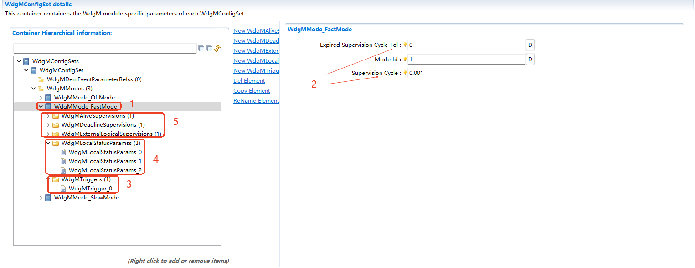
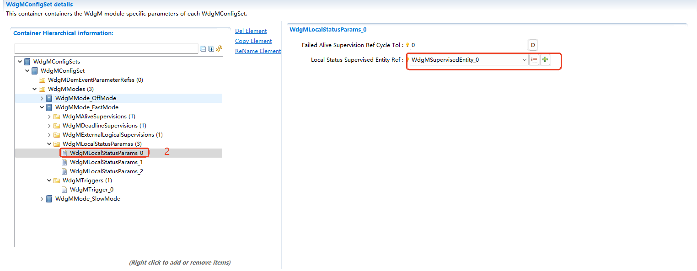
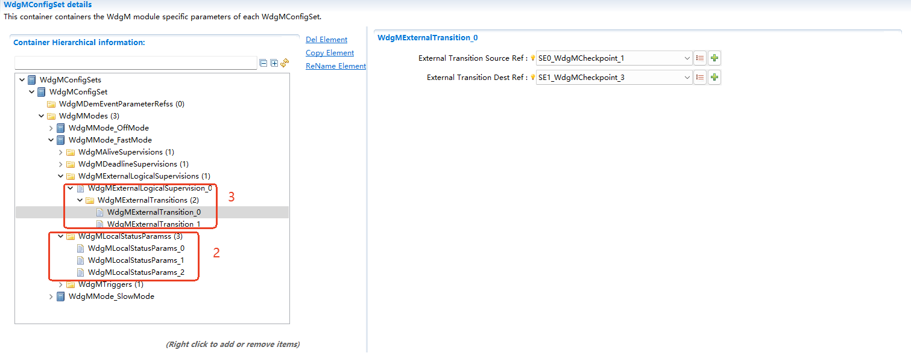
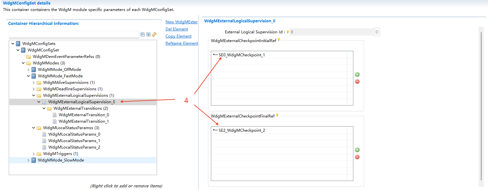

===================
WdgM
===================

文档信息 Document Information
============================================================

版本历史 Version History
------------------------------------------------------------------------------------------------------

.. list-table::
   :widths: 10 10 10 10 20
   :header-rows: 1

   * - 日期(Date)
     - 作者(Author)
     - 版本(Version)
     - 状态(Status)
     - 说明(Description)

   * - 2024/11/29
     - xudong.guan
     - V0.1
     - 发布(Release)
     - 首次发布(First release)

   * - 2025/04/04
     - xudong.guan
     - V1.0
     - 发布(Release)
     - 正式发布(Official release)

参考文档 References
------------------------------------------------------------------------------------------------------

.. list-table::
   :widths: 10 10 30 10
   :header-rows: 1

   * - 编号(Number)
     - 分类(Classification)
     - 标题(Title)
     - 版本(Version)
   * - 1
     - Autosar
     - AUTOSAR_CP_SRS_ModeManagement.pdf
     - R23-11
   * - 2
     - Autosar
     - AUTOSAR_CP_SWS_WatchdogManager.pdf
     - R23-11 
   * - 3
     - Autosar
     - AUTOSAR_CP_SWS_WatchdogInterface.pdf
     - R23-11 
   * - 4
     - Autosar
     - AUTOSAR_CP_SWS_WatchdogDriver.pdf
     - R23-11 

术语与简写 Terms and Abbreviations
====================================================================

术语 Terms
--------------------------------------------------------------------------------------------------------
.. :align: center   表格内容居中(Table contents are centered)

.. list-table::
   :widths: 15 40
   :header-rows: 1

   * - 术语(Terms)
     - 解释(Explanation)

   * - Alive Counter
     - 在检查点(Checkpoint)上下文中，WdgM中的独立数据资源，用于跟踪和处理其Alive indications。(In the context of checkpoint, the independent data resources in WdgM are used for tracing and processing the Alive indications.)

   * - Alive Indication
     - 由被监督实体(Supervised Entity)的检查点(Checkpoint)提供的一种指示，用于向WdgM发送其Alive状态的信号。(A kind of indication provided by the Checkpoint of Supervised Entity to send the signal of its Alive status to WdgM.)

   * - Alive Supervision
     - 一种监督方式，检查被监督实体是否执行得足够频繁和不太频繁(包括容忍度)。(A kind of supervision method used for checking if the Supervised Entity is executing frequently or infrequently enough (including tolerance).)

   * - Deadline Supervision
     - 一种监督，检查两个检查点之间的执行时间是否在给定的限制时间内。(A kind of supervision used for checking if the execution time between two checkpoints is within the given deadline)

   * - Deadline Start Checkpoint
     - 配置了Deadline监督的检查点，它是特定Deadline监督的起始点。(The checkpoint for Deadline monitoring has been configured and serves as the start point for specific deadline monitoring.)

   * - Deadline End Checkpoint (Deadline Stop Checkpoint)
     - 配置了Deadline监督的检查点，它是特定Deadline监督的结束点。如果Deadline监督是链式的，有可能某个检查点同时是截止期限开始检查点和截止期限结束检查点。(The checkpoint for Deadline monitoring has been configured and serves as the end point for specific deadline monitoring.) If deadline supervision is of chain type, a checkpoint may be both the deadline start checkpoint and deadline end checkpoint at the same time.

   * - Expired Supervision Cycle
     - 存活监督未能通过其两个步骤的监督周期(alive counter未能达到预期的alive indications(包括容差)比允许失败的参考周期次数更多)。(Survival supervision fails to pass its two-step supervision cycle (the alive counter fails to achieve the expected alive indications (including tolerances) and has more times than the reference cycles allowed to fail).)

   * - Failed Supervision Reference Cycle
     - 以检测到alive counter与预期alive indications之间存在偏差(包括容差)而结束的监督参考周期。(The supervision reference cycle which ends when a deviation (including tolerance) is detected between the auxiliary counter and the expected auxiliary indications.)

   * - Global Supervision Status
     - 全局监督状态，是汇总所有被监督实体的本地监督状态之后得到的状态。(The global supervision status is the status obtained by summarizing the local supervision status of all supervised entities.)

   * - Graph
     - 控制流图。一组通过转换(Transitions)连接的检查点(Checkpoints)，其中至少有一个检查点是初始检查点(Initial Checkpoint)。图中任意两个检查点之间都存在一条路径(通过Transitions)。(Control flow diagram.) At least one of a set of Checkpoints connected through Transitions is an Initial Checkpoint. A path exists between any two checkpoints in the diagram (via Transitions).
   * - External Graph
     - 可能涉及多个被监督实体的图。其配置依赖于模式。(The graph that may involve several supervised entities.) Its configuration depends on the specific mode.

   * - External Transition
     - 两个属于不同被监督实体的检查点之间的转换。(Transition between the two checkpoints belonging to different supervised entities.)

   * - Local Supervision Status
     - 表示单个被监督实体当前结果的状态。(It indicates the status of the present result of a single supervised entity.)

   * - Logical Supervision
     - 一种在线监督软件的方式，用于检查软件(被监督实体或一组被监督实体)是否按照程序员(通过开发的代码)定义的序列执行。(A kind of method of online supervision software used for checking if the software (one or a group of supervised entities) is executing according to the sequence defined by programmer (through developed code).)

   * - Internal Graph
     - 不跨越多个被监督实体的图。其配置与模式无关，并且可以通过禁用相应的被监督实体来禁用。(Graph that does not cross several supervised entities.) Its configuration is not related to mode but can be disabled by disabling the corresponding supervised entity.

   * - Internal Transition
     - 属于同一被监督实体的两个检查点之间的转换(Transitions)。(Transitions between two checkpoints falling under the same supervised entity.)

   * - Mode
     - 模式是一组运行在车辆中的各种状态机的状态集合，这些状态对特定实体(如软件组件、基础软件模块、应用程序或整车)具有相关性。在其生命周期中，实体会在一组互斥的模式之间变化。这些变化由环境数据触发，例如信号接收、操作调用等。在WdgM的上下文中，模式由一组配置选项定义。要监督的被监督实体集合可能随模式而变化。(It refers to the collection of statuses of various state machines running in a vehicle. All these statuses are correlated with specific entities such as software components, basic software modules, applications, or the entire vehicle.) During its lifecycle, entities will change between a set of mutually exclusive modes. All these changes are triggered by environmental data, such as signal receiving, operation calls, etc. In the context of WdgM, mode is defined by a set of configuration options. The set of supervised entities to be supervised may vary along with mode.

   * - Supervised Entity
     - 包含在看门狗管理器监督中的软件实体。每个被监督实体都有唯一的一个标识符。被监督实体指代软件组件类型或基础软件模块实例内的一组检查点。软件组件类型或基础软件模块的实例中可能有零个、一个或多个被监督实体。(The software entity in the watchdog manager supervision is included.) Each supervised entity has a unique identifier. The supervised entity refers to a set of checkpoints in the software component type or underlying software module instance. The instances of software component types or basic software modules may contain zero, one or several supervised entities.

   * - Supervised Entity Identifier
     - 在应用程序内唯一标识一个被监督实体的标识符。(The identifier which identifies a supervised entity exclusively within an application.)

   * - Supervision Counter
     - 在被监督实体上下文中，由看门狗管理器在每次监督周期中更新的独立数据资源，该资源用于存活监督算法检查已计数的Alive indications。(In the context of the supervised entity, the independent data resource updated by the watchdog manager in each supervision cycle is used by the survival supervision algorithm to check the counted Alive indications.)

   * - Supervision Cycle
     - 看门狗管理器监督参考周期的时间基准，在此期间进行周期性的存活监督。它也是更新全局监督状态和执行结果恢复动作的时间间隔。这在所属看门狗管理器主函数的每次调用中完成，并且与模式相关(在切换模式时可能会变化)。(The watchdog manager supervises the time reference of the reference period and conducts periodic survival monitoring in the period above.) It is also the time interval for updating the global supervision status and executing result recovery. It is complete in each call to the main function of the watchdog manager and is related to mode (it may change when switching modes).
     
   * - Supervision Reference Cycle
     - 用于存活监督检查已计数的alive indications(针对每个被监督实体单独进行)的监督周期数量，与模式相关。(The number of supervision cycles for the counted alive indicators (conducted for each supervised entity respectively) used for survival supervision checks; it is related to mode.)

简写 Abbreviations
------------------------------------------------------------

.. list-table::
   :widths: 10 20 30
   :header-rows: 1

   * - 简写(Abbreviation)
     - 全称(Full name)
     - 解释(Explanation)

   * - API
     - Application Programming Interface
     - 应用编程接口

   * - WDG
     - Watchdog
     - 看门狗

   * - WdgM
     - Watchdog Manager
     - 看门狗管理器

   * - WdgIf
     - Watchdog Interface
     - 看门狗接口(Watchdog interface)

   * - SE
     - Supervision Entity
     - 监督实体

   * - CP
     - CheckPoint
     - 监控点

   * - DEM
     - Diagnostic Event Manager
     - 诊断事件管理器

   * - DET
     - Default Error Tracer
     - 默认错误跟踪器

   * - OS
     - Operating System
     - 操作系统

   * - BSW
     - Basic Software
     - 基础软件

   * - MCU
     - Microcontroller Unit
     - 微控制器

   * - MPU
     - Memory Protection Unit
     - 内存保护单元

   * - STM
     - System Timer
     - 系统定时器

   * - MCAL
     - Microcontroller Abstraction Layer
     - 微控制器抽象层

简介 Introduction
==================================

看门狗硬件实际上是一个特殊的定时器，当定时周期到达时，会发出溢出脉冲，从而引起整个板子的复位。在程序中使用时需要适当的插入一些看门狗定时器复位指令，从而保证程序正常运行时看门狗不溢出。当程序运行出现异常情况时，看门狗会因为长时间未运行复位指令引起定时器超时，从而产生溢出脉冲，通过 RESET 引脚对硬件进行复位。

The watchdog hardware is indeed a special timer that emits an overflow pulse when the timer period expires, leading to the resetting of the entire board. If it is used in program, insert some watchdog timer reset instructions properly, so that the watchdog does not overflow when the program runs normally. When any problem occurs to program running, the timer will time out, for the watchdog does not run the reset command for a long time, thus generating overflow pulse. The hardware can be reset by RESET pin. 

WDG协议栈是 AUTOSAR 标准里的基本基础软件之一。其原理是 WDG 运行期间如果不定时喂狗，WDG 就会使系统复位，这就保证整个系统良好运行，不会出现死循环、死锁或者某个程序一直占用资源不释放的情况。WDG 可提供给用户自己设置的在不喂狗的情况下最大的不复位时间，可设置多种模式，如果硬件支持，可设置进入睡眠模式。

The WDG protocol stack is one of the basic foundational software in the AUTOSAR standard. How it works: If the dog is fed irregularly while WDG is running, WDG will reset the system, to ensure that the entire system runs smoothly without dead loops, deadlocks, or avoid a program from occupying resources continuously. WDG can provide users with the maximum non-reset time they can set without feeding the dog. Several modes can be set, including sleep mode, as long as the hardware can satisfy the requirements. 

WdgM是AUTOSAR的一个基础软件模块，WdgM能够监督程序的执行并触发硬件看门狗。ORIENTAIS WDG使用静态配置和动态管理将其功能集成到相关对象中。对象之间的相互调用是通过相关接口实现的。ORIENTAIS WDG设计目标是为了设计一个安全的看门狗管理和实体监督协议栈，遵循ISO26262:2018 功能安全所约束条件，目前ORIENTAIS WDG现已通过 TÜV Rheinland 的 ISO 26262 ASIL D 的产品认证。ORIENTAIS WDG 的架构如下图所示，其中WdgM位于系统服务层。

As a basic software module of AUTOSAR, WdgM can supervise the execution of programs and trigger hardware watchdogs. ORIENTIS WDG integrates its functions into related objects through static configuration and dynamic management. The calls between objects are achieved through related interfaces. The design goal of ORIENTIS WDG is to design a secure watchdog management and entity supervision protocol stack, which satisfies the requirements of ISO26262:2018 functional safety. ORIENTIS WDG has passed the product certification of ISO 26262 ASIL D by T Ü V Rheinland. The architecture of ORIENTIS WDG is shown in the following figure, where WdgM is at the system service layer.

.. figure:: ../../../_static/参考手册/WdgM/WdgM_ArchitectureFigure.png
   :alt: WdgM架构层次图 (WdgM architecture hierarchy diagram)
   :name: WdgM_arch
   :align: center

   WdgM架构层次图 (WdgM architecture hierarchy diagram)

如“WdgM架构层次图”所示，WdgM模块处于AUTOSAR架构中的系统服务层，其下层模块为WdgIf模块，上层模块为RTE。

As shown in the "WdgM architecture hierarchy diagram", the WdgM module is in the system service layer of the AUTOSAR architecture. Its upper and lower modules are WdgIf module and RTE respectively.

功能描述 Functional Description
==========================================================

特性 Features
----------------------------------------------------------------

WdgM功能介绍 Introduction to WdgM Functions
~~~~~~~~~~~~~~~~~~~~~~~~~~~~~~~~~~~~~~~~~~~~~~~~~~~~~~~~~~~~~~~~~~~~~~~~~~~~~~~~~~~~~~~~~~~~~~~~~~~~~~~~~~~~~~~~~~

WdgM模块为Watchdog看门狗协议栈的顶层，为用户提供API应用的接口。WdgM 通过 WdgIf 来改变看门狗的模式，并用于向 Wdg Driver 报告触发硬件看门狗的条件。Watchdog 结构层次如下图所示。

The WdgM module is the top layer of the Watchdog protocol stack. It provides users with interface for API application. WdgM changes the watchdog mode via WdgIf and is used for reporting the conditions that trigger the hardware watchdog to WdgDriver. The Watchdog structure hierarchy is shown in the figure below.

.. figure:: ../../../_static/参考手册/WdgM/WdgM_layer.png
   :alt: WdgM层次介绍(Introduction toWdgM hierarchy)
   :name: fig_layer
   :align: center

   WdgM架层次简要结构图 (Brief structural diagram of WdgM rack hierarchy)

WdgM监督算法 WdgM Supervision Algorithm
~~~~~~~~~~~~~~~~~~~~~~~~~~~~~~~~~~~~~~~~~~~~~~~~~~~~~~~~~~~~~~~~~~~~~~~~~~~~~~~~~~~~~~~~~~~~~~~~~~~~~~~~~~~~~~~~~~
监督模块实现了看门狗WDG的监控功能，也是WDG的主要功能。看门狗WDG在用户选择的特定模式下工作，每种模式有多个监督实体组成，相应的全局监督状态也是由每个监督实体的局部监督状态计算出来的。每一个监督实体都包括几个活动监督(Alive Supervision)、期限监督(Deadline Supervision)和逻辑监督(Logical Supervision)。该监督实体的相应局部监督状态也从相应的活动监督、期限监督和逻辑监督的所有结果中计算出来。

The supervision module realizes the monitoring function of the watchdog WDG, and is also the main function of WDG. The watchdog WDG works under the specific mode selected by user. Each mode consists of several supervised entities, and the corresponding global supervised state is also calculated by the local supervised state of each supervised entity. Each supervised entity includes several activity supervisions (Alive Supervision), deadline supervisions (Deadline Supervision), and logical supervisions (Logical Supervision). The corresponding local supervision status of the supervised entity is also calculated by all the results of the corresponding activity supervision, deadline supervision and logical supervision.

WdgM模式 WdgM Mode
~~~~~~~~~~~~~~~~~~~~~~~~~~~~~~~~~~~~~~~~~~~~~~~~~~~~~~~~~~~~~~~~~~~~~~~~~~~~~~~~~~~~~~~~~~~~~~~~~~~~~~~~~~~~~~~~~~
WdgM可配置多种运行Mode模式，每个Mode包含数个Supervision Entity (SE)，每个SE包含多个Checkpoint (CP)。根据对CP之间的时间差、CP执行顺序的关注，分为Alive Supervision，Deadline Supervision，Logical Supervision。

WdgM can come with several operating Modes, each of which includes several Supervision Entities (SEs); each SE contains several Checkpoints (CPs). By the time difference between CPs and the focus on the execution order of CPs, they can be further divided into Alive Supervision, Deadline Supervision, and Logical Supervision. 

WdgM状态 WdgM Status
~~~~~~~~~~~~~~~~~~~~~~~~~~~~~~~~~~~~~~~~~~~~~~~~~~~~~~~~~~~~~~~~~~~~~~~~~~~~~~~~~~~~~~~~~~~~~~~~~~~~~~~~~~~~~~~~~~
WdgM引入Local Status和Global Status两种状态，其中Local Status和所属SE的各种监督结果相关，而Global Status则和当前模式下所有活动的Local Status相关。WdgM通过监督算法对状态计算决定是否要触发硬件看门狗。

WdgM introduces two statuses: Local Status and Global Status, of which, the former is related to various monitoring results of the SE it belongs to while the latter is related to the Local Status of all activities in the present mode. WdgM calculates the status using supervised algorithm to judge whether to trigger the hardware watchdog. 

.. figure:: ../../../_static/参考手册/WdgM/WdgM_Supervision.png
   :alt: WdgM监督(WdgM supervision)
   :name: fig_supervision
   :align: center

   WdgM监督示意图 (WdgM supervision diagram)

WdgM执行流程 WdgM Execution Process
~~~~~~~~~~~~~~~~~~~~~~~~~~~~~~~~~~~~~~~~~~~~~~~~~~~~~~~~~~~~~~~~~~~~~~~~~~~~~~~~~~~~~~~~~~~~~~~~~~~~~~~~~~~~~~~~~~

WdgM模块通过监督算法、模式和状态机制，完成对程序的Alive，Deadline和Logical监督，其执行流程如下图所示：

The WdgM module finishes supervising Alive, Deadline, and Logical by the program by supervising algorithms, mode and state mechanisms. Its execution process is shown in the figure below:

.. figure:: ../../../_static/参考手册/WdgM/WdgM_flow.png
   :alt: WdgM监督流程(WdgM supervision process)
   :name: fig_flow
   :align: center

   WdgM监督流程图 (WdgM supervision flow chart)

偏差 Deviation
------------------------------------------------------------------------------------
1.不支持多MainFunction配置

因为目前设计的架构为核心独立的WdgM，不支持同一核心多MainFunction配置。

1.Multiple MainFunction configurations are not supported

The current architecture is the WdgM with an independent core, it does not support multiple MainFunction configurations within the same core.

2.localSupervision_{SupervisedEntityCheckpointName}服务接口CheckpointId为参数传递

当前服务封装为统一接口和便于管理，将CheckpointId作为参数传递，WdgM根据CheckpointId获取CheckpointName，并调用WdgM的localSupervision接口。

2.localSupervision_{SuperviseEntityCheckpointName} service interface CheckpointId is passed as a parameter
   
The current service is encapsulated with a unified interface. To facilitate management, CheckpointId is passed as a parameter. WdgM obtains CheckpointName based on CheckpointId and calls the localSupervision interface of WdgM.

扩展 Extension
------------------------------------------------------------------------------------
1.WdgM Combination支持

通过不同核心的WdgM进行组合，组成联合体，适用于一个看门狗硬件管控所有内核的情况。

1.WdgM Combination support
   
Combine WdgM with different cores to form a consortium. It is suitable for the scenario where a watchdog hardware is used for controlling to control all cores.

集成 Integration
========================================

文件列表 File List
--------------------------------------------------------------------

静态文件 Static Files
~~~~~~~~~~~~~~~~~~~~~~~~~~~~~~~~~~~~~~~~

.. list-table::
   :widths: 10 30
   :header-rows: 1

   * - 文件(File)
     - 描述(Description)
   
   * - WdgM.c
     - WdgM源文件，存放WdgM的实现代码。(WdgM source file, which is used for storing the implementation code of WdgM.)

   * - WdgM.h
     - WdgM头文件，存放WdgM的变量和接口声明。(WdgM header file, which is used for storing variables and interface declarations of WdgM.)

   * - WdgM_CfgType.h
     - WdgM配置类型头文件，存放WdgM的配置类型声明。(WdgM configuration type header file, which is used for storing WdgM configuration type declarations.)

   * - WdgM.MemMep.h
     - WdgM的内存映射定义文件。(Memory mapping definition file of WdgM.)

   * - WdgM_Type.h
     - WdgM的数据类型定义文件,包含运行时使用的数据类型声明。(Data type definition file of WdgM, which contains the declarations of data types used for running.)

动态文件 Dynamic Files
~~~~~~~~~~~~~~~~~~~~~~~~~~~~~~~~~~~~~~~~~~~~~~
.. list-table::
   :widths: 10 30
   :header-rows: 1

   * - WdgM_Cfg.h
     - WdgM配置头文件，存放WdgM的配置生成宏定义和数据声明。(WdgM configuration header file, which is used for storing the macro definitions and data declarations generated by WdgM configuration.)

   * - WdgM_Cfg.c
     - WdgM配置源码文件，存放WdgM的配置生成代码。(WdgM configuration source code file, which is used for storing WdgM configuration generation code.)

错误处理 Error Handling
------------------------------------------------------------------------------------------

开发错误 Development Errors
~~~~~~~~~~~~~~~~~~~~~~~~~~~~~~~~~~~~~~~~~~~~~~~~~~~~
.. list-table:: 
   :widths: 20 10 30
   :header-rows: 1

   * - Error code
     - Value[hex]
     - Description

   * - WDGM_E_UNINIT
     - 0x10
     - 在WdgM未初始化的时候调用了API(API is called before the initialization of WdgM)

   * - WDGM_E_PARAM_CONFIG
     - 0x11
     - 调用API服务Wdg_Init时使用错误的配置集(Incorrect configuration set is used when calling API service Wd_Init)

   * - WDGM_E_PARAM_MODE
     - 0x12
     - 使用错误的“模式”参数调用API服务(API service is called by using incorrect "mode" parameters)

   * - WDGM_E_PARAM_SEID
     - 0x13
     - 使用错误的“受监督实体标识符”参数调用API服务(API service is called by using incorrect "supervised entity identifier" parameter)

   * - WDGM_E_INV_POINTER
     - 0x14
     - 调用API服务时传入了无效指针(Invalid indicator is transferred while calling API service)

   * - WDGM_E_CPID
     - 0x16
     - 调用API服务时，使用了非法的检查点标识符(Illegal checkpoint identifier is used while calling API service)

   * - WDGM_E_NO_DEINIT
     - 0x1A
     - 在模块未反初始化时调用了WdgM_Init(即全局状态不是WDGM_GLOBAL_STATUS_DEACTIVATED的时候)(WdgMInit is called before the anti-initialization of module (i.e. when the global state is not WDGM_GLOBAL-STUS_deACTIVATED))

   * - WDGM_E_INIT_FAILED
     - 0x1B
     - 初始化失败，例如，选定的配置集不存在(Initialization fails; for example, the selected configuration set does not exist)

   * - WDGM_E_PARAM_POINTER
     - 0x1C
     - 调用API服务时，参数为空指针。(The parameter is a null pointer while calling API services.)

产品错误 Product Errors
~~~~~~~~~~~~~~~~~~~~~~~~~~~~~~~~~~~~~~~~~~~~~~~~~~~~
.. list-table:: 
   :widths: 20 10 30
   :header-rows: 1

   * - Error code
     - Value[hex]
     - Description

   * - WDGM_E_SUPERVISION
     - 取决于配置(Depend on the configuration)
     - 监控失败(全局监控状态已达到WDGM_GLOBAL_STATUS_STOPPED ),将发生看门狗复位。(Monitoring failure (global monitoring status has reached WDGM_GLOBAL-STUS-STOPPED), watchdog will reset.)

运行时错误 Runtime Errors
~~~~~~~~~~~~~~~~~~~~~~~~~~~~~~~~~~~~~~~~~~~~~~~~~~~~
.. list-table:: 
   :widths: 20 10 30
   :header-rows: 1

   * - Error code
     - Value[hex]
     - Description

   * - WDGM_E_DISABLE_NOT_ALLOWED
     - 0x15
     - 不允许禁用看门狗(例如在安全相关系统中)(It is forbidden to disable watchdog (e.g. in safety related systems))

   * - WDGM_E_SEDEACTIVATED
     - 0x19
     - 在调用API服务时，使用了未激活状态的受监督实体的检查点(Checkpoints of supervised entities in inactive state are used while calling API services)

   * - WDGM_E_SET_MODE
     - 0x1D
     - 看门狗驱动的模式切换失败(Failure of mode switch driven by watchdog)

接口描述 Interface Description
==============================================================
.. include:: WdgM_Type_h_api.rst
.. include:: WdgM_h_api.rst

类型定义 Type Definitions
------------------------------------------------------------------------------------------------

.. list-table:: 
   :widths: 15 5 20 20
   :header-rows: 1

   * - Type Name
     - Type
     - Description
     - Range
     
   * - WdgM_LocalStatusType
     - uint8
     - 该类型用于描述独立的受监督实体的本地状态。(This type is used for describing the local status of independent supervised entities.)
     - WDGM_LOCAL_STATUS_OK 0u
       WDGM_LOCAL_STATUS_FAILED 1u
       WDGM_LOCAL_STATUS_EXPIRED 2u
       WDGM_LOCAL_STATUS_DEACTIVATED 4u

   * - WdgM_GlobalStatusType
     - uint8
     - 该类型用于描述WdgM的全局监督状态。(This type is used for describing the global supervision status of WdgM.)
     - WDGM_GLOBAL_STATUS_OK 0u
       WDGM_GLOBAL_STATUS_FAILED 1u
       WDGM_GLOBAL_STATUS_EXPIRED 2u
       WDGM_GLOBAL_STATUS_STOPPED 2u
       WDGM_GLOBAL_STATUS_DEACTIVATED 4u

依赖的服务 Applicable Services
----------------------------------------------------------------------------------------

强制接口 Compulsory interface
~~~~~~~~~~~~~~~~~~~~~~~~~~~~~~~~~~~~~~~~~~~~~~~~~~~~
.. list-table::
   :widths: 10 5 30
   :header-rows: 1

   * - API Function
     - Header File
     - Description

   * - Det_ReportRuntimeError
     - Det.h
     - Service to report runtime errors. If a callout has been configured then this callout shall be called.

   * - GetElapsedValue
     - Os.h
     - This service gets the number of ticks between the current tick value and a previously read tick value.
     
   * - WdgIf_SetMode
     - WdgIf.h
     - Map the service WdgIf_SetMode to the service Wdg_SetMode of the corresponding Watchdog Driver.

   * - WdgIf_SetTriggerCondition
     - WdgIf.h
     - Map the service WdgIf_SetTriggerCondition to the service Wdg_SetTriggerCondition of the corresponding Watchdog Driver.

可选接口 Optional Interface
~~~~~~~~~~~~~~~~~~~~~~~~~~~~~~~~~~~~~~~~~~~~~~~~~~~~
.. list-table::
   :widths: 10 5 30
   :header-rows: 1

   * - API Function
     - Header File
     - Description

   * - Dem_SetEventStatus
     - Dem.h
     - 由SW-Cs或BSW模块调用，向Dem报告监视器状态信息。调用Dem_SetEventStatus的BSW模块可以安全地忽略返回值。仅当({ Dem/Dem ConfigSet/DemEvent parameter/DemEvent REPORTING type } = = STANDARD _ REPORTING)时，此服务才可用(It is called by SW Cs or BSW module, and reports monitor status information to Dem.) The return value can be ignored safely by calling the BSW module of Dem_SetEventStatus. This service is available only when ({Dem/Dem Config Set/DemEvent parameter/DemEvent REPORTING type}=STANDARD _ REPORTING)

   * - Det_ReportError
     - Det.h
     - 该服务用来报告开发错误(The service is used for reporting development error)

   * - Mcu_PerformReset
     - Mcu.h
     - 该服务执行微控制器复位(The service is used for resetting microcontroller)

服务封装 Service Encapsulation
----------------------------------------------------------------------------------------
以下类型和接口可以封装至 SWC 生成完整的服务组件，可以与应用通过端口连接，没有列出的部分 WdgM 底层暂时不支持。

The following types and interfaces can be encapsulated into SWC to generate complete service components, and connected to applications through ports. Some of the WdgM underlying components not listed herein are temporarily not supported.

实现数据类型封装 Encapsulation of Data Type
~~~~~~~~~~~~~~~~~~~~~~~~~~~~~~~~~~~~~~~~~~~~~~~~~~~~~~~~~~~~~~~~~~~~~~~~~~
.. list-table::
   :widths: 10 30
   :header-rows: 1

   * - 类型名及定义引用(Type name and definition reference)
     - 生成条件(Generation conditions)

   * - WdgM_SupervisedEntityIdType
     - 无(None)

   * - WdgM_CheckpointIdType
     - 无(None)

   * - WdgM_Mode
     - 无(None)

   * - WdgM_LocalStatusType
     - 无(None)

   * - WdgM_GlobalStatusType
     - 无(None)

   * - WdgM_ModeType
     - 无(None)

实现接口封装 Interface Encapsulation
~~~~~~~~~~~~~~~~~~~~~~~~~~~~~~~~~~~~~~~~~~~~~~~~~~~~~~~~~~~~~~~~~~
.. list-table::
   :widths: 20 20
   :header-rows: 1

   * - 接口名称(Interface name)
     - 操作(Operation)

   * - WdgM_LocalSupervision
     - CheckpointReached

   * - WdgM_LocalSupervisionStatus
     - GetLocalStatus

   * - WdgM_GlobalSupervision
     - | GetFirstExpiredSEID
       | GetGlobalStatus
       | GetMode
       | PerformReset
       | SetMode

   * - WdgM_LocalMode
     - currentMode

   * - WdgM_GlobalMode
     - currentMode

实现端口封装 Port Encapsulation
~~~~~~~~~~~~~~~~~~~~~~~~~~~~~~~~~~~~~~~~~~~~~~~~~~~~~~~~~~~~~~~~~~~~~~~~
.. list-table::
   :widths: 20 10 20
   :header-rows: 1

   * - 端口名称(Port name)
     - 类型(Type)
     - 接口(Interface)

   * - localSupervision_{SupervisedEntityCheckpointName}
     - ProvidedPort
     - WdgM_LocalSupervision

   * - localSupervisonStatus_{SupervisedEntityName}
     - ProvidedPort
     - WdgM_LocalSupervisionStatus

   * - globalSupervision
     - ProvidedPort
     - WdgM_GlobalSupervision

   * - mode_{SupervisedEntityName}
     - ProvidedPort(ModeSwitch)
     - WdgM_LocalMode

   * - globalmode (only one core WdgM)
     - ProvidedPort(ModeSwitch)
     - WdgM_GlobalMode

   * - globalmode_Core{id} (multiple cores WdgM)
     - ProvidedPort(ModeSwitch)
     - WdgM_GlobalMode

配置 Configuration
====================================

基础配置说明 Description of Basic Configurations
------------------------------------------------------------------------------------------------------------------------------------------------------

看门狗实例配置 Configuration of Watchdog Instance
~~~~~~~~~~~~~~~~~~~~~~~~~~~~~~~~~~~~~~~~~~~~~~~~~~~~~~~~~~~~~~~~~~~~~~~~~~~~~~~~~~~~~~~~
由于系统中可能存在多个看门狗，包括多个内部看门狗和多个外部看门狗。由于WdgIf模块完成了设备的抽象，在WdgM模块只需要引用WdgIf创建的配置实例。

The system may includes several watchdogs, including multiple internal watchdogs and multiple external watchdogs. The WdgIf module completes the abstraction of the device, so the WdgM module only needs to reference the configuration instance created by WdgIf.

WdgM看门狗实例配置的步骤如下：

Steps for configuring WdgM watchdog:

1.在WdgIf创建Wdg实例，其中包括InternalDevice和ExternalDevice。

1.Create a Wdg instance that includes InternalDevice and ExternalDevice in Wdglf.

2.在WdgMGeneral中添加WdgIf实例。

2.Add WdgIf instance in WdgMGeneral.

.. figure:: ../../../_static/参考手册/WdgM/WdgM_Wdg.png
   :alt: WdgM看门狗实例配置图 (Configuration diagram of WdgM watchdog instance)
   :name: WdgM_Watchdog
   :align: center

   WdgM看门狗实例配置图 (Configuration diagram of WdgM watchdog instance)

红色框1：可创建多个  

Red box 1: Several red boxes can be created

红色框2：引用WdgIf创建的实例

Red box 2:  Instance created by referencing WdgIf

模式配置 Mode Configuration
~~~~~~~~~~~~~~~~~~~~~~~~~~~~~~~~~~~~~~~~~~~~~~~~~~~~~~~~~~~~~~~~~~~~~~~~~~~~~~~~~~~~~~~~~~~~~~~~~~~~~~~~~~~~~~~~~~~~~~
WdgM提供多种模式(mode)配置，不同的模式可以切换监督模式、监督周期和看门狗的运行模式。

WdgM provides several mode configurations. Modes can be switched among supervision mode, supervision period, and watchdog operation mode.

在WdgM运行时可以通过WdgM_SetMode服务来切换相应的模式，满足应用的需求。

When WdgM is running, the corresponding mode can be switched using the WdgM SetMode service to meet the application's needs.

模式配置基本操作如下：

Basic operation of the mode configuration is as below:

1.在WdgMConfigSet容器中创建模式子容器。

1.Create a mode sub-container in the WdgMConfigSet container.

2.配置过期监督周期容忍度和监督周期。

2.Configure tolerance for expired monitoring cycles and monitoring cycles.

3.引用WdgMWatchdog实例，表示当前该模式需要触发的看门狗。

3.Reference the WdgMWatchdog instance to indicate the watchdog that needs triggering for the current mode.

4.引用监督实体，将监督实体关联到当前模式。

4.Reference the supervised entity and link the entity with the current mode.

5.监督配置，包括Alive、Deadline、External Logical监督。(Internal Logical监督在监督实体内部配置，此处如果需要包含，则只需要引用监督实体即可。)

5.Supervision configurations, including the supervision of Alive, Deadline, and External Logical. (Internal Logical supervision is configured within the supervised entity. If it needs including here, reference the supervised entity.)

   模式配置图 (Mode configuration diagram)

根据需要，可以选择当前WdgM的初始运行模式，WdgM模块在初始化的时候会将看门狗驱动自动切换到该模式。

The initial operating mode of the current WdgM can be selected as required. The WdgM module will automatically switch the watchdog driver to this mode during initialization.

.. figure:: ../../../_static/参考手册/WdgM/InitMode.png
   :alt: WdgM模式配置图 (WdgM Mode Configuration Diagram)
   :name: InitMode
   :align: center

   初始模式配置图 (Initial Mode Configuration Diagram)

监督配置说明 Descriptions of Supervision Configuration
------------------------------------------------------------------------------------------------------------------------------------------------------
  
Alive监督配置 Alive Supervision Configuration
~~~~~~~~~~~~~~~~~~~~~~~~~~~~~~~~~~~~~~~~~~~~~~~~~~~~~~~~~~~~~~~~~~~~~~~~~~~~~~~~~~~~~~~~~~~~~~~~~~~~
Alive监督用于监督程序的活性，例如在一个周期内，是否出现执行次数超过或者少于预期的情况。

Alive supervision is used for monitoring program activity, such as monitoring whether the number of executions exceeds or is less than the expected times within a cycle.

Alive监督需要以下配置项：

Alive supervision requires the following configuration items:

.. list-table::
   :widths: 10 20
   :header-rows: 1

   * - 配置项名称(Name of configuration items)
     - 描述(Description)

   * - WdgMSupervisedEntity
     - 监督实体，包含分区信息、时间来源和检查点等信息。(Supervised entities, including partition information, time sources, and checkpoint.)

   * - WdgMCheckpoint
     - 作为监督算法的监督对象，依赖于监督实体(SupervisedEntity)。(As the supervised object of the supervised algorithm, it depends on the SupervisedEntity.)

   * - WdgMMode
     - 运行模式，包含看门狗的运行模式，监督实体、Alive、Deadline、External Logical监督配置等。(Operation mode, including watchdog operation mode, supervised entity, Alive, Deadline, External Logical supervision configuration, etc.)

   * - WdgMTrigger
     - 引用WdgMWatchdog实例，表示当前该模式需要触发的看门狗。(Reference the WdgMWatchdog instance to indicate the watchdog that needs triggering for the current mode.)

Alive监督的配置需要以下步骤：

Steps for the configuration of Alive supervision:

1.配置相应的监督实体(SupervisedEntity)和检查点(Checkpoint)。

1.Configure the corresponding SupervisedEntity and Checkpoint.

2.创建模式(如果不存在)，并在模式中引用该SE。

2.Create a mode (if it does not exist) and reference the SE in such mode.

3.在模式中创建Alive监督，并引用该Checkpoint，设置相应的期待次数和容忍度。

3.Create Alive supervision in the mode, reference the Checkpoint, and set the corresponding expected frequency and tolerance.

下图配置了一个监督实体ID为0，检查点ID为0的Alive监督，监督周期为1个MainFunction周期，期待次数为4次，允许的超过次数和少于次数为1(即允许一个周期内报告3-5次)。

The figure below shows an Alive supervision with a supervised entity ID of 0 and a checkpoint ID of 0. The supervision cycle is 1 MainFunction cycle, with 4 expected times. The allowed number of exceeding or insufficient times is 1 (i.e., reporting for 3-5 times within a cycle is allowed).

.. figure:: ../../../_static/参考手册/WdgM/AliveSup.png
   :alt: Alive监督配置(Alive supervision configuration)
   :name: AliveSup
   :align: center

   Alive监督配置图-1 (Alive Supervision Configuration Diagram -1)

   Alive监督配置图-2 (Alive supervision configuration diagram -2)

.. figure:: ../../../_static/参考手册/WdgM/AliveSup_2.png
   :alt: Alive监督配置(Alive supervision configuration)
   :name: AliveSup_2
   :align: center

   Alive监督配置图-3 (Alive supervision configuration diagram -3)

注:(1)期待报告次数;(2)最大允许超出次数;(3)最大允许少于次数;(4)实行Alive监督的周期次数;(5)检查点引用

Note: (1) Expected reporting times; (2) Maximum allowed exceeding times; (3) The maximum allowable insufficient times; (4) The number of cycles for executing Alive supervision; (5) Checkpoint reference

Deadline监督配置 Deadline Supervision Configuration
~~~~~~~~~~~~~~~~~~~~~~~~~~~~~~~~~~~~~~~~~~~~~~~~~~~~~~~~~~~~~~~~~~~~~~~~~~~~~~~~~~~~~~~~~~~~~~~~~~~~
Deadline监督用于监督程序执行时间是否超过预期，时间间隔由2个检查点报告的时间间差决定。

Deadline supervision is used for monitoring whether the supervision program execution time exceeds expectations. The time interval is determined by the time difference reported by two checkpoints.

Deadline监督需要以下配置项：

Deadline supervision requires the following configuration items:

.. list-table::
   :widths: 10 20
   :header-rows: 1

   * - 配置项名称(Name of configuration items)
     - 描述(Description)

   * - WdgMSupervisedEntity
     - 监督实体，包含分区信息、时间来源和检查点等信息。(Supervised entities, including partition information, time sources, and checkpoint.)

   * - WdgMCheckpoint
     - 作为监督算法的监督对象，依赖于监督实体(SupervisedEntity)。(As the supervised object of the supervised algorithm, it depends on the SupervisedEntity.)

   * - WdgMOSCounter
     - Deadline监督时间戳的获取来源，在Os模块中配置。(The source of getting the deadline supervision timestamp is configured in the Os module.)

   * - WdgMMode
     - 运行模式，包含看门狗的运行模式，监督实体、Alive、Deadline、External Logical监督配置等。(Operation mode, including watchdog operation mode, supervised entity, Alive, Deadline, External Logical supervision configuration, etc.)

Deadline监督的配置需要以下步骤：

Steps for the configuration of Deadline supervision:

1.创建监督实体和检查点(至少2个检查点)

1.Create supervised entities and checkpoints (at least 2 checkpoints)

2.选择OsCounter计时器作为时钟来源。

2.Choose OsCounter timer as the clock source.

3.创建模式(如果不存在)，并在模式中引用相关SE。

3.Create a mode (if it does not exist) and reference relevant SE in such mode.

4.创建Deadline监督(可多个)，引用检查点并设置允许的时间间隔。

4.Create Deadline supervision (more than 1 supervisions allowed), reference checkpoints and set allowed time interval.

下图配置了一个执行时间在4ms和6ms之间的Deadline监督，且开启了Timout检测(即在报告开始点后，结束点一直不报告的超时情况)。

The figure below displays the Deadline supervision with an execution time between 4ms and 6ms, and Timeout detection is enabled (i.e. timeout not reported after the start and end points).

.. figure:: ../../../_static/参考手册/WdgM/DeadlineSup.png
   :alt: Deadline监督配置(Deadline supervision configuration)
   :name: DeadlineSup
   :align: center

   Deadline监督配置图-1 (Deadline Supervision Configuration Diagram -1)

.. figure:: ../../../_static/参考手册/WdgM/DeadlineSup_1.png
   :alt: Deadline监督配置(Deadline supervision configuration)
   :name: DeadlineSup_2
   :align: center

   Deadline监督配置图-2 (Deadline supervision configuration diagram -2)

.. figure:: ../../../_static/参考手册/WdgM/DeadlineSup_2.png
   :alt: Deadline监督配置(Deadline supervision configuration)
   :name: DeadlineSup_3
   :align: center

   Deadline监督配置图-3 (Deadline supervision configuration diagram -3)

注:(1)是否开启超时检测;(2)最大时间间隔(s);(3)最小时间间隔(s);(4)开始检查点;(5)结束检查点

Note: (1) Whether timeout detection is enabled; (2) Maximum time interval (s); (3) Minimum time interval (s); (4) Start checkpoint; (5) End checkpoint

Internal Logical监督配置 Internal Logical supervision configuration
~~~~~~~~~~~~~~~~~~~~~~~~~~~~~~~~~~~~~~~~~~~~~~~~~~~~~~~~~~~~~~~~~~~~~~~~~~~~~~~~~~~~~~~~~~~~~~~~~~~~
Internal Logical监督用于监测程序流的执行顺序。Internal Logical与External Logical监督的区别是，Internal Logical监督的所有检查点和转换图都属于同一个监督实体。

Internal Logical supervision is used for monitoring the execution sequence of program flow. The difference between Internal Logical and External Logical supervision is that all checkpoints and transformation graphs supervised by Internal Logical belong to the same supervised entity.

Internal Logical监督需要以下配置项：

Internal Logical supervision requires the following configuration items:

.. list-table::
   :widths: 10 20
   :header-rows: 1

   * - 配置项名称(Name of configuration items)
     - 描述(Description)

   * - WdgMSupervisedEntity
     - 监督实体，包含分区信息、时间来源和检查点等信息。(Supervised entities, including partition information, time sources, and checkpoint.)

   * - WdgMCheckpoint
     - 作为监督算法的监督对象，依赖于监督实体(SupervisedEntity)。(As the supervised object of the supervised algorithm, it depends on the SupervisedEntity.)

   * - WdgMInternalTransition
     - Internal Logical监督内部转换图，描述2个检查点之间的调用顺序。(Internal Logical supervises the internal transformation graph and describes the calling sequence between two checkpoints.)

   * - WdgMMode
     - 运行模式，包含看门狗的运行模式，监督实体、Alive、Deadline、External Logical监督配置等。(Operation mode, including watchdog operation mode, supervised entity, Alive, Deadline, External Logical supervision configuration, etc.)

Internal Logical监督的配置需要以下步骤：

Steps for Internal Logical supervision configuration:

1.创建监督实体和检查点，至少1个监督实体和2个检查点。

1.Create supervised entities (at least 1) and checkpoints (2 checkpoints).

2.创建内部转换图，描述检查点之间的调用顺序。

2.Create an internal transformation graph that describes the calling sequence between checkpoints.

3.指定最终的开始点和结束点(分别需要满足内部监督中第一个转换图开始点和最后一个转换图结束点)。

3.Specify the final start and end points (they should meet the requirements of the start point of the first transition diagram and the end point of the last transition diagram in internal supervision, respectively).

4.创建模式(如果不存在)，并在模式中引用相关SE。

4.Create a mode (if it does not exist) and reference relevant SE in such mode.

下图配置了一个由监督实体ID为1，检查点ID为0、1和2组成的Internal Logical监督，其报告顺序为SE1_CP0->SE1_CP1->SE1_CP2(数字代表ID)。

The figure below displays an Internal Logical supervision consisting of a supervised entity ID of 1 and checkpoint IDs of 0, 1, and 2. The reporting order is SE1_CP0->SE1_CP1->SE1_CP2 (numbers represent IDs).

.. figure:: ../../../_static/参考手册/WdgM/IntLogSup.png
   :alt: Internal Logical监督配置(Internal Logical supervision configuration)
   :name: IntLogSup
   :align: center

   Internal Logical监督配置图-1 (Internal Logical Supervision Configuration Diagram -1)

.. figure:: ../../../_static/参考手册/WdgM/IntLogSup_1.png
   :alt: Internal Logical监督配置(Internal Logical supervision configuration)
   :name: IntLogSup_1
   :align: center

   Internal Logical监督配置图-2 (Internal Logical supervision configuration diagram -2)

.. figure:: ../../../_static/参考手册/WdgM/IntLogSup_2.png
   :alt: Internal Logical监督配置(Internal Logical supervision configuration)
   :name: IntLogSup_2
   :align: center

   Internal Logical监督配置图-3 (Internal Logical supervision configuration diagram -3)

External Logical监督配置 External Logical supervision configuration
~~~~~~~~~~~~~~~~~~~~~~~~~~~~~~~~~~~~~~~~~~~~~~~~~~~~~~~~~~~~~~~~~~~~~~~~~~~~~~~~~~~~~~~~~~~~~~~~~~~~~~~~~~~~~
Internal Logical监督用于监测程序流的执行顺序。External Logical与Internal Logical监督的区别是，External Logical监督的检查点属于不同的监督实体，即跨SE监督。

Internal Logical supervision is used for monitoring the execution sequence of program flow. The difference between External Logical and Internal Logical supervision is that the checkpoints of External Logical supervision belong to different supervised entities, i.e., cross SE supervision.

Internal Logical监督需要以下配置项：

Internal Logical supervision requires the following configuration items:

.. list-table::
   :widths: 10 20
   :header-rows: 1

   * - 配置项名称(Name of configuration items)
     - 描述(Description)

   * - WdgMSupervisedEntity
     - 监督实体，包含分区信息、时间来源和检查点等信息。(Supervised entities, including partition information, time sources, and checkpoint.)

   * - WdgMCheckpoint
     - 作为监督算法的监督对象，依赖于监督实体(SupervisedEntity)。(As the supervised object of the supervised algorithm, it depends on the SupervisedEntity.)

   * - WdgMExternalLogicalSupervision
     - External Logical监督外部转换图，描述不同SE的2个检查点之间的调用顺序。(External Logical supervises the external transformation graph and describes the call sequence between two checkpoints of different SEs.)

   * - WdgMMode
     - 运行模式，包含看门狗的运行模式，监督实体、Alive、Deadline、External Logical监督配置等。(Operation mode, including watchdog operation mode, supervised entity, Alive, Deadline, External Logical supervision configuration, etc.)

External Logical监督的配置需要以下步骤：

Steps for External Logical supervision configuration:

1.创建监督实体和检查点，至少2个监督实体和分别1个检查点。

1.Create supervised entities (at least 2) and checkpoints (1 checkpoint respectively)

2.创建模式(如果不存在)，并在模式中引用相关SE。

2.Create a mode (if it does not exist) and reference relevant SE in such mode.

3.创建外部监督和外部转换图，描述不同SE的检查点之间的调用顺序。

3.Create external supervision and external transformation graphs and describe the call sequence between checkpoints of different SEs.

4.指定最终的开始点和结束点。

4.Specify the final start and end points.

下图配置了一个由监督实体ID为0、1、2，检查点ID为1、3、2组成的External Logical监督，其报告顺序为SE0_CP1->SE1_CP3->SE2_CP2(数字代表ID)。

The figure belowdisplays an External Logical supervision consisting of supervised entity IDs of 0, 1, 2 and checkpoint IDs of 1, 3, 2. The reporting order is SE0_CP1->SE1_CP3->SE2_CP2 (numbers represent IDs).

.. figure:: ../../../_static/参考手册/WdgM/ExtLogSup.png
   :alt: External Logical监督配置(External Logical supervision configuration)
   :name: ExtLogSup
   :align: center

   External Logical监督配置图-1  (External Logical supervision configuration diagram -1)

   External Logical监督配置图-2 (External Logical supervision configuration diagram -2)

   External Logical监督配置图-3 (External Logical supervision configuration diagram -3)

多核多分区配置说明 Descriptions of Multi-core Multi-Partition Configuration
------------------------------------------------------------------------------------------------------------------------------------------------------------------------------------------------------------------------
由于多核Mcu可能存在多个内部看门狗驱动，而每个内部看门狗驱动具有独立的时钟源，需要相对应的核心才能够完成喂狗操作。在多核架构中，每个核心可以单独运行WdgM模块，分别监督当前核心的运行情况，独立喂狗；也可以由多个核心的WdgM组成联合结构，共同维持系统的运行(该情况通常用于整个系统由一个外狗监控)。

The multi-core Mcu may contains several internal watchdog drivers, each of which has an independent clock source. The corresponding core is required to complete feeding. In a multi-core architecture, each core can run the WdgM module independently, monitor the operation of the current core and feed watchdog independently; a joint structure consisting of several core WdgMs is used to jointly maintain system operation (the latter case is generally applicable to the scenario where the entire system is monitored by an external watchdog).

在多分区架构中，监督实体包含了分区信息，不同分区的监督实体是相互隔离的。

In a multi-partition architecture, the supervised entity contains partition information. The supervised entities of different partitions are isolated from each other.

在多分区架构中，需要指定WdgM的周期函数运行分区和监督实体的分区信息。

In a multi-partition architecture, specify the partition information of periodic function running partition and supervised entity partition of WdgM.

监督实体分区配置 Configuration of Supervised Entity Partition
~~~~~~~~~~~~~~~~~~~~~~~~~~~~~~~~~~~~~~~~~~~~~~~~~~~~~~~~~~~~~~~~~~~~~~~~~~~~~~~~~~~~~~~~~~~~~~~~~~~~~~~~~~~~~~~~~~~~~~~~~~~~

.. figure:: ../../../_static/参考手册/WdgM/SE_Ecuc.png
   :alt: 监督实体分区配置(Partition configuration of supervised entity)
   :name: SE_Ecuc
   :align: center

   监督实体分区配置图 (Supervised Entity Partition Configuration Diagram)

红色框1：配置监督实体的分区信息

Red box 1: Partition information for configuring supervised entities

周期函数执行分区配置 Partition Configuration for Periodic Function Execution
~~~~~~~~~~~~~~~~~~~~~~~~~~~~~~~~~~~~~~~~~~~~~~~~~~~~~~~~~~~~~~~~~~~~~~~~~~~~~~~~~~~~~~~~~~~~~~~~~~~~~~~~~~~~~~~~~~~~~~~~~~~~~~~~~~~~~~~~~~~~~~~~~~~~~~~~~~~~~~~~~~~~~~~~~

.. figure:: ../../../_static/参考手册/WdgM/MainFunction_Ecuc.png
   :alt: 监督实体分区配置(Partition configuration of supervised entity)
   :name: MainFunction_Ecuc
   :align: center

   周期函数执行分区配置图 (Periodic Function Execution Partition Configuration Diagram)

红色框2：WdgM周期函数分区配置

Red box 2: Partition configuration of WdgM periodic function

联合体结构配置 Structure configuration of combination
~~~~~~~~~~~~~~~~~~~~~~~~~~~~~~~~~~~~~~~~~~~~~~~~~~~~~~~~~~~~~~~~~~~~~~~~~~~~~~~~~~~~~~~~~~~~~~~~~~~~~~~~~~~
联合体(Combination)结构用于将多个核心的WdgM作为整体看待，分为Master和Slave，其中Master是主看门狗，负责监控和喂狗，Slave是从看门狗，负责监控。

The Combination structure is used for taking the multi-core WdgMs as a whole. It can be further divided into Master and Slave, of which, the former is the main watchdog responsible for monitoring and feeding dogs, while the latter is the secondary watchdog responsible for monitoring.

联合体结构配置需要以下步骤：

Steps for configuring combination structure:

1.创建多个WdgMConfigSet。

1.Create several WdgMConfigSets.

2.创建联合体结构，并指定联合体结构名称。

2.Create a combination structure and specify the structure name.

3.设置主看门狗和从看门狗的同步周期。

3.Set the synchronization period between the master watchdog and the slave watchdog.

4.配置主核心看门狗。

4.Configure the main core watchdog.

5.配置从核心看门狗。

5.Configure the slave core watchdog.

.. figure:: ../../../_static/参考手册/WdgM/MultipleCores.png
   :alt: 多核心Combination配置(Multi-core Combination configuration)
   :name: MultipleCores
   :align: center

   多核心Combination配置图-1 (Configuration diagram of multi-core Combination - 1)

.. figure:: ../../../_static/参考手册/WdgM/MultipleCores_2.png
   :alt: 多核心Combination配置 (Multi-core Combination configuration)
   :name: MultipleCores_2
   :align: center

   多核心Combination配置图-2 (Multi-core Combination Configuration Diagram - 2)

SWC交互配置说明 Descriptions of SWC Interactive Configuration
------------------------------------------------------------------------------------------------------------------------------------------------------------------
WdgM提供C/S接口供SWC进行交互。SWC可以通过相应的Client端口执行报告检查点，设置模式，重置看门狗等监督操作，也可以通过模式切换端口获取WdgM模式状态的变更。

WdgM provides a C/S interface for SWC for interaction. SWC can perform monitoring operations via the corresponding Client port, such as reporting checkpoints, setting modes, resetting watchdogs, etc. and also get the status change of WdgM mode through mode switching ports.

.. figure:: ../../../_static/参考手册/WdgM/SWC_WdgM.png
   :alt: SWC和WdgM交互示意图 (Interaction diagram of SWC and WdgM)
   :name: SWC_WdgM
   :align: center

   SWC和WdgM交互示意图 (Diagram of SWC and WdgM interaction)

SWC本地监督配置说明 Descriptions of SWC Local Supervision Configuration
~~~~~~~~~~~~~~~~~~~~~~~~~~~~~~~~~~~~~~~~~~~~~~~~~~~~~~~~~~~~~~~~~~~~~~~~~~~~~~~~~~~~~~~~~~~~~~~~~~~~~~~~~~~~~~~~

以下是WdgM提供的本地监督的端口定义：

The followings are the port definitions of local supervision as provided by WdgM:

.. list-table::
   :widths: 10 20
   :header-rows: 1

   * - 端口名称(Port name)
     - 描述(Description)

   * - localSupervision_{SupervisedEntityName}
     - This port provides the Supervision interface of one Supervised Entity Checkpoint to a SWC.

   * - localSupervisonStatus_{SupervisedEntityName}
     - This port provides the Supervision status interface of one Supervised Entity to a SWC.

SWC全局监督配置说明 Descriptions of SWC Global Supervision Configuration
~~~~~~~~~~~~~~~~~~~~~~~~~~~~~~~~~~~~~~~~~~~~~~~~~~~~~~~~~~~~~~~~~~~~~~~~~~~~~~~~~~~~~~~~~~~~~~~~~~~~~~~~~~~~~~~~

以下是WdgM提供的全局监督的端口定义：

The followings are the port definitions of global supervision as provided by WdgM:

.. list-table::
   :widths: 10 20
   :header-rows: 1

   * - 端口名称(Port name)
     - 描述(Description)

   * - globalSupervision
     - This port provides the Global Supervision interface of the WdgM.

SWC模式切换配置(Single Core)说明 Description of SWC mode switch configuration  (Single Core)
~~~~~~~~~~~~~~~~~~~~~~~~~~~~~~~~~~~~~~~~~~~~~~~~~~~~~~~~~~~~~~~~~~~~~~~~~~~~~~~~~~~~~~~~~~~~~~~~~~~~~~~~~~~~~~~~~~~~~~~~~~~~~~~~~~~~~~~~~~~~~~~~~~

以下是WdgM提供的模式切换的端口定义：

The followings are the port definitions for mode switching provided by WdgM:

.. list-table::
   :widths: 10 20
   :header-rows: 1

   * - 端口名称(Port name)
     - 描述(Description)

   * - mode_{SupervisedEntityName}
     - This port provides the mode switch interface of the Supervised Entity.

   * - globalmode
     - This port provides the mode switch interface of the WdgM.

SWC模式切换配置(Multiple Core)说明 Description of SWC mode switch configuration  (Multiple Core)
~~~~~~~~~~~~~~~~~~~~~~~~~~~~~~~~~~~~~~~~~~~~~~~~~~~~~~~~~~~~~~~~~~~~~~~~~~~~~~~~~~~~~~~~~~~~~~~~~~~~~~~~~~~~~~~~~~~~~~~~~~~~~~~~~~~~~~~~~~~~~~~~~~
.. list-table::
   :widths: 10 20
   :header-rows: 1

   * - 端口名称(Port name)
     - 描述(Description)

   * - mode_{SupervisedEntityName}
     - This port provides the mode switch interface of the Supervised Entity.

   * - globalmode_Core{Id}
     - This port provides the mode switch interface of the WdgM response to the CoreId.