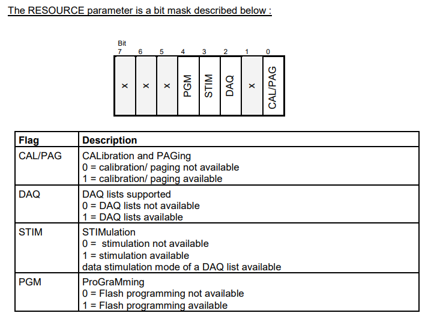
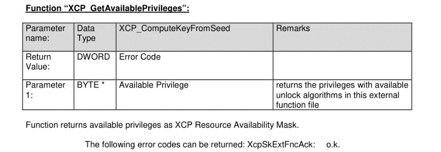
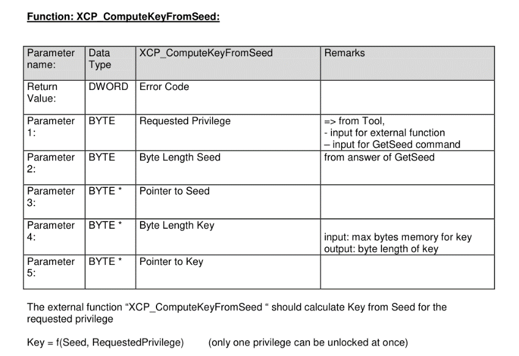
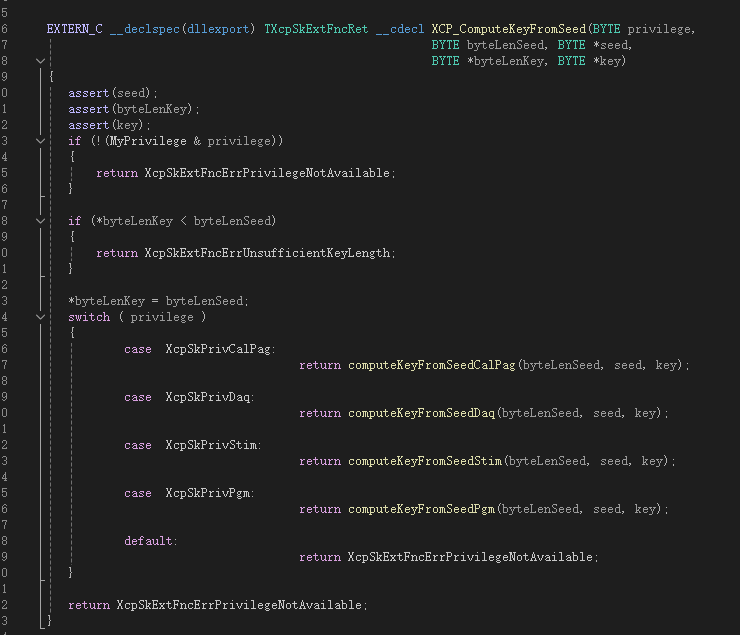
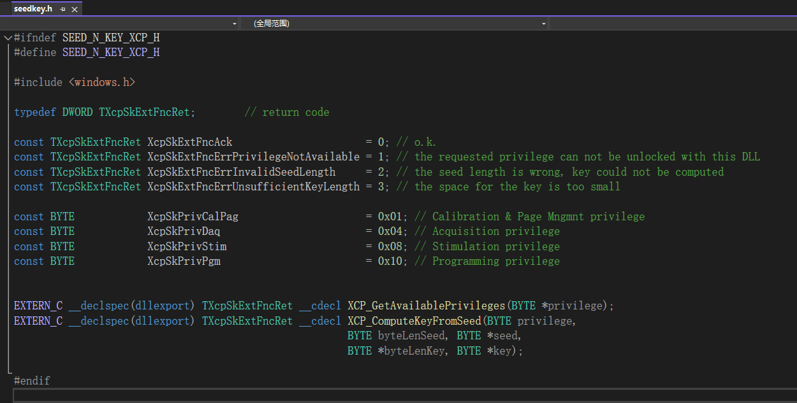
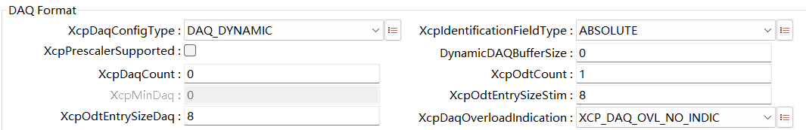

==============
XCP
==============

**缩写词注解**

+--------------+--------------------------+---------------------------+
| **缩写词**   | **英文全称**             | **中文解释**              |
+--------------+--------------------------+---------------------------+
| ASAM         | Association for          | 自                        |
|              | Standardization of       | 动化和测量系统标准化协会  |
|              | Automation and Measuring |                           |
|              | Systems                  |                           |
+--------------+--------------------------+---------------------------+
| CAL          | CALibration              | 在线标定                  |
+--------------+--------------------------+---------------------------+
| CMD          | CoMmanD                  | 命令，一                  |
|              |                          | 般指上位机发送到ECU的指令 |
+--------------+--------------------------+---------------------------+
| CTO          | Command Transfer Object  | 命令传输对象              |
+--------------+--------------------------+---------------------------+
| DTO          | Data Transfer Object     | 数据传输对象              |
+--------------+--------------------------+---------------------------+
| DAQ          | Data AcQuisition, Data   | 数据采集包（一般指ECU把观 |
|              | AcQuisition Packet       | 测量通过DAQ上传到上位机） |
+--------------+--------------------------+---------------------------+
| MTA          | Memory Transfer Address  | 内存传输地                |
|              |                          | 址（指ECU内部Memory地址） |
+--------------+--------------------------+---------------------------+
| ODT          | Object Descriptor Table  | 对象描述符表（通讯角度    |
|              |                          | 上看，就是一帧通信报文）  |
+--------------+--------------------------+---------------------------+
| PAG          | PAGing                   | 指页切换相关命名          |
+--------------+--------------------------+---------------------------+
| PGM          | ProGraMming              | 指Flash刷写相关命名       |
+--------------+--------------------------+---------------------------+
| STD          | STanDard                 | 指标准命令组              |
+--------------+--------------------------+---------------------------+
| XCP          | Universal Calibration    | 通用标定协议              |
|              | Protocol                 |                           |
+--------------+--------------------------+---------------------------+
| INCA/CANAPE  | -                        | 上位机标定工具            |
+--------------+--------------------------+---------------------------+

简介
====

XCP标定软件协议栈是针对用户使用第三方标定工具（如：INCA或CANape）对汽车电子电控单元进行参数标定，为其提供数据标定、数据上传及相关通信服务的软件模块。同时，还可以为用户提供基于XCP协议的Flash刷写功能。本软件基于AUTOSAR
R19-11规范进行设计，符合ASAM发布的XCP
1.1标准中所描述的标定功能。软件模块运行在汽车电子电控单元系统中，实现标定工具与电控单元的主-从通讯，执行标定工具发出的各项命令，完成基于CAN、ETH通信协议的数据上传和数据标定。

XCP在AUTOSAR中结构层次图如下：

|image1|

图 XCP模块在AUTOSAR架构中的位置

参考资料
--------

[1] ASAM_XCP_Part1-Overview_V1-1-0.pdf

[2] ASAM_XCP_Part2-Protocol-Layer-Specification_V1-1-0.pdf

[3] ASAM_XCP_Part3-Transport-Layer-Specification_XCPonCAN_V1-1-0.pdf

[4] ASAM_XCP_Part3-Transport-Layer-Specification_XCPonETH_V1-1-0.pdf

[5] ASAM_XCP_Part4-Interface-Specification_V1-1-0.pdf

[6] ASAM_XCP_Part5-Example-Communication-Sequences_V1-1-0.pdf

[7] AUTOSAR_SWS_XCP.pdf，R19-11

功能描述
========

DAQ功能
-------

DAQ功能介绍
~~~~~~~~~~~

DAQ功能主要是为了上传观测量，DAQ由ODT组成，ODT由ODT
Entry组成。从通讯角度ODT就是每一帧数据（如一帧CAN报文），而ODT
Entry代表一帧数据中（如CAN报文中）的字节内容。在实际应用中，一个周期内一般采集非常多的数据（超过一帧），那么就需要把多个ODT组合起来，这种组合在XCP中称为DAQ
List。DAQ-ODT-ODT Entry示意图如下：

|daq.jpg|

图 DAQ结构图

|odt.png|

图 ODT结构图

DAQ功能实现
~~~~~~~~~~~

DAQ功能的实现是基于如下命令的实现，相关命令如下

（带*表示可选）：

表 DAQ命令组

+------------------------+----------------------------------+----------+
| **命令组**             | **命令名**                       | **是     |
|                        |                                  | 否实现** |
+------------------------+----------------------------------+----------+
| DAQ/STIM基本命令组     | SET_DAQ_PTR                      | 是       |
+------------------------+----------------------------------+----------+
|                        | WRITE_DAQ                        | 是       |
+------------------------+----------------------------------+----------+
|                        | SET_DAQ_LIST_MODE                | 是       |
+------------------------+----------------------------------+----------+
|                        | START_STOP_DAQ_LIST              | 是       |
+------------------------+----------------------------------+----------+
|                        | START_STOP_SYNCH                 | 是       |
+------------------------+----------------------------------+----------+
|                        | WRITE_DAQ_MULTIPLE\*             | 否       |
+------------------------+----------------------------------+----------+
|                        | READ_DAQ\*                       | 是       |
+------------------------+----------------------------------+----------+
|                        | GET_DAQ_CLOCK\*                  | 是       |
+------------------------+----------------------------------+----------+
|                        | GET_DAQ_PROCESSOR_INFO\*         | 是       |
+------------------------+----------------------------------+----------+
|                        | GET_DAQ_RESOLUTION_INFO\*        | 是       |
+------------------------+----------------------------------+----------+
|                        | GET_DAQ_LIST_MODE\*              | 是       |
+------------------------+----------------------------------+----------+
|                        | GET_DAQ_EVENT_INFO\*             | 是       |
+------------------------+----------------------------------+----------+
| 静态DAQ配置命令组      | CLEAR_DAQ_LIST                   | 是       |
+------------------------+----------------------------------+----------+
|                        | GET_DAQ_LIST_INFO\*              | 是       |
+------------------------+----------------------------------+----------+
| 动态DAQ配置命令组      | FREE_DAQ                         | 是       |
+------------------------+----------------------------------+----------+
|                        | ALLOC_DAQ                        | 是       |
+------------------------+----------------------------------+----------+
|                        | ALLOC_ODT                        | 是       |
+------------------------+----------------------------------+----------+
|                        | ALLOC_ODT_ENTRY                  | 是       |
+------------------------+----------------------------------+----------+

Resume功能介绍
~~~~~~~~~~~~~~

标定中观测量是通过DAQ进行上传，DAQ的交互需要Master和Slave之间进行若干条命令的交互。Resume功能是在上电过程中不需要经过DAQ命令的交互，即可把配置为Resume模式的DAQ自动上传出来。

Resume功能实现
~~~~~~~~~~~~~~

Resume本质上也是上传DAQ，实现方式也是基于DAQ的命令组。唯一的区别在于START_STOP_DAQ_LIST命令发送时Mode需要设置为02（select），且紧接着需要发送SET_REQUEST（STORE_DAQ_REQ_RESUME）。

动态DAQ功能介绍
~~~~~~~~~~~~~~~

动态DAQ指不需要在配置阶段额外配置每个DAQ，只需要配置一段额外的缓存区（配置项为DynamicDAQBufferSize），在DAQ创建阶段就会从这段预留空间中去分配实际需要的DAQ大小，对于观测量较大的情况能很大程度上节省配置时间。

动态DAQ功能实现
~~~~~~~~~~~~~~~

参考2.1.2中动态DAQ配置命令组。

在线标定功能
------------

在线标定功能介绍
~~~~~~~~~~~~~~~~

标定数据本质上看是固定的参数（eg：ECU中一些重要的参数），因此他们会实际被配置到FLASH中。而这些数据在开发阶段同时需要被实时标定，那么因此标准数据也需要具备被修改的属性，即RAM属性。在线标定本质上就是修改存放在RAM中的标定数据。

在线标定功能实现
~~~~~~~~~~~~~~~~

在线标定功能的实现是基于如下命令的实现，相关命令如下

（带*表示可选）：

表 CAL命令组

+----------------+---------------------------------------+-------------+
| **命令组**     | **命令名**                            | **是否实现**|
+----------------+---------------------------------------+-------------+
| 标定命令组     | DOWNLOAD                              | 是          |
+----------------+---------------------------------------+-------------+
|                | DOWNLOAD_NEXT\*                       | 是          |
+----------------+---------------------------------------+-------------+
|                | DOWNLOAD_MAX\*                        | 是          |
+----------------+---------------------------------------+-------------+
|                | SHORT_DOWNLOAD\*                      | 是          |
+----------------+---------------------------------------+-------------+
|                | MODIFY_BITS\*                         | 是          |
+----------------+---------------------------------------+-------------+

实际标定过程中实现会通过SET_MTA命令设置需要进行标定变量的地址。然后通过DOWNLOAD、SHORT_DOWNLOAD等进行修改MTA地址上标定量的值。具体标定流程如下：

|image2|

图 在线标定示意图

页切换功能介绍
~~~~~~~~~~~~~~

参考2.2.1中标定功能介绍。

FLASH中的标定数据就称为参考页（Reference
Page），RAM中的标定数据就成为工作页（Working
Page），参考页就是可以被ECU/XCP读取但不能写入的数据，工作页就是可以被ECU读取/写入，可以被XCP读取和写入的数据，他们在逻辑上都是对应了相同的FLASH地址而被赋予了不同的读写属性。

页切换功能实现
~~~~~~~~~~~~~~

页切换功能的实现是基于如下命令的实现，相关命令如下

（带*表示可选）：

表 页切换命令组

+--------------+-----------------------------------------+-------------+
| **命令组**   | **命令名**                              | **是否实现**|
+--------------+-----------------------------------------+-------------+
| 页切换命令组 | SET_CAL_PAGE\*                          | 是          |
+--------------+-----------------------------------------+-------------+
|              | GET_CAL_PAGE\*                          | 是          |
+--------------+-----------------------------------------+-------------+
|              | GET_PAG_PROCESSOR_INFO\*                | 否          |
+--------------+-----------------------------------------+-------------+
|              | GET_SEGMENT_INFO\*                      | 否          |
+--------------+-----------------------------------------+-------------+
|              | GET_PAGE_INFO\*                         | 否          |
+--------------+-----------------------------------------+-------------+
|              | SET_SEGMENT_MODE\*                      | 否          |
+--------------+-----------------------------------------+-------------+
|              | GET_SEGMENT_MODE\*                      | 否          |
+--------------+-----------------------------------------+-------------+

块传输功能
----------

块传输功能介绍
~~~~~~~~~~~~~~

XCP协议栈是基于Master和Slave直接通过命令进行问答时，传统的通信模式是一问一答式，当数据量较大时，采用传统的通信模式就比较耗时，因此产生了块传输的通信的概念。

块传输支持Master发送1条命令，slave回复多条响应；以及Master发送多条命令，Slave仅回复一条响应，通信流程如下所示：

|image3|

图 Master块传输

|image4|

图 Slave块传输

块传输功能实现
~~~~~~~~~~~~~~

块传输包含Master block和Slave
block模式，分别通过配置Slave_Block_Mode和Master_Block_Mode配置项进行使能。

块传输命令主要包含：UPLOAD（Slave
Block；DOWNLOAD_NEXT/PROGRAM_NEXT（Master Block）

Seed&Key功能
------------

Seed&Key功能介绍
~~~~~~~~~~~~~~~~

XCP包含5大功能资源：CAL、PAG、DAQ、STIM以及PGM。如图2-6

|image5|

图 XCP的5大功能资源

Seed&Key功能主要是指对这5种资源进行保护，保证当未成功解锁的资源功能不能正常使用。

Seed&Key保证每种资源都能产生一个种子（seed），每个种子对应一个秘钥（Key），每种资源对应的功能只有传入正常的种子和秘钥才能正常使用。

Seed&Key功能实现
~~~~~~~~~~~~~~~~

该过程主要分为三部分：首先上位机获取DLL库的权限，然后向下位机发送获取当前权限下的种子（SEED）请求，进行上位机SEED值的计算比较，然后向下位机发送KEY值来获取权限。

Seed&Key的dll生成
~~~~~~~~~~~~~~~~~~

dll生成的工程包见： `Word文档 - 杨沁春 - 普华Confluence (i-soft.com.cn) <https://confluence.i-soft.com.cn/pages/viewpage.action?pageId=38498721>`_

Seed&Key的dll生成源码讲解：

#. 实现XCP标准中定义的两个函数

|image6|

|image7|

|image8|

|image9|

2. 定义dll的入口及上位机标定权限的初始化

|image10|

3. 上位机标定权限的设置及内部声明

|image11|

|image12|

4. 各权限的密钥算法实现

|image13|

Seed&Key的dll的定制化操作
~~~~~~~~~~~~~~~~~~~~~~~~~~

①根据下位机(ECU)的XCP内部密钥验证算法(Xcp_Interface.c中)去设计上位机的密钥算法

|image14|

|image15|

#. 算法定制完成后进行dll生成

编辑完成后按ctrl+shift+B进行dll生成

|image16|

2. 找到生成的dll

|image17|

|image18|

生成的dll可供CANape/INCA直接调用，用于XCP的seed&key解锁

FLASH刷写功能
-------------

FLASH刷写介绍
~~~~~~~~~~~~~

Flash刷写功能主要是用于把标定得到的数据烧写到Flash中，固化标定到内存。

FLASH刷写功能实现
~~~~~~~~~~~~~~~~~

FLASH刷写功能主要通过如下命令实现，相关命令如下

（带*表示可选）：

表 PGM命令组

+--------------+-----------------------------------------+-------------+
| **命令组**   | **命令名**                              | **是否实现**|
+--------------+-----------------------------------------+-------------+
| Fla          | PROGRAM_START                           | 是          |
| sh刷写命令组 |                                         |             |
+--------------+-----------------------------------------+-------------+
|              | PROGRAM_CLEAR                           | 是          |
+--------------+-----------------------------------------+-------------+
|              | PROGRAM                                 | 是          |
+--------------+-----------------------------------------+-------------+
|              | PROGRAM_RESET                           | 是          |
+--------------+-----------------------------------------+-------------+
|              | GET_PGM_PROCESSOR_INFO\*                | 是          |
+--------------+-----------------------------------------+-------------+
|              | GET_SECTOR_INFO\*                       | 是          |
+--------------+-----------------------------------------+-------------+
|              | PROGRAM_PREPARE\*                       | 否          |
+--------------+-----------------------------------------+-------------+
|              | PROGRAM_FORMAT\*                        | 是          |
+--------------+-----------------------------------------+-------------+
|              | PROGRAM_NEXT\*                          | 是          |
+--------------+-----------------------------------------+-------------+
|              | PROGRAM_MAX\*                           | 是          |
+--------------+-----------------------------------------+-------------+
|              | PROGRAM_VERIFY\*                        | 否          |
+--------------+-----------------------------------------+-------------+

使用Program功能时需要配置如下配置项，需要特别注意如下几项：

FlashHeader。由于Program功能是基于MCAL中Flash
Driver驱动，每个厂家提供的Flash驱动的头文件命名有差异，因此包好FlashHeader、Fls_WriteApi等等都需要填写实际的Flash驱动名称。

XcpSectorPageSize指Flash驱动的最小刷写Page大小，此项依赖于硬件。

FlsBaseAddr依赖于硬件，一般默认为0，在个别MCU平台，比如Tricore中Flash刷写时，刷写地址传入到Flash驱动时需要减去一个BaseAddress，因此此项需要填写硬件规定的BaseAddress。

|image19|

图 Flash配置界面

源文件描述
==========

表 XCP协议栈文件描述

+----------------+-----------------------------------------------------+
| **文件**       | **说明**                                            |
+----------------+-----------------------------------------------------+
| Xcp_Cfg.h      | 包含Xcp一些预定义宏开关，包含功能的使能或者禁止等   |
+----------------+-----------------------------------------------------+
| Xcp_Cfg.c      | 包含Xcp中Pc配置数据，包含DAQ/EVETNT等配置数据       |
+----------------+-----------------------------------------------------+
| Xcp_PBcfg.c    | 包含Xcp中Pb配置数据，包含收发PDU信息等              |
+----------------+-----------------------------------------------------+

+----------------+-----------------------------------------------------+
| Xcp.c          | Xcp外部接口以及一些模块通用接口                     |
+----------------+-----------------------------------------------------+
| Xcp.h          | 包含配置数据结构                                    |
+----------------+-----------------------------------------------------+
| Xcp_Cal.c      | 包含CAL命令组实现                                   |
+----------------+-----------------------------------------------------+
| Xcp_Daq.c      | 包含DAQ命令组实现                                   |
+----------------+-----------------------------------------------------+
| Xcp            | 包含XCP通用的一些宏定义以及枚举定义                 |
| _GenericTypes.h|                                                     |
+----------------+-----------------------------------------------------+
| X              | 包含XCP模块的一些用户可定制化算法接口               |
| cp_Interface.c |                                                     |
+----------------+-----------------------------------------------------+
| X              | Xcp_Interface.c定义接口的声明                       |
| cp_Interface.h |                                                     |
+----------------+-----------------------------------------------------+
| Xcp_Internal.h | 包含XCP命令实现函数的声明以及内部数据结构           |
+----------------+-----------------------------------------------------+
| Xcp_MemMap.h   | 包含MemMap机制定义的段                              |
+----------------+-----------------------------------------------------+
| Xcp_Pgm.c      | 包含PGM命令组实现                                   |
+----------------+-----------------------------------------------------+
| Xcp_Ram.c      | 包含XCP模                                           |
|                | 块用到的一些内存分配（如动态DAQ所需的预分配内存段） |
+----------------+-----------------------------------------------------+
| Xcp_Std.c      | 包含STD命令组实现                                   |
+----------------+-----------------------------------------------------+
| XcpOnCan.c     | 基于CAN总线的接收、发送API                          |
+----------------+-----------------------------------------------------+
| XcpOnCan_Cbk.h | XcpOnCan.c中API声明                                 |
+----------------+-----------------------------------------------------+
| XcpOnEth.c     | 基于以太网总线的接收、发送API                       |
+----------------+-----------------------------------------------------+
| XcpOnEth_Cbk.h | XcpOnEth.c中API声明                                 |
+----------------+-----------------------------------------------------+

|image20|

图 Xcp文件交互关系图

API接口
=======

类型定义
--------

Xcp_ConfigType类型定义
~~~~~~~~~~~~~~~~~~~~~~

+-----------+----------------------------------------------------------+
| 名称      | Xcp_ConfigType                                           |
+-----------+----------------------------------------------------------+
| 类型      | structure                                                |
+-----------+----------------------------------------------------------+
| 范围      | 无                                                       |
+-----------+----------------------------------------------------------+
| 描述      | XCP配置数据                                              |
+-----------+----------------------------------------------------------+

输入函数描述
------------

+----------------------------------+-----------------------------------+
| **输入模块**                     | **API**                           |
+----------------------------------+-----------------------------------+
| CanIf                            | CanIf_Transmit                    |
+----------------------------------+-----------------------------------+
| Det                              | Det_ReportError                   |
+----------------------------------+-----------------------------------+
| Os                               | GetCounterValue                   |
+----------------------------------+-----------------------------------+
|                                  | GetElapsedValue                   |
+----------------------------------+-----------------------------------+
| Soad                             | SoAd_IfTransmit                   |
+----------------------------------+-----------------------------------+

静态接口函数定义
----------------

Xcp_Init
~~~~~~~~

+-------------+-------------------+---------+-------------------------+
| 函数名称：  | Xcp_Init          |         |                         |
+-------------+-------------------+---------+-------------------------+
| 函数原型：  | void Xcp_Init (   |         |                         |
|             |                   |         |                         |
|             | const             |         |                         |
|             | Xcp_ConfigType\*  |         |                         |
|             | Xcp_ConfigPtr     |         |                         |
|             |                   |         |                         |
|             | )                 |         |                         |
+-------------+-------------------+---------+-------------------------+
| 服务编号：  | 0x00              |         |                         |
+-------------+-------------------+---------+-------------------------+
| 同步/异步： | 同步              |         |                         |
+-------------+-------------------+---------+-------------------------+
| 是          | 否                |         |                         |
| 否可重入：  |                   |         |                         |
+-------------+-------------------+---------+-------------------------+
| 输入参数：  | Xcp_ConfigPtr     | 值域：  | 无                      |
+-------------+-------------------+---------+-------------------------+
| 输入        | 无                |         |                         |
| 输出参数：  |                   |         |                         |
+-------------+-------------------+---------+-------------------------+
| 输出参数：  | 无                |         |                         |
+-------------+-------------------+---------+-------------------------+
| 返回值：    | 无                |         |                         |
+-------------+-------------------+---------+-------------------------+
| 功能概述：  | 初始化XCP模块     |         |                         |
+-------------+-------------------+---------+-------------------------+

Xcp_GetVersionInfo
~~~~~~~~~~~~~~~~~~

+-------------+-------------------+---------+-------------------------+
| 函数名称：  | X                 |         |                         |
|             | cp_GetVersionInfo |         |                         |
+-------------+-------------------+---------+-------------------------+
| 函数原型：  | void              |         |                         |
|             | X                 |         |                         |
|             | cp_GetVersionInfo |         |                         |
|             | (                 |         |                         |
|             |                   |         |                         |
|             | Std               |         |                         |
|             | _VersionInfoType\*|         |                         |
|             | versioninfo       |         |                         |
|             |                   |         |                         |
|             | )                 |         |                         |
+-------------+-------------------+---------+-------------------------+
| 服务编号：  | 0x01              |         |                         |
+-------------+-------------------+---------+-------------------------+
| 同步/异步： | 同步              |         |                         |
+-------------+-------------------+---------+-------------------------+
| 是          | 是                |         |                         |
| 否可重入：  |                   |         |                         |
+-------------+-------------------+---------+-------------------------+
| 输入参数：  | 无                |         |                         |
+-------------+-------------------+---------+-------------------------+
| 输入        | 无                |         |                         |
| 输出参数：  |                   |         |                         |
+-------------+-------------------+---------+-------------------------+
| 输出参数：  | versioninfo       | 值域：  | 无                      |
+-------------+-------------------+---------+-------------------------+
| 返回值：    | 无                |         |                         |
+-------------+-------------------+---------+-------------------------+
| 功能概述：  | 获取              |         |                         |
|             | XCP模块的版本信息 |         |                         |
+-------------+-------------------+---------+-------------------------+

Xcp_SetTransmissionMode
~~~~~~~~~~~~~~~~~~~~~~~

+-------------+-------------------+---------+-------------------------+
| 函数名称：  | Xcp_Se            |         |                         |
|             | tTransmissionMode |         |                         |
+-------------+-------------------+---------+-------------------------+
| 函数原型：  | void              |         |                         |
|             | Xcp_Se            |         |                         |
|             | tTransmissionMode |         |                         |
|             | (                 |         |                         |
|             |                   |         |                         |
|             | NetworkHandleType |         |                         |
|             | Channel,          |         |                         |
|             |                   |         |                         |
|             | Xcp_Tra           |         |                         |
|             | nsmissionModeType |         |                         |
|             | Mode              |         |                         |
|             |                   |         |                         |
|             | )                 |         |                         |
+-------------+-------------------+---------+-------------------------+
| 服务编号：  | 0x05              |         |                         |
+-------------+-------------------+---------+-------------------------+
| 同步/异步： | 同步              |         |                         |
+-------------+-------------------+---------+-------------------------+
| 是          | 否                |         |                         |
| 否可重入：  |                   |         |                         |
+-------------+-------------------+---------+-------------------------+
| 输入参数：  | Channel           | 值域：  | 无                      |
+-------------+-------------------+---------+-------------------------+
|             | Mode              | 值域：  | ON/OFF                  |
+-------------+-------------------+---------+-------------------------+
| 输入        | 无                |         |                         |
| 输出参数：  |                   |         |                         |
+-------------+-------------------+---------+-------------------------+
| 输出参数：  | 无                |         |                         |
+-------------+-------------------+---------+-------------------------+
| 返回值：    | 无                |         |                         |
+-------------+-------------------+---------+-------------------------+
| 功能概述：  | 控制XCP所用通     |         |                         |
|             | 信通道的发送能力  |         |                         |
+-------------+-------------------+---------+-------------------------+

Xcp\_<Lo>RxIndication
~~~~~~~~~~~~~~~~~~~~~

+-------------+-------------------+---------+-------------------------+
| 函数名称：  | Xcp\              |         |                         |
|             | _<Lo>RxIndication |         |                         |
+-------------+-------------------+---------+-------------------------+
| 函数原型：  | void              |         |                         |
|             | Xcp\              |         |                         |
|             | _<Lo>RxIndication |         |                         |
|             | (                 |         |                         |
|             |                   |         |                         |
|             | PduIdType         |         |                         |
|             | RxPduId,          |         |                         |
|             |                   |         |                         |
|             | const             |         |                         |
|             | PduInfoType\*     |         |                         |
|             | PduInfoPtr        |         |                         |
|             |                   |         |                         |
|             | )                 |         |                         |
+-------------+-------------------+---------+-------------------------+
| 服务编号：  | 0x42              |         |                         |
+-------------+-------------------+---------+-------------------------+
| 同步/异步： | 同步              |         |                         |
+-------------+-------------------+---------+-------------------------+
| 是          | Reentrant for     |         |                         |
| 否可重入：  | different PduIds. |         |                         |
|             | Non reentrant for |         |                         |
|             | the same PduId    |         |                         |
+-------------+-------------------+---------+-------------------------+
| 输入参数：  | RxPduId           | 值域：  | 无                      |
+-------------+-------------------+---------+-------------------------+
|             | PduInfoPtr        | 值域：  | 无                      |
+-------------+-------------------+---------+-------------------------+
| 输入        | 无                |         |                         |
| 输出参数：  |                   |         |                         |
+-------------+-------------------+---------+-------------------------+
| 输出参数：  | 无                |         |                         |
+-------------+-------------------+---------+-------------------------+
| 返回值：    | 无                |         |                         |
+-------------+-------------------+---------+-------------------------+
| 功能概述：  | 底层收到PD        |         |                         |
|             | U信息后的回调函数 |         |                         |
+-------------+-------------------+---------+-------------------------+

Xcp\_<Lo>TxConfirmation
~~~~~~~~~~~~~~~~~~~~~~~

+-------------+-------------------+---------+-------------------------+
| 函数名称：  | Xcp\_<            |         |                         |
|             | Lo>TxConfirmation |         |                         |
+-------------+-------------------+---------+-------------------------+
| 函数原型：  | void              |         |                         |
|             | Xcp\_<            |         |                         |
|             | Lo>TxConfirmation |         |                         |
|             | (                 |         |                         |
|             |                   |         |                         |
|             | PduIdType TxPduId |         |                         |
|             |                   |         |                         |
|             | )                 |         |                         |
+-------------+-------------------+---------+-------------------------+
| 服务编号：  | 0x40              |         |                         |
+-------------+-------------------+---------+-------------------------+
| 同步/异步： | 同步              |         |                         |
+-------------+-------------------+---------+-------------------------+
| 是          | Reentrant for     |         |                         |
| 否可重入：  | different PduIds. |         |                         |
|             | Non reentrant for |         |                         |
|             | the same PduId    |         |                         |
+-------------+-------------------+---------+-------------------------+
| 输入参数：  | TxPduId           | 值域：  | 无                      |
+-------------+-------------------+---------+-------------------------+
| 输入        | 无                |         |                         |
| 输出参数：  |                   |         |                         |
+-------------+-------------------+---------+-------------------------+
| 输出参数：  | 无                |         |                         |
+-------------+-------------------+---------+-------------------------+
| 返回值：    | 无                |         |                         |
+-------------+-------------------+---------+-------------------------+
| 功能概述：  | 底层成            |         |                         |
|             | 功发送完XCP数据后 |         |                         |
|             | ，通知XCP发送完成 |         |                         |
+-------------+-------------------+---------+-------------------------+

Xcp_MainFunction
~~~~~~~~~~~~~~~~

+-------------+--------------------------------------------------------+
| 函数名称：  | Xcp_MainFunction                                       |
+-------------+--------------------------------------------------------+
| 函数原型：  | void Xcp_MainFunction (                                |
|             |                                                        |
|             | void                                                   |
|             |                                                        |
|             | )                                                      |
+-------------+--------------------------------------------------------+
| 服务编号：  | 0x04                                                   |
+-------------+--------------------------------------------------------+
| 同步/异步： | 同步                                                   |
+-------------+--------------------------------------------------------+
| 是          | 否                                                     |
| 否可重入：  |                                                        |
+-------------+--------------------------------------------------------+
| 输入参数：  | 无                                                     |
+-------------+--------------------------------------------------------+
| 输入        | 无                                                     |
| 输出参数：  |                                                        |
+-------------+--------------------------------------------------------+
| 输出参数：  | 无                                                     |
+-------------+--------------------------------------------------------+
| 返回值：    | 无                                                     |
+-------------+--------------------------------------------------------+
| 功能概述：  | XCP模                                                  |
|             | 块的周期任务调度函数，由OS调度，里面会处理接收到的命令 |
+-------------+--------------------------------------------------------+

可配置函数定义
--------------

无。

配置
====

XcpGeneral
----------

Bus Interface Select
~~~~~~~~~~~~~~~~~~~~

|image21|

图 Bus Interface Select配置图

表 Bus Interface Select属性描述

+------------+---------+---------------------+-----------+------------+
| **UI名称** | **描述**|                     |           |            |
+------------+---------+---------------------+-----------+------------+
| XcpOn      | 取      | 无                  | 默认取值  | 无         |
| CddEnabled | 值范围  |                     |           |            |
+------------+---------+---------------------+-----------+------------+
|            | 参      | 暂不支持            |           |            |
|            | 数描述  |                     |           |            |
+------------+---------+---------------------+-----------+------------+
|            | 依      | 无                  |           |            |
|            | 赖关系  |                     |           |            |
+------------+---------+---------------------+-----------+------------+
| XcpOnFlex  | 取      | 无                  | 默认取值  | 无         |
| RayEnabled | 值范围  |                     |           |            |
+------------+---------+---------------------+-----------+------------+
|            | 参      | 暂不支持            |           |            |
|            | 数描述  |                     |           |            |
+------------+---------+---------------------+-----------+------------+
|            | 依      | 无                  |           |            |
|            | 赖关系  |                     |           |            |
+------------+---------+---------------------+-----------+------------+
| XcpS       | 取      | XcpOnCanEnabled     | 默认取值  | XcpOn      |
| upportType | 值范围  |                     |           | CanEnabled |
+------------+---------+---------------------+-----------+------------+
|            |         | X                   |           |            |
|            |         | cpOnEthernetEnabled |           |            |
+------------+---------+---------------------+-----------+------------+
|            | 参      | 目前XCP仅支持       |           |            |
|            | 数描述  | CAN和ETH，此配置选  |           |            |
|            |         | 择XCP应用于那种总线 |           |            |
+------------+---------+---------------------+-----------+------------+
|            | 依      | 无                  |           |            |
|            | 赖关系  |                     |           |            |
+------------+---------+---------------------+-----------+------------+

Optional API
~~~~~~~~~~~~

|image22|

图 Optional API配置图

+-------------+-----------+-----------------------+-----------+-------+
| **UI名称**  | **描述**  |                       |           |       |
+-------------+-----------+-----------------------+-----------+-------+
| XcpDev      | 取值范围  | TRUE/FALSE            | 默认取值  | FALSE |
| ErrorDetect |           |                       |           |       |
+-------------+-----------+-----------------------+-----------+-------+
|             | 参数描述  | 使能支持Det检查       |           |       |
+-------------+-----------+-----------------------+-----------+-------+
|             | 依赖关系  | 无                    |           |       |
+-------------+-----------+-----------------------+-----------+-------+
| XcpVer      | 取值范围  | TRUE/FALSE            | 默认取值  | FALSE |
| sionInfoApi |           |                       |           |       |
+-------------+-----------+-----------------------+-----------+-------+
|             | 参数描述  | 使能接口函            |           |       |
|             |           | 数Xcp_GetVersionInfo  |           |       |
+-------------+-----------+-----------------------+-----------+-------+
|             | 依赖关系  | 无                    |           |       |
+-------------+-----------+-----------------------+-----------+-------+
| XcpSuppre   | 取值范围  | TRUE/FALSE            | 默认取值  | FALSE |
| ssTxSupport |           |                       |           |       |
+-------------+-----------+-----------------------+-----------+-------+
|             | 参数描述  | 使能接口函数Xcp       |           |       |
|             |           | _SetTransmissionMode，|           |       |
|             |           |                       |           |       |
|             |           | 注：                  |           |       |
|             |           |                       |           |       |
|             |           | 暂不支持此功能        |           |       |
+-------------+-----------+-----------------------+-----------+-------+
|             | 依赖关系  | 无                    |           |       |
+-------------+-----------+-----------------------+-----------+-------+

表 Optional API属性描述

DAQ Format
~~~~~~~~~~

|image23|

图 DAQ Format配置图

表 DAQ Format属性描述

+-------------+-----------+-----------------+-----------+-------------+
| **UI名称**  | **描述**  |                 |           |             |
+-------------+-----------+-----------------+-----------+-------------+
| XcpDa       | 取值范围  | DAQ_STATIC      | 默认取值  | DAQ_DYNAMIC |
| qConfigType |           |                 |           |             |
|             |           | DAQ_DYNAMIC     |           |             |
+-------------+-----------+-----------------+-----------+-------------+
|             | 参数描述  | DAQ采           |           |             |
|             |           | 用的配置方式（  |           |             |
|             |           | 静态或者动态）  |           |             |
+-------------+-----------+-----------------+-----------+-------------+
|             | 依赖关系  | 无              |           |             |
+-------------+-----------+-----------------+-----------+-------------+
| XcpI        | 取值范围  | ABSOLUTE        | 默认取值  | ABSOLUTE    |
| dentificati |           |                 |           |             |
| onFieldType |           | RELATIVE_BYTE   |           |             |
|             |           |                 |           |             |
|             |           | RELATIVE_WORD   |           |             |
|             |           |                 |           |             |
|             |           | RELATI          |           |             |
|             |           | VE_WORD_ALIGNED |           |             |
+-------------+-----------+-----------------+-----------+-------------+
|             | 参数描述  | DAQ报文PID格式  |           |             |
+-------------+-----------+-----------------+-----------+-------------+
|             | 依赖关系  | 无              |           |             |
+-------------+-----------+-----------------+-----------+-------------+
| XcpPrescal  | 取值范围  | TRUE/FALSE      | 默认取值  | FALSE       |
| erSupported |           |                 |           |             |
+-------------+-----------+-----------------+-----------+-------------+
|             | 参数描述  | 是否支持Event   |           |             |
|             |           | Channel触发分频 |           |             |
+-------------+-----------+-----------------+-----------+-------------+
|             | 依赖关系  | 无              |           |             |
+-------------+-----------+-----------------+-----------+-------------+
| DynamicDA   | 取值范围  | 0-INF           | 默认取值  | 0           |
| QBufferSize |           |                 |           |             |
+-------------+-----------+-----------------+-----------+-------------+
|             | 参数描述  | 动态            |           |             |
|             |           | DAQ列表缓存长度 |           |             |
+-------------+-----------+-----------------+-----------+-------------+
|             | 依赖关系  | Xcp             |           |             |
|             |           | DaqConfigType配 |           |             |
|             |           | 置为DAQ_DYNAMIC |           |             |
+-------------+-----------+-----------------+-----------+-------------+
| XcpDaqCount | 取值范围  | 0-65535         | 默认取值  | 0           |
+-------------+-----------+-----------------+-----------+-------------+
|             | 参数描述  | 动态            |           |             |
|             |           | 分配的DAQ的个数 |           |             |
+-------------+-----------+-----------------+-----------+-------------+
|             | 依赖关系  | Xcp             |           |             |
|             |           | DaqConfigType配 |           |             |
|             |           | 置为DAQ_DYNAMIC |           |             |
+-------------+-----------+-----------------+-----------+-------------+
| XcpOdtCount | 取值范围  | 0-252           | 默认取值  | 1           |
+-------------+-----------+-----------------+-----------+-------------+
|             | 参数描述  | 动态分配的      |           |             |
|             |           | DAQ中的ODT个数  |           |             |
+-------------+-----------+-----------------+-----------+-------------+
|             | 依赖关系  | Xcp             |           |             |
|             |           | DaqConfigType配 |           |             |
|             |           | 置为DAQ_DYNAMIC |           |             |
+-------------+-----------+-----------------+-----------+-------------+
| XcpMinDaq   | 取值范围  | 0-255           | 默认取值  | 0           |
+-------------+-----------+-----------------+-----------+-------------+
|             | 参数描述  | 预定义          |           |             |
|             |           | 的DAQ个数，目前 |           |             |
|             |           | 强制只能配置为0 |           |             |
+-------------+-----------+-----------------+-----------+-------------+
|             | 依赖关系  | 无              |           |             |
+-------------+-----------+-----------------+-----------+-------------+
| XcpOdtEn    | 取值范围  | 0-255           | 默认取值  | 8           |
| trySizeStim |           |                 |           |             |
+-------------+-----------+-----------------+-----------+-------------+
|             | 参数描述  | STIM            |           |             |
|             |           | Entry最大长度   |           |             |
+-------------+-----------+-----------------+-----------+-------------+
|             | 依赖关系  | 无              |           |             |
+-------------+-----------+-----------------+-----------+-------------+
| XcpOdtE     | 取值范围  | 0-255           | 默认取值  | 8           |
| ntrySizeDaq |           |                 |           |             |
+-------------+-----------+-----------------+-----------+-------------+
|             | 参数描述  | DAQ             |           |             |
|             |           | Entry最大长度   |           |             |
+-------------+-----------+-----------------+-----------+-------------+
|             | 依赖关系  | 无              |           |             |
+-------------+-----------+-----------------+-----------+-------------+
| Xc          | 取值范围  | N               | 默认取值  | XCP_DAQ_O   |
| pDaqOverloa |           | O_INDIC：无通知 |           | VL_NO_INDIC |
| dIndication |           |                 |           |             |
|             |           | EVENT：         |           |             |
|             |           | 使用Event帧通知 |           |             |
|             |           |                 |           |             |
|             |           | P               |           |             |
|             |           | ID：使用PID通知 |           |             |
+-------------+-----------+-----------------+-----------+-------------+
|             | 参数描述  | DAQ溢出（ove    |           |             |
|             |           | rload）通知方式 |           |             |
+-------------+-----------+-----------------+-----------+-------------+
|             | 依赖关系  | 无              |           |             |
+-------------+-----------+-----------------+-----------+-------------+

General Settings
~~~~~~~~~~~~~~~~

|image36|

图 General Settings配置图

表 General Settings属性描述

+------------+----------+---------------------+----------+------------+
| **UI名称** | **描述** |                     |          |            |
+------------+----------+---------------------+----------+------------+
| Tool       | 取值范围 | CANape              | 默认取值 | CanApe     |
|            |          |                     |          |            |
|            |          | INCA                |          |            |
+------------+----------+---------------------+----------+------------+
|            | 参数描述 | A2L文件兼容格式     |          |            |
+------------+----------+---------------------+----------+------------+
|            | 依赖关系 | 无                  |          |            |
+------------+----------+---------------------+----------+------------+
| Byte_Order | 取值范围 | MSB_FIRST           | 默认取值 | MSB_FIRST  |
|            |          |                     |          |            |
|            |          | MSB_LAST            |          |            |
+------------+----------+---------------------+----------+------------+
|            | 参数描述 | 字节序类型          |          |            |
+------------+----------+---------------------+----------+------------+
|            | 依赖关系 | 依赖于硬件平台      |          |            |
+------------+----------+---------------------+----------+------------+
| X          | 取值范围 | 0-INF               | 默认取值 | 0.0        |
| cpMainFunc |          |                     |          |            |
| tionPeriod |          |                     |          |            |
+------------+----------+---------------------+----------+------------+
|            | 参数描述 | 主函数              |          |            |
|            |          | 调用周期，单位：秒  |          |            |
+------------+----------+---------------------+----------+------------+
|            | 依赖关系 | 无                  |          |            |
+------------+----------+---------------------+----------+------------+
| XcpTrans   | 取值范围 | 0-INF               | 默认取值 | 无         |
| ferTimeOut |          |                     |          |            |
+------------+----------+---------------------+----------+------------+
|            | 参数描述 | 主函数中等待        |          |            |
|            |          | 发送确认的最大次数  |          |            |
+------------+----------+---------------------+----------+------------+
|            | 依赖关系 | 无                  |          |            |
+------------+----------+---------------------+----------+------------+
| XcpMaxCto  | 取值范围 | 8-255               | 默认取值 | 8          |
+------------+----------+---------------------+----------+------------+
|            | 参数描述 | Cto最大字节数       |          |            |
+------------+----------+---------------------+----------+------------+
|            | 依赖关系 | 当X                 |          |            |
|            |          | cpSupportType配置为 |          |            |
|            |          | XcpOnCanEnabled时： |          |            |
|            |          |                     |          |            |
|            |          | 1.普通CA            |          |            |
|            |          | N：8；2.CANFD：8~64 |          |            |
|            |          |                     |          |            |
|            |          | 当XcpSup            |          |            |
|            |          | portType配置为XcpOn |          |            |
|            |          | EthernetEnabled时： |          |            |
|            |          |                     |          |            |
|            |          | 取值范围：8~255     |          |            |
+------------+----------+---------------------+----------+------------+
| XcpMaxDto  | 取值范围 | 8-65535             | 默认取值 | 8          |
+------------+----------+---------------------+----------+------------+
|            | 参数描述 | Dto最大字节数       |          |            |
+------------+----------+---------------------+----------+------------+
|            | 依赖关系 | 当X                 |          |            |
|            |          | cpSupportType配置为 |          |            |
|            |          | XcpOnCanEnabled时： |          |            |
|            |          |                     |          |            |
|            |          | 1.普通CA            |          |            |
|            |          | N：8；2.CANFD：8~64 |          |            |
|            |          |                     |          |            |
|            |          | 当XcpSup            |          |            |
|            |          | portType配置为XcpOn |          |            |
|            |          | EthernetEnabled时： |          |            |
|            |          |                     |          |            |
|            |          | 取值范围：8~1500    |          |            |
+------------+----------+---------------------+----------+------------+
| XcpMaxEv   | 取值范围 | 0-65535             | 默认取值 | 1          |
| entChannel |          |                     |          |            |
+------------+----------+---------------------+----------+------------+
|            | 参数描述 | 可配置的Event       |          |            |
|            |          | Channel最大数量     |          |            |
+------------+----------+---------------------+----------+------------+
|            | 依赖关系 | 无                  |          |            |
+------------+----------+---------------------+----------+------------+
| XcpTime    | 取值范围 | 0-65535             | 默认取值 | 0          |
| stampTicks |          |                     |          |            |
+------------+----------+---------------------+----------+------------+
|            | 参数描述 | Ti                  |          |            |
|            |          | mestamp单位时间长度 |          |            |
+------------+----------+---------------------+----------+------------+
|            | 依赖关系 | XcpTimestampType != |          |            |
|            |          | NO_TIMESTAMP        |          |            |
+------------+----------+---------------------+----------+------------+
| XcpTim     | 取值范围 | NO_TIME_STAMP       | 默认取值 | NO         |
| estampType |          |                     |          | _TIME_STAMP|
|            |          | ONE_BYTE            |          |            |
|            |          |                     |          |            |
|            |          | TWO_BYTE            |          |            |
|            |          |                     |          |            |
|            |          | FOUR_BYTE           |          |            |
+------------+----------+---------------------+----------+------------+
|            | 参数描述 | D                   |          |            |
|            |          | AQ报文Timestamp格式 |          |            |
+------------+----------+---------------------+----------+------------+
|            | 依赖关系 | 无                  |          |            |
+------------+----------+---------------------+----------+------------+
| XcpTim     | 取值范围 | 1 us – 100ms        | 默认取值 | TIMESTAMP  |
| estampUnit |          |                     |          | _UNIT_100MS|
+------------+----------+---------------------+----------+------------+
|            | 参数描述 | Timest              |          |            |
|            |          | amp单位时间长度单位 |          |            |
+------------+----------+---------------------+----------+------------+
|            | 依赖关系 | XcpTimestampType != |          |            |
|            |          | NO_TIMESTAMP        |          |            |
+------------+----------+---------------------+----------+------------+
| Xcp        | 取值范围 | TRUE/FALSE          | 默认取值 | FALSE      |
| ResumeMode |          |                     |          |            |
+------------+----------+---------------------+----------+------------+
|            | 参数描述 | 使能支持Resume Mode |          |            |
+------------+----------+---------------------+----------+------------+
|            | 依赖关系 | SET_REQUEST打       |          |            |
|            |          | 开的情况下才能选择  |          |            |
+------------+----------+---------------------+----------+------------+
| XcpNvRam   | 取值范围 | 无                  | 默认取值 | NULL       |
| BlockIdRef |          |                     |          |            |
+------------+----------+---------------------+----------+------------+
|            | 参数描述 | 指                  |          |            |
|            |          | 向一块NVM存储块，用 |          |            |
|            |          | 于保存RESUME的信息  |          |            |
+------------+----------+---------------------+----------+------------+
|            | 依赖关系 | Resume              |          |            |
|            |          | Mode打开的情况下    |          |            |
+------------+----------+---------------------+----------+------------+

XcpCommand
----------

General Command
~~~~~~~~~~~~~~~

|image24|

图 General Command配置图

表 General Command属性描述

+------------+----------+---------------------+----------+------------+
| **UI名称** | **描述** |                     |          |            |
+------------+----------+---------------------+----------+------------+
| Max_Dl     | 取值范围 | TRUE/FALSE          | 默认取值 | FALSE      |
| c_Required |          |                     |          |            |
+------------+----------+---------------------+----------+------------+
|            | 参数描述 | 是否要求DLC恒定     |          |            |
|            |          |                     |          |            |
|            |          | （Std               |          |            |
|            |          | CAN：8；CANFD：64） |          |            |
+------------+----------+---------------------+----------+------------+
|            | 依赖关系 | XcpSupportType配    |          |            |
|            |          | 置为XcpOnCanEnabled |          |            |
+------------+----------+---------------------+----------+------------+
| Slave      | 取值范围 | TRUE/FALSE          | 默认取值 | TRUE       |
| _Block_Mode|          |                     |          |            |
+------------+----------+---------------------+----------+------------+
|            | 参数描述 | 使能Slave Block模式 |          |            |
+------------+----------+---------------------+----------+------------+
|            | 依赖关系 | 无                  |          |            |
+------------+----------+---------------------+----------+------------+
| Master     | 取值范围 | TRUE/FALSE          | 默认取值 | TRUE       |
| _Block_Mode|          |                     |          |            |
+------------+----------+---------------------+----------+------------+
|            | 参数描述 | 使能Master          |          |            |
|            |          | Block模式           |          |            |
+------------+----------+---------------------+----------+------------+
|            | 依赖关系 | Interlea            |          |            |
|            |          | ved_Mode配置为FALSE |          |            |
+------------+----------+---------------------+----------+------------+
| Interl     | 取值范围 | TRUE/FALSE          | 默认取值 | FALSE      |
| eaved_Mode |          |                     |          |            |
+------------+----------+---------------------+----------+------------+
|            | 参数描述 | 使能                |          |            |
|            |          | Interleaved通信模式 |          |            |
+------------+----------+---------------------+----------+------------+
|            | 依赖关系 | Master_Bl           |          |            |
|            |          | ock_Mode配置为FALSE |          |            |
+------------+----------+---------------------+----------+------------+
| Queue_Size | 取值范围 | 1-255               | 默认取值 | 1          |
+------------+----------+---------------------+----------+------------+
|            | 参数描述 | Inte                |          |            |
|            |          | rleaved通信模式下最 |          |            |
|            |          | 大能缓存的命令个数  |          |            |
+------------+----------+---------------------+----------+------------+
|            | 依赖关系 | I                   |          |            |
|            |          | nterleaved_Mode使能 |          |            |
+------------+----------+---------------------+----------+------------+
| Queu       | 取值范围 | 1-255               | 默认取值 | 1          |
| e_Size_PGM |          |                     |          |            |
+------------+----------+---------------------+----------+------------+
|            | 参数描述 | Inte                |          |            |
|            |          | rleaved通信模式下最 |          |            |
|            |          | 大能缓存的PGM帧个数 |          |            |
+------------+----------+---------------------+----------+------------+
|            | 依赖关系 | I                   |          |            |
|            |          | nterleaved_Mode使能 |          |            |
+------------+----------+---------------------+----------+------------+

STD Command
~~~~~~~~~~~

|image25|

图 STD Command配置图

表 STD Command属性描述

+------------+----------+---------------------+----------+------------+
| **UI名称** | **描述** |                     |          |            |
+------------+----------+---------------------+----------+------------+
| GET_COMM   | 取值范围 | TRUE/FALSE          | 默认取值 | FALSE      |
| _MODE_INFO |          |                     |          |            |
+------------+----------+---------------------+----------+------------+
|            | 参数描述 | 使能支持GET         |          |            |
|            |          | _COMM_MODE_INFO命令 |          |            |
+------------+----------+---------------------+----------+------------+
|            | 依赖关系 | 无                  |          |            |
+------------+----------+---------------------+----------+------------+
| GET_ID     | 取值范围 | TRUE/FALSE          | 默认取值 | FALSE      |
+------------+----------+---------------------+----------+------------+
|            | 参数描述 | 使能支持GET_ID命令  |          |            |
+------------+----------+---------------------+----------+------------+
|            | 依赖关系 | 无                  |          |            |
+------------+----------+---------------------+----------+------------+
| S          | 取值范围 | TRUE/FALSE          | 默认取值 | FALSE      |
| ET_REQUEST |          |                     |          |            |
+------------+----------+---------------------+----------+------------+
|            | 参数描述 | 使能                |          |            |
|            |          | 支持SET_REQUEST命令 |          |            |
+------------+----------+---------------------+----------+------------+
|            | 依赖关系 | 无                  |          |            |
+------------+----------+---------------------+----------+------------+
| SET_MTA    | 取值范围 | TRUE/FALSE          | 默认取值 | TRUE       |
+------------+----------+---------------------+----------+------------+
|            | 参数描述 | 使能支持SET_MTA命令 |          |            |
+------------+----------+---------------------+----------+------------+
|            | 依赖关系 | 无                  |          |            |
+------------+----------+---------------------+----------+------------+
| UPLOAD     | 取值范围 | TRUE/FALSE          | 默认取值 | TRUE       |
+------------+----------+---------------------+----------+------------+
|            | 参数描述 | 使能支持UPLOAD命令  |          |            |
+------------+----------+---------------------+----------+------------+
|            | 依赖关系 | 无                  |          |            |
+------------+----------+---------------------+----------+------------+
| SH         | 取值范围 | TRUE/FALSE          | 默认取值 | TRUE       |
| ORT_UPLOAD |          |                     |          |            |
+------------+----------+---------------------+----------+------------+
|            | 参数描述 | 使能支              |          |            |
|            |          | 持SHORT_UPLOAD命令  |          |            |
+------------+----------+---------------------+----------+------------+
|            | 依赖关系 | 无                  |          |            |
+------------+----------+---------------------+----------+------------+
| BUIL       | 取值范围 | TRUE/FALSE          | 默认取值 | FALSE      |
| D_CHECKSUM |          |                     |          |            |
+------------+----------+---------------------+----------+------------+
|            | 参数描述 | 使能支持            |          |            |
|            |          | BUILD_CHECKSUM命令  |          |            |
+------------+----------+---------------------+----------+------------+
|            | 依赖关系 | 无                  |          |            |
+------------+----------+---------------------+----------+------------+
| TRANSPORT  | 取值范围 | TRUE/FALSE          | 默认取值 | FALSE      |
| _LAYER_CMD |          |                     |          |            |
+------------+----------+---------------------+----------+------------+
|            | 参数描述 | 使能支持TRAN        |          |            |
|            |          | SPORT_LAYER_CMD命令 |          |            |
+------------+----------+---------------------+----------+------------+
|            | 依赖关系 | 无                  |          |            |
+------------+----------+---------------------+----------+------------+
| GE         | 取值范围 | TRUE/FALSE          | 默认取值 | FALSE      |
| T_SLAVE_ID |          |                     |          |            |
+------------+----------+---------------------+----------+------------+
|            | 参数描述 | 使能支              |          |            |
|            |          | 持GET_SLAVE_ID命令  |          |            |
+------------+----------+---------------------+----------+------------+
|            | 依赖关系 | TRAN                |          |            |
|            |          | SPORT_LAYER_CMD使能 |          |            |
+------------+----------+---------------------+----------+------------+
| S          | 取值范围 | TRUE/FALSE          | 默认取值 | TRUE       |
| eed_Unlock |          |                     |          |            |
+------------+----------+---------------------+----------+------------+
|            | 参数描述 | Unlock命令组        |          |            |
+------------+----------+---------------------+----------+------------+
|            | 依赖关系 | 无                  |          |            |
+------------+----------+---------------------+----------+------------+

CAL Command
~~~~~~~~~~~

|image26|

图 CAL Command配置图

表 CAL Command属性描述

+------------+----------+---------------------+----------+------------+
| **UI名称** | **描述** |                     |          |            |
+------------+----------+---------------------+----------+------------+
| CAL_ENABLE | 取值范围 | TRUE/FALSE          | 默认取值 | FALSE      |
+------------+----------+---------------------+----------+------------+
|            | 参数描述 | 使能支持CAL命令组   |          |            |
+------------+----------+---------------------+----------+------------+
|            | 依赖关系 | 无                  |          |            |
+------------+----------+---------------------+----------+------------+
| DOW        | 取值范围 | TRUE/FALSE          | 默认取值 | FALSE      |
| NLOAD_NEXT |          |                     |          |            |
+------------+----------+---------------------+----------+------------+
|            | 参数描述 | 使能支              |          |            |
|            |          | 持DOWNLOAD_NEXT命令 |          |            |
+------------+----------+---------------------+----------+------------+
|            | 依赖关系 | CAL                 |          |            |
|            |          | _ENABLE打开的情况下 |          |            |
+------------+----------+---------------------+----------+------------+
| DO         | 取值范围 | TRUE/FALSE          | 默认取值 | FALSE      |
| WNLOAD_MAX |          |                     |          |            |
+------------+----------+---------------------+----------+------------+
|            | 参数描述 | 使能支              |          |            |
|            |          | 持DOWNLOAD_MAX命令  |          |            |
+------------+----------+---------------------+----------+------------+
|            | 依赖关系 | CAL                 |          |            |
|            |          | _ENABLE打开的情况下 |          |            |
+------------+----------+---------------------+----------+------------+
| SHOR       | 取值范围 | TRUE/FALSE          | 默认取值 | FALSE      |
| T_DOWNLOAD |          |                     |          |            |
+------------+----------+---------------------+----------+------------+
|            | 参数描述 | 使能支持            |          |            |
|            |          | SHORT_DOWNLOAD命令  |          |            |
+------------+----------+---------------------+----------+------------+
|            | 依赖关系 | CAL                 |          |            |
|            |          | _ENABLE打开的情况下 |          |            |
+------------+----------+---------------------+----------+------------+
| M          | 取值范围 | TRUE/FALSE          | 默认取值 | FALSE      |
| ODIFY_BITS |          |                     |          |            |
+------------+----------+---------------------+----------+------------+
|            | 参数描述 | 使能                |          |            |
|            |          | 支持MODIFY_BITS命令 |          |            |
+------------+----------+---------------------+----------+------------+
|            | 依赖关系 | CAL                 |          |            |
|            |          | _ENABLE打开的情况下 |          |            |
+------------+----------+---------------------+----------+------------+
| Page       | 取值范围 | TRUE/FALSE          | 默认取值 | FALSE      |
| _Switching |          |                     |          |            |
+------------+----------+---------------------+----------+------------+
|            | 参数描述 | 使能支持SET_CAL_PAG |          |            |
|            |          | E、GET_CAL_PAGE功能 |          |            |
+------------+----------+---------------------+----------+------------+
|            | 依赖关系 | CAL                 |          |            |
|            |          | _ENABLE打开的情况下 |          |            |
+------------+----------+---------------------+----------+------------+

DAQ Command
~~~~~~~~~~~

|image27|

图 DAQ Command配置图

表 DAQ Command属性描述

+------------+----------+---------------------+----------+------------+
| **UI名称** | **描述** |                     |          |            |
+------------+----------+---------------------+----------+------------+
| DAQ_ENABLE | 取值范围 | TRUE/FALSE          | 默认取值 | TRUE       |
+------------+----------+---------------------+----------+------------+
|            | 参数描述 | 使能支持DAQ命令组   |          |            |
+------------+----------+---------------------+----------+------------+
|            | 依赖关系 | 无                  |          |            |
+------------+----------+---------------------+----------+------------+
| READ_DAQ   | 取值范围 | TRUE/FALSE          | 默认取值 | FALSE      |
+------------+----------+---------------------+----------+------------+
|            | 参数描述 | 使                  |          |            |
|            |          | 能支持READ_DAQ命令  |          |            |
+------------+----------+---------------------+----------+------------+
|            | 依赖关系 | DAQ                 |          |            |
|            |          | _ENABLE打开的情况下 |          |            |
+------------+----------+---------------------+----------+------------+
| GET        | 取值范围 | TRUE/FALSE          | 默认取值 | FALSE      |
| _DAQ_CLOCK |          |                     |          |            |
+------------+----------+---------------------+----------+------------+
|            | 参数描述 | 使能支              |          |            |
|            |          | 持GET_DAQ_CLOCK命令 |          |            |
+------------+----------+---------------------+----------+------------+
|            | 依赖关系 | DAQ                 |          |            |
|            |          | _ENABLE打开的情况下 |          |            |
+------------+----------+---------------------+----------+------------+
| GE         | 取值范围 | TRUE/FALSE          | 默认取值 | FALSE      |
| T_DAQ_PROC |          |                     |          |            |
| ESSOR_INFO |          |                     |          |            |
+------------+----------+---------------------+----------+------------+
|            | 参数描述 | 使能支持GET_DAQ     |          |            |
|            |          | _PROCESSOR_INFO命令 |          |            |
+------------+----------+---------------------+----------+------------+
|            | 依赖关系 | DAQ                 |          |            |
|            |          | _ENABLE打开的情况下 |          |            |
+------------+----------+---------------------+----------+------------+
| GET        | 取值范围 | TRUE/FALSE          | 默认取值 | FALSE      |
| _DAQ_RESOL |          |                     |          |            |
| UTION_INFO |          |                     |          |            |
+------------+----------+---------------------+----------+------------+
|            | 参数描述 | 使能支持GET_DAQ     |          |            |
|            |          | _RESOLUTION_INFO命令|          |            |
+------------+----------+---------------------+----------+------------+
|            | 依赖关系 | DAQ                 |          |            |
|            |          | _ENABLE打开的情况下 |          |            |
+------------+----------+---------------------+----------+------------+
| GET_DAQ    | 取值范围 | TRUE/FALSE          | 默认取值 | FALSE      |
| _LIST_MODE |          |                     |          |            |
+------------+----------+---------------------+----------+------------+
|            | 参数描述 | 使能支持GE          |          |            |
|            |          | T_DAQ_LIST_MODE命令 |          |            |
+------------+----------+---------------------+----------+------------+
|            | 依赖关系 | DAQ                 |          |            |
|            |          | _ENABLE打开的情况下 |          |            |
+------------+----------+---------------------+----------+------------+
| GET_DAQ    | 取值范围 | TRUE/FALSE          | 默认取值 | FALSE      |
| _EVENT_INFO|          |                     |          |            |
+------------+----------+---------------------+----------+------------+
|            | 参数描述 | 使能支持GET         |          |            |
|            |          | _DAQ_EVENT_INFO命令 |          |            |
+------------+----------+---------------------+----------+------------+
|            | 依赖关系 | DAQ                 |          |            |
|            |          | _ENABLE打开的情况下 |          |            |
+------------+----------+---------------------+----------+------------+
| GET_DAQ    | 取值范围 | TRUE/FALSE          | 默认取值 | FALSE      |
| _LIST_INFO |          |                     |          |            |
+------------+----------+---------------------+----------+------------+
|            | 参数描述 | 使能支持GE          |          |            |
|            |          | T_DAQ_LIST_INFO命令 |          |            |
+------------+----------+---------------------+----------+------------+
|            | 依赖关系 | DAQ                 |          |            |
|            |          | _ENABLE打开的情况下 |          |            |
+------------+----------+---------------------+----------+------------+

PGM Command
~~~~~~~~~~~

|image28|

图 PGM Command配置图

表 PGM Command属性描述

+------------+----------+---------------------+----------+------------+
| **UI名称** | **描述** |                     |          |            |
+------------+----------+---------------------+----------+------------+
| PGM_ENABLE | 取值范围 | TRUE/FALSE          | 默认取值 | FALSE      |
+------------+----------+---------------------+----------+------------+
|            | 参数描述 | 使能支持PGM命令组   |          |            |
+------------+----------+---------------------+----------+------------+
|            | 依赖关系 | 无                  |          |            |
+------------+----------+---------------------+----------+------------+
| GET_S      | 取值范围 | TRUE/FALSE          | 默认取值 | FALSE      |
| ECTOR_INFO |          |                     |          |            |
+------------+----------+---------------------+----------+------------+
|            | 参数描述 | 使能支持            |          |            |
|            |          | GET_SECTOR_INFO命令 |          |            |
+------------+----------+---------------------+----------+------------+
|            | 依赖关系 | PGM                 |          |            |
|            |          | _ENABLE打开的情况下 |          |            |
+------------+----------+---------------------+----------+------------+
| PROGR      | 取值范围 | TRUE/FALSE          | 默认取值 | FALSE      |
| AM_PREPARE |          |                     |          |            |
+------------+----------+---------------------+----------+------------+
|            | 参数描述 | 使能支持            |          |            |
|            |          | PROGRAM_PREPARE命令 |          |            |
+------------+----------+---------------------+----------+------------+
|            | 依赖关系 | PGM                 |          |            |
|            |          | _ENABLE打开的情况下 |          |            |
+------------+----------+---------------------+----------+------------+
| PROG       | 取值范围 | TRUE/FALSE          | 默认取值 | FALSE      |
| RAM_FORMAT |          |                     |          |            |
+------------+----------+---------------------+----------+------------+
|            | 参数描述 | 使能支持            |          |            |
|            |          | PROGRAM_FORMAT命令  |          |            |
+------------+----------+---------------------+----------+------------+
|            | 依赖关系 | PGM                 |          |            |
|            |          | _ENABLE打开的情况下 |          |            |
+------------+----------+---------------------+----------+------------+
| PR         | 取值范围 | TRUE/FALSE          | 默认取值 | FALSE      |
| OGRAM_NEXT |          |                     |          |            |
+------------+----------+---------------------+----------+------------+
|            | 参数描述 | 使能支              |          |            |
|            |          | 持PROGRAM_NEXT命令  |          |            |
+------------+----------+---------------------+----------+------------+
|            | 依赖关系 | PGM                 |          |            |
|            |          | _ENABLE打开的情况下 |          |            |
+------------+----------+---------------------+----------+------------+
| P          | 取值范围 | TRUE/FALSE          | 默认取值 | FALSE      |
| ROGRAM_MAX |          |                     |          |            |
+------------+----------+---------------------+----------+------------+
|            | 参数描述 | 使能                |          |            |
|            |          | 支持PROGRAM_MAX命令 |          |            |
+------------+----------+---------------------+----------+------------+
|            | 依赖关系 | PGM                 |          |            |
|            |          | _ENABLE打开的情况下 |          |            |
+------------+----------+---------------------+----------+------------+
| PROG       | 取值范围 | TRUE/FALSE          | 默认取值 | FALSE      |
| RAM_VERIFY |          |                     |          |            |
+------------+----------+---------------------+----------+------------+
|            | 参数描述 | 使能支持            |          |            |
|            |          | PROGRAM_VERIFY命令  |          |            |
+------------+----------+---------------------+----------+------------+
|            | 依赖关系 | PGM                 |          |            |
|            |          | _ENABLE打开的情况下 |          |            |
+------------+----------+---------------------+----------+------------+
| Xcp        | 取值范围 | TRUE/FALSE          | 默认取值 | FALSE      |
| EditFlsMsg |          |                     |          |            |
+------------+----------+---------------------+----------+------------+
|            | 参数描述 | 使                  |          |            |
|            |          | 能修改Fls驱动API信  |          |            |
|            |          | 息（参考2.5.2章节） |          |            |
+------------+----------+---------------------+----------+------------+
|            | 依赖关系 | PGM                 |          |            |
|            |          | _ENABLE打开的情况下 |          |            |
+------------+----------+---------------------+----------+------------+
| F          | 取值范围 | 无                  | 默认取值 | 无         |
| lashHeader |          |                     |          |            |
+------------+----------+---------------------+----------+------------+
|            | 参数描述 | 引用的MCAL          |          |            |
|            |          | FLS驱动API          |          |            |
|            |          | 名称，可能会随着MCA |          |            |
|            |          | L厂家或者芯片型号不 |          |            |
|            |          | 同而导致API名称不同 |          |            |
+------------+----------+---------------------+----------+------------+
|            | 依赖关系 | XcpEdi              |          |            |
|            |          | tFlsMsg打开的情况下 |          |            |
+------------+----------+---------------------+----------+------------+
| Fl         | 取值范围 | 无                  | 默认取值 | 无         |
| s_WriteApi |          |                     |          |            |
+------------+----------+---------------------+----------+------------+
|            | 参数描述 | 引用的MCAL          |          |            |
|            |          | FLS驱动API          |          |            |
|            |          | 名称，可能会随着MCA |          |            |
|            |          | L厂家或者芯片型号不 |          |            |
|            |          | 同而导致API名称不同 |          |            |
+------------+----------+---------------------+----------+------------+
|            | 依赖关系 | XcpEdi              |          |            |
|            |          | tFlsMsg打开的情况下 |          |            |
+------------+----------+---------------------+----------+------------+
| Fl         | 取值范围 | 无                  | 默认取值 | 无         |
| s_EraseApi |          |                     |          |            |
+------------+----------+---------------------+----------+------------+
|            | 参数描述 | 引用的MCAL          |          |            |
|            |          | FLS驱动API          |          |            |
|            |          | 名称，可能会随着MCA |          |            |
|            |          | L厂家或者芯片型号不 |          |            |
|            |          | 同而导致API名称不同 |          |            |
+------------+----------+---------------------+----------+------------+
|            | 依赖关系 | XcpEdi              |          |            |
|            |          | tFlsMsg打开的情况下 |          |            |
+------------+----------+---------------------+----------+------------+
| Fls_Ge     | 取值范围 | 无                  | 默认取值 | 无         |
| tStatusApi |          |                     |          |            |
+------------+----------+---------------------+----------+------------+
|            | 参数描述 | 引用的MCAL          |          |            |
|            |          | FLS驱动API          |          |            |
|            |          | 名称，可能会随着MCA |          |            |
|            |          | L厂家或者芯片型号不 |          |            |
|            |          | 同而导致API名称不同 |          |            |
+------------+----------+---------------------+----------+------------+
|            | 依赖关系 | XcpEdi              |          |            |
|            |          | tFlsMsg打开的情况下 |          |            |
+------------+----------+---------------------+----------+------------+
| XcpSect    | 取值范围 | 0~65535             | 默认取值 | 1024       |
| orPageSize |          |                     |          |            |
+------------+----------+---------------------+----------+------------+
|            | 参数描述 | 描                  |          |            |
|            |          | 述FLS的最小刷写大小 |          |            |
+------------+----------+---------------------+----------+------------+
|            | 依赖关系 | PGM                 |          |            |
|            |          | _ENABLE打开的情况下 |          |            |
+------------+----------+---------------------+----------+------------+
| F          | 取值范围 | 0~0xffffffff        | 默认取值 | 0xaf000000 |
| lsBaseAddr |          |                     |          |            |
+------------+----------+---------------------+----------+------------+
|            | 参数描述 | 芯片的FLS基地       |          |            |
|            |          | 址，依赖具体的芯片  |          |            |
|            |          | ，参考2.5.2章节描述 |          |            |
+------------+----------+---------------------+----------+------------+
|            | 依赖关系 | PGM                 |          |            |
|            |          | _ENABLE打开的情况下 |          |            |
+------------+----------+---------------------+----------+------------+

XcpConfig
---------

XcpDaqList
~~~~~~~~~~

|image29|

图 XcpDaqList配置图

表 XcpDaqList属性描述

+------------+----------+---------------------+----------+------------+
| **UI名称** | **描述** |                     |          |            |
+------------+----------+---------------------+----------+------------+
| XcpD       | 取值范围 | DAQ                 | 默认取值 | DAQ        |
| aqListType |          |                     |          |            |
|            |          | STIM                |          |            |
|            |          |                     |          |            |
|            |          | DAQ_STIM            |          |            |
+------------+----------+---------------------+----------+------------+
|            | 参数描述 | DAQ列表类型         |          |            |
+------------+----------+---------------------+----------+------------+
|            | 依赖关系 | 无                  |          |            |
+------------+----------+---------------------+----------+------------+
| XcpMaxOdt  | 取值范围 | 0-252               | 默认取值 | 0          |
+------------+----------+---------------------+----------+------------+
|            | 参数描述 | DAQ中               |          |            |
|            |          | 最大可配置的ODT个数 |          |            |
+------------+----------+---------------------+----------+------------+
|            | 依赖关系 | DAQ                 |          |            |
|            |          | TYPE为DAQ_STATIC    |          |            |
+------------+----------+---------------------+----------+------------+
| XcpMax     | 取值范围 | 0-255               | 默认取值 | 0          |
| OdtEntries |          |                     |          |            |
+------------+----------+---------------------+----------+------------+
|            | 参数描述 | ODT最大可配置的ODT  |          |            |
|            |          | Entries个数         |          |            |
+------------+----------+---------------------+----------+------------+
|            | 依赖关系 | DAQ                 |          |            |
|            |          | TYPE为DAQ_STATIC    |          |            |
+------------+----------+---------------------+----------+------------+

XcpDto
*******

|image30|

图 XcpDto配置图

表 XcpDto属性描述

+------------+----------+---------------------+----------+------------+
| **UI名称** | **描述** |                     |          |            |
+------------+----------+---------------------+----------+------------+
| XcpDto2    | 取值范围 | 本地TX              | 默认取值 | NULL       |
| PduMapping |          | PDU（ECUC中配置）   |          |            |
+------------+----------+---------------------+----------+------------+
|            | 参数描述 | 选择D               |          |            |
|            |          | AQ发送时所使用的PDU |          |            |
+------------+----------+---------------------+----------+------------+
|            | 依赖关系 | 无                  |          |            |
+------------+----------+---------------------+----------+------------+

XcpOdt
*******

|image31|

图 XcpOdt配置图

表 XcpOdt属性描述

+------------+----------+---------------------+----------+------------+
| **UI名称** | **描述** |                     |          |            |
+------------+----------+---------------------+----------+------------+
| XcpOdtEn   | 取值范围 | 0-254               | 默认取值 | 0          |
| tryMaxSize |          |                     |          |            |
+------------+----------+---------------------+----------+------------+
|            | 参数描述 | ODT                 |          |            |
|            |          | Entries的最大长度   |          |            |
+------------+----------+---------------------+----------+------------+
|            | 依赖关系 | DAQ                 |          |            |
|            |          | TYPE为DAQ_STATIC    |          |            |
+------------+----------+---------------------+----------+------------+

XcpOdtEntry
^^^^^^^^^^^^

|image32|

图 XcpOdtEntry配置图

表 XcpOdtEntry属性描述

+------------+----------+---------------------+----------+------------+
| **UI名称** | **描述** |                     |          |            |
+------------+----------+---------------------+----------+------------+
| XcpOdtEn   | 取值范围 | 根据实际需求决定    | 默认取值 | 0          |
| tryAddress |          |                     |          |            |
+------------+----------+---------------------+----------+------------+
|            | 参数描述 | 静态配置的Odt ENTRY |          |            |
|            |          | 地址                |          |            |
+------------+----------+---------------------+----------+------------+
|            | 依赖关系 | 无（无法修改）      |          |            |
+------------+----------+---------------------+----------+------------+
| XcpOdtEntr | 取值范围 | 0-31                | 默认取值 | 0          |
| yBitOffset |          |                     |          |            |
+------------+----------+---------------------+----------+------------+
|            | 参数描述 | Odt ENTRY的位偏移量 |          |            |
+------------+----------+---------------------+----------+------------+
|            | 依赖关系 | 无（无法修改）      |          |            |
+------------+----------+---------------------+----------+------------+
| XcpOdtE    | 取值范围 | 0-255               | 默认取值 | 0          |
| ntryLength |          |                     |          |            |
+------------+----------+---------------------+----------+------------+
|            | 参数描述 | 静态配置的Odt       |          |            |
|            |          | Entry的长度         |          |            |
+------------+----------+---------------------+----------+------------+
|            | 依赖关系 | 无（无法修改）      |          |            |
+------------+----------+---------------------+----------+------------+
| XcpOdtE    | 取值范围 | 0-254               | 默认取值 | 0          |
| ntryNumber |          |                     |          |            |
+------------+----------+---------------------+----------+------------+
|            | 参数描述 | 静态配置的Odt       |          |            |
|            |          | Entry的数量         |          |            |
+------------+----------+---------------------+----------+------------+
|            | 依赖关系 | 无（无法修改）      |          |            |
+------------+----------+---------------------+----------+------------+

XcpEventChannel
~~~~~~~~~~~~~~~

|image33|

图 XcpEventChannel配置图

表 XcpEventChannel属性描述

+------------+----------+---------------------+----------+------------+
| **UI名称** | **描述** |                     |          |            |
+------------+----------+---------------------+----------+------------+
| XcpEve     | 取值范围 | XCP_EVENT_CO        | 默认取值 | ODT        |
| ntChannelC |          | NSIST_ODT/DAQ/EVENT |          |            |
| onsistency |          |                     |          |            |
+------------+----------+---------------------+----------+------------+
|            | 参数描述 | E                   |          |            |
|            |          | vent中DAQ采样一致性 |          |            |
+------------+----------+---------------------+----------+------------+
|            | 依赖关系 | 无                  |          |            |
+------------+----------+---------------------+----------+------------+
| XcpEv      | 取值范围 | 0-255               | 默认取值 | 0          |
| entChannel |          |                     |          |            |
| MaxDaqList |          |                     |          |            |
+------------+----------+---------------------+----------+------------+
|            | 参数描述 | 表示                |          |            |
|            |          | 最多支持多少个DAQ在 |          |            |
|            |          | EventChannel上发送  |          |            |
+------------+----------+---------------------+----------+------------+
|            | 依赖关系 | 无                  |          |            |
+------------+----------+---------------------+----------+------------+
| Xcp        | 取值范围 | 0-255               | 默认取值 | 0          |
| EventChann |          |                     |          |            |
| elPriority |          |                     |          |            |
+------------+----------+---------------------+----------+------------+
|            | 参数描述 | Event Channel优先级 |          |            |
+------------+----------+---------------------+----------+------------+
|            | 依赖关系 | 无                  |          |            |
+------------+----------+---------------------+----------+------------+
| XcpE       | 取值范围 | 0-255               | 默认取值 | 0          |
| ventChanne |          |                     |          |            |
| lTimeCycle |          |                     |          |            |
+------------+----------+---------------------+----------+------------+
|            | 参数描述 | Event Channel周期   |          |            |
+------------+----------+---------------------+----------+------------+
|            | 依赖关系 | 无                  |          |            |
+------------+----------+---------------------+----------+------------+
| Xcp        | 取值范围 | XCP_TIME_UNIT_1NS   | 默认取值 | TIMESTAMP  |
| EventChann |          |                     |          | _UNIT_100MS|
| elTimeUnit |          | XCP_TIME_UNIT_10NS  |          |            |
|            |          | XCP_TIME_UNIT_100NS |          |            |
|            |          | XCP_TIME_UNIT_1US   |          |            |
|            |          | XCP_TIME_UNIT_10US  |          |            |
|            |          | XCP_TIME_UNIT_100US |          |            |
|            |          |                     |          |            |
|            |          | XCP_TIME_UNIT_1MS   |          |            |
|            |          | XCP_TIME_UNIT_10MS  |          |            |
|            |          | XCP_TIME_UNIT_100MS |          |            |
|            |          | XCP_TIME_UNIT_1S    |          |            |
|            |          | XCP_TIME_UNIT_1PS   |          |            |
|            |          | XCP_TIME_UNIT_10PS  |          |            |
|            |          | XCP_TIME_UNIT_100PS |          |            |
+------------+----------+---------------------+----------+------------+
|            | 参数描述 | Event               |          |            |
|            |          | Channel周期单位     |          |            |
+------------+----------+---------------------+----------+------------+
|            | 依赖关系 | XcpEv               |          |            |
|            |          | entChannelTimeCycle |          |            |
|            |          | > 0                 |          |            |
+------------+----------+---------------------+----------+------------+
| XcpEventC  | 取值范围 | DAQ                 | 默认取值 | DAQ        |
| hannelType |          |                     |          |            |
|            |          | STIM                |          |            |
|            |          |                     |          |            |
|            |          | DAQ_STIM            |          |            |
+------------+----------+---------------------+----------+------------+
|            | 参数描述 | Event               |          |            |
|            |          | C                   |          |            |
|            |          | hannel支持的DAQ类型 |          |            |
+------------+----------+---------------------+----------+------------+
|            | 依赖关系 | 无                  |          |            |
+------------+----------+---------------------+----------+------------+
| XcpE       | 取值范围 | DAQ页面中           | 默认取值 | NULL       |
| ventChanne |          | 添加到适合Type的DAQ |          |            |
| lTriggered |          |                     |          |            |
| DaqListRef |          |                     |          |            |
+------------+----------+---------------------+----------+------------+
|            | 参数描述 | 可在本Event         |          |            |
|            |          | Channel             |          |            |
|            |          | 中激活的DAQ列表引用 |          |            |
+------------+----------+---------------------+----------+------------+
|            | 依赖关系 | 无                  |          |            |
+------------+----------+---------------------+----------+------------+

XcpPdu
~~~~~~

XcpRxPdu
*********

|image34|

图 XcpRxPdu配置图

表 XcpRxPdu属性描述

+------------+----------+---------------------+----------+------------+
| **UI名称** | **描述** |                     |          |            |
+------------+----------+---------------------+----------+------------+
| XcpRxPduId | 取值范围 | String              | 默认取值 | 选择PDU    |
|            |          |                     |          | 后自动生成 |
+------------+----------+---------------------+----------+------------+
|            | 参数描述 | 本地Rx PDU          |          |            |
|            |          | ID（工具自          |          |            |
|            |          | 动生成，不用手填）  |          |            |
+------------+----------+---------------------+----------+------------+
|            | 依赖关系 | 无                  |          |            |
+------------+----------+---------------------+----------+------------+
| X          | 取值范围 | ECUC的RX PDU        | 默认取值 | 选择PDU    |
| cpRxPduRef |          |                     |          | 后自动生成 |
+------------+----------+---------------------+----------+------------+
|            | 参数描述 | 引用的ECUC          |          |            |
|            |          | 中的PDU，表示用于接 |          |            |
|            |          | 收XCP命令所用的PDU  |          |            |
+------------+----------+---------------------+----------+------------+
|            | 依赖关系 | 无                  |          |            |
+------------+----------+---------------------+----------+------------+

XcpTxPdu
*********

|image35|

图 XcpTxPdu配置图

表 XcpTxPdu属性描述

+------------+----------+---------------------+----------+------------+
| **UI名称** | **描述** |                     |          |            |
+------------+----------+---------------------+----------+------------+
| XcpTxPduId | 取值范围 | String              | 默认取值 | 选择PDU    |
|            |          |                     |          | 后自动生成 |
+------------+----------+---------------------+----------+------------+
|            | 参数描述 | 本地Tx PDU          |          |            |
|            |          | ID（工具自          |          |            |
|            |          | 动生成，不用手填）  |          |            |
+------------+----------+---------------------+----------+------------+
|            | 依赖关系 | 无                  |          |            |
+------------+----------+---------------------+----------+------------+
| X          | 取值范围 | ECUC的TX PDU        | 默认取值 | 选择PDU    |
| cpTxPduRef |          |                     |          | 后自动生成 |
+------------+----------+---------------------+----------+------------+
|            | 参数描述 | 引用的ECUC          |          |            |
|            |          | 中的PDU，表示用于发 |          |            |
|            |          | 送XCP数据所用的PDU  |          |            |
+------------+----------+---------------------+----------+------------+
|            | 依赖关系 | 无                  |          |            |
+------------+----------+---------------------+----------+------------+

.. |image1| image:: ../../_static/参考手册/XCP/image1.png
   :width: 3.04722in
   :height: 2.68889in

.. |image2| image:: ../../_static/参考手册/XCP/image4.png

.. |image7| image:: ../../_static/参考手册/XCP/image9.png
   :width: 4.65625in
   :height: 1.01042in

.. |image19| image:: ../../_static/参考手册/XCP/image21.png
   :width: 5.76736in
   :height: 1.13125in
.. |image20| image:: ../../_static/参考手册/XCP/image22.png
   :width: 5.76736in
   :height: 3.68889in
.. |image21| image:: ../../_static/参考手册/XCP/image23.png
   :width: 5.76597in
   :height: 0.60903in
.. |image22| image:: ../../_static/参考手册/XCP/image24.png
   :width: 5.21875in
   :height: 0.625in

.. |image28| image:: ../../_static/参考手册/XCP/image31.png
   :width: 5.76736in
   :height: 1.01667in

