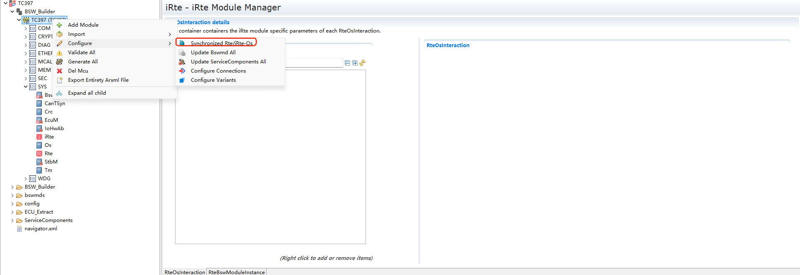
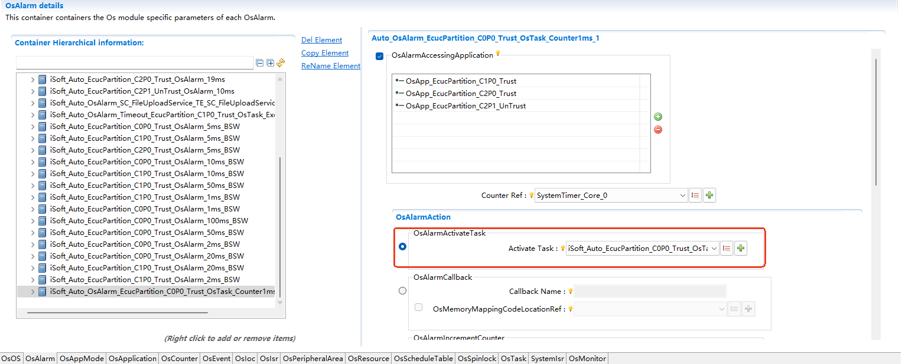
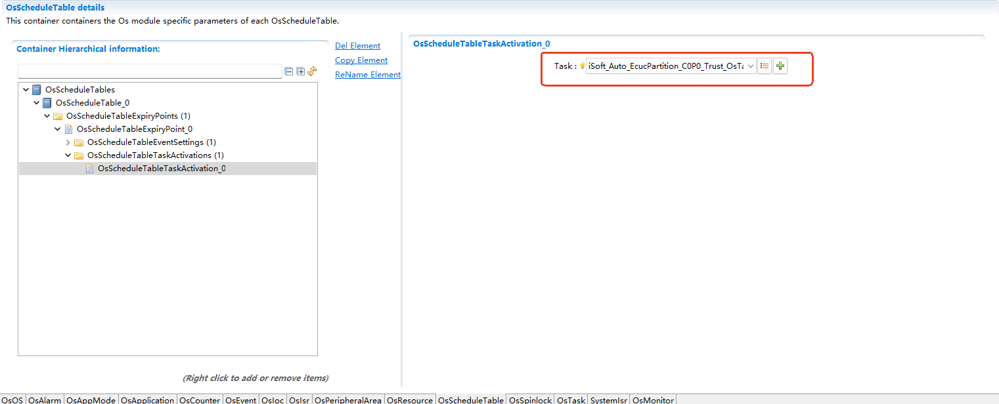
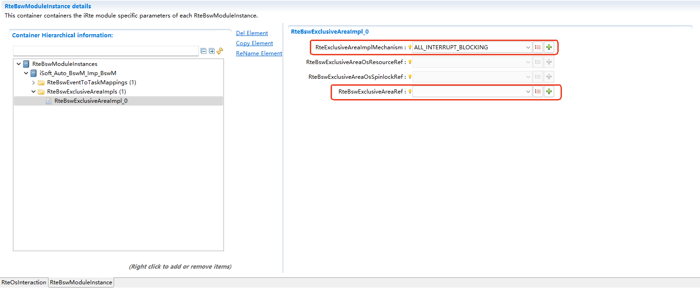
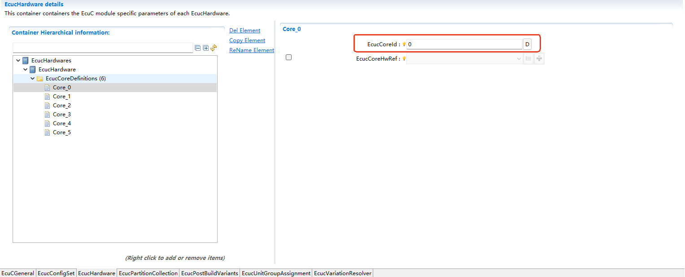

==========================================
iRte
==========================================

文档信息 Document Information
==========================================================

版本历史 Version History
----------------------------------------------------------------------------------------------------

.. list-table::
   :widths: 10 10 10 10 20
   :header-rows: 1

   * - 日期(Date)
     - 作者(Author)
     - 版本(Version)
     - 状态(Status)
     - 说明(Description)

   * - 2024/12/10
     - Haiyun.Lian、Enjing.Cui、Lianru.Hong、Chunhui.Wang
     - V0.1
     - 发布(Release)
     - 首次发布(First release)

   * - 2025/04/04
     - Haiyun.Lian、Enjing.Cui、Lianru.Hong、Chunhui.Wang
     - V1.0
     - 发布(Release)
     - 正式发布(Official release)

参考文档 References
----------------------------------------------------------------------------------------------------

.. list-table::
   :widths: 10 10 30 10
   :header-rows: 1

   * - 编号(Number)
     - 分类(Classification)
     - 标题(Title)
     - 版本(Version)

   * - 1
     - Autosar
     - AUTOSAR_CP_TPS_SystemTemplate.pdf
     - R23-11
   * - 2
     - Autosar
     - AUTOSAR_CP_TPS_SoftwareComponentTemplate.pdf
     - R23-11
   * - 3
     - Autosar
     - AUTOSAR_CP_SWS_RTE.pdf
     - R23-11
   * - 4
     - Autosar
     - AUTOSAR_CP_SRS_RTE.pdf
     - R23-11
   * - 5
     - Autosar
     - AUTOSAR_CP_EXP_LayeredSoftwareArchitecture.pdf
     - R23-11
   * - 6
     - Autosar
     - AUTOSAR_CP_SWS_OS.pdf
     - R23-11
   * - 7
     - Autosar
     - AUTOSAR_CP_TR_Methodology.pdf
     - R23-11
   * - 8
     - Autosar
     - AUTOSAR_CP_EXP_VFB.pdf
     - R23-11
   * - 9
     - Autosar
     - AUTOSAR_CP_SWS_COM.pdf
     - R23-11
   * - 10
     - Autosar
     - AUTOSAR_CP_SWS_LargeDataCOM.pdf
     - R23-11

术语与简写 Terms and Abbreviations
==========================================================

术语 Terms
----------------------------------------------------------------------------------------------------
.. list-table::
   :widths: 25 35
   :header-rows: 1

   * - 术语（Term）(Term)
     - 解释（Explanation）

   * - BswSchduleEntity
     - Bsw模块调度实体(Bsw module scheduling entity)

       Specifies the smallest code fragment which can be described for a BSW module

   * - Initialization Task
     -  初始化Task，即自启动Task(Initialize Task, i.e., Task self-start)

        AutoStart OsTask

   * - iSoft Initialization Task
     - 由ORIENTAIS自动创建的初始化Task(Initialization Task automatically created by ORIENTIS)
     
       AutoStart OsTask with prefix "iSoft_Auto", created by RTE automatically

简写 Abbreviations
----------------------------------------------------------------------------------------------------
.. list-table::
   :widths: 10 30 20
   :header-rows: 1

   * - 简写(Abbreviation)
     - 全称(Full name)
     - 解释(Explanation)

   * - iRTE
     - i-Soft Runtime Environment
     - 普华基础模块运行时环境

   * - BSW
     - Basic Software
     - 基础软件

   * - BSWMD
     - Basic Software Module Description
     - 基础软件模块描述

   * - ECU
     - Electronic Control Unit
     - 电子控制单元

   * - AUTOSAR
     - Automotive Open System Architecture
     - 汽车开放系统架构

   * - C/S
     - Client-server communication
     - 客户端服务器通信

   * - ECUC
     - AUTOSAR ECU Configuration
     - AUTOSAR ECU配置

   * - IOC
     - Inter-OsApplication Communication
     - 跨Os应用通信

   * - API
     - Application Programming Interface
     - 应用程序编程接口

   * - SchM
     - Schedule Manager
     - 调度管理

简介 Introduction
==========================================================

iRte是适配普华BSW实现需求的BSW模块间通信接口层，与应用无交互，主要包括SchM模块。基于ECU为多核BSW架构提供运行时环境：

iRte refers to communication interface layer, which is between BSW modules and adapts to the realization requirements of Puhua BSW. It does not interact with applications and mainly includes SchM modules. Provide the running environment for multi-core BSW architecture based on ECU:

-  生成TASK函数，负责映射到Task的周期BswEntity的运行调度；(Generate TASK function; map the execution scheduling of the BswEntity cycle to the Task;)

-  提供BSW间C/S通信接口；(Provide C/S communication interface between BSW;)

-  为BSW数据一致性保护提供独占区接口。(Provide the exclusive zone interface for BSW data consistency protection.)

功能描述 Functional Description
==========================================================

SchM特性 Characteristics of SchM
----------------------------------------------------------------------------------------------------

SchM功能支撑普华BSW的实现，与应用无交互，工程配置、集成时客户无需额外关注。

The SchM function supports the realization of Puhua BSW and does not interact with applications; customers do not need to pay extra attention to it during engineering configuration and integration.

独占区功能 Function of Exclusive Area
~~~~~~~~~~~~~~~~~~~~~~~~~~~~~~~~~~~~~~~~~~~~~~~~~~~~~~~~~~~~~~~~~~~~~~~~~~~~~~~~
为BSW提供独占区接口，用于数据一致性保护

Provide exclusive zone interface for BSW for the purpose of data consistency protection

BswSchduleEntity调度 BswSchduleEntity scheduling
~~~~~~~~~~~~~~~~~~~~~~~~~~~~~~~~~~~~~~~~~~~~~~~~~~~~~~~~~~~~~~~~~~~~~~~~~~~~~~~~
BswTimingEvent：周期事件，激活BSW MainFunction函数；

BswTimingEvent: Regular event, which can activates the BSW MainFunction function; 

BswBackgroundEvent：不定周期事件

BswBackgroundEvent: Irregular event

CS通信 CS Communication
~~~~~~~~~~~~~~~~~~~~~~~~~~~~~~~~~~~~~~~~~~~~~~~~~~~~~~~~~~~~~~~~~~~~~~~~~~~~~~~~
通信域：同分区，同核不同分区，不同核不同分区；支持CS同步/异步通信

Communication domain: The same partition, the same core but different partitions, and different cores and partitions; support CS synchronous/asynchronous communication

MainFunction的调度 Scheduling of MainFunction
~~~~~~~~~~~~~~~~~~~~~~~~~~~~~~~~~~~~~~~~~~~~~~~~~~~~~~~~~~~~~~~~~~~~~~~~~~~~~~~~
支持周期TASK，按各BSW模块MainFunction的配置周期进行调度

Support cycle TASK; scheduling based on the MainFunction configuration cycle of each BSW module 

偏差 Deviation
------------------------------------------------------------------

SchM的实现对模型有所简化 The realization of SchM can simplify the models
~~~~~~~~~~~~~~~~~~~~~~~~~~~~~~~~~~~~~~~~~~~~~~~~~~~~~~~~~~~~~~~~~~~~~~~~~~~~~~~~~~~~~~~~~~~~~~~~~~~~~~~
SchM只需要适配普华BSW的实现需求，与应用无交互，因此对模型有所裁剪。

SchM needs to adapt to the realization requirements of Puhua BSW only and does not interact with the application. Therefore the model is clipped.

配置 Configuration
************************************************************
None.

接口 Interface
************************************************************
None.

扩展 Extension
--------------------------------------------------------------------
None.

集成 Integration
========================================

文件列表 File List
--------------------------------------------------------------------

静态文件 Static Files
~~~~~~~~~~~~~~~~~~~~~~~~~~~~~~~~~~~~~~~~

None

动态文件 Dynamic Files
~~~~~~~~~~~~~~~~~~~~~~~~~~~~~~~~~~~~~~~~

.. list-table::
   :widths: 10 30
   :header-rows: 1

   * - 文件(File)
     - 描述(Description)
   
   * - SchM.c
     - 包含如下内容：(It includes the following contents:)

       - 生命周期函数定义；(Definition of lifecycle function;)
       - SchM 内部函数的实现(Realization of SchM internal functions)
	   
   * - SchM.h
     - 包含如下内容：(It includes the following contents:)

       - SchM 外部函数的声明头文件(The declaration header file of SchM external functions)
	   
   * - SchM_Type.h
     - 包含如下内容：(It includes the following contents:)

       - SchM 内部数据类型/宏定义的实现；(Realization of types/macro definitions of SchM internal data;)

   * - SchM_Internal.h
     - 包含如下内容：(It includes the following contents:)

       - SchM 内部函数的声明头文件；(The declaration header file of SchM internal functions)
	   
   * - SchM_<Mip>.c
     - 包含如下内容：(It includes the following contents:)

       - SchM接口实现；(Realization of SchM interface;)

   * - SchM_<Mip>.h
     - 包含如下内容：(It includes the following contents:)

       - SchM接口声明；(Declaration of SchM interface;)
       - BswSchduleEntity和BswCalledEntity原型声明；(Prototype declaration of BswSchduleEntity and BswCalledEntity;)

   * - SchM_<Mip>_Type.h
     - 包含如下几部分内容：(It includes the following contents:)

       - BSW模块使用的数据类型定义；(Type definition of the data used by BSW module;) 
       
   * - Rte_Type.h
     - 包含如下内容：(It includes the following contents:)

       - 针对所有的AUTOSAR Data Types：type declarations、structure defintions以及union definitions；(For all AUTOSAR Data Types: type declarations, structure definitions, and union definitions;)
       - 定义Inter-ECU C/S通信的数据结构Rte_Cs_TransactionHandleType ；(Define the data structure Rte_Cs_TransactionHandleType for Inter-ECU C/S communication;)
       - 定义RTE Modes；(Define RTE Modes;)
	   
   * - Rte_Main.h
     - 包含如下内容：(It includes the following contents:)

       - 声明生命周期函数；(Declare lifecycle functions;)
	   
   * - Rte.h
     - 包含如下内容：(It includes the following contents:)

       - 定义版本号；(Define version number;)
       - 定义错误返回值(Define error return value)
	   
   * - Rte.c
     - 包含如下内容：(It includes the following contents:)

       - 定义Os_Task，填充其内容。(Define Os_Task and fill in its content.)

错误处理 Error Handling
------------------------------------------------------------------

开发错误 Development Errors
~~~~~~~~~~~~~~~~~~~~~~~~~~~~~~~~~~~~~~~~
.. list-table:: 
   :widths: 20 10 30
   :header-rows: 1

   * - Error code
     - Value
     - Description

   * - RTE_E_INVALID
     - 1
     - Returned by AUTOSAR Services to indicate a generic application error.

   * - RTE_E_LIMIT
     - 130
     - An internal RTE limit has been exceeded

   * - RTE_E_NO_DATA
     - 131
     - An explicit read API call returned no data

   * - RTE_E_UNCONNECTED
     - 134
     - The port used for communication is not connected

   * - RTE_E_IN_EXCLUSIVE_AREA
     - 135
     - The error is returned by a blocking API and indicates that the runnable could not enter a wait state

   * - RTE_E_OUT_OF_RANGE
     - 137
     - The received data is out of range.

产品错误 Product Errors
~~~~~~~~~~~~~~~~~~~~~~~~~~~~~~~~~~~~~~~~
None.

运行时错误 Runtime Errors
~~~~~~~~~~~~~~~~~~~~~~~~~~~~~~~~~~~~~~~~
.. list-table:: 
   :widths: 20 10 30
   :header-rows: 1

   * - Error code
     - Value
     - Description

   * - RTE_E_TIMEOUT
     - 129
     - A blocking API call returned due to expiry of a local timeout rather than the intended result.

   * - RTE_E_TRANSMIT_ACK
     - 132
     - Transmission acknowledgement received

.. _idevelop_flow:

工具开发流程概述 Overview of Tool Development Process
------------------------------------------------------------------------------------------------------------------------------------------------------------------------
- 完成除OS和iRTE之外的所有BSW模块配置；(Complete all BSW module configurations except for OS and iRTE;)
- 补充必要的OS信息如OS核数；(Supplement necessary OS information such as the number of OS cores;)
- 更新全部BSW模块的模块描述文件(包括iRTE本身的模块描述文件)；(Update the module description files of all BSW modules (including the files of iRTE);)
- 手动进行iRTE、OS配置或通过iRTE-OS同步功能自动生成推荐Demo配置（iRTE模块和OS模块）；(Manually configure iRTE and OS, or automatically generate recommended demo configurations through iRTE OS synchronization function (iRTE and OS modules);)
- 如果选用了iRTE-OS同步功能，需要基于自动生成的推荐OS、iRTE Demo配置，结合使用场景进行调整适配；(If the iRTE-OS synchronization function is selected, make adjustment based on the automatically generated recommended OS and iRTE Demo configuration as well as the usage scenario in order to adapt to the realities;)
- 先生成iRTE代码，后生成OS代码（全工程生成顺序为其它BSW→iRTE→OS）。(Generate iRTE code and OS code in order (the generation sequence of the entire project: other BSW → iRTE → OS).)

Bswmd文件更新 Updating of Bswmd File
--------------------------------------------------------------------------------------------------------------------------------------------------------
基于BSW模块的设计，工具可更新全部或单个描述文件用来模块的设计，工具可更新全部或单个描述文件用来模块的设计，工具可更新全部或单个描述文件用来BSW模块在接口层面、 BswEntity调度的需求 ，内存映射信息。

Based on the BSW module design, the tool can update all or one description file for module design; update all or one description file for module design; update all or one description file for interface level, BswEntity scheduling requirements, and memory mapping information of the BSW module.

.. figure:: ../../../_static/参考手册/iRte/iRTE_4_3.png
   :name: iRTE_4_3
   :align: center
   :width: 800

   更新全部Bswmd文件 (Update all Bswmd files)

.. figure:: ../../../_static/参考手册/iRte/iRTE_4_4.png
   :name: iRTE_4_4
   :align: center
   :width: 800

   更新单个模块Bswmd文件 (Update Bswmd file of individual module)

iRTE-OS集成配置 IRTE-OS integrated configuration
----------------------------------------------------------------------------------------------------------------------------------------------------------

iRTE、OS模块的集成配置，可以通过两种方式进行：

The integrated configuration of iRTE and OS modules can be realized by:

- 全自动配置集成(Fully automatic configuration integration)

- 全手动配置集成(Fully manual configuration integration)

全自动配置集成 Fully automatic configuration integration
~~~~~~~~~~~~~~~~~~~~~~~~~~~~~~~~~~~~~~~~~~~~~~~~~~~~~~~~~~~~~~~~~~~~~~~~~~~~~~~~~~~~~~~~~~~~~~

全自动配置集成主要通过iRTE-OS自动同步功能，自动生成RTE、OS模块的推荐Demo配置。

The fully automatic configuration integration is mainly realized via the iRTE-OS automatic synchronization function, and automatically generates the recommended demo configurations for RTE and OS modules.

集成人员可根据实际场景，对Demo的部分配置进行微调，比如OsTask的堆栈大小等。

Integration personnel can adjust some configurations of the demo slightly based on the specific scenarios, such as the stack size of OsTask.

iRTE-OS同步 IRTE OS Synchronization
************************************************************************************************************************

基于BSW的模块描述文件，根据模型需求自动配置OS模块。

Automatically configure the OS module according to the BSW module description file and model requirements.

**自动配置的内容主要分为两类：**

**The content of automatic configuration can be mainly divided into two categories:**

- 与iRTE实现相关，OS必须按实现需求进行配置且客户不能修改；(Related to iRTE realization; the customer must configure OS according to realization requirements and cannot modify it;)
- 为客户提供配置Demo，简化客户手动配置工作量，客户根据应用场景在自动配置的基础上调整、适配。(Provide customers with configuration demos to simplify their manual configuration workload. Customer can make adjustment and adaptation based on the automatic configuration according to the specific usage scenarios.)

**自动配置主要实现的功能配置：**
**Function configurations mainly realized by automatic configuration:**

- 周期运行实体的调度（OsAlarm或OsScheduleTable）(Scheduling of periodic running entities (OsAlarm or OsScheduleTable))
- 事件型运行实体的调度(Scheduling of event running entities)
- SchM独占区保护的配置(Configuration of SchM exclusive area protection)
- OTask的部分配置，如内各运行实体的调度顺序、优先级等。(Some configuration of OTask, such as the scheduling order and priority of each internal running entity)

   iRTE-OS同步流程 (IRTE OS Synchronization Process)

   iRTE-OS自动同步配置 (IRTE-OS automatic synchronization configuration)

iRTE-OS自动同步为周期运行实体提供两种触发方式：

IRTE-OS automatic synchronization comes with two triggering methods for periodic entities:

- OsAlarm触发(OsAlarm triggering)
- OsScheduleTable触发(OsScheduleTable triggering)

选择后，统一按照选择的方式自动配置周期触发。

After selection, the cycle trigger will be automatically configured according to the selected method.

全手动配置集成 Fully manual configuration integration
~~~~~~~~~~~~~~~~~~~~~~~~~~~~~~~~~~~~~~~~~~~~~~~~~~~~~~~~~~~~~~~~~~~~~~~~~~~~~~~~~~~~~~~~~~

全手动配置集成表示iRTE、OS模块完全手动配置，不借助工具的自动配置功能。

Fully manual configuration integration indicates that iRTE and OS modules are configured fully manually without using tools.

集成流程概述 Overview of Integration Process
----------------------------------------------------------------------------------------------------------------------------------------

按照 :ref:`idevelop_flow` 完成工程的配置，生所有BSW（包括 OS 、iRTE 、MCAL ）动态配置代码后， 基于芯片、编译器搭建代码工程，集成BSW静态代码以及工具生成的动， 手动集成Application代码， 基于内存布局需求、以及BSW的MemMap进行编译、链接。

Complete the configuration of the project according to :ref:`idevelop_flow` ; after generating all BSW (including OS, iRTE, MCAL) dynamic configuration codes, build the code project based on the chip and compiler, integrate BSW static codes as well as the dynamic Application codes generated by tool and integrated manually; perform compilation and linkage based on memory layout requirements and BSW MemMap.

接口描述 Interface Description
==========================================================

SchM
----------------------

SchM实现AUTOSAR BSW模块MainFunction主函数的调度，为BSW模块提供独占区接口服务，为BSW模块间实现跨分区函数调用提供CS接口。

SchM performs the scheduling of the main function of AUTOSAR BSW module MainFunction; provides exclusive area interface services for BSW modules and CS interfaces for cross partition function calls between BSW modules.

所有SchM接口均与应用无关，只适配普华BSW的实现逻辑。故只列出实现的接口清单，不对其进行详细描述。

All SchM interfaces are not related to application and compatible with the realization logic of PwC BSW only. Therefore, the realized interfaces are listed here instead of being elaborated one by one.

.. list-table::
   :widths: 10 10
   :header-rows: 1

   * - 功能分类(Function classification) 
     - 接口名(Interface name）

   * - 生成周期函数(Generate cycle function)
     - SchM_Init

   * - 生成周期函数(Generate cycle function)
     - SchM_Start

   * - 生成周期函数(Generate cycle function)
     - SchM_StartTiming

   * - 生成周期函数(Generate cycle function)
     - SchM_Deinit

   * - 独占区(Exclusive area)
     - SchM_Enter

   * - 独占区(Exclusive area)
     - SchM_Exit

   * - CS同步通信(CS synchronous communication)
     - SchM_Call

配置 Configuration
=============================

.. _irte_osinteraction:

iRTE调度Os iRTE Scheduling Os
------------------------------------------------------------------------------------------------
相关配置RteOsInteraction，主要涉及iRTE对OsAlarm、OsTask、OsScheduleTable的启动配置。

The relevant configuration RteOsInteraction, mainly including the startup configuration of iRTE for OsAlarm, OsTask, and OsScheduleTable.

常用场景：

Common scenarios:

- 激活扩展任务;(Activate extended tasks;)
- 激活周期事件对应的OsAlarm;(Activate the OsAlarm corresponding to the cycle event;)
- 激活周期事件对应的OsScheduleTable。(Activate the OsSchedule Table corresponding to the cycle event.)

iRTE激活OsTask OsTask Activation by iRTE
~~~~~~~~~~~~~~~~~~~~~~~~~~~~~~~~~~~~~~~~~~~~~~~~~~~~~~~~~~~~~~~~~~~~~~~~~~~
.. figure:: ../../../_static/参考手册/iRte/iRTE_5_1.png
   :name: iRTE_5_1
   :align: center
   

   iRTE激活OsTask配置示例 (Instance of activating Os Task by iRTE)

iRTE激活OsAlarm OsAlarm Activation by iRTE
~~~~~~~~~~~~~~~~~~~~~~~~~~~~~~~~~~~~~~~~~~~~~~~~~~~~~~~~~~~~~~~~~~~~~~~~~~~
.. figure:: ../../../_static/参考手册/iRte/iRTE_5_2.png
   :name: iRTE_5_2
   :align: center
   

   iRTE激活OsAlarm配置示例 (Configuration Instance of OsAlarm Activation by iRTE)

iRTE激活OsScheduleTable OsScheduleTable Activation by iRTE
~~~~~~~~~~~~~~~~~~~~~~~~~~~~~~~~~~~~~~~~~~~~~~~~~~~~~~~~~~~~~~~~~~~~~~~~~~~
.. figure:: ../../../_static/参考手册/iRte/iRTE_5_3.png
   :name: iRTE_5_3
   :align: center
   

   iRTE激活OsScheduleTable配置示例 (Configuration Instance of OsScheduleTable Activation by iRTE)

Bsw模块在Ecu中的配置 Configuration of Bsw Module in Ecu
----------------------------------------------------------------------------------------------------------------------------------------
Bsw模块在Ecu中的配置依赖各Bsw模块的模块描述文件作为输入。

The configuration of Bsw modules in Ecu takes the module description files of each Bsw module as input.

相关配置RteBswModuleInstance,将BswImplementation(定义在模块描述文件中)关联至RteBswImplementationRef中。

Link relevant configurations RteBswModulus Instance to BswImplementation (defined in the module description file) with RteBswImplementeRef.

.. figure:: ../../../_static/参考手册/iRte/iRTE_5_19.png
   :name: iRTE_5_19
   :align: center
   

   RteBswModuleInstance配置示例 (Configuration instance of RteBswModuleInstance)

BswSchduleEntity映射 BswSchduleEntity Mapping
~~~~~~~~~~~~~~~~~~~~~~~~~~~~~~~~~~~~~~~~~~~~~~~~~~~~~~~~~~~~~~~~~~~~~~~~~~~~~~~~~~~~~~~~~~~~~~
相关配置RteBswEventToTaskMapping。

Related configuration RteBswEventToTaskMapping.

将BswEvent映射至OsTask，从而使Task能够调度对应的BswSchduleEntity。

Map BswEvent to OsTask so that Task could schedule the corresponding BswSchduleEntity.

映射至Basic Task Mapping to Basic Task
*****************************************************************************************************************************************

.. figure:: ../../../_static/参考手册/iRte/iRTE_5_20.png
   :name: iRTE_5_20
   :align: center
   

   BswSchduleEntity映射至Basic Task配置示例 (Configuration instance of mapping BswSchduleEntity to Basic Task)

.. attention::

   映射至Basic Task的BswEvent，均不能映射OsEvent。

   BswEvent mapped to Basic Task cannot be mapped to OsEvent.

映射至Extended Task Mapping to Extended Task
*****************************************************************************************************************************************

.. figure:: ../../../_static/参考手册/iRte/iRTE_5_21.png
   :name: iRTE_5_21
   :align: center
 

   BswSchduleEntity映射至Extended Task配置示例 (Configuration instance of mapping BswSchduleEntity to Extended Task)

.. attention::

   映射至Extended Task的BswEvent，均需要映射OsEvent。

   BswEvent mapped to Extended Task requires mapping to OsEvent as well.

映射至Background Task Mapping to Background Task
*****************************************************************************************************************************************

Background Task即只映射了BswBackgroundEvent事件，是不定周期Task，具体最低优先级（普华默认为1）且不能映射OsEvent。

Background Task maps the BswBackground Event event only and belongs to an irregular task with the lowest priority (default to 1 by PwC) and cannot map OsEvent.

Background Task由RTE激活后，在Task运行结尾使用ChainTask再次激活自己，实现不定周期特征。

After being activated by RTE, the Background Task  can be activated again at the end of the Task run using ChainTask, achieving inregular features.

周期RunnableEntity映射 Regular RunnableEntity Mapping
*****************************************************************************************************************************************

支持OsAlarm、OsScheduleTable周期性触发OsTask或OsEvent，从而实现RunnableEntity的周期性调度。

Support the periodic triggering of OsTask or OsEvent by OsAlarm and OsSchedule Table in order to realize periodic scheduling of Runnable Entity.

配置的OsAlarm、OsScheduleTable以及扩展任务，需要同步在 :ref:`irte_osinteraction` 中激活。

The configured OsAlarm, OsScheduleTable, and extended tasks should be synchronized to and activated in :ref:`irte_osinteraction` .

OsAlarm触发Basic Task Basic Task Triggering by OsAlarm
^^^^^^^^^^^^^^^^^^^^^^^^^^^^^^^^^^^^^^^^^^^^^^^^^^^^^^^^^^^^^^^^^^^^^^^^^^^^^^^^^^^^^^^^^^^^^^^^^^^^^^^^^
需要Basic Task映射同周期的RunnableEntity,同时设置OsAlarm的周期与RunnableEntity周期一致。

Basic Task should map RunnableEntity with the same cycle, and the cycle of OsAlarm should be set consistent with that of RunnableEntity

 

   由OsAlarm触发Basic Task配置示例 (Configuration Instance of Basic Task Triggering by OsAlarm)

OsAlarm触发Extended Task Extended Task Triggering by OsAlarm
^^^^^^^^^^^^^^^^^^^^^^^^^^^^^^^^^^^^^^^^^^^^^^^^^^^^^^^^^^^^^^^^^^^^^^^^^^^^^^^^^^^^^^^^^^^^^^^^^^^^^^^^^
可支持一个Task映射不同周期的RunnableEntity。

One Task can map RunnableEntities of different cycles.

.. figure:: ../../../_static/参考手册/iRte/iRTE_5_10.png
   :name: iRTE_5_10
   :align: center
 

   由OsAlarm触发Extended Task配置示例 (Configuration Instance of Extended Task Triggering by OsAlarm)

OsScheduleTable触发周期RunnableEntity Periodical RunnableEntity Triggering by OsScheduleTable
^^^^^^^^^^^^^^^^^^^^^^^^^^^^^^^^^^^^^^^^^^^^^^^^^^^^^^^^^^^^^^^^^^^^^^^^^^^^^^^^^^^^^^^^^^^^^^^^^^^^^^^^^
采用调度表可以通过调度点设置激活偏移，从而一定程度达到均衡负载的效果。

Activation offsets can be set using scheduling table through scheduling points, in order to realize certain load balancing effect.

.. figure:: ../../../_static/参考手册/iRte/iRTE_5_11.png
   :name: iRTE_5_11
   :align: center
  

   OsScheduleTable配置示例 (Configuration Instance of OsScheduleTable)

.. figure:: ../../../_static/参考手册/iRte/iRTE_5_12.png
   :name: iRTE_5_12
   :align: center
   

   OsScheduleTableExpiryPoint配置示例 (Configuration instance of OsScheduleTableExpiryPoint)

   OsScheduleTableExpiryPoint激活Basic Task配置示例 (Configuration instance of Basic Task activation by OsScheduleTableExpiryPoint)

.. figure:: ../../../_static/参考手册/iRte/iRTE_5_14.png
   :name: iRTE_5_14
   :align: center

   OsScheduleTableExpiryPoint激活OsEvent配置示例 (Configuration instance of OsEvent activation by OsScheduleTableExpiryPoint)

独占区配置 Configuration of Exclusive Area
*****************************************************************************************************************************************

相关配置RteBswExclusiveAreaImpl。

Relevant configuration RteBswExclusiveAreaImpl.

RTE为BswModule的独占区提供五个配置选择:

RTE includes five configuration options for the exclusive area of Bswmodule:

- ALL_INTERRUPT_BLOCKING
- OS_INTERRUPT_BLOCKING
- OS_RESOURCE
- OS_SPINLOCK
- NONE

   RteBswExclusiveAreaImpl配置示例 (Configuration instance of RteBswExclusiveAreaImpl)

iRTE的多核支持 Multi-core support of iRTE
-----------------------------------------------------------------------------------------------------------------------------------------

分区映射 Partition mapping
~~~~~~~~~~~~~~~~~~~~~~~~~~~~~~~~~~~~~~~~

Core Definition
********************************************************************************

 

   EcucCoreDefinition配置示例 (Configuration instance of EcucCoreDefinition)

EcucPartition分区定义 Partition Definition of EcucPartition
*****************************************************************************************************************************************

EcucPartition需要映射至Core上，并且需要设置一个默认分区。

EcucPartition needs mapping to the Core and a default partition should be set.

Swc与Bsw模块需要映射至EcucPartition，表示被划分在该分区。

Swc and Bsw modules should be mapped to EcucPartition, indicating that they are divided into that partition.

.. figure:: ../../../_static/参考手册/iRte/iRTE_5_16.png
   :name: iRTE_5_16
   :align: center

   EcucPartition配置示例 (Configuration instance of EcucPartition)

.. attention::

   Bsw模块只能映射至可信分区。

   The Bsw module can be mapped to trusted partitions only.

OsApplication与分区配置 Configuration of OsApplication and Partition
*****************************************************************************************************************************************

OsApplication是系统对象（如OsTask、OsAlarm、OsResource等）进行分组的逻辑模块，需要与EcucPartition 1:1对应创建，承载该分区的系统资源。

OsApplication is a logical module for grouping system objects (such as OsTask, OsAlarm, OsResource, etc.) It should be created by corresponding to EcucPartition at 1: 1 to host the system resources of that partition.

OsTask、OsAlarm、OsResource等系统对象需要映射至OsApplication，表示被划分在该分区。

The system objects such as OsTask, OsAlarm, and OsResource should be mapped to OsApplication, indicating that they are divided into that partition.

.. figure:: ../../../_static/参考手册/iRte/iRTE_5_17.png
   :name: iRTE_5_17
   :align: center
  

   OsApplication配置示例 (Configuration Instance of OsApplication)

SchM启动 SchM start
----------------------------------------------------------------------------------------------------------------
EcuM_StartupTwo
~~~~~~~~~~~~~~~~~~~~~~~~~~~~~~~~~~~~

无分区系统 Non-partition System
**********************************************************************************************************************************

iRTE默认在名为“iSoft_Auto_DEFAULT_OsTask_Init”的初始化Task中调用EcuM_StartupTwo,继而启动SchM。

IRTE calls EcuM_StartupTwo in the initialization task named "iSoft_Auto_DEFAULT_OsTask_Init" by default, and then starts the SchM.

多分区/多核系统 Multi-partition/multi-core system
**********************************************************************************************************************************

iRTE识别EcuM配置中的分区，以该分区的初始化Task中启动EcuM_StartupTwo。

IRTE identifies the partition in the EcuM configuration and starts EcuM.StartupTwo with the initialization task of that partition.

每个核选一个分区（可信）填入EcuMFlexConfiguration的配置中，即EcuM_StartupTwo的启动数与核数相同。

Select one partition (trusted) for each core and fill it into the configuration of EcuMFlexConfiguration, i.e., the number of startups for EcuM.StartupTwo is the same as the number of cores.

.. figure:: ../../../_static/参考手册/iRte/iRTE_5_18.png
   :name: iRTE_5_18
   :align: center
 

   EcuMFlexConfiguration配置示例 (Configuration instance of EcuMFlexConfiguration)
