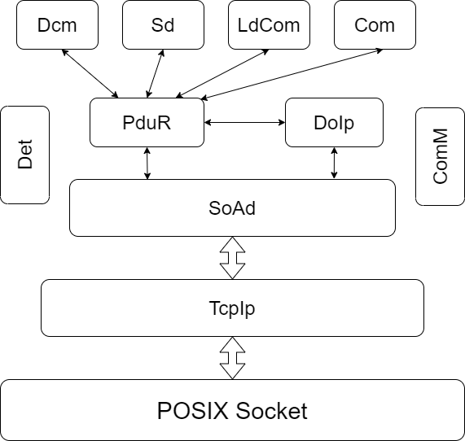
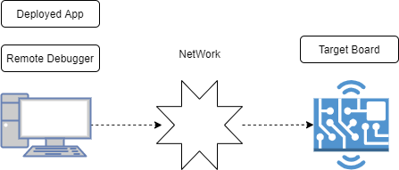
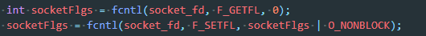
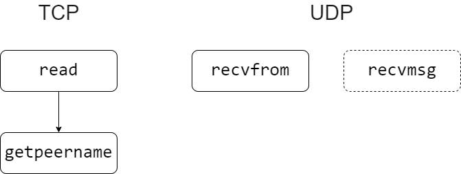
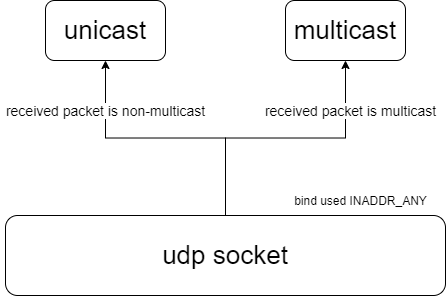
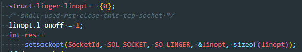

=========================
基于posix的Linux移植手册
=========================

**缩写词注解**

+------------+--------------------------------+------------------------+
| **缩写词** | **英文全称**                   | **中文解释**           |
+------------+--------------------------------+------------------------+
| POSIX      | Portable Operating System      | 可移植操作系统接口     |
|            | Interface                      |                        |
+------------+--------------------------------+------------------------+
|            |                                |                        |
+------------+--------------------------------+------------------------+
|            |                                |                        |
+------------+--------------------------------+------------------------+
|            |                                |                        |
+------------+--------------------------------+------------------------+
|            |                                |                        |
+------------+--------------------------------+------------------------+
|            |                                |                        |
+------------+--------------------------------+------------------------+

简介
====

基于POSIX的TcpIp来源于商业项目需求，客户需要在Linux运行DoIp、SomeIp；基于开发的事件考虑，我们将AutoSar中的TcpIp模块针对Linux系统进行重构。目前该模块支持在Linux、QNX
7.1.0上运行，其他操作系统待评估验证。本文对TcpIp使用进行说明，建议阅读本文档前熟悉AutoSar
TcpIp SWS规范。

参考资料
--------

[1] UNIX 网络编程卷1：套接字联网API

[2] AUTOSAR_SWS_TcpIp.pdf R19

工程使用
========

为考虑操作系统的通用性，TcpIp可以视为运行在POSIX socket上的应用。

模块层级
--------

基于AutoSar的以太网协议栈在POSIX操作系统上模块层级如下图。图中使用的模块可以根据项目需求裁剪。

|image1|

模块源码使用约束
~~~~~~~~~~~~~~~~

除了TcpIp的其他模块可以直接使用AutoSar R19的产品代码。但需要注意的是：
Platform_Types.h中代码中使用的基础数据类型需要根据平台操作系统的位数调整。同时位数调整带来的使用的内存变化也需要注意，典型是SomeIp使用的tlsf分配的内存空间需要在64位系统上扩充。

对于模块使用的定时方案为FreeRTimer、Tm，需要针对操作系统进行适配，集成工程中的FreeRTimer、Tm已经针对POSIX适配。

配置工具约束
~~~~~~~~~~~~

TcpIp使用的配置工具可以沿用R19的产品配置工具，其中ECU平台特性需要与移植后的平台大小端特性一致即可。配置上相对于传统平台约束描述如下：

-  TcpIp配置上依赖于EthIf，需要在配置工具中配置用于解决关联关系的EthIf,但不用校验生成EthIf。

-  不建议配置ARP、ICMP、DHCP、TLS，重点关注UDP、TCP、LocalAddr。

-  LocalAddr分配方式不能使用DHCP，若操作系统已经打开了DHCP，可以将分配方式配置为STATIC，具体值为ANY（0.0.0.0），对于没有使用DHCP的场景，LocalAddr为对应网卡的实际IP地址。

-  对于SoAd中多播与单播使用udp同一个端口进行数据接收的场景，单播socket配置的LocalAddr需要为ANY，同时要求单播的socket先于多播的socket进行bind，体现在配置上要求单播的socket
   group排在多播的socket group 之前。

-  若socket需要接收udp广播，需要将socket的LocalAddr配置为ANY

-  | 目标板多IP场景。通过shell命令ifconfig查询网口，并在ethif中按顺序配置。TcpIp中配置需要使用的网口作为Control。
   | *TcpIp在多IP场景时，初始化需要查询网络中网卡配置，查出来的网卡顺序可能与ifconfig不一致，一般代码中查询出来的第一个网卡为loop，对于不一致的场景需要调整EthIf中control顺序，并在TcpIp中引用。*

编译
----

编译方式
~~~~~~~~

编译方式推荐使用CMake构建，CMake可以使用Toolchain
File指定不同的编译环境。当然也可以选择平台特有的IDE。

| 对于Linux平台，推荐使用win10系统自带的WSL搭建交叉编译环境。代码编辑与调试界面使用的VSCode。对于集成在Linux上的示例工程，可以执行工程中的shell脚本启动编译。编译出来的执行文件在build/bin/\*\*.out。对于验证工程在目标板S32V234使用的交叉编译工具是gcc-linaro-6.3.1-2017.05-x86_64_aarch64-linux-gnu,这个与官方指导手册的编译器保持一致。安装链接可以在手册上获取，对应的toolchain
  file在工程中toolchain_gcc_linaro.cmake。
| 需要根据编译工具放置位置修改变量ARM_TOOLCHAIN_DIR；

对于QNX平台，编译可以使用QNX Momentics
IDE。但需要注意，代码中标准POSIX接口需要使用到静态库socket，否则链接阶段会找不到函数。当然QNX平台也可以使用CMake构建编译。

编译开关项
~~~~~~~~~~

TCPIP代码中预埋了宏开关，根据项目需求调整开关。（不建议直接修改源码）。

-  TCPIP_IO_MULTPLEXING_METHOD

..

   Select Value:TCPIP_LINUX_POLL, TCPIP_LINUX_EPOLL

   Default Value: TCPIP_LINUX_POLL

   Description:socket编程接口IO复用方式，对于Linux平台推荐使用TCPIP_LINUX_EPOLL，其他平台建议使用TCPIP_LINUX_POLL。

-  TCPIP_ENABLE_DEBUG

..

   Select Value:0,1

   Default Value: 1

   Description:TCPIP
   运行时消息打印，用于调试观察TCPIP内部socket调用参数。

调试
----

调试场景多为远程调试，要求目标板网络已经配置好，远程调试的大致示意图如下：

|image2|

Linux平台调试基于gdbserver，步骤如下：

-  根据交叉编译工具位置调整launch.json中对应目标的miDebuggerPath。

-  通过sftp、ftp、ssh等方式将执行文件传递到目标板上。

-  | 在板子的bash命令行中执行命令 ：
   | gdbserver :12345 linux linux_ethernat.out

..

   其中12345 是目标板开启gdbserver
   端口,这个端口需要与launch.json中描述调试对象使用的端口保持一致，\*.out是目标程序。

-  进入vscode的运行与调试功能，选择对应的目标任务，启动调试。

QNX平台调试方式如下：

-  在目标版上键入命令qconn（qconn默认使用的端口8000）

-  在Momentics使用debug即可

设计实现
========

采用操作系统接口
----------------

+-----------------------+-----------------------+-----------------------+
| 函数名                | 头文件                | 用途                  |
+-----------------------+-----------------------+-----------------------+
| free                  | stdlib.h              | 释放内存              |
+-----------------------+-----------------------+-----------------------+
| malloc                | stdlib.h              | 分配内存              |
+-----------------------+-----------------------+-----------------------+
| memset                | string.h              | 内存初始化            |
+-----------------------+-----------------------+-----------------------+
| socket                | sys/socket.h          | 创建socket            |
+-----------------------+-----------------------+-----------------------+
| bind                  | sys/socket.h          | S                     |
|                       |                       | ocket本端端口地址设定 |
+-----------------------+-----------------------+-----------------------+
| connect               | sys/socket.h          | S                     |
|                       |                       | ocket客户端链接服务端 |
+-----------------------+-----------------------+-----------------------+
| listen                | sys/socket.h          | Socket服务端启动监听  |
+-----------------------+-----------------------+-----------------------+
| accept                | sys/socket.h          | S                     |
|                       |                       | ocket服务端识别客户端 |
+-----------------------+-----------------------+-----------------------+
| close                 | unistd.h              | 关闭socket            |
+-----------------------+-----------------------+-----------------------+
| read                  | unistd.h              | 获取socket数据        |
+-----------------------+-----------------------+-----------------------+
| write                 | unistd.h              | 向socket写入数据      |
+-----------------------+-----------------------+-----------------------+
| recvfrom              | sys/socket.h          | 从socket中获取数据    |
+-----------------------+-----------------------+-----------------------+
| sendto                | sys/socket.h          | 向socket写入数据      |
+-----------------------+-----------------------+-----------------------+
| sendmsg               | sys/socket.h          | 向s                   |
|                       |                       | ocket写入数据带IP信息 |
+-----------------------+-----------------------+-----------------------+
| getsockopt            | sys/socket.h          | 获取socket选项        |
+-----------------------+-----------------------+-----------------------+
| setsockopt            | sys/socket.h          | 写入socket选项        |
+-----------------------+-----------------------+-----------------------+
| getsockname           | sys/socket.h          | 获                    |
|                       |                       | 取socket本端地址信息  |
+-----------------------+-----------------------+-----------------------+
| getpeername           | sys/socket.h          | 获                    |
|                       |                       | 取socket远端地址信息  |
+-----------------------+-----------------------+-----------------------+
| fcntl                 | fcntl.h               | 改变socket属性        |
+-----------------------+-----------------------+-----------------------+
| poll                  | poll.h                | Io复用POLL            |
+-----------------------+-----------------------+-----------------------+
| epoll_create          | sys/epoll.h           | Epoll创建             |
+-----------------------+-----------------------+-----------------------+
| epoll_ctl             | sys/epoll.h           | Epoll修改描述         |
+-----------------------+-----------------------+-----------------------+
| epoll_wait            | sys/epoll.h           | Epoll检索             |
+-----------------------+-----------------------+-----------------------+
| ioctl                 | sys/ioctl.h           | 驱动信息获取          |
+-----------------------+-----------------------+-----------------------+

Socket option
-------------

+------------------------------+----------+---------------------------+
| Name                         | Handle   | 说明                      |
+------------------------------+----------+---------------------------+
| TCP_NODELAY                  | R+W      | Nagle开关                 |
+------------------------------+----------+---------------------------+
| IP_MULTICAST_LOOP            | W        | 多播回环                  |
+------------------------------+----------+---------------------------+
| IP_ADD_MEMBERSHIP            | W        | 加入多播组                |
+------------------------------+----------+---------------------------+
| IP_MULTICAST_IF              | W        | 指定多播外出接口          |
+------------------------------+----------+---------------------------+
| IP_DROP_MEMBERSHIP           | W        | 离开多播组                |
+------------------------------+----------+---------------------------+
| IPV6_JION_GROUP              | W        | 加入多播组                |
+------------------------------+----------+---------------------------+
| IPV6_LEAVE_GROUP             | W        | 离开多播组                |
+------------------------------+----------+---------------------------+
| SO_LINGER                    | W        | Socket关闭行为            |
+------------------------------+----------+---------------------------+
| SO_BINDTODEVICE              | W        | 指定设备接口              |
+------------------------------+----------+---------------------------+
| IP_PKTINFO                   | W        | Socket指定IP层的数据      |
+------------------------------+----------+---------------------------+
| IPV6_PKTINFO                 | W        | Socket指定IP层的数据      |
+------------------------------+----------+---------------------------+
| SO_BROADCAST                 | W        | 发送广播                  |
+------------------------------+----------+---------------------------+
| SO_REUSEADDR                 | W        | 本地IP重用                |
+------------------------------+----------+---------------------------+

实现差异
--------

实现差异中描述了POSIX下如何达到我们期望的效果，对于其中使用到的接口具体含义不在本文中描述。

Socket阻塞
~~~~~~~~~~

socket默认情况下使用accept、connect会造成程序阻塞，直到超时、接入成功、新的客户端接入才会释放；阻塞会造成上层软件无法满足实时性。POSIX中可以使用fcntl来设置socket为非阻塞状态，fcntl可以操作文件描述符。对于socket非阻塞的修改可以采用如下方式:
|image3|

当socket没有阻塞，我们依然需要考虑对于socket的状态改变如何获取，是否需要不停的遍历，遍历对性能的消耗是不能忽略。为了避免遍历，需要使用POSIX下的IO复用（IO复用也是性能开销较小的方案）。IO复用的本质是阻塞一个函数，让socket变成非阻塞方式。在集成工程中我们依然没有对IO复用的接口进行阻塞，避免了TCPIP模块MainFunction需要新开启线程。标准的POSIX的IO复用接口有select与poll。在Linux上对poll接口有性能更好的替换接口epoll。目前代码实现上poll与epoll可以通过编译选项切换。IO复用后，socket的数据接收、Client的connect状态管理、Server识别Client接入、常规关闭、RST都可以通过Event识别。

POSIX下socket的状态切换没有回调，为了兼容已有的上层模块Socket的数据接收都可以通过IO复用后对应的Evnet中含有POLLIN来识别。由于给上层传递数据时需要给出socket的远端地址，因此Tcp与Udp的数据接收稍微有点差异。调用接口如下图所示
|image4|

对于Udp使用recvmsg场景为bind时使用的地址为IPADDR_ANY,同时环境中拥有多个IP。Socket状态改变后对Event通知机制在POSIX下需要借助IO复用的Event来标识。Tcp
Server监测客户端的链接也需要使用IO复用的Event来识别。对于Connect场景还需要借助errno来辅助识别链接是否建立成功。

多播
~~~~

发送多播的实现逻辑与已有的BSW实现基本一致，都是改变socket的远端地址为一个多播地址即可直接发送多播数据。但在QNX上发送多播需要设置socket
option IP_MULTICAST_IF。

但对于多播的接收BSW与POSIX上有差异，BSW上我们为了接收多播数据，对应的socket
在bind是选择了一个多播LocalAddr。接收多播时因底层逻辑对收到的报文目标IP
ADDR与LocalAddr进行匹配，这样就可以收到多播了。但在POSIX下多播的接收时通过修改socket
的Option实现的。即这个socket既可以收单播又可以收多播。而SoAd中发送多播与接收多播使用的不同的socket。发送多播与接收单播放置在一个socket上。为此我们在POSIX下传递给SoAd用于多播接收的Socket并没有真实数据传递，这个socket依附在同端口的其他socket上进行数据传输。对于只有多播接收的场景，这个socket对接收到数据目标地址进行识别，非多播地址则丢弃。关于多播的处理示意图如下：

|image5|

同时需要注意用于接收多播数据流的socket，bind时需要使用IP地址为ANY。对于多IP场景若本端IP为ANY的场景需要指定特定的IP发送报文需要使用socket
option IP_PKTINFO对发送的数据进行封装。同时调用的发送数据接口为sendmsg。

广播接收
~~~~~~~~

对于POSIX下广播的接收与多播的接收类似，但不存在socket映射关系，要求bind是使用IP为ANY地址。

Abort socket
~~~~~~~~~~~~

TcpIp_Close可以通过abort参数改变Tcp
socket的关闭方式。对于正常的四次挥手在直接调用close即可。参数abort为TRUE要求Tcp直接发送RST结束会话的场景，posix下需要修改socket
option实现，具体代码如下：

|image6|

MainFunction
~~~~~~~~~~~~

对于AutoSar架构下模块的MainFunction一般在OS的Task中运行。在POSIX我们要想办法构造周期调用的接口来处理各个模块的MainFunction。对于Linux与QNX上定时方案有差异，每个操作系统都有基于POSIX之外自己独有的特性。对于Linux下可以使用timerfd+epoll+thread实现。对于QNX使用的方案如下SIGEV_PULSE+thread实现，对于两种方案都体现在代码BaseTick模块中。接口在不同的方案下都是一致的，使用方法见集成工程示例。

