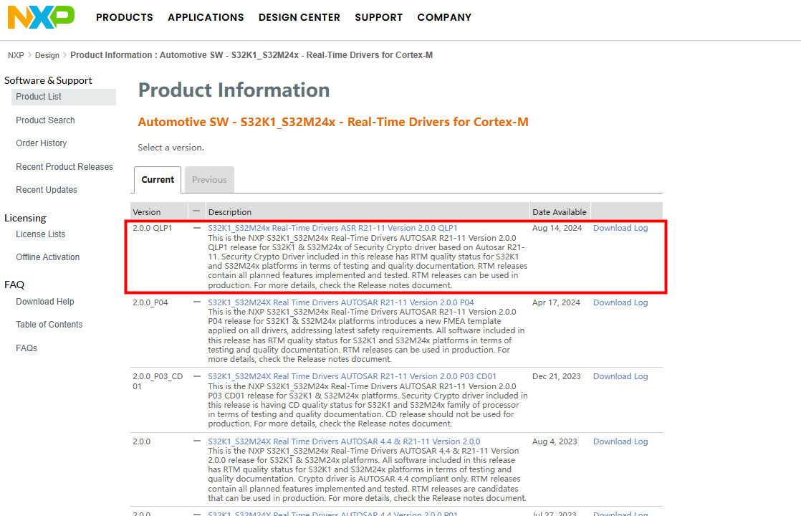
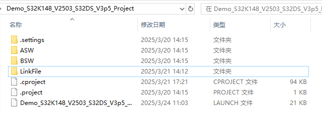

============================
小满S32K148示例工程说明
============================

基本信息
=======

简介
----
本Demo工程集成的AUTOSAR协议栈有CAN通信、诊断、网络管理、存储、看门狗。各个模块均提供了参考的配置示例，旨在指导用户快速熟悉AUTOSAR中各个协议栈的模块的基本配置以及各个模块间的关联关系。

缩略词
-----

+------------+--------------------------------+------------------------+
| **缩写词** | **英文全称**                   | **中文解释**           |
+------------+--------------------------------+------------------------+
|            |                                |                        |
+------------+--------------------------------+------------------------+
|            |                                |                        |
+------------+--------------------------------+------------------------+
|            |                                |                        |
+------------+--------------------------------+------------------------+
|            |                                |                        |
+------------+--------------------------------+------------------------+
|            |                                |                        |
+------------+--------------------------------+------------------------+
|            |                                |                        |
+------------+--------------------------------+------------------------+

开发环境
-------
编译器&IDE: S32 Design Studio 3.5

EB工具:	   EB tresos Studio 29.0.0

MCAL:	      SW32K1_S32M24x_RTD_R21-11_2.0.0_QLP1

开发板：	   S32K148EVB-Q176

开发环境获取
~~~~~~~~~~~
注册恩智浦账号后访问以下链接：https://www.nxp.com.cn/document/guide/getting-started-with-the-real-time-drivers-rtd:GS-AUTOMOTIVE-RTD?section=design-resources | NXP 半导体

获取EB工具：

|image1|

|image2|

|image3|

|image4|

获取MCAL安装包和IDE补丁包：

|image5|

|image6|

|image7|

|image8|

IDE补丁包安装
~~~~~~~~~~~~

S32 Design Studio 3.5安装好后还需要添加补丁。

|image9|

|image10|

|image11|

|image12|

|image13|

|image14|

|image15|

BSW工程目录结构说明
====================

AUTOSAR 基础软件集成工程的目录结构一般如下：

|image16|

各文件夹释义：

ASW：存放应用代码，供客户添加应用代码。

BSW：存放BSW相关代码，包括AUTOSAR各个协议栈源代码和配置、MCAL的源代码和配置、复杂驱动的源代码和配置等。

|image17|

CommonInclude：存放共用的头文件，比如Std_Types.h、Compiler.h、ComStack_Types.h等。

Communication：存放通信相关的代码，包含Can、Lin、Ethernet、FlexRay等。

|image18|

Config：存放BSW配置相关的代码，包含BSW的配置、MCAL的配置、CDD的配置等。

|image19|

Crypto：存放加密模块相关的代码。

IoHwAb：存放IO抽象模块的源代码。

Libraries：存放CRC、E2E等通用库代码。

MCAL：存放MCAL各模块的源代码、CanTrcv、LinTrcv、EthPhy、CDD模块源代码。

|image20|

Memory：存放存储相关模块的源代码。

|image21|

SystemServices：存放系统服务相关模块的源代码。

|image22|

RTE：存放RTE代码。

LinkFile：存放链接文件。

协议栈配置说明
=============

CAN通信协议栈
------------

CAN通信协议栈概述
~~~~~~~~~~~~~~~~

CAN通信协议栈涉及到的软件模块主要有CAN、CanIf、PduR、Com、ECUC模块，其中各个模块的主要功能如下表：

CAN通信栈各配置模块介绍

+--------+-------------------------------------------------------------+
| **模   | **功能**                                                    |
| 块名** |                                                             |
+--------+-------------------------------------------------------------+
| Can    | 主要配置CAN控制器的波特率，CAN报文的收发邮箱。              |
+--------+-------------------------------------------------------------+
| CanIf  | CanIf                                                       |
|        | 模块主要处理上层模块与底层驱动的之间P                       |
|        | DU的传递，为上层模块提供统一的接口来管理不同的CAN硬件模块。 |
+--------+-------------------------------------------------------------+
| EcuC   | 用于辅助                                                    |
|        | 配置工具完成配置的模块。主要提供Pdu的定义，其它模块通过关联 |
|        | EcuC中Pdu，相互关联起来。                                   |
+--------+-------------------------------------------------------------+
| PduR   | PDU Router主要为通讯接口模块（CANIF）、传输协议模块（CAN    |
|        | TP、J1939                                                   |
|        | TP）、诊断                                                  |
|        | 通讯管理模块（DCM、J1939DCM）以及通讯模块（COM、LDCOM）以及 |
|        | IPDUM、SECOC等模块提供基于 I-PDU的路由服务。                |
+--------+-------------------------------------------------------------+
| Com    | COM模块主要提供 I-PDU和信号相关管理功能                     |
+--------+-------------------------------------------------------------+

CAN通信协议栈配置功能说明
~~~~~~~~~~~~~~~~~~~~~~~

CAN通信协议栈配置的发送报文说明：

+------------------------------+----------+----------------------------+
| **报文名**                   | *        | **说明**                   |
|                              | *CANID** |                            |
+------------------------------+----------+----------------------------+
| CAN0_Tx_0x300_Cyclic         | 0x300    | 周期报文，周期时间：500ms  |
|                              |          |                            |
|                              |          | 该报文下的信号均配有UB位   |
+------------------------------+----------+----------------------------+
| CAN0_Tx_0x301_Event          | 0x301    | 事件报文                   |
+------------------------------+----------+----------------------------+
| CAN0_Tx_0x302_Mixed          | 0x302    | 混合                       |
|                              |          | 报文，正常周期：500ms，触  |
|                              |          | 发后连发3帧，周期为：50ms  |
+------------------------------+----------+----------------------------+
| CAN0_Tx_0x303_Cyclic_Counter | 0x303    | 周期报文，周期时间         |
|                              |          | ：500ms，带RollingCounter  |
+------------------------------+----------+----------------------------+
| CAN0_Tx_0x350_Cyclic_PN17    | 0x350    | 周期报文，周期时间：100ms  |
|                              |          |                            |
|                              |          | 受PN17控制                 |
+------------------------------+----------+----------------------------+
| CAN0_Tx_0x351_Cyclic_PN29    | 0x351    | 周期报文，周期时间：100ms  |
|                              |          |                            |
|                              |          | 受PN29控制                 |
+------------------------------+----------+----------------------------+
| CAN0_Tx_0x360_E2E_P01        | 0x360    | 周期报文，周期时间：100ms  |
|                              |          |                            |
|                              |          | E2E报文，DATAID：0x1234    |
+------------------------------+----------+----------------------------+

CAN通信协议栈配置的接收报文说明：

+-----------------------------+----------+-----------------------------+
| **报文名**                  | *        | **说明**                    |
|                             | *CANID** |                             |
+-----------------------------+----------+-----------------------------+
| CAN0_Rx_0x200_Cyclic        | 0x200    | 周期报文，周期时间：500ms   |
|                             |          |                             |
|                             |          | 该报文下的信号均配有UB位    |
+-----------------------------+----------+-----------------------------+
| CAN0_Rx_0x201_Event         | 0x201    | 事件报文                    |
+-----------------------------+----------+-----------------------------+
| CAN0_Rx_0x202_Mixed         | 0x202    | 混合报文，正常周期：5       |
|                             |          | 00ms，触发后连发3帧，周期为 |
|                             |          | ：50ms，包含信号超时2500ms  |
+-----------------------------+----------+-----------------------------+
| C                           | 0x203    | 周期报文，周期时            |
| AN0_Rx_0x203_Cyclic_Counter |          | 间：500ms，带RollingCounter |
+-----------------------------+----------+-----------------------------+
| CAN0_Rx_0x250_Cyclic_PN17   | 0x250    | 周期报文，周期时间：100ms   |
|                             |          |                             |
|                             |          | 受PN17控制                  |
+-----------------------------+----------+-----------------------------+
| CAN0_Rx_0x251_Cyclic_PN29   | 0x251    | 周期报文，周期时间：100ms   |
|                             |          |                             |
|                             |          | 受PN29控制                  |
+-----------------------------+----------+-----------------------------+
| CAN0_Rx_0x260_E2E_P01       | 0x260    | 周期报文，周期时间：100ms   |
|                             |          |                             |
|                             |          | E2E报文，DATAID：0x1234     |
+-----------------------------+----------+-----------------------------+

CAN网络管理协议栈
----------------

CAN网络管理协议栈概述
~~~~~~~~~~~~~~~~~~~

CAN通信协议栈涉及到的软件模块主要有Can、CanIf、CanSM、EcuC、NM、CanNm、ComM模块，其中各个模块的主要功能如下表：

网络管理栈各配置模块介绍

+----------+-----------------------------------------------------------+
| **       | **功能**                                                  |
| 模块名** |                                                           |
+----------+-----------------------------------------------------------+
| Can      | 主要配置CAN控制器的波特率，CAN报文的收发邮箱。            |
+----------+-----------------------------------------------------------+
| CanIf    | CanIf模块主要处理上层模块与底层驱动                       |
|          | 的之间PDU的传递，为上层模块提供统一的接口来管理不同的CAN  |
|          | 硬件模块。                                                |
+----------+-----------------------------------------------------------+
| EcuC     | 用于辅助配                                                |
|          | 置工具完成配置的模块。主要提供Pdu的定义，其它模块通过关联 |
|          | EcuC中Pdu，相互关联起来。                                 |
+----------+-----------------------------------------------------------+
| Nm       | NmIf模块主要包                                            |
|          | 含两个功能：NmIf模块是ComM与CanNm之间的适配层；网络管理协 |
|          | 调功能，协调不同总线channel的ECU节点实现网络的同步睡眠。  |
+----------+-----------------------------------------------------------+
| ComM     | C                                                         |
|          | omM模块封装了控制底层的通信服务。通信管理模块从通信请求者 |
|          | 那里收集总线通信访问请求，并协调这些请求，主要目的是：为  |
|          | 每个Channel设置一个状态机控制一个ECU的多个通信总线通道。  |
+----------+-----------------------------------------------------------+
| CanSM    | 主要功能                                                  |
|          | 是与通信硬件抽象层和系统服务层产生交互，为每一个CAN通信总 |
|          | 线定义一个总线相关的状态管理，并为相关的总线提供流控制。  |
+----------+-----------------------------------------------------------+
| CanNM    | 负责实现EC                                                |
|          | U的状态切换。比如合适进入睡眠、是否保持正常的网络状态等。 |
+----------+-----------------------------------------------------------+

CAN网络管理协议栈配置说明
~~~~~~~~~~~~~~~~~~~~~~~

CAN网络管理的接收报文ID范围为0x500-0x5ff,

CAN网络管理的发送报文ID为0x501

CanNM的主要配置参数如下表所示：

+------------------------------------+---------------------------------+
| 配置项                             | 配置参数                        |
+------------------------------------+---------------------------------+
| CanNmGlobalPnSupport               | TRUE                            |
+------------------------------------+---------------------------------+
| CanNmComUserDataSupport            | TRUE                            |
+------------------------------------+---------------------------------+
| CanNmMainFunctionPeriod            | 0.005                           |
+------------------------------------+---------------------------------+
| CanNmPassiveModeEnabled            | FALSE                           |
+------------------------------------+---------------------------------+
| CanNmPnEiraCalcEnabled             | TRUE                            |
+------------------------------------+---------------------------------+
| CanNmPnResetTime                   | 2.5S                            |
+------------------------------------+---------------------------------+
| CanNmActiveWakeupBitEnabled        | TRUE                            |
+------------------------------------+---------------------------------+
| CanNmCarWakeUpRxEnabled            | FALSE                           |
+------------------------------------+---------------------------------+
| CanNmImmediateNmCycleTime          | 0.02S                           |
+------------------------------------+---------------------------------+
| CanNmImmediateNmTransmissions      | 10                              |
+------------------------------------+---------------------------------+
| CanNmMsgCycleOffset                | 0.0                             |
+------------------------------------+---------------------------------+
| CanNmMsgCycleTime                  | 1.0S                            |
+------------------------------------+---------------------------------+
| CanNmMsgTimeoutTime                | 0.001S                          |
+------------------------------------+---------------------------------+
| CanNmNodeId                        | 1                               |
+------------------------------------+---------------------------------+
| CanNmPduCbvPosition                | CANNM_PDU_BYTE_1                |
+------------------------------------+---------------------------------+
| CanNmPduNidPosition                | CANNM_PDU_BYTE_0                |
+------------------------------------+---------------------------------+
| CanNmPnEnabled                     | TRUE                            |
+------------------------------------+---------------------------------+
| Ca                                 | FALSE                           |
| nNmPnHandleMultipleNetworkRequests |                                 |
+------------------------------------+---------------------------------+
| CanNmRepeatMessageTime             | 3S                              |
+------------------------------------+---------------------------------+
| CanNmRetryFirstMessageRequest      | FALSE                           |
+------------------------------------+---------------------------------+
| CanNmTimeoutTime                   | 3.0S                            |
+------------------------------------+---------------------------------+
| CanNmWaitBusSleepTime              | 1.5S                            |
+------------------------------------+---------------------------------+
| CanSMBorCounterL1ToL2              | 10                              |
+------------------------------------+---------------------------------+
| CanSMBorTimeL1                     | 0.1S                            |
+------------------------------------+---------------------------------+
| CanSMBorTimeL2                     | 1.0S                            |
+------------------------------------+---------------------------------+
| CanSMBorTimeTxEnsured              | FALSE                           |
+------------------------------------+---------------------------------+
| CanSMEnableBusOffDelay             | FALSE                           |
+------------------------------------+---------------------------------+

CAN网络管理协议栈休眠唤醒说明
~~~~~~~~~~~~~~~~~~~~~~~~~~~

设置唤醒源主要包含两个为远程唤醒和本地唤醒

+-----------------------------------+-----------------------------------+
| 唤醒源                            | 说明                              |
+-----------------------------------+-----------------------------------+
| EcuMWakeupSource_CAN              | 被动唤                            |
|                                   | 醒，需要检测总线上是否为网管报文  |
+-----------------------------------+-----------------------------------+
| EcuMWakeupSource_Local            | 主动                              |
|                                   | 唤醒，用户请求后就会立即请求网络  |
+-----------------------------------+-----------------------------------+

在S32K148开发板上，ECU一上电主动请求网络，释放网络后ECU休眠时直接调用Mcu_PerformReset进行复位。

CAN诊断协议栈
------------

CAN诊断协议栈概述
~~~~~~~~~~~~~~~~

CAN诊断协议栈涉及到的软件模块主要有Can、CanIf、CanTP、EcuC、DCM、DEM模块，其中各个模块的主要功能如下表：

诊断栈各配置模块介绍

+---------------------+------------------------------------------------+
| 模块名              | 功能                                           |
+---------------------+------------------------------------------------+
| Can                 | 主要配置CAN控制器的波特率，CAN报文的收发邮箱。 |
+---------------------+------------------------------------------------+
| CanIf               | CanIf模块主                                    |
|                     | 要处理上层模块与底层驱动的之间PDU的传递，为上  |
|                     | 层模块提供统一的接口来管理不同的CAN硬件模块。  |
+---------------------+------------------------------------------------+
| EcuC                | 用                                             |
|                     | 于辅助配置工具完成配置的模块。主要提供Pdu的定  |
|                     | 义，其它模块通过关联EcuC中Pdu，相互关联起来。  |
+---------------------+------------------------------------------------+
| PduR                | PDU                                            |
|                     | Router                                         |
|                     | 主要为通讯接口模块（CANIF）、传输协议模块（CAN |
|                     | TP、J1939                                      |
|                     | TP）、诊断通讯管理模块                         |
|                     | （DCM、J1939DCM）以及通讯模块（COM、LDCOM）以  |
|                     | 及IPDUM、SECOC等模块提供基于I-PDU的路由服务。  |
+---------------------+------------------------------------------------+
| CanTp               | CANTP模块实现依据ISO15765-2                    |
|                     | 标准规范中                                     |
|                     | 定义的CAN总线数据在传输层的数据接收发送功能。  |
+---------------------+------------------------------------------------+
| Dcm                 | 依据ISO15765-3和ISO14229-1标准描述，实现诊     |
|                     | 断请求报文的解析，响应(正响应和负响应)与执行。 |
+---------------------+------------------------------------------------+
| Dem                 | 实现诊断故障的存储与管理功能，提供API接口供    |
|                     | 其他模块读取DTC和对应的冻结帧数据和扩展数据。  |
+---------------------+------------------------------------------------+

CAN诊断协议栈配置说明
~~~~~~~~~~~~~~~~~~~

CAN诊断协议栈的CANID如下表：

+------------------------------------+---------------------------------+
| CANID类型                          | CANID                           |
+------------------------------------+---------------------------------+
| 物理寻址Physical Request CAN ID    | 0x708                           |
+------------------------------------+---------------------------------+
| 功能寻址Functional Request CAN ID  | 0x7DF                           |
+------------------------------------+---------------------------------+
| 物理响应Physical Response CAN ID   | 0x709                           |
+------------------------------------+---------------------------------+

Demo工程中配置的诊断服务有如下表所示：

|image23|

+----+--------------------+-------------------+--------------+-------+
| *  |                    |                   |              |       |
| *A |                    |                   |              |       |
| pp |                    |                   |              |       |
| li |                    |                   |              |       |
| ca |                    |                   |              |       |
| ti |                    |                   |              |       |
| on |                    |                   |              |       |
| L  |                    |                   |              |       |
| ay |                    |                   |              |       |
| er |                    |                   |              |       |
| Ti |                    |                   |              |       |
| mi |                    |                   |              |       |
| ng |                    |                   |              |       |
| Pa |                    |                   |              |       |
| ra |                    |                   |              |       |
| me |                    |                   |              |       |
| te |                    |                   |              |       |
| rs |                    |                   |              |       |
| ** |                    |                   |              |       |
|    |                    |                   |              |       |
| ** |                    |                   |              |       |
| 应 |                    |                   |              |       |
| 用 |                    |                   |              |       |
| 层 |                    |                   |              |       |
| 会 |                    |                   |              |       |
| 话 |                    |                   |              |       |
| 管 |                    |                   |              |       |
| 理 |                    |                   |              |       |
| 计 |                    |                   |              |       |
| 时 |                    |                   |              |       |
| 器 |                    |                   |              |       |
| 参 |                    |                   |              |       |
| 数 |                    |                   |              |       |
| ** |                    |                   |              |       |
+----+--------------------+-------------------+--------------+-------+
|    | **Symbol**         | **Min**           | **M          | **U   |
|    |                    |                   | ax/Timeout** | nit** |
|    | **符号**           | **最小值**        |              |       |
|    |                    |                   | **最大值     | **单  |
|    |                    |                   | /超时时间**  | 位**  |
+----+--------------------+-------------------+--------------+-------+
| *  | P2\ :sub:`Server`  | N/A               | 50           | ms    |
| *E |                    |                   |              |       |
| CU |                    |                   |              |       |
| 电 |                    |                   |              |       |
| 控 |                    |                   |              |       |
| 单 |                    |                   |              |       |
| 元 |                    |                   |              |       |
| ** |                    |                   |              |       |
+----+--------------------+-------------------+--------------+-------+
|    | P                  | N/A               | 5000         | ms    |
|    | 2\*\ :sub:`Server` |                   |              |       |
+----+--------------------+-------------------+--------------+-------+
|    | S3\ :sub:`Server`  | N/A               | 5000         | ms    |
+----+--------------------+-------------------+--------------+-------+
|    |                    |                   |              |       |
+----+--------------------+-------------------+--------------+-------+
| *  |                    |                   |              |       |
| *N |                    |                   |              |       |
| et |                    |                   |              |       |
| wo |                    |                   |              |       |
| rk |                    |                   |              |       |
| L  |                    |                   |              |       |
| ay |                    |                   |              |       |
| er |                    |                   |              |       |
| Ti |                    |                   |              |       |
| mi |                    |                   |              |       |
| ng |                    |                   |              |       |
| Pa |                    |                   |              |       |
| ra |                    |                   |              |       |
| me |                    |                   |              |       |
| te |                    |                   |              |       |
| rs |                    |                   |              |       |
| ** |                    |                   |              |       |
|    |                    |                   |              |       |
| ** |                    |                   |              |       |
| 网 |                    |                   |              |       |
| 络 |                    |                   |              |       |
| 层 |                    |                   |              |       |
| 定 |                    |                   |              |       |
| 时 |                    |                   |              |       |
| 器 |                    |                   |              |       |
| 参 |                    |                   |              |       |
| 数 |                    |                   |              |       |
| ** |                    |                   |              |       |
+----+--------------------+-------------------+--------------+-------+
|    | **Symbol**         | **Timeout**       | *            | **U   |
|    |                    |                   | *Performance | nit** |
|    | **符号**           | **超时时间**      | R            |       |
|    |                    |                   | equirement** | **单  |
|    |                    |                   |              | 位**  |
|    |                    |                   | **性能要求** |       |
+----+--------------------+-------------------+--------------+-------+
| *  | N_As/N_Ar          | 70                | ——           | ms    |
| *E |                    |                   |              |       |
| CU |                    |                   |              |       |
| 电 |                    |                   |              |       |
| 控 |                    |                   |              |       |
| 单 |                    |                   |              |       |
| 元 |                    |                   |              |       |
| ** |                    |                   |              |       |
+----+--------------------+-------------------+--------------+-------+
|    | N_Bs               | 150               | ——           | ms    |
+----+--------------------+-------------------+--------------+-------+
|    | N_Br               | ——                | < 70         | ms    |
+----+--------------------+-------------------+--------------+-------+
|    | N_Cs               | ——                | < 150        | ms    |
+----+--------------------+-------------------+--------------+-------+
|    | N_Cr               | 150               | ——           | ms    |
+----+--------------------+-------------------+--------------+-------+
|    |                    |                   |              |       |
+----+--------------------+-------------------+--------------+-------+
| *  |                    |                   |              |       |
| *O |                    |                   |              |       |
| th |                    |                   |              |       |
| er |                    |                   |              |       |
| pa |                    |                   |              |       |
| ra |                    |                   |              |       |
| me |                    |                   |              |       |
| te |                    |                   |              |       |
| rs |                    |                   |              |       |
| ** |                    |                   |              |       |
|    |                    |                   |              |       |
| ** |                    |                   |              |       |
| 其 |                    |                   |              |       |
| 它 |                    |                   |              |       |
| 参 |                    |                   |              |       |
| 数 |                    |                   |              |       |
| ** |                    |                   |              |       |
+----+--------------------+-------------------+--------------+-------+
|    | **Symbol**         | **Parameter**     | **Value**    | **U   |
|    |                    |                   |              | nit** |
|    | **符号**           | **参数**          | **值**       |       |
|    |                    |                   |              | **单  |
|    |                    |                   |              | 位**  |
+----+--------------------+-------------------+--------------+-------+
| *  | BS                 | Block Size        | 0            | ——    |
| *E |                    |                   |              |       |
| CU |                    |                   |              |       |
| 电 |                    |                   |              |       |
| 控 |                    |                   |              |       |
| 单 |                    |                   |              |       |
| 元 |                    |                   |              |       |
| ** |                    |                   |              |       |
+----+--------------------+-------------------+--------------+-------+
|    | STmin              | Minimum           | 10           | ms    |
|    |                    | Separation Time   |              |       |
+----+--------------------+-------------------+--------------+-------+
|    | Fill               | Padding           | 0xAA         | ——    |
|    | b                  |                   |              |       |
|    | ytes(发送数据填充) |                   |              |       |
+----+--------------------+-------------------+--------------+-------+
|    | 接收填充值检查     | ON/OFF            | OFF          | ——    |
+----+--------------------+-------------------+--------------+-------+
|    | Fill               | Padding           | ——           | ——    |
|    | b                  |                   |              |       |
|    | ytes(接收数据填充) |                   |              |       |
+----+--------------------+-------------------+--------------+-------+
|    | 诊断报文长度       | Byze Size         | 8            | ——    |
+----+--------------------+-------------------+--------------+-------+
|    | 诊断报文长度检查   | ON/OFF            | ON           | ——    |
+----+--------------------+-------------------+--------------+-------+
|    | D                  | Byze Size         | 1024         | ——    |
|    | CM接收BUFFER最大值 |                   |              |       |
+----+--------------------+-------------------+--------------+-------+
|    | D                  | Byze Size         | 1024         | ——    |
|    | CM发送BUFFER最大值 |                   |              |       |
+----+--------------------+-------------------+--------------+-------+
|    | TP半双工           |                   |              |       |
+----+--------------------+-------------------+--------------+-------+

CAN诊断时间参数如下:

安全访问算法配置信息如下：

   Mask配置值

+-----------------------------------------------------------------------+
| Mask = 0x5555AAAAu                                                    |
+-----------------------------------------------------------------------+

密钥算法（根据Seed计算Key）如下，其中seed为输入的种子。

   安全算法

+-----------------------------------------------------------------------+
| Key = Seed & Mask                                                     |
+-----------------------------------------------------------------------+

注：最大失败次数为3，达到最大失败次数启动延时时间为10S；连续请求种子错误计数不加1，种子相同，延时时间过后错误计数清零。

DID列表：

|image24|

IO DID列表：

|image25|

RID列表：\ |image26|\ DTC列表：\ |image27|

注：DTC格式：01，ISO 14229；DTC status支持的bit位仅bit7不支持，0x7F；

DTC扩展数据：

|image28|\ DTC快照：

|image29|

存储协议栈
---------

存储协议栈概述
~~~~~~~~~~~~~

存储协议栈涉及到的软件模块主要有Flash、MemAcc、FEE、NvM模块，其中各个模块的主要功能如下表：

NvM 各配置模块介绍

+----------+-----------------------------------------------------------+
| **       | **功能**                                                  |
| 模块名** |                                                           |
+----------+-----------------------------------------------------------+
| Flash    | Flash 驱动配置                                            |
+----------+-----------------------------------------------------------+
| MemAcc   | MemAcc 驱动配置                                           |
+----------+-----------------------------------------------------------+
| FEE      | FEE 驱动配置                                              |
+----------+-----------------------------------------------------------+
| NvM      | 非易失存储管理                                            |
+----------+-----------------------------------------------------------+

存储协议栈配置说明
~~~~~~~~~~~~~~~~

存储协议栈中主要配置了如下NvMBlock:

+-----------------------------------+-----------------------------------+
| **NvMBlock名**                    | **作用**                          |
+-----------------------------------+-----------------------------------+
| NvMBlock_ConfigID                 | NvM管理                           |
+-----------------------------------+-----------------------------------+
| NvMBlock_Dem_Data                 | 用来存放Dem的数据                 |
+-----------------------------------+-----------------------------------+
| NvMBlock_Dem_Status               | 用来存放Dem的状态                 |
+-----------------------------------+-----------------------------------+
| NvMBlock_Dcm                      | 用来存放Dcm的数据（暂未使用）     |
+-----------------------------------+-----------------------------------+
| NvMBlock_SecurityLevel01          | 用来                              |
|                                   | 存放安全等级1错误计数（暂未使用） |
+-----------------------------------+-----------------------------------+
| NvMBlock_SecurityLevel02          | 用来                              |
|                                   | 存放安全等级2错误计数（暂未使用） |
+-----------------------------------+-----------------------------------+
| NvMBlock_Did_0xF190               | 用来存放DID 0xF190的数据          |
+-----------------------------------+-----------------------------------+
| NvMBlock_Did_0xF183               | 用来存放DID 0xF183的数据          |
+-----------------------------------+-----------------------------------+

看门狗协议栈
-----------

看门狗协议栈概述
~~~~~~~~~~~~~~

看门狗协议栈是一种用于监控和保护系统运行状态的机制。它通过监控软件执行的稳定性和正确性确保了在系统发生故障时能迅速采取恢复措施。

Wdg协议栈主要涉及到的模块为Wdg、WdgIf 、WdgM
，其中各个模块的主要功能如下表：

Wdg 看门狗协议栈各配置模块介绍

+-------+--------------------------------------------------------------+
| *     | **功能**                                                     |
| *模块 |                                                              |
| 名**  |                                                              |
+-------+--------------------------------------------------------------+
| Wdg   | Wdg                                                          |
|       | 属于                                                         |
|       | MCAL的一部分，用于完成看门狗初始化，模式设置以及喂狗设置等。 |
+-------+--------------------------------------------------------------+
| WdgIf | WdgIf                                                        |
|       | 模块属于ECU抽象层，能够允许上层WdgM                          |
|       | 模块来同时处理多个看门狗实体，比如外部看门狗或者内部看门狗。 |
+-------+--------------------------------------------------------------+
| WdgM  | WdgM                                                         |
|       | 模块                                                         |
|       | 从硬件看门狗实体监控的过程抽象出来完成软件程序执行监控抽象。 |
+-------+--------------------------------------------------------------+

看门狗协议栈配置说明
~~~~~~~~~~~~~~~~~~

看门狗协议栈中配置了一个Alive supervision用于监控定期软件的时间。

.. table:: Alive监控参数配置

   +--------+----------+-----+-----+-----+-----+-----+-----+-----+-----+
   | **监控 | **描述** | *   | *   | *   | *   | *   | *   | *   | *   |
   | 类型** |          | *监 | *监 | *参 | *监 | *监 | *期 | *次 | *次 |
   |        |          | 控  | 控  | 考  | 控  | 控  | 望  | 数  | 数  |
   |        |          | 实  | 点  | 周  | 失  | 失  | 执  | 上  | 下  |
   |        |          | 体  | 个  | 期  | 败  | 效  | 行  | 偏  | 偏  |
   |        |          | 个  | 数  | **  | 门  | 门  | 次  | 差  | 差  |
   |        |          | 数  | **  |     | 限  | 限  | 数  | **  | **  |
   |        |          | **  |     |     | **  | **  | **  |     |     |
   +--------+----------+-----+-----+-----+-----+-----+-----+-----+-----+
   | Alive  | 监控一   | 1   | 1   | 1   | 0   | 0   | 1   | 0   | 0   |
   | 监控   | 次mainfu |     |     |     |     |     |     |     |     |
   |        | nction周 |     |     |     |     |     |     |     |     |
   |        | 期alive  |     |     |     |     |     |     |     |     |
   |        | 监控点执 |     |     |     |     |     |     |     |     |
   |        | 行的次数 |     |     |     |     |     |     |     |     |
   +--------+----------+-----+-----+-----+-----+-----+-----+-----+-----+

OS协议栈
-------

OS协议栈概述
~~~~~~~~~~~

AUTOSAR
OS主要负责任务管理和中断管理功能；实现包括以下模块:Task、Isr、Countor、Alarm、ScheduleTable、Event、Resource等。

OS协议栈配置说明
~~~~~~~~~~~~~~~

OsTask配置

+-------------+-------------+-------------+-------------+-------------+
| **Name**    | *           | **Stack     | *           | **OsTask    |
|             | *Priority** | Siz         | *Preemptive | Autostart** |
|             |             | e[4Bytes]** | Poilcy**    |             |
+-------------+-------------+-------------+-------------+-------------+
| OsTask_Init | 1           | 512         | NON         | True        |
+-------------+-------------+-------------+-------------+-------------+
| OsTask_1ms  | 4           | 512         | FULL        | False       |
+-------------+-------------+-------------+-------------+-------------+
| OsTask_5ms  | 3           | 512         | FULL        | False       |
+-------------+-------------+-------------+-------------+-------------+
| OsTask_10ms | 2           | 512         | FULL        | False       |
+-------------+-------------+-------------+-------------+-------------+
| O           | 1           | 512         | FULL        | False       |
| sTask_100ms |             |             |             |             |
+-------------+-------------+-------------+-------------+-------------+

OsIsr配置

+----------------+------------+-------------+------------+------------+
| **Name**       | **         | **Stack     | **         | **Nested   |
|                | Category** | Siz         | Priority** | Enable**   |
|                |            | e[4Bytes]** |            |            |
+----------------+------------+-------------+------------+------------+
| CAN0_ORed      | GATEGORY_2 | 512         | NON        | False      |
+----------------+------------+-------------+------------+------------+
| CAN            | GATEGORY_2 | 512         | FULL       | False      |
| 0_ORed_0_15_MB |            |             |            |            |
+----------------+------------+-------------+------------+------------+
| CAN0           | GATEGORY_2 | 512         | FULL       | False      |
| _ORed_16_31_MB |            |             |            |            |
+----------------+------------+-------------+------------+------------+
| FTM0_Ch0_Ch1   | GATEGORY_2 | 512         | FULL       | False      |
+----------------+------------+-------------+------------+------------+

OsAlarm配置

+----------------+------------+-------------+------------+------------+
| **Name**       | **Activate | **OsAlarm   | **Start    | **Cycle    |
|                | Task**     | Autostart** | Time**     | Time**     |
+----------------+------------+-------------+------------+------------+
| OsAlarm_1ms    | OsTask_1ms | True        | 1          | 1          |
+----------------+------------+-------------+------------+------------+
| OsAlarm_5ms    | OsTask_5ms | True        | 5          | 5          |
+----------------+------------+-------------+------------+------------+
| OsAlarm_10ms   | O          | True        | 10         | 10         |
|                | sTask_10ms |             |            |            |
+----------------+------------+-------------+------------+------------+
| OsAlarm_100ms  | Os         | True        | 100        | 100        |
|                | Task_100ms |             |            |            |
+----------------+------------+-------------+------------+------------+

工程验证
=======

编译及下载
---------

将BSW工程导入IDE后点击Build Project即可编译工程。

|image30|

编译通过后点击Debug下载工程。（根据使用的调试器配置）

|image31|

工程运行验证
-----------

正确连接开发板并成功下载运行后，使用通信测试验证工具接收板子发出的报文，可以收到如下报文。

|image32|

.. |image1| image:: ../../_static/工程说明/小满S32K148示例工程说明/image1.png
   :width: 6.44583in
   :height: 1.97292in
.. |image2| image:: ../../_static/工程说明/小满S32K148示例工程说明/image2.png
   :width: 5.5125in
   :height: 4.30556in
.. |image3| image:: ../../_static/工程说明/小满S32K148示例工程说明/image3.png
   :width: 5.75972in
   :height: 3.07222in
.. |image4| image:: ../../_static/工程说明/小满S32K148示例工程说明/image4.png
   :width: 5.76319in
   :height: 4.86528in
.. |image5| image:: ../../_static/工程说明/小满S32K148示例工程说明/image5.png
   :width: 6.175in
   :height: 1.66319in

.. |image7| image:: ../../_static/工程说明/小满S32K148示例工程说明/image7.png
   :width: 5.76458in
   :height: 3.7125in
.. |image8| image:: ../../_static/工程说明/小满S32K148示例工程说明/image8.png
   :width: 5.76319in
   :height: 3.25972in

.. |image10| image:: ../../_static/工程说明/小满S32K148示例工程说明/image10.png
   :width: 5.76806in
   :height: 4.34583in
.. |image11| image:: ../../_static/工程说明/小满S32K148示例工程说明/image11.png
   :width: 5.76806in
   :height: 3.60278in

.. |image13| image:: ../../_static/工程说明/小满S32K148示例工程说明/image13.png
   :width: 5.76806in
   :height: 3.56319in
.. |image14| image:: ../../_static/工程说明/小满S32K148示例工程说明/image14.png
   :width: 5.76806in
   :height: 3.56319in
.. |image15| image:: ../../_static/工程说明/小满S32K148示例工程说明/image15.png
   :width: 5.76806in
   :height: 3.55139in
.. |image16| image:: ../../_static/工程说明/小满S32K148示例工程说明/image16.png
   :width: 6.39028in
   :height: 1.62708in
.. |image17| image:: ../../_static/工程说明/小满S32K148示例工程说明/image17.png
   :width: 4.94792in
   :height: 2.35417in
.. |image18| image:: ../../_static/工程说明/小满S32K148示例工程说明/image18.png
   :width: 5.29167in
   :height: 1.38542in
.. |image19| image:: ../../_static/工程说明/小满S32K148示例工程说明/image19.png
   :width: 4.89583in
   :height: 1.35417in

.. |image21| image:: ../../_static/工程说明/小满S32K148示例工程说明/image21.png
   :width: 5.28125in
   :height: 1.375in
.. |image22| image:: ../../_static/工程说明/小满S32K148示例工程说明/image22.png
   :width: 5.13542in
   :height: 2.59375in
.. |image23| image:: ../../_static/工程说明/小满S32K148示例工程说明/image23.png
   :width: 6.74167in
   :height: 7.26667in
.. |image24| image:: ../../_static/工程说明/小满S32K148示例工程说明/image24.png
   :width: 6.59167in
   :height: 3.96806in
.. |image25| image:: ../../_static/工程说明/小满S32K148示例工程说明/image25.png
   :width: 6.64097in
   :height: 2.79097in

.. |image30| image:: ../../_static/工程说明/小满S32K148示例工程说明/image30.png
   :width: 5.86181in
   :height: 3.49375in
.. |image31| image:: ../../_static/工程说明/小满S32K148示例工程说明/image31.png
   :width: 6.76111in
   :height: 2.96736in
.. |image32| image:: ../../_static/工程说明/小满S32K148示例工程说明/image32.png
   :width: 6.77153in
   :height: 1.82847in
