===================
S32K148
===================

1 开发环境准备（Preparation of Development Environment）
============================================================================================================================================

主要工具和环境说明

Description of Main Tools and Environment

.. list-table::
   :widths: 20 20 
   :header-rows: 1

   * - 工具描述(Tool Description)
     - 名称/版本(Name/Version)
   * - 编译器和IDE(Compiler and IDE)
     - S32 Design Studio 3.6.7
   * - EB工具(EB Tool)
     - EB tresos Studio 29.0.0
   * - MCAL
     - SW32K1_S32M24x_RTD_R21-11_2.0.0_QLP1
   * - 硬件开发板(Hardware Development Board)
     - S32K148EVB-Q176

1.1 MCAL编译器和IDE获取（Acquisition of MCAL Compiler and IDE）
------------------------------------------------------------------------------------------------------------------------------------------------------------------------------------------------------------------------------------------------------------

MCAL编译器和IDE（S32 Design Studio）的获取步骤如下：

The steps to acquire the MCAL compiler and IDE (S32 Design Studio) are as follows:

1. 访问NXP官网（https://www.nxp.com），注册恩智浦账号。

   Visit the NXP official website (https://www.nxp.com) and register an NXP account.

2. 登录后访问"Getting Started with the Real-Time Drivers (RTD)"页面。

   After logging in, visit the "Getting Started with the Real-Time Drivers (RTD)" page.

3. 根据页面指引下载S32 Design Studio for S32 Platform 3.6.7版本。

   Download version 3.6.7 of S32 Design Studio for S32 Platform following the instructions on the page.

4. 下载完成后保存安装包到本地目录。

   Save the downloaded installation package to a local directory after download completes.

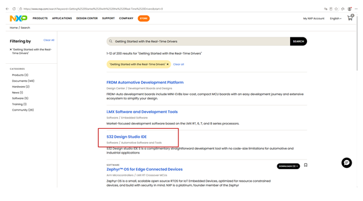

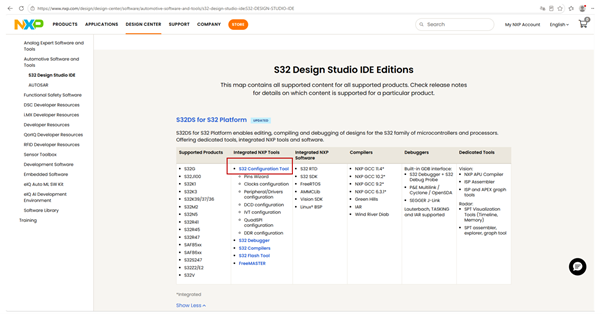

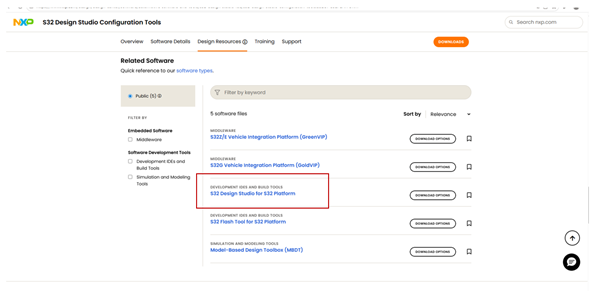

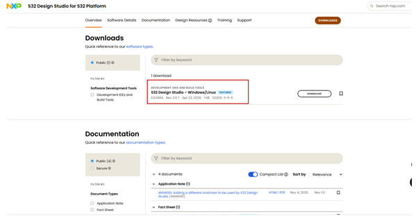

1.2 MCAL配置工具获取（Acquisition of MCAL Configuration Tool）
------------------------------------------------------------------------------------------------------------------------------------------------------------------------------------------------------------------------------------------------------------

MCAL配置工具（EB tresos Studio）的获取步骤：

Steps to acquire the MCAL configuration tool (EB tresos Studio):

1. 访问NXP官网并登录恩智浦账号。

   Visit the NXP official website and log into the NXP account.

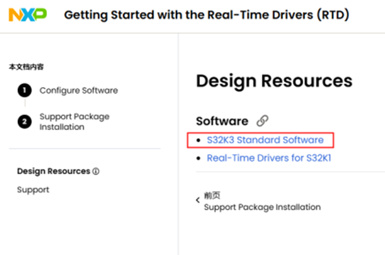

2. 进入"Getting Started with the Real-Time Drivers (RTD)"页面。

   Go to the "Getting Started with the Real-Time Drivers (RTD)" page.

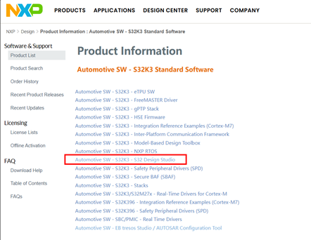

3. 找到EB tresos Studio配置工具下载区域。

   Locate the download area for the EB tresos Studio configuration tool.

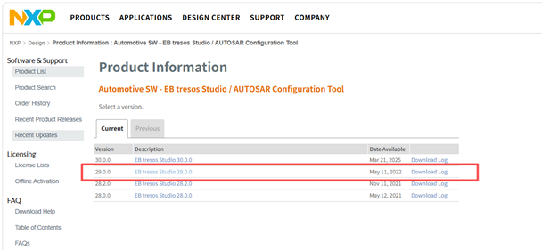

4. 下载EB tresos Studio 29.0.0版本安装包。

   Download the installation package for EB tresos Studio version 29.0.0.

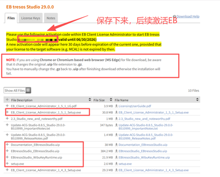

1.3 MCAL安装包和补丁包获取（Acquisition of MCAL Installation Package and Patch Package）
------------------------------------------------------------------------------------------------------------------------------------------------------------------------------------------------------------------------------------------------------------

MCAL RTD（Real-Time Drivers）安装包和补丁包的获取：

Acquisition of MCAL RTD (Real-Time Drivers) installation package and patch package:

1. 在NXP官网的RTD页面中找到对应芯片型号的MCAL包。

   Find the MCAL package matching the corresponding chip model on the RTD page of NXP’s official website.

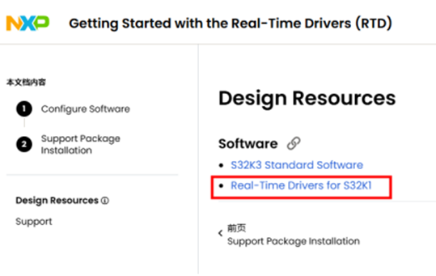

2. 下载SW32K1_S32M24x_RTD_R21-11_2.0.0_QLP1版本的主安装包。

   Download the main installation package of version SW32K1_S32M24x_RTD_R21-11_2.0.0_QLP1.

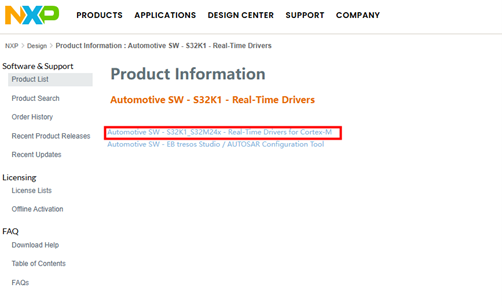

3. 同时下载对应的补丁包（Patch）以确保工具链完整性。

   Download the corresponding patch package (Patch) at the same time to guarantee the integrity of the toolchain.

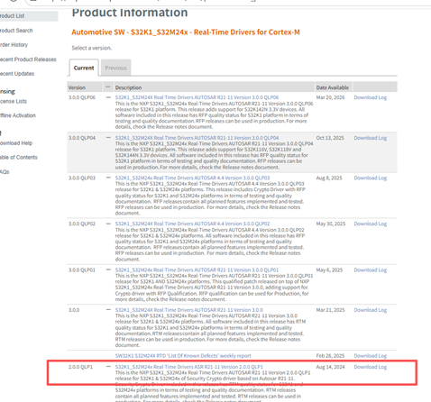

4. 建议将所有下载文件存放在同一目录下以便后续安装管理。

   It is recommended to store all downloaded files in the same directory for subsequent installation and management.

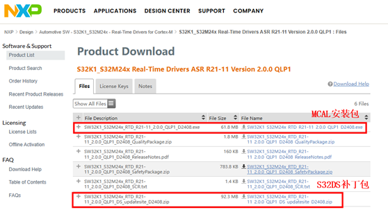

1.4 MCAL配置工具安装（Installation of MCAL Configuration Tool）
------------------------------------------------------------------------------------------------------------------------------------------------------------------------------------------------------------------------------------------------------------

EB tresos Studio安装步骤：

EB tresos Studio installation steps:

1. 双击安装包启动安装向导。

   Double-click the installation package to launch the installation wizard.

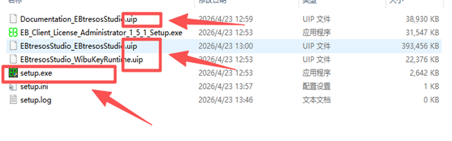

2. 选择安装目录，点击Next。

   Select the installation directory and click Next.

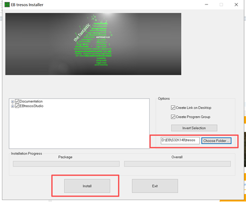

3. 等待安装完成，点击Exit结束安装。

   Wait for installation completion and click Exit to finish installation.

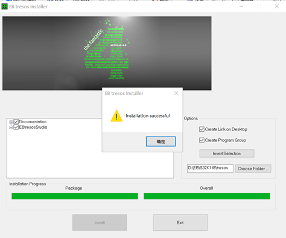

1.5 EB License安装和激活（Installation and Activation of EB License）
------------------------------------------------------------------------------------------------------------------------------------------------------------------------------------------------------------------------------------------------------------

EB tresos Studio License激活流程：

EB tresos Studio License activation process:

1. 点击安装包进行安装。

   Click the installation package to perform installation.

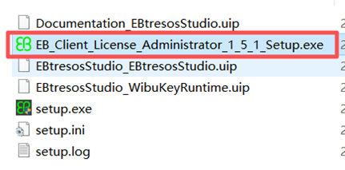

2. 选取安装路径。

   Select the installation path.

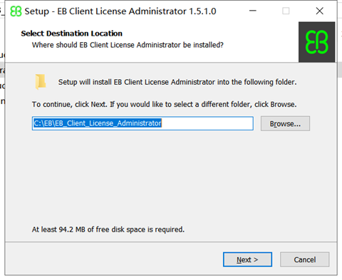

3. 选择License文件所在位置，或选择在线激活方式。

   Choose the storage path of the License file or select the online activation mode.

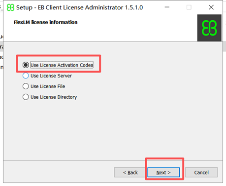

4. 输入之前下载界面记录的License，点击Activate完成激活，等待激活成功提示。

   Enter the License recorded on the previous download page, click Activate to complete activation and wait for the successful activation prompt.

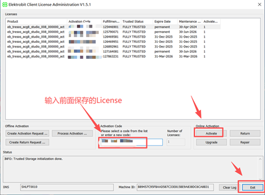

激活成功后重启EB工具使License生效。

Restart the EB tool after successful activation to make the License take effect.

1.6 MCAL包安装（Installation of MCAL Package）
------------------------------------------------------------------------------------------------------------------------------------------------------------------------------------------------------------------------------------------------------------

MCAL包安装到EB tresos Studio的步骤：

Steps to install the MCAL package into EB tresos Studio:

1. 双击RTD安装包，执行安装程序。

   Double-click the RTD installation package to run the installer.

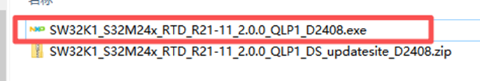

2. 点击Next。

   Click Next.

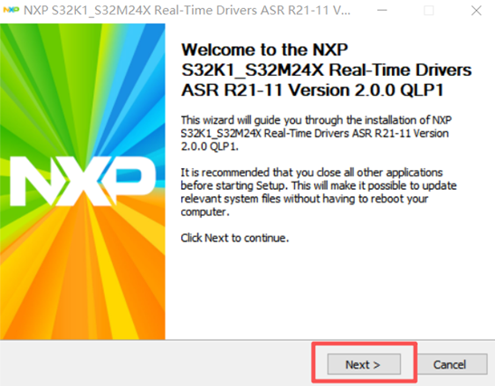

3. 选择同意协议。

   Select to accept the agreement.

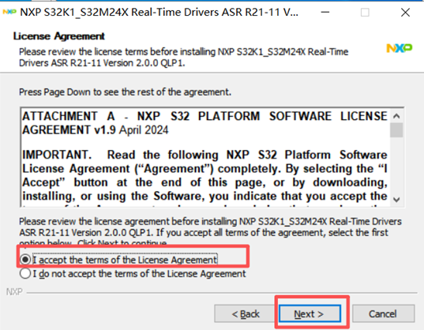

4. 选择安装，点击Next。

   Select installation and click Next.

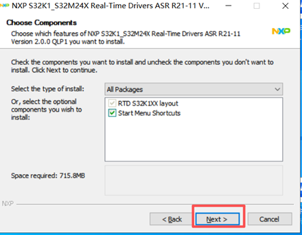

5. 选择安装目录，点击Next。

   Choose the installation directory and click Next.

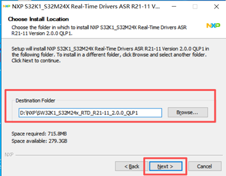

6. 选择EB安装路径。

   Select the EB installation path.

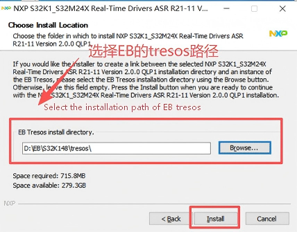

7. 点击Finsih安装完成。

   Click Finish to complete installation.

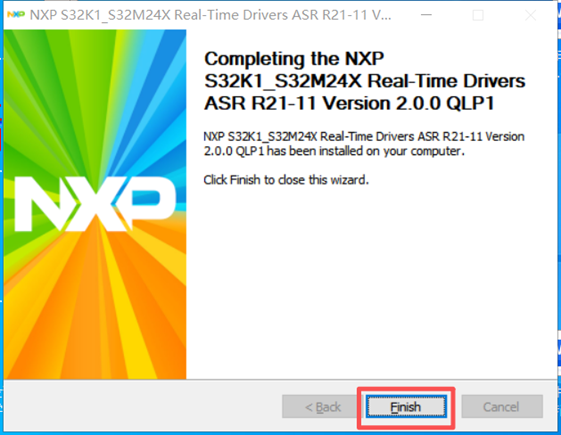

1.7 MCAL编译器和IDE安装（Installation of MCAL Compiler and IDE）
------------------------------------------------------------------------------------------------------------------------------------------------------------------------------------------------------------------------------------------------------------------------------

S32 Design Studio安装步骤：

S32 Design Studio installation steps:

1. 双击S32DS安装包启动安装程序。

   Double-click the S32DS installation package to launch the installer.

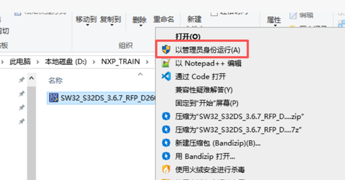

2. 选择安装语言，点击OK继续。

   Select the installation language and click OK to continue.

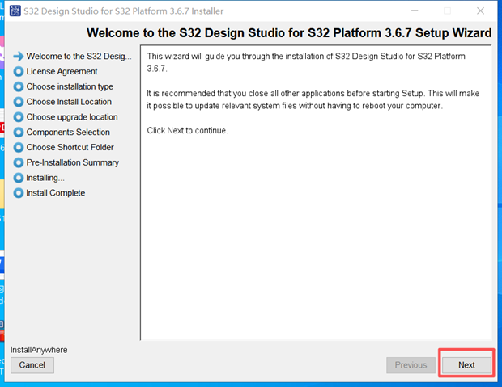

3. 阅读并接受许可协议。

   Read and accept the agreement.

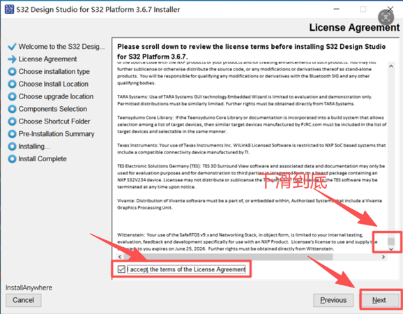

4. 选择安装目录（路径不要包含中文或空格）。

   Select the installation directory (the path shall not contain Chinese characters or spaces).

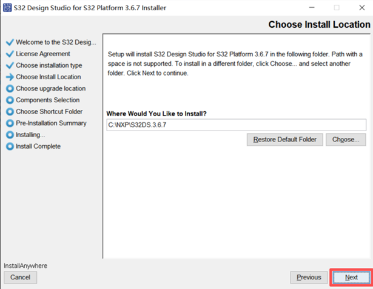

5. 选择需要安装的组件（建议选择全部默认组件）。

   Pick components to install (all default components are recommended).

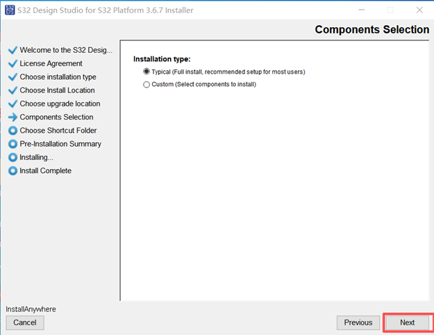

6. 等待安装程序完成文件复制和配置。

   Wait for the installer to finish file copy and configuration.

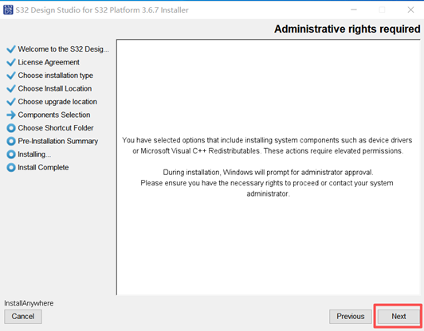

7. 安装完成后勾选Launch S32 Design Studio选项启动IDE。

   Check the Launch S32 Design Studio option after installation to start the IDE.

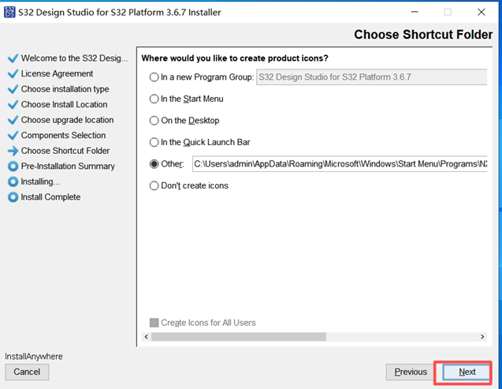

8. 点击Done完成安装。

   Click Done to complete installation.

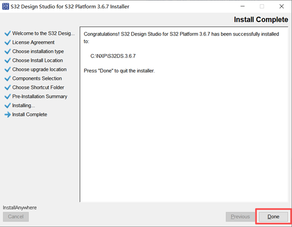

1.8 IDE补丁包安装（Installation of IDE Patch Package）
------------------------------------------------------------------------------------------------------------------------------------------------------------------------------------------------------------------------------------------------------------------------------

S32 Design Studio补丁包安装步骤：

Steps to install patch package for S32 Design Studio:

1. 在S32 Design Studio中，可通过Help菜单下的"Install New Software"选项安装补丁包，如下图所示

   In S32 Design Studio, install the patch package via the "Install New Software" option under the Help menu, as shown in the figure below.

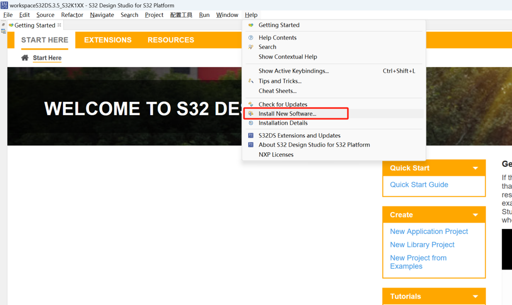

2. 选择本地补丁包。

   Select the local patch package.

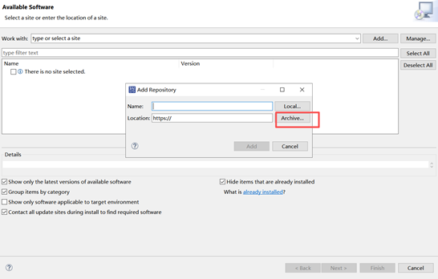

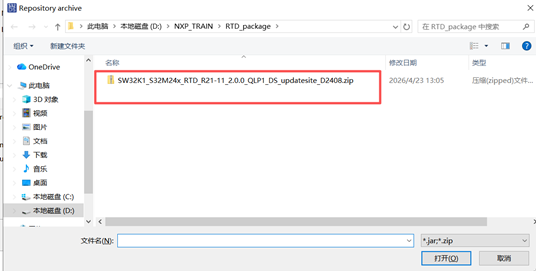

3. 全选补丁包程序，点击Next进行安装。

   Select all patch programs and click Next to proceed with installation.

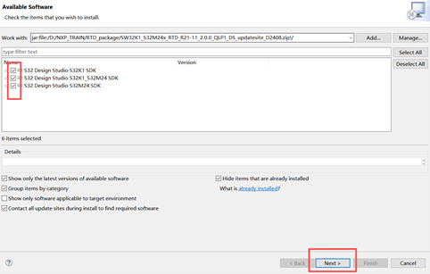

4. 点击Next开始安装。

   Click Next to start installation.

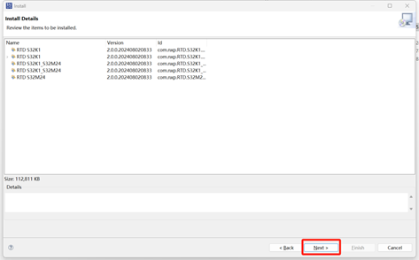

5. 等待补丁安装完成，点击Finish。

   Wait for patch installation completion and click Finish.

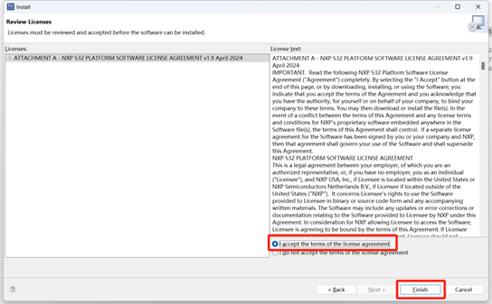

重新启动S32 Design Studio验证补丁是否生效。可在Help > About中查看当前IDE版本和补丁信息。

Restart S32 Design Studio to verify whether the patch takes effect. Check the current IDE version and patch information via Help > About.

1.9 BSW配置工具获取（Acquisition of BSW Configuration Tool）
------------------------------------------------------------------------------------------------------------------------------------------------------------------------------------------------------------------------------------------------------------------------------

1. 申请普华ORIENTAIS Configurator工具软件（for 开源小满）：https://register.easyxmen.com/welcome.html?channel=3。

   Apply for iSOFT ORIENTAIS Configurator software (for EasyXMen) via the link: https://register.easyxmen.com/welcome.html?channel=3.

2. 审核通过后，邮件收到下载链接（含BSW配置工具和示例工程）以及BSW配置工具License。

   After application approval, users will receive download links via email (including BSW configuration tool and example projects), and the license of the BSW configuration tool.

1.10 BSW配置工具安装（Installation of BSW Configuration Tool）
------------------------------------------------------------------------------------------------------------------------------------------------------------------------------------------------------------------------------------------------------------------------------

1.10.1 安装前须知（Pre-installation Notes）
~~~~~~~~~~~~~~~~~~~~~~~~~~~~~~~~~~~~~~~~~~~~~~~~~~~~~~~~~~~~~~~~~~~~~~~~~~~~~~~~~~~~~~~~~~~~~~~~~~~~~~~~~~~~~~~~~~~~~~~~~~~~~~~~~~~~~~~~~~~~~~~~~~~~~~~~~~~~~~~~~~~~~~~~~~~

1. 安装盘符建议：请勿将工具安装于C盘。C盘通常为系统盘，Windows操作系统安装于此，且Windows对C盘的读写权限控制较为严格。

   Recommended installation drive letter: Do not install the tool on drive C. Drive C is generally the system disk where the Windows operating system is installed, and Windows implements strict read and write permission control over Drive C.

2. 安装路径要求：若工具安装于D盘，请勿使用默认路径。需将安装路径修改为“D:\iSoft\ORIENTAIS_Configurator_for_EasyXMen<版本号>”。安装路径应尽可能简短，也可直接设置为“D:\ORIENTAIS_Configurator_for_EasyXMen<版本号>”。不应将工具安装至包含中文字符或空格的文件夹中，也不应安装至层级过深的目录。具体原因请参见第3点。

   Installation path requirements: If installing the tool on Drive D, do not use the default installation path. It is required to modify the installation path to "D:\iSoft\ORIENTAIS_Configurator_for_EasyXMen<version number>". The installation path shall be kept as short as possible, and may also be directly set to "D:\ORIENTAIS_Configurator_for_EasyXMen<version number>". The tool shall not be installed into folders containing Chinese characters or spaces, nor into directories with excessively deep hierarchy. Refer to Item 3 for detailed reasons.

3. 工作区位置说明：请勿将工作区创建在工具安装目录之外。通常应将其创建在工具安装路径内，例如：“D:\iSoft\ORIENTAIS_Configurator_for_EasyXMen<版本号>\workspace”。曾有用户将工作区置于工具外部，且路径中包含中文字符、空格以及过深的层级，导致工具出现间歇性卡死。经分析，本工具基于Java开发，Java包名本身为保持层次清晰而包含多级目录。若再叠加用户工作区过深的层级，整个路径长度可能超出Java访问配置文件的限制，致使配置文件无法访问，从而引起工具卡死。用户遵照本建议创建工作区后，该问题未再出现。

   Workspace location specification: Do not create the workspace outside the tool installation path. Normally it shall be created inside the tool installation path, for example: "D:\iSoft\ORIENTAIS_Configurator_for_EasyXMen<version number>\workspace". Some users previously placed the workspace outside the tool directory, with paths containing Chinese characters, spaces and overly deep directory levels, resulting in intermittent tool freeze. Upon analysis, this tool is developed based on Java, and Java package names adopt multi-level directories to maintain clear hierarchy. If an overly deep hierarchy of the user workspace is added additionally, the total path length may exceed Java’s limit for accessing configuration files, which makes configuration files inaccessible and further causes tool freeze. This problem no longer occurs after users create the workspace in compliance with this recommendation.

4. 多工程管理建议：在满足以上三项建议的前提下，若工作区中创建了多个Project，可右键单击Project名称，在弹出菜单中选择“Close Project”以关闭不使用的工程。需要使用时，再通过“Open Project”将其打开。建议工作区中始终保持仅打开一个Project。这是由于Project处于打开状态时，工程内的所有arxml文件会被自动加载至内存。若工程较为复杂、配置数据量较大，将占用可观的内存与CPU处理时间，容易导致工具卡顿。关闭不使用的Project后，其所占用的内存与CPU资源会被释放，工具运行将更为流畅。

   Multi-project management suggestion: On the premise of complying with the above three suggestions, if multiple projects are created in one workspace, right-click the project name and select "Close Project" from the pop-up menu to close unused projects. The closed projects can be opened later via "Open Project". It is recommended to keep only one project open in the workspace at all times. When a project is open, all arxml files inside this project will be automatically loaded into memory. Complex projects with massive configuration data will occupy considerable memory and CPU resources and easily lead to tool lagging. Closing unused projects releases occupied memory and CPU resources and improves the running smoothness of the tool.

1.10.2 安装步骤（Installation Steps）
~~~~~~~~~~~~~~~~~~~~~~~~~~~~~~~~~~~~~~~~~~~~~~~~~~~~~~~~~~~~~~~~~~~~~~~~~~~~~~~~~~~~~~~~~~~~~~~~~~~~~~~~~~~~~~~~~~~~~~~~~~~~~~~~~~~~~~~~~~~~~~~~~~~~~~~~~~~~~~~~~~~~~~~~~~~

1. 解压下载的安装包，找到安装程序，双击安装程序，启动安装向导。

   Extract the downloaded installation package, locate the installer and double-click it to launch the installation wizard.

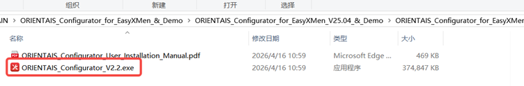

2. 选择安装语言。

   Select installation language.

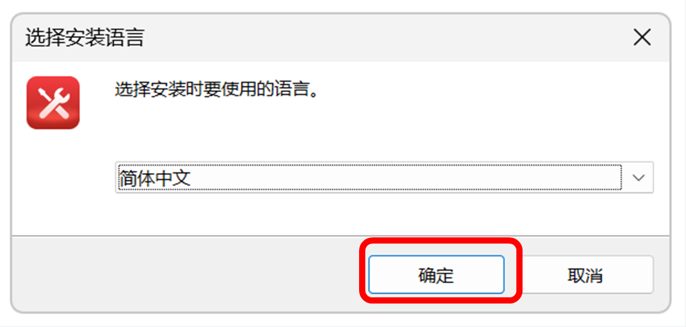

3. 选择安装目录（建议不要包含中文路径），阅读并接受许可协议。

   Specify the installation directory (paths with Chinese characters are not recommended), read and accept the license agreement.

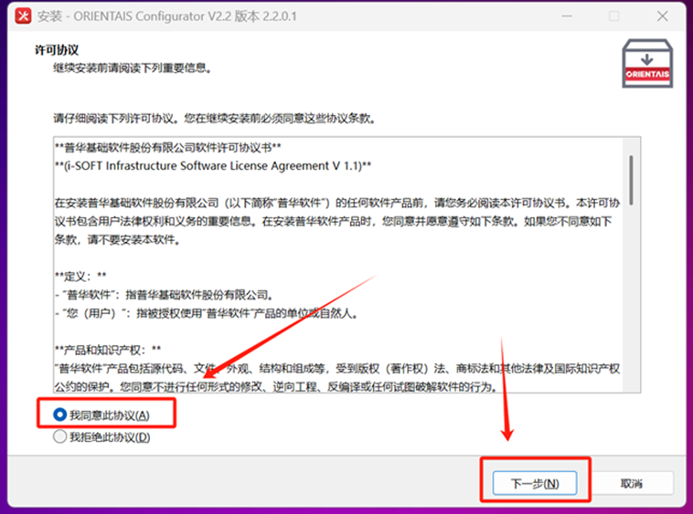

4. 等待安装完成，点击Finish结束安装，安装界面如下图所示：

   Wait until installation completes and click Finish to exit installation; the corresponding installation interface is shown below:

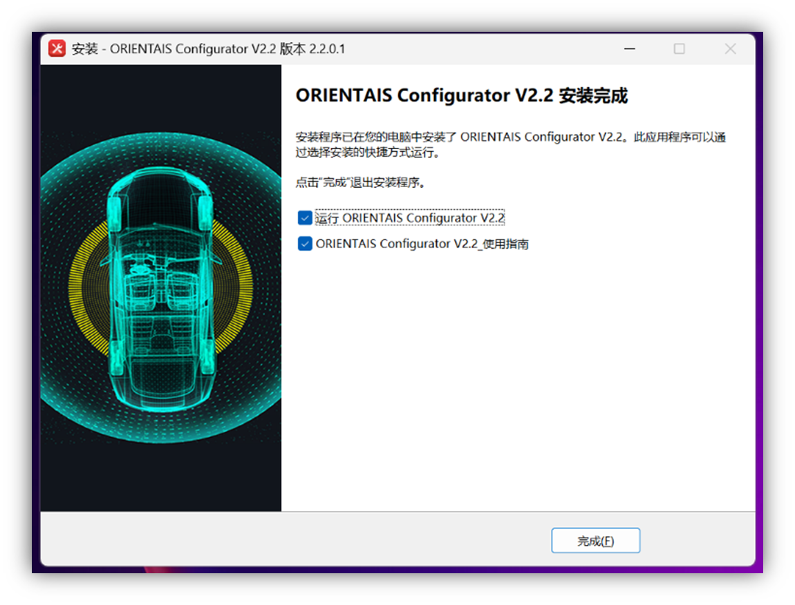

安装完成后，在开始菜单或桌面可找到ORIENTAIS Configurator for EasyXMen快捷方式。

After installation, the shortcut of ORIENTAIS Configurator for EasyXMen can be found in the Start menu or on the desktop.

2 BSW配置工具编译调试（Compilation and Debugging of BSW Configuration Tool）
======================================================================================================================================================================================================================

2.1 MCAL工程导入与校验生成配置代码（MCAL Project Import, Validation and Configuration Code Generation）
------------------------------------------------------------------------------------------------------------------------------------------------------------------------------------------------------------------------------------------------------------------------------

将MCAL配置工程导入EB工具并生成配置代码的流程：

Process of importing the MCAL configuration project into EB tool and generating configuration code:

1. 打开EB tresos Studio。

   Launch EB tresos Studio.

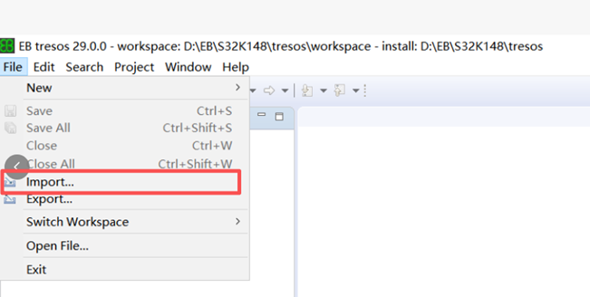

2. 选择File > Import > Existing Projects into Workspace。

   Select File > Import > Existing Projects into Workspace.

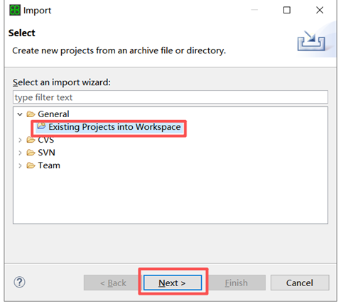

3. 浏览选择Demo_S32K148_ASR470_MCAL_V200_QLP1_ConfigProject工程目录，勾选工程后点击Finish完成导入。

   Browse and select the directory of Demo_S32K148_ASR470_MCAL_V200_QLP1_ConfigProject, check the project and click Finish to finish import.

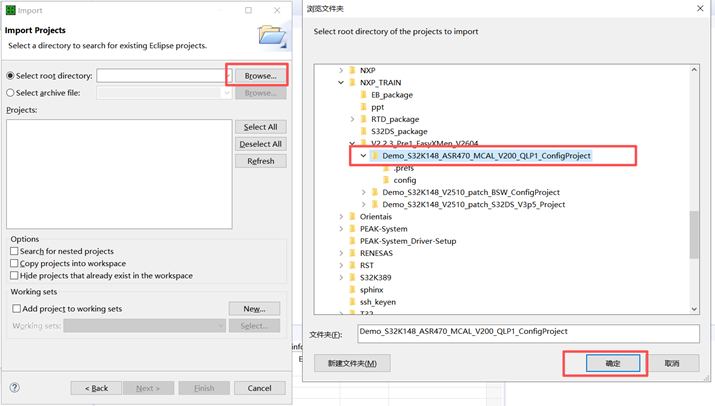

4. 在Project Explorer中双击工程名称打开配置界面。

   Double-click the project name in Project Explorer to open the configuration page.

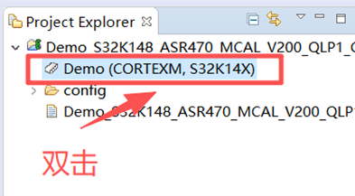

5. 根据需要修改MCAL各模块的配置参数。

   Modify configuration parameters of each MCAL module as required.

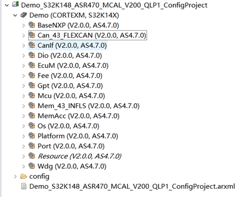

6. 点击工具栏的验证按钮（或按F5）进行工程校验，校验通过后点击生成按钮（Generate）生成配置代码。

   Click the Verify button on the toolbar (or press F5) to run project validation; after validation passes, click the Generate button to generate configuration code.

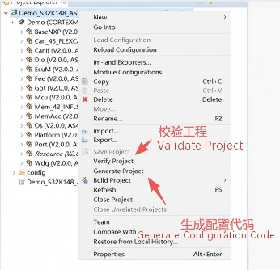

7. 生成的代码位于工程目录的output文件夹中。

   Generated codes are stored under the output folder inside the project directory.

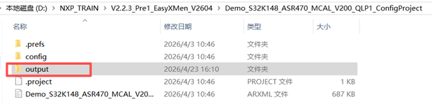

2.2 BSW配置工具功能简介（2.2 Brief Introduction to Functions of BSW Configuration Tool）
-----------------------------------------------------------------------------------------------------------------------------------------------------------------------------------------------------------------------------------------------------------------------------------

导入已有BSW配置工程的方法

Procedures to import an existing BSW configuration project:

1. 选择File > Import > Existing Project。

   Select File > Import > Existing Project.

2. 浏览选择已有的BSW配置工程目录。

   Browse and select the root directory of the target existing BSW configuration project.

3. 选择需要导入的工程，点击Finish。

   Select the project to import and click Finish.

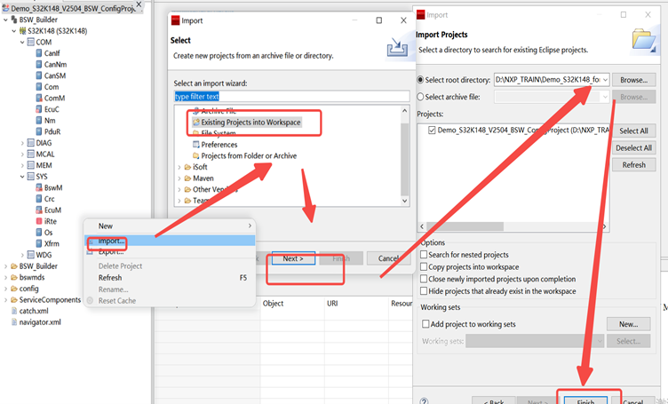

工程导入后可在Project Explorer中查看工程结构。

The project structure can be checked in Project Explorer after import completes.

向工程中添加AUTOSAR功能模块：

Procedures to add AUTOSAR functional modules into a project:

1. 在Autosar Explorer视图中右键点击工程名称。

   Right-click the project name in the Autosar Explorer view.

2. 选择Add Module打开模块选择对话框。

   Select Add Module to open the module selection dialog box.

3. 从列表中选择需要添加的模块（可多选）。

   Select required modules from the list (multiple selection supported).

4. 点击OK确认添加，模块将显示在工程树中。

   Click OK to confirm addition; the added modules will display on the project tree.

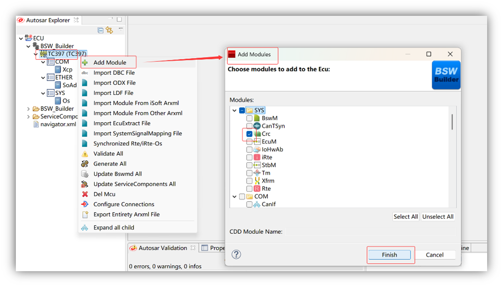

从工程中删除AUTOSAR功能模块：

Procedures to delete AUTOSAR functional modules from a project:

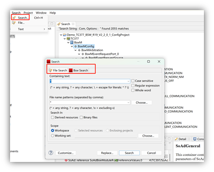

在BSW配置工具中可以查看和导入MCAL配置信息：在工程树中找到MCAL配置节点，双击MCAL节点可打开MCAL配置查看界面，可以浏览MCAL各模块（Port、Dio、Adc等）的配置参数。

Users can view and import MCAL configuration information in the BSW configuration tool: Locate the MCAL configuration node on the project tree, double-click this node to open the MCAL configuration view page and browse configuration parameters of each MCAL module such as Port, Dio and Adc.

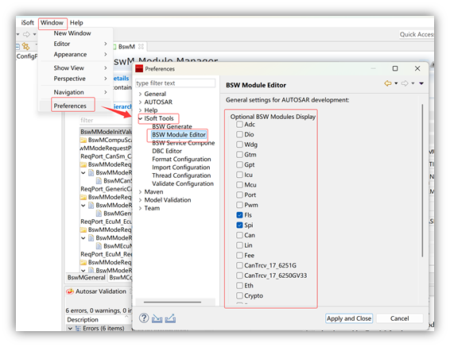

注意：打开MCAL配置后会参与整体工程校验，确保MCAL配置与BSW配置的一致性。

Note: Opening MCAL configuration will trigger full-project validation to guarantee consistency between MCAL configuration and BSW configuration.

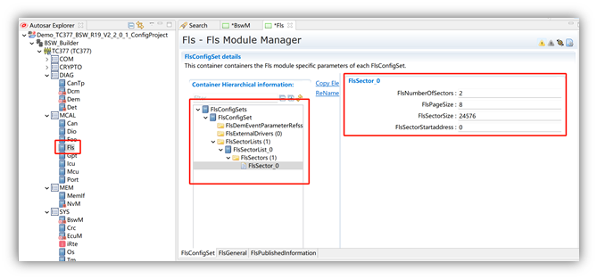

对于支持服务封装的模块，可以生成服务层组件代码：在工程树中右键点击支持服务封装的模块，选择Generate Service Wrapper选项，在弹出的对话框中配置服务接口参数，点击Generate生成服务封装代码。

For modules supporting service encapsulation, users can generate codes of service layer components: Right-click the target module supporting service encapsulation on the project tree, select the Generate Service Wrapper option, configure service interface parameters in the popped dialog box and click Generate to generate service wrapper codes.

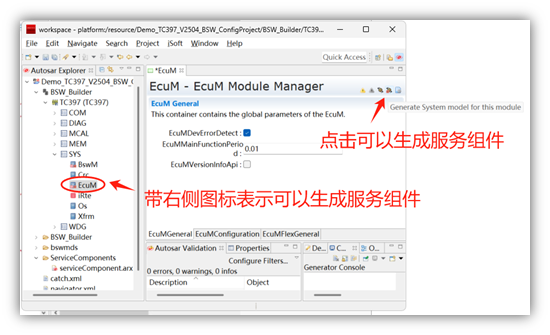

服务封装功能可将底层BSW接口封装为标准化服务接口，便于上层应用软件的调用和集成。

The service encapsulation function encapsulates underlying BSW interfaces into standardized service interfaces to facilitate invocation and integration of upper-layer application software.

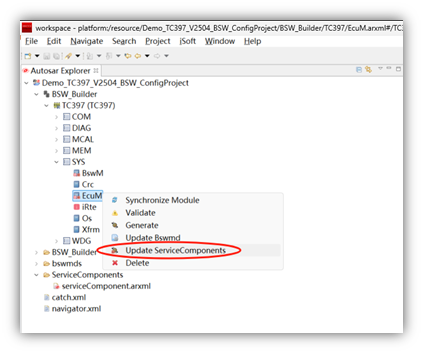

2.2.1 与MCAL配置信息的交互（Interaction with MCAL Configuration Information）
~~~~~~~~~~~~~~~~~~~~~~~~~~~~~~~~~~~~~~~~~~~~~~~~~~~~~~~~~~~~~~~~~~~~~~~~~~~~~~~~~~~~~~~~~~~~~~~~~~~~~~~~~~~~~~~~~~~~~~~~~~~~~~~~~~~~~~~~~~~~~~~~~~~~~~~~~~~~~~~~~~~~~~~~~~~

2.2.1.1 与EB工具交互（Interaction with EB Tool）
**************************************************************************************************************************************************************************************************************************************************************************************************

从EB tresos导出MCAL配置并导入BSW配置工具的流程：在EB tresos中打开MCAL配置工程，右键点击MCAL配置中的ECU节点，选择Im- and Exporter > Export，选择导出格式为ARXML，设置导出路径，点击OK完成导出。

Process of exporting MCAL configuration from EB tresos and importing into BSW configuration tool: Open the MCAL configuration project in EB tresos, right-click the ECU node under MCAL configuration, select Im- and Exporter > Export, choose ARXML as export format, set export path and click OK to finish export.

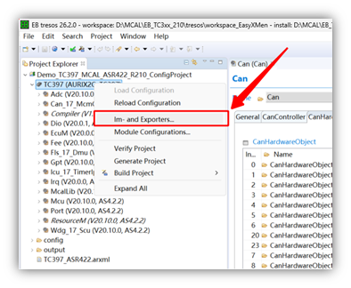

EB tresos导出MCAL配置的ARXML文件界面如下图所示：

The interface for exporting MCAL configuration ARXML file via EB tresos is shown below:

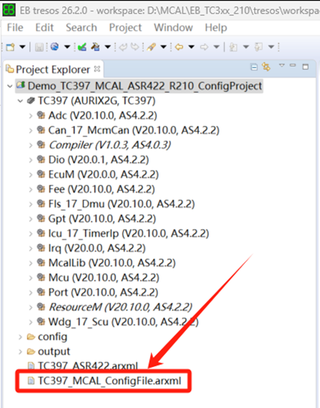

打开BSW配置工具，右键点击Project，选择Import Module From Other Arxml，选择从EB导出的ARXML文件，点击OK导入。导入的MCAL配置信息将显示在工程树中。

Launch the BSW configuration tool, right-click Project, select Import Module From Other Arxml, choose the ARXML file exported from EB tresos and click OK to finish import. Imported MCAL configuration information will display on the project tree.

2.2.1.2 与Davinci工具交互（Interaction with DaVinci Tool）
**************************************************************************************************************************************************************************************************************************************************************************************************

从DaVinci Configurator导出配置并导入BSW配置工具：在DaVinci中打开工程，选择File > Export > Export ARXML，选择导出内容和目标路径，在小满配置工具中选择Import > ARXML File导入。

Export configuration from DaVinci Configurator and import to BSW configuration tool: Open the target project in DaVinci, select File > Export > Export ARXML, specify export contents and target path; in EasyXMen configuration tool, select Import > ARXML File to finish import.

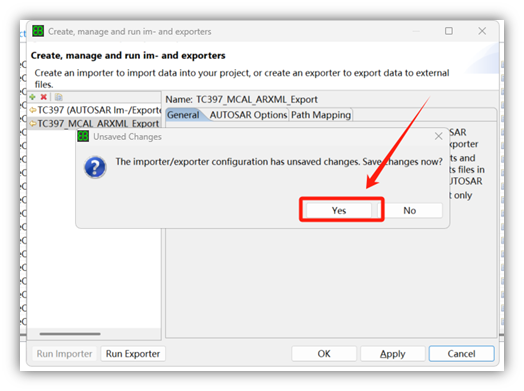

2.3 示例工程演示（Example Project Demonstration）
-----------------------------------------------------------------------------------------------------------------------------------------------------------------------------------------------------------------------------------------------------------------------------------

2.3.1 示例工程说明（Example Project Description）
~~~~~~~~~~~~~~~~~~~~~~~~~~~~~~~~~~~~~~~~~~~~~~~~~~~~~~~~~~~~~~~~~~~~~~~~~~~~~~~~~~~~~~~~~~~~~~~~~~~~~~~~~~~~~~~~~~~~~~~~~~~~~~~~~~~~~~~~~~~~~~~~~~~~~~~~~~~~~~~~~~~~~~~~~

S32K148示例工程包含以下文件和内容：

The S32K148 example project contains the following files and contents:

.. list-table::
   :widths: 20 20 
   :header-rows: 1

   * - 文件/目录名称(File/Directory Name)
     - 说明(Description)
   * - Demo_S32K148_ASR470_MCAL_V200_QLP1_ConfigProject
     - MCAL配置工程（EB工具）(MCAL configuration project (EB Tool))
   * - Demo_S32K148_V2510_patch_BSW_ConfigProject
     - BSW配置工程（BSW配置工具）(BSW configuration project (BSW configuration tool))
   * - Demo_S32K148_V2510_patch_S32DS_V3p5_Project
     - MCAL+BSW集成示例工程（S32DS）(Integrated MCAL+BSW example project (S32DS))
   * - 示例工程说明(Example project description)
     - S32K148示例工程配置说明文档(Configuration description document of S32K148 example project)

建议按照以下顺序使用示例工程：首先查看示例工程说明文档了解工程整体结构和功能；打开并编译MCAL配置工程验证MCAL配置正确；打开并编译BSW配置工程验证BSW配置正确；最后编译集成工程，生成可烧录的目标文件。

Recommended operation sequence for using the example project: First read the example project description document to learn the overall structure and functions of the project; open and compile the MCAL configuration project to verify the validity of MCAL configuration; open and compile the BSW configuration project to verify the validity of BSW configuration; finally compile the integrated project to generate programmable target files.

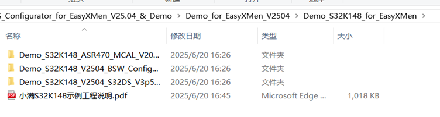

2.3.2 示例BSW配置工程导入及编译（Import and Compilation of Example BSW Configuration Project）
~~~~~~~~~~~~~~~~~~~~~~~~~~~~~~~~~~~~~~~~~~~~~~~~~~~~~~~~~~~~~~~~~~~~~~~~~~~~~~~~~~~~~~~~~~~~~~~~~~~~~~~~~~~~~~~~~~~~~~~~~~~~~~~~~~~~~~~~~~~~~~~~~~~~~~~~~~~~~~~~~~~~~~~~~~~~~~~~~~~~~~~~~~~~~~~~

导入和编译BSW配置工程的步骤：

Steps to import and compile the example BSW configuration project:

1. 启动ORIENTAIS Configurator配置工具，选择File > Import > Existing Project。

   Start ORIENTAIS Configurator and select File > Import > Existing Project.

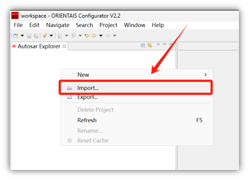

2. 浏览选择Demo_S32K148_V2510_patch_BSW_ConfigProject目录。

   Browse and select the directory of Demo_S32K148_V2510_patch_BSW_ConfigProject.

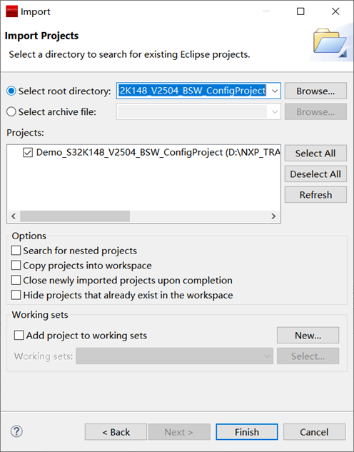

3. 导入完成后在工程树中查看各模块配置。

   Check configuration parameters of each module on the project tree after import finishes.

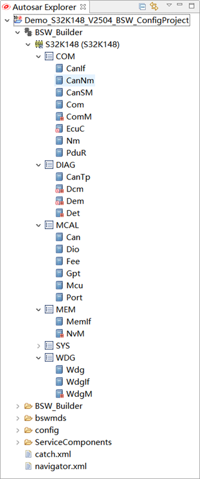

4. 点击Validate All校验工程配置。

   Click Validate All to validate the project configuration.

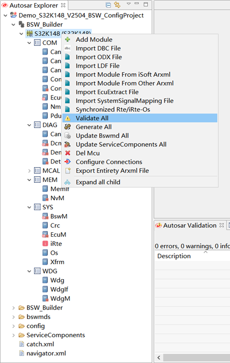

5. 校验通过后编译工程或生成配置代码。

   Compile the project or generate configuration codes after validation passes.

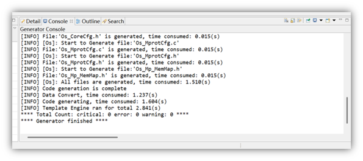

2.3.3 BSW配置工程代码生成（Code Generation from BSW Configuration Project）
~~~~~~~~~~~~~~~~~~~~~~~~~~~~~~~~~~~~~~~~~~~~~~~~~~~~~~~~~~~~~~~~~~~~~~~~~~~~~~~~~~~~~~~~~~~~~~~~~~~~~~~~~~~~~~~~~~~~~~~~~~~~~~~~~~~~~~~~~~~~~~~~~~~~~~~~~~~~~~~~~~~~~~~~~~~~~~~~~~~~~~~~~~~~~~~~

从BSW配置工程生成代码的步骤：确保BSW配置工程已导入且校验通过；点击工具栏的Generate All按钮；在弹出的对话框中确认代码生成选项；选择代码输出目录（或保持默认）；等待代码生成完成，查看Console中的生成日志；在输出目录中检查生成的.c和.h文件。

Steps to generate codes from BSW configuration project: Confirm the BSW configuration project is imported and fully validated; click the Generate All button on the toolbar; confirm code generation options in the popped dialog box; select code output directory (or keep default setting); wait for code generation completion and check generation logs in Console; verify generated .c and .h files under the output directory.

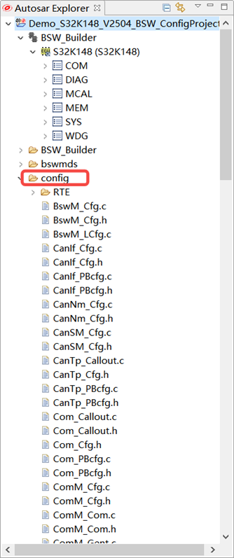

3 示例工程编译调试（Compilation and Debugging of Example Project）
=======================================================================================================================================================================

3.1 示例工程导入编译（Import and Compilation of Example Project）
-----------------------------------------------------------------------------------------------------------------------------------------------------------------------------------------------------------------------------------------------------------------------------------

将集成工程导入S32DS并编译的步骤：

Steps to import the integrated project into S32DS and perform compilation:

1. 启动S32 Design Studio。

   Launch S32 Design Studio.

2. 右键导入过的工程，点击Build。

   Right-click the imported project and click Build.

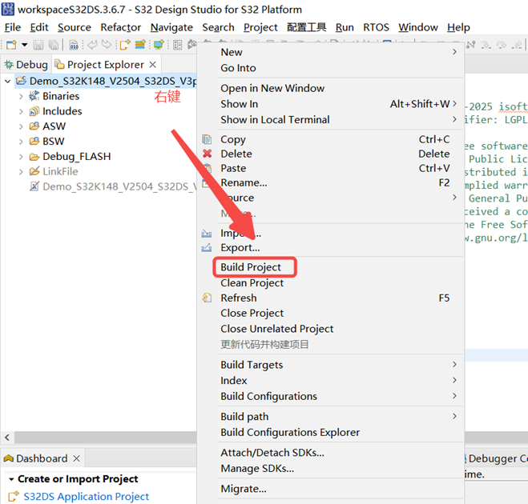

3. 等待编译完成，确认Console中没有错误。

   Wait for compilation completion and confirm no errors exist in Console.

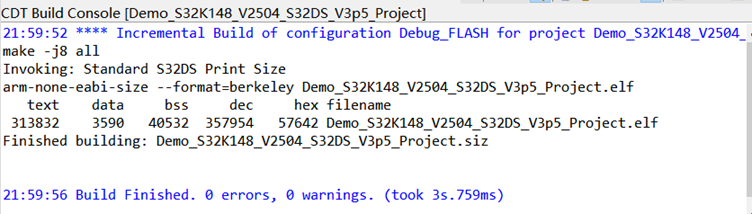

编译生成的.hex或.elf文件位于Debug目录中。

The .hex or .elf files generated by compilation are located in the Debug directory.

3.2 硬件环境（Hardware Environment）
-----------------------------------------------------------------------------------------------------------------------------------------------------------------------------------------------------------------------------------------------------------------------------------

进行示例工程调试需要准备以下硬件环境：

Prepare the following hardware environment for example project debugging:

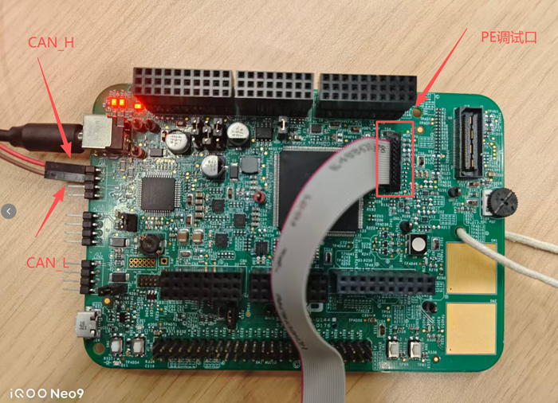

硬件连接步骤：将S32K148EVB开发板放置在绝缘的工作台上；使用USB线连接开发板的USB接口和电脑；确认开发板电源指示灯亮起（绿色LED）；如需CAN通信测试，连接CAN工具到开发板的CAN接口。

Hardware connection steps: Place the S32K148EVB development board on an insulated workbench; connect the USB port of the development board to PC via USB cable; confirm the power indicator on the development board lights up (green LED); connect CAN tool to the CAN interface of the development board if CAN communication test is required.

3.3 在线调试（Online Debugging）
-----------------------------------------------------------------------------------------------------------------------------------------------------------------------------------------------------------------------------------------------------------------------------------

使用S32DS进行在线调试的步骤：

Steps for online debugging with S32DS:

1. 确保开发板已通过USB连接到电脑且驱动正常安装。

   Confirm the development board is connected to PC via USB with corresponding device driver installed properly.

2. 在S32DS中打开集成工程。

   Open the integrated project in S32DS.

3. 点击工具栏的Debug按钮（或按F11）启动调试。

   Click the Debug button on toolbar (or press F11) to start debugging.

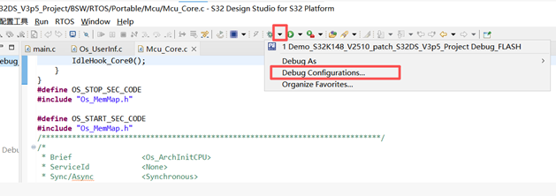

4. 在弹出的对话框中选择调试器类型（PEMicro或J-Link）。

   Select debugger type (PEMicro or J-Link) in the popped dialog box.

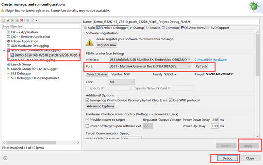

5. 等待程序下载到开发板并自动运行到main函数。

   Wait for the program to be downloaded to the development board and automatically run to the main function.

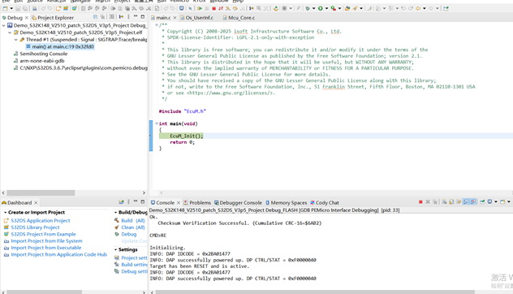

6. 使用单步执行（F6）、断点、变量查看等功能进行调试。

   Perform debugging using functions such as single-step execution (F6), breakpoints and variable viewing.

常见问题排查：如果无法连接开发板，检查USB驱动是否正确安装；确认Debug配置中选择的调试器与实际硬件匹配；检查开发板跳线帽设置是否正确（参考开发板用户手册）。

Troubleshooting for common faults: If you fail to connect the development board, check whether the USB driver is installed correctly; confirm that the debugger selected in the Debug configuration matches the actual hardware; check whether the jumper cap settings of the development board are correct (refer to the development board user manual).

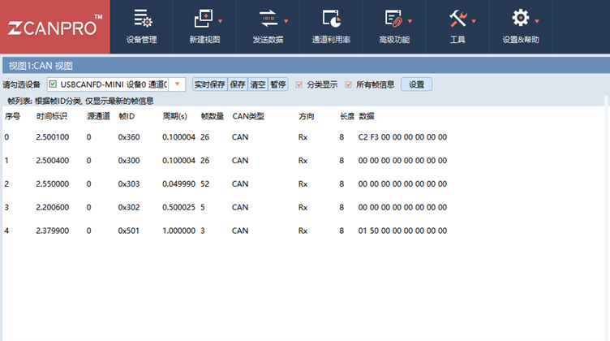

4 社区问题反馈（Feedback on Community Issues）
=======================================================================================================================================================================

在使用开源小满的过程中，如果遇到问题或有任何建议，欢迎前往 `项目主页 <https://atomgit.com/easyxmen>`__ 找到对应的仓库提交Issue。

If you encounter any problems or have any suggestions while using EasyXMen, you are welcome to submit issues in the corresponding repositories via `Project Homepage <https://atomgit.com/easyxmen>`__.