===================
TC397
===================

1 开发环境准备
===================================

主要工具和环境说明

.. list-table::
   :widths: 20 20 
   :header-rows: 1

   * - 工具描述
     - 名称/版本
   * - 编译器和IDE
     - Hightec For Tricore V4.9.4.1
   * - EB工具
     - EB tresos Studio 26.2.0
   * - MCAL
     - MC-ISAR_AS422_TC3xx _2.10.0
   * - 硬件开发板
     - Application Kit TC3X7 V2.0

1.1 MCAL编译器和IDE获取
---------------------------------------------

 `Hightec For Tricore V4.9.4.1获取网站 <https://hightec-rt.com/>`__ 

 `EB.tresos Studio 26.2.0获取网站 <https://www.elektrobit.cn/>`__ 

 `芯片厂网站 <https://www.infineon.cn/?utm_campaign=202507_gc_cn_cp.b.branding&utm_medium=sem&utm_source=baidu_searchad&utm_content=_&utm_term=&uid=ci56620001&aid=ai5662&sdclkid=AL2615FG1526b6DRxg&bd_vid=11792938164491894888&gad_source=7&gad_campaignid=21818698728&gclid=COzF2eitxJQDFW2TrAId_IQDqw&gclsrc=ds>`__ 

开发环境需用户自行获取

1.2 BSW配置工具的获取
---------------------------------------------

1. 申请普华ORIENTAIS Configurator工具软件（for 开源小满）：https://register.easyxmen.com/welcome.html?channel=3。	

2. 审核通过后，邮件收到下载链接（含BSW配置工具和示例工程）以及BSW配置工具License。

1.3 BSW配置工具安装
---------------------------------------------

1.3.1 安装前须知
~~~~~~~~~~~~~~~~~~~~~~~~~~~~~~~~~~~~~~~~~~~~~~~~~~~~~~~~~

1. 安装盘符建议：请勿将工具安装于C盘。C盘通常为系统盘，Windows操作系统安装于此，且Windows对C盘的读写权限控制较为严格。

2. 安装路径要求：若工具安装于D盘，请勿使用默认路径。需将安装路径修改为“D:\iSoft\ORIENTAIS_Configurator_for_EasyXMen<版本号>”。安装路径应尽可能简短，也可直接设置为“D:\ORIENTAIS_Configurator_for_EasyXMen<版本号>”。不应将工具安装至包含中文字符或空格的文件夹中，也不应安装至层级过深的目录。具体原因请参见第3点。

3. 工作区位置说明：请勿将工作区创建在工具安装目录之外。通常应将其创建在工具安装路径内，例如：“D:\iSoft\ORIENTAIS_Configurator_for_EasyXMen<版本号>\workspace”。曾有用户将工作区置于工具外部，且路径中包含中文字符、空格以及过深的层级，导致工具出现间歇性卡死。经分析，本工具基于Java开发，Java包名本身为保持层次清晰而包含多级目录。若再叠加用户工作区过深的层级，整个路径长度可能超出Java访问配置文件的限制，致使配置文件无法访问，从而引起工具卡死。用户遵照本建议创建工作区后，该问题未再出现。

4. 多工程管理建议：在满足以上三项建议的前提下，若工作区中创建了多个Project，可右键单击Project名称，在弹出菜单中选择“Close Project”以关闭不使用的工程。需要使用时，再通过“Open Project”将其打开。建议工作区中始终保持仅打开一个Project。这是由于Project处于打开状态时，工程内的所有arxml文件会被自动加载至内存。若工程较为复杂、配置数据量较大，将占用可观的内存与CPU处理时间，容易导致工具卡顿。关闭不使用的Project后，其所占用的内存与CPU资源会被释放，工具运行将更为流畅。

1.3.2 安装步骤
~~~~~~~~~~~~~~~~~~~~~~~~~~~~~~~~~~~~~~~~~~~~~~~~~~~~~~~~~

1. 解压下载的安装包，找到安装程序，双击安装程序，启动安装向导。

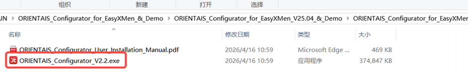

2. 选择安装语言。

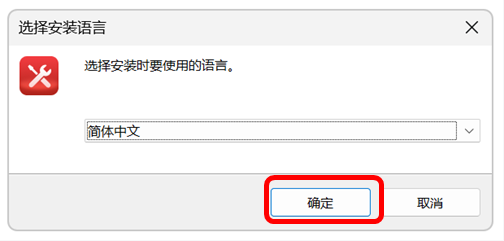

3. 选择安装目录（建议不要包含中文路径），阅读并接受许可协议。

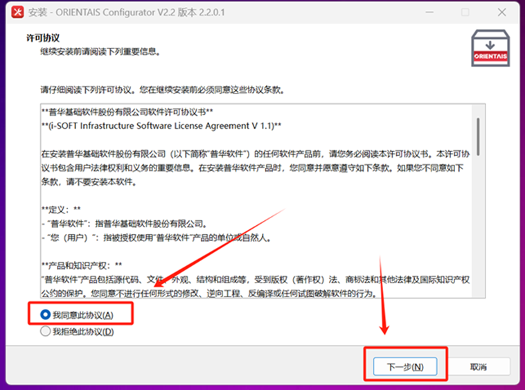

4. 等待安装完成，点击Finish结束安装，安装界面如下图所示：

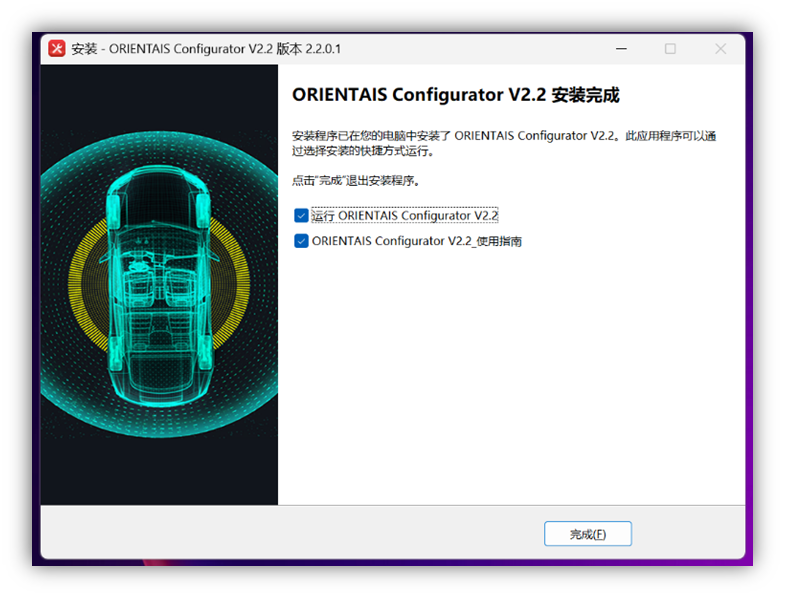

安装完成后，在开始菜单或桌面可找到ORIENTAIS Configurator for EasyXMen快捷方式。

2 BSW配置工具编译调试
========================================================================================================================

2.1 BSW配置工具功能简介
-------------------------------------------------------

导入已有BSW配置工程的方法：

1. 选择File > Import > Existing Project。

2. 浏览选择已有的BSW配置工程目录。

3. 选择需要导入的工程，点击Finish。

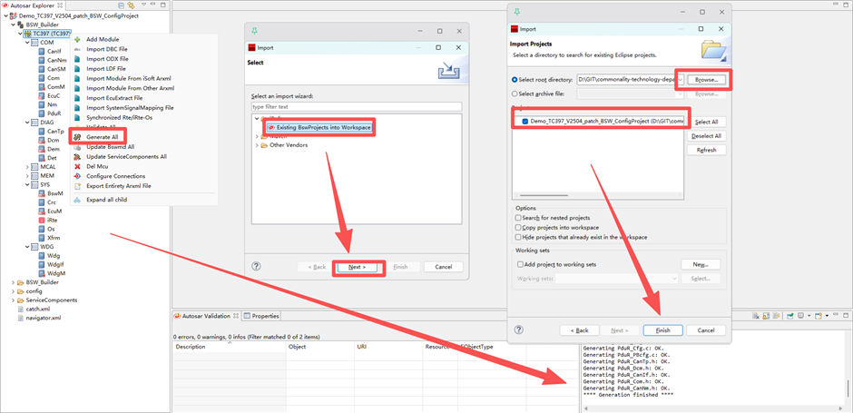

工程导入后可在Project Explorer中查看工程结构。

向工程中添加AUTOSAR功能模块：

1. 在Autosar Explorer视图中右键点击工程名称。

2. 选择Add Module打开模块选择对话框。

3. 从列表中选择需要添加的模块（可多选）。

4. 点击OK确认添加，模块将显示在工程树中。

.. figure:: ../../../_static/快速上手指南(Quick_Start_Guide)/TC397/2_1_2.png
   :align: center

从工程中删除AUTOSAR功能模块：

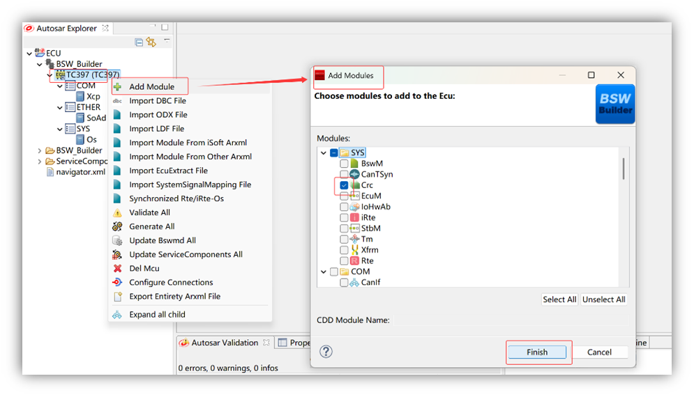

在BSW配置工具中可以查看和导入MCAL配置信息：在工程树中找到MCAL配置节点，双击MCAL节点可打开MCAL配置查看界面，可以浏览MCAL各模块（Port、Dio、Adc等）的配置参数。

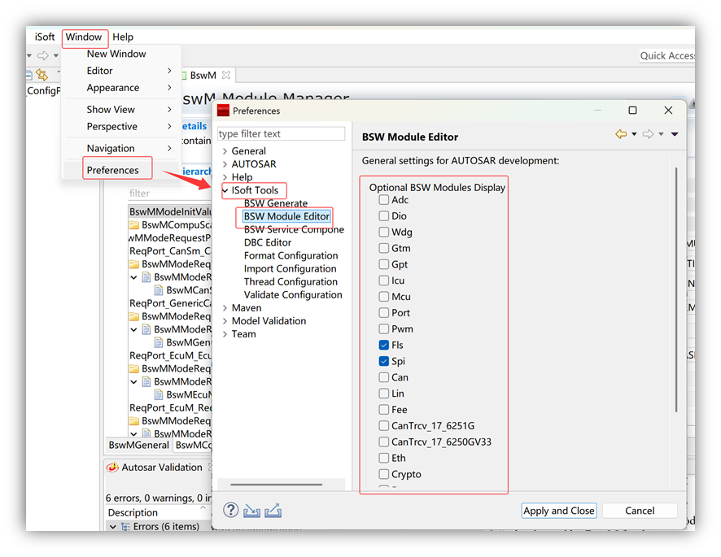

注意：打开MCAL配置后会参与整体工程校验，确保MCAL配置与BSW配置的一致性。

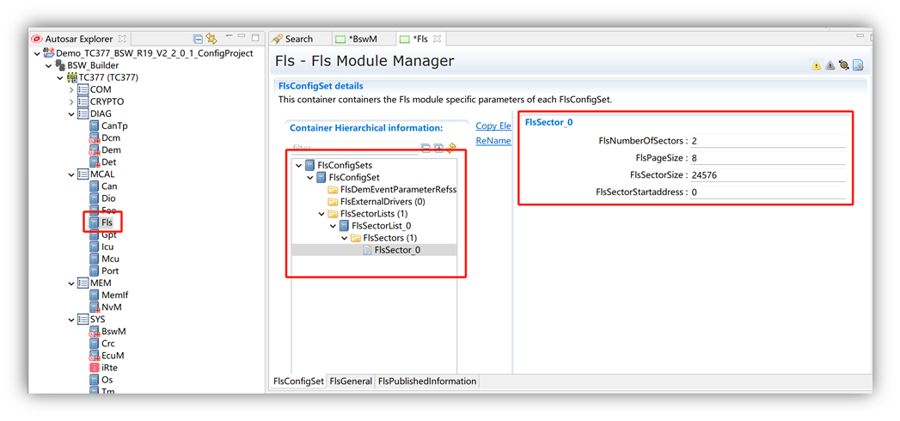

对于支持服务封装的模块，可以生成服务层组件代码：在工程树中右键点击支持服务封装的模块，选择Generate Service Wrapper选项，在弹出的对话框中配置服务接口参数，点击Generate生成服务封装代码。

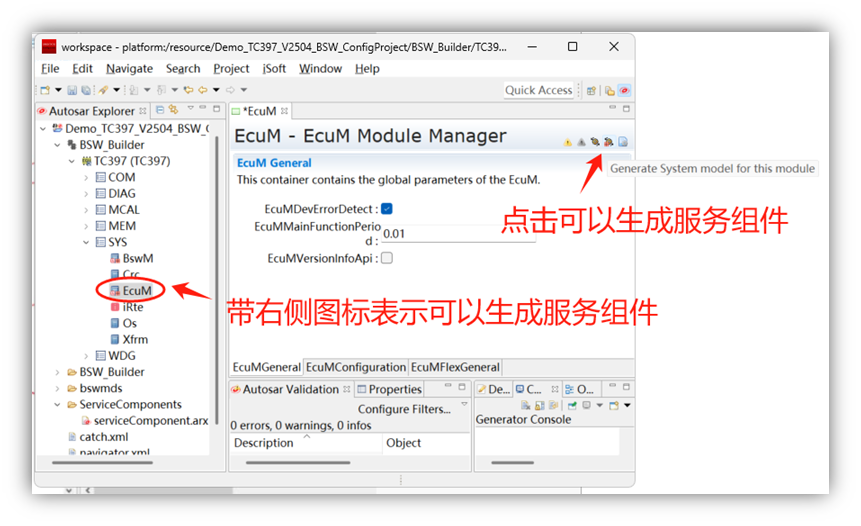

服务封装功能可将底层BSW接口封装为标准化服务接口，便于上层应用软件的调用和集成。

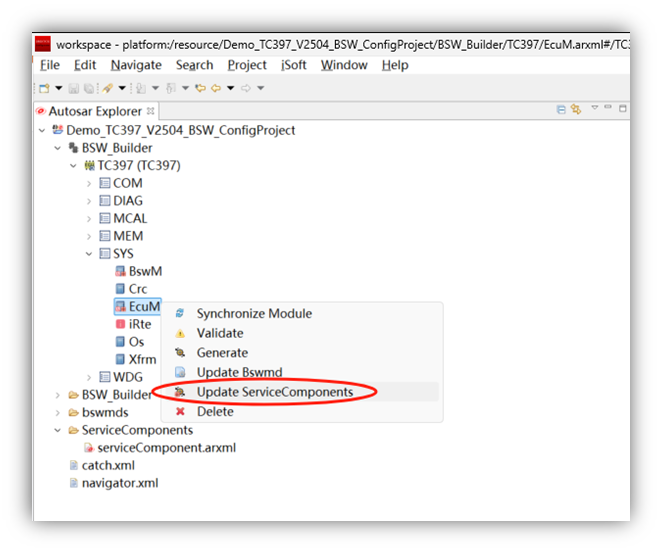

2.1.1 与MCAL配置信息的交互
~~~~~~~~~~~~~~~~~~~~~~~~~~~~~~~~~~~~~~~~~~~~~~~~

2.1.1.1 与EB工具交互
************************************************

从EB tresos导出MCAL配置并导入BSW配置工具的流程：在EB tresos中打开MCAL配置工程，右键点击MCAL配置中的ECU节点，选择Im- and Exporter > Export，选择导出格式为ARXML，设置导出路径，点击OK完成导出。

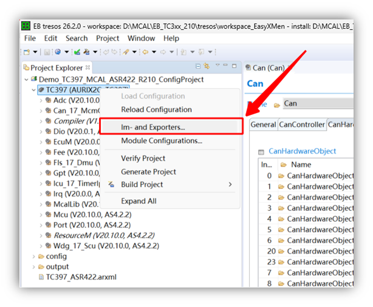

EB tresos导出MCAL配置的ARXML文件界面如下图所示：

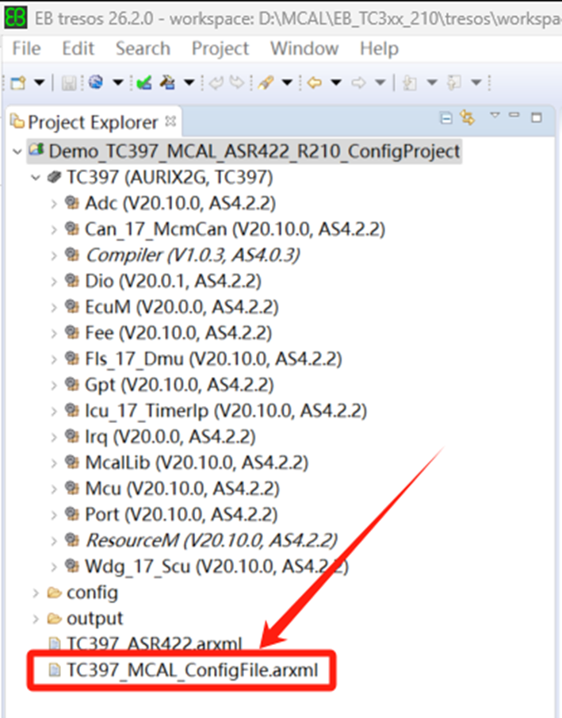

打开BSW配置工具，右键点击Project，选择Import Module From Other Arxml，选择从EB导出的ARXML文件，点击OK导入。导入的MCAL配置信息将显示在工程树中。

2.1.1.2 与Davinci工具交互
************************************************

从DaVinci Configurator导出配置并导入BSW配置工具：在DaVinci中打开工程，选择File > Export > Export ARXML，选择导出内容和目标路径，在BSW配置工具中选择Import > ARXML File导入。

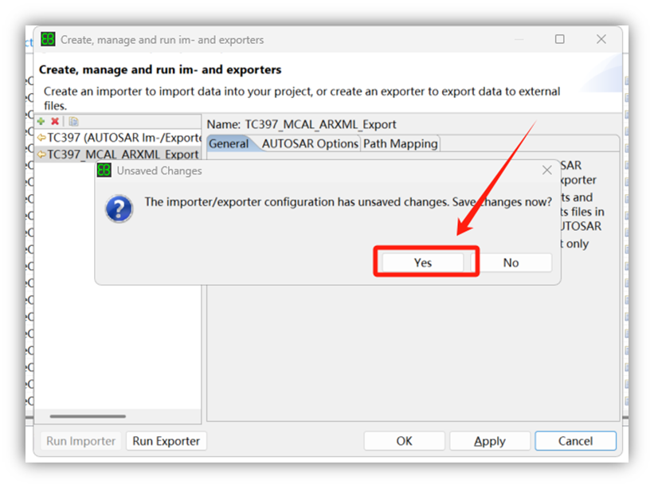

2.2 示例工程演示
-------------------------------------------------------

2.2.1 示例工程说明
~~~~~~~~~~~~~~~~~~~~~~~~~~~~~~~~~~~~~~~~~~~~~~~~

TC397示例工程包含以下文件和内容：

.. list-table::
   :widths: 20 20 
   :header-rows: 1

   * - 文件/目录名称
     - 说明
   * - Demo_TC397_MCAL_ASR422_R210_ConfigProject
     - MCAL配置工程（EB工具）
   * - Demo_TC397_V2504_patch_BSW_ConfigProject
     - BSW配置工程（BSW配置工具）
   * - Demo_TC397_V2504_patch_HighTec_V4941_Project
     - MCAL+BSW集成示例工程（Hightec For Tricore V4.9.4.1）
   * - 示例工程说明
     - TC397示例工程配置说明文档

建议按照以下顺序使用示例工程：首先查看示例工程说明文档了解工程整体结构和功能；打开并编译MCAL配置工程验证MCAL配置正确；打开并编译BSW配置工程验证BSW配置正确；最后编译集成工程，生成可烧录的目标文件。

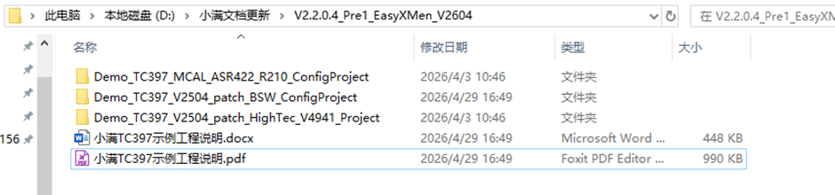

2.2.2 示例BSW配置工程导入及编译
~~~~~~~~~~~~~~~~~~~~~~~~~~~~~~~~~~~~~~~~~~~~~~~~

导入和编译BSW配置工程的步骤：

1. 启动ORIENTAIS Configurator配置工具，选择File > Import > Existing Project。

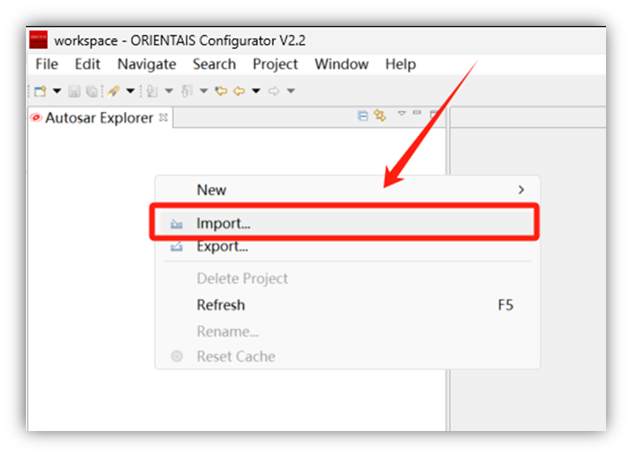

2. 浏览选择Demo_RH850_U2A16_V2504_patch_BSW_ConfigProject目录。

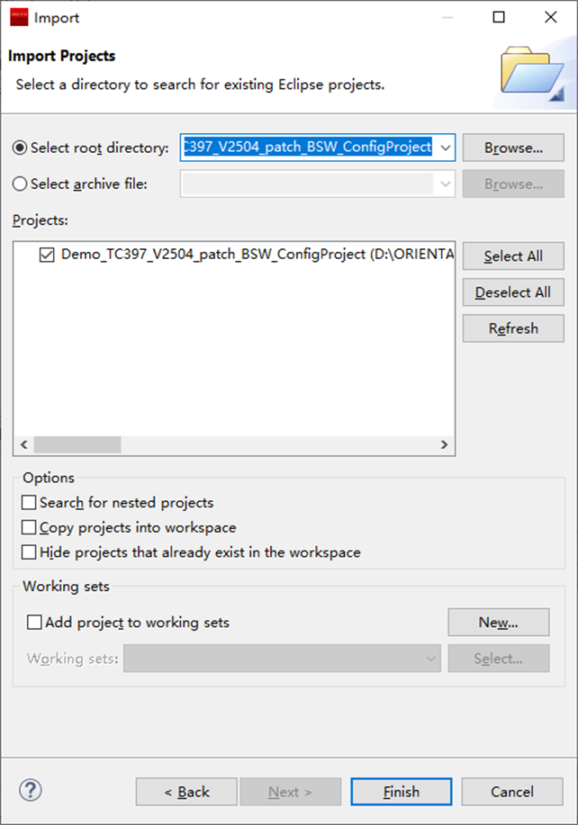

3. 导入完成后在工程树中查看各模块配置。

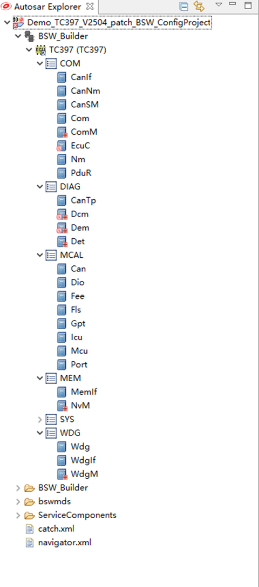

4. 点击Validate All校验工程配置。

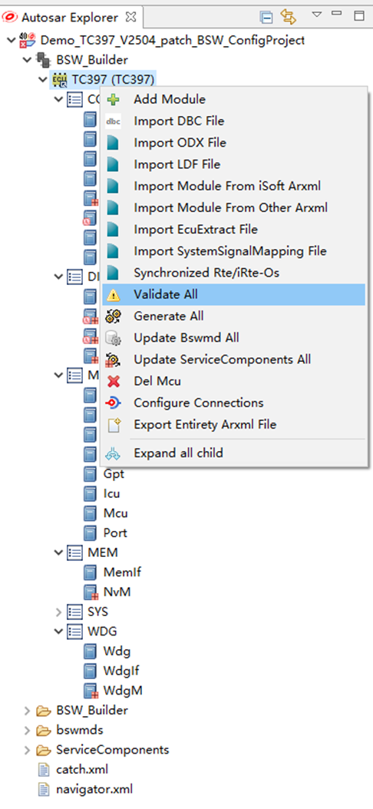

5. 校验通过后编译工程或生成配置代码。

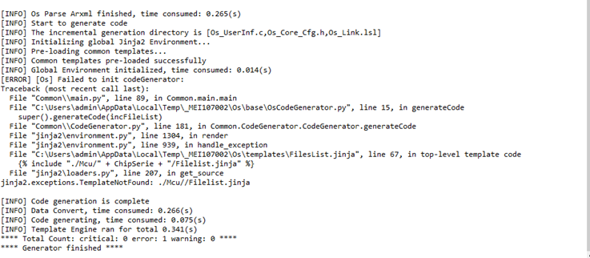

2.2.3 BSW配置工程代码生成
~~~~~~~~~~~~~~~~~~~~~~~~~~~~~~~~~~~~~~~~~~~~~~~~

从BSW配置工程生成代码的步骤：确保BSW配置工程已导入且校验通过；点击工具栏的Generate All按钮；在弹出的对话框中确认代码生成选项；选择代码输出目录（或保持默认）；等待代码生成完成，查看Console中的生成日志；在输出目录中检查生成的.c和.h文件。

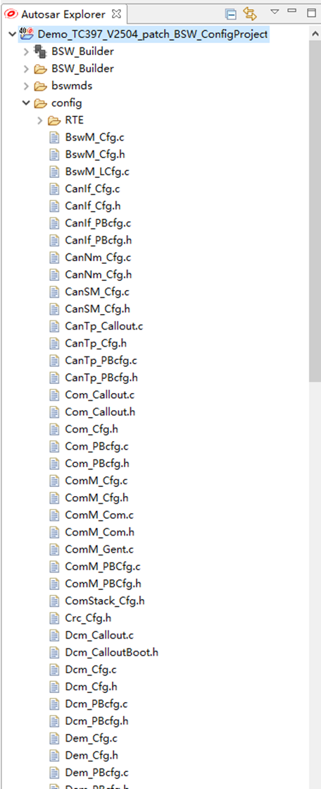

3 示例工程编译调试
========================================================================================================================

3.1 示例工程导入编译
-------------------------------------------------------

将集成工程导入Hightec For Tricore并编译的步骤：

1. 打开文件进行编译

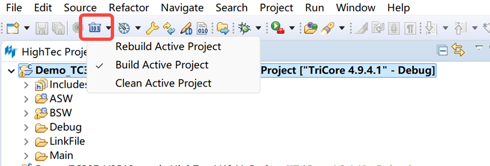

3.2 硬件环境
-------------------------------------------------------

进行示例工程调试需要准备以下硬件环境：

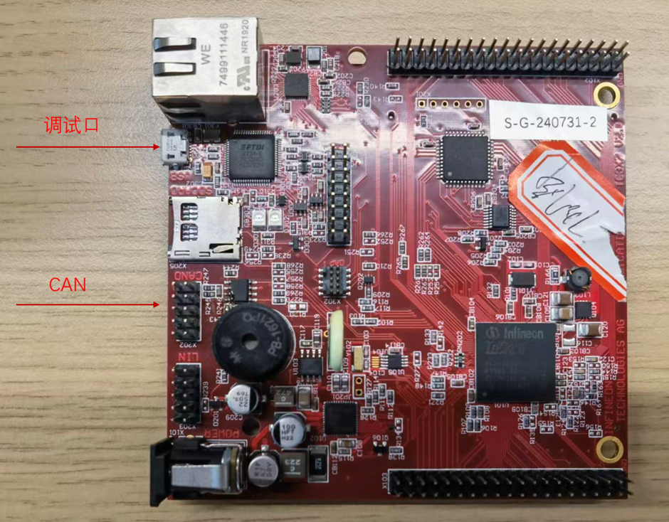

硬件连接步骤：将TC397开发板放置在绝缘的工作台上；使用USB线连接开发板的USB接口和电脑；确认开发板电源指示灯亮起（绿色LED）；如需CAN通信测试，连接CAN工具到开发板的CAN接口。
3.3 在线调试
-------------------------------------------------------

使用UDE STK 5.0进行在线调试的步骤：

1. 确保开发板已通过USB连接到电脑且驱动正常安装。

2. 在Hightec For Tricore中打开集成工程。

3. 在UDE STK 5.0中进行调试。

.. figure:: ../../../_static/快速上手指南(Quick_Start_Guide)/TC397/3_3_1.png
   :align: center

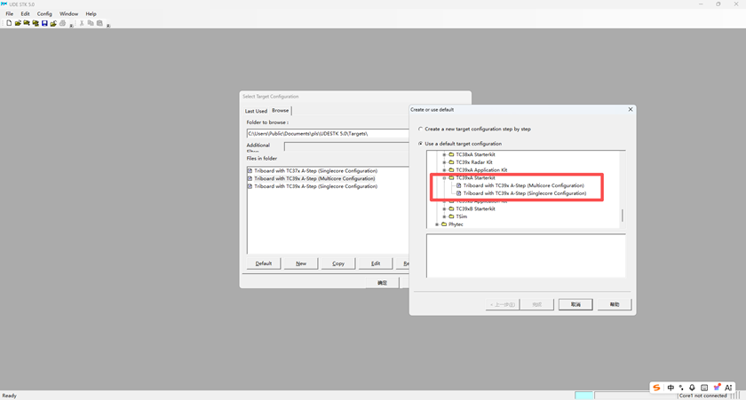

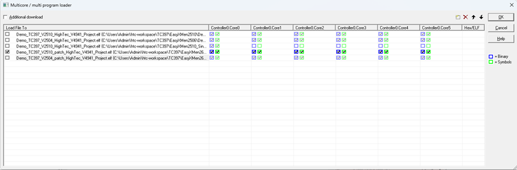

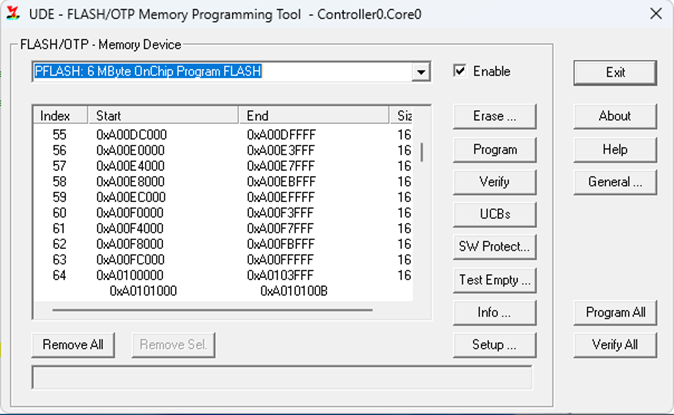

.. figure:: ../../../_static/快速上手指南(Quick_Start_Guide)/TC397/3_3_5.png
   :align: center

4. 等待程序连接下载到开发板。

5. 使用单步执行（F11）、断点、变量查看等功能进行调试。

常见问题排查：如果无法连接开发板，检查USB驱动是否正确安装；确认Debug配置中选择的调试器与实际硬件匹配；检查开发板跳线帽设置是否正确（参考开发板用户手册）。

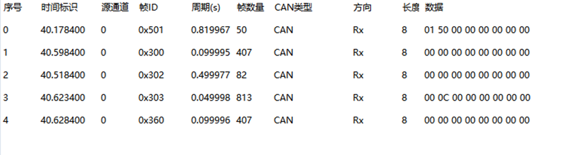

4 社区问题反馈
========================================================================================================================

在使用开源小满的过程中，如果遇到问题或有任何建议，欢迎前往 `项目主页 <https://atomgit.com/easyxmen>`__ 找到对应的仓库提交Issue。 