====================================================================================================
示例工程工程说明（Demo Project Description）
====================================================================================================

1 基本信息（Basic Information）
================================================================================================================================================================

1.1 简介（Brief Introduction）
------------------------------------------------------------------------------------------------------------------------------------------------------------------------------------------------------------------------------------------------------------------------------------------------

工程集成的AUTOSAR协议栈有CAN通信、诊断、网络管理、存储、看门狗、OS。各个模块均提供了参考的配置示例，旨在指导用户快速熟悉AUTOSAR中各个协议栈的模块的基本配置以及各个模块间的关联关系。

The AUTOSAR protocol stack integrated in this project includes CAN communication, diagnosis, network management, storage, watchdog and OS. Each module provides reference configuration examples, with the purpose of guiding users to quickly familiarize themselves with basic configuration of modules of each protocol stack in AUTOSAR and the relationship between modules.

1.2 术语与简写（Terms and Abbreviations）
----------------------------------------------------------------------------------------------------------------------------------------------------------------------------------------------------------------------------------------------------------------------------------------------------------------

1.2.1 术语（Terms）
~~~~~~~~~~~~~~~~~~~~~~~~~~~~~~~~~~~~~~~~~~~~~~~~~~~~~~~~~~~~~~~~~~~~~~~~~~~~~~~~~~~~~~~~~~~~~~~~~~~~~~~~~~~~~~~~~~~~~~~~~~~~~~~~~~~~~~~~~~~~~~~~~~~~~~~~~~~~~~~~~~~~~~~~~~~

.. list-table::
   :widths: 20 20
   :header-rows: 1

   * - 术语 (Term)
     - 解释 (Explanation)
   * - AUTOSAR CP
     - AUTOSAR Classic Platform，面向实时性要求高的嵌入式控制单元（ECU）的软件架构标准，定义分层软件架构和标准化接口（AUTOSAR Classic Platform, a software architecture standard for Embedded Control Units (ECUs) with high real-time requirements, defining layered software architecture and standardized interfaces）
   * - PDU (Protocol Data Unit)
     - 协议数据单元，软件模块间传递的数据包单位。在AUTOSAR中分为L-PDU、N-PDU、I-PDU等不同层级（Protocol Data Unit, the unit of data packets transmitted between software modules. In AUTOSAR, it is divided into L-PDU, N-PDU, I-PDU and other types for different layers）
   * - DID (Data Identifier)
     - 数据标识符，UDS诊断服务中用于标识特定数据对象的ID，通过DID可以读写ECU内部数据（Data Identifier, an ID used to identify specific data objects in UDS diagnostic services. Data inside the ECU can be read and written via DID）
   * - DTC (Diagnostic Trouble Code)
     - 诊断故障码，用于标识ECU检测到的故障类型，格式遵循ISO 14229-1规范（Diagnostic Trouble Code, used to identify fault types detected by the ECU. The format complies with ISO 14229-1 specification）
   * - PN (Partial Networking)
     - 部分网络功能，允许ECU仅在与自身相关的网络管理报文存在时保持唤醒，其余时间进入休眠以降低功耗（Partial Networking, allowing an ECU to stay awake only when network management messages relevant to itself exist, and enter sleep mode in other periods to reduce power consumption）
   * - E2E (End-to-End Communication Protection)
     - 端到端通信保护，通过在发送方添加CRC、Counter等校验信息，在接收方校验，保障通信数据的完整性（End-to-End Communication Protection. The sender appends verification information such as CRC and Counter, and verification is performed on the receiver side to guarantee the integrity of communication data）
   * - Update Bit (UB)
     - 更新标志位，置于信号组中表明对应信号是否已更新，接收方通过UB位判断信号值的有效性（Update Bit, placed in a signal group to indicate whether the corresponding signal has been updated. The receiver judges the validity of signal values via the UB）
   * - NvM Block
     - NVRAM Manager管理的最小存储单元，每个Block对应一块非易失性数据的存储配置（Minimum storage unit managed by the NVRAM Manager. Each Block corresponds to storage configuration for a piece of non-volatile data）

1.2.2 简写（Abbreviations）
~~~~~~~~~~~~~~~~~~~~~~~~~~~~~~~~~~~~~~~~~~~~~~~~~~~~~~~~~~~~~~~~~~~~~~~~~~~~~~~~~~~~~~~~~~~~~~~~~~~~~~~~~~~~~~~~~~~~~~~~~~~~~~~~~~~~~~~~~~~~~~~~~~~~~~~~~~~~~~~~~~~~~~~~~~~~~~~~~~~~~~~~~~~~~~~~~~~~~~~~~~~~~~~~~~~~~~~~~~~~~~~~~~~~

.. list-table::
   :widths: 20 40 20
   :header-rows: 1

   * - 简写 (Abbreviation)
     - 全称 (Full name)
     - 解释 (Explanation)
   * - UDS
     - Unified Diagnostic Services
     - 统一的诊断服务
   * - CAN
     - Controller Area Network
     - 控制器局域网络
   * - NM
     - Network Management
     - 网络管理
   * - CanIf
     - CAN Interface
     - CAN 接口模块
   * - CanSm
     - CAN State Manager
     - CAN 状态管理模块
   * - ComM
     - Communication Manager
     - 通信管理模块
   * - EcuM
     - ECU State Manager
     - ECU 状态管理模块
   * - NvM
     - NVRAM Manager
     - 非易失性存储管理
   * - FEE
     - Flash EEPROM Emulation
     - Flash 模拟Eep
   * - DCM
     - Diagnostic Communication Manager
     - 诊断通信管理
   * - DEM
     - Diagnostic Event Manager
     - 诊断事件管理
   * - CANTP
     - CAN Transport Layer
     - CAN 传输层
   * - WDG
     - Watchdog
     - 看门狗
   * - WdgIf
     - Watchdog Interface
     - 看门狗接口模块
   * - WdgM
     - Watchdog Manager
     - 看门狗管理模块
   * - E2E
     - End-to-End Communication Protection
     - (End-to-End)通信安全协议
   * - OS
     - Operating System
     - 操作系统

2 协议栈配置说明（Protocol Stack Configuration Description）
========================================================================================================================================================================================================

2.1 CAN通信协议栈（CAN Communication Protocol Stack）
------------------------------------------------------------------------------------------------------------------------------------------------------------------------------------------------------------------------------------------------------------------------------------------------------------------------

2.1.1 CAN通信协议栈概述（Overview of CAN Communication Protocol Stack）
~~~~~~~~~~~~~~~~~~~~~~~~~~~~~~~~~~~~~~~~~~~~~~~~~~~~~~~~~~~~~~~~~~~~~~~~~~~~~~~~~~~~~~~~~~~~~~~~~~~~~~~~~~~~~~~~~~~~~~~~~~~~~~~~~~~~~~~~~~~~~~~~~~~~~~~~~~~~~~~~~~~~~~~~~~~~~~~~~~~~~~~~~~~~~~~~~~~~~~~~~~~~~~~~~~~~~~~~~~~~~~~~~~~~

CAN通信协议栈涉及到的软件模块主要有CAN、CanIf、PduR、Com、EcuC模块，其中各个模块的主要功能如下表：

The software modules involved in CAN communication protocol stack mainly include CAN, CanIf, PduR, Com, and EcuC modules, and the main functions of each module are shown in the table below:

.. list-table::
   :widths: 15 85
   :header-rows: 1

   * - 模块名（Module Name）
     - 功能（Function）
   * - Can
     - 主要配置 CAN 控制器的波特率，CAN 报文的收发邮箱（Mainly configure the baud rate of CAN controller, and the email for sending and receiving CAN messages.）
   * - CanIf
     - CanIf 模块主要处理上层模块与底层驱动的之间 PDU 的传递，为上层模块提供统一的接口来管理不同的 CAN 硬件模块（The CanIf module mainly handles the transmission of PDU between upper-level modules and underlying drivers, providing a unified interface for upper-level modules to manage different CAN hardware modules.）
   * - EcuC
     - 用于辅助配置工具完成配置的模块。主要提供 Pdu 的定义，其它模块通过关联 EcuC 中 Pdu，相互关联起来（A module used to assist configuration tools in completing configuration. Mainly provide the definition of Pdu, and other modules are interrelated by associating Pdu in EcuC.）
   * - PduR
     - PDU Router 主要为通讯接口模块（CANIF）、传输协议模块（CAN TP、J1939 TP）、诊断通讯管理模块（DCM、J1939DCM）以及通讯模块（COM、LDCOM）以及 IPDUM、SECOC 等模块提供基于 I-PDU 的路由服务。（PDU Router mainly provides I-PDU-based routing services for communication interface modules (CANIF), transmission protocol modules (CAN TP, J1939 TP), diagnostic communication management modules (DCM, J1939DCM), communication modules (COM, LDCOM), IPDUM, and SECOC modules.）
   * - Com
     - COM 模块主要提供 I-PDU 和信号相关管理功能（The COM module mainly provides management functions related to I-PDUs and signals.）

2.1.2 CAN通信协议栈配置功能说明（Description of CAN Communication Protocol Stack Configuration Functions）
~~~~~~~~~~~~~~~~~~~~~~~~~~~~~~~~~~~~~~~~~~~~~~~~~~~~~~~~~~~~~~~~~~~~~~~~~~~~~~~~~~~~~~~~~~~~~~~~~~~~~~~~~~~~~~~~~~~~~~~~~~~~~~~~~~~~~~~~~~~~~~~~~~~~~~~~~~~~~~~~~~~~~~~~~~~~~~~~~~~~~~~~~~~~~~~~~~~~~~~~~~~~~~~~~~~~~~~~~~~~~~~~~~~~

CAN通信协议栈配置的发送报文说明：

Description of sending messages of CAN communication protocol stack configuration:

.. list-table::
   :widths: 35 15 50
   :header-rows: 1

   * - 报文名(Message Name)
     - CANID
     - 说明(Description)
   * - CAN0_Tx_0x300_Cyclic
     - 0x300
     - 周期报文，周期时间：500ms，该报文下的信号均配有 UB 位(Cyclic message, cycle time: 500ms; The signals under this message are all provided with UB bit)
   * - CAN0_Tx_0x301_Event
     - 0x301
     - 事件报文(Event message)
   * - CAN0_Tx_0x302_Mixed
     - 0x302
     - 混合报文，正常周期：500ms，触发后连发 3 帧，周期为：50ms(Mixed message, normal cycle: 500ms, triggered to send 3 consecutive frames, cycle: 50ms)
   * - CAN0_Tx_0x303_Cyclic_Counter
     - 0x303
     - 周期报文，周期时间：500ms，带RollingCounter(Cyclic message, cycle time: 500ms, with RollingCounter)
   * - CAN0_Tx_0x350_Cyclic_PN17
     - 0x350
     - 周期报文，周期时间：100ms，受 PN17 控制(Cyclic message, cycle time: 100ms; Controlled by PN17)
   * - CAN0_Tx_0x351_Cyclic_PN29
     - 0x351
     - 周期报文，周期时间：100ms，受 PN29 控制(Cyclic message, cycle time: 100ms; Controlled by PN29)
   * - CAN0_Tx_0x360_E2E_P01
     - 0x360
     - 周期报文，周期时间：100ms，E2E 报文，DATAID：0x1234(Cyclic message, cycle time: 100ms; E2E message, DATAID: 0x1234)

CAN通信协议栈配置的接收报文说明：

Description of receiving messages of CAN communication protocol stack configuration:

.. list-table::
   :widths: 35 15 50
   :header-rows: 1

   * - 报文名(Message Name)
     - CANID
     - 说明(Description)
   * - CAN0_Rx_0x200_Cyclic
     - 0x200
     - 周期报文，周期时间：500ms，该报文下的信号均配有 UB 位(Cyclic message, cycle time: 500ms; The signals under this message are all provided with UB bit)
   * - CAN0_Rx_0x201_Event
     - 0x201
     - 事件报文(Event message)
   * - CAN0_Rx_0x202_Mixed
     - 0x202
     - 混合报文，正常周期：500ms，触发后连发 3 帧，周期为：50ms，包含信号超时 2500ms(Mixed message, normal cycle: 500ms, triggered to send 3 consecutive frames, cycle: 50ms, including 2500ms of signal timeout)
   * - CAN0_Rx_0x203_Cyclic_Counter
     - 0x203
     - 周期报文，周期时间：500ms，带RollingCounter(Cyclic message, cycle time: 500ms, with RollingCounter)
   * - CAN0_Rx_0x250_Cyclic_PN17
     - 0x250
     - 周期报文，周期时间：100ms，受 PN17 控制(Cyclic message, cycle time: 100ms; Controlled by PN17)
   * - CAN0_Rx_0x251_Cyclic_PN29
     - 0x251
     - 周期报文，周期时间：100ms，受 PN29 控制(Cyclic message, cycle time: 100ms; Controlled by PN29)
   * - CAN0_Rx_0x260_E2E_P01
     - 0x260
     - 周期报文，周期时间：100ms，E2E 报文，DATAID：0x1234(Cyclic message, cycle time: 100ms; E2E message, DATAID: 0x1234)

2.1.3 CAN通信协议栈验证方法说明（Description of CAN Communication Protocol Stack Verification Method）
~~~~~~~~~~~~~~~~~~~~~~~~~~~~~~~~~~~~~~~~~~~~~~~~~~~~~~~~~~~~~~~~~~~~~~~~~~~~~~~~~~~~~~~~~~~~~~~~~~~~~~~~~~~~~~~~~~~~~~~~~~~~~~~~~~~~~~~~~~~~~~~~~~~~~~~~~~~~~~~~~~~~~~~~~~~~~~~~~~~~~~~~~~~~~~~~~~~~~~~~~~~~~~~~~~~~~~~~~~~~~~~~~~~~

1. 使CAN卡和板子进行正确连接；  

   Connect the CAN card and the board correctly;

\

2. 查看周期报文周期是否正常；

   Check whether the cycle of cyclic messages works normally;

   现象：所有周期报文按照配置周期进行周期发送。

   Phenomenon: All cyclic messages are transmitted periodically according to configured cycles.

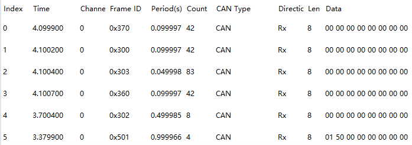

\

3. 查看事件报文 0x301 是否会在收到 0x201 报文后发出；

   Check whether the event message 0x301 is transmitted after receiving message 0x201;

   现象：事件报文会在收到 0x201 后发送 0x301 报文

   Phenomenon: Message 0x301 will be sent upon reception of message 0x201

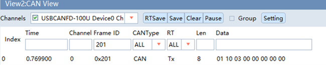

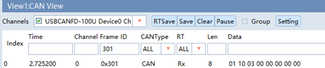

\

4. 查看报文接收是否正常；

   Verify message reception function;

   现象：收到 0x202 报文后，会将信号值从 0x302 转发出去。

   Phenomenon: After receiving message 0x202, signal values will be forwarded via message 0x302.

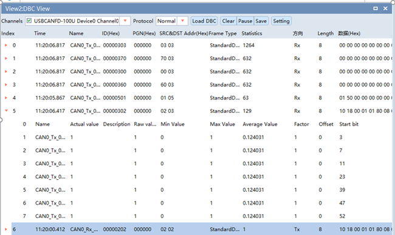

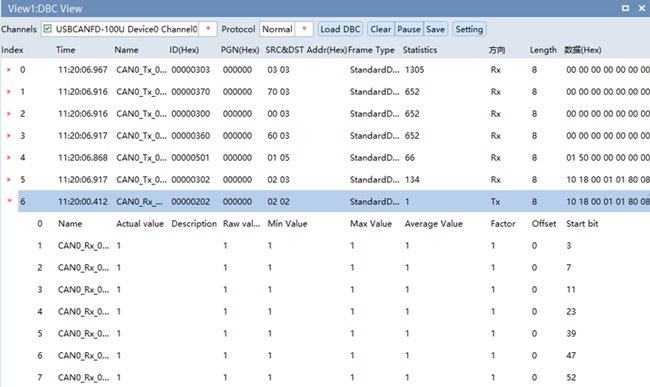

\

2.2 CAN网络管理协议栈（CAN Network Management Protocol Stack）
------------------------------------------------------------------------------------------------------------------------------------------------------------------------------------------------------------------------------------------------------------------------------------------------------------------------------------------------

2.2.1 CAN网络管理协议栈概述（Overview of CAN Network Management Protocol Stack）
~~~~~~~~~~~~~~~~~~~~~~~~~~~~~~~~~~~~~~~~~~~~~~~~~~~~~~~~~~~~~~~~~~~~~~~~~~~~~~~~~~~~~~~~~~~~~~~~~~~~~~~~~~~~~~~~~~~~~~~~~~~~~~~~~~~~~~~~~~~~~~~~~~~~~~~~~~~~~~~~~~~~~~~~~~~~~~~~~~~~~~~~~~~~~~~~~~~~~~~~~~~~~~~~~~~~~~~~~~~~~~~~~~~~

CAN网络管理协议栈涉及到的软件模块主要有Can、CanIf、CanSM、EcuC、NM、CanNm、ComM模块，其中各个模块的主要功能如下表：

The software modules involved in CAN network management protocol stack mainly include Can, CanIf, CanSM, EcuC, NM, CanNm and ComM modules, and the main functions of each module are shown in the table below:

网络管理栈各配置模块介绍

Introduction to Each Configuration Module of the Network Management Stack

.. list-table::
   :widths: 15 85
   :header-rows: 1

   * - 模块名(Module Name)
     - 功能(Function)
   * - Can
     - 主要配置CAN控制器的波特率，CAN报文的收发邮箱。(Mainly configure the baud rate of the CAN controller, and the mailboxes for sending and receiving CAN messages.)
   * - CanIf
     - CanIf模块主要处理上层模块与底层驱动的之间PDU的传递，为上层模块提供统一的接口来管理不同的CAN 硬件模块。(The CanIf module mainly handles the transmission of PDUs between upper-level modules and underlying drivers, providing a unified interface for upper-level modules to manage different CAN hardware modules.)
   * - EcuC
     - 用于辅助配置工具完成配置的模块。主要提供Pdu的定义，其它模块通过关联 EcuC中Pdu，相互关联起来。(A module used to assist configuration tools in completing configuration. It mainly provides the definition of Pdus, and other modules are interrelated by associating Pdus in EcuC.)
   * - Nm
     - NmIf模块主要包含两个功能：NmIf模块是ComM与CanNm之间的适配层；网络管理协调功能，协调不同总线channel的ECU节点实现网络的同步睡眠。(The NmIf module mainly has two functions: it serves as the adaptation layer between ComM and CanNm; and provides the network management coordination function, coordinating ECU nodes of different bus channels to achieve synchronized network sleep.)
   * - ComM
     - ComM模块封装了控制底层的通信服务。通信管理模块从通信请求者那里收集总线通信访问请求，并协调这些请求，主要目的是：为每个Channel设置一个状态机控制一个ECU的多个通信总线通道。(The ComM module encapsulates services that control the underlying communication. The communication management module collects bus communication access requests from communication requesters and coordinates these requests. Its main purpose is to set a state machine for each channel to control multiple communication bus channels of an ECU.)
   * - CanSM
     - 主要功能是与通信硬件抽象层和系统服务层产生交互，为每一个CAN通信总线定义一个总线相关的状态管理，并为相关的总线提供流控制。(Its main function is to interact with the communication hardware abstraction layer and the system service layer, define bus-related state management for each CAN communication bus, and provide flow control for the corresponding bus.)
   * - CanNM
     - 负责实现ECU的状态切换。比如何时进入睡眠、是否保持正常的网络状态等。(It is responsible for implementing ECU state transitions, such as when to enter sleep and whether to maintain the normal network state.)

2.2.2 CAN网络管理协议栈配置说明（Description of CAN Network Management Protocol Stack Configuration）
~~~~~~~~~~~~~~~~~~~~~~~~~~~~~~~~~~~~~~~~~~~~~~~~~~~~~~~~~~~~~~~~~~~~~~~~~~~~~~~~~~~~~~~~~~~~~~~~~~~~~~~~~~~~~~~~~~~~~~~~~~~~~~~~~~~~~~~~~~~~~~~~~~~~~~~~~~~~~~~~~~~~~~~~~~~~~~~~~~~~~~~~~~~~~~~~~~~~~~~~~~~~~~~~~~~~~~~~~~~~~~~~~~~~

CAN网络管理的接收报文ID范围为0x500-0x5ff；

The ID range for receiving messages of CAN network management is 0x500-0x5ff;

CAN网络管理的发送报文ID为0x501；

The ID for sending messages of CAN network management is 0x501;

CanNM的主要配置参数如下表所示：

The main configuration parameters of CanNM are shown in the following table:

.. list-table::
   :widths: 45 25
   :header-rows: 1

   * - 配置项(Configuration Item)
     - 配置参数 (Configuration Parameter)
   * - CanNmGlobalPnSupport
     - TRUE
   * - CanNmComUserDataSupport
     - TRUE
   * - CanNmMainFunctionPeriod
     - 0.005
   * - CanNmPassiveModeEnabled
     - FALSE
   * - CanNmPnEiraCalcEnabled
     - TRUE
   * - CanNmPnResetTime
     - 2.5S
   * - CanNmActiveWakeupBitEnabled
     - TRUE
   * - CanNmCarWakeUpRxEnabled
     - FALSE
   * - CanNmImmediateNmCycleTime
     - 0.02S
   * - CanNmImmediateNmTransmissions
     - 10
   * - CanNmMsgCycleOffset
     - 0.0
   * - CanNmMsgCycleTime
     - 1.0S
   * - CanNmMsgTimeoutTime
     - 0.5S
   * - CanNmNodeId
     - 1
   * - CanNmPduCbvPosition
     - CANNM_PDU_BYTE_1
   * - CanNmPduNidPosition
     - CANNM_PDU_BYTE_0
   * - CanNmPnEnabled
     - TRUE
   * - CanNmPnHandleMultipleNetworkRequests
     - FALSE
   * - CanNmRepeatMessageTime
     - 3.0S
   * - CanNmRetryFirstMessageRequest
     - FALSE
   * - CanNmTimeoutTime
     - 3.0S
   * - CanNmWaitBusSleepTime
     - 1.5S
   * - CanSMBorCounterL1ToL2
     - 10
   * - CanSMBorTimeL1
     - 0.1S
   * - CanSMBorTimeL2
     - 1.0S
   * - CanSMBorTimeTxEnsured
     - FALSE
   * - CanSMEnableBusOffDelay
     - FALSE

2.2.3 CAN网络管理协议栈休眠唤醒说明（Description of Sleep and Wake-up of CAN Network Management Protocol Stack）
~~~~~~~~~~~~~~~~~~~~~~~~~~~~~~~~~~~~~~~~~~~~~~~~~~~~~~~~~~~~~~~~~~~~~~~~~~~~~~~~~~~~~~~~~~~~~~~~~~~~~~~~~~~~~~~~~~~~~~~~~~~~

设置唤醒源主要包含两个为远程唤醒和本地唤醒

Setting the wake-up source mainly includes remote wake-up and local wake-up

.. list-table::
   :widths: 20 80
   :header-rows: 1

   * - 唤醒源(Wake-up Source)
     - 说明(Description)
   * - EcuMWakeupSource_CAN
     - 被动唤醒，需要检测总线上是否为网管报文(Passive wake-up, which requires checking whether there is a network management message on the bus)
   * - EcuMWakeupSource_Local
     - 主动唤醒，用户请求后就会立即请求网络(Active wake-up, in which the network will be immediately requested upon the user’s request)

ECU上电将主动请求网络，等待释放网络后，ECU休眠时调用Mcu_PerformReset接口进行复位。

The ECU actively requests the network after power-on. After releasing the network, the ECU will call the Mcu_PerformReset interface to execute reset when entering sleep mode.

2.2.4 CAN网络管理协议栈验证方法说明（Description of CAN Network Management Protocol Stack Verification Method）
~~~~~~~~~~~~~~~~~~~~~~~~~~~~~~~~~~~~~~~~~~~~~~~~~~~~~~~~~~~~~~~~~~~~~~~~~~~~~~~~~~~~~~~~~~~~~~~~~~~~~~~~~~~~~~~~~~~~~~~~~~~~~~~~~~~~~~~~~~~~~~~~~~~~~~~~~~~~~~~~~~~~~~~~~~~~~~~~~~~~~~~~~~~~~~~~~~~~~~~~~~~~~~~~~~~~~~~~~~~~~~~~~~~~~~~~~~~~~~~~~~~~~~~~~~~~~~~~~~~~~~~~

1. PowerOn默认开启主动唤醒，观测网络管理报文是否会周期发送；

   Active wake-up is enabled by default after PowerOn; observe whether network management messages are transmitted periodically;

   现象：主动唤醒后，网管报文 0x501 会周期发送。

   Phenomenon: Network management message 0x501 will be sent periodically after active wake-up.

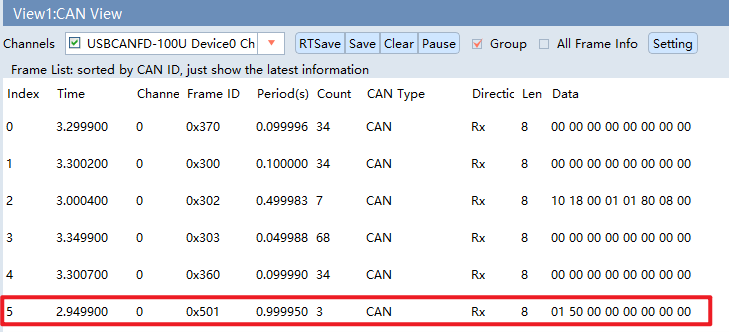

\

2. 查看0x350，0x351报文是否会在收到网络管理（0x500~05FF发送0x00 41 02 20）报文后发出；

   Verify whether messages 0x350 and 0x351 are transmitted after receiving network management messages (0x500~0x5FF carrying data 0x00 41 02 20);

   现象：0x350，0x351在收到网络管理报文后发出。

   Phenomenon: Messages 0x350 and 0x351 are transmitted upon reception of the network management message.

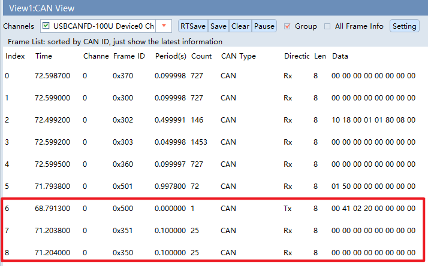

\

3. 收到 0x201 发送的 0x07 数据后，是否会进入重复消息状态；

   Check whether the repeat message state is entered after receiving data 0x07 via message 0x201;

   现象：进入重复消息状态，重复发送 0x501 报文多次，次数及重复发送间隔由具体配置决定。

   Phenomenon: Enter the repeat message state and transmit message 0x501 repeatedly. The transmission count and interval are determined by specific configurations.

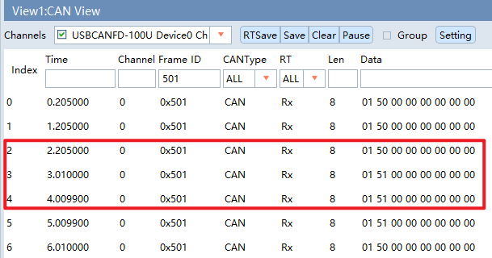

\

2.3 CAN诊断协议栈（CAN Diagnostic Protocol Stack）
----------------------------------------------------------------------------------------------------------------------------------------------------------------------------------------------------------------------------------------------------------------------------------------------------------------------------------------------------------

2.3.1 CAN诊断协议栈概述（Overview of CAN Diagnostic Protocol Stack）
~~~~~~~~~~~~~~~~~~~~~~~~~~~~~~~~~~~~~~~~~~~~~~~~~~~~~~~~~~~~~~~~~~~~~~~~~~~~~~~~~~~~~~~~~~~~~~~~~~~~~~~~~~~~~~~~~~~~~~~~~~~~~~~~~~~~~~~~~~~~~~~~~~~~~~~~~~~~~~~~~~~~~~~~~~~~~~~~~~~~~~~~~~~~~~~~

CAN诊断协议栈涉及到的软件模块主要有Can、CanIf、CanTP、EcuC、DCM、DEM模块，其中各个模块的主要功能如下表：

The software modules involved in CAN diagnostic protocol stack mainly include Can, CanIf, CanTP, EcuC, DCM and DEM modules, and the main functions of each module are shown in the table below:

.. list-table::
   :widths: 15 85
   :header-rows: 1

   * - 模块名(Module Name)
     - 功能(Function)
   * - Can
     - 主要配置CAN控制器的波特率，CAN报文的收发邮箱。(Mainly configure the baud rate of CAN controller, and the email for sending and receiving CAN messages.)
   * - CanIf
     - CanIf模块主要处理上层模块与底层驱动的之间PDU的传递，为上层模块提供统一的接口来管理不同的CAN硬件模块。(The CanIf module mainly handles the transmission of PDU between upper-level modules and underlying drivers, providing a unified interface for upper-level modules to manage different CAN hardware modules.)
   * - EcuC
     - 用于辅助配置工具完成配置的模块。主要提供Pdu的定义，其它模块通过关联EcuC中Pdu，相互关联起来。(A module used to assist configuration tools in completing configuration. Mainly provide the definition of Pdu, and other modules are interrelated by associating Pdu in EcuC.)
   * - PduR
     - PDU Router主要为通讯接口模块（CANIF）、传输协议模块（CAN TP、J1939 TP）、诊断通讯管理模块（DCM、J1939DCM）以及通讯模块（COM、LDCOM）以及IPDUM、SECOC等模块提供基于I-PDU的路由服务。(PDU Router mainly provides I-PDU-based routing services for communication interface modules (CANIF), transmission protocol modules (CAN TP, J1939 TP), diagnostic communication management modules (DCM, J1939DCM), communication modules (COM, LDCOM), IPDUM, and SECOC modules.)
   * - CanTp
     - CANTP模块实现依据ISO15765-2 标准规范中定义的CAN总线数据在传输层的数据接收发送功能。(The CANTP module implements the data receiving and transmission functions of CAN bus data defined in the ISO 15765-2 standards at the transport layer.)
   * - Dcm
     - 依据ISO15765-3和ISO14229-1标准描述，实现诊断请求报文的解析，响应(正响应和负响应)与执行。(According to the description in ISO 15765-3 and ISO 14229-1 standards, implement parsing, response (positive and negative responses), and execution of diagnostic request messages.)
   * - Dem
     - 实现诊断故障的存储与管理功能，提供API接口供其他模块读取DTC和对应的冻结帧数据和扩展数据。(Implement functions of diagnosis fault storage and management, and provide API interfaces for other modules to read DTC and corresponding freeze frame data and extended data.)

2.3.2 CAN诊断协议栈配置说明（Description of CAN Diagnostic Protocol Stack Configuration）
~~~~~~~~~~~~~~~~~~~~~~~~~~~~~~~~~~~~~~~~~~~~~~~~~~~~~~~~~~~~~~~~~~~~~~~~~~~~~~~~~~~~~~~~~~~~~~~~~~~~~~~~~~~~~~~~~~~~~~~~~~~~~~~~~~~~~~~~~~~~~~~~~~~~~~~~~~~~~~~~~~~~~~~~~~~~~~~~~~~~~~~~~~~~~~~~

CAN诊断协议栈的CANID如下表：

The CANID of the CAN diagnostic protocol stack is shown in the following table:

.. list-table::
   :widths: 40 60
   :header-rows: 1

   * - CANID类型(CANID Type)
     - CANID
   * - 物理寻址Physical Request CAN ID(Physical Request CAN ID)
     - 0x708
   * - 功能寻址Functional Request CAN ID(Functional Request CAN ID)
     - 0x7DF
   * - 物理响应Physical Response CAN ID(Physical Response CAN ID)
     - 0x709

工程中配置的诊断服务有如下表所示：

The diagnostic services configured in the project are shown in the following table:

.. list-table::
   :widths: 7 12 12 9 9 9 9 9 9 9 10
   :header-rows: 1

   * - SID
     - 物理寻址(Physical Addressing）
     - 功能寻址(Functional Addressing)
     - 子功能(Subfunction)
     - 默认会话(Default Session)
     - 编程会话(Programming Session)
     - 扩展会话(Extended Session)
     - Locked
     - Level 1
     - Level 2
     - 约定(Cxt)(Context (Cxt))
   * - 0x10
     - ✓
     - ✓
     - 0x01
     - Y
     - Y
     - Y
     - Y
     - Y
     - Y
     - M
   * - 0x10
     - ✓
     - ✓
     - 0x02
     - N
     - Y
     - Y
     - Y
     - Y
     - Y
     - M
   * - 0x10
     - ✓
     - ✓
     - 0x03
     - Y
     - N
     - Y
     - Y
     - Y
     - Y
     - M
   * - 0x11
     - ✓
     - ✓
     - 0x01
     - Y
     - Y
     - Y
     - Y
     - Y
     - Y
     - M
   * - 0x11
     - ✓
     - ✓
     - 0x02
     - Y
     - Y
     - Y
     - Y
     - Y
     - Y
     - U
   * - 0x27
     - ✓
     - ×
     - 0x03
     - N
     - Y
     - Y
     - Y
     - Y
     - Y
     - M
   * - 0x27
     - ✓
     - ×
     - 0x04
     - N
     - N
     - Y
     - Y
     - Y
     - Y
     - M
   * - 0x27
     - ✓
     - ×
     - 0x05
     - N
     - N
     - Y
     - Y
     - Y
     - Y
     - M
   * - 0x28
     - ✓
     - ✓
     - 0x00
     - N
     - N
     - Y
     - Y
     - Y
     - Y
     - M
   * - 0x28
     - ✓
     - ✓
     - 0x01
     - N
     - N
     - Y
     - Y
     - Y
     - Y
     - U
   * - 0x28
     - ✓
     - ✓
     - 0x02
     - N
     - N
     - Y
     - Y
     - Y
     - Y
     - U
   * - 0x28
     - ✓
     - ✓
     - 0x03
     - N
     - N
     - Y
     - Y
     - Y
     - Y
     - M
   * - 0x3E
     - ✓
     - ✓
     - 0x00
     - Y
     - Y
     - Y
     - Y
     - Y
     - Y
     - M
   * - 0x85
     - ✓
     - ✓
     - 0x01
     - N
     - N
     - Y
     - Y
     - Y
     - Y
     - M
   * - 0x85
     - ✓
     - ✓
     - 0x02
     - N
     - N
     - Y
     - Y
     - Y
     - Y
     - M
   * - 0x22
     - ✓
     - ✓
     - N/A
     - Y
     - Y
     - Y
     - Y
     - Y
     - Y
     - M
   * - 0x2E
     - ✓
     - ×
     - N/A
     - N
     - Y
     - Y
     - N
     - Y
     - Y
     - U
   * - 0x2F
     - ✓
     - ×
     - N/A
     - N
     - Y
     - Y
     - N
     - Y
     - Y
     - U
   * - 0x31
     - ✓
     - ×
     - 0x01
     - N
     - Y
     - Y
     - Y
     - Y
     - Y
     - U
   * - 0x31
     - ✓
     - ×
     - 0x02
     - N
     - U
     - U
     - U
     - U
     - U
     - U
   * - 0x31
     - ✓
     - ×
     - 0x03
     - N
     - U
     - U
     - U
     - U
     - U
     - U
   * - 0x19
     - ✓
     - ✓
     - 0x01
     - Y
     - N
     - Y
     - Y
     - Y
     - Y
     - M
   * - 0x19
     - ✓
     - ✓
     - 0x02
     - Y
     - N
     - Y
     - Y
     - Y
     - Y
     - M
   * - 0x19
     - ✓
     - ✓
     - 0x04
     - Y
     - N
     - Y
     - Y
     - Y
     - Y
     - M
   * - 0x19
     - ✓
     - ✓
     - 0x06
     - Y
     - N
     - Y
     - Y
     - Y
     - Y
     - M
   * - 0x19
     - ✓
     - ✓
     - 0x0A
     - Y
     - N
     - Y
     - Y
     - Y
     - Y
     - M
   * - 0x14
     - ✓
     - ✓
     - N/A
     - Y
     - N
     - Y
     - Y
     - Y
     - Y
     - M

CAN诊断时间参数如下:

The CAN diagnostic time parameters are as follows:

.. centered:: 应用层会话管理计时器参数（Application Layer Timing Parameters）

.. list-table::
   :widths: 15 25 25 30 12
   :header-rows: 1

   * -
     - Symbol 符号
     - Min 最小值
     - Max/Timeout 最大值/超时时间
     - Unit 单位
   * - ECU电控单元 (ECU)
     - P2Server
     - N/A
     - 50
     - ms
   * - ECU电控单元 (ECU)
     - P2*Server
     - N/A
     - 5000
     - ms
   * - ECU电控单元 (ECU)
     - S3Server
     - N/A
     - 5000
     - ms

.. centered:: 网络层定时器参数（Network Layer Timing Parameters）

.. list-table::
   :widths: 18 26 26 12
   :header-rows: 1

   * - Symbol 符号
     - Timeout 超时时间
     - Performance Requirement 性能要求
     - Unit 单位
   * - N_As/N_Ar
     - 70
     - ——
     - ms
   * - N_Bs
     - 150
     - ——
     - ms
   * - N_Br
     - ——
     - < 70
     - ms
   * - N_Cs
     - ——
     - < 150
     - ms
   * - N_Cr
     - 150
     - ——
     - ms

.. centered:: 其它参数（Other parameters）

.. list-table::
   :widths: 30 30 15 10
   :header-rows: 1

   * - Symbol 符号
     - Parameter 参数
     - Value 值
     - Unit 单位
   * - BS
     - Block Size
     - 0
     - ——
   * - STmin
     - Minimum Separation Time
     - 10
     - ms
   * - Fill bytes(发送数据填充) (Fill bytes (transmitting data fill))
     - Padding
     - 0xAA
     - ——
   * - 接收填充值检查 (Receiving fill value check)
     - ON/OFF
     - OFF
     - ——
   * - Fill bytes(接收数据填充) (Fill bytes (receiving data fill))
     - Padding
     - ——
     - ——
   * - 诊断报文长度(Diagnostic message length)
     - Byte Size
     - 8
     - ——
   * - 诊断报文长度检查(Diagnostic message length check)
     - ON/OFF
     - ON
     - ——
   * - DCM接收BUFFER最大值(Maximum BUFFER received by DCM)
     - Byte Size
     - 1024
     - ——
   * - DCM发送BUFFER最大值(Maximum BUFFER sent by DCM)
     - Byte Size
     - 1024
     - ——

.. note::
    TP通信模式配置为：TP半双工

    TP communication mode configured as: TP Half-Duplex

安全访问算法配置信息如下：

The security access algorithm configuration information is as follows:

.. list-table::
   :widths: 100
   :header-rows: 1

   * - Mask配置值 (Mask configuration value)
   * - Mask = 0x5555AAAAu

密钥算法（根据Seed计算Key）如下，其中seed为输入的种子。

The key algorithm (calculate the Key based on Seed) is as follows, where Seed is the input seed.

.. list-table::
   :widths: 100
   :header-rows: 1

   * - 安全算法 (Security algorithm)
   * - Key = Seed & Mask

注：最大失败次数为3，达到最大失败次数启动延时时间为10S；连续请求种子错误计数不加1，种子相同，延时时间过后错误计数清零。

Note: The maximum number of failures is 3, and the startup delay time when the maximum number of failures is reached is 10 seconds; the error count for consecutive seed requests with the same seed does not increase by 1, and the error count is reset to zero after the delay time.

DID列表：

DID List:

.. list-table::
   :widths: 12 30 8 8 8 8 8 8
   :header-rows: 1

   * - DIDs (HEX)
     - Name 名称
     - Diagnostic Session 诊断模式 (01)
     - Diagnostic Session 诊断模式 (03)
     - Security Level 安全级别 Locked
     - Security Level 安全级别 Level 1
     - Security Level 安全级别 Level 2
     - Size (Byte)
   * - F186
     - Active Diag Session
       当前诊断会话模式(Current Diagnostic Session Mode)
     - R
     - R
     - R
     - R
     - R
     - 1
   * - F121
     - ECU Serial Number
       ECU序列号(ECU Serial Number)
     - R
     - R
     - R
     - R
     - R
     - 16
   * - F190
     - Vehicle Identification Number
       车辆识别编号（VIN）(Vehicle Identification Number (VIN))
     - R
     - R/W
     - R
     - R/W
     - R
     - 17
   * - F183
     - configuration information
       配置信息(Configuration Information)
     - R
     - R/W
     - R
     - R
     - R/W
     - 4
   * - F181
     - applicationSoftwareIdentificationDataIdentifier
       APP软件编号(Application Software ID)
     - R
     - R
     - R
     - R
     - R
     - 4
   * - 0120
     - DEMO IODID01
     - R
     - R/IO
     - R
     - R/IO
     - R
     - 1
   * - 0121
     - DEMO IODID02
     - R
     - R/IO
     - R
     - R
     - R/IO
     - 1
   * - 0110
     - DEMO 快照信息 DID01(DEMO Snapshot Info DID01)
     - R
     - R
     - R
     - R
     - R
     - 1
   * - 0111
     - DEMO 快照信息 DID02(DEMO Snapshot Info DID02)
     - R
     - R
     - R
     - R
     - R
     - 3

IO DID列表：

IO DID List:

.. list-table::
   :widths: 10 18 25 10 10 10 15 15 10
   :header-rows: 1

   * - DIDs (HEX)
     - Name 名称
     - InputOutputControlParameter 输入输出控制参数
     - Locked
     - Level 1
     - Level 2
     - ControlOption 控制选项
     - ControlStatus 控制状态
     - Size (Byte)
   * - 0120
     - DEMO IODID01
     - 00
     - N
     - Y
     - N
     - —
     - ✓
     - 1
   * - 0120
     - DEMO IODID01
     - 01
     - N
     - Y
     - N
     - —
     - ✓
     - 1
   * - 0120
     - DEMO IODID01
     - 03
     - N
     - Y
     - N
     - ✓
     - ✓
     - 1
   * - 0121
     - DEMO IODID02
     - 00
     - N
     - N
     - Y
     - —
     - ✓
     - 1
   * - 0121
     - DEMO IODID02
     - 01
     - N
     - N
     - Y
     - —
     - ✓
     - 1
   * - 0121
     - DEMO IODID02
     - 03
     - N
     - N
     - Y
     - ✓
     - ✓
     - 1

RID列表：

RID List:

.. list-table::
   :widths: 10 18 22 10 10 10 10 18 10 10
   :header-rows: 1

   * - DIDs (HEX)
     - Name 名称
     - RoutineControlType 例程控制类型
     - Diagnostic Session 诊断模式 (01)
     - Diagnostic Session 诊断模式 (03)
     - Security Level 安全级别 Locked
     - Security Level 安全级别 Level 1
     - Security Level 安全级别 Level 2
     - RoutineControlOption 例程控制选项
     - Size (Byte)
   * - 0203
     - 预编程条件检查(Pre-programming Condition Check)
     - 01
     - N
     - Y
     - Y
     - Y
     - Y
     - —
     - 0
   * - 0200
     - DEMO RID01
     - 01
     - N
     - Y
     - N
     - Y
     - N
     - ✓
     - 1
   * - 0201
     - DEMO RID02
     - 01
     - N
     - Y
     - N
     - N
     - Y
     - ✓
     - 1

DTC列表：

DTC List:

.. list-table::
   :widths: 12 12 22 12 24 24 24 24
   :header-rows: 1

   * - DTC
     - DTC Number (HEX)
     - DTC Description DTC描述
     - DemDebounce Behavior
     - DTC-Set Condition DTC设置条件
     - Faults-Recover Condition 故障恢复条件
     - DTC Enable Condition DTC使能条件
     - DTC Priority DTC优先级
   * - 018787
     - C18787
     - DEMO 通信超时 (DEMO Communication Timeout)
     - Reset
     - | No Message received in 5 periods
       | 5倍帧周期未收到报文（报文0x202）
       | No message (message 0x202) received for 5 frame cycles
       | 使用外部去抖，SWC直接报failed或者passed
       | External debounce used; SWC directly reports failed or passed
     - | correct Information Received
       | 报文正常接收
       | Normal message reception
       | 使用外部去抖，SWC直接报failed或者passed
       | External debounce used; SWC directly reports failed or passed
     - | 1.Car Mode 不等于 Drive Mode
       | 1. Car Mode ≠ Drive Mode
       | 2.Voltage 大于 9V 小于16V
       | 2. Voltage between 9V and 16V
       | 3. 上电后3000ms后诊断使能
       | 3. Diagnostics enabled 3000ms after power-on
     - 1
   * - U007388
     - C07388
     - CAN Bus off CAN总线Bus off (CAN Bus off)
     - Reset
     - | CAN总线Bus off出现10次
       | CAN Bus off occurs 10 times
       | CAN总线控制器出现Busoff出现10次
       | The CAN Bus controller enters Busoff status for 10 times
     - | CAN not in busoff state
       | CAN从busoff状态恢复
       | CAN recovers from busoff
     - | 1.Car Mode 不等于 Drive Mode
       | 1. Car Mode ≠ Drive Mode
       | 2.Voltage 大于 9V 小于16V
       | 2. Voltage between 9V and 16V
       | 3. 上电后3000ms后诊断使能
       | 3. Diagnostics enabled 3000ms after power-on
     - 1
   * - U010001
     - C10001
     - SWC 故障#01 (SWC fault #01)
     - Reset
     - Prefailed连续32次 (Prefailed reported for 32 consecutive times)
     - Prepassed连续32次 (Prepassed reported for 32 consecutive times)
     - | 1.Car Mode 不等于 Drive Mode
       | 1. Car Mode ≠ Drive Mode
       | 2.Voltage 大于 9V 小于16V
       | 2. Voltage between 9V and 16V
       | 3. 上电后3000ms后诊断使能
       | 3. Diagnostics enabled 3000ms after power-on
     - 1
   * - U010002
     - C10002
     - SWC 故障#02 (SWC fault #02)
     - Reset
     - Prefailed连续32次 (Prefailed reported for 32 consecutive times)
     - Prepassed连续32次 (Prepassed reported for 32 consecutive times)
     - | 1.Car Mode 不等于 Drive Mode
       | 1. Car Mode ≠ Drive Mode
       | 2.Voltage 大于 9V 小于16V
       | 2. Voltage between 9V and 16V
       | 3. 上电后3000ms后诊断使能
       | 3. Diagnostics enabled 3000ms after power-on
     - 1
   * - U010003
     - C10003
     - SWC 故障#03 (SWC fault #03)
     - Reset
     - Prefailed连续32次 (Prefailed reported for 32 consecutive times)
     - Prepassed连续32次 (Prepassed reported for 32 consecutive times)
     - | 1.Car Mode 不等于 Drive Mode
       | 1. Car Mode ≠ Drive Mode
       | 2.Voltage 大于 9V 小于16V
       | 2. Voltage between 9V and 16V
       | 3. 上电后3000ms后诊断使能
       | 3. Diagnostics enabled 3000ms after power-on
     - 1
   * - U010004
     - C10004
     - SWC 故障#04 (SWC fault #04)
     - Reset
     - Prefailed连续2000ms (Prefailed lasts for 2000ms continuously)
     - Prepassed连续2000ms (Prepassed lasts for 2000ms continuously)
     - | 1.Car Mode 不等于 Drive Mode
       | 1. Car Mode ≠ Drive Mode
       | 2.Voltage 大于 9V 小于16V
       | 2. Voltage between 9V and 16V
       | 3. 上电后3000ms后诊断使能
       | 3. Diagnostics enabled 3000ms after power-on
     - 2
   * - U010005
     - C10005
     - SWC 故障#05 (SWC fault #05)
     - Reset
     - Prefailed连续2000ms (Prefailed lasts for 2000ms continuously)
     - Prepassed连续2000ms (Prepassed lasts for 2000ms continuously)
     - | 1.Car Mode 不等于 Drive Mode
       | 1. Car Mode ≠ Drive Mode
       | 2.Voltage 大于 9V 小于16V
       | 2. Voltage between 9V and 16V
       | 3. 上电后3000ms后诊断使能
       | 3. Diagnostics enabled 3000ms after power-on
     - 2
   * - U010006
     - C10006
     - SWC 故障#06 (SWC fault #06)
     - Reset
     - Prefailed连续2000ms (Prefailed lasts for 2000ms continuously)
     - Prepassed连续2000ms (Prepassed lasts for 2000ms continuously)
     - | 1.Car Mode 不等于 Drive Mode
       | 1. Car Mode ≠ Drive Mode
       | 2.Voltage 大于 9V 小于16V
       | 2. Voltage between 9V and 16V
       | 3. 上电后3000ms后诊断使能
       | 3. Diagnostics enabled 3000ms after power-on
     - 2
   * - U010007
     - C10007
     - SWC 故障#07 (SWC fault #07)
     - Reset
     - Prefailed连续2000ms (Prefailed lasts for 2000ms continuously)
     - Prepassed连续2000ms (Prepassed lasts for 2000ms continuously)
     - | 1.Car Mode 不等于 Drive Mode
       | 1. Car Mode ≠ Drive Mode
       | 2.Voltage 大于 9V 小于16V
       | 2. Voltage between 9V and 16V
       | 3. 上电后3000ms后诊断使能
       | 3. Diagnostics enabled 3000ms after power-on
     - 2
   * - U010008
     - C10008
     - SWC 故障#08 (SWC fault #08)
     - Reset
     - Prefailed连续2000ms (Prefailed lasts for 2000ms continuously)
     - Prepassed连续2000ms (Prepassed lasts for 2000ms continuously)
     - | 1.Car Mode 不等于 Drive Mode
       | 1. Car Mode ≠ Drive Mode
       | 2.Voltage 大于 9V 小于16V
       | 2. Voltage between 9V and 16V
       | 3. 上电后3000ms后诊断使能
       | 3. Diagnostics enabled 3000ms after power-on
     - 2
   * - U010009
     - C10009
     - SWC 故障#09 (SWC fault #09)
     - Reset
     - Prefailed连续20次 (Prefailed reported for 20 consecutive times)
     - Prepassed连续3次 (Prepassed reported for 3 consecutive times)
     - | 1.Car Mode 不等于 Drive Mode
       | 1. Car Mode ≠ Drive Mode
       | 2.Voltage 大于 9V 小于16V
       | 2. Voltage between 9V and 16V
       | 3. 上电后3000ms后诊断使能
       | 3. Diagnostics enabled 3000ms after power-on
     - 3
   * - U01000A
     - C1000A
     - SWC 故障#10 (SWC fault #10)
     - Reset
     - Prefailed连续20次 (Prefailed reported for 20 consecutive times)
     - Prepassed连续3次 (Prepassed reported for 3 consecutive times)
     - | 1.Car Mode 不等于 Drive Mode
       | 1. Car Mode ≠ Drive Mode
       | 2.Voltage 大于 9V 小于16V
       | 2. Voltage between 9V and 16V
       | 3. 上电后3000ms后诊断使能
       | 3. Diagnostics enabled 3000ms after power-on
     - 3
   * - U01000B
     - C1000B
     - SWC 故障#11 (SWC fault #11)
     - Reset
     - Prefailed连续20次 (Prefailed reported for 20 consecutive times)
     - Prepassed连续3次 (Prepassed reported for 3 consecutive times)
     - | 1.Car Mode 不等于 Drive Mode
       | 1. Car Mode ≠ Drive Mode
       | 2.Voltage 大于 9V 小于16V
       | 2. Voltage between 9V and 16V
       | 3. 上电后3000ms后诊断使能
       | 3. Diagnostics enabled 3000ms after power-on
     - 3
   * - U01000C
     - C1000C
     - SWC 故障#12 (SWC fault #12)
     - Reset
     - Prefailed连续20次 (Prefailed reported for 20 consecutive times)
     - Prepassed连续3次 (Prepassed reported for 3 consecutive times)
     - | 1.Car Mode 不等于 Drive Mode
       | 1. Car Mode ≠ Drive Mode
       | 2.Voltage 大于 9V 小于16V
       | 2. Voltage between 9V and 16V
       | 3. 上电后3000ms后诊断使能
       | 3. Diagnostics enabled 3000ms after power-on
     - 3
   * - U01000D
     - C1000D
     - SWC 故障#13 (SWC fault #13)
     - Reset
     - Prefailed连续3次 (Prefailed reported for 3 consecutive times)
     - Prepassed连续1次 (Prepassed reported for 1 consecutive times)
     - | 1.Car Mode 不等于 Drive Mode
       | 1. Car Mode ≠ Drive Mode
       | 2.Voltage 大于 9V 小于16V
       | 2. Voltage between 9V and 16V
       | 3. 上电后3000ms后诊断使能
       | 3. Diagnostics enabled 3000ms after power-on
     - 4
   * - U01000E
     - C1000E
     - SWC 故障#14 (SWC fault #14)
     - Reset
     - Prefailed连续3次 (Prefailed reported for 3 consecutive times)
     - Prepassed连续1次 (Prepassed reported for 1 consecutive times)
     - | 1.Car Mode 不等于 Drive Mode
       | 1. Car Mode ≠ Drive Mode
       | 2.Voltage 大于 9V 小于16V
       | 2. Voltage between 9V and 16V
       | 3. 上电后3000ms后诊断使能
       | 3. Diagnostics enabled 3000ms after power-on
     - 4
   * - U01000F
     - C1000F
     - SWC 故障#15 (SWC fault #15)
     - Reset
     - Prefailed连续3次 (Prefailed reported for 3 consecutive times)
     - Prepassed连续1次 (Prepassed reported for 1 consecutive times)
     - | 1.Car Mode 不等于 Drive Mode
       | 1. Car Mode ≠ Drive Mode
       | 2.Voltage 大于 9V 小于16V
       | 2. Voltage between 9V and 16V
       | 3. 上电后3000ms后诊断使能
       | 3. Diagnostics enabled 3000ms after power-on
     - 4

注：DTC格式遵循ISO 14229-1规范，DTC Format Identifier = 0x01；DTC status支持的bit位仅bit7不支持，0x7F；

Note: DTC format complies with ISO 14229-1 specification, DTC Format Identifier = 0x01; only bit7 is unsupported among supported bits of DTC status, i.e. 0x7F;

DTC扩展数据：

DTC extended data:

.. list-table::
   :widths: 12 8 30 10 8 8 12 12 20 10
   :header-rows: 1

   * - Record Number
     - Byte #
     - Name 名称
     - Size (Byte)
     - Update
     - Factor 精度
     - Offset
     - Min(Phy.) 物理值最小值
     - Max(Phy.) 物理值最大值
     - 备注(Remarks)
   * - 1
     - 1
     - Failed Cycles
     - 1
     - Y
     - 1
     - 0
     - 0
     - 255
     - 基于Failed触发(Triggered on Failed status)
   * - 1
     - 1
     - Occurrence counter
     - 1
     - Y
     - 1
     - 0
     - 0
     - 255
     - 基于Failed触发(Triggered on Failed status)
   * - 3
     - 1
     - Cycles since first failed
     - 1
     - Y
     - 1
     - 0
     - 0
     - 255
     - 基于Failed触发(Triggered on Failed status)
   * - 4
     - 1
     - Cycles since last failed
     - 1
     - Y
     - 1
     - 0
     - 0
     - 255
     - 基于Failed触发(Triggered on Failed status)
   * - 5
     - 1
     - Aging Counter(Up Count)
     - 1
     - Y
     - 1
     - 0
     - 0
     - 255
     - 基于Failed触发(Triggered on Failed status)
   * - 6
     - 1
     - Max FDC during current cycle
     - 1
     - Y
     - 1
     - 0
     - 0
     - 255
     - 基于FDC触发(Triggered based on FDC)
   * - 7
     - 1
     - Max FDC since last clear
     - 1
     - Y
     - 1
     - 0
     - 0
     - 255
     - 基于FDC触发(Triggered based on FDC)
   * - 8
     - 1
     - Current FDC
     - 1
     - Y
     - 1
     - 0
     - 0
     - 255
     - 基于FDC触发(Triggered based on FDC)

DTC快照：

DTC snapshot:

.. list-table::
   :widths: 12 28 22 10 10 30 20
   :header-rows: 1

   * - Record Number
     - Name 名称
     - Parameter DID 参数ID号
     - Size (Byte)
     - Update
     - Value Table
     - 备注(Remarks)
   * - 0x01
     - DEMO 快照信息DID01 (DEMO Snapshot Info DID01)
     - 0x0110
     - 1
     - Y
     -
     - 基于Failed触发 (Triggered on Failed status)
   * - 0x01
     - DEMO 快照信息DID02 (DEMO Snapshot Info DID02)
     - 0x0111
     - 3
     - Y
     - | _20msCnt计数器取后三个字节
       | Extract the last three bytes of counter _20msCnt
       | 验证数据是否更新
       | Verify data update
     - 基于Failed触发(Triggered on Failed status)

.. list-table::
   :widths: 12 28 22 10 10 30 20
   :header-rows: 1

   * - Record Number
     - Name 名称
     - Parameter DID 参数ID号
     - Size (Byte)
     - Update
     - Value Table
     - 备注(Remarks)
   * - 0x02
     - DEMO 快照信息DID01 (DEMO Snapshot Info DID01)
     - 0x0110
     - 1
     - N
     -
     - 基于Failed触发(Triggered on Failed status)
   * - 0x02
     - DEMO 快照信息DID02 (DEMO Snapshot Info DID02)
     - 0x0111
     - 3
     - N
     - | _20msCnt计数器取后三个字节
       | Extract the last three bytes of counter _20msCnt
       | 验证数据是否更新
       | Verify data update
     - 基于Failed触发(Triggered on Failed status)

2.3.3 CAN诊断协议栈验证方法说明（Description of CAN Diagnostic Protocol Stack Verification Method）
~~~~~~~~~~~~~~~~~~~~~~~~~~~~~~~~~~~~~~~~~~~~~~~~~~~~~~~~~~~~~~~~~~~~~~~~~~~~~~~~~~~~~~~~~~~~~~~~~~~~~~~~~~~~~~~~~~~~~~~~~~~~~~~~~~~~~~~~~~~~~~~~~~~~~~~~~~~~~~~~~~~~~~~~~~~~~~~~~~~~~~~~~~~~~~~~~~~~~~~~~~~~~~~~~~~~~~~~~~~~~~~~

1. 使用 10 服务查看是否可切换会话；

   Use Service 10 to verify session switching function; 

   现象：可正常切换会话等级。

   Phenomenon: Session level can be switched normally.

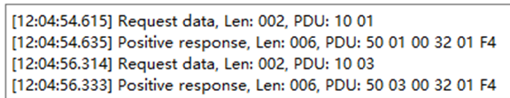

\

2. 使用 27 服务查看是否可切换安全等级；

   Use Service 27 to verify security level switching function;

   现象：可正常切换安全等级。

   Phenomenon: Security level can be switched normally.

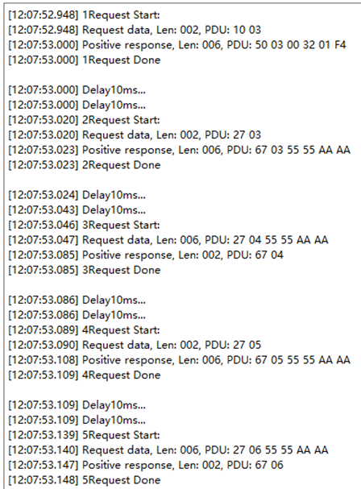

\

3. 制造 Busoff 故障（可通过以下方式实现：①短接CANH和CANL；②通过6501干扰；）；

   Trigger Busoff fault (two implementation methods: ① short-circuit CANH and CANL; ② use 6501 to generate interference);

\

4. 使用 19 服务查看 Busoff DTC （C07388）状态信息，查看是否报检测到 Busoff。

   Use Service 19 to read status information of Busoff DTC (C07388), and verify whether Busoff is reported.

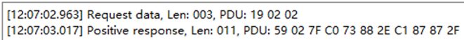

\

2.4 存储协议栈（Storage Protocol Stack）
--------------------------------------------------------------------------------------------------------------------------------------------------------------------------------------------------------------------------------------------------------------------------------------------------------------------------

2.4.1 存储协议栈概述（Overview of Storage Protocol Stack）
~~~~~~~~~~~~~~~~~~~~~~~~~~~~~~~~~~~~~~~~~~~~~~~~~~~~~~~~~~~~~~~~~~~~~~~~~~~~~~~~~~~~~~~~~~~~~~~~~~~~~~~~~~~~~~~~~~~~~~~~~~~~~~~~~~~~~~~~~~~~~~~~~~~~~~~~~~~~~~~~~~~~~~~~~~~~~~~~~~~~~~~~~~~~~~~~~~~~~~~~~~~~~~~~~~

存储协议栈涉及到的软件模块主要有Flash、MemAcc、FEE、NvM模块，其中各个模块的主要功能如下表：

The software modules involved in the storage protocol stack mainly include Flash, MemAcc, FEE, and NvM modules, and the main functions of each module are shown in the table below:

NvM 各配置模块介绍

Introduction to Each Configuration Module of NvM

.. list-table::
   :widths: 15 85
   :header-rows: 1

   * - 模块名(Module Name)
     - 功能(Function)
   * - Flash
     - 提供对Flash的读，写，擦相关操作服务。(Provide read, write, and erase related operation services for Flash.)
   * - MemAcc
     - 提供基于地址作为参数的接口方式，向上层提供能够访问不同存储设备的能力。(Provide an interface mode based on the address as a parameter, and provide the upper layer with the capability to access different storage devices.)
   * - FEE
     - 为上层提供虚拟线性地址空间和统一的存储分配方案。(Provide virtual linear address space and unified storage allocation scheme for the upper layer.)
   * - NvM
     - 非易失性数据的存储和管理。(Storage and management of non-volatile data.)

2.4.2 存储协议栈配置说明（Description of Storage Protocol Stack Configuration）
~~~~~~~~~~~~~~~~~~~~~~~~~~~~~~~~~~~~~~~~~~~~~~~~~~~~~~~~~~~~~~~~~~~~~~~~~~~~~~~~~~~~~~~~~~~~~~~~~~~~~~~~~~~~~~~~~~~~~~~~~~~~~~~~~~~~~~~~~~~~~~~~~~~~~~~~~~~~~~~~~~~~~~~~~~~~~~~~~~~~~~~~~~~~~~~~~~~~~~~~

存储协议栈中主要配置了如下NvMBlock:

The storage protocol stack is mainly configured with the following NvMBlock:

.. list-table::
   :widths: 40 60
   :header-rows: 1

   * - NvMBlock名(NvMBlock Name)
     - 作用(Function)
   * - NvMBlock_ConfigID
     - NvM管理(NvM management)
   * - NvMBlock_Dem_Data
     - 用来存放Dem的数据(Store Dem data)
   * - NvMBlock_Dem_Status
     - 用来存放Dem的状态(Store Dem status)
   * - NvMBlock_Dcm
     - 用来存放Dcm的数据（暂未使用）(Store Dcm data (temporarily unused))
   * - NvMBlock_SecurityLevel01
     - 用来存放安全等级1错误计数（暂未使用）(Store error counts of security level 1 (temporarily unused))
   * - NvMBlock_SecurityLevel02
     - 用来存放安全等级2错误计数（暂未使用）(Store error counts of security level 2 (temporarily unused))
   * - NvMBlock_Did_0xF190
     - 用来存放DID 0xF190的数据(Store DID 0xF190 data)
   * - NvMBlock_Did_0xF183
     - 用来存放DID 0xF183的数据(Store DID 0xF183 data)

2.4.3 存储协议栈验证方法说明（Description of Storage Protocol Stack Verification Method）
~~~~~~~~~~~~~~~~~~~~~~~~~~~~~~~~~~~~~~~~~~~~~~~~~~~~~~~~~~~~~~~~~~~~~~~~~~~~~~~~~~~~~~~~~~~~~~~~~~~~~~~~~~~~~~~~~~~~~~~~~~~~~~~~~~~~~~~~~~~~~~~~~~~~~~~~~~~~~~~~~~~~~~~~~~~~~~~~~~~~~~~~~~~~~~~~~~~~~~~~~~~~~~~~~~~~~~~~~~~~~~~~~~~~~~~~

1. 制造一个故障（Busoff），查看 DTC （C07388）是否存在；

   Trigger a fault (Busoff), and check whether DTC (C07388) exists;

\

2. 执行 11 复位操作，复位起来后查看该 DTC 是否仍然存在；

   Execute 11 reset operation, and check whether the DTC still exists after reset;

\

3. 执行 11 复位操作，并在复位起来后查看老化计数，查看老化计数是否会累加；

   Execute 11 reset operation, and check whether aging counter increments after reset;

现象：制造 DTC 并执行复位后，DTC 在复位起来后仍然存在，并且每执行一次复位，老化计数会加1。

Phenomenon: After triggering the DTC and executing reset, the DTC still exists after reset; the aging counter increases by one after every reset.

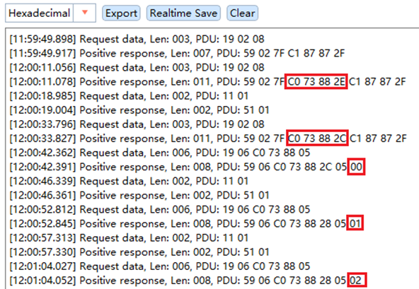

\

2.5 看门狗协议栈（Watchdog Protocol Stack）
-----------------------------------------------------------------------------------------------------------------------------------------------------------------------------------------------------------------------------------------------------------------------------------------------------------------------------------

2.5.1 看门狗协议栈概述（Overview of Watchdog Protocol Stack）
~~~~~~~~~~~~~~~~~~~~~~~~~~~~~~~~~~~~~~~~~~~~~~~~~~~~~~~~~~~~~~~~~~~~~~~~~~~~~~~~~~~~~~~~~~~~~~~~~~~~~~~~~~~~~~~~~~~~~~~~~~~~~~~~~~~~~~~~~~~~~~~~~~~~~~~~~~~~~~~~~~~~~~~~~~~~~~~~~~~~~~~~~~~~~~~~~~~~~~~~~~~~~~~

看门狗协议栈是一种用于监控和保护系统运行状态的机制。它通过监控软件执行的稳定性和正确性确保了在系统发生故障时能迅速采取恢复措施。

The watchdog protocol stack is a mechanism used to monitor and protect the operational status of the system. It ensures recovery measures can be taken rapidly in the event of system failure by monitoring the stability and correctness of software execution.

Wdg协议栈主要涉及到的模块为Wdg、WdgIf 、WdgM ，其中各个模块的主要功能如下表：

The main modules involved in the Wdg protocol stack are Wdg, WdgIf, and WdgM. The main functions of each module are shown in the table below:

Wdg 看门狗协议栈各配置模块介绍

Introduction to Each Configuration Module of Wdg Watchdog Protocol Stack

.. list-table::
   :widths: 15 85
   :header-rows: 1

   * - 模块名(Module Name)
     - 功能(Function)
   * - Wdg
     - Wdg 属于MCAL的一部分，用于完成看门狗初始化，模式设置以及喂狗设置等。(Wdg is part of MCAL, and is used to complete watchdog initialization, mode settings, and feed dog settings.)
   * - WdgIf
     - WdgIf 模块属于ECU抽象层，能够允许上层WdgM模块来同时处理多个看门狗实体，比如外部看门狗或者内部看门狗。(The WdgIf module belongs to the ECU abstraction layer, and allows the upper-level WdgM module to simultaneously handle multiple watchdog entities, such as external watchdog or internal watchdog.)
   * - WdgM
     - WdgM 模块从硬件看门狗实体监控的过程抽象出来完成软件程序执行监控抽象。(The WdgM module abstracts the process of hardware watchdog entity monitoring to complete the abstraction of software program execution monitoring.)

2.5.2 看门狗协议栈配置说明（Description of Watchdog Protocol Stack Configuration）
~~~~~~~~~~~~~~~~~~~~~~~~~~~~~~~~~~~~~~~~~~~~~~~~~~~~~~~~~~~~~~~~~~~~~~~~~~~~~~~~~~~~~~~~~~~~~~~~~~~~~~~~~~~~~~~~~~~~~~~~~~~~~~~~~~~~~~~~~~~~~~~~~~~~~~~~~~~~~~~~~~~~~~~~~~~~~~~~~~~~~~~~~~~~~~~~~~~~~~~~~~~~~~~~~~~~~~~~

看门狗协议栈中配置了用于监控周期性软件任务的执行状态的Alive监控。

Alive monitoring is configured within the watchdog protocol stack to monitor execution status of periodic software tasks.

Alive监控参数配置

Alive Monitoring Parameter Configuration

.. list-table::
   :widths: 10 18 10 10 10 10 10 10 10 12
   :header-rows: 1

   * - 监控类型(Monitoring type)
     - 描述 (Description)
     - 监控实体个数(Number of monitored entities)
     - 监控点个数(Number of monitored points)
     - 参考周期(Reference period)
     - 监控失败门限(Monitoring failure threshold)
     - 监控失效门限(Monitoring deactivation threshold)
     - 期望执行次数(Expected number of executions)
     - 次数上偏差(Upper deviation in the number of times)
     - 次数下偏差(Lower deviation in the number of times)
   * - Alive 监控(Alive monitoring)
     - 监控单个MainFunction周期内Alive监控点的期望执行次数(Monitor the expected number of executions of Alive monitored points within one MainFunction cycle)
     - 1
     - 1
     - 1
     - 0
     - 0
     - 1
     - 0
     - 0

2.5.3 看门狗协议栈验证方法说明（Description of Watchdog Protocol Stack Verification Method）
~~~~~~~~~~~~~~~~~~~~~~~~~~~~~~~~~~~~~~~~~~~~~~~~~~~~~~~~~~~~~~~~~~~~~~~~~~~~~~~~~~~~~~~~~~~~~~~~~~~~~~~~~~~~~~~~~~~~~~~~~~~~~~~~~~~~~~~~~~~~~~~~~~~~~~~~~~~~~~~~~~~~~~~~~~~~~~~~~~~~~~~~~~~~~~~~~~~~~~~~~~~~~~~~~~~~~~~~~

1. 按 Wdg 周期正常执行 WdgM_CheckpointReached 接口调用，查看程序运行是否正常；

   Perform the call of the WdgM_CheckpointReached interface normally according to the Wdg cycle, and check whether the program runs normally;

\

2. 不执行 WdgM_CheckpointReached 接口调用，查看程序运行是否正常；

   Skip the call of the WdgM_CheckpointReached interface, and check whether the program runs normally;

\

现象：执行步骤①时程序运行正常；执行步骤②时程序运行异常，程序运行过程中会产生复位。

Phenomenon: Program runs normally in step ①; abnormal program operation and system reset will occur during execution of step ②.

2.6 OS协议栈（OS Protocol Stack）
-------------------------------------------------------------------------------------------------------------------------------------------------------------------------------------------------------------------------------------------------------------------------------------------------------------------------

2.6.1 OS协议栈概述（Overview of OS Protocol Stack）
~~~~~~~~~~~~~~~~~~~~~~~~~~~~~~~~~~~~~~~~~~~~~~~~~~~~~~~~~~~~~~~~~~~~~~~~~~~~~~~~~~~~~~~~~~~~~~~~~~~~~~~~~~~~~~~~~~~~~~~~~~~~~~~~~~~~~~~~~~~~~~~~~~~~~~~~~~~~~~~~~~~~~~~~~~~~~~~~~~~~~~~~~~~~~~~~~~~~~~~~~~~

AUTOSAR OS主要负责任务管理和中断管理功能；实现包括以下模块:Task、Isr、Counter、Alarm、ScheduleTable、Event、Resource等。

AUTOSAR OS is mainly responsible for implementing task management and interrupt management functions; the implementation includes the modules of Task, Isr, Counter, Alarm, ScheduleTable, Event, Resource and so on.

2.6.2 OS协议栈配置说明（Description of OS Protocol Stack Configuration）
~~~~~~~~~~~~~~~~~~~~~~~~~~~~~~~~~~~~~~~~~~~~~~~~~~~~~~~~~~~~~~~~~~~~~~~~~~~~~~~~~~~~~~~~~~~~~~~~~~~~~~~~~~~~~~~~~~~~~~~~~~~~~~~~~~~~~~~~~~~~~~~~~~~~~~~~~~~~~~~~~~~~~~~~~~~~~~~~~~~~~~~~~~~~~~~~~~~~~~~~~~~~~~~

OsTask配置

OsTask configuration

.. list-table::
   :widths: 20 15 20 20 25
   :header-rows: 1

   * - Name
     - Priority
     - Stack Size[4Bytes]
     - Preemptive Policy
     - OsTaskAutostart
   * - OsTask_Init
     - 1
     - 512
     - NON
     - True
   * - OsTask_1ms
     - 4
     - 512
     - FULL
     - False
   * - OsTask_5ms
     - 3
     - 512
     - FULL
     - False
   * - OsTask_10ms
     - 2
     - 512
     - FULL
     - False
   * - OsTask_100ms
     - 1
     - 512
     - FULL
     - False

OsIsr配置（由于各芯片配置存在差异，实际ISR配置请参照对应芯片的工程。本文档以S32K148芯片为例进行说明）

OsIsr configuration (ISR configurations vary among chips. Please refer to project corresponding to target chip. This document takes the S32K148 as an example)

.. list-table::
   :widths: 25 15 20 15 25
   :header-rows: 1

   * - Name
     - Category
     - Stack Size[4Bytes]
     - Priority
     - Nested Enable
   * - CAN0_ORed
     - CATEGORY_2
     - 512
     - 1
     - False
   * - CAN0_ORed_0_15_MB
     - CATEGORY_2
     - 512
     - 1
     - False
   * - CAN0_ORed_16_31_MB
     - CATEGORY_2
     - 512
     - 1
     - False
   * - FTM0_Ch0_Ch1
     - CATEGORY_2
     - 512
     - 1
     - False

OsAlarm配置

OsAlarm configuration

.. list-table::
   :widths: 20 25 20 15 20
   :header-rows: 1

   * - Name
     - Activate Task
     - OsAlarmAutostart
     - Start Time
     - Cycle Time
   * - OsAlarm_1ms
     - OsTask_1ms
     - True
     - 1
     - 1
   * - OsAlarm_5ms
     - OsTask_5ms
     - True
     - 5
     - 5
   * - OsAlarm_10ms
     - OsTask_10ms
     - True
     - 10
     - 10
   * - OsAlarm_100ms
     - OsTask_100ms
     - True
     - 100
     - 100

2.6.3 OS协议栈验证方法说明（Description of OS Protocol Stack Verification Method）
~~~~~~~~~~~~~~~~~~~~~~~~~~~~~~~~~~~~~~~~~~~~~~~~~~~~~~~~~~~~~~~~~~~~~~~~~~~~~~~~~~~~~~~~~~~~~~~~~~~~~~~~~~~~~~~~~~~~~~~~~~~~~~~~~~~~~~~~~~~~~~~~~~~~~~~~~~~~~~~~~~~~~~~~~~~~~~~~~~~~~~~~~~~~~~~~~~~~~~~~~~~~~~~~~

1. 在相应的任务中调用 CAN 通信发送函数接口，如Com_MainFunctionTx , Can_Write 接口等，查看报文的发送周期是否正确；

   Call CAN communication transmission function interfaces in corresponding tasks, such as Com_MainFunctionTx and Can_Write interfaces, and check whether the transmission cycle of messages is correct;

\

2. 若工程中无可用通信栈，也可在对应的任务中翻转 IO ，外部通过查看 IO 翻转的时间来判断 OS task 周期是否正确；

   If no available communication stack exists in the project, the IO may be toggled in the corresponding task. The OS task cycle can be verified externally by observing the IO toggling time;

\

现象：若 OS task 周期正确，则方式 ① 中报文的周期应与预期一致，方式 ② 中 IO 的电平持续时间应与 task 的周期一致。

Phenomenon: If the OS task cycle is correct, the cycle of messages in Method ① shall be consistent with expectations, and the IO level duration in Method ② shall be consistent with the task cycle.