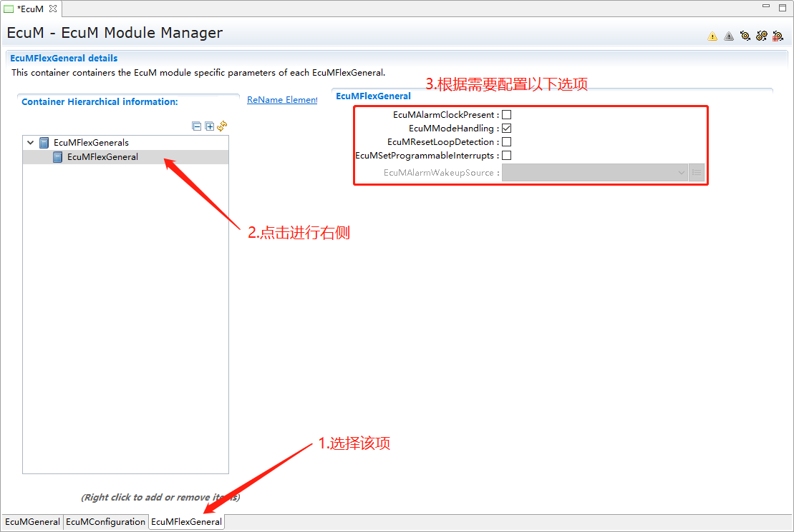
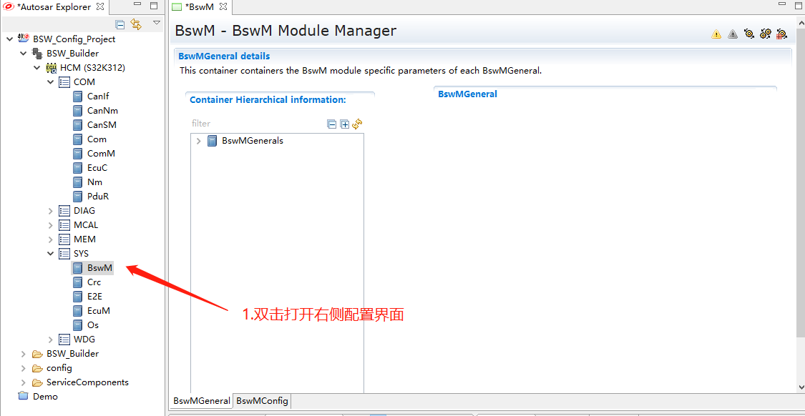
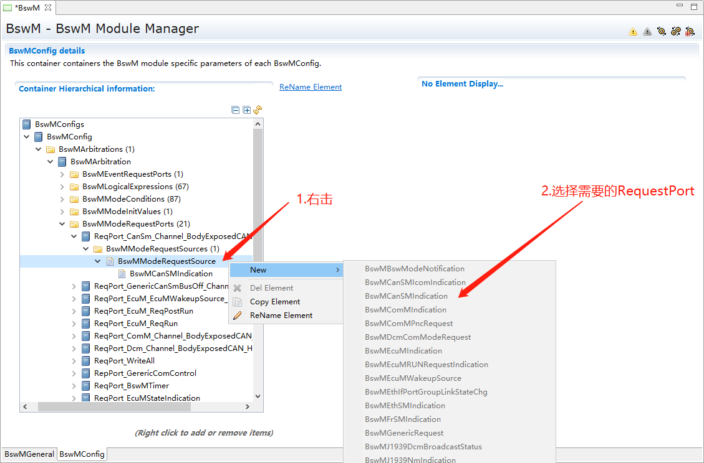
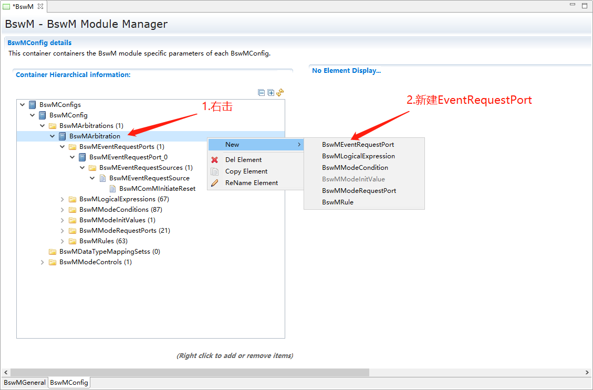

===================
BswM&EcuM_集成手册
===================

\ 应用软件 |
   +---------------+------------------------------------------------------+
   | BSW           | Basic Software基础软件                               |
   +---------------+------------------------------------------------------+
   | MCAL          | -  Microcontroller Abstraction Layer微控制器抽象层   |
   +---------------+------------------------------------------------------+
   | CanIf         | CAN Interface module CAN接口模块                     |
   +---------------+------------------------------------------------------+
   | CanSM         | CAN State Manager module CAN状态管理器模块           |
   +---------------+------------------------------------------------------+
   | ComM          | Communication Manager module通信管理器模块           |
   +---------------+------------------------------------------------------+
   | EcuM          | ECU State Manager module ECU状态管理器模块           |
   +---------------+------------------------------------------------------+
   | PduR          | PDU Router module PDU模块化路由器                    |
   +---------------+------------------------------------------------------+
   | Com           | Communication 通讯                                   |
   +---------------+------------------------------------------------------+
   | CanNm         | CAN Network Management CAN网络管理                   |
   +---------------+------------------------------------------------------+
   | NMIf          | Network Management Interface网络管理接口             |
   +---------------+------------------------------------------------------+
   | BswM          | Basic Software Mode Manager基础软件模式管理器        |
   +---------------+------------------------------------------------------+
   | EcuM          | -  ECU State Manager ECU状态管理器                   |
   +---------------+------------------------------------------------------+

参考文档
========

[1]参考手册_BswM.pdf

[2]参考手册_EcuM.pdf

协议栈集成
==========

项目交付的内容为：协议栈源码和ORIENTAIS
Configurator配置工具。协议栈细分为协议栈的各模块及其对应的配置工具模块。

系统服务栈各模块的功能介绍，参见表 4‑1系统服务栈模块介绍。

使用协议栈源码和配置工具，进行协议栈的集成的步骤，参见表 4‑2
协议栈集成的步骤。

.. table:: 表 4‑1系统服务栈模块介绍

   +---------+------------------------------------------------------------+
   | **模    | **功能**                                                   |
   | 块名**  |                                                            |
   +---------+------------------------------------------------------------+
   | EcuM    | 对ECU节点的运行状态进行管理                                |
   +---------+------------------------------------------------------------+
   | BswM    | 对整个BSW软件模块进行管理                                  |
   +---------+------------------------------------------------------------+

.. table:: 表 4‑2 协议栈集成的步骤

   +-----+--------------------------+------------------------------------+
   | *   | **操作**                 | **说明**                           |
   | *步 |                          |                                    |
   | 骤  |                          |                                    |
   | **  |                          |                                    |
   +-----+--------------------------+------------------------------------+
   | 1   | ORIENTAIS                | 若配置工具已经搭建                 |
   |     | Configurator配置工具     | ，则仅需进行协议栈模块的加载操作。 |
   |     | 工程搭建和协议栈模块加载 |                                    |
   +-----+--------------------------+------------------------------------+
   | 2   | 模块配置及配置文件生成   | NA                                 |
   +-----+--------------------------+------------------------------------+
   | 3   | 代码集成                 | 现有工程、                         |
   |     |                          | 协议栈源代码和配置生成文件的集成。 |
   +-----+--------------------------+------------------------------------+
   | 4   | 验证测试                 | NA                                 |
   +-----+--------------------------+------------------------------------+

**注意：协议栈集成之前，用户须确保已经有基础工程，且本协议栈相关的其他协议栈能正常工作。**

新建ORIENTAIS Configurator配置工程及模块加载
--------------------------------------------

BswM和EcuM的使用非空中楼阁，需要建立在其他模块已经集成的基础上，集成这两个模块只需要在工具添加相应模块进行配置集成即可。

#. 右击如图所示ECU，选择Add Moudle。

|image1|

图4-1 新建工程添加新模块-1

2. 勾选EcuM和BswM模块，点击Finish。

|image2|

图 4-2 新建工程添加新模块-2

3. 出现下图所示模块则为添加成功。

..

   |image3|

图4-3 新建工程添加新模块-3

模块配置及生成代码
------------------

模块配置
~~~~~~~~

模块的具体配置，取决于具体的项目需求。

配置代码生成
~~~~~~~~~~~~

#. 在ORIENTAIS
   Configurator主界面左方，选择对应的协议栈，单击右键弹出Validate
   All和Generate All菜单，也可以单个模块Validate和Generate。

|image4|

图4-4 Generate All来生成Sys下的所有配置代码

|image5|

图4-5 针对EcuM进行校验

2. 选择Validate
   All对本协议栈各配置选项进行校验，没有错误提示信息即校验通过。若有错误信息，请按照错误提示修改。

3. 选择Generate
   All，生成配置文件。右下角的Console窗口输出生成的配置文件信息。

|image6|

图4-6 Console窗口的信息

4. 展开工程下config文件夹，即可查看生成的配置文件。

|image7|

图4-7 config文件夹下的配置文件

功能集成
--------

代码集成
~~~~~~~~

协议栈代码包括两部分：项目提供的协议栈源码和ORIENTAIS
Studio配置工具生成的配置代码。

用户须将协议栈源码和章节4.2.2生成的源代码添加到集成开发工具的对应文件夹。协议栈集成的文件结构，见章节5.3。

**注意：协议栈集成之前，用户须确保已经有基础工程，且本协议栈相关的其他协议栈能正常工作。**

集成注意事项
~~~~~~~~~~~~

对于集成过程中，协议栈特殊要求和用户经常出现的问题，归类总结形成 表
4‑3协议栈集成约束清单。用户需逐一排查表中的约束项，以避免集成问题出现。

.. table:: 表 4‑3 协议栈集成约束清单

   +-----+---------+-----------------------------------------------------+
   | *   | *       | **约束限制**                                        |
   | *编 | *类别** |                                                     |
   | 号  |         |                                                     |
   | **  |         |                                                     |
   +-----+---------+-----------------------------------------------------+
   | **  | 头文件  | -  添加                                             |
   | 1** |         | 协议栈代码之后，用户需更新集成开发工具中的头文件路  |
   |     |         | 径。调用协议栈API的源文件，需要包含协议栈的头文件。 |
   +-----+---------+-----------------------------------------------------+
   | **  | 初始化  | -  确                                               |
   | 2** |         | 保EcuM_Init()和EcuM_StartupTwo()两个函数被正确调用  |
   +-----+---------+-----------------------------------------------------+
   | **  | 周      | -  EcuM_Ma                                          |
   | 3** | 期函数  | inFunction()和BswM_MainFunction()需要放到周期任务。 |
   +-----+---------+-----------------------------------------------------+

集成示例
========

本章节向用户展示系统服务（EcuM&BswM）栈的集成过程。用户可以据此熟悉系统服务栈配置工具的配置过程，以及如何应用配置工具生成的配置文件。

**注意：本示例不代表用户的实际配置情况，用户需要根据自己的实际需求，决定各个参数的配置，另外配置工具有很多其他特性，比如新建条目可以在文件夹上右击、某些情况选中文件夹可以在界面右侧上下移动调整条目顺序等，请自行探索，手册截图上只代表个人习惯方式。**

集成目标
--------

**根据用户策略需求配置BswM和EcuM模块，满足策略需求。本示例实现主要功能：**

#. **通信和网络管理报文的开和关**

#. **上电主动请求网络**

#. **被动唤醒本节点**

模块的配置
----------

模块加载操作，请参考本文档\ **4.2**\ 章节。

EcuM模块配置
~~~~~~~~~~~~

#. 双击EcuM图标，打开EcuM配置界面。

|image8|

图5-1 EcuM的配置界面

2. 配置EcuMGeneral界面选项，该界面通常只需要关注Main Function
   Period（切记要保证该模块Mainfunction放到OS对应周期Task），其他不需要配置。

|image9|

图5-2 MainFunction的执行时间

3. 配置EcuMConfiguration界面参数，新建下图所示项。

|image10|

图5-3 配置EcuMConfiguration

4. 配置EcuMCommonConfiguration。

|image11|

图5-4 配置EcuMCommonConfiguration

5. 配置EcuMDefaultShutdownTarget。

|image12|

图5-5 配置EcuMDefaultShutdownTarget

6. 配置EcuMDriverInitListOne，特别要注意模块初始化顺序，根据顺序依次进行添加配置。

|image13|

图5-6 配置EcuMDriverInitListOne – 1

|image14|

   图5-7 配置EcuMDriverInitListOne - 2

图5-8 配置EcuMDriverInitListOne - 3

|image15|

图5-9 配置EcuMDriverInitListOne - 4

7. 配置EcuMWakeupSource。

|image16|

图5-10 配置EcuMWakeupSource - 1

|image17|

图5-11 配置EcuMWakeupSource - 2

8. 配置EcuMSleepMode。

|image18|

图5-12 配置EcuMSleepMode - 1

|image19|

图5-13 配置EcuMSleepMode - 2

9. 配置EcuMFlexConfiguration。

|image20|

图5-14 配置EcuMFlexConfiguration

|image21|

图5-15 配置EcuC中的Partition

10. 配置EcuMFlexConfiguration下属文件夹下各子项，首先配置EcuMFlexUserConfig，然后配置其他。

|image22|

图5-16配置EcuMFlexConfiguration的子项

11. 配置EcuMFlexUserConfig。

|image23|

图5-17 配置EcuMFlexUserConfig

12. 配置EcuMDriverInitListBswM。

|image24|

图5-18 配置EcuMDriverInitListBswM - 1

|image25|

图5-19 配置EcuMDriverInitListBswM - 2

13. 配置EcuMGoDownAllowedUser。

|image26|

图5-20 配置EcuMGoDownAllowedUser

14. 配置EcuMFlexGeneral。

|image27|

图5-21 配置EcuMFlexGeneral

15. EcuM模块配置完毕，进行校验生成配置代码，若校验出错，则根据提示信息Check对应配置项，修改之后重新校验生成。

BswM模块配置
~~~~~~~~~~~~

BswM配置和代码调试均比较复杂，此处说明该模块的配置原则，根据原则进行配置可以使条理更加清晰，配置效率提升，配置结果更容易达到预期目标。\ **该原则就是：根据软件控制管理需求制定所需Rules（规则），根据Rule衍生出Ruel所需逻辑表达式、所用本模块和其他模块Port（函数接口）以及Rule下要执行的操作行为；根据逻辑表达式衍生出需要判断的条件（Condition），条件有一个或多个；每个Rule对应一个操作行为执行列表，每个执行列表可以挂接一个或者多个操作行为。**

#. 双击BswM模块，打开BswM模块的配置界面。

|image28|

图5-22 打开BswM的配置界面

2. 配置BswMGeneral。

|image29|

图5-23 配置BswMGeneral

3. 在BswMGeneral下新建BswMUserIncludeFiles并配置。

|image30|

.. figure:: ../../_static/集成手册/BswM&EcuM/image36.png
   :width: 5.76736in
   :height: 3.86944in

   图5-24 新建BswMUserIncludeFiles

图5-25 配置BswMUserIncludeFiles

4. 配置BswMConfig。

|image31|

图5-26 配置BswMConfig

5. 配置BswMArbitration下BswMRule。

|image32|

.. figure:: ../../_static/集成手册/BswM&EcuM/image39.png
   :width: 5.76736in
   :height: 3.80069in

   图5-27 新建Rule

图5-28 配置Rule

6. 配置BswMArbitration下BswMModeRequestPort。

|image33|

   图5-29 新建BswMModeRequestPort

图5-30 配置BswMModeRequestPort - 1

|image34|

.. figure:: ../../_static/集成手册/BswM&EcuM/image43.png
   :width: 5.76736in
   :height: 3.80069in

   图5-31 配置BswMModeRequestPort - 2

图5-32 配置BswMModeRequestPort - 3

7. 配置上一步Mode通知源的初始值，即RequestPort的未被调用之前的默认通知值。

|image35|

   图5-33 配置Mode的初始值 - 1

图5-34 配置Mode的初始值 - 2

8. 配置BswMArbitration下BswMLogicalExpression。

|image36|

.. figure:: ../../_static/集成手册/BswM&EcuM/image47.png
   :width: 5.76736in
   :height: 3.80069in

   图5-35 配置BswMLogicalExpression - 1

图5-36 配置BswMLogicalExpression - 2

9. 配置BswMArbitration下BswMModeCondition。

|image37|

.. figure:: ../../_static/集成手册/BswM&EcuM/image49.png
   :width: 5.76736in
   :height: 3.80069in

   图5-37 新建BswMModeCondition

图5-38 新建BswMModeCondition

|image38|

.. figure:: ../../_static/集成手册/BswM&EcuM/image51.png
   :width: 5.76736in
   :height: 3.13611in

   图5-39 配置BswMModeCondition - 1

图5-40 配置BswMModeCondition - 2

10. 配置EventRequestPort。

|image39|

.. figure:: ../../_static/集成手册/BswM&EcuM/image53.png
   :width: 5.76736in
   :height: 3.80069in

   图5-41 配置EventRequestPort - 1

图5-42 配置EventRequestPort - 2

11. 配置BswMModeControl下的BswMAction。

|image40|

.. figure:: ../../_static/集成手册/BswM&EcuM/image55.png
   :width: 5.76736in
   :height: 3.80069in

   图5-43 配置BswMAction - 1

图5-44 配置BswMAction - 2

|image41|

图5-45 配置BswMAction - 3

12. 配置BswMModeControl下的BswMActionList（注：有的ActionList的Action需要注意执行顺序，需根据需要作出调整，执行顺序为界面呈现的顺序）。

|image42|

图5-46 配置BswMActionList - 1

|image43|

.. figure:: ../../_static/集成手册/BswM&EcuM/image59.png
   :width: 5.76736in
   :height: 3.80069in

   图5-47 配置BswMActionList - 2

图5-48 配置BswMActionList - 3

13. BswMRteModeRequestPort的配置。

|image44|

图5-49 配置BswMRteModeRequestPort – 1

|image45|

图5-50 配置BswMRteModeRequestPort - 2

14. 配置BswMSwitchPort的配置。

|image46|

图5-51 配置BswMSwitchPort – 1

|image47|

图5-52 配置BswMSwitchPort - 2

15. 配置完毕，进行校验生成配置代码，若校验出错，则根据提示信息Check对应配置项，修改之后重新校验生成。

源代码集成
----------

项目交付给用户的工程结构如下：

|image48|

图5-56 BSW的工程结构图

-  Config目录用来存放配置工具生成的配置文件，各模块或各栈建立对应文件夹存放对应模块配置代码。

-  Source目录存放模块相关的源代码，各模块建立对应文件夹存放对应模块源代码。

系统服务栈源代码集成：新建对应的源码文件夹和配置文件文件夹，将对应源码和配置代码放入，然后工程中添加相应头文件路径即可。

协议栈调度集成
--------------

系统服务栈调度集成步骤如下：

#. 协议栈调度集成，需要逐一排查并实现表
   5‑1协议栈集成约束清单所罗列的问题，以避免集成出现差错。

#. 编译链接代码，将生成的elf文件烧写进芯片。

系统服务栈有关的代码，在下方的main.c文件中给出重点标注。

**注意 :
本示例仅供参考，并不代表其他项目main.c文件与此完全相同，需要具体项目具体对待。**

**特别说明：**\ 在其他协议栈如网络管理栈或者通信栈正常运行前提下，添加该两个模块后需要在main.c文件main函数中在所有其他模块初始化之后（while（1）之前）调用EcuM_Init()和EcuM_StartupTwo()函数进行这两个模块的初始化，BswM模块的初始化函数在EcuM_StartupTwo()被调用，读者不需要特别关心。\ **这里特别说明两种情况：一种是MACL中一些模块和BSW中各模块初始化可以在EcuM模块工具进行配置，此情况下在调用EcuM_Init()函数中会间接调用各模块初始化函数将各模块初始化；另一种是各模块初始化都没有在EcuM模块工具进行配置，那这个时候需要将各模块初始化函数在main函数中按合理顺序进行调用将整个工程正常初始化。**

**#include**\ <stdlib.h>

**#include**"Std_Types.h"

**#include**"Mcu.h"

**#include**"Port.h"

**#include**"Dio.h"

**#include**"Irq.h"

**#include**"Gpt.h"

**#include**"Gtm.h"

**#include**"Adc.h"

**#include**"Can_17_MCanP.h"

**#include**"Bsw_Test.h"

**#include**"Icu_17_GtmCcu6.h"

**#include**"Pwm_17_Gtm.h"

**#include**"Spi.h"

**#include**"CanIf.h"

**#include**"Can_17_MCanP_Dbg.h"

系统服务协议栈相关模块头文件

**#include**"EcuM.h"

**#include**"BswM.h"

**intmain**\ (**void**)

{

Mcu_Init(Mcu_ConfigRoot);

Mcu_InitClock(0);

**while** (MCU_PLL_UNLOCKED == Mcu_GetPllStatus())

{

/\* wait for PLL locked \*/

}

Mcu_DistributePllClock();

/\* IrqGtm_Init \*/

IrqGtm_Init();

/\* Port Initialize \*/

Port_Init(&Port_ConfigRoot[0]);

/\* GPT Initialize \*/

Gpt_Init(&Gpt_ConfigRoot[0]);

/\* *Gpt* enable 1ms notification,and start \*/

Gpt_EnableNotification(GptConf_GptChannel_GptChannelConfiguration_0);

Gpt_StartTimer(GptConf_GptChannel_GptChannelConfiguration_0, 6250);

/\* CAN Initialize \*/

Can_17_MCanP_Init(&Can_17_MCanP_ConfigRoot[0]);

/\*Enable CAN*/

Can_17_MCanP_SetControllerMode(Can_17_MCanPConf_CanController_CanController_0,
CAN_T_START);S

/\* CanIf Initialize \*/

CanIf_Init(&CanIf_InitCfgSet);

/\* *Adc* Initialize \*/

Adc_Init(&Adc_ConfigRoot[0]);

/\* *Icu* Initialize \*/

Icu_17_GtmCcu6_Init(&Icu_ConfigRoot[0]);

Icu_17_GtmCcu6_StartSignalMeasurement(ICU_17_GTMCCU6_INSTANCE_ID);

/\* *Pwm* Initialize \*/

Pwm_17_Gtm_Init(&Pwm_ConfigRoot[0]);

/\* *Spi* Initialize \*/

Spi_Init(&Spi_ConfigRoot[0]);

EcuM_Init();

EcuM_StartupTwo();

/\* EnableallInterrupt*/

Mcal_EnableAllInterrupts();

**while**\ (1)

{

**if** (TRUE == Gpt_1msFlag)

{

Gpt_1msFlag = FALSE;

Run_msCounter();

Can_17_MCanP_MainFunction_Write();

Can_17_MCanP_MainFunction_Read();

Can_17_MCanP_MainFunction_Wakeup();

}

**if** (TRUE == Gpt_10msFlag)

{

Gpt_10msFlag = FALSE;

EcuM_MainFunction();

BswM_MainFunction();

}

}

**return** 1;

}

验证结果
--------

将工程编译通过后，使用劳德巴赫调试工具进行调试，程序成功运行后，使用VehicleSpy观测现象。

#. 指令数据：CanID为0x666的接收报文作为指令载体，Byte1的数据作为指令进行特定处理。

|image49|

图5-57 指令数据

2. 测试结果——程序上电后根据PowerOn唤醒事件进行主动请求网络，网络管理报文（0x4xx）先进行快发然后正常周期发送，通信打开数据周期发送，结果如下图所示

|image50|

图5-58 测试结果 - 1

3. 测试结果——通过指令进行关发送通信，网络管理报文和通信报文停止发送，结果如下图所示

|image51|

图5-59 测试结果 - 2

4. 测试结果——通过指令进行开发送通信，网络管理报文和通信报文恢复发送，结果如下图所示

|image52|

图5-60 测试结果 - 3

5. 测试结果——通过指令请求释放网络，节点进入休眠，ECU到达低功耗运行态，网络管理报文和通信报文停止发送，结果如下图所示

|image53|

图5-61 测试结果 - 4

6. 测试结果——发送唤醒报文进行唤醒，节点被动唤醒后进入正常运行态一段时间后再次进入休眠，网络管理报文和通信报文停止发送，结果如下图所示\ **（本示例采用CAN唤醒，不对ID进行过滤）**

|image54|

图5-62 测试结果 - 5

.. |image1| image:: ../../_static/集成手册/BswM&EcuM/image1.png
   :width: 5.76736in
   :height: 4.91042in

.. |image3| image:: ../../_static/集成手册/BswM&EcuM/image3.png
   :width: 5.28426in
   :height: 2.71528in

.. |image6| image:: ../../_static/集成手册/BswM&EcuM/image6.png
   :width: 5.76736in
   :height: 4.17639in
.. |image7| image:: ../../_static/集成手册/BswM&EcuM/image7.png
   :width: 5.76736in
   :height: 4.17014in

.. |image10| image:: ../../_static/集成手册/BswM&EcuM/image10.png
   :width: 5.76736in
   :height: 3.63333in
.. |image11| image:: ../../_static/集成手册/BswM&EcuM/image12.png
   :width: 5.76736in
   :height: 3.73333in
.. |image12| image:: ../../_static/集成手册/BswM&EcuM/image13.png
   :width: 5.76736in
   :height: 3.09931in

.. |image14| image:: ../../_static/集成手册/BswM&EcuM/image15.png
   :width: 5.76736in
   :height: 3.09931in

.. |image17| image:: ../../_static/集成手册/BswM&EcuM/image20.png
   :width: 5.76736in
   :height: 4.13472in
.. |image18| image:: ../../_static/集成手册/BswM&EcuM/image22.png
   :width: 5.76736in
   :height: 2.95417in
.. |image19| image:: ../../_static/集成手册/BswM&EcuM/image24.png
   :width: 5.76736in
   :height: 2.95417in
.. |image20| image:: ../../_static/集成手册/BswM&EcuM/image25.png
   :width: 5.76736in
   :height: 2.95417in

.. |image22| image:: ../../_static/集成手册/BswM&EcuM/image27.png
   :width: 5.76736in
   :height: 3.87431in
.. |image23| image:: ../../_static/集成手册/BswM&EcuM/image28.png
   :width: 5.76736in
   :height: 3.87431in
.. |image24| image:: ../../_static/集成手册/BswM&EcuM/image29.png
   :width: 5.76736in
   :height: 3.87431in

.. |image26| image:: ../../_static/集成手册/BswM&EcuM/image31.png
   :width: 5.76736in
   :height: 3.87431in

.. |image29| image:: ../../_static/集成手册/BswM&EcuM/image34.png
   :width: 5.76736in
   :height: 3.86944in
.. |image30| image:: ../../_static/集成手册/BswM&EcuM/image35.png
   :width: 5.76736in
   :height: 3.86944in

.. |image32| image:: ../../_static/集成手册/BswM&EcuM/image38.png
   :width: 5.76736in
   :height: 3.86944in

.. |image35| image:: ../../_static/集成手册/BswM&EcuM/image44.png
   :width: 5.76736in
   :height: 3.80069in
.. |image36| image:: ../../_static/集成手册/BswM&EcuM/image46.png
   :width: 5.76736in
   :height: 3.80069in
.. |image37| image:: ../../_static/集成手册/BswM&EcuM/image48.png
   :width: 5.76736in
   :height: 3.80069in
.. |image38| image:: ../../_static/集成手册/BswM&EcuM/image50.png
   :width: 5.76736in
   :height: 2.98819in

.. |image41| image:: ../../_static/集成手册/BswM&EcuM/image56.png
   :width: 5.76736in
   :height: 3.80069in
.. |image42| image:: ../../_static/集成手册/BswM&EcuM/image57.png
   :width: 5.76736in
   :height: 3.80069in
.. |image43| image:: ../../_static/集成手册/BswM&EcuM/image58.png
   :width: 5.76736in
   :height: 3.80069in
.. |image44| image:: ../../_static/集成手册/BswM&EcuM/image60.png
   :width: 5.76736in
   :height: 4.57917in
.. |image45| image:: ../../_static/集成手册/BswM&EcuM/image61.png
   :width: 5.76736in
   :height: 4.57917in
.. |image46| image:: ../../_static/集成手册/BswM&EcuM/image62.png
   :width: 5.76736in
   :height: 4.57917in
.. |image47| image:: ../../_static/集成手册/BswM&EcuM/image63.png
   :width: 5.76736in
   :height: 4.57917in
.. |image48| image:: ../../_static/集成手册/BswM&EcuM/image64.png
   :width: 2.74966in
   :height: 3.38499in
.. |image49| image:: ../../_static/集成手册/BswM&EcuM/image65.png
   :width: 5.74514in
   :height: 1.37222in
.. |image50| image:: ../../_static/集成手册/BswM&EcuM/image66.png
   :width: 5.76736in
   :height: 7.05694in
.. |image51| image:: ../../_static/集成手册/BswM&EcuM/image67.png
   :width: 5.78264in
   :height: 3.24514in
.. |image52| image:: ../../_static/集成手册/BswM&EcuM/image68.png
   :width: 5.76736in
   :height: 5.66875in

.. |image54| image:: ../../_static/集成手册/BswM&EcuM/image70.png
   :width: 5.76736in
   :height: 7.79861in
