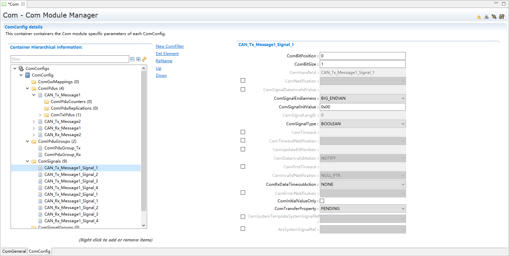
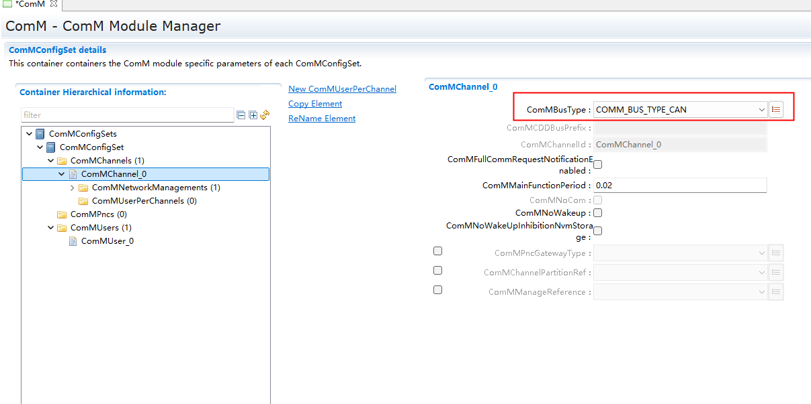
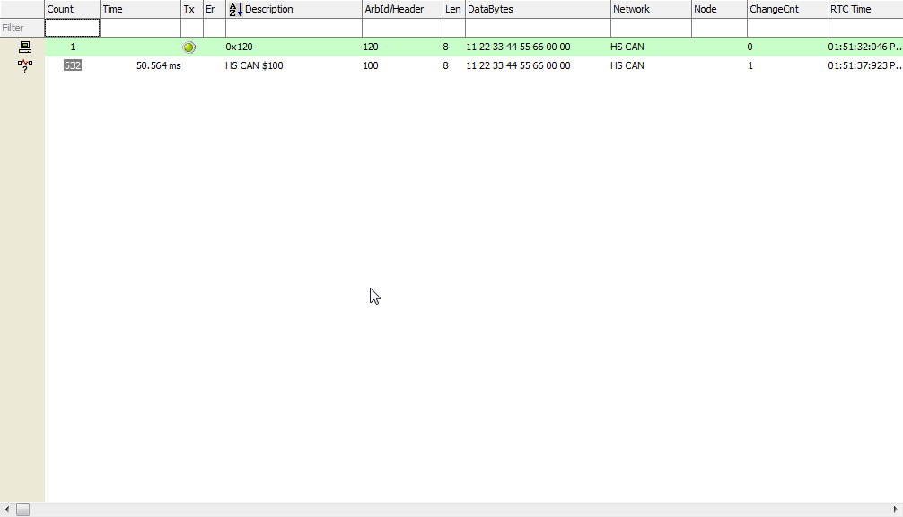

===================
CAN_集成手册
===================

目标
====

本集成手册用于指导客户进行通信栈集成，文档主要包括的内容为：通信栈集成指导。

由于各项目的需求不同，集成示例不会针对于特定的商业项目做详细讲解。

缩写词和术语
============

.. table:: 表 2‑1 缩写词和术语

   +---------------+------------------------------------------------------+
   | **\           | **描述**                                             |
   | 缩写词/术语** |                                                      |
   +---------------+------------------------------------------------------+
   | BSW           | Basic Software 基础软件层                            |
   +---------------+------------------------------------------------------+
   | BswM          | Basic Software Mode Manager基础软件模式管理器        |
   +---------------+------------------------------------------------------+
   | MCAL          | Microcontroller Abstraction Layer 微控制器抽象层     |
   +---------------+------------------------------------------------------+
   | CANIF         | CAN Interface module CAN接口模块                     |
   +---------------+------------------------------------------------------+
   | CanSm         | CAN State Manager module CAN状态管理器模块           |
   +---------------+------------------------------------------------------+
   | ComM          | Communication Manager module通信管理器模块           |
   +---------------+------------------------------------------------------+
   | EcuM          | ECU State Manager module ECU状态管理器模块           |
   +---------------+------------------------------------------------------+
   | SchM          | Scheduler Module调度程序模块                         |
   +---------------+------------------------------------------------------+

参考文档
========

[1]参考手册_CanIf.pdf

[2]参考手册_Com.pdf

[3]参考手册_EcuC.pdf

[4]参考手册_PduR.pdf

[5]参考手册_CanSM.pdf

Can通信栈集成
=============

项目交付的内容为：Can通信栈源码和ORIENTAIS
Configurator配置工具。通信栈细分为通信栈的各模块及其对应的配置工具模块。

通信栈各配置模块的功能介绍，参见表 4‑1通信栈各配置模块介绍。

使用通信栈源码和配置工具，进行通信栈的集成的步骤，参见表 4‑2
通信栈集成的步骤。

.. table:: 表 4‑1通信栈各配置模块介绍

   +---------+------------------------------------------------------------+
   | **模\   | **功能**                                                   |
   | 块名**  |                                                            |
   +---------+------------------------------------------------------------+
   | Can     | CAN驱动配置。(由mcal配置工具导入，详见章节5.2.1)           |
   +---------+------------------------------------------------------------+
   | CanIf   | CanIf模块主要处理上层模块与底层驱动的之间                  |
   |         | PDU的传递，为上层模块提供统一的接口来管理不同的CAN硬件模块 |
   +---------+------------------------------------------------------------+
   | EcuC    | 用于辅助配置工具完成配置的模块。主                         |
   |         | 要提供Pdu的定义，其它模块通过关联EcuC中Pdu，相互关联起来。 |
   +---------+------------------------------------------------------------+
   | PduR    | PDU                                                        |
   |         | Router主要为通讯接口模块（CANIF）、传输协议模              |
   |         | 块、诊断通讯管理模块以及通讯模块提供基于I-PDU的路由服务。  |
   +---------+------------------------------------------------------------+
   | Com     | COM模块主要提供I-PDU和信号相关管理功能                     |
   +---------+------------------------------------------------------------+
   | CanSM   | 主要功                                                     |
   |         | 能是与通信硬件抽象层和系统服务层产生交互，为每一个CAN通信  |
   |         | 总线定义一个总线相关的状态管理，并为相关的总线提供流控制。 |
   +---------+------------------------------------------------------------+

.. table:: 表 4‑2 通信栈集成的步骤

   +-----+--------------------------+------------------------------------+
   |     | **操作**                 | **说明**                           |
   |**步\|                          |                                    |
   |骤** |                          |                                    |
   |     |                          |                                    |
   +-----+--------------------------+------------------------------------+
   | 1   | ORIENTAIS                | 若配置工具已经搭建                 |
   |     | Stuido配置工具           | ，则仅需进行通信栈模块的加载操作。 |
   |     | 工程搭建和通信栈模块加载 |                                    |
   +-----+--------------------------+------------------------------------+
   | 2   | 模块配置及配置文件生成   | NA                                 |
   +-----+--------------------------+------------------------------------+
   | 3   | 代码集成                 | 现有工程、                         |
   |     |                          | 通信栈源代码和配置生成文件的集成。 |
   +-----+--------------------------+------------------------------------+
   | 4   | 验证测试                 | NA                                 |
   +-----+--------------------------+------------------------------------+

**注意：通信栈集成之前，用户须确保已经有基础工程，且本通信栈相关的其他通信栈能正常工作。**

新建ORIENTAIS Configurator配置工程及模块加载
--------------------------------------------

#. 安装ORIENTAIS Configurator软件后，双击软件图标打开软件。

.. figure:: ../../_static/集成手册/CAN/image1.png
   :width: 5.63542in
   :height: 4.11528in

图 4‑1 配置工程-1

2. 菜单栏File🡪New🡪Project，新建工程。

.. figure:: ../../_static/集成手册/CAN/image2.png
   :width: 5.65625in
   :height: 4.19167in

图 4‑2 配置工程-2

3. 在弹出的新建窗口中选择Autosar下的 [BSW Project]，选择Next。

.. figure:: ../../_static/集成手册/CAN/image3.png
   :width: 5.67708in
   :height: 4.14375in

图 4‑3 配置工程-3

4. 在弹出的窗口中输入工程名，选择Finish。

.. figure:: ../../_static/集成手册/CAN/image4.png
   :width: 5.76736in
   :height: 4.18611in

图 4‑4 配置工程-4

5. 在弹出的窗口中选择Yes。

.. figure:: ../../_static/集成手册/CAN/image5.png
   :width: 5.4375in
   :height: 2.55208in

图 4‑5 配置工程-5

6. 选择[Bsw_Builder]，右键单击，选择New ECU Configuration。

|image1|

图 4‑6 配置工程-6

7. 在弹出的窗口中输入ECU名，然后选择Next。

.. figure:: ../../_static/集成手册/CAN/image7.png
   :width: 4.56173in
   :height: 4.32713in

图 4‑7 配置工程-7

8. 在弹出的窗口中勾选需添加的模块，点击Finish。

.. figure:: ../../_static/集成手册/CAN/image8.png
   :width: 5.46875in
   :height: 5.1875in

图 4‑8 配置工程-8

.. figure:: ../../_static/集成手册/CAN/image9.png
   :width: 5.52235in
   :height: 1.32451in

图 4‑9 配置工程-9

9. 新建工程如下所示，步骤⑦中添加的模块已经被加入到工程中。

.. figure:: ../../_static/集成手册/CAN/image10.png
   :width: 5.76736in
   :height: 2.10069in

图 4‑10 配置工程-10

模块配置及代码生成
------------------

模块配置
~~~~~~~~

模块的具体配置，取决于具体的项目需求。该通信栈各模块配置项的详细介绍，参见表
4 3通信栈各模块配置参考文档。

.. table:: 表 4‑3通信栈各模块配置参考文档

   +--------+---------------------------------------------+--------------+
   |**模块**| **参考文档及其章节**                        | **说明**     |
   |        |                                             |              |
   +--------+---------------------------------------------+--------------+
   | Can    | MCAL对应的Can配置手册                       |              |
   +--------+---------------------------------------------+--------------+
   | CanIf  | 参考手册_CanIf.pdf                          |              |
   +--------+---------------------------------------------+--------------+
   | PduR   | 参考手册_PduR.pdf                           |              |
   +--------+---------------------------------------------+--------------+
   | Com    | 参考手册_Com.pdf                            |              |
   +--------+---------------------------------------------+--------------+
   | CanSM  | 参考手册_CanSM.pdf                          |              |
   +--------+---------------------------------------------+--------------+
   | EcuC   | 参考手册_EcuC.pdf                           |              |
   +--------+---------------------------------------------+--------------+
   | ComM   | 参考手册_ComM.pdf                           |              |
   +--------+---------------------------------------------+--------------+

配置代码生成
~~~~~~~~~~~~

#. 在ORIENTAIS Stuido主界面左方，选择对应的通信栈，单击右键弹出Validate
   All和Generate All菜单。

.. figure:: ../../_static/集成手册/CAN/image11.png
   :width: 5.76736in
   :height: 2.96111in

图 4‑11 模块配置

2. 选择Validate
   All对本通信栈各配置选项进行校验，没有错误提示信息即校验通过。若有错误信息，请按照错误提示修改。

3. 选择Generate
   All，生成配置文件。右下角的Console窗口输出生成的配置文件信息。

.. figure:: ../../_static/集成手册/CAN/image12.png
   :width: 4.54236in
   :height: 1.31458in

图 4‑12 模块配置

4. 将ORIENTAIS Configurator切换到Resource模式，即可查看生成的配置文件。

.. figure:: ../../_static/集成手册/CAN/image13.png
   :width: 5.77153in
   :height: 2.04097in

图 4‑13 模块配置

功能集成
--------

代码集成
~~~~~~~~

通信栈代码包括两部分：项目提供的通信栈源码和ORIENTAIS
Configurator配置生成代码。通信栈集成包括通信栈源码（CAN、CanIf、PduR、ComM、CanSM等）、定时器源码和部分其他模块源码，具体文件见表4-4。

用户须将通信栈源码和章节4.2.2生成的源代码添加到集成开发工具的对应文件夹。通信栈集成的文件结构，见章节④。

表4-4通信栈源码文件

+-----------------+---------------------------------+-----------------+
| 移库文件夹      | 移库文件                        | 说明            |
+-----------------+---------------------------------+-----------------+
| ComM            | ComM.c、ComM_MemMap.h、         | 通信栈源码      |
|                 |                                 |                 |
|                 | ComM.h、、ComM_Internal.c、     |                 |
|                 |                                 |                 |
|                 | ComM_BusSM.h、ComM_Nm.h         |                 |
|                 |                                 |                 |
|                 | ComM_Com.h、ComM_Internal.h、   |                 |
|                 |                                 |                 |
|                 | ComM_Dcm.h、ComM_EcuMBswM.h     |                 |
|                 |                                 |                 |
|                 |                                 |                 |
|                 |                                 |                 |
|                 |                                 |                 |
|                 |                                 |                 |
|                 |                                 |                 |
+-----------------+---------------------------------+-----------------+
| CanIf           | CanIf.c、CanIf_Types.h          |                 |
|                 |                                 |                 |
|                 | CanIf.h、、CanIf_MemMap.h、     |                 |
|                 |                                 |                 |
|                 | CanIf_Cbk.h                     |                 |
|                 |                                 |                 |
+-----------------+---------------------------------+-----------------+
| CanSM           | CanSM.c、CanSM_MemMap.h、       |                 |
|                 |                                 |                 |
|                 | CanSM.h、CanSM_BswM.h、         |                 |
|                 |                                 |                 |
|                 |                                 |                 |
|                 |                                 |                 |
|                 | CanSM_Cbk.h、CanSM_ComM.h、     |                 |
|                 |                                 |                 |
|                 |                                 |                 |
|                 | CanSM_TxTimeoutException.h      |                 |
+-----------------+---------------------------------+-----------------+
| PDUR            | PduR_CanIf.h、PduR_Com.h、      |                 |
|                 |                                 |                 |
|                 | P\                              |                 |
|                 | duR_Internal.c、PduR_Internal.h |                 |
|                 |                                 |                 |
|                 |                                 |                 |
|                 | PduR.c、PduR_Types.h、          |                 |
|                 |                                 |                 |
|                 | PduR.h、PduR_MemMap.h、         |                 |
+-----------------+---------------------------------+-----------------+
| Com             | Com.c、Com_Types.h、Com_Cbk.h、 |                 |
|                 |                                 |                 |
|                 | Com.h、Com_TxInternal.c         |                 |
|                 |                                 |                 |
|                 | Com_GwInternal.c、Com_Internal.c|                 |
|                 |                                 |                 |
|                 | Com_Internal.h、                |                 |
|                 | Com_MemMap.h、Com_RxInternal.c  |                 |
+-----------------+---------------------------------+-----------------+
| SchM            | SchM.c、                        | SchM部分源码    |
|                 |                                 |                 |
|                 | SchM.h、                        |                 |
|                 |                                 |                 |
|                 | SchM_Com.h、                    |                 |
|                 |                                 |                 |
|                 | SchM_ComM.h、                   |                 |
|                 |                                 |                 |
|                 | SchM_CanIf.h、                  |                 |
|                 |                                 |                 |
|                 | SchM_PduR.h、                   |                 |
+-----------------+---------------------------------+-----------------+
| BswM            | BswM.c、                        | BswM部分源码    |
|                 |                                 |                 |
|                 | BswM.h、                        |                 |
|                 |                                 |                 |
|                 | BswM_CanSM.h、                  |                 |
|                 |                                 |                 |
|                 | BswM_ComM.h、                   |                 |
+-----------------+---------------------------------+-----------------+
| EcuM            | EcuM_Types.h、                  | EcuM部分源码    |
|                 |                                 |                 |
|                 | EcuM.h、                        |                 |
+-----------------+---------------------------------+-----------------+

**注意：通信栈集成之前，用户须确保已经有基础工程，且本通信栈相关的其他通信栈能正常工作。**

集成注意事项
~~~~~~~~~~~~

对于集成过程中，通信栈特殊要求和用户经常出现的问题，归类总结形成 表
4‑5通信栈集成约束清单。用户需逐一排查表中的约束项，以避免集成问题出现。

.. table:: 表 4‑5 通信栈集成约束清单

   +-----+---------+-----------------------------------------------------+
   |**编\|         | **约束限制**                                        |
   |号** | **类别**|                                                     |
   |     |         |                                                     |
   |     |         |                                                     |
   +-----+---------+-----------------------------------------------------+
   |**1**| 中断    | 通信栈                                              |
   |     |         | 有中断、轮询或混合三种工作模式。若选取中断或混合模  |
   |     |         | 式，用户需在通信栈配置对应的中断并填充中断服务API。 |
   +-----+---------+-----------------------------------------------------+
   |**2**| 堆栈    | 用户需确保为任务堆栈和中断堆栈分配足够的堆栈空间。  |
   |     |         |                                                     |
   +-----+---------+-----------------------------------------------------+
   |**3**| 头文件  |添加通信栈代码之后，用户需更新集成开发工具中的头文件 |
   |     |         |路径。                                               |
   |     |         |                                                     |
   |     |         |调用通信栈API的源文件，需要包含通信栈的头文件。      |
   +-----+---------+-----------------------------------------------------+
   |**4**| 初始化  | 以CAN通信为例，通信栈的初始化顺序为：Can_Init，     |
   |     |         | CanIf_Init， PduR_Init， Com_Init，CanSM_Init。     |
   +-----+---------+-----------------------------------------------------+
   |**5**| 周\     | Com_MainFunctionRx，Com_MainFunctionRouteSi         |
   |     | 期函数  | gnals和Com_MainFunctionTx需要被周期性任务函数调用。 |
   +-----+---------+-----------------------------------------------------+

集成示例
========

本章节通过普通的CAN通信栈为例，向用户展示通信栈的集成过程。用户可以据此熟悉通信栈配置工具的配置过程，以及如何应用配置工具生成的配置文件。

为让用户更清晰的了解工具的使用，所用的配置均逐一手动完成。用户可以使用工具中的DBC导入功能，快速完成配置。DBC导入功能不属于本文档介绍范畴，具体操作请参照《参考手册_ORIENTAIS Studio_使用指南.pdf》。

**注意：本示例不代表用户的实际配置情况，用户需要根据自己的实际需求，决定各个参数的配置。**

集成目标
--------

**CAN报文需求：**

.. table:: 表 5‑1

   +--------+------------------+------+------+-------+----------+-------+
   | **报\  | **报文**\        | **发\| **发\|  **报\| **报文\  | **工\ |
   | 文ID** | **名称**         | 送** | 送**\|  文**\| 长度**   | 作**\ |
   |        |                  | **接\| **模\|  **周\|          | **模\ |
   |        |                  | 收** | 式** |  期** |          | 式**  |
   |        |                  |      |      |       |          |       |
   |        |                  |      |      |       |          |       |
   +--------+------------------+------+------+-------+----------+-------+
   | 0x100  | CAN_Tx_Message1  | 发送 | 周期 | 50ms  | 8\       | 轮询  |
   |        |                  |      |      |       | **字节** |       |
   +--------+------------------+------+------+-------+----------+-------+
   | 0x105  | CAN_Tx_Message2  | 发送 | 触发 | -     | 8\       | 轮询  |
   |        |                  |      |      |       | **字节** |       |
   +--------+------------------+------+------+-------+----------+-------+
   | 0x120  | CAN_Rx_Message1  | 接收 | NA   | 100ms | 8\       | 轮询  |
   |        |                  |      |      |       | **字节** |       |
   +--------+------------------+------+------+-------+----------+-------+
   | 0x125  | CAN_Rx_Message2  | 接收 | NA   | -     | 8\       | 轮询  |
   |        |                  |      |      |       | **字节** |       |
   +--------+------------------+------+------+-------+----------+-------+

**CAN报文信号需求：**

-  CAN_Tx_Message1(0x100)包含的信号

图 5‑1 集成示例-1

-   CAN_Tx_Message2(0x105) 包含的信号

图 5‑2 集成示例-2

-  CAN_Rx_Message1(0x120) 包含的信号

.. figure:: ../../_static/集成手册/CAN/image16.png
   :width: 5.77153in
   :height: 0.89583in

图 5‑3 集成示例-3

-  CAN_Rx_Message1(0x125) 包含的信号

.. figure:: ../../_static/集成手册/CAN/image17.png
   :width: 5.77153in
   :height: 0.35in

图 5‑4 集成示例-4

模块的配置
----------

新建配置工程及模块加载操作，请参考本文档4.2章节。

Can模块配置
~~~~~~~~~~~

有多种工具可以用于配置mcal，本章介绍如何使用EB工具配置Can模块，但是只涉及到与通信栈中报文收发有关系的部分（主要是HardwareObeject），其余配置选项请参考EB工具的帮助手册进行配置。

#. 打开EB工具，新建CAN模块后，在以下路径配置HardwareObject：

CAN模块🡪CanConfigSet🡪CanHardwareObject。

根据本次配置示例的目标，需要配置4个HardwareObject，如下图所示：

.. figure:: ../../_static/集成手册/CAN/image18.png
   :width: 5.50839in
   :height: 1.08545in

图 5‑5 模块配置-1

**注意：HardwareObject定义的时候，必须接收报文放在发送报文前面。**

2. 完成EB配置后，生成Can模块的配置文件，替换工程中原有的Can模块的配置文件。

3. 导出EB的配置文件。

4. 将③导出的配置文件，导入到ORIENTAIS Configurator中。

..

   导入后工程如下图所示：

.. figure:: ../../_static/集成手册/CAN/image19.png
   :width: 5.57292in
   :height: 2.40296in

图 5‑6 模块配置-2

CanIf模块配置
~~~~~~~~~~~~~

#. 双击CanIf模块，打开CanIf模块的配置界面。

.. figure:: ../../_static/集成手册/CAN/image20.png
   :width: 5.76736in
   :height: 2.40972in

图 5‑7 模块配置-3

2. CanIfPublicCfg、CanIfPrivateCfg、CanIfDispatchCfg、CanIfTrcvDrvCfg标签页均保持默认值，不需要配置。

3. 在CanIfInitCfg标签页下的容器[CanIfInitCfg]上，右边新建一个CanIfInitHohCfg对象。

.. figure:: ../../_static/集成手册/CAN/image21.png
   :width: 5.76736in
   :height: 2.71597in

图 5‑8 模块配置-4

4. CanIfCtrlDrvCfg配置。

..

   [CanIfCtrlDrvCfg_0]的配置项CanIfCtrlDrvInitHohConfigRef需要关联到步骤③中创建的HOH对象。

   [CanIfCtrlDrvNameRef]的配置项选Can。

.. figure:: ../../_static/集成手册/CAN/image22.png
   :width: 5.76736in
   :height: 3.48194in

图 5‑9 模块配置-5

5. CanIfCtrlCfg配置：

..

   将默认生成的[CanIfCtrlCfg_0]名字改为[CanIfCtrlCfg_Controller0]。

   参数CanIfCtrlCanCtrlRef，选择CanController_0。

.. figure:: ../../_static/集成手册/CAN/image23.png
   :width: 5.76736in
   :height: 3.44792in

图 5‑10 模块配置-6

可在容器[CanIfInitCfg]上右键，新建CanIfBufferCfg、CanIfInitHohCfg、CanIfRxPduCfg、CanIfTxPduCfg。

.. figure:: ../../_static/集成手册/CAN/image24.png
   :width: 5.77153in
   :height: 3.56736in

图 5‑11 模块配置-7

6. 新建一个CanIfInitHohCfg，再在新建的容器[CanIfInitHohCfg_0]上右键新建2个CanIfHrhCfg和2个CanIfHthCfg。然后将新建的容器改为有意义的名字。

..

   每个发送报文需要一个CanIfHrhCfg，每个接收报文需要一个CanIfHthCfg。

.. figure:: ../../_static/集成手册/CAN/image25.png
   :width: 5.76736in
   :height: 3.06389in

图 5‑12 模块配置-8

7. 配置CanIfHrhCfg_Rx_Message1和CanIfHrhCfg_Rx_Message2。

.. figure:: ../../_static/集成手册/CAN/image26.png
   :width: 5.76736in
   :height: 3.33264in

图 5‑13 模块配置-9

.. figure:: ../../_static/集成手册/CAN/image27.png
   :width: 5.76736in
   :height: 3.35in

图 5‑14 模块配置-10

8. 配置CanIfHthCfg_Tx_Message1和CanIfHthCfg_Tx_Message2。

.. figure:: ../../_static/集成手册/CAN/image28.png
   :width: 5.76736in
   :height: 3.1375in

图 5‑15 模块配置-11

.. figure:: ../../_static/集成手册/CAN/image29.png
   :width: 5.76736in
   :height: 3.30486in

图 5‑16 模块配置-12

9. 新建2个CanIfBufferCfg，并修改名字。每个发送报文需要建立一个CanIfBufferCfg。

.. figure:: ../../_static/集成手册/CAN/image30.png
   :width: 5.76736in
   :height: 3.41319in

图 5‑17 模块配置-13

.. figure:: ../../_static/集成手册/CAN/image31.png
   :width: 5.76736in
   :height: 3.24236in

图 5‑18 模块配置-14

10. 新建2个CanIfRxPduCfg，并修改名字。每个接收报文需要在CanIf中配置对应的CanIfRxPduCfg。报文CAN_Rx_Message1对应的CanIfRxPduCfg参数配置如下：

.. table:: 表 5‑2

   +----------------------+------------------+----------------------------+
   | **参数名**           | **设置值**       |**说明**                    |
   +----------------------+------------------+----------------------------+
   | CanIfRxPduCanId      | 0x120            | 报文ID（参照DBC）          |
   +----------------------+------------------+----------------------------+
   | CanIfRxPduCanIdType  | STANDARD_CAN     | 帧类型：标准帧             |
   +----------------------+------------------+----------------------------+
   | CanIfRxPduDlc        | 8                | 报文长度 （参照DBC）       |
   +----------------------+------------------+----------------------------+
   | CanIfRxP             | PDUR             | CanIf                      |
   | duUserRxIndicationUL |                  | 模块收到报文后通知PduR模块 |
   +----------------------+------------------+----------------------------+
   | CanIfRxPduHrhIdRef   | CanIfHr          | 关联到对                   |
   |                      | hCfg_Rx_Message1 | 应的Hrh（本章节步骤⑧创建） |
   +----------------------+------------------+----------------------------+
   | CanIfRxPduRef        | CAN_Rx_Message1  | 关联到EcuC中定义的pdu,此   |
   |                      |                  | 处命名规则为XXX（报文名）  |
   +----------------------+------------------+----------------------------+

.. figure:: ../../_static/集成手册/CAN/image32.png
   :width: 5.76736in
   :height: 3.32986in

图 5‑19 模块配置-15

用同样的方法配置CanIfRxPduCfg_Rx_Message2

.. figure:: ../../_static/集成手册/CAN/image33.png
   :width: 5.76736in
   :height: 3.23264in

图 5‑20 模块配置-16

11. 新建2个CanIfTxPduCfg，并修改名字。每个接收报文需要在CanIf中配置对应的CanIfTxPduCfg。报文CAN_Tx_Message1对应的CanIfTxPduCfg参数配置如下：

.. table:: 表 5‑3

   +----------------------+------------------------+----------------------+
   | 参数名               | 设置值                 | 说明                 |
   +----------------------+------------------------+----------------------+
   | CanIfTxPduCanId      | 0x100                  | CAN ID               |
   +----------------------+------------------------+----------------------+
   | CanIfTxPduCanIdType  | STANDARD_CAN           | 帧类型：标准帧       |
   +----------------------+------------------------+----------------------+
   | CanIfTxPduType       | STATIC                 | 静态CAN ID           |
   +----------------------+------------------------+----------------------+
   | CanIfTxPdu           | PDUR                   | 报文发送成功确       |
   | UserTxConfirmationUL |                        | 认通知传递给PDUR模块 |
   +----------------------+------------------------+----------------------+
   | CanIfTxPduBufferRef  | C                      | 关联到对应HtH        |
   |                      | anIfHthCfg_Tx_Message1 |                      |
   +----------------------+------------------------+----------------------+
   | CanIfTxPduRef        | CAN_Tx_Message1        | 关联到EcuC中的Pdu    |
   +----------------------+------------------------+----------------------+

.. figure:: ../../_static/集成手册/CAN/image34.png
   :width: 5.76736in
   :height: 3.26944in

图 5‑21 模块配置-17

用同样的方法配置CanIfTxPduCfg_Tx_Message2

.. figure:: ../../_static/集成手册/CAN/image35.png
   :width: 5.76736in
   :height: 3.24514in

图 5‑22 模块配置-18

12. 校验配置，无错误信息，即配置完成。

EcuC模块配置
~~~~~~~~~~~~

#. 双击EcuC模块，打开EcuC模块的配置界面。

.. figure:: ../../_static/集成手册/CAN/image36.png
   :width: 5.76736in
   :height: 2.88958in

图 5‑23 EcuC配置-1

2. 右击EcucConfigSets新建EcucConfigSet，右击EcucConfigSet新建EcucPduCollections，右击EcucPduCollections新建EcucPduCollection，右击EcucPduCollections新建MetaDataTypes和Pdus，MetaDataTypes保持默认。

3. 新建8个Pdu并修改名字，配置报文方向和报文长度。

..

   注意：

   **此处配置pdu为两组，命名需要分开，方便后续配置需要使用。推荐规则为Com_XXX和XXX两种(XXX代表报文名)。**

.. figure:: ../../_static/集成手册/CAN/image37.png
   :width: 5.76736in
   :height: 3.38542in

图 5‑24 EcuC配置-2

4. 其他页面保持默认即可。

Com模块配置
~~~~~~~~~~~

#. 双击Com模块，打开Com模块的配置界面。

.. figure:: ../../_static/集成手册/CAN/image38.png
   :width: 5.76736in
   :height: 2.64306in

图 5‑25 Com配置-1

2. ComSupportedIPduGroups填写数目，且与ComIPduGroup数量保持一致，其他配置选择默认。

.. figure:: ../../_static/集成手册/CAN/image39.png
   :width: 5.76736in
   :height: 2.6375in

图 5‑26 Com配置-2

3. 选择ComConfig页面配置，新建目标数量的ComIPdu、ComIPduGroup、ComSignal并修改名称。

..

   发送ComIPdu的属性配置如图。

   接收ComIPdu的属性配置ComIPduDirection为RECEIVE和ComIPduGroupRef新建选择ComIPduGroup_Rx。

.. figure:: ../../_static/集成手册/CAN/image40.png
   :width: 5.76736in
   :height: 2.61806in

图 5‑27 Com配置-3

4. 选中ComIPdu，配置发送ComIPdu的属性配置如图。

..

   接收ComIPdu的属性配置ComIPduDirection为RECEIVE和ComIPduGroupRef新建选择ComIPduGroup_Rx。

   注意：ComPduIdRef选择Com_XX的相应报文，此处对应EcuC的配置。

   ComIPduSignalRef需要新建选择该报文所包含的所有信号。

图 5‑28 Com配置-4

.. figure:: ../../_static/集成手册/CAN/image42.png
   :width: 5.76736in
   :height: 2.63056in

图 5‑29 Com配置-5

5. 在发送IPDU新建ComTxIPdu，配置ComMinimumDelayTime为0.005s，其他保持默认。

..

   在接收IPDU中不需要新建ComTxIPdu。

图 5‑30 Com配置-6

6. 在发送ComTxIPdu新建ComTxModeTrue，按照需求选择ComTxModeMode为周期、事件或者混合型发送模式此处为周期型发送，ComTxModeNumberOfRepetitions、ComTxModeRepetitionPeriod、ComTxModeTimeOffset和ComTxModeTimePeriod按照不同发送模式配置具体请参照需求设置。

.. figure:: ../../_static/集成手册/CAN/image44.png
   :width: 5.76736in
   :height: 2.19722in

图 5‑31 Com配置-7

7. 选定信号后设置ComBitPosition、ComBitSize、ComSignalEndianness、ComSignalInitValue、ComSignalType和ComTransferProperty等参数。ComTransferProperty的配置，需要考虑与IPDU发送模式相配合从而实现相应的发送类型，此处为周期报文选择PENDING。

图 5‑32 Com配置-8

8. ComTimeBase配置保持默认。

图 5‑33 Com配置-9

PduR模块配置
~~~~~~~~~~~~

#. 双击PduR模块，打开PduR模块的配置界面，PduRGeneral保持默认配置。

.. figure:: ../../_static/集成手册/CAN/image47.png
   :width: 5.76736in
   :height: 4.0625in

图 5‑34 PduR配置-1

2. 打开PduRBswModules新建PduRBswModules_CanIf和PduRBswModules_Com，PduRBswModuleRef分别选择CanIf和Com，其他配置保持默认。

.. figure:: ../../_static/集成手册/CAN/image48.png
   :width: 5.76736in
   :height: 2.6375in

图 5‑35 PduR配置-2

3. 打开PduRRoutingTables新建一个PduRRoutingTable，再PduRRoutingTable中新建PduRRoutingPath如图。

.. figure:: ../../_static/集成手册/CAN/image49.png
   :width: 5.76736in
   :height: 2.64653in

图 5‑36 PduR配置-3

4. 找到并选中PduRDestPdu，配置右边PduRDestPduRef。

..

   注意：

   接收报文PduRDestPduRef选择Com_XXX（此处对应EcuC的配置）；

   发送报文PduRDestPduRef选择XXX（此处对应EcuC的配置）；

如下图为发送报文配置目标pdu。

图 5‑37 PduR配置-4

5. 找到并选中PduRSrcPdu，配置右边PduRSrcPduRef。

..

   注意：

   接收报文PduRSrcPduRef选择XXX（此处对应EcuC的配置）；

   发送报文PduRDestPduRef选择Com_XXX（此处对应EcuC的配置）；

如下图为发送报文配置源pdu。

.. figure:: ../../_static/集成手册/CAN/image51.png
   :width: 5.76736in
   :height: 2.63958in

图 5‑38 PduR配置-5

CanSM模块配置
~~~~~~~~~~~~~

#. 找到并选中CanSMManagerNetwork，配置右边CanSMComMNetworkHandleRef此配置与ComM模块关联。

图 5‑39 CanSMp配置-1

2. 找到并选中CanSMController，配置右边CanSMControllerId此配置与CanIf模块关联。

.. figure:: ../../_static/集成手册/CAN/image53.png
   :width: 5.76736in
   :height: 3.34653in

图 5‑40 CanSMp配置-2

ComM模块配置
~~~~~~~~~~~~

#. 找到并添加ComMUser

.. figure:: ../../_static/集成手册/CAN/image54.png
   :width: 5.76736in
   :height: 2.525in

图 5‑41 ComM模块配置-1

2. 修改ComMChannel，配置右边ComMBusType为COMM_BUS_TYPE_CAN

图 5‑42 ComM模块配置-2

3. 找到ComMNetworkManagement配置，ComMNmVariant设置为NONE

.. figure:: ../../_static/集成手册/CAN/image56.png
   :width: 5.76736in
   :height: 2.1125in

图 5‑43 ComM模块配置-3

4. 找到ComMUserPreChannels配置，将之前配置的user关联到channel

图 5‑44 ComM模块配置-4

源代码集成
----------

项目交付给用户的工程结构如下：

.. figure:: ../../_static/集成手册/CAN/image58.png
   :width: 5.45833in
   :height: 5.30208in

图 5‑45 交付工程

-  BSW目录，这个目录放置所有基础软件相关代码，除了MCAL、Config文件夹之外，均按bsw源码路径放置

-  ASW目录，存放应用代码

-  Config目录，存放mcal和bsw生成的动态代码。

-  MCAL目录，存放mcal的静态代码

通信栈源代码集成步骤如下：

#. 将5.2章节中EB MCAL生成的CAN模块配置文件和ORIENTAIS
   Configurator生成的配置文件复制到Config/BSW_Config文件夹中。

#. 将MCAL提供的CAN模块源码和项目提供的通信栈源代码文件复制到BS
   W和MCAL文件夹中。

通信栈调度集成
--------------

通信栈调度集成步骤如下：

#. 通信栈调度集成，需要逐一排查并实现表 5‑5通信栈集成约束清单
   所罗列的问题，以避免集成出现差错。

#. 编译链接代码，将生成的elf文件烧写进芯片。

通信栈有关的代码，在下方的main.c文件中给出重点标注。

**注意 :
本示例中，通信栈初始化的代码和启动通信的代码置于main.c文件，并不代表其他项目同样适用于将其置于main.c文件中。**

.. figure:: ../../_static/集成手册/CAN/code1.png
   :width: 6.6in
   :height: 6.6in

.. figure:: ../../_static/集成手册/CAN/code2.png
   :width: 6.6in
   :height: 6.83611in

.. figure:: ../../_static/集成手册/CAN/code3.png
   :width: 6.6in
   :height: 2.83611in

.. figure:: ../../_static/集成手册/CAN/code4.png
   :width: 6.6in
   :height: 3.83611in

验证结果
--------

根据集成目标，共配置了4个报文，其中1个周期发送报文，1个触发发送报文，还有2个与发送报文信号配置一致的接收报文。

#. 系统启动后有一个报文发送（CAN_Tx_Message1），ID
   0x100，周期50ms，初始化值和设置一致

.. figure:: ../../_static/集成手册/CAN/image59.png
   :width: 5.77153in
   :height: 0.41722in

图 5‑46 验证结果-1

2. 本地发送一帧ID为0x120的报文(CAN_Rx_Message1)后，发送报文0x100(CAN_Tx_Message1)的值发生变化

图 5‑47 验证结果-2

3. 本地发送一帧ID为0x125的报文（CAN_Rx_Message2）后，开发板发送一帧ID为0x105的报文（CAN_Tx_Message2）

.. figure:: ../../_static/集成手册/CAN/image61.png
   :width: 5.77153in
   :height: 0.74752in

图 5‑48验证结果-3

.. |image1| image:: ../../_static/集成手册/CAN/image6.png
   :width: 5.76736in
   :height: 1.39792in

