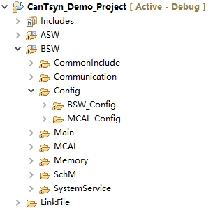
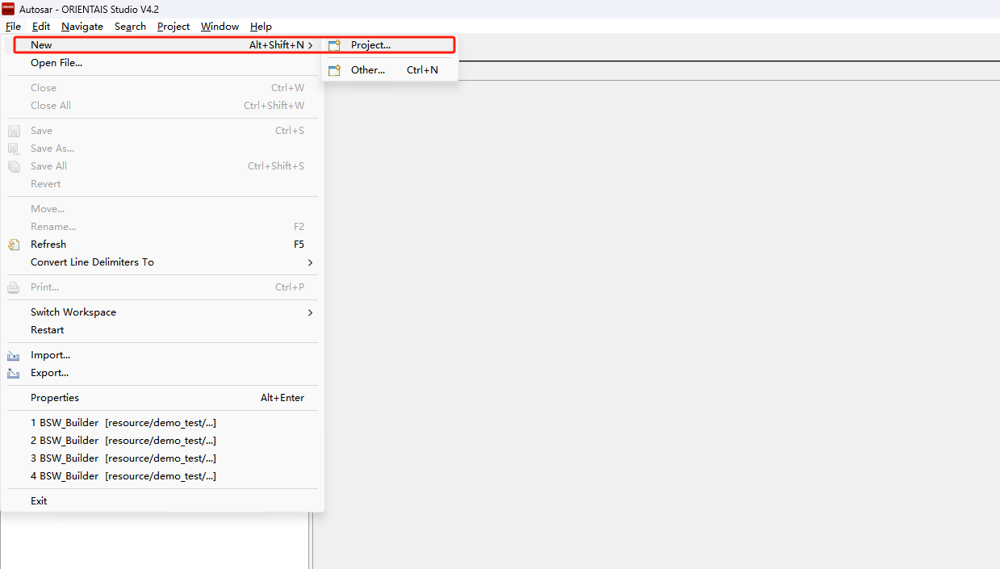

===================
CanTSyn_集成手册
===================

目标
====

本集成手册用于指导客户进行CanTSyn集成，文档主要包括的内容为：协议栈集成指导、基于普通应用的集成示例讲解。

由于各项目的需求不同，集成示例不会针对于特定的商业项目做详细讲解。

缩写词和术语
============

.. table:: 表 2‑1 缩写词和术语

   +---------------+------------------------------------------------------+
   |**缩写词/术语**| **描述**                                             |
   |               |                                                      |
   +---------------+------------------------------------------------------+
   | CanIf         | Can Interface Can通信的接口模块                      |
   +---------------+------------------------------------------------------+
   | CanTSyn       | TimeSyncOverCAN CAN时间同步模块                      |
   +---------------+------------------------------------------------------+
   | StbM          | SynchronizedTimeBaseManager 同步时基管理器           |
   +---------------+------------------------------------------------------+

参考文档
========

[1] 参考手册_CanTSyn.pdf

[2] 参考手册_StbM.pdf

协议栈集成
==========

项目交付的内容为：CanTSyn协议栈源码和ORIENTAIS
Configurator配置工具。协议栈细分为协议栈的各模块及其对应的配置工具模块。

CanTSyn协议栈各配置模块的功能介绍。

使用协议栈源码和配置工具，进行协议栈的集成的步骤。

.. table:: 表 4‑1 CanTSyn协议栈各配置模块介绍

   +----------+-----------------------------------------------------------+
   |**模块名**| **功能**                                                  |
   |          |                                                           |
   +----------+-----------------------------------------------------------+
   | Can      | CAN驱动配置。                                             |
   +----------+-----------------------------------------------------------+
   | CanIf    | CanIf模块主要处理上层模块与底层驱动的之间P                |
   |          | DU的传递，为上层模块提供统一的接口来管理不同的CAN硬件模块 |
   +----------+-----------------------------------------------------------+
   | EcuC     | 用于辅助配置工具完成配置的模块。主要                      |
   |          | 提供Pdu的定义，其它模块通过关联EcuC中Pdu，相互关联起来。  |
   +----------+-----------------------------------------------------------+
   | CanTSyn  | CAN时间同步模块                                           |
   +----------+-----------------------------------------------------------+
   | StbM     | 同步时基管理器                                            |
   +----------+-----------------------------------------------------------+

.. table:: 表 4‑2 CanTSyn协议栈集成的步骤

   +-----+--------------------------+------------------------------------+
   |**步\| **操作**                 | **说明**                           |
   |骤** |                          |                                    |
   |     |                          |                                    |
   |     |                          |                                    |
   +-----+--------------------------+------------------------------------+
   | 1   | ORIENTAIS                | 若配置工具已经搭建                 |
   |     | Configurator配置工具     | ，则仅需进行协议栈模块的加载操作。 |
   |     | 工程搭建和协议栈模块加载 |                                    |
   +-----+--------------------------+------------------------------------+
   | 2   | 模块配置及配置文件生成   | NA                                 |
   +-----+--------------------------+------------------------------------+
   | 3   | 代码集成                 | 现有工程、                         |
   |     |                          | 协议栈源代码和配置生成文件的集成。 |
   +-----+--------------------------+------------------------------------+
   | 4   | 验证测试                 | NA                                 |
   +-----+--------------------------+------------------------------------+

**注意：协议栈集成之前，用户须确保已经有基础工程，且本协议栈相关的其他协议栈能正常工作。**

新建ORIENTAIS Configurator配置工程及模块加载
--------------------------------------------

#. 安装ORIENTAIS Configurator软件后，双击软件图标打开软件。

.. figure:: ../../_static/集成手册/CanTSyn/image1.png
   :width: 5.76389in
   :height: 3.05972in

图 4‑1 新建工程-1

2. 菜单栏File🡪New🡪Project，新建工程。

|image1|

图 4‑2 新建工程-2

3. 在弹出的新建窗口中选择Autosar下的 [BSW Project]，选择Next。

.. figure:: ../../_static/集成手册/CanTSyn/image3.png
   :width: 4.25764in
   :height: 4.05556in

图 4‑3 新建工程-3

4. 在弹出的窗口中输入工程名，选择Finish。

.. figure:: ../../_static/集成手册/CanTSyn/image4.png
   :width: 4.62222in
   :height: 3.88889in

图 4‑4 新建工程-4

5. 在弹出的窗口中选择Yes。

.. figure:: ../../_static/集成手册/CanTSyn/image5.png
   :width: 4.06777in
   :height: 1.90141in

图 4‑5 新建工程-5

6. 选择[Bsw_Builder]，右键单击，选择New ECU Configuration。

.. figure:: ../../_static/集成手册/CanTSyn/image6.png
   :width: 4.29931in
   :height: 1.97778in

图 4‑6 新建工程-6

7. 在弹出的窗口中输入ECU名，然后选择Next。

|image2|

图 4‑7 新建工程-7

此处以TC397为例，用户根据项目芯片进行选择。

8. 在弹出的窗口中勾选需添加的模块，点击Finish。

.. figure:: ../../_static/集成手册/CanTSyn/image8.png
   :width: 3.39496in
   :height: 4.32446in

图 4‑8 新建工程-8

9. 新建工程如下所示，上一步添加的模块已经被加入到工程中。

.. figure:: ../../_static/集成手册/CanTSyn/image9.png
   :width: 3.97569in
   :height: 3.4in

图 4‑9 新建工程-9

模块配置及代码生成
------------------

模块配置
~~~~~~~~

模块的具体配置，取决于具体的项目需求。该协议栈各模块配置项的详细介绍。

.. table:: 表格 4‑3 协议栈各模块配置参考文档

   +--------+----------------------------------------+-------------------+
   | **     | **参考文档**                           | **说明**          |
   | 模块** |                                        |                   |
   +--------+----------------------------------------+-------------------+
   | Can    | MCAL对应的Can配置手册                  |                   |
   +--------+----------------------------------------+-------------------+
   | Gpt    | MCAL对应的Gpt配置手册                  |                   |
   +--------+----------------------------------------+-------------------+
   | CanIf  | Can通信.pdf                   |                   |
   +--------+----------------------------------------+-------------------+
   | EcuC   | Can通信.pdf                   |                   |
   +--------+----------------------------------------+-------------------+
   | C      | 参考手册_CanTSyn.pdf                   |                   |
   | anTSyn |                                        |                   |
   +--------+----------------------------------------+-------------------+
   | StbM   | 参考手册_StbM.pdf                      |                   |
   +--------+----------------------------------------+-------------------+

配置代码生成
~~~~~~~~~~~~

#. 在ORIENTAIS
   Configurator主界面左方，选择对应的协议栈，单击右键弹出Validate
   All和Generate All菜单。

.. figure:: ../../_static/集成手册/CanTSyn/image10.png
   :width: 5.76528in
   :height: 3.03889in

图 4‑10 配置代码的生成-1

2. 选择Validate
   All对本协议栈各配置选项进行校验，没有错误提示信息即校验通过。若有错误信息，请按照错误提示修改。

3. 选择Generate
   All，生成配置文件。右下角的Console窗口输出生成的配置文件信息。

.. figure:: ../../_static/集成手册/CanTSyn/image11.png
   :width: 5.04861in
   :height: 2.025in

图 4‑11 配置代码的生成-2

4. 在工程config文件夹，可查看生成的配置文件。

图 4‑12 配置代码的生成-3

功能集成
--------

代码集成
~~~~~~~~

协议栈代码包括两部分：项目提供的协议栈源码和ORIENTAIS
Configurator配置生成代码。

用户须将协议栈源码和章节4.2.2生成的源代码添加到集成开发工具的对应文件夹。协议栈集成的文件结构，见章节5.3。

**注意：协议栈集成之前，用户须确保已经有基础工程，且本协议栈相关的其他协议栈能正常工作。**

集成注意事项
~~~~~~~~~~~~

对于集成过程中，协议栈特殊要求和用户经常出现的问题，归类总结形成 表
4‑1协议栈集成约束清单。用户需逐一排查表中的约束项，以避免集成问题出现。

.. table:: 表 4‑4 CanTSyn协议栈集成约束清单

   +-----+---------+-----------------------------------------------------+
   |**编\|         | **约束限制**                                        |
   |号** | **类别**|                                                     |
   |     |         |                                                     |
   |     |         |                                                     |
   +-----+---------+-----------------------------------------------------+
   | **\ | 头文件  | 添加协议\                                           |
   | 1** |         | 栈代码之后，用户需更新集成开发工具中的头文件路径。  |
   |     |         |                                                     |
   |     |         | 调用协议栈API的源文件，需要包含协议栈的头文件。     |
   +-----+---------+-----------------------------------------------------+
   | **\ | 初始化  | CanTSy                                              |
   | 2** |         | n_Init和StbM_Init初始化前需要确保Can和Gpt已经初始化 |
   +-----+---------+-----------------------------------------------------+
   | **\ | 周      | CanTSyn_MainFunction和StbM_Mai                      |
   | 3** | 期函数  | nFunction按照需求放置到相应的周期任务中，一般为10ms |
   +-----+---------+-----------------------------------------------------+

集成示例
========

本章节通过CanTSyn协议栈为例，向用户展示CanTSyn协议栈的集成过程。用户可以据此熟悉CanTSyn协议栈配置工具的配置过程，以及如何应用配置工具生成的配置文件。

为让用户更清晰的了解工具的使用，所用的配置均逐一手动完成。关于Can驱动的配置，请参考Can配置手册。关于Gpt驱动的配置，请参考Gpt配置手册。CanIf配置的具体操作请参照《Can通信.pdf》。

**注意：本示例不代表用户的实际配置情况，用户需要根据自己的实际需求，决定各个参数的配置。**

集成目标
--------

通过Canoe模拟CanTSyn主节点，向本示例的从节点发送时间同步报文，从节点获取主节点同步的时间。由于时间同步的从节点不向外发送时间，故通过一帧CAN
ID为0x666的CAN报文将同步后的时间转发出来。

模块的配置
----------

新建配置工程及模块加载操作，请参考本文档4.2章节。此次仅说明如何配置，模块的配置项具体示意参见《CanTSyn.pdf》和《StbM.pdf》。

CanTSyn模块配置
~~~~~~~~~~~~~~~

10. 双击CanTSyn模块，打开CanTSyn模块的配置界面。

.. figure:: ../../_static/集成手册/CanTSyn/image13.png
   :width: 5.76528in
   :height: 2.94236in

图 5‑1 CanTSynGeneral配置界面

11. 在CanTSynGeneral下，有CanTSynDevErrorDetect、CanTSynMainFunc
    tionPeriod和CanTSynVersionInfoApi四个配置项。

12. 将CanTSynMainFunctionPeriod配置为0.10，其他配置项保持默认。

图 5‑2 CanTSynGlobalTimeDomain配置界面

13. CanTSynGlobalTimeDomain配置如下图所示：

.. figure:: ../../_static/集成手册/CanTSyn/image15.png
   :width: 5.76389in
   :height: 1.51597in

图 5‑3 CanTSynGlobalTimeDomain配置

14. CanTSynGlobalTimeDomain->CanTSynGlobalTimeFupDataIDList->CanT
    SynGlobalTimeFupDataIDListElements中的配置(使用CRC时)，根据客户
    需去填写CRC值。

图 5‑4 SynGlobalTimeFupDataIDListElements的配置

15. CanTSynGlobalTimeSlaves->CanTSynGlobalTimeSlave的配置（做从节 点）：

.. figure:: ../../_static/集成手册/CanTSyn/image17.png
   :width: 5.76181in
   :height: 1.72569in

图 5‑5 CanTSynGlobalTimeSlave的配置

16. CanTSynGlobalTimeSlaves->CanTSynGlobalTimeSlave->CanTSynGloba
    lTimeSlavePdu的配置：

图 5‑6 CanTSynGlobalTimeSlavePdu的配置

17. CanTSynGlobalTimeSyncDataIDLists->CanTSynGlobalTimeSyncDataIDL
    ist->CanTSynGlobalTimeSyncDataIDListElements的配置(使用CRC时)根
    据客户需去填写CRC值。

图 5‑7 CanTSynGlobalTimeSyncDataIDListElements的配置

18. CanTSynGlobalTimeMaster->CanTSynGlobalTimeMaster的配置（做主节
    点）：

..

   CanTSynGlobalTimeDebounceTime：SYNC报文和FUP报文之间的间隔时间。

   CanTSynGlobalTimeTxCrcSecured：选择是否支持CRC。

   CanTSynGlobalTimeTxPeriod：同步报文周期。

.. figure:: ../../_static/集成手册/CanTSyn/image20.png
   :width: 5.76111in
   :height: 1.98542in

图 5‑8 CanTSynGlobalTimeMaster的配置

19. CanTSynGlobalTimeMaster->CanTSynGlobalTimeMaster->CanTSynGloa
    lTimeMasterPdu的配置：

图 5‑9 CanTSynGlobalTimeMasterPdu的配置

StbM模块的配置
~~~~~~~~~~~~~~

20. 双击StbM模块，打开StbM模块的配置界面。

.. figure:: ../../_static/集成手册/CanTSyn/image22.png
   :width: 5.31021in
   :height: 2.64327in

图 5‑10 StbMGeneral的配置界面

在StbMGeneral的配置。若使用GPT时钟，需打开StbMGptTimerRef，并
选择mcal配置的Gpt时钟；若用Eth硬件时钟，则不勾选。

.. figure:: ../../_static/集成手册/CanTSyn/image23.png
   :width: 3.72725in
   :height: 2.24346in

图 5‑11 StbMGeneral的配置

StbMSynchronizedTimeBases->StbMSynchronizedTimeBase的配置。

.. figure:: ../../_static/集成手册/CanTSyn/image24.png
   :width: 5.81525in
   :height: 2.67532in

图 5‑12 StbMSynchronizedTimeBase配置界面

StbMSynchronizedTimeBases->StbMSynchronizedTimeBase->StbMLocal
TimeClocks->StbMLocalTimeClock的配置：

StbMClockFrequency中填写StbM所引用的Gpt定时器的时钟频率。若是
Eth时钟则默认1000000000。

StbMLocalTimeHardware引用所需要引用的Gpt的定时器通道。若是Eth
时钟则默认1。

.. figure:: ../../_static/集成手册/CanTSyn/image25.png
   :width: 5.76181in
   :height: 1.56736in

图 5‑13 StbMLocalTimeClock配置界面

StbMSynchronizedTimeBases->StbMSynchronizedTimeBase->StbMLocal
TimeClocks->StbMTimeCorrection的配置：

StbMAllowMasterRateCorrection如果主节点启用correction功能则需要开启。

StbMMasterRateDeviationMax填写由
StbM_SetRateCorrection设置的速率偏差值的最大允许绝对值。

StbMOffsetCorrectionAdaptionInterval填写适应性的速率矫正足以消除速率和时间偏差值的时间区间。

StbMOffsetCorrectionJumpThreshold用于决定使用什么样的矫正方式。偏差值若小于此值，则在定义的时间周期内使用线性缩减（linear
reduction）矫正。若大于此值，则以跳跃的方式立即设置正确的时间和速率。

StbMRateCorrectionMeasurementDuration填写用于计算速率差的时间区间。

StbMRateCorrectionsPerMeasurementDuration填写同时进行速率测量的
次数，以确定当前速率偏差。

.. figure:: ../../_static/集成手册/CanTSyn/image26.png
   :width: 5.24167in
   :height: 2.47778in

图 5‑14 StbMLocalTimeCorrection配置界面

源代码集成
----------

项目交付给用户的工程结构如下：

图 5‑15 工程结构目录

-  BSW目录，存放模块相关的源代码和配置代码。可以看到Source目录下各个文件夹下是各个模块的源代码。

-  BSW下的Config->BSW_Config目录，用于存放配置工具生成的配置文件

CanTSyn协议栈源代码集成步骤如下：

#. 将MCAL生成的CAN、GPT模块配置文件和ORIENTAIS
   Configurator生成的配置文件复制到对应的文件夹中；

#. 将MCAL提供的CAN模块源码和普华提供的协议栈源代码文件复制到对应的文件夹中。

#. 添加新增加的模块的代码头文件路径到工程设置中

协议栈调度集成
--------------

CanTSyn协议栈调度集成步骤如下：

#. 协议栈调度集成，需要逐一排查并实现表 5‑1协议栈集成约束清单
   所罗列的问题，以避免集成出现差错。

#. 编译链接代码，将生成的elf文件烧写进芯片。

CanTSyn协议栈有关的代码，在下方的main.c文件中给出重点标注。

**注意 :
本示例中，CanTSyn协议栈初始化的代码和启动通信的代码置于main.c文件，并不代表其他项目同样适用于将其置于main.c文件中。**

**#include** <machine/wdtcon.h>

**#include** "Mcu.h"

**#include** "Port.h"

**#include** "Can_17_MCanP.h"

**#include** "CanIf.h"

**#include** "Gpt.h"

**#include** "StbM.h"

**#include** "CanTSyn.h"

StbM_TimeStampType timestamp;

StbM_UserDataType userData;

Uint8 Data[8] = {0};

Can_PduType PduInfo = {0,8,0x666,&Data[0]};

**int** **main**\ (**void**)

{

/\*Initialize ECUM Module*/

EcuM_Init(&EcuM_ConfigAlternative[0]);

/\*Initialize FlsLoader*/

FlsLoader_Init(NULL_PTR);

StbM_Init(&StbM_Config);

Can_17_MCanP_Init(&Can_17_MCanP_ConfigRoot[0]);

CanIf_Init(&CanIf_InitCfgSet);

CanTSyn_Init(&CanTSyn_config);

:mark:`CanIf_SetControllerMode`(0, *CANIF_CS_STARTED*);

Gpt_EnableNotification(GptConf_GptChannel_Gpt_1ms);

Gpt_StartTimer(GptConf_GptChannel_Gpt_1ms, 100000);

Gpt_StartTimer(GptChannelConfiguration_STBM, 0xFFFFFFu);

StbM_TimeStampType test1 = {0u};

StbM_UserDataType test2 = {0u};

test1.secondsHi = 0;
-

test1.seconds = 1696903810;

test1.nanoseconds = 0;

StbM_SetGlobalTime(0,&test1,&test2);

/\* infinite loop \*/

**while** (1)

{

   **if**\ (:mark:`Gpt_1msFlag` == TRUE)

{

Gpt_1msFlag = FALSE;

}

**if**\ (Gpt_10msFlag == TRUE)

{

/\* please insert your code here ... \*/

CanTSyn_MainFunction();

   StbM_MainFunction();

   StbM_GetCurrentTime(0, &timestamp,&userData\ **);**

   PduInfo.sdu[0] =

   (uint8)((StbM_TimeStamp.seconds & 0xff000000) >> 24);

   PduInfo.sdu[1] =

   (uint8)((StbM_TimeStamp.seconds & 0x00ff0000) >> 16);

   PduInfo.sdu[2] =

   (uint8)((StbM_TimeStamp.seconds & 0x0000ff00) >> 8);

   PduInfo.sdu[3] =

   (uint8)((StbM_TimeStamp.seconds & 0x000000ff));

   PduInfo.sdu[4] =

   (uint8)((StbM_TimeStamp.nanoseconds & 0xff000000) >> 24);

   PduInfo.sdu[5] =

   (uint8)((StbM_TimeStamp.nanoseconds & 0x00ff0000) >> 16);

   PduInfo.sdu[6] =

   (uint8)((StbM_TimeStamp.nanoseconds & 0x0000ff00) >> 8);

   PduInfo.sdu[7] =

   (uint8)((StbM_TimeStamp.nanoseconds & 0x000000ff));

   Can_Write(2, &PduInfo);

}

}

**return** 1;

}

验证结果
--------

根据集成目标，能够跟Canoe正常通信，以下是时间同步的同步log.

图 5‑16 验证结果

.. |image2| image:: ../../_static/集成手册/CanTSyn/image7.png
   :width: 3.72569in
   :height: 3.53472in
