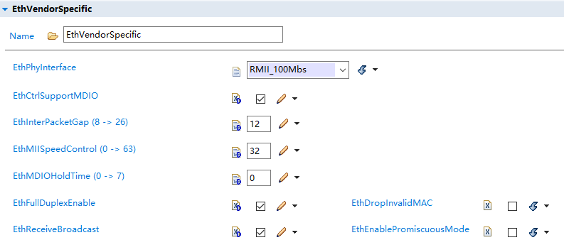

===================
Eth_集成手册
===================

目标
====

本集成手册用于指导客户进行Eth通信栈集成，文档主要包括的内容为：协议栈集成指导、基于普通应用的集成示例讲解、项目集成特殊说明。

由于各项目的需求不同，集成示例不会针对于特定的商业项目做详细讲解。

缩写词和术语
============

.. table:: 表 2‑2‑1 缩写词和术语

   +---------------+------------------------------------------------------+
   | **\           | **描述**                                             |
   | 缩写词/术语** |                                                      |
   +---------------+------------------------------------------------------+
   | Eth           | Ethernet Driver以太网驱动程序                        |
   +---------------+------------------------------------------------------+
   | EthIf         | Ethernet Interface以太网接口                         |
   +---------------+------------------------------------------------------+
   | PduR          | PDU Router 将I-PDU从一个模块转移到另一个模块的模块   |
   +---------------+------------------------------------------------------+
   | LdCom         | Large Data Communication 大数据通信模块              |
   +---------------+------------------------------------------------------+
   | SoAd          | Socket Adapter 套接字适配模块                        |
   +---------------+------------------------------------------------------+
   | TcpIp         | TCP/IP protocol module TCP/IP协议模块                |
   +---------------+------------------------------------------------------+
   | MCAL          | Microcontroller Abstraction Layer 微控制器抽象层     |
   +---------------+------------------------------------------------------+

参考文档
========

[1] 参考手册_EthIf.pdf

[2] 参考手册_EthSM.pdf

[3] 参考手册_TcpIp.pdf

[4] 参考手册_SoAd.pdf

[5] 参考手册_PduR.pdf

[6] 参考手册_LdCom.pdf

协议栈集成
==========

项目交付的内容为：Eth通信栈源码和ORIENTAIS
Configurator配置工具。协议栈细分为协议栈的各模块及其对应的配置工具模块。

Eth通信栈各配置模块的功能介绍，参见表 4‑1 Eth通信栈各配置模块介绍。

使用协议栈源码和配置工具，进行协议栈的集成的步骤，参见表 4‑2
Eth通信栈集成的步骤。

.. table:: 表 4‑1 Eth通信栈各配置模块介绍

   +---------+------------------------------------------------------------+
   | **模\   | **功能**                                                   |
   | 块名**  |                                                            |
   +---------+------------------------------------------------------------+
   | Eth     | ETH驱动配置。                                              |
   +---------+------------------------------------------------------------+
   | EthIf   | EthIf模块使用EthIfCtr                                      |
   |         | lIdx来抽象以太网收发器和控制器的底层通信系统对VLAN的访问， |
   |         | 以此以太网接口实现从EthCtrlIdx到各自硬件资源控制器的映射。 |
   +---------+------------------------------------------------------------+
   | EcuC    | 用于辅助配置工具完成配置的模块。主                         |
   |         | 要提供Pdu的定义，其它模块通过关联EcuC中Pdu，相互关联起来。 |
   +---------+------------------------------------------------------------+
   | PduR    | PduR模块用于Pdu在TP层和IF层的传输，为COM和DCM的下层        |
   +---------+------------------------------------------------------------+
   | TcpIp   | TcpIp模块作为以太网基本协议模块，提                        |
   |         | 供了发送和接收互联网协议数据的功能，处于SoAd和EthIf中间。  |
   +---------+------------------------------------------------------------+
   | SoAd    | S                                                          |
   |         | oAd模块使用PDU和socket在TCPIP栈之间创建接口，将Pdu与socket |
   |         | connection 形成映射关系.                                   |
   +---------+------------------------------------------------------------+
   | LdCom   | LdCom模块                                                  |
   +---------+------------------------------------------------------------+

.. table:: 表 4‑2 Eth通信栈集成的步骤

   +-----+--------------------------+------------------------------------+
   |**步\| **操作**                 | **说明**                           |
   |骤** |                          |                                    |
   |     |                          |                                    |
   |     |                          |                                    |
   +-----+--------------------------+------------------------------------+
   | 1   | ORIENTAIS                | 若配置工具已经搭建                 |
   |     | Configurator配置工具     | ，则仅需进行协议栈模块的加载操作。 |
   |     | 工程搭建和协议栈模块加载 |                                    |
   +-----+--------------------------+------------------------------------+
   | 2   | 模块配置及配置文件生成   | NA                                 |
   +-----+--------------------------+------------------------------------+
   | 3   | 代码集成                 | 现有工程、                         |
   |     |                          | 协议栈源代码和配置生成文件的集成。 |
   +-----+--------------------------+------------------------------------+
   | 4   | 验证测试                 | NA                                 |
   +-----+--------------------------+------------------------------------+

**注意：协议栈集成之前，用户须确保已经有基础工程，且本协议栈相关的其他协议栈能正常工作。**

新建ORIENTAIS工程
-----------------

#. 安装ORIENTAIS Configurator软件后，双击软件图标打开软件。

.. figure:: ../../_static/集成手册/Eth/image1.png
   :width: 5.30055in
   :height: 3.71944in

图 4‑1 新建工程-1

2. 菜单栏File🡪New🡪Project，新建工程。

.. figure:: ../../_static/集成手册/Eth/image2.png
   :width: 5.28315in
   :height: 3.70833in

图 4‑2 新建工程-2

3. 在弹出的新建窗口中选择Autosar下的 [BSW Project]，选择Next。

图 4‑3 新建工程-3

4. 在弹出的窗口中输入工程名，选择Finish。

图 4‑4 新建工程-4

5. 在弹出的窗口中选择Yes。

.. figure:: ../../_static/集成手册/Eth/image5.png
   :width: 4.33071in
   :height: 2.02362in

图 4‑5 新建工程-5

6. 选择[Bsw_Builder]，右键单击，选择New ECU Configuration。

.. figure:: ../../_static/集成手册/Eth/image6.png
   :width: 4.33071in
   :height: 1.5in

图 4‑6 新建工程-6

7. 在弹出的窗口中输入ECU名，然后选择Next。

|image1|

图 4‑7 新建工程-7

8. 在弹出的窗口中勾选需添加的模块，点击Finish。

.. figure:: ../../_static/集成手册/Eth/image8.png
   :width: 2.88038in
   :height: 5.71505in

图 4‑8 新建工程-8

9. 新建工程如下所示，上一步添加的模块已经被加入到工程中。

.. figure:: ../../_static/集成手册/Eth/image9.png
   :width: 2.75591in
   :height: 2.36614in

图 4‑9 新建工程-9

10. MCAL配置导入，BSW模块需要依赖MCAL生成的Eth模块

a) 从MCAL配置工具生成arxml

.. figure:: ../../_static/集成手册/Eth/image10.png
   :width: 2.75591in
   :height: 2.36614in

图 4‑10 新建工程-10

.. figure:: ../../_static/集成手册/Eth/image11.png
   :width: 4.25591in
   :height: 3.36614in

图 4‑11 新建工程-11

b) 导入BSW工具

.. figure:: ../../_static/集成手册/Eth/image12.png
   :width: 4.75591in
   :height: 3.66614in

图 4‑12 新建工程-12

.. figure:: ../../_static/集成手册/Eth/image13.png
   :width: 4.75591in
   :height: 2.66614in

图 4‑13 新建工程-13

.. figure:: ../../_static/集成手册/Eth/image14.png
   :width: 4.75591in
   :height: 3.66614in

图 4‑14 新建工程-14

配置文件生成
------------

模块配置
~~~~~~~~

模块的具体配置，取决于具体的项目需求。Eth通信栈各模块配置项的详细介绍，参见文档《参考手册_EthIf.pdf》、《参考手册_EthSM.pdf》、《参考手册_TcpIp.pdf》、《参考手册_SoAd.pdf》、《参考手册_LdCom.pdf》。

配置代码生成
~~~~~~~~~~~~

#. 在ORIENTAIS
   Configurator主界面左方，选择对应的协议栈，或者选择整个ECU，单击右键弹出Validate
   All和Generate All菜单。

.. figure:: ../../_static/集成手册/Eth/image15.png
   :width: 3.58823in
   :height: 4.13095in

图 4‑15 配置代码的生成-1

2. 选择Validate
   All对本协议栈各配置选项进行校验，没有错误提示信息即校验通过。若有错误信息，请按照错误提示修改。

3. 选择Generate
   All，生成配置文件。右下角的Console窗口输出生成的配置文件信息。

.. figure:: ../../_static/集成手册/Eth/image16.png
   :alt: 图形用户界面, 文本, 应用程序 描述已自动生成
   :width: 5.64511in
   :height: 2.06092in

图 4‑16 配置代码的生成-2

4. 将ORIENTAIS Configurator切换到Resource模式，即可查看生成的配置文件。

.. figure:: ../../_static/集成手册/Eth/image17.png
   :width: 5.51181in
   :height: 2.90157in

图 4‑17 配置代码的生成-3

功能集成
--------

代码集成
~~~~~~~~

协议栈代码包括两部分：项目提供的协议栈源码和ORIENTAIS
Configurator配置生成代码。

用户须将协议栈源码和章节4.2.2生成的源代码添加到集成开发工具的对应文件夹。协议栈集成的文件结构，见章节5.3。

**注意：协议栈集成之前，用户须确保已经有基础工程，且本协议栈相关的其他协议栈能正常工作。**

集成注意事项
~~~~~~~~~~~~

用户须提前配置好Eth的MCAL驱动，如果以太网通过中断完成接收发送，需验证发送、接收中断工作正常，如存在OS，则在OS中配置好相关的以太网中断，如无OS，则需手动挂载对应的中断函数并使能中断。

集成示例
========

本章节通过Eth通信栈为例，向用户展示Eth通信栈的集成过程。用户可以据此熟悉Eth通信栈配置工具的配置过程，以及如何应用配置工具生成的配置文件。

为让用户更清晰的了解工具的使用，所用的配置均逐一手动完成。关于Eth驱动的配置，请参考芯片厂商提供的Eth
MCAL配置手册。

**注意：本示例不代表用户的实际配置情况，用户需要根据自己的实际需求，决定各个参数的配置。**

集成目标
--------

通过LdCom_Transmit实现Udp和Tcp(Server及Client)报文的发送。

.. table:: 表 5‑1 Eth通信Socket信息

   +----------------+-----------------------------------------------------+
   | **Socket信息** | **值**                                              |
   +----------------+-----------------------------------------------------+
   | Udp            | 本地：192.168.0.200/UDP/65000                       |
   |                |                                                     |
   |                | 远端：192.168.0.123/UDP/10001                       |
   +----------------+-----------------------------------------------------+
   | Tcp Server     | 本地：192.168.0.200/TCP/65000                       |
   |                |                                                     |
   |                | 远端：0.0.0.0/TCP/0                                 |
   +----------------+-----------------------------------------------------+
   | Tcp Client     | 本地：192.168.0.200/TCP/55001                       |
   |                |                                                     |
   |                | 远端：192.168.0.123/TCP/20001                       |
   +----------------+-----------------------------------------------------+

.. _模块配置-1:

模块配置
--------

新建配置工程及模块加载操作，请参考本文档4.2章节。

Eth驱动配置
~~~~~~~~~~~

Eth驱动配置为MCAL层配置，可以参考以下S32K148驱动进行配置。

.. figure:: ../../_static/集成手册/Eth/image18.png
   :alt: 图形用户界面, 文本, 应用程序, 电子邮件 描述已自动生成
   :width: 5.66205in
   :height: 3.01749in

图 5‑1 Eth配置-1

图 5‑2 Eth配置-2

EcuC配置
~~~~~~~~

#. 双击EcuC模块，打开EcuC模块配置界面。

#. 在EcucConfigSets栏目上右键，选择EcucConfigSet。再在EcucConfigSet上右键，选择New🡪
   EcucConfigSet。再在EcucPduCollections上右键，选择New
   EcucPduCollection。

   a) PduIdTypeEnum
      选择UINT16（该参数表示PDU的格式。因为示例只有16个PDU，PDU数不会超过65535，UINT16类型的长度就够存储了）

   b) PduLengthTypeEnum
      选择UINT16（该参数表示数据长度，示例需要配置的报文长度都是在1500以内，所以选择UINT16即可）

.. figure:: ../../_static/集成手册/Eth/image20.png
   :width: 5.5793in
   :height: 1.44907in

图 5‑3 配置EcucPduCollection

3. 在EcucPduCollection上右键，选择Pdu，会生成一个Pdu的配置界面。

   a) 建议不要使用默认生成的Pdu名字（如：Pdu_0），将Pdu名字改成有意义的名字对后续的配置过程将会有很大帮助。

   b) 这里按照发送和接收，可以将Pdu名字改为报文的名字。PduLength：Pdu长度，根据实际使用帧的长度设置。

   c) 添加SoAd和LdCom所需的Pdu，并根据客户端和服务端选择不同的Pdu长度。

图 5‑4 配置Pdu

4. ECUC模块到此配置结束。可以在模块上右键，然后选择校验，查看是否配置有错误。

5. 校验后提示窗口没有错误信息，即校验通过。

EthIf配置
~~~~~~~~~

#. 配置EthIfGeneral。

.. figure:: ../../_static/集成手册/Eth/image22.png
   :width: 2.81795in
   :height: 3.80071in

图 5‑5 EthIfGeneral配置

2. 在EthIfConfigSet中配置EthIfController。

.. figure:: ../../_static/集成手册/Eth/image23.png
   :width: 4.72441in
   :height: 2.94882in

图 5‑6 EthIfController配置

3. 添加以太网对应的帧类型，选择对应的EthIfOwner，这里Owner为上层模块编号，此处对应EthRxIndicationConfigs中的以太网报文接收回调函数。

.. figure:: ../../_static/集成手册/Eth/image24.png
   :alt: 图形用户界面, 文本, 应用程序, 电子邮件 描述已自动生成
   :width: 5.63642in
   :height: 2.5017in

图 5‑7 EthIfConfigSet配置

4. 在Eth_DriverApiConfigeSet对Eth驱动中的代码原型进行映射，需参考MCAL源码进行修改，一些未使用的Api(如Timestamp功能)需改为NULL_PTR。如存在EthTrcv模块，同理在EthTrcv_DriverApiConfigSet中进行修改。

.. figure:: ../../_static/集成手册/Eth/image25.png
   :alt: 图形用户界面, 应用程序 描述已自动生成
   :width: 5.83463in
   :height: 4.07078in

图 5‑8 Eth_DriverApiConfigSet配置

5. 校验后提示窗口没有错误信息，即校验通过。

TcpIp配置
~~~~~~~~~

#. 配置TcpIpGeneral。

   a) 设置TcpIpMainFunctionPeriod，单位秒，代码中对应10ms执行一次TcpIp_MainFunction()；

   b) 使能TCP和UDP，设置对应的最大socket数量；

.. figure:: ../../_static/集成手册/Eth/image26.png
   :width: 5.61333in
   :height: 3.34641in

图 5‑9 TcpIpGeneral配置

2. 配置TcpIpIpV4General，使能IPv4(暂时只支持IPv4)。

.. figure:: ../../_static/集成手册/Eth/image27.png
   :width: 5.76736in
   :height: 2.26528in

图 5‑10 TcpIpIpV4General配置

3. 在TcpIpConfig配置页中新建TcpIpIpConfig，并在TcpIpIpConfig中添加Arp配置。

.. figure:: ../../_static/集成手册/Eth/image28.png
   :width: 4.99469in
   :height: 2.33982in

图 5‑11 TcpIpArpConfig配置

4. TcpIpCtrl中选择EthIf配置的映射接口。

.. figure:: ../../_static/集成手册/Eth/image29.png
   :width: 4.99469in
   :height: 2.33982in

图 5‑12 TcpIpCtrl配置-1

5. 添加TcpIp的IpV4设置，并选择对应的Arp配置。

.. figure:: ../../_static/集成手册/Eth/image30.png
   :width: 4.99469in
   :height: 2.33982in

图 5‑13 TcpIpCtrl配置-2

6. 设置TcpIp本地地址。

   a) TcpIpAssignmentTrigger选择TCPIP_AUTOMATIC。

.. figure:: ../../_static/集成手册/Eth/image31.png
   :width: 4.82471in
   :height: 2.31586in

图 5‑14 TcpIpAddrAssignment配置

b) 在TcpIpLocalAddrs中添加IP地址设置。

.. figure:: ../../_static/集成手册/Eth/image32.png
   :width: 4.9078in
   :height: 2.51636in

图 5‑15 TcpIpStaticIpAddressConfig配置

7. 新建TcpIpSocketOwnerConfig，添加SoAd模块对应的接口Api。

.. figure:: ../../_static/集成手册/Eth/image33.png
   :width: 4.93411in
   :height: 2.22484in

图 5‑16 TcpIpSocketOwner配置

8. 在TcpIpTcpConfigs中添加TCP设置。

.. figure:: ../../_static/集成手册/Eth/image34.png
   :width: 5.5882in
   :height: 3.16495in

图 5‑17 TcpIpUdpConfig配置

9. 在TcpIpUdpConfig中添加UDP设置。

.. figure:: ../../_static/集成手册/Eth/image35.png
   :width: 5.49167in
   :height: 2.34311in

图 5‑18 TcpIpUdpConfig

10. 校验后提示窗口没有错误信息，即校验通过。

SoAd配置
~~~~~~~~

#. SoAdGeneral配置。

   a) 设置SoAdMainFunctionPeriod，单位秒，代码中对应10ms执行一次SoAd_MainFunction()；

   b) 配置SoAdRoutingGroupMax与SoAdSoConMax，设置SoAdRoutingGroup与SoAdSoCon的最大数量；

.. figure:: ../../_static/集成手册/Eth/image36.png
   :width: 5.66789in
   :height: 3.85321in

图 5‑19 SoAdGeneral配置

2. 在SoAdBswModules中关联SoAd相关的Bsw模块。

.. figure:: ../../_static/集成手册/Eth/image37.png
   :alt: 图形用户界面, 应用程序 描述已自动生成
   :width: 5.82862in
   :height: 3.44523in

图 5‑20 SoAd配置-SoAdBswModules

3. SoAdSocketConnectionGroups中添加Udp Cilent Socket配置。

   a) 此处通过LdCom发送来执行TcpIp报文测试，暂时不使能SoAdPduHeaderEnable，同时也暂不配置对应的HeaderId.

   b) 使能SoAdSocketAutomaticSoConSetup，否则需在代码中手动通过SoAd_OpenSoCon()来使SoAd_SoConMode切换到SOAD_SOCON_ONLINE。

.. figure:: ../../_static/集成手册/Eth/image38.png
   :width: 5.56925in
   :height: 3.59034in

图 5‑21 UDP Client配置-SoAdSocketConnectionGroup

c) 设置Udp发送的远端地址。

.. figure:: ../../_static/集成手册/Eth/image39.png
   :width: 5.56803in
   :height: 3.76588in

图 5‑22 UDP Client配置-SoAdSocketRemoteAddress

d) 创建Udp的SoAdSoket时，SoAdSocketRemoteIpAddress和SoAdSocketRemotePort不可设置为0，SoAdSocketRemoteIpAddress需设置为对应本地以太网的地址。

.. figure:: ../../_static/集成手册/Eth/image40.png
   :width: 5.64899in
   :height: 3.74853in

图 5‑23 本地以太网设置IP地址

e) 在SoAdSocketProtocols中添加对应协议。

.. figure:: ../../_static/集成手册/Eth/image41.png
   :width: 5.91978in
   :height: 2.47839in

图 5‑24 UDP Client配置-SoAdSocketProtocol

4. SoAdSocketConnectionGroups中添加Tcp Serve Socket配置。

   a) 此处暂不勾选SoAdSocketAutomaticSoConSetup，同时在代码中添加SoAd_OpenSoCon()，入参时选择对应的SoAdSocketConnectionGroup的SoAdSocketId。

.. figure:: ../../_static/集成手册/Eth/image42.png
   :width: 4.77116in
   :height: 2.47894in

图 5‑25 TCP Server配置-SoAdSocketConnectionGroup

b) 设置TcpServer端的远端地址和Port，对于Tcp而言设置远端地址和Port为0.0.0.0，表示任意远端地址均可进行连接。

.. figure:: ../../_static/集成手册/Eth/image43.png
   :width: 4.81044in
   :height: 1.89695in

图 5‑26 TCP Server配置-SoAdSocketRemoteAddress

c) 在SoAdSocketProtocols中添加对应协议。

.. figure:: ../../_static/集成手册/Eth/image44.png
   :width: 4.99635in
   :height: 3.18371in

图 5‑27 TCP Server配置-SoAdSocketTcp

5. SoAdSocketConnectionGroups中添加Tcp Client Socket配置。

   a) 同样此处暂不勾选SoAdSocketAutomaticSoConSetup。

.. figure:: ../../_static/集成手册/Eth/image45.png
   :width: 5.19484in
   :height: 2.81291in

图 5‑28 TCP Client配置-SoAdSocketConnectionGroup

b) 添加对应TCP Client节点对应发送的远端地址与port。

.. figure:: ../../_static/集成手册/Eth/image46.png
   :width: 5.1266in
   :height: 2.01916in

图 5‑29 TCP Client配置-SoAdSocketRemoteAddress

c) 在SoAdSocketProtocols中添加对应协议。

.. figure:: ../../_static/集成手册/Eth/image47.png
   :width: 5.34964in
   :height: 2.28801in

图 5‑30 TCP Client配置-SoAdSocketTcp

6. 新建SoAdRoutingGroup，勾选SoAdRoutingGroupIsEnabledAtInit，使能SoAdRoutingGroup。

.. figure:: ../../_static/集成手册/Eth/image48.png
   :width: 5.71031in
   :height: 1.97472in

图 5‑31 SoAdRoutingGroup配置

7. 配置SoAdPduRoute。

   a) 添加所需的SoAdPdu路由

.. figure:: ../../_static/集成手册/Eth/image49.png
   :width: 5.64567in
   :height: 1.42348in

图 5‑32 SoAdPduRoute配置

b) 新建SoAdPduRouteDest，选择对应的SoAdTxSocketConnOrSocketConnBundleRef，并在SoAdTxRoutingGroupRef添加SoAdTxRoutingGroupRef。

.. figure:: ../../_static/集成手册/Eth/image50.png
   :width: 5.45873in
   :height: 2.37673in

图 5‑33 SoAdPduRouteDest配置

8. SoAdSocketRoutes配置。

   a) 添加所需的SoAdPdu路由，并在SoAdRxSocketConnOrSocketConnBundleRef选择对应的SCGroupConnection。

|image2|

图 5‑34 SoAdSocketRoute配置

   b) 新建SoAdSocketRouteDest，

|image3|

图 5‑35 SoAdSocketRouteDest配置

9. 校验后提示窗口没有错误信息，即校验通过。

PduR配置
~~~~~~~~

#. PduRBswModules配置，添加PduR服务的Bsw模块，选择对应的PduRBswModulesRef后自动勾选Api。

.. figure:: ../../_static/集成手册/Eth/image53.png
   :width: 5.48612in
   :height: 3.69198in

图 5‑36 PduRBswModules

2. PduR的路由表，配置以上路由，路由类型选择IF。

.. figure:: ../../_static/集成手册/Eth/image54.png
   :width: 5.32408in
   :height: 3.60089in

图 5‑37 PduRRoutingTables

3. 选择路由中的目标Pdu(PduRDestPdus)和源Pdu(PduRSrcPdus)，同理添加UDP、TCP的客户端和服务端的Pdu路由。

.. figure:: ../../_static/集成手册/Eth/image55.png
   :width: 5.51221in
   :height: 3.60202in

图 5‑38 PduRDestPdu配置

.. figure:: ../../_static/集成手册/Eth/image56.png
   :width: 5.49784in
   :height: 3.74886in

图 5‑39 PduRSrcPdu配置

4. 校验后提示窗口没有错误信息，即校验通过。

LdCom配置
~~~~~~~~~

#. 配置LdComGeneral，选择Det和版本信息Api和LdCom回调头文件。

.. figure:: ../../_static/集成手册/Eth/image57.png
   :alt: 图形用户界面, 文本, 应用程序, 电子邮件 描述已自动生成
   :width: 3.83537in
   :height: 3.13671in

图 5‑40 LdComGeneral配置

2. 配置LdComConfig，选择LdComApi类型LDCOM_IF，通信路由方向选择发送报文选择LDCOM_SEND、接收报文选择LDCOM_RECEIVE；添加对应发送或接收的TxComfirmation
   / RxIndication；最后选择PduR中配置的Pdu路由。

.. figure:: ../../_static/集成手册/Eth/image58.png
   :width: 4.97088in
   :height: 3.21835in

图 5‑41 LdComConfig配置

注意：Ldcom配置的TxComfirmation / RxIndication回调函数需要用户自定义。

源码集成
--------

项目交付给用户的工程结构如下：

.. figure:: ../../_static/集成手册/Eth/image59.png
   :alt: 图片包含 图表 描述已自动生成
   :width: 1.69135in
   :height: 3.10344in

图 5‑42 工程结构目录

-  Config目录，这个目录用来存放配置工具生成的配置文件

-  Source目录，存放模块相关的源代码。可以看到Source目录下各个文件夹下是各个模块的源代码。

调度集成
--------

Eth通信栈调度集成步骤如下：

#. 以太网驱动集成验证工作正常。

#. 若存在外接的以太网Phy，无法建立以太网连接时需考虑添加对应的Phy驱动代码。

#. 按4.2.1中的内容，配置并集成Eth通信栈代码。

#. 编译链接代码，将生成的elf文件烧写进芯片。

Eth通信有关的代码，在下方的main.c文件中给出重点标注。

**注意 :
本示例中，Eth通信相关代码置于main.c文件，并不代表其他项目同样适用于将其置于main.c文件中。**

#include "UserTimer.h"

#include "EthIf.h"

#include "TcpIp.h"

#include "SoAd.h"

#include "EthSM.h"

#include "LdCom.h"

int main (void)

{

uint8 LdComSrcPduData[10] = {0x0,0x1,0x2,0x3,0x4,0x5,0x6,0x7,0x8,0x9};

PduInfoType LdComTransmitPdu;

LdComTransmitPdu.SduDataPtr = LdComSrcPduData;

LdComTransmitPdu.SduLength = 10;

LdComTransmitPdu.MetaDataPtr = NULL_PTR;

UserTimer_Init();

Eth_Init(&Eth_Config);

Eth_SetControllerMode(EthConf_EthCtrlConfig_EthCtrlConfig_0,
ETH_MODE_ACTIVE);

Eth_T_InitPhys();

EthIf_Init(&EthIf_ConfigData);

TcpIp_Init(&TcpIp_Config);

SoAd_Init(&SoAd_Config);

SoAd_OpenSoCon(1);

SoAd_OpenSoCon(2);

LdCom_Init(&LdCom_InitCfgSet);

while (1)

{

if(Gpt_10msFlag == TRUE)

{

TcpIp_MainFunction();

SoAd_MainFunction();

Gpt_10msFlag = FALSE;

}

if (Gpt_50msFlag == TRUE)

{

LdCom_Transmit(LdComIPdu_Client_Tcp_Tx,&LdComTransmitPdu);

LdCom_Transmit(LdComIPdu_Server_Udp_Tx,&LdComTransmitPdu);

LdCom_Transmit(LdComIPdu_Server_Tcp_Tx,&LdComTransmitPdu);

Gpt_50msFlag = FALSE;

}

}

return 0;

}

验证结果
--------

#. 在wireshark中监控到对应50ms周期发送的UDP报文。

.. figure:: ../../_static/集成手册/Eth/image60.png
   :alt: 图形用户界面, 应用程序, 表格 描述已自动生成
   :width: 4.98052in
   :height: 3.92085in

图 5‑43 UDP报文示例

2. 使用网络调试助手，作为TCP Client创建连接后可以监控到对应的TCP
   Client报文。

图 5‑44 TCP Client 报文示例

3. 使用网络调试助手，作为TCP Server创建连接后可以监控到对应的TCP
   Server报文。

图 5‑45 TCP Sever 报文示例

.. |image1| image:: ../../_static/集成手册/Eth/image7.png
   :width: 4.26328in
   :height: 4.06174in
.. |image2| image:: ../../_static/集成手册/Eth/image51.png
   :width: 5.5036in
   :height: 3.11859in
.. |image3| image:: ../../_static/集成手册/Eth/image52.png
   :width: 5.60333in
   :height: 3.73848in
