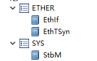
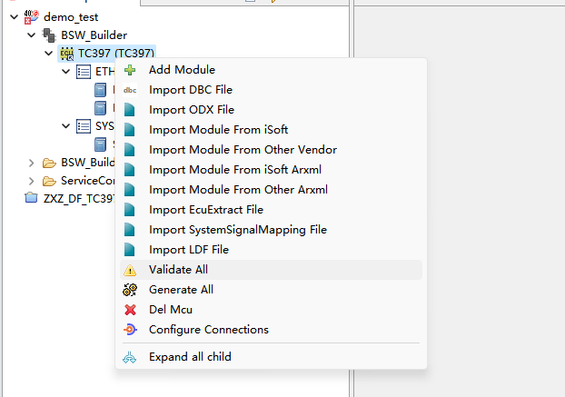
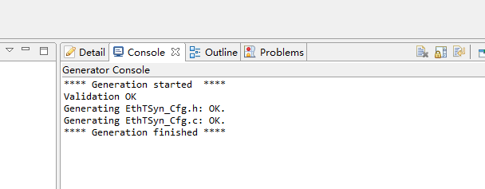
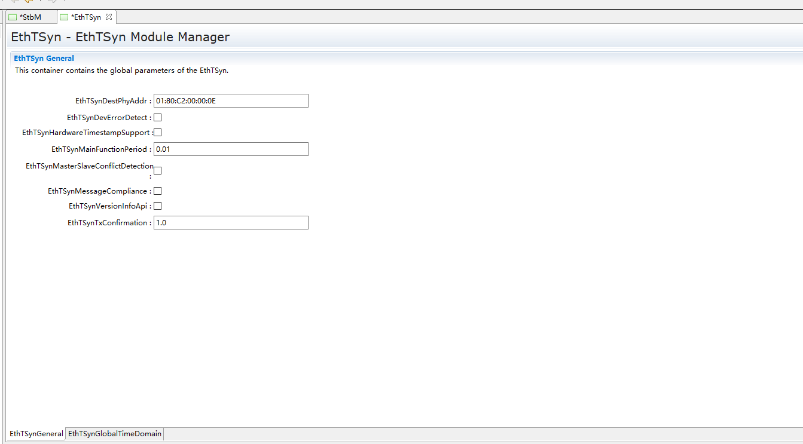
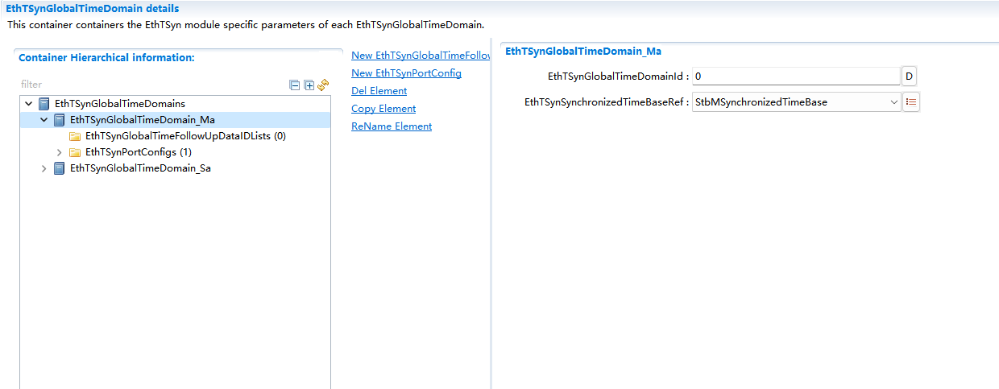
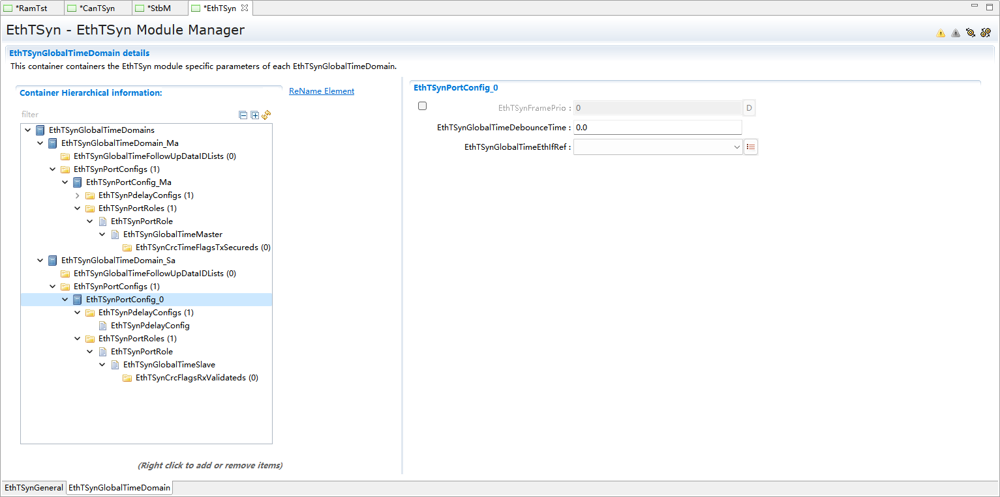
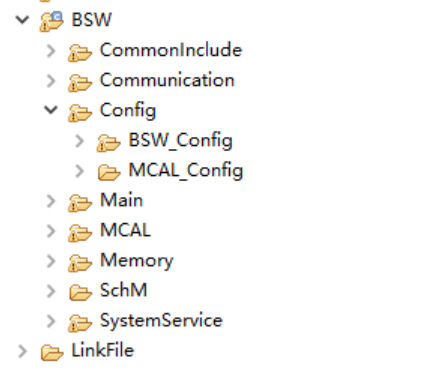
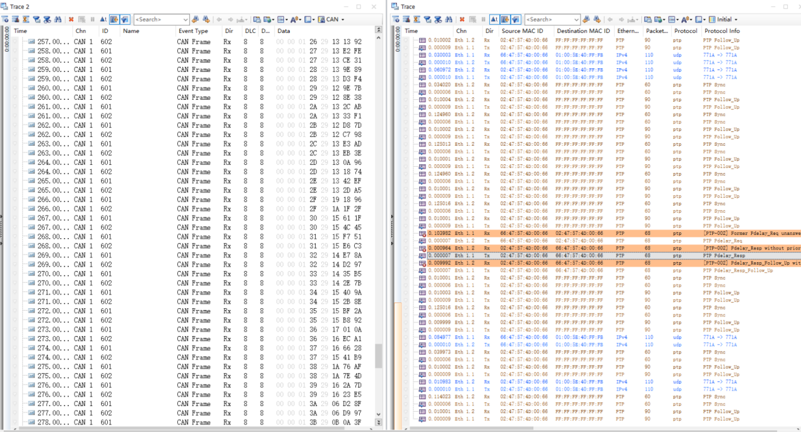

===================
EthTSyn_集成手册
===================

目标
====

本集成手册用于指导客户进行以太网时间同步集成，文档主要包括的内容为：协议栈集成指导、基于普通应用的集成示例讲解、项目集成特殊说明。

由于各项目的需求不同，集成示例不会针对于特定的商业项目做详细讲解。

缩写词和术语
============

.. table:: 表 2-1 缩写词和术语

   +---------------+------------------------------------------------------+
   | **            | **描述**                                             |
   | 缩写词/术语** |                                                      |
   +---------------+------------------------------------------------------+
   | EthIf         | Eth 通信的接口模块                                   |
   +---------------+------------------------------------------------------+
   | EthTSyn       | TimeSyncOverEthernet 基于以太网的时间同步            |
   +---------------+------------------------------------------------------+
   | StbM          | SynchronizedTimeBaseManager 同步时间基管理           |
   +---------------+------------------------------------------------------+

参考文档
========

[1] 参考手册_EthTSyn.pdf

[2] 参考手册_StbM.pdf

[3] 参考手册_EthIf.pdf

协议栈集成
==========

项目交付的内容为：以太网时间同步协议栈源码和ORIENTAIS
Configurator配置工具。协议栈细分为协议栈的各模块及其对应的配置工具模块。

以太网时间同步协议栈各配置模块的功能介绍。

使用协议栈源码和配置工具，进行协议栈的集成的步骤。

.. table:: 表 4-1 以太网时间同步协议栈各配置模块介绍

   +---------+------------------------------------------------------------+
   | **模    | **功能**                                                   |
   | 块名**  |                                                            |
   +---------+------------------------------------------------------------+
   | Eth     | Eth驱动配置。                                              |
   +---------+------------------------------------------------------------+
   | EthIf   | EthIf模块主要处理上层模块与底层驱动的之间                  |
   |         | PDU的传递，为上层模块提供统一的接口来管理不同的Eth硬件模块 |
   +---------+------------------------------------------------------------+
   | EthTSyn | EthTSyn模块处理以太网上的时间同步协议                      |
   +---------+------------------------------------------------------------+
   | StbM    | 同步时间基础管理器的目的是提供                             |
   |         | 同步给客户的时间基数，与链路上的其他节点上的时间基数同步。 |
   +---------+------------------------------------------------------------+

.. table:: 表 4-2 以太网时间同步协议栈集成的步骤

   +-----+--------------------------+------------------------------------+
   | *   | **操作**                 | **说明**                           |
   | *步 |                          |                                    |
   | 骤  |                          |                                    |
   | **  |                          |                                    |
   +-----+--------------------------+------------------------------------+
   | 1   | ORIENTAIS                | 若配置工具已经搭建                 |
   |     | Configurator配置工具     | ，则仅需进行协议栈模块的加载操作。 |
   |     | 工程搭建和协议栈模块加载 |                                    |
   +-----+--------------------------+------------------------------------+
   | 2   | 模块配置及配置文件生成   | NA                                 |
   +-----+--------------------------+------------------------------------+
   | 3   | 代码集成                 | 现有工程、                         |
   |     |                          | 协议栈源代码和配置生成文件的集成。 |
   +-----+--------------------------+------------------------------------+
   | 4   | 验证测试                 | NA                                 |
   +-----+--------------------------+------------------------------------+

**注意：协议栈集成之前，用户须确保已经有基础工程，且本协议栈相关的其他协议栈能正常工作。**

新建ORIENTAIS Configurator配置工程及模块加载
--------------------------------------------

#. 安装ORIENTAIS Configurator软件后，双击软件图标打开软件。

.. figure:: ../../_static/集成手册/EthTSyn/image1.png
   :width: 5.76389in
   :height: 3.06042in

   图 4-1 新建工程-1

2. 菜单栏File🡪New🡪Project，新建工程。

.. figure:: ../../_static/集成手册/EthTSyn/image2.png
   :width: 5.75625in
   :height: 3.17292in

   图 4-2 新建工程-2

3. 在弹出的新建窗口中选择Autosar下的 [BSW Project]，选择Next。

..

   图 4-3 新建工程-3

4. 在弹出的窗口中输入工程名，选择Finish。

..

   图 4-4 新建工程-4

5. 在弹出的窗口中选择Yes。

.. figure:: ../../_static/集成手册/EthTSyn/image5.png
   :width: 4.06777in
   :height: 1.90141in

   图 4-5 新建工程-5

6. 选择[Bsw_Builder]，右键单击，选择New ECU Configuration。

.. figure:: ../../_static/集成手册/EthTSyn/image6.png
   :width: 4.29931in
   :height: 1.97778in

   图 4-6 新建工程-6

7. 在弹出的窗口中输入ECU名，然后选择Next。

|image1|

此处以TC397为例，

用户根据项目芯片进行选择。

图 4-7 新建工程-7

8. 在弹出的窗口中勾选需添加的模块，点击Finish。

.. figure:: ../../_static/集成手册/EthTSyn/image8.png
   :width: 3.20076in
   :height: 4.48569in

   图 4-8 新建工程-8

9. 新建工程如下所示，上一步添加的模块已经被加入到工程中。

   图 4-9 新建工程-9

模块配置及代码生成
------------------

模块配置
~~~~~~~~

模块的具体配置，取决于具体的项目需求。该协议栈各模块配置项的详细介绍，参见表4-3。

.. table:: 表 4-3 协议栈各模块配置参考文档

   +--------+----------------------------------------+-------------------+
   | **     | **参考文档**                           | **说明**          |
   | 模块** |                                        |                   |
   +--------+----------------------------------------+-------------------+
   | Eth    | MCAL对应的Eth配置手册                  |                   |
   +--------+----------------------------------------+-------------------+
   | EthIf  | 参考手册_EthIf.pdf                     |                   |
   +--------+----------------------------------------+-------------------+

配置代码生成
~~~~~~~~~~~~

#. 在ORIENTAIS
   Configurator主界面左方，选择对应的协议栈，单击右键弹出Validate
   All和Generate All菜单。

   图 4-10 配置代码的生成-1

2. 选择Validate
   All对本协议栈各配置选项进行校验，没有错误提示信息即校验通过。若有错误信息，请按照错误提示修改。

3. 选择Generate
   All，生成配置文件。右下角的Console窗口输出生成的配置文件信息。

   图 4-11 配置代码的生成-2

4. 将ORIENTAIS Configurator切换到Resource模式，即可查看生成的配置文件。

.. figure:: ../../_static/集成手册/EthTSyn/image12.png
   :width: 5.76736in
   :height: 3.88403in

   图 4-12 配置代码的生成-3

功能集成
--------

代码集成
~~~~~~~~

协议栈代码包括两部分：项目提供的协议栈源码和ORIENTAIS
Configurator配置生成代码。

用户须将协议栈源码和章节4.2.2生成的源代码添加到集成开发工具的对应文件夹。协议栈集成的文件结构，见章节5.3。

**注意：协议栈集成之前，用户须确保已经有基础工程，且本协议栈相关的其他协议栈能正常工作。**

集成示例
========

本章节通过以太网时间同步协议栈为例，向用户展示以太网时间同步协议栈的集成过程。用户可以据此熟悉以太网时间同步协议栈配置工具的配置过程，以及如何应用配置工具生成的配置文件。

为让用户更清晰的了解工具的使用，所用的配置均逐一手动完成，Ethif部分配置集成请参考《参考手册_EthIf.pdf》。

**注意：本示例不代表用户的实际配置情况，用户需要根据自己的实际需求，决定各个参数的配置。**

集成目标
--------

客户能通过第三方同步工具（Canoe）对汽车电子电控单元进行同步功能实现，为其提供读出同步数据、同步差值读取及相关通信服务的软件模块。

模块的配置
----------

新建配置工程及模块加载操作，请参考本文档4.2章节。

StbM模块配置
~~~~~~~~~~~~

#. 双击StbM模块，打开StbM模块的配置界面。

..

   图 5-1 StbMGeneral配置界面

2. 在StbMGeneral下，每个选项具体注释意思可在右下角查找。

3. 在StbMSynchronizedTimeBase界面,右键新建两个时间基，一个为主，一个为从两种模式配置一致，此处需要注意StbMLocalTimeClock容器中StbMClockFrequency为硬件引用GPT的主频时间，StbMLocalTimeHardware为引用MCAL配置的GPT模块；若用Eth硬件时钟，则不勾选。

..

   其他配置项客户可按OEM需求配置，此处配置只是简单Demo配置。

   图 5-2 StbMSynchronizedTimeBase配置界面-1

4. StbMSynchronizedTimeBases->StbMSynchronizedTimeBase->StbMLocalTimeClocks->StbMLocalTimeClock的配置：

..

   图 5-3 StbMSynchronizedTimeBase配置界面-2

   StbMClockFrequency中填写StbM所引用的Gpt定时器的时钟频率。若是Eth时钟则默认1000000000。

   StbMLocalTimeHardware引用所需要引用的Gpt的定时器通道。若是Eth时钟则默认1。

5. StbMSynchronizedTimeBases->StbMSynchronizedTimeBase->StbMLocalTimeClocks->StbMTimeCorrection的配置：

.. figure:: ../../_static/集成手册/EthTSyn/image16.png
   :width: 5.24167in
   :height: 2.47778in

   图 5-4 StbMLocalTimeCorrection配置界面

StbMAllowMasterRateCorrection如果主节点启用correction功能则需要开启。

StbMMasterRateDeviationMax填写由
StbM_SetRateCorrection（）设置的速率偏差值的最大允许绝对值。

StbMOffsetCorrectionAdaptionInterval填写适应性的速率矫正足以消除速率和时间偏差值的时间区间。

StbMOffsetCorrectionJumpThreshold用于决定使用什么样的矫正方式。偏差值若小于此值，则在定义的时间周期内使用线性缩减（linear
reduction）矫正。若大于此值，则以跳跃的方式立即设置正确的时间和速率。

StbMRateCorrectionMeasurementDuration填写用于计算速率差的时间区间。

StbMRateCorrectionsPerMeasurementDuration填写同时进行速率测量的次数，以确定当前速率偏差。

EthTSyn模块配置
~~~~~~~~~~~~~~~

#. 双击EthTSyn模块，打开EthTSyn模块的配置界面。

   图 5-5 EthTSynGeneral配置界面

2. 在EthTSynGeneral下，每个选项具体注释意思可在右下角查找。此容器下需要注意EthTSynDestPhyAddr，此容器建立时目标的MAC地址会默认为01:80:C2:00:00:0E（此地址为多播地址，支持多MAC主节点授时），此处需要客户按整车分配地址重新填写。

3. 在EthTSynGlobalTimeDomain下，右键新建两个以太网时间域，一主一从。

..

   DomainId配置可为0~31，EthTSynSynchronizedTimeBaseRef此处引用StbM模块中配置的主或者从。

   图 5-6 EthTSynGlobalTimeDomain配置界面

4. 在EthTSynGlobalTimeSlave下，EthTSynRxCrcValidated选择无CRC校验模式，EthTSynGlobalTimeFollowUpTimeout配置为300ms。EthTSynGlobalTimeSequenceCounterJumpWidth设置为1，将检查两个连续同步之间的
   SC
   值跳转。EthTSynGlobalTimeSequenceCounterHysteresis若发生超时，在转发有效时间之前，至少要验证的Sync-Follow
   Up消息对个数。

.. figure:: ../../_static/集成手册/EthTSyn/image19.png
   :width: 5.75208in
   :height: 2.25625in

   图 5-7 EthTSynGlobalTimeSlave配置界面

5. 在EthTSynGlobalTimeMaster下，EthTSynRxCrcValidated选择无CRC校验模式，EthTSynCyclicMsgResumeTime配置为500ms，EthTSynGlobalTimeTxPeriod配置为1s，EthTSynImmediateTimeSync选择为TRUE。

.. figure:: ../../_static/集成手册/EthTSyn/image20.png
   :width: 5.75208in
   :height: 2.25625in

   图 5-8 EthTSynGlobalTimeMaster配置界面

6. 在EthTSynPortConfig下，
   EthTSynGlobalTimeDebounceTime配置为10ms，EthTSynGlobalTimeEthIfRef此处引用Ethif配置的Eth驱动模块。

   图 5-9 EthTSynPortConfig配置界面

源代码集成
----------

项目交付给用户的工程结构如下：

   图 5-10 工程结构目录

-  Bsw_Config目录，这个目录用来存放配置工具生成的配置文件，EthIf、StbM、EthTSyn有关的配置文件放在Bsw_Config文件夹下。

-  BSW目录，存放BSW相关模块的源代码.

协议栈调度集成
--------------

**#include** <machine/wdtcon.h>

**#include** "Mcu.h"

**#include** "Port.h"

**#include** "Eth_17_GEthMac.h"

EthTSyn协议栈相关模块头文件

**#include** "EthIf.h"

**#include** "Gpt.h"

**#include "**\ StbM.h\ **"**

**#include "**\ EthTSyn.h"

**int** **main**\ (**void**)

{

Gpt_EnableNotification(GptConf_GptChannel_Gpt_1ms);

Gpt_StartTimer(GptConf_GptChannel_Gpt_1ms, 100000);

Gpt_StartTimer(GptChannelConfiguration_STBM, 0xFFFFFFu);

StbM_Init(&StbM_Config);

Eth_17_GEthMac_Init(&Eth_17_GEthMac_Config);

EthIf_Init(&EthIf_ConfigData);

初始化Eth、EthIf、EthTSyn、StbM模块

EthTSyn_Init(&EthTSyn_Config);

EthTSyn_SetTransmissionMode(0,ETHTSYN_TX_ON);

打开通信，主节点使用

StbM_TimeStampType test1 = {0u};

StbM_UserDataType test2 = {0u};

test1.secondsHi = 0;

作主节点需要添加初始化授时

test1.seconds = 1696903810;

test1.nanoseconds = 0;

StbM_SetGlobalTime(0,&test1,&test2);

**while** (1)

{

   **if**\ (:mark:`Gpt_1msFlag` == TRUE)

{

Gpt_1msFlag = FALSE;

}

**if**\ (Gpt_10msFlag == TRUE)

{

/\* please insert your code here ... \*/

EthTSyn、StbM模块周期处理函数

EthTSyn_MainFunction();

   StbM_MainFunction();

   StbM_GetCurrentTime(0, &timestamp,&userData\ **);**

   PduInfo.sdu[0] =

   (uint8)((StbM_TimeStamp.seconds & 0xff000000) >> 24);

   PduInfo.sdu[1] =

   (uint8)((StbM_TimeStamp.seconds & 0x00ff0000) >> 16);

   PduInfo.sdu[2] =

   (uint8)((StbM_TimeStamp.seconds & 0x0000ff00) >> 8);

   PduInfo.sdu[3] =

   (uint8)((StbM_TimeStamp.seconds & 0x000000ff));

   PduInfo.sdu[4] =

   (uint8)((StbM_TimeStamp.nanoseconds & 0xff000000) >> 24);

   PduInfo.sdu[5] =

   (uint8)((StbM_TimeStamp.nanoseconds & 0x00ff0000) >> 16);

   PduInfo.sdu[6] =

   (uint8)((StbM_TimeStamp.nanoseconds & 0x0000ff00) >> 8);

   PduInfo.sdu[7] =

   (uint8)((StbM_TimeStamp.nanoseconds & 0x000000ff));

Can_Write(2, &PduInfo);

做从节点时的测试代码：

StbM_GetCurrentTime获取时间，将同步到的时间通过0x666报文转发出来，用于调试。

}

}

**return** 1;

}

验证结果
--------

根据集成目标，能够跟CANoe正常通信，以下是验证效果，右侧为以太网报文，左侧为CAN转发的StbM模块同步时间戳前4个字节为s，后4个字节为ns。

   图 5-11 时间同步模块验证结果

.. |image1| image:: ../../_static/集成手册/EthTSyn/image7.png
   :width: 3.72569in
   :height: 3.53472in
