===================
FlashTest_集成手册
===================

目标
====

本文档用于指导客户进行FlashTest集成，文档主要包括FlashTest集成指导、基于普通应用的集成示例讲解、项目集成特殊说明。

通过阅读本文档，用户可以了解代码集成过程，ORIENTAIS配置工具的配置过程，以及如何应用配置工具生成的配置文件。由于各项目的需求不同，集成示例不会针对于特定的商业项目做详细讲解。

缩写词和术语
============

.. table:: 表格 2‑1 缩写词

   +---------------+------------------------------------------------------+
   | **缩写词**    | **描述**                                             |
   +---------------+------------------------------------------------------+
   | ECU           | Electric Control Unit 电气控制单元                   |
   +---------------+------------------------------------------------------+
   | CRC           | Cyclic Redundancy Check 循环冗余校验                 |
   +---------------+------------------------------------------------------+
   | MCAL          | Microcontroller Abstraction Layer 单片机抽象层       |
   +---------------+------------------------------------------------------+
   | DEM           | Diagnostic Event Manager 诊断事件管理器              |
   +---------------+------------------------------------------------------+
   | OS            | Operating System 操作系统                            |
   +---------------+------------------------------------------------------+
   | ECC           | Error Correction Code 错误校正码                     |
   +---------------+------------------------------------------------------+

.. table:: 表格 2‑2 术语

   +---------------+------------------------------------------------------+
   | **术语**      | **描述**                                             |
   +---------------+------------------------------------------------------+
   | Background    | 后台测试由调度程序周期性                             |
   | test          | 地调用，并且是可中断的。测试被划分到许多计划任务中。 |
   |               |                                                      |
   |               | Background test is called periodically by a          |
   |               | scheduler, and is interruptible. The test is split   |
   |               | up over many scheduled tasks.                        |
   +---------------+------------------------------------------------------+
   | Foreground    | 前台测试通过用户来调用。                             |
   | test          |                                                      |
   |               | Foreground test is called via users call.            |
   +---------------+------------------------------------------------------+
   | Flash cell    | 要寻址的最小实体，在本例中为字节应使用。             |
   |               |                                                      |
   |               | Smallest entity to be addressed, in this case bytes  |
   |               | shall be used                                        |
   +---------------+------------------------------------------------------+
   | Invariable    | 不变存储器可以是PFlash、                             |
   | memory        | PSRAM、锁定缓存和只读存储器。                        |
   |               |                                                      |
   |               | Invariable memory can be program flash, program      |
   |               | SRAM, locked cache and ROM                           |
   +---------------+------------------------------------------------------+
   | Test block    | 定义了要在前台和后台模式下测试的内存区域。           |
   |               |                                                      |
   |               | Defined memory area to be tested in foreground and   |
   |               | background mode.                                     |
   +---------------+------------------------------------------------------+
   | Test interval | 在后台模式下完成一次Flash测试的时间间隔              |
   |               |                                                      |
   |               | Interval of a complete Flash test in background      |
   |               | mode.                                                |
   +---------------+------------------------------------------------------+
   | Test time     | 在一个计划任务中定义的部分测试时间。                 |
   |               |                                                      |
   |               | Time for partial test defined within one scheduled   |
   |               | task.                                                |
   +---------------+------------------------------------------------------+
   | Signature     | 特定内存块内容的唯一计算结果。                       |
   |               |                                                      |
   |               | Unique calculation result of the content of a        |
   |               | specific memory block.                               |
   +---------------+------------------------------------------------------+
   | Memory block  | 定义的内存区域。                                     |
   |               |                                                      |
   |               | Defined memory area.                                 |
   +---------------+------------------------------------------------------+

参考文档
========

暂无

FlashTest集成
=============

项目交付的内容为：FlashTest源码和ORIENTAIS
Configurator配置工具。FlashTest各配置模块的功能介绍，参见表4-1
FlashTest各配置模块介绍。

使用FlashTest源码和配置工具，进行FlashTest的集成的步骤，参见表 4‑2
FlashTest集成的步骤。

.. table:: 表 4‑1 FlashTest各配置模块介绍

   +---------+------------------------------------------------------------+
   | **模\   | **功能**                                                   |
   | 块名**  |                                                            |
   +---------+------------------------------------------------------------+
   | Fl      | 内存块测试块配置。                                         |
   | ashTest |                                                            |
   +---------+------------------------------------------------------------+

.. table:: 表 4‑2 FlashTest集成的步骤

   +-----+---------------------------+-----------------------------------+
   |**步\| **操作**                  | **说明**                          |
   |骤** |                           |                                   |
   |     |                           |                                   |
   |     |                           |                                   |
   +-----+---------------------------+-----------------------------------+
   | 1   | ORIENTAIS                 | 若配置工具已经搭建，则            |
   |     | Configurator配置工具工    | 仅需进行FlashTest模块的加载操作。 |
   |     | 程搭建和FlashTest模块加载 |                                   |
   +-----+---------------------------+-----------------------------------+
   | 2   | 模块配置及配置文件生成    | NA                                |
   +-----+---------------------------+-----------------------------------+
   | 3   | 代码集成                  | 现有工程、Flas                    |
   |     |                           | hTest源代码和配置生成文件的集成。 |
   +-----+---------------------------+-----------------------------------+
   | 4   | 验证测试                  | NA                                |
   +-----+---------------------------+-----------------------------------+

**注意：FlashTest模块前台测试，为了更好的计算性能依赖硬件的CRC和DMA功能，FlashTest集成之前，用户须确保已经有基础工程，且FlashTest相关的其他协议栈能正常工作。**

新建ORIENTAIS Configurator配置工程及模块加载
--------------------------------------------

#. 安装ORIENTAIS Configurator软件后，双击软件图标打开软件。

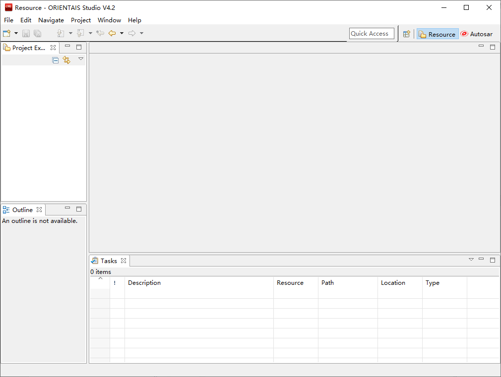

图 4‑1 软件主界面

2. 菜单栏File🡪New🡪Project，新建工程。

.. figure:: ../../_static/集成手册/FlashTest/image2.png
   :width: 4.7132in
   :height: 3.42708in

图 4‑2 新建工程

3. 在弹出的新建窗口中选择Autosar下的 [BSW Project]，选择Next。 

|image1|

图 4‑3 新建工程

4. 在弹出的窗口中输入工程名，选择Finish。

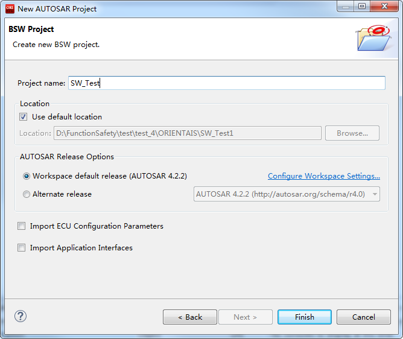

图 4‑4 新建工程

5. 在弹出的窗口中选择Yes。

.. figure:: ../../_static/集成手册/FlashTest/image5.png
   :width: 4.16875in
   :height: 3.32986in

图 4‑5 完成新建工程

6. 选择[Bsw_Builder]，右键单击，选择New ECU Configuration。

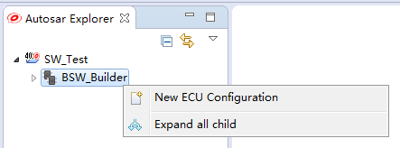

图 4‑6 新建ECU

7. 在弹出的窗口中输入ECU名，然后选择Next。

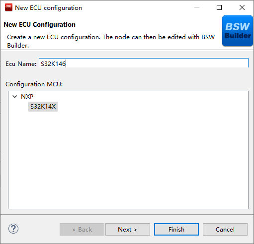

图 4‑7 选择芯片平台

8. 在弹出的窗口中勾选需添加的模块，点击Finish。

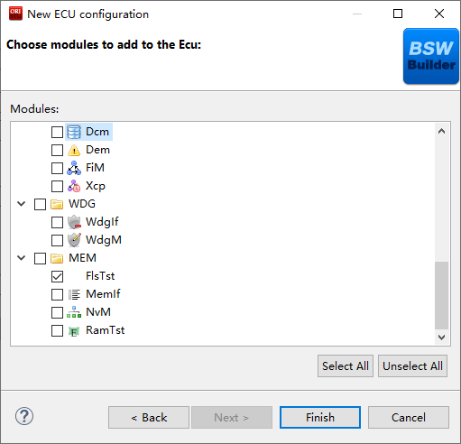

图 4‑8 完成ECU配置

9. 新建工程如下所示，步骤⑧中添加的模块已经被加入到工程中。

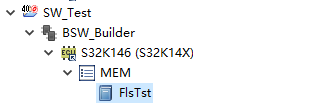

图 4‑9 工程列表界面

模块配置及生产代码
------------------

模块配置
~~~~~~~~

模块的具体配置，取决于具体的项目需求。配置代码生成

#. 在ORIENTAIS
   Configurator主界面左方，选择对应的协议栈，单击右键弹出Validate
   All和Generate All菜单。

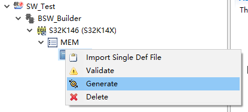

图 4‑10 代码生成

2. 选择Validate
   All对本协议栈各配置选项进行校验，没有错误提示信息即校验通过。若有错误信息，请按照错误提示修改。

3. 选择Generate
   All，生成配置文件。右下角的Console窗口输出生成的配置文件信息。

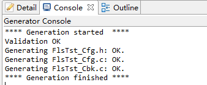

图 4‑11 代码生成提示界面

4. 将ORIENTAIS Configurator切换到Resource模式，即可查看生成的配置文件。

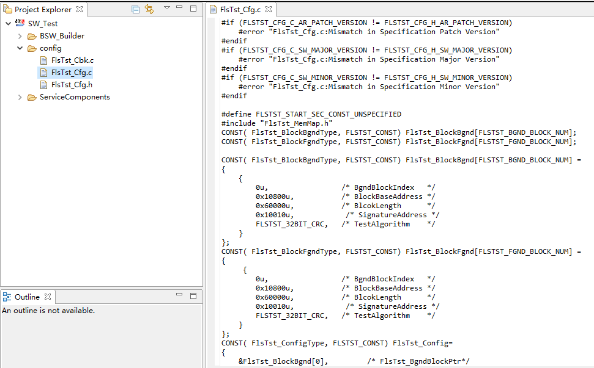

图 4‑12 生成的配置文件

功能集成
--------

代码集成
~~~~~~~~

FlashTest代码包括两部分：项目提供的FlashTest源码和ORIENTAIS
Configurator配置生成代码。

用户须将FlashTest源码和章节4.2.1生成的源代码添加到集成开发工具的对应文件夹。FlashTest集成的文件结构，见章节5.2.4。

集成注意事项
~~~~~~~~~~~~

对于集成过程中，FlashTest特殊要求和用户经常出现的问题，归类总结形成表
4‑3
FlashTest集成约束清单。用户需逐一排查表中的约束项，以避免集成问题出现。

.. table:: 表 4‑3 FlashTest集成约束清单

   +-----+---------+-----------------------------------------------------+
   |**编\|**类别** | **约束限制**                                        |
   |号** |         |                                                     |
   |     |         |                                                     |
   |     |         |                                                     |
   +-----+---------+-----------------------------------------------------+
   | **\ | 堆栈    | 用户需确保为任务堆栈和中断堆栈分配足够的堆栈空间。  |
   | 1** |         |                                                     |
   +-----+---------+-----------------------------------------------------+
   | **\ | 头文件  |添加协议\                                            |
   | 2** |         |栈代码之后，用户需更新集成开发工具中的头文件路径。   |
   |     |         |                                                     |
   |     |         |调用协议栈API的源文件，需要包含协议栈的头文件。      |
   +-----+---------+-----------------------------------------------------+
   | **\ | 初始化  | FlashTest的初始化API：FlsTst_Init                   |
   | 3** |         |                                                     |
   +-----+---------+-----------------------------------------------------+
   | **\ | 周\     | FlsTst_MainFunction需要被周期性任务函数调用。       |
   | 4** | 期函数  |                                                     |
   +-----+---------+-----------------------------------------------------+
   | **\ | 前\     | 前台测试使用CRC3                                    |
   | 5** | 台测试  | 2算法依赖硬件CRC和DMA，则需要确保相关驱动程序正常， |
   |     |         | 中断开启，以及在硬件CRC计算完成的中断函数设置标志。 |
   +-----+---------+-----------------------------------------------------+
   | **\ | 依赖    |软件依赖                                             |
   | 6** |         |                                                     |
   |     |         |OS：提供任务调\                                      |
   |     |         |度周期调用FlsTst_MainFunction提供周期后台测试调度。  |
   |     |         |                                                     |
   |     |         |DEM：DEM错误处理函数，该模块不是强制的。             |
   |     |         |                                                     |
   |     |         |DET：处理开发过程中的错误，该模块不是强制的。        |
   +-----+---------+-----------------------------------------------------+

集成示例
========

本章节向用户展示FlashTest的集成过程。用户可以据此熟悉FlashTest配置工具的配置过程，以及如何应用配置工具生成的配置文件。

本章节先完成基本FlashTest配置，使得工程可以编译通过，并实现FlashTest测试，然后根据具体需求服务进行添加或修改。

**注意：本示例不代表用户的实际配置情况，用户需要根据自己的实际需求，决定各个参数的配置。**

集成目标
--------

通过搭建基础工程，实现FlashTest测试功能。具体测试功能如下：

前台测试 - 在前台实现对所配置的Memory
Block用选定的算法进行。测试块参数配置如表5-1：

.. table:: 表 5‑1 前台测试测试块参数配置

   +----------+----------+----------+----------+---------+----------------+
   | **测\    | **起\    | **测\    | **测\    |**CRC\   | **\            |
   | 试类型** | 始地址** | 试长度** | 试算法** |地址**   | 测试使用方法** |
   +----------+----------+----------+----------+---------+----------------+
   | 前台测试 | 0x10800  | 0x60000  | CRC32    | 0xF0010 | 前台测试       |
   +----------+----------+----------+----------+---------+----------------+

后台测试 - 在后台实现对所配置的Memory
Block分为原子操作，用选定的算法进行异步的细分测试。参数配置如表5-2：

.. table:: 表 5‑2 后台测试测试块参数配置

   +----------+----------+---------+----------+---------+-----------------+
   | **测\    | **起\    | **测试\ |**测\     | **CRC\  | **测试使用方法**|
   | 试类型** | 始地址** | 长度**  |试算法**  | 地址**  |                 |
   +----------+----------+---------+----------+---------+-----------------+
   | 后台测试 | 0x10800  | 0x60000 | CRC32    | 0xF0010 | 后台测试        |
   +----------+----------+---------+----------+---------+-----------------+

模块的配置
----------

新建配置工程及模块加载操作，请参考本文档4.1章节。生成代码过程请参考章节4.2。

FlsTstGeneral配置
~~~~~~~~~~~~~~~~~

在此处进行一些功能的开启与禁用，以及配置FlashTest模块的一些常规功能属性。

#. 打开FlsTstGeneral模块配置界面。

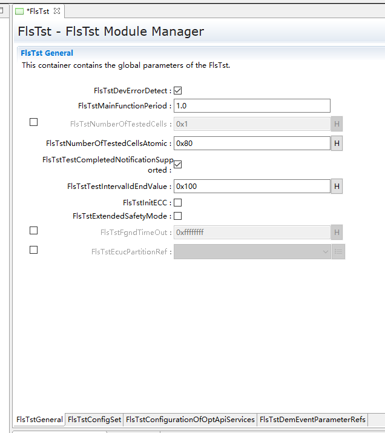

图 5‑1 FlsTstGeneral配置界面

**FlsTstDevErrorDetect**\ ：预处理器开关，以禁用/启用开发时的错误检测。在开发阶段需要开启，在发布时需要关闭。

**FlsTstMainFunctionPeriod**\ ：FlsTst_MainFunction的调用周期,以秒（s）为单位，通常放在低优先级的任务当中，如100ms任务或1s的任务中。

**FlsTstNumberOfTestedCells**\ ：配置在后台测试一次任务测试的Flash单元的数量，后台测试的每次执行计算的字节数量由FlsTstNumberOfTestedCells和FlsTstNumberOfTestedCellsAtomic两个配置项共同决定,具体的配置需根据实际的运算时间估算。

**FlsTstNumberOfTestedCellsAtomic**\ ：定义一个Flash单元的大小，即单次原子操作计算的大小（单位为Bytes）。

**FlsTstTestCompletedNotificationSupported**\ ：预处理器开关，以禁用/启用回调函数功能。

**FlsTstTestIntervalIdEndValue**\ ：定义后台测试的测试间隔ID的最大值。后台测试，对配置的顺序对配置的后台测试下所有的memory
block完成一次计算，叫做一次测试间隔，每个间隔具有一个ID，每次测试间隔完成后此ID自加1，当这个ID到达配置的最大值时，将会继续从0开始递增。

**FlsTstInitECC**\ ：预处理器开关，以在初始化函数中禁用/启用硬件ECC报错功能，在硬件不支持测试时，通常不开启。

**FlsTstExtendedSafetyMode**\ ：预处理器开关，以禁用/启用扩展安全模式，在扩展安全模式下，FlashTest将在初始化和运行过程中执行更多的检测功能。

**FlsTstFgndTimeOut**\ ：定义前台测试的超时计数值，如执行时间超过配置的超时计数，前台测试将返回错误并退出。一般根据前台测试的时间得出一个经验值。

**FlsTstEcucPartitionRef**\ ：将Flash测试驱动程序映射到零个或一个ECUC分区，以使驱动程序API在该分区中可用。

2. 配置FlsTstGeneral模块配置界面。FlashTest模块工具默认配置了相关参数供用户做默认生成，用户应根据实际需求，对相关配置项做出修改。

FlsTstConfigSet配置
~~~~~~~~~~~~~~~~~~~

此处进行FlashTest 待测Memory
Block进行配置。FlsTstConfigSet配置页面包含前台测试下的块属性配置和后台测试下的块属性配置，以及回调函数的配置。

#. 打开FlsTstConfigSet模块配置界面。

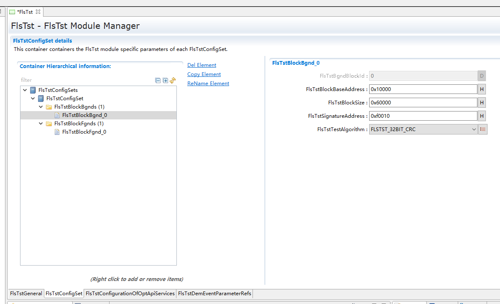

图 5‑2 FlsTstBlockBgnd配置

FlsTstBgnds容器在FlsTstConfigSet配置页面中，用于配置后台测试下的块属性。

**FlsTstBgndBlockId：**\ 由配置工具自动计算块ID号，默认从0开始，新建一个块，块ID加1。

**FlsTstBlockBaseAddress：**\ 配置的内存块的起始地址。

**FlsTstBlockSize**\ ：配置的内存块的长度。

**FlsTstSignatureAddress：**\ 当前内存块的签名数据存放的起始地址。

**FlsTstTestAlgorithm：**\ 选择Flash test算法类型。

FlsTstFgnds容器在FlsTstConfigSet配置页面中，用于配置前台测试下的块属性。配置项和FlsTstBgnds相同。

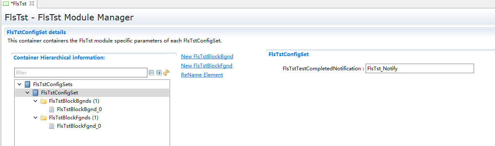

图 5‑3 FlsTstTestCompletedNotification配置

**FlsTstTestCompletedNotification**\ ：用于配置后台测试完成时的回调函数，该配置项依赖于FlsTstGenerl下FlsTstTestCompletedNotificationSupported配置项，只有在FlsTstTestCompletedNotificationSupported配置为true时，且不为NULL_PTR时，FlsTstTestCompletedNotification才会生成回调函数相关的代码。

2. 配置FlsTstConfigSet相关属性。

用户需关注前台测试和后台测试下的内存块属性，并对FlsTstTestCompletedNotification进行配置。

在FlsTstConfigSet->FlsTstConfigSet->FlsTstBlockBgnds,鼠标点击右键，添加新的Memory
Block，添加待测的后台测试内存块，并根据配置参数表填写FlsTstBlockbaseAddress、lststBlockSize、FlsTstSignatureAddress的参数，并选择对应的FlsTstTestAlgorithm。

在FlsTstConfigSet->FlsTstConfigSet->FlsTstBlockFgnds,鼠标点击右键，添加新的Memory
Block，添加待测的前台测试内存块，并根据配置参数表填写FlsTstBlockbaseAddress、lststBlockSize、FlsTstSignatureAddress的参数，并选择对应的FlsTstTestAlgorithm。

在FlsTstConfigSet->FlsTstConfigSet容器点击鼠标左键，对FlsTstTestCompletedNotification配置相应的回调函数。

FlsTstConfigurationOfApiServices配置
~~~~~~~~~~~~~~~~~~~~~~~~~~~~~~~~~~~~

此处进行FlashTest功能API的配置。打开模块配置界面，根据实际需求对相关API进行配置。

图 5‑4 FlsTstConfigurationOfApiServices配置

FlsTstDemEventParameterRefs配置
~~~~~~~~~~~~~~~~~~~~~~~~~~~~~~~

#. 选中FlsTstDemEventParameterRefss容器，鼠标右键选择New
   FlsTstDemEventParameterRefs，新建Dem参数引用。

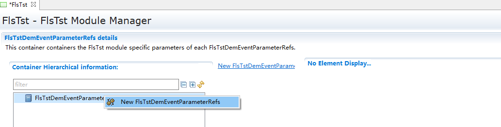

图 5‑5 FlsTstDemEventParameterRefs添加

2. 选择FlsTstDemEventParameterRefs配置界面。

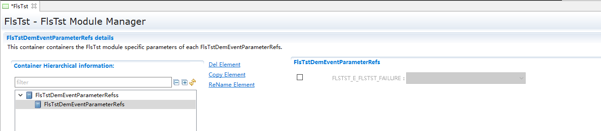

图 5‑6 FlsTstDemEventParameterRefs配置界面

3. 勾选FLSTST_E_FLSTST_FAILURE，并从下拉框中选择对应的Dem配置项。（注：需要DEM模块先配置相关的参数）

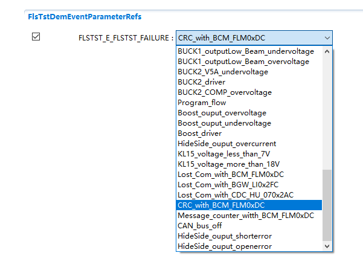

图 5‑7 FLSTST_E_FLSTST_FAILURE配置界面

源代码集成
----------

项目交付给用户的工程结构如下：

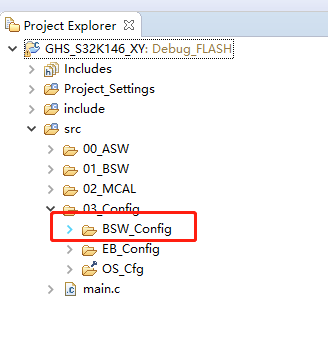

图 5‑8 工程结构图

-  Config目录，这个目录用来存放配置工具生成的配置文件，FlashTest有关的配置文件放在BSW_Config文件夹中。

-  BSW目录，存放模块相关的源代码。可以看到BSW目录下各个文件夹下是各个模块的源代码。

FlashTest源代码集成步骤如下：

#. 将5.2章节中ORIENTAIS Configurator生成的配置文件复制到BSW_Config文件夹中。

#. 将项目提供的协议栈源代码文件复制到BSW/Memory/FlsTst文件夹中。

CRC结果存放
-----------

以S32K146芯片平台做集成示例，使用S32K14X_MCAL4_2_RTM_1_0_4版本的MCAL开发，因其依赖于硬件的CRC和DMA。如果MCAL版本的变更，有关功能需要重新调试和验证。

在集成时，FlashTest模块需要将CRC等Memory的信息存储在芯片上的固定地址，而在代码的配置阶段，因为本身的代码会引入配置代码，导致当前的CRC值无法确定，配置时只能指定特定的地址，通常只能在代码定版后，对hex文件进行计算，并将CRC结果存放到Hex文件中指定的地址，需要注意CRC值的大小端问题。

在验证时，如果没有计算hex文件的工具或方法，可以使用另一种方式对Flashtest模块进行集成验证，可以通过代码链接的方式将需要写入的信息链接到指定的地址，这种方式需要修改代码的链接文件。

|image2|

图 5‑9 链接文件修改 划分区域

|image3|

图 5‑10 链接文件修改 定义段

相关代码定义如下：

const uint8  FlsTst_StoredInfo[] \__attribute\_\_
((section(".FlsTst_Info "))) =

{

        0x5a,0x5a,0x5a,0x5a,

        0x00,0x00,0x00,0x01,

        0x00,0x01,0x08,0x00,

        0x00,0x06,0x00,0x00,

        0xBF,0x60,0x10,0xA9

};

其中，

0x5A5A5A5A表示FlashTest存储信息的有效标志；

0x00000001表示当前的Memory Block的个数；

0x00010800表示第一个Memory block的起始地址

0x00060000表示第一个Memory block的计算大小

0xBF6010A9表示第一个Memory block的CRC值。

在链接文件中，需要对FlsTst_Info这个段，做好链接划分并指定地址。编译下载后，FlashTest所需要的信息即存储在芯片的指定位置。在集成FlashTest模块后，因为CRC值尚无法确定，可通过DEBUG的方式，先通过芯片计算出一个正确的CRC值，再用计算的CRC结果来修改FlsTst_StoredInfo中Memory
block的CRC值。

FlashTest调度集成
-----------------

FlashTest调度集成步骤如下：

#. FlashTest调度集成，需要逐一排查并实现表 4‑3
   FlashTest集成约束清单所罗列的问题，以避免集成出现差错。

#. 编译链接代码，将生成的elf文件烧写进芯片。

初始化代码如下：

FlsTst_Init(&FlsTst_Config);应在合适的位置进行初始化。

前台测试代码如下：

TASK(OsTask_Init)

{

    Std_ReturnType FlsTstReturn;

  FlsTst_TestResultFgndType FgndBlockResult;

   FlsTstReturn = FlsTst_StartFgnd(0U);

  FgndBlockResult = FlsTst_GetTestResultFgnd();

……

}

前台测试代码需要依赖硬件CRC和DMA，用户需要配置对应的中断函数，并在中断函数中实现对FlashTest计算完成的标志置位，实现代码如下：

void Crcu_AsyncCalculateCrcCompleteNotif()

{

    /\* Used for FlsTst_StartFgnd \*/

    CrcCompleted = 1U;

}

后台测试代码如下：

FlsTst_MainFunction();应放在周期较大，优先级较低的任务中。

验证结果
--------

验证前台测试
~~~~~~~~~~~~

将工程编译通过后，使用调试工具进行调试，当执行FlsTstReturn =
FlsTst_StartFgnd
()语句后，FlsTstReturn表示前台测试的执行成功是否成功，再调用FlsTst_GetTestResultFgnd
()获取前台测试的结果，编译下载调试时，在获取结果后打断点，如果计算的CRC值和存储的CRC值一致，测试结果为FLSTST_OK。

验证后台测试
~~~~~~~~~~~~

将工程编译通过后，使用调试工具进行调试，周期调用FlsTst_MainFunction()，编译下载仿真时，当后台测试完成时，会调用FlsTst_TestCompletedNotification()回调函数，在回调函数里面再调用FlsTst_GetTestResult()获取结果，可以看见返回测试结果为FLSTST_OK。

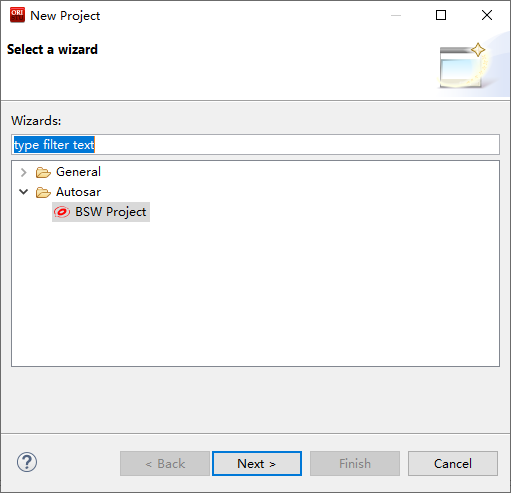
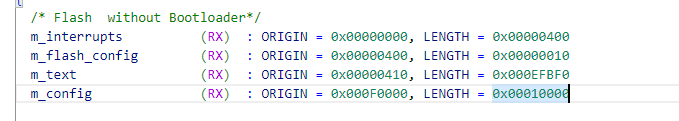
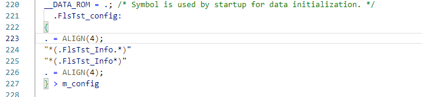
