===================
LinMaster_集成手册
===================

目的
====

本文档旨在通过一个LIN通信的示例工程的配置，向用户展示通信栈的集成过程。

由于各项目的需求不同，集成示例不会针对于特定的商业项目做详细讲解。

缩写词和术语
============

.. table:: 表格 2‑1 缩写词和术语

   +---------------+------------------------------------------------------+
   | **\           | **描述**                                             |
   | 缩写词/术语** |                                                      |
   +---------------+------------------------------------------------------+
   | BSW           | Basic Software 基础软件                              |
   +---------------+------------------------------------------------------+
   | BswM          | Basic Software Mode Manager 基础软件模式管理         |
   +---------------+------------------------------------------------------+
   | MCAL          | Microcontroller Abstraction Layer 微控制器抽象层     |
   +---------------+------------------------------------------------------+
   | LinIF         | LIN Interface LIN接口                                |
   +---------------+------------------------------------------------------+
   | LinSM         | LIN State Manager LIN状态管理                        |
   +---------------+------------------------------------------------------+
   | ComM          | Communication Manager 通信管理                       |
   +---------------+------------------------------------------------------+
   | EcuM          | ECU State Manager ECU状态管理                        |
   +---------------+------------------------------------------------------+
   | SchM          | Scheduler Manager 调度管理                           |
   +---------------+------------------------------------------------------+

参考文档
========

[1]参考手册_PduR.pdf

[2]参考手册_Com.pdf

[3]参考手册_EcuC.pdf

[4]参考手册_ComM.pdf

[5]参考手册_LinSM.pdf

[6]参考手册_LinIf.pdf

协议栈集成
==========

项目交付的内容为：通信栈源码和ORIENTAIS
Configurator配置工具。通信栈细分为通信栈的各模块及其对应的配置工具模块。

通信栈各配置模块的功能介绍，参见表 4 1通信栈各配置模块介绍。

使用通信栈源码和配置工具，进行通信栈的集成的步骤，参见表 4 2
通信栈集成的步骤。

.. table:: 4‑1模块功能介绍

   +---------+------------------------------------------------------------+
   | **模\   | **功能**                                                   |
   | 块名**  |                                                            |
   +---------+------------------------------------------------------------+
   | Lin     | Lin驱动配置。(由MCAL工具导入)                              |
   +---------+------------------------------------------------------------+
   | LinIf   | LinIf模块主要处理上层模块与底层驱动的之间                  |
   |         | PDU的传递，为上层模块提供统一的接口来管理不同的Lin硬件模块 |
   +---------+------------------------------------------------------------+
   | EcuC    | 用于辅助配置工具完成配置的模块。主                         |
   |         | 要提供Pdu的定义，其它模块通过关联EcuC中Pdu，相互关联起来。 |
   +---------+------------------------------------------------------------+
   | PduR    | PDU Router主要为通讯接口模块（LINIF）、传输协议模块（LIN   |
   |         | TP、J1939                                                  |
   |         | TP）、诊断通讯管理模块（DCM、J1939DCM）以及通讯模块（C     |
   |         | OM、LDCOM）以及IPDUM、SECOC等模块提供基于I-PDU的路由服务。 |
   +---------+------------------------------------------------------------+
   | Com     | COM模块主要提供I-PDU和信号相关管理功能                     |
   +---------+------------------------------------------------------------+
   | ComM    | ComM模块主要进行通信的管理功能。                           |
   |         | ComM模块收集用户的总线访问请求，并把请求转发到不同的总线。 |
   +---------+------------------------------------------------------------+
   | LinSM   | 主要功                                                     |
   |         | 能是与通信硬件抽象层和系统服务层产生交互，为每一个Lin通信  |
   |         | 总线定义一个总线相关的状态管理，并为相关的总线提供流控制。 |
   +---------+------------------------------------------------------------+

.. table:: 4‑2 集成步骤介绍

   +-----+--------------------------+------------------------------------+
   |**步\| **操作**                 | **说明**                           |
   |骤** |                          |                                    |
   |     |                          |                                    |
   |     |                          |                                    |
   +-----+--------------------------+------------------------------------+
   | 1   | ORIENTAIS                | 若配置工具已经搭建                 |
   |     | Configurator配置工具     | ，则仅需进行通信栈模块的加载操作。 |
   |     | 工程搭建和通信栈模块加载 |                                    |
   +-----+--------------------------+------------------------------------+
   | 2   | 模块配置及配置文件生成   | NA                                 |
   +-----+--------------------------+------------------------------------+
   | 3   | 代码集成                 | 现有工程、                         |
   |     |                          | 通信栈源代码和配置生成文件的集成。 |
   +-----+--------------------------+------------------------------------+
   | 4   | 验证测试                 | NA                                 |
   +-----+--------------------------+------------------------------------+

**注意：通信栈集成之前，用户须确保已经有基础工程，且本通信栈相关的其他通信栈能正常工作。**

新建ORIENTAIS工程
-----------------

#. 安装软件后，双击软件图标打开软件

.. figure:: ../../_static/集成手册/LinMaster/image1.png
   :width: 5.77153in
   :height: 2.62431in

图4‑1 新建工程-1

2. 菜单栏File🡪New🡪Project，新建工程

.. figure:: ../../_static/集成手册/LinMaster/image2.png
   :width: 4.92431in
   :height: 3.56389in

图4‑2 新建工程-2

3. 在弹出的新建窗口中选择Autosar下的 [BSW Project]，选择Next

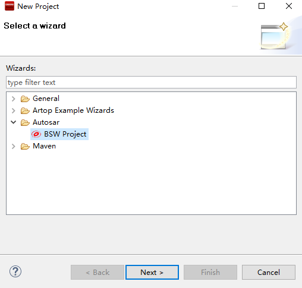

图4‑3 新建工程-3

4. 在弹出的窗口中输入工程名，选择Finish

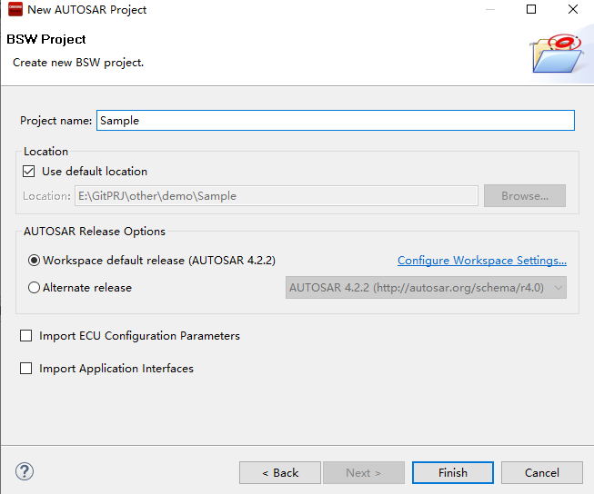

图4‑4 新建工程-4

5. 在弹出的窗口中选择Yes。

.. figure:: ../../_static/集成手册/LinMaster/image5.png
   :width: 5.64741in
   :height: 2.6267in

图4‑5 新建工程-5

6. 在工程的[Bsw_Builder]项目上右键，选择New ECU Configuration

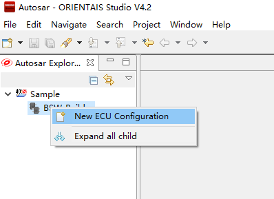

   4‑6 新建工程-6

7. 在弹出的窗口中输入一个ECU名，然后选择Next

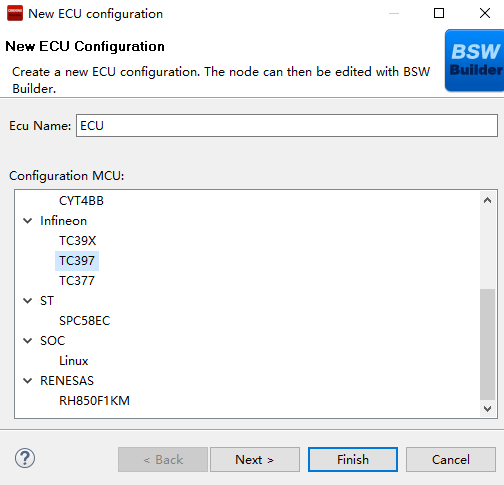

图4‑7 新建工程-7

8. 在弹出的窗口中勾选需要添加的模块，点击Finish。

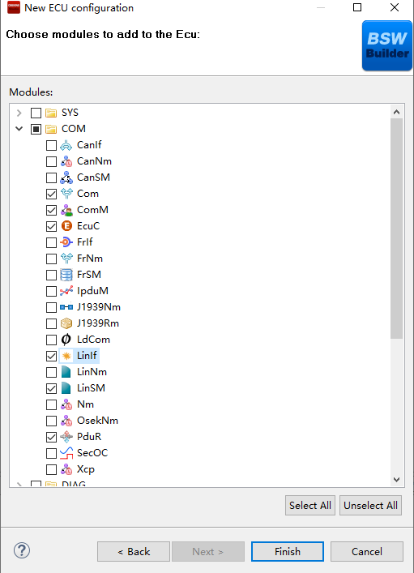

图4‑8 新建工程-8

9. 新建完成的工程如下所示，步骤⑦中添加的模块已经被加入到工程中。

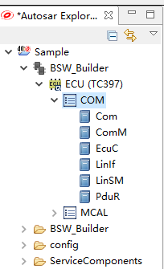

图4‑9 新建工程-9

模块配置及代码生成
------------------

4.2.1模块配置
~~~~~~~~~~~~~

模块的配置，取决于具体的项目需求。通信栈各模块配置项的详细介绍，参见表4-3相关文档

.. table:: 4‑3 模块参考文档

   +--------+---------------------------------------------+--------------+
   | **     | **参考文档及其章节**                        | **说明**     |
   | 模块** |                                             |              |
   +--------+---------------------------------------------+--------------+
   | LIN    | MCAL对应的LIN配置手册                       |              |
   +--------+---------------------------------------------+--------------+
   | LinIf  | LinIf.pdf 章节5                    |              |
   +--------+---------------------------------------------+--------------+
   | PduR   | PduR.pdf 章节5                     |              |
   +--------+---------------------------------------------+--------------+
   | Com    | Com.pdf 章节5                      |              |
   +--------+---------------------------------------------+--------------+
   | LinSM  | LinSM.pdf 章节5                    |              |
   +--------+---------------------------------------------+--------------+
   | EcuC   | EcuC.pdf 章节5                     |              |
   +--------+---------------------------------------------+--------------+
   | ComM   | ComM.pdf 章节5                     |              |
   +--------+---------------------------------------------+--------------+

4.2.2配置代码生成
~~~~~~~~~~~~~~~~~

#. 在工程上右键会弹出校验整个工程和生成整个工程所有模块配置文件的菜单。

#. 首先选择Validate All，没有错误提示信息即校验通过。

.. figure:: ../../_static/集成手册/LinMaster/image10.png
   :width: 3.66718in
   :height: 4.96944in

图4‑10 配置校验

3. 然后选择Generate
   All，生成配置文件。右下角的输出框中会输出生成的配置文件信息。

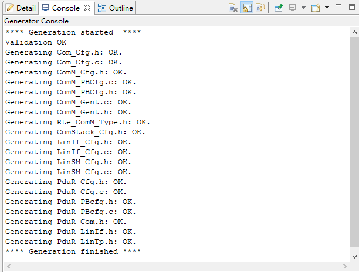

图4‑11 配置生成信息

4. 在工程Config文件夹下即可查看生成的配置文件。

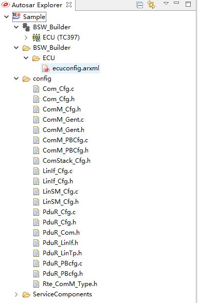

图4‑12 Config代码生成

功能集成
--------

4.3.1代码集成
~~~~~~~~~~~~~

通信栈代码包括两部分：项目提供的通信栈源码和ORIENTAIS
Configurator配置生成代码。通信栈集成包括通信栈源码（LIN、LinIf、PduR、ComM、LinSM等）、定时器源码和部分其他模块源码，具体文件见表4-4。

用户须将通信栈源码和章节4.2.2生成的源代码添加到集成开发工具的对应文件夹。通信栈集成的文件结构，参见章节5.3。

.. table:: 4‑4 通信栈源码文件

   +-----------+--------------------------------------------+------------+
   | **移库\   | **移库文件**                               | **说明**   |
   | 文件夹**  |                                            |            |
   +-----------+--------------------------------------------+------------+
   | ComM      | ComM                                       | 通信栈源码 |
   |           | .c、ComM.h、ComM_BusSM.h、ComM_Com.h、ComM |            |
   |           | _Dcm.h、ComM_EcuMBswM.h、ComM_Internal.c、 |            |
   |           | ComM_Internal.h、ComM_MemMap.h、ComM_Nm.h  |            |
   +-----------+--------------------------------------------+------------+
   | LinIf     | LinIf.c、LinIf.                            |            |
   |           | h、LinIf_Cbk.h、LinIf_Internal.h、LinIf_Ma |            |
   |           | ster.c、LinIf_Master.h、LinIf_MemMap.h、Li |            |
   |           | nIf_Types.h、LinTp.c、LinTp.h、LinTp_Inter |            |
   |           | nal.c、LinTp_Internal.h、LinTp_Master.c、L |            |
   |           | inTp_Master.h、LinTp_Types.h、SchM_LinIf.h |            |
   +-----------+--------------------------------------------+------------+
   | LinSM     | LinSM                                      |            |
   |           | .c、LinSM.h、LinSM_Cbk.h、LinSM_MemMap.h、 |            |
   +-----------+--------------------------------------------+------------+
   | PDUR      | PduR_LinIf.h、PduR_                        |            |
   |           | Com.h、PduR_Internal.c、PduR_Internal.h、P |            |
   |           | duR_MemMap.h、PduR_Types.h、PduR.c、PduR.h |            |
   +-----------+--------------------------------------------+------------+
   | Com       | Com.c、Com                                 |            |
   |           | .h、Com_Cbk.h、Com_GwInternal.c、Com_Inter |            |
   |           | nal.c、Com_Internal.h、Com_MemMap.h、Com_R |            |
   |           | xInternal.c、Com_TxInternal.c、Com_Types.h |            |
   +-----------+--------------------------------------------+------------+
   | F         | FreeRTimer.c、FreeRTimer.h                 | 定时器源码 |
   | reeRTimer |                                            |            |
   +-----------+--------------------------------------------+------------+
   | SchM      | SchM.c、SchM.h、SchM_Com.h                 | Sc         |
   |           | 、SchM_ComM.h、SchM_LinIf.h、SchM_PduR.h、 | hM部分源码 |
   +-----------+--------------------------------------------+------------+
   | BswM      | B                                          | Bs         |
   |           | swM.c、BswM.h、BswM_LinSM.h、BswM_ComM.h、 | wM部分源码 |
   +-----------+--------------------------------------------+------------+
   | EcuM      | EcuM_Types.h、EcuM.h、                     | Ec         |
   |           |                                            | uM部分源码 |
   +-----------+--------------------------------------------+------------+

**注意：通信栈集成之前，用户须确保已经有基础工程，且本通信栈相关的其他通信栈能正常工作。**

4.3.2集成注意事项
~~~~~~~~~~~~~~~~~

对于集成过程中，通信栈特殊要求和用户经常出现的问题，归类总结形成表
4‑5通信栈集成约束清单。用户需逐一排查表中的约束项，以避免集成问题出现。

.. table:: 4‑5 集成约束清单

   +-----+---------+-----------------------------------------------------+
   |**编\|**类别** | **约束限制**                                        |
   |号** |         |                                                     |
   |     |         |                                                     |
   |     |         |                                                     |
   +-----+---------+-----------------------------------------------------+
   | 1   | 中断    | 通信栈                                              |
   |     |         | 有中断、轮询或混合三种工作模式。若选取中断或混合模  |
   |     |         | 式，用户需在通信栈配置对应的中断并填充中断服务API。 |
   +-----+---------+-----------------------------------------------------+
   | 2   | 堆栈    | 用户需确保为任务堆栈和中断堆栈分配足够的堆栈空间。  |
   +-----+---------+-----------------------------------------------------+
   | 3   | 头文件  |添加通信\                                            |
   |     |         |栈代码之后，用户需更新集成开发工具中的头文件路径。   |
   |     |         |                                                     |
   |     |         |调用通信栈API的源文件，需要包含通信栈的头文件。      |
   +-----+---------+-----------------------------------------------------+
   | 4   | 初始化  | 以LIN通信                                           |
   |     |         | 为例，通信栈的初始化顺序为：Lin_Init、LinIf_Init、  |
   |     |         | PduR_Init、Com_Init、LinSM_Init。                   |
   +-----+---------+-----------------------------------------------------+
   | 5   | 周\     | Co                                                  |
   |     | 期函数  | m_MainFunctionRx、Com_MainFunctionTx、LinIf_MainFun |
   |     |         | ction、LinSM_MainFunction需要被周期性任务函数调用。 |
   +-----+---------+-----------------------------------------------------+

集成示例
========

集成目标
--------

集成后的工程为LIN主节点，集成完成后的工程可以进行两个无条件帧的发送、两个无条件帧的接收。

开启一个周期调度表进行循环调度发送。

通信报文配置如表5-1：

.. table:: 5‑1 通信报文配置

   +--------------+----------+-----+--------+---------------------------+
   | **帧名称**   | **\      | **I\| **Tx   | **关联帧**                |
   |              | 帧类型** | D** | \\Rx** |                           |
   +--------------+----------+-----+--------+---------------------------+
   | Li           | 无条件帧 | 0x1 | Tx     |                           |
   | nIfFrame_Tx1 |          |     |        |                           |
   +--------------+----------+-----+--------+---------------------------+
   | Li           | 无条件帧 | 0x2 | Tx     |                           |
   | nIfFrame_Tx2 |          |     |        |                           |
   +--------------+----------+-----+--------+---------------------------+
   | Li           | 无条件帧 | 0x3 | Rx     |                           |
   | nIfFrame_Rx1 |          |     |        |                           |
   +--------------+----------+-----+--------+---------------------------+
   | Li           | 无条件帧 | 0x4 | Rx     |                           |
   | nIfFrame_Rx2 |          |     |        |                           |
   +--------------+----------+-----+--------+---------------------------+

.. _模块配置-1:

模块配置
--------

5.2.1 EcuC模块配置
~~~~~~~~~~~~~~~~~~

10. 双击EcuC模块，打开EcuC模块配置界面。

.. figure:: ../../_static/集成手册/LinMaster/image13.png
   :width: 5.77153in
   :height: 4.39722in

图5‑1 EcuC配置-1

11. 在EcucConfigSets栏目上右键，选择EcucConfigSet。再在EcucConfigSet上右键，选择New🡪EcucPduCollection。

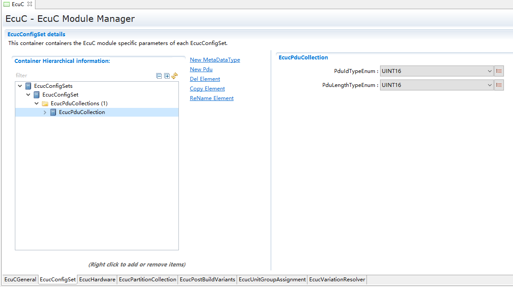

图5‑2 EcuC配置-2

-  PduIdTypeEnum 选择UINT16.

-  PduLengthTypeEnum 选择UINT16。

12. 在EcucPduCollection上右键，选择Pdu，会生成一个Pdu的配置界面。

.. figure:: ../../_static/集成手册/LinMaster/image15.png
   :width: 5.77153in
   :height: 3.46181in

图5‑3 EcuC配置-3

这里按照发送和接收，将Pdu名字改为报文的名字。

PduLength：Pdu长度，根据实际使用帧的长度设置。

13. 根据步骤③的描述，配置其余报文的Pdu。

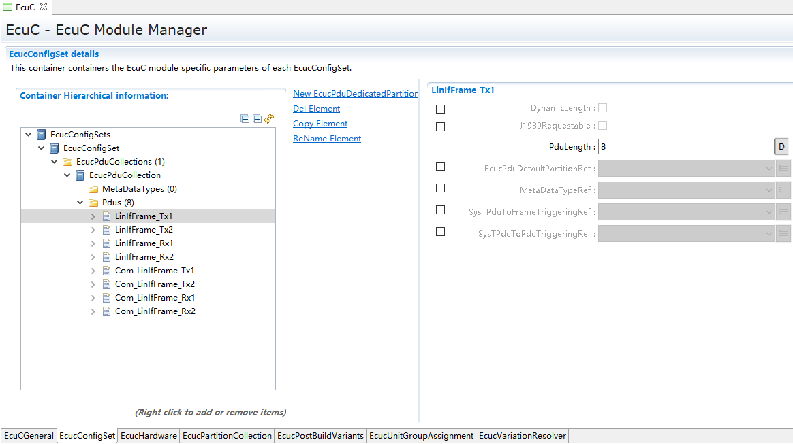

图5‑4 EcuC配置-4

14. 报文需要PDUR路由，每个方向需要配置2个Pdu。

15. ECUC模块到此配置结束。在模块上右键，然后选择校验，查看是否配置有错误。

5.2.2 Lin模块配置
~~~~~~~~~~~~~~~~~

如果Lin驱动使用的是MCAL配置，那么将MCAL生成的arxml配置文件导入到BSW工具选择对应的Lin模块即可。

5.2.3 LinIf模块配置
~~~~~~~~~~~~~~~~~~~

#. 双击LinIf模块，打开LinIf模块的配置界面。

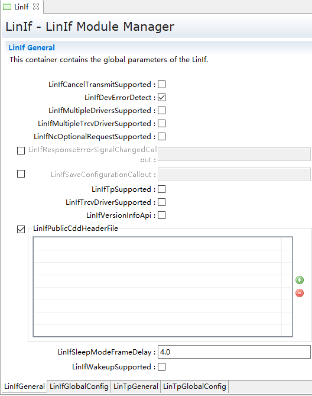

图5‑5 LinIf配置-1

2. LinIfGeneral标签页保持默认值即可。

3. 在LinIfGlobalConfig标签页下依次打开LinIfGlobalConfigs
   ->LinIfGlobalConfig ->LinIfChannel_0进行如下配置。

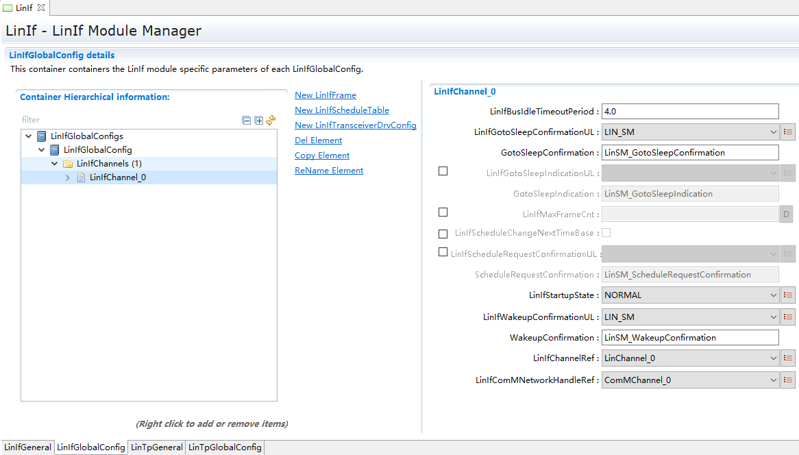

图5‑6 LinIf配置-2

LinIfChannel_0配置参数说明：

.. table:: 5‑2 LinIfChannel_0配置参数说明

   +----------------------------+--------------+-------------------------+
   | **参数名**                 | **设置值**   | **说明**                |
   +----------------------------+--------------+-------------------------+
   | Li                         | LINSM        | Go-to-sleep命令的确     |
   | nIfGotoSleepConfirmationUL |              | 认通知，通知的上层模块  |
   +----------------------------+--------------+-------------------------+
   | LinIfSch                   | LINSM        | 调                      |
   | eduleRequestConfirmationUL |              | 度表切换成功执行后的通  |
   |                            |              | 知函数，通知的上层模块  |
   +----------------------------+--------------+-------------------------+
   | LinIfStartupState          | NORMAL       | Li                      |
   |                            |              | n通道在启动后所处的状态 |
   +----------------------------+--------------+-------------------------+
   | LinIfWakeupConfirmationUL  | LINSM        | Wakeup通                |
   |                            |              | 知函数，通知的上层模块  |
   +----------------------------+--------------+-------------------------+
   | LinIfChannelRef            | LinChannel_0 | LinIf的                 |
   |                            |              | 通道对应的Lin驱动的通道 |
   +----------------------------+--------------+-------------------------+
   | LinIfComMNetworkHandleRef  | C            | LinI                    |
   |                            | omMChannel_0 | f的通道对应的ComM的通道 |
   +----------------------------+--------------+-------------------------+

4. 然后右击LinIfChannel_0新建LinIfFrame对象。

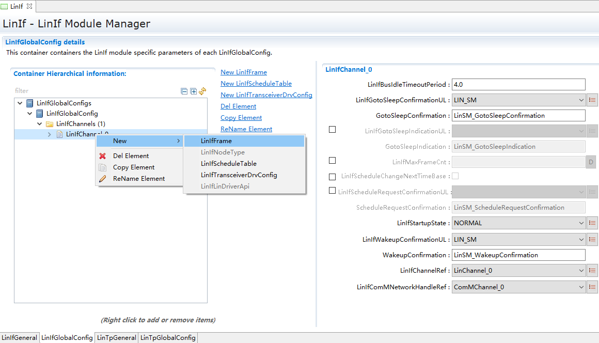

图5‑7 LinIf配置-3

5. 按照步骤创建4个对象，根据章节5.1集成目标修改名字，并将LinIfFrameId设置为对应值。

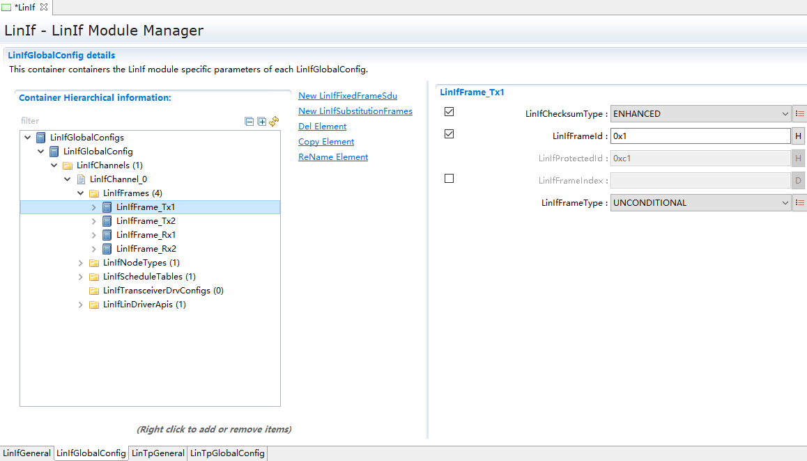

图5‑8 LinIf配置-4

下面对不同名称的帧各举一例说明配置参数。

LinIfFrame_Tx1报文LinFrame配置说明：

.. table:: 5‑3 LinIfFrame_Tx1报文LinFrame配置说明

   +-----------------------+-------------------+-------------------------+
   | **参数名**            | **设置值**        | **说明**                |
   +-----------------------+-------------------+-------------------------+
   | LinIfChecksumType     | ENHANCED          | 报文使用的checksum类型  |
   |                       |                   | （此处使用增强型校验）  |
   +-----------------------+-------------------+-------------------------+
   | LinIfFrameType        | UNCONDITIONAL     | 报文帧的类型            |
   |                       |                   | （此处设置为无条件帧）  |
   +-----------------------+-------------------+-------------------------+
   | LinIfFrameId          | 0x1               | 报文ID                  |
   +-----------------------+-------------------+-------------------------+

LinIfFrame_Rx1报文LinFrame配置说明：

.. table:: 5‑4 LinIfFrame_Rx1报文LinFrame配置说明

   +-----------------------+-------------------+-------------------------+
   | **参数名**            | **设置值**        | **说明**                |
   +-----------------------+-------------------+-------------------------+
   | LinIfChecksumType     | ENHANCED          | 报文使用的checksum类型  |
   |                       |                   | （此处使用增强型校验）  |
   +-----------------------+-------------------+-------------------------+
   | LinIfFrameType        | UNCONDITIONAL     | 报文帧的类型            |
   |                       |                   | （此处设置为无条件帧）  |
   +-----------------------+-------------------+-------------------------+
   | LinIfFrameId          | 0x3               | 报文ID                  |
   +-----------------------+-------------------+-------------------------+

6. 点击LinIfFrame_Tx1左边的三角，展开子配置页面，右键新建一个LinPduDirection对象，如果前面的LinIfFrame为Tx类型，则选择LinTxPdu，如果前面的LinIfFrame为Rx类型，则选择LinRxPdu。

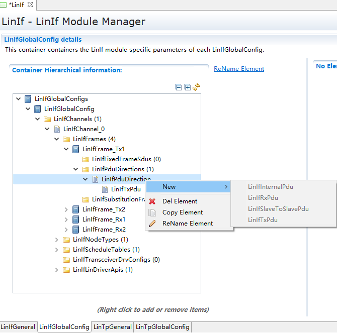

图5‑9 LinIf配置-5

7. 点击新建的LinTxPdu然后选择右边LinIfTxPduRef对象，要求和LinIfFrame名称对应，如LinIfFrame_Tx1对应LinIfFrame_Tx1。

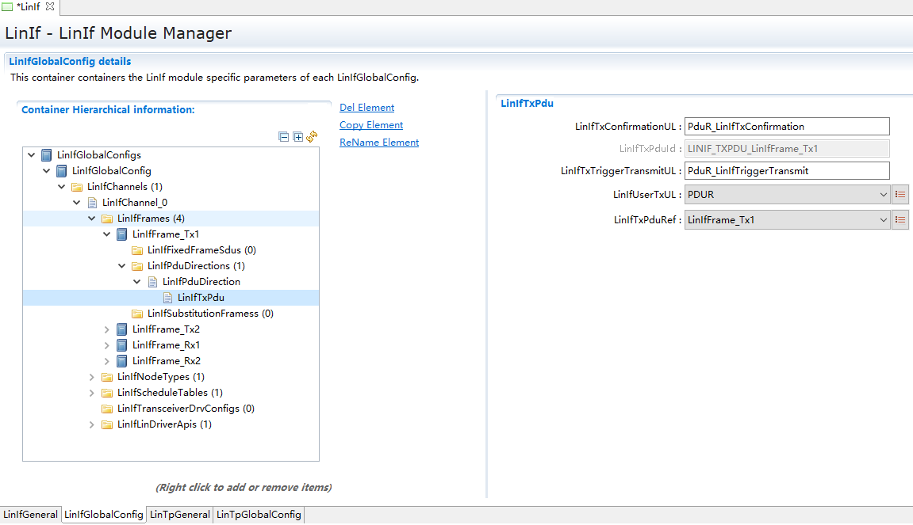

图5‑10 LinIf配置-6

以LinIfFrame_Tx1为例配置LinTxPdu配置参数：

.. table:: 5‑5 LinIfFrame_Tx1报文LinTxPdu配置说明

   +---------------+--------------+---------------------------------------+
   | **参数名**    | **设置值**   | **说明**                              |
   +---------------+--------------+---------------------------------------+
   | LinIfUserTxUL | PDUR         | 用于确定触发LinTxPdu发送的            |
   |               |              | 上层模块，并在发送成功后通知该模块。  |
   +---------------+--------------+---------------------------------------+
   | LinIfTxPduRef | Li           | 指向一个ECUC中                        |
   |               | nIfFrame_Tx1 | 定义的PDU，将LinIfTxPdu和Pdu关联起来  |
   +---------------+--------------+---------------------------------------+

8. 按照上面的步骤完成剩下LinIfFrame的配置。

.. table:: 5‑6 其他报文LinIfFrame配置说明

   +-----------------------------------+----------------------------------+
   | **报文名**                        | **LinIfTxPdu\\LinIfRxPdu**       |
   +-----------------------------------+----------------------------------+
   | LinIfFrame_Tx1                    | LinIfTxPdu                       |
   +-----------------------------------+----------------------------------+
   | LinIfFrame_Tx2                    | LinIfTxPdu                       |
   +-----------------------------------+----------------------------------+
   | LinIfFrame_Rx1                    | LinIfRxPdu                       |
   +-----------------------------------+----------------------------------+
   | LinIfFrame_Rx2                    | LinIfRxPdu                       |
   +-----------------------------------+----------------------------------+

9. 展开LinIfScheduleTables，右击LinIfScheduleTable_0新建一个LinIfEntry对象。

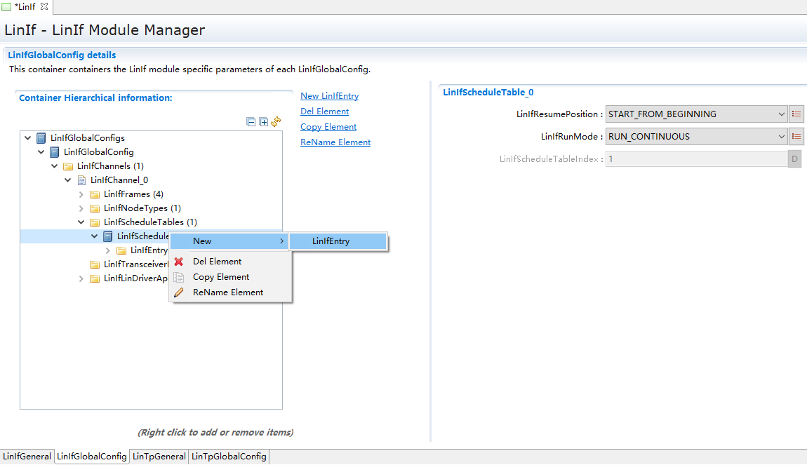

图5‑11 LinIf配置-7

LinIfScheduleTable_0配置说明：

.. table:: 5‑7 LinIfScheduleTable_0配置说明

   +---------------+------------------+-----------------------------------+
   | **参数名**    | **设置值**       | **说明**                          |
   +---------------+------------------+-----------------------------------+
   | LinIfR        | STAR             | 定义调度表被中断后从头开始运行    |
   | esumePosition | T_FROM_BEGINNING | （也可以设置为从断点处接着运行）  |
   +---------------+------------------+-----------------------------------+
   | LinIfRunMode  | RUN_CONTINUOUS   | 定义调度表执行的次数              |
   +---------------+------------------+-----------------------------------+

10. 新建完成之后进行如下重命名，并在右边配置栏中配置LinIfFrameRef选项。要求与前面名称对应。

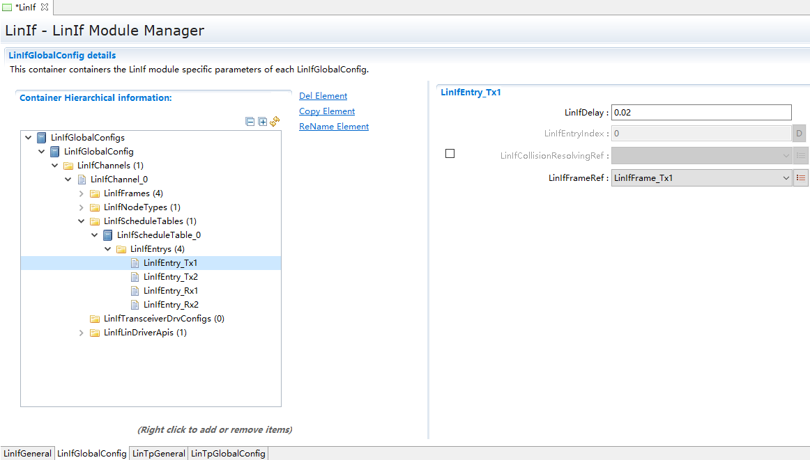

图5‑12 LinIf配置-8

-  LinIfDelay：到调度表的下一个Entry之间的延时时间（单位：秒）

-  LinIfFrameRef：指向本Entry对应的Frame

11. 按照步骤创建剩下的LinIfEntry，并配置右边LinIfFrameRef选项。

12. 校验配置，无错误信息，即配置完成。

5.2.4 Com模块配置
~~~~~~~~~~~~~~~~~

#. 双击Com模块，打开Com模块的配置界面。

.. figure:: ../../_static/集成手册/LinMaster/image25.png
   :width: 5.71875in
   :height: 6.88542in

图5‑13 Com配置-1

2. ComGeneral标签页里面只需要配置ComSupportedIPduGroups参数，其余参数保持默认即可。ComSupportedIPduGroups是指IPduGroup的个数。IPduGroups会在ComConfig标签页中配置。后面的配置中将会配置2个IPduGroup，所以将这个参数配置为2。

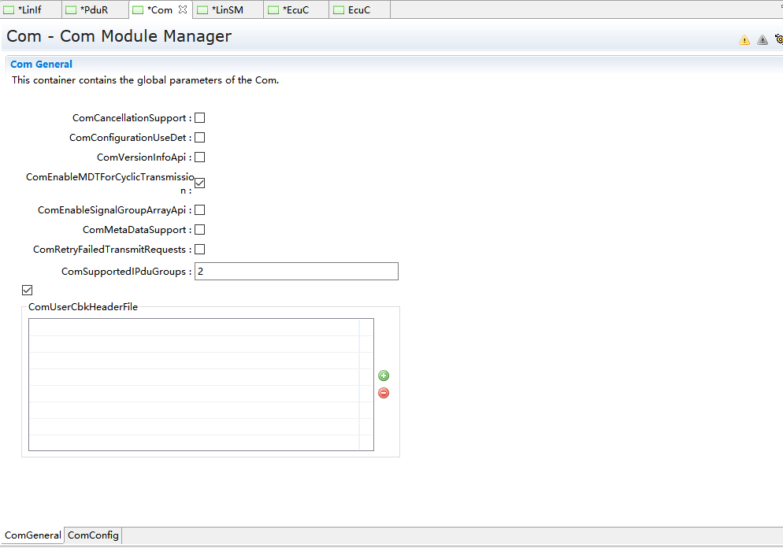

图5‑14 Com配置-2

3. ComConfig下的两个参数不需要配置，保持默认即可。

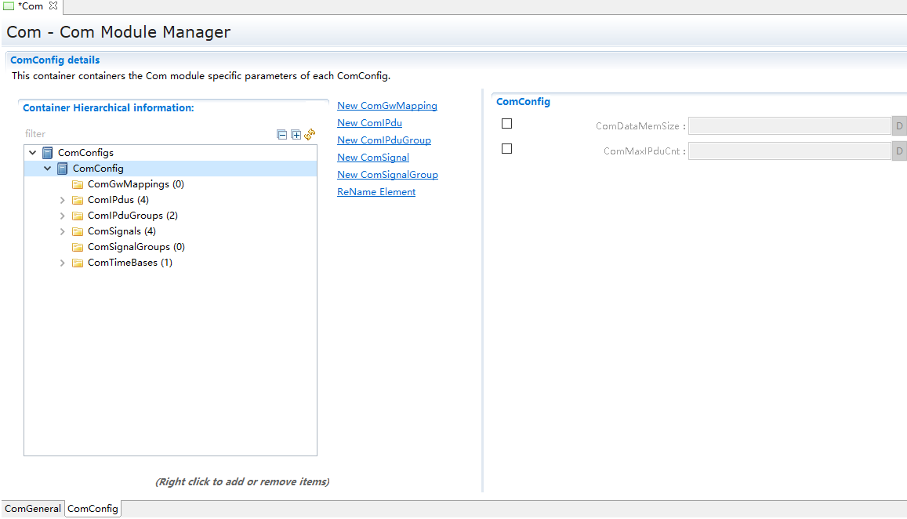

图5‑15 Com配置-3

4. ComGwMapping为信号路由的配置，本次示例不需要信号路由，不需要创建对应对象。

5. 新建4个ComIPdu对象，并修改名字。

根据前文中定义的报文，创建4个ComIPdu对象。由于ComIPdu属性配置需要关联其他的对象，ComIPdu的属性先暂时不配置，待添加了其它对象后再配置ComIPdu属性。（参照步骤）

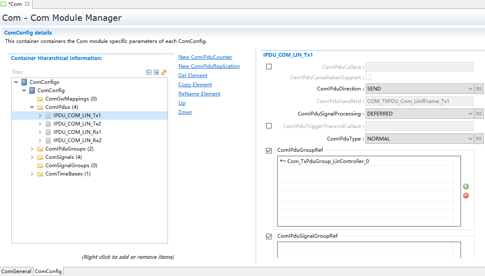

图5‑16 Com配置-4

6. 配置ComIPduGroup。

将IPdu加入IPduGroup可以方便的控制IPdu的状态，根据需要使能和禁止IPdu的收发。

添加两个ComIPduGroup对象，一个用于管理发送报文，一个用于管理接收报文，参数保持默认即可。

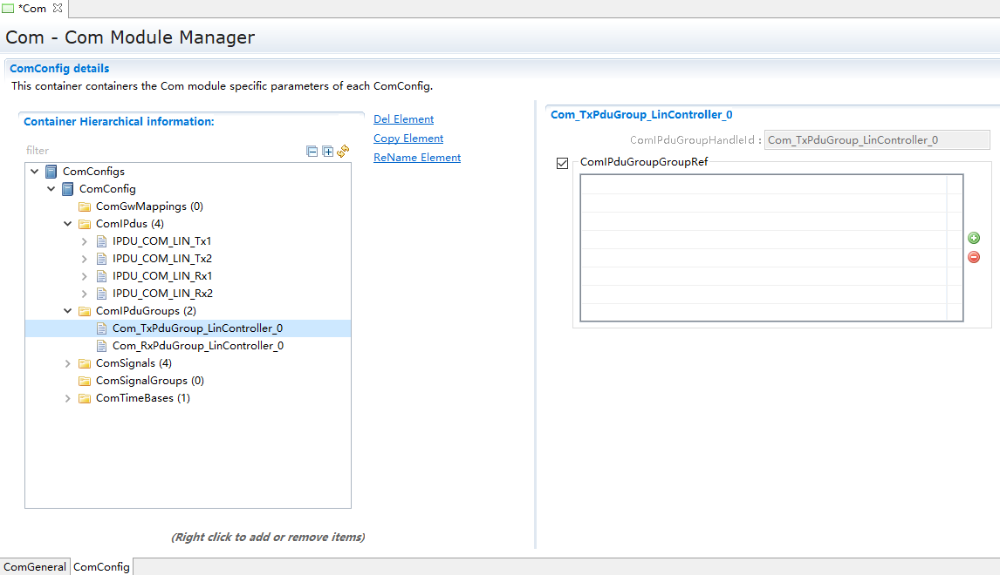

图5‑17 Com配置-5

7. 配置ComSignal。

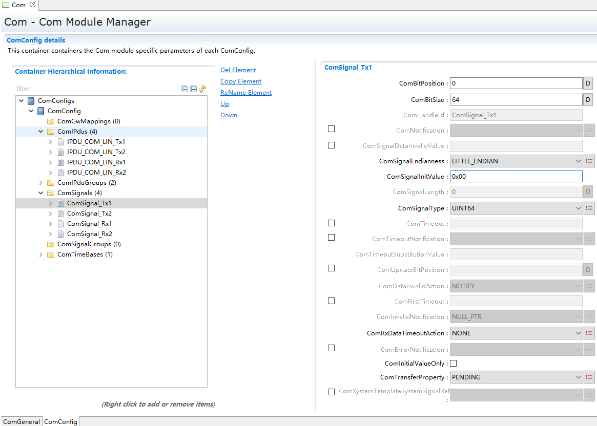

图5‑18 Com配置-6

ComSignal对象属性的配置（以信号ComSignal_Tx1为例）：

.. table:: 5‑8 ComSignal属性配置说明

   +---------------------+--------------+--------------------------------+
   | **参数名**          | **设置值**   | **说明**                       |
   +---------------------+--------------+--------------------------------+
   | ComBitPosition      | 0            | 根                             |
   |                     |              | 据实际使用帧的Startbit参数填写 |
   +---------------------+--------------+--------------------------------+
   | ComBitSize          | 64           | 根据实际使用帧的Length参数填写 |
   +---------------------+--------------+--------------------------------+
   | ComSignalEndianness | L            | Motorola格式设为BIG_ENDIAN     |
   |                     | ITTLE_ENDIAN |                                |
   |                     |              | Intel格式设置为LITTLE_ENDIAN   |
   +---------------------+--------------+--------------------------------+
   | ComSignalInitValue  | 0x00         | 根据实际使用帧的Initial        |
   |                     |              | Value参数填写                  |
   +---------------------+--------------+--------------------------------+
   | ComSignalType       | UINT64       | 根据实际使用帧的Length参数填写 |
   +---------------------+--------------+--------------------------------+
   | Com                 | NONE         | 当信号属                       |
   | RxDataTimeoutAction |              | 于发送报文时，设置为NONE当信号 |
   |                     |              | 属于接收报文时，配置为NONE，超 |
   |                     |              | 时后不做处理，配置为REPLACE，  |
   |                     |              | 超时后用初始化值代替接收值，配 |
   |                     |              | 置为SUBSTITUTE，超时后使用Com  |
   |                     |              | TimeoutSubstitutionValue值替换 |
   +---------------------+--------------+--------------------------------+
   | ComInitialValueOnly | False        | 设置为True后，                 |
   |                     |              | 初始化后不会再更新这个信号的值 |
   +---------------------+--------------+--------------------------------+
   | ComTransferProperty | PENDING      | 根据                           |
   |                     |              | DBC中GenSigSendType参数设置：  |
   |                     |              |                                |
   |                     |              | Cycle 对应 PENDING             |
   |                     |              |                                |
   |                     |              | OnWrite 对应 TRIGGER           |
   |                     |              |                                |
   |                     |              | OnChange 对TRIGGER_ON_CHANGE   |
   +---------------------+--------------+--------------------------------+

8. 配置ComTimeBase，
   ComGwTimeBase定义信号网关处理函数的周期，ComRxTimeBase定义接收处理的周期，ComTxTimeBase定义发送处理的周期。

.. figure:: ../../_static/集成手册/LinMaster/image31.png
   :width: 5.76597in
   :height: 3.37153in

图5‑19 Com配置-7

9. 配置ComIPdu属性。以IPDU_COM_LIN_Tx1为例说明：

.. table:: 5‑9 ComIPdu属性配置说明

   +------------------------+--------------------+-----------------------+
   | **参数名**             | **设置值**         | **说明**              |
   +------------------------+--------------------+-----------------------+
   | ComIPduDirection       | SEND               | 报文为发送报文        |
   +------------------------+--------------------+-----------------------+
   | C                      | DEFERRED           | 在周期函数中处理信号  |
   | omIPduSignalProcessing |                    |                       |
   +------------------------+--------------------+-----------------------+
   | ComIPduType            | NORMAL             | 正常报文（非TP报文）  |
   +------------------------+--------------------+-----------------------+
   | ComIPduGroupRef        | Com_TxPduGro       | 属于Com_TxPdu         |
   |                        | up_LinController_0 | Group_LinController_0 |
   +------------------------+--------------------+-----------------------+
   | ComIPduSignalGroupRef  | -                  | 没                    |
   |                        |                    | 有信号组，不需要配置  |
   +------------------------+--------------------+-----------------------+
   | ComIPduSignalRef       | ComSignal_Tx1      | 将属于IPDU_COM_       |
   |                        |                    | LIN_Tx1的信号关联进来 |
   +------------------------+--------------------+-----------------------+
   | ComPduIdRef            | Com_LinIfFrame_Tx1 | 指向EcuC中定义的Pdu   |
   +------------------------+--------------------+-----------------------+

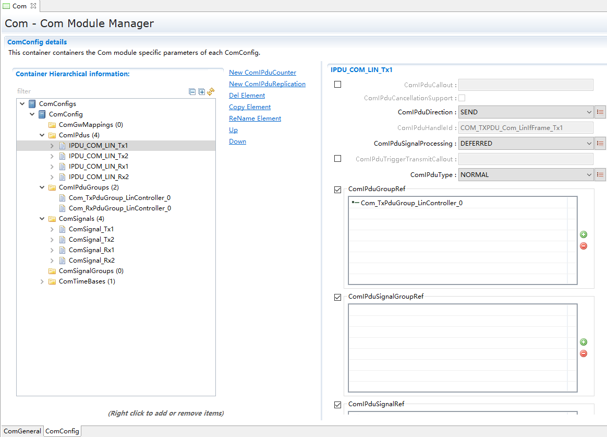

图5‑20 Com配置-8

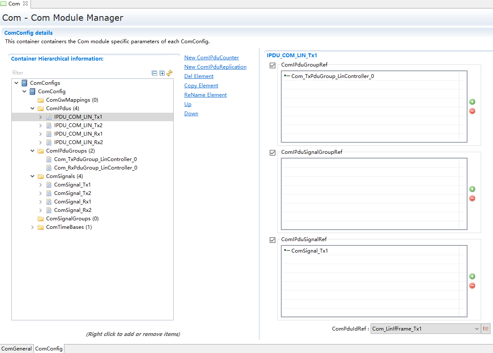

图5‑21 Com配置-9

10. 为发送报文配置ComTxIPdu（以IPDU_COM_LIN_Tx1为例）。每个发送IPdu，必须要配置一个ComTxIPdu，参数保持默认值即可。只发送报文需要配置。

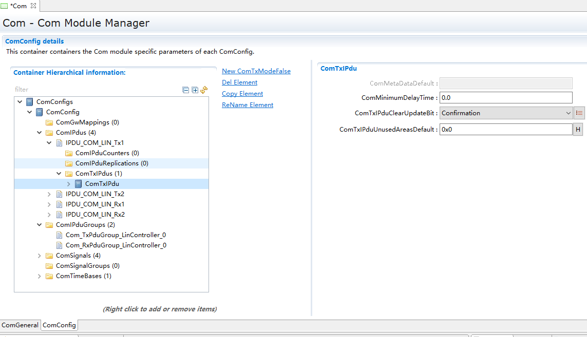

图5‑22 Com配置-10

11. 添加ComTxModeTrue对象（以IPDU_COM_LIN_Tx1为例）。

发送报文必须要配置ComTxModeTrue对象。

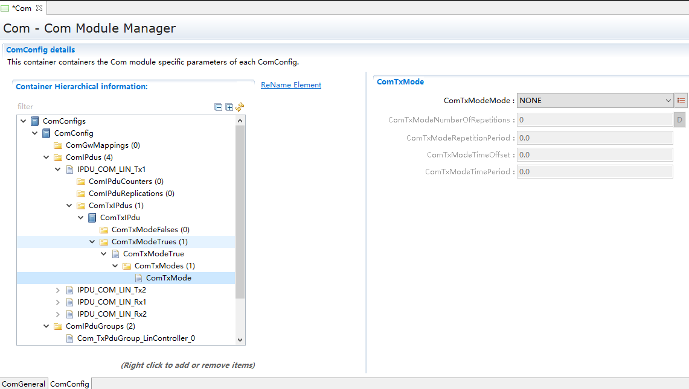

图5‑23 Com配置-11

ComTxMode配置参数说明：

.. table:: 5‑10 ComTxMode配置说明

   +-----------------------+-------------+--------------------------------+
   | **参数名**            | **设置值**  | **说明**                       |
   +-----------------------+-------------+--------------------------------+
   | ComTxModeMode         | NONE        | 非周期报文（由调度表管理发送） |
   +-----------------------+-------------+--------------------------------+

12. 校验配置，无错误信息，Com模块即配置完成。

5.2.5 PduR模块配置
~~~~~~~~~~~~~~~~~~

#. 双击PduR模块，打开PduR模块配置界面。

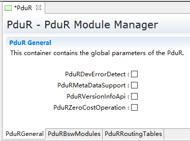

图5‑24 PduR配置-1

2. PduRGeneral配置。

..

   保持默认即可。

3. PduRBswModuler配置。

PduR模块的目的是实现上层模块到下层模块的路由。PduRBswModuler对象用来描述上层模块和下层模块属性。本示例中上层模块为Com，下层模块为LinIf，PduR模块将Com中的Pdu路由到LinIf中。所以需要新建2个PduRBswModuler对象，分别对应Com和LinIf。

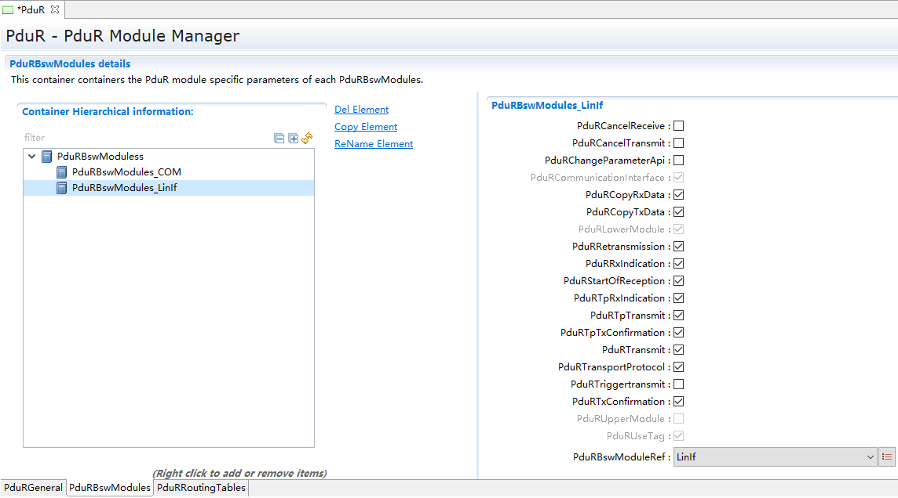

图5‑25 PduR配置-2

4. PduRRoutingTables配置。

该容器有4个配置选项，保持默认即可。

.. figure:: ../../_static/集成手册/LinMaster/image38.png
   :width: 5.77153in
   :height: 3.21458in

图5‑26 PduR配置-3

5. 配置路由表。

由于有4个报文需要收发，所以需要配置4个路由路径。

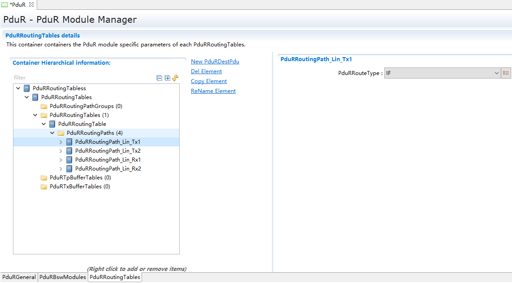

图5‑27 PduR配置-4

6. 配置发送路由表。

每个路由表下有一个SrcPdu，有一个DestPdu。发送报文，是从Com到LinIf，所以SrcPdu选择Com模块中关联的Pdu，DestPdu选择LinIf中关联的Pdu。

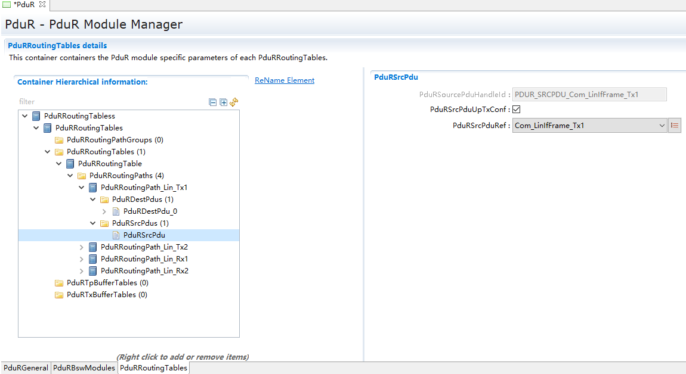

图5‑28 PduR配置-5

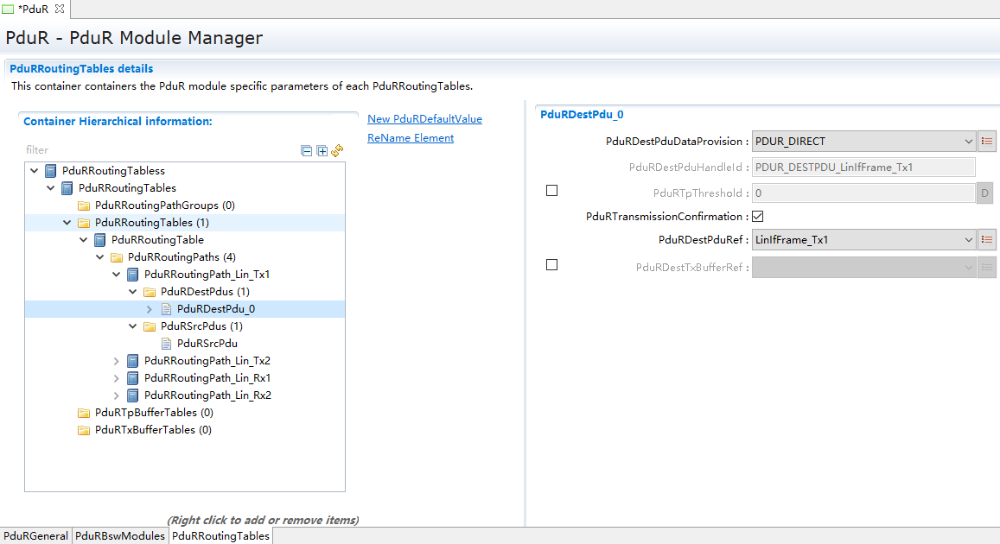

图5‑29 PduR配置-6

7. 配置接收路由表。

发送报文，是从LinIf到Com，所以SrcPdu选择LinIf模块中关联的Pdu，DestPdu选择Com中关联的Pdu。

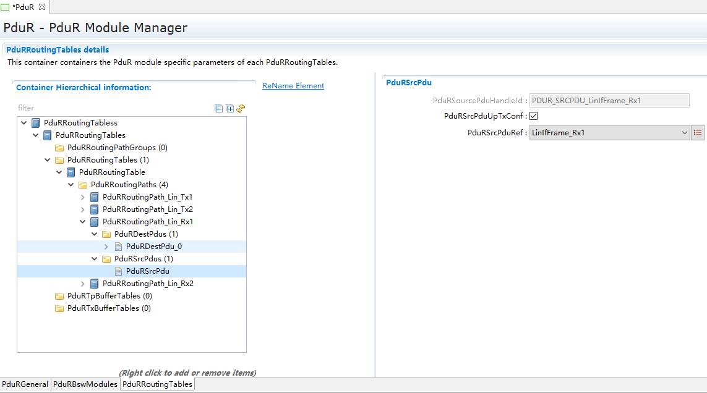

图5‑30 PduR配置-7

.. figure:: ../../_static/集成手册/LinMaster/image43.png
   :width: 5.77153in
   :height: 3.16736in

图5‑31 PduR配置-8

8. 校验配置，无错误信息，PduR模块即配置完成。

5.2.6 ComM模块配置
~~~~~~~~~~~~~~~~~~

#. 双击ComM模块，打开ComM模块配置界面。

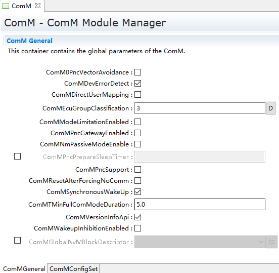

图5‑32 ComM配置-1

2. ComMGeneral标签页中的参数保持默认即可。

3. ComMConfigSet配置。

默认已经生成了一个ComMChannel对象ComMChannel_0和一个ComMUser对象ComMUser_0，修改以下几个参数，其余参数保持默认值。

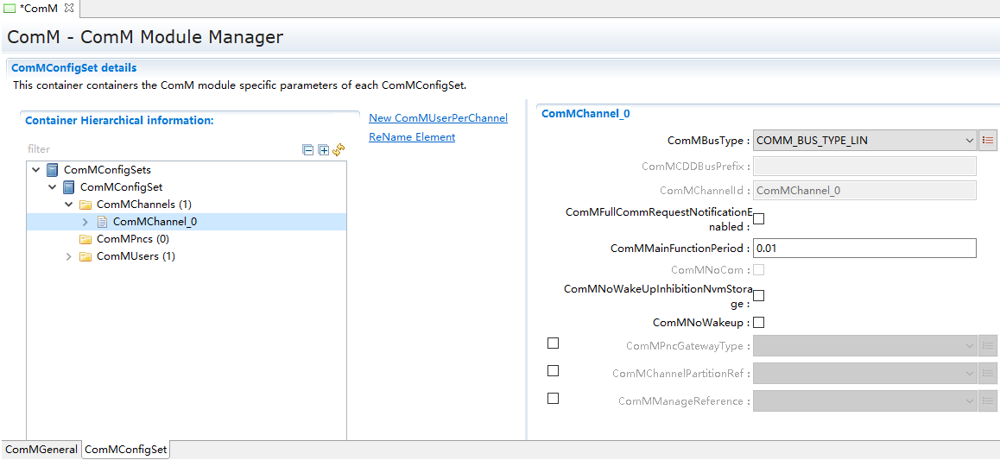

图5‑33 ComM配置-2

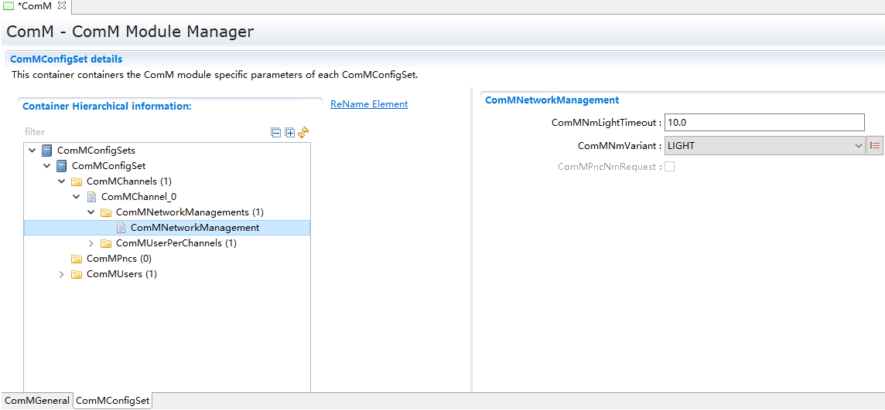

图5‑34 ComM配置-3

.. figure:: ../../_static/集成手册/LinMaster/image47.png
   :width: 5.77153in
   :height: 2.69653in

图5‑35 ComM配置-4

4. 校验配置，无错误信息，ComM模块即配置完成。

5.2.7 LinSM模块配置
~~~~~~~~~~~~~~~~~~~

#. 双击LinSM模块，打开LinSM模块配置界面。

.. figure:: ../../_static/集成手册/LinMaster/image48.png
   :width: 5.77153in
   :height: 1.96667in

图5‑36 LinSM配置-1

2. LinSMGeneral标签页内各参数保持默认值。

3. LinSMConfigSet标签页参数说明如表5-11。其余参数保持默认值。

.. table:: 5‑11 LINSM配置参数说明

   +-------------------------+-----------------+-------------------------+
   | **参数名**              | **设置值**      | **说明**                |
   +-------------------------+-----------------+-------------------------+
   | ComMNetwork Handle Ref  | ComMChannel_0   | 指向ComM配置的通道      |
   +-------------------------+-----------------+-------------------------+
   | Schedule Index Ref      | LinIf           | 指                      |
   |                         | ScheduleTable_0 | 向LinIf中所配置的调度表 |
   +-------------------------+-----------------+-------------------------+

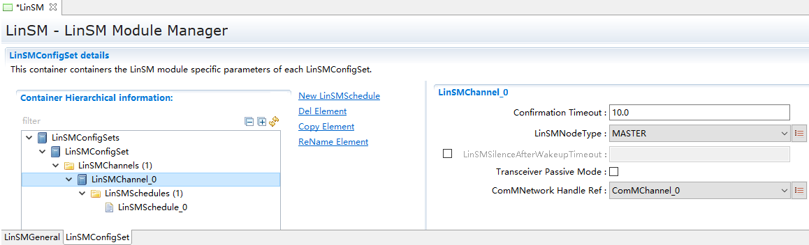

图5‑37 LinSM配置-2

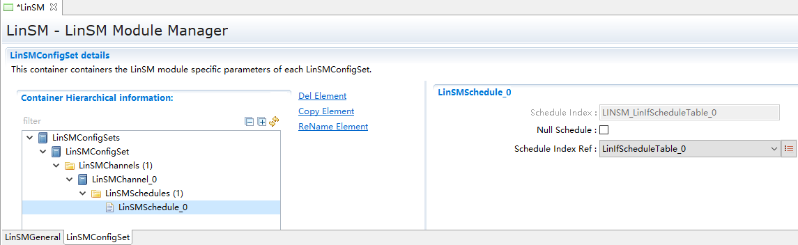

图5‑38 LinSM配置-3

4. 校验配置，无错误信息，LinSM模块即配置完成。

代码工程介绍
------------

项目交付给用户的工程目录结构如下：

.. figure:: ../../_static/集成手册/LinMaster/image51.png
   :width: 2.5in
   :height: 2.60417in

图5‑39 工程目录结构

#. Config目录，这个目录用来存放基础软件配置工具生成的配置文件。

#. 模块相关的静态源代码，存放在各个模块的文件夹下。

应用配置文件
------------

#. 将4.2章节生成的配置文件复制到Config文件夹中。

#. 添加初始化函数和周期调用函数。

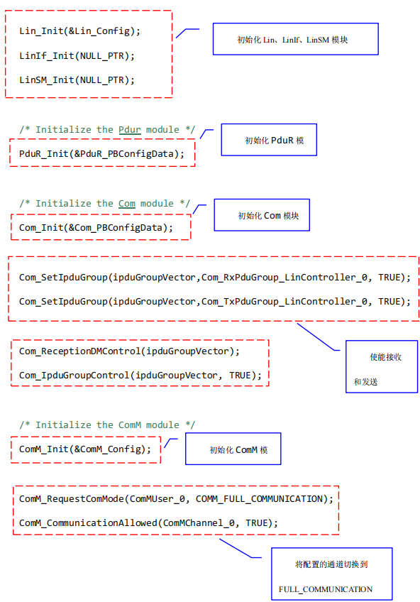

3. 添加MainFunction函数

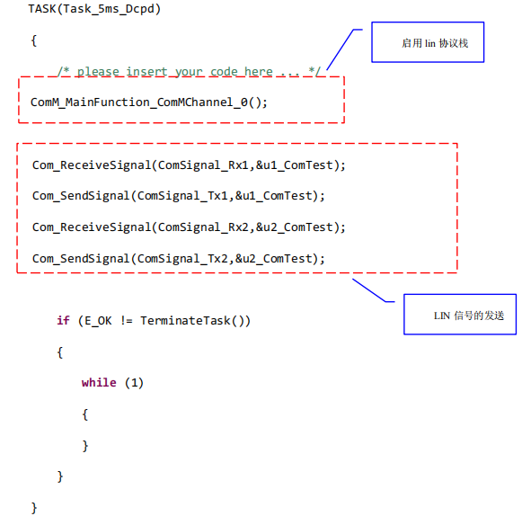

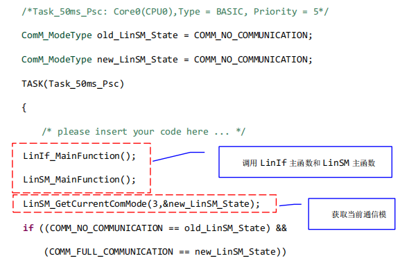

.. figure:: ../../_static/集成手册/LinMaster/code4.png
   :width: 5.84736in
   :height: 4.07583in

验证结果
--------

根据集成目标，第5章一共配置了4个报文帧，其中2个周期发送报文，2个周期接收报文。

#. 根据前文的配置，这里将PLIN进行如下设置:

.. figure:: ../../_static/集成手册/LinMaster/image52.png
   :width: 4.73958in
   :height: 5.13542in

图5‑40 PLIN配置

2. 接通PLIN可以在Receive窗口看到主机发送来的报文

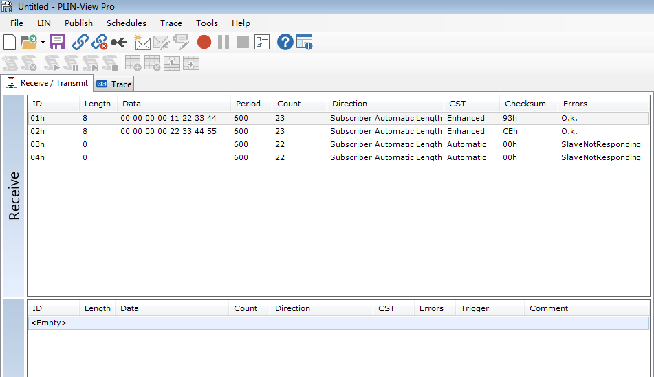

图5‑41 接收报文验证

3. 在Publish窗口创建两个从机发送报文，并发送数据，可以在Receive
   窗口看到主机收到的报文：

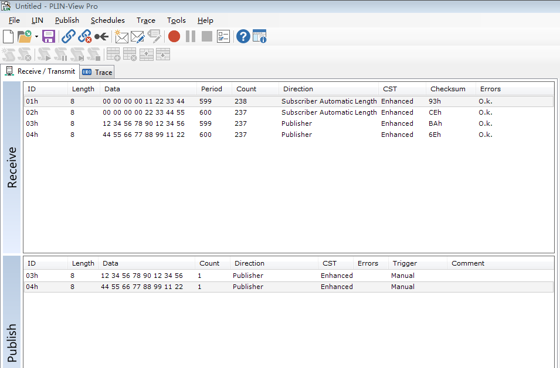

图5‑42发送报文验证
