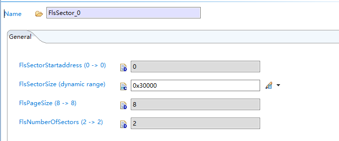
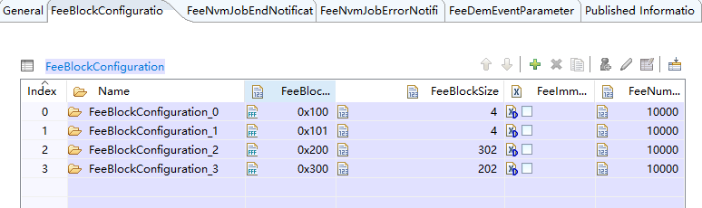
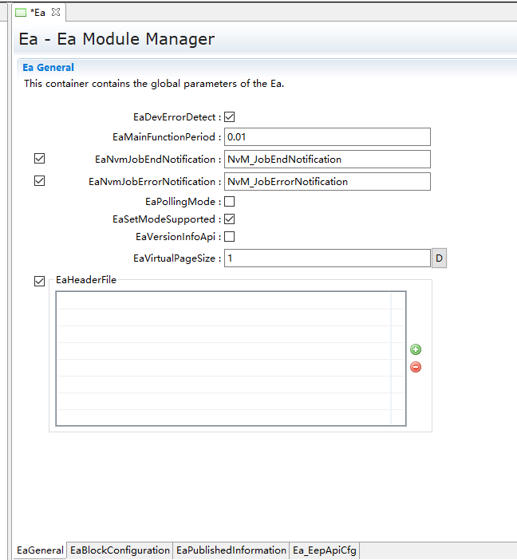
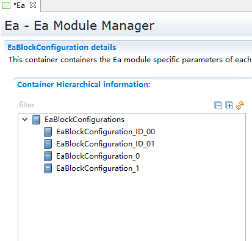
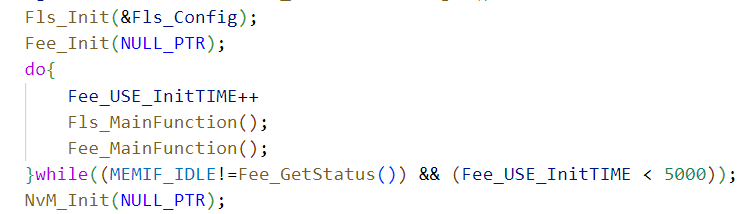

===================
NvM_集成手册
===================

目标
====

   | 本文档旨在指导使用 NvM 模块的用户能够清晰地了解 NvM
     的功能，以及如何去配置和使用 NvM 模块。
   | NvM 模块的作用是提供在汽车环境下 NV
     数据的存储和维护的各种需求服务。 NvM 模块支持管理 Flash 设备的 NV
     数据。 NvM 模块提供各种同步/异步服务来管理和维护非易失性数据

缩写词和术语
============

   表2-1缩写解释

+---------------+------------------------------------------------------+
| **            | **描述**                                             |
| 缩写词/术语** |                                                      |
+---------------+------------------------------------------------------+
| NvM           | Non-Volatile Manager                                 |
+---------------+------------------------------------------------------+
| MemIf         | Memory Abstraction Interface                         |
+---------------+------------------------------------------------------+
| Fee           | Flash EEPROM Emulation                               |
+---------------+------------------------------------------------------+
| Ea            | EEPROM Abstraction                                   |
+---------------+------------------------------------------------------+
| Fls           | Flash Driver                                         |
+---------------+------------------------------------------------------+
| Eep           | EEPROM Abstraction                                   |
+---------------+------------------------------------------------------+
| Nv            | Non-Volatile                                         |
+---------------+------------------------------------------------------+

参考文档
========

[1] 参考手册_NvM.pdf

[2] 参考手册_MemIf.pdf

[3] 参考手册_Fee.pdf

[4] 参考手册_Ea.pdf

协议栈集成
==========

项目交付的内容为：协议栈源码和ORIENTAIS
Configurator配置工具。协议栈细分为协议栈的各模块及其对应的配置工具模块。

NvM各配置模块的功能介绍，参见表 4‑1 NvM各配置模块介绍。

使用协议栈源码和配置工具，进行协议栈的集成的步骤，参见表 4‑2
协议栈集成的步骤。

.. table:: 表 4‑1 NvM各配置模块介绍

   +---------+------------------------------------------------------------+
   | **模    | **功能**                                                   |
   | 块名**  |                                                            |
   +---------+------------------------------------------------------------+
   | Fee     | Fee驱动配置。(由MCAL工                                     |
   |         | 具导入，详见章节5.2.1；若使用项目提供的Fee模块，详见5.2.2) |
   +---------+------------------------------------------------------------+
   | Flash   | Flash驱动配置。(由MCAL工具导入，详见章节5.2.1)             |
   +---------+------------------------------------------------------------+
   | Eep     | EEPROM驱动配置。(如未使用EEPROM做存储，则无需配置)         |
   +---------+------------------------------------------------------------+
   | Ea      | Ea属性及Block配置。(如未使用EEPROM做存储，则无需配置)      |
   +---------+------------------------------------------------------------+
   | NvM     | 非易失存储管理                                             |
   +---------+------------------------------------------------------------+

.. table:: 表 4‑2 协议栈集成的步骤

   +-----+--------------------------+------------------------------------+
   | *   | **操作**                 | **说明**                           |
   | *步 |                          |                                    |
   | 骤  |                          |                                    |
   | **  |                          |                                    |
   +-----+--------------------------+------------------------------------+
   | 1   | ORIENTAIS                | 若配置工具已经搭建                 |
   |     | Configurator配置工具     | ，则仅需进行协议栈模块的加载操作。 |
   |     | 工程搭建和协议栈模块加载 |                                    |
   +-----+--------------------------+------------------------------------+
   | 2   | 模块配置及配置文件生成   | NA                                 |
   +-----+--------------------------+------------------------------------+
   | 3   | 代码集成                 | 现有工程、                         |
   |     |                          | 协议栈源代码和配置生成文件的集成。 |
   +-----+--------------------------+------------------------------------+
   | 4   | 验证测试                 | NA                                 |
   +-----+--------------------------+------------------------------------+

**注意：协议栈集成之前，用户须确保已经有基础工程，且本协议栈相关的其他协议栈能正常工作。**

新建ORIENTAIS Configurator配置工程及模块加载
--------------------------------------------

#. 安装ORIENTAIS Configurator软件后，双击软件图标打开软件。

|image1|

图4-1初始界面

2. 菜单栏File🡪New🡪Project，新建工程。

|image2|

图4-2新建界面

3. 在弹出的新建窗口中选择Autosar下的 [BSW Project]，选择Next。

|image3|

图4-3初始选择界面

4. 在弹出的窗口中输入工程名，选择Finish。

|image4|

图4-4命名界面

5. 在弹出的窗口中选择Yes。

|image5|

图4-5建立完成界面

6. 选择[Bsw_Builder]，右键单击，选择New ECU Configuration。

|image6|

图4-6新建ECU界面

7. 在弹出的窗口中输入ECU名，然后选择Next。

.. figure:: ../../_static/集成手册/NVM/image7.png

图4-7选择内核界面reStructuredText

8. 在弹出的窗口中勾选需添加的模块，击Finish。（注意还需要加入Crc模块，如果需要使用外围EEPROM硬件用来做NvM的存储，则还需要加入Ea和Eep模块。）

|image8|

图4-8模块选择界面

9. 新建工程如下所示，步骤⑦中添加的模块已经被加入到工程中。

|image9|

图4-9内部显示界面

模块配置及生产代码
------------------

模块配置
~~~~~~~~

模块的具体配置，取决于具体的项目需求。该协议栈各模块配置项的详细介绍，参见章节\ **5.2.1
Flash/Fee模块配置**\ 。

.. table:: 表 4‑3协议栈各模块配置参考文档

   +--------+----------------------------------------+-------------------+
   | **     | **参考文档及其章节**                   | **说明**          |
   | 模块** |                                        |                   |
   +--------+----------------------------------------+-------------------+
   | FLASH  | MCAL对应的FLASH配置手册                |                   |
   +--------+----------------------------------------+-------------------+
   | Fee    | MCAL对应的Fee配置手册                  |                   |
   +--------+----------------------------------------+-------------------+
   | NvM    | NvM用户手册_参考手册.pdf 章节2.3       |                   |
   +--------+----------------------------------------+-------------------+

配置代码生成
~~~~~~~~~~~~

#. 对Fee和Fls模块配置完成后导入MCAL工具中的Fee和fls的配置。

..

   |image10|

   图4-10 导入MCAL配置

   |image11|

图4-11 导入MCAL配置

2. 在ORIENTAIS
   Configurator主界面左方，选择对应的协议栈，单击右键弹出Validate
   All和Generate All菜单。

|image12|

图4-12 校验界面

3. 选择Validate
   All对本协议栈各配置选项进行校验，没有错误提示信息即校验通过。若有错误信息，请按照错误提示修改。

4. 选择Generate
   All，生成配置文件。右下角的Console窗口输出生成的配置文件信息。

|image13|

图4-13 校验完成界面

5. 将ORIENTAIS Configurator切换到Resource模式，即可查看生成的配置文件。

|image14|

图4-14 配置显示界面

功能集成
--------

代码集成
~~~~~~~~

协议栈代码包括两部分：项目提供的协议栈源码和ORIENTAIS
Configurator配置生成代码。

用户须将协议栈源码和章节4.2.2生成的源代码添加到集成开发工具的对应文件夹。协议栈集成的文件结构，见章节5.3。

**注意：协议栈集成之前，用户须确保已经有基础工程，且本协议栈相关的其他协议栈能正常工作。**

集成注意事项
~~~~~~~~~~~~

对于集成过程中，协议栈特殊要求和用户经常出现的问题，归类总结形成 表
4‑4协议栈集成约束清单。用户需逐一排查表中的约束项，以避免集成问题出现。

.. table:: 表 4‑4 协议栈协议栈集成约束清单

   +-----+---------+-----------------------------------------------------+
   | *   | *       | **约束限制**                                        |
   | *编 | *类别** |                                                     |
   | 号  |         |                                                     |
   | **  |         |                                                     |
   +-----+---------+-----------------------------------------------------+
   | **  | 堆栈    | 用户需确保为任务堆栈和中断堆栈分配足够的堆栈空间。  |
   | 1** |         |                                                     |
   +-----+---------+-----------------------------------------------------+
   | **  | 头文件  | -  添加协议                                         |
   | 2** |         | 栈代码之后，用户需更新集成开发工具中的头文件路径。  |
   |     |         |                                                     |
   |     |         | -  调用协议栈API的源文件，需要包含协议栈的头文件。  |
   +-----+---------+-----------------------------------------------------+
   | **  | 初始化  | 以NvM为例，NvM的初始化顺序为：Fls \_Init，          |
   | 3** |         | Fee_Init，NvM_Init。                                |
   +-----+---------+-----------------------------------------------------+
   | **  | 周      | Fls_MainFunction();Fee_MainFunct                    |
   | 4** | 期函数  | ion();NvM_MainFunction();需要被周期性任务函数调用。 |
   +-----+---------+-----------------------------------------------------+

集成示例
========

本章节通过NvM的集成过程。用户可以据此熟悉NvM配置工具的配置过程，以及如何应用配置工具生成的配置文件。

**注意：本示例不代表用户的实际配置情况，用户需要根据自己的实际需求，决定各个参数的配置。**

集成目标
--------

**NvM配置需求：**

.. table:: 表 5‑1 配置目标

   +---------+--------------------+-------+-------+--------+-----------+
   | *       |    **CRC           | **类  | **Len | *      | Ram       |
   | *NV模块 |    校验**          | 别**  | gth** | *num** | block\ ** |
   | 名称**  |                    |       |       |        | **        |
   |         |                    |       |       |        | \ address |
   +---------+--------------------+-------+-------+--------+-----------+
   | NvMBl   | Crc16              | N     | 300   | 1      | 0         |
   | ock_Con |                    | ative |       |        | x70008400 |
   | figFEE1 |                    |       |       |        |           |
   +---------+--------------------+-------+-------+--------+-----------+
   | NvMBl   | Crc16              | N     | 200   | 1      | 0         |
   | ock_Con |                    | ative |       |        | x70008800 |
   | figFEE2 |                    |       |       |        |           |
   +---------+--------------------+-------+-------+--------+-----------+

模块的配置
----------

新建配置工程及模块加载操作，请参考本文档\ **4.2**\ 章节。

配置Flash/Fee模块
~~~~~~~~~~~~~~~~~

本章介绍如何使用MCAL工具配置Flash模块

打开MCAL工具，新建flash模块后，无需更改，直接按照默认即可。

|image15|

|image16|

图5-1 MCAL界面

#. 完成MCAL配置后，生成Flash/Fee模块的配置文件，替换工程中原有的Flash/Fee模块的配置文件。

..

   导入配置工具后工程如下图所示：

|image17|

图5-2 工具配置界面

配置Fee模块
~~~~~~~~~~~

**（注意：如项目中使用项目的Fee模块，则遵循以下配置）**

Fee模块作为Fls的抽象层，FeeGeneral提供Fee模块的基本属性配置，如下图所示：

|image18|

图5-3 FeeGeneral配置

Fee还需配置FeeBank对应Fls的具体sector地址，可以直接配置起始地址和Bank
Size（符合Fls模块实际情况）。

|image19|

图5-4 FeeBank手动配置

该处也可以根据Fls模块对应关联sector。

|image20|

图5-5 FeeBank关联配置

Fee模块需要配置NvM使用的NvBlock，各个Block的基本配置如下表。BlockID根据NvMDatasetSelectionBits配置。

表5-2 Fee Block配置

+-------+----------------------------------+-------------+------------+
| **In  | **Name**                         | **Fee**     | **Fee**    |
| dex** |                                  |             |            |
|       |                                  | **BlockID** | **Block**  |
|       |                                  |             |            |
|       |                                  |             | **Size**   |
+-------+----------------------------------+-------------+------------+
| 0     | FeeBlockConfiguration_0          | 0x100       | 4          |
+-------+----------------------------------+-------------+------------+
| 1     | FeeBlockConfiguration_1          | 0x101       | 4          |
+-------+----------------------------------+-------------+------------+
| 2     | FeeBlockConfiguration_2          | 0x200       | 302        |
+-------+----------------------------------+-------------+------------+
| 3     | FeeBlockConfiguration_3          | 0x300       | 202        |
+-------+----------------------------------+-------------+------------+

因为NvM Block采用16字节CRC校验的方式，所以，对应的NV block size会在NvM
Block Size的基础上增加2，用于存放Crc信息。

**注意：FeeVirtualPageSize的根据实际情况调整，应为FlsPageSize的整数倍。**

Fee模块配置如下图所示：

|image21|

图5-6 Fee Block配置

配置Eep模块
~~~~~~~~~~~

**（注意：如项目中没有使用EEPROM，则不需要配置Eep模块与Ea模块）**

   Eep模块的General配置页面，根据实际需求配置。

|image22|

图5-7 Eep General配置

EepInitConfiguration配置如下图所示：

|image23|

图5-8 Eep InitConfiguration配置

EepDefaultMode：此参数是初始化后的默认EEPROM设备模式。

EepJobCallCycle：EEPROM驱动程序主要功能的调用循环时间。

EepJobEndNotification：此参数是对操作结束的回调函数的引用。

EepJobErrorNotification：此参数是对错误结果的回调函数的引用。

|image24|

图5-9 EepDeviceConfiguration配置

EepBaseAddress：此参数是EEPROM设备的基地址。

EepFastReadBlockSize：快速模式下一个周期内读取的字节数。如果硬件不支持突发模式，则此参数应设置为与EepNormalReadBlockSize相同的值。

EepFastWriteBlockSize：快速模式下一个周期内写入的字节数。如果硬件不支持突发模式，则此参数应设置为与EepNormalWriteBlockSize相同的值。

EepNormalReadBlockSize：在正常模式下，在一个周期内读取的字节数。

EepNormalWriteBlockSize：在正常模式下，在一个周期内写入的字节数。

EepSize：此参数是EEPROM设备使用的大小（以字节为单位）。

本示例中，Eep模块，地址默认从0开始，EepBaseAddress为0，默认设置为slow模式，因为EEPROM硬件不支持快速模式，所以快速模式即单次处理的数据量更多，单词处理的数据的时间更长，而单次任务处理的总时间相对较短，本次示例中EepFastReadBlockSize和EepNormalReadBlockSize保持一致，EepFastWriteBlockSize和EepNormalWriteBlockSize保持一致，均配置为128即可。EepSize按照实际的EEPROM大小，配置为65536，其他配置项可不做额外配置。

|image25|

   图5-10 EepDeviceHwApiss配置

填入驱动对应的api即可。

配置Ea模块
~~~~~~~~~~

**（注意：如项目中没有使用EEPROM，则不需要配置Eep模块与Ea模块）**

Ea模块作为Eeprom的抽象层，EaGernal提供Ea模块的基本属性配置，如下图所示：

|image26|

图5-11 Ea General配置

Ea模块需要配置NvM使用的NvBlock，各个Block的基本配置如下表。

表5-3 Ea Block配置

+-------+----------------------------------+-------------+------------+
| **In  | **Name**                         | **Ea**      | *          |
| dex** |                                  |             | *EaBlock** |
|       |                                  | **BlockID** |            |
|       |                                  |             | **Size**   |
+-------+----------------------------------+-------------+------------+
| 0     | EaBlockConfiguration_ID_00       | 0x100       | 4          |
+-------+----------------------------------+-------------+------------+
| 1     | EaBlockConfiguration_ID_01       | 0x101       | 4          |
+-------+----------------------------------+-------------+------------+
| 2     | EaBlockConfiguration \_0         | 0x200       | 302        |
+-------+----------------------------------+-------------+------------+
| 3     | EaBlockConfiguration \_1         | 0x300       | 202        |
+-------+----------------------------------+-------------+------------+

因为NvM Block采用16字节CRC校验的方式，所以，对应的NV block size会在NvM
Block Size的基础上增加2，用于存放Crc信息。

**注意：Ea地址配置需要考虑字节对齐，写入过程中不能跨页（page）写入。**

Ea模块配置如下图所示：

|image27|

图5-12 Ea Block配置

配置CRC模块
~~~~~~~~~~~

|image28|

图5-13 CRC工具配置界面

.按照如图所示把所有的CRC计算方式全部计算出来，也全部使能，这样子做的好处可以在其他模块进行自由选择，此配置界面只有一个。

配置MemIf模块
~~~~~~~~~~~~~

|image29|

图5-14 MemIf工具配置界面

配置对应的Fee或Ea设备即可。

配置NvM模块
~~~~~~~~~~~

|image30|

图5-15 General工具配置界面

NvMApiConfigClass：配置NvM的等级对应于3.

NvMCompiledConfigId：初始化软件版本号0xaabb

NvMCrcNumOfBytes：每次NvM_MainFunction可计算1024个字节的CRC。

NvMDatasetSelectionBits：定义寻址的有效位。

NvMMainFunctionPeriod：功能函数处理周期10ms。

NvMSizeStandardJobQueue：任务队列长度为20。

|image31|

|image32|

|image33|

图5-16块属性工具配置界面

NvMBlockCrcType：选择CRC16的计算方式。

NvMBlockManagementType：不设置备份块。

NvMBlockUseCrc：使用CRC。

NvMMaxNumOfReadRetries：读取失败之后最大3次尝试读取次数。

NvMMaxNumOfWriteRetries：写入失败之后最大3次尝试写入次数。

NvMNvBlockLength：块的大小300字节

NvMNvBlockNum：1个自身备份块。

NvMRamBlockDataAddress：存放在RAM区域的地址。

NvMSelectBlockForReadAll：能否全部读取。

NvMSelectBlockForWriteAll：能否全部写入。

NvMNameOfFeeBlock：Fee块的参考，对应于Fee的块号。

源代码集成
----------

项目交付给用户的工程结构如下：

|image34|

图5-17 工程代码演示

-  Config目录，这个目录用来存放配置工具生成的配置文件，NvM文件放在Ori_Config文件夹中。

-  Source目录，存放模块相关的源代码。可以看到Source目录下各个文件夹下是各个模块的源代码。

NvM源代码集成步骤如下：

#. 将\ **5.2**\ 章节中MCAL生成的NvM模块配置文件和ORIENTAIS
   Configurator生成 的配置文件复制到Config文件夹中。

#. 将MCAL提供的NvM模块源码和项目提供的协议栈源代码文件复制到Sou
   rce/Memory文件夹中。

协议栈调度集成
--------------

NvM调度集成步骤如下（以底层使用Flash为例）：

#. 初始化存储栈，首先初始化Fls模块，然后初始化Fee模块。由于Fee初始
   化需要遍历Fee_Block。所以需要先循环执行Fls_MainFunction和Fee_MainFunction使得Fee模块初始化完毕，然后初始化NvM模块。如下图所示：

|image35|

图5-18 存储栈初始化

2. NvM_ReadAll(), NvM初始化后需要调用NvM_ReadAll()接口将存放在Flas
   h中的Nv_Block的数据读到Ram_Block中。由于NvM的任务是异步执行
   的，所以调用NvM_ReadAll()接口后，任务需要在MainFunction中执行的，
   所以还需要调用NvM_Mainfunction。常见的有两种调用方式：第一种在初
   始化函数中调用了NvM_ReadAll()，紧接着后面采用while循环执行存储栈
   的MainFunction直到NvM_ReadAll任务执行结束，这种方式的优点是初始
   化完存放在NvM中的数据就可用了，但是由于是卡在初始化函数中执行的，
   所以可能会导致系统初始化时间过长的问题，如下图所示。

|image36|

图5-19 NvM_ReadAll

第二种方式是在调用NvM_ReadAll后不while的执行MainFunction，而是等待OS的Task中周期调用MainFunction来处理ReadAll任务。这方式执行不会影响系统初始化时间，但是初始化完成后NvM中的数据还不可使用，比如像Dem之类需要NvM中的数据才能初始化的模块，需要等待NvM的ReadAll任务执行结束后在NvM的任务回调函数中执行。

3. 存储栈MainFunction放入到OS的Task中，根据项目实际的情况放入到合
   适的周期中即可，如下图所示。

|image37|

图5-19 MainFunction函数

4. NvM_WriteAll()，在系统准备休眠时需要调用NvM_WriteAll()接口使Ram\_
   Block中的数据存储到Nv_Block中。（一般使BSWM负责调用）

.. |image1| image:: ../../_static/集成手册/NVM/image1.png
   :width: 5.17153in
   :height: 3.72778in
.. |image2| image:: ../../_static/集成手册/NVM/image2.png
   :width: 5.53704in
   :height: 3.98958in
.. |image3| image:: ../../_static/集成手册/NVM/image3.png
   :width: 5.35516in
   :height: 3.82222in
.. |image4| image:: ../../_static/集成手册/NVM/image4.png
   :width: 5.30877in
   :height: 3.72778in
.. |image5| image:: ../../_static/集成手册/NVM/image5.png
   :width: 4.06777in
   :height: 1.90141in
.. |image6| image:: ../../_static/集成手册/NVM/image6.png
   :width: 3.74466in
   :height: 2.24217in
.. |image7| image:: ../../_static/集成手册/NVM/image7.png
   :width: 4.60694in
   :height: 3.01042in
.. |image8| image:: ../../_static/集成手册/NVM/image8.png
   :width: 5.19861in
   :height: 5.75694in
.. |image9| image:: ../../_static/集成手册/NVM/image9.png
   :width: 3.47153in
   :height: 1.59583in
.. |image10| image:: ../../_static/集成手册/NVM/image10.png
   :width: 2.83958in
   :height: 3.08472in
.. |image11| image:: ../../_static/集成手册/NVM/image11.png
   :width: 4.53403in
   :height: 4.19792in
.. |image12| image:: ../../_static/集成手册/NVM/image12.png
   :width: 4.05694in
   :height: 3.43403in
.. |image13| image:: ../../_static/集成手册/NVM/image13.png
   :width: 4.42653in
   :height: 1.55189in
.. |image14| image:: ../../_static/集成手册/NVM/image14.png
   :width: 2.72639in
   :height: 2.42431in

.. |image17| image:: ../../_static/集成手册/NVM/image17.png
   :width: 2.56597in
   :height: 2.32083in
.. |image18| image:: ../../_static/集成手册/NVM/image18.png
   :width: 2.91528in
   :height: 2.80139in
.. |image19| image:: ../../_static/集成手册/NVM/image19.png
   :width: 5.76181in
   :height: 1.79375in

.. |image21| image:: ../../_static/集成手册/NVM/image21.png
   :width: 3.88542in
   :height: 1.46875in
.. |image22| image:: ../../_static/集成手册/NVM/image22.png
   :width: 4.26597in
   :height: 4.03264in
.. |image23| image:: ../../_static/集成手册/NVM/image23.png
   :width: 5.76736in
   :height: 3.28681in
.. |image24| image:: ../../_static/集成手册/NVM/image24.png
   :width: 5.76736in
   :height: 3.44861in
.. |image25| image:: ../../_static/集成手册/NVM/image25.png
   :width: 5.32917in
   :height: 3.10139in

.. |image28| image:: ../../_static/集成手册/NVM/image28.png
   :width: 5.21111in
   :height: 3.91528in
.. |image29| image:: ../../_static/集成手册/NVM/image29.png
   :width: 5.08472in
   :height: 2.7375in
.. |image30| image:: ../../_static/集成手册/NVM/image30.png
   :width: 5.76736in
   :height: 5.80833in
.. |image31| image:: ../../_static/集成手册/NVM/image31.png
   :width: 5.76736in
   :height: 4.42708in
.. |image32| image:: ../../_static/集成手册/NVM/image32.png
   :width: 5.76736in
   :height: 4.42153in
.. |image33| image:: ../../_static/集成手册/NVM/image33.png
   :width: 5.76736in
   :height: 1.78472in
.. |image34| image:: ../../_static/集成手册/NVM/image34.png
   :width: 2.76389in
   :height: 2.10347in

.. |image36| image:: ../../_static/集成手册/NVM/image36.png
   :width: 5.39583in
   :height: 2.66528in
.. |image37| image:: ../../_static/集成手册/NVM/image37.png
   :width: 4.14792in
   :height: 3.03889in
