===================
OS添加订阅
===================

目标
=====

本文档用于指导客户进行OS集成，文档主要包括的内容为：OS集成指导、基于应用的集成示例讲解。

由于各项目的需求不同，集成示例不会针对于特定的商业项目做详细讲解。

缩写词和术语
=============

.. table:: 表 2-1 缩写词和术语

   +---------------+------------------------------------------------------+
   | **\           | **描述**                                             |
   | 缩写词/术语** |                                                      |
   +---------------+------------------------------------------------------+
   | MCAL          | Microcontroller Abstraction Layer 微控制器抽象层     |
   +---------------+------------------------------------------------------+
   | MCU           | Micro Controller Unit 微处理器                       |
   +---------------+------------------------------------------------------+
   | MPU           | Memory Protection Unit 内存保护单元                  |
   +---------------+------------------------------------------------------+
   | SC1           | OS基础功能，包括任务调度和中断响应                   |
   +---------------+------------------------------------------------------+
   | SC2           | 在S\                                                 |
   |               | C1基础上增加时间保护功能，用于监控任务和中断的时间参 |
   |               | 数。包括执行时间、触发时间、关全局中断和二类中断时间 |
   +---------------+------------------------------------------------------+
   | SC3           | 在SC1基础上增加内存保护功能                          |
   |               | ，实现内存隔离。需要注意的是，不同规范对内存隔离的权 |
   |               | 限定义是存在差异的，本手册的实现逻辑衣裤AUTOSAER规范 |
   +---------------+------------------------------------------------------+
   | SC4           | SC4包括所有功能，包括SC1、SC2和SC3                   |
   +---------------+------------------------------------------------------+

参考文档
=========

1. OSEK/VDX Operating System.pdf

2. ARC_V2_ProgrammersReference_em22fs.pdf

3. DDI0403D_armv7m_arm.pdf

4. 参考手册_OS.pdf

OS订阅包说明
=============

本章节介绍购买普华OS订阅包的集成，若未购买，请忽略该章节内容。

OS订阅包交付清单如下：

+------+--------------------+-------------------------------------------+
|**\   | **内容**           | **备注**                                  |
|序号**|                    |                                           |
|      |                    |                                           |
+------+--------------------+-------------------------------------------+
| 1    | i-Soft OS          | OS订阅包源代码，支持30款芯片              |
|      | Package源码        |                                           |
+------+--------------------+-------------------------------------------+
| 2    | 普华商业版工具     | ORIENTAIS配置工具                         |
|      |                    | ，支持30款芯片的OS配置，支持BSW协议栈配置 |
+------+--------------------+-------------------------------------------+
| 3    | USB Dongle \* 3    | 硬件狗，有效期一年                        |
+------+--------------------+-------------------------------------------+
| 4    | 文档               | 文档包括：                                |
|      |                    | 参考手册_OS.pdf、OS.pdf、Release          |
|      |                    | Note                                      |
|      |                    |                                           |
|      |                    | 文档位置：                                |
|      |                    | ORIENTAIS配置工具安装目录usermanual文件夹 |
+------+--------------------+-------------------------------------------+

使用OS订阅包生成可烧录文件，还依赖第三方的编译链接工具和代码。基于某芯片OS工程构建流程参见下图。

.. figure:: ../../_static/集成手册/OS_添加订阅/image1.png

   图4-1 集成方法示例图

其中：

-  ORIENTAIS
   Configurator是OS配置工具。用户将自己的需求录入该工具，生成OS配置代码。使用示例请参见章节5、6和7。

-  第三方代码包含芯片编译运行的必要文件，一般由芯片厂商提供。如启动代码、链接脚本、引导代码、必要外设驱动和公共头文件（如Std_Types.h、Compiler.h、Platform_Types.h等）等，用户自行从相应供应商获取或自行编码实现；

OS集成
======

本章节仅描述ORIENTAIS
Configurator建立配置工程的方法，不描述如何配置OS，配置示例请参考本文档的第6章节和第7章节。

新建ORIENTAIS Configurator配置工程
-----------------------------------

#. 安装ORIENTAIS Configurator软件后，双击软件图标打开软件。

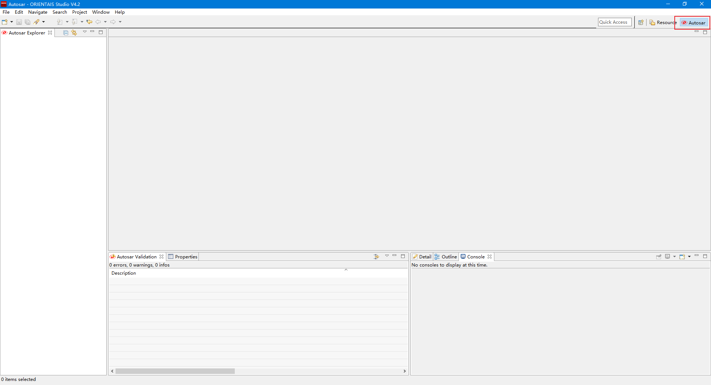

   图 5-1 新建工程-1

2. 菜单栏File🡪New🡪Project，新建工程。

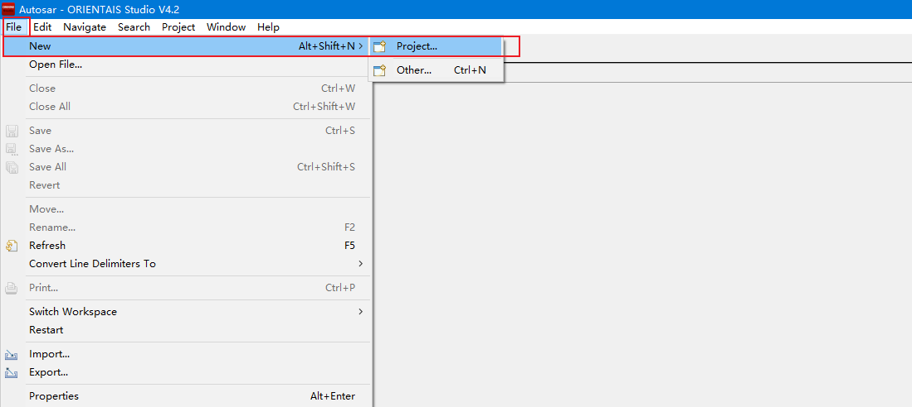

   图 5-2 新建工程-2

3. 在弹出的新建窗口中选择Autosar下的 [BSW Project]，选择Next。

.. figure:: ../../_static/集成手册/OS_添加订阅/image4.png
   :width: 4.46458in
   :height: 1.90417in

   图 5‑3 新建工程-3

4. 在弹出的窗口中输入工程名，选择Finish。
   
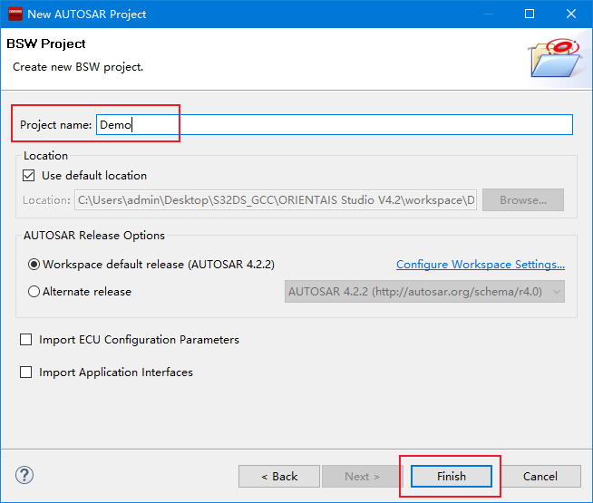

   图 5-4 新建工程-4

1. 选择[Bsw_Builder]，右键单击，选择New ECU Configuration。

.. figure:: ../../_static/集成手册/OS_添加订阅/image6.png
   :width: 2.54583in
   :height: 1.68403in

   图 5-5 新建工程-5

6. 在弹出的窗口中输入ECU名，然后选择Next。

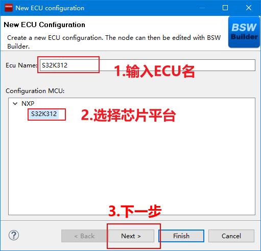

   图 5-6 新建工程-6

7. 在弹出的窗口中勾选需添加的模块，点击Finish。

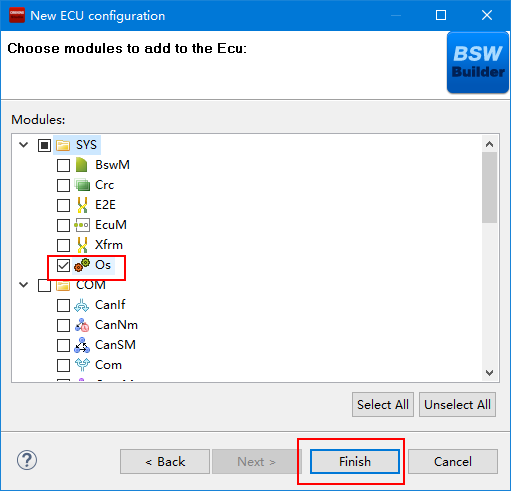

   图 5-7 新建工程-7

8. 新建工程如下图所示。

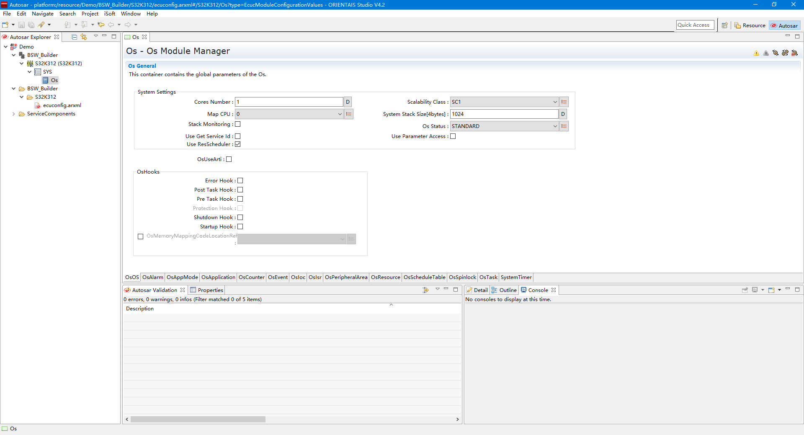

   图 5-8 新建工程8

模块配置及生成代码
-------------------

模块配置
~~~~~~~~~

模块的配置取决于项目需求。OS各模块配置项的详细介绍，请参考《参考手册_OS.pdf》。

配置代码生成
~~~~~~~~~~~~~

#. 在ORIENTAIS
   Configurator主界面左方，选择对应的模块，单击右键弹出Validate
   和Generate 菜单。

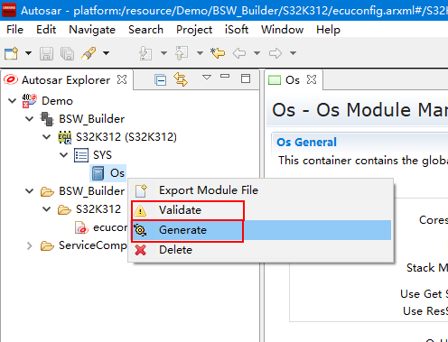

   图 5-9 模块检验和代码生成

2. 选择Validate对本模块各配置选项进行校验，没有错误提示信息即校验通过。若有错误信息，请按照错误提示修改。

3. 选择Generate，生成配置文件。右下角的Console窗口输出生成的配置文件信息。

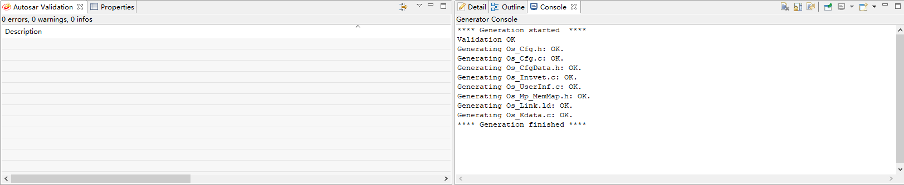

   图 5-10

4. config下就是生成的配置文件。

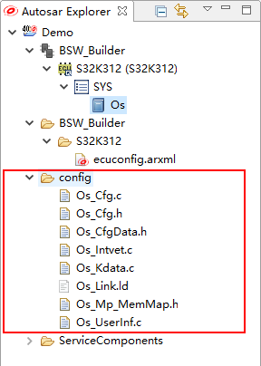

   图 5-11 生成文件示例

功能集成
---------

此章节用于指导用户在集成OS过程中应注意一些事项。

代码集成
~~~~~~~~~

OS代码包括两部分：OS Package和ORIENTAIS
Configurator生成的OS动态代码。用户须将这些文件添加到集成开发工具里。

**注意：OS Package集成之前，需确保MCU时钟的正确性。**

集成注意事项
~~~~~~~~~~~~~

对于集成过程中，OS特殊要求和用户经常出现的问题，归类总结形成表
5-1协议栈集成约束清单。用户需逐一排查表中的约束项，以避免集成问题出现。

.. table:: 表 5-1协议栈集成约束清单

   +------+----------------+-----------------------------------------------+
   |**\   | **类别**       | **约束限制**                                  |
   |编号**|                |                                               |
   +======+================+===============================================+
   | **\  | 堆栈           | 用户需\                                       |
   | 1**  |                | 确保为任务堆栈和中断堆栈分配足够的堆栈空间。  |
   +------+----------------+-----------------------------------------------+
   | **\  | 头文件         |-添加协议栈代码\                               |
   | 2**  |                |之后，用户需更新集成开发工具中的头文件路径。   |
   |      |                |                                               |
   |      |                |-调用协议栈API的源文件，\                      |
   |      |                |需要包含协议栈的头文件。                       |
   +------+----------------+-----------------------------------------------+
   | **\  | MCU初始化      | 用户应调用Mcu_Init()以初始化系统时钟;         |
   | 3**  |                |                                               |
   +------+----------------+-----------------------------------------------+
   | **\  | 启动OS         | 用户应调用StartOS()以启动OS。                 |
   | 4**  |                |                                               |
   +------+----------------+-----------------------------------------------+
   | **\  | A\             | 多核和SC3/SC4场景下，必须配置Application。    |
   | 5**  | pplication配置 |                                               |
   +------+----------------+-----------------------------------------------+

SC1集成示例
===========

本章节向用户展示OS的配置集成过程。用户可以据此熟悉OS配置工具的配置过程，以及如何应用配置工具生成的配置文件。

集成目标
---------

通过配置和集成表 6-1配置目标所示的OS
SC1配置，实现每隔100毫秒激活一次任务OsTask_Core0。

.. table:: 表 6-1配置目标

   +-----------------+-----------------+------------------+--------------+
   | TASK            |                 |                  |              |
   +-----------------+-----------------+------------------+--------------+
   | Name            | Priority        | Stack Size       | Activation   |
   |                 |                 |                  | Limit        |
   +-----------------+-----------------+------------------+--------------+
   | OsTask_Core0    | 1               | 128              | 1            |
   +-----------------+-----------------+------------------+--------------+
   | OsTaskAutostart | Preemptive      |                  |              |
   |                 | Poilcy          |                  |              |
   +-----------------+-----------------+------------------+--------------+
   | False           | FULL            |                  |              |
   +-----------------+-----------------+------------------+--------------+
   | Alarm           |                 |                  |              |
   +-----------------+-----------------+------------------+--------------+
   | Name            | Activate        | Counter          | Task         |
   +-----------------+-----------------+------------------+--------------+
   | OsAlarm_Core0   | Activate Task   | SystemTimer_Core | OsTask_Core0 |
   +-----------------+-----------------+------------------+--------------+
   | O               | Start Time      | Cycle Time       | Autosar Type |
   | sAlarmAutostart |                 |                  |              |
   +-----------------+-----------------+------------------+--------------+
   | True            | 100             | 100              | ABSOLUTE     |
   +-----------------+-----------------+------------------+--------------+
   | ISR             |                 |                  |              |
   +-----------------+-----------------+------------------+--------------+
   | Name            | Category        | Stack Size       | Nested       |
   |                 |                 |                  | Enable       |
   +-----------------+-----------------+------------------+--------------+
   | OS_INT0_IRQn    | GATEGORY_2      | 128              | False        |
   +-----------------+-----------------+------------------+--------------+
   | Priority        |                 |                  |              |
   +-----------------+-----------------+------------------+--------------+
   | 1               |                 |                  |              |
   +-----------------+-----------------+------------------+--------------+

OS的配置
---------

OsOS界面配置如下：

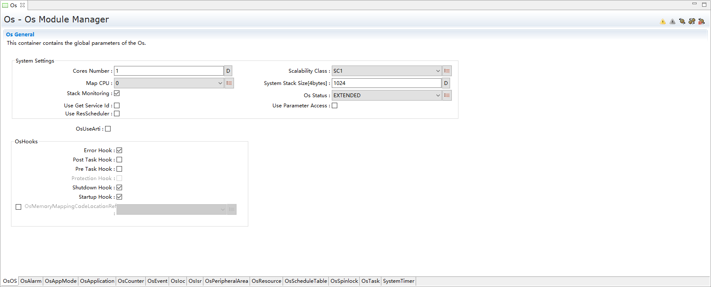

   图 6-1 OsOS 配置

.. table:: 表 6-2 OsOS配置项描述

   +---------------------+------------------------------------------------+
   | 配置项名            | 描述                                           |
   +---------------------+------------------------------------------------+
   | Cores Number        | 配置OS为1核（依据具体芯片资源而定）。          |
   +---------------------+------------------------------------------------+
   | Map CPU             | 将单核OS映射至核0运行。                        |
   +---------------------+------------------------------------------------+
   | Scalability Class   | OS功能配置为SC1                                |
   +---------------------+------------------------------------------------+
   | Os Status           | 设置OS的状态为EXTENED模式。                    |
   +---------------------+------------------------------------------------+
   | Error Hook          | 开启错误钩子函数                               |
   +---------------------+------------------------------------------------+
   | Shutdown Hook       | 开启关闭钩子函数                               |
   +---------------------+------------------------------------------------+
   | Startup Hook        | 开启启动钩子函数                               |
   +---------------------+------------------------------------------------+

2. OsAlarm界面配置如下：

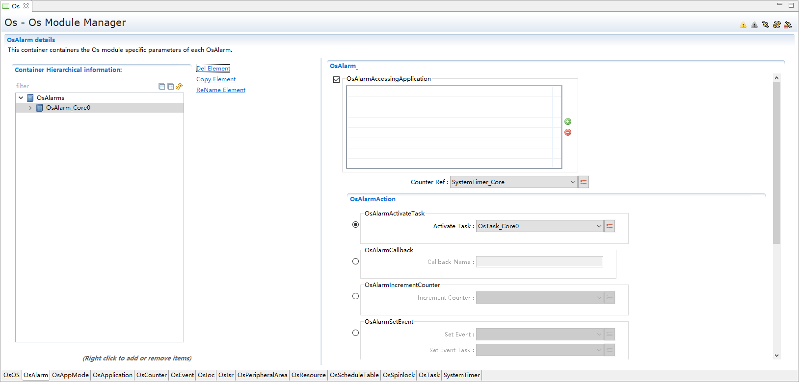

   图 6-2 OsAlarm配置-1

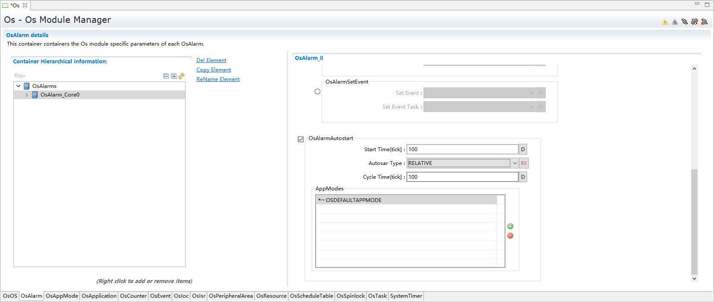

   图 6-3 OsAlarm配置-2

.. table:: 表 6-3 OsAlarm配置项描述

   +---------------------+------------------------------------------------+
   | 配置项名            | 描述                                           |
   +---------------------+------------------------------------------------+
   | Counter Ref         | 选择驱动Alarm的Counter：SystemTimer_Core。     |
   +---------------------+------------------------------------------------+
   | OsAlarmActivateTask | 选择Alarm到期后的动作为：激活OsTask_Core0。    |
   +---------------------+------------------------------------------------+
   | OsAlarmAutostart    | 设置Alarm启动方式：自启动。                    |
   +---------------------+------------------------------------------------+
   | Start Time[tick]    | 设置Alarm的启动偏移tick值为：100 Tick。        |
   +---------------------+------------------------------------------------+
   | Autosar Type        | 设置该Alarm的启动方式为：相对启动。            |
   +---------------------+------------------------------------------------+
   | Cycle Time[tick]    | 设置该周期Alarm的tick值为：100 Tick。          |
   +---------------------+------------------------------------------------+
   | AppMode             | 设置该Alarm的启动模式为：OSDEFAULTAPPMODE      |
   +---------------------+------------------------------------------------+

3. OsAppMode配置如下：

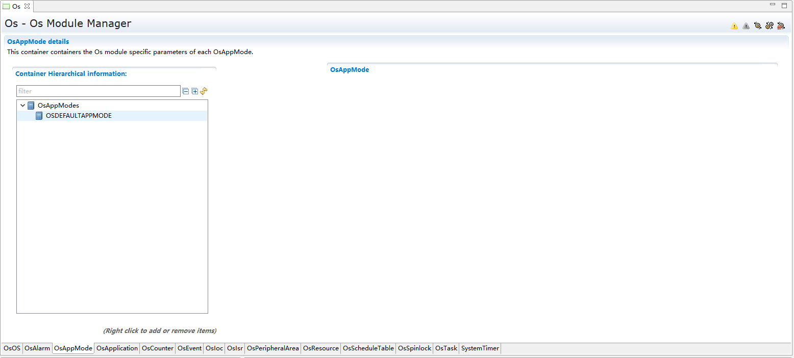

   图6-4 OsAppMode配置

.. table:: 表 6-4 OsAppMode配置项描述

   +----------------+-----------------------------------------------------+
   | 配置项名       | 描述                                                |
   +----------------+-----------------------------------------------------+
   | OsAppMode      | 设置OS的工作模式：OSDEFAULTAPPMODE。                |
   +----------------+-----------------------------------------------------+

4. OsCounter配置界面如下：

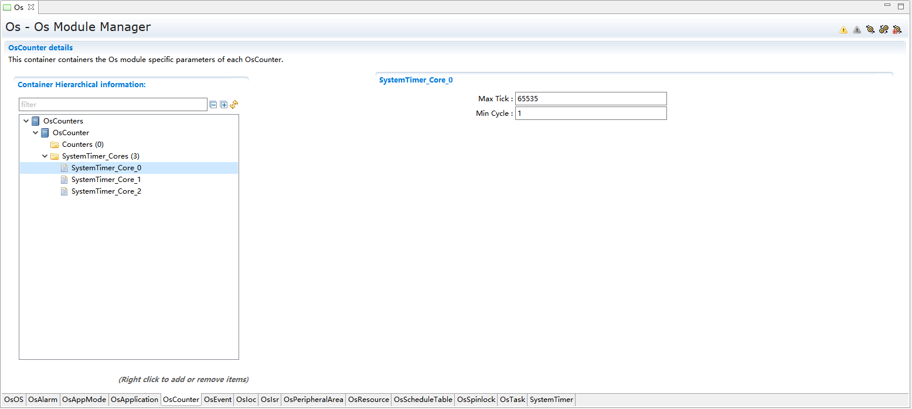

   图 6-5 OsCounter配置

.. table:: 表 6-5 OsCounter配置项描述

   +----------------+-----------------------------------------------------+
   | 配置项名       | 描述                                                |
   +----------------+-----------------------------------------------------+
   | Max Tick       | 设置系统Counter的最大tick值为：65535 Tick。         |
   +----------------+-----------------------------------------------------+
   | Min Cycle      | 设置系统Counter的最小tick值为：1 Tick。             |
   +----------------+-----------------------------------------------------+

5. OsIsr配置界面如下：

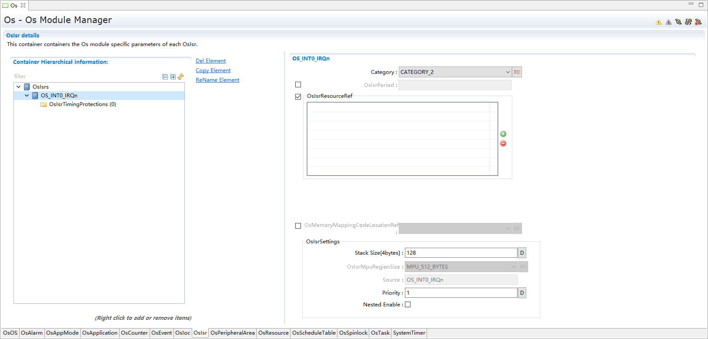

   图 6-6 OsIsr配置

.. table:: 表 6-6 OsIsr配置项描述

   +-----------------+----------------------------------------------------+
   | 配置项名        | 描述                                               |
   +-----------------+----------------------------------------------------+
   | Category        | 配置OS_INT0_IRQn中断为：CATEGORY_2。               |
   +-----------------+----------------------------------------------------+
   | Stack Size      | 设                                                 |
   |                 | 置OS_INT0_IRQn中断的栈空间为：128（单位：4bytes）  |
   +-----------------+----------------------------------------------------+
   | Priority        | 设置OS_INT0_IRQn中断的优先级为：1                  |
   +-----------------+----------------------------------------------------+
   | Nested Enable   | 设置中断嵌套功能：不开启总的嵌套。                 |
   +-----------------+----------------------------------------------------+

6. OsTask配置界面如下：

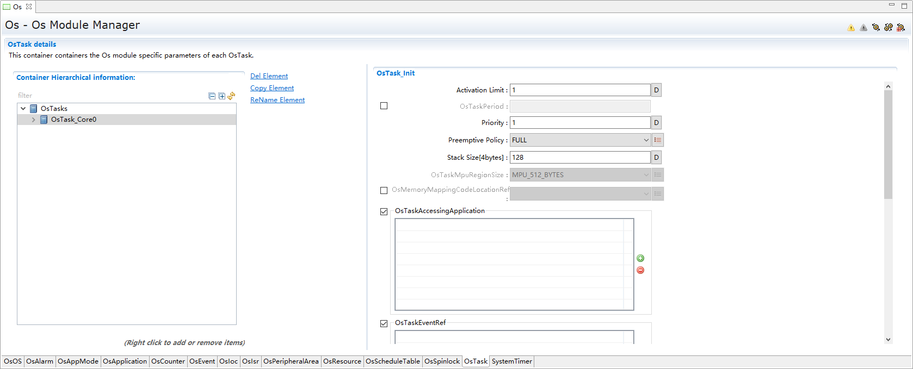

   图 6-7 OsTask配置-1

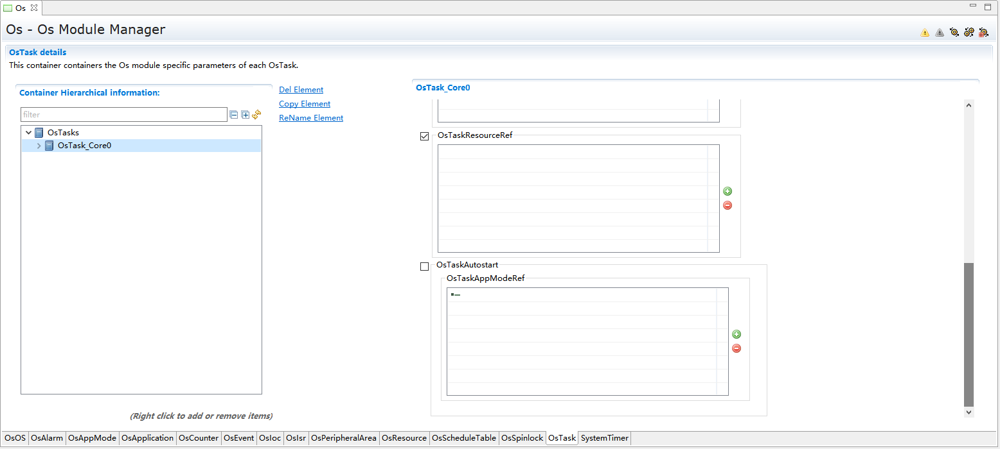

   图 6-8 OsTask配置-2

.. table:: 表 6-7 OsTask配置项描述

   +---------------------+------------------------------------------------+
   | 配置项名            | 描述                                           |
   +---------------------+------------------------------------------------+
   | Activation Limit    | 设\                                            |
   |                     | 置该任务能被连续激活的次数：允许连续激活1次。  |
   +---------------------+------------------------------------------------+
   | Priority            | 设置任务的优先级为：1                          |
   +---------------------+------------------------------------------------+
   | Preemptive Policy   | 设置该任务的抢占策略为：FULL                   |
   +---------------------+------------------------------------------------+
   | Stack Size          | 设置任务的堆栈为：128（单位：4bytes）          |
   +---------------------+------------------------------------------------+
   | OsTaskAutostart     | 关闭自启动                                     |
   +---------------------+------------------------------------------------+

7. SystemTimer配置界面如下：

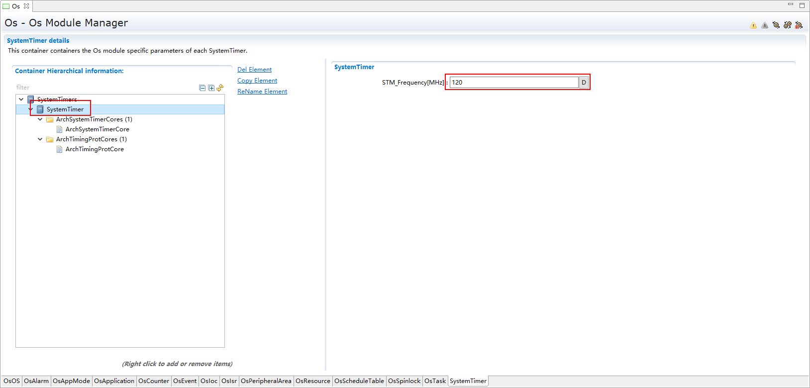

   图 6-9 SystemTimer配置-1

.. figure:: ../../_static/集成手册/OS_添加订阅/image22.png
   :width: 5.76597in
   :height: 2.7625in

   图 6-10 SystemTimer配置-2

.. table:: 表 6-8 SystemTimer配置项描述

   +-------------------------+--------------------------------------------+
   | 配置项名                | 描述                                       |
   +-------------------------+--------------------------------------------+
   | STM_Frequency[MHZ]      | 系\                                        |
   |                         | 统时钟频率：120MHz（需根据硬件配置设定）。 |
   +-------------------------+--------------------------------------------+
   | Priority                | 设置系统中断的优先级为：10                 |
   +-------------------------+--------------------------------------------+
   | Nest Enable             | 设置该系统中断是否支持嵌套功能             |
   +-------------------------+--------------------------------------------+
   | TickTime[s]             | 设置系统中断周期时间为：0.001s             |
   +-------------------------+--------------------------------------------+

协议栈调度集成
---------------

OS调度集成步骤如下：

-  协议栈调度集成，需要逐一排查并实现“表
   5-1协议栈集成约束清单”所罗列的问题，以避免集成出现差错。

-  编译链接代码，将生成的elf文件烧写进芯片。

MCU初始化相关的代码，在下方的main.c文件中给出重点标注。

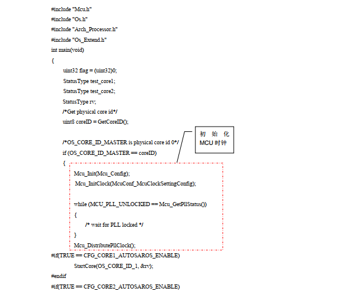
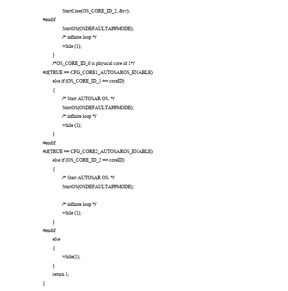

验证结果
---------

当全速运行时，周期任务能够按照周期时间执行，达到了集成目标的要求。

SC3集成示例
===========

该功能依赖硬件的MPU模块，不同指令集架构和不同芯片对MPU的实现不同，导致移植方案存在差异。本章节以ARM
Cortex-M7和Synopsys ARC-EM22FS指令集架构为例。

集成目标
---------

通过配置和集成OS SC3，实现No Trusted Application间数据访问的隔离。

#. OsApplication子模块配置如下:

.. table:: 表 7-1 SC3配置目标-Application

   +------------+-------------------+------------------+--------+-------+
   | A\         | OsApp\            | OsAppC\          | T\     | Prote\|
   | pplication | DataMpuRegionSize | odeMpuRegionSize | rusted | ction |
   | Name       |                   |                  |        |       |
   +------------+-------------------+------------------+--------+-------+
   | App        | MPU_2_KB          | MPU_2_KB         | √      | ×     |
   | lication_0 |                   |                  |        |       |
   +------------+-------------------+------------------+--------+-------+
   | App        | MPU_2_KB          | MPU_2_KB         | ×      | N/A   |
   | lication_1 |                   |                  |        |       |
   +------------+-------------------+------------------+--------+-------+
   | App        | MPU_2_KB          | MPU_2_KB         | ×      | N/A   |
   | lication_2 |                   |                  |        |       |
   +------------+-------------------+------------------+--------+-------+
   | App        | MPU_2_KB          | MPU_2_KB         | √      | √     |
   | lication_3 |                   |                  |        |       |
   +------------+-------------------+------------------+--------+-------+

Application_0配置为Trusted且不开启Protection,该Application下的Task对内存的访问不受MPU的限制。

Application_3配置为Trusted且开启Protection,该Application下的Task运行对内存的访问受MPU的限制(实现定义)。

Application_1和Application_2配置为No
Trusted,该Application下的Task对内存的访问受MPU的限制。

2. OsTask子模块配置如下:

.. table:: 表 7-2 SC3配置目标-Task

   +-------------+------------+----------------+-------------------------+
   | Task Name   | Stack      | OsTas\         | OsTaskAutostart         |
   |             | Si\        | kMpuRegionSize |                         |
   |             | ze[4Bytes] |                |                         |
   +-------------+------------+----------------+-------------------------+
   | OsTa\       | 128        | MPU_512_BYTES  | OSDEFAULTAPPMODE        |
   | sk_App0Init |            |                |                         |
   +-------------+------------+----------------+-------------------------+
   | OsTa\       | 128        | MPU_512_BYTES  | OSDEFAULTAPPMODE        |
   | sk_App1Init |            |                |                         |
   +-------------+------------+----------------+-------------------------+
   | OsTa\       | 128        | MPU_512_BYTES  | OSDEFAULTAPPMODE        |
   | sk_App2Init |            |                |                         |
   +-------------+------------+----------------+-------------------------+
   | OsTa\       | 128        | MPU_512_BYTES  | OSDEFAULTAPPMODE        |
   | sk_App3Init |            |                |                         |
   +-------------+------------+----------------+-------------------------+

模块的配置
----------

#. OsOS界面配置如下：

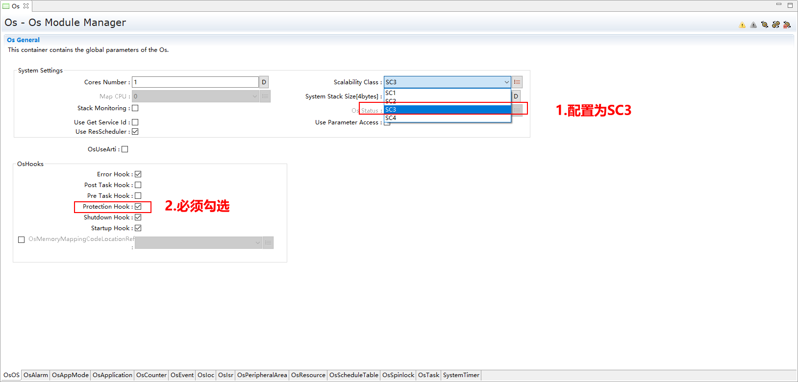

   图 7-1 OsOS配置

2. OsApplication界面配置如下：

.. figure:: ../../_static/集成手册/OS_添加订阅/image24.png
   :width: 5.76597in
   :height: 2.7625in

   图 7-2 OsApplication配置-1

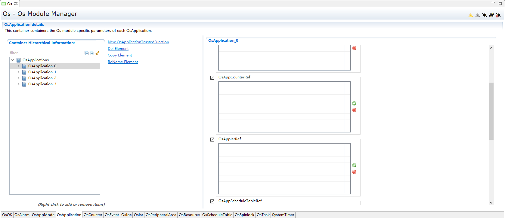

   图 7-3 OsApplication配置-2

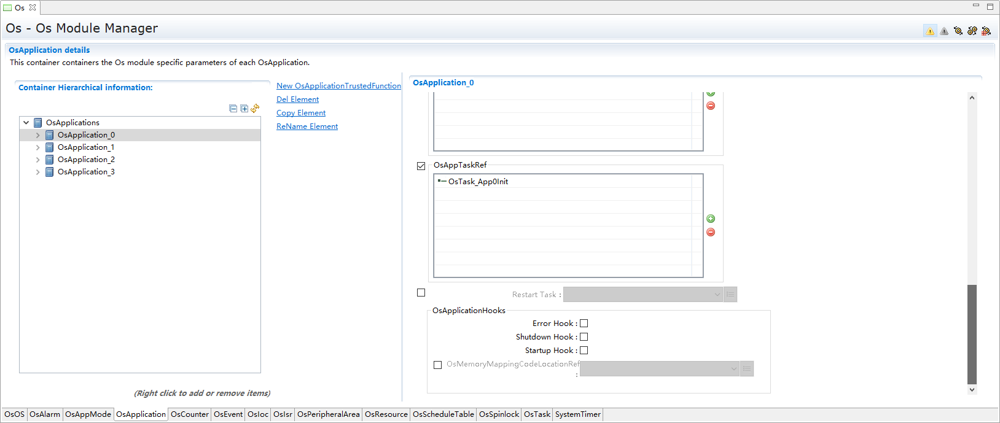

   图 7-4 OsApplication配置-3

.. table:: 表 7-3 OsApplication配置项描述

   +------------------------+---------------------------------------------+
   | 配置项名               | 描述                                        |
   +------------------------+---------------------------------------------+
   | Trusted                | 配置Application为Trusted Application        |
   +------------------------+---------------------------------------------+
   | Protection             | Trusted Application的写权限是否被限制       |
   +------------------------+---------------------------------------------+
   | CoreRef                | 指定运行该Application的核。                 |
   +------------------------+---------------------------------------------+
   | OsAppDataMpuRegionSize | Application下所有数据组合后的对齐策略。     |
   +------------------------+---------------------------------------------+
   | OsAppCodeMpuRegionSize | Application代码对齐策略。                   |
   +------------------------+---------------------------------------------+
   | OsAppTaskRef           | Application下管理的Task。                   |
   +------------------------+---------------------------------------------+

3. OsTask界面配置如下：

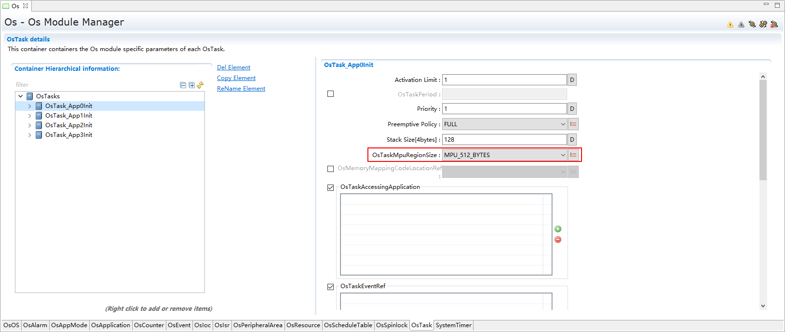

   图 7-5 OsTask配置-1

.. figure:: ../../_static/集成手册/OS_添加订阅/image28.png
   :width: 5.75069in
   :height: 2.32708in

   图 7-6 OsTask配置-2

图 7-5
OsTask配置-1中的OsTaskMpuRegionSize用于控制生成的链接文件中该Task下所有数据的对齐策略，一般与栈大小保持一致。

源代码的集成
------------

#. SC3下，ORIENTAIS Configurator配置工具会根据编译器生成特定格式的链接文
   件，需将链接文件添加至编译工程中；以S32DS +
   GCC10.2编译器为例，项目OS工具生成的链接文件名为Os_Link.ld，将该文件添加Build过程的方式如
   图所示:

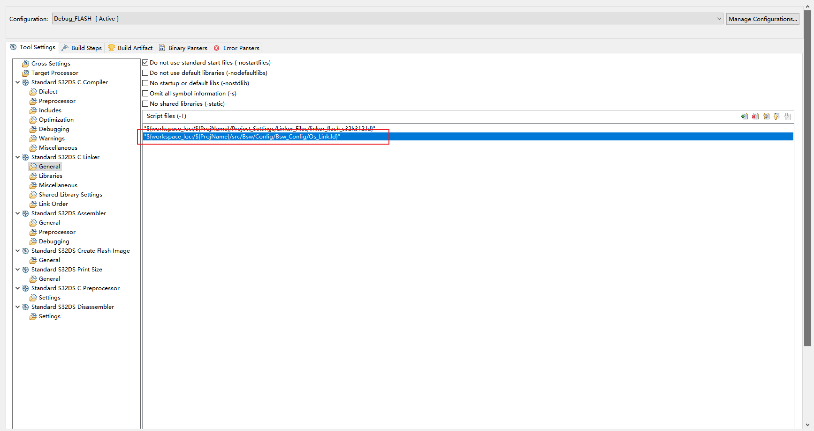

   图 7-7 S32DS-GCC10.2添加链接文件

2. 实现Application_1的变量无法被Application_2访问的限制，需要采用如下 方
   式定义变量：

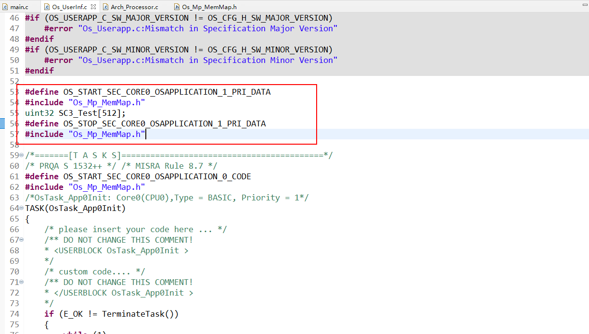

   图 7-8 划分变量时变量声明方式

引用的宏符号OS_START_SEC_CORE0_OSAPPLICATION_1_PRI_DATA和OS_STOP_SEC_CORE0_OSAPPLICATION_1_PRI_DATA可以在下图所示的文件Os_Mp_MemMap.h中找到

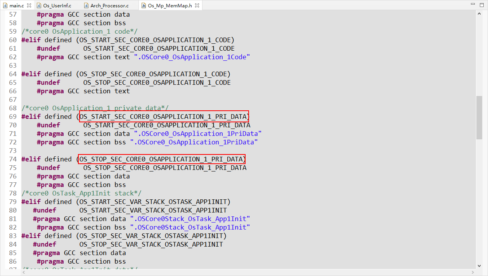

   图 7-9 Os_Mp_MemMap.h生成示例

.. _验证结果-1:

验证结果
--------

图 7-10
测试MPU功能中的代码为Application_2下的OsTask_App2Init访问Application_1的私有变量，代码运行图中所示的位置后，MPU会检测到写访问超出访问权限，并触发异常。

.. figure:: ../../_static/集成手册/OS_添加订阅/image32.png
   :width: 4.75972in
   :height: 3.17639in

   图 7-10 测试MPU功能

该平台的现象为进入HardFault_Handler，如下图所示；

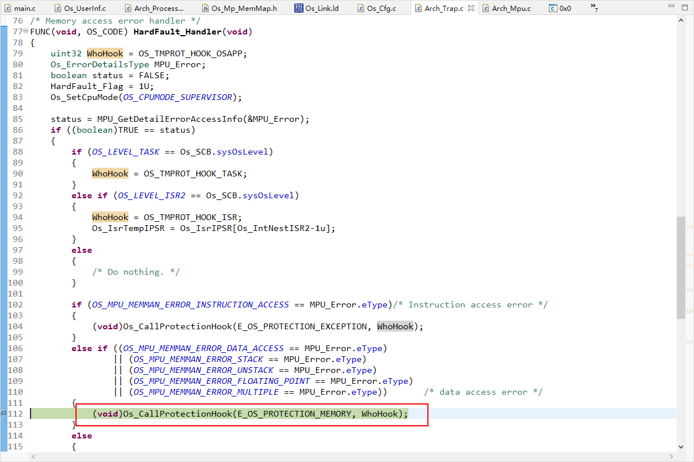

   图7-11 内存保护异常现象SHANG

MPU异常触发原因的定位
---------------------

Armv7-M
~~~~~~~

支持的MCU：NXP S32Kxxx, FlagChip FC7300Fx, Cypress
CYTxxx等，内核手册中的描述如下：

.. figure:: ../../_static/集成手册/OS_添加订阅/image34.png
   :width: 4.9513in
   :height: 2.99412in

   图 7-12 MPU故障地址寄存器

#. 寄存器MMFAR(0xE000ED34)，当发生内存保护异常时，该寄存器的会记录触发内存保护异常的内存地址；

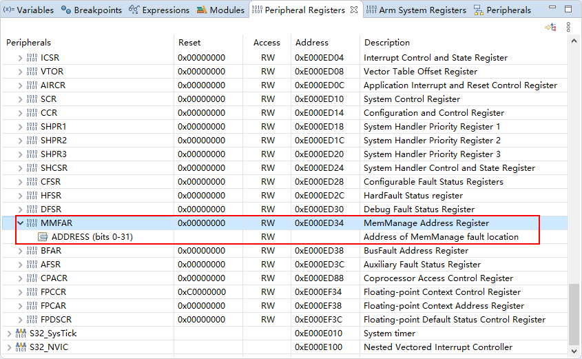

   图 7-13 Armv7-M内存保护异常地址寄存器(S32DS)

2. 由于该内核支持硬件上下文保存机制，可以通过暂时删除HardFault中的内容，采用汇编单步运行的方式快速定位到触发异常的指令，但是对于发生在Exception
   Entry 或者 Exit处的内存保护异常该策略会失效;

3. 对于S32K312平台，当使用PEMicro调试时，会在console窗口输出以下信息协助定位问题;

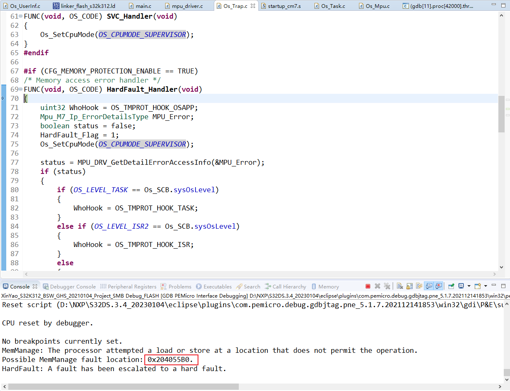

   图 7-14 S32DS + PEMicro的相关Debug支持

ARC-EM22FS
~~~~~~~~~~

支持的MCU: Calterah Alps, Alps-Pro，该寄存器指示触发MPU异常的Region
Number和访问方式(读、写、执行、内存交换等)。

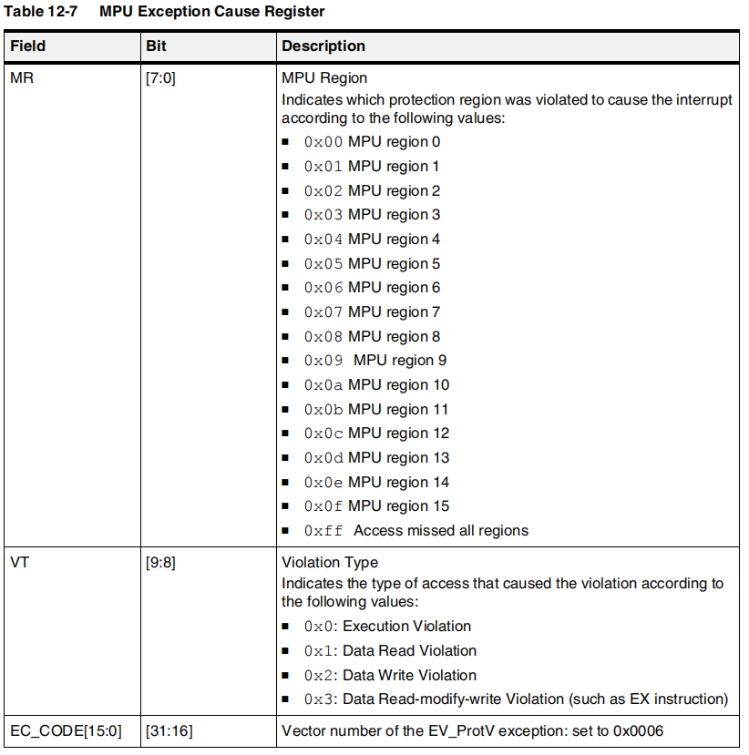

   图 7-15 ARC-EM22FS MPU异常原因寄存器

实际项目开发中，ERET寄存器更常用，该寄存器用于记录异常返回地址(即:导致异常的指令的地址),可根据相关编译生成文件确定触发异常代码位置。
