===================
RamTest_集成手册
===================

目标
====

本文档用于指导客户进行RamTest集成，文档主要包括的内容为：RamTest集成指导、基于普通应用的集成示例讲解、项目集成特殊说明。

通过阅读本文档，用户可以了解代码集成过程，ORIENTAIS配置工具的配置过程，以及如何应用配置工具生成的配置文件。

由于各项目的需求不同，集成示例不会针对于特定的商业项目做详细讲解。

缩写词和术语
============

.. table:: 表 2-1 缩写词和术语

   +---------------+------------------------------------------------------+
   | **\           | **描述**                                             |
   | 缩写词/术语** |                                                      |
   +---------------+------------------------------------------------------+
   | OS            | Operating System 操作系统                            |
   +---------------+------------------------------------------------------+
   | ECU           | Electronic Control Unit 电控单元                     |
   +---------------+------------------------------------------------------+
   | MCU           | Micro Controller Unit 微控制单元                     |
   +---------------+------------------------------------------------------+
   | Det           | Development Error Tracer 开发错误跟踪器              |
   +---------------+------------------------------------------------------+
   | RAM           | Random Access Memory 随机访问存储器                  |
   +---------------+------------------------------------------------------+
   | Dem           | Diagnostic Event Manager 诊断事件管理器              |
   +---------------+------------------------------------------------------+

参考文档
========

[1] 参考手册_CRC.pdf

RamTest集成
===========

项目交付的内容为：RamTest源码和ORIENTAIS Configurator配置工具。

RamTest各配置模块的功能介绍，参见表4-1 RamTest各配置模块介绍。

使用RamTest源码和配置工具，进行RamTest的集成的步骤。

.. table:: 表 4-1 RamTest各配置模块介绍

   +---------+------------------------------------------------------------+
   | **\     | **功能**                                                   |
   | 模块名**|                                                            |
   +---------+------------------------------------------------------------+
   | RamTest | RamTest主要对RAM单元的物理健康状况进行测试                 |
   +---------+------------------------------------------------------------+

.. table:: 表 4-2 RamTest集成的步骤

   +-------+---------------------------+------------------------------------+
   |**\    | **操作**                  | **说明**                           |
   |步骤** |                           |                                    |
   |       |                           |                                    |
   |       |                           |                                    |
   +-------+---------------------------+------------------------------------+
   | 1     | ORIENTAIS                 | 若配置工具已经搭建，\              |
   |       | Configurator配置工具\     | 则仅需进行RamTest模块的加载操作。  |
   |       | 工程搭建和RamTest模块加载 |                                    |
   +-------+---------------------------+------------------------------------+
   | 2     | 模块配置及配置文件生成    | NA                                 |
   +-------+---------------------------+------------------------------------+
   | 3     | 代码集成                  | 现有工程、R\                       |
   |       |                           | amTest源代码和配置生成文件的集成。 |
   +-------+---------------------------+------------------------------------+
   | 4     | 验证测试                  | NA                                 |
   +-------+---------------------------+------------------------------------+

**注意：**\ RamTest\ **集成之前，用户须确保已经有基础工程，且**\ RamTest\ **相关的其他协议栈能正常工作。**

新建ORIENTAIS Configurator配置工程及模块加载
--------------------------------------------

#. 安装ORIENTAIS Configurator软件后，双击软件图标打开软件。

.. figure:: ../../_static/集成手册/RamTest/image1.png
   :width: 5.75625in
   :height: 3.17014in

   图 4-1 软件主界面

2. 菜单栏File🡪New🡪Project，新建工程。

.. figure:: ../../_static/集成手册/RamTest/image2.png
   :width: 5.75625in
   :height: 3.17014in

   图 4-2 新建工程

3. 在弹出的新建窗口中选择Autosar下的 [BSW Project]，选择Next。

.. figure:: ../../_static/集成手册/RamTest/image3.png
   :width: 4.62222in
   :height: 3.88889in

   图 4-3 新建工程

4. 在弹出的窗口中输入工程名，选择Finish。

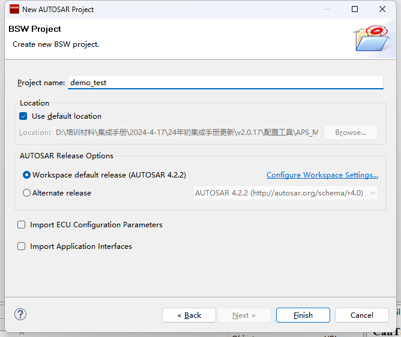

   图 4-4 新建工程

5. 在弹出的窗口中选择Yes。

.. figure:: ../../_static/集成手册/RamTest/image5.png
   :width: 5.75625in
   :height: 3.17014in

   图 4-5 完成新建工程

6. 选择[Bsw_Builder]，右键单击，选择New ECU Configuration。

.. figure:: ../../_static/集成手册/RamTest/image6.png
   :width: 5.75625in
   :height: 3.17014in

   图 4-6 新建ECU

7. 在弹出的窗口中输入ECU名，然后选择Next。

.. figure:: ../../_static/集成手册/RamTest/image7.png
   :width: 4.62222in
   :height: 3.88889in

   图 4-7 选择芯片平台

8. 在弹出的窗口中勾选需添加的模块，点击Finish。

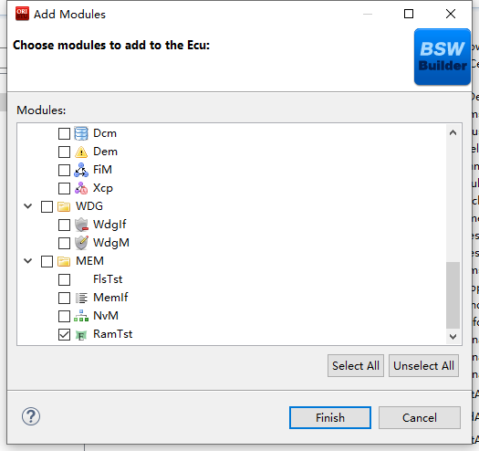

   图 4-8 完成ECU配置

9. 新建工程如下所示，步骤⑧中添加的模块已经被加入到工程中。

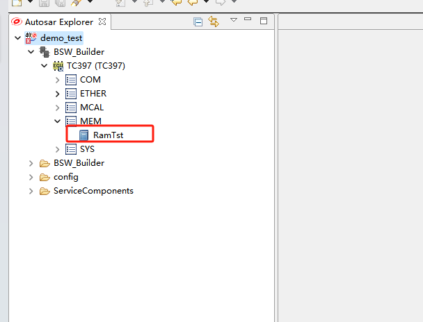

   图 4-9 工程列表界面

模块配置及生产代码
------------------

模块配置
~~~~~~~~

#. 在ORIENTAIS
   Configurator主界面左方，选择对应的协议栈，单击右键弹出Validate
   All和Generate All菜单。

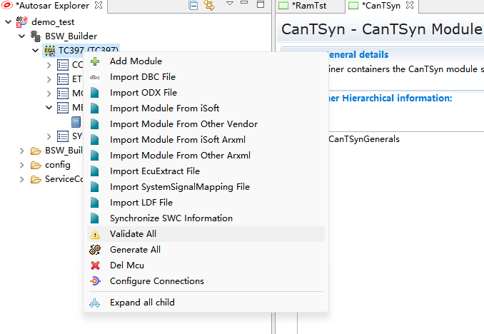

   图 4-10 代码生成

2. 选择Validate
   All对本协议栈各配置选项进行校验，没有错误提示信息即校验通过。若有错误信息，请按照错误提示修改。

3. 选择Generate
   All，生成配置文件。右下角的Console窗口输出生成的配置文件信息。

.. figure:: ../../_static/集成手册/RamTest/image11.png
   :width: 5.75625in
   :height: 3.17014in

   图 4-11 代码生成提示界面

4. 将ORIENTAIS Configurator切换到Resource模式，即可查看生成的配置文件。

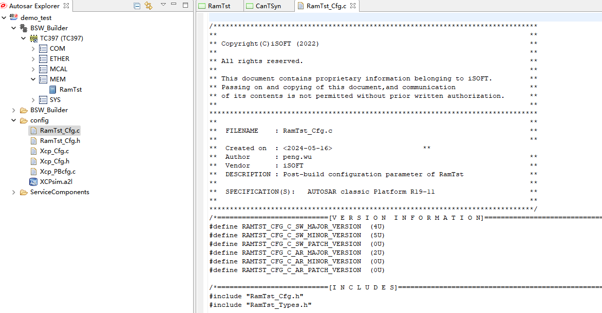

   图 4-12 生成的配置文件

功能集成
--------

代码集成
~~~~~~~~

RamTest代码包括两部分：项目提供的RamTest源码和ORIENTAIS
Configurator配置生成代码。

用户须将RamTest源码和章节4.2.1生成的源代码添加到集成开发工具的对应文件夹。RamTest集成的文件结构，见章节5.2.6。

**注意：**\ RamTest\ **集成之前，用户须确保已经有基础工程，且**\ RamTest\ **相关的其他协议栈能正常工作。**

集成注意事项
~~~~~~~~~~~~

对于集成过程中，RamTest特殊要求和用户经常出现的问题，归类总结形成。用户需逐一排查表中的约束项，以避免集成问题出现。

.. table:: 表 4-3 RamTest集成约束清单

   +------+---------+-----------------------------------------------------+
   |**\   |         | **约束限制**                                        |
   |编号**|**类别** |                                                     |
   |      |         |                                                     |
   |      |         |                                                     |
   +------+---------+-----------------------------------------------------+
   | **\  | 堆栈    | 用户需确保为任务堆栈和中断堆栈分配足够的堆栈空间。  |
   | 1**  |         |                                                     |
   +------+---------+-----------------------------------------------------+
   | **\  | 头文件  | -  添加协议栈代码之后，用户需更新集成开发工具中的头\|
   | 2**  |         |    文件路径。                                       |
   |      |         |                                                     |
   |      |         | -  调用协议栈API的源文件，需要包含协议栈的头文件。  |
   +------+---------+-----------------------------------------------------+
   | **\  | 初始化  | RamTest的初始化函数为RamTst_Init                    |
   | 3**  |         |                                                     |
   +------+---------+-----------------------------------------------------+
   | **\  | 周\     | 在后台测\                                           |
   | 4**  | 期函数  | 试时，RamTst_MainFunction需要被周期性任务函数调用。 |
   +------+---------+-----------------------------------------------------+
   | **\  | 前\     | 如要进\                                             |
   | 5**  | 台测试  | 行前台测试，建议在MCU初始化之后进行或下电之前进行。 |
   +------+---------+-----------------------------------------------------+
   | **\  | 软\     | -  OS：提供任务调度周期调用RamTst_MainFunction\     |
   | 6**  | 件依赖  |    提供ISR环境，定期后台测试                        |
   |      |         |                                                     |
   |      |         |                                                     |
   |      |         |                                                     |
   |      |         |                                                     |
   |      |         | -  DEM：DEM错误处理函数，该模块不是强制的。         |
   |      |         |                                                     |
   |      |         | -  DET：处理开发过程中的错误，该模块不是强制的。    |
   +------+---------+-----------------------------------------------------+

集成示例
========

本章节向用户展示RamTest的集成过程。用户可以据此熟悉RamTest配置工具的配置过程，以及如何应用配置工具生成的配置文件。

本章节先完成基本RamTest配置，使得工程可以编译通过，并实现Ram测试，然后根据具体需求服务进行添加或修改。

**注意：本示例不代表用户的实际配置情况，用户需要根据自己的实际需求，决定各个参数的配置。**

集成目标
--------

通过搭建基础工程，实现Ram测试功能。具体测试功能如下：

1. 前台测试 -在前台实现对所配置的RAM
   Block用选定的算法进行全部测试或者部分测试。测试块参数配置如表5-1。

.. table:: 表 5-1 前台测试测试块参数配置

   +---------+-----------------+------------+---------+--------+--------+
   | **测试\ | **起始地址**    | **\        | **测\   | **测试\| **测\  |
   | 类型**  |                 | 结束地址** | 试破坏\ | 策略** | 试使用\|
   |         |                 |            | 后的填\ |        | 方法** |
   |         |                 |            | 充值**  |        |        |
   +---------+-----------------+------------+---------+--------+--------+
   | 前\     | 0x1fff0400      | 0x1fff09ff | 0       | 非\    | 前\    |
   | 台测试  |                 |            |         | 破坏性 | 台测试 |
   +---------+-----------------+------------+---------+--------+--------+

2. 后台测试–在后台实现对所配置的RAM
   Block分为原子操作，用选定的算法进行全部测试。参数配置如表5-2：

.. table:: 表 5-2 后台测试测试块参数配置

   +---------+-----------------+------------+---------+--------+--------+
   | **测试\ | **起始地址**    | **\        | **测\   | **测试\| **测\  |
   | 类型**  |                 | 结束地址** | 试破坏\ | 策略** | 试使用 |
   |         |                 |            | 后的填\ |        | 方法** |
   |         |                 |            | 充值**  |        |        |
   +---------+-----------------+------------+---------+--------+--------+
   | 后\     | 0x20000000      | 0x200043a7 | 0       | 非\    | 后\    |
   | 台测试  |                 |            |         | 破坏性 | 台测试 |
   +---------+-----------------+------------+---------+--------+--------+

模块的配置
----------

新建配置工程及模块加载操作，请参考本文档4.1章节。生成代码过程请参考章节4.2。

RamTstCommon配置
~~~~~~~~~~~~~~~~

在此处进行一些函数是否使用的配置、安全暂存区域和RamTest模块本地变量区域配置。

#. 双击RamTstCommon模块，打开RamTstCommon模块配置界面。

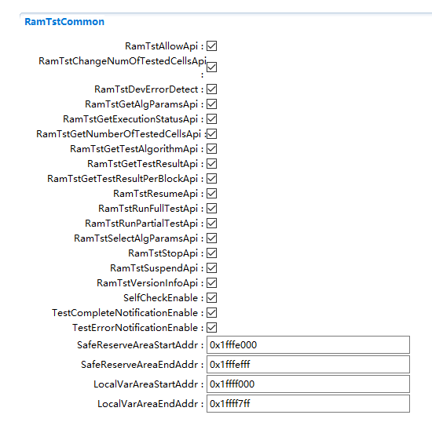

   图 5-1 RamTstCommon配置界面

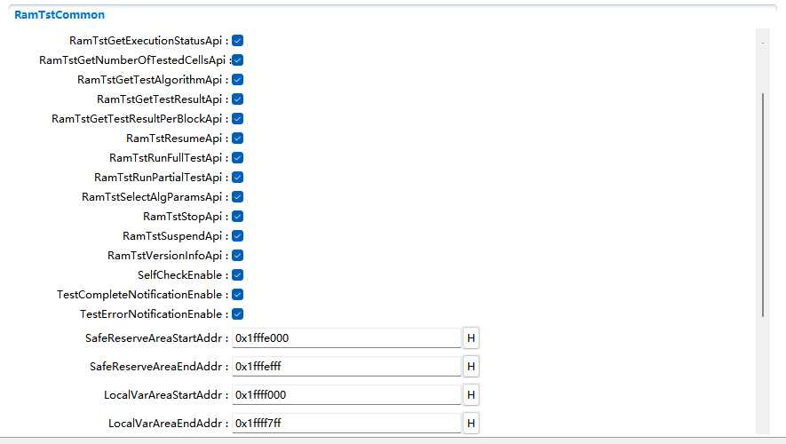

   图 5-2 RamTstCommon配置界面

**RamTstAllowApi**\ ：预处理器开关，以禁用/启用API"RamTst_Allow"。

**RamTstChangeNumOfTestedCellsApi**\ ：预处理器开关，以禁用/启用API"
RamTst_ChangeNumberOfTestedCells"。

**RamTstGetTestAlgorithmApi**\ ：预处理器开关，以禁用/启用API"
RamTst_GetTestAlgorithm"。

**RamTstGetTestResultApi**\ ：预处理器开关，以禁用/启用API"
RamTst_GetTestResult"。

**RamTstGetTestResultPerBlockApi**\ ：预处理器开关，以禁用/启用API"
RamTst_GetTestResultPerBlock"。

**RamTstResumeApi**\ ：预处理器开关，以禁用/启用API" RamTst_Resume"。

**RamTstRunFullTestApi：**\ 预处理器开关，以禁用/启用API"
RamTst_RunFullTest"。

**RamTstRunPartialTestApi：**\ 预处理器开关，以禁用/启用API"
RamTst_RunPartialTest"。

**RamTstSelectAlgParamsApi：**\ 预处理器开关，以禁用/启用API"
RamTst_SelectAlgParams"。

**RamTstStopApi：**\ 预处理器开关，以禁用/启用API" RamTst_Stop"。

**RamTstSuspendApi：**\ 预处理器开关，以禁用/启用API" RamTst_Suspend"。

**RamTstVersionInfoApi：**\ 预处理器开关，以禁用/启用API"
RamTst_GetVersionInfo"。

**SelfCheckEnable：**\ 预处理器开关，以禁用/启用自检功能。

**TestCompleteNotificationEnable：**\ 预处理器开关，以禁用/启用测试完成通知。

**TestErrorNotificationEnable：**\ 预处理器开关，以禁用/启用测试失败通知。

2. 安全暂存区域地址配置，分为起始地址和结束地址。

**SafeReserveAreaStartAddr**\ ：此配置填写起始地址。

**SafeReserveAreaEndAddr**\ ：此配置填写结束地址。详见图5-2。

.. figure:: ../../_static/集成手册/RamTest/image15.png
   :width: 3.75139in
   :height: 3.61458in

   图 5-3 安全暂存区域配置

3. RamTst模块本地变量区域配置。分为起始地址和结束地址。

..

**LocalVarAreaStartAddr**\ ：此配置填写起始地址。

**LocalVarAreaEndAddr**\ ：此配置填写结束地址。如图5-3.

.. figure:: ../../_static/集成手册/RamTest/image16.png
   :width: 3.62083in
   :height: 3.78889in

   图 5-4 RamTst模块本地变量区域配置

RamTstAlgorithms配置
~~~~~~~~~~~~~~~~~~~~

此处进行RamTest所使用的测试算法配置。

#. 双击RamTstAlgorithms模块，打开RamTstAlgorithms模块配置界面。

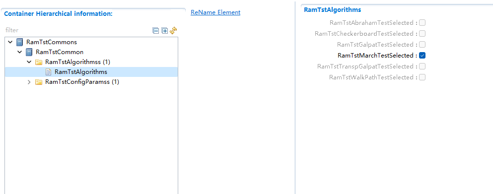

   图 5-5 RamTstAlgorithms配置

**RamTstAbrahamTestSelected:**
预处理器开关，以禁用/启用算法Abraham，目前未实现，此配置项不可配。

**RamTstCheckerboardTestSelected:**
预处理器开关，以禁用/启用算法Checkerboard，目前未实现，此配置项不可配。

**RamTstGalpatTestSelected:**
预处理器开关，以禁用/启用算法Galpat，目前未实现，此配置项不可配。

**RamTstMarchTestSelected:** 预处理器开关，以禁用/启用算法March。

**RamTstTranspGalpatTestSelected:**
预处理器开关，以禁用/启用算法TranspGalpat，目前未实现，此配置项不可配。

**RamTstWalkPathTestSelected:**
预处理器开关，以禁用/启用算法WalkPath，目前未实现，此配置项不可配。

此处将“RamTstMarchTestSelected”勾选上。

RamTstConfigParams配置
~~~~~~~~~~~~~~~~~~~~~~

此处进行RamTest配置参数的配置。

#. 双击RamTstConfigParams模块，打开RamTstConfigParams模块配置界面。

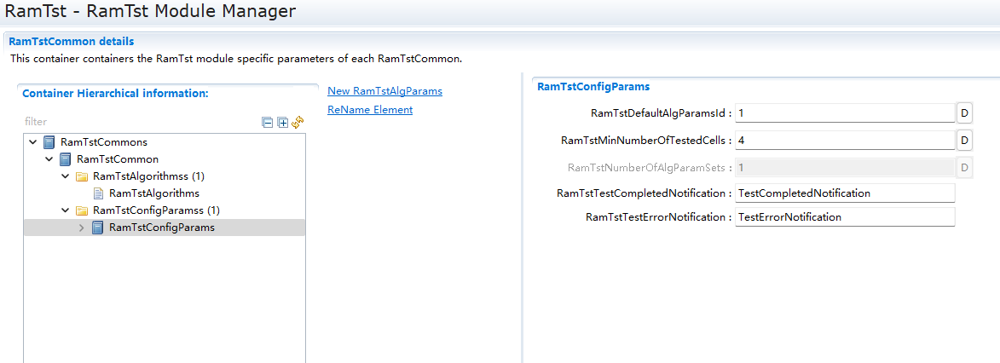

   图 5-6 RamTstConfigParams配置

2. 配置RamTstDefaultAlgParamsId，此处填1；
   **RamTstDefaultAlgParamsId：**\ 默认的测试参数ID配置。

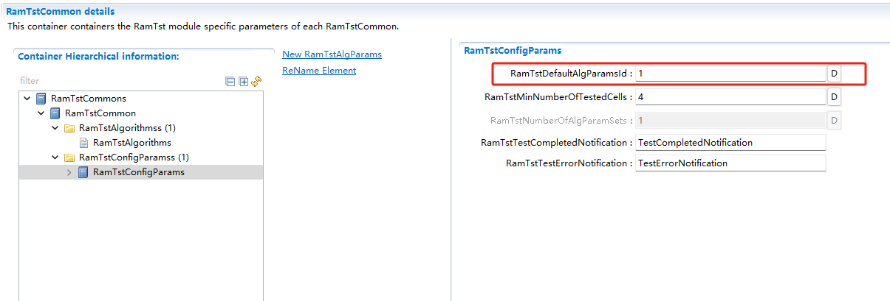

   图 5-7 RamTstDefaultAlgParamsId配置

3. 配置RamTstMinNumberOfTestedCells；

**RamTstMinNumberOfTestedCells**\ ：进行测试时的最小测试单元字节数。

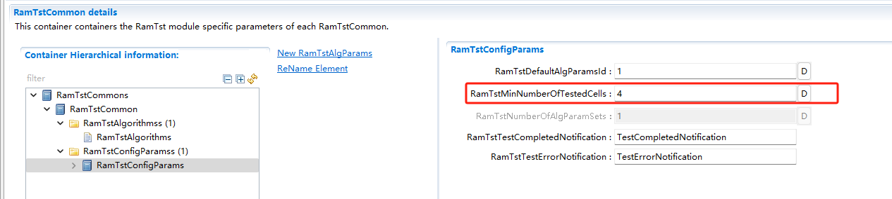

   图 5-8 RamTstMinNumberOfTestedCells配置

4. 配置RamTstTestCompletedNotification；

**RamTstTestCompletedNotification**\ ：测试完成回调函数，在完成RAM测试
后，没有检测到错误，会调用这个函数。

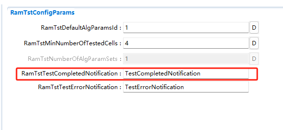

   图 5-9 RamTstTestCompletedNotification配置

5. 配置RamTstTestErrorNotification；

**RamTstTestErrorNotification：**\ 测试到错误时的回调函数，在检测到RAM
错误时，会调用这个函数。

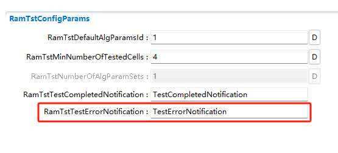

   图 5-10 RamTstTestErrorNotification配置

RamTstAlgParams配置
~~~~~~~~~~~~~~~~~~~

此处进行测试参数的配置。RamTstAlgParams可以配置测试参数相关的参数。可以配置多个测试参数。测试参数的添加步骤为：鼠标选中RamTstAlgParams—单击右键—New—RamTstAlgParams

.. figure:: ../../_static/集成手册/RamTest/image23.png
   :width: 3.57921in
   :height: 2.35704in

   图 5-11 RamTstAlgParams添加

#. 双击RamTstAlgParams模块，打开RamTstAlgParams模块配置界面。

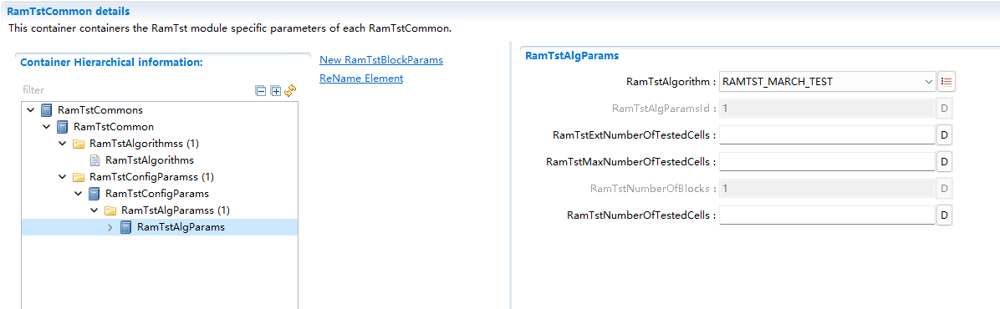

   图 5-12 RamTstAlgParams配置界面

2. 配置RamTstAlgorithm。

**RamTstAlgorithm：**\ 该测试参数所使用的测试算法。选择MARCH算法。

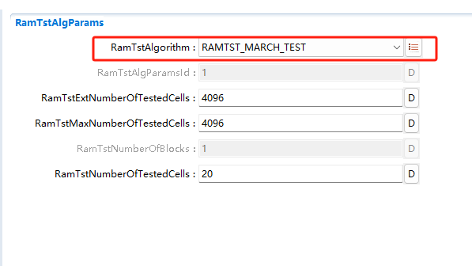

   图 5-13 RamTstAlgorithm配置界面

3. 配置RamTstExtNumberOfTestedCells。

**RamTstExtNumberOfTestedCells：**\ 这是NUMBER_OF_TESTED_CELLS和MAX_NUMBER_OF_TESTED_CELLS可以达到的单元数的绝对最大值。

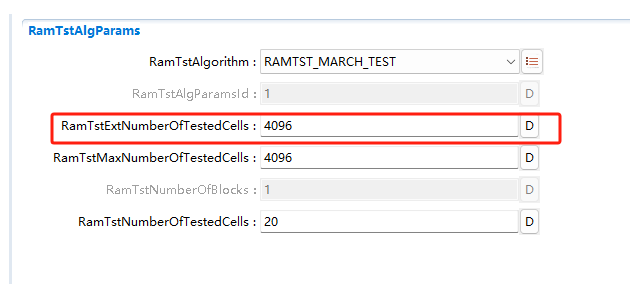

   图 5-14 RamTstExtNumberOfTestedCells配置界面

4. 配置RamTstMaxNumberOfTestedCells。

**RamTstMaxNumberOfTestedCells：**\ 可以测试的单元格数的最大值。

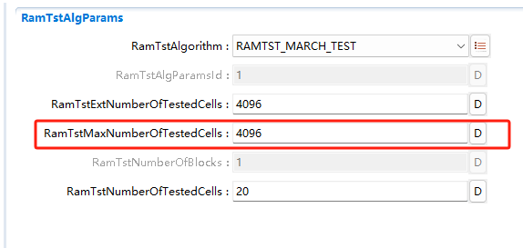

   图 5-15 RamTstMaxNumberOfTestedCells配置界面

5. 配置RamTstNumberOfTestedCells。

**RamTstNumberOfTestedCells：**\ 每次测试时所测试的字节数大小，只能为4的倍数。可以在程序中调用API修改。

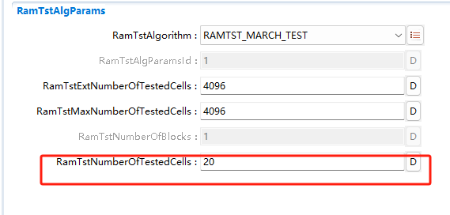

   图 5-16 RamTstNumberOfTestedCells配置界面

测试块配置
~~~~~~~~~~

前台测试测试块配置
^^^^^^^^^^^^^^^^^^

#. 新加测试块添加步骤为：鼠标选中RamTstBlockParams—单击右键—New—RamTstBlockParams

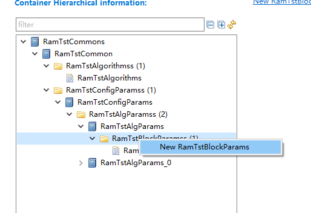

   图 5-17 RamTstBlockParams添加

2. 双击RamTstBlockParams模块，打开RamTstBlockParams模块配置界面。

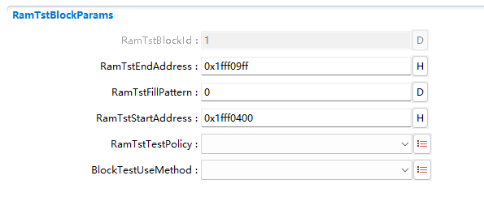

   图 5-18 RamTstBlockParams配置界面

3. 配置RamTstEndAddress；

   **RamTstEndAddress：**\ 该RAM块的结束地址。此处填写目标块结束地址0x1ffff09ff。

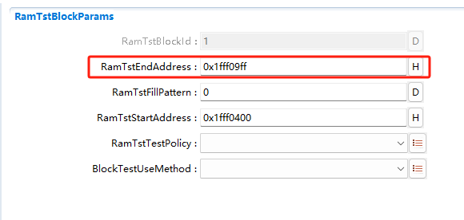

   图 5-19 RamTstEndAddress配置界面

4. 配置RamTstStartAddress；

   **RamTstStartAddress：**\ 该RAM块的起始地址。此处填写目标块起始地址0x1ffff0400。

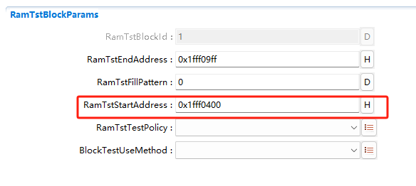

   图 5-20 RamTstStartAddress配置界面

5. 配置RamTstFillPattern；

   **RamTstFillPattern**\ ：进行破坏性的测试时，测试结束后，填入RAM的
   填充值。此处填写0。

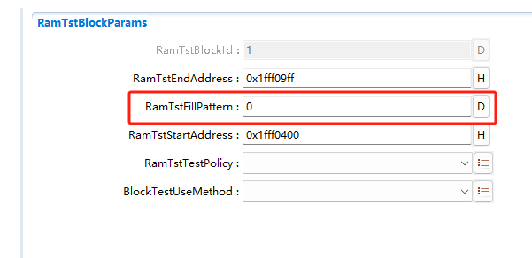

   图 5-21 RamTstFillPattern配置界面

6. 配置RamTstTestPolicy；

   **RamTstTestPolicy：**\ 该RAM块的测试策略，破坏性还是非破坏性。此
   处配置为非破坏性（RAMTEST_NON_DESTRUCTIVE）。

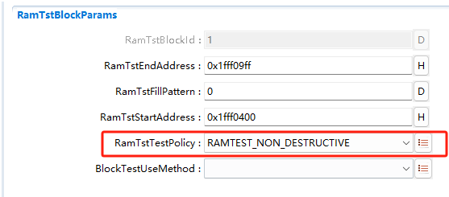

   图 5-22 RamTstTestPolicy配置界面

7. 配置BlockTestUseMethod；

   **BlockTestUseMethod：**\ 该RAM块所使用的测试方法，前台测试还是后
   台测试等。此处配置为前台测试（BLOCK_TEST_USED_METHOD_FO REGROUN D）。

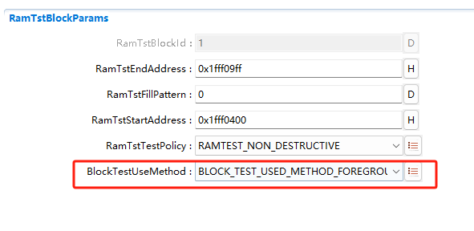

   图 5-23 BlockTestUseMethod配置界面

后台测试测试块配置
^^^^^^^^^^^^^^^^^^

#. 新加测试块添加步骤为：鼠标选中RamTstBlockParams—单击右键—New—RamTstBlockParams

   图 5-24 RamTstBlockParams添加

2. 双击RamTstBlockParams模块，打开RamTstBlockParams模块配置界面。

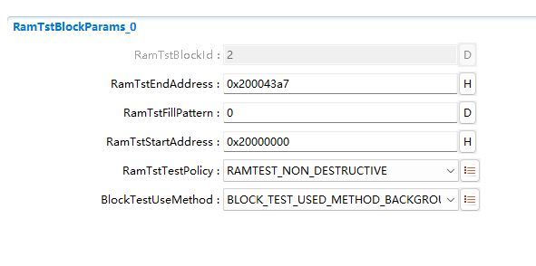

   图 5-25 RamTstBlockParams配置界面

3. 配置RamTstEndAddress；

   **RamTstEndAddress：**\ 该RAM块的结束地址。此处填写目标块结束地址
   0x200043a7。

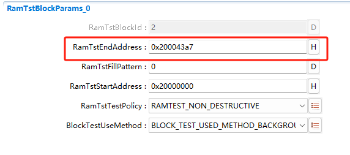

   图 5-26 RamTstEndAddress配置界面

4. 配置RamTstStartAddress；

   **RamTstStartAddress：**\ 该RAM块的起始地址。此处填写目标块起始地址0x20000000。

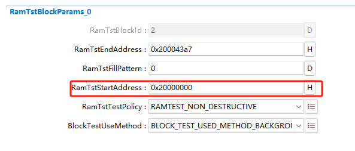

   图 5-27 RamTstStartAddress配置界面

5. 配置RamTstFillPattern；

   **RamTstFillPattern：**\ 进行破坏性的测试时，测试结束后，填入RAM的
   填充值。此处填写0。

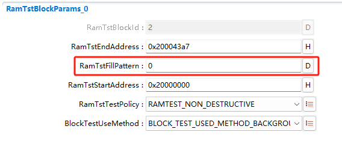

   图 5-28 RamTstFillPattern配置界面

6. 配置RamTstTestPolicy；

   **RamTstTestPolicy：**\ 该RAM块的测试策略，破坏性还是非破坏性。

   此处配置为非破坏性（RAMTEST_NON_DESTRUCTIVE）。

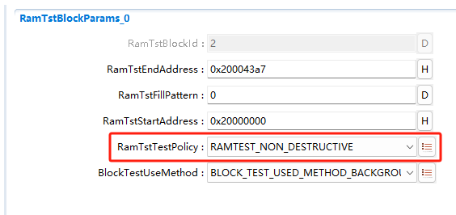

   图 5-29 RamTstTestPolicy配置界面

7. 配置BlockTestUseMethod；

   **BlockTestUseMethod：**\ 该RAM块所使用的测试方法，前台测试还是后
   台测试等。此处配置为后台测试（BLOCK_TEST_USED_METHOD_BA CKGROUND）。

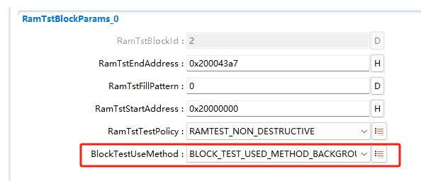

   图 5-30 BlockTestUseMethod配置界面

RamTstDemEventParameterRefs配置
~~~~~~~~~~~~~~~~~~~~~~~~~~~~~~~

#. 添加RamTstDemEventParameterRefs，鼠标选中RamTstDemEventParameterRefs—单击右键—New—RamTstDemEventParameterRefs。

.. figure:: ../../_static/集成手册/RamTest/image42.png
   :width: 4.80408in
   :height: 2.24036in

   图 5-31 RamTstDemEventParameterRefs添加

2. 双击RamTstAlgParams模块，打开RamTstAlgParams模块配置界面。

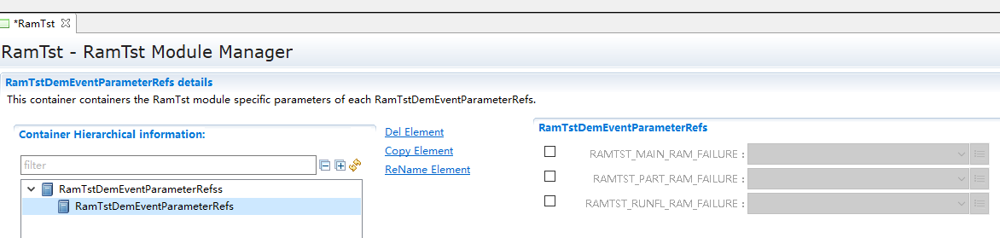

   图 5-32 RamTstDemEventParameterRefs配置界面

3. 配置RAMTST_MAIN_RAM_FAILURE，将RAMTST_MAIN_RAM_FAILURE勾选上，并从下拉框中选择对应的Dem配置项。

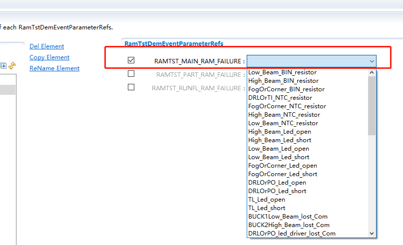

   图 5-33 RAMTST_MAIN_RAM_FAILURE配置界面

4. 配置RAMTST_PART_RAM_FAILURE，将RAMTST_PART_RAM_FAILURE勾选上，并从下拉框中选择对应的Dem配置项。

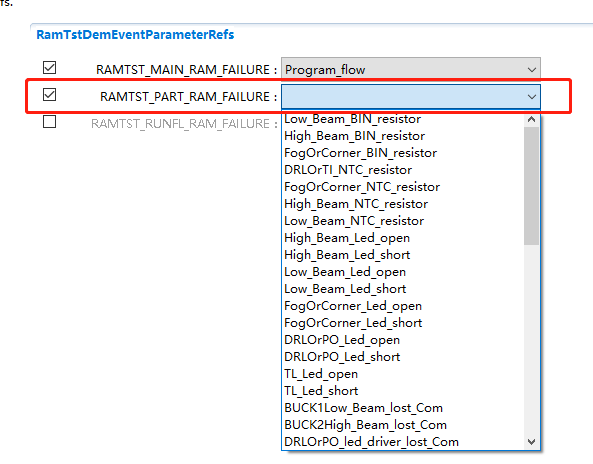

   图 5-34 RAMTST_PART_RAM_FAILURE配置界面

5. 配置RAMTST_RUNFL_RAM_FAILURE，将RAMTST_RUNFL_RAM_FAILURE勾选上，并从下拉框中选择对应的Dem配置项。

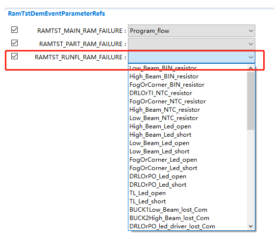

   图 5-35 RAMTST_RUNFL_RAM_FAILURE配置界面

源代码集成
----------

项目交付给用户的工程结构如下：

.. figure:: ../../_static/集成手册/RamTest/image47.png
   :width: 3.03346in
   :height: 3.22767in

   图 5-36 工程结构图

-  Config目录，这个目录用来存放配置工具生成的配置文件，RamTest有关的配置文件放在BSW_Config文件夹中。

-  BSW目录，存放模块相关的源代码。可以看到BSW目录下各个文件夹下是各个模块的源代码。

RamTest源代码集成步骤如下：

#. 将5.2章节中ORIENTAIS
   Configurator生成的配置文件复制到BSW_Config文件夹中。

#. 将项目提供的协议栈源代码文件复制到BSW/Memory/RamTst文件夹中。

在集成时，需要在链接文件里面将RAM进行分区规划。划分为存放RamTst模块本地变量区域、暂存RAM安全区域、被测RAM区域。将RAMTEST自身数据放在RamTst模块本地变量区域，和被测区域分开。并将栈区（OS启动之前自身的堆栈）与其他区域分开。如下图所示：

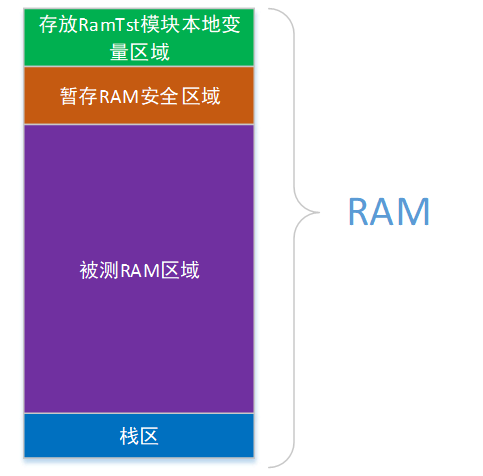

   图 5-37 Ram区域划分图

用户须确保各分配的RAM区域不会被其他变量使用。

链接文件修改如下所示：

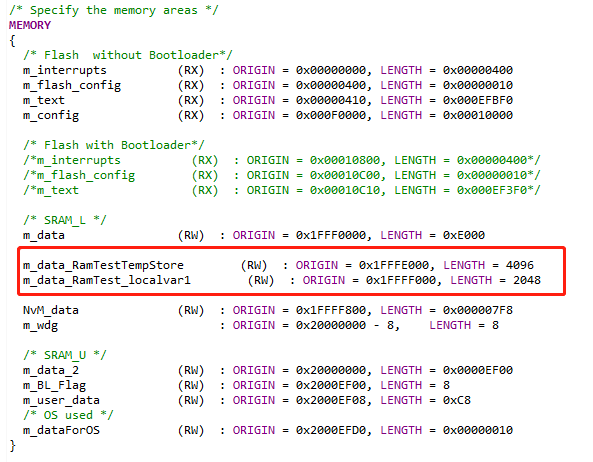

   图 5-38 Ram区域划分图

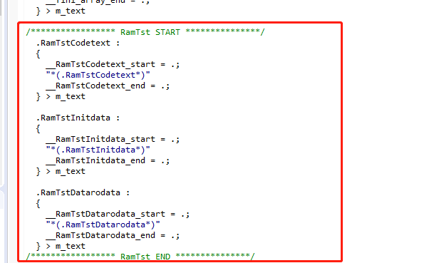

   图 5-39 RamTst使用的变量放到RAM区域

同时，需要在MemMap.h文件里面启用内存管理，如下所示：

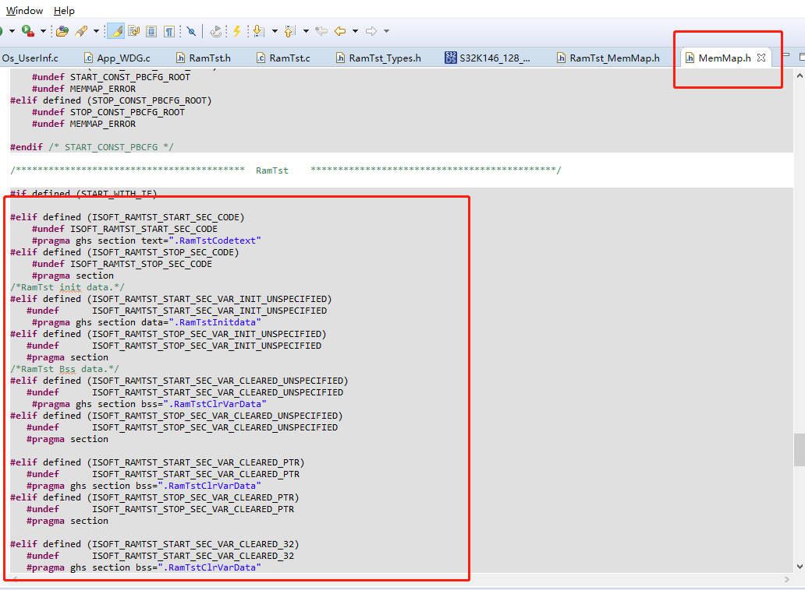

   图 5-40 MemMap使用

RamTest调度集成
---------------

RamTest调度集成步骤如下：

#. RamTest调度集成，需要逐一排查并实现所罗列的问题，以避免集成出现差错。

#. 编译链接代码，将生成的elf文件烧写进芯片。

初始化和前台测试代码如下。

**注意 :
本示例中，CanTsyn协议栈初始化的代码和启动通信的代码置于EcuM_Callout_Stubs.c文件，并不代表其他项目同样适用于将其置于EcuM_Callout_Stubs.c文件中。**

**#include** "Fls.h"

RamTest协议栈相关模块头文件

**#include** "RamTst.h"

**TASK(EcuM_AL_DriverInitOne)**

{

RamTst_Init(&RamTstConfigRoot);

RamTst_RunFullTest();

RamTst_TestResultType RamTstResult = RamTst_GetTestResult();

}

验证结果
--------

验证前台测试
~~~~~~~~~~~~

将工程编译通过后，使用调试工具进行调试，当执行RamTst_RunFullTest()后，再调用RamTst_GetTestResult()获取结果，编译下载仿真时，在获取结果后打断点，可以看见返回测试结果为OK。

验证后台测试
~~~~~~~~~~~~

将工程编译通过后，使用调试工具进行调试，周期调用RamTst_MainFunction()，编译下载仿真时，当后台测试完成时，会调用RamTst_TestCompletedNotification()回调函数，在回调函数里面再调用RamTst_GetTestResult()获取结果，可以看见返回测试结果为OK。

.. |image1| image:: ../../_static/集成手册/RamTest/image3.png
   :width: 4.25764in
   :height: 4.05556in
