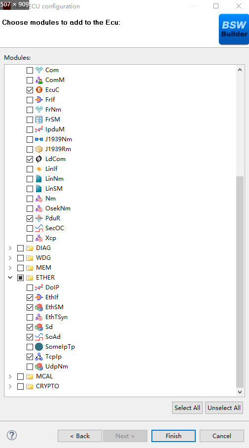
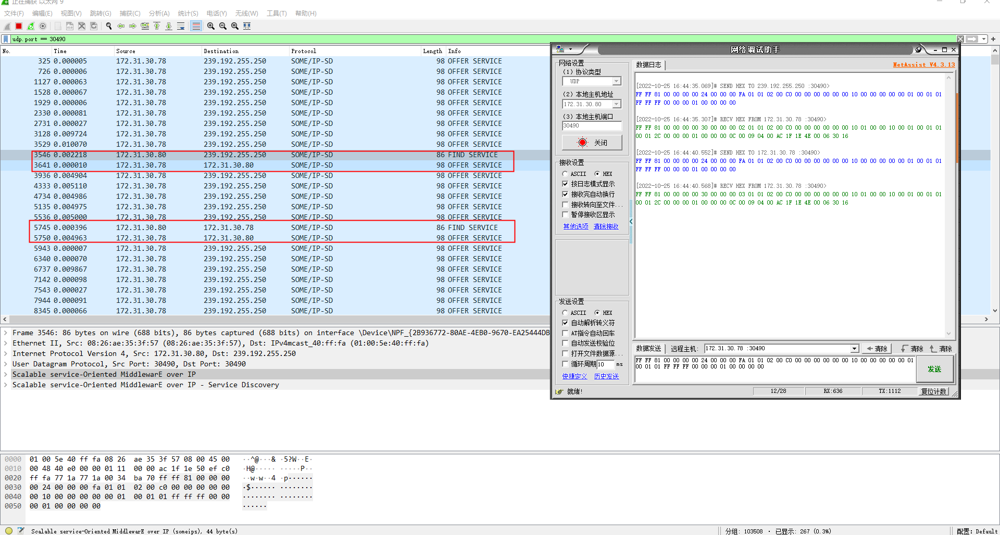

===================
SOMEIP_集成手册
===================

**文档控制**

+----------+--------+------+---------+-------------------------------+
| 日期     | 作者   | 版本 | 状态    | 说明                          |
+==========+========+======+=========+===============================+
| 20       | 吴挺伟 | V0.1 | 【      | 初版                          |
| 22/10/26 |        |      | 初稿】  |                               |
+----------+--------+------+---------+-------------------------------+
| 2        | 吴挺伟 | V0.2 | 【      | 修改Sd、                      |
| 023/2/15 |        |      | 修改】  | SomeIpTp、SomeIpXf参考文件名  |
+----------+--------+------+---------+-------------------------------+
| 2        | 陈伯奇 | V1.0 | 【      | 1.更新4.2.1参考手册名称名称修 |
| 024/7/16 |        |      | 发布】  | 改2.修改4.3.1参考章节引用错误 |
|          |        |      |         | 3.4.1章节第7步增加截图        |
|          |        |      |         | 4.删除5.3章节第3步            |
|          |        |      |         | “添加调度文件，点击应用保存。 |
|          |        |      |         | 5.5.4章                       |
|          |        |      |         | 节main函数中代码修改为ComM_C  |
|          |        |      |         | hComAllow(ComMUser_ETH,TRUE); |
|          |        |      |         | 6.修改截图                    |
+----------+--------+------+---------+-------------------------------+

目的
====

本文档旨在通过一个SOMEIP示例工程的配置，向用户展示SOMEIP的集成过程。

通过阅读本文档，用户可以了解ORIENTAIS配置工具的配置过程，以及如何应用配置工具生成的配置文件。

为了让用户更清晰的了解工具的使用，所用的配置均逐一手动完成。用户在了解了配置的基本过程后，可以快速完成配置。

缩写词和术语
============

.. table:: 表 2‑1 缩写词和术语

   +------------+---------------------------------------------------------+
   | **缩写     | **描述**                                                |
   | 词/术语**  |                                                         |
   +------------+---------------------------------------------------------+
   | SoAd       | Socket Adapter 将socket的数据和PDU进行转换              |
   +------------+---------------------------------------------------------+
   | Sd         | Service Discovery 服务发现模块                          |
   +------------+---------------------------------------------------------+
   | SOMEIP     | Scalable service-Oriented MiddlewarE over IP            |
   |            | 可扩展的面向服务的IP中间件                              |
   +------------+---------------------------------------------------------+
   | RTE        | Runtime Enviroment 虚拟运行唤醒                         |
   +------------+---------------------------------------------------------+
   | SWC        | Software Component 软件组件                             |
   +------------+---------------------------------------------------------+

参考文档
========

[1] 参考手册_Sd.pdf

[2] 参考手册_SomeIpTp.pdf

[3] 参考手册_SomeIpXf.pdf

协议栈集成
==========

新建ORIENTAIS工程
-----------------

①安装软件后，双击软件图标打开软件

.. figure:: ../../_static/集成手册/SOMEIP/image1.png
   :width: 5.77153in
   :height: 2.62847in

   图 4‑1 新建工程-1

②菜单栏File🡪New🡪Project，新建工程

.. figure:: ../../_static/集成手册/SOMEIP/image2.png
   :width: 5.77153in
   :height: 4.21042in

   图 4‑2 新建工程-2

③在弹出的新建窗口中选择Autosar下的 [BSW Project]，选择Next

.. figure:: ../../_static/集成手册/SOMEIP/image3.png
   :width: 5.29167in
   :height: 5.05208in

   图 4‑3 新建工程-3

④在弹出的窗口中输入工程名，选择Finish

.. figure:: ../../_static/集成手册/SOMEIP/image4.png
   :width: 5.77153in
   :height: 4.80833in

   图 4‑4 新建工程-4

⑤在弹出的窗口中选择Yes。

   图 4‑5 新建工程-5

⑥在工程的[Bsw_Builder]项目上右键，选择New ECU Configuration

.. figure:: ../../_static/集成手册/SOMEIP/image6.png
   :width: 4.14583in
   :height: 2.82431in

   图 4‑6 新建工程-6

⑦在弹出的窗口中输入一个ECU名，然后选择Next

.. figure:: ../../_static/集成手册/SOMEIP/image7.png
   :width: 5.25073in
   :height: 5.05279in

   图 4‑7 新建工程-7

⑧在弹出的窗口中勾选需要添加的模块，点击Finish。

   图 4‑8 新建工程-8

⑨新建完成的工程如下所示，步骤7中添加的模块已经被加入到工程中。

.. figure:: ../../_static/集成手册/SOMEIP/image9.png
   :width: 2.86458in
   :height: 4.36458in

   图 4‑9 新建工程-9

配置文件生成
------------

模块配置
~~~~~~~~

模块的具体配置，取决于具体的项目需求。SOMEIP各模块配置项的详细介绍，参见《参考手册_Sd.pdf》、《参考手册_SomeIpTp.pdf》、《参考手册_SomeIpXf.pdf》。

配置代码生成
~~~~~~~~~~~~

①在工程上右键会弹出校验整个工程和生成整个工程所有模块配置文件的菜单。

②首先选择Validate All，没有错误提示信息即校验通过。

.. figure:: ../../_static/集成手册/SOMEIP/image10.png
   :width: 3.66718in
   :height: 4.96944in

   图 4‑10 配置代码的生成-1

③然后选择Generate
All，生成配置文件。右下角的输出框中会输出生成的配置文件信息。

.. figure:: ../../_static/集成手册/SOMEIP/image11.png
   :width: 5.42911in
   :height: 2.07601in

   图 4‑11 配置代码的生成-2

④在工程Config文件夹下即可查看生成的配置文件。

.. figure:: ../../_static/集成手册/SOMEIP/image12.png
   :width: 2.84375in
   :height: 5.4375in

   图 4‑12 配置代码的生成-3

功能集成
--------

代码集成
~~~~~~~~

协议栈代码包括两部分：项目提供的协议栈源码和ORIENTAIS
Configurator配置生成代码。SOMEIP集成包括SOMEIP源码（SD、SomeipXf）。

用户须将协议栈源码和章节4.2.2生成的配置源代码添加到集成开发工具的对应文件夹。协议栈集成的文件结构，见章节5.3。

**注意：协议栈集成之前，用户须确保已经有基础工程，以及以太网通信协议栈已集成，且本协议栈相关的其他协议栈能正常工作。**

集成注意事项
~~~~~~~~~~~~

对于集成过程中，协议栈特殊要求和用户经常出现的问题，归类总结形成下表4-1。用户需逐一排查表中的约束项，以避免集成问题出现。

表4-1 SOMEIP集成约束清单

+-----+---------+-----------------------------------------------------+
| *   | *       | **约束限制**                                        |
| *编 | *类别** |                                                     |
| 号  |         |                                                     |
| **  |         |                                                     |
+-----+---------+-----------------------------------------------------+
| **  | 堆栈    | 用户需确保为任务堆栈和中断堆栈分配足够的堆栈空间。  |
| 1** |         |                                                     |
+-----+---------+-----------------------------------------------------+
| **  | 头文件  | -  添加协议                                         |
| 2** |         | 栈代码之后，用户需更新集成开发工具中的头文件路径。  |
|     |         |                                                     |
|     |         | -  调用协议栈API的源文件，需要包含协议栈的头文件。  |
+-----+---------+-----------------------------------------------------+
| **  | 初始化  | SOMEIP协议栈的初始化顺序为：EthIf_Init, TcpIp_Init, |
| 3** |         | SoAd_Init，SomeIpXf_Init，Sd_Init。                 |
+-----+---------+-----------------------------------------------------+
| **  | 周      | EthSM_Ma                                            |
| 4** | 期函数  | inFunction,EthIf_MainFunctionState,Sd_MainFunction, |
|     |         | ComM_MainFu                                         |
|     |         | nction\_<ComMChannel_ETH>需要被周期性任务函数调用。 |
+-----+---------+-----------------------------------------------------+

配置过程
========

集成目标
--------

本手册会以以下参数作为示例，进行集成演示。

.. table:: 表 5‑1 配置参数

   +---------------+------------------------------------------------------+
   | **参数**      | **值**                                               |
   +---------------+------------------------------------------------------+
   | SdServerSe    | SdServerServiceId：0x1                               |
   | rvice实例参数 |                                                      |
   |               | SdServerServiceInstanceId：0x1                       |
   |               |                                                      |
   |               | SdServerServiceMajorVersion：1                       |
   |               |                                                      |
   |               | SdServerServiceMinorVersion：1                       |
   +---------------+------------------------------------------------------+
   | SdServer      | SdServerTimerInitialOfferDelayMax：0.1               |
   | Timer时间参数 |                                                      |
   |               | SdServerTimerInitialOfferDelayMin：0.0               |
   |               |                                                      |
   |               | SdServerTimerInitialOfferRepetitionBaseDelay：0.03   |
   |               |                                                      |
   |               | SdServerTimerInitialOfferRepetitionsMax：3           |
   |               |                                                      |
   |               | SdServerTimerOfferCyclicDelay：1.0                   |
   |               |                                                      |
   |               | SdServerTimerRequestResponseMaxDelay：0.5            |
   |               |                                                      |
   |               | SdServerTimerRequestResponseMinDelay：0.0            |
   |               |                                                      |
   |               | SdServerTimerTTL：300                                |
   +---------------+------------------------------------------------------+
   | Socket信息    | Sd单播本地：172.31.30.78/ UDP/30490                  |
   |               |                                                      |
   |               | Sd多播本地：239.192.255.250/ UDP/30490               |
   |               |                                                      |
   |               | AddMethod本地：172.31.30.78/ TCP/12310               |
   |               |                                                      |
   |               | AddMethod远端：172.31.30.80/ TCP/0（端口号为通配符） |
   +---------------+------------------------------------------------------+
   | 序列化参数    | 加法运算请求参数：                                   |
   |               |                                                      |
   |               | typedef struct                                       |
   |               |                                                      |
   |               | {                                                    |
   |               |                                                      |
   |               |     uint16 number_a;                                 |
   |               |                                                      |
   |               |     uint16 number_b;                                 |
   |               |                                                      |
   |               | } AddMethodReq;                                      |
   |               |                                                      |
   |               | 加法运算结果参数：                                   |
   |               |                                                      |
   |               | typedef uint32 AddMethodResp;                        |
   +---------------+------------------------------------------------------+

.. _模块配置-1:

模块配置
--------

EcuC模块配置
~~~~~~~~~~~~

①双击EcuC模块，打开EcuC模块配置界面。

②在EcucConfigSets栏目上右键新建 EcucConfigSet。

③再在EcucPduCollections上右键新建EcucPduCollection。配置PduIdTypeEnum为UINT16，PduLengthTypeEnum为UINT32。

.. figure:: ../../_static/集成手册/SOMEIP/image13.png
   :width: 5.77153in
   :height: 2.82431in

   图 5‑1 EcuC 模块配置-1

④在EcucPduCollection上右键，选择Pdu，生成一个Pdu的配置界面。

.. figure:: ../../_static/集成手册/SOMEIP/image14.png
   :width: 5.77153in
   :height: 2.82083in

   图 5‑2 EcuC 模块配置-2

⑤配置4个PDU用于加法运算服务的收发，pdu长度为500，
SoAd_SdInstance0_AddMethodReq、LdCom_SdInstance0_AddMethodReq、SoAd_SdInstance0_AddMethodResp、LdCom_SdInstance0_AddMethodResp；

   配置3个PDU用于用于SD模块的单/多播收发，pdu长度1400，
   SdInstance0_Unicast_Rx、SdInstance0_Multicast_Rx、SdInstance0_Tx。

.. figure:: ../../_static/集成手册/SOMEIP/image15.png
   :width: 5.77153in
   :height: 3.23611in

   图 5‑3 EcuC 模块配置-3

⑥ECUC模块配置完成，在模块上右键，选择校验。

.. figure:: ../../_static/集成手册/SOMEIP/image16.png
   :width: 4.78125in
   :height: 2.125in

   图 5‑4 EcuC 模块配置-4

⑦查看校验窗口，校验提示窗口没有错误信息，即校验通过。

.. figure:: ../../_static/集成手册/SOMEIP/image17.png
   :width: 2.70833in
   :height: 1.32292in

   图 5‑5 EcuC 模块配置-5

Tcpip模块配置
~~~~~~~~~~~~~

①在TcpIp模块添加Sd模块使用的多播地址239.192.255.250。

.. figure:: ../../_static/集成手册/SOMEIP/image18.png
   :width: 5.77153in
   :height: 3.44722in

   图 5‑6 Tcpip模块配置-1

.. figure:: ../../_static/集成手册/SOMEIP/image19.png
   :width: 5.77153in
   :height: 3.40347in

   图 5‑7 Tcpip模块配置-2

.. figure:: ../../_static/集成手册/SOMEIP/image20.png
   :width: 5.77153in
   :height: 3.45139in

   图 5‑8 Tcpip模块配置-3

②按照步骤1配置SD模块单播地址172.31.30.78.

③校验后提示窗口没有错误信息，即校验通过。

SoAd模块配置
~~~~~~~~~~~~

①配置SoAdGeneral，配置调度周期0.005S，Socket最大个数4和SocketGroup的最大个数10。

.. figure:: ../../_static/集成手册/SOMEIP/image21.png
   :width: 5.77153in
   :height: 3.21042in

   图 5‑9 SoAd模块配置-1

②配置SoAdBswModules，本例中需关联SD和PDUR，所以新建两个模块并配置SoAdBswModuleRef关联对应模块。

   图 5‑10 SoAd 模块配置-2

③配置SoAdSocketGroup，Sd和AddMethod Server各配置一个

.. figure:: ../../_static/集成手册/SOMEIP/image23.png
   :width: 5.77153in
   :height: 2.14444in

   图 5‑11 SoAd 模块配置-3

.. figure:: ../../_static/集成手册/SOMEIP/image24.png
   :width: 5.77153in
   :height: 2.13125in

   图 5‑12 SoAd 模块配置-4

④配置SoAdSocketConnectionGroup；Sd采用多播/单播收发，需要配置2个Socket，分别用于单播发送/多播发送/单播接收和多播接收；AddMethod
Server是TCP Server，需要配置一个Socket。

其中单播收发的Socket配置如下：

.. figure:: ../../_static/集成手册/SOMEIP/image25.png
   :width: 5.77153in
   :height: 3.03542in

   图 5‑13 SoAd 模块配置-5

.. figure:: ../../_static/集成手册/SOMEIP/image26.png
   :width: 5.77153in
   :height: 3.0625in

   图 5‑14 SoAd 模块配置-6

.. figure:: ../../_static/集成手册/SOMEIP/image27.png
   :width: 5.77153in
   :height: 3.04514in

   图 5‑15 SoAd 模块配置-7

多播的Socket配置如下：

.. figure:: ../../_static/集成手册/SOMEIP/image28.png
   :width: 5.77153in
   :height: 3.00694in

   图 5‑16 SoAd 模块配置-8

.. figure:: ../../_static/集成手册/SOMEIP/image29.png
   :width: 5.77153in
   :height: 3.07708in

   图 5‑17 SoAd 模块配置-9

.. figure:: ../../_static/集成手册/SOMEIP/image30.png
   :width: 5.77153in
   :height: 3.04514in

   图 5‑18 SoAd 模块配置-10

AddMethod Server的配置如下：

.. figure:: ../../_static/集成手册/SOMEIP/image31.png
   :width: 5.77153in
   :height: 3.01944in

   图 5‑19 SoAd 模块配置-11

.. figure:: ../../_static/集成手册/SOMEIP/image32.png
   :width: 5.77153in
   :height: 3.06736in

   图 5‑20 SoAd 模块配置-12

.. figure:: ../../_static/集成手册/SOMEIP/image33.png
   :width: 5.77153in
   :height: 3.01181in

   图 5‑21 SoAd 模块配置-13

①配置SoAdPduRoute，即报文发送。

.. figure:: ../../_static/集成手册/SOMEIP/image34.png
   :width: 5.77153in
   :height: 3.04792in

   图 5‑22 SoAd 模块配置-14

.. figure:: ../../_static/集成手册/SOMEIP/image35.png
   :width: 5.77153in
   :height: 3.03958in

   图 5‑23 SoAd 模块配置-15

.. figure:: ../../_static/集成手册/SOMEIP/image36.png
   :width: 5.77153in
   :height: 3.04583in

   图 5‑24 SoAd 模块配置-16

.. figure:: ../../_static/集成手册/SOMEIP/image37.png
   :width: 5.77153in
   :height: 3.02847in

   图 5‑25 SoAd 模块配置-17

②配置SoAdSocketRoute，即报文接收。

.. figure:: ../../_static/集成手册/SOMEIP/image38.png
   :width: 5.77153in
   :height: 3.05139in

   图 5‑26 SoAd 模块配置-18

.. figure:: ../../_static/集成手册/SOMEIP/image39.png
   :width: 5.77153in
   :height: 3.02847in

   图 5‑27 SoAd 模块配置-19

.. figure:: ../../_static/集成手册/SOMEIP/image40.png
   :width: 5.77153in
   :height: 3.03472in

   图 5‑28 SoAd 模块配置-20

.. figure:: ../../_static/集成手册/SOMEIP/image41.png
   :width: 5.77153in
   :height: 3.25972in

   图 5‑29 SoAd 模块配置-21

.. figure:: ../../_static/集成手册/SOMEIP/image42.png
   :width: 5.77153in
   :height: 3.02847in

   图 5‑30 SoAd 模块配置-22

.. figure:: ../../_static/集成手册/SOMEIP/image43.png
   :width: 5.77153in
   :height: 3.01875in

   图 5‑31 SoAd 模块配置-23

③校验后提示窗口没有错误信息，即校验通过。

Sd模块配置
~~~~~~~~~~

①SdGeneral页面配置

.. figure:: ../../_static/集成手册/SOMEIP/image44.png
   :width: 5.77153in
   :height: 3.27639in

   图 5‑32 Sd模块配置-1

②配置SdConfig。

③新建一个SdInstance, SdAddrFamily选择TCPIP_AF_INET。

.. figure:: ../../_static/集成手册/SOMEIP/image45.png
   :width: 5.77153in
   :height: 3.27014in

   图 5‑33 Sd模块配置-2

④配置Sd的Pdu，一个多播接收Pdu，一个发送Pdu，一个单播接收Pdu。

.. figure:: ../../_static/集成手册/SOMEIP/image46.png
   :width: 5.77153in
   :height: 3.30278in

   图 5‑34 Sd模块配置-3

.. figure:: ../../_static/集成手册/SOMEIP/image47.png
   :width: 5.77153in
   :height: 3.31667in

   图 5‑35 Sd模块配置-4

.. figure:: ../../_static/集成手册/SOMEIP/image48.png
   :width: 5.77153in
   :height: 3.31944in

   图 5‑36 Sd模块配置-5

⑤右键新建一个SdServerTimer，并配置。

.. figure:: ../../_static/集成手册/SOMEIP/image49.png
   :width: 5.77153in
   :height: 3.275in

   图 5‑37 Sd模块配置-6

⑥右键新建一个SdSeverService，并配置。

.. figure:: ../../_static/集成手册/SOMEIP/image50.png
   :width: 5.77153in
   :height: 3.25208in

   图 5‑38 Sd模块配置-7

⑦新建一个SdProvidedMethod，并配置。

.. figure:: ../../_static/集成手册/SOMEIP/image51.png
   :width: 5.77153in
   :height: 3.32639in

   图 5‑39 Sd模块配置-8

⑧校验后提示窗口没有错误信息，即校验通过。

Ldcom模块配置
~~~~~~~~~~~~~

①打开LdcomGeneral，配置Ldcom使用的回调函数声明头文件。

.. figure:: ../../_static/集成手册/SOMEIP/image52.png
   :width: 5.57292in
   :height: 4.01042in

   图 5‑40 Ldcom模块配置-1

②打开LdcomConfig，配置AddMethod Server报文的收发。

.. figure:: ../../_static/集成手册/SOMEIP/image53.png
   :width: 5.77153in
   :height: 3.23958in

   图 5‑41 Ldcom模块配置-2

.. figure:: ../../_static/集成手册/SOMEIP/image54.png
   :width: 5.77153in
   :height: 3.24722in

   图 5‑42 Ldcom模块配置-3

③校验后提示窗口没有错误信息，即校验通过。

PduR模块配置
~~~~~~~~~~~~

①PduRGemeral页面保持默认配置，不用修改。

②打开PduRBswModeles，新建并配置PduRBswModules_LdCom、PduRBswModules_SoAd。

.. figure:: ../../_static/集成手册/SOMEIP/image55.png
   :width: 5.77153in
   :height: 3.3125in

   图 5‑43 PduR模块配置-1

.. figure:: ../../_static/集成手册/SOMEIP/image56.png
   :width: 5.77153in
   :height: 3.29931in

   图 5‑44 PduR模块配置-2

③打开PduRRoutingTables，并新建PduRRoutingTable，配置AddrMethod
Server报文的收发路由。

.. figure:: ../../_static/集成手册/SOMEIP/image57.png
   :width: 5.77153in
   :height: 3.29375in

   图 5‑45 PduR模块配置-3

.. figure:: ../../_static/集成手册/SOMEIP/image58.png
   :width: 5.77153in
   :height: 3.27014in

   图 5‑46 PduR模块配置-4

.. figure:: ../../_static/集成手册/SOMEIP/image59.png
   :width: 5.77153in
   :height: 3.31389in

   图 5‑47 PduR模块配置-5

.. figure:: ../../_static/集成手册/SOMEIP/image60.png
   :width: 5.77153in
   :height: 3.25903in

   图 5‑48 PduR模块配置-6

④校验后提示窗口没有错误信息，即校验通过。

Xfrm模块配置
~~~~~~~~~~~~

①新建DataTypeDescription，并配置序列化使用的参数类型和结构体。

.. figure:: ../../_static/集成手册/SOMEIP/image61.png
   :width: 5.77153in
   :height: 3.26528in

   图 5‑49 Xfrm模块配置-1

.. figure:: ../../_static/集成手册/SOMEIP/image62.png
   :width: 5.77153in
   :height: 3.25903in

   图 5‑50 Xfrm模块配置-2

.. figure:: ../../_static/集成手册/SOMEIP/image63.png
   :width: 5.77153in
   :height: 3.30069in

   图 5‑51 Xfrm模块配置-3

.. figure:: ../../_static/集成手册/SOMEIP/image64.png
   :width: 5.77153in
   :height: 3.29722in

   图 5‑52 Xfrm模块配置-4

.. figure:: ../../_static/集成手册/SOMEIP/image65.png
   :width: 5.77153in
   :height: 3.29861in

   图 5‑53 Xfrm模块配置-5

②打开TransformationSet页面，新建并配置一个SOMEIP序列化使用的TransformationTechnology。

.. figure:: ../../_static/集成手册/SOMEIP/image66.png
   :width: 5.77153in
   :height: 3.29583in

   图 5‑54 Xfrm模块配置-6

配置序列化的HeaderLenght长度，这里配置16Byte。

.. figure:: ../../_static/集成手册/SOMEIP/image67.png
   :width: 5.77153in
   :height: 1.97014in

   图 5‑55 Xfrm模块配置-7

③新建一个SOMEIPTransformationDescription，配置序列化的字节对齐方式以及数据大小端类型。

.. figure:: ../../_static/集成手册/SOMEIP/image68.png
   :width: 5.77153in
   :height: 3.31667in

   图 5‑56 Xfrm模块配置-8

④打开BufferProperty，配置序列化报文HeaderLenght长度为16bits。

.. figure:: ../../_static/集成手册/SOMEIP/image69.png
   :width: 5.77153in
   :height: 3.28819in

   图 5‑57 Xfrm模块配置-9

⑤打开SomeIpXfPublic，新建并配置两个SOMEIPTransformationlSignaProp。

.. figure:: ../../_static/集成手册/SOMEIP/image70.png
   :width: 5.77153in
   :height: 3.25556in

   图 5‑58 Xfrm模块配置-10

.. figure:: ../../_static/集成手册/SOMEIP/image71.png
   :width: 5.77153in
   :height: 3.27153in

   图 5‑59 Xfrm模块配置-11

⑥新建并配置两个ClientServerInterface。

.. figure:: ../../_static/集成手册/SOMEIP/image72.png
   :width: 5.77153in
   :height: 3.31389in

   图 5‑60 Xfrm模块配置-12

.. figure:: ../../_static/集成手册/SOMEIP/image73.png
   :width: 5.77153in
   :height: 3.29375in

   图 5‑61 Xfrm模块配置-13

⑦新建并配置两个SomeIpXfConfig。

.. figure:: ../../_static/集成手册/SOMEIP/image74.png
   :width: 5.77153in
   :height: 3.31389in

   图 5‑62 Xfrm模块配置-14

.. figure:: ../../_static/集成手册/SOMEIP/image75.png
   :width: 5.77153in
   :height: 3.31042in

   图 5‑63 Xfrm模块配置-15

⑧在TransformationSet页面，新建并配置两个Transformations，以生成对应的序列化/反序列化函数。

.. figure:: ../../_static/集成手册/SOMEIP/image76.png
   :width: 5.77153in
   :height: 3.33125in

   图 5‑64 Xfrm模块配置-16

.. figure:: ../../_static/集成手册/SOMEIP/image77.png
   :width: 5.77153in
   :height: 3.30486in

   图 5‑65 Xfrm模块配置-17

⑨校验后提示窗口没有错误信息，即校验通过。

源码集成
--------

项目交付给用户的工程结构如下：

.. figure:: ../../_static/集成手册/SOMEIP/image78.png
   :width: 2.5in
   :height: 2.60417in

   图 5‑66 源码集成

①Config目录，这个目录用来存放基础软件配置工具生成的配置文件，SOMEIP有关的配置文件放在该文件夹中。

②模块相关的静态源代码，存放在各个模块的文件夹下。

调度集成
--------

①将4.2章节生成的配置文件复制到Config文件夹中。

②添加初始化函数和周期调用函数。

**注意 :
本示例中，**\ SOMEIP\ **初始化的代码和启动通信的代码置于main.c文件，并不代表其他项目同样适用于将其置于main.c文件中。**

#include "Timer.h"

#include "Led.h"

#include "Mcal_User.h"

#include "UserTimer.h"

#include "Dio.h"

#include "ComM.h"

#include "ComM_Internal.h"

#include "Can.h"

#include "E2EXf.h"

#include "CanNm.h"

#include "ComM.h"

#include "ComM_Internal.h"

#include "EthIf.h"

#include "EthSM.h"

#include "TcpIp.h"

#include "SoAd.h"

#include "LdCom.h"

#include "TestCase.h"

#include "Wdg.h"

#include "WdgM.h"

#include "Mcu.h"

#include "ringbuf.h"

#include "Sd.h"

#include "SomeIpXf.h"

int main(void)

{

    eth_ringbuf_init(&g_EthRingBufManager, &g_EthRxPduBuf, ARRAR_SIZE(g_EthRxPduBuf));

McalUser_Init();

    PduR_Init(&PduR_PBConfigData);

    ComM_Init(&ComM_Config);

    

    EthIf_Init(&EthIf_ConfigData);

    EthSM_Init();

    TcpIp_Init(&TcpIp_Config);

    SoAd_Init(&SoAd_Config);

    LdCom_Init(&LdCom_InitCfgSet);

    SomeIpXf_Init(&SomeIpXf_Config);

    Sd_Init(&Sd_Config);

 

    ComM_ChComAllow(ComMUser_ETH,TRUE);

    ComM_RequestComMode(ComMUser_Eth, COMM_FULL_COMMUNICATION);

    

    while (1)

    {    

        if (UserTimer_GetFlag1ms())

        {

            EthSM_MainFunction();

            UserTimer_ClrFlag1ms();

        }

        if (UserTimer_GetFlag2ms())

        {

            EthIf_MainFunctionState();

            UserTimer_ClrFlag2ms();

   }

        if (UserTimer_GetFlag5ms())

        {

            ethif_read_buf();

            

            

            TcpIp_MainFunction();

            SoAd_MainFunction();

            ComM_MainFunction(ComMUser_Eth);

            UserTimer_ClrFlag5ms();

        }

        if (UserTimer_GetFlag10ms())

        {

           TestCase_Send_EthPdu();

           Sd_MainFunction();

           

           UserTimer_ClrFlag10ms();

        }

    }

}

SomeIpXf相关的代码示例需要在LdCom添加函数实现：

#include "SomeIpXf.h"

/\*实现一个加法运算服务*/

void LdComRxInd_SdInstance0_AddMethodReq(const PduInfoType\* PduInfoPtr)

{

    if ((NULL_PTR != PduInfoPtr) && (NULL_PTR != PduInfoPtr->SduDataPtr))

    {

        AddMethodReq request;

        Rte_Cs_TransactionHandleType TransactionHandle;

        if (E_OK == SomeIpXf_Inv_AddMethodReq(&TransactionHandle, PduInfoPtr->SduDataPtr, PduInfoPtr->SduLength, &request))

        {

            uint8 data[128];

            uint32 sum = request.number_a + request.number_b;

            uint16 length = 0;

       **    ** if (E_OK == SomeIpXf_AddMethodResp(&TransactionHandle, data, &length, &sum))

            {

                PduInfoType pdu;

                pdu.SduLength = length;

                pdu.SduDataPtr = data;

                pdu.MetaDataPtr = NULL_PTR;

                LdCom_Transmit(SdInstance0_AddMethodResp, &pdu);

            }

        }

    }

}

void LdComTxConf_SdInstance0_AddMethodResp(void)

{

    

}

验证结果
--------

①使用wireshark监控Offer Service正常多播发送，符合集成目标。

.. figure:: ../../_static/集成手册/SOMEIP/image79.png
   :width: 5.77153in
   :height: 3.10139in

   图 5‑67 验证结果-1

②使用调试助手，发送多播/单播 Find Service报文，都可以接收到单播的Offer
Service报文，控制器返回正确，符合预期目标。

   图 5‑68 验证结果-2

③使用调试助手，连接AddMthod
TCPserver，发送加法运算请求报文，控制器返回正确运算结果，符合预期目标。

   图 5‑69 验证结果-3
