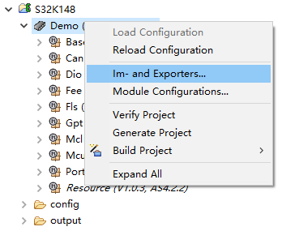
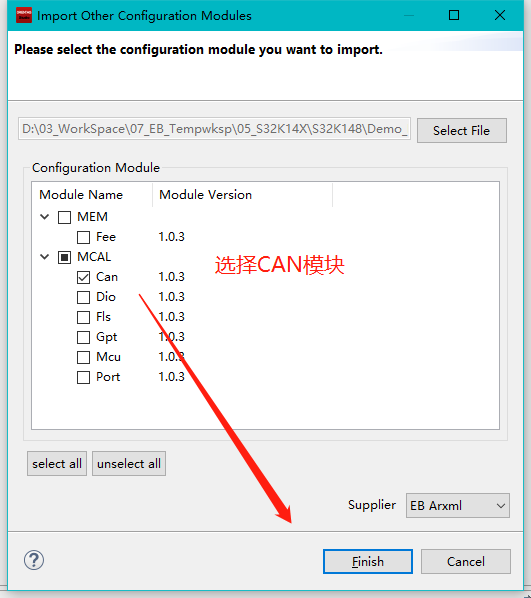
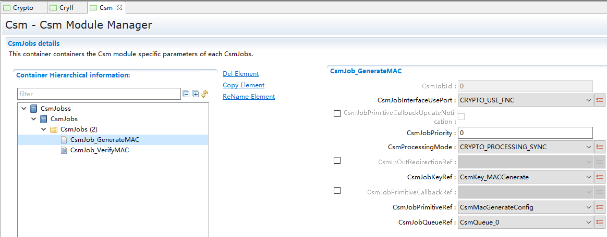

===================
SecOC_集成手册
===================

目标
====

本集成手册用于指导用户进行SecOC模块集成，文档主要包括的内容为：SecOC模块集成指导、基于示例应用的集成讲解。

由于各项目的需求不同，集成示例不会针对于特定的商业项目做详细讲解。

缩写词和术语
============

.. table:: 表格 2‑1

   +---------------+------------------------------------------------------+
   | **            | **描述**                                             |
   | 缩写词/术语** |                                                      |
   +---------------+------------------------------------------------------+
   | SecOC         | Security On board Communication安全板载通信          |
   +---------------+------------------------------------------------------+
   | MCAL          | Microcontroller Abstraction Layer微控制器抽象层      |
   +---------------+------------------------------------------------------+
   | CryIf         | Crypto Interface Crypto接口                          |
   +---------------+------------------------------------------------------+
   | Csm           | Crypto ServiceManager Crypto服务管理                 |
   +---------------+------------------------------------------------------+
   | MAC           | Message Authentication Code消息认证码                |
   +---------------+------------------------------------------------------+

参考文档
========

[1]《参考手册_CryIf.pdf》

[2]《参考手册_CSM.pdf》

[3]《参考手册_Crypto.pdf》

[4]《参考手册_SecOC.pdf》

SecOC集成
=========

项目交付的内容为：SecOC源码和ORIENTAIS Configurator配置工具。

SecOC相关配置模块的功能介绍，参见表4‑1 SecOC相关配置模块介绍。

使用SecOC源码和配置工具，进行SecOC的集成的步骤，参见表4‑2
SecOC集成的步骤。

.. table:: 表4‑1 SecOC相关配置模块介绍

   +---------+------------------------------------------------------------+
   | **模    | **功能**                                                   |
   | 块名**  |                                                            |
   +---------+------------------------------------------------------------+
   | Can     | 提供SecOC所需要的邮箱                                      |
   +---------+------------------------------------------------------------+
   | CANIf   | CANIf模块主要处理上层模块与底层驱动的之间                  |
   |         | PDU的传递，为上层模块提供统一的接口来管理不同的CAN硬件模块 |
   +---------+------------------------------------------------------------+
   | EcuC    | 用于辅助配置工具完成配置的模块。主                         |
   |         | 要提供PDU的定义，其它模块通过关联EcuC中PDU，相互关联起来。 |
   +---------+------------------------------------------------------------+
   | PduR    | PDU Router主要为通讯接口模块（CANIf）、传输协议模块（CAN   |
   |         | TP、J1939                                                  |
   |         | TP）、诊断通讯管理模块（DCM、J1939DCM）以及通讯模块（C     |
   |         | OM、LDCOM）以及IPDUM、SECOC等模块提供基于I-PDU的路由服务。 |
   +---------+------------------------------------------------------------+
   | Com     | COM模块主要提供I-PDU和信号相关管理功能                     |
   +---------+------------------------------------------------------------+
   | Crypto  | 为SecOC提供底层加密驱动程序                                |
   +---------+------------------------------------------------------------+
   | Csm     | Csm模块为Crypto进行抽象并为上层提供标准化接口              |
   +---------+------------------------------------------------------------+
   | SecOC   | SecOC模块主要管理参与信息安全收发的PDU及相关属性           |
   +---------+------------------------------------------------------------+

.. table:: 表4‑2 SecOC集成的步骤

   +-----+-------------------------------+-------------------------------+
   | *   | **操作**                      | **说明**                      |
   | *步 |                               |                               |
   | 骤  |                               |                               |
   | **  |                               |                               |
   +-----+-------------------------------+-------------------------------+
   | 1   | ORIENTAIS                     | 若配置工具已经搭建，则仅需    |
   |     | Configurator配置工            | 进行SecOC相关模块的加载操作。 |
   |     | 具工程搭建和SecOC相关模块加载 |                               |
   +-----+-------------------------------+-------------------------------+
   | 2   | 模块配置及配置文件生成        | NA                            |
   +-----+-------------------------------+-------------------------------+
   | 3   | 代码集成                      | 现有工程、SecOC相关模块       |
   |     |                               | 源代码和配置生成文件的集成。  |
   +-----+-------------------------------+-------------------------------+
   | 4   | 验证测试                      | NA                            |
   +-----+-------------------------------+-------------------------------+

**注意：SecOC模块集成之前，用户须确保已经有基础工程。**

新建ORIENTAIS Configurator配置工程及模块加载
--------------------------------------------

#. 安装ORIENTAIS Configurator软件后，双击软件图标打开软件。

|image1|

图4-1 新建工程-1

2. 菜单栏File🡪New🡪Project，新建工程。

|image2|

图4-2 新建工程-2

3. 在弹出的新建窗口中选择Autosar下的 [BSW Project]，选择Next。

..

   |image3|

图4-3 新建工程-3

4. 在弹出的窗口中输入工程名，选择Finish。

..

   |image4|

图4-4 新建工程-4

5. 在弹出的窗口中选择Yes。

|image5|

图4-5 新建工程-5

6. 选择[Bsw_Builder]，右键单击，选择New ECU Configuration。

|image6|

图4-6 新建工程-6

7. 在弹出的窗口中输入ECU名，然后选择Next。

|image7|

图4-7 新建工程-7

8. 在弹出的窗口中勾选需添加的模块，点击Finish。

|image8|

图4-8 新建工程-8

9. 新建工程如下所示，上一步添加的模块已经被加入到工程中。

|图形用户界面 描述已自动生成|

图4-9 新建工程-9

10. MCAL配置导入，BSW模块需要依赖MCAL生成的CAN模块

    a) 从MCAL配置工具生成arxml

..

   |图形用户界面 中度可信度描述已自动生成|

   图4-10 新建工程-10

|图形用户界面, 文本, 应用程序, 电子邮件 描述已自动生成|

   图4-11 新建工程-11

b) 导入BSW工具

|图形用户界面, 文本, 应用程序 描述已自动生成|

   图4-12 新建工程-12

|image9|

   图4-13 新建工程-13

|图形用户界面, 文本 描述已自动生成|

   图4-14 新建工程-14

模块配置及生成代码
------------------

该章节主要介绍SecOC模块的配置参数，列举配置项在配置界面显示的名称、可能的取值、默认的取值、参数描述及依赖关系，旨在指导用户如何使用配置工具进行SecOC模块参数的配置。

目标：配置一组报文进行SecOC的正常收发

.. table:: 表 4-3配置目标

   +---------+---------+---------+------------+------------+------------+
   | 类型    | CANID   | Date    | 新鲜度长度 | MAC值长度  | SecOCID    |
   +---------+---------+---------+------------+------------+------------+
   | TX      | 0x350   | 8Bytes  | 2Bytes     | 6Bytes     | 2Bytes     |
   +---------+---------+---------+------------+------------+------------+
   | RX      | 0x351   | 8Bytes  | 2Bytes     | 6Bytes     | 2Bytes     |
   +---------+---------+---------+------------+------------+------------+

表格名词解析如下表介绍

.. table:: 表 4-4属性描述

   +-----------+----------------------------------------------------------+
   | UI名称    | 该配置项在配置工具界面显示的名称                         |
   +-----------+----------------------------------------------------------+
   | 取值范围  | 该配置项允许的取值区间                                   |
   +-----------+----------------------------------------------------------+
   | 默认取值  | 该配置项默认的配置值                                     |
   +-----------+----------------------------------------------------------+
   | 参数描述  | 该配置项在标准的AUTOSAR_EcucParamDef.arxml文件中的描述   |
   +-----------+----------------------------------------------------------+
   | 依赖关系  | 该配置项与其他模块或配置项的关系                         |
   +-----------+----------------------------------------------------------+

Ecuc配置
--------

一帧SecOC报文对应于四组ECUC和PDUR的两组路由组，分别对应于CANIf和COM使用。

 EcucConfigSet
~~~~~~~~~~~~~~

如表
4-3配置目标，示例中使用CANFD，数据整体长度是16Bytes（此长度不包含SecOCID）。

配置Ecuc包含的发送、接收信息

COM -> SecOC_Authentic_Tx -> SecOC_Secured_Tx -> SecOC_Tx

SecOC_Rx -> SecOC_Secured_Rx -> SecOC_Authentic_Rx -> COM

|image10|

图4-15 EcucConfigSet

#. 配置COM发送、接收信息:

..

   COM_SECOC_DEMO_TX_350/COM_SECOC_DEMO_RX_351，长度为8

2. 配置CANIf的发送、接收信息：

..

   SECOC_DEMO_TX_350/SECOC_DEMO_RX_351，长度为16

3. 配置SecOC的加密、真实的发送、接收信息：

..

   SecOC_Authentic_Tx/ SecOC_Authentic_Rx，长度为8

   SecOC_Secured_Tx/SecOC_Secured/Rx，长度为16

CanIf的配置
-----------

 CanIfRx
~~~~~~~~

CanIf主要是对报文属性的定义，包含了CANID和DLC以及帧类型等重要数据。

|image11|

图4-16 CanIfInitCfgRX配置

#. 配置接收报文的ID 0x351这个信息和底层的邮箱信息相匹配。

#. 配置帧类型是STANDARD_FD_CAN。

#. DLC的长度，接收数据为16字节。

填写接收报文的ID，确定数据帧的类型以及数据长度，选择此数据的PDUHrH，以及CanIfRxPduRef。

表4-5 CanIfRx界面配置说明

+-------------+---------+--------------------+----------+------------+
| **UI名称**  | *       |                    |          |            |
|             | *描述** |                    |          |            |
+-------------+---------+--------------------+----------+------------+
| **CanIfR    | 取      | 0-0x7FF            | 默认取值 | 0x00       |
| xPduCanId** | 值范围  |                    |          |            |
+-------------+---------+--------------------+----------+------------+
|             | 参      | 报文的ID           |          |            |
|             | 数描述  |                    |          |            |
+-------------+---------+--------------------+----------+------------+
|             | 依      | 无                 |          |            |
|             | 赖关系  |                    |          |            |
+-------------+---------+--------------------+----------+------------+
| *           | 取      | 无                 | 默认取值 | ST         |
| *CanIfRxPdu | 值范围  |                    |          | ABDARD_CAN |
| CanIdType** |         |                    |          |            |
+-------------+---------+--------------------+----------+------------+
|             | 参      | 帧类型             |          |            |
|             | 数描述  |                    |          |            |
+-------------+---------+--------------------+----------+------------+
|             | 依      | 无                 |          |            |
|             | 赖关系  |                    |          |            |
+-------------+---------+--------------------+----------+------------+
| **CanI      | 取      | 0-32               | 默认取值 | 8          |
| fRxPduDlc** | 值范围  |                    |          |            |
+-------------+---------+--------------------+----------+------------+
|             | 参      | 报文长度           |          |            |
|             | 数描述  |                    |          |            |
+-------------+---------+--------------------+----------+------------+
|             | 依      | 无                 |          |            |
|             | 赖关系  |                    |          |            |
+-------------+---------+--------------------+----------+------------+
| **CanIfRxP  | 取      | 无                 | 默认取值 | PDUR       |
| duUserRxInd | 值范围  |                    |          |            |
| icationUL** |         |                    |          |            |
+-------------+---------+--------------------+----------+------------+
|             | 参      | 接收               |          |            |
|             | 数描述  | 报文所属的规范类型 |          |            |
+-------------+---------+--------------------+----------+------------+
|             | 依      | 无                 |          |            |
|             | 赖关系  |                    |          |            |
+-------------+---------+--------------------+----------+------------+
| **CanIfRxPd | 取      | 无                 | 默认取值 | HRH        |
| uHrhIdRef** | 值范围  |                    |          |            |
+-------------+---------+--------------------+----------+------------+
|             | 参      | Rx                 |          |            |
|             | 数描述  | L-PDU所属的        |          |            |
|             |         | HRH通过该参数引用  |          |            |
+-------------+---------+--------------------+----------+------------+
|             | 依      | 无                 |          |            |
|             | 赖关系  |                    |          |            |
+-------------+---------+--------------------+----------+------------+
| **CanI      | 取      | 无                 | 默认取值 | -          |
| fRxPduRef** | 值范围  |                    |          |            |
+-------------+---------+--------------------+----------+------------+
|             | 参      | 引用“全局”P        |          |            |
|             | 数描述  | du结构，以允许协调 |          |            |
|             |         | com堆栈中的句柄id  |          |            |
+-------------+---------+--------------------+----------+------------+
|             | 依      | 无                 |          |            |
|             | 赖关系  |                    |          |            |
+-------------+---------+--------------------+----------+------------+

 CanIfTx
~~~~~~~~

|image12|

图4‑17 CanIfInitCfgTX配置

#. 配置发送报文的ID 0x350这个信息和底层的邮箱信息相匹配。

#. 配置帧类型STANDARD_FD_CAN。。

填写发送报文的ID，确定数据帧的类型，选择此数据的PDUHrH，以及CanIfTxPduRef。

表4-6 CanIfTx界面配置说明

+-------------+---------+--------------------+----------+------------+
| **UI名称**  | *       |                    |          |            |
|             | *描述** |                    |          |            |
+-------------+---------+--------------------+----------+------------+
| **CanIf     | 取      | 0-0x7FF            | 默认取值 | 0x00       |
| TxPduType** | 值范围  |                    |          |            |
+-------------+---------+--------------------+----------+------------+
|             | 参      | 报文的ID           |          |            |
|             | 数描述  |                    |          |            |
+-------------+---------+--------------------+----------+------------+
|             | 依      | 无                 |          |            |
|             | 赖关系  |                    |          |            |
+-------------+---------+--------------------+----------+------------+
| *           | 取      | 无                 | 默认取值 | ST         |
| *CanIfTxPdu | 值范围  |                    |          | ABDARD_CAN |
| CanIdType** |         |                    |          |            |
+-------------+---------+--------------------+----------+------------+
|             | 参      | 帧类型             |          |            |
|             | 数描述  |                    |          |            |
+-------------+---------+--------------------+----------+------------+
|             | 依      | 无                 |          |            |
|             | 赖关系  |                    |          |            |
+-------------+---------+--------------------+----------+------------+
| **CanIf     | 取      | 无                 | 默认取值 | STATIC     |
| TxPduType** | 值范围  |                    |          |            |
+-------------+---------+--------------------+----------+------------+
|             | 参      | 是否可以更改CANID  |          |            |
|             | 数描述  |                    |          |            |
+-------------+---------+--------------------+----------+------------+
|             | 依      | 无                 |          |            |
|             | 赖关系  |                    |          |            |
+-------------+---------+--------------------+----------+------------+
| **CanIfTxP  | 取      | 无                 | 默认取值 | PDUR       |
| duUserRxInd | 值范围  |                    |          |            |
| icationUL** |         |                    |          |            |
+-------------+---------+--------------------+----------+------------+
|             | 参      | 接收               |          |            |
|             | 数描述  | 报文所属的规范类型 |          |            |
+-------------+---------+--------------------+----------+------------+
|             | 依      | 无                 |          |            |
|             | 赖关系  |                    |          |            |
+-------------+---------+--------------------+----------+------------+
| *           | 取      | 无                 | 默认取值 | -          |
| *CanIfTxPdu | 值范围  |                    |          |            |
| BufferRef** |         |                    |          |            |
+-------------+---------+--------------------+----------+------------+
|             | 参      | 对CanIf缓冲        |          |            |
|             | 数描述  | 区配置的可配置引用 |          |            |
+-------------+---------+--------------------+----------+------------+
|             | 依      | 无                 |          |            |
|             | 赖关系  |                    |          |            |
+-------------+---------+--------------------+----------+------------+
| **CanI      | 取      | 无                 | 默认取值 | -          |
| fTxPduRef** | 值范围  |                    |          |            |
+-------------+---------+--------------------+----------+------------+
|             | 参      | 引用“全局”P        |          |            |
|             | 数描述  | DU结构，以允许协调 |          |            |
|             |         | com堆栈中的句柄id  |          |            |
+-------------+---------+--------------------+----------+------------+
|             | 依      | 无                 |          |            |
|             | 赖关系  |                    |          |            |
+-------------+---------+--------------------+----------+------------+

PDUR
----

 PduRBswModules
~~~~~~~~~~~~~~~

|图形用户界面, 应用程序 描述已自动生成|

图4‑18 PduRBswModules配置

#. 打开发送确认(PduRTxConfirmation)。

#. Module引用SecOC模块。

此界面包含函数接口的宏开关以及PDU路由器模块应使用传输协议接口指定的API参数。PduRBswModuleRef需要在添加SecOC模块之后才可出现选择项。

表4-7 PduRBswModules界面配置说明

+-------------+---------+--------------------+----------+------------+
| **UI名称**  | *       |                    |          |            |
|             | *描述** |                    |          |            |
+-------------+---------+--------------------+----------+------------+
| **PduRCance | 取      | True / False       | 默认取值 | False      |
| lTransmit** | 值范围  |                    |          |            |
+-------------+---------+--------------------+----------+------------+
|             | 参      | 取                 |          |            |
|             | 数描述  | 消发送函数的宏开关 |          |            |
+-------------+---------+--------------------+----------+------------+
|             | 依      | 无                 |          |            |
|             | 赖关系  |                    |          |            |
+-------------+---------+--------------------+----------+------------+
| **PduRTxCon | 取      | True / False       | 默认取值 | False      |
| firmation** | 值范围  |                    |          |            |
+-------------+---------+--------------------+----------+------------+
|             | 参      | 发                 |          |            |
|             | 数描述  | 送确认函数的宏开关 |          |            |
+-------------+---------+--------------------+----------+------------+
|             | 依      | 无                 |          |            |
|             | 赖关系  |                    |          |            |
+-------------+---------+--------------------+----------+------------+
| **PduRBsw   | 取      | 无                 | 默认取值 | 无         |
| ModuleRef** | 值范围  |                    |          |            |
+-------------+---------+--------------------+----------+------------+
|             | 参      | 这是对一个         |          |            |
|             | 数描述  | BSW模块配置的引用  |          |            |
+-------------+---------+--------------------+----------+------------+
|             | 依      | 无                 |          |            |
|             | 赖关系  |                    |          |            |
+-------------+---------+--------------------+----------+------------+

 PduRRoutingTables
~~~~~~~~~~~~~~~~~~

在界面配置路由表，包含在ECUC里面配置的句柄信息以及数据流向，本文档中在此只关注SecOC报文。

|image13|

图4-19 路由表配置

如上述的4.3章节里面已经描述SecOC配置的ECUC的分组信息，在此配置发送是两组，接收是两组，分别在CanIf和COM里面进行传输，普通报文仅只有COM和CanIf两者之间传输而已，并不包含SecOC的附加信息。

发送路由表
^^^^^^^^^^

发送的数据信息的传输如下图所示：

|image14|

图4-20 发送数据流

分析路由表的配置以下：

一、真实数据发送PduR组

源发送数据（此数据和下面的数据为一组，在COM往下发的时候传输使用，和安全的数据不一样，此为真实数据组8Bytes）。

|image15|

图4-21 COM发送数据流Src

#. 启动传输需要打开，否则无法传输。

#. 目的PDU参考为COM来的PDU，选择COM_SECOC_DEMO_Tx_0x350

发送的时候数据从COM源发送真实数据到真实数据配置的ECUC

PduRSrcPdus -> PduRDestPdus

表4-8 PduRSrcPdus界面配置说明TxCom

+-------------+---------+--------------------+----------+------------+
| **UI名称**  | *       |                    |          |            |
|             | *描述** |                    |          |            |
+-------------+---------+--------------------+----------+------------+
| **PduRSrcPd | 取      | True / False       | 默认取值 | True       |
| uUpTxConf** | 值范围  |                    |          |            |
+-------------+---------+--------------------+----------+------------+
|             | 参      | 启动传输           |          |            |
|             | 数描述  |                    |          |            |
+-------------+---------+--------------------+----------+------------+
|             | 依      | 无                 |          |            |
|             | 赖关系  |                    |          |            |
+-------------+---------+--------------------+----------+------------+
| **PduR      | 取      | 无                 | 默认取值 | 无         |
| SrcPduRef** | 值范围  |                    |          |            |
+-------------+---------+--------------------+----------+------------+
|             | 参      | 源PDU参            |          |            |
|             | 数描述  | 考;引用唯一的PDU标 |          |            |
|             |         | 识符，应使用用于请 |          |            |
|             |         | 求的PDU路由器操作  |          |            |
+-------------+---------+--------------------+----------+------------+
|             | 依      | 无                 |          |            |
|             | 赖关系  |                    |          |            |
+-------------+---------+--------------------+----------+------------+

目的发送数据（此数据和上面的数据为一组8Bytes）

|image16|

图4-22 COM发送数据流Dest

#. 选择数据的传输方式为直接传输。

#. 此路由和TP无关报文走的是If，不需勾选PduRTpThreshold。

#. 目的PDU参考为真实PDU，选择SecOC_Authentic_Tx

表4-9 PduRSrcPdus界面配置说明TxCom

+-------------+---------+--------------------+----------+------------+
| **UI名称**  | *       |                    |          |            |
|             | *描述** |                    |          |            |
+-------------+---------+--------------------+----------+------------+
| **PduR      | 取      | 无                 | 默认取值 | 无         |
| DestPduData | 值范围  |                    |          |            |
| Provision** |         |                    |          |            |
+-------------+---------+--------------------+----------+------------+
|             | 参      | 指定如何提供数     |          |            |
|             | 数描述  | 据:direct(作为传输 |          |            |
|             |         | 调用的一部分)或via |          |            |
+-------------+---------+--------------------+----------+------------+
|             | 依      | 无                 |          |            |
|             | 赖关系  |                    |          |            |
+-------------+---------+--------------------+----------+------------+
| **PduRTp    | 取      | 0…255              | 默认取值 | 0          |
| Threshold** | 值范围  |                    |          |            |
+-------------+---------+--------------------+----------+------------+
|             | 参      | 此参               |          |            |
|             | 数描述  | 数仅与TP路由相关。 |          |            |
+-------------+---------+--------------------+----------+------------+
|             | 依      | 无                 |          |            |
|             | 赖关系  |                    |          |            |
+-------------+---------+--------------------+----------+------------+
| **PduRTran  | 取      | True / False       | 默认取值 | True       |
| smissionCon | 值范围  |                    |          |            |
| firmation** |         |                    |          |            |
+-------------+---------+--------------------+----------+------------+
|             | 参      | 此参数仅           |          |            |
|             | 数描述  | 用于通信接口。传输 |          |            |
|             |         | 协议模块将始终调用 |          |            |
|             |         | TxConfirmation函数 |          |            |
+-------------+---------+--------------------+----------+------------+
|             | 依      | 无                 |          |            |
|             | 赖关系  |                    |          |            |
+-------------+---------+--------------------+----------+------------+
| **PduRD     | 取      | 无                 | 默认取值 | SecOC_Aut  |
| estPduRef** | 值范围  |                    |          | hentic_Tx0 |
+-------------+---------+--------------------+----------+------------+
|             | 参      | 目的地PD           |          |            |
|             | 数描述  | U参考;当调用目标模 |          |            |
|             |         | 块的相关函数时，由 |          |            |
|             |         | PDU路由器引用唯一  |          |            |
|             |         | 的PDU标识符应使用  |          |            |
|             |         | 而不是源PDU标识符  |          |            |
+-------------+---------+--------------------+----------+------------+
|             | 依      | 无                 |          |            |
|             | 赖关系  |                    |          |            |
+-------------+---------+--------------------+----------+------------+

二、安全数据PduR组

SecOC_Secured_Tx -> CANIF_SECOC_DEMO_Tx_0x350为PduR的数据流向

安全PduR源目的的数据如下：

源发送数据（此数据和下面的数据为一组，在CanIf往外发的时候传输使用，和真实的数据不一样，此为安全数据组16Bytes）。

|image17|

图4-23 CanIf发送数据流Src

#. 启动传输需要打开，否则无法传输。

#. PDU参考为安全的PDU，选择SecOC_Secured_Tx

表4-10 PduRSrcPdus界面配置说明TxCanIf

+-------------+---------+--------------------+----------+------------+
| **UI名称**  | *       |                    |          |            |
|             | *描述** |                    |          |            |
+-------------+---------+--------------------+----------+------------+
| **PduRSrcPd | 取      | True / False       | 默认取值 | True       |
| uUpTxConf** | 值范围  |                    |          |            |
+-------------+---------+--------------------+----------+------------+
|             | 参      | 启动传输           |          |            |
|             | 数描述  |                    |          |            |
+-------------+---------+--------------------+----------+------------+
|             | 依      | 无                 |          |            |
|             | 赖关系  |                    |          |            |
+-------------+---------+--------------------+----------+------------+
| **PduR      | 取      | 无                 | 默认取值 | 无         |
| SrcPduRef** | 值范围  |                    |          |            |
+-------------+---------+--------------------+----------+------------+
|             | 参      | 源PDU参            |          |            |
|             | 数描述  | 考;引用唯一的PDU标 |          |            |
|             |         | 识符，应使用用于请 |          |            |
|             |         | 求的PDU路由器操作  |          |            |
+-------------+---------+--------------------+----------+------------+
|             | 依      | 无                 |          |            |
|             | 赖关系  |                    |          |            |
+-------------+---------+--------------------+----------+------------+

安全PduR目的数据如下：

目的发送数据（此数据和上面的数据为一组16Bytes）

|image18|

图4-24 CanIf发送数据流Dest

#. 选择数据的传输方式为直接传输。

#. 和TP无关报文走的是If，填写0.

#. 目的PDU参考为CanIf的PDU，选择CANIF_SECOC_DEMO_Tx_0x350

表4-11 PduRSrcPdus界面配置说明TxCom

+-------------+---------+--------------------+----------+------------+
| **UI名称**  | *       |                    |          |            |
|             | *描述** |                    |          |            |
+-------------+---------+--------------------+----------+------------+
| **PduR      | 取      | 无                 | 默认取值 | 无         |
| DestPduData | 值范围  |                    |          |            |
| Provision** |         |                    |          |            |
+-------------+---------+--------------------+----------+------------+
|             | 参      | 指定如何提供数     |          |            |
|             | 数描述  | 据:direct(作为传输 |          |            |
|             |         | 调用的一部分)或via |          |            |
+-------------+---------+--------------------+----------+------------+
|             | 依      | 无                 |          |            |
|             | 赖关系  |                    |          |            |
+-------------+---------+--------------------+----------+------------+
| **PduRTp    | 取      | 0…255              | 默认取值 | 0          |
| Threshold** | 值范围  |                    |          |            |
+-------------+---------+--------------------+----------+------------+
|             | 参      | 此参               |          |            |
|             | 数描述  | 数仅与TP路由相关。 |          |            |
+-------------+---------+--------------------+----------+------------+
|             | 依      | 无                 |          |            |
|             | 赖关系  |                    |          |            |
+-------------+---------+--------------------+----------+------------+
| **PduRTran  | 取      | True / False       | 默认取值 | True       |
| smissionCon | 值范围  |                    |          |            |
| firmation** |         |                    |          |            |
+-------------+---------+--------------------+----------+------------+
|             | 参      | 此参数仅           |          |            |
|             | 数描述  | 用于通信接口。传输 |          |            |
|             |         | 协议模块将始终调用 |          |            |
|             |         | TxConfirmation函数 |          |            |
+-------------+---------+--------------------+----------+------------+
|             | 依      | 无                 |          |            |
|             | 赖关系  |                    |          |            |
+-------------+---------+--------------------+----------+------------+
| **PduRD     | 取      | 无                 | 默认取值 | SecOC_Aut  |
| estPduRef** | 值范围  |                    |          | hentic_Tx0 |
+-------------+---------+--------------------+----------+------------+
|             | 参      | 目的地PD           |          |            |
|             | 数描述  | U参考;当调用目标模 |          |            |
|             |         | 块的相关函数时，由 |          |            |
|             |         | PDU路由器引用唯一  |          |            |
|             |         | 的PDU标识符应使用  |          |            |
|             |         | 而不是源PDU标识符  |          |            |
+-------------+---------+--------------------+----------+------------+
|             | 依      | 无                 |          |            |
|             | 赖关系  |                    |          |            |
+-------------+---------+--------------------+----------+------------+

注意：如果已在DBC里面配置SecOC报文，需要删除工具里生成的这一层的PduR，手动的去配置。因为目前DBC需求中没有明确信息表明是SecOC报文，所以会按照非加密报文生成通信栈里面的信息，需要按照本文档写的配置说明去手动更改配置的信息（Ecuc-CanIf-PduR-COM-SecOC的顺序配置）或者在DBC中删除多余信号。

接收路由表
^^^^^^^^^^

接收数据信息的传输如下图所示：

|image19|

图4-25 接收数据流

路由表的配置如下：

一、加密数据接收PduR组

源发送数据（此数据和下面的数据为一组，在Can接收的时候传输使用，和真实的数据不一样，此为安全数据组16Bytes）。

|image20|

图4-26 CanIf接收数据流Src

#. 启动传输需要打开，否则无法传输。

#. 源PDU参考为CanIf的PDU，选择SecOC_DEMO_Rx_0x351

表4-12 PduRSrcPdus界面配置说明RxCanIf

+-------------+---------+--------------------+----------+------------+
| **UI名称**  | *       |                    |          |            |
|             | *描述** |                    |          |            |
+-------------+---------+--------------------+----------+------------+
| **PduRSrcPd | 取      | True / False       | 默认取值 | True       |
| uUpTxConf** | 值范围  |                    |          |            |
+-------------+---------+--------------------+----------+------------+
|             | 参      | 启动传输           |          |            |
|             | 数描述  |                    |          |            |
+-------------+---------+--------------------+----------+------------+
|             | 依      | 无                 |          |            |
|             | 赖关系  |                    |          |            |
+-------------+---------+--------------------+----------+------------+
| **PduR      | 取      | 无                 | 默认取值 | 无         |
| SrcPduRef** | 值范围  |                    |          |            |
+-------------+---------+--------------------+----------+------------+
|             | 参      | 源PDU参            |          |            |
|             | 数描述  | 考;引用唯一的PDU标 |          |            |
|             |         | 识符，应使用用于请 |          |            |
|             |         | 求的PDU路由器操作  |          |            |
+-------------+---------+--------------------+----------+------------+
|             | 依      | 无                 |          |            |
|             | 赖关系  |                    |          |            |
+-------------+---------+--------------------+----------+------------+

接收时,安全数据从CanIf源接收外部的数据，路由到SecOC安全的数据配置的ECUC。

|image21|

图4-27 CanIf接收数据流Dest

#. 选择数据的传输方式为直接传输。

#. 和TP无关报文走的是If，填写0.

#. 目的PDU参考为安全的PDU，选择SecOC_Secured_Rx

表4-13 PduRSrcPdus界面配置说明RxCanIf

+-------------+---------+--------------------+----------+------------+
| **UI名称**  | *       |                    |          |            |
|             | *描述** |                    |          |            |
+-------------+---------+--------------------+----------+------------+
| **PduR      | 取      | 无                 | 默认取值 | 无         |
| DestPduData | 值范围  |                    |          |            |
| Provision** |         |                    |          |            |
+-------------+---------+--------------------+----------+------------+
|             | 参      | 指定如何提供数     |          |            |
|             | 数描述  | 据:direct(作为传输 |          |            |
|             |         | 调用的一部分)或via |          |            |
+-------------+---------+--------------------+----------+------------+
|             | 依      | 无                 |          |            |
|             | 赖关系  |                    |          |            |
+-------------+---------+--------------------+----------+------------+
| **PduRTp    | 取      | 0…255              | 默认取值 | 0          |
| Threshold** | 值范围  |                    |          |            |
+-------------+---------+--------------------+----------+------------+
|             | 参      | 此参               |          |            |
|             | 数描述  | 数仅与TP路由相关。 |          |            |
+-------------+---------+--------------------+----------+------------+
|             | 依      | 无                 |          |            |
|             | 赖关系  |                    |          |            |
+-------------+---------+--------------------+----------+------------+
| **PduRTran  | 取      | True / False       | 默认取值 | True       |
| smissionCon | 值范围  |                    |          |            |
| firmation** |         |                    |          |            |
+-------------+---------+--------------------+----------+------------+
|             | 参      | 此参数仅           |          |            |
|             | 数描述  | 用于通信接口。传输 |          |            |
|             |         | 协议模块将始终调用 |          |            |
|             |         | TxConfirmation函数 |          |            |
+-------------+---------+--------------------+----------+------------+
|             | 依      | 无                 |          |            |
|             | 赖关系  |                    |          |            |
+-------------+---------+--------------------+----------+------------+
| **PduRD     | 取      | 无                 | 默认取值 | 无         |
| estPduRef** | 值范围  |                    |          |            |
+-------------+---------+--------------------+----------+------------+
|             | 参      | 目的地PD           |          |            |
|             | 数描述  | U参考;当调用目标模 |          |            |
|             |         | 块的相关函数时，由 |          |            |
|             |         | PDU路由器引用唯一  |          |            |
|             |         | 的PDU标识符应使用  |          |            |
|             |         | 而不是源PDU标识符  |          |            |
+-------------+---------+--------------------+----------+------------+
|             | 依      | 无                 |          |            |
|             | 赖关系  |                    |          |            |
+-------------+---------+--------------------+----------+------------+

二、真实数据接收PduR组

这是PduR源目的的数据如下：

源发送数据（此数据和下面的数据为一组，在COM接收的时候传输使用，和安全的数据不一样，此为安全数据组8Bytes）。

|image22|

图4-28 COM接收数据流Src

#. 启动传输需要打开，否则无法传输。

#. 源PDU参考为真实的PDU，选择SecOC_Authentic_Rx

表4-14 PduRSrcPdus界面配置说明RxCom

+-------------+---------+--------------------+----------+------------+
| **UI名称**  | *       |                    |          |            |
|             | *描述** |                    |          |            |
+-------------+---------+--------------------+----------+------------+
| **PduRSrcPd | 取      | True / False       | 默认取值 | True       |
| uUpTxConf** | 值范围  |                    |          |            |
+-------------+---------+--------------------+----------+------------+
|             | 参      | 启动传输           |          |            |
|             | 数描述  |                    |          |            |
+-------------+---------+--------------------+----------+------------+
|             | 依      | 无                 |          |            |
|             | 赖关系  |                    |          |            |
+-------------+---------+--------------------+----------+------------+
| **PduR      | 取      | 无                 | 默认取值 | 无         |
| SrcPduRef** | 值范围  |                    |          |            |
+-------------+---------+--------------------+----------+------------+
|             | 参      | 源PDU参            |          |            |
|             | 数描述  | 考;引用唯一的PDU标 |          |            |
|             |         | 识符，应使用用于请 |          |            |
|             |         | 求的PDU路由器操作  |          |            |
+-------------+---------+--------------------+----------+------------+
|             | 依      | 无                 |          |            |
|             | 赖关系  |                    |          |            |
+-------------+---------+--------------------+----------+------------+

真实PduR目的的数据如下：

目的接收数据（此数据和上面的数据为一组8Bytes）

|image23|

图4-29 COM接收数据流Dest

#. 选择数据的传输方式为直接传输。

#. 和TP无关报文走的是If，填写0.

#. 目的PDU参考为COM的PDU，选择COM_SecOC_DEMO_Rx_0x351

表4-15 PduRDestPdus界面配置说明RxCom

+-------------+---------+--------------------+----------+------------+
| **UI名称**  | *       |                    |          |            |
|             | *描述** |                    |          |            |
+-------------+---------+--------------------+----------+------------+
| **PduR      | 取      | 无                 | 默认取值 | 无         |
| DestPduData | 值范围  |                    |          |            |
| Provision** |         |                    |          |            |
+-------------+---------+--------------------+----------+------------+
|             | 参      | 指定如何提供数     |          |            |
|             | 数描述  | 据:direct(作为传输 |          |            |
|             |         | 调用的一部分)或via |          |            |
+-------------+---------+--------------------+----------+------------+
|             | 依      | 无                 |          |            |
|             | 赖关系  |                    |          |            |
+-------------+---------+--------------------+----------+------------+
| **PduRTp    | 取      | 0…255              | 默认取值 | 0          |
| Threshold** | 值范围  |                    |          |            |
+-------------+---------+--------------------+----------+------------+
|             | 参      | 此参               |          |            |
|             | 数描述  | 数仅与TP路由相关。 |          |            |
+-------------+---------+--------------------+----------+------------+
|             | 依      | 无                 |          |            |
|             | 赖关系  |                    |          |            |
+-------------+---------+--------------------+----------+------------+
| **PduRTran  | 取      | True / False       | 默认取值 | True       |
| smissionCon | 值范围  |                    |          |            |
| firmation** |         |                    |          |            |
+-------------+---------+--------------------+----------+------------+
|             | 参      | 此参数仅           |          |            |
|             | 数描述  | 用于通信接口。传输 |          |            |
|             |         | 协议模块将始终调用 |          |            |
|             |         | TxConfirmation函数 |          |            |
+-------------+---------+--------------------+----------+------------+
|             | 依      | 无                 |          |            |
|             | 赖关系  |                    |          |            |
+-------------+---------+--------------------+----------+------------+
| **PduRD     | 取      | 无                 | 默认取值 | 无         |
| estPduRef** | 值范围  |                    |          |            |
+-------------+---------+--------------------+----------+------------+
|             | 参      | 目的地PD           |          |            |
|             | 数描述  | U参考;当调用目标模 |          |            |
|             |         | 块的相关函数时，由 |          |            |
|             |         | PDU路由器引用唯一  |          |            |
|             |         | 的PDU标识符应使用  |          |            |
|             |         | 而不是源PDU标识符  |          |            |
+-------------+---------+--------------------+----------+------------+
|             | 依      | 无                 |          |            |
|             | 赖关系  |                    |          |            |
+-------------+---------+--------------------+----------+------------+

COM
---

 DBC的配置
~~~~~~~~~~

#. TX（信号只需要定义有效数据即可，本文档采用大端法）

|image24|

图4-30 TX_DBC的定义

2. RX（信号只需要定义有效数据即可，本文档采用大端法）

|image25|

图4-31 RX_DBC的定义

   附加的信息不必要占用任何的DBC里面的信息，描述包含：新鲜度、MAC、SecOCID。

 ComConfig
~~~~~~~~~~

Tx信号的配置
^^^^^^^^^^^^

SECOC_DEMO_Tx_Data0x_IPDU_COM_SECOC_DEMO_Tx_0x350信号的定义

|image26|\ |image27|\ |image28|\ |image29|\ |image30|

图4-32 TX信号

#. 数据的起始位和位长度可以根据DBC的导入获得，或者根据大端和小端的方式来确定，本示例使用大端配置。

#. 信号类型采用：大端法。

#. 信号的初始值：此处可人为填写，也可以在测试的时候更改这个值，验证功能，示例按照图4-32所示字节填写即可。

#. 信号类型：这个很重要，后面的测试转发报文的需要信号的类型相匹配，此选项是16Bits，选择UINT16。

表4-16 ComConfig界面配置说明

+------------+----------+---------------------+----------+------------+
| UI名称     | 描述     |                     |          |            |
+------------+----------+---------------------+----------+------------+
| **ComBit   | 取值范围 | 0..4294967295       | 默认取值 | 无         |
| Position** |          |                     |          |            |
+------------+----------+---------------------+----------+------------+
|            | 参数描述 | I-PDU内的           |          |            |
|            |          | 起始位置该参数指的  |          |            |
|            |          | 是I-PDU中的位置，而 |          |            |
|            |          | 不是影子缓冲区中的  |          |            |
|            |          | 位置如果将字节序转  |          |            |
|            |          | 换配置为不透明，则  |          |            |
|            |          | 参数ComBitPosition  |          |            |
|            |          | 应定义第一个字节的b |          |            |
|            |          | it0，如小端字节顺序 |          |            |
+------------+----------+---------------------+----------+------------+
|            | 依赖关系 | 无                  |          |            |
+------------+----------+---------------------+----------+------------+
| **C        | 取值范围 | BIG_ENDIAN          | 默认取值 | 无         |
| omSignalEn |          |                     |          |            |
| dianness** |          | LITTLE_ENDIAN       |          |            |
|            |          |                     |          |            |
|            |          | OPAQUE              |          |            |
+------------+----------+---------------------+----------+------------+
|            | 参数描述 | 定义信号            |          |            |
|            |          | 网络表示的字节顺序  |          |            |
+------------+----------+---------------------+----------+------------+
|            | 依赖关系 | 无                  |          |            |
+------------+----------+---------------------+----------+------------+
| **         | 取值范围 | 与信号类型有关      | 默认取值 | 0          |
| ComSignalI |          |                     |          |            |
| nitValue** |          |                     |          |            |
+------------+----------+---------------------+----------+------------+
|            | 参数描述 | 此信号的初始值在UI  |          |            |
|            |          | NT8_N的情况下，默认 |          |            |
|            |          | 值是一个长度为ComS  |          |            |
|            |          | ignalLength的字符串 |          |            |
|            |          | ，所有字节都设置为  |          |            |
|            |          | 0x00在UINT8_DYN的情 |          |            |
|            |          | 况下，初始大小应为0 |          |            |
+------------+----------+---------------------+----------+------------+
|            | 依赖关系 | 在                  |          |            |
|            |          | UINT8_N的情况下，C  |          |            |
|            |          | omSignalInitValue的 |          |            |
|            |          | 长度必须与ComSigna  |          |            |
|            |          | lLength的长度相同。 |          |            |
+------------+----------+---------------------+----------+------------+
| **C        | 取值范围 | PENDING             | 默认取值 | PENDING    |
| omTransfer |          |                     |          |            |
| Property** |          | TRIGGERED           |          |            |
|            |          | TRIGGERED_ON_CHANGE |          |            |
|            |          |                     |          |            |
|            |          | TRIGGERED_ON_CHANGE |          |            |
|            |          | _WITHOUT_REPETITION |          |            |
|            |          |                     |          |            |
|            |          | TRIGGERED           |          |            |
|            |          | _WITHOUT_REPETITION |          |            |
+------------+----------+---------------------+----------+------------+
|            | 参数描述 | 定义对此信号的写访  |          |            |
|            |          | 问是否可以触发相应  |          |            |
|            |          | I-PDU的传输如果I-PD |          |            |
|            |          | U被触发，则还取决于 |          |            |
|            |          | 相应I-PDU的传输模式 |          |            |
+------------+----------+---------------------+----------+------------+
|            | 依赖关系 | 无                  |          |            |
+------------+----------+---------------------+----------+------------+
| **Co       | 取值范围 | 0..4294967295       | 默认取值 | 无         |
| mUpdateBit |          |                     |          |            |
| Position** |          |                     |          |            |
+------------+----------+---------------------+----------+------------+
|            | 参数描述 | 更新                |          |            |
|            |          | 位在I-PDU内的位位置 |          |            |
+------------+----------+---------------------+----------+------------+
|            | 依赖关系 | 无                  |          |            |
+------------+----------+---------------------+----------+------------+
| **ComG     | 取值范围 | 引用[ComIPdu]       | 默认取值 | 无         |
| wIPduRef** |          |                     |          |            |
+------------+----------+---------------------+----------+------------+
|            | 参数描述 | 引用Signal          |          |            |
|            |          | Gateway源           |          |            |
|            |          | 或目的地描述的I-PDU |          |            |
+------------+----------+---------------------+----------+------------+
|            | 依赖关系 | 无                  |          |            |
+------------+----------+---------------------+----------+------------+

Rx信号的配置
^^^^^^^^^^^^

SecOC_Payload_Rx00_IPDU_COM_SecOC_Rx的定义

|image31|

|image32|\ |image33|\ |image34|\ |image35|

图4-33 RX信号

#. 数据的起始位和位长度可以根据DBC的导入获得，或者根据大端和小端的方式来确定，在这里采用大端法。

#. 信号类型采用：大端法。

#. 信号的初始值：接收数据无需配置，默认即可。

#. 信号类型：这个很重要，后面的测试转发报文的需要信号的类型相匹配，此选项是16Bits，选择UINT16。

表4-17 ComConfig界面配置说明R

+------------+----------+---------------------+----------+------------+
| UI名称     | 描述     |                     |          |            |
+------------+----------+---------------------+----------+------------+
| **ComBit   | 取值范围 | 0..4294967295       | 默认取值 | 无         |
| Position** |          |                     |          |            |
+------------+----------+---------------------+----------+------------+
|            | 参数描述 | I-PDU内的           |          |            |
|            |          | 起始位置该参数指的  |          |            |
|            |          | 是I-PDU中的位置，而 |          |            |
|            |          | 不是影子缓冲区中的  |          |            |
|            |          | 位置如果将字节序转  |          |            |
|            |          | 换配置为不透明，则  |          |            |
|            |          | 参数ComBitPosition  |          |            |
|            |          | 应定义第一个字节的b |          |            |
|            |          | it0，如小端字节顺序 |          |            |
+------------+----------+---------------------+----------+------------+
|            | 依赖关系 | 无                  |          |            |
+------------+----------+---------------------+----------+------------+
| **C        | 取值范围 | BIG_ENDIAN          | 默认取值 | 无         |
| omSignalEn |          |                     |          |            |
| dianness** |          | LITTLE_ENDIAN       |          |            |
|            |          |                     |          |            |
|            |          | OPAQUE              |          |            |
+------------+----------+---------------------+----------+------------+
|            | 参数描述 | 定义信号            |          |            |
|            |          | 网络表示的字节顺序  |          |            |
+------------+----------+---------------------+----------+------------+
|            | 依赖关系 | 无                  |          |            |
+------------+----------+---------------------+----------+------------+
| **         | 取值范围 | 与信号类型有关      | 默认取值 | 0          |
| ComSignalI |          |                     |          |            |
| nitValue** |          |                     |          |            |
+------------+----------+---------------------+----------+------------+
|            | 参数描述 | 此信号的初始值在UI  |          |            |
|            |          | NT8_N的情况下，默认 |          |            |
|            |          | 值是一个长度为ComS  |          |            |
|            |          | ignalLength的字符串 |          |            |
|            |          | ，所有字节都设置为  |          |            |
|            |          | 0x00在UINT8_DYN的情 |          |            |
|            |          | 况下，初始大小应为0 |          |            |
+------------+----------+---------------------+----------+------------+
|            | 依赖关系 | 在                  |          |            |
|            |          | UINT8_N的情况下，C  |          |            |
|            |          | omSignalInitValue的 |          |            |
|            |          | 长度必须与ComSigna  |          |            |
|            |          | lLength的长度相同。 |          |            |
+------------+----------+---------------------+----------+------------+
| **C        | 取值范围 | PENDING             | 默认取值 | PENDING    |
| omTransfer |          |                     |          |            |
| Property** |          | TRIGGERED           |          |            |
|            |          | TRIGGERED_ON_CHANGE |          |            |
|            |          |                     |          |            |
|            |          | TRIGGERED_ON_CHANGE |          |            |
|            |          | _WITHOUT_REPETITION |          |            |
|            |          |                     |          |            |
|            |          | TRIGGERED           |          |            |
|            |          | _WITHOUT_REPETITION |          |            |
+------------+----------+---------------------+----------+------------+
|            | 参数描述 | 定义对此信号的写访  |          |            |
|            |          | 问是否可以触发相应  |          |            |
|            |          | I-PDU的传输如果I-PD |          |            |
|            |          | U被触发，则还取决于 |          |            |
|            |          | 相应I-PDU的传输模式 |          |            |
+------------+----------+---------------------+----------+------------+
|            | 依赖关系 | 无                  |          |            |
+------------+----------+---------------------+----------+------------+
| **Co       | 取值范围 | 0..4294967295       | 默认取值 | 无         |
| mUpdateBit |          |                     |          |            |
| Position** |          |                     |          |            |
+------------+----------+---------------------+----------+------------+
|            | 参数描述 | 更新                |          |            |
|            |          | 位在I-PDU内的位位置 |          |            |
+------------+----------+---------------------+----------+------------+
|            | 依赖关系 | 无                  |          |            |
+------------+----------+---------------------+----------+------------+
| **ComG     | 取值范围 | 引用[ComIPdu]       | 默认取值 | 无         |
| wIPduRef** |          |                     |          |            |
+------------+----------+---------------------+----------+------------+
|            | 参数描述 | 引用Signal          |          |            |
|            |          | Gateway源           |          |            |
|            |          | 或目的地描述的I-PDU |          |            |
+------------+----------+---------------------+----------+------------+
|            | 依赖关系 | 无                  |          |            |
+------------+----------+---------------------+----------+------------+

Crypto
------

CryptoDriverObjects
~~~~~~~~~~~~~~~~~~~

   设置CryptoQueueSize大小为16，选择后面设置的CryptoPrimitive.

|image36|

图4-34 Crypto设置

CryptoKeyElements
~~~~~~~~~~~~~~~~~

   添加密钥元素，后面的CryptoKeyTypes可选择此处设置的CryptoKeyElements作为密钥类型参考值。

|image37|

|image38|

图4-35 CryptoKeyElement设置

CryptoPrimitives
~~~~~~~~~~~~~~~~

   设置算法类型，此处设置为AES-CMAC算法，选择算法加密服务为MAC_GENERATE。

|image39|

图4-36 Crypto设置

CryIf
-----

 CryIfIncludes
~~~~~~~~~~~~~~

   此处主要设置CryIf需要的头文件名，不需要添加.h后缀

|image40|

图4-37 CryIf设置

 CryIfChannel
~~~~~~~~~~~~~

   选择对应的底层驱动

|image41|

图4-38 CryIf设置

 CryIfKey
~~~~~~~~~

   添加底层驱动的密钥参考值

|image42|

图4-39 CryIf设置

Csm
---

 CsmJobs
~~~~~~~~

添加密钥管理服务的任务设置

CsmJobPriority:设置任务优先级

CsmProcessingMode:设置任务处理模式，可选择同步或者异步

CsmJobKeyRef:设置参考的密钥，在后面的CsmKeys中配置

CsmJobPrimitiveRef:设置任务原型，在后面的CsmPrimitives中配置

CsmJobQueueRef:设置任务队列，在后面的CsmQueues中配置

|image43|

图4-40 Csm设置

 CsmKeys
~~~~~~~~

|image44|

图4-41 Csm设置

添加从If层设置的密钥

 CsmPrimitives
~~~~~~~~~~~~~~

设置加密原型

CsmMacGenerateAlgorithmFamily:设置加密服务的算法族

CsmMacGenerateAlgorithmKeyLength:设置MAC的长度16byte

CsmMacGenerateAlgorithmMode:设置加密算法服务

CsmMacGenerateResultLength:设置输出的MAC长度6bytes

|image45|

图4-42 Csm设置

 CsmQueues
~~~~~~~~~~

设置Csm序列大小、If层设置的参考通道

|image46|

图4-43 Csm设置

 SecOC
------

 Genernal
~~~~~~~~~

|image47|

图4-44 General

1. MainFunction所放置的周期，通常放在10ms里面，此处写0.01。

表4-18 General界面说明

+--------------+---------+--------------------+----------+------------+
| **UI名称**   | *       |                    |          |            |
|              | *描述** |                    |          |            |
+--------------+---------+--------------------+----------+------------+
| **SecOCDevE  | 取      | True / False       | 默认取值 | False      |
| rrorDetect** | 值范围  |                    |          |            |
+--------------+---------+--------------------+----------+------------+
|              | 参      | 错误检             |          |            |
|              | 数描述  | 查开关，表示是否打 |          |            |
|              |         | 开DET错误检查机制  |          |            |
+--------------+---------+--------------------+----------+------------+
|              | 依      | 无                 |          |            |
|              | 赖关系  |                    |          |            |
+--------------+---------+--------------------+----------+------------+
| **SecOCM     | 取      | 0 .. 0.255         | 默认取值 | 无         |
| ainFunctionP | 值范围  |                    |          |            |
| eriodRx/Tx** |         |                    |          |            |
+--------------+---------+--------------------+----------+------------+
|              | 参      | SecOC模块Main      |          |            |
|              | 数描述  | Function的调度周期 |          |            |
+--------------+---------+--------------------+----------+------------+
|              | 依      | 无                 |          |            |
|              | 赖关系  |                    |          |            |
+--------------+---------+--------------------+----------+------------+
|              | 依      | 无                 |          |            |
|              | 赖关系  |                    |          |            |
+--------------+---------+--------------------+----------+------------+
| **SecOCVers  | 取      | True / False       | 默认取值 | False      |
| ionInfoApi** | 值范围  |                    |          |            |
+--------------+---------+--------------------+----------+------------+
|              | 参      | 用于配置           |          |            |
|              | 数描述  | SecOC_GetVersionIn |          |            |
|              |         | fo函数接口是否可用 |          |            |
+--------------+---------+--------------------+----------+------------+
|              | 依      | 无                 |          |            |
|              | 赖关系  |                    |          |            |
+--------------+---------+--------------------+----------+------------+

 SecOCRxPduProcessing
~~~~~~~~~~~~~~~~~~~~~

|image48|

图4-45 SecOCRxPduProcessings

如上图，SecOCRxPduProcessings为SecOCRxPduProcessing对象的集合，在该对象的右键菜单中，可添加0
.. n个SecOCRxPduProcessing对象。

|image49|

图4-46 SecOCRxPduProcessing

#. SecOCAuthInfoTxLength：描述的是MAC的长度。

#. SecOCDataId ：和发送的ID需要一致，接收和发送是一组，具有唯一性。

#. SecOCFreshnessCounterSyncAttempts：新鲜度的尝试次数，也许会出现偶然新鲜度失败，可以通过多次尝试依旧接收报文。

#. SecOCFreshnessValueId：和发送的ID需要一致，接收和发送是一组，具有唯一性。

#. SecOCFreshnessValueLength：新鲜度在加密信息里所占用的长度，单位：Bits。

#. SecOCFreshnessValueTxLength：和SecOCFreshnessValueId保持一致即可。

#. SecOCVerificationStatusPropagationMode：参数用于描述从SecOC模块到SWCs的每次验证尝试状态的传播，此处包含失败通知，成功通知，和不通知，为了提高代码的效率，选择NONE。

#. SecOCRxAuthServiceConfigRef：算法选择，根据在Csm模块中配置的算法进行选择。

#. SecOCSecuredPduBuffLength：大于等于所有信息的长度即可，数组缓存SecOC报文（此例程大于16即可，单位Bytes）。

表4-19 SecOCRxPduProcessing参数说明

+--------------+---------+--------------------+----------+------------+
| **UI名称**   | *       |                    |          |            |
|              | *描述** |                    |          |            |
+--------------+---------+--------------------+----------+------------+
| *            | 取      | 0 .. 64            | 默认取值 | 0          |
| *SecOCAuthIn | 值范围  |                    |          |            |
| foTxLength** |         |                    |          |            |
+--------------+---------+--------------------+----------+------------+
|              | 参      | 定                 |          |            |
|              | 数描述  | 义了添加在Secured  |          |            |
|              |         | I-PDU后            |          |            |
|              |         | 面的Authentication |          |            |
|              |         | cod                |          |            |
|              |         | e的长度，单位为bit |          |            |
+--------------+---------+--------------------+----------+------------+
|              | 依      | 无                 |          |            |
|              | 赖关系  |                    |          |            |
+--------------+---------+--------------------+----------+------------+
| **S          | 取      | 0 .. 65535         | 默认取值 | 0          |
| ecOCDataId** | 值范围  |                    |          |            |
+--------------+---------+--------------------+----------+------------+
|              | 参      | Secured            |          |            |
|              | 数描述  | I-PDU唯一的标识符  |          |            |
+--------------+---------+--------------------+----------+------------+
|              | 依      | 无                 |          |            |
|              | 赖关系  |                    |          |            |
+--------------+---------+--------------------+----------+------------+
| *            | 取      | 0 .. 65535         | 默认取值 | 0          |
| *SecOCFreshn | 值范围  |                    |          |            |
| essCounterSy |         |                    |          |            |
| ncAttempts** |         |                    |          |            |
+--------------+---------+--------------------+----------+------------+
|              | 参      | 该参数定           |          |            |
|              | 数描述  | 义了在校验Secured  |          |            |
|              |         | I-PDU失败后，      |          |            |
|              |         | 尝试再校验的次数。 |          |            |
+--------------+---------+--------------------+----------+------------+
|              | 依      | 无                 |          |            |
|              | 赖关系  |                    |          |            |
+--------------+---------+--------------------+----------+------------+
| **SecOC      | 取      | 无                 | 默认取值 | 无         |
| FreshnessTim | 值范围  |                    |          |            |
| estampTimePe |         |                    |          |            |
| riodFactor** |         |                    |          |            |
+--------------+---------+--------------------+----------+------------+
|              | 参      | 该参数目           |          |            |
|              | 数描述  | 前不可用，不可配置 |          |            |
+--------------+---------+--------------------+----------+------------+
|              | 依      | 无                 |          |            |
|              | 赖关系  |                    |          |            |
+--------------+---------+--------------------+----------+------------+
| **Sec        | 取      | 0 .. 64            | 默认取值 | 0          |
| OCFreshnessV | 值范围  |                    |          |            |
| alueLength** |         |                    |          |            |
+--------------+---------+--------------------+----------+------------+
|              | 参      | 定义了Freshness    |          |            |
|              | 数描述  | Value的完          |          |            |
|              |         | 整长度，单位为bit  |          |            |
+--------------+---------+--------------------+----------+------------+
|              | 依      | 无                 |          |            |
|              | 赖关系  |                    |          |            |
+--------------+---------+--------------------+----------+------------+
| **SecOC      | 取      | 0 .. 64            | 默认取值 | 0          |
| FreshnessVal | 值范围  |                    |          |            |
| ueTxLength** |         |                    |          |            |
+--------------+---------+--------------------+----------+------------+
|              | 参      | 定                 |          |            |
|              | 数描述  | 义了添加在Secured  |          |            |
|              |         | I-                 |          |            |
|              |         | PDU后面的Freshness |          |            |
|              |         | Valu               |          |            |
|              |         | e的长度，单位为bit |          |            |
+--------------+---------+--------------------+----------+------------+
|              | 依      | 无                 |          |            |
|              | 赖关系  |                    |          |            |
+--------------+---------+--------------------+----------+------------+
|              | 参      | 定义了用于认证     |          |            |
|              | 数描述  | 和校验MAC时使用的  |          |            |
|              |         | key在本地的标识符  |          |            |
+--------------+---------+--------------------+----------+------------+
|              | 依      | 无                 |          |            |
|              | 赖关系  |                    |          |            |
+--------------+---------+--------------------+----------+------------+
| **S          | 取      | 无                 | 默认取值 | 无         |
| ecOCRxAccept | 值范围  |                    |          |            |
| anceWindow** |         |                    |          |            |
+--------------+---------+--------------------+----------+------------+
|              | 参      | 该参数目           |          |            |
|              | 数描述  | 前未使用，不可配置 |          |            |
+--------------+---------+--------------------+----------+------------+
|              | 依      | 无                 |          |            |
|              | 赖关系  |                    |          |            |
+--------------+---------+--------------------+----------+------------+
| **SecOCSec   | 取      | 0 .. 65535         | 默认取值 | 0xFFFF     |
| ondaryFreshn | 值范围  |                    |          |            |
| essValueId** |         |                    |          |            |
+--------------+---------+--------------------+----------+------------+
|              | 参      | Secondary          |          |            |
|              | 数描述  | Freshness          |          |            |
|              |         | Value的Id          |          |            |
+--------------+---------+--------------------+----------+------------+
|              | 依      | 无                 |          |            |
|              | 赖关系  |                    |          |            |
+--------------+---------+--------------------+----------+------------+
| **SecO       | 取      | False              | 默认取值 | False      |
| CUseFreshnes | 值范围  |                    |          |            |
| sTimestamp** |         |                    |          |            |
+--------------+---------+--------------------+----------+------------+
|              | 参      | 该参数固定         |          |            |
|              | 数描述  | 为False，不可配置  |          |            |
+--------------+---------+--------------------+----------+------------+
|              | 依      | 无                 |          |            |
|              | 赖关系  |                    |          |            |
+--------------+---------+--------------------+----------+------------+
| **SecO       | 取      | BOTH FAILURE_ONLY  | 默认取值 | NONE       |
| CVerificatio | 值范围  |                    |          |            |
| nStatusPropa |         | NONE               |          |            |
| gationMode** |         |                    |          |            |
+--------------+---------+--------------------+----------+------------+
|              | 参      | 用于定义在那种校验 |          |            |
|              | 数描述  | 结果下，通知用户： |          |            |
|              |         |                    |          |            |
|              |         | BOTH：             |          |            |
|              |         | 在校验结果成功     |          |            |
|              |         | 和失败时都通知用户 |          |            |
|              |         |                    |          |            |
|              |         | FAILURE_ONLY：只在 |          |            |
|              |         | 校验失败时通知用户 |          |            |
|              |         |                    |          |            |
|              |         | NONE：任           |          |            |
|              |         | 何结果都不通知用户 |          |            |
+--------------+---------+--------------------+----------+------------+
|              | 依      | 无                 |          |            |
|              | 赖关系  |                    |          |            |
+--------------+---------+--------------------+----------+------------+
| **SecOC      | 取      | Csm模块选择        | 默认取值 |            |
| RxAuthServic | 值范围  |                    |          |            |
| eConfigRef** |         |                    |          |            |
+--------------+---------+--------------------+----------+------------+
|              | 参      | 进                 |          |            |
|              | 数描述  | 行校验时使用的算法 |          |            |
+--------------+---------+--------------------+----------+------------+
|              | 依      | 无                 |          |            |
|              | 赖关系  |                    |          |            |
+--------------+---------+--------------------+----------+------------+
| **SecOC      | 取      | 0 .. 65535         | 默认取值 | 0          |
| AuthenticPdu | 值范围  |                    |          |            |
| BuffLength** |         |                    |          |            |
+--------------+---------+--------------------+----------+------------+
|              | 参      | 用于存储Authentic  |          |            |
|              | 数描述  | PDU的buffer的长度  |          |            |
+--------------+---------+--------------------+----------+------------+
|              | 依      | 无                 |          |            |
|              | 赖关系  |                    |          |            |
+--------------+---------+--------------------+----------+------------+
| **Sec        | 取      | 0 .. 65535         | 默认取值 | 0          |
| OCSecuredPdu | 值范围  |                    |          |            |
| BuffLength** |         |                    |          |            |
+--------------+---------+--------------------+----------+------------+
|              | 参      | 用于存储Secured    |          |            |
|              | 数描述  | PDU的buffer的长度  |          |            |
+--------------+---------+--------------------+----------+------------+
|              | 依      | 无                 |          |            |
|              | 赖关系  |                    |          |            |
+--------------+---------+--------------------+----------+------------+
|              | 参      | CSM或CAL模         |          |            |
|              | 数描述  | 块中用于提供该PDU  |          |            |
|              |         | 校验服务所配置的Id |          |            |
+--------------+---------+--------------------+----------+------------+
|              | 依      | 无                 |          |            |
|              | 赖关系  |                    |          |            |
+--------------+---------+--------------------+----------+------------+
| *            | 取      | 引用到配           | 默认取值 | 无         |
| *SecOCSameBu | 值范围  | 置的samebuffer对象 |          |            |
| fferPduRef** |         |                    |          |            |
+--------------+---------+--------------------+----------+------------+
|              | 参      | 如果使用SameBu     |          |            |
|              | 数描述  | ffer，则指向一个配 |          |            |
|              |         | 置的SameBuffer对象 |          |            |
+--------------+---------+--------------------+----------+------------+
|              | 依      | 无                 |          |            |
|              | 赖关系  |                    |          |            |
+--------------+---------+--------------------+----------+------------+

 SecOCRxAuthenticPduLayer
^^^^^^^^^^^^^^^^^^^^^^^^^

|image50|

图4-47 SecOCRxAuthenticPduLayer

#. SecOCPduType：选择所走的协议，此例程为If。

#. SecOCRxAuthenticLayerPduRef：SecOc_RxPduA。

表4-20 SecOCRxAuthenticPduLayer参数说明

+--------------+---------+-------------------+---+--------+--------------+
| **UI名称**   | *       |                   |   |        |              |
|              | *描述** |                   |   |        |              |
+--------------+---------+-------------------+---+--------+--------------+
| **Se         | 取      | SECOC_IFPDU       | 默 |       | SECOC_IFPDU  |
| cOCPduType** | 值范围  |                   | 认 |       |              |
|              |         | SECOC_TPPDU       | 取 |       |              |
|              |         |                   | 值 |       |              |
+--------------+---------+-------------------+---+--------+--------------+
|              | 参      | 表示PDU的类型是IF |   |        |              |
|              | 数描述  | PDU还是TP PDU     |   |        |              |
+--------------+---------+-------------------+---+--------+--------------+
|              | 依      | 无                |   |        |              |
|              | 赖关系  |                   |   |        |              |
+--------------+---------+-------------------+---+--------+--------------+
| **SecOC      | 取      | ECUC中定义的PDU   |   | 默     | 无           |
| RxAuthenticL | 值范围  |                   |   | 认取值 |              |
| ayerPduRef** |         |                   |   |        |              |
+--------------+---------+-------------------+---+--------+--------------+
|              | 参      | SecOCRxAuthentic  |   |        |              |
|              | 数描述  | PduLayer对应的PDU |   |        |              |
+--------------+---------+-------------------+---+--------+--------------+
|              | 依      | 无                |   |        |              |
|              | 赖关系  |                   |   |        |              |
+--------------+---------+-------------------+---+--------+--------------+

 SecOCRxSecuredPduLayer
^^^^^^^^^^^^^^^^^^^^^^^

SecOCRxSecuredLayerPduRef：SecOc_RxPduS。

|image51|

图4-48 SecOCRxSecuredPduLayer

表4-21 SecOCRxSecuredPduLayer参数说明

+--------------+---------+--------------------+----------+------------+
| **UI名称**   | *       |                    |          |            |
|              | *描述** |                    |          |            |
+--------------+---------+--------------------+----------+------------+
| **           | 取      | ECUC中定义的PDU    | 默认取值 | 无         |
| SecOCRxSecur | 值范围  |                    |          |            |
| edPduLayer** |         |                    |          |            |
+--------------+---------+--------------------+----------+------------+
|              | 参      | SecOCRxSecure      |          |            |
|              | 数描述  | dPduLayer对应的PDU |          |            |
+--------------+---------+--------------------+----------+------------+
|              | 依      | 无                 |          |            |
|              | 赖关系  |                    |          |            |
+--------------+---------+--------------------+----------+------------+

 SecOCTxPduProcessing
~~~~~~~~~~~~~~~~~~~~~

|image52|

图4-49 SecOCTxPduProcessings

如上图，SecOCTxPduProcessings为SecOCTxPduProcessing对象的集合，在该对象的右键菜单中，可添加0
.. n个SecOCTxPduProcessing对象。

|image53|

图4-50 SecOCTxPduProcessing

#. SecOCAuthInfoTxLength：描述的是MAC的长度。

#. SecOCDataId ：和发送的ID需要一致，接收和发送是一组，具有唯一性。

#. SecOCAuthenticationBuildAttempts：新鲜度的尝试次数，也许会出现偶然新鲜度失败，可以通过多次尝试依旧接收报文。

#. SecOCFreshnessValueId：和发送的ID需要一致，接收和发送是一组，具有唯一性。

#. SecOCFreshnessValueLength：新鲜度在加密信息里所占用的长度，单位：Bits。

#. SecOCFreshnessValueTruncLength：和SecOCFreshnessValueLength保持一致即可。

#. SecOCAuthenticPduBuffLength：大于等于真实信息的长度即可，数组缓存SecOC报文（此例程大于8即可，单位Bytes）。

#. SecOCSecuredPduBuffLength：大于等于所有信息的长度即可，数组缓存SecOC报文（此例程大于16即可，单位Bytes）。

#. SecOCTxAuthServiceConfigRef：算法选择，从Csm中选择对应的CsmJob。

表4-22 SecOCTxPduProcessing参数说明

+--------------+---------+--------------------+----------+------------+
| **UI名称**   | *       |                    |          |            |
|              | *描述** |                    |          |            |
+--------------+---------+--------------------+----------+------------+
| *            | 取      | 0 .. 64            | 默认取值 | 0          |
| *SecOCAuthIn | 值范围  |                    |          |            |
| foTxLength** |         |                    |          |            |
+--------------+---------+--------------------+----------+------------+
|              | 参      | 定                 |          |            |
|              | 数描述  | 义了添加在Secured  |          |            |
|              |         | I-PDU后            |          |            |
|              |         | 面的Authentication |          |            |
|              |         | cod                |          |            |
|              |         | e的长度，单位为bit |          |            |
+--------------+---------+--------------------+----------+------------+
|              | 依      | 无                 |          |            |
|              | 赖关系  |                    |          |            |
+--------------+---------+--------------------+----------+------------+
| **SecO       | 取      | 0 .. 65535         | 默认取值 | 0          |
| CAuthenticat | 值范围  |                    |          |            |
| ionRetries** |         |                    |          |            |
+--------------+---------+--------------------+----------+------------+
|              | 参      | 定义               |          |            |
|              | 数描述  | 了在生成认证信息失 |          |            |
|              |         | 败后再次尝试的次数 |          |            |
+--------------+---------+--------------------+----------+------------+
|              | 依      | 无                 |          |            |
|              | 赖关系  |                    |          |            |
+--------------+---------+--------------------+----------+------------+
| **S          | 取      | 0 .. 65535         | 默认取值 | 0          |
| ecOCDataId** | 值范围  |                    |          |            |
+--------------+---------+--------------------+----------+------------+
|              | 参      | Secured            |          |            |
|              | 数描述  | I-PDU唯一的标识符  |          |            |
+--------------+---------+--------------------+----------+------------+
|              | 依      | 无                 |          |            |
|              | 赖关系  |                    |          |            |
+--------------+---------+--------------------+----------+------------+
| **SecOC      | 取      | 无                 | 默认取值 | 无         |
| FreshnessTim | 值范围  |                    |          |            |
| estampTimePe |         |                    |          |            |
| riodFactor** |         |                    |          |            |
+--------------+---------+--------------------+----------+------------+
|              | 参      | 该参数目           |          |            |
|              | 数描述  | 前不可用，不可配置 |          |            |
+--------------+---------+--------------------+----------+------------+
|              | 依      | 无                 |          |            |
|              | 赖关系  |                    |          |            |
+--------------+---------+--------------------+----------+------------+
| **Sec        | 取      | 0 .. 64            | 默认取值 | 0          |
| OCFreshnessV | 值范围  |                    |          |            |
| alueLength** |         |                    |          |            |
+--------------+---------+--------------------+----------+------------+
|              | 参      | 定义了Freshness    |          |            |
|              | 数描述  | Value的完          |          |            |
|              |         | 整长度，单位为bit  |          |            |
+--------------+---------+--------------------+----------+------------+
|              | 依      | 无                 |          |            |
|              | 赖关系  |                    |          |            |
+--------------+---------+--------------------+----------+------------+
| **SecOC      | 取      | 0 .. 64            | 默认取值 | 0          |
| FreshnessVal | 值范围  |                    |          |            |
| ueTxLength** |         |                    |          |            |
+--------------+---------+--------------------+----------+------------+
|              | 参      | 定                 |          |            |
|              | 数描述  | 义了添加在Secured  |          |            |
|              |         | I-                 |          |            |
|              |         | PDU后面的Freshness |          |            |
|              |         | Valu               |          |            |
|              |         | e的长度，单位为bit |          |            |
+--------------+---------+--------------------+----------+------------+
|              | 依      | 无                 |          |            |
|              | 赖关系  |                    |          |            |
+--------------+---------+--------------------+----------+------------+
| **           | 取      | 0 .. 65535         | 默认取值 | 0          |
| SecOCKeyId** | 值范围  |                    |          |            |
+--------------+---------+--------------------+----------+------------+
|              | 参      | 定义了用于认证     |          |            |
|              | 数描述  | 和校验MAC时使用的  |          |            |
|              |         | key在本地的标识符  |          |            |
+--------------+---------+--------------------+----------+------------+
|              | 依      | 无                 |          |            |
|              | 赖关系  |                    |          |            |
+--------------+---------+--------------------+----------+------------+
| **SecO       | 取      | False              | 默认取值 | False      |
| CUseFreshnes | 值范围  |                    |          |            |
| sTimestamp** |         |                    |          |            |
+--------------+---------+--------------------+----------+------------+
|              | 参      | 该参数固定         |          |            |
|              | 数描述  | 为False，不可配置  |          |            |
+--------------+---------+--------------------+----------+------------+
|              | 依      | 无                 |          |            |
|              | 赖关系  |                    |          |            |
+--------------+---------+--------------------+----------+------------+
| **SecOC      | 取      | 0 .. 65535         | 默认取值 | 0          |
| AuthenticPdu | 值范围  |                    |          |            |
| BuffLength** |         |                    |          |            |
+--------------+---------+--------------------+----------+------------+
|              | 参      | 用于存储Authentic  |          |            |
|              | 数描述  | PDU的buffer的长度  |          |            |
+--------------+---------+--------------------+----------+------------+
|              | 依      | 无                 |          |            |
|              | 赖关系  |                    |          |            |
+--------------+---------+--------------------+----------+------------+
| **Sec        | 取      | 0 .. 65535         | 默认取值 | 0          |
| OCSecuredPdu | 值范围  |                    |          |            |
| BuffLength** |         |                    |          |            |
+--------------+---------+--------------------+----------+------------+
|              | 参      | 用于存储Secured    |          |            |
|              | 数描述  | PDU的buffer的长度  |          |            |
+--------------+---------+--------------------+----------+------------+
|              | 依      | 无                 |          |            |
|              | 赖关系  |                    |          |            |
+--------------+---------+--------------------+----------+------------+
| **SecOCC     | 取      | 0 .. 65535         | 默认取值 | 0          |
| smCalCfgId** | 值范围  |                    |          |            |
+--------------+---------+--------------------+----------+------------+
|              | 参      | Csm或CAL模         |          |            |
|              | 数描述  | 块中用于提供该PDU  |          |            |
|              |         | 校验服务所配置的Id |          |            |
+--------------+---------+--------------------+----------+------------+
|              | 依      | 无                 |          |            |
|              | 赖关系  |                    |          |            |
+--------------+---------+--------------------+----------+------------+
| **SecOC      | 取      | SECOC_CALMAC       | 默认取值 | SE         |
| RxAuthServic | 值范围  |                    |          | COC_CSMMAC |
| eConfigRef** |         | SECOC_CALSIGNATURE |          |            |
|              |         |                    |          |            |
|              |         | SECOC_CSMMAC       |          |            |
|              |         |                    |          |            |
|              |         | SECOC_CSMSIGNATURE |          |            |
+--------------+---------+--------------------+----------+------------+
|              | 参      | 进                 |          |            |
|              | 数描述  | 行校验时使用的算法 |          |            |
+--------------+---------+--------------------+----------+------------+
|              | 依      | 无                 |          |            |
|              | 赖关系  |                    |          |            |
+--------------+---------+--------------------+----------+------------+
| *            | 取      | 引用到配           | 默认取值 | 无         |
| *SecOCSameBu | 值范围  | 置的samebuffer对象 |          |            |
| fferPduRef** |         |                    |          |            |
+--------------+---------+--------------------+----------+------------+
|              | 参      | 如果使用SameBu     |          |            |
|              | 数描述  | ffer，则指向一个配 |          |            |
|              |         | 置的SameBuffer对象 |          |            |
+--------------+---------+--------------------+----------+------------+
|              | 依      | 无                 |          |            |
|              | 赖关系  |                    |          |            |
+--------------+---------+--------------------+----------+------------+

 SecOCTxAuthenticPduLayer
^^^^^^^^^^^^^^^^^^^^^^^^^

|image54|

图4-51 SecOCTxAuthenticPduLayer

#. SecOCPduType：选择所走的协议，此例程为If。

#. SecOCTxAuthenticLayerPduRef：SecOc_TxPduA。

表4-23 SecOCTxAuthenticPduLayer参数说明

+--------------+---------+--------------------+----------+------------+
| **UI名称**   | *       |                    |          |            |
|              | *描述** |                    |          |            |
+--------------+---------+--------------------+----------+------------+
| **Se         | 取      | SECOC_IFPDU        | 默认取值 | S          |
| cOCPduType** | 值范围  |                    |          | ECOC_IFPDU |
|              |         | SECOC_TPPDU        |          |            |
+--------------+---------+--------------------+----------+------------+
|              | 参      | 表示PDU的类型是IF  |          |            |
|              | 数描述  | PDU还是TP PDU      |          |            |
+--------------+---------+--------------------+----------+------------+
|              | 依      | 无                 |          |            |
|              | 赖关系  |                    |          |            |
+--------------+---------+--------------------+----------+------------+
| **SecOC      | 取      | ECUC中定义的PDU    | 默认取值 | 无         |
| TxAuthenticL | 值范围  |                    |          |            |
| ayerPduRef** |         |                    |          |            |
+--------------+---------+--------------------+----------+------------+
|              | 参      | SecOCTxAuthenti    |          |            |
|              | 数描述  | cPduLayer对应的PDU |          |            |
+--------------+---------+--------------------+----------+------------+
|              | 依      | 无                 |          |            |
|              | 赖关系  |                    |          |            |
+--------------+---------+--------------------+----------+------------+

 SecOCTxSecuredPduLayer
^^^^^^^^^^^^^^^^^^^^^^^

|image55|

图4-52 SecOCTxSecuredPduLayer

SecOCTxSecuredLayerPduRef：SecOc_TxPduS。

表4-24 SecOCTxSecuredPduLayer参数说明

+--------------+---------+--------------------+----------+------------+
| **UI名称**   | *       |                    |          |            |
|              | *描述** |                    |          |            |
+--------------+---------+--------------------+----------+------------+
| **           | 取      | ECUC中定义的PDU    | 默认取值 | 无         |
| SecOCTxSecur | 值范围  |                    |          |            |
| edPduLayer** |         |                    |          |            |
+--------------+---------+--------------------+----------+------------+
|              | 参      | SecOCTxSecure      |          |            |
|              | 数描述  | dPduLayer对应的PDU |          |            |
+--------------+---------+--------------------+----------+------------+
|              | 依      | 无                 |          |            |
|              | 赖关系  |                    |          |            |
+--------------+---------+--------------------+----------+------------+

代码例程
========

代码结构
--------

示例集成通讯安全模块代码框架如下：

|image56|

图5-1代码框架

源代码调度集成
--------------

   包含了模块初始化和Csm密钥的有效性验证。

|image57|

图5-2代码初始化

信息的加密和解密是下函数，放置在5ms周期里面，进行周期的处理发送和接收的SecOC报文。

|image58|

图5-3周期处理函数

测试结果
--------

发送测试
~~~~~~~

需要在Rte_SecOC.c的函数FreshnessManagement_GetTxFreshness中添加对入参freshnessValue的操作，作为观察周期发送的新鲜度值的依据，以下为一个简单的周期更新计算方法：

|文本 描述已自动生成|

在CAN监测工具里面观察数据新鲜度的变化是否连续。新鲜度在本例程里占2Bytes，在真实数据的后面。

.. figure:: ../../_static/集成手册/SecOC/image66.png
   :width: 4.03958in
   :height: 3.40833in

   图 5-1发送报文验证

接收测试
~~~~~~~

向对应的SecOC邮箱发送一条报文，检查是否可以进对应的SecOC_RxIndication。

收到校验通过的报文后，可进入COM配置中PDU接收callout函数。

.. figure:: ../../_static/集成手册/SecOC/image67.png
   :width: 4.15139in
   :height: 1.25417in

   图 5-2配置测试用callout函数

.. figure:: ../../_static/集成手册/SecOC/image68.png
   :width: 3.1875in
   :height: 1.40625in

   图 5-3接收报文验证

.. |image1| image:: ../../_static/集成手册/SecOC/image1.png
   :width: 5.76389in
   :height: 3.05486in
.. |image2| image:: ../../_static/集成手册/SecOC/image2.png
   :width: 5.75625in
   :height: 3.17083in
.. |image3| image:: ../../_static/集成手册/SecOC/image3.png
   :width: 3.86875in
   :height: 3.68542in
.. |image4| image:: ../../_static/集成手册/SecOC/image4.png
   :width: 4.30069in
   :height: 3.61806in
.. |image5| image:: ../../_static/集成手册/SecOC/image5.png
   :width: 3.0625in
   :height: 1.43194in
.. |image6| image:: ../../_static/集成手册/SecOC/image6.png
   :width: 2.42778in
   :height: 0.57639in
.. |image7| image:: ../../_static/集成手册/SecOC/image7.png
   :width: 2.65139in
   :height: 2.55139in
.. |image8| image:: ../../_static/集成手册/SecOC/image8.png
   :width: 2.56111in
   :height: 2.42917in
.. |图形用户界面 描述已自动生成| image:: ../../_static/集成手册/SecOC/image9.png
   :width: 2.38152in
   :height: 2.35505in

.. |图形用户界面, 文本, 应用程序, 电子邮件 描述已自动生成| image:: ../../_static/集成手册/SecOC/image11.png
   :width: 5.65283in
   :height: 3.25965in
.. |图形用户界面, 文本, 应用程序 描述已自动生成| image:: ../../_static/集成手册/SecOC/image12.png
   :width: 3.44522in
   :height: 2.66342in
.. |image9| image:: ../../_static/集成手册/SecOC/image13.png
   :width: 5.98979in
   :height: 2.11824in

.. |image10| image:: ../../_static/集成手册/SecOC/image15.png
   :width: 5.76597in
   :height: 2.41944in
.. |image11| image:: ../../_static/集成手册/SecOC/image16.png
   :width: 5.12639in
   :height: 2.10278in
.. |image12| image:: ../../_static/集成手册/SecOC/image17.png
   :width: 5.76181in
   :height: 2.64792in
.. |图形用户界面, 应用程序 描述已自动生成| image:: ../../_static/集成手册/SecOC/image18.png
   :width: 5.175in
   :height: 3.09931in
.. |image13| image:: ../../_static/集成手册/SecOC/image19.png
   :width: 4.6637in
   :height: 3.39796in
.. |image14| image:: ../../_static/集成手册/SecOC/image20.png
   :width: 5.76736in
   :height: 1.53542in
.. |image15| image:: ../../_static/集成手册/SecOC/image21.png
   :width: 5.32361in
   :height: 2.34097in
.. |image16| image:: ../../_static/集成手册/SecOC/image22.png
   :width: 5.76736in
   :height: 2.4875in
.. |image17| image:: ../../_static/集成手册/SecOC/image23.png
   :width: 5.76736in
   :height: 2.4375in
.. |image18| image:: ../../_static/集成手册/SecOC/image24.png
   :width: 5.75972in
   :height: 2.24236in
.. |image19| image:: ../../_static/集成手册/SecOC/image25.png
   :width: 5.76736in
   :height: 2.48333in
.. |image20| image:: ../../_static/集成手册/SecOC/image26.png
   :width: 5.76736in
   :height: 2.44375in
.. |image21| image:: ../../_static/集成手册/SecOC/image27.png
   :width: 5.70409in
   :height: 2.49043in
.. |image22| image:: ../../_static/集成手册/SecOC/image28.png
   :width: 5.01859in
   :height: 1.97385in
.. |image23| image:: ../../_static/集成手册/SecOC/image29.png
   :width: 5.23988in
   :height: 2.15715in
.. |image24| image:: ../../_static/集成手册/SecOC/image30.png
   :width: 5.7625in
   :height: 3.06944in
.. |image25| image:: ../../_static/集成手册/SecOC/image31.png
   :width: 5.7625in
   :height: 3.06944in
.. |image26| image:: ../../_static/集成手册/SecOC/image32.png
   :width: 2.69097in
   :height: 2.88681in
.. |image27| image:: ../../_static/集成手册/SecOC/image33.png
   :width: 2.76389in
   :height: 2.20278in
.. |image28| image:: ../../_static/集成手册/SecOC/image34.png
   :width: 2.77708in
   :height: 2.31806in
.. |image29| image:: ../../_static/集成手册/SecOC/image35.png
   :width: 2.67431in
   :height: 2.33194in
.. |image30| image:: ../../_static/集成手册/SecOC/image36.png
   :width: 2.86597in
   :height: 1.62361in
.. |image31| image:: ../../_static/集成手册/SecOC/image37.png
   :width: 2.27431in
   :height: 2.95139in
.. |image32| image:: ../../_static/集成手册/SecOC/image38.png
   :width: 2.80625in
   :height: 2.39514in
.. |image33| image:: ../../_static/集成手册/SecOC/image39.png
   :width: 2.79306in
   :height: 2.38333in
.. |image34| image:: ../../_static/集成手册/SecOC/image40.png
   :width: 2.70694in
   :height: 2.34514in
.. |image35| image:: ../../_static/集成手册/SecOC/image41.png
   :width: 2.83889in
   :height: 2.40833in
.. |image36| image:: ../../_static/集成手册/SecOC/image42.png
   :width: 4.54192in
   :height: 2.19723in
.. |image37| image:: ../../_static/集成手册/SecOC/image43.png
   :width: 4.64306in
   :height: 1.40625in
.. |image38| image:: ../../_static/集成手册/SecOC/image44.png
   :width: 4.49028in
   :height: 1.36042in
.. |image39| image:: ../../_static/集成手册/SecOC/image45.png
   :width: 4.58276in
   :height: 1.28571in
.. |image40| image:: ../../_static/集成手册/SecOC/image46.png
   :width: 4.66461in
   :height: 1.10956in
.. |image41| image:: ../../_static/集成手册/SecOC/image47.png
   :width: 5.76458in
   :height: 1.30069in
.. |image42| image:: ../../_static/集成手册/SecOC/image48.png
   :width: 5.76458in
   :height: 1.1875in

.. |image44| image:: ../../_static/集成手册/SecOC/image50.png
   :width: 4.94861in
   :height: 1.21319in
.. |image45| image:: ../../_static/集成手册/SecOC/image51.png
   :width: 4.52153in
   :height: 2.47847in
.. |image46| image:: ../../_static/集成手册/SecOC/image52.png
   :width: 5.12917in
   :height: 1.34792in
.. |image47| image:: ../../_static/集成手册/SecOC/image53.png
   :width: 2.19375in
   :height: 2.61875in
.. |image48| image:: ../../_static/集成手册/SecOC/image54.png
   :width: 2.28034in
   :height: 1.0297in
.. |image49| image:: ../../_static/集成手册/SecOC/image55.png
   :width: 4.81667in
   :height: 2.81458in
.. |image50| image:: ../../_static/集成手册/SecOC/image56.png
   :width: 5.7625in
   :height: 1.31736in
.. |image51| image:: ../../_static/集成手册/SecOC/image57.png
   :width: 5.76504in
   :height: 1.80836in
.. |image52| image:: ../../_static/集成手册/SecOC/image58.png
   :width: 3.24653in
   :height: 1.55903in
.. |image53| image:: ../../_static/集成手册/SecOC/image59.png
   :width: 5.75972in
   :height: 2.33056in
.. |image54| image:: ../../_static/集成手册/SecOC/image60.png
   :width: 5.75903in
   :height: 0.91944in
.. |image55| image:: ../../_static/集成手册/SecOC/image61.png
   :width: 5.75764in
   :height: 1.16042in
.. |image56| image:: ../../_static/集成手册/SecOC/image62.png
   :width: 2.20417in
   :height: 2.95833in
.. |image57| image:: ../../_static/集成手册/SecOC/image63.png
   :width: 1.93472in
   :height: 2.07917in
.. |image58| image:: ../../_static/集成手册/SecOC/image64.png
   :width: 4.3125in
   :height: 2.53125in
.. |文本 描述已自动生成| image:: ../../_static/集成手册/SecOC/image65.png
   :width: 3.9625in
   :height: 2.21528in
