===================
UdpNm_集成手册
===================

目的
====

本集成手册用于指导客户进行UdpNm集成，文档主要包括的内容为：协议栈集成指导、基于普通应用的集成示例讲解、项目集成特殊说明。

由于各项目的需求不同，集成示例不会针对于特定的商业项目做详细讲解。

缩写词和术语
============

.. table:: 表 2‑1 缩写词和术语

   +------------+---------------------------------------------------------+
   | **缩写     | **描述**                                                |
   | 词/术语**  |                                                         |
   +------------+---------------------------------------------------------+
   | SoAd       | Socket Adapter 套接字适配模块                           |
   +------------+---------------------------------------------------------+
   | UdpNm      | UDP Network Management 以太网网络管理模块               |
   +------------+---------------------------------------------------------+
   | EthSM      | Ethernet State Manager 以太网状态控制模块               |
   +------------+---------------------------------------------------------+
   | Nm         | Generic Network Management Interface                    |
   |            | 通用网络管理接口模块                                    |
   +------------+---------------------------------------------------------+
   | ComM       | Communication Manager 通信管理模块                      |
   +------------+---------------------------------------------------------+
   | RTE        | Runtime Enviroment 虚拟运行环境                         |
   +------------+---------------------------------------------------------+
   | SWC        | Software Component 软件组件                             |
   +------------+---------------------------------------------------------+

参考文档
========

[1] 参考手册_EthIf.pdf

[2] 参考手册_EthSM.pdf

[3] 参考手册_TcpIp.pdf

[4] 参考手册_SoAd.pdf

[5] 参考手册_NmIf.pdf

[6] 参考手册_UdpNm.pdf

[7] 参考手册_ComM.pdf

协议栈集成
==========

新建ORIENTAIS工程
-----------------

#. 安装ORIENTAIS Configurator软件后，双击软件图标打开软件。

.. figure:: ../../_static/集成手册/UdpNm/image1.png
   :width: 4.92126in
   :height: 3.46042in

   图 4‑1 新建工程-1

2. 菜单栏File🡪New🡪Project，新建工程。

.. figure:: ../../_static/集成手册/UdpNm/image2.png
   :width: 4.92126in
   :height: 3.45486in

   图 4‑2 新建工程-2

3. 在弹出的新建窗口中选择Autosar下的 [BSW Project]，选择Next。

图 4‑3 新建工程-3

4. 在弹出的窗口中输入工程名，选择Finish。

图 4‑4 新建工程-4

5. 在弹出的窗口中选择Yes。

.. figure:: ../../_static/集成手册/UdpNm/image5.png
   :width: 4.33071in
   :height: 2.02362in

   图 4‑5 新建工程-5

6. 选择[Bsw_Builder]，右键单击，选择New ECU Configuration。

.. figure:: ../../_static/集成手册/UdpNm/image6.png
   :width: 4.33071in
   :height: 1.5in

   图 4‑6 新建工程-6

7. 在弹出的窗口中输入ECU名，然后选择Next。

|image1|

图 4‑7 新建工程-7

8. 在弹出的窗口中勾选需添加的模块，点击Finish。

.. figure:: ../../_static/集成手册/UdpNm/image8.png
   :width: 2.97638in
   :height: 5.90551in

   图 4‑8 新建工程-8

配置文件生成
------------

模块配置
~~~~~~~~

模块的具体配置，取决于具体的项目需求。UdpNm各模块配置项的详细介绍，参见《参考手册_UdpNm.pdf》。

配置代码生成
~~~~~~~~~~~~

#. 在ORIENTAIS
   Configurator主界面左方，选择对应的协议栈，或者选择整个ECU，单击右键弹出Validate
   All和Generate All菜单。

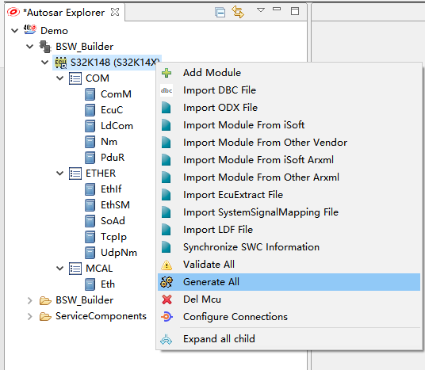

   图 4‑9 配置代码的生成-1

2. 选择Validate
   All对本协议栈各配置选项进行校验，没有错误提示信息即校验通过。若有错误信息，请按照错误提示修改。

3. 选择Generate
   All，生成配置文件。右下角的Console窗口输出生成的配置文件信息。

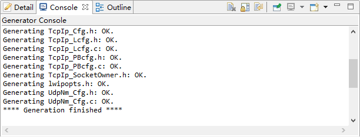

   图 4‑10 配置代码的生成-2

4. 将ORIENTAIS Configurator切换到Resource模式，即可查看生成的配置文件。

.. figure:: ../../_static/集成手册/UdpNm/image11.png
   :width: 5.77153in
   :height: 4.17986in

   图 4‑11 配置代码的生成-3

功能集成
--------

代码集成
~~~~~~~~

协议栈代码包括两部分：项目提供的协议栈源码和ORIENTAIS
Configurator配置生成代码。

用户须将协议栈源码和章节4.2.2生成的源代码添加到集成开发工具的对应文件夹。协议栈集成的文件结构，见章节5.3。

**注意：协议栈集成之前，用户须确保已经有基础工程，且本协议栈相关的其他协议栈能正常工作。**

集成注意事项
~~~~~~~~~~~~

对于集成过程中，协议栈特殊要求和用户经常出现的问题，归类总结形成下表4-1。用户需逐一排查表中的约束项，以避免集成问题出现。

表4-1 UDPNM集成约束清单

+-----+---------+-----------------------------------------------------+
| *   | *       | **约束限制**                                        |
| *编 | *类别** |                                                     |
| 号  |         |                                                     |
| **  |         |                                                     |
+-----+---------+-----------------------------------------------------+
| **  | 堆栈    | 用户需确保为任务堆栈和中断堆栈分配足够的堆栈空间。  |
| 1** |         |                                                     |
+-----+---------+-----------------------------------------------------+
| **  | 头文件  | -  添加协议                                         |
| 2** |         | 栈代码之后，用户需更新集成开发工具中的头文件路径。  |
|     |         |                                                     |
|     |         | -  调用协议栈API的源文件，需要包含协议栈的头文件。  |
+-----+---------+-----------------------------------------------------+
| **  | 初始化  | UdpNm诊断栈                                         |
| 3** |         | 的初始化顺序为：EthIf_Init、TcpIp_Init、SoAd_Init、 |
|     |         | EthSM_Init、UdpNm_Init、 Nm_Init和ComM_Init。       |
+-----+---------+-----------------------------------------------------+
| **  | 周      | UdpNm_MainFunction，EthSM_MainFu                    |
| 4** | 期函数  | nction和ComM_MainFunction需要被周期性任务函数调用。 |
|     |         |                                                     |
|     |         | EthSM的调度周期必须大于ComM的调度周期               |
+-----+---------+-----------------------------------------------------+

集成示例
========

集成目标
--------

本手册会以以下参数作为示例，进行集成演示。

表5-1 UDPNM集成参数表

+-------------------------+--------------------------------------------+
| **参数**                | **值**                                     |
+-------------------------+--------------------------------------------+
| 快发周期                | 50ms                                       |
+-------------------------+--------------------------------------------+
| 快发次数                | 10                                         |
+-------------------------+--------------------------------------------+
| 正常发送周期            | 500ms                                      |
+-------------------------+--------------------------------------------+
| 节点Id                  | 50                                         |
+-------------------------+--------------------------------------------+
| RepeatState时间         | 2s                                         |
+-------------------------+--------------------------------------------+
| Nm-Timeout时间          | 5s                                         |
+-------------------------+--------------------------------------------+
| WaitBusSleep时间        | 1.5s                                       |
+-------------------------+--------------------------------------------+
| Socket信息              | 本地：172.31.30.78/ UDP/30500              |
|                         |                                            |
|                         | 远端：239.192.255.250/UDP/30500            |
+-------------------------+--------------------------------------------+

.. _模块配置-1:

模块配置
--------

EcuC模块配置
~~~~~~~~~~~~

#. 双击EcuC模块，打开EcuC模块配置界面。

#. 在EcucConfigSets栏目上右键，选择EcucConfigSet。再在EcucConfigSet上右键，选择New🡪
   EcucConfigSet。再在EcucPduCollections上右键，选择New
   EcucPduCollection。

   a) PduIdTypeEnum
      选择UINT8（该参数表示PDU的格式。因为示例只有一对收发报文，PDU数不会超过255，UINT8类型的长度就够存储了）。

   b) PduLengthTypeEnum
      选择UINT8（该参数表示数据长度，示例需要配置的报文长度都是8，不会超过255，所以选择UINT8即可）。

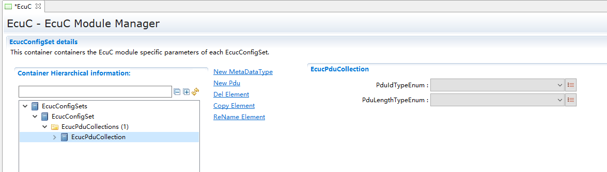

   图 5‑1 配置EcucPduCollection

3. 在EcucPduCollection上右键，选择Pdu，会生成一个Pdu的配置界面。

   a) 建议不要使用默认生成的Pdu名字（如：Pdu_0），将Pdu名字改成有意义的名字对后续的配置过程将会有很大帮助。

   b) 这里按照发送和接收，可以将Pdu名字改为报文的名字。PduLength：Pdu长度，根据实际使用帧的长度设置。

   c) 由于UdpNm的收发报文不需要PduR来路由，因此每个方向（发送/接收）只需要配置一个Pdu。对于需要PduR路由的报文，每个方向需要创建2个Pdu。

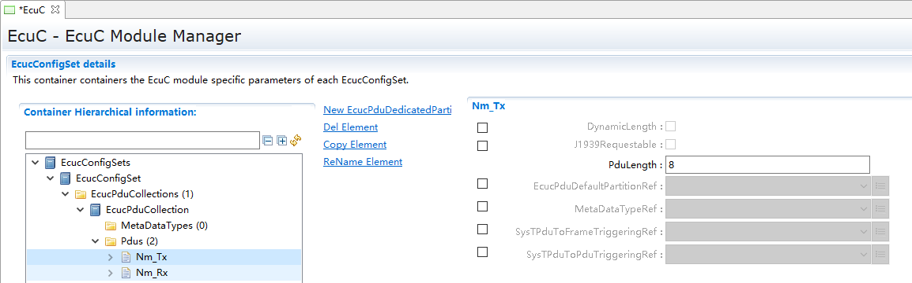

   图 5‑2 配置Pdu-1

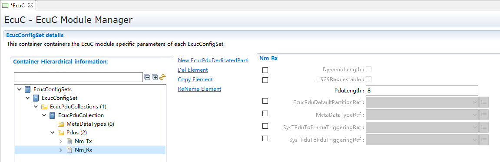

   图 5‑3 配置Pdu-2

4. ECUC模块到此配置结束。可以在模块上右键，然后选择校验，查看是否配置有错误。

5. 校验后提示窗口没有错误信息，即校验通过。

SoAd模块配置
~~~~~~~~~~~~

#. 配置SoAdGeneral，一般配置调度周期，Socket个数和SocketGroup的个数。

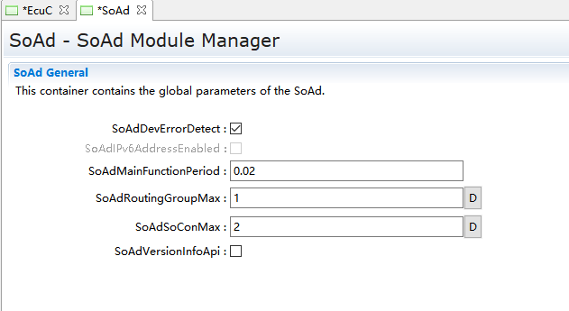

   图 5‑4 配置SoAdGeneral

2. 配置SoAdBswModules，若数据流需要通过SoAd模块，则需要配置。本例中只有UdpNm。所以只需要配置UdpNm。

.. figure:: ../../_static/集成手册/UdpNm/image16.png
   :width: 5.77153in
   :height: 1.74306in

   图 5‑5 配置SoAdBswModules

3. 配置SoAdConfig。

   a) 配置SoAdSocketGroup。

.. figure:: ../../_static/集成手册/UdpNm/image17.png
   :width: 5.30261in
   :height: 1.80289in

   图 5‑6 配置SoAdSocketGroup

b) 配置SoAdSocketConnectionGroup。UdpNm采用多播收发，需要配置2个Socket。分别用于发送和接收。

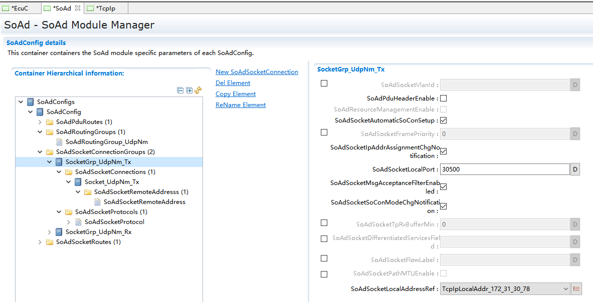

   图 5‑7 配置SoAdSocketConnectionGroup-1

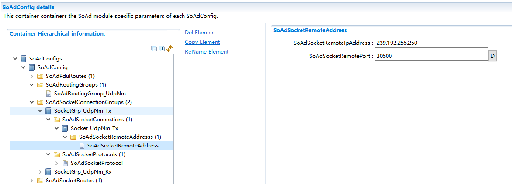

   图 5‑8 配置SoAdSocketConnectionGroup-2

.. figure:: ../../_static/集成手册/UdpNm/image20.png
   :width: 5.90551in
   :height: 2.30709in

   图 5‑9 配置SoAdSocketConnectionGroup-3

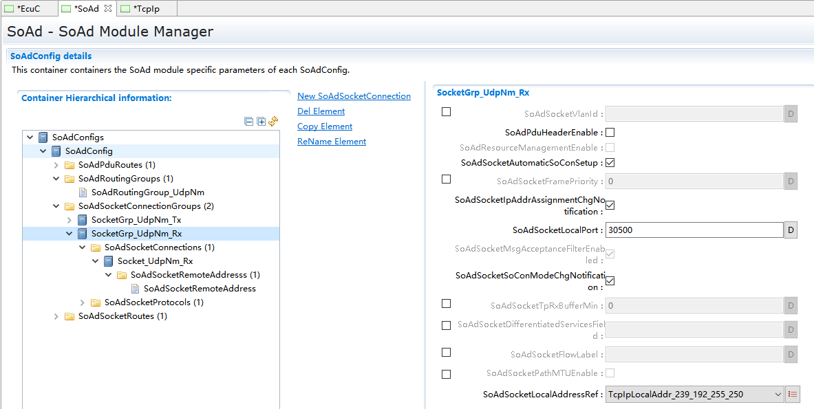

   图 5‑10 配置SoAdSocketConnectionGroup-4

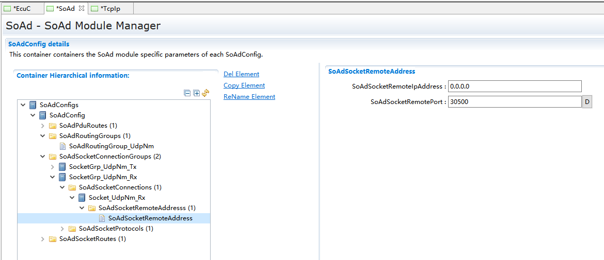

   图 5‑11 SoAdSocketConnectionGroup-5

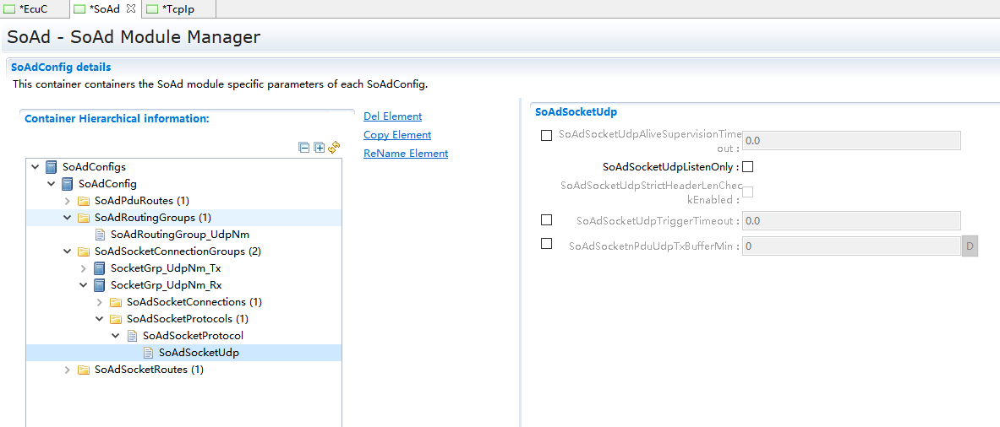

   图 5‑12 配置SoAdSocketConnectionGroup-6

c) 配置SoAdRoute，即报文发送。

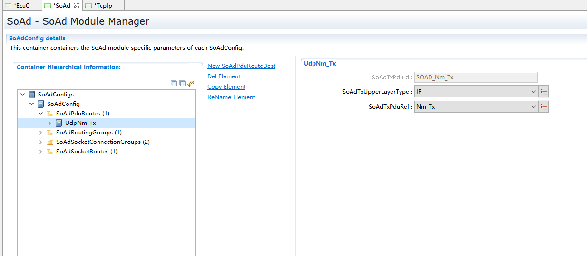

   图 5‑13 配置SoAdRoute-1

.. figure:: ../../_static/集成手册/UdpNm/image25.png
   :width: 5.90551in
   :height: 2.49606in

   图 5‑14 配置SoAdRoute-2

d) 配置SoAdSocketRoute，即报文接收。

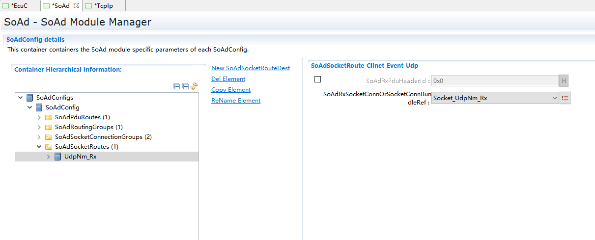

   图 5‑15 配置SoAdSocketRoute-1

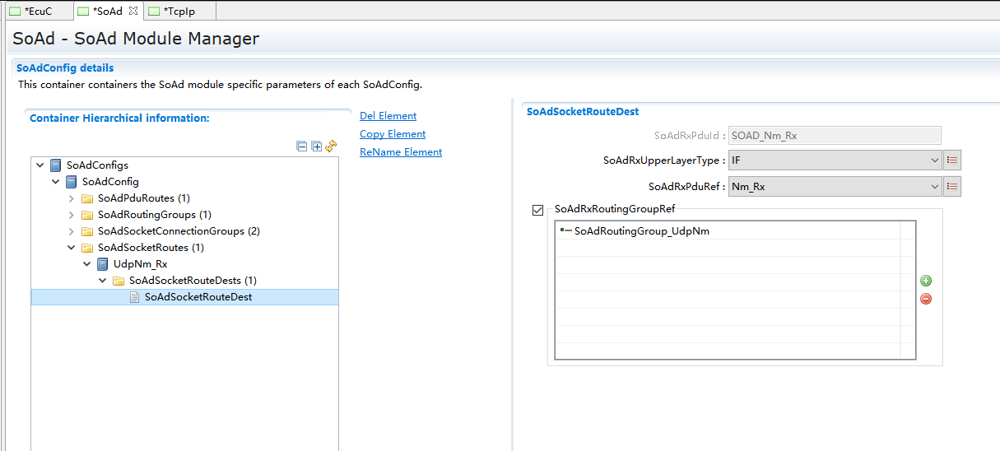

   图 5‑16 配置SoAdSocketRoute-2

4. 校验后提示窗口没有错误信息，即校验通过。

ComM模块配置
~~~~~~~~~~~~

#. ComMGeneral页面一般不需要配置，保持默认即可。

#. 配置ComMConfigSet页面。

   a) 首先配置一个ComMUser，默认就创建了一个。

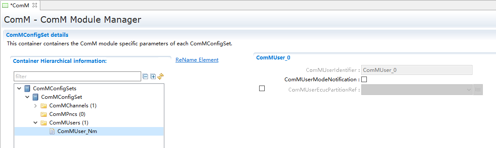

   图 5‑17 配置ComMUser

b) 配置ComMChannel，默认就创建了一个。

c) 配置ComMBusType，选择本通道的总线类型。还需要配置ComMMainFunctionPeriod，表示本通道的调度周期。

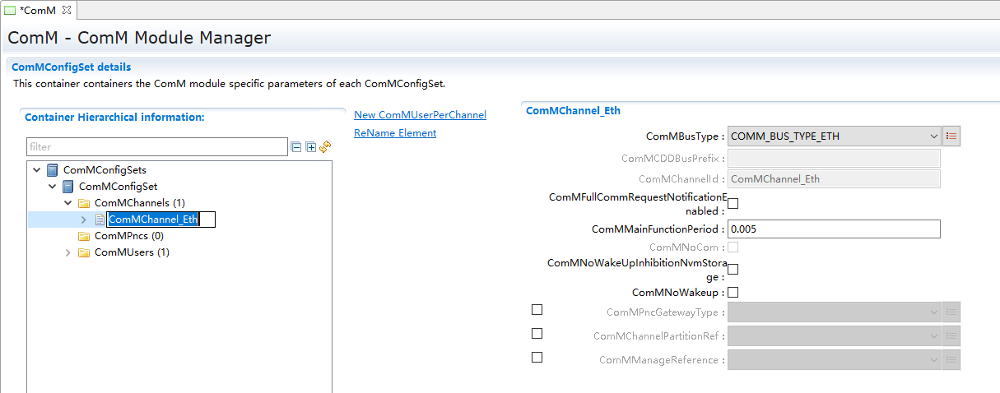

   图 5‑18 配置ComMChannels

d) 配置ComMNmVariant，表示本通道的类型。FULL表示通道由网络管理来管理。LIGHT表示本通道没有网络管理。

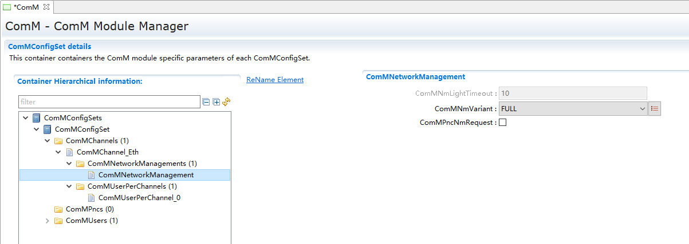

   图 5‑19 配置ComMNmVariant

e) 每个Channel需要关联一个User，对于大多数常见，一个User就等于一个Channel。

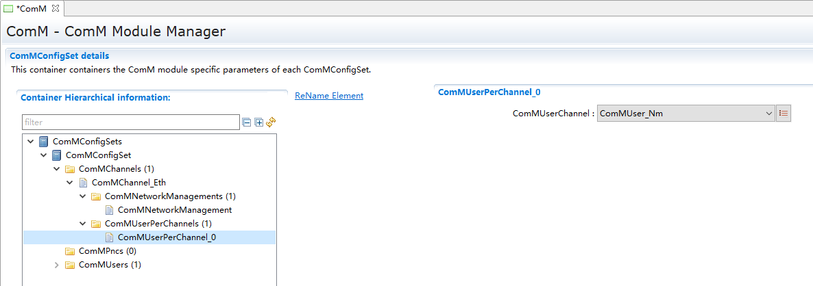

   图 5‑20 配置ComMUserPerChannel

3. ComM配置完成，校验。

EthSM模块配置
~~~~~~~~~~~~~

#. 配置EthSMGeneral。这里只需要配置一个调度周期，尽可能快。

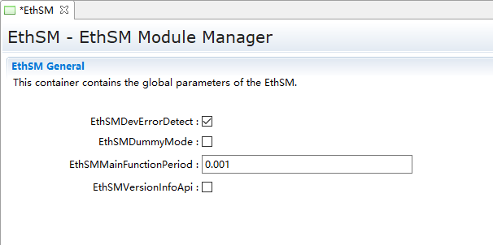

   图 5‑21 配置EthSMGeneral

2. 配置EthSMNetwork。

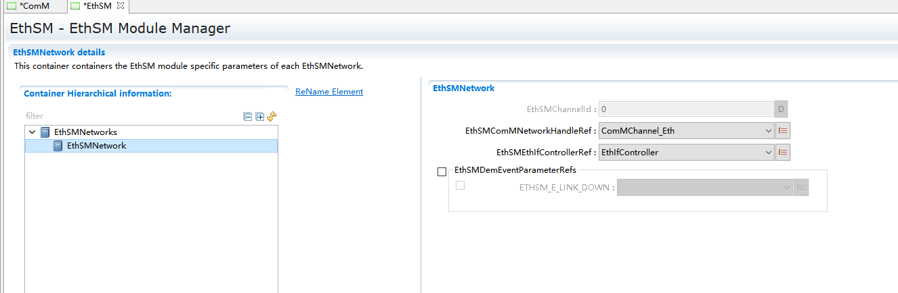

   图 5‑22 配置EthSMNetwork

3. 校验后提示窗口没有错误信息，即校验通过。

Nm模块配置
~~~~~~~~~~

#. 配置NmChannelConfig，需要配置2个地方。第一个是NmChannelConfig，关联到ComM的channel，第二个需要创建NmStandardBusNmConfig，选择网络管理类型。

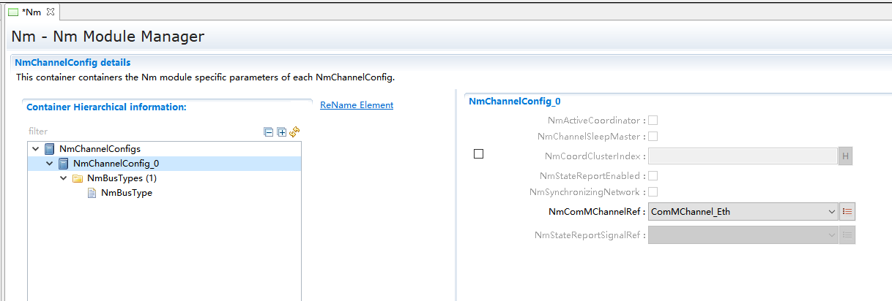

   图 5‑23 配置NmChannelConfig-1

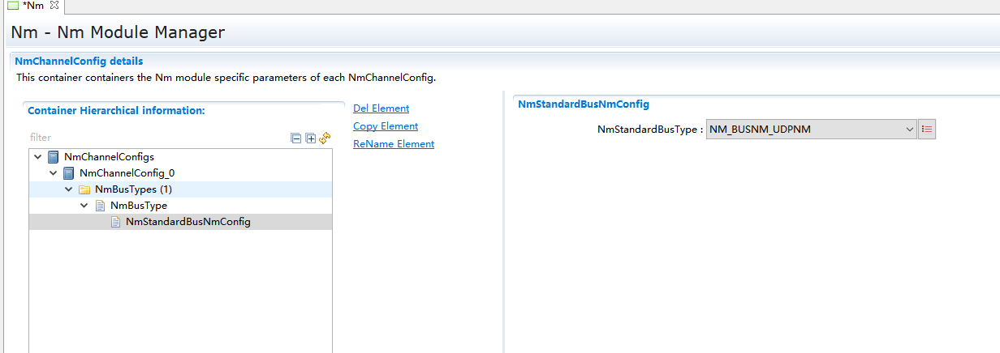

   图 5‑24 配置NmChannelConfig-2

2. 配置NmGlobalConfig，需要配置NmGlobalConstants和NmGlobalFeatures。配置的重点在NmGlobalFeatures。这里主要是全局选择网络管理的功能。部分功能还需要在OsekNm中配置。

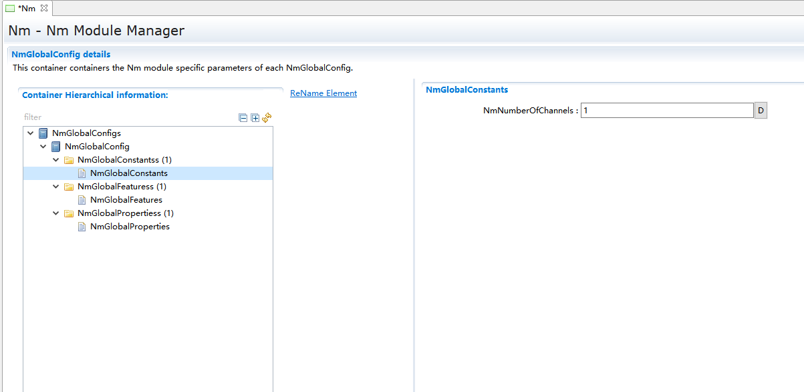

   图 5‑25 配置NmGlobalConfig-1

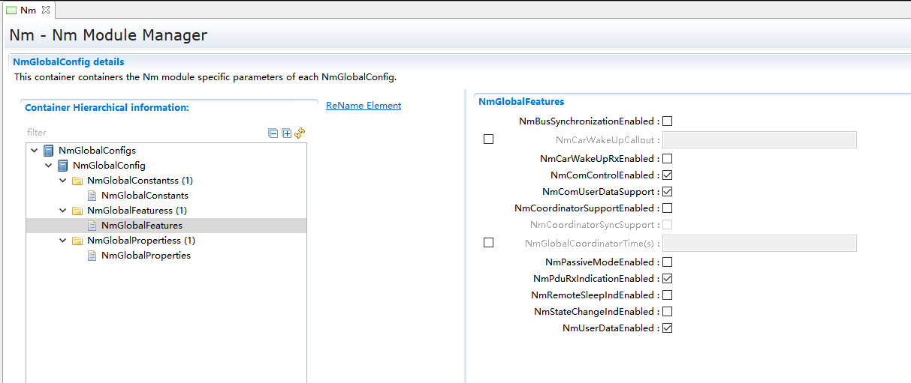

   图 5‑26 配置NmGlobalConfig-2

3. Nm配置完成，校验。

UdpNm模块配置
~~~~~~~~~~~~~

#. 配置UdpNmGlobalConfig。

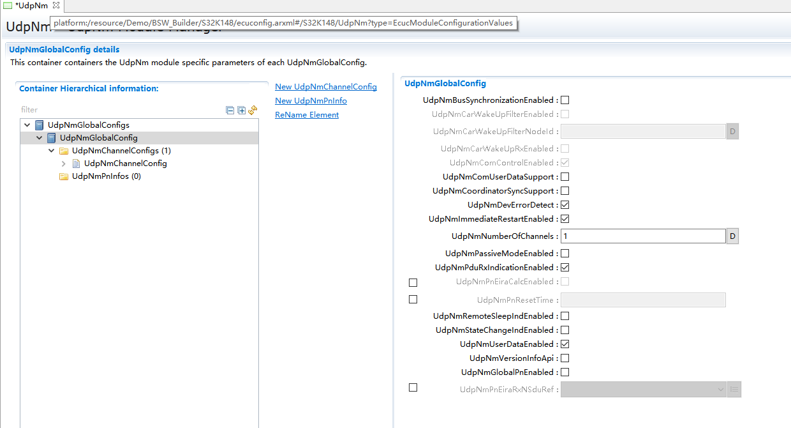

   图 5‑27 配置UdpNmGlobalConfig

2. 配置UdpNmChannelConfig，这里主要配置时间参数。

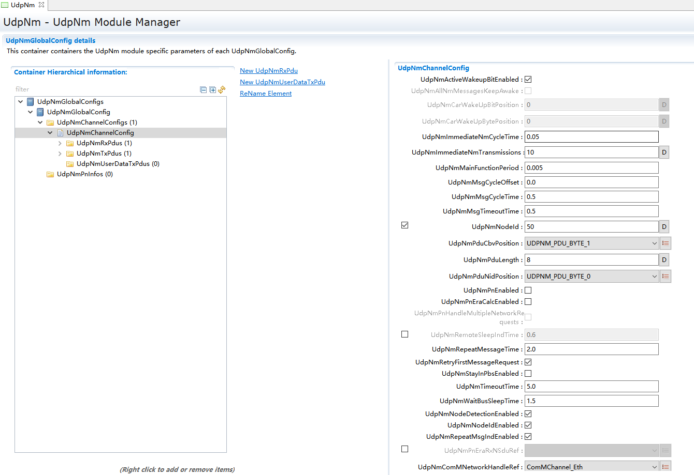

   图 5‑28 配置UdpNmChannleConfig

3. 配置报文的收发。

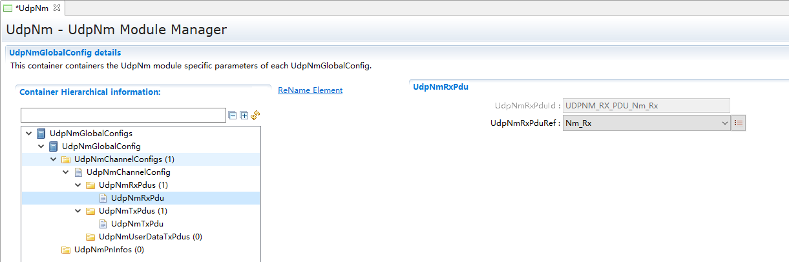

   图 5‑29 配置UdpNmRxPdu

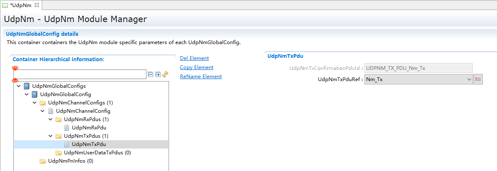

   图 5‑30 配置UdpNmTxPdu

4. 校验后提示窗口没有错误信息，即校验通过。

源码集成
--------

项目交付给用户的工程结构如下：

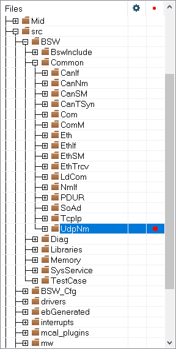

   图 5‑31 工程结构目录

-  BSW_Cfg目录，这个目录用来存放配置工具生成的配置文件，网络管理有关的配置文件放在NM和UdpNm文件夹中。

-  src目录，存放模块相关的源代码。可以看到Source目录下各个文件夹下是各个模块的源代码。

网络管理源代码集成步骤如下：

#. 将5.2章节中ORIENTAIS
   Configurator生成的配置文件复制到Config文件夹下的各个模块的对应文件夹中【例如：Config\\inc\\NM】。

#. 将项目提供的协议栈源代码文件复制到Source文件夹下的对应模块的文件夹中【例如：SourceS\\NM】。

#. 将所需的头文件包含进工程设置中，如下步骤：

   a) 添加头文件路径。

   b) 添加所需的头文件。

   c) 添加调度文件，点击应用保存。

   d) 编译工程。

调度集成
--------

调度集成步骤如下：

#. 协议栈调度集成。

#. 编译链接代码，将生成的elf文件烧写进芯片。

UdpNm有关的代码，在下方的main.c文件中给出重点标注。

**注意 :
本示例中，UdpNm网络管理初始化的代码和启动通信的代码置于main.c文件，并不代表其他项目同样适用于将其置于main.c文件中。**

*#include "Timer.h"*

*#include "Led.h"*

*#include "Mcal.h"*

*#include "UserTimer.h"*

*#include "EthIf.h"*

*#include "TcpIp.h"*

*#include "SoAd.h"*

*#include "EthSM.h"*

UdpNm协议栈相关模块头文件

*#include "Nm.h"*

*#include "UdpNm.h"*

*#include "ComM.h"*

*#include "ComM_Internal.h"*

Com_IpduGroupVector g_ComIpduGroupVector;

**int** **main**\ (**void**)

{

McalUser_Init();

初始化EthIf、EthSM、TcpIp、SoAd、Nm、UdpNm、ComM模块

Led_Init();

EthIf_Init(&EthIf_ConfigData);

EthSM_Init();

TcpIp_Init(&TcpIp_Config);

SoAd_Init(&SoAd_Config);

Nm_Init(&Nm_Config);

打开通信

UdpNm_Init(&UdpNm_Config);

ComM_Init(&ComM_Config);

ComM_Channel[ComMChannel_Eth].CommunicationAllowed = TRUE;

ComM_RequestComMode(ComMUser_Eth, COMM_FULL_COMMUNICATION);

StartOS(OSDEFAULTAPPMODE);

**while** (1);

}

/\* OsTask_c0_1ms: Core0(CPU0), Type = BASIC, Priority = 8*/

**TASK**\ (OsTask_c0_1ms)

{

EthSM模块周期处理函数

/\* please insert your code here ... \*/

EthSM_MainFunction();

**if** (E_OK != TerminateTask())

{

**while** (1)

{

/\* dead loop \*/

}

}

}

/\* OsTask_c0_5ms: Core0(CPU0), Type = BASIC, Priority = 6*/

**TASK**\ (OsTask_c0_5ms)

{

/\* please insert your code here ... \*/

ComM、EthIf、UdpNm模块周期处理函数

ComM_MainFunction(ComMUser_Eth);

EthIf_MainFunctionState();

UdpNm_MainFunction(0);

**if** (E_OK != TerminateTask())

{

**while** (1)

{

/\* dead loop \*/

}

}

}

/\* OsTask_c0_5ms: Core0(CPU0), Type = BASIC, Priority = 6*/

**TASK**\ (OsTask_c0_20ms)

SoAd、TcpIp模块周期处理函数

{

/\* please insert your code here ... \*/

SoAd_MainFunction();

TcpIp_MainFunction();

**if** (E_OK != TerminateTask())

{

**while** (1)

{

/\* dead loop \*/

}

}

}

验证结果
--------

根据集成目标，使用Wireshark工具查看报文发送方式是否正确。前10个报文发送间隔50ms，后面报文的间隔是500ms，符合集成目标。

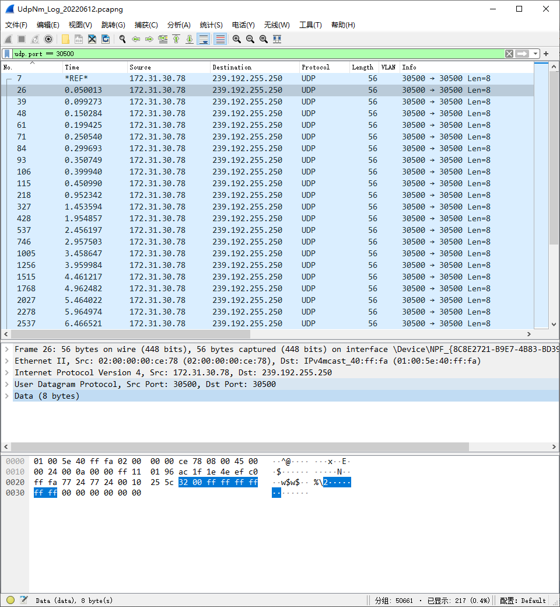

   图 5‑32 UdpNm报文发送示例

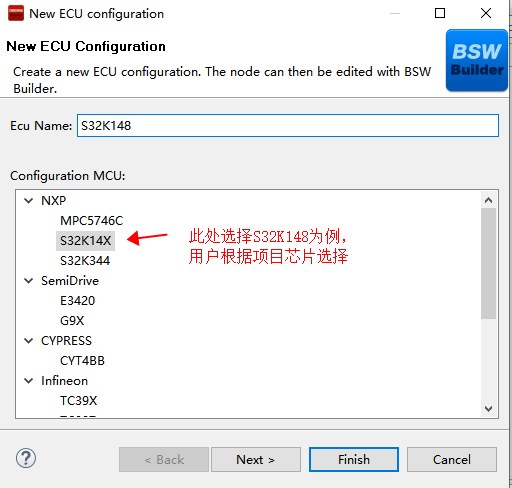
