===================
WDG_集成手册
===================

目标
====

本文档用于指导客户进行WDG集成，文档主要包括的内容为：WDG集成指导、基于普通应用的集成示例讲解、项目集成特殊说明。

通过阅读本文档，用户可以了解代码集成过程，ORIENTAIS配置工具的配置过程，以及如何应用配置工具生成的配置文件。由于各项目的需求不同，集成示例不会针对于特定的商业项目做详细讲解。

缩写词和术语
============

.. table:: 表格 2‑1缩写词和术语

   +---------------+------------------------------------------------------+
   | 缩写词/术语   | 描述                                                 |
   +---------------+------------------------------------------------------+
   | OS            | Operating System 操作系统                            |
   +---------------+------------------------------------------------------+
   | ECU           | Electronic Control Unit 电控单元                     |
   +---------------+------------------------------------------------------+
   | WDG           | Watchdog 看门狗                                      |
   +---------------+------------------------------------------------------+
   | WdgM          | Watchdog Manager 看门狗管理                          |
   +---------------+------------------------------------------------------+
   | WdgIf         | Watchdog Interface 看门狗接口                        |
   +---------------+------------------------------------------------------+
   | CP            | CheckPoint 监控点                                    |
   +---------------+------------------------------------------------------+
   | SE            | Supervised Entity 监控实体                           |
   +---------------+------------------------------------------------------+

参考文档
========

[1] 参考手册_ORIENTAIS_Configurator_WDG.pdf

[2] 参考手册_ORIENTAIS_WDG.pdf

WDG集成
=======

WDG各配置模块的功能介绍，参见表4-1 WDG各配置模块介绍。

使用WDG源码和配置工具，进行WDG的集成的步骤，参见表 4‑2 WDG集成的步骤。

.. table:: 表 4‑1 WDG各配置模块介绍

   +---------+------------------------------------------------------------+
   | 模块名  | 功能                                                       |
   +---------+------------------------------------------------------------+
   | Wdg     | wdg驱动配置。                                              |
   +---------+------------------------------------------------------------+
   | WdgIf   | 1.允许WdgM访问多个底层Wdg抽象模块。                        |
   |         |                                                            |
   |         | 2.该模块的API都映射到下层Wdg抽象模块的API。                |
   +---------+------------------------------------------------------------+
   | WdgM    | 1.Watchdog的管理操作，实现各种状态机制管理。               |
   |         |                                                            |
   |         | 2.为用户App提供Watchdog的Api。                             |
   |         |                                                            |
   |         | 3.下发指令给下层WdgIf，并获取其反馈结果。                  |
   +---------+------------------------------------------------------------+

.. table:: 表 4‑2 WDG集成的步骤

   +------+--------------------------+------------------------------------+
   | 步骤 | 操作                     | 说明                               |
   |      |                          |                                    |
   +------+--------------------------+------------------------------------+
   | 1    | ORIENTAIS                | 若配置工具已经搭                   |
   |      | Configurator配置工       | 建，则仅需进行WDG模块的加载操作。  |
   |      | 具工程搭建和WDG模块加载  |                                    |
   +------+--------------------------+------------------------------------+
   | 2    | 模块配置及配置文件生成   | NA                                 |
   +------+--------------------------+------------------------------------+
   | 3    | 代码集成                 | 现有工程                           |
   |      |                          | 、WDG源代码和配置生成文件的集成。  |
   +------+--------------------------+------------------------------------+
   | 4    | 验证测试                 | NA                                 |
   +------+--------------------------+------------------------------------+

注意：WDG集成之前，用户须确保已经有基础工程，且WDG相关的其他协议栈能正常工作。

新建ORIENTAIS Configurator配置工程及模块加载
--------------------------------------------

#. 安装ORIENTAIS Configurator软件后，双击软件图标打开软件。

图 4‑1软件主界面

2. 菜单栏File🡪New🡪Project，新建工程。

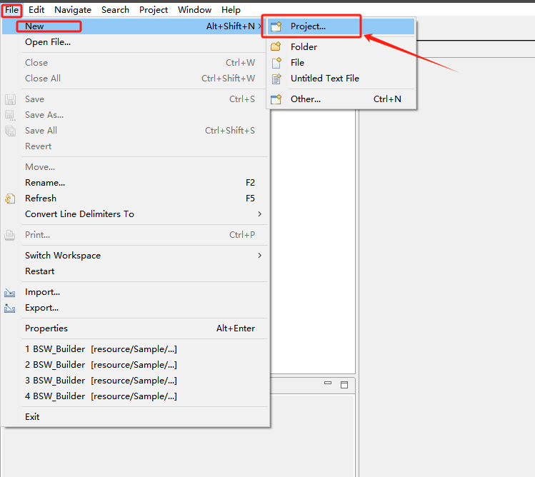

   图 4‑2新建工程

3. 在弹出的新建窗口中选择Autosar下的 [BSW Project]，选择Next。

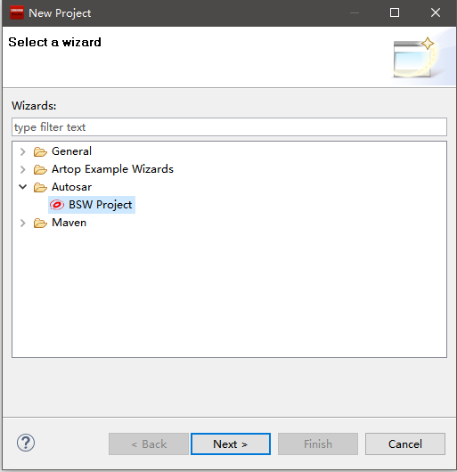

   图 4‑3新建工程

4. 在弹出的窗口中输入工程名，选择Finish。

.. figure:: ../../_static/集成手册/WDG/image4.png
   :width: 4.14231in

   图 4‑4新建工程

5. 在弹出的窗口中选择Yes。

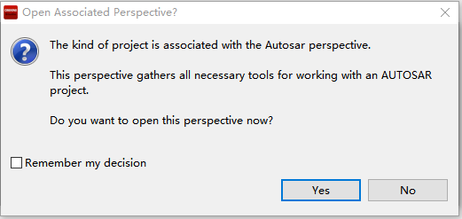

   图 4‑5完成新建工程

6. 选择[Bsw_Builder]，右键单击，选择New ECU Configuration。

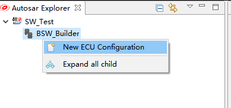

   图 4‑6新建ECU

7. 在弹出的窗口中输入ECU名，然后选择Next。

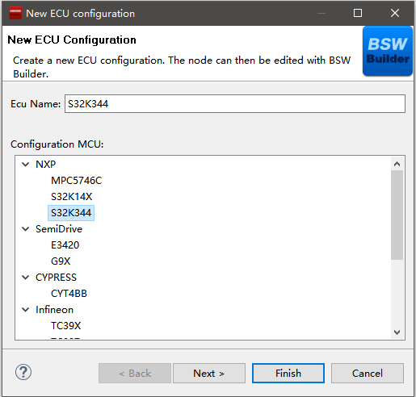

   图 4‑7选择芯片平台

8. 在弹出的窗口中勾选需添加的模块，点击Finish。

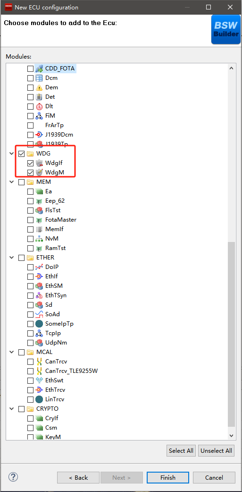

   图 4‑8完成ECU配置

9. 新建工程如下所示，步骤⑧中添加的模块已经被加入到工程中。

.. figure:: ../../_static/集成手册/WDG/image9.png
   :width: 4.14231in

   图 4‑9工程列表界面

模块配置及生产代码
------------------

模块配置
~~~~~~~~

模块的具体配置，取决于具体的项目需求。该协议栈各模块配置项的详细介绍，参见表
4-3协议栈各模块配置参考文档。

.. table:: 表 4‑3协议栈各模块配置参考文档

   +----------+---------------------------------------+-------------------+
   | 模块     | 参考文档及其章节                      | 说明              |
   +----------+---------------------------------------+-------------------+
   | WdgIf    | Autosar R19-11_参考手册_WdgIf.pdf     |                   |
   +----------+---------------------------------------+-------------------+
   | WdgM     | Autosar R19-11_参考手册_WdgM.pdf      |                   |
   +----------+---------------------------------------+-------------------+

配置代码生成
~~~~~~~~~~~~

#. 在ORIENTAIS
   Configurator主界面左方，选择对应的协议栈，单击右键弹出Validate
   All和Generate All菜单。

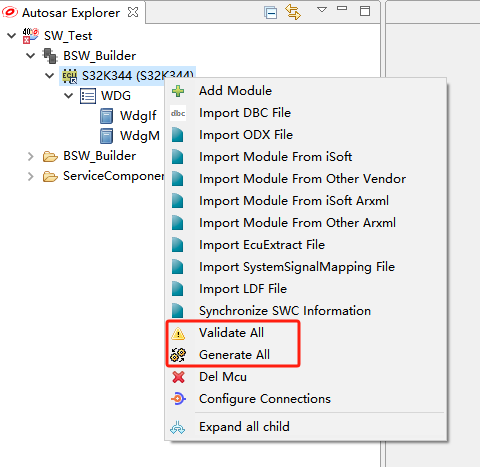

   图 4‑10代码生成

2. 选择Validate
   All对本协议栈各配置选项进行校验，没有错误提示信息即校验通过。若有错误信息，请按照错误提示修改。

3. 选择Generate
   All，生成配置文件。右下角的Console窗口输出生成的配置文件信息。

.. figure:: ../../_static/集成手册/WDG/image11.png
   :width: 4.14231in

   图 4‑11代码生成提示界面

4. 将ORIENTAIS Configurator切换到Resource模式，即可查看生成的配置文件。

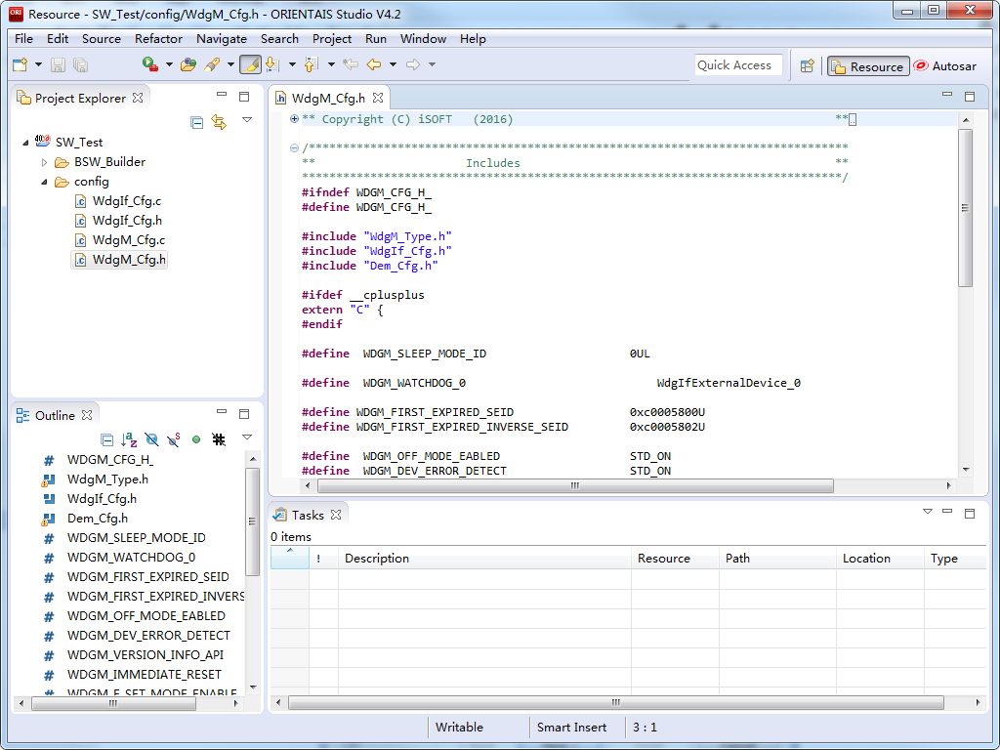

   图 4‑12生成的配置文件

功能集成
--------

代码集成
~~~~~~~~

WDG代码包括两部分：项目提供的WDG源码和ORIENTAIS
Configurator配置生成代码。

用户须将WDG源码和章节4.2.2生成的源代码添加到集成开发工具的对应文件夹。WDG集成的文件结构，见章节5。

注意：WDG集成之前，用户须确保已经有基础工程，且WDG相关的其他协议栈能正常工作。

集成注意事项
~~~~~~~~~~~~

对于集成过程中，WDG特殊要求和用户经常出现的问题，归类总结形成表 4‑4
WDG集成约束清单。用户需逐一排查表中的约束项，以避免集成问题出现。

.. table:: 表 4‑4 WDG集成约束清单

   +-----+---------+-----------------------------------------------------+
   | 编号| 类别    | 约束限制                                            |
   |     |         |                                                     |
   +-----+---------+-----------------------------------------------------+
   | 1   | 堆栈    | 用户需确保为任务堆栈和中断堆栈分配足够的堆栈空间。  |
   +-----+---------+-----------------------------------------------------+
   | 2   | 头文件  | -  添加协议栈代码\                                  |
   |     |         |    之后，用户需更新集成开发工具中的头文件路径。     |
   |     |         |                                                     |
   |     |         | - 调用协议栈API的源文件，需要包含协议栈的头文件。   |
   +-----+---------+-----------------------------------------------------+
   | 3   | 初始化  | WDG的初始化顺序为：WdgDriver_Init,WdgM_Init         |
   +-----+---------+-----------------------------------------------------+
   | 4   | 周\     | Gtm_IsrTomModule\                                   |
   |     | 期函数  | ,WdgM_MainFunction需要被周期性任务函数调用。        |
   +-----+---------+-----------------------------------------------------+
   | 5   | Al\     | 1. 上电启动OS之后，由于第一个OS\                    |
   |     | ive监控 | 周期Task的不确定性，需要在初次执行WdgM_MainFunction |
   |     |         | 之后，才开始执行Alive相关的WdgM_CheckPointReached。 |
   |     |         |                                                     |
   |     |         | 2. WdgM_SetMode需要在WdgM_MainFunction之后执行，避\ |
   |     |         | 免两个Mode都使用同一Alive监控的阈值差异造成的错误。 |
   +-----+---------+-----------------------------------------------------+
   | 6   | Fi\     | WDGM_FIRST_EXPIRED_SEID和WDGM\                      |
   |     | rstExpi | _FIRST_EXPIRED_INVERSE_SEID各占用RAM空间的16Bytes， |
   |     | redSEID | 应在链接脚本中进行保护，避免其他变量占用该RAM区域。 |
   +-----+---------+-----------------------------------------------------+
   | 7   | 依赖    | -  硬件依赖                                         |
   |     |         |                                                     |
   |     |         |    定时器外设：WDG通过比较到达CP\                   |
   |     |         |    的时间戳监控时间间隔功能。时间戳从定时器外设获取 |
   |     |         |                                                     |
   |     |         |    看门狗外设：可以是芯片上的看门狗，               |
   |     |         |    也可以是外部看门狗，或者两者都有                 |
   |     |         |                                                     |
   |     |         | -  软件依赖                                         |
   |     |         |                                                     |
   |     |         |    OS：提供任务调度周期调用WdgM_MainFunction\       |
   |     |         |    提供ISR环境，定期看门狗触发                      |
   |     |         |                                                     |
   |     |         |    定时器：提供时间戳获取函数用于两个CP比较时间跨度 |
   |     |         |                                                     |
   |     |         |    看门狗驱动程序：用于\                            |
   |     |         |    设置模式的函数，设置触发条件的函数，喂狗函数。   |
   |     |         |                                                     |
   |     |         |    DEM：DEM错误处理函数，该模块不是强制的。         |
   |     |         |                                                     |
   |     |         |    DET：处理开发过程中的错误，该模块不是强制的。    |
   |     |         |                                                     |
   |     |         |    BswM:调用\                                       |
   |     |         |    该模块以重置OS-Application，该模块不是强制的。   |
   +-----+---------+-----------------------------------------------------+

集成示例
========

本章节向用户展示WDG的集成过程。用户可以据此熟悉WDG配置工具的配置过程，以及如何应用配置工具生成的配置文件。示例是基于Wdg驱动正常工作之上。

本章节先完成基本WDG配置，使得工程可以编译通过，并实现基础WDG监控，然后根据具体需求服务进行添加或修改。

注意：本示例不代表用户的实际配置情况，用户需要根据自己的实际需求，决定各个参数的配置。

集成目标
--------

通过搭建基础工程，实现简单的Wdg监控功能。具体监控功能如下：

#. Alive supervision -用于监控定期软件的时间。参数配置如表5-1：

.. table:: 表 5‑1 Alive监控参数配置

   +---------+------------+-----+-----+----+----+----+----+----+----+
   | 监\     | 描述       | 监\ | 监\ | 参\| 监\| 监\| 期\| 次\| 次\|
   | 控类型  |            | 控\ | 控\ | 考\| 控\| 控\| 望\| 数\| 数\|
   |         |            | 实\ | 点\ | 周\| 失\| 失\| 执\| 上\| 下\|
   |         |            | 体\ | 个\ | 期\| 败\| 效\| 行\| 偏\| 偏\|
   |         |            | 个\ | 数\ |    | 门\| 门\| 次\| 差\| 差\|
   |         |            | 数\ |     |    | 限\| 限\| 数\|    |    |
   +---------+------------+-----+-----+----+----+----+----+----+----+
   | Alive\  | 监控一\    | 1   | 1   | 1  | 0  | 0  | 1  | 0  | 0  |
   | 监控    | 次mainfun\ |     |     |    |    |    |    |    |    |
   |         | ction周期a\|     |     |    |    |    |    |    |    |
   |         | live监控点\|     |     |    |    |    |    |    |    |
   |         | 执行的次数 |     |     |    |    |    |    |    |    |
   +---------+------------+-----+-----+----+----+----+----+----+----+

2. Deadline supervision–用于非周期软件的时间监控。参数配置如表5-2

.. table:: 表 5‑2 Deadline监控参数配置

   +---------+-------------+-----+-----+-----+-----+-----+-----+------+
   | 监控类型| 描述        | 监\ | 监\ | 参\ | 监\ | 监\ |最大\|最小\ |
   |         |             | 控\ | 控\ | 考\ | 控\ | 控\ |时间\|时间\ |
   |         |             | 实\ | 点\ | 周\ | 失\ | 失\ |间隔 |间隔  |
   |         |             | 体\ | 个\ | 期  | 败\ | 效\ |     |      |
   |         |             | 个\ | 数  |     | 门\ | 门\ |     |      |
   |         |             | 数  |     |     | 限  | 限  |     |      |
   |         |             |     |     |     |     |     |     |      |
   |         |             |     |     |     |     |     |（S）|（S） |
   |         |             |     |     |     |     |     |     |      |
   +---------+-------------+-----+-----+-----+-----+-----+-----+------+
   | Deadline| 监控两C\    | 1   | 2   | 1   | 0   | 0   | 0\  | 0    |
   |         | P的时间间隔 |     |     |     |     |     | .05 |      |
   | 监控    |             |     |     |     |     |     |     |      |
   +---------+-------------+-----+-----+-----+-----+-----+-----+------+

③ Logical supervision-用于监控执行顺序的正确性。参数配置如表5-3：

.. table:: 表 5‑3 Logical监控参数配置

   +-------------+----------------+-------+-------+------+------+------+
   | 监控类型    | 描述           | 监控\ | 监\   | 参考\| 监控\| 监控\|
   |             |                | 实体\ | 控点\ | 周期 | 失败\| 失效\|
   |             |                | 个数  | 个数  |      | 门限 | 门限 |
   +-------------+----------------+-------+-------+------+------+------+
   | Logical     | 监控CP执行顺序 | 1     | 2     | 1    | 0    | 0    |
   |             |                |       |       |      |      |      |
   | 监控        |                |       |       |      |      |      |
   +-------------+----------------+-------+-------+------+------+------+

模块的配置
----------

新建配置工程及模块加载操作，请参考本文档4.1章节。生成代码过程请参考章节4.2。

导入MCAL的WDG Driver 信息
~~~~~~~~~~~~~~~~~~~~~~~~~

#. 选择如下图所示的 Import Module From Other Arxml选项

.. figure:: ../../_static/集成手册/WDG/image13.png
   :width: 3.36584in
   :height: 3.37315in

   图 5‑1导入mcal配置选项

2. 选择Mcal生成的ARXML文件，Supplier选择EB Arxml文件，勾选WDG模块。

.. figure:: ../../_static/集成手册/WDG/image14.png
   :width: 4.43562in
   :height: 4.33948in

   图 5‑2导入mcal配置界面

WdgIf配置
~~~~~~~~~

#. 双击WdgIf模块，打开WdgIf模块配置界面。

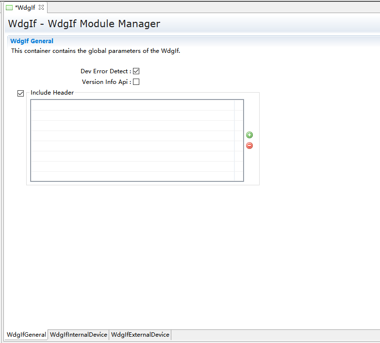

   图 5‑3 WdgIf General配置界面

Dev_Error_Detect: 是否开启对开发过程中错误的检查。

Version_Info_Api: 是否使能版本检查API函数

2. 添加WdgIfDevice配置，分为WdgIfInternalDevice与WdgIfExternalDevice，可只存在一个或同时存在。添加步骤为：鼠标选中WdgIfInternalDevice—单击右键—New
   WdgIfInternalDevice。详见图5-4。

.. figure:: ../../_static/集成手册/WDG/image16.png
   :width: 4.6005in

   图 5‑4新添加WdgIfInternalDevice

3. 添加WdgIfDevice后配置界面如图5-5.

.. figure:: ../../_static/集成手册/WDG/image17.png
   :width: 4.6005in

   图 5‑5 WdgIfInternalDevice配置界面

TriggerConditionFunction：此配置填写Wdg
Driver中API函数名称。通过这个API可以实现为设定trigger
counter时设置超时数值(milliseconds)。

SetModeFunction：此配置填写Wdg
Driver中API函数名称。通过这个API可以实现在WDGIF_OFF_MODE（0）,
WDGIF_FAST_MODE（1）以及WDGIF_SLOW_MODE(2).间切换。

Device Ref：选择对应的底层Watchdog。

4. WdgIf模块到此配置结束。可以在模块上右键，然后选择校验，查看是否配置有错误。校验后提示窗口没有错误信息，即校验通过。

WdgM模块配置
~~~~~~~~~~~~

#. 双击WdgM模块，打开WdgM模块配置界面。

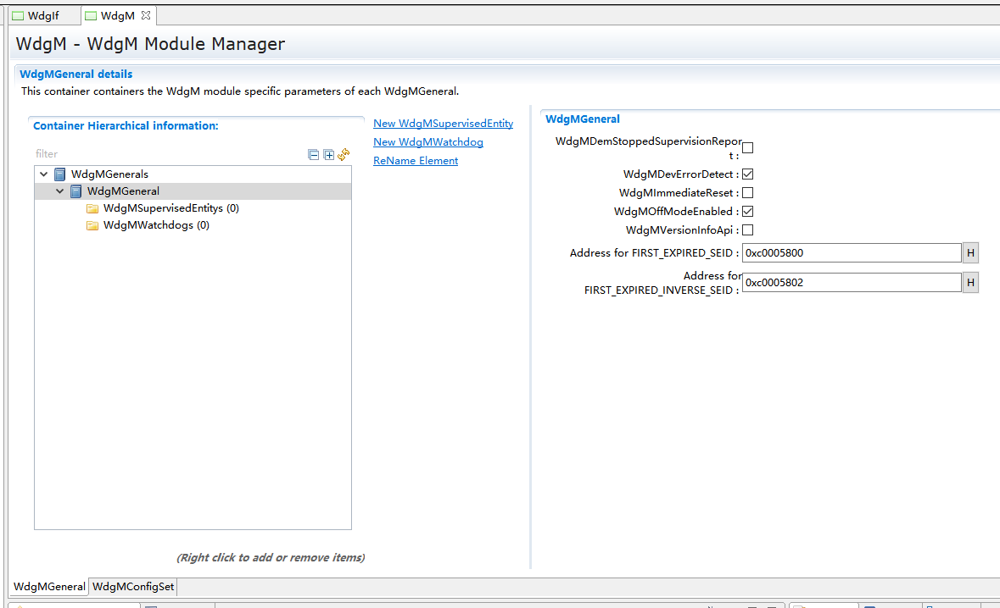

   图 5‑6 WdgM System Setting配置

WdgMDemStoppedSupervisionReport：是否需要将错误信息报告给Dem模块。

WdgMDevErrorDetect:
打开或关闭错误追踪（Det）功能。若开启，一旦检测到配置出错，则代码停留在故障出错位置。量产用代码，需关闭该配置。

WdgMImmediateReset: 使能/失能在Global status Stopped状态时立即复位。

WdgMOffModeEnabled: 是否允许Watchdog Driver配置为Off Mode模式。true:
允许 “OffMode”, false: 不允许“OffMode”。

WdgMVersionInfoApi：预处理器开关，用于启用/禁用API
WdgM_GetVersionInfo的存在。用于删除不需要的代码段。

Address For
FIRST_EXPIRED_SEID：FIRST_EXPIRED_SEID存储地址。存储在此区域的数据必须不会因热启动而擦除或复位。

Address For
FIRST_EXPIRED_INVERSE_SEID：FIRST_EXPIRED_INVERSE_SEID存储地址。存储在此区域的数据必须不会因热启动而擦除或复位。

2. WdgMSupervisedEntitys添加如图5-7。

.. figure:: ../../_static/集成手册/WDG/image19.png
   :width: 3.53608in
   :height: 4.45108in

   图 5‑7 添加WdgMSupervisedEntity或WdgMWatchdog

3. WdgMCheckpoint添加如图5-8。

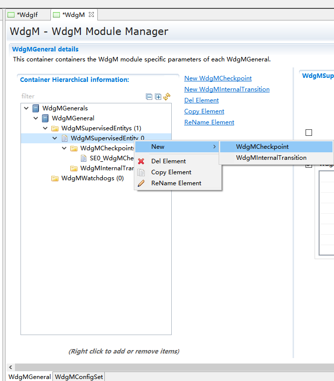

   图 5‑8添加新WdgMCheckpoint或WdgMInternalTransition

4. WdgMSupervisedEntitys配置界面如图5-9。

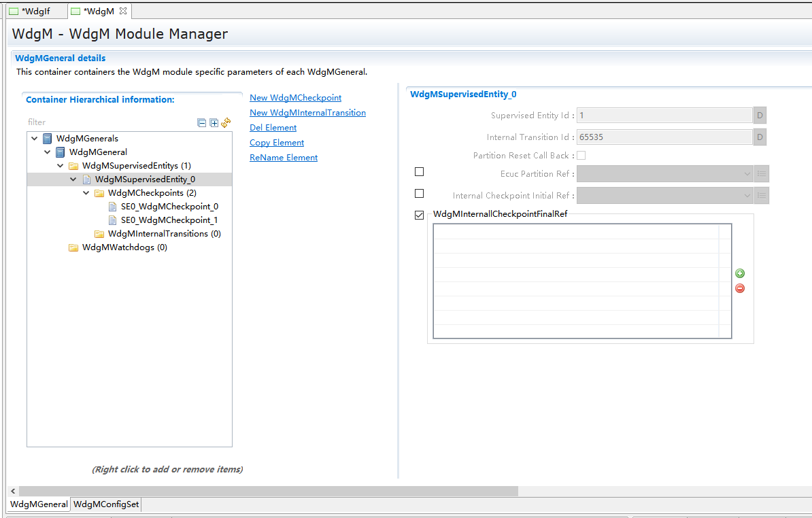

   图 5‑9 WdgMSupervisedEntity配置界面

Supervised Entity Id：此参数应该包含一个唯一的SEID。

Internal Transition Id：外部逻辑监控ID。

OS Application
Ref：该SE属于哪个Application。用于SE故障时的部分代码重启。

Internal Checkpoint Initial Ref：该SE的Internal Logical
supervision的初始Checkpoint。

WdgMInternalCheckpoint FinalRef：该SE的Internal Logical
supervision的最终Checkpoint

5. WdgMInternalTransition配置界面如图5-10。

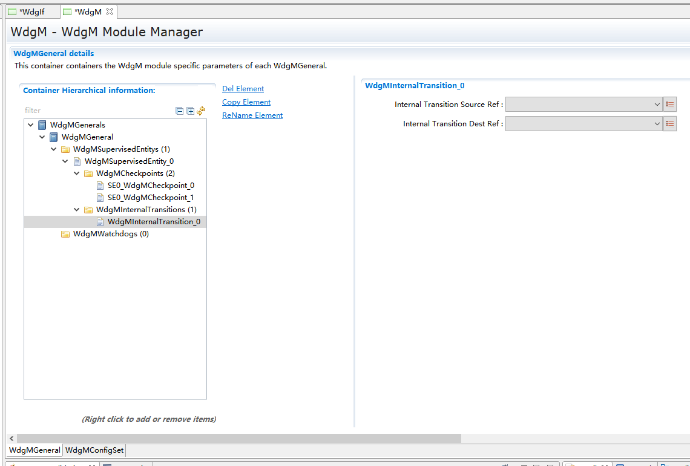

   图 5‑10 WdgMInternalTransition配置界面

Internal Transition Dest
Ref：InternalLogicalSupervision中的某执行段的目的CP。

Internal Transition Source
Ref：InternalLogicalSupervision中的某执行段的起始CP

6. WdgMWatchdog配置界面如图5-11。

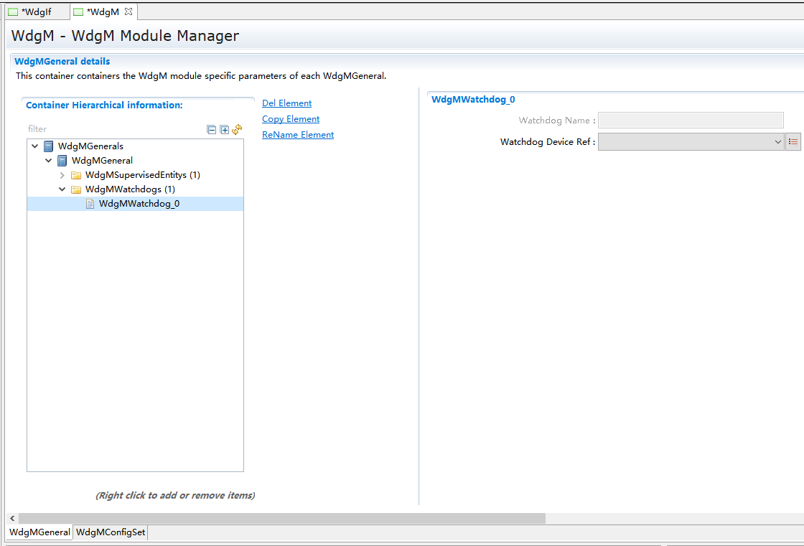

   图 5‑11WdgMWatchdog配置界面

Watchdog Name：该参数包含Watchdog硬件实例的命名。

Watchdog Device Ref：该参数应包含看门狗实例的符号名称。

7. WdgMConfigSet配置界面如图5-12。

..

|image1|

图 5‑12WdgMConfigSet中Initial Mode配置界面

Initial Mode：看门狗管理器初始化后所处的模式。

8. WdgMDemEventParamenterRef添加。

WdgMDemEventParamenterRef添加步骤为：鼠标选中WdgMConfigSet—单击右键—New—WdgMDemEventParamenterRefs。用来关联Dem模块的DTC详见图5-13。

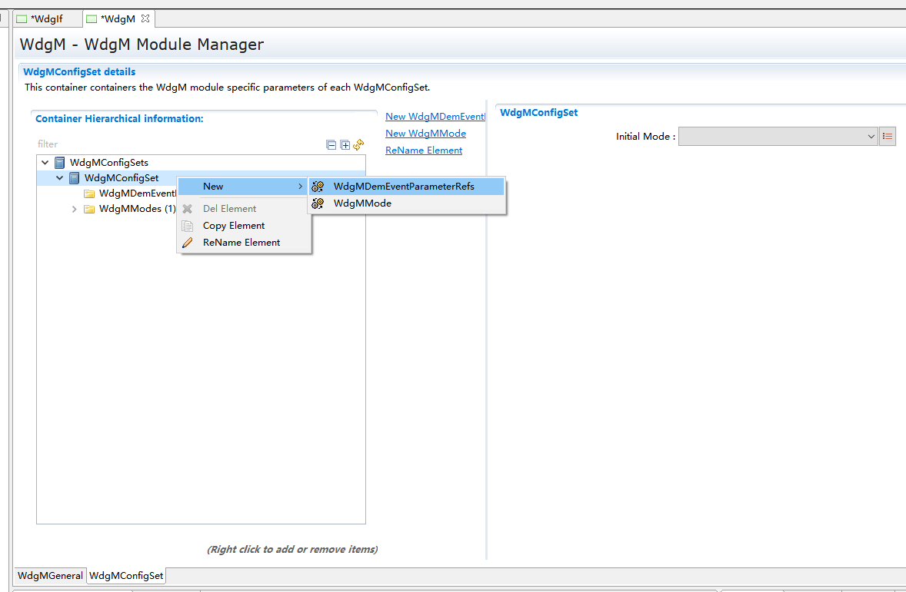

   图 5‑13添加新WdgMDemEventParamenterRefs或WdgMMode

9. WdgMDemEventParamenterRefs配置界面如图5-14。

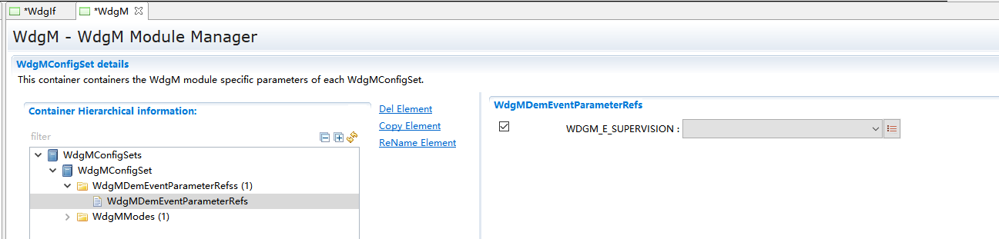

   图 5‑2 WdgMDemEventParamenterRefs配置界面

10. 添加WdgMMode配置项步骤。

鼠标选中WdgMMode—单击右键—New—WdgMAliveSupervisoin。详见图5-15。

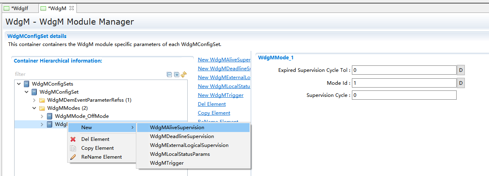

   图 5‑3 新加WdgMAliveSupervision

或WdgMDeadlineSupervisionWdgM

或ExternalLogicalSupervision

或 WdgMLocalStatusParams或 WdgMTrigger

注意：在增加或删除WdgMAliveSupervision后，若其它WdgMAliveSupervision
ID会发生变化，务必单击打开会发生变化的WdgMAliveSupervision，以保证其ID能正确更新。

11. WdgMAliveSupervision配置界面如图5-16。

.. figure:: ../../_static/集成手册/WDG/image28.png
   :width: 5.76736in
   :height: 2.34444in

   图 5‑4 WdgMAliveSupervision配置界面

Expected Alive Indications：期望该CP在SupervisionReferenceCycle的Main
Function中，出现的次数

Max Margin：Expected Alive Indications与实际情况的最大允许偏差。

Min Margin：Expected Alive Indications与实际情况的最小允许偏差。

Supervision Reference
Cycle：该AliveSupervision执行多少个MainFuncation周期

Alive Supervision Checkpoint Ref：该AliveSupervision监控的检查点

12. WdgMDeadlineSupervisoin添加及配置界面介绍。

添加步骤为：鼠标选中WdgMMode—单击右键—New—WdgMDeadlineSupervisoin。默认情况，无该配置项。详见图5-17。

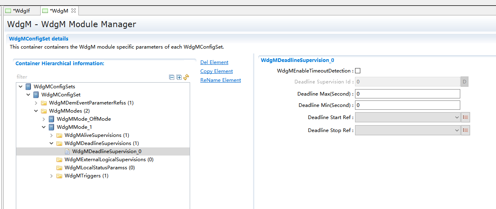

   图 5‑5 WdgMDeadlineSupervision配置界面

注意：在增加或删除WdgMDeadlineSupervisoin后，若其它WdgMDeadlineSupervisoin
ID会发生变化，务必单击打开会发生变化的WdgMDeadlineSupervisoin，以保证其ID能正确更新。

Deadline Max：Deadline监控两个Checkpoint直接的最大时间间隔单位：s。

Deadline Min：Deadline监控两个Checkpoint直接的最小时间间隔单位：s。

Deadline Start Ref：Deadline监控的起始Checkpoint。

Deadline Stop Ref：Deadline监控的结束Checkpoint。

13. WdgMExternalTransition添加步骤及配置项介绍。

WdgMExternalLogicalSupervisoin添加步骤为：鼠标选中WdgMMode—单击右键—New—WdgMExternalLogicalSupervisoin。

右键单击WdgMExternalLogicalSupervisoin_xx —New—ExternalTransition。。

鼠标选中WdgMExternalLogicalSupervisoin_xx —鼠标移到右方窗口的InitialRef
或 StopRef—单击右键—Add Reference—下拉选择Checkpoint。

配置描述如图5-18。

|image2|

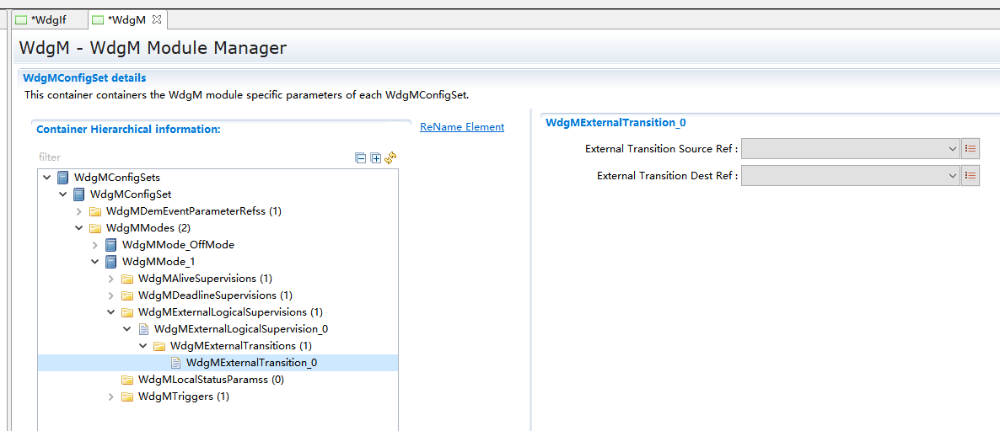

   图 5‑6 添加WdgMExternalTranstion

External Transition Source
Ref：ExternalLogicalSupervision中的某执行段的目的CP。

Deadline Stop Ref：ExternalLogicalSupervision中的某执行段的结束CP

14. WdgMLocalStatusParams添加步骤及介绍

鼠标选中WdgMMode—单击右键—New—WdgMLocalStatusParams。配置界面如图5-19。

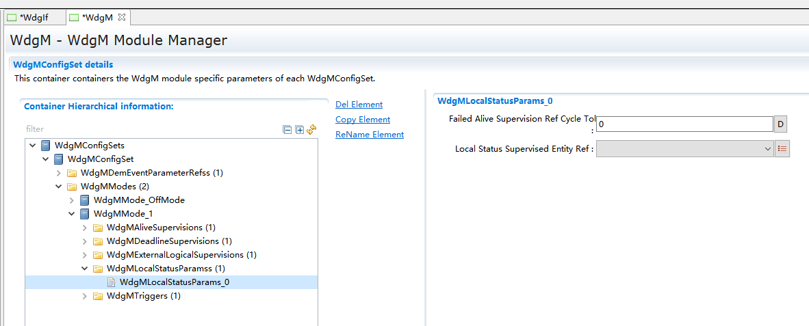

   图 5‑7 WdgMLocalStatusParams配置界面

Failed Alive Supervision Ref Cycle Tol：Alive
Supervision出现故障时，能接受的故障次数。达到故障次数时，Local
Status的状态从Failed切换到Expired。

Local Status Supervision Entity Ref：选择当前Mode，被使用的Supervision
Entity。

15. WdgMTrigger添加步骤及配置项介绍

鼠标选中WdgMMode—单击右键—New—WdgMTrigger。配置项介绍如图5-20。

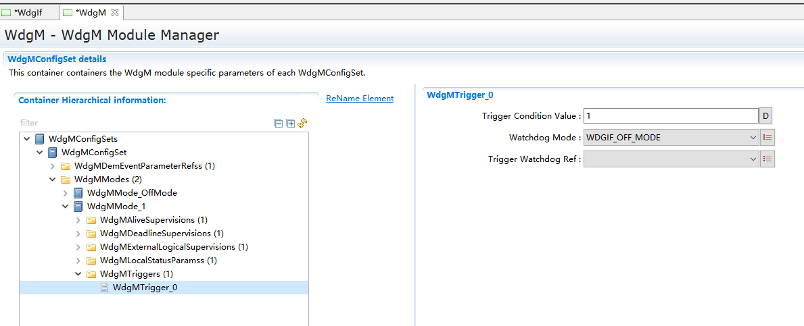

   图 5‑8 WdgMTrigger配置界面

Trigger Condition
Value：该参数应包含传递给该看门狗WdgIf_SetTriggerCondition的值。单位: ms

Watchdog Mode：当前Trigger，对应Trigger Watchdog
Ref底层的Watchdog的工作模式。

Trigger Watchdog Ref：当前Trigger对应的底层Watchdog。

16. WdgM模块到此配置结束。可以在模块上右键，然后选择校验，查看是否配置有错误。校验后提示窗口没有错误信息，即校验通过。

配置Alive Supervision
~~~~~~~~~~~~~~~~~~~~~

#. 添加Wdg驱动头文件。内部WDG不需要添加。

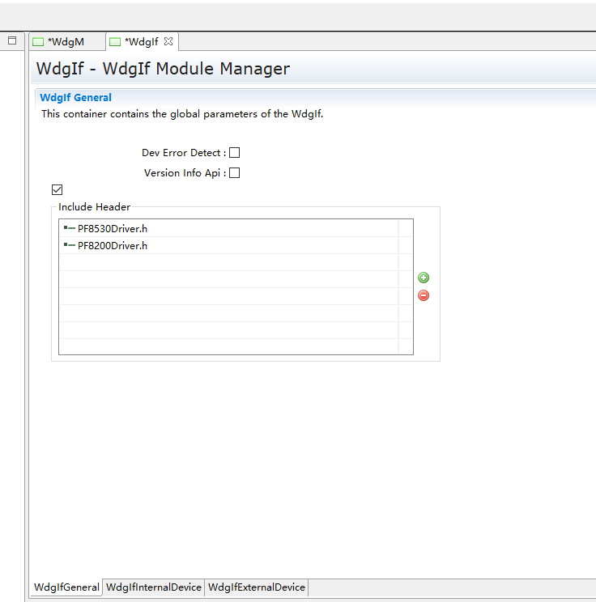

图 5‑21 添加WDG驱动文件界面

2. 新建WdgIfInternalDevice。

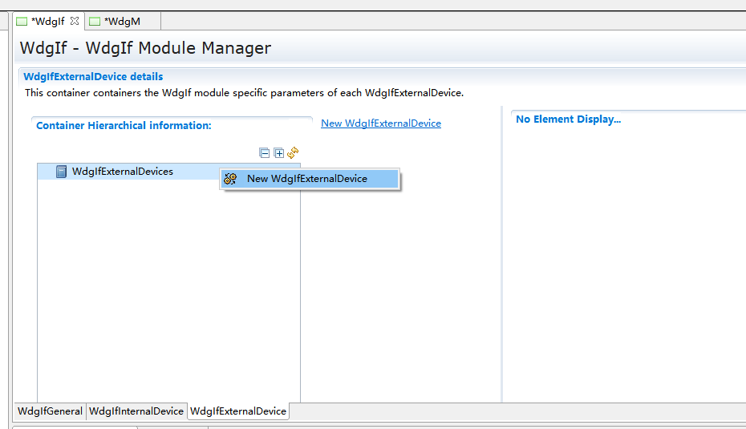

   图 5‑22 新建WdgIfInternalDevice

3. 添加驱动接口函数。

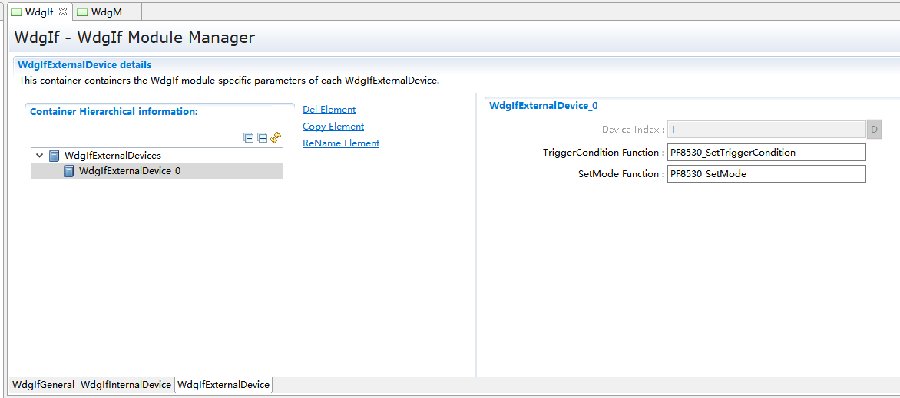

   图 5‑23 添加驱动接口函数

4. 配置Address for FIRST_EXPIRED_SEID和Address for
   FIRST_EXPIRED_INVERSE_SEID。

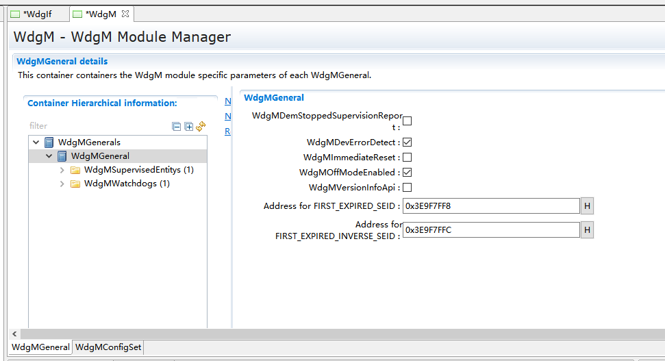

   图 5‑24 配置SEID

5. WdgMGenerals->New,新建一个WdgMSupervisedEntity和一个WdgMWatchd og。

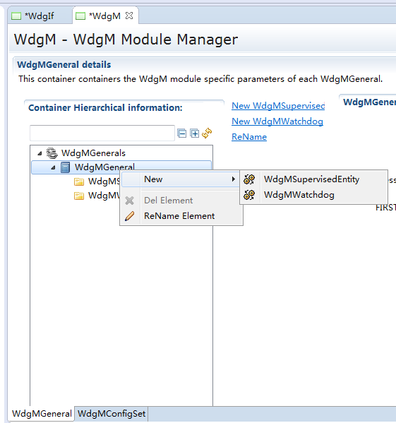

   图 5‑25 配置watchdog

6. 配置Supervised Entity Id工具默认值为1。

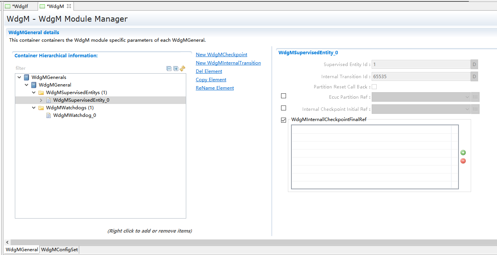

   图 5‑26 配置Supervised Entity ID

7. 配置WdgMWatchdog_1。

.. figure:: ../../_static/集成手册/WDG/image40.png
   :width: 4.6836in
   :height: 2.5124in

   图 5‑27 配置WdgMWatchdog_0

8. WdgMConfigSet->New->WdgMMode。

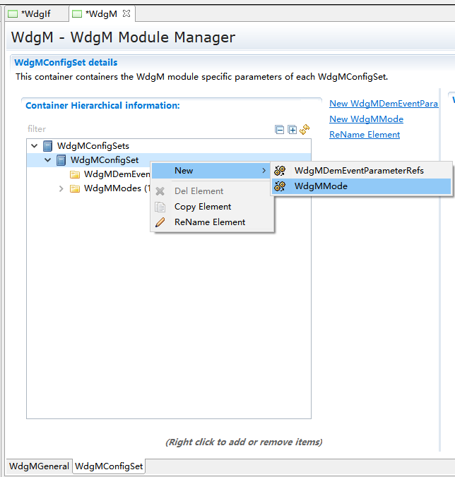

   图 5‑28 配置WdgMMode

9. Expired Supervision Cycle Tol配置为0。

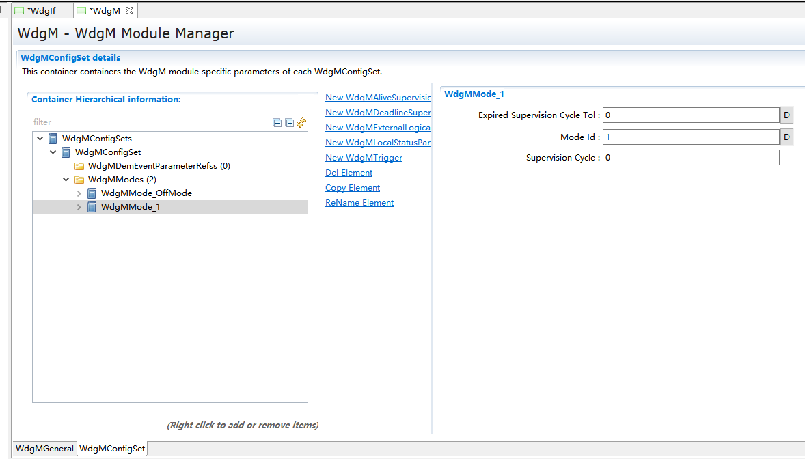

   图 5‑29 配置Expired Supervision Cycle Tol

10. WdgMMode_0->New，新建WdgMAliveSupervision和WdgLocalStatusParams。

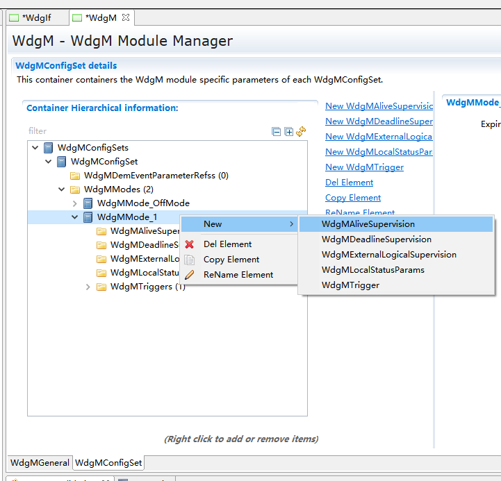

   图 5‑30新建WdgMAliveSupervision和WdgLocalStatusParams

11. 选择本地状态监控实体参考监控实体0.监控失败门限配置为0。

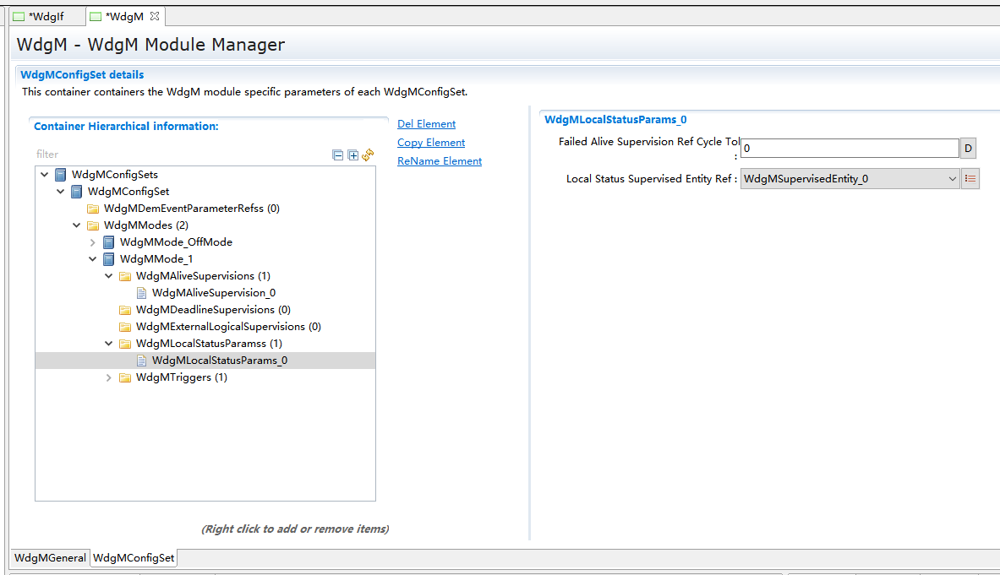

   图 5‑31 配置监控失败门限

12. 配置Alive监控相关参数。

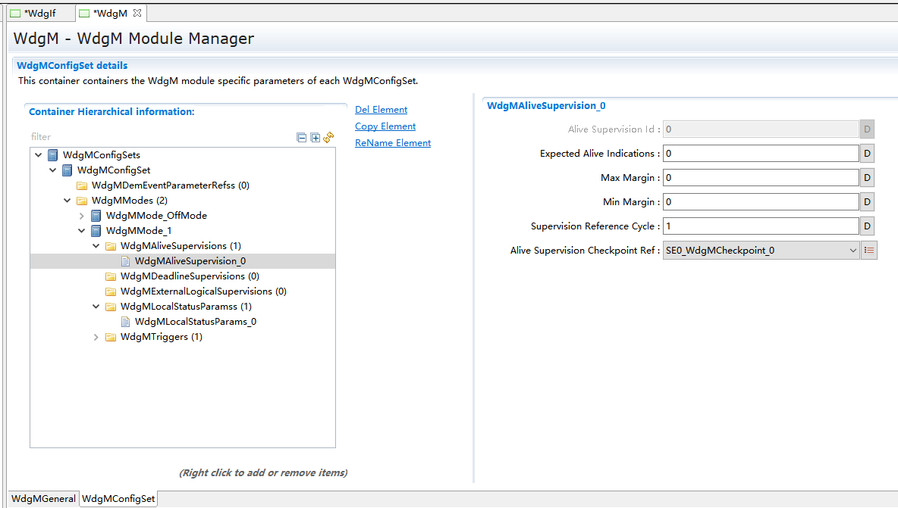

   图 5‑32 配置Alive监控参数

13. 设置触发值为100，看门狗模式为FAST模式。

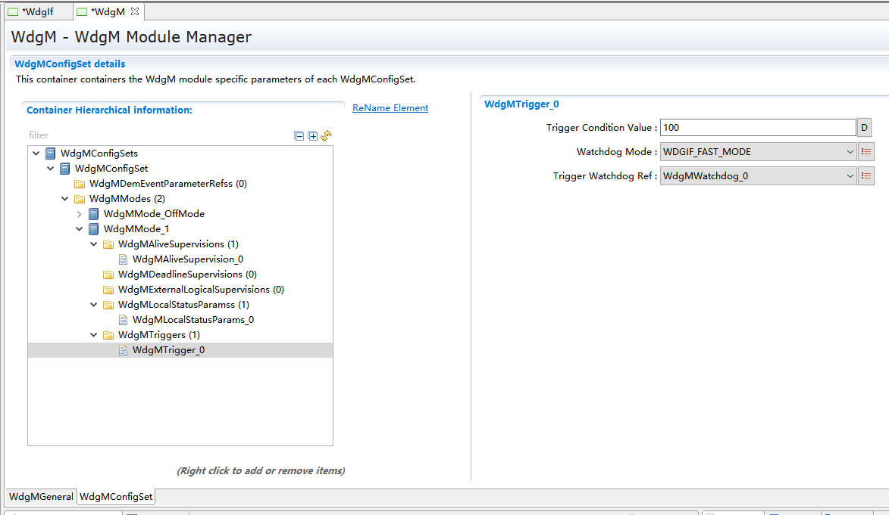

   图 5‑33 配置看门狗模式

14. 选择初始化模式为WdgMMode_1。

.. figure:: ../../_static/集成手册/WDG/image47.png
   :width: 5.2307in
   :height: 2.97718in

   图 5‑34 配置初始看门狗模式

代码修改如下：

这是Alive
supervision的一个例子。函数WdgM_MainFunction()在50ms任务中执行，函数WdgM_CheckpointReached在50ms任务中执行，因此每执行WdgM_MainFunction()时，WdgM_CheckpointReached中的期望指示是1次。

.. figure:: ../../_static/集成手册/WDG/image_code_1.png
   :width: 5.03585in

配置Deadline Supervision
~~~~~~~~~~~~~~~~~~~~~~~~

#. 添加Wdg驱动头文件。

图 5‑35 添加Wdg驱动头文件

2. 新建WdgIfInternalDevice。

   图 5‑36 新建WdgIfInternalDevice

3. 添加驱动接口函数。

   图 5‑37 添加驱动接口函数

4. 配置Address for FIRST_EXPIRED_SEID和Address for
   FIRST_EXPIRED_INVERSE_SEID。

   图 5‑38 配置SEID

5. WdgMGenerals->New,新建一个WdgMSupervisedEntity和一个WdgMWatchdog。

   图 5‑39 新建WdgMSupervisedEntity和WdgMWatchdog

6. 配置Supervised Entity Id 工具默认生成为1。

   图 5‑40 配置Supervised Entity Id

7. WdgSupervisedEntity_0->New,添加WdgMCheckPoint。

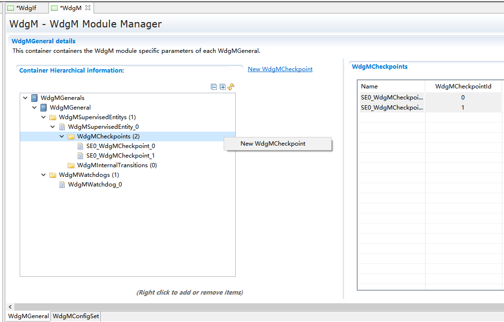

   图 5‑41 添加WdgMCheckPoint

8. 配置WdgMWatchdog_0。

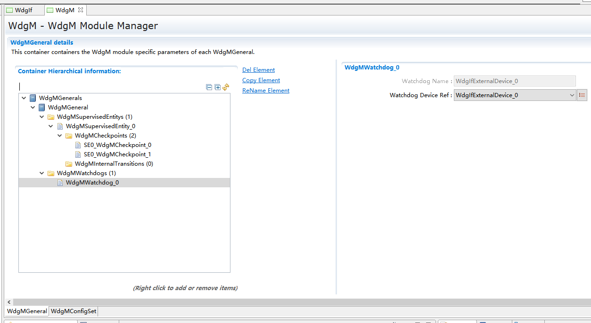

   图 5‑42 配置WdgMWatchdog

9. WdgMConfigSet->New->WdgMMode。

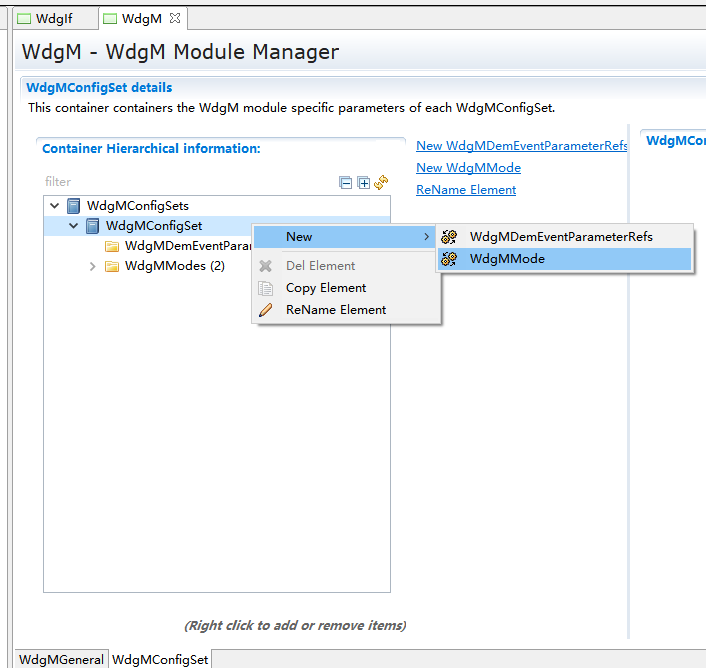

   图 5‑43 新建WdgMMode

10. Expired Supervision Cycle Tol配置为0。

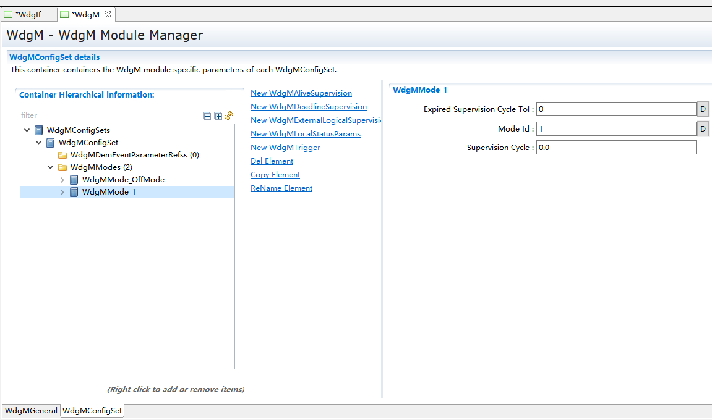

   图 5‑44 配置Expired Supervision Cycle Tol

11. WdgMMode_1->New，新建WdgMDeadLineSupervision和WdgLocalStatusPa
    rams。

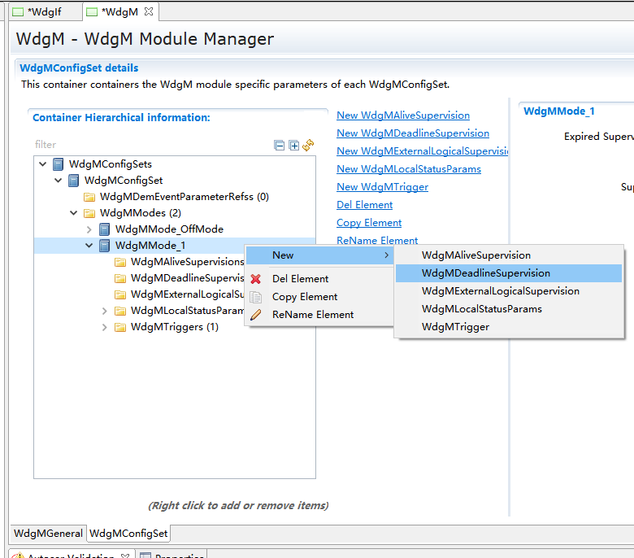

   图 5‑45 新建WdgMDeadLineSupervision和WdgLocalStatusParams

12. 选择本地状态监控实体参考监控实体0.监控失败门限配置为0。

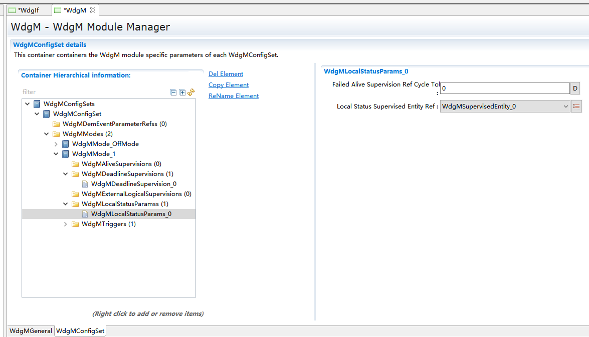

   图 5‑46 配置监控失败门限

13. 配置Deadline监控相关参数。

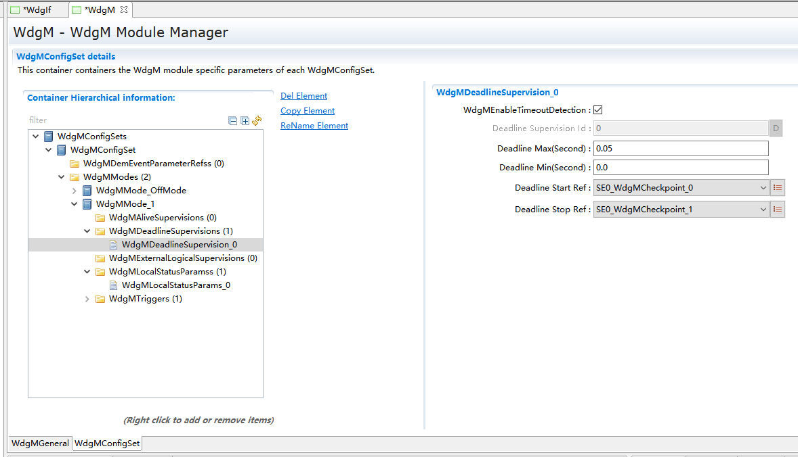

   图 5‑47 配置Deadline监控相关参数

14. 设置触发值为100，看门狗模式为FAST模式。

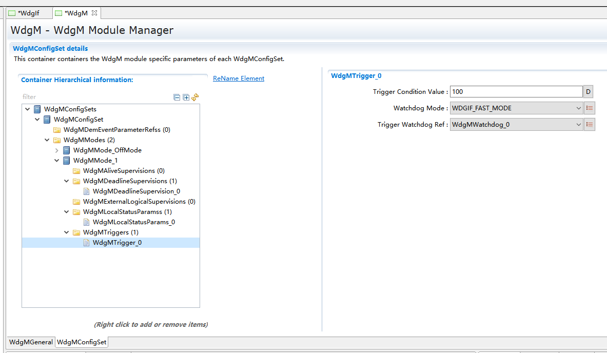

   图 5‑48 配置看门狗模式

15. 选择初始化模式为WdgMMode_1。

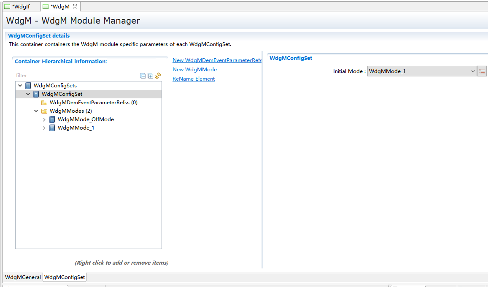

   图 5‑49 配置看门狗初始模式

注意：

#. 在同一个DeadLine supervision的配置中，start ref和stop
   ref配置为同一个checkpoint。

#. 在Deadline的配置中，如果配置checkpoint形成链路的情况下，同一个checkpoint不能用做多个Deadline的start
   ref。

代码修改如下：

这是Deadline supervision的一个例子。WdgMDeadlineMax =
0.05，WdgMDeadlineMin = 0，表示两个CP之间的时间不超过50ms。

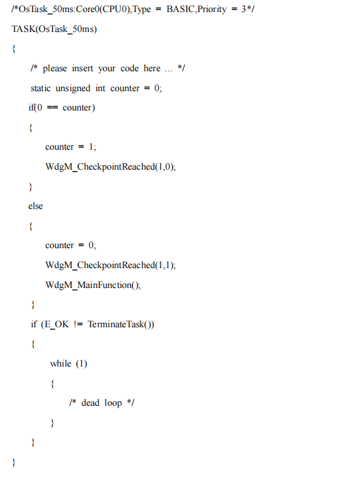

配置Logical Supervision
~~~~~~~~~~~~~~~~~~~~~~~

#. 添加Wdg驱动头文件。

   图 5‑50 添加Wdg驱动头文件

2. 新建WdgIfInternalDevice。

   图 5‑51 新建WdgIfInternalDevice

3. 添加驱动接口函数。

   图 5‑52 添加驱动接口函数

4. 配置Address for FIRST_EXPIRED_SEID和Address for
   FIRST_EXPIRED_INVERSE_SEID。

   图 5‑53 配置SEID

5. WdgMGenerals->New,新建一个WdgMSupervisedEntity和一个WdgMWatchdog。

   图 5‑54 新建WdgMSupervisedEntity和WdgMWatchdog

6. WdgSupervisedEntity_0->New,添加WdgMCheckPoint和WdgMInternalTransm
   ition。

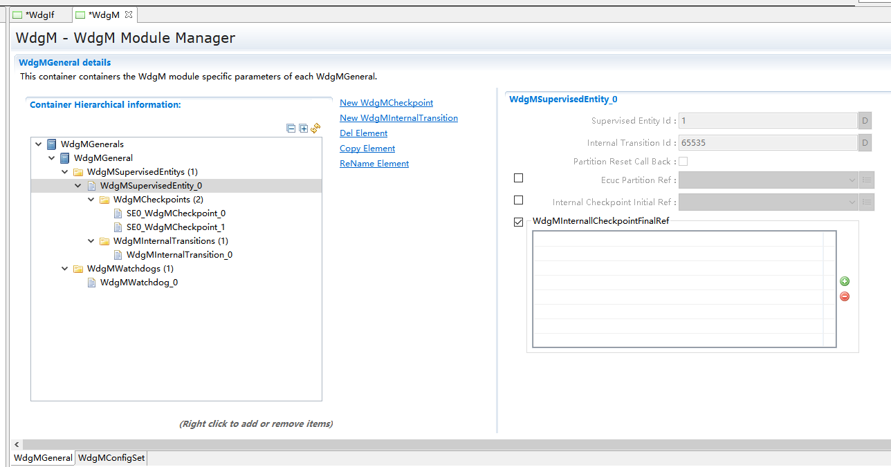

   图 5‑55 添加WdgMCheckPoint和WdgMInternalTransmition

7. 配置Supervised Entity Id
   为大于0的值，该例程配置为1。设置初始化监控点为SE0CP0,结束监控点为SE0CP1。

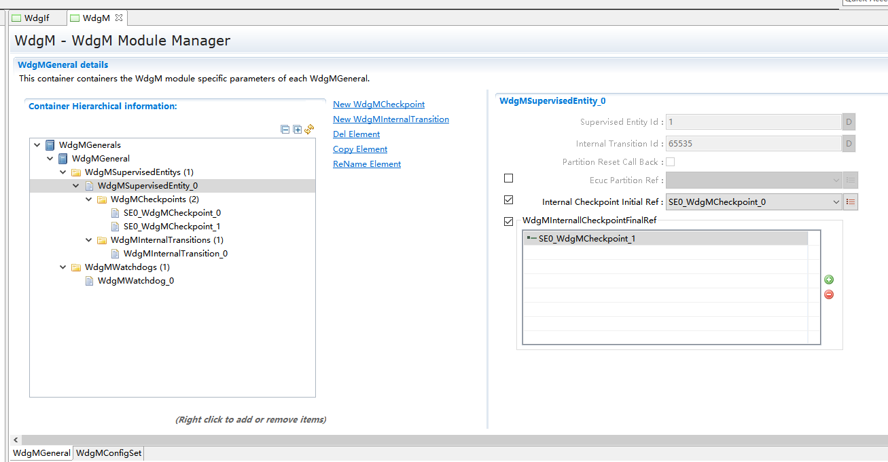

   图 5‑56 配置监控点

8. 设置WdgInternalTransmision起始为SE0CP0，终止为SE0CP1。

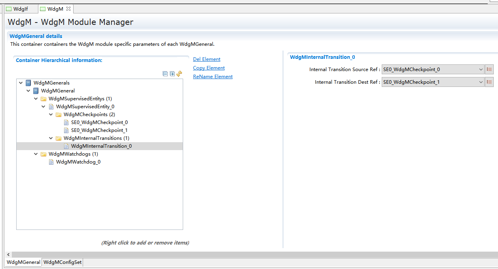

   图 5‑57 配置WdgInternalTransmision

9. 配置WdgMWatchdog_0。

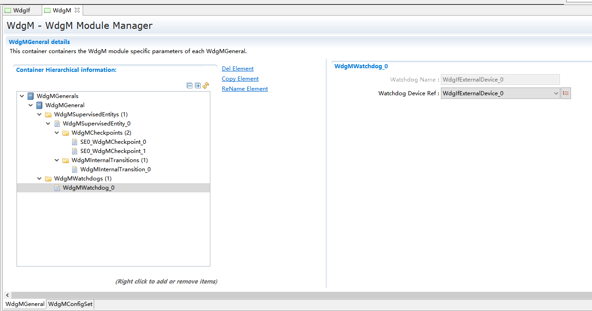

   图 5‑58 配置WdgMWatchdog

10. WdgMConfigSet->New->WdgMMode。

.. figure:: ../../_static/集成手册/WDG/image61.png
   :width: 4.13302in
   :height: 4.21016in

   图 5‑59 新建WdgMMode

11. Expired Supervision Cycle Tol配置为0。

.. figure:: ../../_static/集成手册/WDG/image62.png
   :width: 4.23051in
   :height: 2.39874in

   图 5‑60 配置Expired Supervision Cycle Tol

12. WdgMMode_0->New，新建WdgLocalStatusParams。

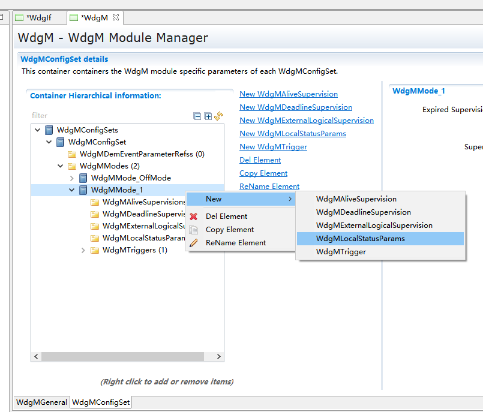

   图 5‑61 新建WdgLocalStatusParams

13. 选择本地状态监控实体参考监控实体0.监控失败门限配置为0。

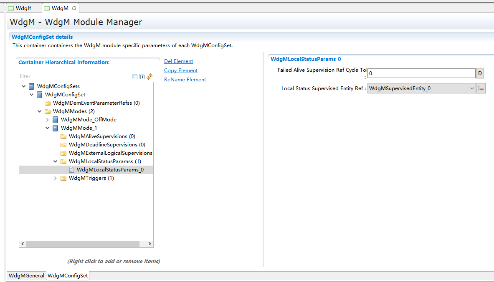

   图 5‑62 配置监控失败门限

14. 设置触发值为100，看门狗模式为FAST模式。

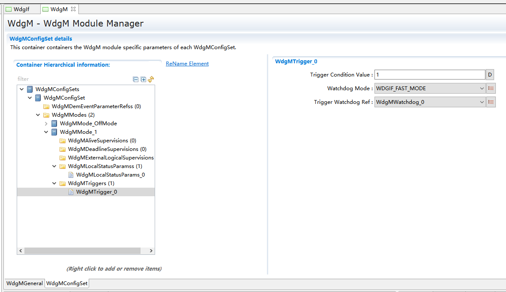

   图 5‑63 配置看门狗模式

15. 选择初始化模式为WdgMMode_1。

.. figure::../../_static/集成手册/WDG/image66.png
   :width: 4.59465in
   :height: 2.64504in

   图 5‑64 配置看门狗初始模式

代码修改如下：

这是Internal logical
supervision的一个例子。这两个CP属于同一监控实体。CP必须以正确的顺序执行。

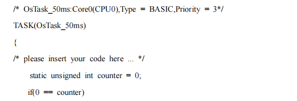

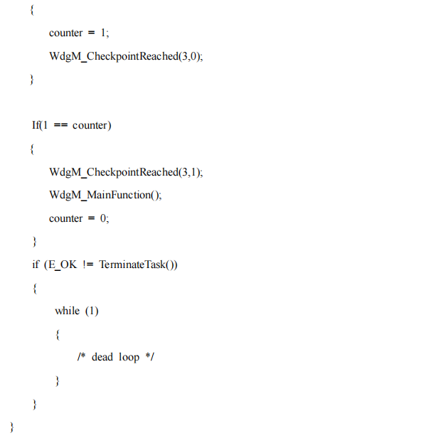

WDG调度集成
-----------

WDG调度集成步骤如下：

#. WDG调度集成，需要逐一排查并实现表 4‑4
   WDG集成约束清单所罗列的问题，以避免集成出现差错。

#. 编译链接代码，将生成的elf文件烧写进芯片。

注意 :
本示例中，WDG初始化的代码置于OsTaskInit，并不代表其他项目同样适用于将其置于OsTaskInit中。

初始化代码如下：

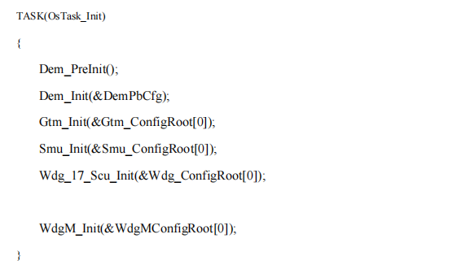

监控代码根据不同的解控实例，监控点放置位置，WdgM_MainFunction放置位置，请参考5.2.3,5.2.4,5.2.5章节

验证结果
--------

验证Alive Supervision
~~~~~~~~~~~~~~~~~~~~~

将工程编译通过后，使用PE调试工具进行调试，当屏蔽WdgM_CheckpointReached(1,0)后，编译下载仿真时，在编译环境中观察到发生复位。

当不屏蔽WdgM_CheckpointReached(1,0)后，观测点配置如5.2.3章节,编译下载仿真时，在编译环境中观察未发生复位。

验证Deadline Supervision
~~~~~~~~~~~~~~~~~~~~~~~~

将工程编译通过后，使用PE调试工具进行调试，当WdgM_CheckpointReached(1,0)和WdgM_CheckpointReached(1,1)时间间隔不为50ms时，编译下载仿真时，在编译环境中观察到发生复位。

当两观测点时间间隔为50ms,
即观测点配置如5.2.4章节,编译下载仿真时，在编译环境中观察未发生复位。

验证Logical Supervision
~~~~~~~~~~~~~~~~~~~~~~~

将工程编译通过后，使用PE调试工具进行调试，当执行两次WdgM_CheckpointReached(1,0)，不执行WdgM_CheckpointReached(1,1)，然后执行WdgM_MainFunction检查时，编译下载仿真时，在编译环境中观察到发生复位。

当观测点配置如5.2.5章节,编译下载仿真时，在编译环境中观察未发生复位。

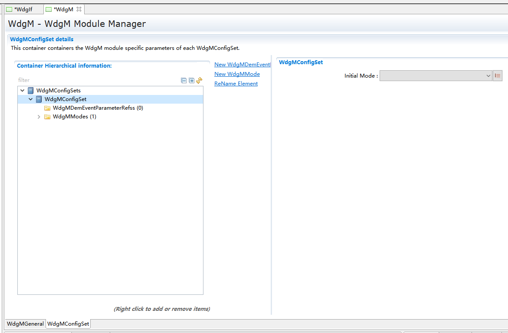
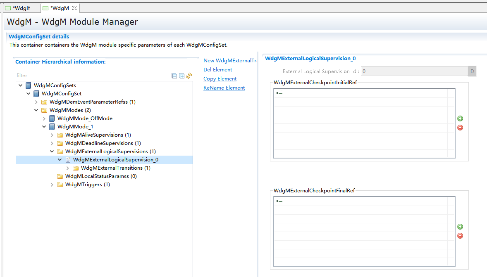
