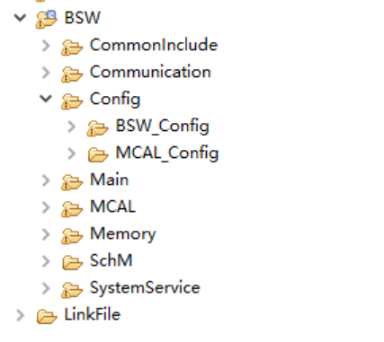

===================
XCP_集成手册
===================

目标
====

本集成手册用于指导客户进行XCP集成，文档主要包括的内容为：协议栈集成指导、基于普通应用的集成示例讲解、项目集成特殊说明。

由于各项目的需求不同，集成示例不会针对于特定的商业项目做详细讲解。

缩写词和术语
============

.. table:: 表 2-1 缩写词和术语

   +---------------+------------------------------------------------------+
   |               | 描述                                                 |
   | 缩写词/术语   |                                                      |
   +---------------+------------------------------------------------------+
   | CanIf         | Can Interface Can通信的接口模块                      |
   +---------------+------------------------------------------------------+
   | XCP           | Universal Calibration Protocol 标定协议栈模块        |
   +---------------+------------------------------------------------------+

参考文档
========

[1] 参考手册_XCP.pdf

[2] CAN通信.pdf

协议栈集成
==========

项目交付的内容为：XCP标定协议栈源码和ORIENTAIS
Configurator配置工具。协议栈细分为协议栈的各模块及其对应的配置工具模块。

XCP标定协议栈各配置模块的功能介绍。

使用协议栈源码和配置工具，进行协议栈的集成的步骤，参见表 4‑2
XCP标定协议栈集成的步骤。

.. table:: 表 4-1 XCP标定协议栈各配置模块介绍

   +---------+------------------------------------------------------------+
   |         | 功能                                                       |
   | 模块名  |                                                            |
   +---------+------------------------------------------------------------+
   | Can     | CAN驱动配置。                                              |
   +---------+------------------------------------------------------------+
   | CanIf   | CanIf模块主要处理上层模块与底层驱动的之间\                 |
   |         | PDU的传递，为上层模块提供统一的接口来管理不同的CAN硬件模块 |
   +---------+------------------------------------------------------------+
   | EcuC    | 用于辅助配置工具完成配置的模块。主\                        |
   |         | 要提供Pdu的定义，其它模块通过关联EcuC中Pdu，相互关联起来。 |
   +---------+------------------------------------------------------------+
   | Xcp     | Xcp模块是标定协议栈                                        |
   +---------+------------------------------------------------------------+

.. table:: 表 4‑2 XCP标定协议栈集成的步骤

   +-----+-------------------------+------------------------------------+
   |     | 操作                    |    说明                            |
   | 步骤|                         |                                    |
   |     |                         |                                    |
   |     |                         |                                    |
   +-----+-------------------------+------------------------------------+
   | 1   | ORIENTAIS               | 若配置工具已经搭建\                |
   |     | Configurator配置工具工\ | ，则仅需进行协议栈模块的加载操作。 |
   |     | 程搭建和协议栈模块加载  |                                    |
   +-----+-------------------------+------------------------------------+
   | 2   | 模块配置及配置文件生成  | NA                                 |
   +-----+-------------------------+------------------------------------+
   | 3   | 代码集成                | 现有工程、                         |
   |     |                         | 协议栈源代码和配置生成文件的集成。 |
   +-----+-------------------------+------------------------------------+
   | 4   | 验证测试                | NA                                 |
   +-----+-------------------------+------------------------------------+

**注意：协议栈集成之前，用户须确保已经有基础工程，且本协议栈相关的其他协议栈能正常工作。**

新建ORIENTAIS Configurator配置工程及模块加载
--------------------------------------------

#. 安装ORIENTAIS Configurator软件后，双击软件图标打开软件。

.. figure:: ../../_static/集成手册/XCP/image1.png
   :width: 5.76389in
   :height: 3.05486in

   图 4-1 新建工程-1

2. 菜单栏File🡪New🡪Project，新建工程。

.. figure:: ../../_static/集成手册/XCP/image2.png
   :width: 5.75625in
   :height: 3.18611in

   图 4-2 新建工程-2

3. 在弹出的新建窗口中选择Autosar下的 [BSW Project]，选择Next。

.. figure:: ../../_static/集成手册/XCP/image3.png
   :width: 4.06777in

   图 4-3 新建工程-3

4. 在弹出的窗口中输入工程名，选择Finish。

.. figure:: ../../_static/集成手册/XCP/image4.png
   :width: 4.06777in

   图 4-4 新建工程-4

5. 在弹出的窗口中选择Yes。

.. figure:: ../../_static/集成手册/XCP/image5.png
   :width: 4.06777in
   :height: 1.90141in

   图 4-5 新建工程-5

6. 选择[Bsw_Builder]，右键单击，选择New ECU Configuration。

.. figure:: ../../_static/集成手册/XCP/image6.png
   :width: 4.29931in
   :height: 1.97778in

   图 4-6 新建工程-6

7. 在弹出的窗口中输入ECU名，然后选择Next。

|image1|

图 4-7 新建工程-7

此处以TC397为例，

用户根据项目芯片进行选择。

8. 在弹出的窗口中勾选需添加的模块，点击Finish。

.. figure:: ../../_static/集成手册/XCP/image8.png
   :width: 3.76389in
   :height: 4.90833in

   图 4-8 新建工程-8

9. 新建工程如下所示，上一步添加的模块已经被加入到工程中。

   图 4-9 新建工程-9

模块配置及生产代码
------------------

模块配置
~~~~~~~~

模块的具体配置，取决于具体的项目需求。该协议栈各模块配置项的详细介绍，参见\ **错误!未找到引用源。**

.. table:: 表 4-3 协议栈各模块配置参考文档

   +--------+----------------------------------------+-------------------+
   |        | 参考文档                               |   说明            |
   | 模块   |                                        |                   |
   +--------+----------------------------------------+-------------------+
   | Can    | MCAL对应的Can配置手册                  |                   |
   +--------+----------------------------------------+-------------------+
   | CanIf  | 参考手册_Can通信.pdf                   |                   |
   +--------+----------------------------------------+-------------------+
   | EcuC   | 参考手册_Can通信.pdf                   |                   |
   +--------+----------------------------------------+-------------------+
   | XCP    | 参考手册_XCP.pdf                       |                   |
   +--------+----------------------------------------+-------------------+

配置代码生成
~~~~~~~~~~~~

#. 在ORIENTAIS
   Configurator主界面左方，选择对应的协议栈，单击右键弹出Validate
   All和Generate All菜单。

.. figure:: ../../_static/集成手册/XCP/image10.png
   :width: 5.76667in
   :height: 2.12569in

   图 4-10 配置代码的生成-1

2. 选择Validate
   All对本协议栈各配置选项进行校验，没有错误提示信息即校验通过。若有错误信息，请按照错误提示修改。

3. 选择Generate
   All，生成配置文件。右下角的Console窗口输出生成的配置文件信息。

.. figure:: ../../_static/集成手册/XCP/image11.png
   :width: 3.88611in
   :height: 1.47153in

   图 4-11 配置代码的生成-2

4. 将ORIENTAIS Configurator切换到Resource模式，即可查看生成的配置文件。

.. figure:: ../../_static/集成手册/XCP/image12.png
   :width: 5.75in
   :height: 2.87778in

   图 4-12 配置代码的生成-3

功能集成
--------

代码集成
~~~~~~~~

协议栈代码包括两部分：项目提供的协议栈源码和ORIENTAIS
Configurator配置生成代码。

用户须将协议栈源码和章节4.2.2生成的源代码添加到集成开发工具的对应文件夹。协议栈集成的文件结构，见章节5.3。

**注意：协议栈集成之前，用户须确保已经有基础工程，且本协议栈相关的其他协议栈能正常工作。**

集成注意事项
~~~~~~~~~~~~

对于集成过程中，协议栈特殊要求和用户经常出现的问题，归类总结形成 表
4‑4协议栈集成约束清单。用户需逐一排查表中的约束项，以避免集成问题出现。

.. table:: 表 4-4 XCP标定协议栈集成约束清单

   +------+---------+-----------------------------------------------------+
   |      |         |   约束限制                                          |
   |编号  | 类别    |                                                     |
   |      |         |                                                     |
   |      |         |                                                     |
   +------+---------+-----------------------------------------------------+
   |      | 堆栈    | 用户需确保为任务堆栈和中断堆栈分\                   |
   | 1    |         | 配足够的堆栈空间。尤其是需要使用RAM来实现页切换功能 |
   +------+---------+-----------------------------------------------------+
   |      | 头文件  |-  添加协议栈代码之后，用户需更新集成开发工具中的头\ |
   | 2    |         |   文件路径。                                        |
   |      |         |-  调用协议栈API的源文件，需要包含协议栈的头文件。   |
   +------+---------+-----------------------------------------------------+
   |      | 初始化  | Xcp_Init，这个初始化没有实\                         |
   | 3    |         | 际上的顺序，只需要保证在周期函数调用前被调用即可。  |
   +------+---------+-----------------------------------------------------+
   |      |         | Xcp_MainFunction需要保证是在10ms或者更短周期任务\   |
   | 4    | 周期函数| 内被调用，Xcp_EventIndication这                     |  
   |      |         | 个API需要被所配置的DAQ的时间周期的周期性任务调用。  |
   +------+---------+-----------------------------------------------------+
   |      | 系统文件| 需要在系统文件内，将标定协议栈所使用\               |
   | 5    | (.ld)   | 的RAM和FLASH独立出来，并且将FLASH的地址重载到RAM。  |
   +------+---------+-----------------------------------------------------+
   |      | A2L文件 | 合成CANape能使用的A2L文件                           |
   | 6    |         |                                                     |
   +------+---------+-----------------------------------------------------+

集成示例
========

本章节通过XCP标定协议栈为例，向用户展示XCP标定协议栈的集成过程。用户可以据此熟悉XCP标定协议栈配置工具的配置过程，以及如何应用配置工具生成的配置文件。

为让用户更清晰的了解工具的使用，所用的配置均逐一手动完成。关于Can驱动的配置，请参考Can配置手册。CanIf配置的具体操作请参照《参考手册_XCP.pdf》。

**注意：本示例不代表用户的实际配置情况，用户需要根据自己的实际需求，决定各个参数的配置。**

集成目标
--------

客户能通过第三方标定工具（CANape或INCA）对汽车电子电控单元进行参数标定，为其提供数据标定、数据上传及相关通信服务的软件模块。同时，还可以为用户提供基于XCP协议的Flash刷写功能。软件模块运行在汽车电子电控单元系统中，实现标定工具与电控单元的主-从通讯，执行标定工具发出的各项命令，完成基于CAN通信协议的数据上传和数据标定。

XCP模块必须实现参数在线标定、数据同步上传、数据同步（STIM）下载三大功能组；支持DAQ列表动态配置、数据时间戳传输、数据块传输模式、Bypassing、Seed&Key解锁和Resume等功能。同时支持Flash刷写命令组。根据AUTOSAR标准及开发目的XCP协议栈需要实现的命令如下表所示。其中命令名后有*的是可选命令。标定协议栈主要包含三个部分\ **：**

.. table:: 表 5-1 XCP标定协议栈命令实现清单

   +--------------+-----------------------------------------+-------------+
   | 命令组       | 命令名                                  | 是否实现    |
   +--------------+-----------------------------------------+-------------+
   | 标准命令组   | CONNECT                                 | 是          |
   +--------------+-----------------------------------------+-------------+
   |              | DISCONNECT                              | 是          |
   +--------------+-----------------------------------------+-------------+
   |              | GET_STATUS                              | 是          |
   +--------------+-----------------------------------------+-------------+
   |              | SYNCH                                   | 是          |
   +--------------+-----------------------------------------+-------------+
   |              | GET_COMM_MODE_INFO\*                    | 是          |
   +--------------+-----------------------------------------+-------------+
   |              | GET_ID\*                                | 是          |
   +--------------+-----------------------------------------+-------------+
   |              | SET_REQUEST\*                           | 否          |
   +--------------+-----------------------------------------+-------------+
   |              | GET_SEED\*                              | 是          |
   +--------------+-----------------------------------------+-------------+
   |              | UNLOCK\*                                | 是          |
   +--------------+-----------------------------------------+-------------+
   |              | SET_MTA\*                               | 是          |
   +--------------+-----------------------------------------+-------------+
   |              | UPLOAD\*                                | 是          |
   +--------------+-----------------------------------------+-------------+
   |              | SHORT_UPLOAD\*                          | 是          |
   +--------------+-----------------------------------------+-------------+
   |              | BUILD_CHECKSUM\*                        | 是          |
   +--------------+-----------------------------------------+-------------+
   |              | TRANSPORT_LAYER_CMD\*                   | 是          |
   +--------------+-----------------------------------------+-------------+
   |              | GET_SLAVE_ID\*                          | 是          |
   +--------------+-----------------------------------------+-------------+
   |              | GET_DAQ_ID\*                            | 否          |
   +--------------+-----------------------------------------+-------------+
   |              | SET_DAQ_ID\*                            | 否          |
   +--------------+-----------------------------------------+-------------+
   |              | USER_CMD\*                              | 否          |
   +--------------+-----------------------------------------+-------------+
   | 标定命令组   | DOWNLOAD                                | 是          |
   +--------------+-----------------------------------------+-------------+
   |              | DOWNLOAD_NEXT\*                         | 是          |
   +--------------+-----------------------------------------+-------------+
   |              | DOWNLOAD_MAX\*                          | 是          |
   +--------------+-----------------------------------------+-------------+
   |              | SHORT_DOWNLOAD\*                        | 是          |
   +--------------+-----------------------------------------+-------------+
   |              | MODIFY_BITS\*                           | 是          |
   +--------------+-----------------------------------------+-------------+
   | 页切换命令组 | SET_CAL_PAGE\*                          | 是          |
   +--------------+-----------------------------------------+-------------+
   |              | GET_CAL_PAGE\*                          | 是          |
   +--------------+-----------------------------------------+-------------+
   |              | GET_PAG_PROCESSOR_INFO\*                | 否          |
   +--------------+-----------------------------------------+-------------+
   |              | GET_SEGMENT_INFO\*                      | 否          |
   +--------------+-----------------------------------------+-------------+
   |              | GET_PAGE_INFO\*                         | 否          |
   +--------------+-----------------------------------------+-------------+
   |              | SET_SEGMENT_MODE\*                      | 否          |
   +--------------+-----------------------------------------+-------------+
   |              | GET_SEGMENT_MODE\*                      | 否          |
   +--------------+-----------------------------------------+-------------+
   |              | COPY_CAL_PAGE\*                         | 否          |
   +--------------+-----------------------------------------+-------------+
   | DAQ/ST\      | SET_DAQ_PTR                             | 是          |
   | IM基本命令组 |                                         |             |
   +--------------+-----------------------------------------+-------------+
   |              | WRITE_DAQ                               | 是          |
   +--------------+-----------------------------------------+-------------+
   |              | SET_DAQ_LIST_MODE                       | 是          |
   +--------------+-----------------------------------------+-------------+
   |              | START_STOP_DAQ_LIST                     | 是          |
   +--------------+-----------------------------------------+-------------+
   |              | START_STOP_SYNCH                        | 是          |
   +--------------+-----------------------------------------+-------------+
   |              | WRITE_DAQ_MULTIPLE\*                    | 否          |
   +--------------+-----------------------------------------+-------------+
   |              | READ_DAQ\*                              | 是          |
   +--------------+-----------------------------------------+-------------+
   |              | GET_DAQ_CLOCK\*                         | 是          |
   +--------------+-----------------------------------------+-------------+
   |              | GET_DAQ_PROCESSOR_INFO\*                | 是          |
   +--------------+-----------------------------------------+-------------+
   |              | GET_DAQ_RESOLUTION_INFO\*               | 是          |
   +--------------+-----------------------------------------+-------------+
   |              | GET_DAQ_LIST_MODE\*                     | 是          |
   +--------------+-----------------------------------------+-------------+
   |              | GET_DAQ_EVENT_INFO\*                    | 是          |
   +--------------+-----------------------------------------+-------------+
   | 静态D\       | CLEAR_DAQ_LIST                          | 是          |
   | AQ配置命令组 |                                         |             |
   +--------------+-----------------------------------------+-------------+
   |              | GET_DAQ_LIST_INFO\*                     | 是          |
   +--------------+-----------------------------------------+-------------+
   | 动态D\       | FREE_DAQ                                | 是          |
   | AQ配置命令组 |                                         |             |
   +--------------+-----------------------------------------+-------------+
   |              | ALLOC_DAQ                               | 是          |
   +--------------+-----------------------------------------+-------------+
   |              | ALLOC_ODT                               | 是          |
   +--------------+-----------------------------------------+-------------+
   |              | ALLOC_ODT_ENTRY                         | 是          |
   +--------------+-----------------------------------------+-------------+
   | Fla\         | PROGRAM_START                           | 是          |
   | sh刷写命令组 |                                         |             |
   +--------------+-----------------------------------------+-------------+
   |              | PROGRAM_CLEAR                           | 是          |
   +--------------+-----------------------------------------+-------------+
   |              | PROGRAM                                 | 是          |
   +--------------+-----------------------------------------+-------------+
   |              | PROGRAM_RESET                           | 是          |
   +--------------+-----------------------------------------+-------------+
   |              | GET_PGM_PROCESSOR_INFO\*                | 是          |
   +--------------+-----------------------------------------+-------------+
   |              | GET_SECTOR_INFO\*                       | 是          |
   +--------------+-----------------------------------------+-------------+
   |              | PROGRAM_PREPARE\*                       | 否          |
   +--------------+-----------------------------------------+-------------+
   |              | PROGRAM_FORMAT\*                        | 是          |
   +--------------+-----------------------------------------+-------------+
   |              | PROGRAM_NEXT\*                          | 是          |
   +--------------+-----------------------------------------+-------------+
   |              | PROGRAM_MAX\*                           | 是          |
   +--------------+-----------------------------------------+-------------+
   |              | PROGRAM_VERIFY\*                        | 否          |
   +--------------+-----------------------------------------+-------------+

备注:PROGRAM这部分的命令适用于基于XCP的Bootloader。

模块的配置
----------

新建配置工程及模块加载操作，请参考本文档4.2章节。

XCP模块配置
~~~~~~~~~~~

#. 双击XCP模块，打开XCP模块的配置界面。

.. figure:: ../../_static/集成手册/XCP/image13.png
   :width: 5.75694in
   :height: 2.92222in

   图 5-1 XcpGeneral配置界面

2. 在XcpGeneral下，有Bus Interface Select、Optional API、DAQ
   Format和General Settings四个配置项。

在DAQ Format和General Settings中，按照图示配置DAQ为动态，保存
的buffer为1024。DAQ的overload不需要Indication。XCP的配置生成的
a2l文件是供CANape使用。不需要timestamp。

若需要使用polling模式，则需要打开XcpMeasurementPollingSupport开关，
同时需要在XcpSegmentInfo页中配置观测地址。

.. figure:: ../../_static/集成手册/XCP/image14.png
   :width: 5.75764in
   :height: 3.40833in

   图 5-2 XcpCommand配置界面

3. XcpCommand配置，该配置是根据情况勾选所需要的实现的XCP的命令。一般为了安全起见，PGM的功能都是不需要的。该功能是供XCP的Bootloader使用的。

.. figure:: ../../_static/集成手册/XCP/image15.png
   :width: 4.52569in
   :height: 3.25625in

   图 5-3 XcpConfig配置界面-1
..

4. XcpComfig中XcpPdus配置：

   XcpRxPdu中的XcpRxPduRef选择Xcp_Cmd(配置在EcuC中)

   XcpTxPdu中的XcpTxPduRef选择Xcp_Rsp(配置在EcuC中)

5. XcpComfig中XcpDaqList配置：

   将XcpDaqList->XcpDtos->XcpDto中的XcpDto2PduMapping选择XcpTxPdu。

   图 5-4 XcpConfig配置界面-2

.. figure:: ../../_static/集成手册/XCP/image17.png
   :width: 5.76458in
   :height: 2.89653in

   图 5-5 XcpSegmentInfo配置界面-1

6. XcpMeasuremenAddr的地址是当前芯片RAM的所有观测量有效地址。默认是整个RAM，也可以根据实际情况填写。

   XcpSegmentInfo标签页下有一个顶层的容器[XcpSegmentInfos]，容器 [X\
   cpSegmentInfos]有一个子容器[XcpSegmentInfo]。在子容器 [XcpSegm\
   entInfo]右边的配置项根据客户需要进行填写。

.. figure:: ../../_static/集成手册/XCP/image18.png
   :width: 5.18889in
   :height: 3.05in

   图 5-6 XcpSegmentInfo配置界面-2

   在容器[XcpSegmentInfo]下有子容器[XcpPageInfo],右边的配置项根据客户\
   需求进行填写。右边填写的是，标定变量在FLASH和RAM中的地址以及 大小。

.. figure:: ../../_static/集成手册/XCP/image19.png
   :width: 5.76597in
   :height: 4.30694in

   图 5-7 XcpSectorInfo配置界面

7. XcpSectorInfo标签页下有一个顶层的容器[XcpSectorInfos]，点右边可以新建子容器[XcpSectorInfo]。

.. figure:: ../../_static/集成手册/XCP/image20.png
   :width: 5.76111in
   :height: 2.08125in

   图 5-8 XcpSectorInfo配置界面

8. 点击容器[XcpSectorInfo]，右边的配置项根据客户需要进行配置。Sector的界面主要是配置FLASH的擦写的地址信息。由于Flash擦除的时候需要整个sector擦除，因此有可能存在擦除的地址长度跟标定的使用的地址长度不一致的情况。

源代码集成
----------

项目交付给用户的工程结构如下：

   图 5-9 工程结构目录

-  Bsw_Config目录，这个目录用来存放配置工具生成的配置文件，Xcp有关的配置文件放在Bsw_Config文件夹下。

-  BSW目录，存放BSW相关模块的源代码.

XCP标定协议栈源代码集成步骤如下：

#. 将\ **5.2**\ 章节中MCAL生成的CAN模块配置文件和ORIENTAIS
   Configurator生成 的配置文件复制到Config\\Mcal_Config文件夹中；

#. 将MCAL提供的CAN模块源码和项目提供的协议栈源代码文件复制到BS
   W\\Mcal文件夹中。

协议栈调度集成
--------------

XCP标定协议栈调度集成步骤如下：

#. 协议栈调度集成，需要逐一排查并实现表 5‑2协议栈集成约束清单
   所罗列的问题，以避免集成出现差错。

#. 编译链接代码，将生成的elf文件烧写进芯片。

XCP标定协议栈有关的代码，在下方的main.c文件中给出重点标注。

**注意 :
本示例中，**\ XCP标定协议栈\ **初始化的代码和启动通信的代码置于main.c文件，并不代表其他项目同样适用于将其置于main.c文件中。**

.. figure:: ../../_static/集成手册/XCP/image_code_1.png
   :width: 5.76736in

代码集成过程中会涉及到标定变量ROM和RAM的区域划分，标定变量需要设置ROM和RAM两个区域，观测量只涉及RAM区域，将划分好地址区域放到工程的链接文件Lcf_Gnuc_Tricore_Tc.ld中。以下是地址划分时需要注意的项（配置工具ORIENTAIS
Configurator，编译器HighTec Development Platform Version 2.3.1）。

#. Memory中根据标定所需的大小划分RAM和ROM起始地址及地址长度。

.. figure:: ../../_static/集成手册/XCP/image22.png
   :width: 5.15in
   :height: 4.47083in

   图 5-10 标定量和观测量RAM和ROM划分参考图

2. 在链接文件中标定对象地址要定义为禁止软件优化且不可更改的地址，
   观测对象要配置为禁止软件优化的变量，为了防止代码被工具优化，可
   以使用volatile定义标定和观察量；

.. figure:: ../../_static/集成手册/XCP/image23.png
   :width: 5.47778in
   :height: 2.61181in

   图 5-11 标定量和观测量定义参考图

3. 在链接文件中创建clear和copy表，分别告诉启动代码要清除和复制的地址区域。

  

.. figure:: ../../_static/集成手册/XCP/image24.png
   :width: 5.76736in
   :height: 4.11111in

   图 5-12 clear和copy表创建参考图

   图 5-13 相关地址名称定义参考图

**注意：本章节属于不同的编译器或者同一种编译不同版本都会不一样，在此仅供参考**

验证结果
--------

根据集成目标，能够跟CANape正常通信，以下是验证结果：

.. figure:: ../../_static/集成手册/XCP/image26.png
   :width: 5.76736in
   :height: 4.52917in

   图 5-14 时间同步模块验证结果

.. |image1| image:: ../../_static/集成手册/XCP/image7.png
   :width: 3.72569in
   :height: 3.53472in
